# Introduction

Researchers have previous suggested that the response diversity of a
community be measured by the diversity of responses to environmental
change. For example, one can measure the response of each of the
species' intrinsic growth rate to temperature, quantify the strength and
direction of these responses (e.g., as the first derivative of the
response curve), and calculate the diversity of responses (e.g., by
calculating variation in the first derivatives among the species in a
community). When responses are nonlinear, the response diversity will be
a function of the environmental state (i.e. the first derivative is a
function of the value of the environmental state). So far we
demonstrated this approach for quantifying response diversity in the
context of a single environmental factor, but given that multiple
environmental factors can change simultaneously, we need an approach
that works in that context.

# The principle

*To learn about the mathematical principles watch these youtube videos:*

-   [Surfaces and Partial
    Derivatives](https://www.youtube.com/watch?v=k4wNIZr8GU4)
-   [54. Slope of the Surface in Any Direction - Directional Derivative,
    and Properties of the
    Gradient](https://www.youtube.com/watch?v=wfjipWmyRYg)

Imagine that the growth rate of a population depends on two
environmental factors, e.g. temperature and salinity. We can represent
the dependency as $G = f(T, S)$, where $G$ is growth rate, $T$ is
temperature, and $S$ is salinity. It may be that the dependencies are
linear, nonlinear, and with an interaction between temperature and
salinity, hence our approach needs to be able to accommodate this
phenomena.

The response of growth rate to change in temperature and salinity is the
gradient / slope of this surface, with units of growth rate [per time]
per temperature [degrees C] per salinity [parts per thousand]. Because
the slope (first derivative) of the surface can (when dependencies are
nonlinear) vary across the surface (location on the surface), and can
vary in different directions on the surface, to calculate a slope we
must specify the current environment (location on the surface) and the
direction of change in the environment. The location on the curve is the
current environmental condition, $(T_0, S_0)$, and the direction of
environmental change is the unit vector
$\hat{u} = \langle U_T, U_S \rangle$.

Put another way, we calculate a directional derivative at a point on the
response surface. We can write this as $D_{\hat{u}}f(T_0, S_0)$ and can
calculate it as $f_T(T_0, S_0)U_T + f_S(T_0, S_0)U_S$, where $f_T$ is
the partial derivative of $f(T, S)$ with respect to $T$ and $f_S$ is the
partial derivative of $f(T, S)$ with respect to $S$.

Efficient evaluating in $n$ dimensions can be done by taking the dot
product of the partial derivatives at the location and the direction
unit vector: $D_{\hat{u}}f(T_0, S_0) = \triangledown f \cdot \hat{u}$
where, $\triangledown f = \langle f_T, f_S \rangle$. (In R, the dot
product of `a` and `b` is `sum(a*b)`)

Figure \@ref(fig:surface-sketch) is an illustration of the principle of
directional derivatives on a surface.

(ref:surface-sketch) This figure needs considerable improvement! It is
currently a keynote illustration.

<div class="figure" style="text-align: center">

<p class="caption">(\#fig:surface-sketch)(ref:surface-sketch)</p>
</div>

# A simulated empirical example

Numerous mathematical functions have been used to represent how
organismal performance changes with an environmental driver.
Moreover, multiple mathematical functions have been used to
represent an interactive effect of two or more environmental drivers on
species performance [e.g. Thomas et al
2017](https://onlinelibrary.wiley.com/doi/full/10.1111/gcb.13641). 

## Simulating performance curves

Let us use the Eppley performance curve, which was used, for example, in
this paper [Bernhardt et al.
2018](https://royalsocietypublishing.org/doi/10.1098/rspb.2018.1076).

With one environmental variable, the performance (i.e., rate) is given
by:

-   $rate(E) = ae^{bE}(1 - (\frac{E - z}{w/2})^2)$
-   $E$ is the values of the environmental factor.
-   $z$ controls location of maximum.
-   $w$ controls range of $E$ over which the rate is positive.
-   $a$ scaling constant.
-   $b$ controls rate of increase towards the maximum rate, as $E$
    increases.

Adding a second environmental variable gives:

$rate(E_1, E_2) = a_1e^{b_1E_1}(1 - (\frac{E_1 - z_1}{w_1/2})^2) + a_2e^{b_2E_2}(1 - (\frac{E_2 - z_2}{w_2/2})^2)$

In this case, it is clear the effect of $E_1$ and $E_2$ is defined as
being additive. For example, the value of $E_2$ does not affect the
value of $E_1$ at which the rate is maximised ($z_1$), and vice-versa
(see also Figure \@ref(fig:add-epp-fig))


(ref:add-epp-fig) Nonlinear and additive dependence of a rate on two
environmental variables. (a) The value of $E_1$ at which the rate is
maximised is independent of the value of $E_2$. (b) The value of $E_2$
at which the rate is maximised is independent of the value of $E_1$.


*Including an interaction*. One way to do this is to make the value of
$E_1$ at which the rate is maximised depend on the value of $E_2$:

$rate(E_1, E_2) = a_1e^{b_1E_1}(1 - (\frac{(E_1 + z_{int21}*E_2- z_1)}{w_1/2})^2 + a_2e^{b_2E_2}(1 - (\frac{E_2 - z_2}{w_2/2})^2$

When $z_{int21} = 0$ then this equation becomes the previously mentioned
additive one. When $z_{int} \neq 0$ then the value of $E_1$ at which the
rate is maximised is a function of the value of $E_2$. We used this
method for adding an interaction due to its simplicity. Other methods
could be used, and if also or otherwise used could add confidence about
the robustness of the method for calculating response diversity.


(ref:int-epp-fig) Nonlinear and non-additive dependence of a rate on two
environmental variables. (a) The value of $E_1$ at which the rate is
maximised depends on the value of $E_2$. (b) The value of $E_2$ at which
the rate is maximised is independent of the value of $E_1$.


## Simulating multiple species' performance curves

### No interacting environmental effects

First we create (or import) a table of parameter values of each species,
with species in the rows and parameters in the columns. In the following
example, only values of the $z$ parameters differ among the species
(which determine the location of the maximum rate).


```{=html}
<div class="datatables html-widget html-fill-item" id="htmlwidget-801c52c2c787a968772a" style="width:100%;height:auto;"></div>
<script type="application/json" data-for="htmlwidget-801c52c2c787a968772a">{"x":{"filter":"top","vertical":false,"filterHTML":"<tr>\n  <td><\/td>\n  <td data-type=\"number\" style=\"vertical-align: top;\">\n    <div class=\"form-group has-feedback\" style=\"margin-bottom: auto;\">\n      <input type=\"search\" placeholder=\"All\" class=\"form-control\" style=\"width: 100%;\" disabled=\"\"/>\n      <span class=\"glyphicon glyphicon-remove-circle form-control-feedback\"><\/span>\n    <\/div>\n    <div style=\"display: none;position: absolute;width: 200px;opacity: 1\">\n      <div data-min=\"0\" data-max=\"1\" data-scale=\"9\"><\/div>\n      <span style=\"float: left;\"><\/span>\n      <span style=\"float: right;\"><\/span>\n    <\/div>\n  <\/td>\n  <td data-type=\"number\" style=\"vertical-align: top;\">\n    <div class=\"form-group has-feedback\" style=\"margin-bottom: auto;\">\n      <input type=\"search\" placeholder=\"All\" class=\"form-control\" style=\"width: 100%;\" disabled=\"\"/>\n      <span class=\"glyphicon glyphicon-remove-circle form-control-feedback\"><\/span>\n    <\/div>\n    <div style=\"display: none;position: absolute;width: 200px;opacity: 1\">\n      <div data-min=\"0\" data-max=\"1\" data-scale=\"3\"><\/div>\n      <span style=\"float: left;\"><\/span>\n      <span style=\"float: right;\"><\/span>\n    <\/div>\n  <\/td>\n  <td data-type=\"number\" style=\"vertical-align: top;\">\n    <div class=\"form-group has-feedback\" style=\"margin-bottom: auto;\">\n      <input type=\"search\" placeholder=\"All\" class=\"form-control\" style=\"width: 100%;\"/>\n      <span class=\"glyphicon glyphicon-remove-circle form-control-feedback\"><\/span>\n    <\/div>\n    <div style=\"display: none;position: absolute;width: 200px;opacity: 1\">\n      <div data-min=\"270.084014022723\" data-max=\"296.871775598265\" data-scale=\"13\"><\/div>\n      <span style=\"float: left;\"><\/span>\n      <span style=\"float: right;\"><\/span>\n    <\/div>\n  <\/td>\n  <td data-type=\"number\" style=\"vertical-align: top;\">\n    <div class=\"form-group has-feedback\" style=\"margin-bottom: auto;\">\n      <input type=\"search\" placeholder=\"All\" class=\"form-control\" style=\"width: 100%;\" disabled=\"\"/>\n      <span class=\"glyphicon glyphicon-remove-circle form-control-feedback\"><\/span>\n    <\/div>\n    <div style=\"display: none;position: absolute;width: 200px;opacity: 1\">\n      <div data-min=\"0\" data-max=\"1\"><\/div>\n      <span style=\"float: left;\"><\/span>\n      <span style=\"float: right;\"><\/span>\n    <\/div>\n  <\/td>\n  <td data-type=\"number\" style=\"vertical-align: top;\">\n    <div class=\"form-group has-feedback\" style=\"margin-bottom: auto;\">\n      <input type=\"search\" placeholder=\"All\" class=\"form-control\" style=\"width: 100%;\" disabled=\"\"/>\n      <span class=\"glyphicon glyphicon-remove-circle form-control-feedback\"><\/span>\n    <\/div>\n    <div style=\"display: none;position: absolute;width: 200px;opacity: 1\">\n      <div data-min=\"0\" data-max=\"1\" data-scale=\"3\"><\/div>\n      <span style=\"float: left;\"><\/span>\n      <span style=\"float: right;\"><\/span>\n    <\/div>\n  <\/td>\n  <td data-type=\"number\" style=\"vertical-align: top;\">\n    <div class=\"form-group has-feedback\" style=\"margin-bottom: auto;\">\n      <input type=\"search\" placeholder=\"All\" class=\"form-control\" style=\"width: 100%;\" disabled=\"\"/>\n      <span class=\"glyphicon glyphicon-remove-circle form-control-feedback\"><\/span>\n    <\/div>\n    <div style=\"display: none;position: absolute;width: 200px;opacity: 1\">\n      <div data-min=\"0\" data-max=\"1\" data-scale=\"2\"><\/div>\n      <span style=\"float: left;\"><\/span>\n      <span style=\"float: right;\"><\/span>\n    <\/div>\n  <\/td>\n  <td data-type=\"number\" style=\"vertical-align: top;\">\n    <div class=\"form-group has-feedback\" style=\"margin-bottom: auto;\">\n      <input type=\"search\" placeholder=\"All\" class=\"form-control\" style=\"width: 100%;\"/>\n      <span class=\"glyphicon glyphicon-remove-circle form-control-feedback\"><\/span>\n    <\/div>\n    <div style=\"display: none;position: absolute;width: 200px;opacity: 1\">\n      <div data-min=\"10.0129270693287\" data-max=\"26.7779199965298\" data-scale=\"14\"><\/div>\n      <span style=\"float: left;\"><\/span>\n      <span style=\"float: right;\"><\/span>\n    <\/div>\n  <\/td>\n  <td data-type=\"number\" style=\"vertical-align: top;\">\n    <div class=\"form-group has-feedback\" style=\"margin-bottom: auto;\">\n      <input type=\"search\" placeholder=\"All\" class=\"form-control\" style=\"width: 100%;\" disabled=\"\"/>\n      <span class=\"glyphicon glyphicon-remove-circle form-control-feedback\"><\/span>\n    <\/div>\n    <div style=\"display: none;position: absolute;width: 200px;opacity: 1\">\n      <div data-min=\"0\" data-max=\"1\"><\/div>\n      <span style=\"float: left;\"><\/span>\n      <span style=\"float: right;\"><\/span>\n    <\/div>\n  <\/td>\n  <td data-type=\"number\" style=\"vertical-align: top;\">\n    <div class=\"form-group has-feedback\" style=\"margin-bottom: auto;\">\n      <input type=\"search\" placeholder=\"All\" class=\"form-control\" style=\"width: 100%;\" disabled=\"\"/>\n      <span class=\"glyphicon glyphicon-remove-circle form-control-feedback\"><\/span>\n    <\/div>\n    <div style=\"display: none;position: absolute;width: 200px;opacity: 1\">\n      <div data-min=\"0\" data-max=\"1\"><\/div>\n      <span style=\"float: left;\"><\/span>\n      <span style=\"float: right;\"><\/span>\n    <\/div>\n  <\/td>\n  <td data-type=\"number\" style=\"vertical-align: top;\">\n    <div class=\"form-group has-feedback\" style=\"margin-bottom: auto;\">\n      <input type=\"search\" placeholder=\"All\" class=\"form-control\" style=\"width: 100%;\" disabled=\"\"/>\n      <span class=\"glyphicon glyphicon-remove-circle form-control-feedback\"><\/span>\n    <\/div>\n    <div style=\"display: none;position: absolute;width: 200px;opacity: 1\">\n      <div data-min=\"0\" data-max=\"1\"><\/div>\n      <span style=\"float: left;\"><\/span>\n      <span style=\"float: right;\"><\/span>\n    <\/div>\n  <\/td>\n<\/tr>","data":[["1","2","3","4","5","6","7","8","9","10"],[1e-09,1e-09,1e-09,1e-09,1e-09,1e-09,1e-09,1e-09,1e-09,1e-09],[0.063,0.063,0.063,0.063,0.063,0.063,0.063,0.063,0.063,0.063],[270.0840140227228,277.0911623351276,290.8805276826024,286.0165206925012,294.4974396913312,291.0067399148829,281.938274691347,294.50001725927,296.8717755982652,272.5634251185693],[60,60,60,60,60,60,60,60,60,60],[0.001,0.001,0.001,0.001,0.001,0.001,0.001,0.001,0.001,0.001],[0.02,0.02,0.02,0.02,0.02,0.02,0.02,0.02,0.02,0.02],[22.43456760421395,16.46992172580212,10.01292706932873,24.24311844166368,16.17267773486674,25.73636558372527,26.77791999652982,15.46716617885977,23.17856966517866,20.36314472556114],[10,10,10,10,10,10,10,10,10,10],[0,0,0,0,0,0,0,0,0,0],[0,0,0,0,0,0,0,0,0,0]],"container":"<table class=\"display\">\n  <thead>\n    <tr>\n      <th> <\/th>\n      <th>a1<\/th>\n      <th>b1<\/th>\n      <th>z1<\/th>\n      <th>w1<\/th>\n      <th>a2<\/th>\n      <th>b2<\/th>\n      <th>z2<\/th>\n      <th>w2<\/th>\n      <th>z_int21<\/th>\n      <th>sd_rate<\/th>\n    <\/tr>\n  <\/thead>\n<\/table>","options":{"columnDefs":[{"className":"dt-right","targets":[1,2,3,4,5,6,7,8,9,10]},{"orderable":false,"targets":0},{"name":" ","targets":0},{"name":"a1","targets":1},{"name":"b1","targets":2},{"name":"z1","targets":3},{"name":"w1","targets":4},{"name":"a2","targets":5},{"name":"b2","targets":6},{"name":"z2","targets":7},{"name":"w2","targets":8},{"name":"z_int21","targets":9},{"name":"sd_rate","targets":10}],"order":[],"autoWidth":false,"orderClasses":false,"orderCellsTop":true}},"evals":[],"jsHooks":[]}</script>
```

For convenience we then convert the table of parameters into a
[list-column](https://dcl-prog.stanford.edu/list-columns.html). We can
then easily make performance curves of each of the species, and put
those into a list-column in the same table.


``` r
## convert parameter table to a list-column of a tibble
par_list <- Partable_2_parlist(par_table)
## add performance curves
species_pars <- tibble(species = paste0("s", 1:s), pars = par_list) %>%
  rowwise() %>%
  mutate(expt = Make_expt(E1_series, E2_series, pars))
```

Here are some examples of the species' performance curves (only with
additive effects of $E_1$ and $E_2$).

(ref:lowE1-opt-species) Performance curves for a species with maximum
growth at **low** values of $E_1$. Without interacting environmental
effects.

<div class="figure" style="text-align: center">

<p class="caption">(\#fig:lowE1-opt-species)(ref:lowE1-opt-species)</p>
</div>

(ref:highE1-opt-species) Performance curves for a species with maximum
growth at **high** values of $E_1$. Without interacting environmental
effects.

<div class="figure" style="text-align: center">
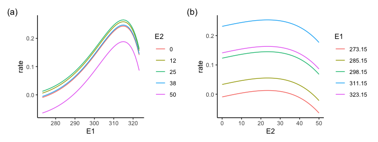
<p class="caption">(\#fig:highE1-opt-species)(ref:highE1-opt-species)</p>
</div>

(ref:lowE2-opt-species) Performance curves for a species with maximum
growth at **low** values of $E_2$. Without interacting environmental
effects.

<div class="figure" style="text-align: center">

<p class="caption">(\#fig:lowE2-opt-species)(ref:lowE2-opt-species)</p>
</div>

(ref:highE2-opt-species) Performance curves for a species with maximum
growth at **high** values of $E_2$. Without interacting environmental
effects.

<div class="figure" style="text-align: center">
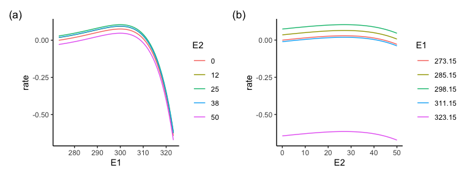
<p class="caption">(\#fig:highE2-opt-species)(ref:highE2-opt-species)</p>
</div>

### Interacting environmental effects

And now with interacting environmental effects...


```{=html}
<div class="datatables html-widget html-fill-item" id="htmlwidget-72c825a07bae6269aded" style="width:100%;height:auto;"></div>
<script type="application/json" data-for="htmlwidget-72c825a07bae6269aded">{"x":{"filter":"top","vertical":false,"filterHTML":"<tr>\n  <td><\/td>\n  <td data-type=\"number\" style=\"vertical-align: top;\">\n    <div class=\"form-group has-feedback\" style=\"margin-bottom: auto;\">\n      <input type=\"search\" placeholder=\"All\" class=\"form-control\" style=\"width: 100%;\" disabled=\"\"/>\n      <span class=\"glyphicon glyphicon-remove-circle form-control-feedback\"><\/span>\n    <\/div>\n    <div style=\"display: none;position: absolute;width: 200px;opacity: 1\">\n      <div data-min=\"0\" data-max=\"1\" data-scale=\"9\"><\/div>\n      <span style=\"float: left;\"><\/span>\n      <span style=\"float: right;\"><\/span>\n    <\/div>\n  <\/td>\n  <td data-type=\"number\" style=\"vertical-align: top;\">\n    <div class=\"form-group has-feedback\" style=\"margin-bottom: auto;\">\n      <input type=\"search\" placeholder=\"All\" class=\"form-control\" style=\"width: 100%;\" disabled=\"\"/>\n      <span class=\"glyphicon glyphicon-remove-circle form-control-feedback\"><\/span>\n    <\/div>\n    <div style=\"display: none;position: absolute;width: 200px;opacity: 1\">\n      <div data-min=\"0\" data-max=\"1\" data-scale=\"3\"><\/div>\n      <span style=\"float: left;\"><\/span>\n      <span style=\"float: right;\"><\/span>\n    <\/div>\n  <\/td>\n  <td data-type=\"number\" style=\"vertical-align: top;\">\n    <div class=\"form-group has-feedback\" style=\"margin-bottom: auto;\">\n      <input type=\"search\" placeholder=\"All\" class=\"form-control\" style=\"width: 100%;\"/>\n      <span class=\"glyphicon glyphicon-remove-circle form-control-feedback\"><\/span>\n    <\/div>\n    <div style=\"display: none;position: absolute;width: 200px;opacity: 1\">\n      <div data-min=\"271.357648316771\" data-max=\"295.299732657149\" data-scale=\"13\"><\/div>\n      <span style=\"float: left;\"><\/span>\n      <span style=\"float: right;\"><\/span>\n    <\/div>\n  <\/td>\n  <td data-type=\"number\" style=\"vertical-align: top;\">\n    <div class=\"form-group has-feedback\" style=\"margin-bottom: auto;\">\n      <input type=\"search\" placeholder=\"All\" class=\"form-control\" style=\"width: 100%;\" disabled=\"\"/>\n      <span class=\"glyphicon glyphicon-remove-circle form-control-feedback\"><\/span>\n    <\/div>\n    <div style=\"display: none;position: absolute;width: 200px;opacity: 1\">\n      <div data-min=\"0\" data-max=\"1\"><\/div>\n      <span style=\"float: left;\"><\/span>\n      <span style=\"float: right;\"><\/span>\n    <\/div>\n  <\/td>\n  <td data-type=\"number\" style=\"vertical-align: top;\">\n    <div class=\"form-group has-feedback\" style=\"margin-bottom: auto;\">\n      <input type=\"search\" placeholder=\"All\" class=\"form-control\" style=\"width: 100%;\" disabled=\"\"/>\n      <span class=\"glyphicon glyphicon-remove-circle form-control-feedback\"><\/span>\n    <\/div>\n    <div style=\"display: none;position: absolute;width: 200px;opacity: 1\">\n      <div data-min=\"0\" data-max=\"1\" data-scale=\"3\"><\/div>\n      <span style=\"float: left;\"><\/span>\n      <span style=\"float: right;\"><\/span>\n    <\/div>\n  <\/td>\n  <td data-type=\"number\" style=\"vertical-align: top;\">\n    <div class=\"form-group has-feedback\" style=\"margin-bottom: auto;\">\n      <input type=\"search\" placeholder=\"All\" class=\"form-control\" style=\"width: 100%;\" disabled=\"\"/>\n      <span class=\"glyphicon glyphicon-remove-circle form-control-feedback\"><\/span>\n    <\/div>\n    <div style=\"display: none;position: absolute;width: 200px;opacity: 1\">\n      <div data-min=\"0\" data-max=\"1\" data-scale=\"2\"><\/div>\n      <span style=\"float: left;\"><\/span>\n      <span style=\"float: right;\"><\/span>\n    <\/div>\n  <\/td>\n  <td data-type=\"number\" style=\"vertical-align: top;\">\n    <div class=\"form-group has-feedback\" style=\"margin-bottom: auto;\">\n      <input type=\"search\" placeholder=\"All\" class=\"form-control\" style=\"width: 100%;\"/>\n      <span class=\"glyphicon glyphicon-remove-circle form-control-feedback\"><\/span>\n    <\/div>\n    <div style=\"display: none;position: absolute;width: 200px;opacity: 1\">\n      <div data-min=\"11.0968862567097\" data-max=\"27.2984294313937\" data-scale=\"14\"><\/div>\n      <span style=\"float: left;\"><\/span>\n      <span style=\"float: right;\"><\/span>\n    <\/div>\n  <\/td>\n  <td data-type=\"number\" style=\"vertical-align: top;\">\n    <div class=\"form-group has-feedback\" style=\"margin-bottom: auto;\">\n      <input type=\"search\" placeholder=\"All\" class=\"form-control\" style=\"width: 100%;\" disabled=\"\"/>\n      <span class=\"glyphicon glyphicon-remove-circle form-control-feedback\"><\/span>\n    <\/div>\n    <div style=\"display: none;position: absolute;width: 200px;opacity: 1\">\n      <div data-min=\"0\" data-max=\"1\"><\/div>\n      <span style=\"float: left;\"><\/span>\n      <span style=\"float: right;\"><\/span>\n    <\/div>\n  <\/td>\n  <td data-type=\"number\" style=\"vertical-align: top;\">\n    <div class=\"form-group has-feedback\" style=\"margin-bottom: auto;\">\n      <input type=\"search\" placeholder=\"All\" class=\"form-control\" style=\"width: 100%;\"/>\n      <span class=\"glyphicon glyphicon-remove-circle form-control-feedback\"><\/span>\n    <\/div>\n    <div style=\"display: none;position: absolute;width: 200px;opacity: 1\">\n      <div data-min=\"-0.242164493335918\" data-max=\"-0.1396200451061\" data-scale=\"15\"><\/div>\n      <span style=\"float: left;\"><\/span>\n      <span style=\"float: right;\"><\/span>\n    <\/div>\n  <\/td>\n  <td data-type=\"number\" style=\"vertical-align: top;\">\n    <div class=\"form-group has-feedback\" style=\"margin-bottom: auto;\">\n      <input type=\"search\" placeholder=\"All\" class=\"form-control\" style=\"width: 100%;\" disabled=\"\"/>\n      <span class=\"glyphicon glyphicon-remove-circle form-control-feedback\"><\/span>\n    <\/div>\n    <div style=\"display: none;position: absolute;width: 200px;opacity: 1\">\n      <div data-min=\"0\" data-max=\"1\"><\/div>\n      <span style=\"float: left;\"><\/span>\n      <span style=\"float: right;\"><\/span>\n    <\/div>\n  <\/td>\n<\/tr>","data":[["1","2","3","4","5","6","7","8","9","10"],[1e-09,1e-09,1e-09,1e-09,1e-09,1e-09,1e-09,1e-09,1e-09,1e-09],[0.063,0.063,0.063,0.063,0.063,0.063,0.063,0.063,0.063,0.063],[288.3548494032584,271.3576483167708,286.3001320743933,272.1065990324132,284.9350237450562,279.786555566825,295.2997326571494,288.7897690641694,274.4790320307948,280.4067178932019],[60,60,60,60,60,60,60,60,60,60],[0.001,0.001,0.001,0.001,0.001,0.001,0.001,0.001,0.001,0.001],[0.02,0.02,0.02,0.02,0.02,0.02,0.02,0.02,0.02,0.02],[27.06988717895001,12.60907350108027,21.76479984074831,21.33847609162331,25.31842658761889,27.29842943139374,11.09688625670969,13.99729071650654,27.27455640211701,18.33161390386522],[10,10,10,10,10,10,10,10,10,10],[-0.2016422196385337,-0.2285076291670147,-0.2174869779064336,-0.1396200451061001,-0.1835694195781805,-0.1800884709868218,-0.2108279609970924,-0.2290171280622909,-0.2421644933359179,-0.1803280442100247],[0,0,0,0,0,0,0,0,0,0]],"container":"<table class=\"display\">\n  <thead>\n    <tr>\n      <th> <\/th>\n      <th>a1<\/th>\n      <th>b1<\/th>\n      <th>z1<\/th>\n      <th>w1<\/th>\n      <th>a2<\/th>\n      <th>b2<\/th>\n      <th>z2<\/th>\n      <th>w2<\/th>\n      <th>z_int21<\/th>\n      <th>sd_rate<\/th>\n    <\/tr>\n  <\/thead>\n<\/table>","options":{"columnDefs":[{"className":"dt-right","targets":[1,2,3,4,5,6,7,8,9,10]},{"orderable":false,"targets":0},{"name":" ","targets":0},{"name":"a1","targets":1},{"name":"b1","targets":2},{"name":"z1","targets":3},{"name":"w1","targets":4},{"name":"a2","targets":5},{"name":"b2","targets":6},{"name":"z2","targets":7},{"name":"w2","targets":8},{"name":"z_int21","targets":9},{"name":"sd_rate","targets":10}],"order":[],"autoWidth":false,"orderClasses":false,"orderCellsTop":true}},"evals":[],"jsHooks":[]}</script>
```

For convenience we then convert the table of parameters into a
[list-column](https://dcl-prog.stanford.edu/list-columns.html). We can
then easily make performance curves of each of the species, and put
those into a list-column in the same table.


``` r
## convert parameter table to a list-column of a tibble
par_list <- Partable_2_parlist(par_table)
## add performance curves
species_pars <- tibble(species = paste0("s", 1:s), pars = par_list) %>%
  rowwise() %>%
  mutate(expt = Make_expt(E1_series, E2_series, pars))
```

Here are some examples of the species' performance curves (with
interacting effects of $E_1$ and $E_2$).

(ref:lowE1-opt-species1) Performance curves for a species with maximum
growth at **low** values of $E_1$. With interacting environmental
effects.

<div class="figure" style="text-align: center">
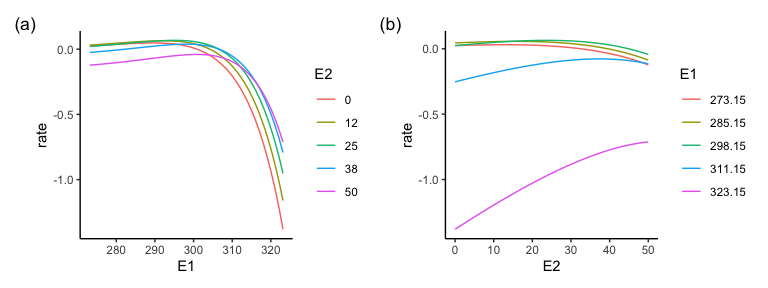
<p class="caption">(\#fig:lowE1-opt-species1)(ref:lowE1-opt-species1)</p>
</div>

(ref:highE1-opt-species2) Performance curves for a species with maximum
growth at **high** values of $E_1$. With interacting environmental
effects.

<div class="figure" style="text-align: center">
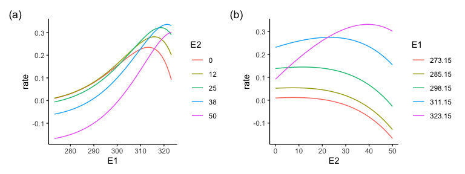
<p class="caption">(\#fig:highE1-opt-species2)(ref:highE1-opt-species2)</p>
</div>

(ref:lowE2-opt-species2) Performance curves for a species with maximum
growth at **low** values of $E_2$. With interacting environmental
effects.

<div class="figure" style="text-align: center">

<p class="caption">(\#fig:lowE2-opt-species2)(ref:lowE2-opt-species2)</p>
</div>

(ref:highE2-opt-species2) Performance curves for a species with maximum
growth at **high** values of $E_2$. With interacting environmental
effects.

<div class="figure" style="text-align: center">

<p class="caption">(\#fig:highE2-opt-species2)(ref:highE2-opt-species2)</p>
</div>

## Fitting GAMs to noisy rate observations

Try with and without an interaction. Therefore make two species, one
with no interaction `z_int = 0` and the other with `z_int = 0.1`. All
other parameters are the same. Note that noise is added to the rate
observations.

Bottom line is that the gam picks up an interaction when we have
included one in the parameters used to generate the rates, and does not
pick one up when we have not. This confirms that our more mechanistic
thinking and methods are matching our statistical thinking and methods,
and confirms that each are promising, so far.


```{=html}
<div class="datatables html-widget html-fill-item" id="htmlwidget-50183d2477ae83a82ee4" style="width:100%;height:auto;"></div>
<script type="application/json" data-for="htmlwidget-50183d2477ae83a82ee4">{"x":{"filter":"top","vertical":false,"filterHTML":"<tr>\n  <td><\/td>\n  <td data-type=\"number\" style=\"vertical-align: top;\">\n    <div class=\"form-group has-feedback\" style=\"margin-bottom: auto;\">\n      <input type=\"search\" placeholder=\"All\" class=\"form-control\" style=\"width: 100%;\" disabled=\"\"/>\n      <span class=\"glyphicon glyphicon-remove-circle form-control-feedback\"><\/span>\n    <\/div>\n    <div style=\"display: none;position: absolute;width: 200px;opacity: 1\">\n      <div data-min=\"0\" data-max=\"1\" data-scale=\"9\"><\/div>\n      <span style=\"float: left;\"><\/span>\n      <span style=\"float: right;\"><\/span>\n    <\/div>\n  <\/td>\n  <td data-type=\"number\" style=\"vertical-align: top;\">\n    <div class=\"form-group has-feedback\" style=\"margin-bottom: auto;\">\n      <input type=\"search\" placeholder=\"All\" class=\"form-control\" style=\"width: 100%;\" disabled=\"\"/>\n      <span class=\"glyphicon glyphicon-remove-circle form-control-feedback\"><\/span>\n    <\/div>\n    <div style=\"display: none;position: absolute;width: 200px;opacity: 1\">\n      <div data-min=\"0\" data-max=\"1\" data-scale=\"3\"><\/div>\n      <span style=\"float: left;\"><\/span>\n      <span style=\"float: right;\"><\/span>\n    <\/div>\n  <\/td>\n  <td data-type=\"number\" style=\"vertical-align: top;\">\n    <div class=\"form-group has-feedback\" style=\"margin-bottom: auto;\">\n      <input type=\"search\" placeholder=\"All\" class=\"form-control\" style=\"width: 100%;\" disabled=\"\"/>\n      <span class=\"glyphicon glyphicon-remove-circle form-control-feedback\"><\/span>\n    <\/div>\n    <div style=\"display: none;position: absolute;width: 200px;opacity: 1\">\n      <div data-min=\"0\" data-max=\"1\"><\/div>\n      <span style=\"float: left;\"><\/span>\n      <span style=\"float: right;\"><\/span>\n    <\/div>\n  <\/td>\n  <td data-type=\"number\" style=\"vertical-align: top;\">\n    <div class=\"form-group has-feedback\" style=\"margin-bottom: auto;\">\n      <input type=\"search\" placeholder=\"All\" class=\"form-control\" style=\"width: 100%;\" disabled=\"\"/>\n      <span class=\"glyphicon glyphicon-remove-circle form-control-feedback\"><\/span>\n    <\/div>\n    <div style=\"display: none;position: absolute;width: 200px;opacity: 1\">\n      <div data-min=\"0\" data-max=\"1\"><\/div>\n      <span style=\"float: left;\"><\/span>\n      <span style=\"float: right;\"><\/span>\n    <\/div>\n  <\/td>\n  <td data-type=\"number\" style=\"vertical-align: top;\">\n    <div class=\"form-group has-feedback\" style=\"margin-bottom: auto;\">\n      <input type=\"search\" placeholder=\"All\" class=\"form-control\" style=\"width: 100%;\" disabled=\"\"/>\n      <span class=\"glyphicon glyphicon-remove-circle form-control-feedback\"><\/span>\n    <\/div>\n    <div style=\"display: none;position: absolute;width: 200px;opacity: 1\">\n      <div data-min=\"0\" data-max=\"1\" data-scale=\"3\"><\/div>\n      <span style=\"float: left;\"><\/span>\n      <span style=\"float: right;\"><\/span>\n    <\/div>\n  <\/td>\n  <td data-type=\"number\" style=\"vertical-align: top;\">\n    <div class=\"form-group has-feedback\" style=\"margin-bottom: auto;\">\n      <input type=\"search\" placeholder=\"All\" class=\"form-control\" style=\"width: 100%;\" disabled=\"\"/>\n      <span class=\"glyphicon glyphicon-remove-circle form-control-feedback\"><\/span>\n    <\/div>\n    <div style=\"display: none;position: absolute;width: 200px;opacity: 1\">\n      <div data-min=\"0\" data-max=\"1\" data-scale=\"2\"><\/div>\n      <span style=\"float: left;\"><\/span>\n      <span style=\"float: right;\"><\/span>\n    <\/div>\n  <\/td>\n  <td data-type=\"number\" style=\"vertical-align: top;\">\n    <div class=\"form-group has-feedback\" style=\"margin-bottom: auto;\">\n      <input type=\"search\" placeholder=\"All\" class=\"form-control\" style=\"width: 100%;\" disabled=\"\"/>\n      <span class=\"glyphicon glyphicon-remove-circle form-control-feedback\"><\/span>\n    <\/div>\n    <div style=\"display: none;position: absolute;width: 200px;opacity: 1\">\n      <div data-min=\"0\" data-max=\"1\"><\/div>\n      <span style=\"float: left;\"><\/span>\n      <span style=\"float: right;\"><\/span>\n    <\/div>\n  <\/td>\n  <td data-type=\"number\" style=\"vertical-align: top;\">\n    <div class=\"form-group has-feedback\" style=\"margin-bottom: auto;\">\n      <input type=\"search\" placeholder=\"All\" class=\"form-control\" style=\"width: 100%;\" disabled=\"\"/>\n      <span class=\"glyphicon glyphicon-remove-circle form-control-feedback\"><\/span>\n    <\/div>\n    <div style=\"display: none;position: absolute;width: 200px;opacity: 1\">\n      <div data-min=\"0\" data-max=\"1\"><\/div>\n      <span style=\"float: left;\"><\/span>\n      <span style=\"float: right;\"><\/span>\n    <\/div>\n  <\/td>\n  <td data-type=\"number\" style=\"vertical-align: top;\">\n    <div class=\"form-group has-feedback\" style=\"margin-bottom: auto;\">\n      <input type=\"search\" placeholder=\"All\" class=\"form-control\" style=\"width: 100%;\"/>\n      <span class=\"glyphicon glyphicon-remove-circle form-control-feedback\"><\/span>\n    <\/div>\n    <div style=\"display: none;position: absolute;width: 200px;opacity: 1\">\n      <div data-min=\"-0.2\" data-max=\"0\" data-scale=\"1\"><\/div>\n      <span style=\"float: left;\"><\/span>\n      <span style=\"float: right;\"><\/span>\n    <\/div>\n  <\/td>\n  <td data-type=\"number\" style=\"vertical-align: top;\">\n    <div class=\"form-group has-feedback\" style=\"margin-bottom: auto;\">\n      <input type=\"search\" placeholder=\"All\" class=\"form-control\" style=\"width: 100%;\" disabled=\"\"/>\n      <span class=\"glyphicon glyphicon-remove-circle form-control-feedback\"><\/span>\n    <\/div>\n    <div style=\"display: none;position: absolute;width: 200px;opacity: 1\">\n      <div data-min=\"0\" data-max=\"1\" data-scale=\"2\"><\/div>\n      <span style=\"float: left;\"><\/span>\n      <span style=\"float: right;\"><\/span>\n    <\/div>\n  <\/td>\n<\/tr>","data":[["1","2"],[1e-09,1e-09],[0.063,0.063],[285,285],[60,60],[0.001,0.001],[0.02,0.02],[20,20],[10,10],[0,-0.2],[0.02,0.02]],"container":"<table class=\"display\">\n  <thead>\n    <tr>\n      <th> <\/th>\n      <th>a1<\/th>\n      <th>b1<\/th>\n      <th>z1<\/th>\n      <th>w1<\/th>\n      <th>a2<\/th>\n      <th>b2<\/th>\n      <th>z2<\/th>\n      <th>w2<\/th>\n      <th>z_int21<\/th>\n      <th>sd_rate<\/th>\n    <\/tr>\n  <\/thead>\n<\/table>","options":{"columnDefs":[{"className":"dt-right","targets":[1,2,3,4,5,6,7,8,9,10]},{"orderable":false,"targets":0},{"name":" ","targets":0},{"name":"a1","targets":1},{"name":"b1","targets":2},{"name":"z1","targets":3},{"name":"w1","targets":4},{"name":"a2","targets":5},{"name":"b2","targets":6},{"name":"z2","targets":7},{"name":"w2","targets":8},{"name":"z_int21","targets":9},{"name":"sd_rate","targets":10}],"order":[],"autoWidth":false,"orderClasses":false,"orderCellsTop":true}},"evals":[],"jsHooks":[]}</script>
```

### Without interaction


(ref:gamtest-species1) Performance curves for a species *without*
interacting environmental effects and with some noise in the rate.

<div class="figure" style="text-align: center">
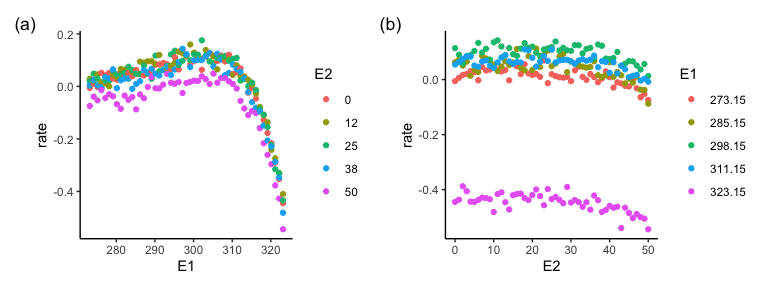
<p class="caption">(\#fig:gamtest-species1)(ref:gamtest-species1)</p>
</div>


```
## 
## Family: gaussian 
## Link function: identity 
## 
## Formula:
## rate ~ ti(E1) + ti(E2) + te(E1, E2)
## 
## Parametric coefficients:
##             Estimate Std. Error t value Pr(>|t|)    
## (Intercept) 0.015428   0.000499   30.92   <2e-16 ***
## ---
## Signif. codes:  0 '***' 0.001 '**' 0.01 '*' 0.05 '.' 0.1 ' ' 1
## 
## Approximate significance of smooth terms:
##                edf Ref.df       F p-value    
## ti(E1)    3.999310  4.000 14148.5  <2e-16 ***
## ti(E2)    3.936725  3.997   608.8  <2e-16 ***
## te(E1,E2) 0.001897 16.000     0.0   0.992    
## ---
## Signif. codes:  0 '***' 0.001 '**' 0.01 '*' 0.05 '.' 0.1 ' ' 1
## 
## R-sq.(adj) =  0.958   Deviance explained = 95.8%
## -REML = -5820.5  Scale est. = 0.00064775  n = 2601
```

<div class="figure" style="text-align: center">
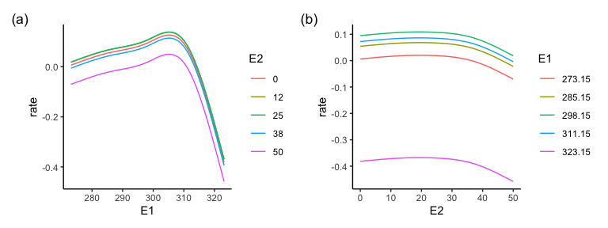
<p class="caption">(\#fig:example-1)(ref:gamtest-species1)</p>
</div>


```
## 
## Family: gaussian 
## Link function: identity 
## 
## Formula:
## rate ~ s(E1) + s(E2)
## 
## Parametric coefficients:
##              Estimate Std. Error t value Pr(>|t|)    
## (Intercept) 0.0154285  0.0003952   39.04   <2e-16 ***
## ---
## Signif. codes:  0 '***' 0.001 '**' 0.01 '*' 0.05 '.' 0.1 ' ' 1
## 
## Approximate significance of smooth terms:
##         edf Ref.df       F p-value    
## s(E1) 8.970  9.000 10199.8  <2e-16 ***
## s(E2) 7.146  8.187   475.4  <2e-16 ***
## ---
## Signif. codes:  0 '***' 0.001 '**' 0.01 '*' 0.05 '.' 0.1 ' ' 1
## 
## R-sq.(adj) =  0.974   Deviance explained = 97.4%
## -REML = -6407.3  Scale est. = 0.00040624  n = 2601
```

<div class="figure" style="text-align: center">
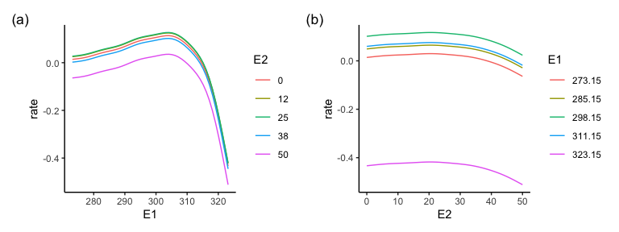
<p class="caption">(\#fig:example-2)(ref:gamtest-species1)</p>
</div>

### With interaction


(ref:gamtest-species2) Performance curves for a species *with*
interacting environmental effects and with some noise in the rate.

<div class="figure" style="text-align: center">
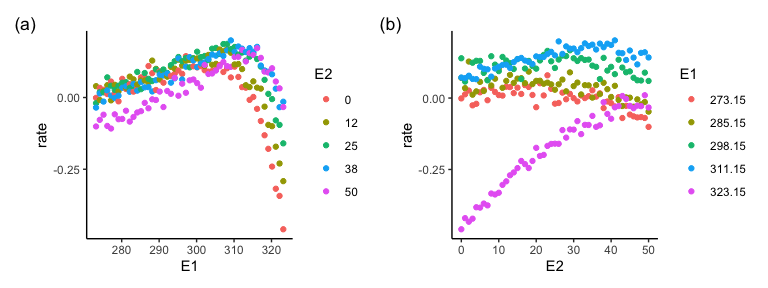
<p class="caption">(\#fig:gamtest-species2)(ref:gamtest-species2)</p>
</div>


```
## 
## Family: gaussian 
## Link function: identity 
## 
## Formula:
## rate ~ ti(E1) + ti(E2) + te(E1, E2)
## 
## Parametric coefficients:
##              Estimate Std. Error t value Pr(>|t|)    
## (Intercept) 0.0656082  0.0004677   140.3   <2e-16 ***
## ---
## Signif. codes:  0 '***' 0.001 '**' 0.01 '*' 0.05 '.' 0.1 ' ' 1
## 
## Approximate significance of smooth terms:
##              edf Ref.df      F p-value    
## ti(E1)     3.991  3.999 1899.8  <2e-16 ***
## ti(E2)     3.991  4.000  302.6  <2e-16 ***
## te(E1,E2) 15.614 16.000  489.1  <2e-16 ***
## ---
## Signif. codes:  0 '***' 0.001 '**' 0.01 '*' 0.05 '.' 0.1 ' ' 1
## 
## R-sq.(adj) =  0.924   Deviance explained = 92.5%
## -REML = -5943.3  Scale est. = 0.00056892  n = 2601
```

<div class="figure" style="text-align: center">
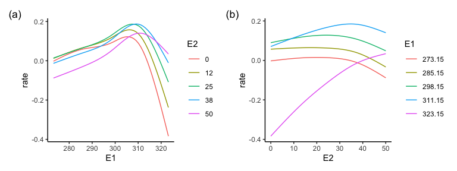
<p class="caption">(\#fig:example-3)(ref:gamtest-species1)</p>
</div>


```
## 
## Family: gaussian 
## Link function: identity 
## 
## Formula:
## rate ~ s(E1) + s(E2)
## 
## Parametric coefficients:
##              Estimate Std. Error t value Pr(>|t|)    
## (Intercept) 0.0656082  0.0009042   72.56   <2e-16 ***
## ---
## Signif. codes:  0 '***' 0.001 '**' 0.01 '*' 0.05 '.' 0.1 ' ' 1
## 
## Approximate significance of smooth terms:
##         edf Ref.df     F p-value    
## s(E1) 8.561  8.945 672.0  <2e-16 ***
## s(E2) 4.421  5.434 101.2  <2e-16 ***
## ---
## Signif. codes:  0 '***' 0.001 '**' 0.01 '*' 0.05 '.' 0.1 ' ' 1
## 
## R-sq.(adj) =  0.717   Deviance explained = 71.8%
## GCV = 0.0021379  Scale est. = 0.0021264  n = 2601
```

<div class="figure" style="text-align: center">

<p class="caption">(\#fig:example-4)(ref:gamtest-species1)</p>
</div>

# Partial derivatives

First step in calculating directional derivatives is estimating the two
partial derivatives $f_{E1}(E1_0, E2_0)$ and $f_{E2}(E1_0, E2_0)$
(please review the section [The principle] if necessary).

## Getting the partial derivatives


Partial derivatives. Draw response surface for sp 1 and calculate
partial derivatives at a specific location (E1 = 300, E2 = 20). To
calculate the partial derivative with respect to E1, E2 must be held
constant.

(ref:partialderiv-species1) Response surface of sp1. The two solid lines
show at which level of E1 and E2 each partial derivative is going to be
calculated (E1 = 300, E2 = 20).


Visualising the partial effect of E1 at a fixed level of E2.

(ref:partialeffectE1-species1) Partial effect of E1 on the growth rate
of sp 1 when E2 is held constant at E2 = 20.

<div class="figure" style="text-align: center">
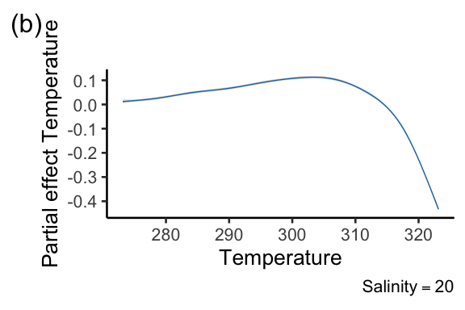
<p class="caption">(\#fig:partialeffectE1-species1)(ref:partialeffectE1-species1)</p>
</div>

Partial derivative with respect to E1 when E2 is constant at 20.

(ref:partialE1-species1) Partial derivative with respect to E1 when E2
is constant at 20.

<div class="figure" style="text-align: center">

<p class="caption">(\#fig:partialE1-species1)(ref:partialE1-species1)</p>
</div>

Partial derivatives with respect to E2 (E1 held constant)

(ref:partialderivE2-species1) Response surface of sp1. The two solid
lines show at which level of E1 and E2 each partial derivative is going
to be calculated.


Partial effect of E2 on the growth rate of sp 1 when E1 is held constat
at E2 = 300

(ref:partialeffectE2-species1) Partial effect of E2 on the growth rate
of sp 1 when E1 is held constant at E1 = 300

<div class="figure" style="text-align: center">

<p class="caption">(\#fig:partialeffectE2-species1)(ref:partialeffectE2-species1)</p>
</div>

Partial derivative with respect to E2 when E1 is constant at 300

(ref:partialE2-species1) Partial derivative with respect to E1 when E2
is constant at 20.

<div class="figure" style="text-align: center">

<p class="caption">(\#fig:partialE2-species1)(ref:partialE2-species1)</p>
</div>

Plot the two partial derivatives and relative effects

(ref:summary-species1) Summary plot sp1. (a) response surface of sp 1.
(b) Partial effect of E1 on the growth rate of sp 1 when E2 is held
constant at E2 = 20. (c) Partial derivative with respect to E1 when E2
is constant at 20. (d) Partial effect of E2 on the growth rate of sp 1
when E1 is held constant at E1 = 300. (e) Partial derivative with
respect to E2 when E1 is constant at 300.


# Directional derivatives

## No direction of environmental change specified

### One point

We start showing how directional derivatives can be calculated even when
the direction of the environmental change is unknown. This may be the
case when we want to calculate response diversity for future scenarios,
and the future direction of environmental change is thus not known. Or
we may have data for a species or a community at only one environmental
location (E1 = x, E2 = y). It is therefore important to be able to
measure directional derivatives when the direction of the environmental
change is unknown, as this can provide useful information on response
diversity nonetheless, for instance, by taking the mean of the slopes
calculates in all directions.\
Measuring response diversity when the direction of environmental change
is unknown may represent a way to systematically measuring response
diversity to all possible environmental changes. This is represents, in
our view, an absolute measure of overall response diversity, since it
captures the complete insurance capacity of a system under all possible
environmental conditions. We thus put some emphasis on this approach
here.

Here, we calculate, for a specific point (E1 = 300, E2 = 20),
directional derivatives in all directions.

(ref:one-point-all-directions) Directional derivatives calculated in all
possible direction for a specific point on the response surface of sp1.
Clearly, the slope of the directional derivative depends on the
direction (red positive, blue negative). Note: the size of the radius
was only chosen for representation purposes, and does not have any
implication. The slope of the segments departing from the point have
each their fixed slopes independently of the size of the radius.


### Several points

We can measure all possible directional derivatives also for several
points on the surface. This might be the case when we know that a
species or a community occurs at multiple locations on the surface
(multiple environmental conditions), but we do not know the direction of
change.

(ref:multiple-points-all-directions) Directional derivatives calculated
in all possible direction for several points on the response surface of
sp1. Clearly, the slope of the directional derivative depends on the
direction (red positive, blue negative).

<div class="figure" style="text-align: center">
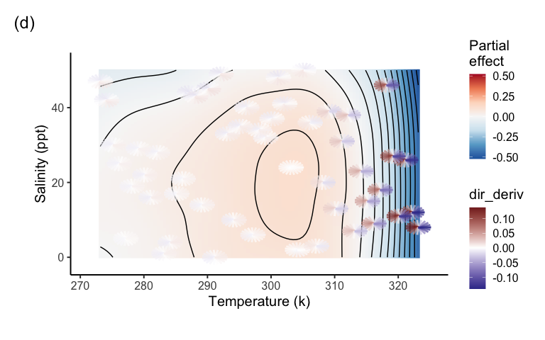
<p class="caption">(\#fig:multiple-points-all-directions)(ref:multiple-points-all-directions)</p>
</div>

### Grid of points

Finally, we might do the same for a grid of points on the surface. We
may want to do that when we do not have information on where a species
or a community is living within the surface, but we know the range of
values of E1 and E2.

(ref:all-points-all-directions) Directional derivatives calculated in
all possible direction for a grid of points on the response surface of
sp1. Clearly, the slope of the directional derivative depends on the
direction (red positive, blue negative).


# Response diversity calculation

We now move away from the example with temperature and salinity and use two general environmental variable E1 and E1.


Environmental variables may show different correlations between each
other. The increase in one environmental variable may be directly
correlated with the increase of another one (positive correlation), or
vice versa, the increase in one driver may be correlated to a decrease
in the other one (negative correlation). Yet, two environmental
variables may change over time, or space, completely independently.\
We may imagine that these different types of relationships between two
environmental variables could determine specific trends in response
diversity.

To explore this hypothesis, we calculate now response diversity for two
communities (one with additive effect, and one including an interactive
environmental effect) composed of 4 spp in 4 different cases: 1. Unknown
direction of the environmental change 2. Direction of env change is
given by the time series,and E1 and E2 change over time independently 3.
Direction of env change is given by the time series,and E1 and E2 change
over time with positive correlation 4. Direction of env change is given
by the time series,and E1 and E2 change over time with negative
correlation

We want to see if any consistent trend appears in the two communities
when E1 and E2 have different correlations.

Steps:

(i) Simulate spp performance curves with the modified Eppley function
    with and without interactive effect.


(ii) Fit response surface for each sp (done with GAMs)


(iii) Data wrangling and partials derivatives calculations


## Community 1 - without interactive effect

<div class="figure" style="text-align: center">
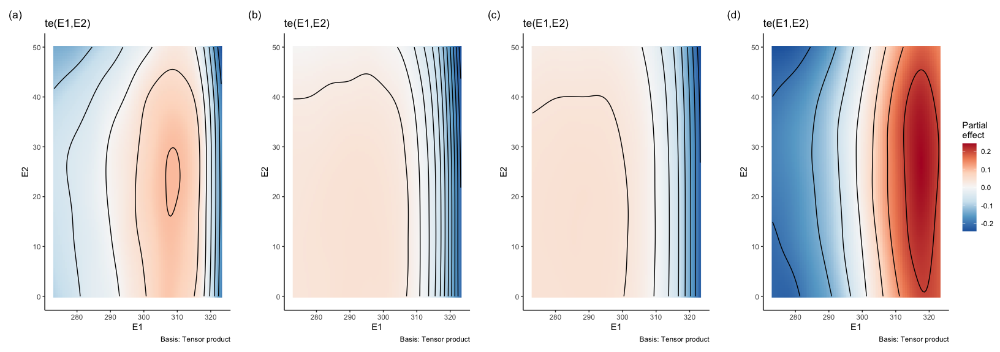
<p class="caption">(\#fig:comm1Simulated)Response surface of the three species composing community 1. (a) Sp4. (b) Sp6. (c) Sp 11</p>
</div>

## Community 2 - interactive effect

<div class="figure" style="text-align: center">
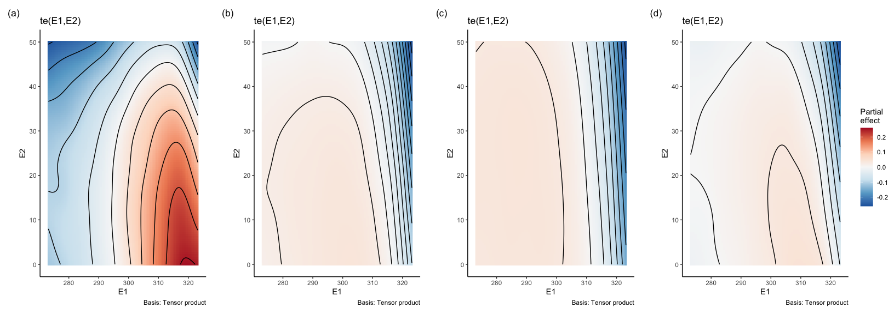
<p class="caption">(\#fig:comm2Simulated)Response surface of the three species composing community 1. (a) Sp2. (b) Sp5. (c) Sp 13</p>
</div>

## Unknown direction of the environmental change


Table showing the calculated response diversity for one of the two
communities when the direction of the environmental change is unknown.
In this case, we calculated response diversity for a community in all
possible directions across the surface, which represents in our opinion
the most sensible way to measure the absolute response diversity of a
specific community.


| divergence| dissimilarity| community|
|----------:|-------------:|---------:|
|  0.2693827|      1.011580|         1|
|  0.2473904|      1.010359|         2|

### E1 and E2 change independently over time

This example mimics a situation where the two environmental variables
change over time completely independently. This is a common situation in
field studies, where multiple drivers of environmental change are not
correlated one another.

In this case the direction of the environmental change is given by the
change of E1 and E2 over time.

(ref:RD-independent) Time series of E1 and E2 changing independently
over time.

<div class="figure" style="text-align: center">

<p class="caption">(\#fig:RD-independent)(ref:RD-independent)</p>
</div>

### Response surfaces with change in environmental conditions

<div class="figure" style="text-align: center">
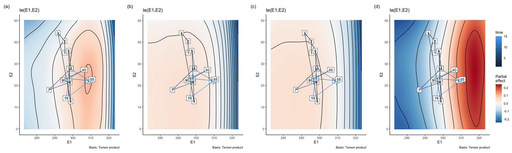
<p class="caption">(\#fig:comm1nocor)Response surface of the three species composing community 1. (a) Sp4. (b) Sp6. (c) Sp 11. The numbers on the response surfaces show the environmental location in the time steps of the time series and the arrows connect the time steps.</p>
</div>

<div class="figure" style="text-align: center">

<p class="caption">(\#fig:comm2nocor)Response surface of the three species composing community 2. (a) Sp2. (b) Sp5. (c) Sp 13</p>
</div>


Table showing the calculated response diversity for one of the two
communities when the two environmental variables change independently
over time (only first 6 rows shown).


| time|   E1_ref|   E2_ref|         s1|         s2|         s3|         s4|     rdiv|      sign|      Med|
|----:|--------:|--------:|----------:|----------:|----------:|----------:|--------:|---------:|--------:|
|    1| 295.5499| 35.06010| -0.0025569| -0.0043734| -0.0031682| -0.0019315| 1.000992| 0.0000000| 1.004178|
|    2| 295.4694| 40.43676| -0.0076105| -0.0038792| -0.0010685| -0.0079641| 1.003054| 0.0000000| 1.004178|
|    3| 291.7350| 44.23112|  0.0059942|  0.0082445|  0.0069416|  0.0049920| 1.001339| 0.0000000| 1.004178|
|    4| 298.7794| 12.68533|  0.0010253| -0.0008450|  0.0011959|  0.0006765| 1.000809| 0.8280425| 1.004178|
|    5| 297.6343| 35.97065|  0.0033619|  0.0040078|  0.0024411|  0.0033568| 1.000588| 0.0000000| 1.004178|
|    6| 299.0214| 27.84749| -0.0045781|  0.0049459|  0.0077936| -0.0073761| 1.006887| 0.9724763| 1.004178|

Plot response diversity over time

<div class="figure" style="text-align: center">
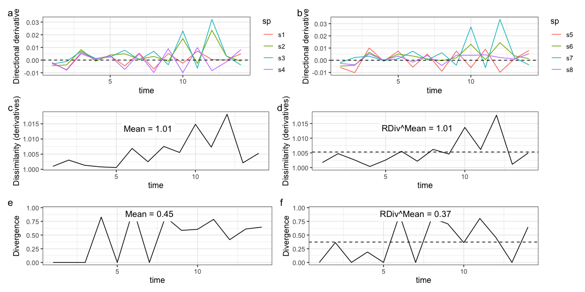
<p class="caption">(\#fig:RDindependentplot)Directional derivatives and response diversity with known direction of env change. E1 and E2 change independently over time. a and b: Species directional derivatives over time. c and d: Response diversity measured as similarity-based diversity metric. e and : Response diversity measured as divergence (sign sensitive). </p>
</div>

## E1 and E2 change with negative correlation

This example mimics a situation where the two environmental variables
change over time with negative correlation. This is common in field
studies, where one environmental variable (e.g. CO2 concentration in
oceans) increases, while another (e.g. pH) decreases [e.g. Shirayama &
Thornton
(2005)](https://agupubs.onlinelibrary.wiley.com/doi/full/10.1029/2004JC002618).

Creating a time series with E1 and E2 changing over time with negative
correlation.

(ref:RD-negative) Time series of E1 and E2 changing with negative
correlation over time.

<div class="figure" style="text-align: center">
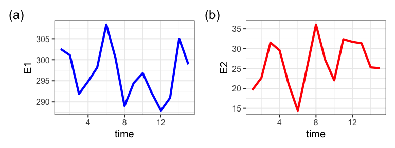
<p class="caption">(\#fig:RD-negative)(ref:RD-negative)</p>
</div>

### Response surfaces with change in environmental conditions

<div class="figure" style="text-align: center">
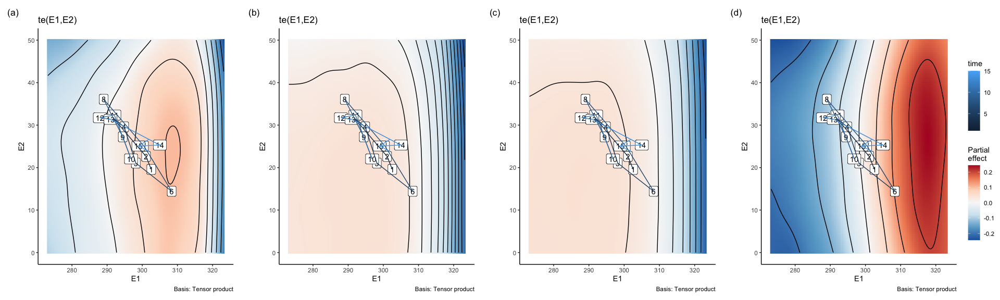
<p class="caption">(\#fig:comm1neg)Response surface of the three species composing community 1. (a) Sp4. (b) Sp6. (c) Sp 11. The numbers on the response surfaces show the environmental location in the time steps of the time series and the arrows connect the time steps.</p>
</div>

<div class="figure" style="text-align: center">
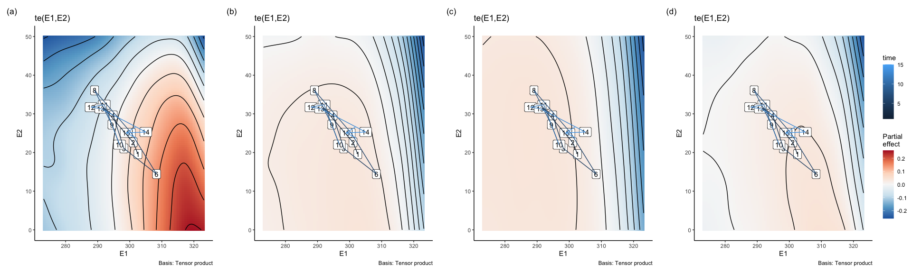
<p class="caption">(\#fig:comm2neg)Response surface of the three species composing community 2. (a) Sp2. (b) Sp5. (c) Sp 13</p>
</div>


Table showing the calculated response diversity for one of the two
communities when the two environmental variables change with negative
correlation over time (only first 6 rows shown).


| time|   E1_ref|   E2_ref|         s1|         s2|         s3|         s4|     rdiv|      sign|      Med|
|----:|--------:|--------:|----------:|----------:|----------:|----------:|--------:|---------:|--------:|
|    1| 302.5483| 19.58057| -0.0019757|  0.0023263|  0.0058283| -0.0041292| 1.004276| 0.8293662| 1.003744|
|    2| 301.0725| 22.63566| -0.0049556|  0.0029915|  0.0072241| -0.0076176| 1.006567| 0.9734861| 1.003744|
|    3| 291.9013| 31.52736|  0.0050877|  0.0022967|  0.0006925|  0.0073109| 1.002833| 0.0000000| 1.003744|
|    4| 294.8456| 29.58774|  0.0027586|  0.0026945|  0.0006353|  0.0029457| 1.000874| 0.0000000| 1.003744|
|    5| 298.1674| 21.06944|  0.0060911| -0.0020108| -0.0052386|  0.0080303| 1.005995| 0.7896076| 1.003744|
|    6| 308.3573| 14.42994|  0.0010460|  0.0155556|  0.0197509| -0.0051795| 1.011184| 0.4155200| 1.003744|

Plot response diversity over time for the two communities

<div class="figure" style="text-align: center">
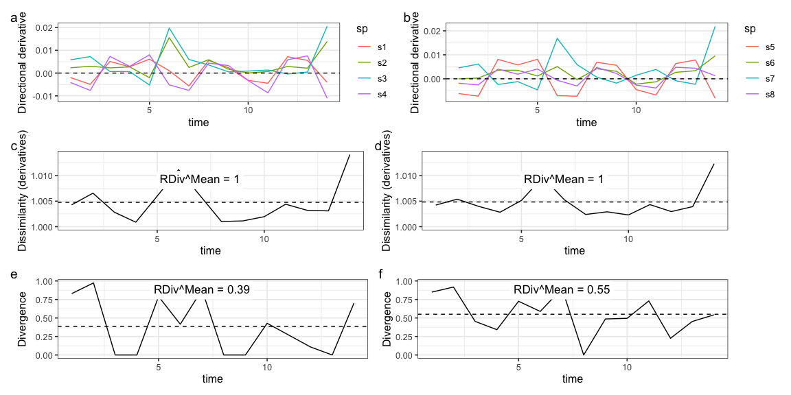
<p class="caption">(\#fig:RDnegativeplot)Directional derivatives and response diversity with known direction of env change. E1 and E2 change with negative correlation over time. a and b: Species directional derivatives over time. c and d: Response diversity measured as similarity-based diversity metric. e and : Response diversity measured as divergence (sign sensitive). </p>
</div>

## E1 and E2 change with positive correlation

Finally, two environmental variables can show positive correlation over
time. A typical example is given by the positive correlation between air
temperature and UV radiation [e.g. Häder at al.
2015](https://pubs.rsc.org/en/content/articlehtml/2015/pp/c4pp90035a).

Let us create a time series with E1 and E2 changing over time with
positive correlation

(ref:RD-positive) Time series of E1 and E2 changing with positive
correlation over time.

<div class="figure" style="text-align: center">
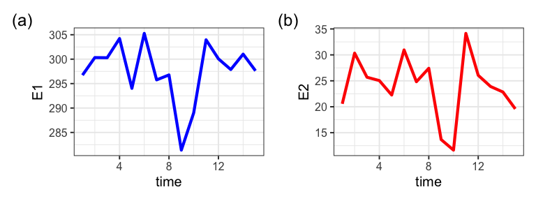
<p class="caption">(\#fig:RD-positive)(ref:RD-positive)</p>
</div>

### Response surfaces with change in environmental conditions

<div class="figure" style="text-align: center">

<p class="caption">(\#fig:comm1pos)Response surface of the three species composing community 1. (a) Sp4. (b) Sp6. (c) Sp 11. The numbers on the response surfaces show the environmental location in the time steps of the time series and the arrows connect the time steps.</p>
</div>

<div class="figure" style="text-align: center">

<p class="caption">(\#fig:comm2pos)Response surface of the three species composing community 2. (a) Sp2. (b) Sp5. (c) Sp 13</p>
</div>


Table showing the calculated response diversity for one of the two
communities when the two environmental variables change with positive
correlation over time (only first 6 rows shown).


| time|   E1_ref|   E2_ref|         s1|         s2|         s3|         s4|     rdiv|      sign|      Med|
|----:|--------:|--------:|----------:|----------:|----------:|----------:|--------:|---------:|--------:|
|    1| 296.7312| 20.56752|  0.0021979| -0.0013016| -0.0030484|  0.0044936| 1.003268| 0.8083766| 1.006269|
|    2| 300.3276| 30.33591|  0.0010021|  0.0029452|  0.0025192|  0.0003718| 1.001155| 0.0000000| 1.006269|
|    3| 300.2941| 25.69146|  0.0069807| -0.0049171| -0.0093154|  0.0101964| 1.008817| 0.9548461| 1.006269|
|    4| 304.2220| 25.04615| -0.0044516|  0.0118764|  0.0174888| -0.0106962| 1.012639| 0.7590010| 1.006269|
|    5| 294.0289| 22.26395|  0.0043536| -0.0008374| -0.0032995|  0.0078661| 1.004841| 0.5910078| 1.006269|
|    6| 305.2743| 30.95401| -0.0028616|  0.0137421|  0.0187414| -0.0097329| 1.012782| 0.6836275| 1.006269|

Plot response diversity over time

<div class="figure" style="text-align: center">
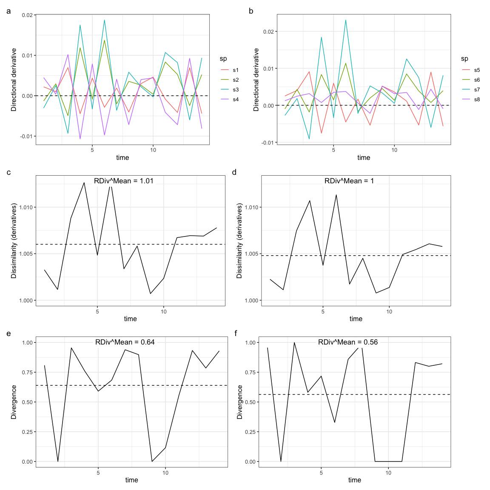
<p class="caption">(\#fig:RDpositiveplot) Directional derivatives and response diversity with known direction of env change for community 1 and 2. E1 and E2 change with negative correlation over time.a and b: Species directional derivatives over time. c and d: Response diversity measured as similarity-based diversity metric. e and : Response diversity measured as divergence (sign sensitive). </p>
</div>

Now, we visualize the relationship between different correlations
between the two environmental variables and response diversity.

<div class="figure" style="text-align: center">
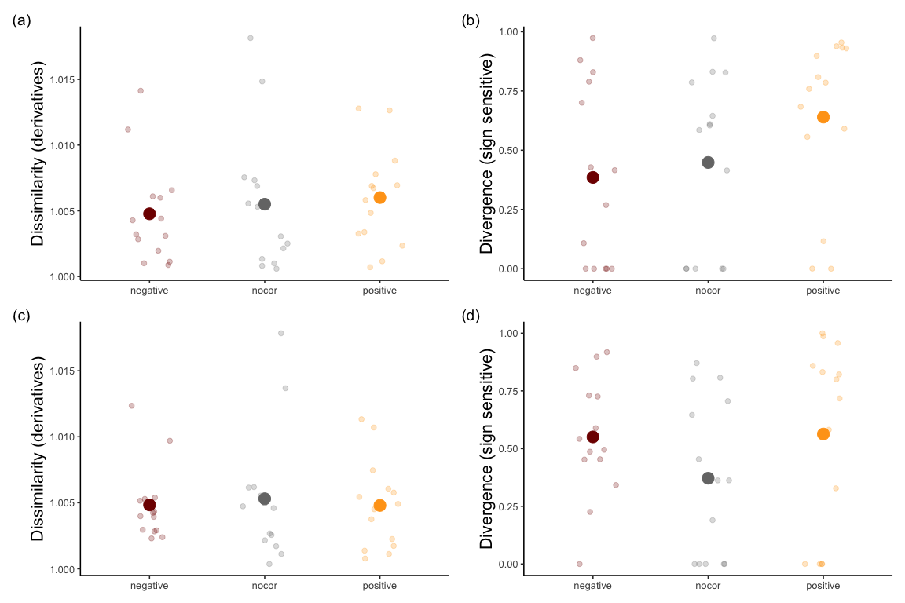
<p class="caption">(\#fig:plotcorrelations)Correlation types and response diversity. a and c: correlation types and response diversity measured as dissimilarity in the first derivatives (sign insensitive) for community 1 and 2 respectively. c and d. correlation types and response diversity measured as divergence in the first derivatives (sign sensitive) for community 1 and 2 respectively</p>
</div>

We can rule out the hypothesis that different types of relationships
between two environmental variables could determine specific trends in
response diversity.

# Empirical example

We use data coming from an experiment where individual ciliates species
have been exposed to a gradient of nutrient, light, and their
combinations in a factorial design. We first show how to calculate the
partial derivatives, then we calculate the directional derivatives based
on a simulated time series (in the original experiment, the level of the
treatments have been kept constant throughout the expt duration).
Finally, we assemble random composed communities and calculate response
diversity for each of them.

(The original data and metadata are available at
<https://doi.org/10.5281/zenodo.8383688>)

### Load data set and look at species responses

<div class="figure" style="text-align: center">
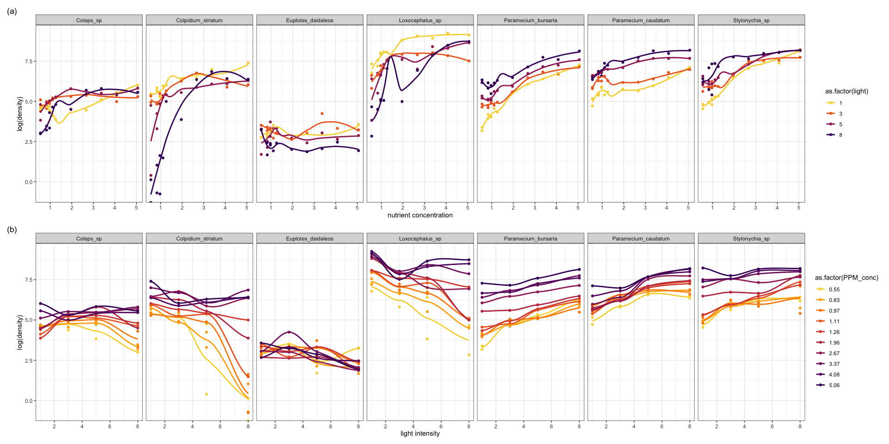
<p class="caption">(\#fig:ciliates)Species responses to the environmental drivers. a. Species responses to nutrient concentrations. b. Species responses to light intensity</p>
</div>

### Fittig GAMs on empirical data


|species         |   E1|   E2| predicted|
|:---------------|----:|----:|---------:|
|Loxocephalus_sp | 0.55| 1.00|  1040.202|
|Loxocephalus_sp | 0.55| 1.02|  1033.719|
|Loxocephalus_sp | 0.55| 1.04|  1027.237|
|Loxocephalus_sp | 0.55| 1.06|  1020.756|
|Loxocephalus_sp | 0.55| 1.08|  1014.277|
|Loxocephalus_sp | 0.55| 1.10|  1007.801|

### Plotting surface for a sp

<div class="figure" style="text-align: center">

```{=html}
<div class="plotly html-widget html-fill-item" id="htmlwidget-dba2ebaf1ab03eb178f4" style="width:1152px;height:480px;"></div>
<script type="application/json" data-for="htmlwidget-dba2ebaf1ab03eb178f4">{"x":{"visdat":{"163f8e43d0cc":["function () ","plotlyVisDat"]},"cur_data":"163f8e43d0cc","attrs":{"163f8e43d0cc":{"z":{},"alpha_stroke":1,"sizes":[10,100],"spans":[1,20],"type":"surface","contours":{"z":{"show":true,"usecolormap":true,"project":{"z":true}}},"inherit":true}},"layout":{"margin":{"b":40,"l":60,"t":25,"r":10},"title":"Colpidium","plot_bgcolor":"#e5ecf6","scene":{"xaxis":{"title":"PPM concentration","nticks":[0.55000000000000004,1,1.5,2,2.5,3,3.5,4,4.5,5],"ticktext":[0.55000000000000004,1,1.5,2,2.5,3,3.5,4,4.5,5]},"yaxis":{"title":"Light","nticks":[0,1,2,3,4,5,6,7,8,9],"ticktext":[0,1,2,3,4,5,6,7,8,9]},"zaxis":{"title":"Colpidium density","nticks":10}},"hovermode":"closest","showlegend":false,"legend":{"yanchor":"top","y":0.5}},"source":"A","config":{"modeBarButtonsToAdd":["hoverclosest","hovercompare"],"showSendToCloud":false},"data":[{"colorbar":{"title":"density_Colpidium","ticklen":2,"len":0.5,"lenmode":"fraction","y":1,"yanchor":"top"},"colorscale":[["0","rgba(68,1,84,1)"],["0.0416666666666667","rgba(70,19,97,1)"],["0.0833333333333333","rgba(72,32,111,1)"],["0.125","rgba(71,45,122,1)"],["0.166666666666667","rgba(68,58,128,1)"],["0.208333333333333","rgba(64,70,135,1)"],["0.25","rgba(60,82,138,1)"],["0.291666666666667","rgba(56,93,140,1)"],["0.333333333333333","rgba(49,104,142,1)"],["0.375","rgba(46,114,142,1)"],["0.416666666666667","rgba(42,123,142,1)"],["0.458333333333333","rgba(38,133,141,1)"],["0.5","rgba(37,144,140,1)"],["0.541666666666667","rgba(33,154,138,1)"],["0.583333333333333","rgba(39,164,133,1)"],["0.625","rgba(47,174,127,1)"],["0.666666666666667","rgba(53,183,121,1)"],["0.708333333333333","rgba(79,191,110,1)"],["0.75","rgba(98,199,98,1)"],["0.791666666666667","rgba(119,207,85,1)"],["0.833333333333333","rgba(147,214,70,1)"],["0.875","rgba(172,220,52,1)"],["0.916666666666667","rgba(199,225,42,1)"],["0.958333333333333","rgba(226,228,40,1)"],["1","rgba(253,231,37,1)"]],"showscale":true,"z":[[225.55155643773938,225.18140920284122,224.81114180675499,224.440634088292,224.06976588626588,223.69841703948754,223.32646738676914,222.95379676692252,222.58028501876052,222.20581198109406,221.83025749273537,221.45350139249746,221.07542351919119,220.69590371162857,220.31482180862267,219.93205764898471,219.54749107152662,219.16100191506047,218.77247001839871,218.38177522035267,217.98879735973469,217.59341627535667,217.19551180603105,216.79496379056934,216.39165206778335,215.98545647648544,215.57625685548868,215.16393304360315,214.74836487964188,214.32943220241634,213.90701485073888,213.48099266342203,213.05124547927701,212.61765313711635,212.18009547575122,211.73845233399433,211.29260355065787,210.84242896455345,210.38780841449326,209.9286217392885,209.46474877775245,208.99606936869628,208.52246335093218,208.04381056327247,207.55999084452876,207.07088403351301,206.57636996903747,206.07632848991412,205.57063943495487,205.05918264297196,204.54183795277697,204.01848520318202,203.48900423299935,202.95327488104093,202.41117698611845,201.86259038704426,201.30739492263018,200.74547043168849,200.17669675303054,199.60095372546908,199.01812118781564,198.4280789788823,197.83070693748115,197.2258849024245,196.61349271252388,195.99341020659122,195.36551722343873,194.72969360187875,194.08581918072264,193.43377379878291,192.77343729487131,192.10468950780009,191.42741027638098,190.74147943942589,190.04677683574724,189.34318230415656,188.63057568346622,187.9088368124882,187.17784553003415,186.43748167491651,185.68762508594708,184.92815560193779,184.15895306170086,183.379897304048,182.59086816779148,181.79174549174323,180.98240911471501,180.16273887551935,179.33261461296763,178.49191616587245,177.64052337304534,176.77831607329844,175.90517410544408,175.02097730829371,174.12560552065955,173.21893858135405,172.30085632918841,171.37123860297527,170.42996524152633,169.47691608365352,168.51197096816918,167.5350701330853,166.54639541321484,165.54618904257089,164.53469325516693,163.51215028501571,162.47880236613068,161.43489173252496,160.38066061821172,159.31635125720373,158.2422058835148,157.15846673115763,156.06537603414569,154.96317602649179,153.85210894220938,152.73241701531151,151.60434247981127,150.46812756972213,149.32401451905682,148.17224556182896,147.01306293205127,145.84670886373718,144.67342559089985,143.49345534755236,142.30704036770786,141.11442288537955,139.91584513458054,138.71154934932403,137.50177776362318,136.28677261149136,135.06677612694136,133.8420305439866,132.61277809664011,131.37926101891512,130.14172154482478,128.90040190838229,127.65554434360067,126.4073910844934,125.15618436507316,123.90216641935351,122.64557948134757,121.38666578506835,120.12566756452907,118.86282705374296,117.59838648672303,116.33258809748246,115.06567412003463,113.79788678839265,112.52946833656939,111.26066099857836,109.99170700843257,108.72284860014511,107.45432800772916,106.18638746519795,104.91926920656496,103.65321546584279,102.38846847704482,101.12527047418433,99.863863691274346,98.604490362328164,97.347392721358773,96.092813002379344,94.840993439403206,93.592176266443445,92.346603717513176,91.104518026625712,89.86616142779387,88.631776155031233,87.401604442350774,86.175888523765522,84.954870633288735,83.738793004933797,82.52789787271368,81.322427470641472,80.122624032730386,78.928729792993693,77.740986985444479,76.559637844095704,75.384924602960965,74.217089496053021,73.05637475738537,71.903022620970944,70.757275320822899,69.61937509095462,68.48956416537915,67.36808477810942,66.255179163158843,65.151089554540633,64.056058186267833,62.970327292353588,61.894139106811011,60.827735863653437,59.771359796893968,58.725253140545661,57.689658128621815,56.664816995135581,55.650971974099974,54.6483652995284,53.657239205433712,52.677835925829328,51.710397694728321,50.755112810161116,49.811953826226954,48.880839361042305,47.961688032724169,47.054418459388607,46.158949259152415,45.275199050132095,44.403086450444242,43.542530078205459,42.693448551532143,41.855760488540973,41.029384507348283,40.21423922607098,39.410243262825446,38.61731523572815,37.835373762895834,37.064337462444961,36.304124952491982,35.554654851153536,34.815845776546425,34.087616346786874,33.369885179991613,32.662570894276953,31.965592107759839,31.2788674385564,30.602315504783597,29.935854924557788,29.279404315995464,28.632882297213246,27.996207486327879,27.369298501455489,26.752073960713084,26.144452482217051,25.546352684083747,24.957693184430042,24.378392601372241,23.808369553027106,23.247542657511051,22.695830532940764,22.153151797432486,21.619425069103215,21.094568966069168,20.578502106447221,20.071143108353624,19.572410589905097,19.082223169218114,18.600499464409197,18.127158093595032,17.662117674892109,17.205296826417158,16.756614166286329,16.315988312616465,15.883337883524099,15.458581497125911,15.041637771538088,14.632425324877532,14.230862775260645,13.836868740804027,13.450361839624236,13.071260689837722,12.699483909561225,12.33495011691123,11.977577930004136,11.627285966956741,11.283992845885457,10.947617184906882,10.618077602137651,10.295292715694259,9.979181143693026,9.6696615042508931,9.3666524154842623,9.0700724955096881,8.7798403624435402,8.495874634402707,8.218093929503528,7.9464168658626857,7.6807620615965959,7.4210481348219952,7.1671937036551823,6.9191173862130064,6.676737800611825,6.4399735649682066,6.2087432973988852,5.9829656160202402,5.7625591389487081,5.5474424843011567,5.337534270193995,5.1327531147437213,4.9330176360671008,4.7382464522804133,4.5483581815002472,4.363271441843553,4.1829048514263381,4.0071770283654571,3.8360065907774654,3.6693121567788181,3.5070123444861956,3.3490257720159482,3.1952710574849625,3.0456668190094875,2.9001316747062145,2.7585842426916303,2.6209431410823294,2.4871269879950644,2.3570544015460175,2.230643999851929,2.1078144010294375,1.9884842231950328,1.8725720844652241,1.7599966029566581,1.650676396785741,1.5445300840692262,1.4414762829233858,1.3414336114651748,1.2443206878108581,1.1500561300770906,1.0585585563803379,0.96974658483720066,0.88353883356439056,0.79985392067819205,0.718610464295387,0.63972708253244104,0.5631223935058598,0.48871501533234785,0.41642356612825893,0.3461666640103882,0.27786292709508675,0.21143097349900142,0.14678942133872663,0.083856888730763579,0.022551993791530833,-0.037206645362203083,-0.095500410613840181,-0.15241068384707113,-0.20801884694520734,-0.26240628179161085,-0.31565437026984533,-0.36784449426326571,-0.41905803565544364,-0.46937637632961682,-0.51888089816948124,-0.56765298305827994,-0.61577401287959432,-0.66332536951678644,-0.7103884348532441,-0.7570445907725496,-0.80337521915803922,-0.84946170189321979,-0.89538542086152173,-0.94122775794640301],[230.56279610163435,230.07639514637185,229.58989237142998,229.10318595712903,228.61617408378945,228.12875493173161,227.64082668127566,227.15228751274219,226.66303560645238,226.17296914272572,225.68198630188337,225.18998526424485,224.69686421013105,224.20252131986288,223.70685477376028,223.20976275214369,222.71114343533338,222.21089500365059,221.70891563741492,221.20510351694716,220.69935682256732,220.1915737345964,219.68165243335517,219.16949109916249,218.65498791234037,218.13804105320912,217.61854870208842,217.09640903929875,216.57152024516108,216.04378049999556,215.51308798412276,214.97934087786317,214.44243736153709,213.90227561546442,213.35875381996658,212.81177015536343,212.26122280197558,211.70700994012324,211.14902975012723,210.5871804123077,210.02136010698507,209.45146701448016,208.87739931511265,208.29905518920395,207.71633281707327,207.12913037904249,206.53734605543082,205.94087802655957,205.33962447274851,204.73348357431871,204.12235351158995,203.50613246488305,202.88471861451839,202.2580101408162,201.62590522409707,200.98830204468194,200.34509878289035,199.69619361904327,199.04148473346081,198.38087030646389,197.71424851837261,197.04151754950777,196.36257558018892,195.67732079073744,194.98565136147323,194.28746547271706,193.5826613047891,192.87113703800983,192.15279085269978,191.42752092917948,190.6952254477691,189.95580258878954,189.20915053256033,188.45516745940284,187.69375154963714,186.92480098358376,186.14821394156272,185.36388860389519,184.57172315090088,183.77161576290067,182.96346462021486,182.14716790316396,181.32262379206824,180.48973046724825,179.64838610902447,178.7984888977175,177.93993701364727,177.07262863713444,176.1964619484996,175.31133512806312,174.41714635614554,173.51379381306694,172.6011756791481,171.67919013470927,170.74773536007098,169.80670953555364,168.85601084147766,167.89553745816349,166.92518756593168,165.94485934510263,164.95445097599645,163.95391385419958,162.94341223636013,161.92316359439184,160.89338540020904,159.85429512572495,158.80611024285398,157.74904822350956,156.68332653960624,155.60916266305739,154.52677406577672,153.43637821967857,152.33819259667646,151.23243466868445,150.11932190761641,148.99907178538606,147.87190177390755,146.73802934509445,145.59767197086089,144.45104712312059,143.29837227378749,142.13986489477537,140.97574245799814,139.80622243536976,138.63152229880419,137.45185952021501,136.26745157151626,135.07851592462174,133.88527005144542,132.68793142390112,131.48671751390285,130.28184579336428,129.07353373419937,127.86199880832216,126.64745848764619,125.43013024408557,124.21023154955411,122.98797987596576,121.76359269523412,120.53728747927345,119.3092816999974,118.07979282931993,116.84903833915476,115.61723570141584,114.38460238801724,113.15135587087249,111.9177136218959,110.68389311300075,109.45011181610144,108.21658720311177,106.98353674594532,105.75117791651621,104.51972818673821,103.28940502852537,102.06042591379136,100.83300831445,99.607369702415482,98.383727549601332,97.162299327921701,95.943302509290319,94.726954565621099,93.513472968827784,92.303075190824501,91.095978703524906,89.8924009788429,88.69255948869251,87.496671704987492,86.304955099641845,85.117627144569198,83.934905311683593,82.757007072898773,81.584149900128821,80.416551265287595,79.254428640288751,78.097999497046359,76.947481307474177,75.803091543486275,74.665047676996267,73.533567179918094,72.408867524165643,71.291166181653097,70.180680624293785,69.077628324001921,67.982226752691403,66.894693382276031,65.815245684669492,64.744101131785825,63.681477195539067,62.627591347843087,61.582661060611215,60.546903805757928,59.520537055196833,58.503778280841942,57.496844954607091,56.499954548406023,55.513324534152702,54.537172383761011,53.571715569144835,52.617171562218083,51.673757834894431,50.741691859088071,49.821142011145312,48.912080285144107,48.014429579594754,47.128112793007929,46.253052823893753,45.389172570762959,44.536394932125852,43.694642806493007,42.863839092374903,42.043906688281744,41.234768492724349,40.436347404212917,39.648566321258116,38.87134814237006,38.104615766059588,37.348292090837177,36.602300015212954,35.866562437697525,35.141002256801372,34.425542371035029,33.720105678908794,33.024615078933287,32.338993469618828,31.663163749476077,30.997048817015148,30.340571570746835,29.693654909181436,29.056221730829556,28.428194934201436,27.809497417807634,27.200052080158699,26.599781819765155,26.008609535137069,25.42645812478527,24.853250487220073,24.288909520952068,23.733358124491595,23.186519196349042,22.648315635035061,22.118670339060035,21.597506206934362,21.084746137168391,20.580313028272847,20.084129778758161,19.596119287134606,19.116204451912843,18.644308171603132,18.180353344716067,17.72426286976215,17.275959645251831,16.835366569695324,16.402406541603373,15.977002459486236,15.55907722185469,15.148553727218779,14.74535487408922,14.349403560976439,13.960622686390856,13.57893514884292,13.204263846843102,12.836531678902066,12.475661543529903,12.121576339237302,11.774198964534619,11.433452317932524,11.099259297941217,10.771542803071405,10.450225731833205,10.135230982737284,9.8264814542942815,9.5239000450143863,9.2274096534081274,8.9369331779859511,8.652393517258508,8.3737135697359868,8.1008162339288265,7.8336244083478634,7.5720609915033457,7.3160488819054672,7.0655109780650527,6.8203701784924267,6.5805493816980665,6.345971486192461,6.1165593904858486,5.8922359930890682,5.6729241925123137,5.4585468872660332,5.2490269758609909,5.0442873568073141,4.8442509286154882,4.6488405897961638,4.4579792388597745,4.2715897743165261,4.0895950946771276,3.9119180984520678,3.7384816841514903,3.569208750286168,3.404022195366454,3.2428449179028895,3.0855998164058906,2.9322097893857828,2.7825977353531011,2.6366865528183716,2.4943991402921402,2.3556583962846611,2.2203872193064589,2.0885085078680152,1.9599451604797187,1.8346200756522233,1.7124561518958856,1.593376287721175,1.4773033816383814,1.3641603321581606,1.2538700377908985,1.1463553970470954,1.0415393084371649,0.9393446704716375,0.83969438166102783,0.74251134051552459,0.64771844554577296,0.5552385952623311,0.46499468817544098,0.37690962279572116,0.29090629763365872,0.20690761119950363,0.12483646200381759,0.044615748557224499,-0.033831630630072773,-0.11058277704744679,-0.18571479218433762,-0.25930477753058145,-0.33142983457559438,-0.40216706480876407,-0.47159356971987076,-0.5397864507982808,-0.60682280953359413,-0.67277974741535651,-0.73773436593306041,-0.80176376657632442,-0.86494505083463924,-0.92735532019753109,-0.98907167615460434,-1.0501712201954385,-1.1107310538093405,-1.1708282784860851,-1.2305399957150618,-1.2899433069859674,-1.3491153137882792,-1.4081331176113991,-1.4670738199449369],[235.52392245002082,234.92257071428779,234.32113536247698,233.71953277850909,233.11767934630745,232.5154914497935,231.912885472889,231.30977779951547,230.70608481359585,230.10172289905091,229.49660843980283,228.89065781977439,228.28378742288635,227.67591363306116,227.06695283422033,226.4568214102863,225.84543574518074,225.23271222282557,224.61856722714214,224.00291714205321,223.38567835148007,222.76676723934528,222.14610018956989,221.523593586076,220.89916381278636,220.27272725362153,219.64420029250448,219.01349931335648,218.38054070009989,217.74524083665602,217.10751610694729,216.46728289489539,215.8244575844225,215.17895655945003,214.53069620390013,213.87959290169454,213.22556303675535,212.56852299300419,211.90838915436333,211.24507790475457,210.57850562809963,209.90858870831994,209.23524352933876,208.55838647507693,207.87793392945645,207.19380227639962,206.50590789982786,205.81416718366341,205.11849651182766,204.41881226824341,203.71503083683152,203.0070686015147,202.29484194621423,201.57826725485259,200.85726091135098,200.1317392996321,199.40161880361742,198.66681580722874,197.92724669438812,197.18282784901743,196.43347565503828,195.67910649637312,194.91963675694348,194.15498282067142,193.38506107147867,192.60978789328706,191.82907967001887,191.04285278559547,190.25102362393923,189.45350856897187,188.6502240046153,187.84108631479123,187.02601188342194,186.20491709442891,185.37771833173406,184.54433197925951,183.70467442092726,182.85866204065877,182.00621122237635,181.14723835000183,180.28165980745692,179.40939197866368,178.53035124754382,177.6444539980194,176.75161661401231,175.85175547944425,174.94478697823757,174.03062749431351,173.1091934115945,172.18040111400205,171.24416698545849,170.30040740988548,169.34903877120482,168.38997745333856,167.42313984020842,166.44844231573654,165.46580126384453,164.47513306845468,163.47635411348833,162.4693807828678,161.45412946051485,160.43056260277788,159.39882695570938,158.35911533778906,157.31162056749611,156.25653546330972,155.19405284370927,154.12436552717386,153.04766633218307,151.9641480772159,150.87400358075166,149.77742566126972,148.67460713724941,147.56574082716998,146.45101954951048,145.33063612275052,144.20478336536914,143.07365409584585,141.93744113265964,140.79633729428994,139.65053539921621,138.50022826591729,137.34560871287266,136.18686955856182,135.02420362146381,133.85780372005806,132.68786267282354,131.51457329823987,130.33812841478641,129.15872084094192,127.97654339518613,126.79178889599808,125.60465016185717,124.41532001124261,123.22399126263376,122.03085673451,120.83610924535027,119.63994161363419,118.44254665784077,117.24411719644958,116.04484604793946,114.84492603079012,113.64454996348063,112.44391066449032,111.24320095229848,110.04261364538429,108.84234156222711,107.64257752130632,106.44351434110105,105.24534484009051,104.04826183675422,102.85245814957125,101.6581265970209,100.4654599975826,99.274651169735364,98.085892931958782,96.899378102732072,95.715299500534243,94.533849943844771,93.355222251142905,92.179609240908121,91.007203731619299,89.838198541755986,88.672786489797431,87.511160394222685,86.353513073511465,85.200037346142764,84.050926030595903,82.906371945350131,81.766567908884667,80.631706739679032,79.50198125621219,78.377584276963631,77.258708620412534,76.145547105038347,75.038292549320218,73.937137771737241,72.842275590769148,71.753898824894691,70.672200292593459,69.597372812344702,68.529609202627711,67.469102281921735,66.416044868705981,65.370629781459911,64.333049838662532,63.303497858793335,62.282166660331661,61.269249061756511,60.264937881547233,59.269425938183325,58.282906050143971,57.305571035908173,56.337613713955683,55.379226902765367,54.430603420816709,53.491936086588986,52.563417718561418,51.645241135213332,50.737599155023887,49.840684596472542,48.954646008025023,48.079454858094039,47.215038345078817,46.361323667378564,45.518238023392549,44.685708611519708,43.863662630159631,43.052027277711204,42.250729752573932,41.459697253146906,40.678856977829369,39.90813612502037,39.147461893119377,38.396761480525583,37.655962085637995,36.924990906855975,36.203775142578721,35.492241991205461,34.790318651135514,34.09793232076791,33.41501019850201,32.741479482737034,32.07726737187182,31.422301064306239,30.776507758439031,30.139814652669671,29.51214894539719,28.893437835020826,28.283608519939904,27.682588198553599,27.090304069261165,26.506683330461811,25.931653180554601,25.36514081793894,24.807073441013994,24.257378248178853,23.715982437832956,23.18281320837529,22.657797758205312,22.140863285722116,21.631936989324931,21.130946067412914,20.637817718385378,20.15247914064166,19.674857532580553,19.204880092601766,18.74247401910408,18.287566510487139,17.840084765149797,17.399955981491598,16.967107357911424,16.541466092808705,16.122959384582625,15.711514431632395,15.307058432357291,14.909518585156384,14.518822088428973,14.134896140574297,13.757667939991627,13.387064685079915,13.023013574238734,12.66544180586715,12.3142765783643,11.969445090129479,11.630874539561972,11.298492125060873,10.972225045025448,10.652000497854939,10.337745681948517,10.029387795705393,9.7268540375250048,9.4300716058062264,9.1389676989483704,8.8534695153508984,8.5735042534127626,8.2989991115332753,8.0298812881116248,7.766077981547193,7.507516390238874,7.2541237125861464,7.0058271469880973,6.7625538918441475,6.5242311455532791,6.2907861065147817,6.06214597312779,5.8382379437917713,5.6189892169057636,5.4043269908690661,5.194178464080764,4.988470834940185,4.7871313018464106,4.5900870631989905,4.3972653173967853,4.2085932628392344,4.023998097925336,3.8434070210545235,3.6667472306258482,3.4939459250387754,3.3249303026922306,3.1596275619855509,2.997964901318074,2.8398695190887793,2.6852686136970645,2.5340893835422138,2.3862590270231738,2.2417047425394117,2.1003537284900995,1.9621331832742186,1.826970305291316,1.6947922929404111,1.5655263446208938,1.4390996587317719,1.3154394336723119,1.1944728678419114,1.0761271596396762,0.96032950746470735,0.84700710971648707,0.73608716479386338,0.62749687109621988,0.52116342702294194,0.41701403097314582,0.31497588134596644,0.21497617654075007,0.11694211495657125,0.020800894992766494,-0.073520284951602122,-0.16609422647705596,-0.25699373118452229,-0.34629160067489551,-0.43406063654882576,-0.52037364040703693,-0.60530341385055308,-0.68892275847980855,-0.77130447589581763,-0.85252136769942766,-0.93264623549127101,-1.0117518808721488,-1.0899111054427264,-1.1671967108041024,-1.2436814985567848,-1.3194382703016467,-1.3945398276395364,-1.4690589721711742,-1.5430685054972644,-1.6166412292187484,-1.6898499449362445,-1.7627674542506773,-1.8354665587627528,-1.9080200600731905,-1.9805007597829301],[240.38482216739041,239.67112553097263,238.95736320626443,238.24346950497574,237.52937873881427,236.8150252194911,236.1003432587147,235.38526716819484,234.66973125964088,233.953669844762,233.23701723526796,232.51970774286798,231.80167567927151,231.08285535618762,230.36318108532643,229.6425871783967,228.92100794710802,228.19837770317019,227.47463075829208,226.74970142418334,226.02352401255359,225.29603283511142,224.56716220356728,223.83684642962982,223.10501982500921,222.37161670141361,221.63657137055336,220.89981814413815,220.16129133387682,219.42092525147899,218.67865420865348,217.93441251711087,217.18813448855948,216.43975443470941,215.6892066672691,214.93642549794944,214.18134523845885,213.42390020050684,212.66402469580277,211.90165303605653,211.13671953297671,210.36915849827372,209.59890424365605,208.82589108083354,208.05005332151592,207.27132527741185,206.48964126023097,205.70493558168317,204.91714255347765,204.12619648732343,203.33203169493015,202.53458248800743,201.73378317826428,200.92956807741047,200.12187149715544,199.31062774920798,198.49577114527847,197.67723599707537,196.85495661630847,196.02886731468763,195.19890240392152,194.36499619571964,193.52708300179202,192.68509713384748,191.83897290359562,190.98864462274602,190.1340466030077,189.27511315609038,188.41177859370347,187.54397722755618,186.67164336935807,185.79471133081825,184.91311542364653,184.02678995955219,183.1356692502446,182.23968760743321,181.33877934282714,180.43287876813628,179.52192019506967,178.60583793533721,177.68456630064739,176.75803960271065,175.8261921532357,174.8889582639321,173.94627224650938,172.99806841267682,172.04428107414429,171.0848445426202,170.11969312981509,169.14876114743757,168.17198290719756,167.18929272080413,166.20062489996687,165.20591375639489,164.2050936017979,163.19809874788501,162.18486350636624,161.16532218895057,160.13940910734718,159.10705857326582,158.06820489841576,157.02282140628395,155.971037467467,154.91302146433881,153.8489417792737,152.77896679464553,151.70326489282849,150.62200445619658,149.53535386712386,148.44348150798436,147.34655576115233,146.24474500900166,145.13821763390649,144.02714201824074,142.91168654437871,141.79201959469432,140.66830955156166,139.54072479735484,138.40943371444794,137.27460468521465,136.13640609202974,134.99500631726664,133.8505737432998,132.70327675250294,131.55328372725054,130.40076304991629,129.24588310287453,128.08881226849911,126.92971892916441,125.76877146724424,124.60613826511253,123.4419877051437,122.27648816971146,121.10980804119023,119.94211570195377,118.77357953437642,117.60436792083192,116.43464924369462,115.26459188533849,114.09436422813764,112.92413465446595,111.75407154669757,110.58434328720682,109.41511825836727,108.24656484255364,107.07885142213934,105.91214637949895,104.74661809700612,103.58243495703519,102.41976534196013,101.2587776341549,100.09964021599382,98.942521469850618,97.787589778099658,96.635013523115006,95.48496108727052,94.337600852940383,93.193101202498525,92.051630518319328,90.913357182776465,89.778449578244476,88.647076087096806,87.519405091707966,86.395604974451956,85.275844117702832,84.160290903834607,83.049113715221253,81.942480934237068,80.840560943256023,79.743522124652003,78.651532860799207,77.564761534071792,76.483376526843799,75.40754622148927,74.337439000382133,73.273223245896546,72.215067340406691,71.163139666286398,70.117608605909922,69.078642541651334,68.046409855884548,67.021078930983805,66.002818149322977,64.991795893276361,63.988180545217816,62.992140487521482,62.003844102561438,61.023459772711682,60.051155880346464,59.087100807839491,58.13146293756526,57.184410651897593,56.246112333210647,55.316736363878348,54.396451126274798,53.485425002774136,52.583826375750554,51.691823627577918,50.809585140630226,49.93727929728167,49.075074479906377,48.223099596695505,47.381325659109685,46.549684204426441,45.728106769923649,44.916524892878613,44.114870110569314,43.323073960273554,42.541067979268625,41.768783704832643,41.006152674242898,40.253106424777272,39.509576493713453,38.775494418329131,38.050791735901861,37.335399983709543,36.629250699029797,35.932275419140211,35.24440568131849,34.565573022842401,33.895708980989525,33.234745093037688,32.582612896264422,31.939243927947516,31.304569725364573,30.678521825793378,30.061031766511611,29.452031084796737,28.851451317926788,28.259224003179053,27.675280677831502,27.099552879161941,26.531972144447778,25.972470010966717,25.420978015996624,24.87742769681487,24.341750590699579,23.813878234928019,23.293742166778134,22.781273923527642,22.276405042453966,21.779067060834926,21.289191515948282,20.806709945071631,20.33155388548283,19.863654874459165,19.402944449278749,18.949354147219033,18.502815505557852,18.063260061572713,17.630619352541544,17.204824915741721,16.78580828845115,16.373501007947397,15.96783461150812,15.568740636411194,15.176150619934301,14.78999609935488,14.410208611950775,14.036719694999741,13.669460885779291,13.308363721567158,12.953359739641158,12.604380477278788,12.261357471757828,11.92422226035595,11.59290638035101,11.267341369020372,10.947458763641915,10.633190101493231,10.324466919852288,10.021220755996307,9.7233831472033003,9.4308856307508613,9.1436597439166771,8.8616370239784601,8.5847490082138229,8.3129272339005986,8.0461032383162472,7.7842085587385634,7.5271747324453298,7.2749332967141696,7.0274157888227551,6.7845537460486085,6.5462787056697724,6.3125222049636243,6.0832157812078886,5.8582909716803098,5.6376793136586834,5.4213123444206799,5.2091216012436803,5.0010386214056304,4.796994942184206,4.5969221008570376,4.4007516347018942,4.208415080996363,4.0198439770180743,3.8349698600448523,3.6537242673543204,3.4760387362241651,3.3018448039321493,3.1310740077557675,2.9636578849729718,2.7995279728611617,2.6386158086981375,2.4808529297617135,2.3261708733293807,2.1745011766790032,2.0257753770880864,1.8799250118343123,1.7368816181957376,1.5965767334495551,1.4589418948736981,1.3239086397458015,1.1914085053435457,1.0613730289447387,0.9337337478267882,0.80842219926766834,0.68536992054483914,0.56450844893622865,0.44576932171927552,0.32908407617187674,0.21438424957146474,0.10160137919602175,-0.0093329976769602752,-0.11848734376972914,-0.2259301218047316,-0.33172979450417284,-0.43595482459019674,-0.53867367478538419,-0.63995480781196967,-0.73986668639226938,-0.83847777324863237,-0.93585653110315192,-1.032071422678416,-1.1271909106966334,-1.2212834578801992,-1.314417526951237,-1.406661580632325,-1.4980840816454482,-1.5887534927131668,-1.6787382765577537,-1.7681068959016226,-1.8569278134668634,-1.9452694919758509,-2.033200394150934,-2.1207889827145641,-2.2081037203888512,-2.2952130698962732,-2.3821854939590219,-2.4690894552993932],[245.09538193823406,244.27324922081192,243.45106832916514,242.628791089071,241.80636932630455,240.98375486664219,240.16089953585967,239.33775515973332,238.51427356403934,237.69040657455267,236.86610601705027,236.04132371730793,235.21601150110163,234.39012119420732,233.56360462240079,232.73641361145863,231.90849998715595,231.07981557526958,230.25031220157535,229.41994169184903,228.58865587186645,227.7564065674041,226.92314560423779,226.08882480814376,225.25339600489713,224.41681102027491,223.57902168005208,222.73997981000585,221.89963723591148,221.05794578354519,220.21485727868279,219.37032354710036,218.52429641457405,217.6767277068796,216.8275692497933,215.97677286909089,215.12429039054845,214.27007363994198,213.41407444304753,212.55624462564143,211.69653601349887,210.83490043239658,209.97128970810999,209.1056556664156,208.23795013308916,207.36812493390678,206.49613189464432,205.6219228410778,204.74544959898341,203.86666399413707,202.9855178523145,202.10196299929231,201.21595126084594,200.3274344627512,199.43636443078501,198.54269299072251,197.64637196834025,196.74735318941359,195.84558847971928,194.94102966503272,194.03362857113012,193.12333702378788,192.21010684878149,191.2938898718869,190.37463791888047,189.45230281553808,188.52683638763551,187.59819046094901,186.66631686125467,185.73116741432818,184.79269394594584,183.85084828188309,182.90558224791678,181.95684766982211,181.00459637337579,180.04878018435326,179.08935092853076,178.12626043168433,177.15946051958989,176.18890301802327,175.21453975276071,174.23632254957838,173.25420323425166,172.26813363255718,171.27806557027063,170.28395087316812,169.28574136702576,168.28338887761919,167.27684523072469,166.26606225211819,165.25099176757553,164.23158560287305,163.20779558378629,162.17957353609188,161.14687128556548,160.10964065798268,159.06783347912034,158.02140157475364,156.97029677065905,155.91447089261268,154.85387576638979,153.78849529218184,152.71844166783669,151.64385916561756,150.56489205778689,149.48168461660802,148.39438111434379,147.3031258232572,146.20806301561097,145.10933696366834,144.0070919396918,142.90147221594466,141.79262206468971,140.68068575819001,139.56580756870818,138.44813176850744,137.32780262985071,136.20496442500055,135.07976142622027,133.95233790577274,132.82283813592068,131.69140638892742,130.5581869370553,129.42332405256778,128.28696200772762,127.14924507479759,126.01031752604075,124.87032363372008,123.72940767009845,122.58771390743883,121.44538661800402,120.30257007405714,119.15940854786091,118.01604631167838,116.87262763777227,115.72929679840594,114.58619806584194,113.44347571234343,112.301274010173,111.15973723159395,110.01900964886914,108.87923553426134,107.74055916003364,106.60312479844886,105.46707672176989,104.33255920225976,103.19971651218141,102.06869292379777,100.93963270937152,99.812680141165814,98.687979491443528,97.565675032467823,96.445911036501244,95.328831775806918,94.214581522647677,93.103304549286619,91.995145127986532,90.890247531010246,89.788756030621045,88.690814899081545,87.596568408654775,86.506160831603466,85.419736440191016,84.337439506679857,83.259414303333187,82.185805102413809,81.116756176184836,80.052411796908942,78.992916236849297,77.938413768268646,76.889048663429961,75.844965194596185,74.80630763403046,73.773220253995134,72.745847326753719,71.724333124568872,70.708821919703723,69.699457984420889,68.696385590983411,67.699749011654404,66.709692518696727,65.726360384373095,64.749896880946565,63.780446280680209,62.818152855836843,61.863160878679139,60.915614621470482,59.975658356473481,59.043436355951258,58.119092892166591,57.202772237382376,56.294618663861698,55.394776443867435,54.503389849662533,53.620603153509812,52.746560627672146,51.881406544412783,51.025285175994398,50.178340794679883,49.340717672732303,48.512560082414502,47.693977573052422,46.884940802223781,46.085385704569426,45.295248214729874,44.514464267345836,43.742969797058116,42.980700738507572,42.227593026334667,41.483582595180287,40.748605379685017,40.022597314489758,39.305494334234915,38.597232373561454,37.897747367110121,37.206975249521463,36.524851955436134,35.851313419495192,35.18629557633912,34.529734360608543,33.881565706944443,33.241725549987279,32.610149824377928,31.986774464756934,31.371535405765158,30.764368582043339,30.165209928232152,29.573995378972285,28.990660868904548,28.415142332669394,27.847375704907797,27.287296920260264,26.734841913367919,26.189946618870927,25.652546971410466,25.122578905626881,24.599978356161216,24.084681257653855,23.576623544745807,23.075741152077761,22.581970014290206,22.095246066023979,21.615505241919735,21.142683476618487,20.676716704760739,20.217540860986944,19.765091879938215,19.319305696255061,18.880118244578284,18.447465459548557,18.021283275806741,17.601507627993193,17.188074450749028,16.780919678714664,16.37997924653105,15.985189088838698,15.596485140278389,15.213803335491047,14.83707960911701,14.466249895797265,14.101250130172435,13.742016246883178,13.388484180570401,13.040589865874711,12.698269237436708,12.361458229897156,12.030092777896947,11.704108816076625,11.383442279077002,11.06802910153856,10.757805218102391,10.452706563409091,10.152669072098966,9.8576286788133309,9.5675213181926058,9.2822829248775101,9.0018494335087134,8.7261567787271694,8.4551408951731837,8.1887377174878075,7.9268831803117799,7.6695132182856378,7.4165637660501158,7.1679707582460113,6.9236701295139165,6.683597814494628,6.4476897478289841,6.2158818641574829,5.9881100981209689,5.7643103843601349,5.5444186575156413,5.3283708522282058,5.1161029031386205,4.9075507448874855,4.7026503121157806,4.5013375394638668,4.3035483615726848,4.1092187130828313,3.9182845286351489,3.730681742870309,3.5463462904289207,3.3652141059518232,3.187221124079672,3.0123032794531666,2.8403965067130805,2.6714367405001465,2.5053599154549202,2.3421019662183147,2.1815988274308884,2.02378643373358,1.8686007197668904,1.7159776201715369,1.565853069588238,1.4181630026579182,1.2728433540211377,1.1298300583184764,0.98905905019086582,0.85046626427896843,0.71398763522348041,0.57955909766507574,0.44711658624436978,0.31659603560244243,0.18793338037971274,0.061064555216944427,-0.064074505245205415,-0.18754786636586829,-0.30941959350449544,-0.42975375202014465,-0.54861440727239419,-0.66606562462023078,-0.78217146942321314,-0.89699600704043458,-1.0106033028312922,-1.1230574221549556,-1.2344224303707101,-1.3447623928380033,-1.4541413749160954,-1.5626234419640053,-1.6702726593413919,-1.7771530924073291,-1.8833288065209013,-1.9888638670418457,-2.0938223393292414,-2.1982682887422715,-2.3022657806403855,-2.4058788803827209,-2.5091716533286341,-2.6122081648375133,-2.7150524802684215,-2.8177686649807203,-2.9204207843338805],[249.6054884470438,248.68013140818914,247.75474315754903,246.82929248333843,245.90374817377241,244.97807901706477,244.05225380143003,243.1262413150848,242.20001034624116,241.27352968311595,240.34676811392279,239.41969442687645,238.49227741019203,237.56448585208383,236.63628854076649,235.70765426445536,234.77855181136468,233.84894996970914,232.91881752770323,231.98812327356211,231.05683599550036,230.12492448173253,229.19235752047322,228.25910389993749,227.32513240833939,226.39041183389446,225.45491096481686,224.51859858932175,223.58144349562323,222.64341447193627,221.70448030647526,220.76460978745547,219.82377170309181,218.88193484159794,217.93906799118935,216.99513994008038,216.05011947648606,215.1039753886208,214.15667646469925,213.20819149293649,212.25848926154688,211.30753855874519,210.35530817274596,209.40176689176468,208.44688350401503,207.4906267977122,206.53296556107054,205.57386858230529,204.61330464963098,203.65124255126202,202.68765107541336,201.72249901029966,200.75575514413566,199.78738826513575,198.81736716151514,197.84566062148807,196.87223743326948,195.89706638507423,194.92011626511635,193.94135586161167,192.96075396277365,191.97827935681778,190.99390083195863,190.0075871764106,189.01930717838852,188.02902962610744,187.03672330778173,186.04235701162597,185.04589952585513,184.04731963868375,183.0465861383268,182.04366781299851,181.0385334509138,180.03115184028766,179.02149176933432,178.00952202626871,176.99521139930562,175.97852867665964,174.95944264654531,173.93792209717756,172.91393581677104,171.88745259354022,170.85844121570025,169.82687047146558,168.79270914905084,167.75592603667096,166.71648992254012,165.67436959487372,164.62953384188577,163.58195145179155,162.53159121280549,161.47842191314237,160.42241234101644,159.36353128464341,158.30174753223702,157.2370298720125,156.16934709218404,155.09866798096692,154.02496132657541,152.94819591722455,151.86834054112876,150.78538928793566,149.69943745302291,148.61060563320086,147.5190144252808,146.42478442607253,145.32803623238715,144.22889044103479,143.1274676488263,142.02388845257215,140.9182734490829,139.81074323516904,138.70141840764111,137.59041956331001,136.47786729898593,135.36388221147925,134.24858489760115,133.1320959541616,132.01453597797169,130.8960255658414,129.77668531458164,128.65663582100291,127.53599768191583,126.41489149413079,125.29343785445842,124.1717573597094,123.0499706066941,121.92819819222316,120.80656071310715,119.68517876615662,118.56417294818203,117.4436638559943,116.32377208640337,115.20461823622031,114.08632290225557,112.96900668131953,111.85279017022296,110.73779396577619,109.62413866478995,108.51194486407486,107.40133316044125,106.29242415069986,105.18533843166112,104.08019660013566,102.97711925293414,101.87622698686702,100.77764039874467,99.6814800853778,98.587866643577115,97.496920670153031,96.408762761916122,95.323513515677007,94.241293528246104,93.16222339643376,92.086423717051233,91.014015086908458,89.945118102816352,88.879853361585162,87.818341460025636,86.760702994948275,85.707058563163642,84.657528761482411,83.612234186714943,82.5712954356719,81.534833105163898,80.502967792001243,79.475820092994894,78.453510604955085,77.436159924692532,76.423888649017584,75.41681737474093,74.415066698673257,73.4187572176251,72.428009528406818,71.442944227829031,70.463681912702356,69.490343179837367,68.52304862604457,67.561918848134567,66.60707444291792,65.658636007205132,64.716724137806736,63.781459431533349,62.852962485195476,61.931353895603856,61.016754259568742,60.109284173900974,59.209064235410906,58.316215040909114,57.430857187206264,56.553111271112847,55.683097889439509,54.820937638996675,53.96675111659512,53.120658919045134,52.282781643157307,51.453239885742235,50.632154243610714,49.819645313573091,49.015833692439671,48.220839977021527,47.434754732990854,46.657548401469164,45.889161392439227,45.129534115884383,44.378606981787811,43.636320400132455,42.902614780901843,42.177430534078972,41.460708069646962,40.752387797588923,40.052410127888145,39.360715470527644,38.677244235490697,38.001936832760393,37.334733672320056,36.675575164152718,36.024401718241549,35.381153744569737,34.745771653120443,34.118195853876742,33.498366756821909,32.886224771939183,32.281710309211512,31.68476377862223,31.09532559015431,30.513336153791109,29.938735879515754,29.371465177311361,28.811464457161065,28.258674129048135,27.713034602955581,27.174486288866863,26.642969596764694,26.118424936632579,25.600792718453469,25.090013352210633,24.58602724788744,24.08877481546671,23.598196464931746,23.114232606265727,22.636823649451774,22.165910004473062,21.701432081312738,21.243330289954194,20.791545040380111,20.34601674257409,19.906685806519103,19.473492642198405,19.046377659595006,18.625281268692373,18.210143879473222,17.800905901921002,17.397507746018764,16.999889821749939,16.607992539097367,16.221756308044306,15.841121538573978,15.46602864066935,15.096418024313966,14.732230099490717,14.373405276182794,14.01988396437342,13.671606574045644,13.328513515182655,12.99054519776778,12.65764203178402,12.329744427214656,12.006792794042646,11.688727542251316,11.375489081823797,11.067017822743331,10.763254174992962,10.464138548555891,10.169611353415217,9.8796129995543165,9.5940838969560858,9.3129644556037832,9.0361950854807773,8.763716196569824,8.4954681988543612,8.2313915023176172,7.9714265169426186,7.7155136527125103,7.4635933196104496,7.2156059276196629,6.9714918867233271,6.7311916069045221,6.4946454981466255,6.2617939704324002,6.0325774337453471,5.8069362980684431,5.5848109733851121,5.3661418696781675,5.1508693969310633,4.9389339651268358,4.7302759842485376,4.5248358642794608,4.3225540152029165,4.1233708470016843,3.9272267696593763,3.7340621931588434,3.5438175274831982,3.3564331826158398,3.1718495685399803,2.9900070952384636,2.8108461726945331,2.6343072108915973,2.4603306198125372,2.2888568094408281,2.1198261897592845,1.9531791707513069,1.7888561623998447,1.6267975746883394,1.4669438175997893,1.3092353011172788,1.1536124352242902,1.0000156299035954,0.84838529513854333,0.69866184091224781,0.55078567720795935,0.40469721400871972,0.26033686129784517,0.11764502905842189,-0.023437872726431941,-0.16297143407361148,-0.30101524499975785,-0.43762889552173334,-0.57287197565659831,-0.70680407542100721,-0.83948478483184186,-0.97097369390595478,-1.1013303926600582,-1.2306144711111635,-1.3588855192760771,-1.4862031271714509,-1.6126268848144605,-1.7382163822217169,-1.8630312094099724,-1.9871309563961255,-2.1105752131972668,-2.2334235698299683,-2.3557356163111178,-2.477570942657521,-2.5989891388861501,-2.7200497950137112,-2.8408125010569929,-2.9613368470329453,-3.0816824229586306,-3.2019088188504501,-3.3220756247254268],[253.86502837831063,252.84296171748991,251.82088011778731,250.79876864032173,249.77661234621166,248.75439629657615,247.73210555253266,246.70972517520087,245.68724022569856,244.66463576514451,243.64189685465735,242.61900855535535,241.59595592835726,240.57272403478177,239.54929793574684,238.52566269237138,237.50180336577392,236.47770501707276,235.4533527073871,234.42873149783455,233.40382644953436,232.37862262360471,231.35310508116393,230.3272588833311,229.30106909122449,228.27452076596271,227.24759896866397,226.22028876044718,225.1925752024305,224.16444335573291,223.13587828147254,222.10686504076827,221.07738869473835,220.04743430450128,219.01698693117584,217.98603163588041,216.95455347973356,215.92253752385375,214.88996882935979,213.85683245736971,212.82311346900269,211.78879692537674,210.75386788761026,209.71831141682219,208.68211257413108,207.64525642065533,206.6077280175133,205.56951242582363,204.53059470670527,203.49095992127619,202.45059313065511,201.40947939596043,200.36760377831064,199.32495133882495,198.28150713862112,197.23725623881805,196.19218370053392,195.14627458488755,194.09951395299768,193.05188686598254,192.00337838496026,190.95397357105011,189.90365748537036,188.85241518903979,187.80023174317617,186.74709220889872,185.69298164732561,184.63788511957574,183.58178768676743,182.52467441001897,181.4665303504494,180.40734056917674,179.34709012731972,178.28576408599702,177.22334750632703,176.15982544942833,175.09518297641952,174.0294051484189,172.9624770265452,171.89438367191676,170.82511014565242,169.75464150887035,168.68296282268955,167.61005914822778,166.53591554660443,165.46051707893758,164.38384880634572,163.30589578994758,162.22664309086173,161.14607577020629,160.06417888910028,158.98093750866204,157.89633669000986,156.81036149426251,155.72299698253875,154.6342282159568,153.54404025563522,152.45241816269265,151.35934699824728,150.26481182341814,149.16879769932328,148.07130842100918,146.97242271922937,145.872238058666,144.77085190400064,143.66836171991486,142.56486497109043,141.4604591222089,140.35524163795205,139.24930998300135,138.14276162203842,137.03569401974508,135.92820464080305,134.82039094989358,133.71235041169874,132.60418049090003,131.49597865217899,130.38784236021712,129.27986907969662,128.17215627529859,127.06480141170496,125.95790195359729,124.85155536565728,123.74585911256642,122.64091065900652,121.53680746965924,120.43364700920615,119.33152674232885,118.230544133709,117.13079664802841,116.03238174996841,114.93539690421106,113.83993957543754,112.74610722832998,111.65399732756961,110.56370733783831,109.47533472381751,108.38897695018923,107.30473148163478,106.2226957828361,105.14296731847442,104.06564355323169,102.99082195178953,101.91859997882958,100.8490750990333,99.782344777082599,98.718506477659005,97.65765766544412,96.599895805119615,95.54531836136718,94.494022798868485,93.446106582305077,92.401667176358686,91.360802045710813,90.323608655043287,89.290184469037655,88.260626952375617,87.235033569738746,86.213501785808916,85.196129065267442,84.183012872796084,83.174250673076443,82.169939930790292,81.170178110619389,80.175062677245037,79.184691095349066,78.19916082961312,77.218569344719,76.243014105347896,75.272592576182035,74.307402221902635,73.347540507191482,72.393104896730335,71.444192855200555,70.50090184728387,69.563329337662296,68.631572791017035,67.705729672030003,66.785897445382616,65.872173575756733,64.964655527833827,64.063440766295699,63.168626755823858,62.280310961099943,61.398590846805902,60.523563877622877,59.655327518232873,58.793979233317494,57.939616487558276,57.092336745636963,56.25223747223513,55.419416132034449,54.593970189716657,53.775997109963242,52.96559435745597,52.162859396876314,51.367889692906054,50.580782710226948,49.801635913520407,49.030546767468323,48.267612736752113,47.512905872406492,46.766396570878442,46.028029814967702,45.297750587474304,44.575503871198123,43.861234648938833,43.154887903496444,42.456408617670867,41.765741774262054,41.082832356069737,40.407625345893848,39.740065726534226,39.080098480790845,38.427668591463586,37.782721041352289,37.145200813256807,36.515052889976964,35.892222254312799,35.276653889064264,34.668292777030985,34.067083901013021,33.472972243810275,32.885902788222275,32.305820517049554,31.732670413091299,31.166397459148047,30.60694663801905,30.054262932504599,29.508291325404567,28.968976799518597,28.436264337646879,27.910098922589054,27.390425537145028,26.877189164114874,26.370334786298145,25.869807386495062,25.37555194750535,24.887513452128829,24.405636883165602,23.92986722341529,23.460149455677801,22.996428562753163,22.538649527441322,22.086757332541989,21.640696960855145,21.200413395180675,20.765851618318152,20.336956613067972,19.913673362229641,19.495946848603317,19.083722054988669,18.676943964185575,18.275557558993967,17.879507822213728,17.488739736644952,17.103198285087124,16.722828450340515,16.34757521520465,15.977383562479714,15.612198474965417,15.251964935461736,14.896627926768351,14.546132431685436,14.200423433012713,13.859445913549976,13.523144856097367,13.191465243454719,12.86435205842162,12.541750283798166,12.22360490238426,11.909860896979726,11.600463250384472,11.295356945398362,10.99448696482138,10.697798291453227,10.40523590809387,10.116744797543287,9.832269942601247,9.5517563260676361,9.2751489307423931,9.0023927394253001,8.7334327349164056,8.4682139000153693,8.2066812175223447,7.9487796702368891,7.6944542409592165,7.4436499124890085,7.1963116676262331,6.9523844891706599,6.7118133599223624,6.4745432626809976,6.2405191802466318,6.0096860954190685,5.7819889909981859,5.5573728497837571,5.3357826545759037,5.1171633881743999,4.9014600333791405,4.6886175729899282,4.4785809898067566,4.2712952666294379,4.0667053862578069,3.8647563314919218,3.6653930851313907,3.4685606299764595,3.2742039488266945,3.0822680244820768,2.8926978397425485,2.7054383774079795,2.5204346202781736,2.3376315511531649,2.1569741528327073,1.9784074081165208,1.8018762998048512,1.6273258106973429,1.4547009235940074,1.2839466212947226,1.1150078865991429,0.94782970230746511,0.78235705121924592,0.61853491613474532,0.45630827985352163,0.2956221251757043,0.13642143490093339,-0.021348808170684741,-0.17774362123945053,-0.33281802150537576,-0.48662702616851927,-0.63922565242917262,-0.79066891748732893,-0.94101183854315629,-1.0903094327967757,-1.2386167174481146,-1.3859887096977035,-1.5324804267452965,-1.6781468857911825,-1.8230431040353601,-1.9672240986780283,-2.1107448869192353,-2.2536604859591725,-2.3960259129978931,-2.537896185235736,-2.679326319872577,-2.8203713341085175,-2.9610862451437301,-3.1015260701784264,-3.241745826412628,-3.3818005310465828,-3.5217452012801367,-3.6616348543136272],[257.82388841652681,256.71292977309849,255.60197163625023,254.49101451256286,253.3800589086174,252.26910533099442,251.15815428627326,250.04720628103576,248.9362618218621,247.82532141533198,246.71438556802698,245.6034547865271,244.49252957741274,243.38161044726471,242.27069790266373,241.15979245019,240.04889459642422,238.93800484794644,237.82712371133772,236.71625169317846,235.60538930004904,234.49453703852978,233.38369541520203,232.27286493664559,231.16204610944112,230.05123944016901,228.94044543541006,227.82966460174455,226.71889744575338,225.60814447401668,224.49740619311513,223.38668310962927,222.27597573013972,221.16528456122668,220.05461010947096,218.9439528814531,217.83331338375331,216.7226921229522,215.6120896056307,214.50150633836884,213.39094282774741,212.28039958034699,211.16987710274785,210.05937590153053,208.94889648327592,207.83843935456414,206.72800502197578,205.6175939920914,204.50720677149187,203.39684386675725,202.28650578446798,201.17619303120523,200.06590611354872,198.95564553807941,197.84541181137791,196.73520544002437,195.6250269305998,194.51487678968425,193.40475552385865,192.29466363970334,191.18460164379886,190.07457004272547,188.96456934306391,187.85460005139493,186.74466267429884,185.63475771835616,184.52488569014736,183.41504709625281,182.30524244325343,181.19547223772966,180.08573698626171,178.97603719543045,177.86637337181617,176.75674602199945,175.64715565256105,174.53760277008101,173.4280878811403,172.31861149231921,171.20917411019823,170.09977624135811,168.99041839237913,167.881101069842,166.77182478032697,165.66259003041498,164.55339732668642,163.44424717572119,162.33514008410086,161.22607655840511,160.11705710521494,159.00808223111076,157.89915244267294,156.79026824648204,155.68143014911874,154.57263865716348,153.46389427719663,152.35519751579909,151.24654887955103,150.13794887503295,149.02939800882575,147.92089678750955,146.81244571766499,145.70405771886612,144.5957953626604,143.48773363358853,142.37994751619172,141.2725119950104,140.1655020545858,139.05899267945878,137.95305885417014,136.84777556326071,135.74321779127155,134.63946052274335,133.53657874221713,132.43464743423368,131.33374158333396,130.23393617405881,129.13530619094931,128.03792661854607,126.94187244138993,125.84721864402198,124.75404021098313,123.66241212681419,122.57240937605593,121.48410694324936,120.3975798129354,119.31290296965484,118.23015139794867,117.14940008235754,116.07072400742265,114.99419815768475,113.91989751768472,112.84789707196349,111.77827180506169,110.7110967015204,109.64644674588065,108.58439692268321,107.52502221646886,106.46839761177864,105.41459809315324,104.36369864513365,103.31577425226085,102.27089989907573,101.22915057011906,100.19060124993172,99.155326923054531,98.123402574028475,97.094903187394635,96.069903747693516,95.04847923946609,94.0307046472536,93.016654955596522,92.006405149036084,91.000030212112677,89.997605129367486,88.999204885341669,88.004904464575588,87.01477885161043,86.028903030987124,85.047351987246401,84.070200704929164,83.097524168576328,82.12939736272871,81.165895271927354,80.207092880713162,79.253065173626737,78.303887135209166,77.359633750001464,76.420380002544192,75.486200877378451,74.557171359044972,73.633366432084884,72.714861081038919,71.801730290447978,70.894049044852864,69.991892328794577,69.095335126813993,68.20445242345194,67.319319203249378,66.440010450747053,65.566601150485923,64.699166287007117,63.837780844851011,62.982519808558955,62.133458162671609,61.290670891729924,60.454232980274782,59.624219412846955,58.80070517398751,57.983765248237127,57.173474620136787,56.369908274227484,55.573141195050063,54.783248367145376,54.00030477505414,53.22438540331737,52.455565236476048,51.693919259071052,50.939522455643129,50.19244981073323,49.452776308882235,48.72057693463104,47.995905787194573,47.278733424484656,46.569009519086819,45.866683743586805,45.171705770570448,44.48402527262337,43.803591922331385,43.13035539228013,42.464265355055439,41.805271483242919,41.15332344942852,40.508370926197621,39.870363586136214,39.239251101830078,38.614983145864528,37.997509390825932,37.386779509299544,36.782743173871069,36.185350057126499,35.594549831651513,35.010292170031704,34.432526744852964,33.861203228700816,33.296271294161265,32.737680613819762,32.185380860262114,31.639321706074323,31.099452823841638,30.565723886150078,30.038084565585478,29.516484534733344,29.000873466179456,28.491201032509576,27.987416906309463,27.489470760164608,26.997312266661154,26.510891098384519,26.030156927920711,25.555059427855142,25.085548270773607,24.621573129261915,24.163083675905874,23.710029583291011,23.262360524003277,22.820026170628257,22.382976195751699,21.951160271959338,21.524528071836869,21.103029267970026,20.686613532944918,20.275230539346438,19.868829959761086,19.467361466774268,19.070774732971731,18.679019430939299,18.292045233262481,17.909801812527178,17.532238841319213,17.159305992224265,16.7909529378278,16.427129350715809,16.067784903473967,15.712869268688046,15.362332118943497,15.016123126826498,14.67419196492245,14.33648830581722,14.002961822096545,13.673562186345904,13.348239071151475,13.026942149098632,12.709621092773251,12.396225574760953,12.086705267647551,11.781009844018767,11.479088976460353,11.180892337558035,10.88636959989741,10.595470436064513,10.308144518644452,10.024341520223803,9.7440111133877512,9.4671029707220349,9.193566764812541,8.9233521682449481,8.6564088536050399,8.3926864934784895,8.1321347604509313,7.8747033271082758,7.6203418660360533,7.3690000498201353,7.1206275510462627,6.8751740423001166,6.6325891961673884,6.3928226852339165,6.1558241820852091,5.9215433593072726,5.6899298894857564,5.460933445206166,5.234503699054633,5.0105903236164799,4.7891429914776129,4.5701113752238234,4.3534451474408433,4.1390939807142511,3.9270075476298789,3.7171355207734686,3.5094275727306714,3.3038333760873302,3.1003026034290144,2.8987849273416817,2.6992300204108393,2.5015875552222573,2.3058072043616864,2.1118386404149989,1.9196315359678406,1.7291355636057135,1.5403003959146515,1.353075705480288,1.1674111648882306,0.98325644672441381,0.80056122357434756,0.61927516802392812,0.4393479526589168,0.26072925006485903,0.083368732827613812,-0.092783926467062905,-0.26777905523352885,-0.44166698088611867,-0.61449803083904442,-0.7863225325063361,-0.95719081330275646,-1.1271532006420779,-1.2962600219388687,-1.4645616046072787,-1.6321082760617092,-1.7989503637162683,-1.9651381949852311,-2.1307220972829892,-2.2957523980238719,-2.4602794246219615,-2.6243535044916042,-2.7880249650471143,-2.9513441337027251,-3.114361337872726,-3.2771269049711664,-3.4396911624127862,-3.6021044376116018,-3.764417057981718,-3.9266793509376265],[261.43195524618312,260.2412251993992,259.05051013930898,257.85982505260608,256.66918492598415,255.47860474613719,254.28809949975883,253.09768417354252,251.90737375418215,250.71718322837131,249.5271275828039,248.33722180417325,247.14748087917349,245.95791979449822,244.7685535368407,243.57939709289514,242.39046544935533,241.20177359291438,240.01333651026641,238.82516918810546,237.63728661312413,236.44970377201733,235.2624356514778,234.07549723819977,232.88890351887727,231.70266948020307,230.51681010887157,229.33134039157602,228.14627531501071,226.9616298658689,225.77741903084404,224.59365779663042,223.41036114992153,222.22754407741093,221.04522156579264,219.86340860176006,218.68212017200682,217.50137126322707,216.32117686211379,215.14155195536142,213.96251152966312,212.78407057171279,211.60624406820443,210.42904700583125,209.25249437128701,208.07660115126595,206.90138233246122,205.7268529015667,204.55302784527606,203.37992215028299,202.20755080328109,201.03592879096436,199.86507110002609,198.69499271716035,197.52570862906046,196.35723382242071,195.18958328393444,194.02277200029528,192.85681495819685,191.69172714433302,190.52752354539746,189.36421914808429,188.20182893908634,187.04036790509784,185.87985103281252,184.72029330892408,183.56170972012609,182.40411525311205,181.247524894576,180.09195363121174,178.93741644971249,177.78392833677228,176.63150427908502,175.48015926334378,174.32990827624289,173.18076630447553,172.03274833473574,170.88586935371728,169.74014434811366,168.59558830461853,167.45221620992558,166.31004305072886,165.16908381372147,164.02935348559765,162.89086705305095,161.75363950277523,160.61768582146351,159.48302099581028,158.34966001250882,157.21761785825288,156.08690951973631,154.95754998365268,153.82955423669594,152.70293726555923,151.57771405693694,150.45389959752225,149.33150887400899,148.21055687309087,147.09105858146174,145.97302898581492,144.85648307284487,143.74144220897097,142.62795327952009,141.51606954954505,140.40584428409898,139.29733074823471,138.19058220700529,137.08565192546359,135.98259316866267,134.88145920165547,133.78230328949482,132.68517869723394,131.59013868992565,130.49723653262282,129.40652549037873,128.31805882824594,127.23188981127764,126.14807170452686,125.06665777304636,123.98770128188937,122.91125549610862,121.83737368075721,120.76610910088812,119.69751502155427,118.63164470780863,117.56855142470395,116.50828843729359,115.4509090106303,114.39646640976702,113.34501389975701,112.29660474565253,111.25129221250737,110.20912956537398,109.17017006930556,108.13446698935505,107.10207359057542,106.07304313801939,105.04742889674029,104.02528413179078,103.00666210822412,101.99161609109298,100.98019934545069,99.972465136349825,98.968466728843509,97.968257387984607,96.971890378826501,95.979418966421633,94.990896415823343,94.006375992084372,93.025910960257704,92.049554585396422,91.077360132553551,90.109380866781734,89.145670053134168,88.186280956663893,87.231266842423892,86.280680975466836,85.33457662084578,84.393007043614034,83.456025508824183,82.523685281529239,81.596039626782385,80.673141809636405,79.755045095144311,78.841802748359086,77.933468034333728,77.030094218121121,76.131734564774248,75.238442339346207,74.350270806889696,73.467273232457913,72.589502881103755,71.717013017880291,70.84985690784022,69.988087816036654,69.131759007522646,68.280923747351167,67.435635300575001,66.595946932247344,65.761911907420881,64.933583491148823,64.111014948484097,63.294259544479523,62.483370544188098,61.678401212663083,60.879404814957169,60.086434616123256,59.299543881214554,58.518785875283783,57.744213863384104,56.975881110568416,56.213840881889517,55.458146442400704,54.708851057154838,53.966007991204819,53.229670509603423,52.499891877403982,51.776725359659181,51.060224221422061,50.350441727745832,49.647431143683157,48.951229273250711,48.261807076320601,47.579119051728092,46.903119698308934,46.233763514898598,45.571005000332732,44.914798653446738,44.265098973076256,43.621860458056986,42.985037607224164,42.354584919413604,41.730456893460726,41.112608028201024,40.50099282247038,39.895565775104146,39.296281384937714,38.703094150806756,38.115958571546919,37.534829145993726,36.959660372982746,36.390406751349488,35.827022779929401,35.269462957558304,34.717681783071541,34.171633755304661,33.631273373093514,33.096555135273256,32.567433540679666,32.043863088148299,31.525798276514671,31.013193604614244,30.506003571282733,30.004182675355636,29.507685415668405,29.016466291056787,28.530479800356115,28.049680442402256,27.574022716030523,27.103461120076453,26.637950153375712,26.177444314763957,25.721898103076349,25.271266017148875,24.825502555816922,24.384562217915942,23.9483995022816,23.516968907749522,23.090224933155184,22.668122077334079,22.250614839121983,21.837657717354176,21.429205210866218,21.025211818493965,20.625632039072777,20.230420371438203,19.839531314425809,19.452919366871193,19.070539027609758,18.692344795477215,18.318291169309191,17.948332647941093,17.58242373020839,17.22051891494695,16.86257270099204,16.508539587179371,16.158374072344376,15.812030655322964,15.469463834950099,15.130628110061753,14.795477979493311,14.463967942080401,14.136052496658671,13.811686142063538,13.490823377130619,13.173418700695496,12.859426611593509,12.548801608660495,12.241498190732027,11.937470856643348,11.636674105230378,11.33906243532827,11.044590345772948,10.753212335399855,10.464882903044328,10.179556547542216,9.8971877677291324,9.6177310624403383,9.3411409305113899,9.0673718707781816,8.7963783820760071,8.5281149632403412,8.2625361131072843,7.9995963305115998,7.7392501142892272,7.4814519632758802,7.2261563763067755,6.9733178522179262,6.7228908898443676,6.4748299880219982,6.229089645586301,5.9856243613728157,5.7443886342169552,5.505336962954642,5.2684238464210784,5.0336037834519241,4.8008312728827809,4.5700608135491061,4.3412469042865567,4.1143440439307275,3.8893067313171157,3.6660894652812592,3.4446467446586997,3.22493306828492,3.0069029349956375,2.790510843626369,2.5757112930126436,2.3624587819901297,2.1507078093941345,1.9404128740604012,1.7315284748242856,1.5240091105216473,1.3178092799878334,1.1128834820584714,0.90918621556914037,0.70667197935524673,0.50529527225267135,0.30501059309654188,0.10577244072261038,-0.092464686033346233,-0.28974628833614791,-0.4861178673500266,-0.68162492423944254,-0.87631296016884352,-1.0702274763027741,-1.2634139738056103,-1.455917953841638,-1.6477849175756321,-1.8390603661716529,-2.0297898007945543,-2.2200187226083816,-2.4097926327778252,-2.5991570324673825,-2.7881574228414481,-2.9768393050642166,-3.1652481803002264,-3.3534295497142246,-3.5414289144703739,-3.7292917757331683,-3.9170636346670804,-4.1047899924365332],[264.63911555177106,263.37903762077707,262.11898805333419,260.85899521299342,259.59908746330581,258.33929316782252,257.079640690095,255.82015839367384,254.56087464211041,253.30181779895551,252.04301622776055,250.78449829207653,249.5262923554543,248.26842678144547,247.01092993360052,245.75383017547105,244.4971558706078,243.24093538256213,241.98519707488472,240.72996931112701,239.47528045484012,238.22115886957502,236.9676329188828,235.71473096631465,234.46248137542153,233.21091250975451,231.96005273286482,230.70993040830339,229.46057389962158,228.21201157037009,226.96427178410039,225.71738290436303,224.47137329470993,223.2262713186914,221.9821053398592,220.73890372176368,219.49669482795633,218.25550702198851,217.01536866741068,215.77630812777468,214.53835376663093,213.30153394753108,212.06587703402548,210.83141138966607,209.59816537800319,208.36616736258864,207.13544570697286,205.90602877470741,204.67794492934325,203.45122253443117,202.22588995352282,201.00197555016854,199.77950768792022,198.55851473032868,197.33902504094473,196.12106698331948,194.90466892100454,193.68985921755061,192.47666623650846,191.26511834143005,190.05524389586566,188.84707126336662,187.64062880748423,186.43594489176951,185.23304787977327,184.03196613504718,182.83272802114135,181.63536190160801,180.43989613999747,179.24635909986108,178.05477914474994,176.8651846382152,175.67760394380781,174.49206542507895,173.30859744557947,172.12722836886076,170.94798655847396,169.77090037796992,168.59599819089968,167.42330836081479,166.25285925126593,165.08467922580414,163.91879664798074,162.75523988134685,161.59403728945341,160.43521723585147,159.27880808409225,158.12483819772672,156.97333594030613,155.82432967538128,154.67784776650379,153.53391857722426,152.3925704710939,151.25383181166396,150.1177309624853,148.98429628710926,147.85355614908656,146.72553891196875,145.60027293930651,144.47778659465135,143.35810824155371,142.24126691878743,141.12729436601259,140.01622299811191,138.90808522996798,137.80291347646357,136.70074015248099,135.60159767290301,134.5055184526118,133.41253490649055,132.32267944942154,131.23598449628736,130.15248246197064,129.07220576135381,127.99518680931978,126.92145802075079,125.85105181052955,124.78400059353865,123.72033678466077,122.66009279877841,121.60330105077391,120.54999395553037,119.50020392792993,118.45396338285533,117.41130473518929,116.37226039981411,115.33686279161255,114.30514432546708,113.27713741626043,112.25287447887509,111.23238792819379,110.21571017909869,109.20287364647298,108.19391074519872,107.1888538901589,106.18773549623583,105.190587978312,104.19744375127043,103.20833522999317,102.2232948293631,101.24235496426306,100.26554804957505,99.292906500181928,98.324462730966374,97.360249156811022,96.400298192598129,95.444642253210503,94.493313753530799,93.546345108441415,92.603768732824861,91.665617041564175,90.731922449541429,89.802717371639332,88.878034222740681,87.957905417727844,87.042363371483603,86.13144049889047,85.225169214830785,84.323581934187303,83.426711071842732,82.534589042679514,81.647248261580231,80.764721143427707,79.887040103104141,79.014237555492258,78.146345915474583,77.283397597933998,76.425425017752872,75.572460589813701,74.724536728999155,73.881685850191786,73.043940368274221,72.211332698129112,71.383895254638873,70.56166045268624,69.744660707153628,68.932928432923831,68.126496044879303,67.325395957902558,66.52966058687646,65.739322346683196,64.954413652205602,64.174966918326234,63.401014559927603,62.632588991892355,61.869722629102988,61.11244788644229,60.360797178792616,59.614802921036542,58.874497528056878,58.139913414736078,57.411082995956583,56.688038686601288,55.970812901552485,55.259438055692875,54.5539465639051,53.854370841071557,53.160743302075055,52.473096361797971,51.791462435123222,51.115873936932871,50.44635112647012,49.782865640418976,49.125376959823356,48.473844565727838,47.828227939176358,47.188486561213125,46.554579912882645,45.926467475228954,45.304108729296082,44.687463156128672,44.07649023677051,43.471149452266111,42.871400283659632,42.277202211995245,41.68851471831713,41.105297283669486,40.527509389096593,39.955110515642893,39.388060144352167,38.826317756269013,38.269842832437291,37.718594853901706,37.172533301705883,36.631617656894413,36.095807400511688,35.565062013601434,35.039340977208028,34.518603772376011,34.002809880149222,33.491918781572018,32.985889957688769,32.484682889543464,31.988257058180377,31.496571944643939,31.009587029978064,30.527261795226817,30.049555721435027,29.576428289646564,29.107838980905463,28.64374727625632,28.184112656743117,27.728894603409959,27.278052597301421,26.831546119461571,26.389334650934398,25.951377672764487,25.517634665995704,25.088065111672609,24.662628490839115,24.241284284539738,23.823991973818433,23.410711039719587,23.001400963287242,22.596021225565806,22.194531307599515,21.79689069043237,21.403058855108632,21.012995282672783,20.626659454168667,20.244010850640752,19.865008953133312,19.489613242690393,19.117783200356207,18.749478307174975,18.384658044191141,18.023281892448633,17.665309332991818,17.310699846864971,16.959412915112068,16.61140801877761,16.266644638905674,15.925082256540495,15.586680352726287,15.251398408507239,14.919195904927594,14.590032323031647,14.263867143863564,13.940659848467554,13.62036991788781,13.302956833168405,12.988380075353769,12.676599125488387,12.367573464615873,12.061262573780844,11.757625934027354,11.456623026399637,11.158213331942031,10.862356331698695,10.569011506713872,10.278138338031573,9.9896963066962563,9.7036448937521698,9.4199435802431459,9.1385518472139733,8.859429175708506,8.5825350467708894,8.3078289414456084,8.0352703407767869,7.764818725808599,7.4964335775852238,7.2300743771509639,6.9657006055500466,6.7032717438265994,6.4427472730249056,6.184086674189146,5.9272494283636608,5.6721950165925374,5.4188829199200166,5.1672726193902045,4.9173235960476926,4.6689953309363483,4.4222473051004876,4.1770389995842034,3.9333298954319318,3.691079473687803,3.4502472153960975,3.2107926016009589,2.9726751133466056,2.7358542316772896,2.5002894376370453,2.2659402122703769,2.0327660366214495,1.8007263917344156,1.5697807586533781,1.3398886184226058,1.1110094520865514,0.88310274068916872,0.65612796527484019,0.43004460688757717,0.20481214657187774,-0.019609934628261882,-0.24326215566861631,-0.46618503550477541,-0.68841909309281668,-0.91000484738835219,-1.1309828173468475,-1.3513935219245905,-1.5712774800771561,-1.7906752107604609,-2.0096272329298914,-2.2281740655417162,-2.4463562275514557,-2.6642142379150062,-2.8817886155880883,-3.0991198795263255,-3.3162485486858237,-3.5332151420221294,-3.7500601784910534,-3.9668241770485384,-4.1835476566499539],[267.39525601778246,266.07755666161671,264.75989780469683,263.44231994626847,262.12486358557726,260.80756922186868,259.4904773543887,258.17362848238332,256.85706310509772,255.54082172177769,254.22494483166969,252.90947293401854,251.59444652807042,250.27990611307109,248.96589218826568,247.65244525290083,246.33960580622156,245.02741434747392,243.71591137590309,242.40513739075558,241.09513289127702,239.78593837671249,238.47759434630811,237.17014129930968,235.86361973496292,234.55807015251307,233.25353305120655,231.95004893028852,230.64765828900522,229.34640162660179,228.0463194423244,226.74745223541859,225.44984050513023,224.15352475070475,222.85854547138806,221.56494316642602,220.27275833506405,218.982031476548,217.69280309012353,216.40511367503652,215.11900373053268,213.83451375585756,212.55168425025684,211.27055571297666,209.99116864326206,208.71356354035953,207.43778090351412,206.16386123197199,204.89184502497861,203.62177278178001,202.35368500162153,201.08762218374918,199.82362482740825,198.561733431845,197.30198849630494,196.04443052003361,194.78910000227688,193.53603744228093,192.28528333929066,191.03687819255245,189.79086250131132,188.54727676481363,187.30616148230462,186.06755715303072,184.83150427623701,183.59804335116922,182.36721487707328,181.13905935319488,179.91361727877953,178.69092915307363,177.47103547532197,176.25397674477125,175.03979346066629,173.82852612225318,172.62021522877774,171.41490127948569,170.21262477362245,169.01342621043395,167.81734608916588,166.62442490906432,165.43470316937442,164.24822136934208,163.06502000821317,161.88513958523313,160.70862059964813,159.53550355070351,158.36582893764506,157.19963725971866,156.03696901616982,154.87786470624422,153.72236482918785,152.57050988424643,151.42234037066549,150.27789678769071,149.13721963456777,148.0003494105429,146.86732661486127,145.73819174676868,144.61298530551102,143.49174779033402,142.37451970048321,141.26133687577928,140.15221651834165,139.04717117086525,137.94621337604366,136.84935567657206,135.75661061514452,134.66799073445554,133.5835085771995,132.50317668607096,131.42700760376439,130.35501387297379,129.28720803639402,128.22360263671951,127.16421021664441,126.10904331886321,125.05811448607035,124.01143626096044,122.96902118622779,121.93088180456679,120.89703065867167,119.86748029123719,118.84224324495759,117.82133206252739,116.80475928664106,115.79253745999293,114.78467912527739,113.78119682518872,112.78210310242164,111.78741049967057,110.79713155962975,109.81127882499366,108.82986483845679,107.85290214271346,106.88040328045818,105.9123807943854,104.94884722718929,103.9898151215648,103.03529702020577,102.08530546580702,101.1398530010628,100.19895216866755,99.26261551131573,98.330855571701917,97.403684892520104,96.481116016465194,95.563161486231223,94.649833844512912,93.741145634004525,92.837109397400582,91.93773767739529,91.043043016683455,90.153037957959071,89.267735043916758,88.387146817251278,87.511285820656695,86.640164596827219,85.773795688457668,84.912191638242248,84.055364988875539,83.20332828305186,82.356094063465576,81.513674872811407,80.676083253783418,79.843331749076313,79.015432901384102,78.192399253401717,77.374243347823523,76.560977727343499,75.752614934656449,74.949167512456697,74.150648003438576,73.357068950296707,72.568442895725525,71.784782382419166,71.00609995307228,70.232408150379229,69.463719517034576,68.700046595732459,67.941401929167569,67.187798060034254,66.439247531026751,65.695762884839866,64.957356664167591,64.224041411704661,63.495829670145298,62.772733982184207,62.054766890515417,61.341940937833826,60.634268666833464,59.9317626202089,59.234435340654485,58.542299370864782,57.855367253534155,57.173651531357109,56.497164747027789,55.825919443240906,55.159928162690818,54.499203448071931,53.843757842078503,53.193603887405203,52.548746142748456,51.909157230812546,51.274801790304359,50.645644459930303,50.021649878397128,49.402782684411022,48.789007516679156,48.180289013907462,47.57659181480291,46.977880558071867,46.384119882420912,45.795274426556894,45.211308829185981,44.632187729015044,44.057875764750577,43.488337575099074,42.923537798767157,42.363441074461363,41.808012040888251,41.257215336754641,40.711015600766778,40.169377471631321,39.632265588054949,39.099644588744056,38.57147911240537,38.047733797745359,37.5283732834706,37.013362208287852,36.502665210903494,35.996246930023986,35.49407200435612,34.996105072606433,34.502310773481526,34.012653745687643,33.527098627931878,33.045610058920317,32.568152677360018,32.094691121957112,31.625190031418278,31.159614044450247,30.697927799759473,30.240095936052498,29.786083092035664,29.335853906416276,28.889373017900098,28.44660506519449,28.007514687005134,27.572066522039172,27.140225209002981,26.711955386603385,26.287221693546613,25.865988768539367,25.448221250288459,25.033883777500058,24.622940988880892,24.215357523137598,23.81109801897669,23.410127115104768,23.01240945022834,22.617909663053997,22.226592392288396,21.838422276637978,21.453363954809426,21.071382065509209,20.692441247443881,20.316506139320268,19.943541379844682,19.573511607723734,19.206381461664037,18.842115580372059,18.480678602554633,18.122035166917968,17.766149912168956,17.412987477014049,17.062512500159805,16.714689620312722,16.369483476179465,16.026858706466534,15.686779949880549,15.349211845128011,15.01411903091584,14.681466145950123,14.351217828937521,14.023338718584895,13.697793453598507,13.374546672685177,13.053563014551422,12.734807117903486,12.418243621448294,12.103837163892244,11.791552383942108,11.481353920304311,11.17320641168542,10.867074496791995,10.562922814330658,10.26071600300785,9.9604187015303651,9.6619955486046756,9.3654111829373186,9.0706302432348185,8.7776173682038277,8.4863371965509273,8.196754366982562,7.9088335182054985,7.6225392889262098,7.3378363178513037,7.0546892436871138,6.7730627051404957,6.492921340917948,6.2142297897259411,5.936952690271319,5.6610546812603957,5.3865004013996067,5.1132544893959064,4.8412815839555554,4.5705463237853312,4.3010133475917671,4.0326472940811939,3.7654128019605615,3.4992745099360052,3.2341970567146978,2.9701450810026619,2.7070832215067053,2.4449761169333053,2.1837884059890884,1.9234847273805498,1.6640297198144136,1.4053880219970845,1.1475242726352697,0.89040311043555143,0.63398917410427558,0.37824710234820902,0.12314153387398008,-0.1313628926120245,-0.38530153840320125,-0.63870976479281527,-0.89162293307445672,-1.144076404541603,-1.3961055404875209,-1.647745702205639,-1.89903225098971,-2.1500005481325752,-2.4006859549281874,-2.6511238326698594,-2.9013495426507996,-3.151398446164678,-3.4013059045048424,-3.6511072789646954,-3.9008379308376435,-4.1505332214171577],[269.65026332870866,268.28797194630317,266.92573181976786,265.56359420497427,264.20161035779205,262.83983153409253,261.47830898974604,260.11709398062351,258.75623776259499,257.39579159153146,256.03580672330338,254.67633441378169,253.31742591883676,251.95913249433909,250.60150539615938,249.24459588016845,247.88845520223668,246.53313461823467,245.17868538403349,243.82515875550303,242.4726059885144,241.12107833893825,239.77062706264491,238.42130341550507,237.07315865338936,235.72624403216849,234.38061080771328,233.03631023589364,231.69339357258093,230.35191207364554,229.01191699495789,227.67345959238875,226.33659112180862,225.00136283908805,223.66782600009807,222.33603186070914,221.00603167679168,219.67787670421623,218.3516181988538,217.0273074165747,215.70499561324951,214.38473404474925,213.06657396694408,211.75056663570467,210.43676330690212,209.12521523640621,207.81597368008835,206.50908989381873,205.20461513346802,203.90260065490691,202.60309771400617,201.3061575666359,200.01183146866734,198.72017067597079,197.43122644441689,196.14505002987613,194.86169268821911,193.58120567531702,192.30364024703988,191.02904765925859,189.75747916784331,188.48898602866535,187.22361949759485,185.96143083050251,184.70247128325886,183.44679211173494,182.19444457180074,180.94547991932754,179.69994941018555,178.45790430024527,177.21939584537768,175.98447530145305,174.75319392434247,173.52560296991595,172.30175369404446,171.08169735259878,169.8654852014491,168.65316849646626,167.4447984935212,166.24042644848367,165.0401036172253,163.84388125561586,162.65181061952643,161.46394296482751,160.28032954738981,159.10102162308394,157.92607044778026,156.7555272773497,155.58944336766274,154.42786997458995,153.27085835400203,152.11845976176926,150.97072545376312,149.82770668585326,148.68945471391089,147.55602079380648,146.42745618141046,145.30381213259372,144.18513990322654,143.07149074917993,141.9629159263242,140.85945710741058,139.76111763271174,138.66789125938104,137.5797717445713,136.49675284543605,135.41882831912824,134.34599192280123,133.27823741360805,132.21555854870198,131.15794908523623,130.10540278036385,129.0579133912382,128.0154746750124,126.97808038883956,125.9457242898729,124.91840013526577,123.89610168217099,122.87882268774212,121.86655690913217,120.85929810349417,119.85704002798157,118.85977643974756,117.86750109594512,116.8802077537274,115.89789017024798,114.92054210265961,113.94815730811574,112.98072954376934,112.01825256677391,111.06072013428228,110.10812600344779,109.16046393142385,108.21772767536312,107.27991099241929,106.3470076397453,105.41901137449442,104.49591595381968,103.57771513487438,102.66440267481181,101.75597233078494,100.85241785994702,99.953733019451377,99.059911566451191,98.170947258099218,97.286833851549332,96.407565103954212,95.533134772467164,94.663536614241409,93.798764386430051,92.938811846186297,92.083672750663609,91.233340857014753,90.387809922393089,89.547073703951853,88.711125958844164,87.879960444223357,87.053570917242382,86.231951135054388,85.415094854812907,84.602995833670789,83.795647828781341,82.993044597297853,82.195179896373332,81.402047483161056,80.613641114814186,79.829954548486015,79.050981541329577,78.27671585049805,77.507151233144569,76.742281446422638,75.982100247485164,75.226601393485197,74.475778641576355,73.729625748911488,72.988136472643902,72.251304569926745,71.51912379791321,70.791587913756302,70.068690674609641,69.35042583762602,68.636787159958857,67.927768398761103,67.223363311186134,66.523565654387099,65.828369185517062,65.137767661729427,64.451754840177287,63.770324478013606,63.093470332391981,62.421186160465368,61.753465719386945,61.090302766309669,60.43169105838723,59.777624352772428,59.128096406618496,58.483100977078692,57.84263182130632,57.206682696454386,56.575247359676105,55.948319568124781,55.325889117980907,54.707929961534333,54.094412090102885,53.485305495003686,52.880580167554598,52.280206099073034,51.68415328087606,51.092391704281496,50.504891360606635,49.921622241169018,49.342554337286266,48.767657640275431,48.196902141454416,47.630257832140423,47.067694703651128,46.509182747303761,45.954691954415999,45.404192316305021,44.857653824288619,44.315046469684177,43.776340243809059,43.241505137980646,42.710511143516619,42.183328251734444,41.659926453951471,41.140275741485226,40.624346105653103,40.112107537772687,39.603530029161242,39.098583571136388,38.597238155015589,38.099463772116273,37.605230413756082,37.11450807125226,36.627266735922255,36.143476399083752,35.663107052053896,35.186128686150461,34.712511292690635,34.242224862992252,33.775239388372462,33.311524860148779,32.851051269638873,32.393788608160008,31.939706867029738,31.488776037565295,31.040966111084597,30.596247078904799,30.154588932343479,29.715961662718065,29.280335261345819,28.847679719544502,28.417965028631556,27.99116117992434,27.56723816474036,27.146165974397078,26.727914600211857,26.31245403350227,25.899754265585795,25.489785287779963,25.082517091402085,24.677919667769771,24.275963008200463,23.876617104011387,23.479851946520252,23.085637527044575,22.693943836901809,22.304740867409159,21.917998609884272,21.533687055644794,21.151776196007805,20.772236022290976,20.395036525811804,20.020147697887772,19.647539529836319,19.277182012974698,18.909045138620762,18.543098898091728,18.17931328270511,17.817658283778371,17.458103892629005,17.100620100574563,16.745176898932144,16.391744279019768,16.040292232154279,15.690790749653889,15.343209822835378,14.997519443016554,14.653689601514806,14.311690289647649,13.971491498732334,13.633063220086658,13.296375445027998,12.961398164873671,12.628101370941282,12.296455054548101,11.966429207011702,11.637993819649759,11.311118883779548,10.985774390718493,10.661930331784168,10.339556698293976,10.018623481565303,9.6991006729158151,9.3809582636629116,9.0641662451239817,8.7486946086164643,8.4345133454579262,8.1215924469657779,7.8099019044575693,7.4994117092506869,7.1900918526626496,6.8819123260107835,6.5748431206127833,6.268854227785976,5.9639156388477277,5.6599973451157464,5.3570693379073218,5.0551016085399469,4.7540641483311816,4.4539269485984017,4.1546600006590735,3.8562332958305987,3.5586168254306934,3.261780580776672,2.965694553185946,2.6703287339759401,2.3756531144642201,2.0816376859683441,1.7882524398057615,1.495467367293605,1.2032524597496561,0.91157770849140274,0.62041310483622514,0.32972864010139169,0.039494305604858226,-0.25031990733648524,-0.53974400740460915,-0.82880800328256843,-1.1175419036525218,-1.4059757171971681,-1.6941394525992211,-1.9820631185406272,-2.2697767237045392,-2.5573102767732934,-2.8446937864292918,-3.1319572613550575,-3.4191307102334543,-3.7062441417465752,-3.9933275645773163],[271.35402416904117,269.96147309922003,268.568982524918,267.17661294165339,265.78442484494531,264.39247873031263,263.00083509327368,261.60955442934772,260.21869723405337,258.82832400290937,257.43849523143467,256.04927141514804,254.66071304956833,253.27288063021399,251.88583465260444,250.49963561225772,249.11434400469372,247.73002032543022,246.34672506998655,244.96451873388108,243.58346181263312,242.20361480176109,240.82503819678431,239.44779249322059,238.07193818658988,236.69753577241048,235.32464574620101,233.95332860348088,232.58364483976823,231.21565495058184,229.84941943144096,228.48499877786432,227.12245348537064,225.76184404947881,224.40323096570717,223.04667472957516,221.69223583660127,220.33997478230447,218.9899520622032,217.64222817181658,216.29686360666332,214.95391886226233,213.61345443413251,212.27553081779232,210.94020850876049,209.60754800255646,208.27760979469832,206.95045438070554,205.62614225609641,204.30473391638992,202.98628985710491,201.67087057376017,200.35853656187433,199.04934831696642,197.74336633455511,196.44065111015919,195.14126313929793,193.84526291748932,192.55271094025272,191.26366770310699,189.97819370157029,188.69634943116222,187.41819538740131,186.143792065806,184.87319996189578,183.60647957118869,182.34369138920391,181.08489591146059,179.83015363347693,178.57952505077196,177.33307065886461,176.09085095327359,174.85292642951799,173.61935758311589,172.39020490958671,171.1655289044491,169.94539006322185,168.72984888142372,167.51896585457368,166.31280147819032,165.11141624779236,163.91487065889919,162.72322520702903,161.53654038770063,160.35487669643331,159.17829462874548,158.00685468015615,156.84061734618402,155.67964312234761,154.5239925041663,153.37372598715871,152.22890406684328,151.08958723873934,149.95583599836533,148.82771084124025,147.70527226288269,146.58858075881162,145.47769682454572,144.3726809556041,143.27359364750518,142.18049539576796,141.09343264114545,140.01239560532684,138.93736045523593,137.86830335779612,136.80520047993087,135.74802798856405,134.69676205061893,133.65137883301921,132.61185450268837,131.57816522654988,130.55028717152771,129.52819650454495,128.51186939252543,127.50128200239233,126.49641050106958,125.49723105548065,124.50371983254905,123.5158529991983,122.53360672235202,121.55695716893379,120.58588050586717,119.62035290007553,118.66035051848249,117.70584952801184,116.75682609558686,115.81325638813121,114.87511657256843,113.94238281582214,113.01503128481592,112.09303814647301,111.17637956771729,110.26503171547225,109.35897075666131,108.45817285820831,107.5626141870365,106.67227091006966,105.78711919423114,104.90713520644451,104.03229511363344,103.16257508272152,102.29795128063213,101.43839987428892,100.58389703061555,99.73441891653556,98.889941698972237,98.050441544849278,97.215894621090342,96.386277094618933,95.561565132358737,94.741734901232874,93.926762568165358,93.116624300079394,92.311296263898839,91.51075462654714,90.714975554947713,89.923935216024404,89.137609776700415,88.355975403899549,87.57900826454528,86.806684525561181,86.038980353870599,85.275871916397548,84.517335380064978,83.763346911797072,83.013882678516907,82.268918847148299,81.528431584614793,80.79239705783985,80.060791433746886,79.333590879259745,78.610771561301831,77.892309646796605,77.178181302667994,76.46836269583892,75.762829993233524,75.06155936177521,74.364526968387409,73.671708979993568,72.983081563517501,72.298620885882755,71.618303114012448,70.942104414830851,70.270000955261011,69.601968902226645,68.937984422651255,68.278023683458343,67.622062851571627,66.970078093914509,66.322045577410591,65.677941468983576,65.037741935556838,64.401423144053851,63.768961261398346,63.140332454513818,62.515512890323841,61.89447873575206,61.277206157721679,60.663671323156606,60.053850398980302,59.44771955211624,58.845254848062822,58.246431946616944,57.651226406150471,57.059613785035232,56.47156964164283,55.887069534344946,55.306089021513678,54.728603661520474,54.154589012737482,53.584020633535737,53.016874082287863,52.45312491736491,51.892748697139091,51.335720979982007,50.782017324265496,50.231613288361224,49.684484430640715,49.14060630947634,48.599954483239323,48.062504510301693,47.528231949035195,46.997112357811652,46.469121295002374,45.944234318979696,45.422426988114978,44.903674860780285,44.387953495347141,43.875238450187311,43.365505283672839,42.858729554175248,42.354886820066234,41.853952639717754,41.355902571501517,40.860712173789217,40.368357004952692,39.878812623363508,39.392054587393531,38.908058455414853,38.426799785798849,37.94825413691715,37.472397067141905,36.99920413484476,36.528650898397238,36.060712916171489,35.595365746539038,35.132584947871763,34.672346078541018,34.214624696919309,33.759396361377725,33.306636630288409,32.856321062022907,32.408425214953112,31.962924647450794,31.51979491788763,31.079011584635442,30.640550206065949,30.204386340550904,29.770495546462037,29.338853382171134,28.909435406050086,28.482217176470559,28.057174251804238,27.634282190422905,27.213516550698394,26.794852891002499,26.378266769707,25.963733745183415,25.551229375803892,25.140729219939715,24.732208835963039,24.325643782245471,23.921009617158724,23.518281899074704,23.117436186365094,22.718448037401526,22.32129301055598,21.925946664200197,21.532384556705779,21.14058224644446,20.750515291788229,20.362159251108871,19.975489682777823,19.590482145167051,19.207112196648328,18.825355395593341,18.445187300373988,18.066583469361767,17.689519460928771,17.313970833446554,16.939913145286937,16.567321954821537,16.196172820422262,15.826441300460962,15.458102953309311,15.091133337339008,14.725508010921738,14.361202532429363,13.998192460233778,13.636453352706566,13.275960768219564,12.916690265144505,12.558617401853162,12.201717736717269,11.845966828108722,11.491340234399107,11.137813513960218,10.78536222516389,10.433961926381681,10.083588175985781,9.7342165323475989,9.3858225538388815,9.0383817988315016,8.6918698256972,8.3462621928077194,8.0015344585349375,7.657662181250549,7.3146209193261837,6.9723862311337843,6.6309336750449761,6.2902388094316128,5.9502771926654257,5.6110243831181261,5.2724559391615937,4.9345474191673482,4.5972743815074395,4.2606123845535553,3.9245369866772268,3.5890237462506054,3.2540482216451263,2.9195859712327694,2.5856125533851486,2.2521035264739657,1.9190344488712316,1.586380878948475,1.2541183750776259,0.92222249563019787,0.59066879897828795,0.25943284349344076,-0.071509812452548616,-0.40218361048795348,-0.73261299224084286,-1.0628223993397663,-1.3928362734127608,-1.7226790560879222,-2.0523751889938424,-2.381949113758373,-2.7114252720100902,-3.0408281053770798,-3.3701820554874677,-3.6995115639696907],[272.45642522327097,271.04924974475284,269.64214234651786,268.23517110884967,266.82840411203148,265.42190943634643,264.01575516207782,262.61000936950904,261.20474013892374,259.80001555060443,258.39590368483556,256.99247262189954,255.58979044207993,254.18792522566022,252.78694505292333,251.38691800415313,249.9879121596322,248.58999559964468,247.19323640447328,245.79770265440132,244.40346242971256,243.01058381069006,241.61913487761723,240.22918371077699,238.84079839045299,237.45404699692864,236.06899761048703,234.68571831141165,233.30427717998535,231.92474229649227,230.54718174121507,229.17166359443729,227.79825593644205,226.42702684751282,225.05804440793298,223.69137669798604,222.32709179795472,220.96525778812276,219.60594274877346,218.24921476018983,216.89514190265544,215.54379225645377,214.19523390186771,212.84953491918094,211.50676338867646,210.16698739063773,208.83027500534811,207.49669431309098,206.16631339414937,204.8392003288067,203.51542319734679,202.19505008005217,200.87814905720646,199.56478820909297,198.2550356159951,196.94895935819633,195.64662751597982,194.34810816962846,193.05346939942615,191.76277928565588,190.47610590860111,189.19351734854516,187.91508168577101,186.64086700056245,185.3709413732027,184.10537288397498,182.8442296131623,181.58757964104836,180.33549104791638,179.08803191404976,177.84527031973136,176.6072743452454,175.37411207087439,174.14585157690166,172.9225609436111,171.70430825128554,170.49116158020828,169.28318901066302,168.08045862293278,166.88303849730076,165.69099671405078,164.50440135346537,163.32332049582854,162.1478222214233,160.97797461053329,159.81384574344125,158.6555037004309,157.50301656178516,156.35645240778794,155.21587931872207,154.08136537487113,152.95297865651833,151.8307872439469,150.71485921744019,149.60526265728191,148.50206564375466,147.40533625714215,146.3151425777277,145.23155268579453,144.1546346616262,143.08445658550562,142.02106850444756,140.96444833239099,139.9145559500061,138.87135123796313,137.83479407693218,136.80484434758401,135.78146193058816,134.76460670661515,133.75423855633539,132.75031736041879,131.75280299953567,130.76165535435632,129.77683430555089,128.79829973378972,127.82601151974293,126.85992954408093,125.90001368747363,124.94622383059142,123.99851985410457,123.05686163868317,122.1212090649976,121.19152201371803,120.2677603655147,119.3498840010578,118.43785280101744,117.53162664606398,116.63116541686753,115.73642899409879,114.84737725842724,113.96397009052366,113.0861673710582,112.21392898070049,111.34721480012169,110.48598470999136,109.63019859098019,108.77981632375787,107.93479778899501,107.09510286736159,106.26069143952824,105.43152338616456,104.60755858794145,103.78875692552873,102.97507827959667,102.1664825308156,101.3629295598557,100.56437924738709,99.770791474080085,98.982126120604946,98.198343067631853,97.419402195830941,96.645263385872667,95.875886518427222,95.111231474164427,94.351258133755024,93.595926377868906,92.845196087176333,92.099027142347595,91.357379424053121,90.620212812962947,89.887487189747304,89.159162435076212,88.4351984296203,87.715555054049531,87.000192189034038,86.289069715244295,85.582147513350492,84.87938546402269,84.180743447931235,83.48618134574626,82.795659038138112,82.109136405776951,81.426573329332896,80.747929689476479,80.073165366877703,79.402240242206659,78.735114196133878,78.071747109329422,77.412098862463367,76.756129336206286,76.10379841122807,75.455065968199335,74.809891887789817,74.168236050670032,73.530058337510226,72.895318628980561,72.26397680575127,71.635992748492455,71.011326337874635,70.389937454567644,69.771785979242026,69.156831792567871,68.545034775215427,67.936354807854812,67.330751771156713,66.728185545790609,66.128616012427344,65.532003051736737,64.938306544389235,64.34748637105514,63.759502412404451,63.174318128889901,62.591911300093436,62.012263285379191,61.435355444111593,60.861169135655018,60.289685719373651,59.720886554632003,59.154753000794095,58.59126641722456,58.03040816328744,57.472159598347091,56.91650208176786,56.363416972914145,55.812885631150131,55.264889415840223,54.719409686348683,54.176427802039697,53.635925122277726,53.097883006427082,52.562282813851901,52.029105903916658,51.498333635985666,50.969947369423309,50.443928463593672,49.920258277861151,49.398918171590154,48.879889504144892,48.363153634889784,47.848691923188724,47.336485728406544,46.826516409907327,46.318765327055473,45.813213839215202,45.309843305750753,44.808635086026669,44.30957053940697,43.812631025256159,43.31779790293848,42.825052531818173,42.334376271259764,41.845750480627224,41.359156519285271,40.874575746598126,40.39198952192983,39.911379204644561,39.432726154107264,38.956011729681691,38.481217290732509,38.008324196623768,37.537313806719965,37.068167480385199,36.60086657698394,36.135392455880407,35.67172647643887,35.209849998023984,34.749744379999747,34.291390981730295,33.834771162580353,33.379866281913984,32.926657699095529,32.475126773489258,32.025254864459662,31.577023331370768,31.130413533587234,30.68540683047296,30.241984581392551,29.800128145710332,29.359818882790481,28.921038151997166,28.483767312695111,28.047987724248244,27.613680746021036,27.180827737377591,26.749410057682653,26.319409066300071,25.890806122594427,25.463582585930062,25.037719815671121,24.613199171182007,24.190002011826813,23.768109696970264,23.347503585976238,22.928165038209393,22.510075413033761,22.093216069813742,21.677568367913867,21.263113666698011,20.849833325530927,20.437708703776732,20.026721160799475,19.61685205596396,19.208082748634062,18.800394598174393,18.393768963949189,17.988187205322649,17.583630681658992,17.180080752322922,16.777518776678392,16.375926114089776,15.975284123921544,15.575574165537688,15.176777598302822,14.778875781581332,14.381850074737152,13.98568183713485,13.59035242813875,13.195843207112805,12.802135533421794,12.409210766429847,12.017050265501137,11.625635390000202,11.234947499291241,10.84496795273842,10.455678109706209,10.067059329559122,9.6790929716608787,9.2917603953764782,8.9050429600697942,8.5189220251052653,8.1333789498469997,7.7483950936595596,7.3639518159073036,6.9800304759542842,6.5966124331650153,6.2136790469036942,5.8312116765347044,5.4491916814221621,5.0676004209306305,4.6864192544243224,4.3056295412675096,3.9252126408244941,3.5451499124596344,3.165422715537348,2.7860124094216978,2.4069003534771252,2.0280679070678795,1.6494964295583969,1.2711672803129455,0.8930618186957453,0.51516140407111877,0.13744739580349297,-0.24009884674317661,-0.61749596420399744,-0.9947625972151144,-1.371917386411976,-1.7489789724306082,-2.1259659959063244,-2.5028970974749347,-2.8797909177722012,-3.2566660974337927],[272.90735317589019,271.50249150728575,270.0977037109385,268.69306365910558,267.28864522404422,265.88452227801145,264.48076869326457,263.07745834206065,261.67466509665695,260.27246282931048,258.87092541227855,257.47012671781818,256.07014061818677,254.67104098564138,253.27290169243898,251.87579661083706,250.47979961309264,249.08498457146291,247.69142535820495,246.29919584557595,244.9083699058331,243.51902141123375,242.13122423403476,240.74505224649343,239.36057932086695,237.97787932941245,236.59702614438712,235.21809363804815,233.84115568265267,232.46628615045782,231.09355891372078,229.72304784469875,228.35482681564886,226.9889696988283,225.6255503664942,224.26464269090386,222.90632054431435,221.55065779898271,220.19772832716629,218.84760600112222,217.50036469310751,216.15607827537949,214.81482062019541,213.47666559981224,212.14168708648725,210.80995895247753,209.48155507004032,208.15654931143277,206.83501554891208,205.51702765473541,204.20265950115979,202.8919849604425,201.58507790484074,200.28201220661171,198.98286173801228,197.68770037129997,196.39660197873178,195.10964043256496,193.82688960505658,192.54842336846397,191.2743155950439,190.00464015705404,188.73947092675127,187.47888177639283,186.22294657823585,184.97173920453756,183.72533352755508,182.48380341954558,181.24722275276613,180.01566539947416,178.78920523192662,177.56791612238064,176.35187194309364,175.14114656632236,173.93581386432439,172.73594770935668,171.54162197367646,170.35291052954094,169.16988724920714,167.99262600493239,166.82120066897389,165.65568511358856,164.49615321103374,163.34267883356648,162.19533585344419,161.05419814292378,159.91933957426255,158.79083401971758,157.66875535154617,156.55317744200525,155.44417416335224,154.3418193878442,153.2461869877383,152.15735083529174,151.0753848027617,150.0003627624051,148.93235858647952,147.87144614724176,146.81769931694922,145.77119196785904,144.73199797222824,143.70016972478092,142.6756737101081,141.65845493526771,140.64845840731758,139.64562913331565,138.64991212031987,137.66125237538807,136.67959490557803,135.70488471794789,134.73706681955522,133.77608621745816,132.82188791871448,131.87441693038215,130.93361825951897,129.9994369131829,129.07181789843185,128.15070622232358,127.23604689191606,126.32778491426714,125.42586529643484,124.53023304547688,123.64083316845125,122.75761067241581,121.88051056442843,121.00947785154706,120.14445754082946,119.28539463933375,118.43223415411758,117.58492109223896,116.74340046075575,115.90761726672584,115.07751651720712,114.25304321925749,113.43414237993476,112.62075900629699,111.81283810540192,111.01032468430743,110.21316375007156,109.42130030975203,108.63467937040684,107.85324593909381,107.07694502287082,106.30572162879588,105.53952076392675,104.77828743532142,104.02196665003767,103.2705034151334,102.52384273766658,101.78192962469508,101.04470908327669,100.31212612046947,99.584125743331171,98.860652958919658,98.141652774292979,97.427070196508922,96.716850232625362,96.010937889700244,95.30927817479143,94.611816094956737,93.918496657254153,93.229264868741481,92.544065736476739,91.86284426751773,91.185545468922371,90.512114347748422,89.842495911054002,89.176635165896798,88.514477119334842,87.855966778425838,87.20104915022786,86.549669241798725,85.901772060196421,85.25730261247854,84.616205905703268,83.978426946928536,83.343910743212021,82.712602301611625,82.084446629185308,81.459388732991059,80.837373620086623,80.218346297529877,79.602251772378722,78.989035051691147,78.378641142524984,77.771015051938107,77.166101786988307,76.563846354733656,75.964193762232028,75.367089016541129,74.77247712471906,74.180303093823582,73.590511930912569,73.003048643044067,72.417858237275809,71.834885720665639,71.254076100271746,70.675374383151691,70.098725576363492,69.524074686964994,68.9513667220141,68.380553756357457,67.811616135996204,67.244541274720476,66.679316586320155,66.11592948458518,65.554367383305518,64.994617696271078,64.436667837271912,63.880505220098101,63.326117258539355,62.773491366385841,62.222614957427353,61.673475445453974,61.126060244255555,60.580356767622206,60.036352429343808,59.494034643210327,58.953390823011702,58.414408382537985,57.877074735579086,57.341377295924971,56.807303477365579,56.27484069369082,55.743976358690801,55.214697886155292,54.686992689874572,54.160848183638294,53.636251781236602,53.113190896459308,52.591652943096499,52.071625334938112,51.553095485774129,51.036050809394446,50.520478719589057,50.006366630147902,49.493701954861002,48.982472107518255,48.472664501909726,47.964266551825268,47.457265671054962,46.951649273388682,46.447404772616323,45.944519582527988,45.442981116913494,44.942776789562963,44.443894014266355,43.946320204813439,43.4500427749945,42.955049138599207,42.461326709417584,41.968862901239646,41.477645127855361,40.987660803054638,40.498897340627558,40.011342154363966,39.524982658053851,39.039806265487215,38.555800390454003,38.072952446744203,37.591249848147669,37.110680008454466,36.631230341454561,36.152888260937878,35.675641180694271,35.199476514513975,34.724381676186709,34.250344079502717,33.777351138251639,33.305390266223498,32.834448877208359,32.364514384996276,31.895574203377038,31.427615746140674,30.960626427077131,30.494593659976402,30.029504858628371,29.565347436823117,29.102108808350529,28.639776387000552,28.178337586563259,27.717779820828497,27.258090503586288,26.799257048626515,26.341266869739258,25.884107380714394,25.42776599534195,24.972230127411812,24.517487190714057,24.063524599038551,23.61032976617528,23.157890105914138,22.706193032045384,22.255225958358583,21.804976298643858,21.355431466691339,20.906578876290641,20.458405941232009,20.010900075305365,19.564048692300616,19.11783920600784,18.672259030216765,18.22729557871742,17.782936265299959,17.339168503754308,16.895979707870147,16.453357291437843,16.011288668246952,15.569761252087741,15.128762456750113,14.688279696023923,14.248300383699299,13.808811933566002,13.369801759414113,12.931257275033655,12.493165894214453,12.055515030746619,11.61829209842,11.181484511024536,10.74507968235028,10.30906502618711,9.8734279563251413,9.4381558865542239,9.0032362306643527,8.5686564024453595,8.1344038156875023,7.7004658841803488,7.2668300217142097,6.8334836420788072,6.4004141590643151,5.9676089864606077,5.5350555380575663,5.1027412276452431,4.6706534690136898,4.2387796759526593,3.8071072622521482,3.3756236417022372,2.944316228092891,2.5131724352139981,2.0821796768556071,1.6513253668076588,1.2205969188598731,0.78998174680252031,0.35946726442547128,-0.070959114481316199,-0.50130997612785411,-0.93159790672428766,-1.3618354924805063,-1.7920353196067351,-2.2222099743127712,-2.6523720428087456],[272.72400002749458,271.33854364376805,269.95316512202328,268.56794232424085,267.18295311240274,265.79827534848999,264.41398689448431,263.03016561236683,261.64688936411915,260.26423601172212,258.88228341715802,257.5011094424072,256.12079194945176,254.74140880027267,253.36303785685135,251.98575698116952,250.60964403520831,249.23477688094934,247.86123338037348,246.48909139546257,245.11842878819766,243.74932342056013,242.38185315453211,241.01609585209371,239.65212937522736,238.29003158591388,236.92988034613489,235.57175351787171,234.21572896310542,232.86188454381804,231.51029812199053,230.16104755960416,228.81421071864057,227.4698654610811,226.12808964890678,224.78896114409932,223.45255780864008,222.1189575045104,220.78823809369175,219.4604774381653,218.13575339991272,216.81414384091511,215.49572662315381,214.18057960861049,212.86878065926632,211.5604076371024,210.25553840410069,208.95425082224241,207.65662275350869,206.36273205988107,205.07265660334087,203.78647424586961,202.50426284944851,201.22610027605873,199.9520643876821,198.68223304629987,197.41668411389341,196.15549545244366,194.89874492393264,193.64651039034149,192.39886971365129,191.15590075584407,189.91768137890051,188.6842894448026,187.45580281553117,186.23229935306793,185.01385691939421,183.80055337649097,182.59246658634029,181.38967441092316,180.19225471222097,179.0002853522152,177.81384419288702,176.63300909621822,175.4578579241894,174.28846853878292,173.12491880197931,171.96728657576062,170.81564972210785,169.67008610300266,168.53067358042568,167.3974900163592,166.27061327278423,165.15012121168201,164.03609169503395,162.92860258482156,161.82773174302642,160.73355703162935,159.64615631261222,158.56560744795604,157.49198829964249,156.42537672965273,155.36585059996858,154.31348777257062,153.26836610944096,152.23056347256053,151.20015772391091,150.17722672547345,149.16184833922944,148.15410042716044,147.15406085124758,146.16178308624762,145.17722305801757,144.2003123051897,143.23098236639638,142.26916478026942,141.31479108544175,140.36779282054545,139.42810152421245,138.49564873507569,137.57036599176666,136.65218483291804,135.74103679716211,134.83685342313117,133.93956624945713,133.04910681477284,132.16540665771015,131.28839731690141,130.41801033097897,129.55417723857516,128.69682957832205,127.84589888885206,127.00131670879733,126.16301457679039,125.33092403146327,124.50497661144816,123.68510385537776,122.87123730188378,122.06330848959892,121.26124895715543,120.46499024318534,119.67446388632116,118.88960142519494,118.11033439843898,117.33659434468569,116.56831280256735,115.80542131071614,115.0478514077644,114.29553463234416,113.54840252308801,112.80638661862808,112.06941845759681,111.33742957862609,110.61035152034863,109.88811582139645,109.17065402040164,108.45789765599697,107.74977826681435,107.04622739148606,106.34717656864447,105.65255733692194,104.96230123495056,104.27633980136284,103.59460457479065,102.91702709386662,102.24353889722283,101.57407152349167,100.90855651130541,100.24692539929625,99.589109726096481,98.935041030338283,98.284650850654131,97.637870725676279,96.994632194036697,96.354866794368007,95.718506065302137,95.085481545472049,94.455724773509047,93.829167288046179,93.20574062771523,92.585376331148709,91.968005936979026,91.353560983838136,90.741973010358379,90.133173555172235,89.527094156911545,88.923666354209217,88.322821685696994,87.724491690007255,87.128607905772498,86.535101871624917,85.943905126196455,85.354949208119848,84.768165656027094,84.183486008550489,83.600841804322442,83.020164581974896,82.44138588014053,81.864437237451426,81.289250192539924,80.715756284038122,80.143887050578527,79.573574030793196,79.004748763314453,78.437342786774721,77.871287639806084,77.30651486104091,76.742955989111437,76.180542562649933,75.619206120288823,75.05887820066016,74.49950070811154,73.941057009852116,73.383540838805828,72.826945927897228,72.271266010050169,71.716494818189204,71.162626085238543,70.609653544122111,70.057570927764473,69.506371969089557,68.956050401022125,68.406599956485707,67.85801436840525,67.31028736970454,66.763412693307927,66.217384072139509,65.672195239123667,65.127839927184667,64.58431186924679,64.041604798234047,63.499712447070827,62.958628548681389,62.41834683598983,61.878861041920629,61.340164899397664,60.802252141345491,60.265116500688208,59.728751710350139,59.193151503255251,58.658309612328047,58.124219770492907,57.590875710673529,57.058271165794594,56.526399868780295,55.995255552554525,55.464831950041855,54.935122794166531,54.406121817852707,53.877822754024507,53.350219335606347,52.823305295522367,52.297074366696769,51.771520282053814,51.246636774517818,50.722417577012834,50.198856422463322,49.675947043793265,49.153683173927149,48.632058545789178,48.111066892303555,47.590701946394262,47.070957440985701,46.551827109002289,46.033304683368137,45.515383897007425,44.998058482844279,44.481322173803292,43.965168702808313,43.449591802783878,42.934585206654191,42.420142647343091,41.906257857775181,41.392924570874698,40.880136519565902,40.367887436772762,39.856171055419701,39.344981108431071,38.834311328730806,38.324155449243307,37.814507202892813,37.305360322603725,36.796708541299907,36.28854559190578,35.780865207345698,35.273661120543679,34.766927064424159,34.260656771911115,33.754843975929035,33.249482409402056,32.744565805254403,32.240087896410422,31.736042415794273,31.232423096329949,30.729223670942034,30.226437872554566,29.724059434092045,29.222082088478356,28.720499568637926,28.219305607494828,27.718493937973609,27.21805829299813,26.717992405492954,26.218290008382073,25.718944834589852,25.21995061704056,24.721301088658279,24.222989982367224,23.725011031091864,23.227357967756291,22.730024525284808,22.233004436601313,21.736291434630623,21.239879252296575,20.743761622523593,20.247932278235655,19.752384952357417,19.257113377812537,18.76211128752573,18.267372414421082,17.772890491422643,17.278659251455021,16.784672427442164,16.290923752308398,15.797406958977838,15.304115780375035,14.811043949423844,14.318185199048905,13.825533262174051,13.333081871723625,12.840824760621954,12.348755661793342,11.856868308161907,11.365156432651927,10.873613768187592,10.382234047693075,9.8910110040928245,9.3999383703107853,8.9090098792714318,8.4182192638988571,7.9275602571175963,7.4370265918513638,6.9466120010246959,6.45631021756195,5.9661149743869792,5.4760200044245497,4.9860190405984852,4.4961058158331602,4.0062740630527856,3.5165175151814445,3.0268299051436234,2.5372049658635252,2.0476364302650722,1.5581180312729961,1.0686435018111533,0.57920657480396809,0.089800983175619464,-0.39957954014961139,-0.88894126224775682,-1.3782904501941298,-1.8676333710649091],[272.19277904309632,270.8393739414052,269.48604939350304,268.13288595317869,266.77996417422088,265.42736461041869,264.07516781556092,262.7234543434364,261.37230474783445,260.02179958254311,258.6720194013522,257.32304475805006,255.9749562064255,254.62783430026792,253.28175959336554,251.93681263950788,250.59307399248357,249.25062420608137,247.9095438340905,246.56991343029924,245.23181354849703,243.89532474247252,242.560527566015,241.22750257291293,239.89633031695524,238.5670913519308,237.23986623162864,235.91473550983761,234.59177974034657,233.27107947694444,231.95271527342035,230.63676768356248,229.32331726116041,228.01244456000259,226.7042301338785,225.39875453657632,224.09609832188551,222.79634204359454,221.49956625549228,220.20585151136828,218.91527836501058,217.62792737020845,216.3438790807509,215.06321405042661,213.7860128330247,212.51235598233387,211.24232405214303,209.97599759624103,208.71345716841685,207.45478332245924,206.2000566121576,204.94935759130001,203.70276681367574,202.4603648330739,201.22223220328311,199.98844947809212,198.75909721129028,197.53425595666641,196.31400626800877,195.09842869910707,193.88760380374976,192.68161213572571,191.48053424882386,190.28445069683326,189.09344203354246,187.9075888127407,186.72697158821666,185.55167091375952,184.38176734315758,183.21734143020061,182.05847372867672,180.90524479237516,179.75773517508449,178.61602543059388,177.48019611269234,176.35032777516827,175.22650097181133,174.1087962564097,172.99729418275268,171.89207530462886,170.79322017582723,169.70080935013684,168.61492338134641,167.53564282324493,166.46304822962122,165.39722015426432,164.33823915096286,163.28618577350593,162.2411405756821,161.20318411128096,160.17239693409081,159.14885959790061,158.13265265649937,157.12385666367564,156.12255217321899,155.12881973891754,154.14273991456091,153.16439325393756,152.19386031083621,151.23122163904617,150.27655779235604,149.32992239950056,148.39126138899746,147.46049376430943,146.53753852890034,145.62231468623276,144.71474123977049,143.81473719297671,142.9222215493142,142.03711331224625,141.15933148523649,140.28879507174824,139.4254230752442,138.56913449918781,137.71984834704256,136.87748362227154,136.04195932833778,135.21319446870481,134.39110804683551,133.57561906619344,132.7666465302417,131.9641094424436,131.16792680626244,130.37801762516099,129.59430090260309,128.81669564205166,128.04512084696992,127.27949552082124,126.51973866706878,125.76576928917578,125.01750639060545,124.274868974821,123.53777604528558,122.80614660546281,122.07989965881556,121.35895420880719,120.64322925890079,119.93264381255987,119.22711687324754,118.52656744442677,117.8309145295612,117.14007713211377,116.45397425554802,115.77252490332694,115.09564807891363,114.42326278577178,113.7552880273641,113.09164280715416,112.43224612860517,111.77701699518036,111.12587441034285,110.47873737755596,109.83552490028269,109.19615598198682,108.56054962613098,107.92862483617884,107.30030061559346,106.67549596783795,106.05412989637571,105.43612140466988,104.82138949618394,104.20985317438091,103.60143144272402,102.99604330467649,102.39360776370148,101.79404382326253,101.19727048682253,100.60320675784494,100.01177163979304,99.422884136129724,98.836463250318573,98.252427985822578,97.670697346105086,97.091190334629616,96.513825954858774,95.938523210256278,95.365201104285148,94.793778640408775,94.224174822090248,93.656308652792887,93.090099135980012,92.525465275114541,91.962326073660037,91.400600535079647,90.840207662836377,90.281066460393859,89.723095931214985,89.166215078763145,88.610342906501685,88.055398417893528,87.501300616401963,86.94796850549055,86.395321088622353,85.843277369260562,85.29175635086844,84.740677036909034,84.189958430845749,83.639519536141904,83.089279356260562,82.539156894665268,81.989071154818731,81.438954688801516,80.888794243161897,80.338590113065109,79.788342593676234,79.238051980160918,78.687718567683802,78.137342651410634,77.586924526506451,77.036464488136602,76.485962831466423,75.935419851660896,75.384835843885412,74.834211103305194,74.283545925085662,73.732840604391797,73.182095436389048,72.631310716242581,72.080486739117774,71.529623800179607,70.978722194593658,70.427782217525007,69.876804164138804,69.325788329600357,68.774735009075044,68.223644497728088,67.672517090724725,67.121353083230133,66.570152770409734,66.018916447428495,65.46764440945185,64.916336951645079,64.364994369173388,63.81361695720193,63.262205010896281,62.710758825421237,62.159278695942405,61.607764917624742,61.056217785633791,60.50463759513476,59.953024641292735,59.401379219272876,58.849701624240893,58.297992151361527,57.746251095800339,57.194478752722553,56.64267541729329,56.090841384677837,55.538976950041672,54.987082408549718,54.435158055367438,53.883204185659885,53.3312210945925,52.779209077330563,52.227168429039075,51.675099444883536,51.123002420029138,50.57087764964102,50.018725428884537,49.46654605292504,48.914339816927509,48.362107016057465,47.809847945479994,47.25756290036032,46.705252175863855,46.152916067155687,45.600554869401172,45.048168877765605,44.495758387414156,43.943323693512042,43.390865091224605,42.838382875716945,42.285877342154436,41.733348785702482,41.180797501526044,40.628223784790414,40.075627930661064,39.523010234303101,38.97037099088179,38.417710495562218,37.865029043509843,37.312326929889963,36.759604449867759,36.206861898608352,35.654099571277186,35.101317763039269,34.548516769060043,33.99569688450481,33.44285840453886,32.89000162432712,32.337126839035065,31.78423434382783,31.231324433870945,30.678397404329385,30.125453550368512,29.572493167153652,29.019516549849868,28.466523993622474,27.913515793636783,27.360492245057969,26.80745364305136,26.254400282782235,25.701332459415731,25.148250468117229,24.595154604051814,24.042045162384852,23.488922438281541,22.935786726907235,22.382638323427074,21.829477523006481,21.276304620810425,20.723119912004481,20.169923691753681,19.61671625522316,19.063497897578372,18.510268913984696,17.957029599607083,17.403780249611007,16.850521159161573,16.297252623423976,15.743974937563692,15.190688396746022,14.637393296135858,14.084089930898696,13.530778596199831,12.977459587204265,12.424133199077502,11.870799726984743,11.317459466091027,10.764112711562049,10.210759758562698,9.657400902258173,9.1040364378140826,8.5506666603953185,7.9972918651673766,7.4439123472953046,6.8905284019444419,6.337140324280119,5.7837484094676084,5.2303529526719457,4.6769542490586531,4.1235525937927422,3.5701482820394492,3.0167416089643933,2.4633328697325636,1.9099223595090793,1.35651037345938,0.80309720674868856,0.24968315454209122,-0.30373148799477256,-0.85714642569690103],[271.6674088038132,270.35310581996754,269.03888541658262,267.72483017411901,266.41102267303722,265.09754549379818,263.78448121686222,262.47191242268968,261.15992169174194,259.84859160447928,258.53800474136216,257.22824368285154,255.91939100940789,254.61152930149183,253.30474113956396,251.99910910408497,250.69471577551548,249.3916437343162,248.08997556094772,246.78979383587048,245.49118113954563,244.1942200524332,242.89899315499414,241.60558302768897,240.31407225097846,239.02454340532327,237.73707907118396,236.45176182902094,235.16867425929513,233.88789894246719,232.60951845899748,231.33361538934716,230.06027231397599,228.78957181334556,227.52159646791557,226.25642885814759,224.99415156450164,223.73484716743857,222.47859824741866,221.22548738490326,219.97559716035269,218.72901015422704,217.48580894698773,216.24607611909508,215.00989425100943,213.77734592319194,212.54851371610283,211.32348021020272,210.10232798595283,208.88513962381333,207.67199770424466,206.46298480770807,205.25818351466359,204.05767640557218,202.86154606089409,201.66987506109058,200.48274598662189,199.3002414179486,198.12244393553169,196.94943611983157,195.78130055130865,194.61811981042385,193.45997647763801,192.30695313341127,191.15913235820443,190.01659673247826,188.87942883669325,187.74771125131016,186.62152655678977,185.50095733359203,184.38608616217854,183.27699562300927,182.17376829654512,181.07648676324635,179.98523360357419,178.900091397989,177.82114272695119,176.74847017092148,175.68215631036088,174.62228372572966,173.56893499748864,172.52219270609822,171.48213943201927,170.44885775571211,169.42243025763801,168.40293951825711,167.3904681180299,166.38509863741737,165.38691365688001,164.39599575687839,163.41242751787317,162.43629152032526,161.46767034469485,160.50664657144296,159.55330278103025,158.60772155391683,157.6699854705638,156.74017711143165,155.81837905698103,154.90467388767266,153.99914418396691,153.10184323183142,152.2127071392612,151.33164271975755,150.45855678682253,149.59335615395773,148.7359476346644,147.88623804244469,147.04413419080004,146.20954289323234,145.38237096324289,144.56252521433365,143.74991246000621,142.9444395137624,142.14601318910331,141.35454029953146,140.56992765854801,139.79208207965453,139.02091037635293,138.25631936214467,137.49821585053192,136.74650665501559,136.00109858909795,135.26189846628057,134.52881310006501,133.80174930395285,133.08061389144567,132.36531367604567,131.65575547125403,130.95184609057276,130.25349234750314,129.5606010555469,128.87307902820623,128.19083307898214,127.51377002137671,126.84179666889143,126.174819835028,125.51274633328809,124.85548297717348,124.20293658018568,123.55501395582638,122.91162191759747,122.27266727900016,121.63805685353655,121.00769745470835,120.38149589601679,119.75935899096403,119.14119355305121,118.52690639578043,117.9164043326532,117.30959417717132,116.70638274283637,116.10667684314981,115.51038329161361,114.9174089017294,114.32766048699878,113.74104486092318,113.15746883700466,112.57683922874489,111.99906284964528,111.42404651320751,110.85169703293349,110.28192122232458,109.71462589488272,109.14971786410958,108.58710394350651,108.0266909465755,107.46838568681801,106.91209497773613,106.35772563283102,105.80518446560446,105.25437828955822,104.70521391819405,104.15759816501358,103.61143784351827,103.06663976720999,102.5231107495903,101.98075760416106,101.43948714442377,100.89920618388004,100.35982153603179,99.821240014380535,99.283368432427736,98.746113603675624,98.209382341625272,97.6730814597787,97.137117771637477,96.601398090703086,96.065829230477519,95.530318004462359,94.994771226159131,94.4590957090697,93.923198266695593,93.386985712538433,92.850364860100115,92.313242522882035,91.775525514386075,91.237120648113915,90.697934737567081,90.157874596247183,89.616847037656157,89.074775584827123,88.531650598920351,87.987479150627422,87.442268310640387,86.896025149650896,86.348756738350843,85.800470147431923,85.25117244758593,84.700870709504855,84.149572003880294,83.597283401403985,83.044011972767919,82.489764788663805,81.934548919783396,81.378371436818696,80.82123941046126,80.263159911403037,79.704140010335607,79.144186777950935,78.583307284940972,78.021508601997056,77.458797799811634,76.895181949076033,76.330668120482059,75.765263384721536,75.198974812486597,74.63180947446871,74.063774441359669,73.49487678385141,72.925123572635556,72.354521878404185,71.783078771848892,71.210801323661343,70.63769660453363,70.063771685157334,69.489033636224491,68.913489528426638,68.337146432455683,67.760011419003348,67.182091558761527,66.603393922422072,66.023925580676803,65.443693604217145,64.862705063735476,64.28096702992292,63.698486573471953,63.115270765074015,62.531326675420665,61.946661375204343,61.361281935116509,60.775195425848608,60.188408918092911,59.600929482541076,59.012764189884997,58.423920110816042,57.834404316026806,57.244223876208167,56.653385862052559,56.06189734425174,55.469765393497298,54.876997080480997,54.283599475894803,53.689579650430318,53.09494467477942,52.499701619634052,51.903857555686002,51.307419553626843,50.710394684148717,50.112790017942984,49.514612625701616,48.915869578116606,48.316567945879456,47.716714799682237,47.116317210216508,46.515382248174241,45.913916984247265,45.311928489127233,44.709423833505944,44.10641008807513,43.502894323526895,42.898883610552794,42.294385019844647,41.689405622094405,41.083952487993457,40.478032688234066,39.87165329350794,39.264821374506496,38.657544001922084,38.04982824644609,37.441681178770509,36.83310986958697,36.224121389587502,35.614722809463871,35.004921199907606,34.394723631610859,33.784137175265144,33.173168901562278,32.561825881194409,31.950115184852972,31.338043883229876,30.725619047016767,30.112847746905643,29.499737053588216,28.886294037756613,28.272525770101957,27.658439321316521,27.044041762092004,26.429340163120298,25.814341595093047,25.199053128702012,24.583481834639286,23.967634783596285,23.351519046265043,22.735141693337209,22.118509795504828,21.501630423459499,20.88451064789302,20.267157539497113,19.649578168963735,19.031779606984891,18.413768924251887,17.795553191456726,17.17713947929132,16.558534858447498,15.939746399616855,15.320781173491152,14.701646250762558,14.082348702122403,13.462895598262772,12.843294009875425,12.223551007652182,11.603673662284507,10.983669044464834,10.363544224884611,9.7433062742354455,9.1229622632092759,8.5025192624980406,7.8819843427934737,7.261364574787323,6.6406670291712633,6.0198987766373868,5.3990668878771988,4.7781784335826991,4.157240484445655,3.5362601111579259,2.9152443844111353,2.2942003748968967,1.6731351533074994,1.052055790334566,0.43096935666977743],[271.50160789076199,270.22786269922523,268.95420208246571,267.6807106152616,266.40747287239003,265.13457342862887,263.86209685875502,262.5901277375466,261.318750639781,260.0480501402356,258.77811081368827,257.50901723491631,256.24085397869737,254.97370561980856,253.70765673302847,252.44279189313337,251.17919567490191,249.91695265311049,248.65614740253784,247.39686449796079,246.13918851415681,244.88320402590418,243.62899560797953,242.3766478351607,241.12624528222554,239.87787252395159,238.63161413511602,237.38755469049642,236.14577876487087,234.90637093301606,233.6694157697101,232.43499784973045,231.20320174785439,229.97411203886014,228.74781329752432,227.5243900986253,226.30392701694001,225.0865086272463,223.87221950432169,222.66114422294379,221.45336735788968,220.24897348393787,219.04804717586475,217.85067300844844,216.65693555646672,215.46691939469662,214.28070909791603,213.09838924090243,211.92004439843342,210.74575914528617,209.57561805623854,208.40970570606788,207.24810666955227,206.09090552146861,204.93818683659475,203.79003518970808,202.64653515558632,201.5077713090069,200.37382822474737,199.24479047758558,198.1207426422983,197.00176929366378,195.88795500645929,194.7793843554627,193.67614191545076,192.5783122612018,191.48597996749305,190.39922960910215,189.3181457608064,188.24281299738396,187.17331589361146,186.10973902426724,185.05216696412811,184.00068428797249,182.95537557057716,181.91632538672019,180.88361831117857,179.85733891873028,178.83757178415252,177.82440148222344,176.81791258772014,175.81818967542009,174.82531732010105,173.83938009654048,172.86046257951594,171.88864934380476,170.9240249641847,169.96667401543345,169.01668107232825,168.07413070964682,167.13910750216661,166.21169602466532,165.29198085191996,164.38004655870878,163.47597771980935,162.57985890999822,161.69177470405427,160.811809676754,159.94004840287516,159.07657545719596,158.22147541449306,157.37480115053151,156.53647874502241,155.70640257866438,154.88446703215612,154.07056648619599,153.26459532148249,152.46644791871401,151.67601865858919,150.89320192180617,150.11789208906364,149.34998354106023,148.58937065849415,147.83594782206399,147.08960941246815,146.35024981040527,145.61776339657365,144.89204455167197,144.17298765639828,143.46048709145174,142.75443723753017,142.0547324753322,141.36126718555639,140.67393574890144,139.99263254606552,139.31725195774717,138.64768836464484,137.98383614745691,137.32558968688227,136.67284336361905,136.02549155836581,135.38342865182085,134.74654902468296,134.11474705765028,133.48791713142171,132.86595362669524,132.24875092416946,131.6362034045431,131.02820544851468,130.42465143678217,129.82543575004445,129.23045276900001,128.63959687434712,128.05276244678424,127.46984386700998,126.89073551572285,126.31533177362132,125.74352702140371,125.17521563976861,124.61029200941442,124.04865051103968,123.49018552534295,122.93479143302243,122.38236261477691,121.83279345130462,121.28597832330411,120.74181161147389,120.20018769651236,119.66100095911804,119.12414577998942,118.589516539825,118.05700761932326,117.52651339918263,116.99792826010157,116.47114658277846,115.94606274791205,115.42257113620053,114.90056612834238,114.37994210503636,113.86059344698081,113.34241453487421,112.82529974941455,112.30914347130117,111.7938400812321,111.2792839599055,110.76536948802048,110.25199104627497,109.73904301536774,109.22641977599731,108.71401570886209,108.2017251946603,107.68944261409075,107.17706234785169,106.66447877664169,106.15158628115933,105.63827924210297,105.12445204017081,104.60999905606198,104.09481467047431,103.57879326410669,103.06182921765732,102.54381691182478,102.02465072730769,101.50422504480444,100.9824342450132,100.45917270863305,99.934334816361812,99.407814948898235,98.879507486941094,98.349306811188328,97.817107302338897,97.282823282588126,96.746448840121886,96.207998004622297,95.667484805772432,95.124923273254609,94.580327436751887,94.033711325946356,93.485088970521161,92.934474400158848,92.38188164454202,91.827324733353208,91.270817696275273,90.71237456299086,90.152009363182657,89.589736126532884,89.025568882724684,88.45952166144059,87.891608492363233,87.321843405175159,86.750240429559256,86.176813595198126,85.601576931774133,85.024544468970362,84.44573023646916,83.865148263953216,83.28281258110529,82.698737217608226,82.112936203144145,81.525423567396132,80.936213340046919,80.345319550778797,79.752756229274453,79.158537405216947,78.56267710828854,77.965189368172091,77.366088214550089,76.76538767710538,76.163101785520496,75.559244569478068,74.95383005866077,74.346872282751363,73.738385271432477,73.128383054386774,72.516879661296741,71.903889121845182,71.289425465714729,70.673502722588054,70.056134922147919,69.437336094076628,68.817120268057238,68.195501473772055,67.572493740904051,66.948111099135929,66.322367578149866,65.695277207628905,65.066854017255565,64.437112036712705,63.806065295682593,63.173727823848481,62.540113650892337,61.905236806497371,61.269111320345644,60.631751222120513,59.993170541504121,59.353383308179275,58.712403551828892,58.070245302135255,57.426922588781224,56.782449441449224,56.136839889822106,55.490107963582666,54.842267692413287,54.193333105996793,53.543318234015565,52.892237106152699,52.240103752090619,51.586932201511786,50.932736484099195,50.277530629535406,49.621328667502951,48.964144627684519,48.305992539763025,47.646886433420612,46.986840338340436,46.325868284205008,45.663984300696825,45.001202417498639,44.337536664293218,43.673001070763007,43.00760966659071,42.341376481459271,41.674315545051002,41.006440887048548,40.337766537134925,39.668306524992396,38.998074880303903,38.327085632751775,37.655352812018975,36.982890447788193,36.309712569741755,35.635833207562477,34.961266390933297,34.286026149536404,33.610126513054858,32.933581511170892,32.256405173567636,31.578611529927443,30.900214609933023,30.221228443266984,29.541667059612109,28.861544488651109,28.180874760066317,27.499671903540531,26.817949948756649,26.135722925397072,25.453004863144571,24.769809791681705,24.086151740691299,23.402044739855803,22.71750281885787,22.032540007380408,21.347170335105897,20.661407831717003,19.975266526896242,19.288760450326606,18.601903631690611,17.914710100670764,17.22719388694982,16.539369020210422,15.851249530135394,15.162849446407007,14.474182798708327,13.785263616721723,13.096105930130186,12.406723768615924,11.717131161861849,11.027342139550729,10.337370731364945,9.6472309669873315,8.9569368761005652,8.2665024883872142,7.5759418335298099,6.8852689412112467,6.1944978411140372,5.503642562920958,4.812717136314645,4.121735590977667,3.4307119565926136,2.7396602628423121,2.0485945394095264],[272.04909488505962,270.81176799894774,269.57452828235648,268.33746290480639,267.10065903581784,265.86420384491134,264.62818450160768,263.39268817542739,262.15780203589054,260.92361325251835,259.69020899483104,258.45767643234905,257.22610273459321,255.99557507108372,254.76618061134118,253.5380065248863,252.31113998123956,251.08566814992176,249.86167820045287,248.63925730235414,247.41849262514523,246.19947133834759,244.982280611481,243.76700761406661,242.55373951562441,241.34256348567578,240.13356669374042,238.92683630933897,237.72245950199252,236.52052344122109,235.32111529654532,234.1243222374859,232.93023143356342,231.73893005429824,230.5505052692109,229.3650442478222,228.18263415965237,227.00336217422199,225.82731546105191,224.65458118966222,223.48524652957403,222.31939865030716,221.15712472138262,219.9985119123215,218.84364739264311,217.69261833186866,216.54551189951869,215.40241526511369,214.26341559817419,213.12860006822081,211.9980558447742,210.8718700973545,209.75012999548244,208.63292270867868,207.52033540646391,206.41245525835808,205.30936943388227,204.21116510255678,203.11792943390262,202.02974959743943,200.94671276268852,199.86890609917026,198.79641677640493,197.72933196391349,196.66773883121613,195.61172454783312,194.56137628328611,193.51678120709462,192.47802648877934,191.44519929786114,190.41838680386022,189.39767617629755,188.38315458469327,187.37490919856808,186.37302718744263,185.37759572083741,184.38870196827253,183.40643309926938,182.43087628334771,181.46211869002843,180.50024748883214,179.54534984927921,178.59751294089023,177.65682393318576,176.72336999568654,175.79723829791277,174.87851600938518,173.96729029962418,173.06364833815067,172.16767729448449,171.27946433814694,170.39909663865831,169.52666136553896,168.66224568830944,167.80593677649046,166.95782179960256,166.11798792716638,165.28652232870209,164.46351217373058,163.64904463177237,162.84320687234765,162.04605172289129,161.25749464249387,160.47741674815958,159.70569915689353,158.94222298569986,158.1868693515828,157.43951937154768,156.7000541625986,155.96835484174011,155.24430252597659,154.52777833231272,153.8186633777533,153.1168387793025,152.42218565396524,151.7345851187456,151.05391829064831,150.38006628667813,149.71291022383934,149.05233121913639,148.39821038957419,147.750428852157,147.10886772388943,146.4734081217762,145.84393116282163,145.22031796403027,144.60244964240647,143.9902073149552,143.38347209868078,142.78212511058774,142.18604746768074,141.59512028696398,141.00922468544255,140.42824178012046,139.85205268800277,139.28053852609347,138.71358041139746,138.15105946091899,137.592856791663,137.03885352063389,136.48893076483577,135.94296964127395,135.40085126695226,134.86245675887574,134.32766723404876,133.79636380947557,133.26842760216118,132.74373972910973,132.22218130732611,131.70363345381466,131.1879772855799,130.67509391962665,130.16486447295895,129.65717006258174,129.15189180549947,128.64891081871647,128.14810821923766,127.64936512406733,127.15256265021014,126.65758191467042,126.1643040344527,125.67261012656189,125.18238130800233,124.6934986957786,124.20584340689496,123.71929655835635,123.23373926716708,122.74905265033169,122.26511782485484,121.78181590774085,121.29902801599459,120.81663526662035,120.33451877662276,119.85255966300628,119.37063904277555,118.88863803293501,118.40643775048942,117.92391931244289,117.44096383580049,116.95745243756632,116.47326623474527,115.98828634434152,115.5023938833598,115.01546996880478,114.52739571768086,114.03805224699254,113.54732067374441,113.0550821149411,112.56121768758707,112.06560850868658,111.56813569524473,111.06868036426563,110.56712363275406,110.06334661771433,109.55723043615116,109.04865620506904,108.5375050414725,108.02365806236607,107.50699638475433,106.98740112564191,106.46475340203318,105.93895766848455,105.41001172976092,104.87793672817902,104.34275380605517,103.80448410570591,103.26314876944794,102.71876893959804,102.17136575847283,101.62096036838868,101.06757391166241,100.51122753061053,99.951942367549378,99.389739564796102,98.824640264667195,98.256665609478873,97.685836741548201,97.112174803191365,96.535700936725391,95.95643628446679,95.374401988731961,94.789619191837687,94.202109036100481,93.611892663836983,93.018991217364089,92.4234258389979,91.825217671055427,91.224387855853124,90.620957535707532,90.014947852935364,89.406379949853246,88.795274968777832,88.181654052025607,87.565538341913225,86.946948980757242,86.32590711087451,85.702433874581175,85.076550414194358,84.448277872030502,83.81763739040602,83.184650111637794,82.549337178042251,81.911719731936088,81.271818915635791,80.629655871458255,79.985251741719821,79.338627668737061,78.689804794826884,78.038804262305646,77.385647213490117,76.730354790696808,76.072948136242317,75.413448392443385,74.751876701616453,74.088254206078361,73.422602048145464,72.754941370134404,72.085293314361948,71.413679023144624,70.740119638799129,70.064636303641791,69.38725015998952,68.707982350158986,68.026854016466572,67.343886301228892,66.659100346762571,65.972517295384307,65.284158289410897,64.594044471158441,63.902196982944098,63.208636967084189,62.513385565895291,61.816463921694037,61.117893176797295,60.417694473521337,59.715888954182923,59.012497761098672,58.307542036585083,57.601042922958996,56.893021562536902,56.183499097635284,55.472496670571026,54.760035423660469,54.046136499220225,53.330821039567127,52.614110187017758,51.896025083888517,51.176586872496216,50.455816695157324,49.733735694188717,49.010365011906693,48.285725790627758,47.559839172669101,46.832726300346792,46.104408315977707,45.374906361878352,44.64424158036536,43.912435113755436,43.179508104365084,42.445481694510875,41.710377026509526,40.974215242677644,40.237017485331691,39.4988048967884,38.759598619364354,38.019419795376301,37.278289567140789,36.536229076974102,35.793259467193295,35.049401880114758,34.304677458055345,33.559107343331384,32.812712678259487,32.065514605156324,31.317534266338622,30.568792804122804,29.81931136082579,29.069111078763974,28.318213100253836,27.566638567612191,26.814408623155529,26.061544409200554,25.30806706806375,24.553997742062251,23.799357573511841,23.044167704729581,22.288449278032154,21.532223435735951,20.775511320157644,20.018334073614106,19.260712838421643,18.502668756896803,17.744222971356429,16.985396624117037,16.226210857495499,15.466686813807799,14.706845635371037,13.946708464501718,13.186296443516728,12.425630714732103,11.66473242046478,10.903622703031353,10.142322704748434,9.3808535679326646,8.6192364349005501,7.8574924479689567,7.0956427494541225,6.3337084816729581,5.5717107869417308,4.8096708075774659,4.0476096858966617],[273.66358836782354,272.45294513890593,271.24239290745891,270.03202267095293,268.82192542685868,267.61219217264687,266.40291390578767,265.19418162375183,263.98608632401027,262.77871900403289,261.5721706612909,260.36653229325435,259.16189489739418,257.95834947118084,256.75598701208452,255.55489851757633,254.35517498512672,253.1569074122059,251.96018679628537,250.76510413483459,249.57175042532455,248.38021666522599,247.19059385200902,246.00297298314464,244.8174450561032,243.63410106835576,242.45303201737195,241.27432890062317,240.09808271557975,238.92438445971223,237.75332513049088,236.58499572538636,235.41948724186972,234.25689067741104,233.0972970294813,231.94079729555071,230.78748247308982,229.63744355956931,228.49077155245979,227.347557449232,226.2078922473562,225.07186694430283,223.93957253754297,222.81110002454668,221.68654040278477,220.56598466972801,219.44952382284646,218.33724885961104,217.22925077749224,216.12562057396065,215.02644924648678,213.93182779254124,212.8418472095949,211.75659849511757,210.67617264658026,209.6006606614537,208.53015353720829,207.46474227131455,206.40451786124322,205.34957130446452,204.2999935984493,203.25587574066807,202.21730872859129,201.18438355968993,200.15719123143404,199.13582274129428,198.12036908674165,197.11092126524619,196.10757027427852,195.11040711130983,194.11952277380985,193.13500825924973,192.15695456509962,191.18545268883037,190.22059362791251,189.2624683798164,188.31116794201284,187.36678331197248,186.42940548716535,185.49912546506297,184.57603424313476,183.66022281885216,182.75178218968554,181.85080335310525,180.95737730658178,180.07159504758604,179.19354757358863,178.32332588205955,177.46102097047,176.60672383629006,175.76052547699081,174.92251689004223,174.09278907291539,173.27143302308062,172.4585397380084,171.65420021516962,170.85850545203454,170.07154644607397,169.2934141947581,168.52419969555774,167.76399394594361,167.01285051620272,166.27067326788944,165.537328635374,164.81268305302768,164.09660295522107,163.38895477632457,162.68960495070951,161.99841991274667,161.31526609680634,160.64000993725966,159.97251786847693,159.31265632482967,158.66029174068765,158.01529055042269,157.37751918840482,156.74684408900518,156.12313168659426,155.50624841554293,154.8960607102222,154.29243500500237,153.69523773425425,153.10433533234922,152.5195942336575,151.94088087254988,151.36806168339726,150.8010031005704,150.23957155843976,149.68363349137661,149.13305533375154,148.58770351993502,148.0474444842983,147.51214466121155,146.98167048504595,146.45588839017228,145.93466481096141,145.41786618178364,144.90535893700991,144.39700951101102,143.89268433815801,143.39224985282121,142.89557248937189,142.40251868218024,141.91295486561722,141.42674747405383,140.9437629418606,140.46386770340808,139.98692819306768,139.51281084520977,139.04138209420498,138.57250837442425,138.10605612023846,137.64189176601792,137.17988174613393,136.71989249495709,136.26179044685807,135.80544203620749,135.35071369737648,134.89747186473571,134.44558297265559,133.9949134555072,133.54532974766127,133.09669828348859,132.64888549735994,132.20175782364578,131.75518169671716,131.30902355094483,130.86314982069956,130.41742694035221,129.97172134427325,129.52589946683349,129.07982774240392,128.63337260535516,128.18640049005802,127.73877783088312,127.29037106220142,126.8410466183836,126.39067093380048,125.9391104428227,125.48623157982112,125.03190077916638,124.5759844752295,124.11834910238099,123.65886109499166,123.1973868874325,122.73379291407392,122.2679456092868,121.79971140744227,121.32895674291052,120.85554805006251,120.37935176326936,119.90023431690118,119.41806214532943,118.93270168292442,118.44401936405711,117.95188162309802,117.45615489441813,116.95670561238809,116.45340021137898,115.94610512576092,115.4346867899054,114.91903862891643,114.39916203083268,113.87508537442696,113.34683703847139,112.81444540173891,112.27793884300129,111.73734574103129,111.19269447460147,110.64401342248433,110.09133096345201,109.53467547627717,108.97407533973235,108.40955893258969,107.84115463362184,107.26889082160113,106.69279587530026,106.11289817349154,105.52922609494713,104.94180801843993,104.35067232274213,103.75584738662629,103.15736158886456,102.55524330822996,101.94952092349449,101.34022281343066,100.72737735681103,100.1110129324078,99.491157918993878,98.867840695341258,98.241089640222526,97.610933132410281,96.977399550676864,96.340517273794632,95.700314680536025,95.056820149673868,94.410062059980064,93.760068790227365,93.106868719188299,92.450490225635079,91.790961688340133,91.1283114860762,90.462567997615551,89.793759601730642,89.121914677193857,88.447061602777637,87.769228757254695,87.0884445193971,86.404737267977609,85.718135381768235,85.028667239542187,84.336361220071069,83.641245702127947,82.943349064484806,82.242699685914531,81.53932594518929,80.833256221081655,80.124518892363739,79.413142337808594,78.699154936188094,77.982585066275007,77.263461106841717,76.54181143666068,75.817664434504337,75.091048479144931,74.361991949355158,73.630523223907502,72.896670681574335,72.160462701128012,71.421927661340959,70.681093940985733,69.937989918835001,69.192643973660608,68.445084484235508,67.695339829332113,66.943438387722622,66.189408538179748,65.433278659475576,64.675077130382789,63.914832329674049,63.152572636121356,62.388326428497642,61.622122085574944,60.853987986125858,60.08395250892287,59.3120440327381,58.538290936344623,57.762721598514503,56.985364398020252,56.206247713634063,55.425399924128882,54.642849408276717,53.858624544850258,53.072753712621832,52.285265290363981,51.496187656849095,50.705549190849418,49.913378271137965,49.119703276486661,48.324552585667995,47.527954577454828,46.729937630619183,45.930530123933615,45.129760436170642,44.327656946102593,43.524248032501959,42.719562074141194,41.913627449793061,41.106472538229255,40.29812571822314,39.488615368546228,38.677969867971917,37.866217595271777,37.053386929218952,36.239506248585293,35.424603932143889,34.60870835866664,33.791847906926201,32.974050955695105,32.155345883745625,31.335761069850417,30.515324892781571,29.694065731311973,28.87201196421374,28.049191970259479,27.225634128221643,26.401366816872667,25.576418414984882,24.750817301330656,23.924591854682813,23.097770453813595,22.270381477495249,21.442453304500635,20.614014313601999,19.785092883571572,18.955717393181985,18.125916221205937,17.295717746415377,16.465150347583133,15.634242403481553,14.803022292883092,13.971518394560162,13.139759087285061,12.307772749830331,11.475587760968544,10.643232499472296,9.8107353441136915,8.9781246736652083,8.1454288668992696,7.3126763025887032,6.4798953595056332],[276.69880692017057,275.49951753886933,274.30032484897663,273.10132554190102,271.90261630905104,270.70429384183524,269.50645483166227,268.30919596994045,267.11261394807843,265.91680545748466,264.721867189568,263.52789583573656,262.33498808739921,261.14324063596428,259.95275017284047,258.76361338943616,257.57592697716007,256.38978762742067,255.20529203162661,254.02253688118614,252.84161886750806,251.6626346820008,250.48568101607296,249.31085456113303,248.13825200858966,246.96797004985123,245.8001053763264,244.63475467942371,243.47201465055159,242.31198198111869,241.15475336253363,240.0004254862047,238.84909504354076,237.7008587259501,236.55581322484133,235.41405523162305,234.27568143770381,233.14078853449197,232.00947321339638,230.88183216582527,229.75796208318738,228.63795965689124,227.52192157834534,226.40994453895811,225.30212523013833,224.19856034329442,223.09934656983492,222.00458060116839,220.91435912870335,219.82877884384837,218.74793643801203,217.67192860260283,216.6008520290292,215.53480340869993,214.47387943302328,213.41817679340807,212.36779218126264,211.32282228799562,210.28336380501548,209.24951342373089,208.2213678355503,207.19902373188231,206.18257780413532,205.17212674371811,204.16776724203905,203.16959599050662,202.1777096805296,201.19220500351631,200.21317865087539,199.24072731401552,198.27494768434497,197.31593645327243,196.36379031220639,195.41860595255537,194.4804800657281,193.54950934313297,192.62579047617851,191.70942015627327,190.80049507482585,189.89911192324479,189.00536739293864,188.11935817531571,187.24118096178489,186.37093244375461,185.50870931263339,184.65460825982964,183.80872597675207,182.97115915480921,182.14200448540956,181.32135865996159,180.50931836987408,179.70598030655529,178.91144116141388,178.12579762585855,177.34914639129752,176.5815841491395,175.82320759079315,175.07411340766689,174.33439829116921,173.60415893270883,172.88349202369403,172.17245309775677,171.47093305742186,170.77878164743731,170.09584861255115,169.42198369751139,168.75703664706617,168.10085720596334,167.45329511895108,166.81420013077741,166.18342198619035,165.56081042993793,164.94621520676822,164.33948606142923,163.74047273866904,163.14902498323556,162.56499253987704,161.98822515334132,161.41857256837648,160.85588452973056,160.30001078215179,159.75080107038792,159.20810513918718,158.67177273329753,158.14165359746704,157.61759747644371,157.09945411497554,156.58707325781072,156.08030464969718,155.57899803538297,155.08300315961608,154.59216976714461,154.10634760271657,153.62538641107997,153.14913593698307,152.6774459251736,152.21016612039969,151.74714626740948,151.28823611095092,150.83328539577209,150.38214386662096,149.93466126824572,149.49068734539421,149.05007184281456,148.61266450525486,148.17831507746305,147.74687330418723,147.31818893017541,146.89211170017566,146.46849135893601,146.04717765120435,145.62802032172911,145.21086911525785,144.79557377653893,144.3819840503202,143.9699496813499,143.55932041437589,143.14994599414624,142.74167616540907,142.33436067291237,141.92784926140419,141.52199167563245,141.11663766034533,140.71163696029092,140.30683932021705,139.9020944848719,139.49725219900353,139.09216220735993,138.68667425468908,138.28063808573904,137.87390344525795,137.46632007799371,137.05773772869452,136.64800614210833,136.23697506298305,135.82449423606693,135.41041340610798,134.99458231785405,134.5768507160534,134.15706834545387,133.73508495080364,133.31075027685068,132.88391406834313,132.45442607002894,132.0221360266562,131.58689368297274,131.14854878372694,130.70695107366657,130.26195029753978,129.81339620009459,129.36113852607906,128.90502702024116,128.44491142732906,127.98064149209065,127.51206695927399,127.03903757362716,126.56140307989827,126.07901322283524,125.59171774718615,125.09936639769904,124.60180891912202,124.0989260502831,123.59072250633125,123.07723399649527,122.55849623000424,122.03454491608703,121.50541576397261,120.97114448288993,120.43176678206784,119.88731837073549,119.33783495812172,118.78335225345533,118.22390596596553,117.6595318048811,117.09026547943098,116.51614269884423,115.93719917234971,115.35347060917637,114.76499271855313,114.17180120970902,113.57393179187299,112.97142017427389,112.36430206614067,111.75261317670238,111.13638921518793,110.51566589082611,109.89047891284615,109.26086399047689,108.6268568329471,107.98849314948593,107.34580864932222,106.69883904168493,106.04762003580309,105.39218734090558,104.73257666622141,104.0688237209793,103.4009642144084,102.72903385573768,102.0530683541961,101.37310341901245,100.68917475941576,100.00131808463492,99.309569103898966,98.613963526436805,97.914537061477503,97.211325418249814,96.504364305982776,95.793689433905215,95.079336511246325,94.361341247234819,93.639739351099919,92.91456653207014,92.18585849937476,91.453650962242634,90.717979629902757,89.978880211583984,89.236388416515396,88.490539953925875,87.741370533044218,86.988915863099535,86.233211653320794,85.474293612936876,84.712197451176664,83.946958877269239,83.178613600443455,82.407197329928252,81.632745774952681,80.855294644745655,80.074879648536083,79.291536495552762,78.505300895024916,77.7162085561814,76.924295188251065,76.12959650046291,75.332148202045957,74.531986002229004,73.729145610240991,72.92366273531114,72.115573086668107,71.304912373540915,70.49171630515859,69.676020590750099,68.857860939544238,68.037273060769948,67.214292663656394,66.388955457432232,65.561297151326684,64.731353454568492,63.899160076386792,63.064752726010326,62.228167112668174,61.389438945589163,60.548603934002401,59.705697787136799,58.860756214221183,58.01381492448462,57.164909627155922,56.314076031464154,55.461349846638242,54.606766781907126,53.750362546499822,52.892172849645057,52.032233400572061,51.17057990850958,50.307248082686705,49.442273632332139,48.575692266675027,47.707539694944302,46.837851626368916,45.96666377017786,45.0940118355999,44.219931531864113,43.344458568199343,42.467628653834709,41.589477497999034,40.71004080992131,39.829354298830417,38.94745367395538,38.064374644525167,37.180152919768538,36.294824208914719,35.408424221192433,34.520988665830686,33.632553252058521,32.743153689104751,31.852825686198337,30.961604952568337,30.069527197443591,29.17662813005316,28.28294345962582,27.388508895390665,26.493360146576492,25.597532922412366,24.701062932127293,23.803985884950073,22.906337490109681,22.008153456835121,21.10946949435527,20.210321311899268,19.31074461869574,18.410775123973881,17.510448536962489,16.609800566890673,15.70886692298723,14.807683314481213,13.906285450601441,13.00470904057698,12.102989793636823,11.201163419009671,10.299265625924644,9.3973321236108482],[281.40701201010029,280.1997696826781,278.99263201409644,277.78570366319576,276.57908928881648,275.37289354979924,274.16722110498478,272.96217661321305,271.75786473332494,270.55439012416036,269.35185744456061,268.1503713533657,266.95003650941618,265.75095757155276,264.55323919861553,263.35698604944554,262.16230278288265,260.96929405776797,259.77806453294147,258.58871886724393,257.40136171951576,256.21609774859775,255.03303161332963,253.85226797255285,252.67391148510745,251.49806680983374,250.32483860557278,249.15433153116413,247.98665024544911,246.82189940726795,245.66018367546093,244.50160770886922,243.3462761663325,242.19429370669178,241.04576498878731,239.90079467145972,238.75948741354924,237.62194787389672,236.48828071134264,235.35859058472738,234.23298215289134,233.111560074675,231.99442900891921,230.88169361446384,229.77345855014971,228.66982847481765,227.57090804730805,226.47680192646109,225.38761477111737,224.30345124011703,223.22441599230143,222.15061368651013,221.08214898158454,220.0191265363643,218.96165100969071,217.9098270604035,216.86375934734343,215.82355252935125,214.7893112652674,213.76114021393229,212.73914403418601,211.72342738486969,210.71409492482368,209.71125131288809,208.71500120790375,207.72544926871132,206.74270015415073,205.76685852306304,204.79802903428845,203.83631634666747,202.88182511904063,201.93466001024859,200.99492567913143,200.06272678453027,199.13816798528472,198.22135394023636,197.31238930822505,196.41137874809087,195.51842691867532,194.63363847881803,193.75711808736006,192.88897040314166,192.02930008500331,191.17821179178532,190.33581018232894,189.50219991547377,188.6774856500607,187.86177204493009,187.05516375892307,186.25776545087896,185.4696817796391,184.69101740404392,183.92187698293378,183.16236517514901,182.41258663953045,181.67264603491833,180.94264802015309,180.22269725407551,179.51289839552609,178.81335610334494,178.12417503637283,177.4454142000242,176.77694998601055,176.11861313261659,175.47023437812737,174.83164446082853,174.20267411900463,173.58315409094126,172.97291511492344,172.37178792923626,171.77960327216502,171.19619188199425,170.62138449701004,170.05501185549693,169.49690469574026,168.94689375602525,168.40480977463687,167.87048348986031,167.34374563998071,166.82442696328309,166.31235819805295,165.80737008257518,165.30929335513517,164.81795875401758,164.3331970175079,163.85483888389129,163.38271509145272,162.91665637847774,162.45649348325125,162.00205714405803,161.5531780991837,161.1096870869132,160.67141484553167,160.23819211332471,159.80984962857684,159.38621812957345,158.96712835459965,158.55241104194079,158.14189692988154,157.73541675670748,157.33280126070377,156.93388118015528,156.53848725334726,156.14645021856498,155.75760081409354,155.37176977821795,154.98878784922348,154.6084857653953,154.23069426501834,153.85524408637821,153.48196596775946,153.11069064744754,152.74124886372778,152.37347135488488,152.00718885920435,151.64223211497148,151.27843186047082,150.91561883398799,150.55362377380806,150.19227741821607,149.83141050549739,149.47085377393677,149.11043796181966,148.74999380743105,148.3893520490563,148.02834342498031,147.6667986734883,147.30454853286577,146.94142374139741,146.5772550373685,146.21187315906411,145.84510884476936,145.47679283276983,145.10675586134997,144.73482866879547,144.3608419933912,143.98462657342264,143.60601314717479,143.22483245293247,142.84091522898123,142.454092213606,142.06419414509173,141.67105176172421,141.27449580178802,140.87435700356863,140.47046610535088,140.06265384542002,139.65075096206155,139.23458819356009,138.8139962782011,138.38880595426951,137.95884796005078,137.52395303382983,137.08395191389189,136.63867533852226,136.18795404600539,135.73161877462721,135.26950026267275,134.80142924842684,134.32723647017463,133.84675266620152,133.35984396317559,132.86651804129687,132.36681796914775,131.86078681531177,131.34846764837147,130.8299035369098,130.30513754950982,129.77421275475422,129.23717222122625,128.69405901750832,128.14491621218363,127.58978687383512,127.02871407104557,126.46174087239805,125.88891034647521,125.31026556186015,124.7258495871358,124.135705490885,123.53987634169046,122.93840520813548,122.33133515880274,121.71870926227511,121.10057058713544,120.476962201967,119.84792717535208,119.21350857587419,118.57374947211613,117.92869293266048,117.27838202609034,116.62285982098882,115.96216938593855,115.29635378952229,114.62545610032342,113.94951938692436,113.26858671790836,112.5827011618582,111.89190578735673,111.19624366298699,110.49575785733185,109.79049143897396,109.08048747649666,108.3657890384825,107.64643919351468,106.92248101017582,106.19395755704909,105.46091190271714,104.72338711576299,103.98142626476982,103.23507241831986,102.48436864499669,101.72935801338284,100.97008359206148,100.2065884496151,99.438915654627209,98.667108275680363,97.8912093813571,97.11126204024103,96.327309320914679,95.539394291960932,94.747560021962727,93.951849579503019,93.152306033164891,92.348972451530827,91.541891903183938,90.731107456707321,89.9166621806839,89.098599143696177,88.276961414327218,87.45179206116012,86.623134152777595,85.791030757762726,84.955524944698112,84.11665978216709,83.274478338751962,82.42902368303649,81.580338883602735,80.728467009033949,79.873451127913256,79.015334308823299,78.154159620346903,77.289970131067321,76.422808909567252,75.552719024429237,74.679743544236885,73.803925537572667,72.925308073019679,72.043934219160448,71.159847044578498,70.273089617856144,69.383705007576637,68.491736282322762,67.597226510677402,66.70021876122378,65.800756102544128,64.898881603222122,63.994638331840228,63.088069356981222,62.179217747228336,61.268126571164345,60.354838897372211,59.439397794434626,58.521846330934892,57.602227575455586,56.680584596579735,55.75696046289022,54.831398242969954,53.903941005401762,52.974631818768792,52.043513751653627,51.110629872639457,50.176023250309029,49.239736953245092,48.301814050030998,47.362297609249183,46.421230699482905,45.478656389314835,44.534617747328078,43.589157842105365,42.642319742229645,41.694146516283801,40.744681232851036,39.793966960513764,38.842046767855173,37.888963723458254,36.934760895905526,35.979481353780521,35.023168165665602,34.065864400143802,33.107613125797982,32.14845741121124,31.188440324966557,30.227604935646429,29.265994311834195,28.303651522112265,27.340619635064016,26.376941719272434,25.412660843319884,24.447820075789672,23.482462485264548,22.51663114032737,21.550369109561323,20.583719461548888,19.616725264873459,18.649429588117457,17.681875499864184,16.714106068696452,15.746164363196907,14.778093451948653,13.809936403534614,12.841736286537708],[287.6346366531385,286.40263031044861,285.17073837393144,283.93907524975992,282.70775534410683,281.4768930631451,280.2466028130475,279.01699899998675,277.78819603013568,276.56030830966716,275.33345024475398,274.107736241569,272.88328070628484,271.66019804507459,270.43860266411099,269.21860896956701,268.00033136761527,266.78388426442859,265.56938206617963,264.35693917904143,263.14667000918672,261.93868896278843,260.73311044601951,259.53004886505249,258.32961862606004,257.13193413521532,255.93710979869118,254.74526002266003,253.55649921329521,252.37094177676917,251.18870211925488,250.00989464692526,248.83463376595279,247.66303388251043,246.49520940277125,245.33127473290767,244.17134427909281,243.01553244749934,241.86395364430024,240.71672227566816,239.57395274777588,238.43575946679621,237.30225683890231,236.17355927026665,235.04978116706206,233.93103693546172,232.81744098163787,231.70910771176378,230.60615153201186,229.50868684855564,228.41682806756714,227.3306895952197,226.25038583768577,225.17603120113853,224.10774009175057,223.0456269156947,221.98980607914393,220.94039198827096,219.89749904924824,218.86124166824931,217.83173425144648,216.80909120501246,215.79342693512078,214.78485584794362,213.78349234965398,212.78945084642456,211.80284574442848,210.82379144983818,209.85240236882674,208.88879290756691,207.93307747223128,206.98537046899327,206.04578630402503,205.11443938349973,204.19144411359008,203.27691490046908,202.37096615030913,201.47371226928351,200.58526766356496,199.70574673932595,198.83526390273937,197.97393355997858,197.12187011721585,196.27918798062433,195.4460015563765,194.62242525064539,193.8085734696038,193.00456061942418,192.21050110627999,191.42650933634388,190.65269971578843,189.88918665078663,189.13608454751119,188.39350781213497,187.6615708508306,186.94038806977136,186.23007387512953,185.53074267307844,184.84250886979046,184.16548687143882,183.49979108419589,182.84548521619303,182.20243018339434,181.57043620372244,180.94931349509952,180.33887227544801,179.73892276269009,179.14927517474894,178.56973972954654,178.00012664500517,177.44024613904739,176.88990842959566,176.3489237345724,175.81710227189984,175.29425425950075,174.7801899152976,174.27471945721231,173.77765310316772,173.28880107108634,172.80797357888994,172.33498084450181,171.86963308584376,171.41174052083869,170.96111336740836,170.51756184347599,170.08089616696344,169.65092655579349,169.22746322788822,168.81031640117038,168.39929629356206,167.99421312298634,167.59487710736454,167.20109846462003,166.81268741267505,166.42945416945182,166.05120895287283,165.67776198086054,165.30892347133758,164.94450364222575,164.58431271144815,164.22816089692719,163.87585841658472,163.5272154883437,163.18204233012628,162.84014915985506,162.5013461954523,162.16544365484043,161.83225175594208,161.5015807166796,161.17324075497547,160.84704208875166,160.52279493593113,160.20030951443613,159.87939604218926,159.55986473711258,159.24152581712869,158.92418950016008,158.60766600412927,158.29176554695854,157.97629834657022,157.66107462088669,157.34590458783069,157.03059846532454,156.71496647129067,156.39881882365142,156.08196574032922,155.76421743924644,155.44538413832578,155.12527605548934,154.80370340865971,154.48047641575937,154.15540529471068,153.82830026343609,153.49897153985773,153.1672293418986,152.83288388748051,152.49574539452638,152.15562408095846,151.81233016469918,151.46567386367116,151.11546539579629,150.76151497899741,150.40363283119697,150.04162917031726,149.67531421428083,149.30449818100971,148.9289912884268,148.54860375445452,148.16314579701495,147.77242763403081,147.37625948342446,146.97445156311818,146.56681409103444,146.15315728509589,145.73329136322488,145.3070265433436,144.87417304337461,144.43454108124052,143.98794087486357,143.53418264216594,143.0730766010708,142.60447297494656,142.12838200895001,141.64485395368419,141.15393905975259,140.65568757775793,140.15014975830348,139.63737585199257,139.11741610942838,138.59032078121393,138.05614011795251,137.51492437024743,136.96672378870147,136.41158862391782,135.8495691265002,135.2807155470513,134.70507813617422,134.12270714447243,133.53365282254902,132.93796542100722,132.33569519045002,131.72689238148055,131.11160724470213,130.48989003071804,129.8617909901312,129.22736037354497,128.58664843156251,127.93970541478694,127.28658157382115,126.62732715926907,125.9619924217329,125.29062761181648,124.61328298012275,123.93000877725501,123.24085525381632,122.54587266040997,121.84511124763891,121.13862126610618,120.42645296641548,119.70865659916979,118.98528241497193,118.25638066442538,117.52200159813356,116.78219546669904,116.03701252072547,115.28650301081569,114.53071718757313,113.76970530160079,113.00351760350205,112.23220434387969,111.45581577333742,110.6744021424779,109.88801370190463,109.0967007022205,108.30051339402908,107.49950202793319,106.69371685453606,105.88320812444117,105.06802608825112,104.24822099656969,103.42384309999956,102.59494264914417,101.7615698946065,100.92377508698991,100.08160847689751,99.235120314932615,98.384360851698105,97.529380337797349,96.670229023833116,95.806957160409326,94.939614998128619,94.068252787594304,93.192920779409476,92.313669224177417,91.430548372501235,90.54360847498414,89.652899782229127,88.758472544839606,87.860377013418827,86.958663438569559,86.053382070895111,85.144583160998906,84.23231695948391,83.316633716953305,82.397583684010371,81.475217111258146,80.549584249299912,79.620735348738691,78.688720660177765,77.753590434220271,76.815394921469448,75.874184372528234,74.930009038000151,73.982919168488138,73.032965014595362,72.080196826925231,71.124664856080472,70.166419352664605,69.205510567280811,68.241988750532016,67.275904153021685,66.307307025352699,65.336247618128468,64.362776181951929,63.386942967426577,62.408798225155152,61.428392205741183,60.445775159787843,59.460997337897986,58.474108990675148,57.48516036872217,56.494201722642423,55.501283303039195,54.506455360515112,53.509768145674073,52.511271909118946,51.511016901452614,50.509053373278654,49.505431575199907,48.500201757819724,47.493414171741385,46.485119067567972,45.475366695902636,44.46420730734831,43.45169115250858,42.4378684819863,41.422789546384926,40.406504596307315,39.389063882356766,38.370517655136567,37.350916165249757,36.330309663299467,35.308748399889097,34.286282625621588,33.262962591100163,32.238838546928093,31.213960743708203,30.188379432044155,29.162144862538906,28.13530728579552,27.107916952417401,26.080024113007418,25.05167901816899,24.022931918505122,22.993833064619146,21.964432707114153,20.934781096593255,19.904928483659567,18.8749251189166,17.844821252967151,16.814667136414695],[295.1266567516945,293.85718922636761,292.58784691557798,291.31875503386198,290.05003879575725,288.7818234158006,287.51423410852868,286.24739608847858,284.98143457018784,283.71647476819294,282.45264189703119,281.19006117123917,279.92885780535437,278.66915701391326,277.4110840114534,276.15476401251118,274.90032223162433,273.64788388332897,272.397574182163,271.14951834266287,269.9038415793658,268.66066910680848,267.42012613952829,266.18233789206209,264.94742957894664,263.71552641471925,262.4867536139169,261.26123639107647,260.03909996073497,258.82046953742912,257.60547033569668,256.39422757007389,255.18686645509806,253.98351220530611,252.78429003523527,251.58932515942243,250.39874279240448,249.21266814871839,248.03122644290104,246.85454288948986,245.68274270302149,244.51595109803307,243.35429328906187,242.1978944906441,241.04687991731754,239.90137478361871,238.76150430408478,237.62739369325303,236.49916816566,235.37695293584304,234.26087321833873,233.15105422768437,232.04762117841699,230.9506992850734,229.860413762191,228.77688982430641,227.70025268595646,226.63062756167852,225.56813966600942,224.51291421348645,223.46507641864625,222.42475149602581,221.39206466016233,220.36714112559284,219.35010610685393,218.34108481848315,217.34020247501709,216.34758429099301,215.3633554809476,214.38764125941842,213.42056684094189,212.46225744005542,211.51283827129549,210.57243454919967,209.64117148830462,208.71917430314753,207.80656820826496,206.90347841819468,206.01003014747286,205.12634861063694,204.25255902222401,203.38878659677113,202.53515654881477,201.69179409289239,200.8588244435407,200.03637281529703,199.22456442269814,198.42352448028109,197.63337820258266,196.85425080414024,196.08626749949073,195.32955350317087,194.58423402971803,193.85043429366883,193.12827950956066,192.41789489193016,191.71940565531435,191.03293701425062,190.35861418327553,189.69656237692644,189.04690680973985,188.40971670463,187.78483731801808,187.17205791470229,186.57116775948072,185.98195611715099,185.40421225251208,184.83772543036113,184.28228491549717,183.73767997271753,183.20369986682061,182.68013386260469,182.16677122486783,181.66340121840798,181.16981310802285,180.68579615851166,180.21113963467147,179.74563280130107,179.28906492319783,178.84122526516057,178.40190309198707,177.97088766847577,177.54796825942393,177.13293412963046,176.72557454389329,176.32567876701017,175.93303606377984,175.54743569899978,175.1686669374686,174.79651904398389,174.43078128334426,174.07124292034757,173.71769321979176,173.36992144647527,173.02771686519603,172.69086874075222,172.35916633794173,172.03239892156287,171.71035575641378,171.39282610729262,171.07959923899705,170.77046441632581,170.46521090407646,170.16362796704723,169.8655048700366,169.57063087784229,169.27879525526242,168.98978726709541,168.703396178139,168.41941125319144,168.13762175705074,167.85781695451513,167.57978611038294,167.3033184894517,167.02820335652015,166.75422997638569,166.48118761384708,166.20886553370204,165.93705300074905,165.66553927978555,165.39411363561038,165.12256533302107,164.8506836368162,164.57825781179355,164.3050771227511,164.03093083448755,163.75560821180045,163.47889851948833,163.2005910223487,162.92047498518008,162.63833967278069,162.3539743499484,162.06716828148143,161.77771073217764,161.48539096683561,161.1899982502529,160.89132184722777,160.58915102255884,160.28327504104342,159.9734831674804,159.65956466666717,159.34130880340237,159.01850484248379,158.69094204870947,158.35840968687771,158.02069702178665,157.67759331823441,157.32888784101897,156.97436985493849,156.61382862479093,156.24705341537464,155.87383349148769,155.49395811792789,155.10721655949374,154.71339808098304,154.31229194719401,153.90368742292495,153.48737377297363,153.06314026213832,152.63077615521712,152.19007071700821,151.74085783713937,151.28314990455735,150.81700393303871,150.3424769363605,149.85962592829875,149.36850792263022,148.86917993313176,148.36169897357979,147.84612205775093,147.32250619942172,146.79090841236908,146.25138571036888,145.70399510719835,145.14879361663378,144.58583825245225,144.01518602842967,143.43689395834306,142.85101905596883,142.25761833508383,141.65674880946452,141.04846749288723,140.43283139912899,139.80989754196625,139.17972293517545,138.5423645925336,137.89787952781694,137.2463247548018,136.58775728726539,135.92223413898395,135.24981232373403,134.57054885529266,133.88450074743591,133.19172501394073,132.49227866858357,131.78621872514091,131.07360219738953,130.35448609910617,129.6289274440671,128.89698324604902,128.15871051882868,127.41416627618251,126.66340753188717,125.90649129971929,125.14347459345558,124.37441442687225,123.5993678137461,122.81839176785384,122.03154330297214,121.23887943287747,120.44045717134613,119.63633353215528,118.82656552908115,118.01121017590006,117.19032448638937,116.36396547432533,115.53219015348434,114.6950555376432,113.85261864057844,113.00493647606666,112.15206605788458,111.29406439980835,110.43098851561524,109.56289541908126,108.68984212398357,107.81188564409837,106.92908299320206,106.04149118507171,105.14916723348379,104.25216815221485,103.35055095504137,102.44437265574008,101.5336902680876,100.61856080586045,99.699041282835253,98.775188712788875,97.847060109497107,96.914712486737486,95.978202858286195,95.037588237919778,94.092925639414887,93.144272076548106,92.191684563096445,91.235220112835549,90.274935739542869,89.310888456994604,88.343135278967736,87.371733219238351,86.3967392915836,85.418210509779499,84.436203887602957,83.450776438830587,82.461985177239214,81.469887116604582,80.474539270704184,79.475998653314477,78.474322278211488,77.469567159172541,76.461790309973736,75.451048744391855,74.437399476203581,73.420899519185426,72.401605887113732,71.379575593765551,70.354865652917155,69.327533078345382,68.297634883826575,67.265228083137515,66.230369690054786,65.193116718354929,64.153526181814541,63.111655094210263,62.067560469318607,61.021299320916249,59.972928662779793,58.922505508685823,57.870086872410852,56.815729767731682,55.759491208424613,54.701428208266478,53.641597781033909,52.580056940503269,51.516862700451284,50.452072074654609,49.385742076889805,48.317929720933478,47.248692020562075,46.178085989552443,45.106168641681009,44.032996990724484,42.958628050459289,41.883118834662255,40.806526357109675,39.728907631578615,38.650319671845274,37.570819491686223,36.49046410487847,35.409310525198059,34.327415766422114,33.244836842326798,32.161630766689086,31.077854553285334,29.993565215892062,28.908819768286051,27.823675224243978,26.738188597542216,25.652416901957491,24.5664171512664,23.480246359245484,22.393961539671452,21.30761970632075],[303.62804820817655,302.3125362346218,300.99716062613163,299.68205774777027,298.36736396460253,297.05321564169316,295.73974914410627,294.42710083690628,293.11540708515827,291.80480425392659,290.49542870827526,289.18741681326929,287.88090493397306,286.57602943545095,285.272926682768,283.97173304098823,282.67258487517626,281.37561855039661,280.08097043171392,278.78877688419271,277.49917427289722,276.2122989628927,274.92828731924288,273.64727570701268,272.3694004912665,271.0947980370687,269.82360470948441,268.55595687357726,267.29199089441238,266.03184313705424,264.77564996656736,263.52354774801614,262.27567284646517,261.03216162697902,259.79315045462192,258.55877569445875,257.32917371155412,256.104480870972,254.88483353777747,253.67036807703488,252.46122085380841,251.25752823316313,250.05942658016349,248.86705225987365,247.6805416373582,246.50003107768188,245.3256569459092,244.15755560710485,242.99586342633273,241.84071676865781,240.69225199914484,239.55060548285769,238.41591358486127,237.28831267022039,236.16793910399892,235.05492925126205,233.9494194770738,232.85154614649869,231.76144562460189,230.67925427644721,229.60510846709937,228.53914456162309,227.48149892508278,226.43230792254283,225.39170791906815,224.35983527972277,223.33682636957147,222.32281755367862,221.31794519710874,220.32234566492684,219.33615532219702,218.35951053398375,217.39254766535143,216.43540308136525,215.48821314708897,214.5511142275877,213.62424268792569,212.70773489316724,211.80172720837751,210.90635599862023,210.02175762896044,209.14806846446288,208.28542487019129,207.43396321121079,206.59381985258582,205.76513115938079,204.94803349666063,204.14266322948885,203.34915672293124,202.56765034205139,201.79828045191425,201.04118341758411,200.29649560412591,199.56435337660375,198.84489310008226,198.13825113962591,197.44456386029964,196.76396762716735,196.09659880529384,195.44259375974386,194.80208885558179,194.17515922370274,193.56163505832663,192.96128531950393,192.37387896728447,191.79918496171931,191.23697226285842,190.68700983075234,190.14906662545158,189.62291160700639,189.10831373546719,188.60504197088446,188.11286527330861,187.6315526027899,187.16087291937919,186.70059518312613,186.25048835408185,185.81032139229637,185.37986325782009,184.95888291070361,184.54714931099724,184.14443141875148,183.7504981940163,183.36511859684282,182.98806158728104,182.61909612538128,182.25799117119413,181.90451568476976,181.55843862615907,181.21952895541193,180.88755563257911,180.56228761771095,180.24349387085755,179.93094335206956,179.62440502139742,179.32364783889156,179.02844076460232,178.73855275858011,178.45375278087531,178.17380979153819,177.89849275061951,177.62757061816964,177.36081235423867,177.09798691887715,176.83886327213548,176.58321037406398,176.33079718471348,176.08139266413406,175.83476577237593,175.5906854694899,175.34892071552594,175.1092404705349,174.87141369456694,174.63520934767251,174.40039638990211,174.166743781306,173.93402048193477,173.7019954518384,173.47043765106807,173.23911603967343,173.00779957770527,172.77625722521387,172.5442579422496,172.31157068886316,172.07796442510462,171.84320811102438,171.6070707066732,171.36932117210111,171.12972846735872,170.88806155249654,170.64408938756446,170.39758093261347,170.14830514769378,169.8960309928558,169.64052742814994,169.38156341362648,169.11890790933575,168.85232987532839,168.58159827165514,168.30648205836567,168.02675019551091,167.74217164314103,167.45251536130633,167.15755031005759,166.85704544944508,166.5507697395189,166.2384921403297,165.91998161192808,165.59500711436411,165.26333760768833,164.92474205195145,164.57898940720321,164.22584863349448,163.86508869087567,163.49647853939706,163.11978713910906,162.73478345006228,162.34123643230663,161.93891504589297,161.5275882508717,161.10702500729303,160.67704330129723,160.2376572233849,159.78892989014537,159.33092441816936,158.86370392404658,158.38733152436694,157.9018703357207,157.40738347469801,156.90393405788862,156.39158520188275,155.87040002327043,155.34044163864186,154.80177316458676,154.2544577176954,153.69855841455774,153.13413837176373,152.56126070590386,151.97998853356748,151.39038497134536,150.79251313582699,150.18643614360261,149.57221711126257,148.94991915539626,148.31960539259438,147.68133893944653,147.03518291254298,146.38120042847359,145.71945460382858,145.05000855519793,144.37292539917175,143.68826825234004,142.99610023129287,142.29648445262026,141.5894840329124,140.875162088759,140.1535817367502,139.42480609347629,138.68889827552692,137.94592139949273,137.19593858196336,136.43901293952871,135.67520758877922,134.90458564630461,134.12721022869525,133.34314445254091,132.55245143443173,131.75519429095772,130.951436138709,130.14124009427553,129.32466927424741,128.50178679521463,127.67265577376746,126.83733932649569,125.99590056998932,125.14840262083872,124.29490859563371,123.43548161096412,122.57018478342057,121.69908122959266,120.82223406607041,119.93970640944431,119.05156137630389,118.15786208323949,117.25867164684088,116.35405318369844,115.44406981040224,114.52878464354207,113.60826079970788,112.68256139549013,111.75174954747845,110.8158883722633,109.87504098643431,108.92927050658189,107.97864004929582,107.02321273116631,106.06305166878325,105.09821997873678,104.12878077761707,103.15479718201384,102.1763323085175,101.19344927371789,100.20621119420527,99.214681186569294,98.21892236740031,97.218997853288158,96.214970760823206,95.206904206595283,94.194861307194245,93.178905179210489,92.159098939234099,91.135505703854534,90.108188589662518,89.077210713247709,88.042635191200404,87.004525140110587,85.962943676567917,84.917953917163047,83.869618978485576,82.81800197712559,81.763166029673613,80.705174252719104,79.644089762852289,78.579975676663281,77.512895110742235,76.442911181679008,75.370087006063741,74.294485700486305,73.216170381537097,72.135204165805831,71.051650169882691,69.96557151035779,68.877031303820928,67.786092666862132,66.692818716071969,65.597272568040211,64.499517339356586,63.399616146611493,62.297632106394893,61.193628335296872,60.087667949907271,58.979814066816353,57.870129802614052,56.758678273890659,55.645522597235782,54.530725889239882,53.414351266492616,52.296461845584417,51.177120743105078,50.05639107564474,48.934335959793522,47.811018512141317,46.686501849278258,45.560849087794288,44.434123344279797,43.306387735324087,42.177705377518045,41.048139387451393,39.91775288171393,38.786608976895934,37.654770789587516,36.522301436378726,35.389264033859227,34.255721698619666,33.121737547249772,31.987374696339415,30.852696262479054,29.717765362258213,28.582645112267468,27.447398629096604,26.312089029335624],[312.8837869249935,311.51776113939735,310.15188249268823,308.78629812375283,307.42115517147829,306.05660077475108,304.69278207245839,303.32984620348691,301.96794030672362,300.60721152105521,299.24780698536875,297.88987383855164,296.5335592194898,295.17901026707068,293.82637412018096,292.4757979177075,291.12742879853738,289.78141390155713,288.43790036565423,287.09703532971525,285.75896593262678,284.42383931327601,283.09180261054973,281.76300296333505,280.43758751051843,279.11570339098699,277.79749774362779,276.48311770732732,275.17271042097286,273.86642302345103,272.56440265364859,271.26679645045289,269.97375155275034,268.6854150994281,267.40193422937296,266.12345608147194,264.85012779461175,263.58209650767918,262.31950935956127,261.06251348914481,259.81125603531694,258.5658841369642,257.32654493297389,256.09338556223241,254.86655316362695,253.64619487604409,252.43245783837111,251.22548918949457,250.02543606830173,248.83244561367931,247.64666496451366,246.46824125969252,245.29732163810203,244.13405323862983,242.97858320016209,241.83105866158584,240.6916267617882,239.56043463965622,238.43762943407629,237.32335828393593,236.21776832812091,235.12100670551925,234.03322055501741,232.95455701550208,231.88516322586051,230.8251863249794,229.7747734517454,228.73407174504567,227.70322834376714,226.6823903867967,225.67170501302095,224.67131936132677,223.68138057060159,222.70203577973203,221.73343212760454,220.77571675310625,219.82903679512421,218.89353939254559,217.96937168425629,217.05668080914424,216.15561390609565,215.26631811399778,214.38894057173715,213.52362841820104,212.67052879227595,211.82978883284929,211.00155567880734,210.1859764690374,209.38319834242597,208.59336843786062,207.81663389422735,207.0531418504136,206.30303944530604,205.56647381779166,204.84359210675754,204.1345414510902,203.43946898967647,202.75852186140372,202.0918472051585,201.43959215982753,200.801903864298,200.17886333177844,199.57028707276467,198.97592547207418,198.39552891452468,197.82884778493374,197.27563246811837,196.73563334889701,196.20860081208647,195.69428524250492,195.19243702496919,194.7028065442978,194.22514418530727,193.75920033281582,193.30472537164101,192.86146968660015,192.4291836625107,192.00761768419045,191.59652213645722,191.19564740412798,190.80474387202062,190.42356192495285,190.05185194774174,189.68936432520542,189.33584944216105,188.99105768342619,188.65473943381852,188.32664507815565,188.00652500125543,187.69412958793467,187.38920922301136,187.09151429130307,186.80079517762749,186.51680226680168,186.23928594364381,185.96799659297119,185.70268459960101,185.44310034835146,185.1889942240399,184.94011661148355,184.69621789550038,184.4570484609076,184.22235869252302,183.9918989751641,183.76541969364851,183.54267123279377,183.32340397741737,183.10736831233675,182.89431462236976,182.68399329233392,182.47615470704648,182.27054925132532,182.06692730998773,181.8650392678517,181.66463550973432,181.46546642045345,181.26728238482639,181.06983378767097,180.87287101380429,180.67614444804462,180.47940447520907,180.28240148011528,180.08488584758072,179.88660796242314,179.68731820945996,179.48676697350874,179.28470463938709,179.08088159191254,178.87504821590264,178.66695489617496,178.45635201754709,178.2429899648366,178.02661912286098,177.80698987643777,177.5838526103845,177.35695770951892,177.12605555865858,176.89089654262082,176.6512310462233,176.40680945428375,176.15738215161946,175.90269952304808,175.64251195338724,175.37656982745446,175.10462353006727,174.82642344604332,174.54171996019986,174.25026345735503,173.95180432232581,173.64609293993024,173.33287969498531,173.01191497230914,172.68294915671885,172.34573263303253,172.00001578606717,171.64554900064056,171.28208266157054,170.909367153674,170.52715286176908,170.13519017067318,169.73322946520383,169.32107411896416,168.89873946069883,168.46629380793831,168.02380547821312,167.57134278905352,167.10897405799003,166.63676760255271,166.15479174027215,165.66311478867874,165.1618050653027,164.65093088767472,164.13056057332471,163.60076243978352,163.06160480458092,162.51315598524803,161.95548429931463,161.38865806431133,160.81274559776867,160.22781521721657,159.63393524018593,159.03117398420662,158.41959976680934,157.79928090552434,157.17028571788219,156.53268252141285,155.88653963364715,155.23192537211506,154.56890805434716,153.89755599787401,153.2179375202256,152.53012093893247,151.83417457152512,151.13016673553383,150.41816574848889,149.69823992792067,148.97045759135975,148.23488705633619,147.49159664038072,146.74065466102326,145.9821294357948,145.21608928222494,144.44260251784473,143.66173746018424,142.87356242677399,142.07814573514406,141.27555570282507,140.46586064734734,139.64912888624124,138.82542873703719,137.99482851726543,137.15739654445659,136.31320113614061,135.46231060984829,134.60479328310976,133.7407174734555,132.87015149841591,131.99316367552129,131.10982232230199,130.22019575628838,129.32435229501081,128.42236025599976,127.51428795678548,126.60020371489843,125.68017584786902,124.75427267322793,123.82256250850465,122.88511367123031,121.94199447893494,120.99327324914897,120.03901829940293,119.07929794722718,118.11418051015188,117.14373430570747,116.16802765142444,115.18712886483307,114.20110626346397,113.21002816484705,112.21396288651287,111.21297874599195,110.2071440608146,109.19652714851111,108.18119632661242,107.16121991264767,106.13666622414816,105.1076035786442,104.07410029366615,103.03622468674394,101.99404507540855,100.94762977719,99.897047109618555,98.842365390224913,97.783652936539156,96.720978066091817,95.654409096413247,94.584014345033935,93.509862129483992,92.43202076729375,91.350558575994086,90.265543873114922,89.17704497618692,88.085130202740146,86.989867870305218,85.891326296412245,84.78957379859186,83.684678694374384,82.576709301289924,81.465733936869213,80.35182091864246,79.235038564140126,78.115455190892419,76.993139116430015,75.868158658282894,74.740582133981505,73.61047786105668,72.477914157038327,71.342959339456783,70.205681725842524,69.06614963372617,67.924431380637841,66.780595284108003,65.634709661666761,64.48684283084485,63.337063109172675,62.18543881418038,61.032038263398178,59.876929774356647,58.720181664586534,57.561862251617526,56.402039852980408,55.240782786205585,54.078159368823258,52.914237918363568,51.749086752357506,50.582774188335165,49.415368543826553,48.246938136362651,47.077551283473426,45.907276302689461,44.736181511540835,43.564335227558033,42.391805768271723,41.218661451211801,40.044970593909206,38.870801513893937,37.696222528696467,36.521301955846937,35.346108112876145,34.170709317314092,32.995173886691177,31.819570138538083],[322.6388488045535,321.22195374488109,319.80521550234408,318.38879089407828,316.97283673721887,315.5575098489021,314.14296704626304,312.72936514643715,311.3168609665604,309.90561132376791,308.49577303519561,307.08750291797878,305.68095778925328,304.27629446615435,302.87366976581797,301.47324050537924,300.07516350197392,298.67959557273775,297.28669353480586,295.89661420531405,294.50951440139823,293.12555094019331,291.74488063883524,290.36766031445961,288.99404678420183,287.62419686519735,286.25826737458203,284.896415129491,283.53879694706052,282.18556964442564,280.83689003872166,279.49291494708513,278.15380118665024,276.81970557455378,275.49078492793063,274.16719606391672,272.84909579964733,271.53664095225787,270.2299883388846,268.9292947766624,267.63471708272721,266.3464120742143,265.06453656825931,263.78924738199811,262.52070133256575,261.25905523709827,260.00446591273061,258.75709017659898,257.51708484583884,256.28460673758559,255.05981266897476,253.84285945714169,252.63390391922232,251.43310287235252,250.24061313366715,249.05659152030199,247.88119484939264,246.71457993807471,245.55690360348373,244.40832266275561,243.26899393302503,242.13907423142828,241.0187203751008,239.90808918117816,238.80733746679556,237.71662204908904,236.63609974519389,235.56592737224571,234.50626174738002,233.45725968773243,232.41907801043868,231.39187353263426,230.37580307145456,229.37102344403505,228.37769146751162,227.39596395901961,226.42599773569464,225.46794961467222,224.52197641308788,223.58823494807751,222.66688203677643,221.75807449632006,220.86196914384416,219.97872279648416,219.1084922713757,218.25143438565442,217.40770595645569,216.57746380091518,215.7608647361684,214.95806557935089,214.16922314759861,213.39449425804645,212.63403572783037,211.88800437408608,211.15655701394863,210.43985046455404,209.73804154303755,209.05128706653494,208.37974385218169,207.72356871711355,207.08291847846567,206.45787958722423,205.84825702977662,205.25378542636088,204.67419939721441,204.10923356257516,203.55862254268078,203.0221009577694,202.49940342807847,201.99026457384608,201.49441901530952,201.0116013727071,200.54154626627619,200.0839883162549,199.63866214288078,199.20530236639178,198.78364360702585,198.3734204850204,197.97436762061335,197.58621963404281,197.20871114554595,196.84157677536106,196.4845511437255,196.13736887087762,195.79976457705476,195.47147288249491,195.1522284074357,194.84176577211497,194.53981959677077,194.24612450164057,193.9604151069621,193.68242603297332,193.41189189991204,193.14854732801624,192.89212693752322,192.64236534867101,192.39899718169755,192.1617570568404,191.9303795943373,191.70459941442627,191.48415113734504,191.26876938333135,191.05818877262288,190.85214392545745,190.65036946207326,190.45260000270733,190.25857016759824,190.06801457698324,189.88066785110027,189.69626461018734,189.51453947448181,189.33522706422178,189.15806199964481,188.98277890098896,188.80911238849188,188.63679708239124,188.46556760292512,188.29515857033084,188.12530460484686,187.95574032671024,187.78620035615936,187.61641931343161,187.44613181876514,187.27507249239727,187.10297595456615,186.9295768255094,186.75460972546489,186.57780927467053,186.39891009336392,186.21764680178271,186.03375402016499,185.84696636874824,185.65701846777074,185.46364493746972,185.26658039808322,185.06555946984909,184.86031677300511,184.65058692778882,184.43610455443837,184.21660427319139,183.9918207042854,183.76148846795849,183.52534218444868,183.28311647399318,183.03454595683016,182.77936525319726,182.51730898333233,182.24811176747312,181.97150822585743,181.68723297872322,181.39502064630793,181.09460584884962,180.78572320658591,180.46810733975491,180.1414928685939,179.80561441334103,179.46020659423394,179.10500403151039,178.73974134540839,178.36415315616549,177.97797408401951,177.58099504168288,177.17323211176523,176.75475766935153,176.32564408952572,175.88596374737239,175.43578901797596,174.97519227642107,174.50424589779192,174.02302225717287,173.53159372964865,173.0300326903035,172.51841151422181,171.99680257648836,171.46527825218701,170.92391091640269,170.37277294421952,169.81193671072222,169.24147459099498,168.66145896012247,168.07196219318868,167.47305666527873,166.8648147514765,166.24730882686649,165.62061126653333,164.98479444556142,164.33993073903528,163.68609252203879,163.02335216965719,162.3517820569744,161.67145455907496,160.98244205104339,160.28481690796391,159.57865150492123,158.86401821699971,158.14098941928367,157.40963748685758,156.67003479480587,155.92225371821317,155.16636663216377,154.40244591174215,153.63056393203243,152.85079306811946,152.06320569508733,151.2678741880209,150.46487092200414,149.65426827212207,148.83613861345839,148.01055432109797,147.17758777012546,146.337311335625,145.48979739268074,144.63511831637754,143.77334648179988,142.90455426403187,142.02881403815806,141.14619817926308,140.25677906243115,139.36062906274682,138.45782055529449,137.54842591515842,136.63251751742345,135.71016773717355,134.78144894949352,133.84643352946762,132.90519385218019,131.95780229271591,131.00433122615914,130.0448530275942,129.07944007210563,128.10816473477777,127.13109939069516,126.1483164149422,125.15988818260325,124.16588706876287,123.16638544850558,122.16145569691555,121.15117018907729,120.13560130007508,119.11482140499393,118.08890287891769,117.05791809693112,116.02193943411856,114.98103926556426,113.93528996635284,112.8847639115688,111.8295334762965,110.76967103562039,109.70524896462484,108.63633963839426,107.56301543201317,106.48534872056602,105.40341187913735,104.31727728281129,103.22701730667235,102.13270432580515,101.03441071529406,99.93220885022339,98.82617110567783,97.716369856741508,96.602877478499209,95.485766346034893,94.365108834433244,93.240977318779088,92.113444174156157,90.982581775649365,89.848462498343011,88.711158717321425,87.570742807669191,86.427287144470853,85.280864102810483,84.131546057772809,82.979405384442089,81.824514457902708,80.666945653239424,79.506771345536507,78.3440639098784,77.178895721349306,76.01133915503415,74.84146658601685,73.669350389381947,72.495062940214297,71.318676613597802,70.140263784617318,68.959896828356975,67.777648119901357,66.593590034334824,65.407794946741902,64.220335232206935,63.031283265814437,61.84071142264888,60.648692077794522,59.455297606335904,58.260600383357477,57.064672783943806,55.867587183178983,54.669415956147589,53.470231477934142,52.27010612362308,51.069112268298873,49.86732228704583,48.664808554948372,47.461643447091042,46.257899338558332,45.053648604434542,43.848963619804103,42.643916759751406,41.438580399361143,40.23302691371731,39.027328677904897,37.82155806700785],[332.63820974926591,331.17420385525935,329.71036264219475,328.24685079101431,326.78383298266004,325.32147389807392,323.85993821819807,322.39939062397445,320.93999579634522,319.48191841625237,318.02532316463783,316.57037472244389,315.11723777061235,313.6660769900854,312.21705706180501,310.77034266671342,309.32609848575242,307.88448919986422,306.44567948999077,305.00983403707414,303.57711752205643,302.14769462587969,300.72173002948585,299.29938841381698,297.88083445981533,296.46623284842269,295.05574826058125,293.64954537723298,292.24778887932001,290.85064344778436,289.45827376356806,288.07084450761306,286.68852036086162,285.31146600425564,283.93984611873708,282.57382538524826,281.21356848473096,279.85924009812737,278.51100490637947,277.16902759042944,275.83347283121913,274.50450530969078,273.18228970678621,271.86699070344764,270.55877298061711,269.25780121923657,267.96424010024822,266.67825430459391,265.40000851321577,264.12966740705593,262.86739566705637,261.6133579741591,260.36771900930614,259.13064345343975,257.9022959875017,256.6828412924342,255.47244404917933,254.27126893867899,253.07948064187522,251.89724383971034,250.72472321312603,249.56208344306464,248.409489210468,247.26710519627835,246.1350960814375,245.01362654688768,243.90286127357086,242.80296494242918,241.71410223440455,240.63643783043915,239.57013641147489,238.51536265845402,237.47228125231828,236.44105687401003,235.421854204471,234.41483792464362,233.42017271546956,232.4380232578911,231.46855423285015,230.5119303212889,229.56831620414943,228.63787656237349,227.72077607690346,226.81717942868121,225.92725129864877,225.05115636774838,224.18905931692177,223.3411248271112,222.50751757925869,221.68840225430623,220.883943533196,220.09430609686987,219.31965462627008,218.56015380233853,217.81596830601731,217.0872628182484,216.37420201997398,215.676950592136,214.99567321567656,214.33053457153758,213.68169934066131,213.04925854840749,212.43300859780763,211.83267223631117,211.24797221136726,210.6786312704252,210.12437216093448,209.58491763034422,209.05999042610384,208.54931329566284,208.05260898647012,207.56960024597529,207.10000982162754,206.64356046087639,206.19997491117095,205.76897591996052,205.35028623469464,204.94362860282243,204.54872577179327,204.16530048905642,203.79307550206136,203.43177355825713,203.08111740509332,202.74082979001912,202.41063346048389,202.0902511639369,201.7794056478275,201.47781965960502,201.18521594671876,200.90131725661797,200.62584633675203,200.35852593457031,200.09907879752205,199.84722767305658,199.60269530862331,199.36520445167139,199.13447784965024,198.91023825000917,198.6922084001975,198.48011104766448,198.27366893985959,198.07260482423192,197.87664144823097,197.68550155930595,197.4989079049063,197.31658323248121,197.13825028948006,196.96363182335207,196.79245058154677,196.62442931151324,196.45929076070101,196.29675767655922,196.13655280653725,195.97839889808446,195.82201869865008,195.66713495568357,195.51347041663402,195.36074782895096,195.20868994008376,195.05701949748138,194.90545924859356,194.75373194086936,194.60156032175811,194.44866713870917,194.29477513917186,194.13960707059556,193.98288568042949,193.82433371612314,193.66367392512552,193.50062905488613,193.33492185285439,193.1662750664795,192.99441144321071,192.81905373049744,192.6399246757889,192.45674702653452,192.2692435301837,192.07713693418549,191.88014998598939,191.67800543304472,191.47042602280081,191.25713450270686,191.03785362021233,190.81230612276633,190.5802147578184,190.34130227281767,190.09529141521367,189.84190493245552,189.58086557199269,189.31189608127443,189.03471920774996,188.74905769886874,188.45463430208005,188.15117176483318,187.83839283457743,187.51602025876215,187.18377678483671,186.84138516025035,186.4885681324524,186.12504844889216,185.75054885701903,185.36485082099722,184.96797067185082,184.55998345731899,184.14096422514089,183.71098802305542,183.2701298988018,182.8184649001191,182.35606807474647,181.88301447042289,181.39937913488751,180.9052371158794,180.40066346113764,179.88573321840133,179.36052143540959,178.82510315990146,178.27955343961611,177.72394732229267,177.15835985566997,176.58286608748742,175.99754106548392,175.40245983739857,174.79769745097053,174.18332895393888,173.5594293940427,172.92607381902098,172.28333727661297,171.63129481455775,170.97002148059426,170.29959232246162,169.62008238789912,168.93156672464573,168.23412038044052,167.52781840302248,166.81273584013093,166.08894773950476,165.35652914888317,164.61555511600528,163.86610068860998,163.10824091443664,162.34205084122411,161.56760551671164,160.78497998863833,159.99424930474299,159.19548851276511,158.38877266044364,157.57417679551756,156.75177596572598,155.9216452188081,155.08385960250297,154.23849416454965,153.38562395268721,152.52532401465481,151.6576693981915,150.78273515103635,149.90059632092851,149.01132795560704,148.11500510281098,147.21170281027952,146.30149612575173,145.38446009696651,144.46066977166333,143.53020019758094,142.59312642245857,141.64952349403526,140.69946646005025,139.74303036824239,138.78029026635102,137.81132120211504,136.83619822327358,135.85499637756578,134.86779071273071,133.87465627650744,132.87566811663515,131.87090128085282,130.86043081689957,129.84433177251452,128.82267919543682,127.7955481334054,126.76301363415938,125.72515074543806,124.68203451498032,123.63373999052537,122.58034221981218,121.52191625057988,120.45853713056749,119.39027990751443,118.31721962915937,117.23943134324169,116.1569900975003,115.06997093967441,113.97844891750299,112.88249907872533,111.78219647108033,110.67761614230714,109.56883314014497,108.45592251233268,107.33895930660948,106.21801857071456,105.09317535238681,103.96450469936555,102.83208165938971,101.69598128019835,100.55627860953062,99.413048695125724,98.266366584722604,97.116307326060394,95.962945966878124,94.806357554914996,93.64661713791007,92.48379976360242,91.31798047973119,90.149234334035285,88.977636374254033,87.803261648126281,86.626185203391401,85.446482087788283,84.264227349056142,83.079496034933868,81.892363193160762,80.702903871475769,79.511193117618134,78.317305979326918,77.121317504341093,75.923302740399791,74.723336735242171,73.521494536607221,72.317851192234187,71.112481749861885,69.905461257229732,68.696864762076672,67.486767312141765,66.275243955164072,65.062369738882907,63.848219711037089,62.632868919365805,61.416392411608129,60.198865235503284,58.980362438790188,57.760959069208035,56.540730174495906,55.319750802392726,54.098096000637895,52.875840816970225,51.653060299128953,50.42982949485318,49.206223451881932,47.982317217954261,46.758185840809375,45.533904368186285,44.309547847824177],[342.66633124940824,341.16223869877433,339.65831632943315,338.154734322678,336.65166285980177,335.14927212209727,333.64773229085785,332.14721354737588,330.64788607294525,329.14992004885778,327.65348565640699,326.15875307688594,324.66589249158761,323.17507408180461,321.68646802883029,320.20024451395739,318.71657371847897,317.235625823688,315.75757101087737,314.28257946134016,312.81082135636893,311.34246687725727,309.87768620529795,308.41664952178348,306.9595270080074,305.50648884526254,304.05770521484152,302.61334629803758,301.17358227614369,299.7385833304528,298.30851964225781,296.88356139285185,295.46387876352753,294.04964193557822,292.6410210902967,291.23818640897616,289.84130807290882,288.45055626338831,287.06610116170776,285.6881129491594,284.31676180703687,282.95221791663312,281.59465145924037,280.24423261615226,278.90113156866153,277.56551849806135,276.23756358564424,274.91743701270377,273.6053089605324,272.30134961042342,271.00572914366967,269.71861774156378,268.44018558539938,267.17060285646892,265.91003973606553,264.65866640548194,263.41665304601145,262.18416983894684,260.9613869655816,259.74847460720798,258.54560294511913,257.35294216060788,256.17066243496788,254.99893394949126,253.83792688547138,252.6878114242013,251.54875774697359,250.4209360350817,249.30451646981797,248.19966923247631,247.10656450434877,246.02537246672892,244.95626330090909,243.89940718818303,242.85497430984321,241.82313484718253,240.80405898149436,239.79791689407119,238.80487876620577,237.82511477919223,236.8587951143227,235.90608995288986,234.96716947618728,234.0422038655077,233.13136330214402,232.23481796738926,231.35273804253646,230.48529370887857,229.63265514770836,228.79499254031862,227.9724760680032,227.16527591205434,226.37356225376507,225.59750527442833,224.83727515533741,224.09304207778487,223.36497622306393,222.65324777246752,221.95802690728834,221.27948380881975,220.6177886583545,219.9730358668231,219.34501676370502,218.73344690811794,218.1380418591792,217.55851717600569,216.99458841771502,216.44597114342432,215.91238091225074,215.39353328331191,214.88914381572488,214.39892806860675,213.92260160107497,213.45987997224699,213.01047874123987,212.57411346717103,212.15049970915751,211.73935302631676,211.34038897776591,210.95332312262244,210.57787102000336,210.21374822902618,209.86067030880821,209.51835281846658,209.18651131711837,208.86486136388132,208.55311851787252,208.25099833820906,207.95821638400841,207.67448821438805,207.39952938846466,207.13305546535571,206.8747820041788,206.62442456405103,206.3816987040895,206.14631998341167,205.91800396113504,205.69646619637635,205.48142224825332,205.2725876758829,205.06967803838242,204.87240889486947,204.68049580446112,204.49365432627457,204.31160001942703,204.13404844303608,203.96071515621881,203.79131571809233,203.62556568777421,203.46318062438152,203.30387608703168,203.14736763484194,202.99337082692944,202.84160122241173,202.69177438040558,202.54360586002869,202.3968112203984,202.25110602063165,202.10620581984594,201.96182617715854,201.8176826516864,201.67349080254729,201.52896618885831,201.38382436973669,201.23778090429948,201.09055135166423,200.94185127094801,200.79139622126851,200.63890176174263,200.48408345148763,200.326656849621,200.16633751526004,200.00284100752179,199.83588288552369,199.66517870838271,199.49044403521657,199.31139442514228,199.12774543727721,198.93921263073867,198.74551156464389,198.54635779811002,198.3414668902544,198.13055440019426,197.91333588704708,197.68952690993012,197.45884302796031,197.22099980025547,196.97571278593222,196.7226975441082,196.46166963390093,196.19234461442718,195.91443804480471,195.62766548415036,195.33174249158156,195.02638462621559,194.71130744716982,194.3862265135615,194.05085738450779,193.70491561912613,193.34811677653349,192.9801764158475,192.60087019850903,192.21021419525408,191.80828457914259,191.39515752323442,190.97090920058957,190.53561578426755,190.08935344732831,189.6321983628317,189.1642267038377,188.68551464340609,188.19613835459663,187.69617401046918,187.18569778408352,186.66478584849952,186.13351437677727,185.59195954197645,185.0401975171566,184.478304475378,183.90635658970027,183.32443003318329,182.73260097888689,182.13094559987124,181.51954006919536,180.89846055991995,180.2677832451044,179.62758429780865,178.97793989109269,178.31892619801593,177.65061939163877,176.97309564502092,176.2864311312218,175.59070202330159,174.88598449432013,174.17235471733724,173.44988886541262,172.71866311160647,171.9787536289779,171.23023659058768,170.47318816949507,169.70768453875996,168.93380187144248,168.1516163406022,167.36120411929889,166.56264138059265,165.75600429754337,164.94136904321041,164.11881179065401,163.28840871293417,162.45023598311025,161.60436977424249,160.75088625939046,159.88986161161426,159.02137200397354,158.14549360952813,157.26230260133789,156.37187515246285,155.47428743596265,154.56961562489712,153.65793589232626,152.7393244113097,151.81385735490767,150.88161089617938,149.94266120818534,148.997084463985,148.04495683663811,147.08635449920493,146.12135362474504,145.15003038631818,144.17246095698422,143.18872150980334,142.19888821783505,141.20303725413925,140.20124479177593,139.19358700380454,138.18014006328559,137.16098014327821,136.13618341684267,135.10582605703871,134.06998423692602,133.02873412956467,131.98215190801452,130.93031374533544,129.87329581458684,128.81117428882868,127.74402534112133,126.67192514452428,125.59494987209722,124.51317569690026,123.42667879199303,122.3355353304356,121.23982148528741,120.13961342960894,119.03498733645939,117.92601937889904,116.8127857299874,115.6953625627845,114.57382605035018,113.44825236574438,112.31871768202677,111.18529817225702,110.04807000949555,108.90710936680158,107.76249241723536,106.61429533385656,105.46259428972505,104.30746545790068,103.14898501144314,101.98722912341265,100.82227396686874,99.65419571487125,98.483070540480114,97.308974616755037,96.1319841167562,94.952175213543129,93.769624080175788,92.584406889714003,91.396599815217542,90.206279029746327,89.01352070636031,87.818401018119133,86.620996138082674,85.421382239310816,84.219635494863383,83.015832077800198,81.810048161181214,80.602359918066085,79.392843521514919,78.181575144587313,76.968630960343319,75.754087141842462,74.538019862144878,73.320505294310195,72.101619611398448,70.881438986469504,69.660039592582905,68.437497602798842,67.213889190176786,65.989290527777044,64.763777788658999,63.537427145882887,62.3103147725082,61.082516841594916,59.854109526202997,58.625168999392194,57.395771434222283,56.165993003753236,54.9359098810448,53.705598239156672,52.475134251148909,51.244594090081549],[352.66561714673861,351.12833519989215,349.59122670164112,348.05446510058107,346.51822384530726,344.98267638441564,343.44799616650118,341.91435664015989,340.38193125398675,338.85089345657752,337.32141669652736,335.79367442243233,334.26784008288735,332.7440871264883,331.22258900183027,329.70351915750899,328.18705104211978,326.67335810425851,325.16261379252001,323.65499155550026,322.15066484179471,320.64980709999867,319.15259177870769,317.65919232651754,316.16978219202286,314.68453482382006,313.20362367050393,311.72722218067037,310.25550380291486,308.78864198583256,307.32681017801923,305.8701818280702,304.41893038458107,302.97322929614705,301.53325201136408,300.09917197882748,298.67116264713206,297.24939746487451,295.83404988064939,294.42529334305249,293.02330130067924,291.62824720212507,290.2403044959857,288.85964663085622,287.48644705533252,286.12087921800997,284.76311656748345,283.41333255234929,282.07170062120241,280.73839422263893,279.41358680525326,278.09745181764214,276.79016270839998,275.49189292612311,274.20281591940625,272.92310513684561,271.65293402703588,270.39247603857308,269.14190462005263,267.90139322007008,266.67111528722029,265.45124427009955,264.24195361730284,263.04341677742633,261.85580719906437,260.6792983308132,259.51406362126801,258.36027651902464,257.21811047267818,256.0877389308244,254.96933534205851,253.86307315497649,252.76912581817297,251.687666780244,250.61886948978511,249.56290739539145,248.51995394565878,247.49018258918264,246.47376677455816,245.47087995038092,244.48169556524667,243.50638706775069,242.54512790648826,241.5980915300554,240.66545138704697,239.74738092605872,238.84405359568655,237.9556428445253,237.08232212117062,236.22426487421794,235.38164455226291,234.55463460390106,233.74340847772771,232.94813962233849,232.16900148632874,231.40616751829387,230.65981116682957,229.93010588053113,229.21722510799427,228.52134229781416,227.84263089858641,227.18118756647638,226.53680178792848,225.90918625695718,225.29805366757699,224.70311671380225,224.12408808964705,223.56068048912604,223.01260660625371,222.47957913504405,221.96131076951178,221.45751420367097,220.96790213153639,220.49218724712213,220.03008224444261,219.58129981751216,219.14555266034534,218.72255346695644,218.31201493135981,217.91364974756996,217.52717060960092,217.15229021146749,216.78872124718382,216.43617641076423,216.09436839622302,215.7630098975751,215.44181360883439,215.13049222401548,214.82875843713259,214.53632494220005,214.25290443323232,213.97820960424386,213.71195314924898,213.45384776226209,213.2036061372975,212.96094096836947,212.72556494949282,212.49719077468148,212.27553113795022,212.06029873331298,211.85120625478424,211.64796639637862,211.45029185211047,211.25789531599389,211.07048948204357,210.88778704427364,210.70950069669868,210.5353431333329,210.36502704819083,210.19826513528685,210.03477008863499,209.87425460225032,209.71643137014647,209.56101308633816,209.40771244483989,209.2562421396658,209.10631486483047,208.95764331434822,208.80994018223322,208.66291816250015,208.51628994916325,208.36976823623684,208.22306571773547,208.07589508767333,207.9279690400648,207.77900026892451,207.62870146826671,207.47678533210558,207.32296455445567,207.16695182933142,207.00845985074702,206.84720131271709,206.68288890925581,206.51523533437768,206.34395328209681,206.16875544642818,205.98935452138539,205.8054632009833,205.61679417923648,205.42306015015873,205.22397380776505,205.01924784606922,204.80859495908584,204.59172784082946,204.36835918531432,204.13820168655488,203.90096803856528,203.65637093536023,203.4041230709538,203.14393713936073,202.87552583459524,202.59860185067132,202.3128778816039,202.01806662140731,201.71388076409556,201.40003300368306,201.07623603418457,200.74220254961423,200.39764524398663,200.04227681131562,199.67580994561615,199.29801787605427,198.908915972405,198.50858013959473,198.09708628255075,197.67451030619938,197.24092811546745,196.79641561528194,196.34104871056925,195.87490330625664,195.39805530727031,194.91058061853724,194.41255514498428,193.90405479153827,193.38515546312581,192.85593306467371,192.31646350110876,191.76682267735774,191.20708649834722,190.6373308690043,190.05763169425558,189.46806487902739,188.86870632824724,188.25963194684152,187.6409176397369,187.0126393118604,186.37487286813862,185.72769421349815,185.07117925286599,184.40540389116904,183.73044403333387,183.04637558428712,182.35327444895597,181.65121653226649,180.94027773914601,180.22053397452115,179.49206114331869,178.75493515046537,178.0092319008879,177.25502729951296,176.49239725126753,175.72141766107825,174.94216443387216,174.15471347457549,173.3591406881153,172.55552197941847,171.74393325341143,170.92445041502117,170.09714936917453,169.2621060207982,168.41939627481875,167.56909603616313,166.71128120975817,165.84602770053039,164.97341141340669,164.09350825331404,163.20639412517875,162.31214493392793,161.41083658448821,160.50254498178649,159.58734603074933,158.66531563630372,157.73652970337602,156.8010641368933,155.85899484178242,154.91039772297,153.95534868538283,152.99392363394762,152.02619847359108,151.05224910923994,150.07215144582122,149.08598138826162,148.09381484148778,147.09572771042642,146.09179590000443,145.08209531514859,144.0667018607854,143.04569144184217,142.01913996324484,140.98712332992088,139.94971744679694,138.9069982187996,137.85904155085561,136.80592334789165,135.74771951483473,134.68450595661167,133.61635857814898,132.54335328437355,131.46556598021201,130.38307257059128,129.29594896043807,128.20427105467914,127.10811475824134,126.00755597605105,124.90267061303561,123.7935345741214,122.68022376423541,121.56281408830388,120.4413814512542,119.31600175801294,118.1867509135068,117.05370482266275,115.91693939040692,114.77653052166683,113.63255412136887,112.48508609443982,111.33420234580646,110.1799787803956,109.02249130313385,107.8618158189483,106.69802823276525,105.53120444951215,104.36142037411494,103.18875191150079,102.01327496659655,100.83506544432896,99.654199249624412,98.47075228741042,97.284800462612793,96.096419680158988,94.905685844975622,93.712674861989299,92.517462636126936,91.320125072315307,90.120738075480858,88.919377550550806,87.716119402451596,86.511039536110218,85.304213856453245,84.095718268407424,82.885628676899643,81.674020986856632,80.460971103205225,79.246554930872065,78.030848374784,76.813927339867547,75.595867731049836,74.3767454532573,73.156636411416997,71.935616510455517,70.713761655299677,69.491147750876166,68.267850702111787,67.043946413933426,65.819510791267604,64.594619739041235,63.369349162181116,62.143774965613972,60.917973054266469,59.692019333065396,58.465989706937535],[362.61795687088437,361.05340770713468,359.48903332649735,357.92500851208342,356.36150804700537,354.79870671437487,353.23677929730388,351.67590057890413,350.11624534228775,348.55798837056625,347.00130444685226,345.44636835425689,343.8933548758925,342.34243879487076,340.79379489430363,339.24759795730319,337.70402276698132,336.1632441064495,334.62543675882011,333.09077550720451,331.55943513471516,330.03159042446373,328.5074161595619,326.98708712312197,325.47077809825555,323.95866386807467,322.45091921569127,320.94771892421687,319.44923777676399,317.95565055644386,316.46713204636887,314.98385702965061,313.50600028940136,312.0337366087324,310.56724077075614,309.10668755858438,307.65225175532902,306.20410814410189,304.76243150801463,303.32739663017969,301.89917829370859,300.47795128171305,299.06389037730554,297.65717036359734,296.25796602370093,294.86645214072792,293.48280349778992,292.1071948779994,290.73980106446794,289.38079684030726,288.03035698862942,286.68865629254651,285.35586953517003,284.0321714996125,282.71773696898526,281.41274072640039,280.1173575549696,278.83176223780481,277.55612955801865,276.29063429872178,275.03545124302701,273.79075517404596,272.55672087489063,271.3335231286726,270.1213367185041,268.92033642749703,267.7306970387628,266.55259333541386,265.38620010056201,264.23169211731903,263.08924416879671,261.95903103810696,260.84122750836195,259.73600836267349,258.64354838415312,257.56402235591315,256.49760506106554,255.44447128272171,254.40479580399375,253.37875340799383,252.36651887783336,251.36826699662493,250.38417254747969,249.41441031351002,248.45915507782757,247.51858162354449,246.59286473377236,245.68217919162331,244.78669978020915,243.9066012826417,243.04205848203299,242.19324616149487,241.36033910413917,240.54351209307796,239.74293991142298,238.95879734228612,238.19125916877923,237.44050017401435,236.70669514110335,235.99001885315809,235.29064609329038,234.60867476450031,233.94389524933999,233.29602105024989,232.66476566966972,232.0498426100404,231.45096537380186,230.86784746339418,230.30020238125763,229.74774362983288,229.21018471155975,228.6872391288787,228.17862038423002,227.68404198005365,227.20321741879002,226.73586020287951,226.28168383476208,225.84040181687817,225.41172765166837,224.99537484157244,224.59105688903057,224.19848729648317,223.81737956637073,223.44744720113314,223.08840370321056,222.73996257504388,222.40183731907265,222.0737414377376,221.75538843347866,221.44649180873631,221.14676506595049,220.85592170756178,220.57367523601027,220.299739153736,220.03382696317999,219.77565216678158,219.52492826698136,219.28136876621966,219.04468716693677,218.81459697157274,218.5908116825677,218.37304480236244,218.16100983339672,217.9544202781112,217.75298963894562,217.5564314183404,217.36445911873614,217.17678624257255,216.99312629229041,216.81319277032938,216.63669917913023,216.4633590211331,216.29288579877809,216.12499301450552,215.95939417075564,215.79580276996867,215.63393231458474,215.47349630704454,215.31420824978764,215.15578164525473,214.99792999588615,214.84036680412191,214.68280557240226,214.52495980316777,214.36654299885822,214.20726866191404,214.04685029477571,213.88500139988304,213.7214354796769,213.55586603659663,213.38800657308326,213.2175705915767,213.04427159451757,212.86782308434553,212.68793856350106,212.50433153442486,212.31671549955649,212.12480396133668,211.92831042220544,211.72694838460291,211.52043135096966,211.30847282374592,211.09078630537164,210.86708529828709,210.63708330493287,210.4004938277489,210.15703036917557,209.90640643165315,209.64833551762177,209.38253112952185,209.10870676979346,208.82657594087689,208.53585214521246,208.23624888524031,207.92747966340104,207.60925798213424,207.2812973438806,206.94331125108053,206.59501320617386,206.23611671160123,205.86633526980248,205.48544254552789,205.09345285276595,204.69044066781561,204.27648046697561,203.85164672654406,203.41601392281945,202.96965653210083,202.51264903068656,202.04506589487511,201.56698160096528,201.07847062525545,200.57960744404389,200.07046653363003,199.55112237031165,199.02164943038758,198.48212219015642,197.93261512591687,197.3732027139672,196.80395943060634,196.22495975213263,195.63627815484452,195.03798911504072,194.43016710901998,193.81288661308051,193.18622210352117,192.55024805664058,191.90503894873697,191.25066925610918,190.58721345505595,189.91474602187512,189.23334143286624,188.54307416432718,187.84401869255674,187.13624949385357,186.41984104451589,185.69486782084272,184.96140429913251,184.21952495568368,183.46930426679478,182.71081670876458,181.94413675789164,181.16933889047417,180.38649758281127,179.59568731120143,178.79698255194285,177.99045778133433,177.17618747567431,176.35424611126155,175.52470816439438,174.68764811137171,173.84314042849195,172.99125959205372,172.13208007835519,171.26567636369563,170.39212292437307,169.51149423668633,168.62386477693371,167.729309021414,166.82790144642595,165.91971652826797,165.00482874323845,164.08331256763591,163.15524247775932,162.220692949907,161.27973846037767,160.33245348546956,159.37891250148172,158.41918998471263,157.45336041146021,156.48149825802372,155.5036780007018,154.51997411579254,153.53046107959474,152.535213368407,151.53430545852777,150.52781182625574,149.51580694788959,148.49836529972751,147.47556135806846,146.44746959921085,145.41416449945345,144.37572053509447,143.3322121824325,142.28371391776651,141.23030021739461,140.17204555761586,139.10902441472814,138.04131126503097,136.96898058482196,135.89210685040035,134.81076453806435,133.72502812411267,132.63497208484395,131.54067089655663,130.44219903554918,129.33963097812057,128.23304120056886,127.12250417919304,126.00809439029156,124.88988631016298,123.76795441510578,122.64237318141849,121.51321708539977,120.3805606033485,119.24447821156268,118.10504438634131,116.96233360398276,115.81642034078544,114.66737907304849,113.51528427706997,112.36021042914875,111.20223200558301,110.04142348267175,108.87785933671303,107.7116140440063,106.54276208084916,105.37137792354058,104.19753604837949,103.02131093166396,101.84277704969246,100.6620088787642,99.479080895177177,98.294067575230301,97.10704339522195,95.918082831450818,94.727260360215297,93.534650457813981,92.340327600545649,91.14436626470885,89.946840926601851,88.747826062523515,87.547396148772364,86.345625661646949,85.142589077445948,83.938360872467513,82.733015523010636,81.526627505373853,80.319271295855486,79.111021370754315,77.901952206369259,76.692138278997803,75.481654064939633,74.270574040492619,73.058972681955893,71.846924465627538,70.634503867806416,69.421785364791091,68.208843432879931,66.995752548371613,65.782587187564801],[372.50523985147271,370.91837056902438,369.33167577168024,367.74532994454557,366.15950757272407,364.57438314132077,362.99013113544009,361.40692604018665,359.82494234066468,358.24435452197872,356.66533706923354,355.08806446753357,353.51271120198328,351.93945175768687,350.36846061974967,348.79991227327559,347.23398120336941,345.67084189513508,344.11066883367755,342.55363650410175,340.9999193915113,339.44969198101182,337.90312875770678,336.36040420670111,334.82169281309928,333.28716906200611,331.75700743852565,330.23138242776264,328.71046851482186,327.19444018480721,325.68347192282374,324.17773821397566,322.67741354336772,321.18267239610429,319.69368925728998,318.21063861202919,316.73369494542646,315.26303274258652,313.7988264886136,312.34125066861219,310.89047976768711,309.44668827094267,308.01005066348353,306.58074143041409,305.15893505683874,303.74480602786213,302.33852882858884,300.94027794412341,299.55022785957016,298.16855306003379,296.79542803061884,295.43102725642973,294.07552522257089,292.72909641414685,291.39191531626255,290.06415641402202,288.74599419253002,287.43760313689074,286.1391577322089,284.85083246358926,283.57280181613584,282.30524027495386,281.04832232514718,279.80222245182068,278.56711514007873,277.34317487502562,276.13057614176637,274.92949342540527,273.74010121104646,272.5625739837954,271.3970862287556,270.24381243103227,269.10292707572944,267.97460464795194,266.85901963280395,265.75634651539042,264.66675978081577,263.59043391418442,262.52754340060073,261.47826272516926,260.44276637299498,259.42122882918164,258.41382457883446,257.42072810705764,256.44211389895605,255.47815643963352,254.52903021419482,253.59490970774496,252.67596940538789,251.7723837922282,250.88432735337082,250.01197457391982,249.15549993897983,248.31507793365572,247.4908830430511,246.68308975227143,245.89187254642096,245.11740591060413,244.35986432992541,243.61942228948936,242.89625427440032,242.19045857802831,241.50182872680222,240.83008205541682,240.17493589856696,239.53610759094661,238.91331446725056,238.30627386217324,237.71470311040881,237.13831954665247,236.5768405055982,236.02998332194105,235.49746533037467,234.97900386559422,234.47431626229388,233.98311985516833,233.50513197891169,233.04006996821926,232.58765115778499,232.14759288230337,231.71961247646894,231.30342727497643,230.89875461251995,230.50531182379436,230.12281624349404,229.75098520631337,229.3895360469472,229.03818610008946,228.69665270043538,228.36465318267864,228.04190488151431,227.72812513163683,227.42303126774061,227.12634062451997,226.83777053666989,226.55703833888424,226.28386136585826,226.01795695228583,225.75904243286152,225.50683514228047,225.26105241523638,225.02141158642397,224.78762999053814,224.55942496227274,224.33651383632318,224.11861394738287,223.90544263014712,223.69671721931013,223.49215504956626,223.29147345561017,223.09438977213665,222.90062133384012,222.70988547541435,222.52189953155474,222.33638083695527,222.15304672631083,221.97161453431553,221.79180159566414,221.61332524505085,221.43590281717084,221.25925164671767,221.08308906838647,220.90713241687155,220.73109902686761,220.55470623306903,220.37767137016999,220.19971177286547,220.02054477584994,219.83988771381775,219.65745792146296,219.47297273348084,219.2861494845655,219.09670550941181,218.90435814271351,218.70882471916579,218.50982257346263,218.30706904029913,218.10028145436939,217.88917715036791,217.67347346298945,217.45288772692842,217.22713727687912,216.99593944753622,216.75901157359422,216.51607098974753,216.2668350306906,216.01102103111813,215.7483463257245,215.47852824920446,215.20128413625218,214.91633132156218,214.62338713982922,214.32216892574721,214.01239401401151,213.69377973931614,213.36604343635571,213.02890243982466,212.68207408441745,212.32527570482839,211.95822463575246,211.58063821188398,211.19229289882384,210.79320168579986,210.38343669294554,209.96307004039505,209.53217384828241,209.09082023674185,208.63908132590666,208.1770292359117,207.70473608689031,207.22227399897673,206.7297150923049,206.22713148700905,205.71459530322264,205.19217866108011,204.65995368071546,204.11799248226242,203.56636718585514,203.00514991162723,202.4344127797134,201.85422791024706,201.26466742336228,200.66580343919321,200.05770807787371,199.44045345953791,198.81411170431966,198.17875493235297,197.53445526377186,196.88128481871024,196.21931571730246,195.5486200796818,194.86927002598298,194.18133767633947,193.48489515088556,192.78001456975514,192.06676805308211,191.3452277210007,190.61546569364447,189.87755409114786,189.13156503364453,188.37757064126887,187.61564303415437,186.84585433243532,186.06827665624567,185.28298212571934,184.49004286099017,183.68953098219268,182.88151860946047,182.06607786292722,181.24328086272752,180.41319972899512,179.57590658186396,178.73147354146792,177.87997272794127,177.0214762614178,176.15605626203163,175.28378484991666,174.40473414520662,173.51897626803608,172.62658333853858,171.72762747684806,170.82218080309895,169.91031543742494,168.99210349995982,168.06761711083794,167.13692839019305,166.20010945815935,165.25723243487084,164.30836944046123,163.35359259506481,162.39297401881512,161.42658583184664,160.45450015429313,159.47678910628852,158.49352480796702,157.50477937946241,156.51062494090871,155.51113361243995,154.50637751419046,153.49642876629349,152.4813594888835,151.46124180209458,150.43614782606028,149.40614968091501,148.37131948679234,147.33172936382678,146.28745143215207,145.23855781190198,144.18512062321082,143.12721198621233,142.06490402104072,140.99826884782988,139.92737858671364,138.85230535782611,137.77312128130148,136.68989847727332,135.60270906587633,134.51162516724358,133.41671890150968,132.31806238880844,131.2157277492737,130.10978710303979,129.00031257024031,127.88737627100964,126.77105032548153,125.65140685378972,124.52851797606871,123.40245581245242,122.27329248307431,121.14110010806928,120.00595080757017,118.86791670171188,117.72706991062795,116.58348255445257,115.43722675331964,114.2883746273632,113.13699829671721,111.98316988151575,110.82696150189248,109.66844527798172,108.50769332991722,107.34477777783336,106.17977074186378,105.01274434214245,103.8437706988036,102.67292193198087,101.50027016180861,100.32588750842076,99.149846091950906,97.972218032533647,96.793075450302439,95.612490465391531,94.430535197934987,93.247281768066628,92.062802295920292,90.877168901630412,89.690453705330341,88.502728827154868,87.314066387237432,86.12453850571211,84.934217302713037,83.743174898373795,82.551483412829,81.359214966211965,80.166441678657321,78.973235670298678,77.779669061270013,76.585813971705605,75.391742521739104,74.197526831504604,73.003239021136196],[382.30935551813076,380.70413813408203,379.09909360486876,377.49439478532685,375.89021453029204,374.28672569459985,372.68410113308545,371.08251370058525,369.48213625193472,367.88314164196925,366.28570272552463,364.68999235743632,363.09618339254007,361.50444868567195,359.91496109166701,358.327893465361,356.74341866158994,355.16170953518923,353.58293894099467,352.00727973384141,350.43490476856533,348.86598690000261,347.30069898298819,345.73921387235822,344.18170442294814,342.62834348959325,341.07930392712996,339.53475859039332,337.99488033421898,336.45984201344305,334.92981648290066,333.40497659742783,331.88549521186013,330.37154518103284,328.86329935978222,327.36093060294343,325.86461176535238,324.37451570184459,322.89081526725579,321.41368331642155,319.94329270417734,318.47981628535928,317.02342691480277,315.57429744734338,314.1326007378168,312.69850964105865,311.27219701190472,309.85383570519065,308.44359857575154,307.04165847842404,305.64818826804299,304.26336079944429,302.88734892746362,301.5203255069365,300.16246339269884,298.81393543958609,297.47491450243388,296.14557343607794,294.82608509535385,293.51662233509728,292.21735801014404,290.92846497532963,289.6501160854894,288.38248419545982,287.12574216007567,285.88006283417275,284.64561907258735,283.42258373015437,282.21112966170983,281.01142972208902,279.82365676612835,278.6479836486626,277.48458322452797,276.33362834855984,275.19529187559414,274.06974666046619,272.95716555801181,271.85772142306661,270.77158711046627,269.69893547504648,268.63993937164264,267.59477165509071,266.56360518022586,265.54661280188458,264.54396737490174,263.5558417541132,262.58240879435471,261.62384135046204,260.68031227727067,259.75199442961599,258.83906066233408,257.9416838302605,257.06003678823066,256.19429239108041,255.34462349364523,254.51120295076095,253.69420361726335,252.89379834798766,252.11015999777001,251.34346142144543,250.59387547385001,249.86150012419307,249.14613379917733,248.4475000398802,247.76532238737747,247.09932438274691,246.44922956706472,245.81476148140791,245.1956436668529,244.59159966447686,244.00235301535628,243.42762726056799,242.86714594118899,242.3206325982955,241.78781077296463,241.26840400627333,240.76213583929803,240.26872981311564,239.78790946880287,239.31939834743622,238.86291999009291,238.41819793784936,237.9849557317828,237.56291691296937,237.15180502248606,236.75134360140987,236.36125619081716,235.98126633178492,235.61109756539,235.25047343270896,234.89911747481898,234.55675323279607,234.22310424771754,233.89789406066012,233.58084621270012,233.27168424491484,232.97013169838081,232.67591211417488,232.38874903337376,232.10836599705402,231.83448654629265,231.56683422216651,231.30513256575196,231.04910511812625,230.79847542036595,230.55296701354743,230.31230343874799,230.07620823704397,229.84440494951244,229.61661711723011,229.39256828127361,229.17198198271967,228.9545817626452,228.74009116212704,228.52823372224165,228.31873298406609,228.1113124886769,227.90569577715101,227.70160639056508,227.49876786999579,227.29690375651984,227.09573759121429,226.89499291515583,226.69439326942108,226.4936621950869,226.29252323322996,226.09069992492684,225.88791581125483,225.68389443329016,225.47835933210999,225.27103404879074,225.06164212440956,224.84990710004269,224.63555251676726,224.41830191566001,224.19787883779753,223.97400682425675,223.74640941611435,223.51481015444696,223.27893258033154,223.03850023484506,222.79323665906369,222.54286539406439,222.2871099809243,222.02569396071985,221.75834087452785,221.48477426342512,221.20471766848823,220.91789463079422,220.62402869141957,220.32284339144113,220.0140622719357,219.69740887398024,219.37260673865143,219.03937940702551,218.69745042017976,218.34654331919063,217.98638164513534,217.61668893909055,217.23718874213245,216.84760459533834,216.44771762783719,216.03753932096853,215.61713874412393,215.18658496669508,214.74594705807365,214.29529408765163,213.83469512482057,213.36421923897197,212.88393549949802,212.3939129757903,211.89422073724032,211.38492785324007,210.86610339318105,210.33781642645499,209.80013602245393,209.25313125056954,208.69687118019317,208.13142488071696,207.55686142153237,206.97324987203123,206.38065930160511,205.77915877964639,205.16881737554607,204.54970415869596,203.92188819848772,203.28543856431398,202.64042432556539,201.98691455163438,201.3249783119121,200.65468467579066,199.97610271266169,199.28930149191692,198.59435008294798,197.89131755514694,197.18027297790525,196.46128542061436,195.73442395266679,194.99975764345362,194.25735556236677,193.50728677879786,192.74962036213878,191.98442538178102,191.21177090711677,190.43172600753746,189.64435975243461,188.84974121120055,188.04793945322621,187.23902354790408,186.42306256462552,185.60012557278202,184.77028164176576,183.93359984096844,183.0901492397814,182.23999890759674,181.38321791380625,180.51987532780109,179.65004021897363,178.77378165671522,177.89116871041782,177.00227044947283,176.10715594327235,175.20589426120793,174.29855447267147,173.38520564705431,172.46591685374847,171.54075716214587,170.60979564163785,169.67310136161629,168.73074339147291,167.78279080059946,166.82931265838766,165.87037803422919,164.90605599751595,163.93641561763943,162.96152596399153,161.98145610596387,160.99627511294841,160.00605205433658,159.01085599952032,158.01075601789108,157.00582117884122,155.99612055176155,154.98172320604453,153.96269821108169,152.93911463626441,151.91104155098478,150.87854802463471,149.84170312660567,148.80057592628927,147.75523549307741,146.70575089636159,145.65219120553431,144.59462548998627,143.53312281910979,142.46775226229653,141.39858288893802,140.3256837684261,139.24912397015254,138.16897256350924,137.08529861788759,135.99817120267954,134.90765938727671,133.81383224107074,132.71675883345381,131.6165082338172,130.51314951155257,129.40675173605214,128.29738397670707,127.18511530290961,126.07001478405101,124.9521514895235,123.83159448871827,122.7084128510273,121.5826756458427,120.45445194255559,119.32381081055804,118.19082131924169,117.05555253799805,115.9180735362194,114.77845338329703,113.63676114862272,112.49306590158832,111.34743671158536,110.19994264800589,109.05065278024135,107.89963617768363,106.74696190972423,105.5926990457553,104.43691665516836,103.27968380735496,102.12106957170694,100.96114301761608,99.799973214474164,98.637629231672904,97.474180138603856,96.309695004658792,95.144242899229653,93.977892891707839,92.810714051485675,91.642775447954264,90.474146150505376,89.304895228531123,88.135091751423062,86.964804788572735,85.794103409372028,84.623056683212937,83.451733679486651,82.28020346758548,81.108535116900612,79.936797696823987],[392.01219330048599,390.39162475083015,388.77122639374141,387.15116842178827,385.53162102753782,383.91275440355747,382.29473874241546,380.67774423667868,379.06194107891542,377.44749946169219,375.83458957757784,374.2233816191391,372.61404577894399,371.00675224955972,369.40167122355439,367.79897289349509,366.19882745195002,364.6014050914859,363.00687600467086,361.41541038407263,359.8271784222585,358.24235031179603,356.66109624525302,355.08358641519698,353.50999101419546,351.94048023481616,350.37522426962641,348.81439331119401,347.25815755208663,345.70668718487167,344.16015240211686,342.61872339638956,341.08257036025782,339.55186348628871,338.02677296704996,336.50746899510932,334.99412176303423,333.48690146339231,331.98597828875143,330.49152243167879,329.00370408474208,327.52269344050882,326.04866069154696,324.58177603042361,323.12220964970663,321.67013174196381,320.2257124997621,318.78912211566967,317.36053078225422,315.94010869208256,314.52802603772278,313.12445301174262,311.72955980670952,310.34351661519088,308.96649362975478,307.59866104296827,306.24018904739893,304.89124783561493,303.5520076001834,302.2226385336719,300.90331082864833,299.59419467767981,298.29546027333453,297.00727780817959,295.72981747478264,294.46324946571161,293.20774397353358,291.96347119081673,290.73060131012829,289.50930452403583,288.29975102510713,287.10211100590948,285.9165546590105,284.74325217697822,283.58237375237968,282.43408957778308,281.29856984575542,280.17598474886444,279.0665044796778,277.97029923076303,276.88753919468815,275.81839456402002,274.76303553132692,273.72163228917606,272.69435503013489,271.6813739467712,270.68285923165263,269.69898107734673,268.7299096764209,267.77581522144317,266.83686790498058,265.91323791960099,265.00509545787224,264.11261071236146,263.2359538756366,262.37529514026517,261.53080469881445,260.70265274385241,259.89100946794639,259.09604506366429,258.31792972357323,257.55676052012763,256.81234204532757,256.08440577105972,255.372683169211,254.67690571166708,253.99680487031569,253.3321121170429,252.68255892373537,252.04787676227988,251.42779710456298,250.82205142247145,250.23037118789182,249.65248787271057,249.08813294881472,248.53703788809048,247.9989341624248,247.47355324370415,246.96062660381531,246.4598857146448,245.97106204807929,245.49388707600531,245.02809227030963,244.57340910287886,244.12956904559991,243.69630357035902,243.2733441490426,242.86042225353813,242.45726935573148,242.06361692750971,241.67919644075917,241.3037393673668,240.93697717921899,240.57864134820244,240.22846334620394,239.88617464510983,239.55150671680704,239.224191033182,238.90395906612142,238.59054228751202,238.28367216924045,237.9830801831931,237.68849780125677,237.39965649531808,237.11628773726386,236.83812299898059,236.56489375235464,236.29633146927327,236.03216762162236,235.77213368128915,235.51596112016,235.26338141012158,235.01412602306087,234.76792643086355,234.52451410541764,234.28362051860842,234.04497714232352,233.80831544844895,233.57336690887186,233.33986299547843,233.10753518015565,232.87611493478977,232.64533373126784,232.41492304147647,232.18461433730172,231.95413909063092,231.72322877335026,231.49161485734689,231.25902881450685,231.02520211671717,230.78986623586414,230.55275264383468,230.31359281251557,230.07211821379332,229.82806031955408,229.58115060168524,229.33112053207296,229.07770158260379,228.82062522516497,228.55962293164256,228.29442617392343,228.02476642389425,227.75037515344158,227.47098383445189,227.18632393881211,226.89612693840877,226.60012430512822,226.29804751085774,225.98962802748363,225.67459732689213,225.35268688097062,225.02362816160525,224.68715264068251,224.34299179008951,223.99087708171294,223.63053998743885,223.2617119791542,222.88412452874573,222.49750910809996,222.10159718910347,221.69612024364304,221.28086542446243,220.85584260773527,220.42111735049122,219.97675520976202,219.52282174257704,219.05938250596742,218.58650305696332,218.10424895259581,217.61268574989478,217.11187900589124,216.60189427761532,216.08279712209765,215.55465309636892,215.01752775745945,214.47148666239991,213.91659536822078,213.35291943195236,212.7805244106253,212.19947586127023,211.60983934091763,211.01168040659803,210.40506461534201,209.7900575241795,209.16672469014185,208.53513167025912,207.89534402156167,207.24742730108059,206.59144706584593,205.92746887288845,205.25555827923844,204.5757808419267,203.88820211798338,203.1928876644393,202.48990303832491,201.77931379667046,201.06118549650688,200.33558369486457,199.60257394877365,198.8622218152652,198.11459285136951,197.35975261411673,196.59776666053813,195.82870054766374,195.0526198325241,194.26959007214978,193.47967682357145,192.68294564381924,191.87946208992395,191.06929171891608,190.25250008782606,189.42915275368458,188.59931527352194,187.76305320436896,186.92043210325568,186.07151752721285,185.21637503327136,184.35507017846109,183.48766851981293,182.61423561435731,181.73483701912477,180.84953829114588,179.95840498745082,179.06150266507066,178.1588968810353,177.25065319237572,176.33683715612241,175.41751432930573,174.49275026895626,173.56261053210443,172.62716067578069,171.68646625701595,170.74059283284035,169.7896059602846,168.83357119637893,167.87255409815421,166.90662022264084,165.93583512686911,164.9602643678698,163.97997350267335,162.99502808831028,162.00549368181117,161.01143584020656,160.01292012052656,159.01001207980227,158.00277727506389,156.99128126334188,155.97558960166702,154.95576784706961,153.93188155658001,152.90399628722909,151.87217759604721,150.83649104006503,149.79700217631279,148.75377656182116,147.70687975362063,146.65637730874181,145.602334784215,144.54481773707087,143.48389172434,142.41962230305282,141.3520750302398,140.28131546293156,139.20740915815847,138.13042167295143,137.05041856434028,135.96746538935633,134.88162770502902,133.79297106838999,132.70156103646949,131.60746316629746,130.51074301490502,129.41146613932244,128.30969809658009,127.20550444370859,126.09895073773882,124.99010253570073,123.87902539462543,122.76578487154272,121.65044652348384,120.53307590747869,119.4137385805584,118.29250009975283,117.16942602209298,116.04458190460915,114.91803330433198,113.78984577829183,112.66008488351932,111.52881617704497,110.39610521589923,109.26201755711257,108.12661875771575,106.98997437473912,105.85214996521313,104.71321108616844,103.57322329463551,102.43225214764487,101.29036320222683,100.14762201541231,99.004094144231516,97.859845145715028,96.714940576893198,95.569445994796837,94.423426956456439,93.276949018902613,92.130077739165259,90.982878674275653,89.835417381263881,88.687759417160592,87.539970338996056,86.392115703801409],[401.59564262816582,399.96174476779026,398.32801370597747,396.69461624128951,395.06171917228983,393.42948929754067,391.79809341560463,390.16769832504457,388.53847082442292,386.91057771230248,385.28418578724609,383.65946184781626,382.03657269257485,380.41568512008558,378.79696592891077,377.18058191761281,375.56669988475494,373.95548662889894,372.34710894860808,370.74173364244473,369.13952750897198,367.54065734675186,365.94528995434729,364.35359213032092,362.76573067323557,361.18187238165359,359.60218405413792,358.02683248925086,356.4559844855554,354.88980684161368,353.32846635598918,351.77212982724359,350.22096405394029,348.67513583464171,347.13481196791003,345.60015925230857,344.07134448639988,342.5485344687462,341.03189599791034,339.52159587245529,338.01780089094319,336.52067785193714,335.0303935539992,333.54711479569278,332.07100837557988,330.60224109222332,329.14097974418615,327.68739113003039,326.24164204831914,324.80389929761492,323.3743296764801,321.95309998347767,320.54037701717044,319.13632757612015,317.74111845889053,316.35491646404381,314.97788839014237,313.61020103574964,312.25202119942713,310.90351567973812,309.56485127524525,308.23619478451138,306.91771300609838,305.60957273856997,304.31194078048793,303.02498393041554,301.7488689869146,300.48376274854877,299.22983201387996,297.98724358147092,296.75616424988465,295.53676081768344,294.32920008343007,293.13364884568711,291.95027390301772,290.77924205398369,289.62072009714836,288.47487483107386,287.34187305432312,286.22188156545877,285.11506716304353,284.02159664563987,282.94163681181055,281.87535446011827,280.82291638912562,279.78448939739485,278.76024028348922,277.75033584597099,276.75494288340298,275.77422819434776,274.80835857736798,273.85750083102647,272.92182175388564,272.00148814450802,271.09666680145693,270.20752452329396,269.33422810858269,268.47694435588522,267.63584006376453,266.81108203078298,266.00283705550356,265.21120088296527,264.43598504411551,263.67693001637787,262.93377627717609,262.20626430393366,261.49413457407468,260.79712756502283,260.11498375420177,259.44744361903548,258.79424763694743,258.15513628536155,257.52985004170165,256.91812938339137,256.31971478785431,255.73434673251472,255.16176569479572,254.60171215212151,254.05392658191556,253.51814946160198,252.99412126860457,252.48158248034628,251.9802735742521,251.48993502774442,251.01030731824818,250.54113092318664,250.08214631998334,249.63309398606259,249.19371439884765,248.76374803576223,248.34293537423071,247.93101689167617,247.52773306552263,247.13282437319398,246.74603129211377,246.3670942997058,245.99575387339405,245.631750490602,245.27482462875363,244.92471676527231,244.58116737758226,244.24391694310702,243.9127059392701,243.58727484349563,243.26736413320728,242.95271428582882,242.64306577878395,242.33815908949646,242.03773469538999,241.74153307388832,241.4492947024155,241.16076005839483,240.87566961925066,240.59376386240578,240.31478326528494,240.03846830531168,239.76455945990929,239.49279720650202,239.22292202251307,238.95467438536673,238.68779477248674,238.42202366129649,238.15710152921997,237.8927688536811,237.62876611210322,237.36483378191042,237.10071234052634,236.83614226537469,236.57086403387922,236.30461812346385,236.03714501155224,235.76818517556779,235.49747909293507,235.22476724107705,234.9497900974182,234.67228813938124,234.39200184439105,234.10867168987079,233.82203815324451,233.53184171193561,233.23782284336787,232.93972202496545,232.63727973415172,232.33023644835035,232.01833264498592,231.70130880148105,231.37890539525989,231.05086290374683,230.716921804365,230.37682257453818,230.0303056916903,229.67711163324492,229.31698087662608,228.94965389925738,228.57487117856246,228.19237319196526,227.80190041688945,227.40319333075897,226.99599241099705,226.58003813502805,226.15507098027558,225.72088498059404,225.27748839556196,224.82494304118782,224.36331073348123,223.89265328845136,223.4130325221067,222.92451025045682,222.4271482895102,221.92100845527659,221.40615256376472,220.88264243098405,220.35053987294259,219.8099067056506,219.26080474511659,218.70329580734955,218.13744170835869,217.56330426415312,216.980945290742,216.39042660413412,215.79181002033869,215.18515735536459,214.57053042522119,213.94799104591746,213.31760103346258,212.67942220386493,212.03351637313452,211.37994535728012,210.71877097231049,210.0500550342347,209.37385935906218,208.69024576280185,207.99927606146261,207.30101207105395,206.59551560758447,205.88284848706323,205.16307252549964,204.4362495389025,203.70244134328115,202.96170975464437,202.21411658900135,201.459723662361,200.6985927907327,199.93078579012521,199.15636447654771,198.37539066600934,197.58792617451894,196.79403281808607,195.99377241271927,195.18720677442786,194.37439771922089,193.55540706310731,192.7302966220962,191.89912821219662,191.061963649418,190.21886474976887,189.3698933292585,188.51511120389623,187.65458018969071,186.78836210265106,185.91651875878642,185.03911197410611,184.15620356461903,183.26785534633413,182.37412913526029,181.47508674740715,180.57078999878337,179.66130070539796,178.74668068326034,177.82699174837921,176.90229571676363,175.97265440442308,175.0381296273662,174.09878320160234,173.15467694314037,172.20587266798944,171.25243219215861,170.2944173316572,169.33188990249374,168.36491172067753,167.39354460221776,166.41785036312331,165.43789081940355,164.45372778706718,163.46542308212338,162.47303852058155,161.47663591845014,160.47627709173867,159.47202385645625,158.46393802861152,157.4520814242139,156.43651585927236,155.41730314979606,154.39450511179399,153.36818356127486,152.33840031424828,151.30521718672324,150.26869599470848,149.22889855421343,148.18588668124679,147.13972219181784,146.09046690193568,145.03818262760927,143.98293118484779,142.92477438966029,141.86377405805572,140.79999200604294,139.73349004963168,138.66433000483048,137.59257368764827,136.5182829140949,135.44151950017846,134.36234526190864,133.28082201529426,132.19701157634469,131.11097576106863,130.02277638547514,128.93247526557369,127.84013421737292,126.74581505688199,125.64957960011014,124.55148966306628,123.45160706175955,122.34999361219906,121.24671113039362,120.1418214323527,119.03538633408506,117.92746765159968,116.81812720090606,115.7074267980129,114.59542825892935,113.4821933996645,112.36778403622738,111.25226198462713,110.13568906087276,109.01812708097329,107.89963786093782,106.78028321677546,105.66012496449542,104.53922492010653,103.41764489961774,102.29544671903828,101.17269219437766,100.04944314164403,98.925761376847078,97.80170871599573,96.677346975099155,95.552737970166334,94.427943517206145,93.303025432227983,92.178045531240812],[411.0418420650733,409.39568628715477,407.74969347552991,406.10402659649191,404.45884861633505,402.81432250135276,401.17061121783831,399.52787773208604,397.8862850103888,396.24599601904066,394.60717372433533,392.96998109256589,391.33458109002657,389.7011366830107,388.0698108378121,386.44076652072386,384.8141666980402,383.19017433605455,381.56895240106041,379.95066385935178,378.33547167722168,376.72353882096439,375.11502825687307,373.51010295124149,371.90892587036325,370.31165998053194,368.7184682480414,367.12951363918512,365.54495912025664,363.96496765754955,362.38970221735769,360.81932576597455,359.25400126969396,357.69389169480911,356.13916000761384,354.58996917440192,353.04648216146694,351.50886193510235,349.9772714616019,348.45187370725921,346.93283163836782,345.42030822122149,343.91446642211366,342.41546920733828,340.92347954318848,339.43866039595849,337.96117473194147,336.49118551743089,335.02885571872122,333.57434830210497,332.12782623387682,330.68945248032969,329.25939000775742,327.83780178245348,326.42485077071188,325.020699938826,323.62551225308954,322.23945067979594,320.86267818523879,319.49535773571199,318.13765229750902,316.78972483692377,315.45173832024972,314.12385571377973,312.80623998380872,311.49905409662955,310.20246101853593,308.91662371582146,307.64170515477986,306.37786830170501,305.12527612289006,303.88409158462861,302.65447765321477,301.43659729494198,300.23061347610377,299.03668916299358,297.85498732190536,296.68567091913269,295.52890292096896,294.38484629370805,293.25366400364356,292.1355190170691,291.03057430027798,289.93899281956431,288.86093754122163,287.7965714315431,286.7460574568226,285.70955858335407,284.68723777743082,283.67925800534664,282.68578223339483,281.70697342786957,280.74299455506389,279.79400858127167,278.86017847278669,277.94166719590237,277.03863771691249,276.15125300211048,275.27967601779005,274.42406973024487,273.58459710576864,272.76135227005614,271.95415398640904,271.1627521775298,270.38689676612137,269.62633767488637,268.88082482652754,268.15010814374739,267.43393754924926,266.73206296573545,266.04423431590851,265.37020152247169,264.70971450812732,264.06252319557871,263.42837750752756,262.80702736667774,262.19822269573132,261.60171341739152,261.01724945436052,260.44458072934123,259.8834571650367,259.33362868414912,258.794845209382,258.26685666343718,257.74941296901846,257.24226404882734,256.74515982556784,256.25785022194202,255.78008516065231,255.31161456440188,254.85218835589336,254.40155645782968,253.95946879291347,253.52567528384739,253.09992585333421,252.68197042407678,252.27155891877752,251.86844126013952,251.47236737086556,251.08308717365782,250.70035059121994,250.32390754625391,249.95350796146286,249.58890175954926,249.22983886321589,248.87606919516577,248.52734267810152,248.18340923472576,247.84401878774125,247.50892125985069,247.17786657375694,246.85060465216284,246.5268854177709,246.2064587932839,245.88907470140478,245.57448306483616,245.26243380628051,244.95267684844117,244.64496211402016,244.33903952572072,244.03465900624559,243.73157047829719,243.42952386457864,243.12826908779238,242.82755607064138,242.52713473582804,242.2267550060557,241.92616680402645,241.62512005244352,241.3233646740089,241.02065059142632,240.71672772739782,240.41134600462661,240.10425534581537,239.79520567366637,239.48394691088285,239.17022898016737,238.85380180422251,238.53441530575128,238.21181940745615,237.88576403204019,237.55599910220613,237.2222745406562,236.88434027009373,236.54194621322108,236.19484229274116,235.84277843135686,235.48550455177042,235.12277057668527,234.75432642880364,234.37992203082845,233.99930730546231,233.61223217540808,233.21844656336847,232.81770039204616,232.40974358414419,231.99432606236496,231.5711977494112,231.14010856798598,230.70080844079158,230.25304729053119,229.79662639845733,229.33155248002254,228.85788360922874,228.37567786007904,227.88499330657575,227.38588802272065,226.87842008251735,226.36264755996694,225.83862852907305,225.30642106383692,224.76608323826196,224.21767312635001,223.66124880210364,223.09686833952563,222.52458981261776,221.94447129538315,221.35657086182383,220.76094658594207,220.15765654174035,219.54675880322134,218.92831144438742,218.30237253924099,217.66900016178434,217.02825238601994,216.38018728595026,215.72486293557768,215.06233740890485,214.3926687799337,213.71591512266721,213.03213451110739,212.34138501925707,211.64372472111813,210.93921169069341,210.22790400198528,209.50985972899591,208.785136945728,208.05379372618378,207.31588814436583,206.57147827427664,205.8206221899182,205.06337796529343,204.2998036744047,203.5299573912541,202.75389718984425,201.97168114417755,201.18336732825657,200.38901381608332,199.58867868166092,198.78241999899112,197.97029584207664,197.15236428491988,196.32868340152322,195.49931126588913,194.66430595201993,193.82372553391815,192.97762808558633,192.12607168102679,191.26911439424165,190.40681429923387,189.53922947000547,188.66641798055912,187.78843790489702,186.90534731702164,186.01720429093552,185.12406690064105,184.22599322014037,183.3230413234366,182.41526928453146,181.50273517742775,180.58549707612767,179.66361305463386,178.73714118694866,177.80613954707445,176.87066620901351,175.93077924676871,174.98653673434197,174.037996745736,173.08521735495327,172.12825663599571,171.16717266286662,170.20202350956754,169.23286725010135,168.25976195847065,167.28276570867735,166.30193657472424,165.31733263061363,164.32901195034793,163.33703260792947,162.34145267736113,161.34233023264474,160.33972334778286,159.33369009677827,158.32428855363301,157.31157679234968,156.29561288693068,155.27645491137855,154.25416093969525,153.22878904588367,152.20039730394626,151.16904378788519,150.13478657170285,149.09768372940172,148.05779333498455,147.01517346245342,145.9698821858108,144.92197757905919,143.87151771620097,142.81856067123843,141.76316451817428,140.70538733101083,139.64528718375047,138.58292215039532,137.5183503049484,136.45162972141176,135.38281847378772,134.31197463607899,133.23915628228795,132.16442148641684,131.08782832246834,130.00943486444461,128.92929918634812,127.84747936218173,126.76403346594731,125.6790195716472,124.59249575328445,123.50452008486091,122.41515064037932,121.32444549384176,120.2324627192514,119.13926039060972,118.04489658191967,116.94942936718373,115.8529168204042,114.75541701558325,113.65698802672354,112.55768792782777,111.45757479289777,110.35670669593634,109.25514171094578,108.1529379119289,107.05015337288756,105.94684616782463,104.8430743707419,103.73889605564234,102.63436929652843,101.52955216740224,100.42450274226661,99.319279095123292,98.21393929997555,97.108541430825085],[420.33866026345163,418.68093374552734,417.02336606067814,415.36611604197878,413.70934252250453,412.05320433532938,410.39786031352924,408.74346929017838,407.09019009835225,405.43818157112526,403.78760254157265,402.13861184276914,400.49136830778997,398.84603076970984,397.20275806160379,395.56170901654662,393.92304246761324,392.2869172478787,390.65349219041786,389.02292612830547,387.3953778946165,385.77100632242616,384.14997024480925,382.53242849484081,380.91853990559531,379.308463310148,377.70235754157392,376.10038143294793,374.50269381734449,372.9094535278391,371.32081939750663,369.7369502594218,368.15800494665916,366.58414229229447,365.01552112940198,363.45230029105721,361.89463861033454,360.34269492030927,358.79662805405599,357.25659684464972,355.72276012516539,354.19527672867827,352.6743054882628,351.16000523699427,349.65253480794701,348.15205303419674,346.65871874881782,345.17269078488567,343.69412797547443,342.22318915365992,340.76003315251648,339.304818805119,337.85770494454289,336.41885040386251,334.98841401615323,333.5665546144898,332.15343103194709,330.74920210160019,329.35402665652367,327.96806352979291,326.59147155448233,325.22440956366734,323.86703639042253,322.51951086782293,321.18199182894352,319.85463810685934,318.53760853464496,317.23106194537559,315.93515717212597,314.6500530479712,313.37590840598625,312.11288207924594,310.8611329008246,309.62081970379825,308.39210132124117,307.17513658622823,305.9700843318347,304.77710339113537,303.596352597205,302.4279907831185,301.27217678195109,300.12906942677722,298.99882755067267,297.8816099867114,296.77757556796877,295.68688312751976,294.60969149843913,293.54615951380208,292.49644600668307,291.4607098101576,290.43910975729989,289.43180468118521,288.43895341488877,287.46071479148543,286.49724764404971,285.54871080565653,284.61526310938137,283.69706338829872,282.7942704754837,281.90704320401102,281.03554040695559,280.17985436374391,279.33981113920788,278.51517024453125,277.70569119089663,276.91113348948812,276.13125665148851,275.36582018808156,274.61458361045027,273.87730642977868,273.15374815724954,272.44366830404607,271.74682638135243,271.06298190035113,270.39189437222632,269.733323308161,269.08702821933855,268.45276861694214,267.83030401215535,267.21939391616189,266.61979784014437,266.03127529528678,265.45358579277217,264.88648884378421,264.32974395950595,263.78311065112098,263.24634842981243,262.71921680676394,262.20147529315898,261.69288340018034,261.19320063901188,260.70218652083696,260.21960055683883,259.74520225820095,259.27875113610651,258.82000670173892,258.36872846628188,257.92467594091823,257.48760863683185,257.0572860652058,256.63346773722355,256.21591316406835,255.80438185692384,255.39863332697294,254.99842708539933,254.60352264338661,254.21367951211798,253.82865720277655,253.44821522654564,253.07211309460925,252.70011031814985,252.33196640835214,251.96744087639789,251.60629323347158,251.24828299075608,250.89316965943522,250.54071275069202,250.1906717757098,249.84280624567177,249.4968756717621,249.1526395651635,248.80985743705924,248.46828879863295,248.12769316106818,247.78783003554798,247.44845893325569,247.10933936537518,246.77023084308954,246.43089287758158,246.0910849800355,245.75056666163434,245.40909743356139,245.0664368070002,244.72234429313392,244.37657940314608,244.0289016482198,243.67907053953917,243.32684558828657,242.97198630564625,242.6142522028012,242.25340279093436,241.88919758122972,241.52139608487056,241.1497578130402,240.77404227692165,240.39400898769892,240.00941745655487,239.62002719467313,239.22559771323705,238.82588852342971,238.42065913643486,238.00966906343584,237.59267781561587,237.16944490415827,236.73972984024647,236.30329213506386,235.85989129979387,235.40928684561999,234.95123828372527,234.48550512529329,234.01184688150718,233.53007221788022,233.04018641724403,232.54224391675933,232.03629915358758,231.52240656488991,231.00062058782711,230.47099565956057,229.9335862172517,229.38844669806122,228.83563153915017,228.27519517768053,227.70719205081215,227.13167659570729,226.54870324952626,225.95832644943076,225.36060063258179,224.75558023614045,224.143319697268,223.5238734531253,222.89729594087342,222.26364159767411,221.62296486068794,220.97532016707612,220.32076195399995,219.65934465862065,218.99112271809898,218.31615056959654,217.63448265027398,216.94617339729299,216.25127724781402,215.5498486389989,214.84194200800823,214.12761179200359,213.40691242814592,212.67989835359617,211.94662400551584,211.20714382106559,210.46151223740708,209.70978369170109,208.95201262110913,208.18825346279178,207.41856065391065,206.64298863162654,205.86159183310093,205.07442469549488,204.28154165596922,203.48299715168545,202.67884561980435,201.86914149748736,201.05393922189563,200.23329323019004,199.40725795953205,198.57588784708236,197.73923733000262,196.89736084545368,196.05031283059654,195.19814772259249,194.34091995860291,193.47868397578867,192.61149421131094,191.73940510233061,190.86247108600944,189.98074659950808,189.09428607998765,188.20314396460964,187.30737469053477,186.40703269492462,185.50217241493985,184.5928482877419,183.67911475049186,182.76102624035107,181.83863719448016,180.91200205004068,179.98117524419365,179.04621121410011,178.10716439692126,177.16408922981822,176.21704014995242,175.26607159448466,174.311238000576,173.35259380538801,172.39019344608144,171.42409135981737,170.45434198375722,169.48099975506196,168.50411911089293,167.52375448841119,166.53996032477772,165.55279105715366,164.56230112270018,163.56854495857866,162.57157700195009,161.57145168997519,160.56822345981581,159.56194674863275,158.55267599358706,157.54046563183979,156.52537010055283,155.50744383688615,154.48674127800163,153.46331686106043,152.43722502322319,151.40852020165156,150.37725683350649,149.34348935594912,148.30727220614062,147.26865982124198,146.22770663841456,145.18446709481918,144.13899562761739,143.09134667397004,142.04157467103821,140.98973405598352,139.93587926596641,138.88006473814858,137.82234490969071,136.76277421775433,135.70140709950047,134.63829799209023,133.57350133268466,132.50707155844498,131.43906310653239,130.36953041410777,129.2985279183327,128.22611005636787,127.15233126537473,126.07724598251413,125.00090864494773,123.92337368983588,122.84469555434059,121.7649286756223,120.68412749084234,119.60234643716203,118.51963995174245,117.43606247174456,116.3516684343297,115.26651227665863,114.18064843589313,113.09413134919402,112.0070154537221,110.91935518663894,109.8312049851056,108.74261928628293,107.65365252733275,106.56435914541541,105.47479357769241,104.38501026132505,103.2950636334739,102.2050081313008,101.1148981919664],[429.47969596388475,427.81126791392541,426.1429942440285,424.47502933425648,422.8075275646724,421.14064331533814,419.47453096631665,417.8093448976702,416.14523948946174,414.48236912175321,412.8208881746076,411.1609510280872,409.50271206225437,407.84632565717237,406.19194619290289,404.53972804950888,402.88982560705233,401.24239324559693,399.59758534520404,397.95555628593684,396.31646044785765,394.68045221102875,393.04768595551332,391.41831606137322,389.79249690867113,388.1703828774701,386.55212834783185,384.93788769981973,383.32781531349571,381.72206556892235,380.1207928461622,378.52415152527794,376.93229598633212,375.34538060938701,373.76355977450521,372.18698786174957,370.61581925118247,369.05020832286613,367.49030945686354,365.93627703323688,364.38826543204846,362.84642903336135,361.3109222172381,359.78189936374093,358.25951485293206,356.74392306487488,355.23527837963098,353.73373517726372,352.23944783783492,350.75257074140762,349.273258268044,347.80166479780672,346.33794471075856,344.88225238696191,343.43474220647892,341.99556854937254,340.56488579570515,339.14284832553898,337.72961051893731,336.32532675596195,334.93015141667581,333.54423888114127,332.1677435294211,330.80081974157736,329.44362189767281,328.09630437777008,326.75902156193155,325.43192783022016,324.1151775626978,322.80892513942746,321.51332494047114,320.22853134589207,318.9546987357524,317.69198149011453,316.4405339890414,315.20051061259517,313.97206574083833,312.75535375383384,311.55052903164363,310.35774595433082,309.17715890195757,308.00892225458648,306.85319039228006,305.71011769510091,304.57985854311147,303.46256731637453,302.35839839495253,301.26750615890722,300.19004498830225,299.12616926319959,298.07603336366196,297.03979166975176,296.0175985615316,295.0096084190638,294.01597562241096,293.03685455163577,292.0723995868006,291.12276510796823,290.18810549520094,289.26857512856117,288.36432838811191,287.47545547136644,286.60178984564425,285.74310079571632,284.89915760635245,284.06972956232386,283.2545859484008,282.45349604935427,281.66622914995401,280.89255453497151,280.13224148917675,279.38505929734072,278.65077724423378,277.92916461462659,277.21999069328973,276.52302476499358,275.83803611450901,275.16479402660633,274.50306778605659,273.85262667762976,273.21323998609699,272.58467699622821,271.96670699279457,271.35909926056667,270.76162308431458,270.17404774880936,269.59614253882143,269.02767673912126,268.46841963447963,267.91814050966696,267.37660864945383,266.84359333861113,266.31886386190922,265.80218950411836,265.29333955000965,264.79208328435328,264.29818999192042,263.81142895748076,263.33156946580556,262.85838080166548,262.39163224983054,261.93109309507167,261.47653262215943,261.02772011586427,260.58442486095697,260.14641614220795,259.71346324438804,259.28533545226747,258.86180205061709,258.4426323242073,258.02759555780864,257.61646103619211,257.2089980441279,256.80497586638671,256.40416378773904,256.00633109295541,255.6112470668067,255.21868099406328,254.82840215949582,254.44017984787479,254.05378334397102,253.66898193255463,253.28554489839678,252.90324152626749,252.52184110093759,252.14111290717779,251.76082622975864,251.38075035345062,251.00065456302463,250.62030814325036,250.2394803788994,249.85794055474162,249.47545795554799,249.09180186608924,248.70674157113558,248.32004635545789,247.93148550382631,247.54082830101177,247.14784403178479,246.752301980916,246.35397143317599,245.95262167333541,245.54802198616454,245.13994165643402,244.72814996891478,244.31241620837699,243.89250965959158,243.46819960732896,243.03925533635959,242.60544613145413,242.1665412773836,241.72231005891794,241.272521760828,240.81694566788426,240.35535106485747,239.88750723651822,239.41318346763697,238.93214904298421,238.44417324733084,237.94902536544703,237.44647468210408,236.93633741629512,236.41861752390835,235.8933658950553,235.36063341984681,234.82047098839431,234.27292949080905,233.71805981720235,233.15591285768528,232.58653950236953,232.00999064136587,231.42631716478596,230.83556996274064,230.23779992534133,229.63305794269988,229.02139490492638,228.40286170213307,227.77750922443087,227.14538836193094,226.50655000474467,225.86104504298331,225.2089243667584,224.55023886618051,223.88503943136124,223.2133769524122,222.53530231944424,221.85086642256866,221.16012015189702,220.46311439754024,219.75990004960948,219.05052799821667,218.33504913347235,217.61351434548803,216.8859745243752,216.15248056024487,215.41308334320803,214.66783376337656,213.91678271086118,213.15998107577349,212.39747974822467,211.62932961832607,210.85558157618874,210.07628651192391,209.29149531564298,208.50125887745747,207.70562808747815,206.90465383581667,206.09838701258377,205.28687850789123,204.47017921185019,203.64834001457191,202.82141180616767,201.98944547674853,201.15249191642573,200.31060201531099,199.46382666351499,198.61221675114925,197.75582316832521,196.89469680515367,196.02888855174669,195.15844929821466,194.28342993466924,193.40388135122177,192.51985443798347,191.63140008506497,190.7385691825786,189.84141262063483,188.93998128934561,188.03432607882144,187.12449787917387,186.21054758051451,185.29252607295399,184.37048424660415,183.44447299157585,182.51454319798046,181.58074575592951,180.64313155553384,179.70175148690524,178.75665644015439,177.80789730539271,176.8555249727315,175.89959033228229,174.94014427415604,173.9772376884641,173.01092146531781,172.0412464948281,171.06826366710658,170.09202387226435,169.11257800041287,168.12997694166322,167.14427158612665,166.15551282391448,165.16375154513779,164.16903863990817,163.17142499833668,162.1709615105346,161.16769906661312,160.1616885566838,159.15298087085742,158.14162689924578,157.12767753195953,156.11118365911051,155.09219617080981,154.07076595716833,153.04694390829781,152.02078091430928,150.99232786531411,149.96163565142314,148.92875516274839,147.89373728940063,146.85663292149101,145.81749294913124,144.77636826243207,143.73330975150512,142.6883683064616,141.64159481741248,140.59304017446956,139.5427552677437,138.49079098734606,137.43719822338815,136.38202786598117,135.32533080523655,134.26715793126513,133.20756013417875,132.14658830408811,131.08429333110473,130.02072610533961,128.95593751690464,127.88997845591062,126.82289981246872,125.75475247669041,124.68558733868682,123.61545528856941,122.54440721644932,121.47249401243782,120.39976656664609,119.32627576918543,118.25207251016717,117.17720767970249,116.10173216790271,115.02569686487905,113.94915266074258,112.87215044560519,111.79474110957756,110.71697554277108,109.63890463529688,108.56057927726646,107.48205035879113,106.40336876998185,105.32458540095014,104.24575114180723],[438.45879704123195,436.78074331703471,435.10283917446031,433.42523419513191,431.74807796067228,430.07152005270416,428.3957100528508,426.72079754273494,425.04693210397983,423.37426331820768,421.70294076704221,420.03311403210586,418.36493269502182,416.69854633741284,415.03410454090204,413.37175688711221,411.71165295766627,410.0539423341873,408.39877459829785,406.74629933162129,405.09666611578029,403.45002453239806,401.80652416309692,400.16631458950053,398.52954539323144,396.89636615591263,395.26692645916688,393.64137588461733,392.01986401388677,390.4025404285984,388.78955471037494,387.18105644083897,385.57719520161402,383.97812057432299,382.38398214058833,380.79492948203335,379.21111218028096,377.63267981695344,376.05978197367477,374.49256823206707,372.93118817375381,371.37579138035744,369.82652743350138,368.2835459148082,366.74699640590097,365.21702848840249,363.69379174393578,362.17743575412391,360.66811010058939,359.1659643649557,357.67114812884535,356.18381097388152,354.70410248168679,353.23217223388434,351.76816981209731,350.31224479794849,348.8645467730604,347.42522531905644,345.9944300175593,344.57231045019245,343.15901619857766,341.75469684433892,340.3595019690988,338.97358115448014,337.59708398210603,336.2301600335993,334.87295889058282,333.52563013467966,332.18832334751266,330.86118811070486,329.54437400587875,328.2380306146581,326.94230751866519,325.65735429952298,324.3833205388546,323.12035581828297,321.86860971943094,320.62823182392134,319.39937171337743,318.18217896942167,316.97680317367724,315.78339390776722,314.60210075331435,313.43307329194153,312.27646110527166,311.13241377492784,310.00108088253307,308.88261200971004,307.77715673808171,306.68486464927093,305.6058853249009,304.54036834659462,303.48846329597433,302.45031975466372,301.42608730428549,300.41591552646236,299.41995400281746,298.43835231497343,297.47126004455367,296.5188267731811,295.581202082478,294.65847384047811,293.7504830608554,292.85700904369429,291.97783108907845,291.11272849709297,290.26148056782182,289.42386660134946,288.59966589776019,287.78865775713825,286.99062147956801,286.20533636513352,285.43258171391938,284.67213682600976,283.9237810014892,283.18729354044183,282.46245374295194,281.74904090910394,281.04683433898202,280.35561333267066,279.67515719025431,279.00524521181677,278.34565669744273,277.69617094721661,277.05656726122231,276.42662493954458,275.80612328226744,275.1948415894754,274.59255916125284,273.9990552976837,273.41410929885251,272.83750046484363,272.2690080957413,271.70841149162965,271.15548995259354,270.61002277871671,270.07178927008408,269.54056872677938,269.01614044888714,268.49828373649194,267.98677788967757,267.48140220852855,266.98193599312958,266.48815854356445,265.99984915991774,265.51678714227353,265.03875179071662,264.56552240533091,264.09687828620076,263.63259873341042,263.17246304704463,262.71625052718719,262.26374047392284,261.81471218733543,261.36894496750972,260.92621811452983,260.48631092848007,260.04900270944489,259.61407275750832,259.18130037275472,258.75046485526877,258.32134550513433,257.89372162243637,257.46737250725812,257.04207745968495,256.61761577980064,256.19376676768974,255.77030972343667,255.34702394712485,254.9236887388399,254.50008339866528,254.07598722668536,253.65117952298482,253.22543958764786,252.79854672075871,252.37028022240142,251.9404193926608,251.50874353162087,251.07503193936603,250.63906391598067,250.20061876154887,249.7594757761552,249.31541425988382,248.86821351281898,248.41765283504554,247.96351152664693,247.50556888770825,247.04360421831311,246.57739681854659,246.10672598849234,245.63137102823509,245.15111123785894,244.66572591744824,244.17499436708749,243.67869588686074,243.17660977685262,242.66851533714689,242.15419186782884,241.63341866898125,241.10597504069028,240.57164028303879,240.03023838146362,239.48177206280795,238.92628873926668,238.36383582303532,237.7944607263093,237.21821086128321,236.63513364015253,236.04527647511247,235.44868677835822,234.8454119620844,234.23549943848695,233.6189966197604,232.99595091810053,232.3664097457021,231.73042051476062,231.08803063747044,230.43928752602764,229.78423859262739,229.12293124946447,228.45541290873393,227.78173098263107,227.10193288335122,226.41606602308957,225.72417781404098,225.02631566840111,224.32252699836468,223.61285921612696,222.89735973388306,222.17607596382865,221.4490553181582,220.71634520906738,219.97799304875107,219.23404624940486,218.48455222322357,217.72955838240208,216.96911213913617,216.20326090562065,215.4320520940507,214.65553311662205,213.87375138552872,213.08675431296695,212.29458931113149,211.49730379221754,210.69494516842019,209.88756085193472,209.07519825495635,208.25790478968008,207.43572786830151,206.6087149030152,205.77691330601652,204.94037048950088,204.09913386566325,203.25325084669902,202.40276884480286,201.54773527217043,200.6881975409967,199.82420306347703,198.95579925180638,198.08303351817995,197.20595327479273,196.32460593384042,195.43903890751764,194.54929960802005,193.65543544754229,192.75749383828003,191.85552219242823,190.94956792218204,190.03967843973646,189.12590115728696,188.20828348702855,187.28687284115662,186.3617166318661,185.43286227135189,184.50035717180984,183.56424874543498,182.62458440442191,181.68141156096615,180.73477762726316,179.78473001550788,178.83131613789504,177.8745834066207,176.91457923387924,175.95135103186632,174.98494621277678,174.0154121888059,173.04279637214921,172.06714617500137,171.08850900955775,170.1069322880133,169.12246342256358,168.13514982540357,167.14503890872865,166.15217808473358,165.15661476561391,164.15839636356461,163.15757029078088,162.1541839594579,161.14828478179084,160.13992016997486,159.12913753620509,158.1159842926769,157.10050785158532,156.08275562512543,155.06277502549256,154.0406134648818,153.01631835548827,151.98993710950731,150.96151713913397,149.93110585656348,148.89875067399092,147.86449900361151,146.82839825762036,145.79049584821294,144.75083918758381,143.70947568792883,142.66645276144266,141.62181782032073,140.57561827675821,139.52790154295019,138.47871503109181,137.42810615337851,136.37612232200519,135.32281094916698,134.2682194470591,133.21239522787678,132.15538570381528,131.09723828706942,130.03800038983496,128.97771942430654,127.91644280267965,126.85421793714916,125.79109223991044,124.72711312315899,123.66232799908927,122.59678427989687,121.53052937777699,120.46361070492458,119.39607567353499,118.32797169580353,117.25934618392489,116.1902465500946,115.12072020650797,114.05081456535974,112.98057703884548,111.91005503916018,110.83929597849892,109.76834726905724,108.69725632302965,107.62607055261181,106.55483736999908],[447.26981137035341,445.5834144795428,443.89716200085485,442.21119834641195,440.5256679283371,438.8407151587524,437.15648444978103,435.47312021354549,433.79076686216814,432.10956880777155,430.42967046247867,428.75121623841193,427.07435054769405,425.39921780244742,423.72596241479482,422.05472879685863,420.38566136076219,418.71890451862754,417.05460268257718,415.39290026473395,413.7339416772204,412.07787133215902,410.42483364167293,408.77497301788412,407.12843387291554,405.48536061888984,403.84589766792948,402.21018943215722,400.57838032369557,398.95061475466701,397.32703713719457,395.70779188340077,394.09302340540768,392.48287611533823,390.87749442531543,389.2770227474615,387.68160549389921,386.09138707675083,384.50651190813966,382.92712440018772,381.35336896501786,379.78539001475247,378.22333196151453,376.66733921742639,375.11755619461087,373.57412730519042,372.03719696128758,370.50690957502496,368.98340955852547,367.46684132391169,365.95734928330597,364.45507784883125,362.96017143260985,361.47277444676433,359.99303130341775,358.52108641469226,357.05708419271076,355.60116904959574,354.15348539746975,352.7141776484558,351.28339021467576,349.86126750825292,348.44795394130978,347.04359392596871,345.64833187435255,344.26231219858369,342.88567931078512,341.51857762307918,340.16115154758847,338.81354549643567,337.47590388174331,336.14837111563418,334.83109161023071,333.52420977765576,332.2278700300318,330.94221677948127,329.66739443812725,328.40354741809165,327.15082013149771,325.90935699046804,324.67930240712485,323.46080079359109,322.25399656198897,321.05903412444167,319.87605789307145,318.70521228000081,317.5466416973531,316.40049055724978,315.26690327181416,314.146024253169,313.03799791343658,311.94296866473968,310.8610809192009,309.79247908894274,308.73730758608815,307.69571082275888,306.6678332110788,305.65381916316971,304.65381309115406,303.66795940715525,302.69640252329498,301.73922771863386,300.79628373997849,299.86736020107406,298.95224671566439,298.05073289749453,297.16260836030915,296.28766271785219,295.42568558386864,294.57646657210285,293.73979529629901,292.91546137020191,292.10325440755645,291.30296402210638,290.51437982759666,289.73729143777177,288.97148846637629,288.21676052715446,287.4728972338508,286.73968820021042,286.01692303997686,285.30439136689557,284.60188279471066,283.9091869371664,283.22609340800756,282.5523918209787,281.88787178982409,281.23232292828874,280.58553485011657,279.94729716905249,279.3173994988407,278.69563145322587,278.08178264595261,277.47564269076537,276.8770012014084,276.28564779162667,275.7013720751645,275.12396366576621,274.55321217717659,273.98890722313996,273.43083841740111,272.87879537370384,272.33256770579351,271.7919450274145,271.25671695231102,270.72667309422741,270.20160306690849,269.68129648409865,269.16554295954262,268.65413210698478,268.14685354016939,267.6434968728413,267.14385171874505,266.64770769162499,266.15485440522588,265.66508147329154,265.17817850956703,264.69393512779703,264.21214094172586,263.73258556509768,263.25505861165749,262.77934969514928,262.30524842931834,261.83254442790849,261.36102730466433,260.89048667333077,260.42071214765218,259.95149334137267,259.48261986823724,259.01388134199016,258.54506737637593,258.07596758513938,257.60637158202439,257.13606898077586,256.6648493951385,256.19250243885654,255.71881772567457,255.24358486933704,254.76659348358868,254.28763318217369,253.80649357883664,253.32296428732224,252.83683492137484,252.34789509473885,251.85593442115928,251.36074251437998,250.86210898814593,250.3598234562013,249.85367553229094,249.34345483015926,248.82895096355051,248.30995354620964,247.78625219188083,247.25763651430859,246.72389612723774,246.18482064441238,245.64019967957725,245.08982284647695,244.53347975885569,243.97096003045851,243.40205327502909,242.8265915011479,242.24457629673475,241.65605164454456,241.0610615273331,240.45964992785542,239.85186082886659,239.23773821312196,238.61732606337705,237.9906683623866,237.35780909290659,236.71879223769162,236.07366177949677,235.42246170107799,234.76523598519037,234.10202861458862,233.43288357202854,232.75784484026525,232.07695640205398,231.39026224014984,230.69780633730818,229.99963267628408,229.29578523983298,228.58630801071021,227.87124497167108,227.15064010547053,226.4245373948639,225.69298082260639,224.95601437145351,224.21368202416048,223.46602776348206,222.71309557217404,221.95492943299146,221.19157332868957,220.42307124202358,219.64946715574871,218.8708050526204,218.08712891539392,217.29848272682423,216.50491046966678,215.7064561266769,214.90316368060948,214.09507711422017,213.28224041026411,212.46469755149616,211.64249252067211,210.81566930054706,209.98427187387591,209.14834422341437,208.30793033191765,207.46307418214073,206.61381975683881,205.76021103876747,204.90229201068169,204.04010665533713,203.17369895548828,202.30311289389141,201.42839245330072,200.5495816164721,199.66672436616076,198.77986468512165,197.88904655611023,196.99431396188186,196.09571088519152,195.19328130879452,194.28706921544628,193.377118587902,192.46347340891671,191.54617766124585,190.62527532764454,189.70081039086836,188.77282683367204,187.84136863881142,186.90647978904138,185.9682042671169,185.02658605579376,184.08166913782708,183.13349749597177,182.18211511298372,181.22756597161757,180.26989405462894,179.30914334477256,178.34535782480455,177.37858147747926,176.40885828555224,175.4362322317792,174.46074729891507,173.48244746971466,172.50137672693381,171.51757905332772,170.53109843165134,169.54197884465995,168.55026427510904,167.55599870575386,166.55922611934929,165.55999049865082,164.55833582641392,163.55430608539342,162.54794525834484,161.53929732802334,160.52840627718422,159.51531608858261,158.50007074497375,157.48271422911327,156.46329052375594,155.44184361165716,154.4184174755722,153.39305609825644,152.36580346246484,151.33670355095293,150.30580034647559,149.27313783178872,148.23875998964689,147.2027108028058,146.16503425402024,145.1257743260461,144.08497500163804,143.04268026355172,141.99893409454236,140.95378047736455,139.90726339477425,138.85942682952651,137.81031476437673,136.75997118207971,135.70844006539122,134.65576539706612,133.60199115985978,132.54716133652758,131.4913199098248,130.4345108625065,129.37677817732794,128.31816583704432,127.25871782441101,126.1984781221835,125.13749071311646,124.07579957996526,123.01344870548577,121.95048207243266,120.88694366356152,119.8228774616271,118.75832744938506,117.69333760959024,116.62795192499875,115.56221437836484,114.49616895244448,113.42985962999245,112.36333039376434,111.29662522651481,110.22978811100006,109.16286302997423,108.0958939661939],[455.90658682610763,454.21333592613519,452.52022387209138,450.82738950990353,449.13497168549981,447.4431092448084,445.75194103375748,444.06160589827482,442.37224268428889,440.68399023772787,438.99698740451902,437.31137303059177,435.6272859618727,433.94486504429125,432.26424912377439,430.58557704625076,428.90898765764865,427.23461980389567,425.56261233092005,423.89310408464979,422.22623391101331,420.56214065593855,418.90096316535312,417.24284028518576,415.58791086136426,413.93631373981691,412.28818776647137,410.6436717872561,409.0029046480991,407.36602519492823,405.73317227367193,404.10448473025804,402.48010141061474,400.86016116066986,399.2448028263517,397.63416525358849,396.02838728830824,394.427607776439,392.83196556390845,391.24159949664534,389.65664842057743,388.07725118163233,386.50354662573943,384.93567359882536,383.37377094681909,381.81797751564847,380.26843215124143,378.72527369952621,377.18864100643071,375.65867291788351,374.13550827981214,372.61928593814491,371.11014473880971,369.60822352773488,368.11366115084871,366.62659645407859,365.14716828335321,363.67551548460011,362.21177690374805,360.75609138672473,359.30859777945824,357.8694349278768,356.4387416779083,355.01665687548063,353.60331936652233,352.19886799696138,350.80344161272552,349.41717905974343,348.04021918394272,346.67270083125175,345.3147628475981,343.9665440789106,342.62818337111685,341.2998195701449,339.98159152192278,338.67363807237922,337.37609806744166,336.08911035303811,334.81281377509714,333.54734717954653,332.29284941231447,331.04945931932889,329.81731574651798,328.59655753981002,327.38732354513257,326.18975260841404,325.00398357558299,323.83015529256642,322.6684066052934,321.51887635969149,320.38170340168887,319.25702657721376,318.14498473219402,317.04571671255792,315.95936136423342,314.88605753314869,313.82594406523185,312.77915980641092,311.74584360261395,310.72613429976883,309.72017074380415,308.7280353533879,307.74958483815118,306.78461948046504,305.83293956270029,304.89434536722808,303.96863717641992,303.05561527264666,302.15507993827936,301.26683145568916,300.3906701072475,299.52639617532458,298.67380994229251,297.83271169052188,297.00290170238384,296.18418026025012,295.37634764649096,294.5792041434778,293.79255003358179,293.01618559917404,292.24991112262563,291.49352688630779,290.74683317259149,290.00963026384784,289.28171844244815,288.56289799076319,287.85296919116445,287.15173232602257,286.45898767770927,285.77453552859538,285.09817616105158,284.42970985744978,283.76893690016027,283.11565757155495,282.46967215400446,281.83078092988012,281.1987841815527,280.57348219139357,279.95467524177394,279.34216361506498,278.73574759363714,278.13522745986262,277.54040349611159,276.95107598475545,276.36704520816551,275.78811144871264,275.21407498876812,274.64473611070292,274.07989509688844,273.5193522296953,272.96290779149507,272.41036206465861,271.86151533155686,271.3161678745617,270.77411997604349,270.23517191837345,269.69912398392313,269.16577645506294,268.63492961416455,268.10638374359877,267.57993912573698,267.05539604295029,266.5325547776095,266.011215612086,265.49117882875061,264.97224470997469,264.45421353812947,263.93688559558581,263.42006116471475,262.90354052788774,262.38712396747547,261.87061176584962,261.35380420538064,260.83650156844016,260.31850413739915,259.79961219462871,259.2796260224996,258.75834590338354,258.23557211965135,257.71110495367412,257.1847446878229,256.656291604469,256.12554598598319,255.59230811473725,255.05637827310159,254.5175567434473,253.97564380814634,253.43043974956879,252.88174485008648,252.32935939207047,251.77308365789122,251.2127179299203,250.64806249052941,250.07891762208882,249.50508360696963,248.9263607275432,248.34254926618101,247.75344950525385,247.15886172713269,246.55858621418838,245.95242324879291,245.34021316311021,244.72195648848157,244.0976938060395,243.46746569691857,242.83131274225289,242.18927552317572,241.54139462082148,240.88771061632355,240.2282640908162,239.56309562543294,238.89224580130815,238.21575519957497,237.5336644013679,236.84601398782078,236.15284454006715,235.45419663924102,234.75011086647635,234.04062780290681,233.32578802966663,232.60563212788904,231.88020067870866,231.14953426325883,230.41367346267356,229.67265885808683,228.92653103063233,228.17533056144404,227.41909803165606,226.65787402240204,225.89169911481588,225.12061389003105,224.34465892918226,223.56387481340255,222.77830212382628,221.98798144158718,221.19295334781904,220.39325842365588,219.58893725023151,218.78003040867989,217.96657848013464,217.14862204572978,216.32620168659915,215.49935798387665,214.66813151869647,213.83256287219189,212.99269262549709,212.14856135974597,211.30020965607221,210.44767809561009,209.59100725949304,208.73023772885489,207.86541008482985,206.99656490855187,206.12374278115453,205.24698428377175,204.36632999753709,203.48182050358531,202.5934963830492,201.70139821706331,200.80556658676144,199.90604207327723,199.00286525774496,198.09607672129815,197.18571704507059,196.27182681019642,195.35444659780953,194.43361698904343,193.50937856503245,192.58177190690984,191.6508375958102,190.71661621286691,189.77914833921415,188.83847455598581,187.89463544431524,186.94767158533665,185.99762356018411,185.04453194999118,184.088437335892,183.12938029902017,182.16740142050961,181.20254128149429,180.23484046310804,179.26433954648482,178.29107911275847,177.3150997430626,176.33644201853161,175.35514652029897,174.37125382949844,173.38480452726398,172.39583919472994,171.40439841302947,170.41052276329688,169.414252826666,168.4156291842707,167.41469241724474,166.4114831067221,165.40604183383633,164.39840917972188,163.38862572551218,162.37673205234117,161.36276874134299,160.3467763736511,159.3287955303995,158.30886679272226,157.28703074175306,156.26332795862587,155.23779902447455,154.21048452043283,153.18142502763476,152.15066112721428,151.11823340030494,150.08418242804052,149.04854879155559,148.01137307198331,146.97269585045819,145.93255770811345,144.89099922608347,143.84806098550172,142.80378356750211,141.75820755321891,140.71137352378526,139.66332206033618,138.61409374400461,137.56372915592468,136.51226887723018,135.45975348905503,134.40622357253301,133.35171970879841,132.29628247898447,131.23995246422564,130.18277024565526,129.1247764044077,128.06601152161667,127.00651617841579,125.94633095593935,124.88549643532075,123.82405319769417,122.7620418241935,121.69950289595221,120.6364769941047,119.5730046997847,118.5091265941258,117.44488325826227,116.38031527332748,115.31546322045605,114.25036768078105,113.18506923543701,112.11960846555698,111.05402595227588,109.98836227672655,108.92265802004358],[464.36297128335474,462.66456218149989,460.96628593705105,459.26827540741357,457.57066344999356,455.87358292219693,454.17716668142918,452.48154758509662,450.78685849060457,449.09323225535957,447.40080173676643,445.70969979223162,444.02005927916048,442.33201305495948,440.64569397703394,438.9612349027899,437.2787686896329,435.5984281949693,433.92034627620455,432.24465579074428,430.57148959599499,428.90098054936152,427.23326150825051,425.56846533006717,423.90672487221764,422.24817299210815,420.59294254714365,418.94116639473071,417.29297739227457,415.64850839718156,414.0078922668568,412.37126185870693,410.73875003013711,409.1104896385537,407.48661354136198,405.86725459596818,404.25254565977798,402.64261959019711,401.03760924463171,399.4376474804871,397.8428671551693,396.25340112608444,394.66938225063763,393.09094338623538,391.5182173902835,389.95133712018736,388.39043543335305,386.83564518718595,385.28709923909264,383.74493044647858,382.20927166674915,380.68025575731087,379.15801557556921,377.64268397892982,376.13439382479874,374.63327797058184,373.13946927368499,371.65310059151386,370.17430478147423,368.70321470097196,367.23996320741298,365.78468315820311,364.33750741074789,362.89856882245317,361.46800025072503,360.04593455296919,358.63250458659166,357.2278432089978,355.8320832775936,354.44535764978468,353.06779918297764,351.69954073457785,350.34071516199072,348.99145532262241,347.65189407387896,346.32216427316587,345.00239877788886,343.692730445454,342.3932921332671,341.10421669873386,339.82563699926015,338.55768589225204,337.30049623511479,336.05420088525455,334.81893270007726,333.59482453698854,332.38200925339407,331.18061970669999,329.99078875431212,328.8126492536357,327.64633406207741,326.49197603704255,325.34970803593677,324.21966291616633,323.10197353513684,321.99677275025408,320.9041934189238,319.82436839855211,318.75743054654464,317.7035127203074,316.66274777724567,315.63521499229552,314.62077931051101,313.61925209447634,312.63044470677573,311.65416850999293,310.69023486671188,309.73845513951716,308.79864069099227,307.87060288372186,306.95415308028925,306.04910264327941,305.15526293527546,304.2724453188622,303.40046115662307,302.53912181114265,301.6882386450049,300.847623020794,300.01708630109323,299.19643984848744,298.38549502556043,297.58406319489637,296.79195571907928,296.00898396069306,295.23495928232205,294.46969304655005,293.71299661596112,292.96468135313967,292.22455862066909,291.49243978113412,290.76813619711845,290.05145923120654,289.34222024598199,288.64023060402877,287.94530166793152,287.2572448002739,286.57587136363986,285.90099272061389,285.23242023377975,284.56996526572129,283.91343917902293,283.26265333626878,282.61741910004264,281.97754783292868,281.34285089751103,280.71313965637358,280.0882254721007,279.46791970727617,278.85203372448399,278.24037888630812,277.63276655533309,277.02900809414274,276.42891486532119,275.83229823145194,275.23896955512009,274.64874019890874,274.06142152540258,273.4768248971854,272.89476167684109,272.31504322695417,271.73748091010827,271.16188608888763,270.58807012587624,270.0158443836583,269.44502022481782,268.87540901193876,268.30682210760529,267.73907087440153,267.17196667491112,266.60532087171867,266.03894482740782,265.47264990456301,264.90624746576805,264.3395488736071,263.77236549066373,263.20450867952286,262.63578980276827,262.06602022298352,261.49501130275314,260.92257440466091,260.3485208912914,259.77266212522807,259.19480946905537,258.61477428535738,258.03236793671772,257.44740178572061,256.85968719495031,256.26903552699093,255.67525814442641,255.07816640984086,254.47757168581782,253.8732853349423,253.2651187197975,252.65288320296844,252.03639014703799,251.41545091459108,250.78987686821151,250.1594793704833,249.52406978399026,248.88345947131711,248.23745979504736,247.58591975511334,246.92883890084047,246.26625441890204,245.59820349597152,244.92472331872213,244.24585107382754,243.56162394796127,242.87207912779624,242.17725380000624,241.47718515126471,240.77191036824493,240.06146663762027,239.34589114606416,238.62522108024993,237.89949362685144,237.1687459725417,236.43301530399418,235.69233880788249,234.9467536708799,234.19629707965981,233.44100622089539,232.68091828126055,231.91607044742847,231.14649990607262,230.37224384386647,229.59333944748317,228.8098239035964,228.02173439887935,227.22910812000552,226.43198225364853,225.63039398648161,224.82438050517823,224.01397899641154,223.19922664685555,222.38016064318313,221.55681817206786,220.72923642018324,219.89745257420259,219.06150382079943,218.2214273466472,217.37726033841892,216.52903998278856,215.67680346642905,214.82058797601431,213.96043069821738,213.09636881971167,212.22843952717054,211.35668000726818,210.48112744667699,209.60181903207095,208.71879195012318,207.83208338750737,206.94173053089668,206.04777056696489,205.1502406823848,204.24917806383047,203.34461989797506,202.43660337149171,201.52516567105442,200.61034398333607,199.69217549501028,198.77069739275049,197.84594686323049,196.91796109312278,195.98677726910165,195.05243257784005,194.11496420601159,193.17440934028937,192.23080516734737,191.28418887385843,190.33459764649655,189.38206867193455,188.42663913684595,187.46834622790445,186.50722713178351,185.5433190351562,184.57665912469639,183.60728458707715,182.63523260897165,181.66054037705391,180.68324507799704,179.70338389847436,178.72099402515954,177.73611264472558,176.74877694384651,175.75902410919528,174.76689132744539,173.77241578527031,172.77563466934348,171.77658516633821,170.77530446292823,169.77182974578636,168.76619820158663,167.75844701700197,166.74861337870644,165.73673447337256,164.72284748767447,163.70698960828508,162.68919802187838,161.66950991512741,160.64796247470542,159.62459288728616,158.59943833954335,157.57253601814955,156.54392310977892,155.51363680110418,154.48171427879922,153.44819272953751,152.41310933999253,151.37650129683715,150.33840578674534,149.29885999639032,148.25790111244527,147.21556632158382,146.17189281047987,145.12691776580596,144.08067837423599,143.03321182244335,141.98455529710148,140.93474598488353,139.88382107246298,138.83181774651379,137.7787731937087,136.72472460072146,135.6697091542253,134.61376404089387,133.55692644740054,132.49923356041845,131.44072256662096,130.38143065268218,129.32139500527495,128.26065281107273,127.19924125674925,126.13719752897768,125.07455881443127,124.01136229978354,122.94764517170817,121.88344461687845,120.81879782196741,119.7537419736492,118.68831425859671,117.62255186348325,116.55649197498273,115.49017177976833,114.42362846451329,113.35689921589115,112.29002122057524,111.22303166523936,110.15596773655643,109.08886662120042],[472.63281261695414,470.9311477703227,469.22960934461338,467.52832376074923,465.82741743965181,464.12701680224359,462.42724826944681,460.72823826218422,459.03011320137739,457.33299950794935,455.63702360282173,453.94231190691755,452.24899084115862,450.55718682646767,448.86702628376656,447.17863563397788,445.49214129802368,443.80766969682662,442.12534725130894,440.44530038239247,438.76765551100038,437.09253905805406,435.42007744447653,433.75039709118983,432.08362441911623,430.41988584917812,428.7593078022976,427.10201669939732,425.44813896139937,423.79780100922602,422.15112926379965,420.50825014604254,418.86929007687741,417.23437547722585,415.60363276801087,413.97718837015429,412.35516870457855,410.73770019220592,409.12490925395878,407.51692231075941,405.91386578353035,404.31586609319368,402.72304966067162,401.13554290688683,399.55347225276103,397.97696411921726,396.40614492717697,394.84114109756354,393.28207905129847,391.72908520930417,390.1822859925029,388.64180782181774,387.10777711817008,385.58032030248239,384.05956379567726,382.54563401867739,381.03865739240382,379.53876033777993,378.04606927572809,376.5607106271699,375.08281081302812,373.61249625422494,372.14989337168259,370.69512858632373,369.24832831907031,367.80961899084468,366.37912702256949,364.95697883516635,363.54330084955831,362.13821948666737,360.74186116741595,359.35435231272606,357.97581934352041,356.60638868072095,355.24618674525033,353.89533995803049,352.55397473998414,351.22221751203301,349.90019469510003,348.58803271010737,347.28585797797695,345.99379691963145,344.71197595599324,343.44052150798456,342.17955999652742,340.92921784254446,339.68962146695799,338.46089729069013,337.24317173466329,336.03657121979978,334.84122216702201,333.65725099725205,332.48478413141214,331.32394799042521,330.17486899521276,329.03767356669778,327.91248812580233,326.79943909344831,325.69865289055878,324.61025593805584,323.53437465686102,322.47108488291099,321.42026011219531,320.38172325571736,319.35529722448041,318.34080492948743,317.33806928174221,316.34691319224777,315.36715957200738,314.39863133202442,313.44115138330216,312.49454263684368,311.55862800365276,310.63323039473238,309.71817272108575,308.81327789371608,307.91836882362719,307.03326842182207,306.15779959930393,305.29178526707619,304.43504833614202,303.58741171750466,302.74869832216774,301.91873106113405,301.09733284540755,300.28432658599081,299.47953519388761,298.68278158010105,297.89388865563461,297.11267933149128,296.33897651867488,295.57260312818789,294.81338207103443,294.06113625821729,293.31568860073969,292.57686200960546,291.84447939581747,291.11836367037898,290.39833774429349,289.68422452856436,288.97584693419458,288.27302787218758,287.57559025354675,286.88335698927528,286.19615099037674,285.51379516785397,284.83611243271054,284.16292569594981,283.49405786857477,282.82933186158863,282.16857058599538,281.51159695279779,280.85823387299928,280.20830425760306,279.56163101761246,278.91803706403067,278.2773453078612,277.63937866010724,277.00396003177224,276.37091233385911,275.74005847737163,275.11122137331273,274.48422393268555,273.85888906649393,273.2350396857409,272.61249870142962,271.99108902456368,271.37063356614607,270.75095523718028,270.13187694866951,269.51322161161687,268.89481213702618,268.27647143590031,267.65802241924257,267.03928799805658,266.42009108334491,265.80025458611203,265.17960141736006,264.55795448809266,263.93513670931384,263.31097099202589,262.68528024723253,262.05788738593702,261.42861531914275,260.79728695785309,260.16372521307102,259.52775299579997,258.88919321704338,258.24786878780418,257.60360261908602,256.95621762189211,256.30553670722566,255.65138278609024,254.99357876948883,254.33194756842471,253.6663120939013,252.99649525692166,252.32231996848989,251.6436091396082,250.96018568128056,250.27187250451021,249.57852766491894,248.8801497966044,248.17677267828293,247.46843008867066,246.75515580648397,246.03698361043885,245.31394727925189,244.58608059163925,243.85341732631736,243.11599126200204,242.37383617740969,241.62698585125707,240.87547406225994,240.11933458913472,239.35860121059758,238.59330770536474,237.82348785215274,237.04917542967758,236.27040421665578,235.48720799180322,234.69962053383659,233.90767562147164,233.11140703342545,232.3108485484135,231.50603394515238,230.69699700235822,229.88377149874739,229.06639121303613,228.24488992394092,227.41930141017747,226.58965945046285,225.75599782351242,224.91835030804282,224.07675068277061,223.23123272641197,222.3818302176827,221.52857693529958,220.6715066579786,219.81065316443599,218.94605023338832,218.07773164355163,217.20573117364202,216.33008260237605,215.45081970846982,214.56797627063963,213.68158606760204,212.79168287807258,211.89830048076843,211.00147265440518,210.10123317769944,209.19761582936715,208.29065438812461,207.38038263268834,206.46683434177481,205.55004329409962,204.63004326837967,203.70686804333073,202.78055139766946,201.85112711011178,200.91862895937385,199.98309072417283,199.04454618322376,198.10302911524397,197.15857329894894,196.21121251305519,195.26098053627928,194.30791114733719,193.35203812494484,192.39339524781951,191.43201629467612,190.46793504423223,189.50118527520343,188.53180076630582,187.55981529625578,186.58526264377028,185.60817658756437,184.6285909063555,183.64653937885893,182.66205578379163,181.67517389986955,180.6859275058091,179.69435038032628,178.70047630213779,177.70433904995946,176.70597240250777,175.70541013849902,174.70268603664937,173.69783387567486,172.69088743429231,171.68188049121741,170.67084682516688,169.65782021485694,168.64283443900331,167.62592327632328,166.60712050553184,165.58645990534652,164.5639752544821,163.53970033165652,162.51366891558473,161.48591478498392,160.45647171856959,159.42537349505844,158.39265389316668,157.35834669161045,156.32248566910613,155.28510460436993,154.24623727611817,153.20591746306707,152.16417894393294,151.12105549743194,150.07658090228051,149.0307889371947,147.98371338089075,146.93538801208513,145.88584660949402,144.83512295183397,143.78325081782066,142.73026398617057,141.67619623560023,140.62108134482557,139.56495309256314,138.50784525752894,137.44979161843958,136.39082595401092,135.33098204295939,134.27029366400134,133.20879459585288,132.14651861723044,131.08349950685016,130.01977104342834,128.95536700568144,127.89032117232519,126.82466732207641,125.75843923365125,124.69167068576564,123.62439545713619,122.55664732647911,121.48846007251041,120.41986747394658,119.35090330950408,118.28160135789854,117.2119953978471,116.14211920806521,115.07200656726957,114.00169125417658,112.93120704750197,111.8605877259624,110.78986706827378,109.71907885315318,108.64825685931605],[480.70995870176478,479.00714721729014,477.3044552436599,475.60200229171755,473.89990787230727,472.19829149627361,470.49727267445934,468.79697091770981,467.09750573686898,465.39899664278022,463.70156314628815,462.00532475823678,460.31040098946943,458.61691135083146,456.92497535316568,455.23471250731671,453.54624232412863,451.8596843144453,450.17515798911103,448.49278285897003,446.81267843486592,445.13496422764229,443.45975974814417,441.78718450721522,440.11735801569972,438.45039978444123,436.78642932428431,435.12556614607269,433.46792976065024,431.81363967886159,430.16281541155064,428.51557646956121,426.87204236373731,425.2323326049231,423.59656670396282,421.96486417170019,420.33734451897993,418.71412725664516,417.0953318955406,415.48107794650997,413.87148492039745,412.26667232804709,410.66675968030273,409.07186648800911,407.48211226200931,405.89761651314808,404.31849875226925,402.74487849021699,401.1768752378353,399.61460850596814,398.05819780545971,396.50776264715387,394.96342254189472,393.42529700052648,391.89350553389301,390.36816765283839,388.84940286820688,387.33733069084235,385.83207063158869,384.33374220129065,382.84246491079114,381.35835827093541,379.88154179256685,378.41213498652945,376.95025736366762,375.49602843482518,374.04956771084625,372.61099470257471,371.18042892085515,369.75798987653076,368.34379708044662,366.93797004344572,365.54062827637313,364.15189129007211,362.77187859538719,361.40070970316225,360.03850412424123,358.6853813694683,357.34146094968753,356.00686237574303,354.68170515847902,353.36610880873877,352.06019283736725,350.76407675520801,349.4778800731055,348.2017223019032,346.93572295244587,345.68000153557671,344.43467756214051,343.19987054298093,341.97569998894244,340.76228541086846,339.55974631960339,338.36820222599135,337.18777264087669,336.01857707510254,334.86073503951371,333.7143660449542,332.57958960226756,331.45652522229886,330.34529241589064,329.24596327278914,328.15842019834184,327.08249817679712,326.01803219240418,324.96485722941173,323.92280827206844,322.89172030462305,321.87142831132445,320.86176727642129,319.86257218416233,318.87367801879617,317.89491976457163,316.9261324057378,315.96715092654341,315.0178103112367,314.07794554406712,313.14739160928258,312.22598349113264,311.31355617386549,310.40994464173036,309.51498387897556,308.62850886985029,307.75035459860294,306.88035604948254,306.01834820673753,305.16416605461711,304.31764457736944,303.47861875924383,302.64692358448872,301.82239403735304,301.00486510208555,300.19417176293484,299.39014900414975,298.59263180997908,297.80145516467184,297.01645405247609,296.23746345764124,295.46431836441582,294.69685375704847,293.93490461978831,293.1783059368837,292.42689269258324,291.68049987113653,290.93896245679144,290.20211543379725,289.4697937864027,288.74183249885613,288.01806655540662,287.29833094030295,286.58246063779364,285.87029063212782,285.16165590755378,284.45639144832074,283.75433223867714,283.05531326287206,282.35916950515377,281.66573594977172,280.97484758097369,280.28633938300942,279.60004634012711,278.91580343657557,278.23344565660398,277.55280798446034,276.87372540439429,276.19603290065368,275.519565457488,274.84415805914563,274.16964568987549,273.4958633339262,272.82264597554666,272.14982859898561,271.47724618849145,270.80473372831324,270.13212620270008,269.45925859590028,268.78596589216272,268.112083075736,267.43744513086909,266.76188704181067,266.08524379280959,265.40735036811463,264.72804175197422,264.04715292863762,263.36451888235291,262.67997459736955,261.99335505793596,261.30449524830067,260.61323015271273,259.91939475542159,259.2228240406746,258.52335299272107,257.82081659581036,257.1150498341903,256.40588769211053,255.69316515381922,254.9767172035655,254.25637882559778,253.53198500416462,252.80337072351551,252.07037096789853,251.33285328028919,250.59081543856536,249.84428777933243,249.09330063919523,248.33788435475816,247.5780692626264,246.81388569940438,246.04536400169695,245.27253450610942,244.49542754924596,243.71407346771173,242.92850259811115,242.13874527704934,241.34483184113105,240.54679262696087,239.74465797114405,238.93845821028486,238.1282236809883,237.31398471985943,236.49577166350264,235.67361484852279,234.84754461152448,234.01759128911334,233.18378521789327,232.3461567344695,231.5047361754466,230.65955387742963,229.81064017702292,228.95802541083208,228.10173991546111,227.24181402751486,226.37827808359853,225.51116242031665,224.64049737427419,223.76631328207577,222.88864048032625,222.00750930563035,221.12295009459316,220.23499318381897,219.34366890991302,218.44900760947982,217.55103961912459,216.6497952754512,215.74530491506553,214.8375988745716,213.92670749057496,213.01266109967938,212.09549003849045,211.17522464361284,210.25189525165101,209.3255321992101,208.396165822895,207.46382645930959,206.52854444505994,205.5903501167499,204.64927381098471,203.70534586436943,202.75859661350779,201.8090563950056,200.85675554546734,199.9017244014978,198.94399329970167,197.983592576684,197.02055256904924,196.0549036134023,195.08667604634829,194.11590020449162,193.14260642443682,192.16682504278981,191.18858639615414,190.20792082113527,189.22485865433765,188.2394302323664,187.25166589182612,186.26159596932143,185.26925080145739,184.2746607248389,183.27785607607032,182.278867191757,181.27772440850336,180.27445806291408,179.26909849159432,178.26167603114874,177.25222101818215,176.24076378929894,175.22733468110434,174.21196403020326,173.19468217320014,172.17551944669992,171.15450618730705,170.13167273162699,169.10704941626415,168.08066657782354,167.05255455290947,166.0227436781272,164.99126429008143,163.95814672537696,162.92342132061827,161.88711841241025,160.8492683373579,159.80990143206611,158.76904803313965,157.72673847718298,156.68300310080105,155.63787224059865,154.59137623318074,153.54354541515184,152.49441012311684,151.44400069368061,150.39234746344783,149.33948076902382,148.28543094701246,147.2302283340191,146.17390326664827,145.11648608150529,144.05800711519439,142.99849670432044,141.93798518548837,140.87650289530319,139.81408017036912,138.75074734729139,137.68653476267494,136.62147275312412,135.55559165524397,134.48892180563922,133.42149354091461,132.35333719767493,131.28448311252501,130.21496162206986,129.14480306291389,128.07403777166218,127.00269608491942,125.93080833929045,124.85840487138003,123.78551601779245,122.71217211513357,121.63840350000737,120.56424050901896,119.48971347877298,118.41485274587428,117.33968864692773,116.26425151853796,115.1885716973097,114.11267951984813,113.03660532275788,111.96037944264329,110.8840322161098,109.80759397976216,108.73109507020443,107.65456582404234],[488.58825741264712,486.88661504709017,485.18508478306967,483.48377872212512,481.78280896579321,480.08228761561116,478.38232677311692,476.68303853984776,474.9845350173419,473.28692830713595,471.59033051076767,469.89485372977498,468.20061006569529,466.50771162006578,464.81627049442449,463.12639879030877,461.43820860925575,459.75181205280381,458.06732122248968,456.38484821985134,454.70450514642602,453.02640410375176,451.35065719336569,449.6773765168054,448.00667417560857,446.33866227131239,444.67345290545501,443.01115817957339,441.35189019520516,439.69576105388842,438.04288285716007,436.39336770655785,434.74732770361908,433.10487494988172,431.46612154688285,429.83117959616095,428.20016119925231,426.57317845769484,424.95034347302652,423.33176834678466,421.71756518050688,420.10784607573061,418.50272313399313,416.90230845683243,415.30671414578592,413.71605230239078,412.13043502818493,410.54997442470602,408.97478259349117,407.40497163607819,405.84065365400465,404.28194074880776,402.7289450220257,401.18177857519521,399.64055350985467,398.10538192754075,396.57637592979131,395.05364761814423,393.5373090941369,392.02747245930647,390.52424981519101,389.02775326332767,387.53809490525424,386.0553868425082,384.57974117662667,383.11127000914797,381.65008544160895,380.19629957554781,378.75002451250106,377.31137235400735,375.88045520160364,374.45738515682751,373.04227432121667,371.63523479630845,370.23637868364057,368.84581808475025,367.46366510117548,366.09003183445338,364.72503038612211,363.36877285771851,362.02137135078016,360.68293796684492,359.3535848074506,358.03342397413428,356.72256756843325,355.42112769188549,354.12921644602852,352.84694593239971,351.57442825253679,350.31177550797713,349.05909980025854,347.81651323091802,346.5841279014935,345.36205591352257,344.15040936854274,342.94930036809131,341.75884101370593,340.57914340692412,339.41031964928357,338.25248184232169,337.10574208757606,335.97016840948493,334.84565252408748,333.73204207032489,332.62918468713707,331.5369280134646,330.45511968824803,329.3836073504275,328.32223863894342,327.27086119273645,326.22932265074655,325.19747065191444,324.1751528351806,323.16221683948498,322.1585103037682,321.16388086697089,320.17817616803279,319.20124384589502,318.23293153949788,317.27308688778146,316.32155752968612,315.37819110415245,314.44283525012059,313.51533760653155,312.59554581232527,311.68330750644196,310.77847032782199,309.88088191540646,308.990389908135,308.10684194494837,307.23008566478677,306.35996870659091,305.4963387093008,304.63904331185699,303.78793015319985,302.94284687227008,302.10364110800776,301.27016049935315,300.44225268524684,299.6197653046292,298.80254599644053,297.99044239962137,297.18330215311244,296.38097289585312,295.58330226678498,294.79013790484743,294.00132744898127,293.21671853812722,292.43615881122537,291.65949590721596,290.88657746503952,290.11725112363655,289.35136452194723,288.58876529891211,287.82930109347171,287.07281954456585,286.31916829113555,285.56819497212103,284.81974722646265,284.07367269310066,283.3298190109756,282.58803381902749,281.84816475619772,281.11005946142581,280.37356557365206,279.63853073181741,278.904802574862,278.17222874172614,277.44065687135054,276.70993460267505,275.97990957464071,275.25042942618722,274.52134179625574,273.79249432378617,273.06373464771872,272.3349104069942,271.60586924055286,270.87645878733503,270.14652668628094,269.4159205763317,268.68448809642695,267.95207688550732,267.2185345825132,266.48370882638494,265.74744725606325,265.00959751048788,264.27000722859981,263.52852404933935,262.78499561164659,262.03926955446207,261.29119351672637,260.54061513737975,259.78738205536229,259.03134190961481,258.2723423390774,257.51023098269081,256.74485547939508,255.97606346813112,255.20370258783868,254.42762047745842,253.64766477593062,252.86371298898632,252.07576208951613,251.28383891720165,250.48797031172447,249.68818311276564,248.88450416000666,248.07696029312902,247.26557835181393,246.45038517574272,245.63140760459717,244.80867247805824,243.98220663580756,243.15203691752643,242.31819016289597,241.48069321159815,240.63957290331385,239.79485607772452,238.94656957451167,238.09474023335684,237.23939489394073,236.38056039594539,235.5182635790523,234.65253128294233,233.78339034729703,232.91086761179798,232.03498991612616,231.15578409996331,230.27327700299094,229.38749546488998,228.49846632534181,227.60621642402839,226.71077260063066,225.81216169482997,224.91041054630765,224.00554599474532,223.09759487982438,222.18658404122601,221.2725403186318,220.35549055172297,219.43546158018086,218.51248024368684,217.58657338192251,216.65776783456917,215.72609044130823,214.79156804182082,213.85422747578826,212.91409558289263,211.97119920281463,211.02556517523581,210.0772203398376,209.12619153630141,208.17250560430844,207.21618938354044,206.2572697136784,205.29577343440394,204.33172738539827,203.36515840634286,202.39609333691917,201.42455901680862,200.45058228569246,199.47418998325216,198.49540894916868,197.51426602312375,196.53078804479912,195.54500185387548,194.55693429003466,193.56661219295796,192.57406240232632,191.57931175782207,190.58238709912536,189.58331526591903,188.58212309788317,187.57883743469952,186.57348511604991,185.56609298161518,184.55668787107723,183.54529662411679,182.53194608041582,181.51666307965547,180.49947446151711,179.48040706568204,178.45948773183204,177.43674329964799,176.41220060881113,175.38588649900367,174.35782780990641,173.32805138120059,172.29658405256785,171.26345266368986,170.22868405424751,169.19230506392222,168.15434253239553,167.11482329934887,166.0737742044636,165.03122208742084,163.9871937879023,162.94171614558928,161.89481600016293,160.84652019130488,159.79685555869671,158.74584894201897,157.69352718095396,156.63991711518278,155.58504558438662,154.52893942824676,153.47162548644508,152.41313059866278,151.35348160458076,150.29270534388098,149.23082865624482,148.16787838135292,147.10388135888755,146.03886442852988,144.97285442996062,143.90587820286206,142.83796258691524,141.76913442180148,140.69942054720201,139.62884780279853,138.5574430282721,137.48523306330435,136.41224474757664,135.33850492077005,134.26404042256618,133.18887809264669,132.11304477069262,131.03656729638544,129.95947250940642,128.88178724943722,127.80353835615875,126.72475266925304,125.64545702840076,124.56567827328389,123.48544324358352,122.404778778981,121.32371171915774,120.24226890379522,119.16047717257473,118.07836336517745,116.99595432128523,115.91327688057905,114.83035788274084,113.74722416745122,112.66390257439215,111.58041994324459,110.49680311369025,109.41307892541039,108.32927421808641,107.24541583139974,106.16153060503154],[496.26155662445979,494.56360578440729,492.86575911172412,491.16812077377978,489.47079493794269,487.77388577158291,486.07749744206905,484.38173411677133,482.68669996305755,480.99249914829841,479.29923583986226,477.60701420511884,475.91593841143731,474.22611262618648,472.53764101673607,470.85062775045537,469.16517699471297,467.48139291687909,465.79937968432222,464.11924146441186,462.44108242451784,460.76500673200826,459.09111855425328,457.41952205862162,455.75032141248289,454.08362078320613,452.41952433816112,450.75813624471618,449.09956067024132,447.44390178210512,445.7912637476777,444.14175073432807,442.49546690942464,440.85251644033769,439.21300349443584,437.57703223908868,435.94470684166566,434.31613146953538,432.69141029006767,431.07064747063117,429.45394717859585,427.8414135813307,426.23315084620441,424.62926314058711,423.02985463184774,421.43502948735522,419.84489187447929,418.25954596058898,416.67909591305346,415.10364589924194,413.53330008652398,411.96816264226868,410.40833773384497,408.8539295286227,407.30504219397085,405.76177989725846,404.22424680585482,402.69254708712941,401.16678490845158,399.64706443719035,398.13348984071507,396.62616528639478,395.12519494159875,393.63068297369654,392.1427335500573,390.66145083805026,389.18693900504468,387.71930221840961,386.25864464551449,384.80507045372872,383.35868381042116,381.91958888296136,380.48788983871839,379.06369084506167,377.64709606936037,376.23820967898399,374.83713584130157,373.44397872368177,372.05884249349509,370.68183131810974,369.31304936489539,367.95260080122131,366.60058979445665,365.25712051197064,363.92229712113271,362.59622378931175,361.27900468387747,359.97074397219905,358.67154582164534,357.38151439958602,356.10075387339009,354.8293684104267,353.5674621780658,352.31513934367547,351.07250407462612,349.83966053828647,348.61671290202588,347.4037653332133,346.20092199921817,345.00828706740987,343.82596470515784,342.6540185405521,341.49235004457006,340.3408201489097,339.19928978526866,338.06761988534555,336.94567138083829,335.83330520344509,334.7303822848645,333.63676355679382,332.55230995093189,331.4768823989765,330.41034183262599,329.35254918357833,328.30336538353168,327.26265136418402,326.23026805723418,325.20607639437958,324.18993730731836,323.18171172774925,322.18126058736965,321.18844481787818,320.20312535097304,319.2251631183521,318.25441905171351,317.29075408275577,316.33402914317634,315.38410516467383,314.44084307894656,313.50410381769228,312.57374831260921,311.64963749539533,310.73163229774917,309.8195936513689,308.91338248795222,308.01285973919749,307.11788633680288,306.22832321246659,305.34403129788654,304.46487152476112,303.59070482478796,302.72139212966607,301.85679437109297,300.99677248076665,300.14118739038582,299.28990003164819,298.44277133625189,297.59966223589555,296.76043366227657,295.92494654709378,295.093061822045,294.26464041882804,293.4395432691415,292.61763130468358,291.798765457152,290.98280665824529,290.16961583966133,289.35905393309855,288.55098187025487,287.74526058282817,286.94175100251726,286.14031406101947,285.34081069003361,284.54310182125778,283.74704838638957,282.95251131712735,282.15935154516939,281.36743000221401,280.57660761995913,279.78674533010263,278.99770406434311,278.20934475437872,277.42152833190698,276.63411572862663,275.84696787623557,275.05994570643207,274.27291015091396,273.48572214137982,272.69824260952743,271.91033248705537,271.12185270566107,270.33266419704319,269.54262789289982,268.75160472492882,267.95945562482871,267.16604152429738,266.37122335503318,265.57486204873385,264.77681853709822,263.9769537518236,263.1751286246087,262.37120408715128,261.56504107114978,260.75650050830217,259.94544333030683,259.13173046886163,258.3152228556649,257.49578142241455,256.67326710080903,255.84754082254594,255.01846351932386,254.18592317877287,253.34991601224871,252.51046528704094,251.66759427043729,250.82132622972659,249.97168443219661,249.11869214513627,248.26237263583391,247.40274917157754,246.5398450196563,245.67368344735803,244.80428772197124,243.93168111078452,243.05588688108583,242.17692830016404,241.29482863530745,240.40961115380443,239.52129912294345,238.62991581001287,237.73548448230085,236.83802840709623,235.93757085168667,235.03413508336172,234.1277443694089,233.21842197711717,232.30619117377429,231.39107522666913,230.47309740309032,229.55228097032554,228.62864919566357,227.70222534639316,226.77303268980225,225.84109449317953,224.90643402381301,223.96907454899144,223.02903933600325,222.08635165213667,221.14103476468017,220.19311194092228,219.24260644815124,218.2895415536554,217.33394052472352,216.37582662864355,215.41522313270417,214.45215330419376,213.48664041040075,212.51870771861314,211.5483784961198,210.57567601020912,209.60062352816956,208.62324431728919,207.64356164485685,206.66159877816045,205.67737898448857,204.69092553112995,203.70226168537246,202.71141071450506,201.71839588581557,200.72324046659278,199.72596772412518,198.72660092570081,197.72516333860841,196.72167823013652,195.71616886757292,194.70865851820648,193.69917044932561,192.68772792821849,191.67435422217343,190.6590725984793,189.6419063244241,188.62287866729653,187.60201289438493,186.57933227297787,185.55486007036299,184.52861955382946,183.5006339906657,182.47092664815952,181.43952079359957,180.40643969427484,179.37170661747308,178.33534483048288,177.29737760059243,176.25782819509078,175.21671988126559,174.17407592640546,173.1299195977991,172.08427416273489,171.03716288850075,169.98860904238595,168.93863589167799,167.88726670366549,166.83452474563734,165.78043328488161,164.72501558868663,163.6682949243409,162.6102945591328,161.55103776035079,160.49054779528294,159.42884793121846,158.36596143544497,157.30191157525135,156.23672161792575,155.17041483075658,154.10301448103246,153.03454383604137,151.96502616307222,150.89448472941305,149.82294280235277,148.75042364917911,147.6769505371808,146.60254673364628,145.52723550586398,144.45104012112202,143.37398384670934,142.29608994991375,141.21738169802404,140.13788235832885,139.057615198116,137.97660348467383,136.89487048529139,135.81243946725661,134.72933369785824,133.64557644438455,132.56119097412369,131.4762005543644,130.39062845239465,129.3044979355036,128.2178322709787,127.13065472610926,126.04298856818332,124.95485706448892,123.86628348231505,122.77729108894985,121.68790315168178,120.59814293779914,119.50803371459028,118.4175987493438,117.3268613093481,116.23584466189148,115.14457207426244,114.0530668137494,112.96135214764045,111.86945134322458,110.7773876677896,109.68518438862426,108.592864773017,107.50045208825607,106.40796960162967,105.31544058042675,104.22288829193515],[503.72370421206284,502.03217395392994,500.34073937850337,498.64949616848759,496.95854000658886,495.26796657551301,493.57787155796581,491.88835063665266,490.19949949427877,488.51141381355114,486.82418927717464,485.13792156785485,483.45270636829775,481.76863936120839,480.08581622929353,478.4043326552586,476.72428432180874,475.04576691164971,473.36887610748704,471.69370759202769,470.02035704797572,468.34892015803769,466.67949260491889,465.01217007132561,463.34704823996304,461.68422279353717,460.02378941475354,458.36584378631767,456.71048159093584,455.0577985113124,453.40789023015452,451.76085243016718,450.1167807940563,448.4757710045273,446.83791874428647,445.20331969603865,443.57206954249017,441.94426396634645,440.31999865031315,438.69936927709603,437.08247152940083,435.46940108993306,433.8602536413988,432.25512486650342,430.65411044795235,429.05730606845185,427.46480741070769,425.87671015742455,424.29310999130911,422.71410259506689,421.13978365140332,419.5702488430241,418.00559385263512,416.44591436294195,414.89130605665031,413.3418646164659,411.79768572509431,410.25886506524131,408.7254983196126,407.19768117091405,405.67550930185092,404.15907839512926,402.64848413345459,401.14382219953268,399.64518827606929,398.15267804576979,396.66638719133999,395.18641139548595,393.71284634091279,392.24578771032662,390.78533118643315,389.3315724519378,387.88460718954633,386.4445310819645,385.01143981189819,383.58542906205253,382.16659451513385,380.75503185384702,379.35083676089869,377.95410491899418,376.56493201083873,375.18341371913868,373.80964572659917,372.44372371592669,371.08574336982593,369.73580037100317,368.39399040216415,367.06040914601402,365.73515228525923,364.41831550260486,363.10999448075682,361.81028490242107,360.51928245030285,359.23708280710798,357.96378165554199,356.69947467831099,355.44425755812028,354.19822597767597,352.96147561968354,351.7341021668484,350.51620130187683,349.30783191354647,348.108905714927,346.91929762516065,345.73888256338876,344.5675354487534,343.4051312003968,342.2515447374609,341.10665097908702,339.9703248444178,338.84244125259499,337.72287512276046,336.6115013740561,335.5081949256238,334.41283069660585,333.3252836061435,332.24542857337934,331.17314051745524,330.10829435751276,329.05076501269428,328.00042740214138,326.95715644499609,325.92082706040054,324.89131416749638,323.86849268542574,322.85223753333042,321.84242363035247,320.83892589563396,319.84161924831625,318.85037860754215,317.86507889245286,316.8855950221909,315.91180191589757,314.94357449271519,313.98078767178572,313.02331637225103,312.07103551325321,311.1238200139336,310.18154479343536,309.24408477089884,308.31131486546724,307.38310999628186,306.45934508248484,305.53989504321817,304.62463479762346,303.71343926484292,302.80618336401875,301.90274201429276,301.00299013480611,300.10680264470187,299.21405446312139,298.32462050920628,297.43837570209928,296.555194960942,295.67495320487586,294.79752535304368,293.92278632458664,293.05061103864705,292.18087441436694,291.313451370888,290.44821682735238,289.58504570290182,288.72381291667875,287.86439338782407,287.00666203548076,286.15049377879006,285.29576353689424,284.44234622893532,283.59011677405471,282.73895009139522,281.88872110009834,281.03930471930562,280.19057586815973,279.34240946580172,278.49468043137426,277.64726368401949,276.80003414287847,275.95286672709364,275.10563635580701,274.25821794816039,273.41048642329571,272.56231670035459,271.71358369847974,270.8641623368128,270.01392753449528,269.16275421066922,268.31051728447699,267.4570916750601,266.60235230156098,265.74617408312076,264.88843193888215,264.02900078798689,263.1677555495769,262.30457114279398,261.43932248677987,260.57188450067702,259.70213210362704,258.82994021477185,257.95518375325395,257.07773763821422,256.19747678879548,255.31430023741027,254.42820346955608,253.53920608400099,252.64732767951335,251.75258785486116,250.85500620881314,249.95460234013697,249.05139584760144,248.14540632997446,247.2366533860241,246.32515661451913,245.41093561422747,244.49400998391766,243.57439932235721,242.65212322831528,241.72720130055973,240.79965313785883,239.86949833898032,238.93675650269338,238.00144722776579,237.06359011296578,236.12320475706147,235.18031075882141,234.23492771701385,233.28707523040666,232.33677289776838,231.38404031786735,230.42889708947163,229.47136281134939,228.51145708226923,227.54919950099918,226.58460966630727,225.617707176962,224.64851163173188,223.67704262938446,222.70331976868837,221.72736264841245,220.74919086732385,219.76882402419159,218.7862817177836,217.8015835468681,216.81474911021385,215.82579800658846,214.83474983476046,213.84162419349789,212.84644068156939,211.84921889774273,210.84997844078654,209.84873890946898,208.84551990255829,207.84034101882258,206.83322185703028,205.82418201594933,204.8132410943486,203.80041869099605,202.78573440465928,201.76920783410736,200.75085857810828,199.73070623543069,198.70877040484206,197.68507068511099,196.6596266750056,195.63245797329446,194.60358417874562,193.57302489012744,192.54079970620808,191.50692822575581,190.47143004753889,189.43432477032553,188.39563199288381,187.35537131398226,186.31356233238915,185.27022464687244,184.22537785620077,183.17904155914192,182.13123535446431,181.08197884093664,180.03129161732653,178.97919328240249,177.92570343493307,176.87084167368593,175.81462759742959,174.75708080493243,173.69822089496265,172.63806746628842,171.5766401176777,170.51395844789911,169.4500420557211,168.3849105399116,167.31858349923866,166.25108053247092,165.18242123837643,164.11262521572377,163.04171206328047,161.96970137981526,160.89661276409669,159.82246581489244,158.74728013097106,157.67107531110088,156.59387095404986,155.51568665858605,154.43654202347858,153.35645664749487,152.27545012940359,151.19354206797277,150.11075206197066,149.02709971016569,147.942604611326,146.8572863642197,145.77116456761573,144.68425882028106,143.59658872098507,142.50817386849559,141.41903386158071,140.32918829900922,139.23865677954876,138.14745890196778,137.05561426503459,135.96314246751777,134.87006310818475,133.77639578580471,132.68216009914508,131.58737564697458,130.49206202806155,129.3962388411737,128.2999256850799,127.20314215854789,126.10590786034621,125.00824238924341,123.91016534400704,122.81169632340574,121.71285492620764,120.61366075118093,119.51413339709437,118.41429246271575,117.31415754681308,116.21374824815526,115.11308416551012,114.0121848976458,112.91107004333078,111.80975920133366,110.70827197042183,109.60662794936411,108.50484673692897,107.40294793188401,106.30095113299774,105.19887593903876,104.09674194877476,102.99456876097443,101.89237597440574],[510.96854805031518,509.28637408034433,507.60428673228671,505.922372628056,504.24071838956485,502.55941063872706,500.87853599745659,499.19818108766549,497.51843253126788,495.83937695017732,494.16110096630644,492.483691201569,490.80723427787814,489.13181681714798,487.45752544129095,485.78444677222012,484.11266743184973,482.44227404209278,480.77335322486283,479.10599160207221,477.4402757956355,475.77629242746559,474.11412811947548,472.45386949357925,470.79560317168944,469.13941577571984,467.48539392758357,465.83362424919432,464.18419336246484,462.53718788930922,460.89269445164018,459.25079967137123,457.61159017041604,455.97515257068744,454.34157349409872,452.71093956256385,451.08333739799605,449.45885362230803,447.83757485741347,446.21958772522612,444.6049788476584,442.99383484662479,441.38624234403767,439.78228796181071,438.18205832185737,436.5856400460907,434.99311975642456,433.40458407477161,431.82011962304597,430.23981302316014,428.66375089702831,427.09201986656308,425.5247065536783,423.96189758028652,422.40367956830238,420.85013913963792,419.30136291620738,417.75743751992371,416.21844957270031,414.68448569645017,413.15563251308714,411.63197664452468,410.11360471267551,408.60060333945353,407.09305914677162,405.59105875654342,404.09468879068203,402.60403587110113,401.11918661971379,399.64022765843356,398.16724560917351,396.70032709384719,395.23955873436773,393.78502715264864,392.33681897060336,390.8950208101449,389.45971929318677,388.03100104164224,386.60895267742507,385.19366082244818,383.7852120986247,382.38369312786841,380.98919053209255,379.60179093321005,378.22158095313506,376.84864721378045,375.48307633705917,374.12495494488508,372.77436965917144,371.43140710183167,370.09615389477881,368.76869665992638,367.44912201918754,366.1375165944761,364.8339670077051,363.53855988078732,362.25138183563712,360.97251949416744,359.70205947829123,358.44008840992217,357.1866929109737,355.94192677602194,354.70571249029587,353.47793971168682,352.25849809808687,351.04727730738779,349.8441669974809,348.64905682625835,347.46183645161153,346.28239553143248,345.11062372361266,343.94641068604432,342.78964607661817,341.64021955322704,340.49802077376199,339.36293939611511,338.23486507817807,337.11368747784235,335.99929625299978,334.89158106154275,333.7904315613614,332.69573741034912,331.60738826639698,330.52527378739637,329.44928363123972,328.37930745581821,327.31523491902391,326.25695567874811,325.20435939288325,324.15733571932049,323.11577431595151,322.0795648406687,321.04859695136292,320.02276030592668,319.00194456225097,317.98603937822799,316.97493441174964,315.96851932070729,314.96668376299255,313.96931739649784,312.97630987911424,311.98755086873359,311.00293002324776,310.02233700054813,309.04566145852726,308.07279305507609,307.10362144808659,306.13803629545066,305.17592725505989,304.2171839848059,303.26169614258038,302.30935338627535,301.36004537378233,300.41366176299346,299.47009221179991,298.52922637809343,297.59095391976632,296.6551644947096,295.7217477608155,294.79059337597556,293.86159099808179,292.93463028502549,292.00960089469856,291.08639248499287,290.16489471380009,289.24499723901152,288.32658971851959,287.40956181021568,286.49380317199171,285.5792034617387,284.66565233734934,283.75303945671493,282.84125447772732,281.93018705827791,281.01972685625873,280.10976352956129,279.20018673607802,278.29088613369981,277.38175138031846,276.47267213382634,275.56353805211472,274.65423879307519,273.74466401459955,272.83470337458004,271.92424653090791,271.01318314147483,270.10140286417277,269.18879535689325,268.27525027752847,267.36065728396966,266.44490603410873,265.52788618583742,264.60948739704736,263.68959932563047,262.76811162947831,261.84491396648269,260.91989599453552,259.99294737152786,259.06395775535231,258.13281680389986,257.19941417506311,256.26366055266163,255.32555072423014,254.38510050323217,253.44232570313133,252.49724213739037,251.54986561947277,250.60021196284185,249.64829698096077,248.69413648729272,247.73774629530158,246.77914221844998,245.81834007020129,244.85535566401924,243.89020481336667,242.92290333170729,241.9534670325038,240.98191172922006,240.00825323531919,239.03250736426415,238.05468992951853,237.07481674454564,236.09290362280856,235.10896637777094,234.12302082289585,233.13508277164635,232.14516803748612,231.15329243387819,230.15947177428578,229.16372187217269,228.1660585410016,227.16649759423606,226.16505484533957,225.1617461077748,224.15658719500547,223.14959392049514,222.14078209770656,221.13016754010334,220.11776606114859,219.10359347430554,218.08766559303777,217.06999823080835,216.05060720108085,215.029508317318,214.00671739298363,212.98225024154064,211.95612267645265,210.9283505111826,209.89894955919399,208.86793563395005,207.8353245489144,206.80113211754986,205.76537415332007,204.72806646968766,203.68922488011674,202.64886519807001,201.60700323701147,200.56365481040339,199.51883573170988,198.47256181439369,197.42484887191867,196.37571271774766,195.32516916534411,194.27323402817146,193.21992311969254,192.16525225337091,191.10923724267002,190.05189390105301,188.99323804198306,187.93328547892375,186.87205202533781,185.80955349468923,184.7458057004408,183.68082445605597,182.61462557499794,181.54722487073022,180.47863815671607,179.40888124641836,178.33796995330096,177.26592009082668,176.19274747245916,175.1184679116613,174.04309722189703,172.96665121662872,171.88914570932062,170.81059651343523,169.73101944243621,168.65043030978703,167.56884492895068,166.48627911339037,165.40274867656987,164.31826943195168,163.23285719299986,162.14652777317733,161.05929698594719,159.97118064477334,158.88219456311836,157.79235455444601,156.70167643221959,155.61017600990206,154.51786910095703,153.42477151884739,152.33089907703678,151.23626758898823,150.14089286816554,149.04479072803136,147.94797698204937,146.85046744368282,145.75227792639464,144.65342424364883,143.55392220890806,142.45378763563559,141.35303633729507,140.25168412734968,139.1497468192623,138.04724022649705,136.94418016251657,135.84058244078446,134.7364628747637,133.63183727791767,132.52672146370986,131.42113124560353,130.31508243706193,129.2085908515478,128.10167230252537,126.99434260345754,125.88661756780715,124.77851300903812,123.67004474061346,122.56122857599648,121.45208032865031,120.34261581203847,119.23285083962429,118.12280122487091,117.01248278124162,115.90191132219968,114.79110266120833,113.68007261173128,112.56883698723117,111.45741160117196,110.34581226701614,109.23405479822777,108.1221550082696,107.01012871060523,105.89799171869795,104.78575984601095,103.67344890600749,102.56107471215064,101.44865307790424,100.33619981673125,99.223730742094901],[517.98993601407687,516.32026068833693,514.65066232195568,512.9812178742917,511.31200430470392,509.64309857255068,507.9745776371912,506.30651845798326,504.6389979942868,502.97209320545943,501.30588105086048,499.64043848984841,497.97584248178174,496.31216998601951,494.64949796192025,492.98790336884252,491.32746316614475,489.66825431318722,488.01035376932646,486.3538384939223,484.69878544633292,483.04527158591799,481.39337387203534,479.74316926404379,478.09473472130219,476.44814720316873,474.80348366900284,473.16082107816271,471.5202363900076,469.88180656389551,468.24560855918531,466.61171933523593,464.98021585140566,463.35117506705393,461.72467394153864,460.10078943421888,458.47959850445335,456.86117811160057,455.24560521501911,453.63295677406785,452.02330974810593,450.41674109649131,448.81332777858302,447.21314675373969,445.61627498131998,444.02278942068256,442.43276703118624,440.84628477218951,439.26341960305143,437.68424848313038,436.10884837178514,434.53729622837409,432.96966901225636,431.40604368279048,429.84649719933549,428.29110652124933,426.73994860789122,425.19310041861957,423.65063891279345,422.11264104977141,420.57918378891173,419.0503440895738,417.52619891111578,416.00682521289639,414.49229995427459,412.98270009460879,411.47810259325786,409.97858440958061,408.48422250293504,406.99509383268111,405.51127535817619,404.03284403877961,402.5598768338503,401.09245070274653,399.63064260482702,398.17452949945044,396.72418834597568,395.27969610376141,393.84112973216605,392.40856619054864,390.98208243826758,389.56175543468186,388.14766213915004,386.73987951103021,385.3384845096823,383.94355409446388,382.55516522473425,381.17339485985184,379.79831995917561,378.43001748206393,377.06856438787554,375.71403763596931,374.36651418570409,373.02607099643791,371.69278502753008,370.36673323833884,369.04799258822322,367.73664003654193,366.43275254265342,365.13640706591639,363.84768056568987,362.56662137553349,361.29316332581368,360.02721162109788,358.76867146595322,357.51744806494753,356.2734466226479,355.0365723436222,353.80673043243735,352.58382609366168,351.36776453186172,350.15845095160546,348.95579055746038,347.7596885539935,346.5700501457726,345.38678053736538,344.20978493333888,343.03896853826075,341.87423655669824,340.71549419321912,339.56264665239081,338.41559913878052,337.27425685695619,336.13852501148455,335.00830880693371,333.88351344787105,332.76404413886354,331.64980608447911,330.54070448928508,329.43664455784904,328.3375314947383,327.24327050452041,326.15376679176256,325.0689255610327,323.9886520168979,322.91285136392577,321.84142880668372,320.77428954973925,319.71133879765972,318.65248175501273,317.59762362636587,316.54666961628618,315.49952492934142,314.45609477009901,313.41628434312634,312.37999885299121,311.34714350426043,310.31762350150206,309.29134404928305,308.26821035217154,307.24812761473441,306.23100104153934,305.21673583715369,304.20523720614483,303.19641035308075,302.19016048252826,301.18639279905517,300.18501250722915,299.18592481161681,298.18903491678668,297.19424802730572,296.20146934774118,295.21060408266078,294.221557436632,293.23423461422226,292.24854081999882,291.26438125852957,290.28166113438141,289.30028565212262,288.32016001631996,287.34118943154084,286.36327910235326,285.38633423332431,284.41026002902134,283.43496169401226,282.46034443286419,281.48631345014479,280.51277395042132,279.5396311382612,278.5667902182322,277.59415639490152,276.62163487283675,275.64913085660504,274.67654955077467,273.7037961599122,272.73077588858553,271.75739394136201,270.78355552280925,269.80916583749439,268.83413008998497,267.85835348484898,266.88174122665333,265.90419851996535,264.92563056935296,263.94594257938354,262.96503975462429,261.98282729964285,260.99921041900677,260.01409431728308,259.02738419904011,258.03898526884444,257.04882051228867,256.05688403906379,255.06318773988562,254.06774350547076,253.07056322653438,252.07165879379252,251.0710420979612,250.06872502975591,249.06471947989365,248.05903733908895,247.05169049805855,246.04269084751814,245.0320502781835,244.01978068077082,243.00589394599581,241.99040196457443,240.97331662722263,239.95464982465569,238.93441344759054,237.91261938674234,236.8892795328272,235.86440577656114,234.83801000866021,233.81010411983979,232.78070000081587,231.7498095423048,230.71744463502213,229.68361716968408,228.64833903700566,227.61162212770378,226.57347833249435,225.53391954209229,224.49295764721452,223.45060453857644,222.40687210689407,221.36177224288309,220.31531683725956,219.26751778073967,218.2183869640389,217.16793627787339,216.11617761295869,215.06312286001096,214.00878390974634,212.95317265288051,211.8963009801293,210.83818078220864,209.77882394983439,208.71824237372243,207.65644794458876,206.59345255314955,205.52926809011996,204.46390644621692,203.39737951215508,202.32969917865128,201.26087733642103,200.19092587618067,199.11985668864565,198.04768166453172,196.9744126945553,195.90006166943203,194.82464047987776,193.74816101660849,192.67063517033984,191.59207483178827,190.51249189166893,189.43189824069856,188.35030576959275,187.26772636906691,186.18417192983748,185.0996543426202,184.01418549813113,182.92777728708569,181.84044160020014,180.75219032819035,179.66303536177253,178.57298859166184,177.48206190857485,176.3902672032271,175.29761636633489,174.20412128861341,173.10979386077909,172.01464597354766,170.91868951763524,169.82193638375759,168.72439846263055,167.62608764496991,166.5270158214918,165.4271948829122,164.32663671994661,163.22535322331106,162.12335628372171,161.02065779189431,159.91726963854472,158.81320371438886,157.70847191014266,156.60308611652195,155.49705822424272,154.39040012402063,153.28312370657193,152.17524086261244,151.06676348285825,149.95770345802438,148.84807267882755,147.73788303598363,146.62714642020825,145.51587472221723,144.40407983272686,143.29177364245263,142.17896804211102,141.06567492241712,139.95190617408738,138.83767368783774,137.72298935438346,136.60786506444123,135.4923127087267,134.37634417795547,133.25997136284374,132.14320615410747,131.02606044246227,129.90854611862406,128.7906750733091,127.6724591972331,126.55391038111176,125.4350405156614,124.31586149159749,123.19638519963594,122.0766235304928,120.95658837488443,119.83629162352564,118.71574516713329,117.59496089642292,116.4739507021105,115.3527264749119,114.23130010554289,113.1096834847195,111.98788850315789,110.86592705157346,109.74381102068223,108.62155230120023,107.49916278384357,106.37665435932777,105.25403891836905,104.13132835168277,103.00853454998573,101.88566940399275,100.76274480442052,99.639772641984621,98.516764807401003,97.393733191385863,96.270689684654684],[524.78171597820767,523.1278883025949,521.47412729639007,519.82049962900214,518.16707196983873,516.51391098830811,514.86108335381925,513.20865573577942,511.55669480359705,509.90526722668085,508.25443967443857,506.60427881627857,504.95485132160928,503.30622385983884,501.65846310037551,500.01163571262742,498.36580836600251,496.72104772990969,495.07742047375723,493.43499326695229,491.79383277890469,490.15400567902066,488.5155786367103,486.87861832138094,485.24319140244114,483.60936454929868,481.97720443136217,480.3467777180399,478.71815107873999,477.09139118287032,475.46656469983969,473.8437382990561,472.22297864992794,470.60435242186304,468.98792628427009,467.37376690655702,465.7619409581323,464.15251510840392,462.54555602678022,460.94113038266954,459.33930484547977,457.7401460846196,456.14372076949707,454.55009556952035,452.95933715409774,451.37151219263723,449.78668735454784,448.20492930923689,446.62630472611306,445.05088027458436,443.47872262405912,441.90989844394591,440.34447440365227,438.78251717258729,437.22409342015857,435.66926981577456,434.1181130288432,432.57068972877329,431.02706658497277,429.4873102668501,427.95148744381282,426.4196647852699,424.89190896062905,423.36828663929913,421.84886449068756,420.33370918420297,418.82288738925428,417.31646577524873,415.81451101159467,414.31708976770074,412.82426871297537,411.3361145168264,409.85269384866154,408.37407337789011,406.90031977391953,405.43149970615826,403.96767984401504,402.50892685689729,401.05530741421376,399.60688818537267,398.16373583978185,396.72591704684999,395.29349847598519,393.86654679659551,392.4451286780893,391.02931078987496,389.61915980136064,388.21474238195435,386.81612520106461,385.42337492809946,384.03655823246726,382.6557417835761,381.28099225083429,379.91237630365003,378.54996061143197,377.19381184358758,375.84399666952595,374.50058175865456,373.16363378038176,371.83321940411633,370.50940529926612,369.19223395963593,367.88165117661839,366.5775785660025,365.27993774357742,363.98865032513226,362.70363792645566,361.4248221633369,360.1521246515652,358.88546700692967,357.62477084521879,356.36995778222257,355.12094943372938,353.87766741552861,352.64003334340919,351.40796883316017,350.18139550057043,348.96023496142976,347.74440883152658,346.53383872665012,345.32844626258935,344.1281530551334,342.93288072007158,341.74255087319273,340.55708513028588,339.37640510714022,338.20043241954454,337.02908868328836,335.86229551416034,334.69997452794996,333.54204734044606,332.38843556743763,331.23906082471376,330.09384472806357,328.95270889327622,327.81557493614071,326.6823644724463,325.55299911798141,324.42740048853574,323.30549019989843,322.18718986785836,321.07242110820414,319.9611055367252,318.85316476921082,317.74852042144983,316.64709410923149,315.54880744834463,314.45358205457853,313.36133954372207,312.27200153156446,311.18548963389463,310.10172546650182,309.02063064517478,307.94212678570295,306.86613550387551,305.79257841548105,304.72137713630894,303.65245328214803,302.58572846878764,301.52112431201692,300.45856242762454,299.39796443139949,298.33925193913154,297.28234656660931,296.22716992962188,295.17364364395854,294.12168932540766,293.07122858975936,292.02218305280184,290.97447433032454,289.92802403811646,288.88275379196688,287.83858520766449,286.79543990099882,285.75323948775821,284.71190558373246,283.67135980471033,282.63152376648105,281.59231908483349,280.55366737555693,279.51549025444007,278.47770933727242,277.44024623984257,276.40302257794008,275.36595996735349,274.32898002387242,273.29200436328591,272.25495460138239,271.21775235395182,270.18031923678262,269.14257686566373,268.10444685638481,267.0658508247347,266.0267103865022,264.98694715747689,263.94648275344719,262.90523879020299,261.86313688353266,260.8200986492252,259.77604570307045,258.73089966085683,257.68459650405339,256.63712967684887,255.58850698911175,254.53873625071046,253.48782527151334,252.43578186138888,251.38261383020554,250.32832898783198,249.2729351441364,248.21644010898748,247.15885169225331,246.10017770380281,245.04042595350418,243.97960425122622,242.91772040683693,241.85478223020476,240.79079753119882,239.7257741196872,238.65971980553809,237.59264239862011,236.52454970880186,235.45544954595172,234.38534971993823,233.31425804063016,232.24218231789504,231.16913036160184,230.09510998161949,229.02012898781604,227.94419519005982,226.86731639821934,225.78950042216348,224.7107550717601,223.63108815687826,222.55050748738569,221.46902087315149,220.38663612404414,219.30336104993168,218.21920346068273,217.13417116616586,216.04827197624923,214.96151370080193,213.8739041496919,212.78545113278793,211.69616245995792,210.6060459410709,209.51510938599529,208.42336060459911,207.3308074067514,206.23745760232009,205.14331900117418,204.04839941318158,202.95270664821126,201.8562485161315,200.75903282681048,199.66106739011713,198.56236001591941,197.46291851408643,196.36275069448575,195.26186436698697,194.16026734145763,193.05796742776658,191.95497243578237,190.85129017537309,189.74692845640749,188.64189508875398,187.53619788228127,186.42984464685708,185.32284319235097,184.2152013286302,183.10692686556419,181.99802761302084,180.88851138086903,179.77838597897718,178.66765921721321,177.55633890544598,176.44443285354424,175.33194887137586,174.21889476880986,173.10527835571415,171.99110744195769,170.87638983740865,169.76113335193571,168.64534579540702,167.52903497769162,166.41220870865735,165.29487479817274,164.17704105610665,163.05871529232707,161.93990531670306,160.82061893910239,159.70086396939411,158.58064821744651,157.45997949312769,156.33886560630674,155.21731436685153,154.09533358463102,152.97293106951324,151.85011463136706,150.72689208006059,149.60327122546266,148.47925987744125,147.35486584586502,146.23009694060289,145.10496097152293,143.97946574849342,142.85361908138316,141.72742878006002,140.60090265439351,139.47404851425131,138.34687416950203,137.21938743001442,136.09159610565629,134.96350800629676,133.83513094180398,132.70647272204656,131.57754115689281,130.44834405621128,129.31888922987079,128.18918448773908,127.05923763968499,125.92905649557716,124.79864886528372,123.66802255867336,122.53718538561455,121.40614515597538,120.27490967962508,119.14348676643118,118.01188422626278,116.88010986898793,115.74817150447591,114.61607694259433,113.48383399321169,112.35145046619682,111.21893417141817,110.08629291874388,108.953534518043,107.8206667791833,106.68769751203384,105.55463452646264,104.42148563233843,103.28825863952929,102.15496135790418,101.02160159733164,99.888187167679263,98.7547258788166,97.621225540611164,96.48769396293244,95.354138955647812,94.220568328626513,93.086989891736621],[531.33773581756577,529.70331144780425,528.06894280447057,526.43468561399413,524.80059560280301,523.16672849732549,521.53314002399065,519.8998859092261,518.26702187946159,516.63460366112406,515.00268698064338,513.3713275644468,511.74058113896314,510.11050343062129,508.48115016584967,506.85257707107667,505.2248398727304,503.59799429723938,501.97209607103264,500.34720092053811,498.72336457218404,497.10064275239972,495.47909118761305,493.85876560425254,492.2397217287467,490.62201528752416,489.00570200701264,487.39083761364185,485.77747783383938,484.16567839403427,482.55549502065384,480.94698344012795,479.34019937888445,477.73519856335116,476.13203671995797,474.53076957513218,472.93145285530238,471.33414228689799,469.73889359634637,468.14576251007634,466.55480475451668,464.96607605609529,463.37963214124136,461.79552873638244,460.21382156794789,458.63456636236538,457.05781884606409,455.48363474547193,453.91206978701763,452.34317969712964,450.77702020223643,449.21364702876667,447.65311590314843,446.09548255180977,444.5408027011805,442.98913207768783,441.4405264077609,439.89504141782811,438.35273283431729,436.81365638365799,435.27786779227768,433.74542278660556,432.21637709306953,430.6907864380982,429.16870654812016,427.65019314956396,426.1353019688579,424.62408873243044,423.11660916670996,421.61291899812534,420.11307395310502,418.61712975807666,417.12514213946935,415.63716682371131,414.15325953723152,412.67347600645809,411.19787195781907,409.72650311774362,408.25942521266018,406.79669396899652,405.33836511318179,403.88449437164411,402.43513747081204,400.99035013711426,399.55018809697862,398.11470707683418,396.68396280310913,395.25801100223191,393.83690740063133,392.42070772473545,391.00946770097312,389.60324305577251,388.20208951556191,386.80606280677023,385.41521865582564,384.02961278915666,382.64930093319197,381.27433881435979,379.90478215908854,378.54068669380678,377.18210814494302,375.82908277588376,374.48156899784703,373.13950575901038,371.80283200754951,370.47148669164073,369.14540875946096,367.82453715918666,366.50881083899418,365.19816874706009,363.8925498315611,362.59189304067326,361.29613732257354,360.00522162543785,358.71908489744317,357.437666086766,356.16090414158259,354.88873801006957,353.62110664040353,352.3579489807604,351.09920397931756,349.84481058425087,348.59470774373716,347.34883440595252,346.10712951907396,344.86953203127757,343.63598089073986,342.40641504563774,341.18077344414729,339.95899503444525,338.74101876470809,337.52678358311192,336.31622843783401,335.10929227704992,333.90591404893627,332.70603270167061,331.50958718342866,330.31651644238696,329.12675942672183,327.94025508460987,326.75694236422771,325.57676021375221,324.39964758135909,323.22554341522539,322.05438666352717,320.88611627444106,319.72067119614434,318.55799037681231,317.39801276462197,316.24067730775027,315.08592295437273,313.93368865266683,312.78391335080852,311.63653599697432,310.4914955393408,309.34873092608461,308.20818110538198,307.06978502540966,305.93348163434399,304.79920988036156,303.66690871163837,302.53651707635186,301.40797392267774,300.28121819879277,299.15618885287347,298.0328248330963,296.91106508763795,295.79084856467466,294.67211421238301,293.55480097893917,292.43884781252046,291.3241936613025,290.21077747346237,289.09853819717597,287.98741478062055,286.87734617197214,285.76827131940735,284.66012917110254,283.5528586752344,282.44639877997929,281.34068843351366,280.23566658401427,279.13127217965751,278.02744416861958,276.92412149907739,275.8212431192074,274.71874797718539,273.61657502118919,272.51466319939396,271.41295145997702,270.31137875111426,269.209884020983,268.10840621775907,267.00688428961917,265.90525718473998,264.80346385129741,263.70144323746848,262.59913429142978,261.49647596135708,260.39340719542787,259.2898669418181,258.18580491571862,257.08121390037837,255.97609744606086,254.87045910302962,253.7643024215478,252.65763095187882,251.55044824428566,250.44275784903238,249.33456331638158,248.22586819659725,247.11667603994243,246.00699039668049,244.89681481707493,243.7861528513892,242.67500804988617,241.56338396282959,240.45128414048293,239.33871213310937,238.22567149097208,237.11216576433463,235.99819850346066,234.88377325861302,233.76889358005548,232.65356301805107,231.53778512286289,230.42156344475532,229.30490153399086,228.18780294083308,227.07027121554538,225.95230990839119,224.8339225696335,223.71511274953608,222.5958839983625,221.47623986637532,220.35618390383871,219.23571966101565,218.11485068816924,216.99358053556341,215.871912753461,214.74985089212603,213.62739850182123,212.50455913280996,211.38133633535605,210.25773365972256,209.13375465617273,208.00940287497042,206.88468186637851,205.7595951806606,204.63414636807954,203.50833897889964,202.38217656338355,201.25566267179465,200.12880085439645,199.00159466145237,197.87404764322582,196.74616334998015,195.61794533197846,194.48939713948445,193.36052232276108,192.231324432072,191.10180701768064,189.97197362985011,188.84182781884402,187.71137313492531,186.5806131283579,185.44955134940489,184.31819134832946,183.18653667539525,182.05459088086562,180.92235751500357,179.7898401280728,178.6570422703366,177.52396749205855,176.39061934350133,175.25700137492899,174.12311713660478,172.98897017879148,171.8545640517533,170.71990230575315,169.58498849105419,168.44982615792031,167.31441885661422,166.17877013740002,165.04288355054041,163.90676264629934,162.77041097493967,161.63383208672479,160.49702953191854,159.36000686078378,158.22276762358402,157.08531537058292,155.94765365204327,154.80978601822886,153.67171601940282,152.53344720582871,151.39498312776999,150.25632733548943,149.11748337925093,147.97845480931767,146.83924517595318,145.69985802942082,144.56029691998344,143.42056539790505,142.28066701344858,141.14060531687753,140.00038385845565,138.86000618844542,137.71947585711106,136.57879641471533,135.43797141152186,134.29700439779393,133.15589892379501,132.0146585397886,130.87328679603777,129.73178724280609,128.59016343035665,127.44841890895304,126.3065572288584,125.16458194033625,124.02249659365008,122.88030473906295,121.73800992683833,120.59561570723992,119.45312563053068,118.31054324697401,117.16787210683314,116.02511576037197,114.88227775785356,113.73936164954075,112.5963709856977,111.45330931658746,110.31018019247338,109.16698716361897,108.0237337802872,106.88042359274135,105.73706015124593,104.59364700606309,103.45018770745629,102.30668580568917,101.16314485102535,100.01956839372794,98.875959984060117,97.732323172285589,96.588661508667542,95.444978543468977,94.301277826954234,93.157562909385675,92.013837341027056,90.870104672141508,89.726368452992915],[537.65184340701217,536.0405846486517,534.42936999507742,532.81824355107426,531.20724942142886,529.59643171092705,527.98583452435469,526.37550196649761,524.76547814214189,523.15580715607246,521.54653311307629,519.93770011793845,518.32935227544544,516.72153369038278,515.11428846753654,513.5076607116921,511.9016945276357,510.29643402015336,508.69192329403108,507.08820645405399,505.48532760500837,503.88333085168051,502.28226029885582,500.68216005132001,499.0830742138595,497.48504689125974,495.88812218830645,494.2923442097856,492.69775706048381,491.1044048451858,489.51233166867826,487.92158163574635,486.33219885117711,484.74422741975536,483.15771144626706,481.57269503549855,479.98922229223524,478.40733732126313,476.82708422736829,475.24850711533657,473.67165008995335,472.09655725600521,470.52327271827727,468.95184058155644,467.38230495062754,465.81470993027739,464.24909962529051,462.68551814045418,461.12400958055343,459.56461805037424,458.00738765470294,456.4523624983247,454.89958668602583,453.34910432259232,451.80095951280981,450.25519636146424,448.71185897334158,447.17099145322732,445.63263790590753,444.09684243616795,442.56364914879492,441.03310214857413,439.50524554029107,437.98012342873164,436.45777991868232,434.93825911492877,433.42160512225632,431.90786204545122,430.39707398929926,428.88928505858644,427.38453935809844,425.88288099262127,424.38435406694094,422.88900268584302,421.39687095411352,419.90800297653823,418.42244285790355,416.94023470299419,415.46142261659702,413.98605070349743,412.51416306848159,411.04580381633536,409.58101705184436,408.11984687979452,406.66233740497205,405.20853273216215,403.75847696615136,402.31221421172506,400.86978857366938,399.43124415677028,397.99662506581342,396.56597540558437,395.13933928086976,393.71676079645516,392.29828405712607,390.88395316766866,389.47381223286885,388.06790535751247,386.66627664638537,385.26897020427299,383.87603013596203,382.48748607183148,381.10330974463795,379.72345841273039,378.34788933445878,376.97655976817254,375.60942697222174,374.24644820495593,372.88758072472478,371.53278178987784,370.18200865876491,368.83521858973569,367.49236884113981,366.15341667132691,364.81831933864697,363.48703410144918,362.15951821808363,360.83572894689968,359.51562354624753,358.19915927447636,356.8862933899357,355.57698315097582,354.27118581594635,352.96885864319631,351.66995889107613,350.37444381793523,349.08227068212312,347.7933967419894,346.50777925588426,345.22537548215695,343.94614267915716,342.67003810523505,341.39701901873957,340.1270426780211,338.86006634142871,337.59604726731254,336.33494271402202,335.07670993990706,333.82130620331736,332.56868876260216,331.31881487611145,330.07164180219519,328.82712679920235,327.5852271254833,326.34590003938723,325.10910279926418,323.87479266346367,322.64292689033539,321.41346273822916,320.1863574654945,318.9615683304811,317.73905259153872,316.51876750701717,315.30067033526535,314.08471833463415,312.87086876347246,311.65907888013015,310.44930594295698,309.24150721030242,308.03563994051643,306.83166139194839,305.62952882294826,304.42919949186563,303.23063065705026,302.03377957685171,300.83860350961982,299.64505971370374,298.45310544745371,297.2626979692194,296.07379453735035,294.88635241019597,293.70032884610652,292.51568110343146,291.33236644051988,290.15034211572237,288.96956538738834,287.78999351386744,286.61158375350868,285.43429336466289,284.25807960567869,283.0828997349065,281.90871101069587,280.73547069139613,279.56313603535739,278.39166430092899,277.22101274646093,276.05113863030283,274.88199921080422,273.71355174631447,272.54575349518393,271.37856171576232,270.21193366639829,269.04582660544276,267.88019779124477,266.71500448215397,265.55020393651995,264.38575341269308,263.22161016902243,262.05773146385803,260.89407455554903,259.7305967024455,258.56726213504589,257.40406297244448,256.2409983058842,255.07806722660777,253.91526882585831,252.75260219487873,251.59006642491221,250.42766060720137,249.26538383298973,248.10323519351957,246.94121378003419,245.77931868377647,244.61754899598964,243.45590380791637,242.2943822107998,241.13298329588267,239.97170615440811,238.81054987761942,237.64951355675854,236.48859628306948,235.327797147795,234.1671152421778,233.00654965746108,231.84609948488739,230.68576381570008,229.52554174114229,228.36543235245628,227.20543474088561,226.04554799767322,224.88577121406161,223.72610348129467,222.56654389061453,221.40709153326401,220.24774550048716,219.08850488352562,217.92936877362337,216.77033626202285,215.61140643996717,214.45257839869947,213.29385122946223,212.13522402349884,210.97669587205235,209.81826586636535,208.65993309768112,207.50169665724241,206.34355563629231,205.18550912607378,204.02755621782961,202.86969600280307,201.71192757223673,200.55425001737407,199.39666242945765,198.23916389973044,197.08175351943606,195.92443037981633,194.76719357211496,193.61004218757475,192.45297531743901,191.29599205295023,190.13909148535137,188.98227270588578,187.82553480579625,186.66887687632544,185.51229800871698,184.35579729421315,183.19937382405726,182.04302668949254,180.88675498176133,179.73055779210694,178.57443421177226,177.41838333200053,176.26240424403395,175.10649603911656,173.95065780849049,172.79488864339922,171.63918763508536,170.48355387479199,169.32798645376218,168.17248446323887,167.01704699446483,165.86167313868339,164.70636198713714,163.55111263106934,162.3959241617226,161.24079567034008,160.08572624816509,158.93071498644014,157.77576097640826,156.62086330931265,155.46602107639572,154.31123336890127,153.15649927807141,152.00181789515,150.8471883113794,149.69260961800228,148.53808090626251,147.38360126740241,146.22916979266483,145.07478557329361,143.92044770053079,142.76615526561966,141.61190735980327,140.45770307432423,139.30354150042595,138.1494217293515,136.99534285234324,135.84130396064472,134.68730414549879,133.53334249814782,132.37941810983574,131.22553007180474,130.07167747529795,128.91785941155865,127.76407497182979,126.6103232473539,125.45660332937416,124.30291430913366,123.14925527787528,121.99562532684207,120.84202354727677,119.68844903042255,118.53490086752225,117.381378149819,116.2278799685555,115.07440541497502,113.92095358032012,112.76752355583439,111.6141144327604,110.46072530234119,109.30735525581954,108.15400338443872,107.00066877944145,105.84735053207092,104.69404773356996,103.54075947518106,102.38748484814832,101.23422294371362,100.08097285312081,98.927733667612131,97.774504478430728,96.62128437681983,95.468072454021808,94.314867801280897,93.161669509838475,92.008476670938634,90.855288375823832,89.702103715737053,88.548921781921621,87.395741665620207,86.242562458075952],[543.71788662140546,542.13376242982451,540.54967001709019,538.96564116205036,537.38170764355073,535.79790124043927,534.21425373156239,532.63079689576716,531.04756251189986,529.46458235880914,527.88188821534027,526.29951186034054,524.71748507265761,523.13583963113774,521.5546073146279,519.97381990197562,518.39350917202728,516.81370690362985,515.23444487563074,513.65575486687601,512.0776686562134,510.50021802248909,508.92343474455112,507.34735060124518,505.77199737141939,504.19740683391973,502.62361076759362,501.05064095128779,499.47852916384971,497.90730718412533,496.33700679096256,494.76765976320786,493.19929787970813,491.63195291931055,490.06565666086203,488.50044088320914,486.93633736519951,485.37337788567947,483.81159422349606,482.25101815749576,480.69168146652675,479.13361592943534,477.5768533250681,476.02142543227222,474.46736402989478,472.91470089678279,471.36346781178275,469.81369655374203,468.2654189015073,466.71866663392564,465.17347152984405,463.62986536810928,462.08787992756828,460.54754698706842,459.00889832545596,457.47196572157833,455.9367809542822,454.40337580241453,452.87178204482245,451.34203146035281,449.81415582785235,448.28818692616858,446.76415653414773,445.2420964306371,443.72203839448372,442.20401420453408,440.68805563963554,439.174194478635,437.66246250037943,436.15289148371545,434.64551320749041,433.1403594505507,431.63746199174409,430.1368526099169,428.63856308391598,427.14262519258858,425.64907071478149,424.15793142934217,422.66923911511668,421.18302555095215,419.69932251569611,418.21816178819518,416.73957514729562,415.26359437184561,413.79025124069136,412.31957753268017,410.85160502665832,409.38636550147316,407.92389073597201,406.46421250900096,405.0073625994076,403.55337278603855,402.10227484774134,400.65410056336191,399.20888171174823,397.76665007174637,396.32743742220396,394.89127554196745,393.45819620988368,392.02823120480031,390.60141230556331,389.17776209503421,387.75726637212733,386.33990173977145,384.92564480089527,383.51447215842683,382.10636041529534,380.70128617442907,379.29922603875644,377.90015661120646,376.5040544947073,375.11089629218782,373.72065860657636,372.33331804080149,370.94885119779207,369.56723468047608,368.18844509178291,366.81245903464054,365.43925311197756,364.06880392672275,362.70108808180487,361.33608218015178,359.97376282469298,358.61410661835635,357.25709016407069,355.90269006476456,354.55088292336666,353.20164534280536,351.85495392600905,350.51078527590681,349.16911599542703,347.82992268749837,346.49318195504861,345.15887040100739,343.82696462830279,342.49744123986346,341.17027683861801,339.8454480274948,338.5229314094226,337.20270358732995,335.88474116414511,334.56902074279742,333.25551892621473,331.94421231732593,330.63507751905939,329.32809113434388,328.02322976610793,326.72047001728004,325.41978849078896,324.12116178956296,322.82456651653075,321.52997927462087,320.2373766667622,318.94673529588277,317.65803176491147,316.371242676777,315.08634463440791,313.8033142407325,312.52212809867939,311.24276281117704,309.96519498115441,308.68940121154003,307.41535810526199,306.14304226524968,304.87243029443084,303.60349879573448,302.33622437208891,301.07058362642283,299.80655316166491,298.54410958074379,297.28322948658797,296.02388948212581,294.76606617028619,293.50973615399732,292.25487603618774,291.00146241978661,289.74947190772178,288.49888110292255,287.24966660831711,286.00180502683401,284.75527296140172,283.51004701494918,282.26610379040466,281.02341989069657,279.7819719187541,278.54173647750514,277.30269016987864,276.06480959880309,274.82807136720714,273.59245207801899,272.35792833416798,271.12447673858145,269.89207389418937,268.66069640391936,267.43032087070071,266.20092389746117,264.97248208712989,263.74497204263525,262.51837036690563,261.29265366287001,260.06779853345643,258.84378454979799,257.62060315583955,256.39824876373177,255.1767157856236,253.95599863366522,252.73609172000593,251.5169894567957,250.298686256184,249.08117653032048,247.86445469135472,246.64851515143658,245.43335232271602,244.21896061734171,243.00533444746424,241.79246822523297,240.5803563627976,239.36899327230765,238.15837336591269,236.94849105576296,235.73934075400751,234.53091687279624,233.32321382427864,232.1162260206047,230.90994787392361,229.70437379638574,228.49949820013987,227.29531549733659,226.09182010012464,224.88900642065428,223.68686887107506,222.48540186353654,221.28459981018855,220.08445712318061,218.88496821466222,217.68612749678331,216.4879293816937,215.29036828154244,214.09343860847977,212.89713477465526,211.70145119221817,210.50638227331856,209.31192243010594,208.11806607472997,206.92480761934027,205.73214147608681,204.54006205711892,203.34856377458618,202.15764104063862,200.96728826742537,199.77749986709711,198.5882702518023,197.39959383369086,196.21146502491317,195.02387823761833,193.83682788395603,192.65030837607631,191.46431412612807,190.27883954626165,189.09387904862655,187.90942704537198,186.72547794864823,185.54202617060457,184.35906612339076,183.17659221915667,181.99459887005182,180.81308048822589,179.63203148582826,178.45144627500895,177.27131926791753,176.09164487670336,174.9124175135168,173.73363159050663,172.55528151982307,171.3773617136159,170.19986658403423,169.02279054322815,167.84612800334719,166.66987337654115,165.49402107495959,164.31856551075194,163.14350109606792,161.96882224305776,160.7945233638703,159.62059887065584,158.44704317556383,157.27385069074376,156.1010158283454,154.92853300051854,153.75639661941253,152.5846010971778,151.41314084596263,150.24201027791807,149.07120380519305,147.90071583993731,146.73054079430077,145.56067308043285,144.39110711048298,143.22183729660134,142.05285805093754,140.88416378564114,139.71574891286119,138.54760784474828,137.37973499345162,136.21212477112093,135.04477158990571,133.87766986195575,132.71081399942071,131.5441984144507,130.37781751919462,129.21166572580248,128.04573744642377,126.8800270932085,125.7145290783064,124.54923781386645,123.38414771203874,122.21925318497287,121.05454864481912,119.89002850372604,118.72568717384401,117.56151906732241,116.39751859631104,115.23368017295957,114.06999820941732,112.90646711783455,111.74308131036071,110.57983519914522,109.41672319633793,108.25373971408821,107.09087916454618,105.92813595986111,104.76550451218307,103.60297923366127,102.4405545364457,101.27822483268588,100.11598453453148,98.953828054132089,97.791749803637643,96.629744195197659,95.467805640961416,94.305928553079113,93.14410734370027,91.982336424974392,90.820610209051267,89.658923108080685,88.497269534211682,87.335643899594885,86.174040616379102,85.012454096714279,83.850878752750461,82.689308996636825],[549.52971333560527,547.97689931600883,546.42410401939026,544.87134616872834,543.31864448700117,541.76601769718604,540.21348452226221,538.66106368520684,537.10877390899884,535.55663391661631,534.00466243103699,532.45287817523945,530.901299872202,529.34994624490218,527.79883601631889,526.24798790942964,524.69742064721254,523.14715295264637,521.5972035487091,520.04759115837851,518.49833450463302,516.94945231045119,515.40096329881078,513.85288619268954,512.30523971506648,510.75804258891924,509.21131353722564,507.66507128296479,506.11933454911457,504.57412205865239,503.02945253455755,501.48534469980723,499.9418172773801,498.39888899025408,496.85657856140733,495.31490471381863,493.7738861704654,492.23354165432613,490.69388988837932,489.1549495956022,487.61673949897363,486.07927832147146,484.5425847860742,483.00667761576005,481.47157553350638,479.93729726229236,478.40386152509569,476.8712870448943,475.33959254466725,473.80879674739128,472.27891837604591,470.74997615360832,469.22198880305734,467.69497504737075,466.16895360952714,464.64394321250398,463.11996257928035,461.59703043283344,460.07516549614223,458.55438649218434,457.03471214393795,455.51616117438164,453.9987523064936,452.4825042632512,450.96743576763328,449.45356554261798,447.94091231118318,446.42949479630738,444.91933172096856,443.41044180814481,441.90284378081458,440.39655636195539,438.89159827454637,437.3879882415651,435.88574498598939,434.38488723079786,432.88543369896911,431.38740311348039,429.8908141973107,428.39568567343719,426.90203626483901,425.40988469449417,423.91924968538018,422.43014996047589,420.9426042427591,419.45663125520815,417.97224972080124,416.48947836251619,415.00833590333156,413.52884106622543,412.0510125741759,410.57486915016085,409.10042951715923,407.62771239814845,406.15673651610655,404.68752059401248,403.22008335484367,401.75444352157939,400.29061981719622,398.82863096467332,397.36849568698869,395.91022909304633,394.45383183545346,392.99930095274323,391.54663348344872,390.09582646610301,388.64687693923906,387.19978194139031,385.75453851108955,384.31114368687014,382.86959450726499,381.42988801080719,379.9920212360301,378.55599122146663,377.12179500564986,375.68942962711299,374.25889212438909,372.83017953601097,371.40328890051228,369.97821725642569,368.55496164228464,367.1335190966218,365.71388665797059,364.29606136486433,362.88004025583552,361.46582036941771,360.05339874414398,358.64277241854728,357.2339384311606,355.82689382051723,354.42163562515043,353.01816088359317,351.6164666343783,350.21654991603918,348.81840776710897,347.42203722612049,346.02743533160714,344.63459912210192,343.24352563613769,341.85421191224805,340.46665498896584,339.08085190482404,337.69679969835585,336.31449540809456,334.93393607257303,333.55511873032418,332.17804041988188,330.80269817977819,329.42908904854693,328.05721006472135,326.68705826683373,325.3186306934179,323.95192438300666,322.5869363741333,321.22366370533058,319.86210341513231,318.50225254207049,317.14410812467929,315.78766720149127,314.43292681103952,313.07988399185746,311.72853578247754,310.37887922143346,309.03091134725878,307.68462919848537,306.34002981364705,304.99711023127691,303.65586748990802,302.31629862807358,300.97840068430622,299.64217069713948,298.30760570510637,296.97470274674009,295.64345886057328,294.31387108513997,292.98593645897228,291.65965202060386,290.33501480856751,289.01202186139687,287.69067021762453,286.37095691578361,285.05287899440742,283.73643349202888,282.42161744718135,281.10842789839751,279.79686188421067,278.48691644315443,277.17858861376135,275.87187543456446,274.56677394409695,273.26328118089259,271.96139418348309,270.66110999040313,269.36242564018488,268.06533817136147,266.76984462246583,265.4759420320317,264.18362743859217,262.89289788067964,261.60375039682776,260.31618202556922,259.03018854773649,257.74576071335628,256.46288801475453,255.18155994425655,253.90176599418902,252.62349565687691,251.3467384246467,250.0714837898237,248.79772124473428,247.52544028170394,246.25463039305836,244.98528107112361,243.71738180822547,242.45092209668968,241.18589142884198,239.92227929700849,238.66007519351481,237.39926861068693,236.13984904085041,234.88180597633129,233.62512890945536,232.36980733254836,231.11583073793608,229.86318861794433,228.61187046489923,227.36186577112633,226.11316402895156,224.86575473070064,223.61962736869935,222.37477143527366,221.13117642274929,219.88883182345239,218.64772712970827,217.40785183384307,216.16919542818229,214.93174740505222,213.69549725677825,212.46043447568667,211.22654855410295,209.99382898435306,208.76226525876243,207.53184686965736,206.30256330936359,205.07440407020695,203.84735864451301,202.62141652460804,201.39656720281735,200.17280017146703,198.95010492288301,197.7284709493909,196.50788774331639,195.28834479698583,194.06983160272452,192.85233765285852,191.63585243971357,190.42036545561581,189.20586619289051,187.99234414386407,186.77978880086167,185.5681896562096,184.35753620223355,183.14781793125934,181.9390243356128,180.73114490761981,179.52416913960607,178.31808652389748,177.11288655281959,175.90855871869894,174.70509251386065,173.50247743063079,172.30070296133522,171.09975859829973,169.89963383385034,168.70031816031232,167.50180107001202,166.30407205527484,165.10712060842704,163.9109362217942,162.71550838770227,161.5208265984767,160.32688034644397,159.13365912392939,157.94115242325879,156.74934973675821,155.55824055675333,154.36781437557013,153.17806068553415,151.98896897897166,150.800528748208,149.61272948556925,148.42556068338129,147.23901183396978,146.05307242966046,144.86773196277935,143.68297992565238,142.49880581060498,141.31519910996326,140.13214931605313,138.94964592119999,137.76767841773,136.58623629796892,135.40530905424274,134.22488617887694,133.04495716419765,131.86551150253018,130.68653868620149,129.50802820753609,128.32996955886034,127.15235223249992,125.97516572078138,124.79839951602965,123.62204311057074,122.44608599673055,121.27051766683512,120.09532761321,118.92050532818152,117.74604030407461,116.57192203321551,115.39814000793032,114.2246837205448,113.05154266338435,111.87870632877502,110.70616420904311,109.53390579651364,108.36192058351293,107.19019806236672,106.01872772540068,104.84749906494062,103.67650157331278,102.50572474284215,101.33515806585561,100.16479103467833,98.994613141636279,97.824613879055136,96.65478273926098,95.485109214579325,94.315582797336248,93.146192979857474,91.976929254468871,90.807781113496105,89.638738049265186,88.469789554102192,87.300925120332096,86.132134240281701,84.963406406276079,83.794731110641393,82.626097845703427,81.45749610378796,80.288915377221073,79.120345158328263],[555.08117142447077,553.56404983189111,552.04693315085751,550.52982629291591,549.01273416961226,547.49566169249294,545.97861377310358,544.46159532299066,542.94461125370003,541.42766647677774,539.91076590376963,538.39391444622197,536.87711701568071,535.36037852369168,533.84370388180139,532.32709800155487,530.81056579449989,529.29411217218126,527.77774204614514,526.2614603279377,524.74527192910477,523.22918176119276,521.71319473574738,520.19731576431491,518.68154975844118,517.16590162967248,515.6503762895544,514.13497864963335,512.61971362145562,511.10458611656662,509.58960104651271,508.07476332283983,506.56007785709443,505.04554956082194,503.53118334556871,502.01698412288067,500.50295680430355,498.98910630138448,497.47543752566827,495.96195538870148,494.44866480203029,492.93557067720036,491.42267792575836,489.90999145924962,488.3975161892202,486.8852570272166,485.37321888478493,483.86140667347047,482.34982530481983,480.83847969037885,479.32737474169414,477.81651537031075,476.3059064877753,474.79555300563374,473.28545983543216,471.77563188871687,470.26607407703324,468.75679131192783,467.24778850494636,465.73907056763494,464.23064241153998,462.72250894820701,461.21467508918238,459.7071457460118,458.19992583024157,456.69302025341756,455.18643392708634,453.68017176279329,452.17423867208458,450.66863956650678,449.16337935760481,447.65846295692575,446.15389527601536,444.64968122641949,443.14582571968452,441.64233366735584,440.13920998097996,438.63645957210315,437.13408735227097,435.63209823302964,434.13049712592544,432.62928894250365,431.12847859431122,429.62807099289392,428.12807104979726,426.62848367656761,425.12931378475156,423.63056628589402,422.13224609154219,420.63435811324115,419.13690726253776,417.63989845097734,416.14333659010646,414.64722659147094,413.15157336661667,411.65638182708943,410.16165688443652,408.66740345020264,407.17362643593441,405.68033075317771,404.18752131347861,402.69520531342255,401.20339908975347,399.71212126425451,398.2213904587087,396.73122529489996,395.2416443946102,393.75266637962397,392.26430987172381,390.77659349269305,389.28953586431498,387.80315560837249,386.31747134664926,384.83250170092811,383.34826529299261,381.86478074462588,380.38206667761108,378.90014171373139,377.4190244747702,375.93873358251034,374.4592876587356,372.98070532522888,371.50300520377328,370.02620591615221,368.55032608414865,367.07538432954641,365.60139927412797,364.1283895396773,362.6563737479766,361.1853705208103,359.71539847996064,358.24647624721121,356.77862244434561,355.31185569314613,353.84619461539717,352.38165783288082,350.91826396738105,349.45603164068058,347.99497947456325,346.53512609081167,345.07649011120952,343.61909015753957,342.16294485158556,340.70807281513032,339.2544926699569,337.8022230378491,336.35128254058969,334.90168979996196,333.45346343774929,332.00662207573504,330.5611843357018,329.1171688394333,327.6745942087129,326.23347906532325,324.79384203104814,323.35570172767029,321.9190767769731,320.48398580074024,319.05044742075438,317.61848025879897,316.18810293665712,314.75933407611194,313.33219229894689,311.9066962269452,310.4828644818902,309.06071568556439,307.64026845975195,306.22154142623526,304.80455320679823,303.3893224232238,301.97586769729503,300.56420765079542,299.15436090550776,297.74634608321588,296.34018180570234,294.93588669475122,293.533479372145,292.13297845966679,290.73440257910039,289.33777035222892,287.94310040083525,286.55041134670273,285.15972181161499,283.77105041735456,282.38441578570524,280.99983653844987,279.61733129737189,278.23691868425431,276.85861732088074,275.48244582903402,274.10842283049749,272.7365669470542,271.36689680048767,269.99943101258123,268.63418820511754,267.27118699988017,265.91044601865252,264.55198388321776,263.1958192153586,261.84197063685855,260.49045676950101,259.14129051662445,257.79446190778685,256.44995525410297,255.10775486668598,253.76784505664975,252.43021013510855,251.09483441317585,249.76170220196556,248.43079781259144,247.10210555616752,245.77560974380725,244.45129468662515,243.12914469573428,241.80914408224888,240.49127715728304,239.17552823194964,237.86188161736342,236.55032162463792,235.24083256488677,233.93339874922441,232.62800448876405,231.32463409461937,230.02327187790502,228.7239021497341,227.42650922122078,226.13107740347877,224.83759100762191,223.54603434476428,222.25639172601925,220.96864746250097,219.68278586532287,218.39879124559948,217.11664791444414,215.83634018297067,214.55785236229306,213.2811687635253,212.00627369778059,210.73315147617328,209.46178640981748,208.1921628098261,206.92426498731385,205.65807725339423,204.39358391918074,203.13076929578799,201.86961769432898,200.61011342591792,199.35224080166864,198.09598413269489,196.84132773011078,195.5882559050298,194.336752968566,193.08680323183293,191.83839100594443,190.59150060201489,189.3461163311577,188.10222250448658,186.8598034331153,185.61884342815833,184.37932680072882,183.14123786194097,181.90456092290822,180.66928029474508,179.4353802885648,178.20284521548109,176.97165938660837,175.74180711305982,174.5132727059501,173.28604047639229,172.06009473550048,170.83541979438868,169.61199996417048,168.38981955595921,167.16886288086991,165.94911425001564,164.73055797451048,163.51317836546787,162.29695973400197,161.08188639122636,159.86794264825528,158.65511281620215,157.44338120618116,156.23273212930587,155.02314989669003,153.8146188194479,152.60712320869274,151.40064737553911,150.1951756311002,148.99069228648995,147.78718165282226,146.58462804121112,145.38301576277007,144.18232912861319,142.98255244985415,141.78367003760701,140.58566620298524,139.38852525710286,138.19223151107383,136.996769276012,135.80212286303058,134.60827658324428,133.41521474776656,132.22292166771095,131.03138165419159,129.84057901832225,128.6504980712167,127.46112312398897,126.27243848775294,125.08442847362186,123.89707739271014,122.71036955613127,121.52428927499948,120.33882086042844,119.15394862353148,117.96965687542291,116.78592992721666,115.60275209002643,114.42010767496583,113.23798099314902,112.05635635568933,110.87521807370159,109.69455045829841,108.51433782059424,107.33456447170312,106.15521472273841,104.97627288481418,103.79772326904421,102.6195501865423,101.44173794842237,100.26427086579798,99.087133249783605,97.910309411492378,96.73378366203832,95.557540312535778,94.38156367409772,93.205838057838278,92.030347774871586,90.85507713631165,89.68001045327145,88.505132036865447,87.330426198207533,86.155877248411102,84.98146949859003,83.807187259858381,82.633014843330074,81.458936560118772,80.284936721338298,79.110999638102641,77.937109621525465,76.763250982720422,75.589408032801856],[560.36610876286227,558.8892685021591,557.41241856037243,555.93554925642013,554.45865090921893,552.98171383768567,551.50472836073789,550.02768479729218,548.55057346626631,547.07338468657611,545.59610877713988,544.11873605687367,542.64125684469536,541.16366145952111,539.685940220269,538.20808344585555,536.73008145519736,535.2519245672122,533.77360310081679,532.29510737492774,530.81642770846338,529.33755442033919,527.85847782947326,526.37918825478266,524.89967601518413,523.41993142959427,521.93994481693062,520.45970649611013,518.97920678605033,517.49843600566749,516.01738447387913,514.53604250960211,513.05440043175327,511.57244855925035,510.09017721100957,508.6075767059487,507.12463736298452,505.64134950103397,504.15770343901352,502.6736894958413,501.18929799043406,499.70451924170845,498.21934356858162,496.73376128997108,495.24776272479306,493.76133819196531,492.27447801040512,490.78717249902866,489.29941197675311,487.81118676249628,486.32248717517422,484.83330353370474,483.34362615700473,481.853445363991,480.36275147358037,478.87153480469107,477.37978567623867,475.88749440714088,474.39465131631493,472.90124672267729,471.40727094514568,469.91271430263703,468.41756711406799,466.92181969835565,465.42546237441763,463.92848546117051,462.4308792775314,460.93263414241727,459.43374037474507,457.93418829343227,456.43396821739526,454.93307046555196,453.431485356819,451.92920321011269,450.42621434435137,448.9225090784513,447.41807773132962,445.91291062190362,444.40699806908992,442.90033039180622,441.39289790896896,439.88469093949556,438.37569980230256,436.86591481630762,435.35532630042752,433.84392457357927,432.33169995467989,430.81864276264639,429.3047433163963,427.78999193484589,426.27437893691297,424.7578946415141,423.24052936756624,421.72227343398663,420.20311715969257,418.68305086360067,417.16206486462852,415.6401494816925,414.11729503370981,412.59349183959807,411.06873021827374,409.54300900371754,408.01636109016499,406.48882788691486,404.9604508032657,403.43127124851662,401.90133063196674,400.37067036291472,398.83933185065877,397.30735650449901,395.77478573373332,394.24166094766088,392.70802355558055,391.17391496679159,389.63937659059189,388.10444983628111,386.56917611315822,385.03359683052128,383.49775339767018,381.96168722390303,380.42543971851842,378.88905229081575,377.35256635009426,375.81602330565215,374.27946456678853,372.74293154280235,371.20646564299216,369.67010827665695,368.13390085309595,366.59788478160772,365.06210147149068,363.52659233204452,361.99139877256755,360.45656220235878,358.92212403071716,357.38812566694156,355.85460852033077,354.32161400018362,352.78918351579892,351.2573584764757,349.72618029151261,348.19569037020898,346.66593012186286,345.13694095577387,343.60876428124044,342.08144150756186,340.55501404403651,339.02952329996322,337.50501068464132,335.9815176073696,334.45908547744648,332.93775570417125,331.41756969684269,329.89856886475928,328.38079461722054,326.86428836352485,325.34909151297103,323.83524547485825,322.32279165848536,320.81177147315105,319.30222632815412,317.79419763279378,316.28772679636842,314.78285522817748,313.27962433751918,311.77807553369274,310.278250225997,308.78018982373084,307.28393573619303,305.78952937268258,304.29701214249815,302.80642545493896,301.31781071930305,299.83120934489045,298.34666274099908,296.86421231692822,295.38389948197658,293.90576564544324,292.4298522166269,290.95620060482611,289.48485221934067,288.01584846946832,286.54923076450854,285.08504051376025,283.62331912652212,282.16410801209287,280.70744857977172,279.25338223885734,277.80195039864856,276.35319446844454,274.90715585754339,273.4638759752446,272.02339623084708,270.5857580336496,269.15100279295058,267.71917191804943,266.29030681824486,264.86444890283582,263.4416395811208,262.02192026239885,260.60533235596921,259.19190684422301,257.78163300192386,256.37448967692757,254.97045571709035,253.56950997026831,252.17163128431733,250.7767985070935,249.38499048645301,247.99618607025209,246.61036410634628,245.227503442592,243.84758292684518,242.47058140696214,241.09647773079851,239.72525074621069,238.35687930105468,236.99134224318647,235.62861842046198,234.26868668073772,232.91152587186932,231.55711484171323,230.20543243812494,228.85645750896094,227.51016890207706,226.16654546532976,224.82556604657472,223.48720949366802,222.15145465446591,220.81828037682425,219.48766550859941,218.15958889764704,216.83402939182372,215.51096583898502,214.19037708698713,212.87224198368617,211.55653937693825,210.24324811459928,208.93234704452536,207.62381501457284,206.31763087259753,205.01377346645523,203.71222164400251,202.41295425309519,201.11595014158942,199.82118815734088,198.52864714820626,197.23830596204127,195.95014344670193,194.66413845004431,193.38026981992471,192.09851640419873,190.81885705072287,189.54127060735297,188.26573592194501,186.99223184235555,185.72073721644006,184.45123089205487,183.18369171705598,181.91809853929951,180.65443020664154,179.39266556693804,178.13278346804518,176.87476275781881,175.61858228411526,174.36422089479029,173.11165743770022,171.86087076070137,170.61183971164914,169.36454313839974,168.11895988880954,166.87506881073463,165.63284875203058,164.39227856055408,163.15333708416077,161.91600317070672,160.68025566804809,159.4460734240412,158.21343528654165,156.98232010340573,155.75270672248945,154.52457399164905,153.29790075874035,152.07266587161971,150.84884817814265,149.62642652616549,148.40537976354483,147.18568673813576,145.96732629779527,144.75027729037862,143.53451856374258,142.32002896574252,141.1067873442353,139.89477254707637,138.68396342212176,137.47433881722782,136.26587758025059,135.05855855904605,133.85236060147039,132.64726255537948,131.44324326862937,130.24028158907646,129.03835636457623,127.83744644298537,126.63753067215944,125.43858789995481,124.24059697422751,123.04353674283327,121.84738605362843,120.65212375446922,119.45772869321148,118.26417971771129,117.07145567582441,115.87953541540779,114.68839778431645,113.49802163040715,112.30838580153565,111.11946914555803,109.93125051033039,108.74370874370878,107.55682269354936,106.37057120770815,105.1849331340411,103.99988732040453,102.81541261465381,101.63148786464559,100.4480919182363,99.265203623281337,98.082801827637056,96.900865379159313,95.719373125704308,94.538303915128139,93.357636595286635,92.177350014036278,90.997423019233025,89.817834458732207,88.638563180390705,87.459588032064531,86.280887861609415,85.102441516881854,83.924227845737335,82.746225696032226,81.568413915622386,80.390771352364368,79.213276854114127,78.035909268727139,76.858647444059613,75.681470227968418,74.504356468308771,73.327285012936954,72.150234709709395],[565.37837322563894,563.94660985149847,562.51482139681502,561.08298278104735,559.65106892365293,558.21905474408902,556.78691516181345,555.35462509628428,553.92215946695819,552.48949319329449,551.05660119474942,549.62345839078137,548.19003970084748,546.75632004440604,545.32227434091487,543.88787750983079,542.45310447061252,541.0179301427163,539.58232944560154,538.14627729872473,536.70974862154378,535.27271833351688,533.83516135410139,532.39705260275457,530.95836699893448,529.51907946209883,528.07916491170567,526.63859826721182,525.19735444807554,523.75540837375479,522.3127349637067,520.86930913738877,519.4251058142595,517.9800999137758,516.53426635539574,515.08758005857692,513.64001594277761,512.19154892745439,510.74215393206538,509.29180587606845,507.8404796789215,506.38815026008155,504.93479253900693,503.4803814351547,502.02489186798283,500.56829875694979,499.11057702151174,497.65170158112767,496.19164735525442,494.73038926335033,493.2679022248725,491.80416115927903,490.33914098602742,488.87281662457497,487.40516299438036,485.93615501490063,484.46576760559333,482.99397568591627,481.52075417532711,480.04607799328375,478.56992205924416,477.09226129266494,475.61307061300505,474.13232493972129,472.64999919227148,471.16606829011351,469.68050715270527,468.19329069950408,466.7043938499674,465.21379152355371,463.72145863971997,462.22737011792418,460.73150087762383,459.23382583827697,457.73431991934081,456.23295804027339,454.72971512053232,453.22456607957508,451.71748583685951,450.20844931184365,448.69743142398431,447.18440709274006,445.66935123756804,444.15223877792636,442.63304463327262,441.11174372306351,439.58831096675834,438.06272128381346,436.53494959368749,435.00497081583745,433.47275986972159,431.93829167479714,430.40154115052201,428.86248321635338,427.32109279175006,425.77734479616856,424.231214149067,422.68267576990343,421.13170457813521,419.57827549321991,418.02236343461527,416.46395841148598,414.90311079182538,413.3398860333329,411.77434959370896,410.20656693065342,408.63660350186569,407.06452476504654,405.49039617789504,403.91428319811234,402.33625128339776,400.75636589145131,399.17469247997258,397.59129650666245,396.00624342922009,394.41959870534561,392.83142779273936,391.24179614910082,389.65076923213041,388.05841249952778,386.46479140899322,384.86997141822621,383.27401798492747,381.67699656679633,380.0789726215329,378.48001160683725,376.88017898040931,375.27954019994888,373.67816072315634,372.0761060077312,370.47344151137372,368.87023269178405,367.26654500666183,365.66244391370708,364.05799487061978,362.45326333509985,360.84831476484766,359.24321461756244,357.63802835094509,356.03282142269489,354.42765929051183,352.82260741209637,351.21773124514812,349.61309624736703,348.00876787645308,346.40481159010636,344.80129284602674,343.1982771019143,341.59582981546919,339.99401644439087,338.39290244637954,336.79255327913557,335.1930344003585,333.594411267748,331.99674933900485,330.40011407182857,328.80457092391919,327.21018535297634,325.61702281670057,324.02514877279151,322.43462867894925,320.84552799287377,319.25791217226515,317.67184667482303,316.08739695824738,314.50462848023864,312.92360669849643,311.34439707072085,309.76706505461175,308.19167610786923,306.61829568819314,305.04698925328347,303.4778222608403,301.9108601685636,300.34616843415313,298.78381251530897,297.22385786973138,295.66636995511993,294.11141422917484,292.5590561495959,291.00936117408298,289.46239476033685,287.91822236605623,286.37690944894217,284.83852146669409,283.3031238770119,281.7707821375958,280.24156170614589,278.71552804036196,277.19274659794388,275.6732828365918,274.15720221400574,272.64457018788528,271.13545221593085,269.62991375584227,268.12802026531944,266.62983720206239,265.13543002377122,263.64486418814556,262.15820515288578,260.6755183756913,259.19685391829501,257.72220025855955,256.25153047837932,254.78481765964935,253.32203488426487,251.86315523412028,250.40815179111064,248.95699763713085,247.50966585407633,246.066129523841,244.62636172832043,243.19033554940944,241.75802406900272,240.32940036899524,238.90443753128207,237.48310863775788,236.0653867703175,234.65124501085623,233.24065644126847,231.83359414344966,230.43003119929449,229.02994069069712,227.6332956995536,226.24006930775812,224.85023459720591,223.4637646497917,222.08063254741035,220.7008113719568,219.32427420532605,217.95099412941283,216.58094422611219,215.21409757731908,213.85042726492787,212.48990637083421,211.13250797693235,209.7782051651177,208.42697101728479,207.0787786153289,205.7336010411444,204.39141137662648,203.05218270367013,201.71588810417009,200.38250066002121,199.05199345311874,197.72433956535693,196.39951207863152,195.0774840748368,193.75822863586754,192.4417188436193,191.12792777998635,189.81682852686379,188.50839416614667,187.2025977797297,185.89941244950785,184.59881125737598,183.30076728522911,182.00525361496207,180.71224332846964,179.42170950764665,178.13362523438826,176.84796359058919,175.56469765814452,174.28380051894882,173.00524525489735,171.72900494788499,170.45505267980627,169.18336153255629,167.91390458803005,166.6466549281223,165.38158563472817,164.11866978974194,162.85788047505935,161.59919077257467,160.34257376418321,159.08800253177938,157.83545015725861,156.58488972251538,155.33629430944501,154.08963699994183,152.84489087590117,151.60202901921804,150.36102451178698,149.12185043550286,147.88447987226056,146.64888590395552,145.41504161248221,144.18292007973537,142.9524943876101,141.72373761800154,140.49662285280402,139.27112317391305,138.04721166322264,136.82486140262907,135.60404547402604,134.38473695930904,133.16690894037239,131.95053449911151,130.73558671742143,129.52203867719643,128.30986346033197,127.09903414872278,125.88952382426341,124.68130556884904,123.47435246437492,122.26863759273526,121.06413403582562,119.86081487554023,118.65865319377441,117.45762207242312,116.25769459338086,115.05884383854308,113.86104288980424,112.66426482905925,111.46848273820306,110.27366969913065,109.07979879373713,107.88684310391699,106.69477571156537,105.50356969857664,104.31319814684663,103.12363413826969,101.93485075474052,100.74682107815462,99.559518190406436,98.372915173390936,97.18698510900289,96.00170107913749,94.81703616568943,93.63296345055366,92.449456015625174,91.266486942798508,90.084029313969225,88.902056211031578,87.720540715880617,86.539455910411561,85.358774876518979,84.178470696097705,82.998516451043074,81.818885223249339,80.63955009461209,79.460484147025582,78.281660462385119,77.103052122585538,75.924632209521619,74.746373805088396,73.568249991180608,72.390233849693445,71.212298462521517,70.034416911559575,68.856562278702967],[570.11181268766018,568.73012840459603,567.34840280906587,565.96659458860506,564.58466243074758,563.20256502302789,561.8202610529803,560.43770920813938,559.05486817603992,557.67169664421533,556.2881533002012,554.90419683153129,553.51978592573982,552.13487927036226,550.74943555293225,549.36341346098425,547.97677168205269,546.58946890367281,545.20146381337815,543.81271509870317,542.42318144718251,541.03282154635099,539.64159408374235,538.24945774689195,536.85637122333333,535.46229320060115,534.06718236623044,532.67099740775461,531.27369701270891,529.87523986862777,528.4755846630452,527.07469008349597,525.67251481751418,524.26901755263441,522.86415697639109,521.457891776319,520.05018063995249,518.64098225482587,517.23025530847349,515.81795848842944,514.40405048222885,512.98848997740583,511.57123566149522,510.15224622203044,508.73148034654679,507.30889672257865,505.88445403766093,504.45811097932659,503.0298262351111,501.59955849254908,500.16726643917434,498.73290876252173,497.29644415012564,495.85783128952062,494.41702886824066,492.97399557382073,491.52869009379464,490.08107111569723,488.63109732706329,487.17872741542686,485.72392006832212,484.26663397328394,482.80682781784668,481.34446028954471,479.87949007591266,478.41187586448444,476.9415763427952,475.46855019837869,473.9927561187701,472.51415279150291,471.03269890411275,469.54835314413293,468.06107419909853,466.57082075654398,465.07755150400334,463.5812251290111,462.08180031910229,460.57923576181145,459.07349014467161,457.56452215521847,456.05229048098607,454.53675380950881,453.01787082832146,451.49560022495791,449.96990068695328,448.44073090184162,446.90804955715714,445.37181534043481,443.83198693920855,442.28852304101309,440.74138233338294,439.19052350385243,437.63590523995595,436.07748622922799,434.51522515920317,432.94908071741537,431.37901159139966,429.80497646869003,428.22693403682149,426.64484298332781,425.05866199574393,423.46837178428274,421.87404114987208,420.27576091611843,418.67362190662806,417.06771494500794,415.45813085486435,413.84496045980353,412.22829458343216,410.60822404935743,408.9848396811845,407.35823230252032,405.72849273697233,404.09571180814578,402.45998033964781,400.82138915508489,399.18002907806317,397.53599093218924,395.88936554106994,394.24024372831155,392.58871631752055,390.93487413230326,389.27880799626644,387.6206087330163,385.96036716615964,384.29817411930281,382.63412041605216,380.96829688001441,379.30079433479597,377.63170360400352,375.96111551124318,374.28912088012163,372.61581053424521,370.94127529722084,369.26560599265446,367.58889344415303,365.91122847532262,364.23270190977007,362.55340457110162,360.87342728292407,359.19286086884364,357.51179615246662,355.83032395740025,354.14853510725032,352.46652042562346,350.78437073612656,349.10217686236558,347.42002962794726,345.73801985647805,344.05623837156452,342.3747759968133,340.69372355583039,339.01317187222253,337.33321176959623,335.6539340715579,333.97542960171467,332.29778918367219,330.62110364103722,328.94546379741661,327.27096047641595,325.59768450164256,323.92572669670272,322.25517788520312,320.58612889074993,318.91867053694943,317.25289364740854,315.58888904573348,313.92674755553122,312.26656000040765,310.60841720396968,308.95240998982342,307.29862918157596,305.6471656028329,303.9981100772016,302.35155342828836,300.7075864796991,299.06630005504098,297.42778497792,295.79213207194317,294.15943216071651,292.52977606784668,290.90325461694027,289.27995863160385,287.65997893544335,286.04340635206592,284.43033170507766,282.82084581808544,281.21503951469509,279.61300361851391,278.01482895314774,276.42060634220343,274.83042660928737,273.2443805780062,271.66255907196603,270.08505291477354,268.51195293003548,266.94334994135789,265.37933477234782,263.81999824661114,262.26543118775464,260.71572441938497,259.17094812660281,257.63108994048656,256.09611685360869,254.56599585854238,253.04069394785986,251.52017811413396,250.0044153499378,248.49337264784378,246.98701700042426,245.48531540025246,243.98823483990088,242.49574231194256,241.00780480894977,239.52438932349534,238.04546284815223,236.57099237549301,235.10094489809012,233.63528740851649,232.17398689934498,230.71701036314798,229.26432479249851,227.8158971799692,226.37169451813267,224.9316837995616,223.49583201682901,222.0641061625073,220.63647322916907,219.2129002093873,217.7933540957348,216.37780188078401,214.96621055710776,213.55854711727872,212.1547785538697,210.75487185945337,209.35879402660214,207.96651204788927,206.57799291588714,205.1932036231685,203.81211116230622,202.43468252587272,201.06088470644082,199.69068469658339,198.32404948887299,196.96094607588225,195.60134145018424,194.24520260435162,192.89249653095652,191.54319022257192,190.19725067177092,188.85464487112625,187.51533981321009,186.17930249059546,184.84649989585492,183.51689902156122,182.19046686028724,180.8671704046059,179.54697664708925,178.22985258031048,176.91576519684216,175.60468148925679,174.29656845012775,172.99139307202688,171.68912234752784,170.38972326920248,169.09316282962385,167.79940802136477,166.5084258369981,165.22018326909586,163.9346473102315,162.65178495297724,161.37156318990623,160.09394901359067,158.81890941660376,157.54641139151789,156.27642193090605,155.0089080273406,153.74383667339467,152.48117486164057,151.22088958465136,149.96294783499928,148.70731660525752,147.45396288799861,146.2028536757953,144.95395596122029,143.70723673684623,142.46266299524572,141.22020172899164,139.97981993065687,138.74148459281383,137.50516270803533,136.27082126889414,135.0384272679631,133.80794769781431,132.57934955102127,131.3525998201562,130.12766549779184,128.90451357650133,127.68311104885707,126.46342490743159,125.24542214479776,124.02906975352825,122.81433472619612,121.60118405537357,120.38958473363361,119.17950375354872,117.97090810769227,116.763764788636,115.55804078895312,114.35370310121667,113.15071871799884,111.94905463187244,110.74867783541018,109.54955532118504,108.3516540817696,107.15494110973647,105.95938339765839,104.76494793810811,103.57160172365816,102.3793117468813,101.18804500035078,99.997768476638697,98.808449168317978,97.620054067961206,96.432550168141333,95.245904461430982,94.060083940402464,92.875055597629242,91.690786425683385,90.507243417138312,89.324393564565725,88.142203860539297,86.960641297631156,85.779672868414295,84.599265565461138,83.419386381344594,82.240002308637543,81.061080339912408,79.882587467741999,78.704490684699024,77.526756983356321,76.349353356286414,75.172246796062012,73.995404295255909,72.818792846441227,71.642379442190048,70.46613107507531,69.290014737669537,68.113997422545722,66.938046122276418,65.762127829434647],[574.56027502378515,573.23387868613815,571.90742394600568,570.58085240090043,569.25410564833646,567.92712528582808,566.59985291088844,565.27223012103195,563.94419851377188,562.61569968662241,561.28667523709692,559.95706676270993,558.62681586097415,557.29586412940444,555.9641531655144,554.63162456681766,553.2982199308276,551.96388085505862,550.62854893702445,549.2921657742387,547.95467296421521,546.6160121044677,545.27612479251059,543.93495262585691,542.59243720202062,541.24852011851578,539.90314297285647,538.55624736255572,537.20777488512761,535.85766713808607,534.5058657189453,533.15231222521845,531.79694825442004,530.43971540406255,529.08055527166152,527.71940945472932,526.35621955078068,524.99092715732888,523.623473871888,522.25380129197174,520.88185101509373,519.50756463876792,518.13088376050848,516.75174997782835,515.37010488824251,513.98589008926388,512.59904717840675,511.20951775318429,509.81724341111101,508.42216574970041,507.02422636646594,505.62336685892188,504.21952882458237,502.81265386096049,501.40268356557033,499.98955953592588,498.57322336954047,497.15361666392829,495.73068101660328,494.30435802507867,492.87458928686868,491.44131639948711,490.00448096044778,488.56402456726408,487.11988881745071,485.67201530852049,484.2203456379882,482.76482140336657,481.3053842021701,479.84197563191231,478.37453729010718,476.90301077426875,475.42733768191061,473.9474596105461,472.46331815768951,470.97485492085468,469.4820114975555,467.98472948530502,466.4829504816181,464.9766160840079,463.4656678899882,461.95004749707323,460.42969650277661,458.90455650461189,457.37456910009308,455.83967588673414,454.29981846204868,452.75493842355019,451.20497736875313,449.64987689517091,448.08957860031751,446.5240240817065,444.95315493685177,443.37691276326751,441.7952391584671,440.20807571996443,438.61536404527351,437.01704573190761,435.41306237738115,433.80335557920762,432.18786693490102,430.56656736966204,428.93954511944258,427.30691774787999,425.66880281861336,424.02531789528064,422.37658054152047,420.72270832097104,419.06381879727047,417.40002953405752,415.73145809497061,414.05822204364745,412.38043894372754,410.69822635884799,409.01170185264772,407.32098298876537,405.62618733083923,403.92743244250715,402.22483588740749,400.51851522917934,398.8085880314606,397.09517185788945,395.37838427210494,393.65834283774473,391.93516511844717,390.20896867785103,388.4798710795946,386.74798988731573,385.01344266465384,383.27634697524627,381.53682038273166,379.7949804507486,378.05094474293543,376.30483082293046,374.55675625437169,372.80683860089755,371.05519542614741,369.30194429375814,367.54720276736913,365.79108841061839,364.03371878714432,362.27521146058496,360.51568399457943,358.75525395276549,356.9940388987817,355.23215639626625,353.46972400885755,351.70685930019408,349.94367983391425,348.18030317365611,346.41684688305861,344.65342852575952,342.89016566539743,341.12717586561047,339.36457669003744,337.6024857023163,335.84102046608592,334.08029854498398,332.32043750264921,330.56155490272022,328.80376830883478,327.04719528463175,325.29195339374928,323.53816019982594,321.78593326649946,320.0353901574087,318.28664843619242,316.53982566648818,314.79503941193474,313.05240723617038,311.31204670283364,309.5740753755627,307.83861081799563,306.10577059377118,304.37567226652817,302.64843339990387,300.92417155753759,299.20300430306708,297.48504920013079,295.77042381236726,294.05924570341494,292.35163243691215,290.6477015764969,288.94757068580799,287.25135732848355,285.55917906816217,283.87115346848151,282.18739809308079,280.50803050559796,278.8331682696716,277.16292894893962,275.49743010704105,273.83678930761334,272.18112411429576,270.53055209072636,268.8851908005434,267.245157807385,265.6105706748902,263.98154696669656,262.35820424644311,260.74066007776798,259.12900585690801,257.5232283104969,255.9232879977661,254.32914547794778,252.74076131027357,251.15809605397521,249.5811102682851,248.0097645124346,246.44401934565627,244.88383532718137,243.3291730162419,241.77999297206986,240.23625575389721,238.69792192095554,237.16495203247723,235.63730664769378,234.11494632583731,232.59783162613945,231.08592310783231,229.57918133014738,228.07756685231743,226.58104023357342,225.0895620331477,223.60309281027202,222.12159312417856,220.64502353409878,219.17334459926454,217.70651687890816,216.2445009322615,214.7872573185561,213.33474659702389,211.88692932689699,210.44376606740718,209.00521737778629,207.57124381726618,206.141805945079,204.71686432045644,203.29637950263023,201.8803120508328,200.46862252429537,199.06127148225031,197.65821948392909,196.25942708856428,194.86485485538708,193.47446334362951,192.08821311252373,190.70606472130152,189.32797872919483,187.95391569543531,186.583836179255,185.21770073988583,183.85546993655964,182.49710432850819,181.14256447496348,179.79181093515763,178.4448042683224,177.10150503368916,175.76187379049065,174.42587109795824,173.09345751532391,171.76459360181951,170.439239916677,169.11735701912818,167.79890546840522,166.48384582373941,165.1721386443634,163.86374448950866,162.55862391840705,161.25673749029059,159.95804576439093,158.66250929994035,157.37008865617042,156.08074439231302,154.79443706760046,153.51112724126429,152.23077547253615,150.95334232064846,149.67878834483287,148.40707410432117,147.13816015834539,145.87200706613754,144.60857538692918,143.34782567995222,142.08971850443882,140.83421441962091,139.58127398472999,138.33085775899812,137.08292630165744,135.83744017193962,134.59435992907643,133.35364613229987,132.11525934084207,130.87916011393452,129.64530901080934,128.41366659069843,127.18419341283358,125.95685003644665,124.73159702076954,123.50839492503445,122.28720430847298,121.06798573031681,119.85069974979838,118.63530692614908,117.42176781860101,116.210042986386,115.00009298873601,113.79187838488312,112.5853597340588,111.38049759549507,110.17725252842395,108.97558509207728,107.77545584568698,106.57682534848496,105.37965415970301,104.18390283857302,102.989531944327,101.79650203619624,100.60477367341363,99.414307415210573,98.225063820818789,97.037003449470419,95.850086860397283,94.664274612831235,93.479527266004254,92.295805379148149,91.113069511494686,89.931280222275817,88.75039807072362,87.570383616069748,86.391197417546508,85.212800034385211,84.035152025818007,82.85821395107692,81.681946369393671,80.50630984000037,79.331264922128454,78.156772175010261,76.982792157877739,75.809285429962145,74.636212550495884,73.46353407871068,72.291210573838541,71.119202595111489,69.947470701760778,68.775975453018958,67.604677408117794,66.433537126289082,65.262515166764558,64.091572088776118,62.920668451556118],[578.71760810887338,577.45191522081245,576.18614595651388,574.92022393973991,573.65407279425267,572.38761614381451,571.12077761218791,569.85348082313442,568.5856494004172,567.31720696779837,566.0480771490395,564.7781835679034,563.50744984815265,562.23579961354869,560.96315648785469,559.68944409483242,558.41458605824403,557.13850600185208,555.86112754941871,554.58237432470617,553.30216995147714,552.02043805349297,550.73710225451691,549.45208617831054,548.16531344863677,546.87670768925727,545.58619252393476,544.29369157643089,542.99912847050882,541.70242682993,540.40351027845736,539.10230243985279,537.79872693787866,536.49270739629708,535.18416743887042,533.8730306893608,532.55922077153127,531.24266130914316,529.92327592595893,528.60098824574118,527.27572189225214,525.94740048925348,524.61594766050871,523.28128702977892,521.94334222082693,520.60203685741487,519.25729456330475,517.90903896225939,516.55719367804124,515.20168233441132,513.8424285551331,512.47935596396826,511.11238818467956,509.74144884102867,508.36646155677818,506.98734995569009,505.60403766152751,504.21644829805211,502.8245054890258,501.42813285821154,500.02725402937091,498.62179262626699,497.21167227266142,495.79681659231699,494.37714920899538,492.952593746459,491.52307382847056,490.08851307879183,488.64883512118536,487.20396357941343,485.75382207723806,484.298334238422,482.83742368672694,481.37101404591562,479.8990289397496,478.4213919919921,476.93802682640489,475.44885706675029,473.9538063367911,472.45279826028849,470.94575646100532,469.43260456270406,467.91326618914678,466.38766496409562,464.85572451131333,463.31736845456129,461.77252041760278,460.22110402419986,458.6630428981141,457.09826066310814,455.52668094294444,453.94822736138531,452.36282354219281,450.77039310912943,449.17085968595717,447.56414689643822,445.95017836433556,444.32887771341063,442.70016856742603,441.06397455014394,439.42021928532682,437.76886341517911,436.11001565567426,434.4438217412274,432.77042740625421,431.08997838517013,429.40262041239112,427.70849922233214,426.00776054940917,424.3005501280374,422.58701369263258,420.86729697761001,419.14154571738527,417.40990564637372,415.67252249899155,413.92954200965346,412.18110991277547,410.42737194277316,408.66847383406179,406.9045613210568,405.13578013817403,403.36227601982881,401.58419470043651,399.80168191441277,398.01488339617333,396.22394488013379,394.42901210070892,392.63023079231505,390.82774668936753,389.02170552628161,387.21225303747303,385.39953495735699,383.58369702034923,381.76488496086557,379.94324451332119,378.1189214121315,376.29206139171242,374.46281018647932,372.63131353084742,370.79771715923255,368.96216680605028,367.12480820571591,365.28578709264497,363.44524920125315,361.60334026595592,359.76020602116893,357.91599220130735,356.07084454078682,354.22490877402316,352.37833063543155,350.53125585942752,348.68383018042692,346.83619933284501,344.98850905109703,343.14090506959906,341.29353312276658,339.44653894501471,337.60006827075915,335.75426683441577,333.90928037039942,332.06525461312594,330.22233529701111,328.38066815647028,326.54039892591868,324.70167333977196,322.86463713244632,321.02943603835615,319.19621579191767,317.36512212754639,315.53630077965778,313.70989748266697,311.88605797099007,310.06492797904224,308.2466532412389,306.43137949199587,304.61925246572872,302.81041789685287,301.00502151978355,299.20320906893653,297.40512627872755,295.61091888357169,293.82073261788486,292.03471321608197,290.25300641257951,288.4757579417921,286.70311353813582,284.93521893602582,283.17221986987801,281.41426207410768,279.66149128313009,277.91405323136149,276.17209365321673,274.43575828311157,272.70519285546152,270.98054310468183,269.26195476518848,267.54957357139665,265.84354525772261,264.1440155585808,262.45113020838704,260.76503494155713,259.0858434969735,257.41354163138374,255.74808310600235,254.08942168204547,252.4375111207267,250.79230518326094,249.15375763086365,247.52182222474914,245.89645272613217,244.27760289622813,242.66522649625128,241.05927728741651,239.45970903093877,237.86647548803248,236.27953041991296,234.69882758779471,233.1243207528926,231.55596367642175,229.99371011959641,228.43751384363128,226.88732860974213,225.34310817914289,223.80480631304866,222.27237677267397,220.7457733192341,219.2249497139438,217.70985971801753,216.20045709267012,214.69669559911679,213.19852899857182,211.70591105225046,210.21879552136721,208.73713616713707,207.26088675077486,205.79000103349512,204.32443277651299,202.86413574104287,201.40906368830014,199.95917037949897,198.51440957585447,197.07473503858148,195.640100528895,194.21045980800915,192.78576663713963,191.36597477750058,189.95103799030696,188.54091003677365,187.13554467811562,185.73489567554722,184.33891679028403,182.94756178353975,181.56078441653034,180.17853845046972,178.80077764657301,177.42745576605529,176.05852657013088,174.69394382001497,173.33366127692202,171.9776327020673,170.62581185666514,169.27815250193069,167.93460839907834,166.59513330932324,165.25968099388032,163.92820521396413,162.60065973078946,161.27699830557111,159.95717469952416,158.64114267386299,157.32885598980255,156.02026840855822,154.71533369134403,153.41400559937517,152.11623789386587,150.82198433603187,149.53119868708728,148.24383470824719,146.9598461607265,145.67918680573982,144.40181040450182,143.12767071822762,141.85672150813198,140.58891653542946,139.32420956133504,138.06255434706338,136.80390465382948,135.54821424284836,134.29543687533419,133.04552631250235,131.7984363155671,130.55412064574367,129.31253306424694,128.07362733229155,126.8373572110921,125.60367646186363,124.37253884582097,123.14389812417868,121.91770805815192,120.69392240895519,119.47249493780339,118.25337940591157,117.0365295744942,115.82189920476605,114.6094420579423,113.39911189523737,112.19086247786619,110.98464756704362,109.78042092398455,108.57813630990358,107.37774748601559,106.17920821353563,104.98247225367797,103.78749336765783,102.59422531669001,101.40262186198906,100.21263676477035,99.024223786248015,97.837336687637062,96.651929230152078,95.467955175008413,94.28536828342078,93.104122316603608,91.924171035772062,90.745468202140415,89.567967576924232,88.391622921337927,87.21638799659604,86.04221656391374,84.869062384505924,83.696879219587046,82.525620830372006,81.355240978075756,80.18569342391298,79.016931929098419,77.84891025484724,76.68158216237363,75.514901412893153,74.348821767620066,73.183296987769324,72.018280834555611,70.85372706919398,69.689589452899241,68.525821746885896,67.362377712368882,66.199211110562928,65.036275702683156,63.873525249944159,62.710913513560627,61.548394254747343,60.38592123471971],[582.57765981778516,581.37829253330517,580.17882998947175,578.97917692693056,577.77923808632897,576.57891820831219,575.37812203352746,574.17675430262022,572.97471975623739,571.77192313502565,570.56826917963042,569.36366263069885,568.15800822887638,566.95121071481026,565.74317482914603,564.5338053125306,563.32300690560999,562.11068434903063,560.89674238343923,559.68108574948155,558.4636191878036,557.24424743905251,556.02287524387464,554.79940734291529,553.57374847682206,552.34580338624028,551.11547681181673,549.88267349419812,548.64729817402963,547.40925559195864,546.16845048863115,544.92478760469373,543.67817168079262,542.42850745757335,541.17569967568329,539.91965307576822,538.6602723984746,537.39746238444889,536.13112777433753,534.86117330878596,533.58750372844145,532.31002377395009,531.02863818595836,529.74325170511202,528.45376907205775,527.1600950274418,525.86213431191106,524.55979166611144,523.25297183068881,521.94157954629009,520.62551955356128,519.30469659314849,517.97901540569899,516.64838073185797,515.31269731227314,513.97186988758949,512.62580319845347,511.27440198551227,509.91757098941162,508.55521495079836,507.18723861031782,505.81354670861714,504.43404398634243,503.04863518414027,501.65722504265602,500.25971830253729,498.85601970442951,497.44603398897942,496.02966589683371,494.60682016863819,493.177401545039,491.74131476668282,490.29846457421576,488.8487557082845,487.39209290953488,485.92838091861347,484.45752447616661,482.97942832284087,481.49399719928249,480.00113584613729,478.50074900405178,476.99274141367295,475.47701781564621,473.95348295061848,472.42204155923605,470.88259838214532,469.33505815999189,467.77932563342273,466.21530554308436,464.64290262962237,463.06202163368431,461.47256729591487,459.87444435696176,458.26755755747064,456.65181163808774,455.02711133945996,453.3933614022331,451.75046656705337,450.09833157456785,448.43686116542233,446.76596008026303,445.08557816838862,443.39584571370489,441.69693810876936,439.98903074614037,438.27229901837637,436.54691831803433,434.81306403767246,433.07091156984853,431.32063630712094,429.56241364204743,427.79641896718562,426.02282767509382,424.24181515832953,422.4535568094509,420.65822802101587,418.85600418558226,417.04706069570801,415.23157294395105,413.40971632286954,411.58166622502108,409.74759804296338,407.90768716925498,406.0621089964535,404.21103891711675,402.35465232380255,400.4931246090689,398.62663116547407,396.75534738557559,394.87944866193129,392.99911038709968,391.11450795363788,389.22581675410419,387.33321218105669,385.43686962705323,383.53696448465172,381.63367214640971,379.72716800488553,377.81762745263677,375.90522588222183,373.99013868619807,372.07254125712365,370.15260898755673,368.23051727005497,366.30644149717619,364.38055706147884,362.45303935551965,360.52406377185775,358.59380570305052,356.662440541656,354.73014368023206,352.79709051133693,350.86345642752752,348.92941682136325,346.99514708540056,345.06082261219854,343.12661879431437,341.19271102430628,339.25927469473186,337.32648519814973,335.39451792711702,333.46354827419196,331.53375163193238,329.6053033928967,327.67837894964202,325.75315369472685,323.82980302070916,321.90850232014634,319.98942698559648,318.07275240961781,316.15865398476808,314.24730710360495,312.3388871586867,310.43356954257098,308.53152964781583,306.63294286697925,304.737984592619,302.84683021729319,300.95965513355947,299.07663473397588,297.19794441110048,295.32375955749075,293.45425556570518,291.58960782830133,289.72999173783722,287.87558268687087,286.02655606795946,284.18308727366224,282.34535169653628,280.51352472913919,278.68778176402975,276.86829819376521,275.0552494109038,273.24881080800333,271.44915777762128,269.65646571231679,267.87091000464648,266.09266604716902,264.32190923244218,262.5588149530235,260.80355860147097,259.05627743456097,257.31695616593873,255.58554137346837,253.86197963501394,252.14621752843937,250.43820163160785,248.73787852238382,247.0451947786313,245.36009697821316,243.68253169899401,242.01244551883769,240.34978501560778,238.69449676716809,237.04652735138268,235.40582334611526,233.77233132922964,232.14599787858992,230.52676957205932,228.91459298750223,227.3094147027827,225.71118129576382,224.1198393443097,222.5353354262848,220.95761611955214,219.38662800197588,217.82231765141995,216.2646316457481,214.71351656282383,213.16891898051162,211.63078547667484,210.09906262917775,208.57369701588388,207.05463521465666,205.54182380336084,204.03520935985946,202.53473846201683,201.04035768769683,199.55201361476296,198.06965282107913,196.5932218845094,195.12266738291737,193.65793589416705,192.19897399612222,190.74572826664667,189.2981452836043,187.85617162485889,186.4197538682744,184.98883859171443,183.56337237304299,182.14330179012416,180.72857342082119,179.31913384299838,177.91492963451924,176.51590737324798,175.12201363704827,173.73319500378392,172.3493980513189,170.97056935751667,169.59665550024138,168.22760305735696,166.86335860672722,165.50386872621547,164.14907999368631,162.79893898700308,161.45339228402972,160.11238646263013,158.77586810066828,157.44378377600782,156.11608006651252,154.79270355004647,153.47360080447325,152.15871840765681,150.84800293746113,149.54140097174988,148.2388590883869,146.94032386523588,145.64574188016121,144.35505971102594,143.06822393569468,141.78518113203057,140.50587787789812,139.23026075116073,137.95827632968221,136.68987119132669,135.42499191395774,134.16358507543947,132.90559725363525,131.65097502640955,130.39966497162553,129.15161366714764,127.90676769083954,126.66507362056481,125.42647803418745,124.19092750957151,122.95836862458036,121.72874795707838,120.50201208492898,119.27810758599624,118.05698103814383,116.83857901923567,115.62284810713577,114.40973487970763,113.19918591481535,111.99114779032269,110.78556708409319,109.58239037399123,108.38156423788043,107.18303525362454,105.98674999908734,104.79265505213286,103.60069699062507,102.41082239242706,101.22297783540392,100.03710989741833,98.853165156334484,97.671090190016315,96.490831576327764,95.312335893132612,94.135549718294769,92.960419629677645,91.78689220514535,90.614914022561805,89.444431659790936,88.275391694696481,87.107740705142007,85.941425268991566,84.776391964109294,83.612587368358561,82.449958059603446,81.288450615707632,80.128011614535126,78.968587633949625,77.810125251815109,76.65257104599543,75.495871594354142,74.33997347475551,73.184823265062931,72.030367543140457,70.876552886852167,69.723325874061473,68.570633082632384,67.41842109042868,66.266636475314414,65.115225815153181,63.96413568780882,62.813312671145596,61.662703343027033,60.51225428131665,59.36191206387857,58.211623268576922],[586.13427802537899,585.0070651483029,583.87973719375896,582.7521790842801,581.62427574239848,580.49591209064647,579.36697305155735,578.23734354766293,577.10690850149547,575.97555283558836,574.84316147247284,573.7096193346822,572.57481134474835,571.43862242520402,570.30093749858224,569.16164148741473,568.0206193142343,566.8777559015731,565.7329361719635,564.5860450479388,563.43696745203056,562.28558830677173,561.13179253469491,559.97546505833247,558.81649080021623,557.65475468287889,556.49014162885362,555.32253656067235,554.15182440086778,552.97789007197218,551.80061849651781,550.61989459703716,549.43560329606328,548.24762951612831,547.05585817976475,545.86017420950463,544.66046252788101,543.45660805742591,542.24849572067217,541.03601044015227,539.8190371383979,538.59746073794258,537.37116616131811,536.14003833105733,534.90396216969214,533.6628225997556,532.41650454378021,531.16489292429765,529.9078726638412,528.64532868494325,527.37714591013616,526.10320926195209,524.82340366292351,523.53761403558303,522.24572530246371,520.94762238609678,519.64319020901632,518.33231369375289,517.01487776284023,515.69076733881059,514.35986734419657,513.0220627015301,511.67723833334435,510.32527916217089,508.966070110543,507.59949610099267,506.22544205605294,504.84379289825551,503.45443355013288,502.05724893421836,500.6521239730435,499.23894358914151,497.81759270504443,496.38795624328475,494.94991912639517,493.50336627690746,492.04818261735494,490.58425307026971,489.11146255818409,487.62969600363056,486.138838329142,484.63877445725086,483.12938931048853,481.61056781138882,480.08219488248375,478.54415544630547,476.99633442538681,475.43861674226008,473.87088731945772,472.29303107951216,470.704932944956,469.10647783832172,467.49755068214142,465.8780363989481,464.24781991127401,462.60678614165147,460.95482001261314,459.29180644669106,457.6176303664185,455.93217669432715,454.2353303529502,452.52702987684484,450.80742824867133,449.07673206311517,447.33514791486215,445.58288239859758,443.82014210900661,442.04713364077543,440.26406358858861,438.47113854713245,436.66856511109177,434.85654987515261,433.03529943400008,431.20502038232007,429.3659193147974,427.518202826118,425.66207751096755,423.79774996403142,421.9254267799945,420.04531455354299,418.15761987936213,416.2625493521374,414.36030956655412,412.45110711729825,410.53514859905448,408.61264060650927,406.68378973434733,404.74880257725448,402.80788572991617,400.86124578701771,398.90908934324494,396.95162299328308,394.98905333181756,393.0215869535341,391.04943045311796,389.07279042525471,387.09187346463005,385.10688616592904,383.11803512383744,381.12552693304048,379.12956818822408,377.13036548407337,375.12812541527421,373.12305457651149,371.11535956247121,369.10524696783881,367.09292338729938,365.07859541553864,363.06246964724221,361.04475267709529,359.02565109978383,357.00537150999287,354.98412050240802,352.96210467171483,350.93953061259845,348.91660491974505,346.89353418783958,344.87052501156757,342.84778398561463,340.82551770466614,338.80393276340772,336.78323575652479,334.76363327870268,332.74533192462724,330.72853828898377,328.71345896645767,326.70030055173453,324.6892696394994,322.68057282443851,320.67441670123679,318.67100786458002,316.67055290915346,314.673258429643,312.6793310207334,310.68897727711095,308.70240379346069,306.71981716446834,304.74142398481871,302.76743084919786,300.79804435229153,298.83347108878468,296.87391765336309,294.91959064071216,292.97069664551731,291.02744226246421,289.09003408623795,287.15867871152409,285.23358273300886,283.31495274537701,281.40299534331393,279.49791712150557,277.59992467463729,275.7092245973945,273.82602348446244,271.95052793052707,270.08294453027332,268.22347987838737,266.37234056955413,264.52973319845938,262.69586435978835,260.87094064822674,259.05512405743281,257.24839817695488,255.45070199531449,253.66197450103289,251.88215468263212,250.11118152863261,248.34899402755624,246.59553116792429,244.85073193825846,243.11453532707935,241.38688032290895,239.6677059142684,237.95695108967917,236.25455483766234,234.56045614673948,232.87459400543241,231.19690740226181,229.52733532574914,227.86581676441619,226.21229070678382,224.56669614137388,222.92897205670735,221.29905744130582,219.67689128369051,218.06241257238312,216.45556029590455,214.85627344277646,213.26449100151996,211.68015196065693,210.10319530870788,208.53356003419506,206.97118512563961,205.41600957156257,203.86797236048557,202.32701248092994,200.7930689214171,199.26608067046794,197.74598671660448,196.2327260483481,194.72623765421969,193.22646052274072,191.73333364243274,190.24679600181702,188.76678658941503,187.29324439374807,185.82610840333746,184.36531760670456,182.9108109923707,181.46252754885751,180.02040626468613,178.58438612837799,177.15440612845435,175.73040525343694,174.31232249184671,172.90009683220504,171.49366726303359,170.09297277285364,168.69795235018634,167.30854498355305,165.92468966147547,164.54632537247488,163.17339110507265,161.80582584779006,160.44356858914813,159.0865583176689,157.73473402187307,156.38803469028272,155.0463993114187,153.70976687380255,152.37807636595548,151.0512667763991,149.72927709365479,148.41204630624367,147.09951340268708,145.79161737150687,144.4882972012241,143.18949188035981,141.89514039743568,140.60518174097325,139.31955489949365,138.03819886151831,136.76105261556879,135.48805515016608,134.21914545383177,132.95426251508709,131.69334532245352,130.43633286445254,129.18316412960536,127.93377810643317,126.68811378345788,125.44611014920027,124.20770619218216,122.97284090092451,121.74145326394901,120.513482269777,119.28886690692968,118.06754616392845,116.84945902929492,115.63454449154996,114.42274153921549,113.21398916081282,112.00822634486275,110.80539207988697,109.60542535440739,108.40826515694481,107.2138504760203,106.02212030015586,104.83301361787241,103.64646941769165,102.46242668813468,101.28082441772334,100.10160159497845,98.924697208421449,97.750050246574062,96.577599697957268,95.407284551092673,94.239043794501598,93.07281641670555,91.908541406225638,90.746157751583183,89.585604441299594,88.426820463896661,87.269744807895364,86.114316461816969,84.960474414183068,83.808157653515096,82.657305168334275,81.507855947161957,80.359748978519377,79.212923250928228,78.067317752909744,76.922871472985321,75.779523399676151,74.63721252150394,73.495877826989386,72.355458304654888,71.215892943020947,70.077120730609366,68.93908065594114,67.801711707538033,66.664952873921237,65.528743143612019,64.393021505132054,63.257726947002347,62.122798457744516,60.988175025879798,59.853795639929693,58.719599288415125,57.585524959858333,56.451511642780055],[589.38131060651506,588.332287590492,587.28312871825597,586.23369813359432,585.18385998029441,584.13347840214306,583.0824175429276,582.03054154643519,580.97771455645307,579.92380071676814,578.86866417116767,577.81216906343946,576.75417953736996,575.69455973674599,574.6331738053558,573.56988588698584,572.50456012542361,571.43706066445623,570.36725164787049,569.29499721945388,568.22016152299352,567.14260870227736,566.06220290109115,564.97880826322285,563.89228893245979,562.80250905258845,561.70933276739697,560.61262422067136,559.51224755620001,558.40806691776913,557.29994644916633,556.18775029417918,555.07134259659404,553.95058750019814,552.82534914877954,551.69549168612423,550.56087925602014,549.42137600225476,548.27684606861408,547.12715359888671,545.97216273685865,544.81173762631772,543.64574241105095,542.47404123484523,541.29649824148782,540.11297757476643,538.92334337846751,537.72745979637887,536.52519097228685,535.31640104997985,534.10095417324396,532.87871448586668,531.64954613163536,530.41331325433703,529.16987999775881,527.91911050568808,526.66086892191186,525.39501939021693,524.12142605439158,522.83995305822214,521.55046454549517,520.25282465999942,518.94689754552098,517.63254734584746,516.30963820476529,514.97803426606254,513.63759967352621,512.28819857094288,510.92969510210077,509.56195341078597,508.1848376407865,506.79821193588873,505.40194043988049,503.99588729654903,502.57991664968063,501.1538926430635,499.71767942048405,498.27114112572974,496.81414190258795,495.34654589484558,493.86821724629027,492.37902010070837,490.87881860188776,489.36747689361528,487.84485911967766,486.31082942386325,484.76525194995878,483.2079908417507,481.63891024302671,480.05787429757407,478.46474714917969,476.85939294163097,475.24167581871529,473.61145992421928,471.96860940193091,470.31298839563595,468.64446104912292,466.96289150617827,465.26814391058974,463.56008240614426,461.83857113662839,460.10353678810259,458.35515621571153,456.59366881687419,454.81931398900895,453.03233112953353,451.23295963586634,449.42143890542542,447.59800833562906,445.76290732389543,443.91637526764248,442.05865156428877,440.18997561125201,438.31058680595072,436.42072454580318,434.52062822822683,432.61053725064096,430.69069101046239,428.76132890511059,426.82269033200271,424.87501468855766,422.91854137219309,420.95350978032758,418.98015931037901,416.99872935976543,415.00945932590571,413.01258860621709,411.00835659811855,408.9970026990278,406.9787663063629,404.9538868175423,402.92260362998394,400.88515614110645,398.84178374832726,396.79272584906545,394.73822184073822,392.67851112076437,390.61383308656212,388.54442713554914,386.47053266514411,384.39238907276501,382.31023575582964,380.22431211175677,378.13485753796419,376.0421114318703,373.94631319089314,371.84770221245105,369.74651789396171,367.6429996328439,365.53738682651533,363.42991887239435,361.32083516789908,359.2103751104479,357.09877809745865,354.98628352634989,352.87313079453929,350.75955929944541,348.64580843848626,346.53211760907993,344.4187262086449,342.30587363459915,340.19379928436035,338.08274255534769,335.97294284497872,333.86463955067177,331.75807206984462,329.65347979991606,327.55110213830397,325.45117848242637,323.35394822970153,321.25965077754734,319.1685255233827,317.08081186462528,314.99674919869341,312.9165769230051,310.84053443497839,308.76886113203193,306.7017964115833,304.63957967105114,302.58245030785366,300.53064771940842,298.4844113031341,296.44398045644903,294.40959457677076,292.38149306151803,290.35991530810855,288.34510071396096,286.33728867649307,284.33671859312346,282.34362986126962,280.35826187835033,278.38085404178344,276.41164574898721,274.45087639737994,272.49878538437963,270.55561210740422,268.62159596387261,266.69697635120212,264.78199266681122,262.87688430811818,260.98189067254168,259.09719975335094,257.22279392722419,255.35860416669107,253.50456144428145,251.66059673252548,249.82664100395226,248.0026252310916,246.18848038647386,244.38413744262843,242.58952737208489,240.80458114737357,239.02922974102387,237.26340412556547,235.50703527352834,233.76005415744231,232.02239174983691,230.29397902324237,228.57474695018777,226.86462650320308,225.16354865481844,223.47144437756359,221.78824464396797,220.11388042656154,218.44828269787399,216.79138243043545,215.1431105967753,213.50339816942315,211.87217612090916,210.24937542376307,208.63492705051431,207.02876197369321,205.430811165829,203.84100559945173,202.25927624709126,200.68555408127696,199.11977007453888,197.56185519940698,196.01174042841083,194.46935673408001,192.93463508894479,191.40750646553437,189.88790183637883,188.37575217400794,186.87098845095144,185.37354163973916,183.88334271290074,182.40032264296582,180.9244124024647,179.45554296392646,177.99364529988156,176.53865038285926,175.09048918538971,173.64909268000244,172.21439183922718,170.78631763559378,169.36480104163209,167.94977302987192,166.54116457284275,165.13890664307456,163.7429302130972,162.35316625544024,160.9695457426335,159.5919996472073,158.22045894169042,156.85485459861317,155.49511759050552,154.14117888989699,152.79296946931728,151.45042030129616,150.11346235836351,148.7820266130494,147.45604403788292,146.13544560539444,144.82016228811341,143.51012505856968,142.20526488929323,140.90551275281354,139.61079962166036,138.32105646836348,137.03621426545308,135.75620398545848,134.48095660090965,133.21040308433629,131.94447440826818,130.68310154523516,129.42621546776704,128.17374714839329,126.92562755964401,125.68178767404885,124.44215846413762,123.20667090243977,121.97525596148576,120.7478446138048,119.52436783192692,118.30475658838172,117.08894185569909,115.87685460640859,114.6684258130404,113.46358644812403,112.26226748418927,111.06439989376582,109.86991464938369,108.67874272357224,107.49081508886172,106.30606271778151,105.12441658286174,103.94580765663184,102.77016691162197,101.59742532036137,100.42751385538035,99.260363489208359,98.095905194375135,96.93406994341079,95.77478870884481,94.617992463206946,93.46361217902718,92.311578828834982,91.16182338516046,90.014276820533041,88.868870107482792,87.725534218539408,86.584200126232716,85.444798803092382,84.307261221648048,83.171518354429722,82.037501173967001,80.905140652790166,79.774367763427932,78.645113478411105,77.517308770269082,76.390884611531604,75.265771974728295,74.141901832389337,73.019205157043871,71.897612921222361,70.777056097453979,69.657465658269246,68.538772576197076,67.420907823767834,66.303802373510919,65.187387197956397,64.071593269633951,62.956351561073326,61.84159304480437,60.727248693356565,59.61324947926007,58.499526375044432,57.386010353239634,56.272632386375008,55.159323446980764],[592.31260543605242,591.34801438455975,590.38326571184336,589.41820179668116,588.45266501784999,587.48649775412673,586.51954238428789,585.55164128711067,584.58263684137216,583.61237142584912,582.64068741931851,581.66742720055743,580.69243314834262,579.71554764145105,578.73661305866051,577.75547177874648,576.77196618048674,575.78593864265827,574.7972315440378,573.80568726340243,572.81114817952857,571.81345667119399,570.81245511717509,569.80798589624897,568.79989138719304,567.78801396878293,566.77219601979687,565.7522799190117,564.72810804520395,563.69952277715004,562.66636649362772,561.62848157341398,560.58571039528522,559.5378953380191,558.48487878039191,557.42650310118108,556.36261067916269,555.29304389311494,554.21764512181392,553.13625674403625,552.0487211385605,550.95488068416148,549.85457775961777,548.74765474370565,547.63395401520222,546.51331795288399,545.38558893552852,544.25060934191242,543.1082215508128,541.95826794100628,540.8005908912703,539.63503278038104,538.46143598711649,537.27964289025294,536.08949586856727,534.89083730083723,533.68350956583845,532.46735504234846,531.24221610914481,530.0079351450039,528.76435452870226,527.51131663901788,526.24866385472649,524.97623855460597,523.69388311743273,522.40143992198432,521.09875134703748,519.78565977136839,518.46200757375459,517.12763713297306,515.7823908278009,514.42611103701495,513.05864013939174,511.67982051370905,510.28949453874259,508.88750459327053,507.47369305606884,506.04790230591539,504.60997472158641,503.15975268185923,501.69707856551059,500.2217947513177,498.73374361805696,497.23276754450603,495.71870890944098,494.19141009163974,492.65071346987838,491.09646142293462,489.52849632958487,487.94666056860615,486.35079651877533,484.74074655886983,483.11635306766641,481.47745842394141,479.82390500647244,478.15553519403636,476.47219136540986,474.77371589936996,473.05995117469394,471.33073957015841,469.58592346454014,467.82541714971654,466.04942256996293,464.25821358265551,462.45206404517069,460.63124781488335,458.79603874917063,456.94671070540744,455.0835375409701,453.20679311323454,451.31675127957669,449.41368589737232,447.49787082399757,445.56957991682782,443.62908703323984,441.67666603060849,439.71259076631077,437.7371350977217,435.75057288221757,433.75317797717452,431.74522423996814,429.72698552797442,427.6987356985689,425.66074860912795,423.6132981170278,421.55665807964368,419.49110235435205,417.41690479852792,415.33433926954854,413.24367962478846,411.14519972162441,409.03917341743238,406.92587456958773,404.80557703546691,402.67855467244533,400.54508133789943,398.40543088920452,396.2598771837371,394.10869407887253,391.95215543198719,389.79053510045679,387.62410694165737,385.45314481296452,383.27792257175446,381.098714075403,378.91579318128595,376.72943374677942,374.53990962925917,372.34749468610124,370.1524627746814,367.95508775237562,365.75564347655984,363.55440380460993,361.35164259390149,359.14763370181129,356.94265098571435,354.73696830298701,352.53085951100508,350.32459846714465,348.11845902878127,345.91271505329115,343.70764039805005,341.503508920434,339.300594477819,337.09917092758053,334.89951212709462,332.70189193373756,330.50658420488537,328.31386279791332,326.12400157019755,323.93727437911411,321.75395508203889,319.57431753634785,317.39863559941665,315.2271831286215,313.06023398133806,310.89806201494241,308.74094108681032,306.58914505431801,304.44294777484089,302.30262310575512,300.1684449044368,298.04068702826186,295.91962333460566,293.80552768084482,291.69867392435447,289.59933592251133,287.50778753269066,285.424302612269,283.34915501862162,281.28261860912471,279.22496724115445,277.17647477208629,275.13741505929653,273.10806196016063,271.0886893320548,269.07957103235515,267.08098091843698,265.09319284767719,263.11648067745045,261.1511182651335,259.19732091007796,257.25506967953942,255.32428708274921,253.40489562893876,251.49681782733953,249.59997618718307,247.71429321770046,245.83969142812347,243.97609332768343,242.12342142561175,240.28159823113987,238.450546253499,236.63018800192123,234.82044598563715,233.02124271387871,231.23250069587726,229.45414244086442,227.68609045807113,225.92826725672896,224.18059534606957,222.44299723532424,220.71539543372461,218.99771245050187,217.28987079488718,215.59179297611263,213.90340150340927,212.22461888600898,210.55536763314225,208.89557025404105,207.24514925793699,205.60402715406158,203.97212645164552,202.349369659921,200.73567928811912,199.13097784547145,197.53518784120914,195.94823178456369,194.37003218476698,192.80051155104999,191.23959239264431,189.68719721878122,188.14324853869232,186.60766886160886,185.08038069676272,183.56130655338461,182.05036894070651,180.54749036795957,179.05259334437568,177.5656003791855,176.08643398162141,174.61501666091394,173.15127092629487,171.69511928699561,170.24648425224788,168.80528833128281,167.37145403333179,165.94490386762652,164.52556034339793,163.11334596987805,161.70818325629801,160.30999471188932,158.91870284588319,157.53423016751123,156.15649918600502,154.78543241059577,153.42095235051482,152.06298151499382,150.71144241326408,149.36625755455722,148.02734944810442,146.69464060313729,145.36805352888706,144.04751073458553,142.73293472946381,141.4242480227534,140.12137312368566,138.82423254149205,137.53274878540412,136.24684436465307,134.96644178847063,133.69146356608823,132.42183220673692,131.1574702196485,129.89830011405431,128.64424439918568,127.39522558427414,126.15116617855102,124.91198869124776,123.67761563159596,122.44796950882683,121.22297283217205,120.00254811086275,118.78661785413048,117.57510457120677,116.36793077132307,115.16501896371049,113.96629165760076,112.77167136222531,111.58108058681557,110.39444184060281,109.21167763281865,108.03271047269412,106.85746286946109,105.68585733235103,104.51781637059516,103.35326249342469,102.1921182100716,101.03430602976678,99.879748461741997,98.728368015228497,97.580087199458049,96.434828523661608,95.292514497070869,94.153067628917228,93.016410428432138,91.882465404846869,90.751155067393228,89.622401925302171,88.496128487805464,87.372257264134248,86.250710763520402,85.131411495195067,84.014281968389383,82.899244692335458,81.786222176264005,80.675136929407088,79.565911460995707,78.458468280261542,77.352729896435818,76.248618818750074,75.146057556435792,74.044968618724184,72.945274514847199,71.846897754035496,70.749760845520925,69.65378629853511,68.558896622309092,67.465014326074794,66.372061919063043,65.279961910505747,64.188636809633891,63.098009125679383,62.008001367873376,60.918536045447482,59.829535667632989,58.740922743661102,57.652619782763637,56.564549294171911,55.476633787117365,54.388795770831372],[594.92201038885116,594.04830005519227,593.17440932340139,592.30015779534745,591.4253650728981,590.54985075792217,589.67343445228732,588.79593575786203,587.9171742765144,587.03696961011337,586.15514136052661,585.27150912962247,584.38589251926942,583.49811113133558,582.60798456768896,581.71533243019837,580.81997432073172,579.92172984115734,579.02041859334372,578.11586017915886,577.20787420047066,576.29628025914849,575.38089795705935,574.46154689607249,573.53804667805605,572.61021690487735,571.67787717840565,570.74084710050943,569.798946273056,568.85199429791408,567.89981077695199,566.942215312038,565.97902750504034,565.01006695782758,564.03515327226739,563.05410605022826,562.0667448935784,561.07288940418653,560.07235918392075,559.06497383464841,558.05055295823922,557.02891615656063,555.99988303148098,554.96327318486897,553.91890621859193,552.86660173451935,551.80617933451799,550.73745862045769,549.66025919420565,548.57440065763069,547.47970261260082,546.37598466098461,545.26306640464986,544.14076744546526,543.00890738529824,541.86730582601831,540.71578236949313,539.55415661759116,538.3822481721802,537.1998766351287,536.00686160830526,534.8030226935781,533.58817949281479,532.36215160788458,531.12475864065505,529.87582019299543,528.61515586677228,527.34258526385577,526.05792798611242,524.76100363541184,523.45163181362125,522.12963212260979,520.7948241642456,519.44702754039668,518.08606185293127,516.71174670371795,515.32390169462462,513.92234642751976,512.50690050427136,511.07738352674801,509.63361509681766,508.17541481634919,506.70260228721014,505.21499711126938,503.71241889039499,502.19468722645496,500.66162172131783,499.11304197685172,497.54876759492515,495.96861817740614,494.37241332616316,492.7599726430638,491.13111572997741,489.4856621887717,487.82343162131485,486.14424362947511,484.44791781512089,482.73427378012076,481.00313112634245,479.25430945565466,477.48762836992518,475.70298920924131,473.90062026656267,472.08083157306834,470.24393315993677,468.39023505834643,466.52004729947669,464.63367991450531,462.73144293461149,460.81364639097382,458.88060031477079,456.93261473718104,454.96999968938371,452.99306520255681,451.00212130787878,448.99747803652923,446.97944541968627,444.94833348852842,442.90445227423476,440.84811180798334,438.77962212095349,436.69929324432343,434.60743520927184,432.5043580469777,430.39037178861912,428.26578646537467,426.1309121084239,423.98605874894503,421.83153641811634,419.66765514711682,417.49472496712497,415.31305590931936,413.12295800487942,410.92474128498247,408.71871578080828,406.50519152353496,404.28447854434125,402.05688687440602,399.82272654490754,397.58230758702479,395.33594003193639,393.0839339108208,390.82659925485689,388.56424609522293,386.29718446309818,384.02572438966058,381.7501759060894,379.47084904356279,377.18805383325991,374.9021003063591,372.6132984940391,370.32195842747859,368.02839013785598,365.73290365634995,363.43580901413958,361.13741624240333,358.83803537231961,356.53797643506698,354.23754946182476,351.93706448377105,349.63683153208444,347.3371606379439,345.0383618325281,342.74074514701539,340.44462061258446,338.15029826041422,335.85808812168335,333.56830022757015,331.28124460925358,328.99723129791181,326.71657032472376,324.43957172086863,322.16654551752441,319.89780174586997,317.63365043708399,315.37440162234498,313.12036533283185,310.87185159972267,308.62917045419692,306.3926319274326,304.16254605060868,301.93922285490379,299.72297237149638,297.51410463156543,295.31292966628928,293.11975750684667,290.93489818441628,288.75866173017687,286.59135817530699,284.43329755098512,282.28478988839009,280.14614521870084,278.01767357309535,275.89968498275277,273.79248947885179,271.69639709257069,269.61171785508844,267.53876179758356,265.47783895123501,263.42925934722041,261.39333301671968,259.37030391537593,257.36015169669281,255.362789938639,253.3781322191835,251.40609211629496,249.44658320794201,247.49951907209328,245.56481328671765,243.6423794297836,241.73213107925997,239.83398181311588,237.94784520931952,236.07363484583965,234.21126430064552,232.36064715170505,230.52169697698744,228.69432735446148,226.87845186209569,225.07398407785902,223.28083757971967,221.49892594564713,219.72816275360955,217.96846158157567,216.21973600751437,214.48189960939445,212.75486596518442,211.03854865285319,209.33286125036952,207.63771733570184,205.95303048681902,204.27871428168976,202.61468229828301,200.96084811456714,199.31712530851112,197.68342745808349,196.05966814125333,194.44576093598849,192.84161942025889,191.24715717203227,189.66228776927804,188.08692478996431,186.52098181206011,184.96437241353422,183.41701017235528,181.87880866649186,180.34968147391311,178.82954217258737,177.31830434048359,175.81588155557009,174.32218739581617,172.83713543919001,171.36063926366072,169.8926124471968,168.43296856776698,166.98162120334021,165.5384839318848,164.10347033136986,162.67649397976402,161.25746845503579,159.84630733515394,158.44292419808747,157.04723262180499,155.6591461842749,154.27857846346635,152.90544303734777,151.53965348388815,150.18112338105601,148.82976630681989,147.48549583914891,146.14822555601151,144.81786903537656,143.49433985521284,142.17755159348872,140.8674178281733,139.56385213723519,138.26676809864313,136.97607929036553,135.6916992903715,134.41354167662968,133.14152002710861,131.87554791977729,130.61553893260418,129.36140664355844,128.11306463060805,126.87042647172218,125.63340574486972,124.40191602801893,123.175870899139,121.95518393619822,120.73976871716563,119.52953882000988,118.32440782269961,117.1242893032035,115.92909683949047,114.73874400952883,113.55314439128807,112.37221156273614,111.19585910184199,110.02400058657463,108.85654959490228,107.69341970479401,106.53452449421846,105.37977754114439,104.22909242354052,103.0823827193755,101.93956200661796,100.80054386323697,99.665241867200905,98.533569596478642,97.405440629038694,96.280768542850112,95.159466915881268,94.041449326101329,92.926629351478567,91.814920569982007,90.706236559580177,89.600490898241873,88.497597163935708,87.397468934630623,86.300019788294975,85.205163302897859,84.1128130564081,83.022882626793844,81.935285592024385,80.849935530068166,79.766746018893826,78.685630636470364,77.606502960766008,76.529276569750294,75.45386504139131,74.380181953657697,73.308140884518409,72.237655411942583,71.168639113898081,70.101005568354239,69.034668353279542,67.969541046642846,66.905537226412704,65.842570470557888,64.780554357047151,63.719402463849441,62.659028368933093,61.599345650266862,60.540267885819794,59.481708653560204,58.423581531457181,57.365800097479394,56.308277929595064,55.250928605773467,54.193665703983228],[597.20337333977,596.42719912707651,595.6508207018104,594.8740338514001,594.09663436327207,593.31841802485508,592.53918062357582,591.7587179468627,590.97682578214324,590.19329991684447,589.40793613839458,588.62053023422141,587.83087799175166,587.03877519841365,586.24401764163485,585.44640110884325,584.64572138746598,583.84177426493102,583.03435552866608,582.22326096609845,581.40828636465608,580.5892275117659,579.76588019485621,578.93804020135474,578.10550331868853,577.26806533428635,576.42552203557477,575.57766920998154,574.7243026449346,573.86521812786111,573.00021144618984,572.12907838734702,571.25161473876142,570.36761628785962,569.47687882207003,568.57919812882028,567.6743699955374,566.76219020964993,565.84245455858502,564.91495882976983,563.97949881063289,563.03587028860136,562.08386905110251,561.12329088556476,560.15393157941492,559.17558692008174,558.18805269499171,557.19112469157335,556.18459869725348,555.16827049946039,554.14193588562159,553.10539064316447,552.05843055951675,551.00085142210651,549.93244901836044,548.85301913570697,547.76235756157371,546.66026008338781,545.54652248857724,544.42094056456972,543.28331009879253,542.13342687867328,540.97108669164083,539.796085325121,538.6082185665424,537.40728220333233,536.19307202291907,534.96538381272956,533.72401336019186,532.4687564527336,531.19940887778182,529.91576642276482,528.61762487510998,527.30478002224504,525.97702765159761,524.63416355059496,523.2759835066654,521.90228330723551,520.51285873973438,519.10750559158851,517.68601965022594,516.24819670307409,514.79383253756146,513.32272294111476,511.83466370116184,510.32945060513015,508.80687944044786,507.26674599454185,505.70884605484059,504.1329754087713,502.53892984376188,500.92650514723925,499.29549710663167,497.64570150936646,495.97691414287192,494.2889307945747,492.58154725190349,490.85455930228528,489.10776273314758,487.34095333191806,485.5539268860249,483.74657121423184,481.91914226064847,480.07198800072155,478.20545640989712,476.31989546362183,474.41565313734185,472.49307740650363,470.55251624655341,468.59431763293685,466.61882954110172,464.62639994649294,462.6173768245576,460.59210815074232,458.55094190049272,456.4942260492553,454.4223085724766,452.33553744560282,450.23426064408039,448.11882614335565,445.98958191887448,443.84687594608391,441.69105620043018,439.52247065735912,437.3414672923173,435.14839408075125,432.94359899810712,430.72743001983133,428.50023512136983,426.2623622781698,424.01415946567636,421.75597465933743,419.48815583459771,417.21105096690451,414.92500803170401,412.63037500444244,410.32749986056592,408.01673057552119,405.69841512475449,403.3729014837117,401.04053762783997,398.70167153258507,396.356651173393,394.00582452571103,391.64953956498476,389.28814426666082,386.92198660618556,384.55141455900514,382.17677610056592,379.79841920631441,377.41669185169678,375.0319420121595,372.64451766314863,370.25476678011057,367.86303733849218,365.46967731373923,363.07503468129806,360.67945741661538,358.283293495137,355.88689089230968,353.49059758357953,351.09476154439301,348.69973075019652,346.30585317643613,343.91347679855824,341.52294959200958,339.13461953223589,336.74883459468407,334.36594275479996,331.98629198802996,329.61023026982065,327.23810557561831,324.8702658808694,322.50705916101987,320.14883339151584,317.79593654780439,315.44871660533187,313.10752153954354,310.772699325887,308.44459793980798,306.12356535675258,303.8099495521675,301.50409850149913,299.20636018019349,296.91708256369725,294.63661362745637,292.36530134691753,290.10349369752691,287.85153865473069,285.60978419397549,283.37857829070742,281.15826892037302,278.94920405841862,276.75173168029039,274.56619976143446,272.39295627729757,270.23234920332595,268.08472651496589,265.95043618766351,263.82982619686533,261.72324451801808,259.63096515700698,257.55296624147684,255.48915192951182,253.43942637919537,251.40369374861208,249.38185819584581,247.37382387898046,245.37949495610016,243.39877558528894,241.43156992463088,239.47778213220988,237.53731636610996,235.61007678441516,233.69596754520936,231.79489280657705,229.9067567266014,228.03146346336746,226.16891717495849,224.31902201945891,222.48168215495247,220.65680173952356,218.84428493125563,217.04403588823348,215.25595876854027,213.47995773026042,211.71593693147821,209.96380053027744,208.22345268474197,206.49479755295613,204.77773929300338,203.07218206296852,201.37803002093528,199.69518732498713,198.02355813320884,196.36304660368401,194.71355689449709,193.07499316373145,191.44725956947173,189.83026026980156,188.22389942280492,186.62808118656616,185.04270971916907,183.46768917869753,181.9029237232362,180.34831751086847,178.80377469967837,177.2691994477504,175.74449591316807,174.22956825401585,172.7243206283772,171.22865719433671,169.74248210997808,168.26569953338537,166.79821362264269,165.33992853583416,163.89074843104353,162.45057746635476,161.01931979985233,159.59687958961993,158.18316099374167,156.77806817030134,155.38150527738324,153.99337647307144,152.61358591544959,151.24203776260217,149.87863617261274,148.52328530356596,147.17588931354516,145.83635236063466,144.50457860291854,143.18047219848077,141.86393730540522,140.5548780817762,139.25319868567757,137.9588032751933,136.67159600840756,135.39148104340418,134.11836253826723,132.85214465108086,131.59273153992893,130.34002736289571,129.09393627806483,127.8543624435208,126.62121001734731,125.39438315762813,124.1737860224481,122.95932276989046,121.75089755803955,120.54841454497931,119.35177788879396,118.16089174756704,116.97566027938315,115.79598764232604,114.62177799447964,113.45293549392824,112.2893642987555,111.13096856704554,109.97765245688268,108.82932012635064,107.6858757335339,106.54722343651565,105.41326739338049,104.28391176221257,103.15906070109561,102.03861836811342,100.92248892135046,99.810576518890514,98.702785318817746,97.599019479216139,96.499183158169586,95.403180513762337,94.310915704078099,93.222292887201135,92.137216221215425,91.05558986420499,89.977317974253992,88.902304709446085,87.830454227865502,86.761670687596123,85.695858246722068,84.632921063327672,83.572763295496529,82.515289101312987,81.460402638860572,80.408008066223957,79.358009541486609,78.310311222732665,77.264817268046315,76.221431835511666,75.180059083212427,74.140603169232833,73.102968251656833,72.067058488568492,71.032778038051646,70.000031058190629,68.968721707069179,67.938754142771671,66.910032523381588,65.882461006983334,64.855943751661044,63.830384915498492,62.80568865657947,61.781759132988554,60.758500502809504,59.735816924126063,58.713612555022927,57.69179155358345,56.670258077891816,55.648916286032375,54.627670336088649],[599.15054216366855,598.47876612489904,597.80676099595053,597.13429768664537,596.46114710680513,595.78708016625069,595.11186777480395,594.4352808422866,593.75709027851974,593.07706699332516,592.39498189652431,591.71060589793967,591.02370990739132,590.33406483470128,589.64144158969157,588.94561108218352,588.24634422199824,587.54341191895764,586.83658508288329,586.12563462359662,585.4103314509191,584.6904464746724,583.96575060467785,583.23601475075714,582.50100982273227,581.76050673042369,581.01427638365419,580.26208969224444,579.50371756601612,578.73893091479101,577.96750064839046,577.1891976766359,576.40379290934959,575.61105725635196,574.81076162746524,574.00267693251078,573.18657408131037,572.36222398368523,571.52939754945692,570.6878656884478,569.83739931047728,568.97776932536942,568.10874664294363,567.23010217302385,566.34160682542927,565.44303150998269,564.53414713650534,563.61472461481844,562.6845348547439,561.7433487661034,560.79093725871837,559.82707124241017,558.85152162700058,557.86405932231048,556.86445523816235,555.85248028437763,554.82790537077665,553.79050140718243,552.74003930341541,551.67628996929852,550.59902431465184,549.50801324929762,548.40302768305673,547.28383852575155,546.15021668720362,545.00193307723396,543.83875860566411,542.66046418231599,541.46682071701059,540.2575991195705,539.03257029981614,537.79150516756931,536.53417463265214,535.26034960488539,533.96980099409109,532.66229971009068,531.3376166627055,529.99552276175734,528.63578891706788,527.25818603845801,525.86248503574996,524.44845681876473,523.01587229732445,521.56450238125012,520.09411798036342,518.60449000448602,517.09538936343972,515.5665869670454,514.01785372512518,512.44896054749984,510.85967834399179,509.24977802442191,507.6190304986124,505.96720667638414,504.29407746755913,502.59941378195896,500.88298652940466,499.14456661971798,497.38392496272104,495.60083246823427,493.79506004607993,491.96648141224244,490.11538150735765,488.24214807822472,486.34716887164177,484.43083163440843,482.49352411332399,480.53563405518662,478.55754920679482,476.55965731494842,474.54234612644592,472.50600338808636,470.45101684666798,468.3777742489907,466.2866633418526,464.17807187205273,462.05238758639092,459.90999823166459,457.75129155467317,455.57665530221607,453.38647722109198,451.18114505809933,448.96104656003763,446.7265694737049,444.47810154590115,442.21603052342454,439.94074415307409,437.65263018164899,435.35207635594776,433.03947042276934,430.71520012891284,428.3796532211768,426.03321744636094,423.67628055126312,421.30923028268262,418.93245438741866,416.54634061226972,414.15127670403507,411.7476504095132,409.33584947550315,406.91626164880415,404.48927467621439,402.05527630453338,399.61465428055982,397.16779635109265,394.71509026293063,392.2569237628727,389.79368459771791,387.3257605142648,384.85353925931275,382.37740857966025,379.89775622210647,377.41496993345004,374.92943746049025,372.44154655002546,369.95168494885525,367.4602404037775,364.9676006615922,362.47415346909764,359.98028657309277,357.4863877203768,354.99284465774815,352.50004513200588,350.00837688994932,347.51822767837655,345.02998524408719,342.54403733387994,340.06077169455352,337.58057607290687,335.10383821573885,332.63094586984846,330.16228678203481,327.69824869909633,325.23921936783211,322.7855865350412,320.33773794752227,317.89606135207453,315.46094449549656,313.0327751245872,310.61194098614561,308.19882982697078,305.79382939386096,303.39732743361566,301.00971169303381,298.63136991891383,296.26268985805501,293.90405925725622,291.555865863316,289.2184974230338,286.89234168320831,284.57778639063793,282.27521929212219,279.98502813445947,277.70760066444944,275.4433246288902,273.19258777458077,270.95577784832051,268.733282596908,266.52548976714218,264.33278710582164,262.15556235974583,259.99412102273317,257.84843957668392,255.71841225051733,253.60393327315339,251.5048968735114,249.42119728051159,247.35272872307317,245.2993854301161,243.26106163056014,241.23765155332495,239.22904942733021,237.23514948149577,235.25584594474105,233.29103304598598,231.34060501415001,229.40445607815329,227.48248046691538,225.57457240935565,223.68062613439432,221.80053587095065,219.93419584794461,218.08150029429578,216.24234343892419,214.41661951074906,212.60422273869065,210.80504735166795,209.01898757860153,207.24593764841035,205.48579179001462,203.73844423233371,202.00378920428759,200.28172093479594,198.57213365277804,196.87492158715418,195.189978966844,193.51720002076689,191.85647897784267,190.20771006699121,188.57078751713198,186.94560555718522,185.33205841606969,183.73004032270615,182.13944550601363,180.56016819491211,178.99210261832121,177.43514300516054,175.88918358435006,174.35411858480924,172.82984223545776,171.31624876521582,169.81323240300264,168.32068737773812,166.83850791834186,165.36658825373371,163.90482261283307,162.4531052245602,161.01133031783436,159.57939212157535,158.157184864703,156.74460277613679,155.34154008479678,153.94789101960237,152.56354980947356,151.18841068332983,149.82236787009097,148.46531559867665,147.11714809800657,145.77775959700057,144.44704432457803,143.1248965096591,141.81121038116342,140.50588016801024,139.20880009911988,137.91986440341176,136.63896730980559,135.36600304722094,134.10086584457775,132.8434499307958,131.59364953479451,130.35135888549368,129.11647221181337,127.88888374267283,126.66848770699181,125.45517833369036,124.24884985168785,123.04939648990407,121.85671247725887,120.67069204267194,119.49122941506297,118.31821882335159,117.15155449645735,115.99113066330042,114.83684155279994,113.68858139387645,112.54624441544881,111.40972484643713,110.2789169157609,109.15371485234003,108.03401288509437,106.91970524294352,105.8106861548069,104.70684984960445,103.60809055625602,102.51430250368107,101.42537992079947,100.34121703653082,99.261708079794971,98.18674727951128,97.116228864600103,96.050047063980585,94.988096106572755,93.930270221295899,92.87646363707016,91.826570582815251,90.780485287450546,89.738101979896314,88.699314889071701,87.664018243896507,86.632106273290646,85.603473206173646,84.578013271465466,83.555620698085761,82.536189714953963,81.519614550989985,80.505789435113599,79.494608596244419,78.485966263302132,77.479756665206509,76.475874030877307,75.474212589233971,74.474666569196643,73.477130199684765,72.48149770961804,71.487663327916351,70.49552128349913,69.504965805286233,68.515891122197289,67.52819146315251,66.541761057070914,65.556494132872274,64.572284919476914,63.589027645804009,62.606616540773608,61.624945833304992,60.643909752318017,59.663402526732895,58.68331838546851,57.703551557445081,56.723996271582322,55.744546756799721],[600.7573647354069,600.19705557334657,599.63649135470246,599.07541702289109,598.51357752132969,597.95071779343391,597.38658278262039,596.82091743230558,596.25346668590612,595.68397548683845,595.112188778519,594.53785150436408,593.96070860779014,593.3805050322145,592.79698572105201,592.20989561772069,591.61897966563572,591.02398280821456,590.4246499888734,589.82072615102868,589.2119562380966,588.59808519349383,587.97885796063656,587.35401948294214,586.72331470382596,586.0864885667055,585.44328601499626,584.79345199211491,584.13673144147845,583.47286930650284,582.80161053060488,582.12270005720075,581.43588282970734,580.74090379154086,580.03750788611717,579.32544005685372,578.60444524716638,577.87426840047226,577.13465446018688,576.38534836972724,575.62609507250988,574.85663951195124,574.0767266314673,573.28610137447515,572.48450868439113,571.67169350463143,570.84740077861284,570.01137544975165,569.16336246146409,568.3031067571668,567.43035328027656,566.54484697420969,565.6463327823825,564.73455564821165,563.80926051511278,562.87019232650403,561.91709602579999,560.94971655641871,559.9677988617758,558.9710878852876,557.95932857037064,556.93226586044216,555.889644698918,554.83121002921462,553.75670679474854,552.66587993893631,551.55847440519426,550.43423513693904,549.29290707758685,548.13423517055435,546.95796435925786,545.76383958711438,544.5516057975392,543.32100793395011,542.07179093976322,540.80369975839415,539.51647933326046,538.20987460777815,536.8836305253634,535.53749202943288,534.17120406340371,532.78451157069117,531.37715949471249,529.9488927788841,528.4994563666221,527.02859520134371,525.53605422646399,524.02157838540109,522.48491262157052,520.92580187838894,519.3439910992729,517.73922522763837,516.11124920690258,514.45980798048095,512.78464649179102,511.08550968424908,509.36214250127142,507.61428988627398,505.84169678267421,504.04410813388751,502.22126888333128,500.37303805082797,498.49973096182771,496.60177701818674,494.67960562176069,492.73364617440654,490.76432807798017,488.77208073433849,486.75733354533691,484.72051591283201,482.66205723868069,480.58238692473833,478.4819343728617,476.36112898490717,474.22040016273047,472.06017730818832,469.88088982313741,467.68296710943298,465.46683856893213,463.23293360349066,460.9816816149654,458.71351200521218,456.42885417608721,454.12813752944709,451.81179146714828,449.48024539104648,447.13392870299805,444.77327080486003,442.39870109848738,440.01064898573776,437.6095438684664,435.19581514853036,432.76989222778553,430.3322045080883,427.88318139129461,425.42325227926102,422.95284657384411,420.4723936768994,417.98232299028399,415.48306391585356,412.97504585546494,410.45869821097398,407.93445038423704,405.40273177711055,402.86397179145047,400.31859982911334,397.7670452919557,395.20973758183305,392.64710610060223,390.0795802501197,387.50758943224116,384.93156304882359,382.35193050172268,379.76912119279484,377.18356452389645,374.59568989688421,372.00592671361341,369.41470437594097,366.82245228572339,364.22959984481633,361.63657645507652,359.04381151835986,356.45173443652328,353.86077461142247,351.27136144491385,348.6839243388539,346.0988926950987,343.51669591550444,340.93776340192767,338.36252455622451,335.79140878025106,333.22484547586407,330.66326404491963,328.10709388927393,325.55676441078293,323.01270501130375,320.4753450926919,317.9451140568039,315.42244130549602,312.90775624062468,310.40148826404641,307.90406677761672,305.41592118319227,302.93748088262981,300.46917527778487,298.01143377051409,295.56468576267378,293.12936065612013,290.70588785270957,288.29469675429823,285.89621676274226,283.51087727989835,281.13910770762249,278.78133744777102,276.43799590220016,274.10951247276614,271.79631656132545,269.49883756973429,267.21750489984896,264.95274795352549,262.70499613262052,260.47458790031726,258.26149796510663,256.06561009680701,253.88680806523661,251.72497564021333,249.57999659155561,247.45175468908178,245.34013370260936,243.24501740195714,241.16628955694287,239.10383393738505,237.05753431310205,235.02727445391119,233.01293812963141,231.01440911008052,229.03157116507677,227.06430806443859,225.11250357798355,223.17604147553033,221.25480552689714,219.34867950190193,217.45754717036274,215.58129230209786,213.71979866692567,211.87295003466411,210.0406301751311,208.22272285814543,206.41911185352524,204.62968093108807,202.85431386065244,201.0928944120366,199.34530635505857,197.61143345953661,195.89115949528869,194.18436823213332,192.49094343988847,190.81076888837239,189.14372834740306,187.48970558679883,185.84858437637783,184.22024848595822,182.6045816853584,181.001467744396,179.41079043288974,177.83243352065716,176.26628077751727,174.71221597328761,173.1701228777863,171.63988526083213,170.1213868922427,168.61451154183635,167.1191429794311,165.63516497484551,164.16246129789764,162.70091571840516,161.25041200618682,159.81083393106061,158.38206526284461,156.96398977135715,155.55649122641606,154.15945339783997,152.77276005544658,151.39629496905442,150.02994190848159,148.67358464354615,147.32710694406646,145.99039257986041,144.66332532074645,143.34578893654259,142.03766719706712,140.73884387213792,139.44920273157337,138.16862754519175,136.89700208281087,135.63421011424947,134.38013540932516,133.13466173785662,131.89767286966139,130.66905257455807,129.44868462236482,128.23645278289979,127.03224082598078,125.83593252142653,124.64741163905497,123.46656194868416,122.29326722013219,121.12741122321778,119.96887772775843,118.81755050357268,117.67331332047864,116.53604994829439,115.40564415683826,114.28197971592803,113.16494039538244,112.05440996501899,110.95027219465679,109.85241085411324,108.76070971320671,107.67505254175528,106.59532310957741,105.52140518649094,104.45318254231415,103.39053894686548,102.33335816996254,101.28152398142406,100.234920151068,99.193430448712391,98.156938644175426,97.125328507275313,96.09848380783059,95.076288315658871,94.058625800578398,93.045380032407806,92.036434780964797,91.031673816067695,90.030980907534655,89.034239825183988,88.04133433883365,87.052148218301909,86.066565233406948,85.084469153966836,84.105743749800013,83.130272790724263,82.157940046558068,81.188629287119468,80.222224282226279,79.258608801697548,78.297666615350565,77.339281493004108,76.383337204475794,75.429717519584599,74.478306208147728,73.528987039984031,72.581643784911478,71.636160212748152,70.692420093312165,69.750307196422014,68.809705291895582,67.870498149551182,66.932569539206838,65.995803230680693,65.060082993790985,64.125292598356054,63.191315814194056,62.258036411122887,61.325338158961245,60.393104827526557,59.461220186637334,58.529568006111759,57.598032055768329],[602.0176889298441,601.57612199710559,601.13427292694621,600.69185958194453,600.24859982467933,599.8042115177301,599.35841252367538,598.91092070509364,598.46145392456515,598.00973004466744,597.55546692797998,597.09838243708145,596.63819443455077,596.17462078296717,595.70737934490967,595.23618798295615,594.76076455968712,594.28082693767976,593.79609297951447,593.30628054776935,592.81110750502376,592.3102917138558,591.80355103684519,591.29060333657026,590.77116647561081,590.24495831654485,589.71169672195151,589.17109955440981,588.62288467649853,588.06676995079692,587.50247323988299,586.92971240633699,586.34820531273692,585.75766982166238,585.157823795691,584.54838509740296,583.92907158937669,583.29960113419088,582.65969159442454,582.00906083265693,581.34742671146682,580.67450709343302,579.99001984113465,579.29368281715006,578.58521388405836,577.86433090443893,577.13075174087044,576.38419425593156,575.62437631220132,574.85101577225862,574.06383049868236,573.2625383540518,572.4468572009456,571.61650490194222,570.77119931962113,569.91065831656135,569.03459975534065,568.14274149853975,567.23480140873653,566.31049734850967,565.36954718043808,564.41166876710133,563.436579971078,562.44399865494711,561.43364268128676,560.40522991267756,559.35847821169648,558.29310544092345,557.20882946293739,556.1053681403173,554.98243933564163,553.83976091148998,552.67705073043987,551.49402665507182,550.29040654796393,549.06590827169509,547.82024968884468,546.55314866199092,545.26432305371338,543.95349072659019,542.62036954320104,541.2646773661246,539.8861320579399,538.48445148122551,537.05935349856009,535.61055597252312,534.13777676569362,532.64073374064969,531.1191447599715,529.5727276862367,528.00120038202488,526.40428070991425,524.78168653248474,523.13313571231504,521.45834611198302,519.75703559406895,518.02892202115083,516.27372325580836,514.49115716061942,512.6809415981636,510.8427944310198,508.97655937754331,507.08258357919607,505.16134003321662,503.21330173684316,501.23894168731408,499.23873288186832,497.21314831774379,495.16266099217887,493.08774390241229,490.98887004568246,488.86651241922766,486.7211440202862,484.55323784609698,482.36326689389824,480.15170416092809,477.91902264442524,475.66569534162846,473.39219524977551,471.09899536610482,468.78656868785566,466.45538821226586,464.10592693657384,461.73865785801775,459.35405397383676,456.95258828126873,454.53473377755233,452.10096345992588,449.65175032562792,447.18756737189676,444.70888759597096,442.21618399508884,439.70992956648911,437.19059730740963,434.65866021508947,432.1145912867666,429.55886351967968,426.99194991106708,424.41432345816708,421.82645715821832,419.22882400845918,416.62189700612817,414.00614914846375,411.38205343270414,408.75008285608772,406.11071041585308,403.46440910923849,400.81165193348295,398.15291188582432,395.48866196350099,392.8193751637516,390.14552448381505,387.46758292092875,384.78602347233175,382.1013191352622,379.41394290695922,376.72436778466027,374.03306676560442,371.3405128470302,368.64717902617571,365.95353830027892,363.26006366657936,360.56722812231465,357.87550466472368,355.18536629104437,352.49728599851568,349.81173678437546,347.1291916458631,344.4501235802162,341.77500558467295,339.10431065647265,336.43851179285343,333.77808199105334,331.12349424831098,328.47522156186511,325.83373692895395,323.19951334681588,320.5730238126892,317.95474132381264,315.34513887742469,312.74468947076349,310.15386610106719,307.57314176557486,305.00298946152481,302.44388218615541,299.89629293670481,297.36069471041151,294.83756050451422,292.32736331625148,289.8305761428611,287.34767198158204,284.8791238296526,282.42540468431122,279.98698754279633,277.56434540234631,275.15795126019935,272.76827811359442,270.39579895976942,268.04098679596319,265.70431461941388,263.38625542736008,261.0871821775209,258.80706766953733,256.54578466353098,254.30320591962408,252.0792041979382,249.87365225859503,247.68642286171647,245.51738876742405,243.36642273583988,241.23339752708554,239.11818590128271,237.02066061855348,234.94069443901944,232.8781601228022,230.83293043002402,228.80487812080608,226.79387595527047,224.79979669353887,222.82251309573311,220.86189792197499,218.9178239323866,216.99016388708887,215.07879054620415,213.18357666985432,211.30439501816087,209.44111835124554,207.59361942923053,205.76177101223712,203.94544586038734,202.1445167338031,200.3588563926055,198.58833759691714,196.83283310685948,195.09221568255418,193.36635808412288,191.65513307168797,189.95841340537058,188.27607184529279,186.60798115157633,184.95401408434287,183.31404340371438,181.68794186981245,180.07558224275891,178.47683728267569,176.89157974968435,175.31968240390663,173.76101800546459,172.21545931447974,170.68287909107386,169.16315009536893,167.65614508748658,166.16173682754868,164.67979807567679,163.21020159199287,161.75282013661874,160.30752646967611,158.87419335128666,157.45269354157207,156.04289980065451,154.64468488865529,153.25792156569662,151.88248259189987,150.51824072738725,149.16506873228008,147.82283936670038,146.4914253907699,145.17069956461043,143.86053464834382,142.56080340209161,141.27137858597573,139.99213296011797,138.72293928464001,137.46367031966375,136.21419882531094,134.97439756170331,133.74413928896229,132.52329676721033,131.3117427565688,130.10935001715941,128.91599130910416,127.73153939252491,126.55586702754312,125.38884697428048,124.23035199285938,123.08025484340087,121.93842828602715,120.80474508085999,119.67907798802108,118.56129976763221,117.45128317981512,116.34890098469117,115.25402594238287,114.16653081301183,113.0862883566994,112.01317133356791,110.94705250373879,109.88780462733354,108.8353004644748,107.78941277528344,106.75001431988169,105.71697785839112,104.69017615093379,103.66948195763126,102.6547680386054,101.64590715397793,100.64277206387067,99.645235528405053,98.653170307703476,97.666449161887329,96.684944851078512,95.708530135398519,94.737077774969535,93.770460529913208,92.808551160351001,91.851222426404902,90.898347088196914,89.949797905848669,89.005447639481588,88.065169049218042,87.128834895179267,86.196317937487308,85.267490936264224,84.34222665163108,83.420397843710077,82.501877272623091,81.586537698491782,80.674251881437868,79.76489258158297,78.858332559049387,77.954444573958284,77.053101386431564,76.154175756591272,75.257540444559254,74.363068210457072,73.470631814406246,72.58010401652885,71.691357576946913,70.804265255781601,69.918699813155172,69.034534009189116,68.151640604005507,67.269892357725837,66.389162030471795,65.509322382365411,64.630246173528604,63.751806164082751,62.873875114149939,61.996325783851468,61.119030933309595,60.241863322646218],[602.92536262183967,602.61001992086324,602.29436686156203,601.97809308561227,601.66088823468772,601.34244195046494,601.02244387461883,600.7005836488247,600.37655091475824,600.05003531409466,599.7207264885094,599.38831407967768,599.05248772927484,598.71293707897598,598.36935177045711,598.02142144539312,597.66883574545932,597.31128431233174,596.9484567876849,596.58004281319472,596.20573203053584,595.82521408138427,595.43817860741547,595.04431525030395,594.64331365172609,594.23486345335664,593.8186542968715,593.39437582394521,592.96171767625333,592.52036949547198,592.07002092327559,591.61036160133995,591.14108117134083,590.66186927495244,590.17241555385078,589.67240964971188,589.16154120421027,588.63949985902127,588.10597525582057,587.56065703628349,587.00323484208536,586.4333983149013,585.85083709640708,585.25524082827769,584.64629915218904,584.02370170981567,583.38713814283324,582.7362980929172,582.07087120174322,581.39054711098618,580.69501546232152,579.98396589742538,579.25708805797171,578.5140715856362,577.75460612209542,576.97838130902403,576.1850867880969,575.37441220098924,574.54604718937776,573.69968139493631,572.83500445934169,571.95170602426788,571.04947573139088,570.12800322238593,569.18697813892879,568.22609012269413,567.24502881535739,566.2434838585948,565.22114489408102,564.17770156349115,563.11284350850099,562.02626037078585,560.91764179202141,559.78667741388222,558.63305687804404,557.45646982618234,556.25660589997256,555.03315474108967,553.78580599120926,552.51424929200664,551.21817428515726,549.89727061233668,548.55122791521978,547.17973583548189,545.78248401479914,544.35916209484583,542.90945971729809,541.43306652383103,539.92967215612009,538.39896625584015,536.84063846466722,535.2543784242763,533.63987577634282,531.99682016254246,530.32490122454976,528.62380860404062,526.8932319426907,525.13286088217512,523.34238506416887,521.52149413034783,519.66987772238667,517.78736363994301,515.87433231460079,513.93130233592433,511.95879229347918,509.95732077683112,507.92740637554522,505.8695676791865,503.78432327732116,501.67219175951271,499.53369171532796,497.36934173433173,495.17966040608957,492.96516632016647,490.72637806612767,488.46381423353859,486.17799341196428,483.86943419097031,481.53865516012218,479.18617490898441,476.81251202712303,474.41818510410343,472.00371272949013,469.56961349284848,467.11640598374481,464.64460879174328,462.15474050640972,459.64731971730913,457.12286501400712,454.5818949860689,452.02492822305931,449.45248331454383,446.86507885008876,444.2632334192582,441.64746561161763,439.0182940167324,436.37623722416811,433.72181382348981,431.05554240426238,428.37794155605229,425.68952986842328,422.99082593094215,420.28234833317333,417.56461566468192,414.83814651503349,412.10345947379346,409.36107313052707,406.61150607479982,403.85527689617624,401.09290418422245,398.32490652850322,395.55180251858394,392.77411074403005,389.99234979440678,387.20703825927973,384.41869472821355,381.62783779077353,378.83498603652561,376.04065805503484,373.24537243586605,370.44964776858512,367.65400264275718,364.8589556479472,362.06502537372074,359.27273040964303,356.48258934527939,353.69512077019499,350.91084327395544,348.13027544612578,345.35393587627118,342.5823431539568,339.81601586874859,337.0554726102115,334.30123196791033,331.55381253141098,328.81373289027869,326.08151163407848,323.35766735237559,320.64271863473556,317.93718407072407,315.24158224990566,312.55643176184566,309.88225119610973,307.21955914226282,304.56887418987083,301.93071492849833,299.30559994771096,296.69404783707398,294.09657718615267,291.51370658451219,288.94595462171793,286.39383988733528,283.85788097092944,281.33859646206588,278.83650495030952,276.35212502522546,273.88597527637978,271.43857429333718,269.01044066566322,266.60209298292284,264.21404983468193,261.84672024210641,259.50007495276805,257.17397514583996,254.86828200049541,252.58285669590654,250.31756041124646,248.07225432568831,245.84679961840467,243.64105746856876,241.4548890553535,239.2881555579317,237.14071815547598,235.0124380271597,232.90317635215536,230.81279430963622,228.74115307877489,226.6881138387447,224.65353776871805,222.63728604786795,220.6392198553676,218.65920037038956,216.69708877210707,214.7527462396927,212.82603395231956,210.91681308916051,209.02494482938852,207.15029035217631,205.29271083669698,203.45206746212335,201.62822140762822,199.82103385238469,198.03036597556545,196.25607895634363,194.49803397389215,192.75609220738357,191.03011483599121,189.31996303888752,187.62549799524595,185.94658088423893,184.28307288503964,182.63483517682084,181.00172893875558,179.38361535001673,177.78035558977675,176.1918108372092,174.61784227148689,173.0583110717825,171.51307841726882,169.9820054871187,168.46495346050597,166.96178351660217,165.47235683458115,163.99653459361537,162.53417797287801,161.08514815154189,159.64930630877984,158.22651362376499,156.81663127566969,155.41952044366741,154.03504230693088,152.66305804463309,151.30342883594636,149.95601586004454,148.62068029609992,147.29728332328546,145.98568612077423,144.68574986773919,143.39733574335287,142.12030492678849,140.85451859721897,139.59983793381707,138.35612411575573,137.12323832220773,135.90104173234639,134.68939552534403,133.48816088037404,132.29719897660922,131.11637099322232,129.94553810938638,128.78456150427394,127.6333023570586,126.49162184691288,125.35938115300945,124.2364414545214,123.12266393062201,122.01790976048353,120.92204012327943,119.8349161981823,118.75639916436496,117.68635020100051,116.624630487262,115.57110120232213,114.52562352535357,113.48805863552943,112.45826771202319,111.43611193400673,110.42145248065364,109.41415053113653,108.41406726462863,107.42106386030244,106.43500149733102,105.45574135488731,104.48314461214414,103.51707244827473,102.55738604245141,101.60394657384768,100.65661522163614,99.71525316498942,98.779721583081027,97.849881655083692,96.925594560169927,96.006721477512954,95.093123586285685,94.184662065660874,93.281198094811529,92.382592852910449,91.488707519131168,90.599403272645205,89.714541292626791,88.833982758248425,87.957588848682747,87.085220743102866,86.216739620681693,85.352006660592394,84.490883042007269,83.633229944099526,82.778908546042217,81.927780027008041,81.079705566169793,80.234546342700781,79.392163535773705,78.55241832456143,77.715171888236867,76.880285405972884,76.047620056942407,75.2170370203185,74.388397475273905,73.561562600981631,72.736393576614219,71.912751581345134,71.090497794346945,70.269493394792619,69.449599561854839,68.630677474707184,67.812588312521754,66.995193254471999,66.178353479730333,65.361930167470206,64.545784496864272,63.729777647085342],[603.47510623226901,603.29365703850033,603.11186810268907,602.92939968278984,602.74591203676107,602.56106542255884,602.37452009813899,602.18593632145871,601.99497435047545,601.80129444314412,601.60455685742181,601.40442185126608,601.20054968263253,600.99260060947802,600.78023488975953,600.56311278143278,600.34089454245509,600.11324043078287,599.87981070437274,599.64026562118136,599.39426543916511,599.14147041628053,598.88154081048424,598.61413687973334,598.33891888198377,598.05554707519218,597.76368171731542,597.46298306631036,597.15311138013317,596.83372691673969,596.50448993408838,596.16506069013417,595.81509944283448,595.4542664501455,595.08222197002374,594.69862626042675,594.30313957930991,593.89542218463055,593.47513433434494,593.04193628640996,592.59548829878167,592.13545062941716,591.66148353627273,591.17324727730522,590.67040211047095,590.15260829372642,589.61952608502918,589.07081574233462,588.5061375235997,587.92515168678108,587.32751848983571,586.71289819071956,586.08095104738959,585.43133731780199,584.76371725991407,584.07775113168179,583.37309919106235,582.64942169601193,581.90637890448693,581.14363107444399,580.36083846383997,579.5576613306315,578.733759932775,577.88879452822709,577.02242537494408,576.13431273088293,575.22411685400061,574.29149800225275,573.33611643359689,572.35763240598817,571.35570617738483,570.32999800574305,569.28016814901889,568.2058768651691,567.10678441215043,565.98255104791963,564.83283703043287,563.65730261764691,562.45560806751917,561.22741363800446,559.9723795870608,558.69016617264435,557.38043365271187,556.04284228521919,554.67705232812386,553.28272403938217,551.85951767695042,550.4070934987858,548.92511176284404,547.41323272708291,545.87111664945758,544.29842378792557,542.69481440044319,541.0599487449673,539.39348707945408,537.69508966186049,535.96441675014296,534.20112860225822,532.40488547616235,530.57534762981254,528.71217532116475,526.81517980363913,524.88477631250259,522.92153107848628,520.92601033232097,518.89878030473687,516.84040722646478,514.7514573282358,512.63249684077971,510.48409199482728,508.30680902110964,506.10121415035695,503.86787361329993,501.60735364066937,499.32022046319543,497.00704031160916,494.66837941664107,492.30480400902155,489.91688031948132,487.50517457875105,485.07025301756124,482.61268186664256,480.13302735672556,477.63185571854126,475.10973318281953,472.5672259802916,470.00490034168774,467.42332249773841,464.82305867917455,462.20467511672678,459.56873804112587,456.91581368310176,454.24646827338535,451.56126804270764,448.86077922179879,446.14556804138931,443.41620073221048,440.67324352499202,437.91726265046537,435.14882433936066,432.36849482240865,429.57684033034008,426.77442709388481,423.96182134377415,421.13958931073898,418.30829722550897,415.46851131881562,412.62079782138886,409.76572296395972,406.90385297725874,404.03575409201642,401.16199253896332,398.28313454883016,395.39974635234751,392.51239418024574,389.62164426325626,386.72806283210895,383.83221611753413,380.93467035026339,378.03599176102654,375.13674658055442,372.23750103957769,369.33882136882693,366.44127379903318,363.54542456092577,360.65183988523654,357.76108600269578,354.87372914403426,351.99033553998208,349.11147142127027,346.23770301862908,343.36959656278924,340.50771828448154,337.65263441443653,334.80491118338443,331.96511482205676,329.13381156118311,326.3115676314946,323.49894926372184,320.69652268859528,317.90485413684587,315.12450983920337,312.35605602639947,309.60005892916416,306.85708477822777,304.12769980432154,301.41247023817607,298.7119623105213,296.02674225208852,293.3573762936079,290.70443066581038,288.0684715994264,285.45006532518659,282.84977807382154,280.26817607606165,277.7058255626377,275.16329276428041,272.64114391172063,270.13994523568817,267.6602629669141,265.20266333612921,262.76759303686583,260.35502061386387,257.96479507466523,255.59676542681188,253.25078067784537,250.92668983530805,248.62434190674168,246.34358589968758,244.08427082168848,241.84624568028519,239.62935948302072,237.43346123743609,235.25839995107376,233.10402463147523,230.97018428618256,228.85672792273718,226.76350454868179,224.69036317155746,222.63715279890653,220.60372243827041,218.58992109719162,216.59559778321164,214.62060150387228,212.66478126671558,210.72798607928337,208.81006494911736,206.91086688375947,205.03024089075174,203.16803597763618,201.32410115195424,199.49828542124834,197.69043779305943,195.90040727492999,194.1280428744023,192.37319359901733,190.63570845631759,188.91543645384465,187.21222659914059,185.52592789974688,183.85638936320618,182.20345999705935,180.56698880884906,178.94682480611675,177.34281699640445,175.7548143872539,174.18266598620707,172.62622080080607,171.08532783859246,169.559836107108,168.04959461389493,166.55445236649487,165.07425837244972,163.60886163930124,162.1581111745918,160.72185598586262,159.29994508065599,157.89222746651359,156.4985521509771,155.11876814158876,153.75272444589055,152.40027007142399,151.06125402573079,149.73552531635343,148.4229329508334,147.12332593671249,145.83655328153267,144.56246399283597,143.30090707816373,142.05173154505857,140.81478640106195,139.58992065371567,138.37698331056203,137.17582337914212,135.98628986699853,134.80823178167293,133.64149813070688,132.48593792164263,131.34140016202204,130.20773385938674,129.0847880212786,127.97241165523988,126.87045376881208,125.77876336953699,124.69718946495686,123.62558106261314,122.5637871700481,121.51165679480341,120.46903894442083,119.43578262644249,118.4117368484101,117.39675061786544,116.39067294235048,115.39335282940721,114.40463928657744,113.42438132140281,112.45242794142561,111.48862815418713,110.53283096722981,109.58488538809522,108.6446404243254,107.71194508346201,106.78664837304699,105.86859930062217,104.95764687372976,104.05364009991123,103.15642798670832,102.26585954166342,101.38178377231827,100.5040496862143,99.632506290893943,98.767002593898695,97.907387602770541,97.053510325051363,96.20521976828293,95.362364940007495,94.524794847766231,93.692358499101758,92.864904901555278,92.042283062669426,91.224341989985177,90.410930691045024,89.601898173390609,88.797093444563956,87.996365512106735,87.199563383561056,86.406536066468533,85.617132568371176,84.831201896810597,84.048593059329235,83.269155063468375,82.492736916770284,81.719187626776502,80.948356201029313,80.180091647070157,79.41424297244113,78.650659184684116,77.889189291340969,77.129682299953515,76.371987218063538,75.615953053212991,74.861428812943871,74.108263504797804,73.356306136316761,72.605405715042608,71.855411248517356,71.106171744282719,70.357536209880578,69.609353652852903,68.861473080741305,68.113743501088052],[603.68170874038083,603.64156393538553,603.60104888540275,603.55979334544338,603.5174270705204,603.47357981564528,603.42788133583053,603.37996138608753,603.32944972142877,603.27597609686643,603.21917026741141,603.15866198807714,603.09408101387464,603.02505709981619,602.95122000091419,602.87219947218011,602.78762526862624,602.69712714526474,602.60033485710699,602.49687815916616,602.38638680645295,602.26849055397997,602.14281915675929,602.00900236980294,601.86666994812288,601.7154516467308,601.5549772206391,601.38487642485961,601.20477901440472,601.0143147442858,600.81311336951512,600.60080464510497,600.37701832606695,600.14138416741343,599.89353192415626,599.6330913513076,599.35969220387904,599.07296423688263,598.77253720533099,598.45804086423573,598.12910496860877,597.78535927346218,597.42643353380834,597.05195750465873,596.66156094102553,596.25487359792044,595.83152523035608,595.39114559334473,594.93336444189697,594.45781153102655,593.96411661574405,593.45190945106253,592.92081979199338,592.37047739354875,591.80051201074059,591.21055339858083,590.60023131208197,589.9691755062554,589.31701573611417,588.64338175666876,587.94790332293189,587.23021018991631,586.48993211263257,585.72669884609445,584.94014014531217,584.12988576529881,583.29556546106619,582.43680898762636,581.55324609999116,580.64450655317273,579.71022010218269,578.75001650203376,577.76352550773743,576.75037687430574,575.71020035675133,574.64262571008499,573.54728268931967,572.42380104946733,571.27181054553955,570.09094093254873,568.88082196550681,567.64108339942538,566.37135498931718,565.07126649019347,563.74044765706708,562.37852824494928,560.98513800885257,559.55990670378867,558.10246408476962,556.61243990680725,555.08946392491418,553.53316589410224,551.9431755693829,550.31912270576856,548.66063705827116,546.96734838190287,545.2388864316755,543.47488096260111,541.67496172969163,539.83875848795947,537.9659009924161,536.05618334955977,534.11005707183006,532.12813802315281,530.11104206745495,528.05938506866164,525.97378289069866,523.85485139749233,521.70320645296806,519.51946392105197,517.30423966566991,515.058149550748,512.7818094402121,510.47583519798775,508.14084268800099,505.77744777417837,503.38626632044469,500.96791419072628,498.52300724894963,496.05216135903993,493.55599238492312,491.03511619052517,488.4901486397722,485.92170559658996,483.33040292490443,480.71685648864093,478.0816821517264,475.42549577808592,472.74891323164593,470.05255037633157,467.33702307606939,464.60294719478503,461.85093859640449,459.08161314485409,456.29558670405851,453.49347513794476,450.67589431043837,447.84346008546498,444.99678832695116,442.13649489882198,439.26319566500393,436.3775064894225,433.48004323600412,430.57142176867433,427.65225795135876,424.72316764798359,421.78476672247501,418.8376710387584,415.88249646075985,412.91985885240524,409.95037407762084,406.97465800033177,403.99332648446466,401.00699539394486,398.01628059269865,395.02179794465195,392.02416331373036,389.02399256385968,386.02190155896653,383.01850616297617,380.01442223981428,377.01026565340726,374.00665226768109,371.00419794656108,368.00351855397355,365.00522995384432,362.00994801009949,359.0182885866646,356.03086754746556,353.0483007564286,350.07120407747902,347.10019337454361,344.13588451154754,341.17889335241665,338.22983576107742,335.28932760145528,332.35798473747633,329.43642303306655,326.52525835215141,323.62510655865731,320.73658351650971,317.86030508963466,314.99688714195815,312.14694553740628,309.31109613990435,306.48995481337897,303.68413742175534,300.89425982895989,298.12093789891827,295.3647874955563,292.62642448279991,289.9064647245753,287.20552408480813,284.52421842742427,281.86316361634977,279.22297551551003,276.60426998883128,274.00766290023967,271.43377011366084,268.88320749302073,266.35659090224527,263.85440627027907,261.37661978614545,258.92306770388473,256.49358627753872,254.08801176114892,251.70618040875647,249.34792847440303,247.01309221212966,244.70150787597788,242.41301171998936,240.14743999820521,237.90462896466713,235.6844148734161,233.48663397849376,231.31112253394153,229.15771679380052,227.02625301211262,224.91656744291879,222.82849634026056,220.7618759581793,218.71654255071667,216.69233237191372,214.68908167581208,212.70662671645317,210.74480374787825,208.8034490241285,206.88239879924564,204.98148932727096,203.10055686224598,201.2394376582119,199.39796796921021,197.57598404928245,195.77332215246975,193.98981853281356,192.22530944435542,190.47963114113671,188.75261987719884,187.04411190658297,185.35394348333074,183.68195086148356,182.02797029508253,180.3918380381692,178.77339034478521,177.1724634689719,175.58889366477018,174.0225171862221,172.4731702873687,170.94068922225142,169.42491024491162,167.9256696093907,166.44280356973033,164.97614837997159,163.52554029415572,162.09081556632475,160.6718104505193,159.26836120078133,157.8803040711523,156.50747531567313,155.14971118838534,153.80684794333081,152.47872183455038,151.16516911608565,149.8660260419781,148.58112886626876,147.31031384299945,146.05341722621148,144.81027526994609,143.58072422824509,142.36460035514918,141.16173990470003,139.97197913093945,138.7951542879083,137.63110162964853,136.47965741020101,135.34065788360746,134.21393930390889,133.09933792514732,131.99669000136356,130.90583178659912,129.82659953489565,128.75882950029435,127.70235793683675,126.65702109856426,125.62265523951807,124.59909661373963,123.58618147527056,122.58374607815186,121.59162667642534,120.60965952413241,119.63768087531392,118.67552698401171,117.72303410426717,116.78003849012165,115.84637639561643,114.92188407479313,114.00639778169284,113.09975377035715,112.20178829482759,111.31233760914529,110.43123796735189,109.55832562348827,108.69343683159667,107.83640784571759,106.98707491989312,106.14527430816453,105.31084226457294,104.48361504315992,103.66342889796663,102.85012008303505,102.04352485240598,101.24347946012105,100.44982016022166,99.662383206749183,98.881004853744869,98.10552135525063,97.335768965307139,96.571583937956532,95.812802527239484,95.059260987198144,94.310795571873101,93.567242535306207,92.828438131539045,92.094218614612572,91.36442023856857,90.638879257448053,89.917431925292831,89.199914496143776,88.486163224042784,87.77601436303118,87.069304167150037,86.365868890440979,85.665544786945347,84.96816811070498,84.27357511576048,83.581602056153699,82.89208518592595,82.204860759118816,81.519765029773311,80.836634251931116,80.155304679633517,79.475612566922194,78.797394167837993,78.12048573642268,77.444723526717695,76.769943792764352,76.095982788604047,75.422676768277952,74.749861985827778,74.077374695294736,73.405051150720467],[603.58002768379447,603.68789408837097,603.79535873571683,603.90201986860245,604.00747572979651,604.11132456207008,604.21316460819116,604.31259411093015,604.40921131305686,604.50261445734077,604.59240178655091,604.67817154345812,604.75952197083132,604.83605131143975,604.9073578080538,604.97303970344274,605.0326952403766,605.08592266162464,605.13232020995656,605.17148612814253,605.20301865895112,605.22651604515318,605.24157652951715,605.24779835481354,605.24477976381138,605.23211899928117,605.20941430399193,605.17626392071338,605.13226609221499,605.07701906126692,605.01012107063832,604.93117036309923,604.83976518141878,604.73550376836681,604.61798436671359,604.48680521922768,604.34156456867959,604.18186065783902,604.00729172947501,603.81745602635715,603.61195179125559,603.39037726693948,603.15233069617966,602.89741032174379,602.62521438640294,602.33534113292683,602.02738880408435,601.70095564264545,601.35563989137984,600.99103979305698,600.60675359044683,600.20237952631862,599.77751584344242,599.33176078458769,598.8647125925238,598.37596951002104,597.86512977984864,597.33179164477565,596.77555334757312,596.19601313100952,595.59276923785512,594.96541991087918,594.31356339285105,593.6367979265417,592.93472175471959,592.2069331201543,591.45303026561589,590.67261143387418,589.86527486769853,589.03061880985865,588.16824150312391,587.27774119026458,586.35871611404946,585.41076451724916,584.43348464263249,583.42647473296984,582.38933303102999,581.32165777958323,580.22304722139916,579.09309959924724,577.93141315589696,576.73758613411826,575.51121677668084,574.25190332635373,572.95924402590731,571.63283711811107,570.27228084573426,568.87717345154726,567.44711317831877,565.98169826881872,564.48052696581749,562.94319751208388,561.36930815038806,559.75845712349906,558.11024267418691,556.42426304522155,554.70011647937213,552.93740121940857,551.13571550810013,549.29465758821698,547.41382570252881,545.49299627394964,543.53265844597593,541.53347954224648,539.49612688640332,537.42126780208559,535.30956961293464,533.16169964259041,530.97832521469354,528.76011365288389,526.5077322808022,524.22184842208947,521.90312940038552,519.55224253933056,517.16985516256534,514.7566345937305,512.3132481564661,509.8403631744124,507.33864697121027,504.80876687049971,502.25139019592109,499.66718427111545,497.05681641972222,494.42095396538264,491.76026423173715,489.07541454242568,486.36707222108907,483.63590459136697,480.8825789769005,478.10776270132982,475.31212308829555,472.496327461438,469.66104314439724,466.80693746081414,463.93467773432872,461.04493128858218,458.13836544721352,455.21564753386457,452.27744487217501,449.32442478578542,446.35725459833651,443.376601633468,440.38313321482059,437.37751666603498,434.36041931075113,431.3325084726099,428.29445147525144,425.2469156423162,422.19056829744449,419.12607676427695,416.0541083664541,412.97533042761609,409.89041027140314,406.80001522145557,403.70481260141469,400.60546973492018,397.50265394561256,394.39703255713232,391.28927289311969,388.18004227721519,385.07000803305942,381.95983748429273,378.8501979545552,375.74175676748746,372.63518124672981,369.53113871592308,366.43029649870755,363.33332191872336,360.24088229961086,357.15364496501041,354.07227723856312,350.99744644390887,347.92981990468786,344.87006494454096,341.818848887108,338.77683905603027,335.74470277494748,332.72310736750006,329.71272015732859,326.71420846807405,323.72823962337571,320.7554809468748,317.79659976221154,314.85226339302636,311.9231391629595,309.00989439565137,306.11319641474256,303.23371254387325,300.37211010668454,297.52905642681594,294.70521882790791,291.90126463360167,289.11786116753706,286.35567575335472,283.61537571469472,280.89762837519743,278.20310105850365,275.53246108825385,272.88637578808806,270.26551248164685,267.67053849257064,265.10198041651421,262.55980193718989,260.0438260103241,257.55387559164382,255.08977363687541,252.65134310174548,250.23840694198083,247.85078811330803,245.48830957145347,243.1507942721442,240.83806517110636,238.54994522406707,236.28625738675288,234.0468246148904,231.83146986420599,229.64001609042617,227.47228624927814,225.32810329648814,223.20729018778303,221.10966987888921,219.03506532553342,216.98329948344221,214.95419530834252,212.94757575596057,210.96326378202312,209.00108234225689,207.06085439238853,205.14240288814443,203.2455507852516,201.37012103943624,199.51593660642556,197.68282044194558,195.8705955017233,194.07908474148516,192.30811111695792,190.55749758386804,188.82706709794255,187.11664261490768,185.42604709048985,183.75510348041632,182.10363474041344,180.47146382620764,178.85841369352599,177.26430729809491,175.68896759564061,174.13221754189047,172.59388009257054,171.07377820340764,169.57173483012858,168.08757292845951,166.62111545412768,165.17218536285932,163.74060561038141,162.32619915241995,160.92878894470215,159.54819794295443,158.18424910290327,156.83676538027581,155.50556973079804,154.1904851101969,152.89133447419925,151.6079407785312,150.34012697891967,149.08771603109147,147.85053089077283,146.62839451369055,145.42112985557168,144.22855987214203,143.0505075191291,141.88679575225859,140.73724752725815,139.6016857998535,138.47993352577191,137.3718136607398,136.27714916048348,135.19576298072997,134.12747807720589,133.07211740563764,132.02950392175219,130.99946058127568,129.98181033993529,128.97637615345732,127.98298097756845,127.00144776799533,126.03159948046461,125.07325907070285,124.12624949443662,123.19039370739283,122.2655146652979,121.35143532387841,120.44797863886124,119.55496756597299,118.67222506093994,117.79957407948886,116.93683757734672,116.08383851023967,115.2403998338947,114.40634450403822,113.58149547639704,112.76567570669746,111.95870815066665,111.1604157640308,110.37062150251683,109.58914832185097,108.81581917776035,108.05045702597141,107.29288482221048,106.54292552220444,105.80040208168006,105.06513745636381,104.33695460198234,103.61567647426193,102.90112602892994,102.19312622171257,101.4915000083364,100.79607034452826,100.10666018601454,99.423092488522187,98.745190207777554,98.072776299507311,97.405673719438454,96.743705423296831,96.086694366809894,95.43446350570396,94.786835795705485,94.1436341925411,93.504681651937929,92.869801129621948,92.238815581320353,91.61154796275946,90.987821229665911,90.367458337766237,89.750282242787335,89.136115900455579,88.524782266497937,87.916104296640825,87.309904946610615,86.706007172134477,86.104233928938655,85.504408172750203,84.906352859295083,84.309890944300236,83.714845383492474,83.121039132598469,82.528295147344437,81.936436383457334,81.345285796663745,80.754666342690228,80.164400977263469,79.574312656110123],[603.20579314614633,603.46765414350455,603.72908097490426,603.98963947438801,604.24889547599707,604.50641481377306,604.76176332175851,605.01450683399469,605.26421118452333,605.5104422073864,605.75276573662552,605.99074760628321,606.2239536504004,606.4519497030193,606.67430159818139,606.89057516992909,607.10033625230324,607.30315067934703,607.49858428510095,607.68620290360741,607.86557236890826,608.03625851504501,608.1978271760596,608.34984418599367,608.49187537888952,608.62348658878841,608.74424364973254,608.85371239576375,608.95145866092321,609.03704827925344,609.11004708479584,609.17002091159247,609.21653559368428,609.24915696511425,609.26745085992422,609.27098311215502,609.25931955584872,609.23202602504773,609.18866835379345,609.12881237612737,609.05202392609169,608.9578688377278,608.845912945078,608.71572208218458,608.56686208308781,608.39889878183067,608.21139801245442,608.00392560900161,607.77604740551294,607.52732923603162,607.2573369345979,606.9656363352542,606.65179327204339,606.31537357900538,605.95594309018327,605.57306763961878,605.16631306135241,604.73524518942816,604.27942985788627,603.79843290076883,603.29182015211779,602.75915744597478,602.20001061638209,601.61394549738054,601.00052792301312,600.35932372732111,599.68989874434567,598.99181880813001,598.26464975271483,597.5079574121421,596.72130762045344,595.90426621169138,595.05639901989753,594.17727187911305,593.26645062338025,592.3235010867412,591.34798910323673,590.33948050690981,589.29754113180172,588.22173681195352,587.1116333814083,585.96679667420688,584.78679252439247,583.57118676600487,582.3195452330873,581.03143375968125,579.70641817982823,578.34406432757021,576.94393803694913,575.50560514200652,574.02863147678443,572.5125828753246,570.95702517166876,569.36152419985899,567.72564579393702,566.0489557879439,564.33102001592272,562.57140431191397,560.76967450996028,558.92539644410363,557.03813594838493,555.10765129111246,553.13447047765806,551.11931394765759,549.06290214074943,546.96595549657047,544.82919445475784,542.65333945494899,540.43911093678093,538.18722933989091,535.89841510391625,533.57338866849409,531.21287047326166,528.81758095785631,526.38824056191504,523.92556972507532,521.43028888697472,518.90311848724934,516.34477896553756,513.75599076147603,511.13747431470165,508.48995006485279,505.81413845156578,503.11075991447802,500.38053489322658,497.62418382744892,494.84242715678215,492.03598532086414,489.20557875933105,486.35192791182067,483.47575321797007,480.57777511741682,477.65871404979742,474.71929045475008,471.76022477191123,468.78223744091866,465.78604890140878,462.77237959301993,459.74194995538863,456.69548042815222,453.63369145094799,450.55730346341312,447.46703690518467,444.36361221590033,441.24774983519694,438.1201702027119,434.98159375808223,431.83274094094531,428.67433219093869,425.50708794769872,422.3317286508634,419.14897474006995,415.95954665495509,412.76416483515629,409.56354972031119,406.35842175005655,403.14950136402962,399.93750900186762,396.72316510320786,393.50719010768773,390.29030445494402,387.07322858461453,383.85668293633626,380.64138794974622,377.42806406448176,374.21743172018012,371.01021135647875,367.80712341301432,364.60888832942504,361.41622654534712,358.22985850041789,355.05050463427511,351.87888538655591,348.71572119689722,345.56173250493646,342.41763975031068,339.28416337265742,336.16202381161384,333.05194150681655,329.95463689790375,326.87083042451235,323.80124252627894,320.74659364284145,317.70760421383699,314.68499467890274,311.67948547767583,308.69179704979342,305.72264983489299,302.7727642726116,299.8428608025863,296.93365986445468,294.04588189785392,291.18024734242124,288.3374766377936,285.51829022360823,282.72340853950277,279.95355202511433,277.20944112007987,274.49179626403674,271.80133789662204,269.13878645747332,266.50471050476835,263.8990710708469,261.32167730658989,258.77233836287746,256.25086339059123,253.75706154061072,251.29074196381754,248.85171381109171,246.43978623331409,244.05476838136542,241.6964694061264,239.36469845847742,237.05926468929906,234.77997724947218,232.52664528987751,230.29907796139531,228.09708441490687,225.9204738012921,223.76905527143236,221.64263797620751,219.54103106649899,217.46404369318702,215.41148500715232,213.38316415927528,211.37889030043701,209.39847258151798,207.44172015339842,205.50844216695978,203.59844777308217,201.71154612264635,199.84754636653281,198.00625765562248,196.18748914079612,194.39104997293381,192.61674930291625,190.86439628162472,189.13380005993943,187.42476978874117,185.7371146189106,184.07064370132798,182.42516618687426,180.80049122643032,179.19642797087641,177.6127855710935,176.0493731779618,174.50599994236225,172.98247501517577,171.47860754728256,169.99420668956336,168.52908159289879,167.08304140816981,165.65589528625671,164.24745237804029,162.85752183440101,161.48591280621991,160.13243444437757,158.79689589975402,157.47910632323052,156.17887486568776,154.89601067800572,153.63032291106583,152.38162071574834,151.14971324293401,149.9344096435033,148.73551906833725,147.55285066831576,146.38621359432042,145.2354169972312,144.10027002792921,142.98058183729472,141.87616157620857,140.78681839555114,139.7123614462036,138.65259987904605,137.60734284495953,136.57639949482444,135.55957897952146,134.55669044993161,133.56754305693485,132.59194595141233,131.62970828424446,130.68063920631224,129.74454786849577,128.82124342167612,127.91053501673396,127.01223180454956,126.1261429360037,125.25207756197747,124.38984483335079,123.53925390100487,122.70011391582025,121.87223402867754,121.05542339045697,120.24949115203987,119.45424646430655,118.66949847813744,117.8950563444136,117.13072921401547,116.37632623782383,115.63165656671933,114.89652935158207,114.17075374329349,113.45413889273361,112.74649395078363,112.0476280683236,111.35735039623464,110.67547008539752,110.00179628669217,109.33613815099991,108.67830482920104,108.02810547217656,107.38534923080651,106.74984525597198,106.12140269855379,105.49983070943208,104.88493843948774,104.27653503960164,103.67442966065407,103.07843145352567,102.48834956909744,101.90399315824972,101.32517137186322,100.75169336081882,100.18336827599676,99.620005268277936,99.06141348854311,98.507402087672574,97.957780216547121,97.412357026047516,96.870941667054552,96.333343290448539,95.799371047110029,95.268834087920112,94.741541563759142,94.217302625507727,93.695926424046746,93.177222110256707,92.660998835018148,92.147065749212089,91.635232003718698,91.125306749418939,90.617099137193122,90.11041831792248,89.605073442487225,89.100873661768006,88.597628126645517,88.095145988000525,87.593236396713607,87.091708503665444,86.590371459736474],[602.59473521107282,603.01585074683419,603.43649892423684,603.85621238492035,604.27452377052714,604.69096572269689,605.10507088307031,605.51637189328892,605.92440139499286,606.32869202982351,606.72877643942081,607.12418726542694,607.51445714948102,607.89911873322535,608.27770465829985,608.64974756634581,609.01478009900359,609.37233489791413,609.72194460471883,610.06314186105726,610.39545930857105,610.71842958890124,611.03158534368777,611.33445921457246,611.62658384319536,611.90749187119729,612.17671594021999,612.43378869190281,612.67824276788747,612.90961080981481,613.12742545932531,613.33121935805957,613.5205251476591,613.69487546976393,613.85380296601522,613.99684027805438,614.12352004752086,614.2333749160565,614.3259375253017,614.40074051689749,614.4573165324847,614.49519821370382,614.51391820219555,614.51300913960142,614.49200366756156,614.45043442771691,614.38783406170853,614.30373521117724,614.19767051776307,614.06917262310742,613.91777416885168,613.74300779663554,613.54440614810062,613.32150186488673,613.07382758863616,612.8009159609885,612.50229962358526,612.17751121806646,611.82608338607349,611.44754876924708,611.04144000922781,610.60728974765698,610.14463062617529,609.65299528642254,609.13191637004093,608.58092651867037,607.99955837395191,607.38734457752651,606.74381777103463,606.06851059611768,605.36095569441568,604.62068570756992,603.84723327722111,603.04013104500996,602.19891165257729,601.32310774156429,600.41225195361119,599.46587693035906,598.48351531344872,597.464699744521,596.40896286521638,595.31583731717603,594.18485574204101,593.01555078145088,591.80745507704796,590.56010127047227,589.27302200336464,587.94574991736613,586.57781765411755,585.16875785525929,583.71810316243227,582.22538621727733,580.69013966143575,579.11189613654756,577.49018828425415,575.82454874619657,574.11451016401463,572.35960517934916,570.55936643384246,568.71332656913364,566.82101822686491,564.88218111534911,562.8973832095927,560.86739955127575,558.79300518207697,556.67497514367585,554.51408447775225,552.31110822598555,550.06682143005469,547.78199913163917,545.45741637241883,543.09384819407308,540.69206963828094,538.25285574672216,535.77698156107544,533.26522212302154,530.71835247423849,528.1371476564068,525.52238271120518,522.87483268031315,520.19527260541076,517.4844775281764,514.74322249029012,511.9722825334315,509.17243269927968,506.34444802951379,503.48910356581331,500.6071743498585,497.69943542332788,494.76666182790132,491.80962860525801,488.82911079707742,485.82588344503904,482.80072159082243,479.75440027610637,476.68769454257097,473.60137943189557,470.49622998575933,467.37302124584176,464.23252825382212,461.07552605137994,457.90278968019504,454.71509418194637,451.51321459831348,448.29792597097554,445.07000334161251,441.83022175190337,438.57935624352763,435.31818185816496,432.04747363749431,428.76800662319516,425.48055585694783,422.18589638043045,418.8848032353232,415.57805146330543,412.2664161060564,408.95067220525527,405.63159480258219,402.30995893971595,398.98653965833626,395.66211200012242,392.33745100675378,389.01333171991007,385.69052918127051,382.36981843251425,379.05197451532104,375.73777247137036,372.42798734234162,369.12339416991375,365.82476799576682,362.53288386157999,359.24851680903242,355.97244187980397,352.70543411557372,349.44826855802131,346.20172024882601,342.96656422966714,339.74357554222428,336.53352922817703,333.33720032920451,330.15536388698649,326.98879494320181,323.83826853953013,320.70455971765136,317.58844351924461,314.49069498598874,311.41208915956372,308.35340108164911,305.31540579392407,302.29887833806805,299.30459375576044,296.33332708868051,293.3858533785081,290.46294766692256,287.56538499560281,284.69394040622865,281.8493889404794,279.03250564003486,276.24406554657361,273.48484370177573,270.7556151473205,268.05699156423884,265.38893119096542,262.75122890528718,260.14367958499048,257.56607810786215,255.01821935168803,252.49989819425568,250.01090951335021,247.55104818675952,245.12010909226933,242.71788710766654,240.34417711073718,237.99877397926855,235.68147259104666,233.39206782385804,231.13035455548896,228.89612766372667,226.68918202635695,224.50931252116695,222.35631402594259,220.22998141847094,218.13010957653796,216.05649337793054,214.00892770043507,211.98720742183838,209.99112741992641,208.02048257248626,206.07506775730408,204.15467785216651,202.25910773485992,200.38815228317114,198.54160637488664,196.71926488779235,194.92092269967577,193.1463746883226,191.39541573151982,189.66784070705381,187.96344449271095,186.28202196627785,184.62336800554138,182.98727748828736,181.37354529230277,179.78196629537413,178.21233537528786,176.66444740983076,175.13809727678881,173.6330798539488,172.14919001909749,170.68622265002094,169.24397262450611,167.82223482033919,166.42080411530679,165.03947538719538,163.67804351379169,162.33630337288216,161.01404984225323,159.71107779969134,158.42718212298334,157.16215768991535,155.91579937827407,154.68790206584592,153.47826063041782,152.28666994977573,151.11292490170661,149.95682036399666,148.81815121443245,147.69671233080086,146.59229859088791,145.50470487248074,144.43372605336481,143.37915701132775,142.34079262415565,141.31842776963481,140.3118573255521,139.32087616969389,138.34527917984673,137.38486123379693,136.43941720933125,135.50874198423628,134.59263043629846,133.69087744330395,132.80327788304004,131.92962663329234,131.06971857184834,130.22334857649363,129.39031152501516,128.57040229519959,127.76341576483313,126.96914681170249,126.18739031359426,125.41794114829467,124.66059419359055,123.91514432726824,123.18138642711435,122.45911537091536,121.74812603645775,121.04821330152812,120.35917204391279,119.68079714139851,119.01288347177191,118.35522591281922,117.70761934232698,117.0698586380819,116.44173867787033,115.82305433947884,115.213600500694,114.61317203930227,114.0215638330903,113.43857075984423,112.86398769735105,112.29760952339726,111.73923111576887,111.18864735225277,110.64565311063565,110.11004326870382,109.58161270424377,109.06015629504205,108.54546891888516,108.03734545355948,107.53558077685193,107.03996976654855,106.5503073004361,106.06638825630129,105.58800751193047,105.11495994510976,104.64704043362647,104.18404385526669,103.72576508781678,103.27199900906352,102.82254049679322,102.37718442879283,101.93572568284836,101.49795913674654,101.06367966827386,100.63268215521677,100.2047614753621,99.779712506496111,99.35733012640533,98.937409212876332,98.519744643695475,98.104131296649712,97.690364049524987,97.278237780108057,96.86754736618596,96.458087685544186,96.049653615970101,95.642040035250133,95.235041821170341,94.828453851517409,94.422071004077907],[601.78258396221008,602.36749054440838,602.95189590498569,603.53529882232135,604.11719807479346,604.69709244078138,605.27448069866421,605.84886162682074,606.41973400362986,606.98659660747069,607.54894821672212,608.10628760976306,608.65811356497227,609.2039248607291,609.74322027541257,610.2754985874011,610.80025857507451,611.31699901681066,611.82521869098935,612.32441637598913,612.81409085018856,613.29374089196801,613.76286527970467,614.22096279177856,614.66753220656824,615.10207230245339,615.52408185781189,615.93305965102331,616.32850446046677,616.70991506452106,617.07679024156448,617.42862876997708,617.76492942813672,618.08519099442321,618.38891224721556,618.67559196489196,618.94472892583167,619.19582190841356,619.42836969101802,619.64187105202132,619.8358247698045,620.00972962274579,620.16308438922431,620.29538784761871,620.40613877630847,620.49483595367212,620.56097815808823,620.60406416793683,620.62359276159646,620.61906271744488,620.58997281386337,620.53582182922878,620.45610854192125,620.35033173031934,620.21799017280182,620.05858264774804,619.87160793353644,619.65656480854693,619.41295205115739,619.14026843974716,618.83801275269536,618.50568376838089,618.14278026518252,617.74880102147949,617.32324481565104,616.86561042607468,616.37539663113057,615.85210220919816,615.29522593865556,614.70426659788154,614.07872296525534,613.4180938191563,612.72187793796309,611.98957410005403,611.22068108380915,610.41469766760713,609.57112262982605,608.68945474884595,607.76919280304526,606.80983557080299,605.81088183049815,604.77183036051008,603.69217993921711,602.57142934499836,601.40907735623239,600.2046227512991,598.95756430857705,597.66740080644513,596.3336310232819,594.95575373746658,593.53326772737864,592.06567177139675,590.55246464789923,588.99314513526588,587.38721201187536,585.73416405610624,584.03350004633796,582.2847187609492,580.48731897831954,578.64079947682706,576.744659034851,574.79861846096264,572.80328668449954,570.75949466499196,568.6680733619703,566.52985373496415,564.34566674350344,562.11634334711925,559.84271450534038,557.52561117769744,555.16586432372071,552.76430490293978,550.32176387488516,547.83907219908644,545.31706083507447,542.75656074237827,540.15840288052846,537.52341820905485,534.85243768748796,532.14629227535704,529.4058129321935,526.63183061752579,523.82517629088557,520.98668091180184,518.1171754398041,515.21749083442398,512.28845805518995,509.33090806163369,506.3456718132843,503.33358026967153,500.29546439032606,497.23215513477794,494.14448346255688,491.03328033319309,487.89937670621669,484.74360354115771,481.56679179754599,478.36977243491174,475.15337641278552,471.91843469069653,468.66577822817533,465.39623798475168,462.11064491995603,458.80982999331809,455.49462416436825,452.16585839263621,448.82436363765214,445.4709708589462,442.10651101604844,438.73181506848891,435.34771397579738,431.95503869750416,428.5546201931395,425.14728942223292,421.73387734431515,418.3152149189159,414.89213310556511,411.46546286379277,408.03603515312943,404.6046809331047,401.17223116324885,397.73951680309159,394.30736881216365,390.87661814999444,387.44809577611409,384.0226326500532,380.60105973134137,377.1842079795087,373.7729083540853,370.36799181460106,366.97028932058623,363.580631831571,360.19985030708534,356.82877570665875,353.468238989822,350.11907111610486,346.78210304503756,343.45816573615002,340.14809014897219,336.85270724303433,333.57284797786656,330.30934331299829,327.0630242079605,323.83472162228264,320.62526651549518,317.43548984712743,314.26622257671033,311.11829566377367,307.99254006784702,304.88978674846112,301.81086666514551,298.75661077743058,295.72785004484621,292.72541542692284,289.75013788318944,286.80284837317731,283.88437785641617,280.99555729243582,278.13721764076632,275.31018986093761,272.51530491248042,269.75321862412358,267.02388630139524,264.32708811902256,261.6626042517334,259.03021487425434,256.42970016131306,253.86084028763685,251.32341542795331,248.8172057569891,246.34199144947215,243.89755268012968,241.4836696236886,239.10012245487658,236.74669134842114,234.42315647904948,232.12929802148858,229.86489615046608,227.62973104070932,225.42358286694542,223.24623180390199,221.09745802630616,218.97704170888517,216.88476302636667,214.82040215347754,212.78373926494547,210.77455453549757,208.79262813986148,206.83774025276429,204.90967104893323,203.00820070309564,201.13310938997918,199.28417728431097,197.46118456081797,195.66391139422808,193.89213795926844,192.14564443066618,190.4242109831487,188.72761779144369,187.05564503027787,185.4080728743792,183.78468149847458,182.18525107729124,180.60956178555702,179.0573937979986,177.52852728934377,176.02274243431989,174.53981940765408,173.07953838407352,171.64167953830582,170.22602304507831,168.83234907911793,167.46043781515243,166.11006942790925,164.7810240921151,163.47308198249769,162.1860232737846,160.91962814070288,159.67367675797959,158.44794930034237,157.24222594251864,156.05628685923568,154.8899122252206,153.74288221520075,152.61497700390336,151.50597676605651,150.41566167638638,149.34381190962122,148.29020764048792,147.25462904371386,146.2368562940265,145.23666956615287,144.25384903482063,143.28817487475723,142.3394272606894,141.40738636734517,140.49183236945103,139.59254544173493,138.70930575892416,137.84189349574586,136.99008882692746,136.15367192719631,135.33242297127958,134.52612213390469,133.73454958979875,132.95748551368973,132.19471008030422,131.44600346437011,130.71114584061428,129.98991738376426,129.28209826854743,128.58746866969108,127.90580876192232,127.23689871996891,126.58051871855778,125.93644893241638,125.30446953627207,124.68436070485212,124.07590261288389,123.47887543509496,122.89305934621224,122.31823452096313,121.75418113407521,121.20067936027552,120.65750937429173,120.1244513508509,119.60128546468025,119.0877918905073,118.58375080305937,118.08894237706367,117.60314678724771,117.12614420833872,116.65771481506408,116.19763878215105,115.74569628432683,115.30166749631903,114.86533259285461,114.43647174866129,114.01486513846621,113.60029293699668,113.19253531897994,112.79137245914346,112.3965845322146,112.00795171292066,111.62525417598901,111.24827209614669,110.87678564812121,110.51057500663987,110.14942034643008,109.79310184221924,109.44139966873456,109.09409400070325,108.7509650128526,108.41179287991049,108.07635777660354,107.74443987765945,107.4158193578056,107.09027639176892,106.76759115427741,106.44754382005762,106.12991456383737,105.8144835603437,105.50103098430425,105.18933701044625,104.879181813497,104.57034556818364,104.26260844923392,103.95575063137463,103.64955228933327,103.34379359783763,103.03825473161439],[600.80506948319476,601.55758018227527,602.30955523842431,603.0604590087105,603.80975585020235,604.55691011996851,605.3013861750776,606.0426483725978,606.78016106959888,607.51338862314742,608.24179539031411,608.96484572816621,609.6820039937727,610.39273454420209,611.09650173652244,611.79276992780331,612.48100347511252,613.16066673551916,613.83122406609186,614.49213982389847,615.14287836600852,615.78290404948916,616.41168123141051,617.02867426884018,617.63334751884747,618.22516533850035,618.80359208486755,619.36809211501782,619.9181297860199,620.45316945494142,620.97267547885167,621.47611221481941,621.96294401991304,622.43263525120074,622.88465026575182,623.31845342063411,623.73350907291672,624.12928157966826,624.50523529795657,624.86083458485086,625.19554379741965,625.50882729273144,625.80014942785488,626.06897455985813,626.31476704581041,626.53699124277955,626.7351115078352,626.90859219804497,627.05689767047795,627.17949228220198,627.27584039028659,627.34540635180042,627.38765452381074,627.40204926338708,627.38805492759798,627.34513587351159,627.27275645819759,627.17038103872324,627.03747397215795,626.87349961556993,626.67792232602744,626.45020646059959,626.18981637635511,625.89621643036207,625.56887097968922,625.20724438140519,624.81080099257838,624.37900517027799,623.91132127157152,623.40721365352829,622.86614667321703,622.28758468770559,621.67099205406328,621.01583312935782,620.3215722706592,619.58767383503448,618.81360217955284,617.99882166128327,617.14279663729371,616.2449914646528,615.30487050042962,614.32189810169245,613.29553862550949,612.22525642894982,611.11051586908218,609.95078130297429,608.7455170876957,607.49418758031425,606.19625713789878,604.85119011751817,603.45845087624048,602.01750377113478,600.52781315926916,598.98884339771234,597.4000588435332,595.7609238537998,594.07090278558121,592.32945999594585,590.53605984196201,588.69016668069889,586.79124486922433,584.83899604225451,582.83407094509448,580.77735760069606,578.66974403201255,576.51211826199471,574.30536831359552,572.05038220976724,569.74804797346189,567.39925362763165,565.00488719522923,562.56583669920576,560.08299016251453,557.55723560810713,554.98946105893629,552.38055453795369,549.73140406811183,547.04289767236287,544.31592337365919,541.55136919495294,538.75012315919605,535.91307328934079,533.04110760833953,530.13511413914478,527.19598090470822,524.22459592798225,521.22184723191901,518.18862283947124,515.12581077359039,512.0342990572293,508.91497571333957,505.7687287648738,502.59644623478454,499.39901614602309,496.17732652154251,492.93226538429474,489.66472075723181,486.37558066330615,483.06573312546993,479.73606616667524,476.38746780987447,473.02082607802004,469.63702899406343,466.23696458095742,462.82152086165422,459.39158585910593,455.9480475962647,452.49179409608286,449.02371338151261,445.54469347550605,442.05562240101528,438.5573881809932,435.05087883839138,431.53698239616193,428.01658687725762,424.49058030463038,420.95985070123214,417.42528609001562,413.88777449393268,410.34820393593589,406.80746243897698,403.26643802600842,399.72601871998262,396.18709254385158,392.65054752056739,389.11727167308226,385.58815302434886,382.06407959731894,378.54593941494528,375.03462050017902,371.53101087597349,368.03599856528035,364.55047159105186,361.07531797624051,357.61142574379795,354.1596829166769,350.72097751782968,347.29619757020771,343.88623109676405,340.4919661204508,337.11429066421982,333.75409275102328,330.41226040381383,327.08968164554324,323.78724449916427,320.50583698762836,317.24634713388849,314.00966296089632,310.79667249160468,307.60826374896527,304.4453247559299,301.30874353545198,298.19940811048298,295.11820650397493,292.0660267388804,289.0437568381513,286.05228482474041,283.09249872159961,280.16528655168088,277.27153633793677,274.41213610331926,271.58778671361972,268.79844040598545,266.04386226040236,263.3238173568563,260.63807077533403,257.98638759582116,255.36853289830466,252.78427176276949,250.23336926920231,247.7155904975896,245.23070052791712,242.77846444017115,240.35864731433787,237.97101423040323,235.61533026835366,233.29136050817505,230.99887002985355,228.73762391337533,226.50738723872675,224.30792508589357,222.13900253486236,220.00038466561867,217.89183655814935,215.81312329244022,213.76400994847717,211.74426160624657,209.7536433457347,207.79192024692739,205.85885738981133,203.95421985437176,202.0777727205957,200.22928106846885,198.4085099779773,196.61522452910745,194.8491898018452,193.11017087617697,191.39793283208846,189.71224074956621,188.05285970859626,186.41955478916469,184.81209107125778,183.23023363486149,181.67374755996192,180.14239792654558,178.63594981459812,177.15416830410607,175.69681847505524,174.26366540743214,172.85447418122254,171.46900987641288,170.10703757298904,168.7683223509375,167.45262929024412,166.15972347089499,164.88936997287649,163.64133387617466,162.41538026077555,161.21127420666537,160.02878079383044,158.86766510225658,157.72769221193005,156.60862720283717,155.51023515496394,154.43228114829625,153.37453026282063,152.3367475785231,151.31869817538978,150.32014713340672,149.34085953256016,148.38060045283609,147.43913497422125,146.51622817670082,145.61164514026163,144.72515094488955,143.85651067057091,143.00548939729171,142.17185220503822,141.35536417379635,140.55579038355236,139.77289591429221,139.00644584600275,138.25620525866921,137.52193923227807,136.80341284681566,136.10039118226794,135.4126393186211,134.73992233586128,134.08200531397469,133.43865333294733,132.80963147276555,132.19470481341497,131.59363843488242,131.00619741715354,130.43214684021484,129.87125178405213,129.32327732865187,128.78798855399967,128.26515054008249,127.75452836688571,127.25588711439572,126.76899186259898,126.29360769148094,125.82949968102845,125.37643291122741,124.934172462064,124.50248341352393,124.08113084559396,123.66987983825975,123.26849547150782,122.87674282532407,122.49438697969454,122.12119301460577,121.75692601004341,121.4013510459942,121.05423320244364,120.71533755937823,120.38442919678404,120.06127319464754,119.74563463295402,119.4372785916905,119.13597015084252,118.84147439039657,118.55355639033874,118.27198123065524,117.99651399133174,117.72691975235507,117.46296359371081,117.20441059538544,116.95102583736501,116.70257439963547,116.45882136218327,116.21953180499442,115.98447080805482,115.75340345135103,115.5260948148689,115.30230997859474,115.08181402251458,114.86437202661462,114.64974907088086,114.4377102352996,114.22802059985709,114.02044524453932,113.81474924933219,113.6106976942221,113.40805565919545,113.20658822423776,113.00606046933551,112.80623747447508,112.60688431964232,112.40776608482334],[599.69792185766278,600.6211263064821,601.54376024582325,602.46525316620887,603.38503455815976,604.30253391219912,605.217180718848,606.1284044686289,607.03563465206344,607.93830075967401,608.83583228198211,609.72765870951048,610.61320953278005,611.49191424231356,612.36320232863295,613.2265032822595,614.08124659371606,614.92686175352412,615.76277825220575,616.588425580283,617.40323322827783,618.20663068671206,618.99804744610788,619.77691299698677,620.54265682987182,621.29470843528418,622.03249730374523,622.7554529257784,623.4630047919045,624.15458239264626,624.82961521852462,625.48753276006312,626.12776450778233,626.74973995220523,627.35288858385286,627.93663989324762,628.5004233709119,629.04366850736699,629.5658047931355,630.0662617187387,630.54446877469945,630.99985545153891,631.43185123977935,631.83988562994296,632.22338811255167,632.58178817812689,632.91451531719099,633.2209990202665,633.50066877787447,633.75295408053739,633.97728441877723,634.1730892831157,634.33979816407486,634.47684055217678,634.58364593794374,634.65964381189713,634.70426366455899,634.71693498645209,634.69708726809756,634.64415000001713,634.55755267273389,634.43672477676876,634.28109580264459,634.09009524088253,633.86315258200523,633.59969731653416,633.29915893499128,632.96096692789956,632.58455078577992,632.1693399991542,631.71476405854526,631.22025245447435,630.68523467746365,630.1091402180358,629.49139856671206,628.83143921401393,628.12869165046459,627.38258536658486,626.5925498528976,625.75801459992454,624.87840909818749,623.95316283820841,622.98170531050903,621.96346600561242,620.89787441403894,619.78436002631213,618.62235233295303,617.41128082448438,616.15057499142688,614.8396643243035,613.47797831363596,612.06494644994598,610.59999822375607,609.08256312558797,607.51207064596372,605.88795027540471,604.20963150443379,602.47654382357268,600.68811672334266,598.8437796942668,596.94296222686637,594.9853465735282,592.97162603409629,590.90274667028007,588.77965454378818,586.60329571632974,584.37461624961361,582.09456220534935,579.76407964524503,577.38411463101022,574.95561322435356,572.47952148698391,569.95678548061073,567.38835126694289,564.77516490768892,562.11817246455803,559.4183199992591,556.67655357350156,553.89381924899385,551.07106308744494,548.20923115056382,545.30926950006051,542.37212419764217,539.39874130501892,536.39006688389929,533.34704699599274,530.2706277030079,527.16175506665354,524.02137514863887,520.85043401067298,517.64987771446454,514.4206523217224,511.16370389415624,507.87997849347437,504.57042218138594,501.2359810196001,497.87760106982546,494.4962283937711,491.09280905314637,487.66828910965961,484.22361462502028,480.75973166093729,477.27758627911908,473.77812454127536,470.26229250911467,466.73103624434589,463.18530180867822,459.62603526382071,456.05418267148212,452.47069009337127,448.87650359119772,445.27256922666965,441.6598330614965,438.0392411573871,434.41173957605042,430.77827437919586,427.13979162853161,423.49723738576716,419.85155771261151,416.20369867077341,412.55460632196156,408.90522672788563,405.25650595025394,401.60939005077597,397.96482509116009,394.32375713311558,390.68713223835169,387.05589646857726,383.43099588550069,379.81337655083161,376.2039845262787,372.6037658735512,369.01366665435751,365.43463293040702,361.86761076340861,358.31354621507137,354.77338534710418,351.24807422121592,347.73855889911539,344.24578544251199,340.77069991311464,337.31424837263177,333.87737688277275,330.46103150524681,327.06615830176241,323.69370333402878,320.3446126637549,317.01983235264936,313.72030846242183,310.44698705478044,307.2008141914344,303.98273593409374,300.79369834446624,297.63464748426088,294.50652941518689,291.41029019895353,288.34687589726929,285.3172325718437,282.32230628438504,279.3630430966025,276.44038907020564,273.55509086192541,270.70709750858538,267.89615864203171,265.12202389411044,262.38444289666734,259.68316528154861,257.01794068060025,254.38851872566846,251.79464904859901,249.23608128123789,246.71256505543158,244.22385000302572,241.76968575586673,239.34982194580002,236.9640082046723,234.6119941643293,232.29352945661708,230.00836371338144,227.75624656646909,225.53692764772529,223.35015658899661,221.195683022129,219.07325657896826,216.98262689136047,214.923543591152,212.89575631018846,210.89901468031624,208.9330683333811,206.99766690122945,205.09256001570685,203.21749730865969,201.372228411934,199.55650295737533,197.77007057683045,196.01268090214492,194.28408356516525,192.58402819773659,190.91226443170589,189.26854189891864,187.65261023122125,186.06421906045944,184.50311801847946,182.96905673712718,181.46178484824887,179.98105198369055,178.52660777529786,177.09820185491702,175.69558385439473,174.31850340557588,172.96671014030747,171.63995369043505,170.33798368780489,169.06054976426256,167.80740155165483,166.57828868182713,165.3729607866259,164.191167497897,163.03265844748631,161.89718326724019,160.7844915890046,159.69433304462538,158.62645726594883,157.58061388482048,156.55655253308717,155.55402284259421,154.57277444518823,153.61255697271486,152.67312005702004,151.75421332995035,150.85558642335124,149.97698896906908,149.11817059895012,148.27888094483987,147.45886963858462,146.6578863120304,145.87568059702335,145.11200212540953,144.3666005290348,143.6392254397451,142.92962648938669,142.23755330980555,141.56275553284789,140.90498279035941,140.26398471418639,139.63951093617473,139.03131108817055,138.43913480201996,137.86273170956892,137.30185144266338,136.75624363314964,136.22565791287343,135.70984391368106,135.20855126741804,134.72152960593127,134.24852856106614,133.78929776466873,133.34358684858526,132.91114544466186,132.49172318474444,132.08506970067896,131.69093462431152,131.3090675874883,130.93921822205508,130.58113615985803,130.2345710327433,129.89927247255667,129.57499011114442,129.26147358035243,128.95847251202702,128.66573653801365,128.38301529015897,128.11005840030882,127.84661550030913,127.59243622200589,127.34727019724528,127.11086705787334,126.88297643573627,126.66334796267962,126.45173127054987,126.24787599119286,126.05153175645462,125.8624481981814,125.680374948219,125.50506163841371,125.33625790061127,125.17371336665791,125.01717766839938,124.8664004376823,124.72113130635194,124.58111990625501,124.44611586923752,124.31586882714508,124.19012841182401,124.06864425511991,123.95116598887974,123.83744324494874,123.72722565517317,123.62026285139916,123.51630446547247,123.41510012923958,123.31639947454639,123.21995213323862,123.12550773716261,123.0328159181643,122.94162630808985,122.85168853878524,122.7627522420963,122.67456704986932,122.58688259395032,122.49944850618522],[598.49687116925008,599.59313556307711,600.68879424845568,601.78324151693687,602.87587166007256,603.96607896941441,605.05325773651316,606.13680225292137,607.2161068101891,608.29056569986892,609.35957321351191,610.42252364266994,611.47881127889377,612.52783041373561,613.56897533874644,614.60164034547824,615.62521972548154,616.63910777030844,617.64269877151037,618.63538702063897,619.61656680924557,620.58563242888113,621.54197817109821,622.48499832744722,623.41408718948037,624.32863904874853,625.22804819680368,626.11170892519738,626.97901552548069,627.82936228920448,628.66214350792143,629.47675347318261,630.27258647653935,631.04903680954317,631.8054987637455,632.54136663069789,633.2560347019521,633.94889726905888,634.6193486235702,635.26678305703763,635.89059486101189,636.49017832704567,637.06492774668948,637.61423741149508,638.13750161301357,638.63411464279727,639.1034707923975,639.54496435336489,639.957989617252,640.34194087560911,640.69621241998846,641.02019854194134,641.31329353301953,641.574891684774,641.80438728875617,642.00117463651861,642.16464801961149,642.29420172958703,642.3892300579962,642.449127296391,642.47328773632205,642.46110566934135,642.41197538700123,642.32529118085176,642.20044734244493,642.0368381633325,641.83385793506579,641.59090094919611,641.30736149727488,640.98263387085387,640.61611236148428,640.20719126071765,639.75526486010608,639.25972745119964,638.71997332555111,638.13539677471101,637.50539209023157,636.82935356366443,636.10667548655954,635.33675215047003,634.51897784694688,633.65274686754128,632.73745350380477,631.77249204728901,630.75725678954541,629.69114202212552,628.57354203658042,627.40385112446222,626.18146357732155,624.90577368671097,623.57617574418066,622.1920640412834,620.75283286956994,619.25787652059159,617.70658928590046,616.09836545704718,614.43259932558419,612.7086851830619,610.92601732103265,609.08399003104762,607.18199760465836,605.21970276908439,603.19784199422156,601.117420185632,598.97944224888045,596.78491308952914,594.53483761314203,592.23022072528227,589.87206733151368,587.46138233739907,584.99917064850194,582.48643717038601,579.92418680861408,577.31342446874999,574.65515505635733,571.95038347699904,569.2001146362386,566.40535343963973,563.56710479276512,560.68637360117884,557.76416477044381,554.80148320612352,551.79933381378112,548.758721498981,545.68065116728542,542.56612772425831,539.41615607546305,536.23174112646291,533.01388778282092,529.76360095010079,526.48188553386649,523.16974643968047,519.82818857310633,516.45821683970792,513.06083614504826,509.63705139469045,506.18786749419877,502.71428934913564,499.21732186506483,495.69796994754995,492.15723850215369,488.59613243444062,485.01565664997304,481.41681605431489,477.80061555302893,474.16806005167939,470.52015445582919,466.85790367104147,463.18231260288019,459.49438615690832,455.79512923868953,452.08554675378713,448.36664360776422,444.63942470618434,440.90489495461117,437.16405925860784,433.41792252373739,429.66748965556383,425.91376555965024,422.15775514156007,418.40046330685652,414.64289496110325,410.88605500986353,407.13094835870066,403.37857991317821,399.62995457885904,395.88607726130726,392.14795286608586,388.41658629875877,384.69298246488808,380.97814627003845,377.27308261977259,373.57879641965434,369.89629257524649,366.22657599211294,362.57065157581712,358.92952423192213,355.30419886599122,351.69568038358801,348.10497369027593,344.53308369161857,340.98101529317847,337.44977340051969,333.94036291920571,330.45378875479975,326.99105581286494,323.55316899896468,320.14113321866307,316.7559533775227,313.39863438110712,310.07018113497969,306.7715985447042,303.50389151584363,300.2680649539617,297.06512376462126,293.89607285338559,290.76191712581954,287.66366148748466,284.60231084394519,281.5788701007645,278.59434416350632,275.6495260982374,272.74436161304453,269.87858457651708,267.05192885724574,264.26412832382005,261.51491684483022,258.80402828886673,256.13119652451928,253.49615542037819,250.89863884503316,248.33838066707466,245.81511475509271,243.32857497767756,240.87849520341908,238.46460930090745,236.08665113873272,233.74435458548513,231.43745350975436,229.16568178013125,226.92877326520514,224.72646183356653,222.5584813538054,220.4245656945121,218.32444872427615,216.25786431168828,214.2245463253382,212.22422863381627,210.25664510571195,208.32152960961628,206.41861601411875,204.54763818780981,202.70832999927927,200.90042531711714,199.1236580099141,197.37776194625937,195.66247099474353,193.97751902395686,192.32263990248927,190.69756749893071,189.10203568187137,187.53577831990165,185.99852928161084,184.49002243559005,183.00999165042904,181.55817079471728,180.13429373704577,178.73809434600392,177.36930649018242,176.02766403817066,174.71290085855935,173.42475081993828,172.16294779089765,170.9272256400275,169.71731823591816,168.53295944715924,167.37388314234124,166.23982319005432,165.13051345888812,164.04568781743319,162.98508013427929,161.94842427801689,160.93545411723593,159.9459035205262,158.97950635647823,158.03599649368186,157.11510780072717,156.21657414620452,155.34012939870371,154.48550742681513,153.65244209912834,152.8406672842342,152.04991685072216,151.27992466718285,150.53042460220561,149.80115052438151,149.09183630230007,148.40221580455142,147.73202289972551,147.08099145641282,146.44885534320315,145.83534842868681,145.24020458145387,144.66315767009419,144.10394156319808,143.56229012935557,143.03793723715683,142.53061675519174,142.0400625520507,141.56600849632366,141.10818845660071,140.66633630147172,140.24018589952718,139.82947111935721,139.43392582955141,139.05328389870056,138.68727919539396,138.33564558822252,137.99811694577571,137.67442713664397,137.36431002941734,137.0674994926857,136.7837293950397,136.51273360506846,136.25424599136284,136.00800042251302,135.77373076710879,135.55117089374025,135.34005467099755,135.14011596747068,134.9510886517501,134.77270659242527,134.60470365808698,134.44681371732489,134.29877063872931,134.16030829089016,134.03116054239766,133.91106126184178,133.79974431781278,133.69694357890072,133.60239291369555,133.51582619078752,133.43697727876688,133.3655800462233,133.30136836174734,133.24407609392844,133.19343711135738,133.14918528262407,133.11105447631843,133.07877856103082,133.05209140535101,133.03072687786917,133.01441884717548,133.00290118186038,132.99590775051337,132.99317242172498,132.99442906408501,132.99941154618372,133.00785373661114,133.01948950395723,133.03405271681248,133.05127724376686,133.07089695341031,133.09264571433297,133.11625739512488,133.14146586437622,133.16800499067708,133.19560864261734,133.22401068878764,133.25294499777766,133.28214543817759],[597.23764750159387,598.50861459810881,599.77894056759294,601.04798428301558,602.31510461734695,603.57966044355567,604.84101063461083,606.09851406348241,607.35152960313962,608.599416126552,609.8415325066884,611.0772376165196,612.30589032901287,613.52684951713911,614.73947405386684,615.94312281216594,617.13715466500582,618.32092848535558,619.49380314618463,620.65513752046297,621.804290481159,622.94062090124271,624.06348765368318,625.17224961144973,626.26626564751223,627.34489463483987,628.40749544640153,629.45342695516706,630.48204803410579,631.49271755618702,632.48479439437995,633.45763742165434,634.41060551097917,635.34305753532442,636.25435236765884,637.14384888095196,638.01090594817299,638.85488244229191,639.67513723627769,640.47102920309942,641.24191721572731,641.98716014712943,642.70611687027679,643.39814625813756,644.06260718368162,644.69885851987794,645.30625913969629,645.88416791610587,646.43194372207563,646.94894543057603,647.43453191457581,647.88806204704429,648.30889470095087,648.69638874926534,649.0499030649562,649.36879652099321,649.6524279903457,649.90015634598399,650.11134046087625,650.28533920799259,650.4215114603013,650.51921609077328,650.57781197237705,650.59665797808179,650.5751129808574,650.51253585367317,650.40828546949831,650.26172070130235,650.07220042205392,649.83908350472348,649.56172882227963,649.23949524769205,648.87174165393071,648.45782691396403,647.99710990076176,647.4889494872931,646.93270454652782,646.32773395143499,645.67339657498371,644.96905129014442,644.21405696988541,643.40777248717677,642.54955671498681,641.6387685262863,640.67476679404399,639.65691039122851,638.58455819081041,637.45706906575867,636.27380188904226,635.03411553363128,633.73736887249447,632.38292077860149,630.97013012492152,629.49835578442435,627.96695663007904,626.37529153485502,624.7227193717215,623.00859901364788,621.2322893336044,619.39314920455888,617.490537499482,615.52409734322714,613.49460886818895,611.40313645864478,609.25074449887404,607.038497373155,604.76745946576625,602.43869516098607,600.05326884309363,597.61224489636663,595.11668770508425,592.5676616535244,589.96623112596637,587.31346050668856,584.61041417996933,581.85815653008672,579.05775194132036,576.21026479794773,573.31675948424765,570.37830038449931,567.39595188298097,564.3707783639702,561.30384421174688,558.1962138105888,555.0489515447747,551.86312179858282,548.6397889562927,545.38001740218181,542.08487152052896,538.7554156956129,535.39271431171164,531.99783175310483,528.57183240406971,525.11578064888545,521.63074087183065,518.11777745718382,514.57795478922367,511.01233725222841,507.42198923047658,503.80797510824692,500.17135926981769,496.51320609946777,492.83457998147543,489.13654530011951,485.42016643967816,481.68650778443049,477.93663371865438,474.17160862662865,470.3924968926317,466.60036290094246,462.7962710358392,458.9812856816007,455.1564712225051,451.32289204283109,447.48161252685719,443.63369705886237,439.78021002312425,435.9222158039222,432.06077878553458,428.19696335223989,424.33183388831634,420.46645477804304,416.60189040569799,412.73920515556023,408.87946341190758,405.02372955901956,401.17306798117426,397.32854306265,393.49121918772545,389.66216074067904,385.8424321057895,382.03309766733537,378.23522180959549,374.44986891684749,370.67810337337073,366.92098956344347,363.17959187134454,359.4549746813517,355.74820237774435,352.06033934480047,348.39244996679929,344.74559862801829,341.12084971273674,337.51926760523355,333.94191668978618,330.38986135067387,326.86416597217516,323.36589493856849,319.89611263413224,316.45588344314496,313.04627174988519,309.66834193863201,306.32315839366339,303.01178549925828,299.73528763969449,296.4947291992512,293.29117456220689,290.12568811284001,286.99933423542888,283.91317731425249,280.86828173358884,277.86548745175418,274.9047367232123,271.98574737646487,269.10823724001318,266.2719241423585,263.4765259120025,260.7217603774464,258.00734536719159,255.33299870973957,252.69843823359133,250.10338176724886,247.54754713921292,245.03065217798567,242.55241471206764,240.11255256996074,237.71078358016652,235.34682557118583,233.02039637152041,230.73121380967163,228.47899571414069,226.26345991342936,224.08432423603855,221.94130651046981,219.8341245652249,217.76249622880476,215.72613932971083,213.72477169644478,211.75811115750784,209.82587554140119,207.92778267662652,206.06355039168528,204.23289651507852,202.43553887530777,200.67119530087433,198.93958362028005,197.24042166202597,195.57342725461316,193.93831822654352,192.33481240631798,190.76262762243843,189.22148170340597,187.71109247772208,186.23117777388822,184.78145542040573,183.36164324577584,181.97145907850012,180.61062074707971,179.27884608001645,177.97585290581117,176.70135905296587,175.45508234998132,174.23674062535946,173.04605170760121,171.8827334252083,170.74650360668181,169.63708008052367,168.55418067523479,167.49752321931655,166.46682554127045,165.461805469598,164.48218083280048,163.52766945937927,162.59798917783596,161.69285781667148,160.8119932043877,159.95511316948577,159.12193554046738,158.31217814583323,157.52555881408526,156.76179537372479,156.02060565325331,155.30170748117195,154.60481868598188,153.92965709618539,153.27594054028287,152.64338684677617,152.03171384416694,151.44063936095594,150.86988122564506,150.31915726673557,149.78818531272876,149.27668319212614,148.78436873342892,148.31095976513853,147.8561741157566,147.41972961378451,147.00134408772314,146.60073536607445,146.21762127733939,145.8517196500199,145.50274831261669,145.17042509363182,144.85446782156606,144.55459432492125,144.2705224321987,144.00196997189977,143.7486547725255,143.51029466257793,143.28660747055784,143.07731102496714,142.88212315430678,142.70076168707828,142.53294445178324,142.37838927692277,142.23681399099843,142.10793642251176,141.99147439996369,141.88714575185571,141.79466830668969,141.71375989296692,141.64413833918809,141.58552147385532,141.53762712546958,141.50017312253246,141.47287729354548,141.45545746700978,141.44763147142677,141.44911713529811,141.45963228712466,141.47889475540836,141.50662236865051,141.54253295535207,141.58634434401486,141.63777436314012,141.69654084122925,141.76236160678374,141.83495448830473,141.91403731429375,141.99932791325207,142.09054411368155,142.18740374408307,142.28962463295829,142.39692460880855,142.50902150013491,142.62563313543916,142.74647734322272,142.8712719519867,142.99973479023262,143.13158368646182,143.26653646917586,143.4043109668759,143.54462500806346,143.68719642123989,143.83174303490662,143.97798267756508,144.12563317771645,144.2744123638623,144.42403806450412,144.57422810814279,144.72470032328044],[595.95598093833007,597.40257005762453,598.84848252450729,600.29304168656631,601.73557089138865,603.17539348656351,604.61183281967828,606.04421223832082,607.47185509007954,608.8940847225424,610.31022448329759,611.71959771993249,613.12152778003508,614.51533801119376,615.90035176099673,617.2758923770316,618.64128320688667,619.99584759814957,621.33890889840814,622.66979045525125,623.98781561626595,625.29230772904134,626.58259014116425,627.85798620022297,629.11781925380672,630.3614126495014,631.58808973489681,632.79717385757999,633.98798836513924,635.15985660516253,636.3121019252377,637.44404767295305,638.55501719589631,639.64433384165602,640.71132095781945,641.7553018919748,642.77559999171035,643.77153860461397,644.74244107827349,645.68763076027744,646.60643099821266,647.49816513966869,648.36215653223269,649.19772852349251,650.00420446103647,650.78090769245216,651.52716156532858,652.24228942725244,652.92561462581295,653.57646050859682,654.19415042319315,654.77800771718967,655.32735573817456,655.84151783373466,656.31981735145905,656.76157763893605,657.16612204375281,657.53277391349741,657.86085659575838,658.14969343812299,658.39860778818024,658.60692299351751,658.77396240172243,658.89904936038408,658.98150721708907,659.02065931942639,659.01582901498398,658.96633965134993,658.87151457611117,658.73067713685668,658.54315068117489,658.30825855665273,658.02532411087907,657.69367069144118,657.31262164592715,656.8815003219255,656.39963006702396,655.86633422881039,655.2809361548733,654.64275919279987,653.95112669017863,653.20536199459764,652.40478845364441,651.54872941490794,650.63650822597481,649.66744823443412,648.64087278787349,647.55610523388134,646.4124689200446,645.20928719395238,643.94588340319274,642.62158089535239,641.23570301802033,639.78757311878485,638.27651454523345,636.70185064495331,635.06290476553454,633.35900025456283,631.58946045962784,629.75360872831686,627.85076840821807,625.88056301025745,623.8438166987147,621.74165380120667,619.57519864535175,617.34557555876711,615.05390886906957,612.70132290387767,610.28894199080833,607.81789045747939,605.28929263150758,602.70427284051163,600.06395541210827,597.36946467391476,594.62192495354952,591.8224605786296,588.97219587677193,586.07225517559493,583.12376280271553,580.12784308575146,577.08562035232023,573.99821893003968,570.8667631465263,567.69237732939905,564.47618580627375,561.21931290476948,557.92288295250285,554.58802027709169,551.21584920615339,547.80749406730547,544.36407918816531,540.88672889635086,537.37656751947929,533.834719385168,530.26230882103494,526.66046015469703,523.03029771377226,519.37294582587788,515.68952881863163,511.98117101965073,508.24899675655263,504.49413035695579,500.71769614847642,496.92081845873298,493.10462161534224,489.2702299459221,485.41876777808977,481.55135943946368,477.66912925766025,473.77320156029731,469.86470067499295,465.94475092936392,462.01447665102785,458.07500216760252,454.12745180670532,450.17294989595428,446.21262076296591,442.24758873535825,438.27897814074885,434.30791330675527,430.33551856099479,426.36291823108485,422.39123664464336,418.4215981292877,414.45512701263516,410.49294762230329,406.53618428590994,402.58596133107216,398.64340308540795,394.7096338765341,390.78577803206878,386.87295987962926,382.97230374683323,379.08493396129768,375.21197485064073,371.35455074247955,367.51378596443203,363.69080484411489,359.88673170914598,356.10269088714375,352.33980670572481,348.59920349250626,344.88200557510612,341.1893372811424,337.52232293823221,333.88208687399236,330.26975341604111,326.68644689199607,323.13329162947474,319.61141195609406,316.12193219947176,312.66597668722585,309.24466974697344,305.85913570633193,302.5104988929188,299.19988363435198,295.92841425824849,292.69721509222643,289.50741046390272,286.36012470089491,283.25648213082093,280.19736995167233,277.18272684293788,274.21225435448019,271.28565403616329,268.40262743784882,265.56287610940075,262.76610160068128,260.01200546155457,257.30028924188247,254.63065449152862,252.00280276035576,249.41643559822671,246.87125455500504,244.36696118055298,241.90325702473436,239.47984363741136,237.09642256844776,234.7526953677056,232.44836358504895,230.18312877034001,227.9566924734421,225.76875624421811,223.61902163253112,221.50719018824395,219.43296346122017,217.39604300132177,215.39613035841245,213.43292708235506,211.50613472301251,209.61545483024804,207.76058895392433,205.94123864390477,204.15710545005169,202.40789092222857,200.69329661029855,199.01302406412427,197.36677483356863,195.75425046849494,194.17515251876631,192.62918253424527,191.11604206479504,189.63543266027884,188.18705587055919,186.77061324549942,185.38580633496235,184.0323366888112,182.70990585690859,181.41821538911825,180.156966835302,178.92586174532417,177.72460166904671,176.55288815633313,175.41042275704606,174.29690702104875,173.21204249820428,172.15553073837563,171.12707329142543,170.12637170721706,169.15312753561329,168.20704232647736,167.28781762967176,166.39515499506007,165.52875597250497,164.68832211186964,163.87355496301697,163.08415607580957,162.31982700011108,161.58026928578408,160.86518448269186,160.17427414069718,159.50723980966313,158.86378303945244,158.24360537992868,157.64640838095434,157.07189359239246,156.51976256410614,155.98971684595838,155.48145798781235,154.99468753953064,154.52910705097662,154.08441807201291,153.66032215250289,153.25652084230936,152.87271569129521,152.50860824932349,152.16390006625767,151.83829269196005,151.53148767629386,151.24318656912206,150.97309092030784,150.72090227971398,150.48632219720378,150.26905222263994,150.06879390588537,149.8852487968033,149.71811844525649,149.56710440110837,149.43190821422144,149.31223143445879,149.20777561168376,149.11824229575902,149.04333303654772,148.98274938391273,148.9361928877168,148.90336509782375,148.88396756409566,148.87770183639597,148.88426946458762,148.90337199853363,148.93471098809698,148.97798798314048,149.03290453352741,149.09916218912045,149.17646249978276,149.2645070153774,149.36299728576742,149.47163486081558,149.59012129038499,149.71815812433857,149.85544691253958,150.00168920485066,150.15658655113509,150.31984050125556,150.49115260507523,150.67022441245734,150.85675747326445,151.05045333735976,151.25101355460623,151.45813967486689,151.67153324800469,151.89089582388235,152.11592895236362,152.34633418331094,152.58181306658727,152.82206715205569,153.06679798957919,153.31570712902106,153.56849612024365,153.82486651311061,154.08451985748434,154.34715770322856,154.61248160020563,154.88019309827862,155.14999374731102,155.42158509716538,155.69466869770454,155.96894609879166,156.24411885029002,156.51988850206254,156.79595660397172],[594.68760156309395,596.31000858767254,597.93170344047087,599.55197394970844,601.17010794360499,602.78539325038003,604.39711769825306,606.00456911544472,607.60703533017352,609.20380417066008,610.79416346512323,612.3774010417834,613.95280472885952,615.51966235457212,617.07726174713957,618.62489073478275,620.16183714572048,621.68738880817341,623.20083355036024,624.70145920050095,626.1885535868156,627.66140453752314,629.11929988084376,630.56152744499661,631.98737505820236,633.39613054867959,634.78708174464839,636.15951647432871,637.51272256593973,638.84598784770117,640.158600147833,641.44984729455496,642.71901711608609,643.9653974406466,645.18827609645598,646.38694091173363,647.56067971469963,648.7087803335736,649.83053059657493,650.92521833192347,651.99213136783919,653.03055753254114,654.03978465424916,655.019100561183,655.96779308156272,656.88515004360715,657.77045927553695,658.62300860557082,659.44208586192883,660.22697887283073,660.97697546649613,661.69136347114488,662.36943071499627,663.01046502627003,663.61375423318611,664.1785861639637,664.70424864682275,665.19002950998288,665.63521658166383,666.0390976900859,666.40096066346746,666.72009333002893,666.99578351798982,667.22731905556964,667.41398777098857,667.55507749246544,667.6498760482209,667.69767126647355,667.69775097544402,667.64940300335149,667.5519151784157,667.40457532885614,667.20667128289278,666.95749086874503,666.65632191463283,666.30245224877547,665.8951696993928,665.43376209470478,664.91751726293057,664.34572303229049,663.71766723100302,663.03263768728925,662.28992222936802,661.48880868545905,660.62858488378208,659.70853865255674,658.72795782000242,657.68613021433976,656.58234366378713,655.41588599656563,654.18604504089353,652.89210862499101,651.53336457707849,650.10910072537411,648.61860489809862,647.06116492347167,645.43606862971239,643.74260384504089,641.98005839767666,640.14772011583943,638.24487682774873,636.27113248447847,634.22735552851759,632.11473052520978,629.93444203989861,627.68767463792699,625.37561288463849,622.99944134537611,620.56034458548402,618.05950717030521,615.4981136651827,612.87734863545995,610.19839664648089,607.46244226358829,604.67067005212573,601.82426457743645,598.92441040486392,595.97229209975228,592.96909422744295,589.91600135328144,586.81419804260941,583.66486886077155,580.46919837310998,577.22837114496917,573.94357174169204,570.61598472862158,567.24679467110229,563.83718613447627,560.38834368408709,556.90145188527879,553.37769530339438,549.81825850377697,546.22432605177016,542.59708251271763,538.93771245196228,535.24740043484735,531.52733102671698,527.77868879291373,524.00265829878106,520.20042410966266,516.37317079090178,512.5220829078421,508.64834502582647,504.75314171019824,500.83765752630114,496.9030770394786,492.95058481507357,488.98136541842962,484.99660341489022,480.99748336979849,476.98518984849767,472.96090741633196,468.92582063864347,464.88111408077646,460.82797230807455,456.76757988588031,452.70112137953726,448.62978135438902,444.55474437577897,440.47719500905032,436.39831781954643,432.31929737261078,428.2413182335867,424.16556496781755,420.09322214064656,416.02547431741715,411.96350606347283,407.90850194415708,403.86164652481295,399.82412437078369,395.79712004741293,391.78181812004425,387.77940315402077,383.79105971468556,379.8179723673822,375.86132567745466,371.92230421024561,368.00209253109824,364.10187520535646,360.22283679836346,356.36616187546275,352.53303500199712,348.72464074331032,344.94216366474609,341.18678833164745,337.45969930935746,333.76208116321976,330.09511845857804,326.4599957607752,322.85789763515447,319.29000864705978,315.75751336183424,312.26159634482121,308.80344216136416,305.38423537680603,302.00516055649052,298.66740226576115,295.37214506996088,292.1205735344335,288.91387222452215,285.75322570557012,282.63956862718999,279.57283597607068,276.55271282317005,273.57888423944593,270.65103529585701,267.76885106336033,264.93201661291465,262.14021701547745,259.39313734200704,256.69046266346089,254.03187805079762,251.41706857497476,248.84571930695057,246.3175153176829,243.83214167812963,241.38928345924907,238.98862573199878,236.62985356733716,234.31265203622189,232.03670620961086,229.80170115846278,227.60732195373436,225.45325366638471,223.33918136737125,221.26479012765239,219.22976501818584,217.23379110992937,215.27655347384129,213.35773718087964,211.47702730200191,209.63410890816655,207.82866707033128,206.0603868594543,204.32895334649356,202.63405160240669,200.9753666981523,199.35258370468782,197.76538769297161,196.21346373396096,194.6964968986151,193.21417225789097,191.76617488274664,190.35218984414044,188.9719022130304,187.6249970603742,186.31115945712995,185.03007447425531,183.78142718270919,182.5649026534486,181.38018595743191,180.22696216561701,179.10491634896226,178.01373357842499,176.95309892496351,175.92269745953581,174.92221425309998,173.951334376614,173.00974290103559,172.09712489732306,171.21316543643405,170.3575495893266,169.529962426959,168.73008902028909,167.95761444027443,167.21222375787352,166.49360204404442,165.8014343697447,165.13540580593252,164.49520142356604,163.88050629360279,163.29100548700106,162.72638407471879,162.18632712771418,161.67051971694474,161.17864691336894,160.71039378794441,160.26544541162914,159.8434868553814,159.44420319015913,159.06727948691972,158.71240081662191,158.37925225022335,158.06751885868201,157.77688571295565,157.50703788400295,157.25766044278137,157.02843846024891,156.81905700736357,156.62920115508351,156.45855597436645,156.30680653617037,156.17363791145365,156.05873517117391,155.96178338628926,155.88246762775762,155.82047296653678,155.77548447358541,155.74718721986056,155.73526627632077,155.73940671392421,155.75929360362829,155.79461201639131,155.8450470231713,155.91028369492619,155.99000710261376,156.08390231719247,156.19165440961976,156.31294845085375,156.44746951185283,156.59490266357426,156.75493297697687,156.92724552301794,157.11152537265579,157.30745759684848,157.51472726655359,157.73301945272934,157.96201922633389,158.20141165832507,158.45088181966065,158.71011478129881,158.97879561419771,159.25660938931509,159.54324117760896,159.83837605003731,160.14169907755814,160.45289533112947,160.77164988170918,161.09764780025543,161.43057415772608,161.77011402507878,162.11595247327213,162.46777457326391,162.82526539601201,163.18811001247443,163.55599349360901,163.92860091037389,164.30561733372704,164.68672783462654,165.07161748403016,165.4599713528961,165.85147451218202,166.24581203284609,166.64266898584657,167.04173044214119,167.44268147268758,167.84520714844427,168.24899254036904,168.65372271941987,169.05908275655489,169.46475772273166],[593.4682394595236,595.26593683430099,597.06288663675559,598.85834129456339,600.65155323540125,602.44177488694595,604.22825867687357,606.01025703286132,607.78702238258597,609.55780715372396,611.3218637739518,613.07844467094685,614.82680227238507,616.56618900594299,618.29585729929829,620.01505958012683,621.72304827610549,623.41907581491068,625.10239462421941,626.77225713170787,628.42791576505408,630.06862295193343,631.69363112002236,633.30219269699887,634.89356011053849,636.4669857883182,638.02172215801488,639.55702164730508,641.07213668386532,642.56631969537261,644.0388231095036,645.48889935393436,646.91580085634234,648.31878004440364,649.69708934579558,651.04998118819378,652.37670799927594,653.67652220671857,654.94867623819744,656.19242252139031,657.40701348397329,658.59170155362392,659.74573915801761,660.86837872483136,661.95887268174249,663.01647345642698,664.04043347656204,665.03000516982388,665.98444096388937,666.90299328643562,667.78491456513814,668.62945722767483,669.43587370172168,670.20341641495622,670.93133779505365,671.61889026969152,672.26532626654648,672.8698982132953,673.43185853761474,673.95045966718112,674.42495402967074,674.85459405276106,675.23863216412917,675.57632079145026,675.86691236240199,676.10965930466102,676.30381404590355,676.44862901380668,676.54335663604695,676.58724934030101,676.57955955424529,676.51953970555724,676.40644222191247,676.23951953098867,676.01802406046181,675.74120823800865,675.40832449130642,675.01862524803096,674.57136293585961,674.06578998246869,673.50115881553518,672.87672186273551,672.19173155174622,671.44544031024452,670.63710056590594,669.76596474640883,668.83128527942813,667.83231459264232,666.76830511372646,665.63850927035787,664.44217949021345,663.17856820096983,661.84692783030323,660.44651080589074,658.97656955540856,657.43635650653448,655.82512408694379,654.14212472431359,652.3866108463211,650.55783488064242,648.65504925495475,646.6778384801911,644.62711540031455,642.50412494254317,640.31011203409696,638.04632160219512,635.71399857405618,633.31438787689922,630.84873443794447,628.31828318441046,625.72427904351662,623.06796694248169,620.35059180852488,617.57339856886551,614.73763215072336,611.84453748131648,608.89535948786533,605.89134309758765,602.83373323770365,599.72377483543221,596.56271281799286,593.35179211260402,590.0922576464859,586.78535434685637,583.43232714093551,580.03442095594278,576.59288071909634,573.10895135761609,569.58387779872112,566.01890496963028,562.41527779756291,558.77424120973876,555.09704013337625,551.38491949569493,547.63912422391354,543.86089924525197,540.05148948692852,536.21213987616318,532.34409534017504,528.44860080618321,524.52690120140608,520.58024145306365,516.60986648837513,512.61702123455927,508.60295061883556,504.56889956842355,500.51611301054106,496.44583587240828,492.35931308124509,488.25778956426916,484.14251024870043,480.01472006175834,475.87566393066123,471.72658678262877,467.56873354488079,463.40334914463529,459.23167850911216,455.05496656553026,450.8744582411091,446.6913984630678,442.50703215862512,438.32260425500056,434.13935967941325,429.9585433590828,425.78140022122756,421.60917519306707,417.44311320182084,413.28445917470782,409.13445803894689,404.9943547217577,400.86539415035872,396.74882125197036,392.64588095381066,388.55781818309902,384.48587786705497,380.4313049328976,376.39534430784613,372.37924091911935,368.38423969393676,364.41158555951745,360.46252344308073,356.5382982718458,352.64015497303137,348.76933847385698,344.92709370154211,341.11466558330551,337.33329904636628,333.58423901794396,329.86873042525781,326.1880181955263,322.54334725596908,318.93596253380588,315.36710895625481,311.83803145053577,308.34997494386766,304.9041843634696,301.50190463656099,298.144380690361,294.83285745208855,291.56857984896288,288.35279280820362,285.18647850750443,282.0695681264599,279.00173009513946,275.98263284361263,273.01194480194903,270.08933440021747,267.2144700684878,264.3870202368293,261.6066533353121,258.87303779400423,256.18584204297633,253.54473451229742,250.94938363203704,248.39945783226415,245.89462554304885,243.43455519446016,241.01891521656771,238.64737403944068,236.31960009314878,234.03526180776143,231.79402761334791,229.59556593997743,227.4395452177198,225.32563387664447,223.25350034682094,221.22281305831805,219.23324044120565,217.28445092555324,215.37611294143045,213.50789491890595,211.67946528805015,209.89049247893169,208.14064492162032,206.42959104618555,204.75699928269637,203.12253806122277,201.52587581183406,199.9666809645995,198.44462194958848,196.95936719687052,195.51058513651529,194.09794419859182,192.72111281316978,191.37975941031843,190.07355242010755,188.80216027260619,187.56525139788397,186.36249422601014,185.19355718705464,184.05810871108633,182.95581722817479,181.88635116838947,180.84937896180008,179.84456903847564,178.87158982848553,177.93010976189998,177.01979726878733,176.14032077921797,175.29134872326054,174.47254953098494,173.68359163246058,172.9241434577566,172.19387343694277,171.4924500000883,170.81954157726275,170.17481659853559,169.55794349397598,168.96859069365365,168.40642662763796,167.87111972599817,167.36233841880394,166.87975113612464,166.42302630802965,165.9918323645883,165.58583773587029,165.20471085194481,164.8481201428813,164.51573403874966,164.20722096961867,163.92224936555814,163.66048765663723,163.42160427292544,163.20526764449247,163.01114620140743,162.83890837374017,162.68822259155965,162.55875728493552,162.45018088393721,162.36216181863409,162.29436851909594,162.24646941539152,162.21813293759067,162.2090275157629,162.21882157997746,162.24718356030382,162.29378188681147,162.35828498956968,162.44036129864833,162.53967924411637,162.65590725604335,162.78871376449874,162.93776719955201,163.10273599127245,163.28328856972982,163.47909336499316,163.68981880713218,163.91513332621633,164.15470535231435,164.40820331549688,164.67529564583245,164.9556507733906,165.2489371282411,165.55482314045321,165.87297724009625,166.20306785723997,166.54476342195346,166.89773236430611,167.26164311436767,167.63616410220732,168.02096375789463,168.41571051149896,168.82007279308985,169.23371903273659,169.65631766050868,170.08753710647542,170.52704580070656,170.97451217327136,171.42960465423928,171.8919916736794,172.36134166166167,172.83732304825537,173.31960426352978,173.80785373755438,174.30173990039873,174.80093118213213,175.3050960128239,175.81390282254381,176.32702004136095,176.84411609934511,177.36485942656554,177.88891845309161,178.41596160899272,178.94565732433819,179.47767402919794,180.01168015364107,180.54734412773678,181.08433438155504,181.62231934516498,182.16096744863594,182.69994712203749],[592.33362471125383,594.30536144355767,596.27631543463337,598.24570394325201,600.21274422818453,602.17665354820167,604.13664916207654,606.09194832857861,608.04176830648078,609.98532635455342,611.92183973156853,613.8505256962967,615.77060150750981,617.68128442397904,619.58179170447602,621.47134060777194,623.34914839263774,625.21443231784508,627.0664096421657,628.90429762437009,630.72731352323012,632.53467459751744,634.32559810600321,636.09930130745784,637.85500146065431,639.59191582436301,641.3092616573548,643.00625621840197,644.68211676627527,646.33606055974644,647.96730485758724,649.5750669185677,651.1585640014606,652.71701336503611,654.24963226806631,655.75563796932192,657.23424772757483,658.68467880159653,660.10614845015823,661.49787393203076,662.85907250598598,664.18896143079508,665.48675796522912,666.75167936806031,667.98294289805892,669.17976581399716,670.34136537464622,671.46695883877703,672.55576346516102,673.60699651256959,674.61987523977461,675.59361690554658,676.52743876865736,677.42055808787848,678.27219212198077,679.08155812973587,679.84787336991508,680.57035510128946,681.24822058263135,681.88068707271077,682.4669718302996,683.00629211416992,683.4978651830919,683.94090829583763,684.33463871117783,684.67827368788483,684.97103048472934,685.21212636048244,685.40077857391623,685.53620438380131,685.61762104890943,685.64424582801178,685.61529597987999,685.52998876328547,685.38754143699896,685.18717125979219,684.92809549043648,684.60953138770299,684.23069621036336,683.79080721718879,683.28908166695078,682.72473681842064,682.09698993036955,681.40505826156891,680.64815907079014,679.82550961680442,678.93632715838339,677.97982895429823,676.95523226332023,675.86175434422046,674.69861245577124,673.46502385674319,672.16020580590725,670.78337556203564,669.33375038389931,667.8105475302699,666.2129842599179,664.54027783161564,662.79164550413384,660.96630453624471,659.06347218671806,657.08271371169917,655.02498635682355,652.89159536509817,650.68384597953218,648.40304344313245,646.050492998908,643.62749988986627,641.1353693590155,638.57540664936312,635.94891700391815,633.25720566568839,630.5015778776816,627.68333888290545,624.80379392436862,621.86424824507856,618.86600708804428,615.81037569627279,612.69865931277229,609.53216318055092,606.31219254261703,603.04005264197815,599.71704872164287,596.34448602461805,592.92366979391329,589.4559052725358,585.94249770349347,582.38475232979488,578.78397439444711,575.14146914045887,571.45854181083837,567.73649764859329,563.97664189673173,560.18027979826161,556.34871659619114,552.48325753352765,548.58520785328062,544.6558727984567,540.69655761206445,536.70856753711234,532.69320781660713,528.65178369355817,524.58560041097303,520.49596321185936,516.38417733922563,512.25154803607961,508.09938054542965,503.92898011028302,499.74165197364903,495.53870137853477,491.32143356794808,487.09115378489776,482.84916727239084,478.59677927343643,474.33529503104194,470.06601978821573,465.79025878796517,461.5093172732989,457.22450048722527,452.93711367275108,448.6484620728852,444.35985093063573,440.07258548901041,435.78797099101757,431.50731267966455,427.23191579795997,422.96308558891201,418.7021272955285,414.45034616081716,410.20904742778612,405.97953633944337,401.76311813879749,397.56109806885627,393.37478137262679,389.20547329311808,385.05447907333814,380.92310395629471,376.81265318499601,372.72443200244959,368.65974565166414,364.61989937564726,360.60619841740669,356.61994801995138,352.66245342628866,348.73501987942689,344.83895262237377,340.97555689813726,337.14613794972593,333.35200102014727,329.59445135240958,325.87479418952068,322.19433477448882,318.55437835032194,314.95623016002838,311.4011954466153,307.89057945309133,304.42568742246482,301.00782459774342,297.63829622193435,294.31840753804693,291.04946378908863,287.83249462181323,284.66742729795527,281.5539134829952,278.49160484241355,275.48015304169087,272.51920974630752,269.60842662174372,266.74745533348022,263.93594754699711,261.17355492777511,258.45992914129454,255.79472185303547,253.17758472847873,250.60816943310479,248.0861276323937,245.61111099182614,243.18277117688251,240.80075985304313,238.46472868578863,236.17432934059926,233.92921348295536,231.72903277833726,229.57343889222582,227.46208349010107,225.39461823744352,223.37069479973383,221.38996484245203,219.45208003107879,217.55669203109463,215.70345250797939,213.89201312721431,212.12202555427928,210.39314145465477,208.70501249382139,207.05729033725913,205.4496266504492,203.88167309887109,202.35308134800607,200.86350306333364,199.41258991033519,197.99999355449049,196.62536566128009,195.28835789618475,193.98862192468448,192.72580941225957,191.499572024391,190.30956142655873,189.15542928424324,188.03682726292519,186.9534070280848,185.90482024520267,184.89071857975892,183.91075369723413,182.96457726310862,182.05184094286315,181.17219640197794,180.32529530593325,179.51078932020965,178.72833011028752,177.97756934164715,177.25815867976937,176.56974979013393,175.91199433822194,175.28454398951339,174.68705040948888,174.11916526362887,173.58054021741336,173.07082693632341,172.58967708583916,172.13674233144087,171.71167433860893,171.31412477282421,170.94374529956676,170.60018758431693,170.28310329255538,169.99214408976249,169.72696164141846,169.48720761300382,169.27253366999921,169.08259147788476,168.91703270214117,168.77550900824843,168.65767206168726,168.56317352793809,168.49166507248142,168.44279836079738,168.41622505836648,168.4115968306694,168.42856534318639,168.46678226139744,168.52589925078357,168.60556797682517,168.70544010500245,168.82516730079578,168.96440122968551,169.12279355715239,169.2999959486767,169.49566006973853,169.70943758581899,169.94098016239772,170.1899394649559,170.45596715897338,170.73871490993085,171.03783438330836,171.3529772445867,171.68379515924644,172.02993979276752,172.39106281063073,172.76681587831604,173.15685066130462,173.56081882507607,173.97837203511162,174.40916195689087,174.85284025589468,175.30905859760372,175.77746864749793,176.2577220710578,176.749470533764,177.25236570109669,177.76605923853631,178.29020281156355,178.82444808565862,179.36844672630195,179.92185039897399,180.48431076915506,181.05547950232568,181.63500826396617,182.22254871955718,182.81775253457903,183.42027137451194,184.02975690483646,184.64586079103307,185.26823469858221,185.89653029296443,186.53039923965949,187.16949320414847,187.81346385191179,188.46196284842947,189.11464185918192,189.77115254965011,190.431146585314,191.09427563165397,191.76019135415081,192.42854541828481,193.09898948953602,193.77117523338521,194.44475431531274,195.11937840079906,195.79469915532457,196.47036824436927],[591.31948740192126,593.46328906149108,595.60627315537693,597.74762211789448,599.88651838336,602.02214438609008,604.15368256039937,606.2803153406046,608.40122516102281,610.51559445596808,612.62260565975794,614.72144120670737,616.81128353113286,618.89131506735066,620.96071824967612,623.01867551242549,625.06436928991468,627.09698201646029,629.11569612637732,631.11969405398258,633.10815823359212,635.08027109952127,637.03521508608662,638.97217262760353,640.8903261583888,642.78885811275768,644.66695092502664,646.52378702951148,648.35854886052834,650.17041885239303,651.9585794394219,653.72221305593041,655.46050213623539,657.17262911465184,658.85777642549613,660.51512650308462,662.14386178173254,663.74316469575695,665.31221767947329,666.85020316719692,668.356303593245,669.82970139193287,671.26957899757656,672.6751188444922,674.04550336699572,675.37991499940324,676.67753617603057,677.93754933119385,679.15913689920933,680.34148131439247,681.48376501105952,682.58517042352616,683.64487998610878,684.66207613312372,685.635941298886,686.56565791771243,687.45040842391904,688.28937525182084,689.08174083573499,689.82668760997683,690.52339800886261,691.17105446670791,691.76883941782955,692.31593529654276,692.81152453716425,693.25478957400935,693.64491284139399,693.98107677363498,694.26246380504767,694.48825636994832,694.65763690265226,694.76978783747666,694.82389160873652,694.81913065074832,694.75468739782821,694.62974428429163,694.44348374445451,694.195088212634,693.883740123145,693.50862191030399,693.06891600842664,692.56380485182967,691.99247087482763,691.35409651173768,690.64786419687573,689.87295636455735,689.02855544909914,688.11384388481645,687.12800410602551,686.0702185470426,684.93966964218339,683.73553982576345,682.45701153210041,681.10326719550824,679.67348925030456,678.16686013080414,676.58256227132358,674.91977810617891,673.17769006968638,671.3554805961611,669.45233211991979,667.46779089330482,665.40285844076197,663.25890010476519,661.03728122778716,658.73936715230059,656.36652322077828,653.9201147756944,651.40150715952075,648.81206571473081,646.15315578379727,643.42614270919319,640.63239183339169,637.77326849886595,634.85013804808852,631.86436582353247,628.81731716767069,625.71035742297647,622.54485193192261,619.3221660369818,616.04366508062742,612.71071440533262,609.32467935356999,605.8869252678121,602.39881749053256,598.86172136420498,595.27700223130091,591.64602543429407,587.97015631565694,584.25076021786379,580.48920248338607,576.68684845469738,572.84506347427066,568.96521288457893,565.04866202809546,561.09677624729272,557.1109208846442,553.09246128262237,549.04276278370014,544.96319073035102,540.85511046504746,536.71988733026274,532.55888666847,528.37347382214227,524.16501413375136,519.93487294577199,515.68441560067572,511.41500744093617,507.1280138090267,502.82480004741944,498.50673149858733,494.17517350500458,489.83149140914253,485.47705055347564,481.11321628047597,476.74135393261673,472.36282885237051,467.97900638221131,463.59125186461137,459.2009306420436,454.809408056981,450.4180494518971,446.02822016926416,441.6412855515556,437.25861094124377,432.88156168080269,428.51150311270464,424.14980057942279,419.79781942342987,415.45692498719916,411.12848261320329,406.81385764391575,402.51441542180913,398.23152128935652,393.96654058903067,389.72083866330513,385.49578085465231,381.29273250554519,377.11305895845709,372.95812555586093,368.82929764022936,364.72794055403585,360.65541963975284,356.61310023985374,352.60234769681153,348.62452735309842,344.68100455118838,340.77314463355418,336.90231294266863,333.06987482100408,329.27719561103436,325.52564065523228,321.81657529607071,318.15136487602268,314.53137473756112,310.95797022315878,307.43251667528915,303.95637943642464,300.53092384903863,297.15751525560398,293.83751899859362,290.57201199931404,287.36091749440561,284.2038702993429,281.10050522959915,278.05045710064911,275.05336072796598,272.10885092702466,269.2165625132987,266.37613030226242,263.58718910938899,260.84937375015352,258.16231904002916,255.52565979449079,252.93903082901144,250.40206695906596,247.91440300012795,245.47567376767145,243.0855140771707,240.74355874409952,238.44944258393195,236.20280041214204,234.00326704420374,231.85047729559119,229.74406598177828,227.68366791823925,225.66891792044783,223.69945080387819,221.77490138400424,219.89490447630033,218.05909489624014,216.2671074592977,214.51857698094719,212.81313827666261,211.15042616191789,209.53007545218679,207.95172096294402,206.41499750966281,204.91953990781784,203.46498297288269,202.0509615203319,200.67711036563878,199.3430643242778,198.04845821172256,196.79292684344779,195.57610503492694,194.39762760163427,193.25712935904349,192.15424512262922,191.08860970786483,190.05985793022478,189.0676246051828,188.11154454821309,187.19125257478973,186.30638350038626,185.45657214047736,184.64145331053686,183.86066182603864,183.11383250245635,182.40060015526478,181.72059959993723,181.07346565194831,180.45883312677148,179.87633683988176,179.32561160675203,178.80629224285661,178.31801356366952,177.86041038466522,177.43311752131766,177.03576978910016,176.6680020034874,176.32944897995313,176.01974553397153,175.73852648101646,175.4854266365619,175.26008081608225,175.06212383505087,174.89119050894254,174.74691565323045,174.62893408338948,174.53688061489308,174.4703900632154,174.42909724383063,174.4126369722124,174.42064406383486,174.45275333417237,174.50859959869871,174.58781767288787,174.69004237221392,174.81490851215059,174.96205090817236,175.13110437575318,175.32170373036661,175.53348378748748,175.76607936258884,176.01912527114544,176.29225632863083,176.58510735051945,176.89731315228497,177.22850854940179,177.57832835734348,177.94640739158442,178.33238046759828,178.73588240085937,179.15654800684158,179.59401210101888,180.04790949886555,180.51787501585528,181.00354346746261,181.50454966916092,182.0205284364242,182.55111458472697,183.09594292954341,183.65464828634668,184.2268654706113,184.81222929781137,185.41037458342097,186.02093614291383,186.64354879176415,187.27784734544593,187.92346661943296,188.5800414291995,189.24720659021958,189.92459691796699,190.61184722791606,191.30859233554068,192.01446705631474,192.72910620571267,193.45214459920786,194.18321705227495,194.92195838038742,195.66800339901945,196.42098692364533,197.1805437697387,197.94630875277406,198.71791668822482,199.49500239156541,200.27720067826999,201.06414636381191,201.85547426366614,202.65081919330572,203.4498159682052,204.25209940383868,205.05730431567983,205.86506551920294,206.67501782988197,207.48679606319084,208.30003503460375,209.11436955959451,209.92943445363727,210.74486453220598],[590.46155761516252,592.77472633414845,595.08704312025714,597.39765604061211,599.70571316233531,602.01036255255076,604.31075227838039,606.60603040694787,608.89534500537627,611.17784414078756,613.45267588030549,615.71898829105305,617.97592944015321,620.22264739472769,622.45829022190117,624.68200598879525,626.89294276253383,629.09024861023954,631.27307159903467,633.44055979604309,635.59186126838722,637.72612408319026,639.84249630757483,641.94012600866381,644.01816125358073,646.07575010944822,648.11204064338892,650.12618092252626,652.11731901398275,654.08460298488194,656.02718090234578,657.9442008334978,659.83481084546111,661.69815900535855,663.53339338031299,665.33966203744706,667.11611304388396,668.86189446674723,670.57615437315849,672.25804083024161,673.90670190511958,675.52128566491501,677.10094017675078,678.64481350775009,680.15205372503578,681.62180889573062,683.0532270869578,684.44545636583973,685.7976447995004,687.10894045506166,688.37849139964715,689.60544570037973,690.78895142438216,691.9281566387773,693.02220941068799,694.07025780723711,695.07144989554831,696.024933742744,696.92985741594714,697.7853689822806,698.59061650886747,699.34474806283094,700.04691171129355,700.69625552137802,701.29192756020757,701.83307589490573,702.31884859259424,702.7483937203973,703.12085934543688,703.43539353483641,703.69114435571873,703.8872598752065,704.02288816042324,704.09717727849124,704.10927529653407,704.05833028167353,703.94349030103444,703.76390342173829,703.51871771090839,703.20708123566783,702.82814206313867,702.38104826044548,701.86494789470976,701.2789890330555,700.62231974260453,699.89408809048086,699.0934421438069,698.21952996970549,697.27149963529973,696.24849920771283,695.14967675406695,693.97418034148598,692.72115803709221,691.38975790800885,689.97912802135897,688.48841644426511,686.91677124385023,685.26334048723754,683.52727224154978,681.70771457391015,679.8038155514414,677.8151027393094,675.74262169484746,673.58779747343374,671.35205513044536,669.03681972125946,666.6435163012527,664.17356992580278,661.6284056502858,659.00944853008002,656.31812362056178,653.55585597710842,650.72407065509674,647.82419270990454,644.85764719690849,641.8258591714856,638.73025368901381,635.57225580486909,632.35329057442834,629.07478305307029,625.73815829617001,622.34484135910679,618.89625729725594,615.39383116599527,611.83898802070178,608.23315291675283,604.57775090952487,600.87420705439592,597.12394640674302,593.32839402194224,589.4889749553713,585.60711426240721,581.68423699842776,577.72176821880907,573.72113297892895,569.68375633416395,565.61106333989142,561.5044790514886,557.36542852433229,553.19533681379983,548.99562897526835,544.76773006411509,540.51306513571649,536.23305924545036,531.92913744869384,527.6027248008229,523.25524635721638,518.8881271732497,514.50279230430124,510.10066680574766,505.68317573296576,501.25174414133295,496.80779708622634,492.35275962302273,487.88805680709987,483.41511369383437,478.93535533860307,474.45020679678379,469.96109312375324,465.46943937488857,460.97667060556665,456.48421187116497,451.99348822706042,447.50592472863025,443.02294643125163,438.545978390301,434.07644566115613,429.6157732991943,425.16538635979231,420.72670989832676,416.30116897017524,411.89018863071504,407.4951939353233,403.11760993937656,398.75886169825208,394.42037426732753,390.10357270197954,385.8098820575849,381.54072738952141,377.29753375316608,373.08172620389536,368.89472979708677,364.73796958811789,360.61287063236517,356.52085798520585,352.46335670201711,348.44179183817579,344.4575884490597,340.5121715900454,336.60696631651001,332.74339768383049,328.92289074738454,325.14687056254866,321.41676218470053,317.73399066921627,314.09998107147385,310.5161584468504,306.98394785072253,303.50477433846766,300.08006296546273,296.71123878708499,293.39942566920422,290.14454271966088,286.94620785678848,283.80403899892042,280.71765406438936,277.68667097152917,274.71070763867323,271.78938198415437,268.92231192630675,266.10911538346244,263.34941027395581,260.64281451611953,257.98894602828733,255.38742272879233,252.83786253596776,250.33988336814687,247.89310314366318,245.49713978084995,243.15161119804051,240.85613531356782,238.61033004576575,236.41381331296722,234.26620303350543,232.16711712571424,230.1161735079265,228.11299009847551,226.15718481569479,224.24837557791724,222.38618030347678,220.57021691070642,218.80010331793932,217.07545744350904,215.39589720574861,213.76104052299146,212.17050531357083,210.62390949582041,209.12087098807305,207.66100770866228,206.24393757592117,204.86927850818347,203.53664842378188,202.24566524105006,200.99594687832121,199.78711125392894,198.61877628620627,197.49055989348659,196.40207999410319,195.35295450638918,194.34280134867819,193.37123843930362,192.43788369659819,191.54235503889572,190.68427038452904,189.86324765183215,189.07890475913769,188.33085962477932,187.61873016709049,186.94213430440396,186.30068995505363,185.69401503737228,185.12172746969358,184.58344517035079,184.07878605767712,183.60736805000576,183.16880906567022,182.76272702300383,182.3887398403397,182.04646543601135,181.73552172835187,181.45552663569501,181.20609807637331,180.98685396872062,180.79741223107033,180.63739078175539,180.50640753910903,180.40408042146518,180.33002734715657,180.28386623451669,180.26521500187889,180.27369156757629,180.30891384994248,180.37049976731058,180.45806723801383,180.57123418038569,180.70961851275939,180.87283815346839,181.06051102084575,181.27225503322487,181.50768810893916,181.76642816632167,182.04809312370608,182.35230089942542,182.67866941181296,183.02681657920218,183.39636031992634,183.78691855231844,184.19810919471246,184.62955016544115,185.08085938283821,185.55165476523621,186.04155423096935,186.55017569837034,187.07713708577273,187.62205631150974,188.18455129391489,188.76423995132123,189.360740202062,189.97366996447079,190.60264715688066,191.24728969762509,191.90721550503721,192.58204249745054,193.27138859319837,193.97487171061368,194.69210976803018,195.42272068378099,196.16632237619925,196.92253276361851,197.69096976437211,198.47125129679316,199.26299527921523,200.06581962997143,200.87934226739506,201.70318110981924,202.53695407557751,203.38027908300327,204.23277405042987,205.09405689619021,205.96374553861781,206.84145789604602,207.72681188680821,208.61942542923782,209.51891644166761,210.42490284243124,211.33700254986218,212.25483348229335,213.1780135580581,214.1061606954903,215.03889281292248,215.97582782868867,216.91658366112171,217.86077822855478,218.80802944932154,219.7579552417551,220.71017352418897,221.66430221495617,222.61995923239027,223.57676249482432,224.53432992059183,225.49227942802605],[589.79556543461388,592.27467990757805,594.75290865054717,597.22936593352449,599.7031660265161,602.17342319952559,604.63925172255711,607.0997658656155,609.55407989870514,612.00130809183133,614.44056471499721,616.8709640382084,619.29162033146827,621.70164786478244,624.10016090815475,626.48627373159013,628.85910060509218,631.21775579866608,633.56135358231677,635.88900822604728,638.19983399986393,640.49294517376961,642.76745601776952,645.02248080186814,647.25713379606987,649.47052927037919,651.66178149480061,653.83000473933851,655.97431327399704,658.09382136878219,660.18764329369617,662.25489331874542,664.29468571393375,666.30613474926486,668.28835469474416,670.24045982037603,672.16156439616498,674.05078269211515,675.90722897823105,677.73001752451728,679.51826260097857,681.27107847761908,682.98757942444354,684.66687971145598,686.30809360866135,687.91033538606428,689.47271931366845,690.99435966147928,692.47437069950035,693.91186669773697,695.30596192619328,696.65577065487355,697.96040715378274,699.21898569292466,700.43062054230438,701.59442597192651,702.70951625179453,703.77500565191428,704.79000844228915,705.75363889292385,706.66501127382378,707.52323985499208,708.32743890643417,709.07672269815396,709.77020550015641,710.40700158244567,710.98622521502637,711.5069906679031,711.96841221107979,712.36960411456164,712.70968064835313,712.98775608245796,713.2029446868811,713.35436073162703,713.44111848670025,713.46233222210549,713.41711620784668,713.30458471392888,713.12385201035602,712.87403236713271,712.55424005426346,712.16358934175366,711.70119449960657,711.16616979782714,710.55762950641929,709.87468789538843,709.11645923473907,708.28205779447467,707.3705978446003,706.38119365512091,705.31295949604032,704.16500963736314,702.93645834909364,701.62641990123689,700.23400856379681,698.75833860677847,697.19852430018602,695.55367991402386,693.82291971829648,692.00535798300871,690.10010897816437,688.10668196401491,686.02616616179773,683.8600457829956,681.60980503909184,679.27692814157058,676.86289930191526,674.36920273160911,671.79732264213521,669.14874324497794,666.42494875162038,663.62742337354587,660.75765132223773,657.81711680917977,654.80730404585574,651.72969724374866,648.58578061434207,645.37703836911976,642.10495471956449,638.7710138771605,635.37670005339123,631.92349745973968,628.41289030768951,624.84636280872473,621.225399174328,617.55148361598333,613.82610034517404,610.05073357338335,606.22686751209562,602.35598637279327,598.43957436696076,594.47911570608051,590.47609460163653,586.43199526511296,582.34830190799232,578.22649874175841,574.06806997789454,569.87449982788462,565.64727250321164,561.38787221535972,557.09778317581208,552.77848959605205,548.43147568756297,544.05822566182849,539.66022373033206,535.23895410455737,530.79590099598795,526.33254861610658,521.85038117639783,517.35088288834368,512.83553796342983,508.30583061313763,503.76324504895143,499.20926548235474,494.64537612483099,490.07306118786397,485.49380488293684,480.90909142153282,476.32040501513569,471.72922987522924,467.13705021329633,462.54535024082071,457.95561416928615,453.36932621017598,448.78797057497331,444.21303147516187,439.64599312222526,435.08833972764705,430.54155550291057,426.00712465949891,421.48653140889633,416.98125996258574,412.49279453205094,408.02261932877502,403.57221856424189,399.14307644993499,394.73667719733754,390.35450501793287,385.99804412320492,381.66877872463732,377.36819303371294,373.09777126191568,368.85899762072864,364.65335632163601,360.48233157612071,356.34740759566614,352.25006859175585,348.19179877587408,344.17408235950336,340.19840355412754,336.26624657122971,332.37909562229419,328.53843491880383,324.74574867224243,321.00252109409303,317.31023639583952,313.67037878896542,310.08443248495422,306.55388169528868,303.08021063145304,299.66490350493092,296.30913066068149,293.01280697757022,289.7755334679382,286.59691114412675,283.47654101847775,280.41402410333211,277.40896141103138,274.46095395391677,271.56960274432959,268.73450879461114,265.95527311710322,263.23149672414661,260.56278062808326,257.94872584125375,255.38893337600027,252.88300424466374,250.43053945958559,248.03114003310699,245.68440697756972,243.38994130531464,241.14734402868353,238.95621616001725,236.81615871165781,234.72677269594618,232.68765912522358,230.69841901183179,228.75865336811182,226.86796320640505,225.02594953905287,223.23221337839675,221.48635573677802,219.7879776265379,218.13668006001777,216.53206404955924,214.97373060750326,213.46128074619139,211.99431547796527,210.57243581516587,209.19524277013451,207.86233735521284,206.57332058274199,205.32779346506348,204.12535701451839,202.96561224344845,201.84816016419472,200.77260178909845,199.73853813050161,198.74557020074505,197.79329901217019,196.8813255771185,196.009250907931,195.17667601694959,194.38320191651511,193.62842961896942,192.91196013665342,192.23339448190873,191.59233366707653,190.98837870449825,190.42113060651536,189.89019038546903,189.39515905370087,188.93563762355191,188.51122710736377,188.1215285174776,187.76614286623519,187.44467116597701,187.15671442904528,186.90187366778093,186.6797498945254,186.48994412162023,186.33205736140661,186.20569062622582,186.11044492841941,186.04592128032863,186.0117206942947,186.0074441826591,186.0326927577633,186.08706743194864,186.17016921755609,186.28159912692755,186.4209581724038,186.58784736632708,186.78186772103777,187.00262024887783,187.24970596218822,187.52272587331069,187.82128099458623,188.14497233835652,188.4934009169628,188.86616774274637,189.26287382804833,189.68312018521058,190.12650782657445,190.59263776448043,191.08111101127102,191.59152857928692,192.12349148086975,192.67660072836068,193.25045733410082,193.84466231043223,194.45881666969552,195.09252142423256,195.74537758638456,196.41698616849271,197.10694818289858,197.81486464194361,198.5403365579688,199.2829649433157,200.04235081032573,200.81809517134036,201.60979903870074,202.41706342474811,203.23948934182388,204.07667780226967,204.92822981842644,205.7937464026362,206.67282856723949,207.56507732457814,208.47009368699335,209.38747866682658,210.31683327641917,211.25775852811256,212.20985543424811,213.17272500716669,214.14596825921009,215.12918620271986,216.12197985003678,217.12395021350284,218.13469830545893,219.15382513824653,220.18093172420691,221.21561907568159,222.25748820501218,223.30614012453938,224.36117584660494,225.42219638355024,226.4888027477167,227.56059595144532,228.63717700707795,229.71814692695543,230.80310672341946,231.8916574088112,232.9833999954721,234.07793549574339,235.17486492196659,236.27378928648315,237.37430960163425,238.47602687976138,239.57854213320564,240.68145637430871],[589.35724094391139,591.99815642782812,594.63815306751849,597.2763120187542,599.911714437309,602.5434414789554,605.17057429946658,607.79219405461527,610.4073819001751,613.015218991918,615.61478648561774,618.20516553704658,620.78543730197805,623.35468293618487,625.91198359543978,628.45642043551652,630.9870746121868,633.50302728122438,636.00335959840197,638.48715271949266,640.95348780026961,643.40144599650512,645.83010846397235,648.23855635844495,650.62587083569429,652.99113305149535,655.33342416161963,657.65182532184042,659.9454176879309,662.21328241566368,664.45450066081196,666.66815357914868,668.85332232644657,671.00908805847882,673.13453193101816,675.22873509983788,677.2907787207107,679.31974394940914,681.31471194170683,683.27476385337673,685.19898084019087,687.08644405792325,688.93623466234635,690.74743380923303,692.51912265435624,694.25038235348916,695.94029406240566,697.58793893687584,699.19239813267552,700.75275280557616,702.26808411135164,703.73747320577399,705.16000124461675,706.53474938365252,707.86079877865427,709.13723058539529,710.36312595964819,711.53756605718615,712.65963203378215,713.72840504520877,714.74296624723911,715.70239679564645,716.6057778462033,717.45219055468272,718.24071607685789,718.97043556850133,719.64043018538632,720.2497810832856,720.79756941797257,721.28287634521951,721.70478302079994,722.06237060048591,722.35472024005151,722.58091309526912,722.74003032191172,722.83115307575224,722.85336251256399,722.80573978811901,722.6873660581914,722.49732247855343,722.2346902049776,721.898550393238,721.48798419910713,721.00207277835716,720.43989728676206,719.800538880094,719.08307871412683,718.28659794463283,717.41017772738451,716.45289921815572,715.41384357271954,714.29209194684813,713.08672549631478,711.79682537689223,710.42147274435399,708.959748754472,707.41073456302058,705.77351132577121,704.04716019849809,702.23076233697338,700.32339889697005,698.32456128172532,696.23538188433008,694.05740334533971,691.7921683053097,689.44121940479488,687.00609928435051,684.48835058453187,681.88951594589412,679.21113800899229,676.4547594143819,673.62192280261763,670.71417081425523,667.73304608984984,664.68009126995594,661.5568489951296,658.36486190592507,655.10567264289841,651.78082384660468,648.39185815759868,644.94031821643557,641.42774666367109,637.85568613985981,634.2256792855577,630.53926874131901,626.79799714769945,623.00340714525407,619.15704137453838,615.26044247610707,611.31515309051565,607.32271585831927,603.28467342007264,599.20256841633216,595.07794348765174,590.91234127458677,586.70730441769319,582.46437555752527,578.18509733463918,573.87101238958917,569.52366336293119,565.14459289521983,560.73534362701093,556.29745819885886,551.83247925131911,547.34194942494696,542.8274113602979,538.29040769792698,533.73248107838856,529.15517414223905,524.56002953003315,519.9485898823259,515.32239783967213,510.68299604262808,506.03192713174781,501.37073374758745,496.70095853070148,492.02414412164575,487.3418331609746,482.65556828924417,477.96689214700876,473.27734737482422,468.58847661324512,463.90182250282737,459.21892768412584,454.54133479769547,449.87058648409163,445.20822538386966,440.55579413758483,435.91483538579178,431.28689176904612,426.67350592790285,422.07622050291758,417.49657813464535,412.93612146364029,408.39639313045893,403.87893577565615,399.38529203978709,394.91700456340635,390.47561598707006,386.06266895133263,381.67970609674984,377.32827006387629,373.00990349326753,368.72614902547906,364.47854930106558,360.26864696058232,356.09798464458447,351.96810499362761,347.88055064826625,343.83686424905619,339.83858843655207,335.88726585130985,331.984439133884,328.13165092483013,324.330443864703,320.58236059405795,316.8889437534508,313.25173598343576,309.67227992456861,306.15211821740434,302.69279350249815,299.29552200294319,295.96021427198275,292.68645444539771,289.4738266589701,286.32191504848061,283.23030374971063,280.1985768984419,277.2263186304545,274.3131130815309,271.45854438745141,268.66219668399799,265.92365410695129,263.2425007920931,260.61832087520406,258.05069849206615,255.53921777846006,253.08346287016712,250.68301790296886,248.33746701264602,246.04639433498019,243.80938400575278,241.62602016074473,239.49588693573719,237.41856846651177,235.3936488888497,233.42071233853153,231.4993429513396,229.62912486305422,227.80964220945714,226.04047912632944,224.32121974945235,222.65144821460706,221.03074865757517,219.45870521413747,217.93490202007544,216.45892321117049,215.03035292320331,213.64877529195567,212.31377445320874,211.02493454274335,209.78183969634119,208.58407404978348,207.43122173885152,206.32286689932596,205.25859366698873,204.23798617762068,203.26062856700329,202.32610497091741,201.433999525145,200.58389636546684,199.77537962766417,199.00803344751819,198.28144196081035,197.59518930332155,196.94885961083367,196.34203701912728,195.77430566398394,195.24524968118473,194.75445320651133,194.30150037574441,193.88597532466542,193.50746218905581,193.16554510469692,192.85980820736935,192.58983563285483,192.35521151693447,192.15551999538991,191.9903452040015,191.85927127855157,191.76188235482076,191.69776256858998,191.66649605564109,191.66766695175514,191.70085939271345,191.76565751429709,191.86164545228735,191.98840734246551,192.1455273206129,192.33258952251063,192.54917808394003,192.7948771406821,193.0692708285186,193.37194328323022,193.70247864059854,194.06046103640489,194.44547460642991,194.85710348645594,195.2949318122628,195.758543719633,196.24752334434706,196.76145482218672,197.29992228893275,197.8625098803665,198.44880173226952,199.05838198042244,199.69083476060746,200.3457442086048,201.02269446019662,201.72126965116351,202.44105391728687,203.18163139434813,203.9425862181281,204.72350252440847,205.52396444897059,206.34355612759543,207.18186169606383,208.03846529015786,208.91295104565828,209.80490309834639,210.71390558400361,211.63954263841083,212.58139839734966,213.5390569966012,214.51210257194657,215.50011925916726,216.50269119404425,217.51940251235916,218.5498373498927,219.59357984242635,220.65021412574177,221.71932433561975,222.80049460784153,223.89330907818848,224.99735188244213,226.11220715638288,227.23745903579294,228.37269165645299,229.51748915414447,230.67143566464827,231.83411532374654,233.00511226721935,234.18401063084897,235.37039455041554,236.56384816170137,237.76395560048721,238.97030100255475,240.18246850368445,241.40004223965815,242.62260634625684,243.84974495926164,245.0810422144541,246.31608224761544,247.55444919452697,248.7957271909697,250.039500372725,251.28535287557398,252.53286883529802,253.78163238767831,255.031227668496,256.28123881353247],[589.18231422669089,591.98016254094659,594.77705969244278,597.57205451842037,600.36419585611964,603.1525325427815,605.93611341564701,608.71398731195598,611.48520306894932,614.24880952386798,617.0038555139522,619.74938987644293,622.48446144858053,625.20811906760594,627.91941157075985,630.61738779528218,633.30109657841479,635.96958675739722,638.62190716947055,641.25710665187501,643.87423404185233,646.47233817664198,649.05046789348501,651.60767202962211,654.14299942229434,656.65549890874161,659.14421932620473,661.60820951192466,664.04651830314174,666.45819453709669,668.84228705103033,671.1978446821829,673.5239162677957,675.81955064510851,678.08379665136215,680.31570312379847,682.51431889965625,684.678692816178,686.80787371060228,688.90091042017139,690.95685178212534,692.97474663370508,694.95364381215086,696.89259215470304,698.79064049860358,700.64683768109137,702.46023253940837,704.22987391079528,705.9548106324911,707.63409154173826,709.26676547577654,710.85188127184699,712.38848776718999,713.87563379904577,715.31236820465608,716.69773982126071,718.03079748610003,719.31059003641565,720.53616630944748,721.70657514243669,722.82086537262319,723.87808583724768,724.87728537355213,725.81751281877553,726.69781701015927,727.51724678494406,728.27485098037016,728.96967843367861,729.60077798211034,730.16719846290459,730.66798871330354,731.10219757054699,731.46887387187599,731.76706645453044,731.99582415575253,732.15419581278115,732.24123026285758,732.25597634322332,732.19748289111794,732.06479874378238,731.8569727384571,731.57305371238317,731.21209050280072,730.7731319469508,730.25522688207411,729.65742414541103,728.97877257420203,728.21832100568815,727.37511827711,726.44821322570806,725.43665468872302,724.33949150339515,723.1557725069656,721.88454653667509,720.52486242976352,719.07576902347239,717.53631515504185,715.90554966171271,714.18252138072557,712.36627914932126,710.45587180473979,708.45077340674175,706.35215890516236,704.16162847235762,701.88078228068287,699.51122050249307,697.0545433101438,694.51235087598991,691.88624337238707,689.17782097169038,686.38868384625516,683.52043216843686,680.57466611059067,677.55298584507159,674.45699154423539,671.28828338043706,668.0484615260325,664.73912615337576,661.36187743482276,657.91831554272949,654.41004064945014,650.83865292734026,647.20575254875621,643.51293968605182,639.76181451158311,635.95397719770506,632.09102791677321,628.17456684114313,624.20619414316923,620.18750999520773,616.12011456961329,612.00560803874157,607.84559057494778,603.6416623505869,599.39542353801448,595.10847430958597,590.78241483765657,586.41884529458093,582.01936585271528,577.58557668441449,573.119077962034,568.62146985792901,564.09435254445441,559.53932619396619,554.95799097881934,550.35194707136895,545.72279464397025,541.07213386897899,536.40156491875041,531.71268796563936,527.00710318200129,522.28641074019185,517.5522108125657,512.80610357147884,508.04968918928631,503.28456783834298,498.5123396910044,493.73460491962601,488.95296369656302,484.16901619417098,479.38436258480459,474.60060304081929,469.81933773457081,465.04216683841395,460.27069052470432,455.50650896579702,450.75122233404761,446.00643080181112,441.27373454144293,436.55473372529787,431.85102852573198,427.16421911510037,422.49590566575813,417.84768835006048,413.22116734036274,408.61794280902069,404.03961492838908,399.48778387082308,394.96404980867834,390.47001291431008,386.00727336007373,381.57743131832422,377.1820869614171,372.82284046170781,368.50129199155106,364.21904172330244,359.9776898293174,355.77883648195154,351.62408185355929,347.51502611649653,343.45326944311807,339.44041200578005,335.47805397683697,331.56779552864469,327.71123683355773,323.90997806393199,320.16561939212278,316.47976099048503,312.85400303137459,309.28994568714575,305.78918913015491,302.35299472518693,298.98126860674762,295.67357810177339,292.42949053720008,289.24857323996383,286.13039353700054,283.07451875524652,280.08051622163748,277.1479532631098,274.2763972065992,271.4654153790421,268.71457510737406,266.02344371853133,263.39158853945042,260.81857689706663,258.30397611831671,255.84735353013608,253.44827645946108,251.10631223322801,248.82102817837267,246.59199162183089,244.41876989053873,242.30093031143281,240.23804021144883,238.22966691752254,236.27537775659027,234.37474005558849,232.52732114145226,230.73268834111852,228.99040898152282,227.30005038960141,225.66117989229031,224.07336481652567,222.53617248924348,221.04917023737943,219.61192538787014,218.22400526765094,216.88497720365874,215.5944085228291,214.35186655209816,213.15691861840185,212.00913204867641,210.90807416985783,209.85331230888198,208.84441379268503,207.88094594820305,206.96247610237222,206.08857158212831,205.25879971440796,204.47272782614621,203.72992324427983,203.02995329574492,202.37238530747697,201.75678660641242,201.18272451948735,200.64976637363787,200.15747949580003,199.70543121290928,199.29318885190256,198.9203197397151,198.5863912032834,198.29097056954356,198.03362516543132,197.81392231788325,197.63142935383465,197.48571360022223,197.37634238398175,197.30288303204932,197.26490287136082,197.26196922885268,197.29364943146064,197.35951080612065,197.45912067976906,197.59204637934172,197.75785523177473,197.95611456400425,198.18639170296589,198.44825397559623,198.74126870883129,199.06500322960687,199.4190248648589,199.8029009415238,200.21619878653755,200.65848572683592,201.12932908935508,201.62829620103116,202.15495438880049,202.70887097959834,203.28961330036148,203.89674867802546,204.52984443952698,205.18846791180121,205.87218642178496,206.58056729641368,207.31317786262412,208.0695854473517,208.8493573775325,209.65206098010299,210.47726358199915,211.3245325101567,212.19343509151182,213.08353865300077,213.99441052155922,214.92561802412354,215.87672848762952,216.84730923901324,217.83692760521123,218.84515091315893,219.87154648979234,220.91568166204834,221.977123756862,223.05544010117018,224.15019802190801,225.2609648460124,226.38730790041907,227.52879451206417,228.6849920078833,229.85546771481319,231.03978895978938,232.23752306974811,233.44823737162542,234.67149919235737,235.90687585887972,237.15393469812923,238.41224303704109,239.68136820255194,240.96087752159769,242.25033832111433,243.54931792803768,244.85738366930403,246.1741028718497,247.49904286261039,248.83177096852205,250.17185451652085,251.51886083354333,252.87235724652464,254.23191108240155,255.59708966810956,256.96746033058548,258.34259039676454,259.72204719358274,261.10539804797702,262.49221028688288,263.88205123723634,265.27448822597364,266.66908858003046,268.06541962634316,269.46304869184769,270.86154310348036,272.2604701881769],[589.30651536658968,592.25570489298093,595.20391184659309,598.15015365464421,601.09344774435499,604.03281154294564,606.96726247763559,609.8958179756446,612.81749546419258,615.73131237049972,618.63628612178627,621.53143414527085,624.4157738681746,627.2883227177166,630.14809812111707,632.99411750559568,635.8253982983731,638.64095792666808,641.43981381770095,644.22098339869171,646.98348409685991,649.72633333942576,652.44854855360927,655.14914716663009,657.82714660570798,660.48156429806284,663.11141767091476,665.71572415148353,668.29350116698879,670.843766144651,673.36553651168902,675.85782969532374,678.31966312277461,680.75005422126208,683.14802041800476,685.51257914022358,687.84274781513807,690.13754386996834,692.39598473193416,694.61708782825485,696.7998705861512,698.94335043284229,701.04654479554858,703.10847110148973,705.1281467778856,707.10458925195587,709.0368159509211,710.92384430200013,712.76469173241389,714.55837566938158,716.30391354012306,718.00032277185892,719.64662079180823,721.24182502719145,722.78495290522767,724.27502185313733,725.71104929814055,727.09205266745698,728.41704938830605,729.68505688790856,730.89509259348335,732.04617393225089,733.13731833143129,734.16754321824374,735.1358660199088,736.0413041636458,736.88287507667474,737.65959618621582,738.37048491948849,739.01455870371296,739.59083496610913,740.09833113389652,740.53606463429526,740.90305289452533,741.19831334180606,741.42086340335811,741.56972050640115,741.64390207815427,741.64242554583836,741.56430833667298,741.40856787787766,741.17422159667308,740.8602869202781,740.46578127591329,739.98972209079818,739.43112679215233,738.78901280719651,738.06239756315051,737.25029848723364,736.35173300666588,735.36571854866691,734.29127254045738,733.12741240925709,731.87315558228477,730.52751948676121,729.08952154990629,727.55817919893991,725.93250986108137,724.21153096355158,722.39425993356929,720.47971419835494,718.46735105336609,716.35838726701218,714.15447947593941,711.85728431679524,709.46845842622611,706.98965844087957,704.42254099740103,701.76876273243886,699.02998028263937,696.207850284649,693.30402937511531,690.32017419068484,687.25794136800425,684.11898754372078,680.90496935448107,677.61754343693224,674.25836642772072,670.8290949634935,667.33138568089771,663.76689521658022,660.13728020718747,656.44419728936612,652.68930309976406,648.87425427502762,645.00070745180324,641.07031926673858,637.08474635647974,633.04564535767383,628.95467290696774,624.81348564100858,620.62374019644278,616.38709320991791,612.10520131807993,607.77972115757643,603.41230936505372,599.0046225771589,594.55831743053886,590.0750505618405,585.55647860771069,581.00425820479575,576.4200459897437,571.80549859920063,567.16227266981286,562.49202483822842,557.79641174109361,553.07709001505498,548.33571629675998,543.57394722285471,538.79343942998719,533.99584955480339,529.1828342339503,524.35605010407471,519.51715380182372,514.66780196384445,509.80965122678361,504.94435822728707,500.07357960200295,495.19897198757769,490.32219202065812,485.44489633789101,480.56874157592347,475.69538437140199,470.82648136097379,465.96368918128553,461.10866446898422,456.26306386071661,451.42854399312949,446.60676150287026,441.79937302658465,437.00803520092046,432.23440466252441,427.48013804804327,422.74689199412387,418.03632313741252,413.35008811455742,408.68984356220443,404.05724611700043,399.45395241559243,394.88161909462781,390.34190279075261,385.83646014061401,381.36694778085888,376.93502234813445,372.54234047908699,368.19055881036348,363.88133397861117,359.6163226204763,355.39718137260678,351.2255668716482,347.10313575424806,343.03154465705325,339.01245021671053,335.04750906986698,331.13837785316906,327.28671320326379,323.49417175679838,319.76241015041904,316.09308502077312,312.48785300450703,308.9483707382683,305.47594385661023,302.07047398571495,298.73151174967131,295.45860777256775,292.25131267849378,289.10917709153745,286.03175163578845,283.01858693533489,280.06923361426607,277.18324229667058,274.3601636066374,271.59954816825524,268.90094660561323,266.26390954279981,263.68798760390411,261.17273141301479,258.71769159422075,256.32241877161101,253.98646356927424,251.70937661129901,249.49070852177502,247.33000992479015,245.22683144443374,243.18072370479447,241.19123732996127,239.25792294402297,237.38033117106841,235.55801263518637,233.79051796046585,232.07739777099533,230.41820269086404,228.81248334416082,227.25979035497406,225.75967434739309,224.31168594550661,222.91537577340344,221.57029445517205,220.27599261490192,219.03202087668177,217.83792986460008,216.69327020274557,215.59759251520782,214.55044742607518,213.55138555943654,212.5999575393808,211.69571398999673,210.83820553537288,210.02698279959881,209.26159640676269,208.54159698095376,207.86653514626073,207.23596152677257,206.64942674657786,206.10648142976558,205.60667620042472,205.14956168264365,204.73468850051177,204.36160727811756,204.02986863954999,203.739023208898,203.48862161025031,203.27821446769582,203.10735240532321,202.97558604722136,202.88246601747923,202.82754294018585,202.81036743942957,202.83049013929943,202.88746166388452,202.98083263727364,203.11015368355507,203.27497542681846,203.47484849115199,203.70932350064484,203.9779510793858,204.28028185146366,204.61586644096727,204.98425547198551,205.38499956860727,205.81764935492131,206.28175545501639,206.77686849298155,207.30253909290539,207.85831787887705,208.4437554749849,209.05840250531838,209.70180959396606,210.3735273650166,211.07310644255898,211.80009745068224,212.55405101347503,213.33451775502613,214.14104829942451,214.97319327075874,215.83050329311817,216.71252899059101,217.61882098726664,218.54892990723388,219.502406374581,220.47880101339757,221.47766444777179,222.498547301793,223.54100019954976,224.60457376513091,225.68881862262572,226.79328539612246,227.91752470971011,229.06108718747794,230.22352345351405,231.40438413190776,232.60321984674792,233.81958122212328,235.05301888212256,236.30308345083512,237.569325552349,238.85129581075367,240.14854485013751,241.46062329458968,242.78708176819902,244.12747089505413,245.48134129924421,246.84824360485806,248.22772843598392,249.61934641671124,251.02264817112857,252.43718432332523,253.86250549738969,255.2981623174106,256.74370540747691,258.19868539167777,259.66265289410177,261.13515853883774,262.61575294997471,264.10398675160116,265.59941056780622,267.10157502267873,268.61003074030731,270.12432834478113,271.64401846018882,273.16865171061937,274.69777872016152,276.23095011290377,277.76771651293546,279.30762854434545,280.85023683122233,282.39509199765507,283.94174466773205,285.48974546554285,287.0386450151758,288.58799394072008],[589.76557444724335,592.85979012998041,595.95299285124077,599.04416964954635,602.13230756342136,605.21639363138797,608.2954148919697,611.36835838368938,614.43421114506953,617.49196021463354,620.54059263090448,623.57909543240544,626.60645565765867,629.62166034518793,632.62369653351561,635.61155126116489,638.58421156665906,641.54066448852052,644.47989706527255,647.40089633543835,650.30264933754086,653.18414311010247,656.04436469164659,658.88230112069641,661.69693943577465,664.48726667540404,667.25226987810788,669.99093608240889,672.70225232683094,675.38520564989562,678.03878309012657,680.66197168604697,683.25375847617954,685.81313049904725,688.33907479317338,690.83057839707999,693.28662834929128,695.70621168832963,698.08831545271789,700.43192668097913,702.73603241163653,704.99961968321281,707.22167553423128,709.40118700321489,711.53714112868568,713.62852494916785,715.67432550318415,717.67352982925684,719.62512496590955,721.52809795166456,723.38143582504608,725.1841256245757,726.93515438877773,728.633509156174,730.2781769652878,731.86814485464254,733.4023998627606,734.87992902816529,736.29971938938002,737.66075798492659,738.96203185332922,740.20252803310984,741.38123356279254,742.49713548089937,743.54922082595374,744.53647663647814,745.4578899509961,746.31244780803047,747.09913724610396,747.81694530374,748.46485901946096,749.04186543179037,749.5469515792513,749.97910450036591,750.33731123365794,750.62055881765014,750.82783429086521,750.95812469182647,751.01041705905664,750.98369843107912,750.87695584641665,750.68917634359195,750.41934696112833,750.06645473754838,749.62948671137553,749.10742992113273,748.49927140534237,747.80399820252853,747.02059735121304,746.14805588991896,745.18536085717039,744.13149929148915,742.98545823139841,741.7462247154217,740.41278578208153,738.98412846990118,737.45923981740327,735.83710686311053,734.11671664554694,732.29705620323466,730.37711257469709,728.35632693590185,726.23595701259694,724.01771466797538,721.70331176523052,719.29446016755503,716.79287173814191,714.20025834018395,711.51833183687415,708.74880409140599,705.89338696697189,702.95379232676521,699.93173203397862,696.82891795180535,693.64706194343785,690.38787587207014,687.05307160089399,683.64436099310285,680.16345591189065,676.6120682204488,672.99190978197123,669.3046924596506,665.55212811668002,661.73592861625229,657.85780582156042,653.9194715957974,649.9226378021566,645.86901630383034,641.7603189640123,637.59825764589493,633.38454421267102,629.12089052753447,624.80900845367694,620.45060985429257,616.04740659257391,611.6011105317142,607.11343353490543,602.58608746534162,598.02078418621534,593.41923556072004,588.78315345204771,584.1142497233925,579.4142362379464,574.68482485890308,569.92772744945523,565.14465587279528,560.33732199211715,555.50743767061351,550.65671477147725,545.78686515790127,540.89960069307836,535.99663324020207,531.07967466246487,526.15043682305975,521.21063158518041,516.26197081201906,511.30616636676842,506.34493011262248,501.37997391277332,496.41300963041454,491.44574912873873,486.47990427093856,481.51718692020825,476.55930893973942,471.60798219272579,466.6649185423596,461.73182985183547,456.81042798434441,451.90242480308063,447.00953217123629,442.13346195200518,437.27592600857946,432.43863620415311,427.62330440191823,422.83164246506794,418.06536225679577,413.32617564029425,408.61579447875624,403.9359306353748,399.28829597334305,394.67460235585429,390.09656164610084,385.55588570727576,381.05428640257247,376.59347559518375,372.17516514830231,367.80106692512146,363.47289278883414,359.19235460263326,354.96116422971136,350.78103353326213,346.65367437647831,342.58079862255295,338.56411813467895,334.60534477604892,330.70619040985605,326.86836689929351,323.09358610755476,319.38355989783133,315.74000013331738,312.16461867720597,308.6587644264107,305.22233441273352,301.85486270169702,298.55588335882362,295.3249304496361,292.1615380396571,289.06524019440957,286.03557097941587,283.07206446019899,280.1742547022817,277.34167577118643,274.57386173243566,271.87034665155272,269.23066459405982,266.65434962547988,264.14093581133551,261.68995721714953,259.30094790844453,256.97344195074322,254.70697340956841,252.5010763504425,250.35528483888862,248.2691329404291,246.24215472058683,244.27388424488441,242.36385557884472,240.51160278799026,238.71665993784356,236.97856109392788,235.29684032176542,233.67103168687916,232.10066925479154,230.58528709102563,229.12441926110387,227.71759983054881,226.36436286488325,225.06424242963035,223.81677259031227,222.62148741245178,221.4779209615721,220.38560730319497,219.34408050284392,218.35287462604111,217.41152373830994,216.5195619051724,215.67652319215108,214.88194166476933,214.13535138854974,213.43628642901484,212.78428085168702,212.17886872208942,211.61958410574468,211.10596106817536,210.63753367490435,210.21383599145395,209.83440208334727,209.49876601610686,209.20646185525527,208.95702366631562,208.74998551480999,208.58488146626158,208.46124558619326,208.378611940127,208.33651459358609,208.33448761209308,208.37206506117064,208.44878100634145,208.56416951312792,208.71776464705351,208.90910047364045,209.13771105841101,209.4031304668886,209.7048927645956,210.0425320170547,210.415582289789,210.82357764832059,211.26605215817253,211.74253988486723,212.25257489392789,212.79569125087639,213.37142302123661,213.97930427053015,214.61886906428046,215.28965146800945,215.99118554724066,216.72300536749637,217.48464499429926,218.27563849317212,219.0955199296377,219.94382336921853,220.82008287743756,221.72383251981734,222.65460636188007,223.61193846914944,224.59536290714763,225.60441374139697,226.63862503742104,227.69753086074192,228.78066527688242,229.88756235136537,231.01775614971311,232.17078073744844,233.34617018009439,234.54345854317367,235.76217989220871,237.00186829272235,238.26205781023705,239.54228251027573,240.84207645836099,242.16097372001587,243.49850836076254,244.85421444612379,246.22762604162264,247.61827721278166,249.02570202512356,250.44943454417088,251.88900883544639,253.34395896447279,254.81381899677282,256.29812299786948,257.79640503328488,259.30819916854205,260.83303946916368,262.37046000067221,263.91999482859086,265.48117801844182,267.0535436357485,268.63662574603262,270.22995841481725,271.83307570762554,273.44551168997981,275.06680042740265,276.69647598541673,278.33407242954513,279.97912382531052,281.63116423823521,283.28972773384208,284.95434837765413,286.62456023519348,288.29989737198315,289.97989385354595,291.66408374540441,293.35200111308143,295.04318002209936,296.73715453798116,298.43345872624946,300.1316266524268,301.83119238203642,303.53168998060028,305.23265351364159],[590.59522155228819,593.8274248979917,597.05858602765738,600.28766272524786,603.51361277472461,606.73539396005083,609.95196406518767,613.16228087409809,616.36530217074437,619.5599857390888,622.74528936309343,625.9201708267201,629.08358791393141,632.23449840869023,635.37186009495815,638.49463075669723,641.60176817786976,644.69223014243823,647.76497443436551,650.81895883761263,653.85314113614265,656.86647911391753,659.85793055489921,662.82645324305054,665.77100496233322,668.69054349671012,671.58402663014317,674.4504121465942,677.2886578300263,680.09772146440082,682.8765608336804,685.62413372182755,688.33939791280432,691.02131119057265,693.6688313390955,696.28091614233426,698.85652338425132,701.39461084880963,703.89413631997081,706.35405758169736,708.77333241795122,711.15091861269514,713.48577394989104,715.77685621350088,718.02312318748761,720.22353265581296,722.37704240243909,724.48261021132885,726.53919386644384,728.54575115174634,730.50123985119933,732.40461774876451,734.25484262840371,736.05087227407967,737.79166446975478,739.47617699939121,741.10336764695069,742.67219419639616,744.18161443168947,745.63058613679254,747.01806709566881,748.34301509227942,749.60438791058675,750.8011433345531,751.93223914814121,752.99663313531323,753.99328308003055,754.92114676625602,755.77918197795225,756.56634649908051,757.28159811360388,757.92389460548452,758.49219375868449,758.98545335716597,759.40263118489156,759.74268502582254,760.00457266392243,760.18725188315284,760.2896804674757,760.31081620085376,760.24961686724907,760.1050402506246,759.87604413494103,759.56158630416178,759.16062454224902,758.67211663316471,758.09502036087099,757.4282935093305,756.67089386250518,755.82177920435709,754.87990731884918,753.84423598994272,752.71372300160112,751.48732613778554,750.16400318245894,748.74271191958303,747.22241013312055,745.60205560703344,743.88060612528409,742.05701947183479,740.13025343064737,738.09973376865037,735.96675818463427,733.7330923603563,731.40050197757273,728.97075271804044,726.44561026351619,723.82684029575637,721.11620849651808,718.3154805475582,715.42642213063255,712.45079892749891,709.39037661991335,706.24692088963275,703.02219741841384,699.71797188801304,696.3360099801871,692.87807737669334,689.34593975928829,685.741362809728,682.06611220976947,678.3219536411699,674.51065278568535,670.63397532507315,666.6936869410896,662.69155331549109,658.62934013003519,654.50881306647807,650.33173780657637,646.09988003208662,641.81500542476613,637.47887966637154,633.09326843865938,628.6599374233864,624.18065230230866,619.65717875718371,615.09128246976752,610.48472912181796,605.83928439509089,601.15671397134327,596.43878353233174,591.68725875981238,586.90390533554319,582.09048894127977,577.24877525877946,572.38052996979889,567.48751875609389,562.57150729942293,557.63426128154106,552.67754638420593,547.70312828917383,542.7127726782013,537.70824523304566,532.69131163546319,527.66373756721043,522.62728871004515,517.58373074572216,512.53482935599993,507.48235022263464,502.42805902738297,497.37372145200123,492.32110317824612,487.27196988787546,482.22808726264469,477.19122098431052,472.16313673463083,467.14560019536134,462.14037704825915,457.14923297508074,452.17393365758301,447.21624477752243,442.27793201665617,437.3607610567405,432.46649757953196,427.59690726678787,422.7537558002648,417.93880886171922,413.15383213290784,408.40059129558739,403.68085203151458,398.99638002244632,394.34894095013902,389.74030049634951,385.17222434283468,380.64647817135119,376.16482766365544,371.72903850150431,367.34087636665464,363.00210694086309,358.71449590588622,354.47980894348075,350.29981173540375,346.17626996341153,342.11094930926089,338.10561545470858,334.16203408151114,330.2819708714257,326.46719150620862,322.71946166761654,319.0405470374065,315.43221329733484,311.8958514637859,308.43135389165292,305.0382382704567,301.71602228971801,298.46422363895681,295.28236000769476,292.16994908545217,289.12650856174992,286.15155612610835,283.2446094680484,280.40518627709054,277.63280424275575,274.92698105456464,272.28723440203754,269.71308197469619,267.20404146206022,264.7596305536506,262.37936693898831,260.0627683075939,257.80935234898772,255.61863675269103,253.49013920822406,251.42337740510794,249.41786903286308,247.47313178101049,245.5886833390702,243.76404139656353,241.99872364301106,240.2922477679335,238.64413146085116,237.05389241128529,235.52104830875632,234.04511684278469,232.62561570289171,231.26206257859781,229.95397515942346,228.70087113488941,227.50226819451669,226.35768402782546,225.26663632433707,224.22864277357181,223.24322106505042,222.30988888829359,221.42816393282197,220.59756388815654,219.81760644381779,219.08780928932634,218.40769011420309,217.7767666079684,217.19455646014333,216.66057736024837,216.17434699780452,215.73538306233206,215.34320324335175,214.99732523038494,214.69726671295115,214.44254538057183,214.23267892276814,214.06718502905989,213.94558138896812,213.86738569201356,213.83211562771663,213.83928888559859,213.88842315517962,213.97903612598074,214.11064548752231,214.28276892932541,214.49492414091034,214.74662881179825,215.03740063150951,215.36675728956516,215.7342164754854,216.13929587879116,216.58151318900329,217.06038609564234,217.57543228822885,218.12616945628412,218.71211528932776,219.33278747688161,219.98770370846606,220.67638167360121,221.39833906180849,222.15309356260809,222.94016286552082,223.75906466006785,224.60931663576912,225.49043648214612,226.40194188871888,227.34335054500841,228.31418014053526,229.31394836482022,230.34217290738414,231.39837145774752,232.48206170543099,233.59276133995547,234.7299880508416,235.8932595276099,237.08209345978116,238.2960075368764,239.53451944841575,240.79714688392013,242.08340753291054,243.39281908490736,244.72489922943129,246.0791656560032,247.45513605414382,248.85232811337357,250.27025952321333,251.70844797318361,253.16641115280569,254.64366675159945,256.13973245908602,257.65412596478603,259.18636495822045,260.73596712890946,262.30245016637429,263.88533176013527,265.48412959971273,267.09836137462884,268.72754477440265,270.37119748855577,272.02883720660833,273.69998161808167,275.3841484124959,277.08085527937209,278.78961990823097,280.50995998859287,282.24139320997881,283.9834372619095,285.73560983390547,287.49742861548719,289.26841129617605,291.04807556549201,292.83593911295634,294.63151962808951,296.43433480041199,298.24390231944511,300.05973987470873,301.8813651557241,303.70829585201176,305.5400496530923,307.37614424848692,309.21609732771577,311.05942658029971,312.90564969575962,314.75428436361568,316.60484827338928,318.45685911460077,320.30983457677098,322.16329234942015],[591.8311867653606,595.19361584306284,598.55497469711577,601.91419310386823,605.27020083967091,608.6219276808738,611.96830340382598,615.30825778487906,618.64072060038166,621.96462162668433,625.27889064013686,628.58245741708959,631.87425173389227,635.15320336689456,638.41824209244749,641.6682976868999,644.90229992660261,648.11917858790525,651.31786344715761,654.49728428071046,657.6563708649129,660.79405297611561,663.9092603906679,667.00092288492056,670.06797023522313,673.10933221792561,676.12393860937811,679.11071918593109,682.06860372393351,684.99652199973627,687.8934037896887,690.75817887014125,693.58977701744357,696.38712800794633,699.14916161799874,701.87480762395114,704.56299580215364,707.21265592895611,709.8227177807089,712.39211113376109,714.91976576446393,717.40461144916594,719.84557796421848,722.24159508597108,724.5915925907733,726.89450025497592,729.14924785492849,731.35476516698066,733.5099819674831,735.61382803278559,737.66523313923778,739.66312706319002,741.6064395809924,743.49410046899459,745.32503950354692,747.09818646099939,748.81247111770153,750.4668232500037,752.06017263425633,753.59144904680829,755.0595822640106,756.46350206221314,757.8021382177651,759.07442050701718,760.27927870631947,761.41564259202175,762.48244194047425,763.47860652802615,764.40306613102837,765.25475052583022,766.03258948878249,766.73551279623462,767.36245022453647,767.91233155003874,768.38408654909051,768.77664499804268,769.08893667324492,769.31989135104664,769.46843880779863,769.53350881985079,769.51403116355232,769.40893561525456,769.21715195130616,768.93760994805837,768.56923938186026,768.11097002906183,767.56173166601377,766.92045406906584,766.18606701456747,765.357500278869,764.43368363832099,763.41354686927275,762.29601974807451,761.08003205107616,759.76451355462791,758.34839403507965,756.83060326878115,755.21007103208262,753.48572710133431,751.65650125288619,749.72132326308758,747.67960426591412,745.53268082584236,743.28237086497211,740.93049230540566,738.4788630692434,735.92930107858695,733.28362425553723,730.54365052219555,727.71119780066272,724.78808401304025,721.77612708142874,718.67714492792982,715.4929554746443,712.2253766436736,708.87622635711864,705.44732253708071,701.94048310566086,698.35752598496015,694.70026909707985,690.9705303641208,687.17012770818485,683.30087905137202,679.36460231578405,675.36311542352212,671.29823629668749,667.17178285738123,662.98557302770382,658.74142472975723,654.4411558856425,650.08658441746002,645.67952824731185,641.22180529729837,636.71523348952144,632.16163074608153,627.56281498907981,622.92060414061814,618.23681612279665,613.51326885771721,608.75178026748108,603.95416827418842,599.1222507999413,594.25784576684021,589.36277109698653,584.4388447124818,579.4878845354267,574.51170848792208,569.51213449206989,564.49098046997051,559.45006434372544,554.39120403543575,549.31621746720293,544.22692256112691,539.12513723930999,534.01267942385311,528.89136703685756,523.76301800042359,518.62945023665281,513.49248166764698,508.35393021550664,503.21561380233283,498.07935035022649,492.94695778128948,487.82025401762257,482.70105698132676,477.59118459450275,472.4924547792528,467.40668545767738,462.33569455187762,457.28129998395468,452.24531967600939,447.2295715501437,442.23587352845817,437.26604353305379,432.32189948603184,427.4052593094936,422.51794092554024,417.66176225627282,412.83854122379194,408.05009575019977,403.29824375759682,398.58480316808391,393.91159190376248,389.28042788673446,384.69312903909963,380.15151328295974,375.65739854041595,371.21260273356961,366.81894378452171,362.47823961537256,358.1923081482243,353.9629673051777,349.79203500833421,345.68132917979472,341.63266774165993,337.6478686160317,333.72874972501074,329.87712899069834,326.0948243351952,322.38365368060312,318.74543494902298,315.18159999793329,311.69203642632249,308.27624576855641,304.93372955900116,301.66398933202265,298.46652662198659,295.34084296325926,292.28643989020628,289.30281893719342,286.38948163858691,283.54592952875254,280.7716641420563,278.06618701286379,275.42899967554115,272.8596036644546,270.35750051396957,267.9221917584523,265.55317893226851,263.24996356978403,261.01204720536521,258.83893137337748,256.73011760818696,254.68510744415948,252.70340241566106,250.78450405705763,248.92791390271481,247.13313348699913,245.39966434427595,243.72700800891135,242.11466601527127,240.56213989772144,239.06893119062835,237.63454142835704,236.25847214527414,234.94022487574509,233.67930115413628,232.47520251481311,231.32743049214181,230.23548662048844,229.19887243421843,228.217089467698,227.28963925529308,226.41602333136964,225.59574323029329,224.82830048643035,224.11319663414639,223.44993320780725,222.83801174177938,222.2769337704282,221.76620082812002,221.30531444922013,220.89377616809509,220.53108751911049,220.21675003663216,219.95026525502618,219.73113470865866,219.55885993189528,219.43294245910198,219.35288382464449,219.3181855628888,219.32834920820133,219.38287629494721,219.4812683574927,219.62302693020405,219.80765354744642,220.0346497435867,220.30351705298995,220.61375701002245,220.9648711490502,221.35636100443864,221.78772811055424,222.25847400176264,222.76810021242997,223.31610827692197,223.90199972960423,224.5252761048431,225.18543893700465,225.88198976045425,226.6144301095581,227.38226151868244,228.18498552219262,229.02210365445498,229.8931174498351,230.79752844269905,231.73483816741253,232.70454815834177,233.70615994985258,234.73917507631083,235.80309507208244,236.89742147153356,238.02165580902977,239.17529961893706,240.35785443562142,241.56882179344865,242.80770322678484,244.07400026999579,245.36721445744732,246.68684732350553,248.03240040253604,249.40337522890516,250.79927333697876,252.21959626112215,253.66384553570222,255.13152269508433,256.62212927363413,258.13516680571797,259.67013682570143,261.22654086795092,262.80388046683186,264.40165715671031,266.01937247195247,267.65652794692403,269.31262511599044,270.98716551351868,272.67965067387371,274.38958213142195,276.11646142052899,277.85979007556074,279.61906963088353,281.39380162086297,283.18348757986473,284.98762904225543,286.80572754240023,288.63728461466565,290.48180179341705,292.33878061302096,294.20772260784264,296.08812931224838,297.97950226060402,299.88134298727556,301.79315302662889,303.71443391302978,305.64468718084424,307.58341436443789,309.53011699817722,311.4842966164278,313.44545475355579,315.41309294392659,317.38671272190669,319.36581562186171,321.34990317815755,323.33847692516025,325.33103839723526,327.32708912874921,329.3261306540677,331.32766450755668,333.33119222358181,335.33621533650927,337.34223538070506,339.34875389053468],[593.50920017009685,596.99336961124311,600.47644218088794,603.95732100753025,607.43490921966759,610.9081099457992,614.37582631442422,617.83696145403974,621.29041849314535,624.73510056023986,628.16991078382136,631.59375229238776,635.00552821443841,638.40414167847223,641.78849581298698,645.15749374648146,648.51003860745448,651.84503352440413,655.16138162582934,658.45798604022832,661.73374989610011,664.98757632194281,668.21836844625557,671.42502939753592,674.60646230428335,677.76157029499632,680.88925649817281,683.98842404231198,687.05797605591192,690.09681566747145,693.10384600548889,696.0779701984635,699.01809137489295,701.92311266327624,704.7919371921115,707.62346808989855,710.41660848513379,713.17026150631784,715.88333028194813,718.55471794052369,721.18332761054262,723.76806242050407,726.3078254989058,728.80151997424741,731.24804897502656,733.64631562974228,735.995223066893,738.29367441497675,740.54057280249322,742.73482135793972,744.87532320981597,746.96098148661986,748.99069931685005,750.96337982900502,752.87792615158332,754.73324141308342,756.5282287420041,758.26179126684428,759.93283211610139,761.54025441827548,763.08296130186386,764.55985589536556,765.9698413272788,767.31182072610318,768.58469722033612,769.78737393847655,770.91875400902325,771.9777405604741,772.96323672132894,773.87414562008485,774.70937038524096,775.46781414529619,776.14838002874865,776.74997116409747,777.27149067984044,777.7118417044768,778.06992736650466,778.34465079442214,778.53491511672883,778.63962346192284,778.65767895850274,778.58798473496665,778.42944391981393,778.18095964154259,777.84143502865106,777.40977320963884,776.88487731300302,776.26565046724284,775.55099580085732,774.73981644234482,773.83101552020332,772.8234961629322,771.71616149902957,770.50791465699319,769.19765876532301,767.78429695251691,766.26673234707391,764.64386807749156,762.91460727226956,761.07785305990569,759.13250856889863,757.07797114199559,754.91561497893747,752.64730849371335,750.27492010031267,747.80031821272507,745.22537124493908,742.55194761094435,739.78191572473111,736.91714400028718,733.9595008516028,730.91085469266727,727.77307393746912,724.54802699999834,721.23758229424459,717.84360823419672,714.36797323384405,710.8125457071759,707.17919406818146,703.46978673084993,699.6861921091712,695.83027861713424,691.90391466872813,687.90896867794265,683.84730905876665,679.72080422519025,675.53132259120207,671.2807325707912,666.97090257794775,662.6037010266607,658.1809963309189,653.70465690471178,649.17655116202957,644.59854751686066,639.97251438319427,635.30032017502083,630.58383330632864,625.82492219110668,621.02545524334528,616.18730087703341,611.31232750616095,606.40240354471518,601.45939740668803,596.4851775060672,591.48161225684237,586.45057007300306,581.39391936853815,576.31352855743705,571.21126605368977,566.08900027128436,560.94859962421185,555.79193252646019,550.62086739201868,545.43727263487744,540.24301666902568,535.03996790845224,529.82999476714656,524.61496565909738,519.39674899829561,514.17721319872908,508.95822667438773,503.74165783926077,498.52937510733744,493.32324689260741,488.12514160905954,482.93692767068308,477.76047349146808,472.59764748540306,467.45031806647802,462.32035364868136,457.20962264600314,452.11999347243261,447.05333454195886,442.0115142685712,436.9964010662589,432.00986334901171,427.05376953081856,422.12998802566875,417.24038724755172,412.38683561045673,407.57120152837325,402.79535341529032,398.06115968519725,393.37048875208387,388.72520902993921,384.12718893275229,379.57829687451238,375.08040126920946,370.63537053083229,366.24507307337041,361.91137731081301,357.63615165714958,353.42126452636921,349.26858433246139,345.17997948941508,341.15731841122005,337.20246951186544,333.31730120534064,329.50368190563489,325.76348002673734,322.09856398263781,318.51040505805025,314.9988860205915,311.56349250860234,308.20371016042446,304.91902461439952,301.70892150886812,298.57288648217258,295.5104051726542,292.52096321865383,289.60404625851311,286.75913993057395,283.98572987317721,281.28330172466462,278.65134112337734,276.08933370765732,273.59676511584513,271.1731209862827,268.8178869573116,266.53054866727319,264.31059175450849,262.15750185735936,260.07076461416688,258.04986566327284,256.09429064301827,254.2035251917448,252.37705494779399,250.614365549507,248.91494263522537,247.27827184329053,245.70383881204393,244.19112917982662,242.73962858498066,241.34882266584711,240.01819706076725,238.74723740808258,237.53542934613495,236.3822585132653,235.28721054781508,234.24977108812573,233.26942577253908,232.34566023939598,231.4779601270383,230.66581107380708,229.90869871804406,229.20610869809053,228.55752665228752,227.96243821897738,227.42032903650068,226.93068474319912,226.49299097741417,226.10673337748722,225.77139758175989,225.48646922857318,225.25143395626873,225.06577740318815,224.92898520767238,224.84054300806335,224.79993644270218,224.80665114993039,224.86017276808948,224.9599869355205,225.10557929056546,225.29643547156525,225.53204111686154,225.81188186479574,226.13544335370906,226.50221122194336,226.91167110783968,227.36330864973942,227.85660948598442,228.3910592549156,228.96614359487495,229.58134814420316,230.2361585412423,230.93006042433328,231.66253943181766,232.43308120203727,233.2411713733332,234.08629558404678,234.96793947251956,235.88558867709267,236.83872883610812,237.82684558790689,238.84942457083073,239.90595142322076,240.99591178341836,242.11879128976523,243.27407558060256,244.46125029427188,245.67980106911432,246.92921354347192,248.20897335568571,249.51856614409709,250.85747754704741,252.22519320287833,253.62119874993104,255.04497982654698,256.49602207106796,257.9738111218349,259.47783261718951,261.00757219547302,262.56251549502701,264.1421481541928,265.74595581131194,267.37342410472581,269.02403867277553,270.69728515380297,272.39264918614919,274.109616408156,275.84767245816442,277.60630297451598,279.38499359555232,281.18322995961472,283.00049770504455,284.83628247018305,286.69006989337214,288.56134561295283,290.44959526726637,292.35430449465508,294.27495893345935,296.21104422202086,298.16204599868161,300.12744990178237,302.10674156966508,304.09940664067045,306.10493075314071,308.12279954541646,310.15249865584002,312.19351372275196,314.24533038449437,316.3074342794082,318.3793110458351,320.46044632211624,322.55032574659339,324.64843495760795,326.75425959350105,328.86728529261433,330.98699769328914,333.11288243386701,335.24442515268896,337.38111148809696,339.52242707843232,341.6678575620362,343.81688857724987,345.96900576241529,348.12369475587354,350.28044119596615,352.43873072103452,354.59804896942006,356.75788157946403],[595.66499185013322,599.26169284857963,602.8572718002456,606.45060665835263,610.04057537611982,613.62605590676822,617.20592620351795,620.77906421958846,624.34434790820069,627.90065522257487,631.44686411593113,634.98185254148939,638.50449845247022,642.01367980209363,645.50827454358,648.98716063014979,652.44921601502233,655.89331865141901,659.31834649255904,662.72317749166348,666.10668960195198,669.46776077664504,672.80526896896254,676.11809213212518,679.40510821935266,682.66519518386554,685.89723097888475,689.10009355762907,692.27266087331986,695.41381087917648,698.5224215284195,701.59737077426962,704.63753656994629,707.6417968686701,710.60902962366174,713.53811278814112,716.4279243153278,719.27734215844225,722.08524427070552,724.85050860533727,727.57201311555741,730.24863575458676,732.87925447564464,735.46274723195279,737.99799197672996,740.48386666319698,742.91924924457464,745.30301767408207,747.63404990493984,749.91122389036889,752.13341758358854,754.29950893781927,756.40837590628178,758.45889644219551,760.44994849878094,762.38041002925866,764.24915898684901,766.05507332477157,767.7970309962468,769.47390995449484,771.08458815273661,772.62794354419111,774.10285408207983,775.50819771962176,776.84285241003818,778.10569610654886,779.29560676237406,780.41146233073414,781.45214076484865,782.41652001793875,783.30347804322423,784.11189279392556,784.84064222326231,785.48860428445539,786.05465693072495,786.53767811529099,786.93654579137331,787.25013791219305,787.4773324309698,787.617007300924,787.6680404752758,787.62930990724556,787.49969355005339,787.2780693569191,786.96331528106407,786.55430927570751,786.0499292940699,785.44905328937136,784.75055921483272,783.9533250236733,783.05622866911403,782.05814810437482,780.9579612826758,779.75454615723709,778.44678068127939,777.03354280802273,775.51371049068769,773.88616168249325,772.14977433666093,770.30342640641061,768.34599584496232,766.27686711119657,764.09745068663813,761.80966355847056,759.41542271387823,756.91664514004583,754.31524782415693,751.61314775339679,748.81226191494932,745.91450729599842,742.92180088372925,739.83605966532593,736.65920062797227,733.39314075885352,730.03979704515268,726.60108647405548,723.07892603274581,719.47523270840713,715.79192348822517,712.03091535938336,708.19412530906573,704.28347032445765,700.30086739274316,696.2482335011058,692.12748563673108,687.94054078680244,683.68931593850471,679.375728079022,675.00169419553833,670.56913127523876,666.07995630530775,661.53608627292817,656.93943816528565,652.29192896956442,647.59547567294862,642.85199526262249,638.0634047257704,633.23162104957669,628.35856122122595,623.44614222790176,618.49628105678983,613.51089469507303,608.49190012993665,603.4412143485647,598.36075433814131,593.25243708585117,588.11817957887843,582.95989880440732,577.77951174962266,572.57893540170835,567.36008674784887,562.12488277522834,556.87524047103113,551.61307682244194,546.34030881664478,541.05885344082458,535.7706276821649,530.47754852784988,525.18153296506478,519.8844979809935,514.5883605628203,509.29503769772964,504.00644637290537,498.72450357553288,493.45112629279549,488.18823151187792,482.93773621996468,477.70155740424002,472.48161205188813,467.27981715009298,462.09808968604,456.93834664691246,451.80250501989531,446.69248179217266,441.61019395092848,436.5575584833478,431.53649237661472,426.54891261791329,421.5967361944281,416.6818800933433,411.80626130184379,406.97179680711321,402.18040359633591,397.43399865669699,392.73449897538018,388.08382153956956,383.48388333644999,378.93660135320562,374.44389257702102,370.00767399507998,365.62986259456693,361.31237536266707,357.05712928656379,352.86604135344203,348.7410285504854,344.68400786487888,340.69689628380661,336.78161079445289,332.94006838400202,329.17418603963836,325.48588074854655,321.87666167333458,318.34640667830922,314.89458580320019,311.52066908773776,308.22412657165273,305.00442829467482,301.86104429653506,298.79344461696269,295.80109929568891,292.88347837244345,290.04005188695703,287.27028987895966,284.57366238818179,281.94963945435376,279.39769111720585,276.91728741646784,274.50789839187053,272.16899408314441,269.90004453001922,267.70051977222556,265.56988984949407,263.50762480155436,261.51319466813698,259.58606948897233,257.72571930379075,255.93161415232245,254.20322407429765,252.54001910944655,250.94146929749959,249.40704467818725,247.93621529123971,246.52845117638702,245.18322237335965,243.89999892188789,242.67825086170217,241.51744823253247,240.41706107410943,239.37655942616311,238.39541332842367,237.47309282062187,236.60906794248774,235.80280873375148,235.05378523414362,234.36146748339416,233.72532552123377,233.14482938739218,232.61944912160016,232.14865476358787,231.73191635308561,231.36870392982374,231.05848753353229,230.80073720394208,230.59492298078254,230.44051490378487,230.33698301267899,230.28379734719522,230.28042794706352,230.32634485201461,230.42101810177891,230.56391773608627,230.75451379466705,230.99227631725211,231.27667534357099,231.60718091335431,231.98326306633234,232.4043918422355,232.8700372807937,233.37966942173784,233.93275830479763,234.52877396970399,235.16718645618653,235.84746580397572,236.5690820528022,237.33150524239605,238.13420541248752,238.97665260280701,239.85831685308472,240.77866820305096,241.73717669243575,242.7333123609703,243.76654524838372,244.83634539440695,245.94218283877035,247.08352762120407,248.25984978143833,249.47061935920357,250.71530639422994,251.99338092624777,253.30431299498738,254.64757264017885,256.0226299015531,257.42895481883983,258.86601743176954,260.33328778007234,261.83023590347887,263.35633184171911,264.91104563452348,266.49384732162241,268.10420694274615,269.74159453762462,271.40548014598852,273.09533380756807,274.81062556209321,276.55082544929485,278.31540350890276,280.10382978064752,281.91557430425962,283.75010711946891,285.60689826600577,287.48541778360033,289.38513571198354,291.30552209088529,293.24604696003559,295.20618035916527,297.18539232800424,299.18315290628294,301.19893213373149,303.23220005008051,305.28242669506028,307.34908210840098,309.43163632983271,311.52955939908588,313.64232135589066,315.76939223997761,317.91024209107701,320.06434094891915,322.23115885323392,324.41016584375222,326.60083196020395,328.8026272423196,331.01502172982919,333.23748546246344,335.46948847995196,337.71050082202584,339.959992528415,342.21743363884974,344.48229419306034,346.75404423077697,349.03215379173025,351.3160929156503,353.60533164226757,355.89934001131189,358.19758806251383,360.4995458356039,362.80468337031209,365.11247070636881,367.42237788350445,369.73387494144919,372.04643191993347,374.35951885868724],[598.334291889106,602.03359220111986,605.73174687646099,609.42761027845654,613.12003677043435,616.80788071572169,620.48999647764538,624.16523841953233,627.83246090471107,631.4905182965083,635.13826495825151,638.7745552532682,642.39824354488485,646.00818419642962,649.60323157122912,653.18224003261162,656.74406394390371,660.28755766843312,663.81157556952621,667.31497201051172,670.79660135471602,674.25531796546716,677.68997620609139,681.09943043991689,684.48253503027047,687.8381443404802,691.16511273387266,694.46229457377513,697.72854422351543,700.9627160464205,704.16366440581839,707.33024366503503,710.46130818739937,713.55571233623698,716.61231047487718,719.6299569666453,722.60750617487008,725.54381246287824,728.43773019399691,731.28811373155395,734.0938174388765,736.8536956792916,739.56660281612699,742.23139321270969,744.84692123236709,747.41204123842647,749.92560759421508,752.38647466306031,754.79349680828966,757.14552839323073,759.44142378121001,761.6800373355552,763.86022341959358,765.98083639665265,768.0407306300599,770.03876048314169,771.97378031922642,773.84464450164103,775.65020739371289,777.38932335876905,779.06084676013722,780.66363196114401,782.19653332511791,783.65840521538496,785.04810199527367,786.3644780281104,787.6063876772231,788.77268530593869,789.86222527758468,790.87386195548811,791.80644970297715,792.65884288337782,793.42989586001852,794.11846299622584,794.72339865532763,795.2435572006508,795.67779299552319,796.02496040327196,796.28391378722404,796.45350751070691,796.5325959370482,796.52003342957471,796.41467435161417,796.2153730664935,795.92098393754054,795.53036132808268,795.04235960144661,794.45583312095982,793.76963624994971,792.98262335174388,792.09364878966949,791.10156692705334,790.00523212722374,788.80349875350714,787.49522116923106,786.07925373772343,784.55445082231108,782.91966678632082,781.17375599308093,779.3155728059179,777.34397158815955,775.25832488782009,773.06007799166218,770.75119437113381,768.33363749768546,765.80937084276661,763.1803578778256,760.44856207431201,757.61594690367519,754.68447583736418,751.65611234682876,748.53281990351763,745.31656197888026,742.00930204436622,738.61300357142431,735.12963003150412,731.56114489605466,727.90951163652539,724.17669372436524,720.36465463102434,716.47535782795103,712.51076678659513,708.47284497840542,704.36355587483115,700.18486294732224,695.93872966732783,691.62711950629625,687.25199593567811,682.81532242692185,678.31906245147638,673.76517948079209,669.15563698631752,664.49239843950159,659.77742731179444,655.01268707464521,650.20014119950258,645.34175315781602,640.4394864210351,635.49530446060874,630.5111707479864,625.48904875461756,620.43090195195123,615.33869381143643,610.2143878045224,605.05994740265908,599.87733607729513,594.66851729988002,589.43545454186278,584.18011127469333,578.90445096982046,573.61043709869318,568.30003313276131,562.97520254347353,557.63790880227953,552.29011538062923,546.9337857499703,541.57088338175311,536.20337174742622,530.83321431844001,525.46237456624306,520.09281596228425,514.7265019780134,509.36539608487982,504.01146175433269,498.66666245782028,493.33296166679361,488.01232285270095,482.70670948699149,477.41808504111526,472.14841298652021,466.89965679465661,461.67377993697386,456.47274588492019,451.2985181099458,446.15306008349967,441.03833527703136,435.9563071619898,430.90893920982393,425.89819489198328,420.92603767991761,415.99443104507583,411.10533845890689,406.26072339286043,401.46254931838598,396.71277970693205,392.01337802994851,387.36630775888392,382.77353236518849,378.23701532031117,373.75872009570105,369.34061016280691,364.98464899307925,360.69280005796622,356.46702682891811,352.30929277738284,348.22156137481068,344.20579609265036,340.26396040235181,336.39801777536388,332.60993168313536,328.90166559711668,325.27476487298367,321.72910240332504,318.26413296495588,314.87931133469192,311.5740922893491,308.34793060574253,305.20028106068833,302.13059843100143,299.138337493498,296.22295302499356,293.38389980230363,290.62063260224392,287.93260620162999,285.31927537727751,282.78009490600181,280.31451956461859,277.92200412994384,275.60200337879263,273.35397208798122,271.17736503432445,269.07163699463877,267.03624274573895,265.07063706444114,263.17427472756088,261.34661051191347,259.58709919431493,257.89519555158074,256.27035436052654,254.71203039796765,253.2196784407198,251.792753265599,250.43070964942038,249.1330023689998,247.89908620115261,246.72841592269506,245.62044631044202,244.57463214120949,243.5904281918128,242.66728923906771,241.80467005978997,241.00202543079516,240.25881012889877,239.57447893091651,238.9484866136637,238.38028795395647,237.86933772860999,237.41509071444,237.01700168826207,236.67452542689222,236.38711670714554,236.15423030583767,235.97532099978443,235.84984356580145,235.77725278070423,235.7570034213085,235.78855026442943,235.8713480868833,236.00485166548538,236.18851577705115,236.4217951983965,236.70414470633682,237.03501907768782,237.41387308926528,237.84016151788452,238.31333914036117,238.83286073351107,239.39818107414951,240.00875493909231,240.66403710515533,241.36348234915368,242.10654544790327,242.89268117821959,243.72134431691825,244.591989640815,245.50407192672543,246.45704595146495,247.45036649184925,248.48348832469389,249.55586622681503,250.66695497502735,251.81620934614722,253.00308411698984,254.22703406437074,255.48751396510633,256.78397859601125,258.11588273390146,259.48268115559262,260.88382863790054,262.3187799576404,263.78698989162797,265.28791321667921,266.8210047096091,268.38571914723377,269.98151130636859,271.60783596382925,273.26414789643133,274.94990188099058,276.66455269432203,278.40755511324221,280.17836391456603,281.97643387510959,283.80121977168801,285.65217638111699,287.52875848021256,289.43042084578985,291.35661825466485,293.30680548365297,295.28043730956978,297.27696850923081,299.29585385945188,301.33654813704868,303.39850611883656,305.48118258163146,307.58403230224849,309.70651005750358,311.84807062421248,314.0081687791905,316.18625929925366,318.38179696121665,320.59423654189618,322.82303281810727,325.06764056666566,327.32751456438723,329.60210958808688,331.89088041458103,334.1932818206846,336.50876858321368,338.83679547898373,341.17681728481045,343.5282887775092,345.89066473389585,348.26339993078562,350.64594914499474,353.03776715333817,355.43830873263221,357.84702865969183,360.26338171133301,362.68682266437111,365.11680629562215,367.55278738190111,369.99422070002419,372.44056102680679,374.89126313906445,377.3457818136128,379.80357182726766,382.26408795684438,384.72678497915859,387.19111767102589,389.65654080926237,392.12250917068258],[601.55283037065169,605.34407431491263,609.13415073080603,612.92189208996388,616.70613086401772,620.48569952460036,624.2594305433438,628.02615639188025,631.78470954184206,635.53392246486044,639.27262763256886,642.99965751659875,646.71384458858188,650.41402132015116,654.09902018293838,657.76767364857585,661.41881418869559,665.05127427493017,668.66388637891055,672.25548297227022,675.82489652664117,679.37095951365484,682.89250440494368,686.38836367213992,689.85736978687601,693.29835522078338,696.71015244549505,700.09159393264235,703.44151215385841,706.75873958077455,710.04210868502309,713.29045193823606,716.50260181204601,719.67739077808471,722.8136513079852,725.91021587337832,728.96591694589677,731.97958699717333,734.95005849883933,737.87616392252721,740.7567357398691,743.59060642249756,746.37660844204379,749.11357427014059,751.8003363784203,754.43572723851503,757.01857932205621,759.54772510067687,762.02199704600855,764.44022762968405,766.8012493233349,769.10389459859368,771.34699592709205,773.52938578046223,775.64989663033737,777.70736094834854,779.70061120612797,781.62847987530813,783.48979942752123,785.28340233439951,787.00812106757485,788.66278809867947,790.24623589934515,791.75729694120457,793.19480369589007,794.55758863503354,795.84448423026652,797.05432295322225,798.18593727553218,799.23815966882864,800.20982260474364,801.09975855490961,801.90679999095823,802.62977938452275,803.26752920723391,803.81888193072484,804.28267002662744,804.65772596657348,804.94288222219586,805.13697126512602,805.23882556699607,805.24727759943914,805.16115983408679,804.97930474257066,804.70054479652333,804.32371246757748,803.84764022736454,803.27116054751707,802.59310589966685,801.81230875544645,800.92760158648764,799.93781686442298,798.84178706088414,797.63834464750369,796.32632209591361,794.90455187774683,793.37186646463306,791.72709832820749,789.96907994010087,788.09664377194508,786.1086222953727,784.00437718616797,781.78538693672658,779.45365924359442,777.01120180331941,774.46002231244938,771.80212846753011,769.03952796510885,766.17422850173398,763.20823777395162,760.1435634783096,756.98221331135471,753.72619496963421,750.37751614969557,746.93818454808547,743.41020786135186,739.79559378604108,736.0963500187006,732.31448425587757,728.45200419411935,724.51091752997309,720.49323195998534,716.40095518070382,712.23609488867612,708.00065878044893,703.69665455256904,699.32608990158462,694.89097252404213,690.39331011648892,685.83511037547214,681.21838099753882,676.54512967923677,671.81736411711222,667.03709200771311,662.20632104758636,657.32705893327886,652.40131336133834,647.43109202831158,642.41840263074573,637.36525286518861,632.27365042818599,627.14560301628705,621.98311832603758,616.78820405398437,611.56286789667581,606.30911755065881,601.0289607124796,595.72440507868657,590.39745834582607,585.05012821044579,579.68442236909266,574.30234851831392,568.9059143546566,563.4971275746675,558.0779958748949,552.65052695188558,547.21672850218602,541.77860822234436,536.33817380890684,530.89743295842129,525.4583933674345,520.02306273249417,514.59344875014699,509.17155911694027,503.7594015294215,498.35898368413694,492.97231327763495,487.60139800646209,482.24824556716584,476.91486365629265,471.60325997039047,466.31544220600608,461.0534180596872,455.81919522798006,450.61478140743236,445.44218429459153,440.30341158600447,435.20047097821816,430.13537016778025,425.11011685123765,420.12671872513778,415.18718348602715,410.29351883045348,405.44773245496413,400.65183205610572,395.90782533042574,391.21771997447132,386.5835236847899,382.0072441579282,377.49088909043377,373.03646617885335,368.64598311973469,364.3214476096245,360.06486734507041,355.87825002261883,351.76360333881792,347.72293499021401,343.75825267335472,339.87156408478717,336.06487692105856,332.3401988787158,328.69910968619536,325.14147719948829,321.66674130647579,318.27434189503782,314.96371885305456,311.73431206840701,308.58556142897515,305.51690682263984,302.52778813728139,299.61764526077991,296.78591808101612,294.03204648587104,291.35547036322396,288.75562960095613,286.23196408694764,283.78391370907917,281.41091835523082,279.11241791328359,276.88785227111742,274.73666131661315,272.65828493765082,270.65216302211127,268.71773545787454,266.85444213282125,265.06172293483212,263.33901775178714,261.68576647156715,260.10140898205231,258.58538517112333,257.13713492666022,255.7560981365439,254.44171468865471,253.19342447087263,252.01066737107899,250.89288327715329,249.83951207697655,248.84999365842916,247.92376790939142,247.06027471774354,246.25895397136676,245.5192455581406,244.84058936594636,244.22242528266378,243.66419319617344,243.16533299435608,242.7252845650921,242.34348779626157,242.01938257574551,241.75240879142382,241.54200633117713,241.38761508288621,241.2886749344311,241.24462577369243,241.2549074885504,241.31895996688581,241.43622309657889,241.60613676551,241.82814086155975,242.10167527260887,242.42617988653723,242.80109459122556,243.22585927455424,243.69991382440369,244.2226981286546,244.79365207518705,245.41221555188221,246.07782844661912,246.78993064727976,247.54796204174352,248.35136251789137,249.1995719636036,250.09203026676076,251.02817731524303,252.00745299693114,253.0292971997053,254.09314981144661,255.19845072003415,256.34463981334977,257.53115697927313,258.7574421056853,260.02293508046563,261.32707579149564,262.6693041266555,264.04905997382531,265.46578322088573,266.91891375571743,268.40789146620062,269.93215624021559,271.49114796564288,273.08430653036322,274.71107182225694,276.37088372920397,278.06318213908565,279.78740693978182,281.54299801917324,283.32939526513974,285.14603856556272,286.9923678083216,288.86782288129751,290.77184367237084,292.70387006942201,294.66334196033114,296.64969923297917,298.66238177524593,300.7008294750126,302.76448222015892,304.85277989856581,306.96516239811365,309.10106960668247,311.25994141215347,313.44121770240628,315.64433836532186,317.86874328878059,320.11387236066298,322.37916546884878,324.6640625012198,326.96800334565523,329.29042789003609,331.63077602224269,333.98848763015542,336.36300260165478,338.75376082462139,341.16020218693541,343.58176657647761,346.01789388112797,348.46802398876724,350.93159678727596,353.40805216453435,355.89683000842308,358.39737020682236,360.90911264761274,363.43149721867445,365.96396380788849,368.50595230313462,371.05690259229419,373.61625456324674,376.18344810387316,378.75792310205338,381.33911944566859,383.92647702259887,386.5194357207248,389.11743542792658,391.71991603208477,394.32631742108009,396.93607948279265,399.54864210510294,402.16344517589135,404.77992858303855,407.39753221442498,410.01569595793046],[605.35633737840601,609.22814583600552,613.09876668455263,616.96701231499389,620.83169511827577,624.69162748534643,628.54562180715209,632.39249047463966,636.23104587875707,640.06010041045033,643.87846646066737,647.68495642035487,651.47838268045973,655.25755763192933,659.02129366571023,662.76840317274969,666.49769854399506,670.20799217039325,673.89809644289107,677.56682375243554,681.21298648997413,684.83539704645329,688.43286781282075,692.0042111800235,695.54823953900757,699.06376528072087,702.54960079611067,706.00455847612329,709.42745071170623,712.8170898938065,716.17228841337112,719.49185866134701,722.77461302868153,726.01936390632113,729.22492368521341,732.39010475630539,735.51371951054386,738.59458033887574,741.63149963224839,744.62328978160861,747.56876317790397,750.4667322120813,753.31600927508703,756.11540675786875,758.86373705137305,761.55981254654796,764.20244563433994,766.79044870569555,769.3226341515624,771.79781436288727,774.21480173061764,776.57240864570042,778.86944749908218,781.10473068171052,783.27707058453211,785.38527959849421,787.42817011454338,789.40455452362744,791.31324521669319,793.15305458468754,794.92279501855739,796.62127890925046,798.24731864771275,799.79972662489149,801.27731523173497,802.67889685918874,804.00328389820083,805.24928873971726,806.41572377468663,807.5014013940546,808.50513398876842,809.42573394977569,810.26201366802331,811.0127855344582,811.67686194002715,812.2530552756773,812.74017793235669,813.13704230101064,813.44246077258708,813.65524573803361,813.77420958829623,813.7981647143223,813.72592350705963,813.55629835745458,813.28810165645405,812.92014579500551,812.45124316405554,811.88020615455162,811.20584715744076,810.42697856366988,809.54241276418577,808.55096214993557,807.45143911186665,806.24265604092636,804.9234253280606,803.49255936421787,801.94887054034371,800.29117124738593,798.51827387629214,796.62899081800856,794.62213446348198,792.49705672054267,790.25526756454894,787.89881648774201,785.42975298236308,782.85012654065326,780.16198665485365,777.36738281720534,774.46836451994955,771.46698125532794,768.36528251558082,765.16531779294951,761.86913657967546,758.47878836799953,754.99632265016317,751.42378891840713,747.76323666497296,744.01671538210144,740.18627456203421,736.27396369701182,732.28183227927605,728.21192980106753,724.06630575462782,719.84700963219757,715.55609092601821,711.19559912833074,706.76758373137613,702.27409422739652,697.71718010863185,693.09889086732369,688.42127599571359,683.68638498604219,678.8962673305507,674.05297252148046,669.15855005107255,664.2150494115682,659.22452009520805,654.1890115942341,649.11057340088666,643.99125500740763,638.83310590603719,633.63817558901803,628.40851354858944,623.14616927699399,617.85319226647198,612.53163200926497,607.18353799761383,601.81095972375965,596.41594667994434,591.00054835840808,585.56681425139323,580.11679385113962,574.65253664988882,569.17609213988192,563.68950981336025,558.19483916256536,552.69412967973744,547.1894308571184,541.68279218694931,536.17626316147118,530.67189327292476,525.1717320135516,519.67782887559292,514.19223335128993,508.71699493288321,503.25416311261449,497.80578738272476,492.37391723545494,486.96060216304653,481.56789165774029,476.19783521177766,470.85248231739996,465.53388246684796,460.24408515236257,454.98513986618531,449.75909610055737,444.56800334772009,439.413911099914,434.29886884938054,429.22492608836114,424.19413230909663,419.20853700382821,414.27018966479665,409.38113978424434,404.54343685441097,399.75913036753821,395.03026981586748,390.35890469163991,385.74708448709646,381.1968586944779,376.71027680602595,372.2893883139817,367.93624271058621,363.65288948808029,359.44137813870537,355.30375815470256,351.24207902831319,347.25839025177839,343.35474131733878,339.53318171723618,335.79576094371129,332.14409114216647,328.57803507064864,325.09701814036555,321.70046576252514,318.3878033483353,315.15845630900344,312.01185005573825,308.94740999974698,305.96456155223785,303.06273012441795,300.24134112749658,297.49981997268043,294.83759207117805,292.25408283419648,289.74871767294485,287.32092199862996,284.97012122245997,282.69574075564282,280.4972060093865,278.37394239489868,276.3253753233875,274.35093020606075,272.45003245412579,270.62210747879129,268.86658069126491,267.18287750275385,265.57042332446679,264.02864356761125,262.55696364339536,261.15480896302637,259.82160493771323,258.55677697866253,257.35975049708298,256.22995090418226,255.16680361116832,254.16973402924896,253.23816756963197,252.37152964352543,251.56924566213698,250.83074103667448,250.15544117834591,249.54277149835951,248.99215740792232,248.50302431824315,248.07479764052891,247.70690278598832,247.39876516582873,247.14981019125827,246.95946327348508,246.82714982371601,246.75229525315999,246.73432497302451,246.77266439451748,246.86673892884642,247.01597398722006,247.21979498084534,247.47762732093048,247.78889641868344,248.15302768531237,248.56944653202456,249.03757837002829,249.55684861053109,250.12668266474131,250.74650594386637,251.41574385911449,252.13382182169306,252.90016524281035,253.71419953367464,254.57535010549267,255.48304236947331,256.43670173682409,257.43575361875264,258.4796234264673,259.56773657117549,260.69951846408549,261.87439451640512,263.09179013934204,264.35113074410424,265.65184174189932,266.99334854393567,268.37507656142077,269.79645120556262,271.25689788756893,272.75584201864785,274.29270901000706,275.8669242728547,277.4779132183985,279.1251012578461,280.80791380240561,282.5257762632848,284.27811405169149,286.06435257883356,287.88391725591953,289.73623349415618,291.62072670475203,293.53682229891496,295.48394568785301,297.46152228277361,299.46897749488437,301.50573673539395,303.57122541550984,305.66486894643975,307.78609273939202,309.93432220557406,312.108982756194,314.3094998024597,316.53529875557894,318.78580502675982,321.06044402720954,323.35864116813667,325.67982186074875,328.0234115162541,330.38883554586005,332.77551936077469,335.18288837220598,337.61036799136184,340.05738362944953,342.52336069767784,345.00772460725403,347.50990076938615,350.02931459528207,352.56539149614963,355.11755688319693,357.68523616763173,360.26785476066141,362.86483807349435,365.47561151733834,368.09960050340146,370.73623044289121,373.38492674701575,376.04511482698274,378.71622009400005,381.39766795927568,384.08888383401768,386.78929312943353,389.49832125673134,392.21539362711894,394.93993565180386,397.67137274199473,400.40913030889885,403.15263376372422,405.90130851767844,408.65457998197036,411.41187356780631,414.17261468639566,416.93622874894533,419.70214116666398,422.46977735075836,425.2385627124375,428.00792266290836],[609.78054299600569,613.7208134104477,617.6598780589735,621.59653117566813,625.52956699461515,629.4577797499004,633.37996367560675,637.29491300581856,641.20142197462064,645.09828481609736,648.98429576433273,652.85824905341133,656.71893891741684,660.56515959043452,664.3957053065476,668.20937029984111,672.00494880439919,675.78123505430642,679.53702328364682,683.27110772650417,686.9822826169634,690.66934218910899,694.33108067702506,697.96629231479562,701.57377133650505,705.15231197623768,708.70070846807812,712.21775504611048,715.70224594441913,719.15297539708808,722.5687376382017,725.94832690184433,729.29053742210101,732.59416343305497,735.85799916879068,739.08083886339318,742.26147675094603,745.39870706553415,748.49132404124134,751.53812191215161,754.53789491235034,757.48943727592109,760.391543236948,763.24300702951575,766.04262288770872,768.78918504561125,771.48148773730702,774.11832519688096,776.69849165841697,779.22078135599997,781.68398852371342,784.08690739564202,786.42833220587067,788.70705718848251,790.92187657756267,793.07158460719529,795.15497551146461,797.17084352445499,799.11798288025034,800.99518781293523,802.80125255659436,804.53497134531187,806.19513841317178,807.78054799425831,809.28999432265584,810.72227163244929,812.07617415772211,813.35049613255899,814.54403179104418,815.65557536726214,816.68392109529702,817.62786320923328,818.48619594315471,819.25771353114612,819.94121020729187,820.53548020567644,821.03931776038337,821.45151710549737,821.77087247510269,821.9961781032838,822.12622822412482,822.15981707171022,822.09573888012403,821.93278788345117,821.66975831577486,821.3054444111807,820.83864040375181,820.268140527573,819.59273901672896,818.81123010530382,817.92240802738127,816.92506701704622,815.8180013083828,814.60000513547504,813.26987273240786,811.82639833326493,810.26837617213107,808.59460048309052,806.80386550022683,804.89496545762552,802.86669458937001,800.71839620524645,798.45160991784769,796.06842441546735,793.57092838640028,790.96121051894124,788.24135950138293,785.41346402202021,782.47961276914839,779.44189443106018,776.30239769605078,773.06321125241391,769.72642378844421,766.29412399243597,762.76840055268303,759.15134215748003,755.44503749512046,751.65157525389964,747.77304412211095,743.81153278804902,739.76912994000804,735.64792426628185,731.45000445516564,727.17745919495292,722.83237717393797,718.41684708041521,713.93295760267858,709.3827974290233,704.76845524774228,700.09201974713039,695.35557961548193,690.56122354109118,685.71104021225176,680.80711831725876,675.85154654440589,670.8464135819878,665.79380811829833,660.69581884163176,655.55453444028296,650.37204360254486,645.150435016713,639.89179737108145,634.59821935394336,629.27178965359428,623.91459695832748,618.52872995643781,613.11627733621947,607.67932778596639,602.21996999397322,596.74029264853334,591.24238443794218,585.72833405049334,580.20023017448079,574.66016149819939,569.11021670994307,563.55248449800615,557.9890535506828,552.42201255626685,546.8534502030534,541.2854551793364,535.72011617340934,530.1595218735672,524.60576096810485,519.06092214531509,513.52709409349313,508.00636550093219,502.5008250559282,497.01256144677444,491.54366336176452,486.09621948919386,480.67231851735534,475.27404913454501,469.90350002905546,464.56275988918173,459.25391740321771,453.97906125945843,448.74028014619705,443.53966275172843,438.37929776434652,433.26127387234595,428.18767976402097,423.16060412766518,418.18213565157316,413.25436302403949,408.37937493335812,403.55926006782323,398.79610711572906,394.09200476537035,389.44904170504049,384.86930662303411,380.3548882076455,375.90787514716908,371.53035612989913,367.2244198441295,362.9921549781543,358.83565022026806,354.7569942587653,350.75827578193997,346.84158347808614,343.00900603549837,339.26263214247075,335.60410427009526,332.03328002065513,328.54957077923149,325.15238793090526,321.84114286075709,318.615246953868,315.47411159531958,312.41714817019221,309.44376806356701,306.55338266052479,303.74540334614704,301.01924150551378,298.37430852370704,295.81001578580708,293.32577467689543,290.92099658205257,288.59509288635962,286.34747497489735,284.17755423274753,282.08474204498987,280.06844979670666,278.12808887297786,276.26307065888506,274.47280653950861,272.7567078999304,271.11418612523039,269.54465260049017,268.0475187107906,266.62219584121277,265.26809537683727,263.98462870274511,262.77120720401786,261.62724226573602,260.55214527298051,259.54532761083232,258.60620066437275,257.73417581868222,256.92866445884215,256.18907796993341,255.51482773703674,254.90532514523377,254.35998157960447,253.87820842523058,253.4594170671927,253.10301889057217,252.80842528044965,252.57504762190604,252.40229730002255,252.28958569988018,252.23632420655974,252.24192420514197,252.30579708070849,252.4273542183397,252.60600700311664,252.84116682012058,253.1322450544321,253.47865309113277,253.8798023153027,254.33510411202369,254.84396986637603,255.40581096344138,256.02003878830021,256.68606472603352,257.40330016172248,258.17115648044785,258.98904506729099,259.8563773073322,260.77256458565302,261.73701828733431,262.74914979745705,263.8083705011021,264.91409178335056,266.06572502928299,267.26268162398082,268.5043729525251,269.790210399996,271.11960535147557,272.49196919204439,273.9067133067831,275.36324908077285,276.86098789909471,278.3993411468295,279.97772020905836,281.59553647086238,283.25220131732215,284.94712613351891,286.67972230453347,288.44940121544693,290.25557425134031,292.09765279729424,293.97504823839023,295.88717195970867,297.83343534633087,299.81324978333777,301.82602665581061,303.87117734882952,305.94811324747644,308.0562457368319,310.19498620197675,312.36374602799202,314.56193659995893,316.78896930295821,319.04425552207084,321.32720664237809,323.63723404896047,325.97374912689901,328.33616326127515,330.7238878371694,333.13633423966292,335.57291385383678,338.03303806477152,340.51611825754878,343.02156581724864,345.5487921289531,348.09720857774226,350.66622654869792,353.25525742690002,355.86371259743015,358.49100344536959,361.1365413557989,363.79973771379872,366.48000390445065,369.17675131283534,371.8893913240338,374.61733532312712,377.35999469519612,380.11678082532194,382.88710509858544,385.67037890006748,388.46601361484898,391.27342062801119,394.09201132463522,396.92119708980152,399.76038930859119,402.60899936608553,405.46643864736518,408.33211853751146,411.20545042160478,414.08584568472679,416.97271571195807,419.86547188837949,422.76352559907212,425.6662882291173,428.5731711635953,431.48358578758786,434.39694348617519,437.31265564443896,440.23013364745964,443.14878888031865,446.06803272809628],[614.86117730708668,618.85708368428527,622.85176817533954,626.84400889410642,630.8325839544425,634.81627147020333,638.79384955524529,642.76409632342461,646.72578988859766,650.67770836462057,654.61862986535004,658.54733250464199,662.46259439635219,666.36319365433746,670.24790839245384,674.11551672455789,677.96479676450542,681.79452662615302,685.60348442335658,689.39044826997258,693.15419627985727,696.89350656686645,700.60715724485704,704.29392642768505,707.95259222920674,711.58193276327825,715.18072614375569,718.74775048449544,722.28178389935397,725.78160450218729,729.24599040685143,732.67371972720287,736.06357057709795,739.41432107039282,742.72474932094406,745.99363344260712,749.21975154923916,752.40188175469575,755.53880217283347,758.62929091750811,761.6721261025765,764.66608584189453,767.60994824931868,770.50249143870519,773.34249352390987,776.1287326187894,778.8599868371997,781.53503429299735,784.15265310003849,786.71162137217902,789.21071722327599,791.64871876718507,794.02440411776217,796.336551388864,798.58393869434713,800.76534414806724,802.87954586388048,804.92532195564388,806.90145053721301,808.806709722444,810.63987762519389,812.39973235931757,814.08505203867276,815.69461477711468,817.22719868850038,818.68158188668531,820.05654248552639,821.35085859887909,822.56330834060066,823.69266982454633,824.73772116457303,825.69724047453667,826.57000586829406,827.35479545970031,828.05038736261224,828.65555969088666,829.16909055837948,829.5897580789466,829.91634036644416,830.14761553472954,830.28236169765762,830.31935696908511,830.25737946286836,830.09520729286385,829.83161857292737,829.46539141691539,828.99530393868417,828.42013425208961,827.73866047098863,826.94966070923704,826.05191308069084,825.04419569920685,823.92528667864121,822.69396413284949,821.34900617568871,819.88919092101492,818.31329648268388,816.62010097455232,814.80838251047658,812.8769192043128,810.82448916991689,808.65042835458121,806.35630403933897,803.94424133866062,801.41636536701481,798.77480123887176,796.02167406870103,793.15910897097149,790.18923106015325,787.1141654507154,783.93603725712831,780.65697159386048,777.27909357538181,773.80452831616242,770.23540093067118,766.57383653337752,762.8219602387519,758.98189716126274,755.05577241538072,751.04571111557402,746.95383837631289,742.78227931206743,738.53315903730606,734.20860266649925,729.81073531411607,725.34168209462609,720.80356812249909,716.19851851220403,711.52865837821128,706.79611283499003,702.00300699700938,697.15146597873945,692.24361489464911,687.28157885920871,682.26748298688699,677.20345239215465,672.0916121894802,666.93408749333332,661.73300341818367,656.49048507850102,651.20865758875448,645.88964606341392,640.53557561694879,635.14857136382852,629.7307584185229,624.28426189550112,618.81120690923274,613.31371857418799,607.79392200483539,602.25394231564496,596.69590462108647,591.12193403562901,585.53415567374236,579.93469464989607,574.32567607855992,568.70922507420278,563.08746675129476,557.46252622430484,551.83652860770349,546.21159901595934,540.5898625635424,534.97344436492187,529.36446953456777,523.76506318694931,518.17735043653602,512.60345639779712,507.04550618520335,501.50562491322302,495.98593769632606,490.48856964898215,485.01564588566049,479.56929152083092,474.15163166896315,468.76479144452588,463.41089596198935,458.09207033582305,452.81043968049659,447.56812911047911,442.36726374024056,437.20996868425044,432.09836905697796,427.0345899728926,422.02075654646455,417.05899389216285,412.1514271244572,407.30018135781665,402.5073817067115,397.77515328561111,393.10562120898464,388.50091059130193,383.96314654703212,379.49445419064551,375.09695863661091,370.77278499939831,366.52405839347693,362.35290393331627,358.26144673338661,354.25181190815647,350.32612457209581,346.48650983967434,342.73509282536145,339.07354409917889,335.50171605335731,332.01900653567947,328.62481339392809,325.31853447588611,322.09956762933655,318.96731070206152,315.92116154184475,312.96051799646841,310.08477791371553,307.29333914136868,304.58559952721123,301.96095691902559,299.41880916459451,296.95855411170106,294.57958960812778,292.28131350165779,290.06312364007351,287.92441787115808,285.86459404269419,283.88305000246487,281.97918359825258,280.15239267784023,278.40207508901074,276.72762867954697,275.12845129723161,273.6039407898474,272.15349500517726,270.77651179100411,269.47238899511041,268.24052446527946,267.08031604929386,265.99116159493605,264.9724589499894,264.02360596223645,263.14400047946026,262.33304034944308,261.59012341996839,260.91464753881866,260.30601055377679,259.76361031262525,259.28684466314729,258.8751114531255,258.5278085303429,258.24433374258223,258.0240849376259,257.8664599632574,257.77085666725935,257.73667289741422,257.76330650150476,257.8501553273145,257.99661722262545,258.20209003522115,258.46597161288378,258.78765980339642,259.16655245454194,259.60204741410314,260.09354252986253,260.64043564960343,261.24212462110796,261.89800729215983,262.60748151054128,263.36994512403533,264.18479598042467,265.05143192749182,265.96925081302004,266.93765048479219,267.95602879059084,269.02378357819867,270.14031269539885,271.30501398997404,272.51728530970706,273.77652450238071,275.08212941577756,276.43349789768081,277.83002779587321,279.27111695813744,280.75616323225648,282.28456446601285,283.85571850718924,285.46902320356935,287.1238764029348,288.81967595306958,290.55581970175552,292.33170549677618,294.14673118591378,296.00029461695158,297.89179363767198,299.82062609585802,301.78618983929249,303.78788271575814,305.82510257303818,307.89724725891472,310.00371462117124,312.14390250758981,314.31720876595415,316.52303124404665,318.76076778964995,321.02981625054684,323.3295744745202,325.65944030935344,328.01881160282852,330.40708620272881,332.82366195683659,335.26793671293541,337.73930831880699,340.2371746222355,342.76093347100272,345.30998271289207,347.88372019568567,350.48154376716707,353.10285127511878,355.74704056732355,358.41350949156441,361.10165589562388,363.81087762728504,366.54057253433007,369.29013846454308,372.05897326570539,374.846474785601,377.65204087201209,380.47506937272163,383.31495813551243,386.17110500816727,389.04290783846909,391.92976447420034,394.83107276314405,397.74623055308336,400.67463569180063,403.61568602707894,406.56877940670068,409.53331367844959,412.50868669010731,415.49429628945734,418.48954032428264,421.49381664236546,424.50652309148904,427.5270575194358,430.55481777398938,433.58920170293158,436.62960715404574,439.67543197511446,442.72607401392122,445.78093111824768,448.83940113587772,451.90088191459313,454.96477130217778,458.03046714641368,461.0973672950845,464.16486959597188],[620.6339703952857,624.67196330356694,628.70872035492391,632.74300569243076,636.77358345916332,640.79921779819642,644.81867285260569,648.83071276546593,652.83410167985221,656.82760373884059,660.80998308550477,664.78000386292115,668.73643021416433,672.67802628230982,676.60355621043266,680.51178414160768,684.40147421891061,688.27139058541661,692.12029738420006,695.94695875833725,699.75013885090266,703.52860180497191,707.28111176361983,711.00643286992147,714.70332926695221,718.37056509778733,722.00690450550212,725.6111116331715,729.18195062387053,732.71818562067472,736.21858076665922,739.6819002048984,743.10690807846913,746.49236853044476,749.83704570390194,753.13970374191467,756.39910678755894,759.61401898390943,762.78320447404144,765.90542740103103,768.97945190795178,772.00404213788011,774.97796223389059,777.89997633905864,780.76884859645952,783.58334314916806,786.34222414025953,789.04425571280944,791.6882020098933,794.27282717458502,796.79689534996055,799.2591706790954,801.65841730506406,803.99339937094203,806.26288101980469,808.46562639472688,810.60039963878421,812.66596489505093,814.66108630660324,816.58452801651561,818.435054167864,820.211428903723,821.91241636716813,823.5367807012741,825.08328604911605,826.55069655376974,827.93777635831009,829.24328960581215,830.46600043935155,831.60467300200287,832.65807143684162,833.62495988694275,834.50410249538152,835.29426340523298,835.99420675957299,836.60269670147613,837.11849737401758,837.5403729202726,837.86708748331682,838.09740520622438,838.23009023207169,838.26390670393255,838.19761876488349,838.0299905579991,837.75978622635455,837.38576991302455,836.90670576108505,836.32135791361111,835.62849051367732,834.82686770435964,833.91525362873301,832.89241242987237,831.75710825085309,830.50810523474979,829.14416752463842,827.66405926359391,826.06654459469178,824.35038766100649,822.51435260561311,820.55720357158805,818.47770470200544,816.27518588284943,813.9512399717421,811.50802556921246,808.94770127579113,806.27242569200826,803.48435741839387,800.58565505547756,797.5784772037905,794.46498246386216,791.24732943622212,787.92767672140155,784.50818291993005,780.99100663233776,777.37830645915471,773.67224100091096,769.87496885813721,765.98864863136225,762.01543892111772,757.95749832793297,753.81698545233814,749.5960588948634,745.29687725603901,740.92159913639455,736.47238313646051,731.95138785676716,727.36077189784453,722.70269386022289,717.97931234443183,713.19278595100127,708.34527328046215,703.43893293334463,698.47592351017772,693.45840361149226,688.38853183781862,683.26846678968673,678.10036706762639,672.88639127216743,667.62869800384124,662.32944586317649,656.99079345070402,651.61489936695398,646.20392221245652,640.76002058774134,635.28535309333847,629.78207832977841,624.2523548975912,618.69834139730722,613.12219642945604,607.52607859456793,601.91214649317317,596.28255872580178,590.63947389298346,584.9850505952495,579.3214474331287,573.65082300715198,567.97533591784872,562.29714476574986,556.61840815138532,550.94128467528469,545.26793293797834,539.60051153999655,533.94117908186934,528.29209416412687,522.65541538729929,517.03330135191641,511.42791065850861,505.84140190760593,500.27593369973869,494.73366463543618,489.21675331522937,483.72735833964845,478.267638309223,472.83975182448302,467.4458574859591,462.08811389418133,456.76867964967965,451.4897133529841,446.2533736046247,441.06181900513207,435.91720815503584,430.82169965486617,425.77745210515309,420.78662410642721,415.85137425921835,410.97386116405613,406.15624342147123,401.40067963199391,396.70932839615421,392.08434831448136,387.52789798750644,383.04213601575907,378.62922099976998,374.29131154006882,370.03056623718527,365.84914369165034,361.7492025039935,357.73290127474496,353.8023986044351,349.95985309359367,346.20742334275116,342.54680565861491,338.97784717260441,335.49993272231529,332.11244714534479,328.81477527928899,325.60630196174395,322.48641203030712,319.45449032257392,316.50992167614169,313.6520909286067,310.88038291756521,308.19418248061339,305.59287445534824,303.07584367936613,300.64247499026368,298.29215322563715,296.02426322308287,293.83818982019767,291.73331785457765,289.70903216381964,287.76471758552015,285.89975895727508,284.11354111668152,282.40544890133532,280.77486714883361,279.22118069677265,277.74377438274877,276.3420330443584,275.0153415191985,273.76308464486482,272.58464725895448,271.47941419906363,270.44677030278871,269.48610040772627,268.59678935147286,267.77822197162487,267.02978310577879,266.350857591531,265.74083026647827,265.19908596821682,264.72500953434303,264.31798580245396,263.97739961014497,263.70263579501363,263.4930791946561,263.34811464666842,263.2671269886477,263.24950105818999,263.29462169289184,263.40187373034968,263.57064200816023,263.80031136391977,264.09026663522468,264.43989265967178,264.84857427485724,265.315696318378,265.84064362782971,266.42280104080925,267.0615533949134,267.75628552773804,268.50638227688029,269.31122847993635,270.17020897450237,271.0827085981752,272.04811218855127,273.0658045832273,274.13517061979917,275.25559513586364,276.42646296901728,277.64715895685646,278.91706793697756,280.23557474697742,281.60206422445231,283.01592120699871,284.47653053221268,285.98327703769121,287.5355455610308,289.13272093982755,290.77418801167818,292.45933161417946,294.1875365849271,295.9581877615181,297.77066998154896,299.62436808261583,301.51866690231554,303.45295127824443,305.42660604799892,307.43901604917556,309.48956611937069,311.57764109618086,313.70262581720266,315.86390512003248,318.06086384226666,320.29288682150195,322.55935889533464,324.85966490136104,327.19318967717805,329.55931806038154,331.95743488856874,334.38692499933575,336.84717323027911,339.33756441899487,341.85748340307998,344.40631502013076,346.98344410774405,349.58825550351577,352.22013404504258,354.87846456992105,357.56263191574732,360.27202092011834,363.00601642063037,365.76400325488021,368.54536626046348,371.34949027497743,374.17576013601843,377.02356068118274,379.89227674806693,382.78129317426726,385.68999479738079,388.61776645500328,391.56399298473173,394.52805922416229,397.50935001089152,400.50725018251615,403.52114457663237,406.55041803083674,409.59445538272553,412.65264146989551,415.72436112994313,418.80899920046494,421.90594051905686,425.01456992331612,428.13427225083876,431.26443233922078,434.40443502606007,437.55366514895172,440.71150754549285,443.87734705327983,447.05056850990945,450.23055675297741,453.41669662008098,456.60837294881594,459.80497057677911,463.00587434156648,466.21046908077636,469.41813963200298,472.62827083284384,475.84024752089499,479.05345453375367,482.2672767090155],[627.13465234423859,631.2004589143412,635.26501791899761,639.32708179276085,643.38540297018403,647.43873388582119,651.48582697422523,655.52543466994996,659.55630940754872,663.57720362157499,667.58686974658156,671.58406021712301,675.56752746775169,679.53602393302174,683.48830204748583,687.42311424569834,691.3392129622116,695.23535063158033,699.11027968835685,702.96275256709498,706.79152170234829,710.59533952867048,714.37295848061376,718.12313099273274,721.84460949958043,725.53614643570995,729.1964942356758,732.82440533403019,736.41863216532693,739.97792716411971,743.50104276496177,746.98673140240635,750.43374551100715,753.8408375253174,757.20675987989057,760.53026500928047,763.81010534804022,767.04503333072307,770.23380139188214,773.37516196607169,776.46786748784473,779.51067039175473,782.50232311235527,785.44157808419936,788.32718774184048,791.15790451983241,793.93248085272853,796.6496691750815,799.30822192144649,801.90689152637481,804.44443042442128,806.91959105013893,809.33112583808099,811.67778722280093,813.95832763885255,816.1714995207891,818.31605530316369,820.39074742053015,822.39432830744181,824.32555039845181,826.18316612811418,827.96592793098125,829.67258824160785,831.30189949454621,832.85261412435057,834.32348456557395,835.71326325276971,837.02070262049119,838.24455510329256,839.38357313572624,840.43650915234639,841.40211558770613,842.27914487635894,843.0663494528585,843.76248175175738,844.36629420761005,844.87653925496909,845.29196932838875,845.61133686242147,845.83339429162163,845.95689405054191,845.98058857373633,845.90323029575802,845.72357165116,845.44036507449687,845.05236300032072,844.55831786318595,843.95698209764521,843.24710813825243,842.42744841956073,841.49675537612404,840.45378144249514,839.29727905322784,838.02600064287537,836.63869864599201,835.13412549712939,833.51103363084246,831.76817548168424,829.90430348420773,827.91817007296743,825.80852768251577,823.5747015043537,821.21830775777335,818.74153541901262,816.1465734643125,813.43561086990974,810.61083661204498,807.67443966695657,804.62860901088391,801.47553362006556,798.21740247074092,794.85640453914903,791.39472880152857,787.83456423411883,784.17809981315906,780.42752451488752,776.58502731554415,772.65279719136743,768.6330231185965,764.52789407347041,760.33959903222842,756.07032697110913,751.72226686635179,747.29760769419511,742.79853843087892,738.22724805264158,733.58592553572225,728.87675985635997,724.10193999079377,719.2636549152628,714.36409360600612,709.40544503926242,704.38989819127096,699.31964203827101,694.19686555650082,689.02375772220034,683.80250751160861,678.5353039009633,673.22433586650493,667.87179238447152,662.47986243110358,657.05073498263812,651.58659901531553,646.08964350537428,640.56205742905411,635.0060297625929,629.42374948223062,623.81740556420607,618.18918698475818,612.54128272012588,606.87588174654843,601.1951730402651,595.50134557751403,589.7965883345347,584.08309028756662,578.36304041284825,572.63862768661875,566.91204108511727,561.18546958458296,555.46110216125453,549.74112779137079,544.02773545117134,538.32311411689523,532.62945276478081,526.94894037106792,521.28376591199503,515.6361183638013,510.00818670272611,504.40215990500809,498.8202269468859,493.26457680459902,487.73739845438695,482.24088087248822,476.77721303514187,471.34858391858643,465.95718249906201,460.60519775280665,455.29481865606044,450.02823418506108,444.80763331604879,439.63520502526205,434.51313828893979,429.44362208332115,424.42884538464551,419.47099716915153,414.57226641307784,409.73484209266417,404.96091318414938,400.25266866377268,395.61229750777238,391.04198869238814,386.54393119385895,382.12031398842379,377.77332605232147,373.50515636179119,369.3179938930715,365.21402762240268,361.19544652602258,357.26443958017035,353.42319576108565,349.67390404500685,346.01828397760102,342.45617738224564,338.98695665174546,335.60999417890531,332.32466235653072,329.13033357742637,326.02638023439783,323.01217472024939,320.08708942778645,317.25049674981403,314.50176907913698,311.84027880856047,309.26539833089009,306.77650003892961,304.37295632548512,302.05413958336146,299.81942220536331,297.66817658429579,295.59977511296438,293.61359018417363,291.70899419072884,289.88535952543492,288.14205858109682,286.47846375051961,284.89394742650865,283.38788200186832,281.95963986940438,280.60859342192123,279.33411505222438,278.13557715311862,277.01235211740902,275.96381233790066,274.98933020739844,274.08827811870759,273.26002846463291,272.50395363797969,271.81942603155267,271.2058180381573,270.66250205059794,270.18885046168032,269.78423566420923,269.44803005098953,269.17960601482667,268.97833594852494,268.84359224488998,268.77474729672684,268.77117349684028,268.8322432380354,268.95732891311729,269.14580291489079,269.39703763616131,269.71040546973376,270.08527880841297,270.52103004500378,271.01703157231208,271.57265578314201,272.18727507029899,272.86026182658782,273.59098844481389,274.37882731778217,275.22315083829744,276.12333139916507,277.07874139318972,278.08875321317635,279.1527392519306,280.27007190225692,281.44012355696094,282.66226660884678,283.93587345072024,285.26031647538616,286.63496807564957,288.05920064431513,289.53238657418865,291.05389825807447,292.62310808877788,294.23938845910379,295.90211176185738,297.61065038984378,299.36437673586789,301.16266319273501,303.00488215324935,304.89040601021651,306.81860715644171,308.78885798472976,310.80053088788554,312.85299825871459,314.9456324900213,317.07780597461107,319.24889110528886,321.45826027485964,323.70528587612876,325.9893403019006,328.30979594498115,330.6660251981744,333.0574004542861,335.48329410612081,337.94307854648412,340.43612616818024,342.96180936401521,345.51950052679297,348.10857204931983,350.72839632439957,353.37834574483844,356.05779270343999,358.76610959301064,361.50266880635468,364.26684273627728,367.05800377558364,369.87552431707849,372.71877675356711,375.58713347785442,378.47996688274566,381.39664936104526,384.33655330555911,387.29905110909158,390.28351516444786,393.28931786443343,396.31583160185272,399.36242876951081,402.42848176021329,405.51336296676442,408.61644478197007,411.73709959863436,414.87469980956314,418.02861780756075,421.19822598543306,424.38289673598416,427.58200245201959,430.79491552634425,434.02100835176356,437.25965332108206,440.51022282710483,443.77208926263734,447.04462502048398,450.32720249345039,453.61919407434107,456.91997215596132,460.22890913111627,463.54537739261099,466.86874933324992,470.19839734583894,473.53369382318243,476.87401115808581,480.21872174335402,483.56719797179198,486.9188122362047,490.27293692939713,493.62894444417475,496.98620717334239,500.34409750970468],[634.39895323758196,638.47757716265608,642.55494418883359,646.62979741721779,650.70087994891162,654.76693488501883,658.82670532664235,662.87893437488572,666.9223651308522,670.95574069564452,674.97780417036688,678.98729865612199,682.98296725401326,686.96355306514442,690.92779919061775,694.87444873153754,698.80224478900664,702.70993046412821,706.59624885800588,710.45994307174294,714.29975620644223,718.11443136320747,721.90271164314186,725.66334014734821,729.39505997693061,733.09661423299167,736.76674601663581,740.40419842896449,744.0077145710826,747.57603754409274,751.1079104490982,754.6020763872026,758.05727845950855,761.47225976712014,764.8457634111403,768.17653249267232,771.46331011281916,774.704839372685,777.899863373372,781.04712521598401,784.14536800162477,787.19333483139712,790.18976880640423,793.13341302774984,796.02301059653655,798.85730461386811,801.63503818084791,804.35495439857891,807.0157963681645,809.61630719070808,812.15522996731261,814.63130779908238,817.04328378711932,819.38990103252752,821.66990263640992,823.88203169987048,826.02503132401159,828.09764460993722,830.09861465875042,832.02668457155403,833.88059744945235,835.65909639354766,837.3609245049438,838.98482488474417,840.52954063405161,841.99381485396907,843.37639064560176,844.67601111005081,845.89141934842007,847.02135846181318,848.06457155133342,849.01980171808418,849.88579206316797,850.66128568768966,851.34502569275048,851.93575517945555,852.43221724890702,852.83315500220863,853.13731154046332,853.34342996477505,853.45025337624645,853.45652487598136,853.36098756508238,853.16238454465395,852.85945891579786,852.45095377961832,851.93561223721815,851.31217738970179,850.57939233817092,849.73600018373031,848.780744027482,847.71236697052984,846.52961211397746,845.2312225589269,843.81594140648338,842.28251175774892,840.62967671382637,838.85617937582049,836.96076284483354,834.94217022196892,832.79914460832993,830.53100793339604,828.13939744015067,825.6265291999531,822.99461928416247,820.24588376413863,817.3825387112405,814.40680019682748,811.32088429225928,808.12700706889495,804.82738459809389,801.42423295121591,797.91976819961974,794.31620641466509,790.61576366771089,786.82065603011745,782.93309957324334,778.95531036844795,774.88950448709124,770.73789800053214,766.50270698012991,762.18614749724418,757.79043562323454,753.31778742945949,748.77041898727919,744.1505463680528,739.46038564313938,734.70215288389909,729.87806416169065,724.99033554787354,720.04118311380716,715.03282293085044,709.96747107036367,704.84734360370589,699.67465660223559,694.4516261373135,689.18046828029833,683.86339910254935,678.50263467542595,673.10039107028797,667.65888435849388,662.18033061140397,656.66694590037707,651.12094629677267,645.54454787195039,639.93996669726926,634.30941884408855,628.65512038376789,622.97928738766723,617.28413592714458,611.57188207356023,605.84474189827358,600.10493147264367,594.35466686802931,588.59616415579183,582.83163940728855,577.06330869387955,571.29338808692432,565.52409365778215,559.75764147781263,553.99624761837447,548.24212815082808,542.49749914653194,536.76457667684576,531.04557681312883,525.3427156267403,519.65820918904012,513.99427357138734,508.35312484514111,502.73697908166099,497.14805235230648,491.58856072843668,486.06072028141182,480.56674708258976,475.10885720333073,469.68926671499423,464.31019168893971,458.97384819652603,453.68245230911253,448.43822009805888,443.24336763472502,438.10011099046886,433.01066623665122,427.97724944463073,423.00207668576695,418.08736403141933,413.23532755294656,408.44818332170877,403.72814740906557,399.07743588637555,394.49826482499816,389.99285029629368,385.56340837162043,381.21215512233806,376.94130661980626,372.75307893538383,368.64968814043078,364.63335030630645,360.70628150436931,356.8706978059796,353.12881528249659,349.48237408533498,345.93121068613061,342.47468563657537,339.1121594883607,335.8429927931785,332.66654610271968,329.58217996867648,326.58925494273996,323.68713157660176,320.87517042195361,318.15273203048724,315.51917695389352,312.97386574386491,310.51615895209227,308.14541713026745,305.86100083008188,303.66227060322734,301.54858700139528,299.51931057627718,297.57380187956471,295.71142146294943,293.9315298781226,292.23348767677635,290.61665541060177,289.0803936312908,287.62406289053428,286.24702374002487,284.94863673145318,283.72826241651126,282.58526134689009,281.51899407428215,280.52882115037852,279.6141031268707,278.77420055545014,278.00847398780866,277.3162839756377,276.69699107062866,276.14995582447352,275.67453878886391,275.27010051549047,274.93600155604616,274.67160246222107,274.47626378570754,274.34934607819736,274.29020989138166,274.29821577695202,274.37272428659998,274.51309597201748,274.71869138489581,274.98887107692661,275.32299559980112,275.7204255052111,276.18052134484816,276.70264367040414,277.2861530335702,277.930409986038,278.63477507949898,279.39860886564492,280.22127189616748,281.10212472275771,282.04052789710784,283.03584197090919,284.08742749585298,285.19464502363081,286.35685510593481,287.57341829445602,288.84369514088598,290.16704619691671,291.54283201423942,292.97041314454543,294.44915013952681,295.97840355087516,297.55753393028164,299.18590182943785,300.86286780003559,302.58779239376605,304.36003616232136,306.17895965739262,308.04392343067161,309.95428803384976,311.90941401861858,313.90866193667006,315.95139233969508,318.03696577938547,320.16474280743336,322.33408397552932,324.54434983536567,326.79490093863376,329.0850978370251,331.41430108223096,333.78187122594346,336.18716881985398,338.62955441565373,341.10838856503443,343.62303181968809,346.17284473130582,348.75718785157932,351.37542173220004,354.02690692485987,356.71100398124963,359.42707345306172,362.17447589198713,364.95257184971803,367.76072187794512,370.59828652836092,373.46462635265613,376.3591019025227,379.28107372965212,382.22990238573618,385.20494842246615,388.20557239153368,391.2311348446305,394.28099633344789,397.35451740967773,400.45105862501123,403.56998053114029,406.71064367975612,409.87240862255067,413.05463591121492,416.25668609744116,419.47791973292044,422.71769736934453,425.97537955840471,429.25032685179292,432.54189980120054,435.84945895831925,439.17236487484024,442.5099781024557,445.86165919285639,449.22676869773477,452.60466716878153,455.9947151576888,459.39627321614836,462.80870189585096,466.23136174848878,469.66361332575298,473.10481717933544,476.55433386092756,480.01152392222116,483.47574791490717,486.94636639067807,490.42273990122465,493.90422899823898,497.39019423341205,500.8799961584362,504.37299532500219,507.86855228480192,511.36602758952716,514.86478179086885,518.36417544051983],[642.46260315895177,646.53832469455858,650.61278248570318,654.68471278792197,658.75285185675182,662.81593594772983,666.87270131639366,670.92188421827962,674.96222090892559,678.99244764386822,683.01130067864494,687.01751626879206,691.00983066984782,694.98698013734816,698.94770092683098,702.89072929383326,706.81480149389154,710.71865378254347,714.60102241532616,718.46064364777646,722.29625373543172,726.10658893382833,729.89038549850432,733.64637968499619,737.37330774884151,741.06990594557703,744.73491053073951,748.36705775986661,751.9650838884952,755.52772517216272,759.05371786640569,762.54179822676133,765.99070250876684,769.39916696796001,772.7659278598768,776.08972144005475,779.36928396403073,782.60335168734241,785.79066086552666,788.92994775412012,792.01994860866057,795.05939968468442,798.047037237729,800.98159752333243,803.86181679702986,806.68643131435977,809.45417733085912,812.16379110206469,814.81400888351368,817.40356693074261,819.93120149928973,822.39564884469155,824.79564522248495,827.12992688820714,829.39723009739521,831.59629110558626,833.72584616831796,835.78463154112706,837.77138347954974,839.68483823912391,841.5237320753871,843.28680124387574,844.97278200012704,846.5804105996782,848.1084232980661,849.55555635082817,850.92054601350117,852.2021285416223,853.3990401907289,854.51001721635782,855.53379587404652,856.4691124193306,857.31470310774955,858.06930419483899,858.73165193613636,859.30048258717818,859.77453240350201,860.15253764064551,860.43323455414463,860.6153593995374,860.69764843236032,860.67883790815097,860.55766408244619,860.33286321078276,860.00317154869856,859.56732535173001,859.02406087541465,858.37211437528879,857.61022210689032,856.73712032575622,855.75154528742348,854.65223324742931,853.43792046131045,852.10734318460368,850.65923767284744,849.09234018157781,847.40538696633155,845.59711428264711,843.66625838606012,841.61155553210847,839.43174197632925,837.12613788427882,834.69639906159159,832.14476522392272,829.47347608692564,826.68477136625438,823.78089077756363,820.76407403650774,817.63656085874049,814.40059095991626,811.05840405568904,807.61223986171319,804.0643380936433,800.41693846713315,796.67228069783675,792.83260450140858,788.90014959350322,784.8771556897741,780.7658625058757,776.56850975746249,772.28733716018883,767.92458442970769,763.48249128167527,758.96329743174363,754.36924259556872,749.70256648880377,744.96550882710324,740.16030932612136,735.28920770151274,730.3544436689308,725.35825694403024,720.30288724246498,715.19057427988946,710.02355777195817,704.80407743432431,699.5343729826435,694.21668413256828,688.85325059975435,683.44631209985516,677.99810834852485,672.51087906141788,666.98686395418861,661.42830274249104,655.83743514197897,650.21650086830755,644.56773963712976,638.89339116410099,633.19569516487468,627.47689135510575,621.73921945044719,615.98491916655462,610.21623021908135,604.43539232368209,598.64464519601006,592.84622855172063,587.04238210646747,581.23534557590483,575.42735867568695,569.62066112146783,563.81749262890219,558.02009291364379,552.23070169134655,546.45155867766573,540.68490358825466,534.93297613876746,529.19801604485872,523.48226302218256,517.78795678639358,512.11733705314521,506.47264353809214,500.85611595688835,495.26999402518788,489.71651745864574,484.1979259729153,478.71645928365115,473.27435710650735,467.87385915713816,462.51720515119791,457.20663480434024,451.94438783222023,446.73270395049167,441.57382287480868,436.46998432082501,431.42342800419561,426.43639364057475,421.5111209456162,416.6498496349742,411.85481942430317,407.12827002925707,402.47244116549012,397.8895725486567,393.38190389441104,388.95167491840738,384.6011253362995,380.33249486374189,376.14802321638854,372.04995010989444,368.04051525991281,364.12195838209823,360.29651919210499,356.56643740558735,352.93347101101341,349.39745108810854,345.95772698941141,342.61364806746133,339.36456367479747,336.20982316395919,333.14877588748521,330.18077119791485,327.30515844778751,324.52128698964174,321.82850617601736,319.22616535945281,316.71361389248779,314.29020112766102,311.95527641751215,309.7081891145798,307.54828857140319,305.47492414052181,303.48744517447443,301.58520102580002,299.76754104703843,298.03381459072807,296.38337100940868,294.81555965561887,293.32972988189795,291.92523104078532,290.60141248481989,289.35762356654072,288.19321363848672,287.10753205319793,286.09992816321221,285.16975132106995,284.31635087930965,283.53907619047027,282.83727660709138,282.21030148171184,281.65750016687059,281.17822201510728,280.77181637896086,280.43763261097035,280.17502006367505,279.98332808961374,279.86190604132588,279.81010327135067,279.827269132227,279.912752976494,280.06590415669109,280.2860720253571,280.57260593503156,280.92485523825314,281.34216928756132,281.82389743549453,282.36938903459333,282.97799343739524,283.64905999644049,284.38193806426796,285.17597699341661,286.03052613642575,286.94493484583421,287.91855247418152,288.95072837400647,290.04081189784858,291.18815239824642,292.39209922773978,293.65200173886751,294.96720928416875,296.33707121618232,297.760936887448,299.23815565050427,300.76807685789106,302.35004986214659,303.98342401581056,305.66754867142186,307.40177318151973,309.18544689864325,311.01791917533194,312.8985393641243,314.82665681755975,316.80162088817769,318.82278092851692,320.88948629111655,323.0010863285159,325.15693039325424,327.35636783787027,329.59874801490349,331.88342027689288,334.20973397637755,336.57703846589646,338.98468309798938,341.43201722519484,343.91839020005216,346.44315137510057,349.00565010287926,351.60523573592695,354.24125762678335,356.91306512798712,359.62000759207734,362.36143437159336,365.13669481907493,367.94513828706016,370.78611412808874,373.65897169469952,376.56306033943213,379.49772941482502,382.46232827341805,385.45620626774962,388.47871275035982,391.52919707378635,394.60700859056948,397.71149665324845,400.84201061436164,403.99789982644859,407.17851364204836,410.38320141370042,413.61131249394333,416.8621962353165,420.13520199035912,423.42967911161043,426.74497695160909,430.08044486289486,433.43543219800637,436.80928830948318,440.20136254986392,443.61100427168805,447.0375628274947,450.48038756982305,453.93882785121207,457.41223302420082,460.89995244132871,464.40133545513476,467.91573141815837,471.44248968293812,474.98095960201334,478.5304905279234,482.09043181320749,485.66013281040426,489.23894287205303,492.82621135069365,496.42128759886396,500.0235209691042,503.63226081395283,507.24685648594971,510.86665733763283,514.49101272154223,518.11927199021704,521.75078449619593,525.38489959201854,529.0209666302236,532.6583349633504,536.2963539439379],[651.3613321919845,655.41770815609834,659.47281613087932,663.52538812699436,667.57415615511104,671.61785222589583,675.65520835001735,679.68495653814136,683.70582880093502,687.71655714906592,691.7158735932012,695.70251014400844,699.67519881215367,703.63267160830469,707.57366054312899,711.49689762729315,715.40111487146419,719.28504428631004,723.14741788249762,726.98696767069328,730.80242566156505,734.59252386577964,738.3559942940044,742.09156895690626,745.79797986515257,749.47395902941059,753.1182384603469,756.7295501686292,760.30662616492441,763.84819845989978,767.35299906422233,770.81975998855978,774.24721324357836,777.63409083994554,780.97912478832893,784.28104709939464,787.5385897838114,790.75048485224488,793.91546431536278,797.03226018383282,800.09960446832088,803.11622917949489,806.08086632802258,808.99224792456971,811.84910597980456,814.65017250439371,817.39417950900452,820.07985900430413,822.70594300095979,825.2711635096382,827.77425254100683,830.21394210573305,832.58896421448367,834.89805087792593,837.13993410672674,839.31334591155382,841.41701830307363,843.44968329195399,845.41007288886158,847.29691910446377,849.10895394942793,850.84490943442029,852.5035175701089,854.08351036716067,855.58361983624229,857.0025779880217,858.33911683316569,859.59196838234152,860.75986464621599,861.84153763545601,862.83571936073008,863.74114183270376,864.55653706204521,865.280637059421,865.91217383549838,866.44987940094495,866.89248576642751,867.23872494261309,867.48732894016916,867.63702976976253,867.68655944206046,867.63464996773041,867.48003335743908,867.22144162185361,866.8576067716416,866.38726081746984,865.8091357700057,865.1219636399162,864.32447643786827,863.41540617452927,862.39348486056656,861.25744450664718,860.00601712343791,858.63793472160592,857.15192931181912,855.54673290474398,853.82107751104741,851.97369514139723,850.00331780646059,847.90867751690416,845.68850628339487,843.34212407130406,840.87120266481418,838.27800180281247,835.56478122418514,832.73380066781885,829.78731987260051,826.72759857741607,823.55689652115336,820.27747344269733,816.89158908093589,813.40150317475468,809.80947546304128,806.11776568468179,802.32863357856286,798.44433888357082,794.46714133859291,790.39930068251499,786.24307665422407,782.00072899260715,777.67451743654976,773.26670172493994,768.77954159666285,764.21529679060598,759.57622704565574,754.8645921006987,750.08265169462163,745.2326655663104,740.31689345465293,735.33759509853439,730.29703023684237,725.19745860846308,720.0411399522834,714.83033400718989,709.5673005120683,704.254299205807,698.89358982729073,693.48743211540716,688.03808580904263,682.54781064708368,677.01886636841709,671.45351271192931,665.85400941650721,660.22261622103736,654.56159286440595,648.87319908549966,643.15969462320538,637.4233392164092,631.66639260399859,625.89111452485974,620.09976471787911,614.29460292194324,608.47788887593913,602.651882318753,596.81884298927127,590.98103062638131,585.14070496896909,579.30012575592184,573.46155272612532,567.62724561846642,561.79946417183203,555.98046812510859,550.17251721718287,544.37787118694166,538.59878977327025,532.83753271505657,527.09635975118726,521.37753062054855,515.68330506202665,510.01594281450855,504.37770361688115,498.77084720803066,493.19763332684397,487.66032171220712,482.16117210300683,476.70244423813045,471.28639785646408,465.91529269689414,460.59138849830737,455.31694499959087,450.09422193963042,444.92547905731311,439.81297609152523,434.758972781154,429.76572886508569,424.8355040822064,419.97055817140341,415.17315087156311,410.44554192157221,405.78999106031699,401.208758026684,396.70410255956062,392.27828439783269,387.93356328038726,383.67219894611031,379.49645113388897,375.40857958261012,371.41084403116002,367.50550421842479,363.6948198832917,359.98105076464697,356.36596978383494,352.84940259202875,349.43068802285927,346.10916490995777,342.88417208695461,339.75504838748083,336.72113264516702,333.78176369364422,330.9362803665432,328.18402149749454,325.52432592012968,322.95653246807916,320.47997997497373,318.09400727444392,315.79795320012119,313.59115658563604,311.4729562646192,309.4426910707017,307.49969983751458,305.6433213986881,303.87289458785386,302.18775823864172,300.58725118468311,299.07071225960891,297.63748029704988,296.28689413063665,295.01829259400023,293.83101452077148,292.72439874458121,291.69778409906024,290.75050941783917,289.88191353454914,289.09133528282086,288.37811349628527,287.74158700857311,287.18109465331514,286.69597526414208,286.28556767468552,285.94921071857522,285.6862432294426,285.49600404091888,285.37783198663368,285.3310659002193,285.35504461530525,285.44910696552336,285.61259178450393,285.84483790587791,286.14518416327599,286.51296939032954,286.94753242066855,287.44821208792496,288.01434722572816,288.64527666771028,289.34033924750145,290.09887379873294,290.92021915503523,291.80371415003924,292.74869761737597,293.75450839067588,294.82048530357031,295.94596718968967,297.13029288266489,298.37280121612679,299.67283102370652,301.02972113903451,302.44281039574162,303.91143762745907,305.4349416678175,307.01266135044716,308.64393550897989,310.32810297704572,312.06450258827601,313.85247317630126,315.69135357475255,317.58048261726032,319.51919913745564,321.50684196896964,323.54274994543266,325.62626190047598,327.75671666773019,329.93345308082564,332.15580997339418,334.423126179066,336.73474053147186,339.08999186424302,341.48821901100985,343.92876080540356,346.41095608105462,348.93414367159437,351.49766241065311,354.1008511318621,356.74304866885154,359.4235938552531,362.14182552469731,364.89708251081458,367.68870364723608,370.51602776759296,373.37839370551552,376.27514029463487,379.20560636858153,382.16913076098689,385.16505230548114,388.19270983569555,391.25144218526083,394.34058818780801,397.45948667696786,400.60747648637073,403.78389644964778,406.98808540042978,410.21938217234788,413.47712559903249,416.76065451411483,420.06930775122561,423.40242414399552,426.75934252605538,430.13940173103617,433.54194059256872,436.96629794428367,440.41181261981183,443.87782345278447,447.36366927683196,450.86868892558545,454.39222123267547,457.93360503173312,461.49217915638911,465.0672824402742,468.65825371701953,472.26443182025594,475.88515558361331,479.51976384072384,483.16759542521731,486.82798917072546,490.50028391087801,494.1838184793063,497.87793170964216,501.58196243551481,505.2952494905561,509.01713170839628,512.74694792266689,516.48403696699791,520.22773767502122,523.97738888036645,527.73232941666527,531.49189811754775,535.2554338166459,539.02227534758993,542.79176154401023,546.56323123953825,550.33602326780488,554.10947646244006],[661.13087042031611,665.15073419332168,669.1693284456328,673.18538365655547,677.19763030539536,681.20479887145837,685.20561983405025,689.19882367247669,693.18314086604335,697.15730189405622,701.12003723582109,705.07007737064339,709.00615277782924,712.92699393668408,716.83133132651403,720.71789542662475,724.58541671632167,728.43262567491104,732.25825278169805,736.06102851598928,739.83968335708983,743.59294778430558,747.31955227694232,751.01822731430593,754.68770337570231,758.32671094043678,761.93398048781546,765.50824249714401,769.04822744772798,772.55266581887361,776.02028808988632,779.4498247400719,782.84000624873624,786.18956309518478,789.49722575872374,792.7617247186588,795.98179045429538,799.15615344493938,802.2835441698968,805.3626931084732,808.39233073997445,811.37118754370647,814.29799399897433,817.17148058508462,819.99037778134254,822.75341606705422,825.45932592152519,828.10683782406159,830.69468225396849,833.22158969055226,835.68629061311844,838.08751550097293,840.42399483342126,842.69445908976923,844.8976387493226,847.03226429138738,849.09706619526935,851.09077494027383,853.01212100570706,854.85983487087435,856.63264701508194,858.32928791763527,859.94848805784011,861.48897791500247,862.94948796842777,864.32874869742216,865.62549058129105,866.83844409934034,867.96633973087603,869.00790795520356,869.96187925162883,870.82698409945738,871.60195297799521,872.28551636654822,872.87640474442196,873.37334859092198,873.77507838535462,874.0803246070252,874.28781773523963,874.39628824930355,874.40446662852287,874.31108335220335,874.11486889965056,873.81455375017049,873.40886838306881,872.8965432776514,872.27630891322383,871.54689576909209,870.70703432456162,869.75545505893842,868.69088845152828,867.51206498163674,866.21771512856992,864.80656937163315,863.27735819013276,861.62881206337386,859.85966147066267,857.96863689130464,855.95446880460599,853.81588768987217,851.55162402640883,849.16099920877434,846.64569829253571,844.00799724851288,841.25017204752521,838.37449866039276,835.38325305793478,832.27871121097121,829.0631490903213,825.73884266680511,822.30806791124212,818.77310079445192,815.13621728725423,811.39969336046875,807.56580498491496,803.63682813141259,799.61503877078144,795.50271287384078,791.30212641141077,787.01555535431066,782.64527567336017,778.1935633393789,773.66269432318677,769.05494459560316,764.37259012744767,759.61790688954011,754.79317085270031,749.90065798774742,744.94264426550149,739.92140565678187,734.83921813240852,729.69835766320091,724.50110021997875,719.24972177356165,713.94649829476907,708.59370575442108,703.19362012333693,697.74851737233644,692.26067347223932,686.73236439386494,681.16586610803324,675.56345458556393,669.92740579727615,664.25999571399018,658.56350030652516,652.84019554570125,647.09235740233737,641.32226184725391,635.5321848512699,629.72440238520551,623.90119041987998,618.06482492611337,612.21758187472471,606.36173723653417,600.49956698236133,594.63334708302591,588.76535350934716,582.89786223214492,577.0331492222391,571.17349045044909,565.32116188759426,559.47843950449476,553.64759927197019,547.83091716083993,542.03066914192357,536.24913118604093,530.48857926401195,524.75128934665599,519.03953740479267,513.35559940924122,507.70175133082205,502.08026914035452,496.49342880865822,490.94350630655259,485.43277760485745,479.96351867439267,474.53800548597769,469.1585140104321,463.82732021857555,458.54670008122804,453.31892956920888,448.14628465333755,443.03104130443387,437.9754754933179,432.98186319080878,428.05248036772616,423.18960299488975,418.39550704311949,413.67246848323475,409.02276328605507,404.44866742240021,399.95245686309011,395.53640757894419,391.20279554078201,386.95389671942308,382.79198708568731,378.71934261039439,374.73823926436387,370.85095301841511,367.05975984336811,363.36693571004264,359.77426543299623,356.28156920174075,352.88817604952544,349.59341500960045,346.39661511521541,343.29710539961974,340.29421489606358,337.38727263779629,334.57560765806801,331.85854899012799,329.23542566722637,326.70556672261256,324.26830118953654,321.92295810124784,319.66886649099644,317.50535539203179,315.43175383760376,313.447390860962,311.55159549535642,309.74369677403644,308.02302373025219,306.38890539725293,304.84067080828873,303.37764899660914,301.99916899546412,300.70455983810314,299.49315055777606,298.36427018773242,297.31724776122229,296.35141231149504,295.4660928718007,294.66061847538884,293.93431815550906,293.28652094541133,292.71655587834528,292.22375198756072,291.80743830630718,291.46694386783452,291.20159770539243,291.01072885223073,290.89366634159899,290.84973920674702,290.87827648092468,290.97860719738139,291.15006038936707,291.39196509013141,291.70365033292421,292.08444515099512,292.533678577594,293.05067964597021,293.63477738937388,294.28530084105461,295.00157903426214,295.78294100224599,296.62871577825615,297.53823239554225,298.5108198873541,299.54580728694123,300.64252362755343,301.80029794244069,303.01845926485231,304.29633662803843,305.63325906524841,307.02855560973228,308.48155529473956,309.99158715352007,311.5579802193235,313.1800635253997,314.8571661049981,316.58861699136878,318.37374521776115,320.21187981742543,322.10234982361067,324.04448426956714,326.03761218854419,328.08106261379186,330.17416457855967,332.31624711609743,334.50663925965483,336.74467004248174,339.02966849782757,341.36096365894235,343.73788455907567,346.15976023147726,348.62591970939701,351.13569202608431,353.68840621478927,356.28339130876128,358.91997634125033,361.59749034550606,364.31526235477816,367.07262140231626,369.86889652137035,372.70341674518983,375.57551110702474,378.4845086401246,381.4297383777394,384.41052935311848,387.42621059951176,390.47611115016895,393.55956003833995,396.67588629727419,399.82441896022152,403.0044870604317,406.21541963115459,409.4565457056396,412.72719431713671,416.02669449889555,419.35437528416577,422.70956570619728,426.09159479823967,429.49979159354285,432.9334851253563,436.39200442692982,439.87467853151321,443.38083647235618,446.90980728270836,450.46091999581961,454.03350364493951,457.62688726331811,461.24039988420463,464.87337054084918,468.52512826650144,472.195002094411,475.8823210578276,479.58641419000128,483.30661052418122,487.04223909361775,490.79262893155993,494.5571090712582,498.33500854596173,502.12565638892045,505.92838163338405,509.74251331260217,513.56738045982502,517.40231210830166,521.24663729128235,525.0996850420164,528.9607843937539,532.82926437974413,536.70445403323731,540.58568238748296,544.47227847573083,548.36357133123045,552.25888998723178,556.15756347698436,560.05892083373828,563.96229109074284,567.86700328124812,571.77238643850342],[671.78894739259147,675.75467822490816,679.71914079434669,683.68106683802512,687.6391880930662,691.59223629658982,695.53894318571668,699.47804049756792,703.40825996926333,707.32833333792439,711.23699234067112,715.13296871462421,719.01499419690492,722.8818005246336,726.73211943493072,730.56468266491697,734.37822195171339,738.1714690324402,741.94315564421834,745.69201352416837,749.41677440941078,753.11617003706635,756.78893214425625,760.43379246810036,764.04948274571962,767.63473471423481,771.18828011076641,774.70885067243546,778.19517813636185,781.6459942396674,785.06003071947157,788.43601931289561,791.77269175706022,795.06877978908608,798.32301514609355,801.53412956520367,804.7008547835369,807.82192253821381,810.89606456635522,813.92201260508159,816.89849839151339,819.82425366277221,822.69801015597795,825.51849960825155,828.28445375671276,830.99460433848355,833.64768309068472,836.2424217504356,838.77755205485767,841.25180574107128,843.66391454619713,846.01261020735626,848.2966244616689,850.51468904625642,852.66553569823827,854.74789615473617,856.76050215287,858.70208542976115,860.57137772253009,862.36711076829693,864.08801630418316,865.73282606730857,867.30027179479475,868.78908522376173,870.19799809132996,871.52574213462049,872.77104909075445,873.93265069685185,875.00927869003328,875.99966480741989,876.90254078613168,877.7166383632898,878.44068927601461,879.07342526142781,879.61357805664863,880.05987939879833,880.41106102499725,880.66585467236712,880.82299207802726,880.88120497909915,880.83922511270328,880.69578421595997,880.44961402599029,880.0994462799149,879.64401271485406,879.08204506792879,878.41227507625968,877.63343447696764,876.74425500717257,875.74346840399585,874.62980640455771,873.40200074597976,872.05878316538121,870.59888539988344,869.02103918660737,867.32397626267357,865.50642836520205,863.56712723131398,861.50480459813002,859.31819220277089,857.00602178235704,854.56761783272736,852.00467588459549,849.31948422739174,846.5143311505476,843.59150494349433,840.55329389566327,837.40198629648501,834.139870435391,830.76923460181285,827.29236708518147,823.71155617492821,820.02909016048386,816.24725733127991,812.36834597674761,808.3946443863174,804.32844084942201,800.1720236554911,795.92768109395649,791.59770145424932,787.18437302580105,782.68998409804203,778.11682296040522,773.46717790231946,768.74333721321773,763.94758918253035,759.08222209968903,754.14952425412457,749.15178393526821,744.09128943255098,738.9703290354048,733.79119103326025,728.55616371554822,723.26753537170089,717.92759429114858,712.53862876332312,707.10292707765473,701.62277752357579,696.10046839051677,690.53828796790867,684.9385245451831,679.30346641177198,673.63540185710463,667.93661917061411,662.20940664173054,656.45605255988517,650.67884521450981,644.88007289503491,639.06202389089185,633.22698649151221,627.37724898632689,621.51509966476738,615.64282681626423,609.76271873024882,603.8770636961533,597.98815000340744,592.09826594144317,586.20969979969175,580.32473986758407,574.44567443455173,568.57479179002542,562.71438022343625,556.86672802421663,551.03412348179609,545.21885488560679,539.42321052507953,533.649478689646,527.89994766873701,522.17690575178392,516.4826412282174,510.81944238746905,505.18959751897012,499.59539491215202,494.0391228564452,488.52306964128172,483.0495235560922,477.6207728903081,472.23910593336012,466.90681097468007,461.62617630369914,456.39949020984812,451.22904098255822,446.11711691126061,441.06600628538706,436.0779973943682,431.15537852763538,426.30043797461934,421.51546402475213,416.80274496746455,412.16456909218743,407.60322468835227,403.12100004539059,398.72018345273295,394.40306319981147,390.17192757605591,386.02906487089842,381.97676337377055,378.01731137410269,374.15299716132614,370.38610902487244,366.71893525417261,363.15326942080247,359.68892622491603,356.32522564881191,353.06148767478976,349.8970322851473,346.83117946218391,343.86324918819798,340.99256144548906,338.21843621635469,335.54019348309453,332.9571532280068,330.46863543339077,328.07396008154501,325.77244715476843,323.56341663535937,321.44618850561693,319.4200827478399,317.48441934432674,315.63851827737676,313.88169952928814,312.21328308235996,310.63258891889092,309.13893702117997,307.73164737152547,306.41003995222667,305.17343474558186,304.02115173388995,302.95251089944992,301.96683222456051,301.06343569152023,300.24164128262811,299.5007689801829,298.84013876648288,298.25907062382765,297.75688453451528,297.3329004808449,296.98643844511503,296.71681840962458,296.52336035667236,296.40538426855699,296.36221012757738,296.39315791603235,296.49754761622057,296.67469921044085,296.92393268099175,297.24456801017209,297.63592518028094,298.09732417361676,298.6280849724784,299.22752755916463,299.89497191597439,300.62973802520622,301.43114586915891,302.29851543013132,303.2311666904219,304.22841963233009,305.28959423815371,306.41401049019254,307.6009883707448,308.84984786210941,310.15990894658495,311.53049160647032,312.9609158240641,314.45050158166538,315.99856886157255,317.60443764608488,319.26742791750075,320.98685965811893,322.76205285023832,324.59232747615766,326.47700351817554,328.41540095859096,330.40683977970258,332.45063996380969,334.54612149320997,336.69260435020288,338.88940851708736,341.13585397616157,343.43126070972488,345.77494870007575,348.16623792951282,350.60444838033487,353.08890003484089,355.6189128753299,358.19380688410024,360.81290204345049,363.47551833567991,366.18097574308706,368.92859424797069,371.71769383262949,374.54759447936237,377.41761617046802,380.32707888824524,383.27530261499271,386.26160733300935,389.2853130245939,392.34573967204506,395.44220725766149,398.5740357637423,401.74054517258566,404.94105546649092,408.17488662775668,411.44135863868161,414.73979148156451,418.06950513870413,421.42981959239938,424.82005482494884,428.2395308186513,431.68756755580534,435.1634850187105,438.66660318966484,442.19624205096721,445.75172158491637,449.33236177381133,452.93748259995044,456.56640404563302,460.21844609315752,463.89292872482258,467.58917192292733,471.3064956697703,475.04421994765033,478.8016647388659,482.57815002571601,486.3729957904996,490.18552201551506,494.01504868306154,497.86089577543743,501.72238327494239,505.5988311638738,509.48955942453114,513.39388803921315,517.31113699021887,521.24062625984652,525.18167583039531,529.13360568416385,533.09573580345079,537.06738617055498,541.04787676777505,545.03652757741065,549.03265858175928,553.03558976312036,557.04464110379229,561.0591325860745,565.07838419226528,569.10171590466337,573.12844770556728,577.15789957727645,581.18939150208939,585.22224346230462,589.25577544022133],[683.28129051748476,687.17589076006107,691.06922671383882,694.96003409001878,698.84704859980195,702.72900595438966,706.60464186498393,710.47269204278462,714.33189219899339,718.1809780448117,722.01868529143997,725.84374965008055,729.65490683193343,733.45089254820004,737.2304425100823,740.99229242878073,744.73517801549644,748.45783498143112,752.15899903778518,755.83740589576007,759.49179126655724,763.12089086137723,766.72344039142217,770.29817556789192,773.84383210198871,777.35914570491354,780.84285208786707,784.29368696205142,787.7103860386668,791.09168502891453,794.43631964399594,797.74302559511227,801.01053859346462,804.23759435025443,807.42292857668247,810.56527698394939,813.66337528325732,816.71595918580715,819.72176440280009,822.67952664543668,825.58798162491917,828.44586505244774,831.25191263922386,834.00486009644862,836.70344313532371,839.34639746704966,841.93245880282814,844.46036285385958,846.92884533134566,849.3366419464877,851.68248841048694,853.96512043454391,856.18327372986016,858.3356840076367,860.42108697907452,862.43821835537585,864.38581384774,866.26260916736987,868.06734002546602,869.79874213322944,871.455551201861,873.03650294256249,874.54033306653457,875.96577728497891,877.31157130909651,878.57645085008846,879.75915161915577,880.85840932749943,881.87295968632122,882.80153840682181,883.64288120020262,884.39572377766444,885.05880185040928,885.63085112963734,886.11060732655039,886.49680615234911,886.78818331823504,886.9834745354093,887.08141551507288,887.08074196842699,886.98018960667298,886.77849414101161,886.47439128264455,886.06661674277257,885.55390623259723,884.9349954633193,884.20862014613999,883.37351599226031,882.42841871288215,881.37206401920605,880.20318762243346,878.92052523376481,877.52281256440222,876.00878532554634,874.37717922839886,872.62672998416019,870.75617330403145,868.76424489921487,866.64968048091066,864.41121576032026,862.04758644864478,859.5581217661454,856.94452496931967,854.20909282372645,851.35412209492517,848.38190954847221,845.29475194992699,842.0949460648477,838.78478865879163,835.36657649731831,831.84260634598536,828.21517497035109,824.48657913597401,820.65911560841187,816.73508115322363,812.7167725359667,808.60648652220016,804.40651987748163,800.11916936736964,795.74673175742282,791.29150381319869,786.7557823002561,782.14186398415325,777.45204563044797,772.68862400469891,767.85389587246402,762.95015799930184,757.97970715077088,752.94484009242876,747.8478535898339,742.69104440854505,737.47670931411994,732.20714507211721,726.88464844809459,721.51151620761095,716.09004511622436,710.62253193949311,705.11127344297506,699.55856639222895,693.96670755281241,688.33799369028475,682.67472157020325,676.97918795812677,671.25368961961317,665.50052332022085,659.72198582550857,653.92037390103371,648.09798431235458,642.25711382503061,636.40005920461874,630.52911721667817,624.64658462676618,618.75475820044176,612.85593470326319,606.95241090078844,601.04648355857626,595.14044944218392,589.23660531716985,583.33724794909392,577.44467410351263,571.56118054598483,565.68906404206882,559.83062135732291,553.98814925730517,548.16394450757389,542.36030387368771,536.57952412120426,530.82390201568228,525.09573432267973,519.39731780775469,513.73094923646613,508.09892537437173,502.50354298703013,496.94709883999957,491.43188969883778,485.96021232910329,480.53436349635473,475.15663996614978,469.82933850404714,464.55475587560528,459.33518884638175,454.17293418193515,449.07028864782393,444.02954900960583,439.05301203284,434.14297448308361,429.30173312589579,424.53158472683447,419.83482605145787,415.21375386532418,410.67066493399182,406.20785602301913,401.8276238979642,397.53226532438555,393.32407706784073,389.20535589388868,385.17839856808786,381.24550185599611,377.40896252317094,373.67107733517219,370.03414305755712,366.49995894198457,363.06833418451447,359.73858046730726,356.51000947252351,353.38193288232333,350.35366237886728,347.42450964431561,344.59378636082886,341.86080421056755,339.22487487569163,336.68531003836188,334.24142138073836,331.89252058498158,329.637919333252,327.47692930771012,325.40886219051612,323.43302966383038,321.54874340981348,319.75531511062553,318.05205644842704,316.43827910537857,314.91329476364024,313.4764151053725,312.12695181273574,310.86421656789065,309.68752105299745,308.59617695021581,307.58949594170713,306.66678970963136,305.8273699361489,305.07054830342014,304.39563649360554,303.80194618886571,303.28878907136038,302.85547682325023,302.50132112669598,302.22563366385776,302.02772611689613,301.90691016797086,301.86249749924326,301.89379979287287,302.00012873102037,302.18079599584655,302.43511326951131,302.76239223417519,303.16194457199856,303.63308196514186,304.17511609576559,304.78735864602976,305.46912129809476,306.21971573412173,307.03845363627028,307.92464668670095,308.87760656757439,309.89664496105064,310.98107354929039,312.13020401445362,313.34334803870138,314.61981730419365,315.95892349309037,317.35997828755274,318.82229336974063,320.34518042181458,321.92795112593518,323.56991716426245,325.27039021895695,327.0286819721789,328.84410410608916,330.71596830284761,332.64358624461482,334.6262696135513,336.66333009181722,338.75407936157296,340.89782910497917,343.09389100419605,345.34157674138413,347.6401979987034,349.98906645831471,352.38749380237817,354.83479171305407,357.33027187250332,359.87324596288579,362.46302566636194,365.09892266509229,367.78024864123734,370.50631527695725,373.27643425441249,376.08991725576334,378.94607596317053,381.84422205879389,384.78366722479421,387.76372314333179,390.78370149656718,393.84291396666032,396.94067223577184,400.07628798606243,403.24907289969184,406.45833865882116,409.70339694561028,412.98355944221953,416.29813783080982,419.64644379354098,423.02778901257392,426.44148517006857,429.8868439481854,433.36317702908502,436.86979609492749,440.40601282787338,443.9711389100832,447.56448602371728,451.18536585093557,454.83309007389931,458.50697037476795,462.20631843570266,465.93044593886304,469.6786645664107,473.45028600050449,477.24462192330623,481.060984016975,484.89868396367223,488.75703344555751,492.6353441447921,496.53292774353542,500.44909592394851,504.38316036819168,508.33443275842518,512.30222477680923,516.28584810550456,520.28461442667151,524.29783542246969,528.32482277506074,532.36488816660471,536.41734327926167,540.48149979519167,544.55666939655555,548.6421637655136,552.73729458422667,556.8413735348546,560.95371229955776,565.07362256049669,569.20041599983199,573.33340429972327,577.47189914233218,581.61521220981774,585.76265518434127,589.9135397480627,594.06717758314301,598.22288037174178,602.3799597960201,606.53772753813757],[695.53562666868004,699.34299108061452,703.14909778404046,706.95268907045067,710.75250723133706,714.5472945581912,718.3357933425051,722.11674587577124,725.8888944494812,729.65098135512721,733.40174888420108,737.13993932819471,740.86429497860081,744.57355812691037,748.26647106461564,751.94177608320922,755.59821547418278,759.23453152902766,762.84946653923703,766.44176279630221,770.01016259171502,773.5534082169678,777.07024196355269,780.55940612296092,784.01964298668531,787.44969484621708,790.84830399304951,794.21421271867348,797.54616331458078,800.84289807226435,804.10315928321552,807.32568923892677,810.50923023088956,813.65252455059613,816.75431448953861,819.81334233920893,822.82835039109887,825.79808093670079,828.72127626750637,831.59667867500718,834.42303045069627,837.19907388606487,839.92355127260544,842.59520490180955,845.21277706516912,847.77501005417685,850.28064616032418,852.72842767510292,855.11709689000566,857.44539609652395,859.71206758615006,861.91585365037554,864.05549658069287,866.12973866859386,868.13732220557051,870.07698948311486,871.94748279271857,873.74754442587425,875.47591667407335,877.1313418288081,878.71256218157066,880.21832002385247,881.6473576471459,882.9984173429433,884.27024140273579,885.46157211801608,886.57115178027595,887.59772268100699,888.54002711170222,889.39680736385264,890.16680572895075,890.84876449848809,891.44142596395727,891.94353241685008,892.35382614865762,892.67104945087397,892.89394461498875,893.02125393249526,893.05171969488561,892.98408419365103,892.817089720284,892.54947856627643,892.17999302312069,891.70737538230799,891.13036793533081,890.44771297368106,889.65815278885054,888.76042967233184,887.75328591561652,886.63546381019637,885.40570564756399,884.06275371921083,882.60535031662891,881.03223773131049,879.34215825474757,877.53385417843174,875.60606779385535,873.55754139251076,871.38701726588897,869.09323770548269,866.67494500278383,864.13147465374448,861.46453497215668,858.6764274762736,855.7694536843486,852.74591511463302,849.60811328538023,846.35834971484269,842.99892592127355,839.53214342292461,835.96030373804922,832.28570838489975,828.51065888172923,824.63745674678978,820.66840349833433,816.6058006546159,812.45194973388652,808.20915225439921,803.87970973440667,799.46592369216125,794.97009564591644,790.39452711392391,785.7415196144367,781.01337466570772,776.21239378598955,771.34087849353421,766.40113030659586,761.39545074342527,756.32614132227638,751.19550356140201,746.00583897905392,740.75944909348505,735.45863542294842,730.10569948569662,724.70294279998257,719.25266688405782,713.75717325617597,708.21876343458996,702.63973893755167,697.02240128331403,691.36905199013006,685.68199257625247,679.96352455993326,674.21594945942502,668.44156879298134,662.64268407885447,656.82159683529676,650.98060858056112,645.12202083290083,639.24813511056709,633.36125293181397,627.46367581489369,621.55770527805862,615.64564283956145,609.72979001765543,603.8124483305927,597.8959192966264,591.98250443400798,586.07450526099194,580.17422329582996,574.28396005677394,568.40601706207769,562.54269582999393,556.69629787877489,550.86912472667302,545.06347789194137,539.28165889283287,533.52596924759973,527.79871047449433,522.10218409176969,516.43869161767884,510.81053457047403,505.22001446840818,499.6694328297333,494.16109117270275,488.69729101556942,483.28033387658542,477.91252127400338,472.59615472607589,467.33353575105627,462.12696586719687,456.97874659275044,451.89117944596876,446.86656594510583,441.90720760841373,437.01540595414485,432.1934625005523,427.44367876588842,422.76835626840631,418.16979652635803,413.65030105799696,409.2121713815751,404.85770901534568,400.58921547756091,396.40899228647373,392.31934096033655,388.32256301740256,384.42095997592389,380.61683335415336,376.91248467034364,373.31021544274762,369.81182762438164,366.41712490731862,363.12541141839591,359.93599128444993,356.84816863231777,353.86124758883631,350.97453228084237,348.1873268351726,345.49893537866461,342.90866203815466,340.4158109404795,338.01968621247636,335.7195919809825,333.51483237283406,331.40471151486878,329.38853353392273,327.46560255683318,325.63522271043712,323.89669812157115,322.24933291707254,320.69243122377793,319.22529716852409,317.84723487814796,316.5575484794864,315.35554209937726,314.24051986465582,313.21178590216005,312.26864433872646,311.41039930119194,310.63635491639377,309.94581531116853,309.3380846123531,308.81246694678418,308.36826644129906,308.00478722273436,307.72133341792716,307.51720915371436,307.39171855693274,307.34416575441924,307.3738548730106,307.48009003954371,307.66217538085584,307.91941502378359,308.25111309516365,308.65657372183335,309.13510103062924,309.68599914838859,310.30857220194798,311.00212431814424,311.76595962381441,312.59938224579554,313.50169631092422,314.47220594603772,315.51021527797241,316.61502843356561,317.78594953965404,319.02228272307445,320.32333211066424,321.68840182925959,323.11679600569818,324.60781876681614,326.16077423945075,327.77496655043893,329.44969982661752,331.18427819482315,332.97800578189333,334.83018671466425,336.74012511997341,338.7071251246573,340.73049085555294,342.80952643949729,344.94353600332693,347.13182367387907,349.37369357799105,351.66844984249843,354.01539659423935,356.41383796005005,358.8630780667678,361.36242104122931,363.91117101027157,366.50863210073095,369.154108439445,371.8469041532507,374.58632336898438,377.37167021348324,380.20224881358394,383.07736329612374,385.9963177879394,388.95841641586753,391.96296330674539,395.00926258740981,398.09661838469748,401.2243348254454,404.39171603649032,407.59806614466976,410.84268927681961,414.12488955977784,417.44397112038001,420.79923808546459,424.18999458186721,427.61554473642531,431.07519267597576,434.56824252735544,438.09399841740105,441.65176447294959,445.24084482083799,448.86054358790341,452.5101649009822,456.18901288691166,459.89639167252875,463.6316053846698,467.39395815017218,471.18275409587261,474.99729734860813,478.83689203521516,482.70084228253148,486.58845221739318,490.49902596663782,494.43186765710135,498.38628141562162,502.36157136903495,506.35704164417882,510.37199636788938,514.40573966700356,518.4575756683588,522.52680849879198,526.61274228513946,530.71468115423875,534.83192923292631,538.96379064803887,543.10956952641345,547.26856999488768,551.44009618029736,555.62345220947986,559.81794220927259,564.02287030651132,568.23754062803414,572.46125730067683,576.69332445127714,580.93304620667141,585.17972669369726,589.43267003919038,593.69118036998896,597.95456181292923,602.22211849484745,606.49315454258215,610.76697408296877,615.04288124284483,619.32018014904713,623.59817492841239],[708.47968271985985,712.18459846840096,715.88826558488006,719.58943543723524,723.28685939340369,726.97928882132373,730.66547508893291,734.3441695641701,738.01412361497205,741.67408860927685,745.32281591502306,748.95905690014797,752.58156293258946,756.18908538028552,759.78037561117435,763.35418499319348,766.90926489428057,770.44436668237415,773.95824172541188,777.44964139133072,780.91731704807,784.36002006356671,787.77650180575927,791.16551364258487,794.52580694198218,797.85613307188862,801.15524340024183,804.42188929498013,807.65482212404106,810.85279325536351,814.01455405688398,817.13885589654114,820.22445014227299,823.27008816201635,826.27452132371059,829.23650099529266,832.15477854470021,835.02810533987179,837.85523274874549,840.63491213925874,843.36589487934873,846.0469323369548,848.67677588001368,851.25417687646393,853.77788669424285,856.24665670128923,858.65923826553944,861.01438275493319,863.3108415374071,865.5473659808996,867.72270745334765,869.83561732269084,871.88484695686566,873.86914772381033,875.78727099146295,877.63796812776161,879.41999050064339,881.13208947804708,882.77301642790985,884.34152271816981,885.83635971676517,887.25627879163346,888.60003131071232,889.8663686419402,891.05404215325507,892.1618032125939,893.18840318789557,894.13259344709741,894.99312535813772,895.76875028895347,896.45821960748367,897.06028468166562,897.57369687943719,897.99720756873637,898.32956811750148,898.56952989366948,898.71584426517893,898.76726259996769,898.72253626597308,898.58041663113374,898.33965506338723,897.99900293067117,897.55721160092389,897.01303244208316,896.36521682208638,895.612516108872,894.75368167037789,893.78746487454157,892.71261708930081,891.52788968259438,890.23203402235924,888.82380147653384,887.30194341305628,885.66521119986305,883.9123562048934,882.04212979608496,880.05328334137539,877.94456820870232,875.71473576600442,873.36253738121889,870.88672442228381,868.28664014024184,865.5639953185547,862.72109262378797,859.76023472250881,856.68372428128237,853.49386396667535,850.19295644525482,846.78330438358569,843.26721044823444,839.64697730576825,835.92490762275247,832.10330406575349,828.18446930133734,824.17070599607064,820.06431681651975,815.86760442925072,811.5828715008297,807.21242069782249,802.75855468679538,798.22357613431598,793.60978770694862,788.91949207126117,784.15499189381831,779.31858984118776,774.41258857993466,769.43929077662551,764.4009990978268,759.30001621010467,754.1386447800254,748.91918747415457,743.64394695905946,738.31522590130521,732.93532696745899,727.50655282408638,722.03120613775434,716.51158957502832,710.95000580247472,705.34875748666036,699.71014729415037,694.03647789151171,688.33005194531108,682.59317212211386,676.82814108848652,671.03726151099511,665.22283605620612,659.38716739068605,653.53255818100024,647.66131109371634,641.77572879539912,635.87811395261554,629.97076923193151,624.05599729991377,618.13610082312834,612.21338246814094,606.2901449015186,600.36869078982659,594.45132279963195,588.54034359750062,582.6380558499992,576.74676222369305,570.868765385149,565.00636800093343,559.16187273761216,553.33758226175189,547.53579923991822,541.75882633867798,536.00896622459675,530.28852156424136,524.59979502417775,518.94508927097195,513.3267069711909,507.74695079140031,502.20812339816632,496.71252745805515,491.26246563763317,485.86024060346728,480.50815502212242,475.20851156016528,469.96361288416279,464.77576166068042,459.64726055628449,454.58041223754122,449.57751937101756,444.64088462327891,439.77281066089142,434.97560015042166,430.25155575843621,425.60298015150084,421.03217599618165,416.54144595904523,412.13309270665752,407.80941890558512,403.57272722239389,399.42532032365028,395.36950087592021,391.40757154577028,387.54183499976642,383.77459390447495,380.1081509264622,376.54480873229465,373.08636909583197,369.73263022011088,366.48288941546252,363.33644399221669,360.29259126070474,357.3506285312564,354.50985311420311,351.76956231987481,349.1290534586027,346.58762384071662,344.14457077654771,341.79919157642655,339.55078355068355,337.39864400964939,335.34207026365459,333.38035962303019,331.51280939810573,329.73871689921293,328.05737943668197,326.46809432084302,324.97015886202735,323.56287037056529,322.24552615678721,321.01742353102367,319.87785980360576,318.8261322848636,317.86153828512823,316.98337511472982,316.19094008399907,315.48353050326665,314.86044368286326,314.32097693311925,313.86442756436549,313.49009288693213,313.19727021115023,312.98525684735012,312.85335010586243,312.8008472970177,312.82704573114654,312.93124271857999,313.11273556964807,313.37082159468162,313.70479810401105,314.11396240796711,314.59761181688049,315.15504364108136,315.78555519090094,316.48844377666921,317.26300670871723,318.1085412973751,319.0243448529742,320.00971468584436,321.06394810631656,322.18634242472115,323.37619495138898,324.6328029966503,325.95546387083635,327.34347488427704,328.79613334730288,330.31273657024542,331.8925818634342,333.53496653720026,335.23918790187435,337.00454326778714,338.83032994526849,340.7158452446497,342.66038647626118,344.66325095043288,346.72373597749674,348.84113886778238,351.01475693162064,353.24388747934199,355.5278278212773,357.86587526775691,360.25732712911139,362.70148071567155,365.19763333776774,367.74508230573082,370.34312492989119,372.99105852057943,375.68818038812606,378.43378784286193,381.22717819511757,384.0676487552235,386.95449683351035,389.88701974030886,392.86451478594904,395.88627928076193,398.95161053507837,402.05980585922839,405.21016256354312,408.40197795835275,411.63454935398806,414.90717406077937,418.21914938905769,421.56977264915326,424.95834115139724,428.38415220611944,431.84650312365125,435.34469121432221,438.87801378846416,442.44576815640681,446.04725162848081,449.68176151501723,453.34859512634631,457.04704977279891,460.77642276470516,464.53601141239579,468.3251130262019,472.14302491645361,475.98904439348149,479.86246876761641,483.76259534918881,487.68872144852912,491.64014437596825,495.61616144183688,499.61606995646486,503.63916723018355,507.6847505733233,511.75211729621481,515.84056470918813,519.94939012257464,524.07789084670435,528.22536419190806,532.39110746851645,536.57441798686023,540.77459305726927,544.9909299900753,549.22272609560764,553.46927868419823,557.72988506617662,562.00384255187362,566.29044845162025,570.58900007574664,574.89879473458359,579.21912973846133,583.5493023977109,587.88861002266299,592.23634992364828,596.59181941099655,600.95431579503929,605.32313638610606,609.69757849452856,614.0769394306368,618.46051650476159,622.84760702723327,627.23750830838253,631.62951765854029,636.02293238803679,640.41704980720249],[722.04118554470745,725.62933220525554,729.21624169628763,732.80067684828691,736.3814004917366,739.95717545712057,743.52676457492259,747.08893067562565,750.64243658971372,754.18604514767003,757.7185191799789,761.23862151712285,764.74511498958611,768.23676242785211,771.71232666240439,775.17057052372638,778.61025684230196,782.03014844861457,785.42900817314739,788.80559884638421,792.1586832988088,795.4870243609048,798.78938486315553,802.0645276360442,805.31121551005504,808.528211315671,811.71427788337576,814.86817804365353,817.9886746269874,821.07453046386047,824.12450838475729,827.13737122016062,830.1118818005541,833.04680295642208,835.94089751824663,838.79292831651287,841.60165818170333,844.365849944302,847.08426643479243,849.75567048365826,852.37882492138237,854.95249257844932,857.47543628534174,859.9464188725442,862.36420317053933,864.72755200981089,867.03522822084312,869.28599463411888,871.47861408012159,873.61184938933525,875.68446339224374,877.69521891932993,879.64287880107781,881.52620586797036,883.34396295049146,885.0949128791251,886.77781848435427,888.39144259666296,889.93454804653447,891.40589766445203,892.8042542809003,894.12838072636157,895.37703983131985,896.54899442625901,897.6430073416625,898.65784140801338,899.59225945579612,900.44502431549347,901.21489881758919,901.90064579256716,902.50102807091059,903.01480848310302,903.44074985962845,903.77761503096997,904.02416682761111,904.17916808003588,904.24138161872736,904.20957027416932,904.08249687684554,903.85892425723932,903.5376152458341,903.11733267311365,902.59683936956151,901.97489816566133,901.25027189189643,900.42172337875024,899.48801545670699,898.44791095624953,897.3001727078622,896.04356354202753,894.67684628922973,893.19878377995212,891.60813884467882,889.90367431389268,888.08415301807736,886.14833778771651,884.09499145329426,881.92287684529344,879.63075679419774,877.21739413049113,874.6815516846566,872.02258187035568,869.24219543396134,866.34269270502477,863.32637401309637,860.19553968772686,856.95249005846665,853.59952545486692,850.13894620647886,846.5730526428523,842.90414509353843,839.13452388808832,835.26648935605158,831.3023418269803,827.2443816304243,823.0949090959349,818.85622455306293,814.53062833135834,810.12042076037278,805.62790216965629,801.05537288876042,796.40513324723509,791.67948357463172,786.88072420050025,782.01115545439256,777.07307766585791,772.06879116444873,767.00059627971427,761.87079334120619,756.68168267847568,751.43556462107176,746.13473949854665,740.78150764045085,735.37816937633488,729.92702503574958,724.43037494824546,718.89051944337393,713.3097588506846,707.69039349972968,702.03472372005865,696.34504984122316,690.62367219277326,684.87289110426013,679.0950069052343,673.2923199252466,667.46713049384778,661.6217389405889,655.75844559501991,649.87955078669222,643.98735484515646,638.08415809996347,632.17226088066423,626.25396351680843,620.33156633794749,614.40736967363284,608.48367385341464,602.56277920684261,596.64698606346906,590.73859475284428,584.83990560451878,578.95321894804329,573.08083511296832,567.22505442884585,561.38817722522583,555.57250383165797,549.78033457769436,544.01396979288563,538.27570980678252,532.56785494893506,526.89270554889458,521.25256193621181,515.64972444043769,510.08649339112225,504.56516911781705,499.08805195007216,493.65744221743893,488.27564024946798,482.94494637570949,477.66766092571447,472.44608422903445,467.28251661521938,462.17925841382015,457.13860995438728,452.16287156647212,447.25434357962513,442.41532632339687,437.64812012733802,432.95502532099994,428.33834223393302,423.80037119568772,419.34341253581499,414.96976658386609,410.68173366939112,406.48161412194145,402.3717082710665,398.35431644631836,394.43173897724716,390.60627619340448,386.88022842433975,383.25589599960455,379.73557924874967,376.32107698417434,373.01218194967385,369.80818537189174,366.70837847747191,363.71205249305814,360.81849864529448,358.02700816082427,355.33687226629115,352.74738218833971,350.25782915361299,347.86750438875526,345.57569912041015,343.38170457522142,341.2848119798328,339.2843125608884,337.37949754503177,335.56965815890663,333.85408562915671,332.23207118242618,330.70290604535853,329.26588144459771,327.92028860678755,326.66541875857143,325.50056312659359,324.42501293749791,323.43805941792783,322.53899379452747,321.72710729393992,321.00169114280993,320.36203656778076,319.80743479549625,319.33717705260017,318.95055456573647,318.64685856154881,318.42538026668103,318.28541090777691,318.22624171148033,318.24716390443496,318.34746871328485,318.52644736467323,318.78339108524455,319.11759110164218,319.52833864051019,320.01492492849195,320.57664119223182,321.21277865837305,321.92262855355989,322.70548210443582,323.56063053764501,324.48736507983057,325.48497695763695,326.55275739770792,327.68999762668659,328.89598887121741,330.17002235794422,331.51138931351051,332.91938096455976,334.39328853773679,335.93240325968418,337.53601635704672,339.20341905646774,340.93390258459101,342.72675816806026,344.5812770335196,346.49675040761264,348.47246951698304,350.50772558827458,352.60180984813161,354.75401352319722,356.96362784011569,359.22994402553053,361.55225330608602,363.92984690842485,366.36201605919206,368.84805198503079,371.38724591258512,373.97888906849829,376.62227267941495,379.31668797197813,382.06142617283189,384.85577850862023,387.69903620598632,390.59049049157511,393.52943259202931,396.51515373399332,399.54694514411028,402.62409804902495,405.74590367537996,408.91165324982023,412.1206379989892,415.37214914953017,418.66547792808745,421.99991556130465,425.3747532758253,428.78928229829393,432.2427938553534,435.7345791736484,439.26392947982225,442.83013600051862,446.43248996238157,450.07028259205504,453.74280511618213,457.44934876140729,461.18920475437415,464.96166432172686,468.7660186901083,472.60155908616321,476.46757673653462,480.36336286786678,484.28820870680335,488.24140547998826,492.22224441406536,496.23001673567802,500.26401367147025,504.32352644808594,508.40784629216927,512.51626443036275,516.64807208931188,520.80256049565912,524.97902087604905,529.17674445712487,533.39502246553116,537.63314612790998,541.8904066709074,546.16609532116604,550.4595033053298,554.76992185004246,559.09664218194791,563.43895552768959,567.79615311391206,572.16752616725842,576.55236591437267,580.94996358189826,585.35961039648021,589.78059758476093,594.21221637338476,598.65375798899572,603.10451365823656,607.56377460775275,612.03083206418705,616.50497725418313,620.98550140438488,625.47169574143709,629.96285149198206,634.45825988266438,638.95721214012769,643.45899949101602,647.96291316197301,652.4682443796421,656.97428437066742],[736.14786201690549,739.60581157301192,743.06253769819182,746.51681696151957,749.96742593206829,753.41314117891227,756.8527392711253,760.28499677777995,763.70869026795128,767.12259631071277,770.52549147513764,773.91615233030006,777.29335544527396,780.65587738913246,784.00249473094982,787.33198403979952,790.64312188475571,793.93468483489175,797.205449459281,800.45419232699817,803.67969000711639,806.88071906870982,810.0560560808517,813.20447761261607,816.32476023307629,819.41568051130662,822.47601501638053,825.50454031737229,828.50003298335491,831.46126958340255,834.38702668658834,837.276080861987,840.12720867867176,842.93918670571657,845.71079151219465,848.4407996671805,851.12798773974714,853.77113229896884,856.36900991391883,858.9203971536715,861.42407058730043,863.87880678387887,866.28338231248085,868.63657374218099,870.93715764205137,873.18391058116674,875.37560912860101,877.51102985342777,879.58894932471992,881.60814411155241,883.56739078299825,885.46546590813148,887.3011460560258,889.07320779575537,890.78042769639285,892.4215823270132,893.9954482566892,895.50080205449501,896.93642028950444,898.3010795307913,899.59355634742917,900.81262730849187,901.9570689830532,903.02565794018653,904.01717074896578,904.93038397846487,905.76407419775762,906.51701797591795,907.18799188201933,907.77577248513489,908.27913635433924,908.69686005870574,909.02772016730853,909.27049324922064,909.42395587351666,909.48688460926985,909.45805602555413,909.33624669144297,909.12023317601017,908.80879204832979,908.40069987747529,907.89473323252082,907.28966868253951,906.58428279660563,905.77735214379231,904.8676532931737,903.85396281382396,902.73505727481665,901.50971324522459,900.17670729412248,898.73481599058391,897.18281590368258,895.5194836024923,893.7435956560862,891.85392863353911,889.84925910392371,887.7283636363145,885.49001879978493,883.13300116340849,880.65608729625978,878.05805376741171,875.33826348880234,872.49842474382547,869.54083215873959,866.4677803598023,863.28156397327189,859.98447762540673,856.5788159424643,853.06687355070278,849.45094507638055,845.73332514575497,841.91630838508513,838.00218942062781,833.99326287864199,829.89182338538546,825.70016556711619,821.4205840500922,817.05537346057224,812.6068284248131,808.07724356907374,803.46891351961176,798.78413290268554,794.0251963445528,789.19439847147214,784.29403390970094,779.32639728549782,774.29378322512002,769.19848635482629,764.04280130087477,758.82902268952307,753.55944514702958,748.23636329965177,742.86207177364884,737.438865195277,731.96903819079637,726.45488538646373,720.89870140853748,715.30278088327509,709.66941843693542,704.00090869577639,698.29954628605572,692.56762583403167,686.80744196596277,681.02128930810557,675.2114624867196,669.380256128062,663.52996485839151,657.66288330396594,651.78130609104323,645.88752784588132,639.98384319473848,634.07254676387242,628.15593317954188,622.23629706800398,616.31593305551792,610.39713576834095,604.48219983273054,598.57341987494624,592.67309052124494,586.7835063978855,580.90696213112506,575.04575234722222,569.20217167243459,563.37851473302135,557.57707615523918,551.80015056534683,546.05003258960267,540.32901685426373,534.63939798558931,528.98347060983633,523.36352935326272,517.78186884212846,512.2407837026891,506.74256856120434,501.28951804393114,495.88392677712892,490.52808938705454,485.22430049996643,479.97485474212249,474.78204673978138,469.64817111920047,464.57552250663787,459.56639552835185,454.62308481060052,449.74788497964187,444.94309066173355,440.21099648313395,435.55389707010164,430.97408704889392,426.47386104576879,422.05551368698463,417.72133959879943,413.47363340747165,409.3146897392586,405.24680322041843,401.27226847720937,397.39338013588991,393.61243282271732,389.93172116395004,386.35353978584612,382.88018331466373,379.5134449172474,376.25311192278946,373.09847020106815,370.04880562186332,367.10340405495259,364.2615513701154,361.52253343713079,358.8856361257769,356.35014530583305,353.91534684707744,351.58052661928969,349.34497049224814,347.20796433573184,345.168794019519,343.22674541338898,341.38110438712056,339.63115681049237,337.97618855328324,336.41548548527203,334.94833347623739,333.57401839595866,332.29182611421385,331.10104250078217,330.00095342544228,328.99084475797343,328.07000236815406,327.23771212576276,326.49325990057883,325.83593156238084,325.26501298094729,324.77979002605764,324.37954856749025,324.06357447502381,323.83115361843761,323.68157186750972,323.61411509201997,323.62806916174605,323.72271994646781,323.89735331596302,324.15125514001124,324.48371128839108,324.89400763088105,325.38143003726043,325.94526437730775,326.58479652080177,327.29931233752154,328.0880976972457,328.95043846975307,329.88562052482257,330.89292973223257,331.97165196176235,333.12107308319048,334.34047896629608,335.62915548085749,336.98638849665377,338.41146388346334,339.90366751106581,341.46228524923953,343.08660296776316,344.77590653641562,346.52948182497556,348.34661470322214,350.22659104093384,352.16869670789009,354.17221757386892,356.23643950864937,358.36064838200997,360.54413006373022,362.78617042358849,365.08605533136381,367.44307065683461,369.85650226978015,372.32563603997858,374.84975783720961,377.4281535312511,380.0601089918826,382.74491008888242,385.4818426920296,388.27019267110302,391.10924589588137,393.9982882361432,396.93660556166748,399.92348374223337,402.95820864761964,406.0400661476047,409.1683421119676,412.34232241048676,415.56129291294127,418.82453948911007,422.13134800877174,425.48100434170527,428.8727943576892,432.30600392650274,435.77991891792453,439.29382520173311,442.84700864770736,446.43875512562664,450.06835050526888,453.73508065641357,457.43823144883896,461.17708875232444,464.9509384366487,468.75906637159005,472.6007584269276,476.47530047244055,480.3819783779071,484.32007801310635,488.28888524781678,492.28768595181725,496.31576599488733,500.37241124680492,504.45690757734945,508.56854085629914,512.70659695343329,516.87036173853039,521.05912108136931,525.27216085172893,529.50876691938822,533.7682251541255,538.0498214257201,542.35284160395065,546.67657155859558,551.02029715943411,555.38330427624487,559.76487877880697,564.16430653689883,568.58087342029933,573.01386529878766,577.46256804214181,581.92626752014132,586.40424960256507,590.89580015919103,595.40020505979862,599.91675017416651,604.44472137207401,608.98340452329899,613.53208549762098,618.09005016481842,622.65658439466972,627.23097405695466,631.81250502145167,636.40046315793938,640.99413433619679,645.59280442600198,650.19575929713483,654.80228481937354,659.41166686249721,664.02319129628427,668.6361439905138,673.24981081496458],[750.72743901013735,754.04265585350367,757.35666517052289,760.66825943484855,763.97623112013378,767.27937270003144,770.57647664819524,773.8663354382777,777.14774154393274,780.41948743881335,783.68036559657207,786.92916849086293,790.16468859533825,793.38571838365181,796.59105032945672,799.77947690640622,802.94979058815306,806.1007838483506,809.23124916065217,812.33997899871099,815.42576583618018,818.4874021467125,821.52368040396163,824.53339308158047,827.515332653222,830.4682915925406,833.39106237318788,836.28243746881765,839.14120935308324,841.96617049963788,844.75611338213434,847.50983047422596,850.22611424956597,852.90375718180735,855.54155174460345,858.13829041160773,860.69276565647283,863.20376995285255,865.67009577439944,868.09053559476661,870.46388188760784,872.78892712657591,875.06446378532439,877.28928433750559,879.46218125677387,881.58194701678144,883.64737409118186,885.6572549536279,887.61038207777324,889.50554793727133,891.34154500577461,893.11716575693652,894.83120266441017,896.4824482018488,898.06969484290551,899.5917350612342,901.04736133048709,902.43536612431751,903.75454191637914,905.00368118032429,906.18157638980711,907.28702001848023,908.31880453999702,909.27572242800989,910.15656615617331,910.96012819813973,911.68520102756236,912.3305771180942,912.89504894338904,913.37740897709921,913.7764496928786,914.09096356438033,914.31974306525706,914.461580669162,914.51526884974908,914.47960008067071,914.35336683558023,914.13536158813122,913.82437681197666,913.41920498076911,912.91863856816258,912.32147004780984,911.62649189336412,910.83249657847887,909.93827657680652,908.94262436200097,907.84433240771511,906.64219318760217,905.33499917531469,903.92154284450737,902.40061666883207,900.77101312194247,899.0315246774918,897.18094380913271,895.21806299051877,893.1416746953031,890.95057139713902,888.6435455696793,886.21938968657753,883.67689622148703,881.0148576480608,878.23264864029875,875.33197267359469,872.31511542368764,869.18436256631765,865.94199977722508,862.59031273214907,859.13158710683001,855.56810857700771,851.90216281842254,848.1360355068141,844.27201231792208,840.31237892748641,836.25942101124781,832.11542424494542,827.88267430431949,823.5634568651102,819.16005760305632,814.67476219389937,810.10985631337837,805.46762563723337,800.75035584120428,795.96033260103093,791.0998415924538,786.17116849121226,781.17659897304668,776.11841871369677,770.99891338890188,765.82036867440343,760.58507024593973,755.29530377925187,749.95335495007885,744.56150943416139,739.12205290723909,733.63727104505188,728.10944952333966,722.5408740178425,716.93383020430031,711.29060375845324,705.61348035604044,699.90474567280273,694.16668538447982,688.4015851668114,682.61173069553752,676.79940764639787,670.96690169513295,665.11649851748166,659.25048378918541,653.3711431859831,647.48076238361512,641.58162705782081,635.6760228843408,629.76623553891454,623.85455069728243,617.94325403518394,612.03463122835933,606.13096795254785,600.23454988349033,594.34766269692648,588.4725920685961,582.61162367423901,576.76704318959514,570.94113629040487,565.13618865240755,559.35448595134312,553.5983138629523,547.86995806297421,542.17170422714958,536.50583803121708,530.87464515091767,525.28041126199105,519.72542204017702,514.21196316121598,508.74232030084687,503.3187791348106,497.94362533884669,492.61914458869541,487.34762256009549,482.13134492878868,476.97259737051388,471.8736655610108,466.83683517602014,461.86439189128083,456.95862138253398,452.12180932551883,447.35624139597547,442.66420326964339,438.04798062226331,433.50985912957498,429.0521244673177,424.67706231123174,420.38695833705737,416.18409822053434,412.07076763740264,408.04925226340174,404.12183777427197,400.29080984575353,396.55845415358596,392.92705637350912,389.398902181263,385.97627725258798,382.66096652288945,379.45275196624004,376.35091481637704,373.35473630703837,370.46349767196239,367.67648014488623,364.99296495954906,362.41223334968743,359.93356654904039,357.55624579134502,355.27955231033962,353.10276733976218,351.02517211335066,349.04604786484299,347.16467582797702,345.38033723649045,343.69231332412153,342.09988532460818,340.60233447168804,339.19894199909913,337.88898914057995,336.67175712986773,335.54652720070044,334.51258058681651,333.56919852195324,332.71566223984905,331.95125297424164,331.27525195886898,330.68694042746921,330.1855996137798,329.77051075153929,329.44095507448486,329.19621381635505,329.03556821088756,328.95829949182018,328.96368889289101,329.05101764783802,329.21956699039924,329.46861815431225,329.7974523733152,330.20535088114593,330.69159491154272,331.25546569824309,331.89624447498483,332.61321247550643,333.40565093354525,334.27284108283976,335.21406415712715,336.22860139014614,337.31573401563463,338.47474326732981,339.70491037897006,341.0055165842935,342.37584311703745,343.81517121094055,345.32278209974044,346.89795701717497,348.53997719698202,350.24812387289978,352.02167827866589,353.85992164801854,355.76213521469543,357.72760021243448,359.75559787497428,361.84540943605145,363.99631612940522,366.2075991887728,368.47853984789236,370.80841934050164,373.19651890033873,375.6421197611416,378.14450315664794,380.70295032059568,383.31674248672323,385.98516088876829,388.70748676046844,391.48300133556188,394.31098584778658,397.19072153088064,400.12148961858151,403.10257134462717,406.13324794275582,409.2128006467056,412.34051069021388,415.51565930701929,418.73752773085874,422.00539719547123,425.31854893459382,428.67626418196494,432.0778241713225,435.52251013640443,439.00960331094825,442.53838492869255,446.1081362233748,449.71813842873297,453.3676727785051,457.05602050642926,460.78246284624282,464.54628103168437,468.34675629649138,472.18316987440193,476.05480299915411,479.96093690448566,483.90085282413446,487.87383199183898,491.87915564133613,495.91610500636472,499.98396132066233,504.08200581796677,508.20951973201619,512.36578429654855,516.5500807453019,520.76169031201357,524.99989423042223,529.26397373426516,533.55321005728058,537.86688443320656,542.20427809578075,546.56467227874145,550.94734821582585,555.35158714077295,559.77667028732014,564.22187888920507,568.68649418016616,573.16979739394071,577.67106976426771,582.18959252488366,586.72464690952756,591.27551415193727,595.8414754858502,600.4218121450042,605.01580536313816,609.62273637398903,614.24188641129513,618.87253670879454,623.51396850022513,628.16546301932453,632.82630149983083,637.49576517548212,642.17313528001603,646.85769304717076,651.54871971068394,656.2454965042939,660.94730466173849,665.65342541675534,670.36314000308255,675.0757296544582,679.79047560461959,684.50665908730559,689.22356133625362],[765.70764339808591,768.86848432856391,772.02813569320892,775.18540792618694,778.33911146166474,781.48805673380832,784.63105417678526,787.76691422476154,790.8944473119036,794.01246387237802,797.11977434035191,800.2151891499916,803.29751873546309,806.36557353093337,809.41816397056948,812.45410048853705,815.47219351900333,818.47125349613395,821.4500908540972,824.40751602705814,827.34233944918356,830.25337155464103,833.13942277759634,835.99930355221545,838.83182431266607,841.63579549311396,844.41002752772624,847.15333085066925,849.8645158961092,852.54239309821344,855.18577289114728,857.79346570907921,860.36428198617409,862.89703215659927,865.39052665452095,867.84357591410605,870.2549903695209,872.62358045493181,874.94815660450604,877.22752925240934,879.46050883280896,881.64590577987144,883.7825305277629,885.86919351065012,887.90470516269932,889.88787591807807,891.81751621095202,893.69243647548808,895.51144714585269,897.27335865621228,898.97698144073377,900.62112593358347,902.20460256892795,903.726221780934,905.18479400376816,906.57912967159689,907.90803921858617,909.17033307890358,910.36482168671535,911.49031547618779,912.5456248814877,913.52956033678163,914.44093227623603,915.27855113401722,916.04122734429211,916.72777134122748,917.33699355898989,917.86770443174487,918.31871439366023,918.68883387890219,918.97687332163707,919.18164315603133,919.30195381625197,919.33661573646486,919.28443935083772,919.14423509353628,918.91481339872735,918.59498470057747,918.18355943325309,917.67934803092044,917.08116092774708,916.38780855789889,915.59810135554198,914.71084975484405,913.72486418997073,912.63895509508905,911.45193290436566,910.16260805196669,908.76979097205924,907.2722920988092,905.66892186638404,903.95849070894951,902.13980906067218,900.21168735571928,898.17293602825691,896.02236551245153,893.75878624247036,891.38100865247907,888.88784317664499,886.27810024913447,883.5505903041136,880.70470096956308,877.74212864871731,874.66514693862439,871.47602943633319,868.17704973889101,864.77048144334685,861.25859814674811,857.64367344614402,853.92798093858198,850.11379422111077,846.20338689077801,842.19903254463236,838.10300477972226,833.91757719309555,829.64502338180046,825.28761694288482,820.84763147339754,816.3273405703867,811.72901783090037,807.05493685198678,802.30737123069434,797.48859456407104,792.60088044916495,787.64650248302473,782.62773426269837,777.54684938523405,772.40612144767977,767.20782404708473,761.95423078049589,756.64761524496214,751.29025103753145,745.88441175525259,740.4323709951733,734.93640235434123,729.39877942980593,723.82177581861492,718.20766511781551,712.5587209244577,706.87721683558868,701.16542644825665,695.4256233595105,689.66008116639762,683.87107346596667,678.06087385526575,672.23175593134283,666.3859932912469,660.52585953202527,654.6536282507268,648.77157304439936,642.88196751009184,636.98708524485141,631.0891998457264,625.19058490976602,619.2935140340179,613.40026081553003,607.51309885135117,601.63430173852885,595.76614307411182,589.91089645514853,584.07083547868592,578.2482337417739,572.44536484145976,566.66450237479205,560.90791993881817,555.17789113058745,549.47668954714754,543.80658878554664,538.16986244283362,532.56878411605567,527.00562740226167,521.48266589849936,516.00217320181764,510.56642290926425,505.17768861788716,499.83824392473554,494.55036242685702,489.31631772129947,484.13838340511177,479.01883307534166,473.95994032903769,468.96397876324761,464.03322197502001,459.16994356140327,454.37641711944553,449.65491624619449,445.00771453869885,440.43708559400704,435.94530300916654,431.53464038122661,427.20737130723421,422.96576938423874,418.8121082092876,414.74866137942962,410.77770249171266,406.90150514318464,403.12234293089466,399.44248945189003,395.86421830321945,392.38980308193078,389.02151738507297,385.76113542893933,382.60843390680793,379.56269013120215,376.62318141464527,373.78918506966102,371.05997840877262,368.43483874450396,365.913043389378,363.49386965591862,361.17659485664905,358.96049630409294,356.84485131077355,354.82893718921457,352.91203125193931,351.09341081147147,349.3723531803343,347.74813567105144,346.22003559614615,344.787330268142,343.44929699956288,342.20521310293168,341.05435589077177,339.99600267560743,339.02943076996121,338.15391748635744,337.36874013731898,336.67317603536952,336.06650249303254,335.54799682283146,335.11693633728993,334.7725983489313,334.51426017027899,334.34119911385648,334.25269249218741,334.24801761779469,334.32645180320264,334.48727236093453,334.72975660351324,335.05318184346282,335.4568253933067,335.939964565568,336.50187667277055,337.14183902743747,337.8591289420927,338.65302372925964,339.52280070146139,340.46773717122176,341.48711045106393,342.58019785351172,343.74627669108844,344.9846242763175,346.29451792172244,347.67523493982679,349.12605264315397,350.64624834422762,352.2350993555707,353.89188298970726,355.61587655916071,357.40635737645408,359.2626027541113,361.18389000465572,363.16949644061066,365.21869937449986,367.3307761188467,369.50500398617459,371.74066028900688,374.03702233986735,376.39336745127918,378.80897293576601,381.28311610585132,383.81507427405865,386.40412475291129,389.04954485493289,391.75061189264676,394.50660317857643,397.31679602524571,400.18046774517734,403.09689565089542,406.06535705492342,409.08512926978443,412.15548960800197,415.27571538209997,418.44508390460146,421.66287248803008,424.92835844490941,428.24081908776253,431.59953172911355,435.0037736814852,438.45282225740181,441.94595476938616,445.48244852996191,449.06158085165254,452.68262904698156,456.34487042847263,460.04758230864905,463.79004200003402,467.57152681515163,471.39131406652479,475.24868106667736,479.14290512813244,483.07326356341395,487.03903368504496,491.03949280554951,495.07391823745024,499.14158729327136,503.24177728553576,507.37376552676767,511.53682932948988,515.73024600622591,519.95329286949948,524.20524723183416,528.48538640575339,532.79298770378023,537.12732843843867,541.4876859222519,545.87333746774345,550.28356038743709,554.71763199385566,559.17482959952338,563.65443051696298,568.15571205869833,572.67795153725319,577.22042626515031,581.782413554914,586.36319071906723,590.96203507013342,595.57822392063611,600.21103458309892,604.85974437004541,609.52363059399886,614.20197056748259,618.8940416030207,623.5991210131358,628.31648611035178,633.04541420719261,637.7851826161808,642.5350686498407,647.29434962069513,652.06230284126843,656.83820562408278,661.62133528166282,666.41096912653131,671.206384471212,676.00685862822831,680.811668910104,685.62009262936215,690.43140709852696,695.2448896301205,700.05981753666765,704.87546813069082],[781.01620205443521,784.01191628002846,787.00646084618074,789.99866609345099,792.98736236239608,795.97137999357642,798.94954932754979,801.92070070487546,804.88366446611121,807.83727095181644,810.78035050254948,813.71173345886893,816.63025016133383,819.53473095050208,822.42400616693328,825.29690615118534,828.15226124381741,830.98890178538772,833.80565811645511,836.60136057757836,839.37483950931585,842.12492525222626,844.85044814686853,847.55023853380112,850.22312675358262,852.86794314677172,855.48351805392713,858.06868181560776,860.62226477237175,863.14309726477802,865.63000963338493,868.08183221875152,870.49739536143636,872.87552940199828,875.21506468099574,877.51483153898698,879.77366031653094,881.99038135418652,884.16382499251245,886.29282157206694,888.3762014334086,890.41279491709656,892.40143236368954,894.34094411374565,896.23016050782326,898.06791188648219,899.85302859028025,901.58434095977623,903.26067933552895,904.88087405809677,906.4437554680386,907.94815390591305,909.39289971227902,910.77682322769419,912.09875479271818,913.35752474790957,914.55196343382636,915.68090119102806,916.74316836007267,917.73759528151891,918.66301229592614,919.51824974385204,920.30213796585599,921.0135073024959,921.65118809433079,922.21401068191994,922.70080540582137,923.11040260659331,923.44163262479537,923.69332580098546,923.86431247572261,923.95342298956518,923.95948768307233,923.88133689680217,923.71780097131364,923.46771024716543,923.12989506491567,922.70318576512386,922.18641268834813,921.57840617514717,920.87799656607956,920.08401420170424,919.19528942257966,918.2106525692642,917.12893398231756,915.94896400229686,914.66957296976182,913.28959122527101,911.80784910938257,910.22317696265566,908.53440512564885,906.7403639389205,904.83988374302942,902.83179487853465,900.71492768599364,898.48811250596646,896.1501796790111,893.69995954568594,891.13628244655058,888.45797872216281,885.66387871308154,882.75338412131146,879.72818209464106,876.59053114230551,873.34268977353906,869.98691649757666,866.52546982365334,862.96060826100324,859.29459031886154,855.52967450646213,851.66811933304075,847.71218330783199,843.66412494006988,839.52620273899015,835.30067521382614,830.98980087381381,826.59583822818718,822.1210457861813,817.56768205703133,812.93800554997108,808.23427477423525,803.45874823905979,798.61368445367793,793.7013419273253,788.72397916923615,783.68385468864597,778.58322699478845,773.42435459689898,768.20949600421238,762.94090972596257,757.62085427138527,752.25158814971439,746.83536987018522,741.374457942032,735.87111087449,730.32758717679326,724.74614535817716,719.12904392787618,713.47854139512458,707.79689626915786,702.08636705921049,696.34921227451696,690.58769042431197,684.80406001783047,679.00057956430703,673.1795075729766,667.34310255307321,661.49362301383258,655.63332746448907,649.76447441427672,643.88932237243114,638.01012984818692,632.12915535077832,626.24865738944027,620.37089447340759,614.49812511191499,608.63260781419672,602.77660108948851,596.93236344702427,591.10215339603917,585.28822944576768,579.49285010544418,573.7182738843037,567.96675929158175,562.24056483651157,556.54194902832887,550.87317037626826,545.2364873895641,539.63415857745144,534.0684424491651,528.54159751393934,523.05588228100942,517.61355525960971,512.2168749589747,506.86809988833932,501.56948855693878,496.32329947400746,491.13179114877977,485.99722209049037,480.92185080837487,475.9079358116673,470.95773560960231,466.07350871141472,461.25751362633952,456.51200886361147,451.83925293246421,447.24150434213414,442.72102160185489,438.28006322086145,433.92088770838842,429.64575357367062,425.45691932594315,421.35664347444009,417.34718452839633,413.43080099704702,409.6097513896259,405.88629421536899,402.26268798351015,398.74119120328407,395.32406238392605,392.01356003467038,388.81144526323556,385.71748957127602,382.73096705892851,379.85115182633189,377.07731797362345,374.40873960094092,371.84469080842206,369.38444569620418,367.02727836442602,364.77246291322462,362.61927344273784,360.56698405310345,358.61486884445947,356.76220191694341,355.008257370693,353.35230930584601,351.79363182253996,350.33149902091316,348.96518500110301,347.69396386324718,346.51710970748354,345.4338966339501,344.44359874278427,343.54549013412395,342.73884490810684,342.02293716487043,341.39704100455293,340.86043052729184,340.41237983322515,340.05216302249039,339.77905419522546,339.59232745156777,339.4912568916555,339.47511661562595,339.54318072361718,339.69472331576708,339.92901849221329,340.24534035309318,340.64296299854493,341.12116052870635,341.67920704371511,342.31637664370851,343.03194342882483,343.82518149920156,344.69536495497687,345.64176789628806,346.66366442327302,347.76032863606923,348.93103463481498,350.17505651964746,351.49166839070512,352.88014434812499,354.33975849204552,355.86978492260346,357.46949773993771,359.13817104418524,360.87507893548423,362.67949551397209,364.5506948797867,366.48795113306591,368.49053837394752,370.55773070256924,372.68880221906875,374.88302702358362,377.13967921625164,379.4580328972113,381.83736216659923,384.27694112455407,386.77604387121306,389.3339445067142,391.94991713119504,394.6232358447935,397.35317474764713,400.13900793989404,402.98000952167195,405.87545359311815,408.82461425437072,411.82676560556746,414.88118174684598,417.98713677834417,421.14390480019944,424.35075991255013,427.60697621553356,430.91182780928744,434.26458879394988,437.66453326965825,441.11093533655077,444.60306909476435,448.14020864443773,451.72162808570823,455.34660151871344,459.01440304359159,462.72430676047975,466.47558676951598,470.26751717083818,474.09937206458397,477.97042555089126,481.87995172989787,485.82722470174099,489.81151856655885,493.8321074244891,497.88826537566939,501.97926652023796,506.10438495833165,510.26289479008909,514.45407011564748,518.67718503514493,522.93151364871903,527.21633005650733,531.53090835864816,535.8745226552785,540.2464470465369,544.64595563256012,549.07232251348717,553.5248217894549,558.00272756060122,562.50531392706375,567.03185498898085,571.58162484648983,576.15389759972845,580.74794734883437,585.36304819394536,589.99847423519941,594.65349957273418,599.32739830668743,604.01944453719705,608.72891236440012,613.45507588843543,618.19720920943996,622.95458642755193,627.72648164290854,632.51216895564789,637.31092246590742,642.12201627382547,646.94472447953956,651.77832118318713,656.62208048490663,661.47527648483469,666.33718328311045,671.20707497987041,676.08422567525304,680.96790946939575,685.85740046243689,690.75197275451319,695.65090044576334,700.55345763632431,705.45891842633489,710.36655691593205,715.27564720525334,720.18546339443719],[796.58084185286577,799.40157098972929,802.22115220936678,805.03843759455231,807.85227922806041,810.66152919266528,813.46503957114066,816.26166244626154,819.05024990080096,821.82965401753393,824.59872687923416,827.35632056867655,830.10128716863414,832.83247876188148,835.54874743119308,838.24894525934258,840.93192432910496,843.59653672325317,846.24163452456264,848.8660698158069,851.46869467976001,854.04836119919628,856.60392145688957,859.13422753561474,861.63813151814531,864.11448548725571,866.56214152572011,868.97995171631226,871.36676814180703,873.72144288497839,876.04282802859973,878.32977565544581,880.58113784829118,882.79576668990967,884.97251426307469,887.11023265056178,889.20777393514402,891.26399019959581,893.27773352669146,895.24785599920529,897.17320969991113,899.05264671158307,900.88501911699564,902.66917899892269,904.40397844013864,906.08826952341724,907.72090433153335,909.30073494726059,910.82661345337272,912.29739193264493,913.71192246785063,915.06905714176435,916.36764803716005,917.60654723681148,918.78460682349328,919.90067887998032,920.95361548904566,921.94226873346349,922.86549069600846,923.72213345945465,924.51104910657602,925.23108972014666,925.88110738294142,926.45995417773327,926.96648218729706,927.39954349440723,927.75799018183761,928.0406743323623,928.24644802875548,928.37416335379135,928.42267239024397,928.39082722088745,928.27747992849652,928.0814825958447,927.8016873057062,927.43694614085564,926.98611118406654,926.44803451811345,925.82156822577053,925.10556438981223,924.29887509301147,923.40035241814405,922.40884844798256,921.32321526530291,920.14230495287813,918.8649695934821,917.49006126988968,916.01643206487449,914.44293406121142,912.76841934167385,910.9917399890362,909.11174808607268,907.12729571555769,905.03723496026555,902.84041790296953,900.53569662644406,898.12192321346356,895.5979497468029,892.96262830923445,890.21481098353422,887.35334985247516,884.3776617402616,881.28942243681502,878.09087247348589,874.78425238162663,871.37180269258806,867.8557639377218,864.23837664837822,860.52188135590984,856.70851859166612,852.80052888699981,848.80015277326163,844.70963078180318,840.53120344397507,836.26711129112869,831.91959485461587,827.4908946657871,822.98325125599445,818.39890515658783,813.74009689892,809.00906701434133,804.20805603420342,799.33930448985711,794.40505291265447,789.4075418339454,784.34901178508233,779.23170329741652,774.057856902298,768.82971313107953,763.54951251511113,758.21949558574488,752.84190287433171,747.41897491222267,741.95295223076926,736.44607536132253,730.9005848352341,725.31872118385513,719.70272493853588,714.05483663062932,708.37729679148538,702.67234595245577,696.94222464489212,691.18917340014491,685.41543274956575,679.62324322450547,673.81484535631637,667.99247967634869,662.15838671595395,656.31480700648387,650.46398107928837,644.60814946572066,638.74955269713053,632.89043130486937,627.03302582028869,621.17957677473987,615.33232469957443,609.49351012614261,603.66537358579603,597.85015560988722,592.05009672976587,586.26743747678313,580.50441838229096,574.76327997764145,569.04626279418403,563.35560736327102,557.69355421625335,552.06234388448252,546.46421689930969,540.9014137920858,535.37617509416202,529.89074133689019,524.44735305162146,519.04825076970678,513.6956750224972,508.39186634134444,503.13906525759961,497.93951230261411,492.79544800773829,487.70911290432457,482.68274752372389,477.71859239728724,472.81888805636549,467.98587503231045,463.2217938564736,458.52888506020577,453.90938917485818,449.36554673178188,444.89959826232877,440.51378429784978,436.21034536969591,431.99152200921867,427.85955474776915,423.81668411669875,419.86515064735869,416.00719487110041,412.24505731927434,408.58097852323266,405.01719901432614,401.55595932390628,398.19949998332407,394.95006152393091,391.80938965361662,388.77725078642567,385.85291651294119,383.03565842374616,380.32474810942358,377.71945716055666,375.21905716772812,372.82281972152168,370.53001641251984,368.33991883130574,366.25179856846279,364.2649272145735,362.37857636022142,360.59201759598949,358.9045225124608,357.31536270021797,355.82380974984494,354.42913525192398,353.13061079703857,351.92750797577156,350.81909837870609,349.80465359642534,348.88344521951223,348.05474483854982,347.31782404412138,346.67195442680975,346.116407577198,345.65045508586928,345.27336854340666,344.98441954039345,344.78287966741203,344.66802051504618,344.63911367387834,344.69543073449199,344.83624328747032,345.06082292339596,345.36844123285249,345.75836980642242,346.22988023468923,346.78224410823583,347.41473301764523,348.12661855350046,348.91717230638488,349.78566586688117,350.7313708255727,351.75355877304236,352.85150129987306,354.02446999664841,355.27173645395118,356.59257226236411,357.98624901247052,359.45203829485365,360.98921170009658,362.59704081878181,364.27479724149345,366.02175255881332,367.83717836132524,369.7203462396119,371.6705277842571,373.68699458584325,375.76901823495319,377.91587032217086,380.12682243807836,382.40114617325952,384.73811311829684,387.13699486377374,389.59706300027335,392.11758911837859,394.69784480867207,397.33710166173779,400.03463126815814,402.78970521851613,405.60159510339525,408.46957251337847,411.39290903904873,414.37087627098902,417.40274579978251,420.48778921601246,423.62527811026149,426.81448407311285,430.0546786951499,433.34513356695516,436.68512027911237,440.07391042220399,443.51077558681339,446.99498736352348,450.52581734291761,454.10253711557863,457.72441827208968,461.39073240303355,465.10075109899361,468.85374595055299,472.64898854829443,476.48575048280111,480.36330334465623,484.28091872444276,488.23786821274405,492.23342340014239,496.26685587722164,500.3374372345645,504.44443906275433,508.58713295237391,512.76479049400609,516.9766832782343,521.22208289564185,525.50026093681129,529.81048899232565,534.15203865276874,538.52418150872268,542.92618915077105,547.35733316949666,551.81688515548319,556.304116699313,560.81829939156921,565.35870482283519,569.92460458369374,574.51527026472854,579.12997345652218,583.76798574965733,588.42857873471769,593.11102400228572,597.81459314294568,602.53855774727901,607.2821894058701,612.04475970930162,616.82554024815636,621.62380261301678,626.43881839446783,631.26985918309094,636.11619656946971,640.97710214418703,645.85184749782627,650.73970422097022,655.63994390420237,660.55183813810538,665.47465851326228,670.40767662025644,675.35016404967041,680.30139239208813,685.26063323809137,690.22715817826486,695.20023880319013,700.17914670345112,705.16315346963074,710.15153069231189,715.14354996207737,720.13848286951099,725.13560100519533,730.13417595971384,735.13347932364866],[812.32928966706299,814.96606773950066,817.60172136269614,820.23512608740714,822.86515746439159,825.4906910444073,828.11060237821221,830.72376701656378,833.3290605102203,835.92535840993912,838.51153626647806,841.08646963059539,843.64903405304847,846.19810508459523,848.73255827599382,851.25126917800128,853.75311334137598,856.23696631687619,858.70170365525837,861.14620090728181,863.56933362370307,865.96997735528078,868.34700765277239,870.69930006693608,873.02573014852896,875.32517344830944,877.59650551703544,879.83860190546409,882.05033816435389,884.23058984446243,886.37823249654718,888.49214167136654,890.57119291967763,892.61426179223861,894.62022383980798,896.58795461314207,898.51632966300008,900.4042245401389,902.2505147953168,904.0540759792907,905.81378364282034,907.52851333666217,909.19714061157367,910.81854101831357,912.39159010763899,913.91516343030821,915.38813653707905,916.80938497870864,918.1777843059557,919.4922100695776,920.75153782033181,921.95464310897671,923.10040148627024,924.18768850296954,925.21537970983275,926.18235065761758,927.08747689708207,927.92963397898416,928.70769745408109,929.42054287313135,930.06704578689175,930.64608174612101,931.15652630157683,931.59725500401646,931.9671434041984,932.26506705288057,932.48990150081954,932.64052229877439,932.71580499750212,932.71462514776135,932.63585830030968,932.47838000590411,932.24106581530305,931.92279127926463,931.52243194854589,931.03886337390543,930.47096110610039,929.81760069588938,929.07765769402886,928.25000765127788,927.33352611839427,926.32708864613517,925.22957078525849,924.03984808652274,922.75679610068448,921.37929037850256,919.90620647073433,918.33641992813807,916.6688063014708,914.902241141491,913.0355999989564,911.06775842462457,908.99759196925322,906.82397618360073,904.54578661842413,902.16189882448191,899.67118835253132,897.07253075333085,894.36480157763754,891.54687637620975,888.61763069980498,885.57649747112998,882.42513910068567,879.16577537092121,875.80062606428658,872.33191096323196,868.76184985020552,865.09266250765813,861.32656871803886,857.46578826379744,853.5125409273835,849.46904649124644,845.33752473783659,841.12019544960242,836.81927840899402,832.4369933984616,827.97556020045408,823.437198597421,818.82412837181289,814.13856930607813,809.38274118266725,804.5588637840292,799.6691568926143,794.7158402908716,789.70113376125039,784.6272570862011,779.49643004817312,774.31087242961598,769.07280401297908,763.78444458071249,758.44801391526528,753.06573179908742,747.63981801462785,742.17249234433734,736.66597457066496,731.12248447605975,725.54424184297227,719.93346645385134,714.29237809114716,708.62319653730901,702.92814157478631,697.20943298602936,691.46929055348699,685.70993405960928,679.93358328684587,674.14245801764605,668.33877803445966,662.52476311973624,656.7026330559255,650.87460762547676,645.04290661083996,639.20974979446453,633.37735695879974,627.54794788629613,621.72374235940254,615.90696016056916,610.09982107224494,604.30454487687939,598.52335135692294,592.75846029482489,587.01209147303462,581.28646467400142,575.58379968017607,569.90631627400717,564.25623423794445,558.63577335443756,553.04715340593657,547.49259417489077,541.97431544374979,536.49453699496246,531.05547861097955,525.65936007425034,520.30840116722425,515.00482167235111,509.75084137207978,504.54868004886117,499.4005574851443,494.30869346337812,489.27530776601293,484.3026201754983,479.39285047428393,474.54821844481893,469.77094386955326,465.06324653093679,460.42734621141864,455.86546269344836,451.379815759476,446.97262519195084,442.6461107733233,438.40249228604148,434.24398951255591,430.17282223531657,426.19121023677252,422.30137329937327,418.50553120556884,414.80590373780819,411.20471067854197,407.70417181021861,404.30650691528859,401.01393577620104,397.82867817540568,394.75246222792111,391.78504937904012,388.92570940662421,386.17371208853547,383.52832720263569,380.98882452678589,378.55447383884848,376.22454491668509,373.99830753815729,371.8750314811266,369.85398652345538,367.93444244300485,366.11566901763683,364.39693602521277,362.77751324359519,361.25667045064466,359.83367742422377,358.50780394219419,357.27831978241744,356.14449472275487,355.10559854106907,354.16090101522093,353.30967192307253,352.55118104248561,351.88469815132203,351.30949302744318,350.82483544871093,350.42999519298684,350.12424203813316,349.9068457620109,349.77707614248249,349.73420295740902,349.7774959846526,349.90622500207485,350.11965978753727,350.41707011890196,350.79772577403077,351.26089653078452,351.80585216702588,352.43186246061606,353.13819718941727,353.92412613129045,354.78891906409814,355.73184576570139,356.75217601396224,357.84917958674265,359.02212626190379,360.27028581730798,361.59292803081627,362.98932268029091,364.45873954359371,366.00044839858577,367.61371902312953,369.29782119508599,371.05202469231756,372.87559929268548,374.76781477405166,376.72794091427772,378.75524749122559,380.84900428275665,383.00848106673294,385.23294762101631,387.52167372346787,389.87392915194988,392.28898368432402,394.76610709845147,397.30456917219482,399.90363968341512,402.5625884099743,405.2806851297342,408.05719962055639,410.89140166030234,413.78256102683434,416.72994749801393,419.73283085170232,422.79048086576222,425.9021673180543,429.06715998644091,432.28472864878376,435.55414308294422,438.87467306678434,442.24558837816539,445.66615879494992,449.13565409499864,452.65334405617415,456.21849845633767,459.83038707335106,463.4882796850759,467.19144606937442,470.9391560041077,474.73067926713793,478.56528563632628,482.44224488953529,486.36082680462562,490.32030115945975,494.31993773189959,498.35900629980637,502.4367766410416,506.55251853346755,510.70550175494566,514.89499608333801,519.12027129650573,523.38059717231101,527.67524348861514,532.00348002328053,536.36457655416825,540.75780285914027,545.18242871605833,549.63772390278393,554.12295819717917,558.63740137710545,563.18032322042473,567.75099350499852,572.34868200868857,576.97265850935707,581.62219278486521,586.29655461307414,590.99501377184697,595.71684003904465,600.46130319252882,605.22767301016131,610.01521926980411,614.82321174931872,619.65092022656677,624.49761447941,629.36256428571073,634.24503942332944,639.14430967012902,644.05964480397029,648.99031460271556,653.9355888442268,658.89473730636519,663.86702976699246,668.85173600397047,673.8481257951612,678.8554689184258,683.87303515162637,688.90009427262464,693.93591605928225,698.97977028946093,704.0309267410222,709.08865519182814,714.15222541974038,719.22090720262031,724.29397031833071,729.3706845447316,734.45031965968599,739.53214544105538,744.61543166670151,749.69944811448465],[828.18927237071,830.63402581117759,833.07767988609987,835.51913522993061,837.95729247712427,840.39105226213508,842.81931521941829,845.24098198342665,847.6549531886161,850.06012946943997,852.45541146035305,854.83969979580934,857.21189511026296,859.57089803816916,861.91560921398116,864.24492927215454,866.55775884714251,868.85299857340021,871.1295490853812,873.38631101754027,875.62218500433232,877.83607168021024,880.02687167962972,882.19348563704443,884.33481418690883,886.44975796367703,888.5372176018044,890.59609373574392,892.62528699995073,894.62369802887906,896.59022745698292,898.52377591871675,900.42324404853525,902.28753248089288,904.11554185024272,905.90617279104038,907.65832593773996,909.37090192479559,911.04280138666161,912.67292495779191,914.26017327264162,915.80344696566544,917.30164667131623,918.75367302404948,920.15842665831917,921.51480820857921,922.82171830928542,924.07805759489008,925.28272669984904,926.43462625861571,927.53265690564513,928.57571927539118,929.56271400230855,930.49254172085159,931.36410306547418,932.17629867063067,932.92802917077586,933.61819520036397,934.24569739384935,934.8094363856859,935.30831281032863,935.7412273022311,936.10708049584832,936.4047730256342,936.6332055260433,936.7912786315303,936.87789297654854,936.89194919555337,936.83234792299834,936.69798979333859,936.48777544102768,936.2006055005204,935.83538060627097,935.39100139273364,934.8663684943632,934.26038254561354,933.57194418093866,932.79995403479381,931.94331274163255,931.00092093590945,929.9716792520793,928.85448832459588,927.6482487879133,926.3518612764866,924.96422642476955,923.48424486721694,921.9108172382829,920.24284417242154,918.47922630408777,916.61886426773515,914.6606586978188,912.60351022879229,910.44631949511097,908.18798713122783,905.82741377159869,903.36350005067641,900.79514660291659,898.12125406277289,895.34072306469966,892.45245424315135,889.45534823258254,886.34885495863477,883.13462151170279,879.81484427336738,876.3917196252105,872.86744394881327,869.24421362575822,865.52422503762659,861.70967456599965,857.80275859245955,853.80567349858723,849.7206156659654,845.54978147617442,841.29536731079679,836.95956955141355,832.54458457960732,828.05260877695844,823.48583852504942,818.8464702054614,814.13670019977633,809.35872488957591,804.51474065644129,799.60694388195373,794.6375309476964,789.60869823525013,784.52264212619571,779.38155900211598,774.18764524459175,768.94309723520496,763.65011135553721,758.31088398716986,752.92761151168554,747.50249031066483,742.03771676568908,736.53548725834139,730.99799817020187,725.42744588285291,719.82602677787622,714.19593723685273,708.5393736413647,702.85853237299409,697.15560981332158,691.43280234392921,685.69230634639882,679.93631820231144,674.16703429324912,668.38665100079345,662.59736470652661,656.80137179202904,651.00086863888316,645.19805162867021,639.39511714297259,633.59426156337054,627.79768127144712,622.00757264878303,616.22613207696054,610.45555593756058,604.69804061216485,598.95578248235586,593.2309779297143,587.52582333582211,581.84251508226077,576.18324955061223,570.55022312245808,564.94563217937957,559.37167310295843,553.83054227477669,548.32443607641596,542.85555088945671,537.42608309548177,532.03822907607287,526.69418521281079,521.39614788727761,516.14631348105456,510.94687837572405,505.80003895286723,500.70799159406539,495.67293268090071,490.69705859495468,485.78256571780889,480.93165043104477,476.14650911624415,471.42933815498844,466.78233392885954,462.20769281943922,457.70761120830855,453.28428547704937,448.93991200724378,444.67668718047287,440.49680737831801,436.40246898236148,432.39586837418454,428.47920193536925,424.65466604749651,420.92445709214837,417.29077145090633,413.7558055053525,410.32175563706789,406.99081822763378,403.76518965863272,400.64706631164603,397.63815661398786,394.73821717590118,391.94651665336278,389.26232370234806,386.68490697883368,384.21353513879524,381.84747683820876,379.58600073305058,377.42837547929645,375.37386973292234,373.42175214990448,371.57129138621877,369.8217560978415,368.17241494074835,366.6225365709156,365.17138964431905,363.81824281693486,362.56236474473894,361.40302408370775,360.33948948981657,359.37102961904208,358.49691312736019,357.71640867074655,357.02878490517764,356.43331048662924,355.92925407107742,355.51588431449835,355.19246987286772,354.95827940216162,354.81258155835644,354.75464499742816,354.78373837535224,354.89913034810519,355.10008957166315,355.38588470200204,355.75578439509746,356.20905730692601,356.74497209346339,357.36279741068557,358.06180191456883,358.8412542610892,359.7004231062225,360.63857710594499,361.65498491623237,362.74891519306101,363.9196365924065,365.16641777024552,366.48852738255357,367.88523408530716,369.35580653448153,370.89951338605329,372.51562329599824,374.20340492029266,375.96212691491235,377.79105793583386,379.68946663903228,381.65662168048436,383.69179171616565,385.79424540205264,387.96325139412119,390.19807834834728,392.49799492070673,394.86226976717597,397.29017154373071,399.78096890634708,402.33393051100143,404.9483250136692,407.62342107032691,410.35848733694996,413.15279246951553,416.00560512399818,418.91619395637525,421.88382762262177,424.90777477871433,427.98730408062903,431.12168418434152,434.31018374582777,437.55207142106434,440.84661586602681,444.19308573669161,447.59074968903394,451.0388763790308,454.53673446265759,458.08359259589093,461.67871943470612,465.32138363507948,469.01085385298757,472.7463987444051,476.52728696530988,480.35278717167631,484.22216801948156,488.13469816470092,492.08964626331101,496.08628097128695,500.12387094460587,504.20168483924317,508.31899131117513,512.47505901637737,516.66915661082646,520.90055275049781,525.16851609136813,529.4723152894129,533.8112190006085,538.18449588093074,542.59141458635577,547.03124377285985,551.50325209641824,556.00670821300764,560.54088077860365,565.10503844918298,569.69844988072077,574.32038372919396,578.97010865057814,583.646893300849,588.35000633598293,593.07871641195584,597.83229218474389,602.6100023103229,607.41111544466958,612.23490024375872,617.08062536356772,621.94755946007149,626.83497118924663,631.74212920706884,636.66830216951428,641.61275873255966,646.57476755217976,651.55359728435155,656.54851658505072,661.5587941102533,666.58369851593511,671.62249845807276,676.67446259264148,681.73885957561799,686.81495806297778,691.90202671069778,696.99933417475313,702.10614911111975,707.22174017577447,712.34537602469265,717.47632531385068,722.61385669922436,727.75723883678995,732.90574038252316,738.05862999240071,743.2151763223975,748.3746480284907,753.53631376665555,758.69944219286856,763.86330196310496],[844.08851683748799,846.3340644865923,848.57853935950538,850.82086868003489,853.05997967199005,855.29479955917895,857.5242555654105,859.74727491449244,861.96278483023343,864.1697125364426,866.36698525692748,868.55353021549763,870.7282746359607,872.89014574212513,875.03807075779957,877.17097690679248,879.2877914129125,881.38744149996796,883.46885439176708,885.53095731211852,887.57267748483082,889.59294213371277,891.59067848257178,893.5648137552173,895.51427517545767,897.43798996710086,899.33488535395566,901.20388855983072,903.04392680853402,904.85392732387459,906.6328173296605,908.37952404970008,910.09297470780223,911.77209652777492,913.4158167334275,915.0230625485674,916.59276119700314,918.12383990254432,919.61522588899822,921.06584638017387,922.47462859987979,923.84049977192365,925.16238712011466,926.43921786826161,927.66991924017191,928.8534184596549,929.98864275051858,931.07451933657171,932.10997544162262,933.09393828947964,934.02533510395142,934.90309310884663,935.72613952797303,936.49340158513974,937.20380650415507,937.8562815088269,938.44975382296491,938.98315067037629,939.4553992748705,939.86542686025507,940.2121606503398,940.49452786893164,940.71145573983995,940.86187148687293,940.94470233383925,940.95887550454688,940.90331822280461,940.77695771242145,940.5787211972048,940.30753590096413,939.96232904750718,939.54202786064229,939.0455595641788,938.47185138192435,937.81983053768784,937.08842425527769,936.27655975850212,935.3831642711699,934.40716501708914,933.34748922006872,932.20306410391663,930.97281689244176,929.65567480945265,928.2505650787574,926.75641492416457,925.17215156948237,923.49670223852024,921.72899415508516,919.86795454298658,917.91251062603305,915.86158962803245,913.71411877279377,911.46902528412511,909.12523638583514,906.68167930173195,904.13728125562454,901.49096947132159,898.74167117263084,895.88831358336085,892.92982392731994,889.86512942831723,886.69369784749267,883.41715909531342,880.03768361957839,876.55744186808715,872.9786042886393,869.30334132903261,865.53382343706733,861.67222106054157,857.72070464725505,853.68144464500699,849.55661150159585,845.34837566482156,841.05890758248245,836.69037770237821,832.24495647230776,827.72481434006988,823.13212175346428,818.46904916028927,813.73776700834469,808.94044574542909,804.07925581934182,799.15636767788237,794.17395176884895,789.13417854004138,784.03921843925855,778.89124191429948,773.69241941296366,768.44492138304929,763.15091827235642,757.81258052868384,752.43207859983056,747.01158293359561,741.5532639777781,736.05929218017729,730.5318379885922,724.97307185082207,719.38516421466545,713.77028552792251,708.13060623839135,702.46829679387156,696.78552764216204,691.08446923106169,685.36729200837033,679.63616642188595,673.89326291940915,668.1407519487376,662.38080395767111,656.61558939400868,650.84727870554968,645.07804234009222,639.31005074543646,633.54547436938128,627.78648365972538,622.03524906426833,616.29394103080926,610.56473000714664,604.84978644107969,599.15128078040823,593.47138347293094,587.81226496644661,582.1760957087547,576.56504614765436,570.98128673094459,565.42698790642453,559.90432012189262,554.41545382514914,548.96255946399242,543.54780748622159,538.173368339636,532.84141247203468,527.55411033121698,522.31363236498146,517.12214902112726,511.98183074745367,506.89484799176,501.86337120184533,496.88957082550832,491.97561731054861,487.12368110476484,482.33593265595647,477.6145424119224,472.96168082046159,468.37951832937364,463.87022538645726,459.43597243951126,455.07892993633544,450.80126832472854,446.60515805248997,442.49276956741807,438.46627331731236,434.52783974997232,430.67963931319656,426.92384245478462,423.26261962253494,419.69814126424694,416.23257782772038,412.86809976075324,409.6068775111454,406.45108152669553,403.40288225520283,400.46396643965494,397.63408600379159,394.91250916654087,392.29850414683182,389.79133916359211,387.39028243575007,385.09460218223444,382.90356662197308,380.81644397389425,378.83250245692625,376.95101028999784,375.17123569203682,373.4924468819716,371.91391207873056,370.43489950124217,369.05467736843411,367.77251389923498,366.58767731257376,365.49943582737768,364.50705766257545,363.60981103709548,362.80696416986598,362.09778527981518,361.48154258587158,360.95750430696307,360.52493866201809,360.1831138699655,359.93129814973287,359.76875972024862,359.69476680044124,359.70858760923915,359.80949036557018,359.99674328836272,360.26961459654541,360.62737250904632,361.06928524479412,361.59462102271624,362.20264806174157,362.8926345807983,363.66384879881485,364.51555893471948,365.4470332074402,366.45753983590549,367.54634703904378,368.71272303578291,369.95593604505154,371.27525428577826,372.6699459768908,374.13927933731782,375.6825225859871,377.29894394182747,378.98781162376702,380.74839385073415,382.57995884165683,384.48177481546361,386.45310999108312,388.49323258744289,390.60141082347161,392.77691291809754,395.0190070902492,397.32696155885452,399.70004454284208,402.13752426113979,404.63866893267635,407.20274677637985,409.82902601117871,412.51677485600084,415.2652615297751,418.07375425142919,420.94152123989204,423.86783071409155,426.85195089295615,429.89314999541381,432.99069624039294,436.14385784682213,439.35190303362964,442.61410001974338,445.9297170240921,449.29802226560372,452.71828396320666,456.18977033582939,459.71174960239966,463.28348998184651,466.90425969309769,470.573326955082,474.28995998672713,478.05342700696167,481.86299623471336,485.71793588891188,489.61751418848411,493.56099935235926,497.54765959946457,501.57676314872975,505.64757821908194,509.75937302944976,513.9114157987616,518.1029747459462,522.3333180899308,526.60171404964456,530.90743084401561,535.24973669197175,539.62789981244202,544.04118842435389,548.48887074663617,552.97021499821733,557.48448939802483,562.03096216498852,566.60890151803483,571.21757567609302,575.85625285809147,580.52420128295819,585.22068916962178,589.94498473701015,594.69635620405177,599.47407178967501,604.27739971280801,609.10560819237901,613.9579654473165,618.83373969654861,623.7321991590037,628.65261205361014,633.59424659929607,638.55637101498974,643.53825351961973,648.53916233211407,653.55836567140125,658.5951317564095,663.64872880606697,668.71842503930213,673.80348867504301,678.90318793221763,684.01679102975584,689.1435661865836,694.28278162163087,699.43370555382603,704.59560620209618,709.76775178537059,714.94941052257673,720.13985063264408,725.33834033449932,730.54414784707285,735.75654138929065,740.97478918008278,746.19815943837693,751.4259203831009,756.65734023318339,761.89168720755299,767.12822952513795,772.36623540486573,777.60497306566572],[859.95474994108224,861.99480304758026,864.03381136284361,866.07073009563635,868.10451445472404,870.13411964887166,872.15850088684351,874.17661337740492,876.18741232932086,878.18985295135587,880.18289045227561,882.16548004084439,884.13657692582728,886.09513631598895,888.0401134200946,889.97046344690921,891.88514160519799,893.78310310372444,895.66330315125526,897.52469695655486,899.36623972838754,901.18688667551817,902.98559300671252,904.7613139307349,906.51300465635074,908.23962039232447,909.94011634742094,911.61344773040537,913.25856975004285,914.87443761509769,916.46000653433532,918.01423171652061,919.53606837041809,921.02447170479343,922.47839692841023,923.8967992500352,925.27863387843172,926.62285602236523,927.92842089060127,929.19428369190393,930.41939963503808,931.60272392876914,932.74321178186199,933.83981840308115,934.89149900119219,935.89720878495939,936.85590296314808,937.76653674452291,938.62806533784851,939.43944395189055,940.19962779541368,940.90757207718229,941.56223200596207,942.16256279051754,942.70751963961368,943.1960577620157,943.6271323664879,943.99969866179538,944.31271185670334,944.56512715997667,944.75589978038022,944.88398492667864,944.9483378076369,944.94791363202057,944.88166760859383,944.748554946122,944.54753085336961,944.27755053910187,943.9375692120841,943.52654208108015,943.04342435485592,942.48717124217558,941.8567379518048,941.15107969250789,940.3691516730504,939.50990910219673,938.57230718871176,937.55530114136025,936.45784616890808,935.27889748011921,934.01741028375875,932.67233978859235,931.24264120338387,929.72726973689862,928.12518059790159,926.43532899515799,924.65667013743212,922.7881592334893,920.82875149209428,918.77740212201195,916.63306633200796,914.39469933084627,912.06125632729186,909.63169253011017,907.10496314806551,904.48002338992364,901.75582846444888,898.93133358040632,896.00549394656082,892.97726477167726,889.84560126452038,886.60998978242014,883.27204127696609,879.83389784831104,876.29770159660984,872.66559462201565,868.93971902468263,865.12221690476417,861.21523036241467,857.22090149778762,853.14137241103754,848.97878520231757,844.73528197178223,840.41300481958467,836.01409584587873,831.54069715081846,826.99495083455827,822.37899899725164,817.69498373905185,812.94504716011329,808.1313313605898,803.25597844063532,798.3211305004038,793.3289296400485,788.2815179597236,783.18103755958316,778.0296305397809,772.82943900047053,767.582605041806,762.29127076394127,756.95757826702993,751.58366965122616,746.17168701668379,740.72377246355643,735.24206809199768,729.7287160021624,724.18585829420317,718.61563706827496,713.0201944245307,707.40167246312512,701.76221328421138,696.10395898794388,690.42905167447577,684.73963344396145,679.03784639655464,673.32583263240929,667.605734251679,661.87969335451737,656.14985204107904,650.41835241151773,644.68733656598647,638.95894660464035,633.23532462763205,627.51861273511599,621.810953027246,616.11448760417625,610.43135856605966,604.76370801305086,599.11367804530357,593.48341076297174,587.87504826620932,582.29073265516899,576.73260603000597,571.20281049087384,565.703488137926,560.23678107131661,554.80483139119951,549.40978119772876,544.05377259105796,538.73894767134061,533.46744853873122,528.24141729338317,523.06299603545051,517.93432686508709,512.85755188244661,507.83481318768384,502.86825288095122,497.96001306240328,493.11223583219407,488.32706329047704,483.60663753740624,478.9531006731354,474.36859479781856,469.85526201160945,465.41524441466214,461.05068410713022,456.76372318916754,452.55650376092808,448.43116792256581,444.38985777423409,440.43471541608716,436.56788294827885,432.79150247096328,429.10771608429388,425.51866588842438,422.02649398350894,418.63334246970163,415.34135344715594,412.15266901602553,409.06943127646468,406.09378232862701,403.22738533276129,400.46998768949322,397.82085785954399,395.27926430363425,392.84447548248505,390.51575985681711,388.2923858873512,386.17362203480792,384.15873675990855,382.24699852337341,380.43767578592377,378.73003700828014,377.12335065116372,375.61688517529478,374.20990904139461,372.90169071018374,371.69149864238301,370.57860129871381,369.56226713989594,368.64176462665074,367.81636221969944,367.08532837976207,366.44793156756015,365.90344024381403,365.45112286924473,365.09024790457283,364.82008381051975,364.63989904780567,364.54896207715177,364.54654135927836,364.63190535490719,364.80432252475845,365.06306132955262,365.40739023001123,365.83657768685453,366.34989216080407,366.94660211258014,367.6259760029032,368.38728229249512,369.22978944207563,370.15276591236631,371.15548016408763,372.23720065796061,373.39719585470579,374.63473421504386,375.94908419969624,377.33951426938336,378.80529288482614,380.34568850674543,381.95996959586165,383.64740461289625,385.40726201856955,387.23881027360278,389.1413178387163,391.11405317463141,393.15628474206869,395.26728100174898,397.44631041439271,399.69264144072133,402.00554254145555,404.38428217731575,406.82812880902338,409.33635089729859,411.90821690286282,414.54299528643656,417.23995450874048,419.99836303049585,422.81748931242288,425.69660181524284,428.63496899967635,431.6318593264445,434.68654125626824,437.79828324986755,440.96635376796405,444.19002127127834,447.46855422053102,450.8012210764432,454.18729029973554,457.62603035112869,461.11670969134411,464.65859678110183,468.25096008112314,471.89306805212863,475.58418915483929,479.32359184997608,483.11054459825948,486.94431586041043,490.82417409714975,494.74938776919834,498.71922533727684,502.73295526210649,506.78984600440748,510.88916602490104,515.03018378430784,519.21216774334891,523.43438636274516,527.69610810321672,531.99660142548487,536.33513479027067,540.71097665829461,545.12339549027786,549.5716597469401,554.05503788900398,558.57279837718886,563.12420967221612,567.70854023480661,572.32505852568079,576.9730330055603,581.65173213516471,586.36042437521621,591.09837818643462,595.86486202954109,600.65914436525634,605.48049365430131,610.32817835739706,615.20146693526385,620.09962784862296,625.02192955819498,629.96764052470076,634.93602920886099,639.92636407139685,644.93791357302894,649.96994617447763,655.02173033646488,660.09253451971085,665.18162718493579,670.28827679286132,675.41175180420828,680.55132067969657,685.70625188004828,690.8758138659831,696.05927509822277,701.2559040374872,706.46496914449835,711.68573887997627,716.91748170464177,722.15946607921558,727.41096046441885,732.67123332097219,737.93955310959689,743.21518829101308,748.49740732594239,753.78547867510486,759.07867079922096,764.37625215901301,769.67749121520046,774.98165642850518,780.28801625964672,785.59583916934719,790.90439361832648],[875.71569855517396,877.54486077597403,879.37300747604263,881.19912313464806,883.02219223105874,884.84119924454308,886.65512865436961,888.46296493980674,890.26369258012301,892.0562960545866,893.83975984246592,895.61306842302963,897.37520627554591,899.12515787928373,900.86190771351062,902.584440257496,904.29173999050772,905.98279139181363,907.65657894068352,909.31208711638465,910.94830039818589,912.56420326535635,914.1587801971632,915.73101567287551,917.27989417176184,918.80440017308979,920.30351815612948,921.77623260014786,923.2215279844138,924.6383887881957,926.02579949076221,927.38274457138095,928.70820850932137,930.00117578385164,931.26063087423995,932.48555825975461,933.67494241966415,934.82776783323743,935.94301897974253,937.01968033844776,938.05673638862174,939.05317160953302,940.00797048044922,940.92011748063999,941.7885970893725,942.61239378591642,943.3904920495396,944.12187635951091,944.8055311950975,945.44044103556882,946.02559036019318,946.55996364823875,947.04254537897441,947.47232003166823,947.84827208558863,948.16938602000437,948.4346463141834,948.6430374473947,948.79354389890625,948.88515014798656,948.91684067390395,948.88759995592739,948.79641247332495,948.64226270536471,948.42413513131567,948.14101423044565,947.79188448202365,947.3757303653183,946.8915363595969,946.33828694412909,945.71496659818274,945.02055980102637,944.25405103192816,943.41442477015687,942.50066549498092,941.51175768566839,940.44668582148824,939.30443438170869,938.08398784559779,936.78433069242442,935.40444740145665,933.94332245196358,932.3999403232126,930.77328549447338,929.06234244501297,927.26609565410081,925.38352960100508,923.41362876499409,921.35537762533636,919.2077606613002,916.96976235215425,914.64036717716681,912.21855961560641,909.70332414674112,907.09364524983982,904.38850740417058,901.58689508900181,898.68779278360273,895.69018496724073,892.59305611918501,889.3953907187032,886.09669440813593,882.69855748210932,879.20309139832057,875.61240761446777,871.92861758824881,868.153832777361,864.290164639502,860.33972463236989,856.30462421366155,852.18697484107577,847.98888797230973,843.71247506506074,839.35984757702715,834.93311696590604,830.43439468939596,825.86579220519388,821.22942097099735,816.52739244450504,811.76181808341335,806.93480934542129,802.0484776882256,797.10493456952395,792.10629144701488,787.05465977839526,781.95215102136319,776.80087663361633,771.60294807285186,766.36047679676847,761.07557426306289,755.75035192943358,750.38692125357738,744.9873936931931,739.55388070597746,734.08849374962858,728.59334428184411,723.0705437603217,717.52220364275888,711.95043538685388,706.35735045030378,700.74506029080646,695.11567636606003,689.47131013376156,683.81407305160917,678.14607657729994,672.46943216853276,666.78625128300439,661.0986453784119,655.40872591245511,649.71860434282951,644.03039212723388,638.34620072336622,632.66814158892282,626.99832618160292,621.33886595910326,615.69187237912251,610.05945689935743,604.44373097750554,598.84680607126541,593.27079363833423,587.71780513640965,582.18995202318933,576.68934575637184,571.21809779365367,565.77831959273294,560.37212261130742,555.00161830707452,549.66891813773282,544.37613356097927,539.12537603451142,533.91875701602748,528.75838796322466,523.64638033380095,518.58484558545399,513.57589517588167,508.62164056278124,503.72419320385069,498.88566455678756,494.1081660792899,489.3938092290548,484.74470546378075,480.16296624116467,475.65070301890466,471.2100272546985,466.84305040624366,462.55188393123763,458.33863928737861,454.20542793236399,450.15436132389158,446.18755091965869,442.30710817736355,438.5151445547038,434.81377150937715,431.2051004990808,427.69124298151252,424.27431041437046,420.95641425535234,417.73966596215564,414.62617699247755,411.61805880401647,408.7174228544701,405.92590692114533,403.24325405978885,400.6687336457565,398.20161505440353,395.8411676610869,393.58666084116186,391.43736396998469,389.39254642291087,387.45147757529674,385.61342680249777,383.87766347987031,382.24345698277023,380.71007668655307,379.2767919665755,377.94287219819284,376.70758675676075,375.57020501763606,374.52999635617368,373.58623014773013,372.7381757676614,371.98510259132314,371.3262799940714,370.76097735126206,370.28846403825094,369.90800943039375,369.61888290304734,369.4203538315665,369.31169159130786,369.29216555762696,369.36104510587995,369.51759961142261,369.76109844961098,370.09081099580118,370.50600662534856,371.00595471360947,371.58992463593967,372.25718576769509,373.00700748423156,373.83865916090542,374.7514101730722,375.74452989608784,376.81728770530833,377.96895297608961,379.19879508378756,380.50608340375811,381.89008731135709,383.35007618194095,384.88531939086448,386.49508631348482,388.17864632515699,389.93526880123744,391.764223117082,393.66477864804642,395.63620476948665,397.67777085675897,399.78874628521868,401.96840043022206,404.21600266712494,406.53082237128353,408.91212891805327,411.3591916827902,413.87128004085082,416.44766336759017,419.0876110383648,421.79039242853054,424.55527691344287,427.38153386845795,430.26843266893201,433.21524269022069,436.22123330767994,439.2856738966654,442.40783383253353,445.58698249063991,448.82238924634078,452.11332347499177,455.45905455194838,458.85885185256751,462.31198475220458,465.81772262621496,469.37533484995566,472.98409079878161,476.64325984804935,480.35211137311478,484.10991474933314,487.91593935206129,491.76945455665481,495.66972973846924,499.61603427286082,503.60763753518563,507.64380890079906,511.72381774505772,515.84693344331686,520.01242537093287,524.21956290326148,528.46761541565877,532.75585228348018,537.08354288208227,541.44995658682058,545.85436277305098,550.29603081612981,554.77423009141262,559.28822997425516,563.83729984001377,568.4207090640441,573.03772702170215,577.68762308834403,582.36966663932549,587.08312705000185,591.82727369573013,596.60137595186598,601.40470319376459,606.23652479678253,611.0961101362758,615.98272858759981,620.8956495261109,625.83414232716484,630.79747636611728,635.78492101832444,640.79574565914209,645.82921966392678,650.88461240803349,655.96119326681878,661.05823161563808,666.17499682984794,671.31075828480368,676.46478535586107,681.63634741837689,686.82471384770679,692.02915401920586,697.24893730823078,702.48333309013776,707.73161074028189,712.9930396340194,718.26688914670649,723.55242865369905,728.84892753035263,734.15565515202366,739.47188089406666,744.79687413183944,750.12990424069744,755.47024059599596,760.81715257309122,766.16990954733922,771.52778089409503,776.89003598871625,782.2559442065575,787.62477492297569,792.99579751332487,798.36828135296321,803.74149581724487],[891.29908955344717,892.91285695360875,894.52563927903304,896.13645145498538,897.74430840672846,899.34822505952684,900.94721633864356,902.54029716934269,904.12648247688776,905.70478718654249,907.27422622357108,908.83381451323623,910.38256698080306,911.91949855153405,913.44362415069384,914.95395870354525,916.44951713535227,917.92931437137918,919.39236533688927,920.83768495714617,922.26428815741394,923.67118986295623,925.05740499903595,926.42194849091811,927.76383526386542,929.08208024314263,930.37569835401246,931.64370452173864,932.88511367158583,934.09894072881627,935.28420061869542,936.43990826648621,937.56507859745182,938.65872653685676,939.7198670099641,940.74751494203815,941.74068525834241,942.6983928841405,943.61965274469605,944.50347976527303,945.34888887113493,946.1548949875463,946.92051303976905,947.64475795306896,948.32664465270864,948.9651880639517,949.559403112062,950.10830472230384,950.61090781994017,951.0662273302346,951.47327817845235,951.83107528985533,952.13863358970821,952.39496800327458,952.59909345581775,952.75002487260201,952.84677717889099,952.88836529994796,952.87380416103701,952.80210868742165,952.67229380436606,952.48337443713319,952.23436551098757,951.92428195119237,951.55213868301189,951.11695063170896,950.61773272254811,950.05349988079217,949.42326703170613,948.7260491005527,947.96086101259584,947.12671769309918,946.22263406732702,945.24762506054253,944.20070559800922,943.08089060499162,941.88719500675302,940.61863372855669,939.27422169566682,937.85297383334739,936.35390506686133,934.77603032147294,933.11836452244575,931.37992259504369,929.55971946453042,927.65677005616953,925.67008929522467,923.59869210696002,921.44159341663851,919.19780814952446,916.86635123088138,914.44623758597277,911.93648214006339,909.33609981841539,906.64410554629353,903.85951424896166,900.98134085168306,898.00860027972112,894.94030745834016,891.77547731280379,888.51312476837563,885.1527753693556,881.69599713619016,878.14486870836163,874.50146872535208,870.76787582664463,866.94616865172065,863.03842584006372,859.04672603115557,854.97314786447873,850.81976997951608,846.58867101574936,842.28192961266154,837.90162440973461,833.44983404645131,828.92863716229442,824.34011239674601,819.68633838928849,814.96939377940373,810.19135720657528,805.35430731028487,800.46032273001538,795.51148210524832,790.50986407546714,785.45754728015379,780.35661035879082,775.20913195086109,770.01719069584624,764.7828652332289,759.50823420249219,754.19537624311772,748.84636999458814,743.46329409638588,738.0482271879938,732.60324790889399,727.13043489856886,721.63186679650096,716.10962224217235,710.56577987506591,705.00241833466407,699.42161626044924,693.82545229190373,688.21600506850962,682.59535322975012,676.96557541510697,671.32875026406293,665.68695641610077,660.04227251070211,654.39677718735038,648.75254908552699,643.11166684471459,637.4762091043965,631.84825450405435,626.22988168317067,620.623169281228,615.03019593770921,609.45304029209547,603.89378098387033,598.35449665251633,592.83726593751533,587.34416747834973,581.87727991450197,576.43868188545503,571.03045203069132,565.65466898969248,560.31341140194138,555.00875790692066,549.74278714411264,544.51757775299973,539.33520837306389,534.19775764378869,529.10730420465563,524.06592669514771,519.07570375474631,514.13871402293478,509.25703613919598,504.43274874301125,499.66793047386381,494.96465997123505,490.32501587460905,485.7510768234672,481.24492145729187,476.80862841556569,472.44427633777116,468.15394386339113,463.93970963190696,459.80365228280192,455.74785045555836,451.77438278965866,447.88532792458489,444.08276449981986,440.36877115484629,436.74542652914607,433.21480926220187,429.77899799349558,426.44007136251042,423.20010800872876,420.06118657163256,417.02538569070458,414.09478400542713,411.27146015528251,408.55702483264605,405.95121694146098,403.45330743856249,401.06256728078756,398.7782674249716,396.59967882795053,394.52607244656036,392.55671923763691,390.6908901580162,388.92785616453369,387.26688821402598,385.70725726332853,384.24823426927708,382.88909018870771,381.62909597845646,380.46752259535913,379.40364099625162,378.43672213796981,377.56603697734965,376.79085647122679,376.11045157643741,375.52409324981716,375.03105244820239,374.63060012842845,374.32200724733178,374.1045447617476,373.97748362851252,373.94009480446192,373.99164924643196,374.1314179112585,374.35867175577738,374.67268173682436,375.07271881123552,375.55805393584689,376.12795806749398,376.78170216301322,377.51855717924008,378.33779407301057,379.23868380116056,380.22049732052614,381.28250558794286,382.42397956024689,383.64419019427402,384.94240844686004,386.31790527484111,387.76995163505302,389.29781848433174,390.90077677951263,392.57809747743261,394.32905153492646,396.15290990883096,398.04894355598145,400.01642343321402,402.05462049736491,404.16280570526936,406.34025001376381,408.58622437968376,410.89999975986558,413.2808471111444,415.72803739035692,418.24084155433854,420.81853055992553,423.46037536395329,426.16564692325829,428.93361619467601,431.76355413504251,434.65473170119355,437.6064198499655,440.61788953819342,443.68841172271414,446.8172573603627,450.00369740797566,453.24700282238854,456.54644456043746,459.90129357895796,463.31082083478623,466.7742972847584,470.29099388570972,473.86018159447678,477.48113136789527,481.15311416280031,484.87540093602911,488.64726264441651,492.46797024479912,496.33679469401227,500.25300694889233,504.21587796627489,508.22467870299585,512.27868011589146,516.37715316179708,520.51936879754896,524.70459797998296,528.93211166593471,533.20118081224041,537.51107637573614,541.8610693132573,546.25043058164022,550.67843113772051,555.14434193833415,559.64743394031689,564.18697810050514,568.76224537573421,573.37250672284006,578.01703309865877,582.69509546002644,587.40596476377857,592.14891196675137,596.9232080257807,601.72812389770183,606.5629305393519,611.42689890756549,616.31929995917938,621.23940465102919,626.18648393995068,631.15980878278003,636.15865013635289,641.18227895750522,646.22996620307322,651.30098282989218,656.39459979479875,661.51008805462777,666.64671856621635,671.80376228639955,676.98049017201356,682.17617317989436,687.39008226687793,692.6214883897992,697.86966250549551,703.13387557080171,708.41339854255432,713.70750237758875,719.01545803274155,724.33653646484777,729.67000863074406,735.01514548726584,740.37121799124918,745.73749709953006,751.11325376894399,756.49775895632752,761.8902836185157,767.29009871234553,772.69647519465184,778.10868402227152,783.52599615203917,788.94768254079213,794.373014145365,799.80126192259434,805.23169682931643,810.6635898223667,816.09621185858066],[906.63264980958445,908.02741086231617,909.42121835174339,910.81311871456126,912.20215838746617,913.58738380715249,914.96784141031662,916.34257763365451,917.71063891386052,919.07107168763059,920.42292239166079,921.76523746264559,923.09706333728161,924.41744645226356,925.72543324428716,927.02007015004847,928.3004036062423,929.5654800495646,930.81434591671041,932.04604764437568,933.25963166925612,934.45414442804667,935.62863235744294,936.78214189414098,937.91371947483594,939.0224115362231,940.10726451499863,941.16732484785757,942.20163897149519,943.20925332260765,944.18921433788989,945.14056845403832,946.06236210774728,946.95364173571318,947.81345377463106,948.64084466119652,949.43486083210553,950.19454872405265,950.91895477373487,951.60712541784596,952.25810709308246,952.87094623614007,953.44468928371373,953.97838267249961,954.47107283919229,954.92180622048784,955.3296292530822,955.69358837366997,956.01273001894754,956.28610062560983,956.51274663035281,956.69171446987139,956.82205058086197,956.90280140001926,956.93301336403897,956.91173290961694,956.8380064734481,956.71088049222851,956.52940140265378,956.29261564141916,955.99956964521994,955.64930985075205,955.24088269471076,954.77333461379158,954.24571204469044,953.65706142410238,953.00642918872302,952.2928617752483,951.51540562037246,950.67310716079271,949.76501283320385,948.79016907430082,947.74762232078024,946.63641900933703,945.45560557666636,944.20422845946428,942.88133409442605,941.48596891824752,940.01717936762373,938.47401187925061,936.85551288982333,935.16072883603772,933.38870615458973,931.53849128217337,929.60913065548596,927.59967071122185,925.50915788607711,923.3366386167462,921.08115933992622,918.74176649231174,916.31750651059861,913.80742583148231,911.21057089165799,908.52598812782185,905.7527239766689,902.8898248748942,899.93633725919426,896.89130756626469,893.75378223279972,890.52280769549611,887.19743039104878,883.77719631079708,880.26364966465792,876.65883421719002,872.96479373295358,869.18357197650914,865.31721271241599,861.36775970523354,857.337256719523,853.22774751984309,849.04127587075436,844.77988553681644,840.44562028258895,836.04052387263232,831.56664007150619,827.02601264377074,822.42068535398539,817.75270196670999,813.0241062465044,808.23694195792939,803.3932528655439,798.49508273390802,793.54447532758218,788.54347441112566,783.49412374909832,778.39846710606082,773.25854824657199,768.07641093519214,762.85409893648148,757.59365601499962,752.29712593530655,746.96655246196201,741.60397935952631,736.21145039255873,730.79100932561948,725.34469992326819,719.8745659500654,714.38265117057028,708.87099934934349,703.34165425094409,697.79665963993216,692.2380592808679,686.66789693831106,681.08821637682149,675.50106136095917,669.90847565528406,664.31250302435592,658.71518723273402,653.11857204497983,647.52470122565171,641.93561853930998,636.35336775051485,630.77999262382616,625.21753692380332,619.66804441500688,614.13355886199668,608.61612402933213,603.11778368157252,597.64058158327964,592.1865614990121,586.7577671933293,581.35624243079258,575.98403097596099,570.64317659339406,565.33572304765232,560.06371410329541,554.82919352488318,549.63420507697617,544.48079252413299,539.37099963091453,534.30687016188017,529.29044788159058,524.32377655460505,519.40889994548309,514.54786181878467,509.7427059390709,504.99547607090034,500.30821597883312,495.68296942742927,491.12178018124899,486.62669200485209,482.19974866279813,477.84299391964703,473.55847153995927,469.34822528829375,465.2142989292114,461.15873622727099,457.18358094703331,453.29087685305808,449.48266770990494,445.7609972821341,442.12790933430512,438.58544763097814,435.13565593671274,431.78057801606923,428.52225763360684,425.3627385538864,422.30406454146703,419.34827936090909,416.49742677677199,413.75355055361609,411.11823269510131,408.59120816129081,406.17175015134723,403.85913186443372,401.65262649971334,399.55150725634905,397.55504733350438,395.66251993034194,393.87319824602457,392.18635547971576,390.60126483057849,389.1171994977758,387.73343268047074,386.44923757782624,385.26388738900562,384.17665531317175,383.18681454948745,382.29363829711662,381.49639975522166,380.79437212296551,380.1868285995115,379.67304238402261,379.25228667566228,378.92383467359315,378.68695957697815,378.54093458498045,378.48503289676347,378.51852771149015,378.64069222832319,378.85079964642603,379.14812316496148,379.53193598309281,380.00151129998272,380.55612231479483,381.19504222669195,381.91754423483656,382.72290153839276,383.6103873365231,384.57927482839034,385.62883721315796,386.75834768998902,387.96707945804633,389.25430571649315,390.61929966449225,392.06133450120706,393.57968342580079,395.17361963743616,396.84241633527591,398.58534671848389,400.401683986222,402.29070133765464,404.25167197194423,406.28386908825399,408.38656588574634,410.55903556358544,412.80055132093349,415.11038635695377,417.48781387080953,419.9321070616636,422.44253912867936,425.01838327101939,427.65891268784725,430.36340057832564,433.13112014161783,435.96134457688652,438.85334708329532,441.80640086000716,444.81977910618468,447.89275502099127,451.02460180358992,454.21459265314388,457.4620007688161,460.76609934976926,464.12616159516699,467.54146070417198,471.01126987594756,474.53486230965638,478.11151120446209,481.74048975952724,485.42107117401514,489.15252864708856,492.93413537791093,496.76516456564525,500.64488940945444,504.57258310850182,508.54751886195004,512.56896986896254,516.63620932870219,520.74851044033198,524.90514640301512,529.10539041591471,533.34851567819305,537.63379538901484,541.96050274754168,546.32791095293737,550.73529320436444,555.18192270098643,559.66707264196612,564.19001622646658,568.75002665365048,573.34637712268238,577.97834083272392,582.64519098293817,587.34620077248883,592.08064340053863,596.84779206625069,601.64691996878855,606.47730030731395,611.33820628099102,616.2289110889833,621.14868793045218,626.09681000456237,631.07255051047605,636.07518264735666,641.10397961436672,646.15821461067003,651.23716083542877,656.34009148780729,661.46627976696732,666.61499887207242,671.78552200228603,676.97712235677079,682.18907313468958,687.4206475352056,692.67111875748242,697.93976000068267,703.22584446396979,708.52864534650598,713.8474358474549,719.18148916597966,724.53007850124334,729.89247705240882,735.26795801863909,740.65579459909725,746.05525999294639,751.46562739934984,756.88617001747014,762.31616104647105,767.75487368551524,773.20158113376522,778.65555659038523,784.11607325453758,789.58240432538537,795.05382300209135,800.52960248381942,806.00901596973176,811.49133665899274,816.9758377507635,822.46179244420875,827.94847393849068],[921.64410619726971,922.81714178393202,923.98925627410347,925.1595285712915,926.32703757900572,927.49086220075355,928.65008134004484,929.803773900387,930.95101878528908,932.09089489825908,933.22248114280694,934.34485642243999,935.45709964066725,936.55828970099719,937.64750550693827,938.72382596199861,939.78632996968815,940.83409643351388,941.86620425698572,942.88173234361113,943.87975959689913,944.85936492035842,945.81962721749699,946.75962539182376,947.67843834684766,948.57514498607691,949.44882421301963,950.29855493118498,951.12341604408164,951.92248645521738,952.69484506810124,953.4395707862418,954.15574251314774,954.84243915232719,955.49873960728951,956.12372278154248,956.71646757859469,957.27605290195481,957.80155765513177,958.29206074163324,958.74664106496903,959.16437752864681,959.54434903617505,959.88563449106323,960.18731279681856,960.44846285695064,960.66816357496793,960.84549385437845,960.97953259869098,961.06935871141445,961.11405109605698,961.11268865612726,961.0643502951342,960.96811491658559,960.82306142399023,960.62826872085725,960.38281571069456,960.08578129701095,959.73624438331558,959.33328387311553,958.87597866992053,958.36340767723914,957.79464979857914,957.16878393745003,956.48488899735969,955.74204388181658,954.93932749433009,954.07581873840797,953.15059651755894,952.16273973529189,951.11132729511519,949.9954381005366,948.81415105506619,947.56654506221196,946.25169902548134,944.8686918483844,943.41660243442914,941.89450968712379,940.30149250997749,938.63662980649804,936.89900048019513,935.08768343457575,933.20175757314973,931.24030179942542,929.2023950169114,927.08711612911577,924.89354403954712,922.62075765171437,920.26783586912563,917.83385759529017,915.31790173371587,912.71904718791166,910.03637286138598,907.26895765764709,904.41588048020424,901.47622023256474,898.44905581823866,895.33346614073366,892.12853010355911,888.83332661022257,885.44693456423272,881.96892087717731,878.40080449295942,874.7445923635612,871.00229144096318,867.17590867714853,863.26745102409905,859.27892543379608,855.21233885822164,851.06969824935811,846.8530105591866,842.56428273968913,838.20552174284785,833.77873452064432,829.2859280250608,824.72910920807908,820.11028502168074,815.43146241784791,810.69464834856228,805.90184976580622,801.05507362156038,796.15632686780827,791.20761645653045,786.21094933970926,781.16833246932674,776.08177279736435,770.95327727580445,765.78485285662862,760.5785064918191,755.33624513335678,750.06007573322427,744.75200524340391,739.41404061587639,734.04818880262485,728.65645675562996,723.24085142687443,717.80337976833982,712.34604873200817,706.87086526986059,701.37983633388012,695.87496887604789,690.35826984834614,684.83174620275611,679.29740489126038,673.75725286584077,668.2132970784786,662.66754448115626,657.12200202585518,651.57867666455775,646.0395753492453,640.50670503189986,634.9820726645039,629.46768519903833,623.96554958748561,618.47767278182755,613.00606173404628,607.55272339612259,602.11966472003962,596.70889265777862,591.32241416132149,585.96223618265026,580.63036567374638,575.3288095865928,570.05957487317005,564.82466848546051,559.62609737544665,554.46586849510925,549.34598879643102,544.26846523139352,539.23530475197867,534.24851431016816,529.31010085794412,524.42207134728835,519.58643273018276,514.80519195860904,510.08035598454916,505.41393175998508,500.80792623689854,496.26434636727112,491.78519910308563,487.37249139632308,483.02823019896556,478.7544224629948,474.55307514039293,470.42619518314206,466.37578954322339,462.40386517261908,458.51242902331131,454.70348804728161,450.97904919651199,447.34111942298421,443.7917056786801,440.33281491558159,436.96645408567099,433.69463014092929,430.51935003333875,427.44262071488174,424.46644913753943,421.59284225329401,418.82380701412734,416.16135037202116,413.60702413635028,411.16055954606202,408.8212326974953,406.58831968699042,404.46109661088656,402.43883956552395,400.52082464724208,398.70632795238055,396.99462557727924,395.38499361827826,393.87670817171642,392.46904533393393,391.16128120127064,389.95269187006619,388.84255343666001,387.83014199739227,386.91473364860201,386.09560448662961,385.37203060781502,384.74328810849693,384.20865308501618,383.76740163371147,383.41880985092286,383.16215383299084,382.996709676254,382.9217534770529,382.93656133172647,383.04040933661486,383.23257358805807,383.51233018239532,383.8789552159667,384.33172478511165,384.86991498616999,385.49280191548132,386.1996616693857,386.98977034422239,387.86240403633167,388.81683884205279,389.85235085772547,390.9682161796897,392.16371090428504,393.4381111278513,394.79069294672809,396.22073245725511,397.72750575577203,399.3102889386189,400.96835810213497,402.70098934266025,404.50745875653467,406.3870424400975,408.33901648968845,410.36265700164768,412.45724007231462,414.62204179802876,416.8563382751305,419.1594055999584,421.53051986885339,423.96895717815477,426.47399362420208,429.0449053033351,431.68096831189376,434.38145874621739,437.14565270264598,439.97282627751929,442.86225556717676,445.81321666795867,448.82498567620399,451.8968386882529,455.02805180044481,458.21790110912019,461.46566271061783,464.77061270127786,468.1320271774398,471.54918223544388,475.0213539716292,478.54781848233614,482.1278518639034,485.76073021267177,489.44572962498034,493.18212619716911,496.9691960255775,500.80621520654563,504.69245983641281,508.62720601151921,512.60972982820431,516.63930738280749,520.71521477166903,524.83672809112829,529.00312343752512,533.21367690719921,537.46766459649018,541.76436260173818,546.10304701928226,550.48299394546268,554.90347947661871,559.36377970909041,563.86317073921748,568.40092866333964,572.97632957779638,577.5886495789274,582.23716476307288,586.92115122657196,591.63988506576482,596.39264237699081,601.17869925658988,605.99733180090152,610.8478161062659,615.72942826902249,620.64144438551045,625.58314055207086,630.5537928650416,635.55267742076421,640.57907031557738,645.63224764582105,650.71148550783437,655.81605999795852,660.94524721253151,666.09832324789397,671.2745642003855,676.47324616634614,681.69364524211471,686.93503752403183,692.19669910843675,697.47790609167009,702.77793457006942,708.09606063997694,713.43156039773055,718.78370993967155,724.15178536213784,729.53506276147039,734.93281823400844,740.34432787609239,745.76886778406094,751.2057140542546,756.65414278301284,762.11343006667471,767.58285200158105,773.061684684071,778.54920421048428,784.0446866771606,789.54740818044024,795.05664481666179,800.57167268216608,806.09176787329193,811.61620648637984,817.14426461776884,822.67521836379967,828.20834382081068,833.74291708514204,839.27821425313414],[936.26118559018505,937.21066900028984,938.15926462604239,939.10608468308988,940.05024138707984,940.99084695366037,941.92701359847854,942.85785353718222,943.78247898541827,944.70000215883556,945.60953527307993,946.51019054379981,947.40108018664398,948.2813164172577,949.15001145128997,950.00627750438787,950.84922679219903,951.677971530371,952.49162393455151,953.28929622038822,954.07010060352832,954.83314929961921,955.57755452430922,956.30242849324497,957.00688342207434,957.69003152644541,958.35098502200492,958.9888561244012,959.60275704928131,960.19180001229267,960.75509722908316,961.29176091530042,961.80090328659151,962.28163655860465,962.73307294698691,963.15432466738628,963.54450393544948,963.90272296682519,964.22809397716014,964.51972918210186,964.77674079729832,964.99824103839705,965.18334212104548,965.33115626089091,965.44079567358119,965.51137257476375,965.54199918008646,965.53178770519651,965.47985036574164,965.38529937736917,965.24724695572695,965.0648053164623,964.83708667522319,964.56320324765625,964.24226724941002,963.87339089613158,963.45568640346858,962.98826598706898,962.4702418625792,961.90072624564777,961.27883135192224,960.60366939704966,959.87435259667814,959.08999316645441,958.24970332202747,957.35259527904316,956.39778125314979,955.384373459995,954.31148411522668,953.17822543449154,951.98370963343814,950.72704892771299,949.40735553296429,948.02374166483889,946.57531953898581,945.06120137105097,943.48049937668316,941.83232577152899,940.11579277123656,938.3300125914534,936.47409744782692,934.54715955600477,932.54831113163391,930.47666439036334,928.33133154783934,926.11142481970955,923.81605642162151,921.4443385692241,918.99538347816247,916.46830336408686,913.86221044264266,911.17621692947876,908.4094350402421,905.56097699057977,902.6299549961409,899.61548127257106,896.51666803551939,893.33262750063273,890.06247188355917,886.70531339994523,883.26026426543888,879.72691271321401,876.1067510465441,872.40174758623016,868.61387065307201,864.74508856787008,860.79736965142411,856.77268222453506,852.67299460800234,848.5002751226267,844.25649208920811,839.94361382854595,835.56360866144189,831.11844490869555,826.61009089110667,822.04051492947599,817.41168534460314,812.72557045728888,807.98413858833294,803.18935805853584,798.34319718869756,793.44762429961861,788.50460771209839,783.51611574693811,778.48411672493751,773.4105789668962,768.29747079361539,763.14676052589459,757.96041648453456,752.74040699033458,747.48870036409551,742.20726492661731,736.89806899870075,731.5630809011451,726.20426895475111,720.82360148031876,715.42304679864822,710.00457323053968,704.57014909679401,699.12174271821027,693.66132241558898,688.19085650973113,682.71231332143611,677.22766117150411,671.7388683807352,666.24790326993013,660.75673415988911,655.26732937141196,649.78165722529911,644.30168604234973,638.82938414336547,633.36671984914631,627.91566148049174,622.47817735820183,617.05623580307747,611.65180513591872,606.26685367752543,600.90334974869791,595.56326167023678,590.2485577629418,584.96120634761246,579.7031757450502,574.47643427605465,569.28295026142655,564.12469202196507,559.00362787847075,553.92172615174422,548.88095516258545,543.88328323179485,538.93067868017147,534.02510982851709,529.16854499763076,524.36295250831336,519.61030068136461,514.9125578375847,510.27169229777434,505.68967238273342,501.16846641326163,496.71004271015977,492.31636959422826,487.98941538626633,483.73114840707501,479.54353697745404,475.42854941820394,471.38815405012457,467.42431919401645,463.53901317067914,459.73420430091392,456.01186090552,452.37395130529791,448.82244382104778,445.3593067735701,441.98650848366458,438.70601727213187,435.51980145977166,432.42982936738423,429.43806931577052,426.54648962572952,423.75705861806239,421.0717446135688,418.49251593304911,416.02089278423159,413.65660292255603,411.39892599039121,409.24714163010498,407.20052948406533,405.25836919464075,403.41994040419917,401.6845227551089,400.05139588973788,398.51983945045464,397.08913307962746,395.75855641962397,394.52738911281267,393.39491080156182,392.36040112823912,391.42313973521334,390.58240626485247,389.83748035952459,389.18764166159775,388.63216981344021,388.17034445742047,387.80144523590621,387.52475179126594,387.33954376586763,387.24510080207955,387.24070254226979,387.32562862880673,387.49915870405829,387.7605724103928,388.10914939017829,388.54416928578337,389.06491173957573,389.67065639392354,390.36068289119515,391.13427087375891,391.99069998398249,392.92924986423446,393.94920015688314,395.04983050429627,396.23042054884212,397.49024993288896,398.8285982988051,400.2447452889586,401.73797054571753,403.30755371145023,404.95277442852461,406.67291233930888,408.46724708617165,410.33505831148074,412.275625657604,414.28822876691066,416.37214728176798,418.52666084454393,420.75104909760728,423.04459168332619,425.40656824406881,427.83625842220272,430.33294186009675,432.89589820011918,435.52440708463774,438.21774815602021,440.97520105663608,443.79604542885249,446.6795609150376,449.62502715755988,452.63172379878768,455.69893048108895,458.82592684683175,462.01199253838428,465.25640719811514,468.55845046839192,471.91740199158306,475.33254141005665,478.80314836618112,482.32850250232434,485.90788346085475,489.54057088414027,493.22584441454893,496.96298369444929,500.75126836620962,504.5899780721976,508.4783924547815,512.41579115633033,516.4014538192107,520.43466008579242,524.51468959844203,528.64082199952929,532.81233693142156,537.02851403648731,541.28863295709391,545.59197333561053,549.93781481440499,554.32543703584543,558.75411964229954,563.2231422761364,567.73178457972369,572.2793261954298,576.86504676562242,581.4882259326705,586.14814333894094,590.84407862680382,595.57531143862525,600.34112141677508,605.14078820362045,609.97359144152995,614.83881077287117,619.73572584001374,624.66361628532445,629.62176175117133,634.60944187992391,639.62593631394952,644.670524695616,649.74248666729216,654.84110187134604,659.96564995014535,665.11541054605868,670.28966330145397,675.48768785870004,680.70876386016437,685.95217094821521,691.21718876522095,696.50309695354974,701.80917515556951,707.1347030136493,712.47896017015557,717.8412262674583,723.22078094792448,728.61690385392262,734.02887462782144,739.45597291198817,744.89747834879154,750.35267058059969,755.82082924978056,761.3012339987024,766.79316446973394,772.2959003052423,777.80872114759677,783.33090663916494,788.86173642231483,794.40049013941484,799.94644743283334,805.49888794493802,811.0570913180976,816.62033719467968,822.18790521705262,827.75907502758514,833.33312626864483,838.9093385825995,844.48699161181855,850.065364998669],[950.41161486201406,951.13661179322355,951.86075498749017,952.58319070787081,953.30306521742364,954.01952477920554,954.73171565627331,955.43878411168475,956.13987640849666,956.83413880976639,957.52071757855174,958.19875897790962,958.86740927089636,959.52581472057045,960.17312158998868,960.80847614220829,961.43102464028652,962.0399133472805,962.63428852624759,963.21329644024524,963.77608335233072,964.32179552556045,964.84957922299213,965.35858070768347,965.84794624269114,966.31682209107282,966.76435451588577,967.18968978018643,967.59197414703283,967.97035387948256,968.32397524059115,968.65198449341733,968.9535279010189,969.22775172645152,969.47380223277298,969.69082568304077,969.87796834031201,970.03437646764371,970.15919632809323,970.25157418471827,970.31065630057537,970.33558893872294,970.32551836221649,970.27959083411463,970.19695261747415,970.07674997535207,969.91812917080586,969.72023646689286,969.48221812667043,969.20322041319503,968.88238958952456,968.51887191871651,968.11181366382766,967.66036108791491,967.16366045403629,966.62085802524848,966.03110006460929,965.39353283517562,964.70730260000448,963.97155562215323,963.18543816467945,962.34809649063993,961.45867686309214,960.5163255450932,959.52018879970069,958.46941288997175,957.36314407896327,956.20052862973273,954.98071280533736,953.70284286883441,952.36606508328111,950.96952571173426,949.51237101725189,947.99374726289125,946.41280071170866,944.76867762676204,943.06052427110842,941.28748690780549,939.4487117999098,937.54334521047895,935.57053340257039,933.52942263924092,931.41915918354812,929.23888929854911,926.98775924730069,924.66491529286054,922.2695036982866,919.80067072663508,917.25756264096333,914.63932570432905,911.94510617978892,909.17405033040041,906.32530441922177,903.39801470930831,900.39132746371877,897.30438894550969,894.1363454177382,890.88634314346257,887.55352838573924,884.13704740762489,880.63604647217801,877.05013546362318,873.38077875085924,869.62990432395247,865.79944017297055,861.89131428797862,857.90745465904422,853.84978927623399,849.72024612961457,845.52075320925223,841.2532385052142,836.91963000756652,832.52185570637653,828.06184359171016,823.54152165363462,818.96281788221609,814.32766026752233,809.6379767996184,804.89569546857206,800.10274426444948,795.2610511773172,790.37254419724252,785.43915131429185,780.46280051853148,775.44541980002839,770.3889371488491,765.29528055506023,760.16637800872888,755.00415749992101,749.81054701870369,744.58747455514367,739.33686809930714,734.06065564126106,728.76076517107231,723.43912467880739,718.09766215453283,712.7383055883148,707.36298297022108,701.97362229031773,696.57215153867105,691.16049870534869,685.74059178041591,680.31435875394072,674.88372761598919,669.45062635662725,664.01698296592269,658.5847254339418,653.15578175075143,647.73207990641765,642.31554789100755,636.90811369458788,631.51170530722527,626.1282507189851,620.75967791993628,615.40791490014419,610.07488964967524,604.76253015859663,599.47276441697488,594.20752041487651,588.96872614236838,583.75830958951701,578.57819874638915,573.43032160305165,568.31660614957082,563.23898037601316,558.19937227244532,553.19970982893483,548.24192103554765,543.32793388235052,538.45967635940963,533.63907645679262,528.86806216456534,524.148561472795,519.48250237154753,514.87181285089048,510.31842090088975,505.82425451161254,501.39124167312502,497.02131037549424,492.71638860878676,488.47840436306933,484.30928562840836,480.21096039487037,476.18535665252261,472.23440239143162,468.36002560166321,464.56415427328494,460.84871639636333,457.21563996096478,453.66685295715615,450.20428337500351,446.82985920457463,443.54550843593523,440.3531590591524,437.25473906429249,434.25217644142231,431.34739918060859,428.54233527191826,425.83891270541704,423.23905947117265,420.74470355925109,418.35733226658346,416.07667011755603,413.90200094341986,411.83260857542552,409.86777684482399,408.00678958286562,406.24893062080127,404.59348378988216,403.03973292135839,401.58696184648073,400.23445439650027,398.98149440266752,397.82736569623364,396.77135210844858,395.8127374705636,394.95080561382952,394.18484036949673,393.51412556881604,392.9379450430385,392.4555826234145,392.06632214119497,391.76944742763061,391.56424231397193,391.44999063146992,391.42597621137554,391.4914828849387,391.64579448341107,391.88819483804281,392.21796778008502,392.63439714078817,393.13676675140277,393.7243604431805,394.39646204737085,395.15235539522536,395.99132431799455,396.91265264692919,397.91562421328007,398.99952284829772,400.16363238323305,401.40723664933671,402.72961947785944,404.130064700052,405.60785614716536,407.16227765044999,408.79261304115659,410.49814615053589,412.27816080983882,414.13194085031597,416.05877010321808,418.05793239979585,420.12871157130007,422.27039144898163,424.48225586409114,426.76358864787898,429.11367363159684,431.53179464649412,434.01723552382259,436.56928009483289,439.18721219077526,441.87031564290089,444.61787428246021,447.42917194070424,450.30349244888339,453.24011963824864,456.23833734005029,459.29742938553989,462.41667960596749,465.59537183258419,468.83278989664035,472.12821762938751,475.48093886207522,478.89023742595492,482.35539715227708,485.87570187229335,489.45043541725272,493.0788816184081,496.76032430700809,500.49404731430513,504.27933447154874,508.11546960999038,512.00173656088032,515.93741915546934,519.92180122500883,523.95416660074886,528.03379911394063,532.15998259583398,536.33200087768068,540.54913779073092,544.81067716623568,549.11590283544535,553.46409862961116,557.85454837998338,562.28653591781324,566.7593450743509,571.27225968084747,575.82456356855346,580.41554056872008,585.04447451259728,589.71064923143672,594.41334855648824,599.15185631900317,603.92545635023225,608.73343248142567,613.57506854383428,618.44964836870975,623.35645578730146,628.29477463086198,633.26388873063968,638.26308191788678,643.29163802385392,648.34884087979151,653.43397431695053,658.5463221665816,663.68516825993527,668.84979642826261,674.03949050281426,679.25353431484086,684.49121169559328,689.75180647632169,695.03460248827787,700.338883562712,705.66393353087483,711.00903622401631,716.37347547338868,721.75653511024177,727.15749896582622,732.57565087139335,738.01027465819391,743.46065415747717,748.92607320049592,754.40581561849967,759.8991652427394,765.40540590446597,770.92382143492989,776.45369566538216,781.99431242707328,787.54495555125447,793.10490886917592,798.67345621208858,804.24988141124265,809.83346829788991,815.42350070328018,821.01926245866525,826.6200373952945,832.22510934441948,837.83376213729071,843.44527960515939,849.0589455792757,854.67404389089029,860.28985837125435],[964.02312088643941,964.52358944456591,965.02323893837502,965.52125030354853,966.01680447576916,966.50908239071919,966.99726498408074,967.48053319153678,967.9580679487691,968.42905019146019,968.89266085529232,969.34808087594797,969.79449118910929,970.23107273045832,970.65700643567845,971.07147324045184,971.4736540804596,971.86272989138502,972.2378816089107,972.59829016871788,972.94313650649087,973.27160155790943,973.58286625865799,973.87611154441788,974.15051835087183,974.40526761370199,974.63954026859108,974.852517251221,975.04337949727403,975.21130794243265,975.35548352237959,975.47508717279698,975.56929982936697,975.6373024277716,975.67827590369393,975.69140119281622,975.67585923082027,975.63083095338891,975.55549729620441,975.44903919494902,975.31063758530502,975.13947340295465,974.93472758358087,974.69558106286502,974.42121477649061,974.11080966013901,973.76354664949292,973.37860668023507,972.95517068804736,972.49241960861207,971.9895343776119,971.4456959307289,970.86008520364567,970.23188313204389,969.56027065160686,968.84442869801626,968.0835382069547,967.27678011410467,966.42333535514831,965.52238486576789,964.57310958164578,963.57469043846436,962.52630837190645,961.42714431765319,960.27637921138842,959.07319398879338,957.8167695855509,956.50628693734348,955.14092697985268,953.71987064876157,952.24229887975196,950.70739260850723,949.11433277070887,947.46230030203913,945.75047613818037,943.97804121481545,942.14417646762672,940.24806283229566,938.28888124450555,936.26581263993842,934.17803795427642,932.02473812320216,929.805094082398,927.51828676754587,925.16349711432872,922.73990605842823,920.24669453552769,917.68304348130812,915.0481338314529,912.34114652164385,909.56126248756379,906.70766266489477,903.77952798931972,900.77603939651976,897.69637782217819,894.53972420197704,891.30525947159845,887.99216456672548,884.5996204230396,881.12680797622386,877.5729081619603,873.937552773123,870.22217703135323,866.42866701548451,862.55890880434902,858.61478847678109,854.59819211161255,850.51100578767694,846.35511558380813,842.13240757883841,837.84476785160075,833.49408248092914,829.08223754565506,824.61111912461308,820.08261329663571,815.49860614055615,810.86098373520736,806.17163215942276,801.43243749203475,796.64528581187699,791.81206319778255,786.93465572858486,782.01494948311563,777.05483054020931,772.05618497869864,767.02089887741613,761.95085831519577,756.84794937087008,751.71405812327225,746.55107065123548,741.36087303359272,736.14535134917708,730.90639167682161,725.64588009535998,720.36570268362414,715.06774552044817,709.75389468466471,704.4260362551064,699.08605631060777,693.73584093000068,688.37727619211842,683.01224817579441,677.64264295986106,672.27034662315225,666.8972452445006,661.52522490273918,656.15617167670132,650.79197164522009,645.43451088712868,640.08567548125984,634.74735150644642,629.42142504152253,624.10978216532021,618.81430895667324,613.53689149441414,608.27941585737653,603.04376812439307,597.83183437429705,592.64550068592177,587.48665313809988,582.35717780966468,577.25896077944947,572.19388812628677,567.16384592901022,562.17072026645269,557.21639721744725,552.30276286082722,547.43170327542509,542.60510454007465,537.82485273360828,533.09283393485975,528.41093422266204,523.78103967584786,519.20503637325055,514.68481039370306,510.22224781603848,505.81923471909016,501.47765718169097,497.1994012826737,492.98635310087212,488.84039871511902,484.76342420424726,480.75731564709014,476.82395912248074,472.96524070925227,469.18304648623723,465.47926253226939,461.8557749261816,458.31446974680711,454.85723307297837,451.48595098352922,448.20250955729244,445.00879487310146,441.90669300978857,438.89809004618724,435.98487206113094,433.16892513345249,430.45213534198473,427.83638876556091,425.32357148301452,422.91556957317817,420.6138362112444,418.41809295784384,416.32762846996553,414.34173140459978,412.45969041873627,410.6807941693645,409.00433131347421,407.42959050805536,405.95586041009727,404.58242967658958,403.3085869645227,402.13362093088574,401.05682023266866,400.07747352686101,399.19486947045249,398.40829672043316,397.71704393379224,397.1203997675197,396.61765287860516,396.20809192403857,395.89100556080945,395.66568244590729,395.53141123632241,395.48748058904397,395.53317916106175,395.66779560936584,395.89061859094545,396.2009367627906,396.59803878189098,397.08121330523613,397.64974898981609,398.30293449262001,399.04005847063843,399.86040958086051,400.76327648027586,401.74794782587429,402.81371227464587,403.95985848357975,405.18567510966608,406.49045080989436,407.87347424125448,409.3340340607358,410.87141892532861,412.48491749202191,414.17381841780593,415.93741035967014,417.77498197460454,419.68582191959848,421.66921885164209,423.72446142772452,425.85083830483592,428.04763813996595,430.31414959010414,432.64966131224014,435.05346196336404,437.52484020046512,440.06308468053356,442.66748406055871,445.33732699753028,448.07190214843837,450.87049817027219,453.73240372002181,456.65690745467646,459.64329803122666,462.69086410666137,465.79889433797069,468.9666773821441,472.19350189617194,475.47865653704275,478.82142996174747,482.22111082727508,485.67698779061516,489.18834950875811,492.75448463869338,496.37468183741004,500.04822976189888,503.77441706914874,507.55253241614963,511.3818644598914,515.26170185736362,519.19133326555595,523.17004734145826,527.19713274205981,531.27187812435147,535.3935721453214,539.56150346196034,543.77496073125781,548.0332326102033,552.33560775578701,556.68137482499822,561.06982247482665,565.50023936226194,569.97191414429415,574.48413547791256,579.03619202010714,583.62737242786784,588.25696535818429,592.92425946804542,597.62854341444188,602.36910585436306,607.14523544479857,611.95622084273816,616.80135070517179,621.67991368908872,626.59119845147939,631.53449364933238,636.50908793963856,641.514269979387,646.54932842556741,651.61355193516988,656.70622916518346,661.82664877259879,666.97409941440503,672.14786974759147,677.34724842914852,682.57152411606614,687.81998546533282,693.09192113393965,698.38661977887534,703.70337005713009,709.04146062569328,714.40018014155521,719.77881726170472,725.17666064313221,730.59299894282753,736.02712081777963,741.47831492497892,746.94586992141478,752.42907446407696,757.9272172099553,763.43958681603931,768.96547193931895,774.50416123678326,780.05494336542267,785.61710698222714,791.18994074418572,796.77273330828814,802.36477333152436,807.96534947088435,813.57375038335692,819.18926472593307,824.81118115560162,830.43878832935229,836.07137490417495,841.70822953705954,847.34864088499523,852.99189760497268,858.63728835398024,864.28410178900879,869.93162656704749],[977.02343053714458,977.30022123615231,977.57622805862741,977.85066712803803,978.12275456785073,978.39170650153471,978.65673905255619,978.9170683443831,979.17191050048314,979.42048164432424,979.66199789937309,979.89567538909853,980.12073023696746,980.33637856644737,980.54183650100583,980.73632016411079,980.91904567922995,981.08922916982965,981.24608675937907,981.38883457134511,981.51668872919538,981.6288653563978,981.72458057641916,981.80305051272762,981.86349128879101,981.9051190280768,981.92714985405223,981.92879989018502,981.90928525994264,981.86782208679267,981.80362649420363,981.71591460564184,981.6039025445757,981.46680643447201,981.30384239879959,981.11422656102548,980.89717504461646,980.65190397304104,980.37762946976659,980.07356765826069,979.7389346619907,979.37294660442501,978.97481960903019,978.5437697992744,978.07901329862534,977.57976623054958,977.04524471851653,976.47466488599218,975.86724285644505,975.22219475334191,974.53873670015105,973.81608482033994,973.05345523737583,972.25006407472654,971.40512745586,970.51786150424368,969.58748234334473,968.61320609663096,967.59424888756973,966.52982683962898,965.41915607627641,964.26145272097949,963.05593289720559,961.80181272842265,960.49830833809801,959.14463584969917,957.74001138669394,956.28365107255001,954.774771030735,953.2125873847159,951.59631625796067,949.92517377393733,948.19837605611292,946.41513922795502,944.57467941293157,942.67621273451005,940.71895531615826,938.70212328134335,936.62493275353279,934.48659985619497,932.28634071279657,930.0233714468061,927.69690818169033,925.30616704091733,922.85036414795456,920.3287156262694,917.74043759933022,915.0847461906036,912.36085752355757,909.56798772165962,906.70535290837745,903.77216920717922,900.76765274153149,897.69101963490232,894.54148601075963,891.3182679925701,888.02058170380258,884.64764326792374,881.19866880840118,877.67287444870328,874.06947631229707,870.38812828643006,866.63023531347449,862.79764009957989,858.89218535089913,854.91571377358264,850.87006807378225,846.75709095764864,842.57862513133341,838.33651330098826,834.03259817276364,829.66872245281149,825.24672884728261,820.76846006232836,816.23575880410078,811.65046777875034,807.01442969242908,802.32948725128756,797.5974831614775,792.82026012914969,787.99966086045561,783.1375280615473,778.23570443857534,773.29603269769075,768.32035554504546,763.31051568679061,758.26835582907756,753.19571867805735,748.0944469398811,742.96638332070063,737.81337052666709,732.63725126393138,727.43986823864532,722.22306415695982,716.98868172502648,711.73856364899655,706.47455263502138,701.19849138925167,695.91222261783935,690.61758902693555,685.31643332269152,680.01059821125875,674.70192639878826,669.39226059143095,664.08344349533888,658.77731781666319,653.47572626155488,648.18051153616523,642.89351634664615,637.61658339914834,632.35155539982316,627.10027505482219,621.86458507029658,616.64632815239656,611.44734700727588,606.26948434108385,601.11458285997207,595.98448527009202,590.8810342775954,585.8060725886329,580.76144290935599,575.74898794591627,570.77055040446498,565.82797299115282,560.92309841213148,556.05776937355245,551.23382858156674,546.45311874232573,541.71748256198134,537.02876274668381,532.38880200258461,527.79944303583534,523.26252855258747,518.7799012589918,514.35340386120038,509.98487906536377,505.67616957763357,501.42911810416098,497.24556735109718,493.12736002459388,489.07633883080206,485.09434647587301,481.18322566595793,477.34481910720859,473.58096950577601,469.89351956781138,466.28431199946561,462.75518950689087,459.30799479623823,455.94457057365832,452.6667595453028,449.47640441732347,446.37534789587113,443.36543268709715,440.44850149715245,437.62639703218912,434.9009619983579,432.27403910181005,429.74747104869732,427.32310054517046,425.00277029738118,422.78789824605332,420.67820327020127,418.67297948341331,416.77152099927582,414.97312193137725,413.27707639330373,411.68267849864372,410.18922236098422,408.79600209391299,407.50231181101657,406.30744562588347,405.21069765210018,404.21136200325481,403.30873279293434,402.50210413472627,401.79077014221792,401.17402492899708,400.65116260865085,400.22147729476683,399.88426310093183,399.63881414073415,399.48442452776055,399.42038837559852,399.44599979783595,399.56055290805978,399.76334181985732,400.05366064681635,400.4308035025245,400.89406450056828,401.44273775453587,402.07611737801443,402.793497484591,403.59417218785387,404.47743560138952,405.44258183878605,406.48890501363041,407.61569923951055,408.82225863001327,410.10787729872629,411.47184935923656,412.91346892513258,414.43203011000077,416.02682702742862,417.6971537910037,419.442304514314,421.26157331094601,423.15425429448737,425.119641578526,427.15702927664887,429.26571150244342,431.44498236949693,433.69413599139739,436.01246648173168,438.39926795408712,440.8538345220515,443.37546029921197,445.9634393991563,448.61706593547137,451.3356340217448,454.11843777156423,456.96477129851684,459.87392871619016,462.84520413817143,465.877891678048,468.97128544940745,472.12467956583765,475.33736814092509,478.60864528825789,481.9378051214228,485.32414175400771,488.76694929960041,492.26552187178743,495.81915358415642,499.42713855029547,503.08877088379086,506.80334469823111,510.570154107203,514.38849322429405,518.25765616309138,522.17693703718317,526.14562996015604,530.16302904559745,534.22842840709586,538.34112215823711,542.50040441261001,546.7055692838012,550.95591088539788,555.25072333098819,559.58930073415911,563.97093720849784,568.39492686759263,572.86056382502989,577.3671421943975,581.91395608928269,586.50029962327324,591.12546690995612,595.78875206291923,600.48944919574944,605.22685242203465,610.0002558553615,614.80895360931822,619.65223979749214,624.52940853347036,629.43975393084031,634.38257010318932,639.35715116410506,644.36279122717497,649.39878440598602,654.46442481412623,659.55900656518224,664.68182377274218,669.83217055039336,675.00934101172288,680.21262927031819,685.44132943976695,690.69473563365625,695.97214196557354,701.27284254910649,706.59613149784252,711.94130292536897,717.30765094527283,722.69446967114197,728.10105321656351,733.52669569512545,738.97069122041455,744.43233390601824,749.91091786552397,755.40573721251951,760.91608606059242,766.44125852332968,771.9805487143185,777.53325074714667,783.09865873540139,788.6760667926701,794.26476903254036,799.86405956859971,805.47323251443493,811.09158198363411,816.71840208978438,822.35298694647315,827.99463066728754,833.64262736581566,839.29627115564438,844.95485615036102,850.61767646355372,856.28402620880854,861.95319949971451,867.62449044985829,873.29719317282661,878.97060178220806],[989.34027068781199,989.39512644981539,989.44923392817611,989.50184483925273,989.55221089940187,989.59958382498189,989.64321533235056,989.68235713786532,989.71626095788463,989.74417850876546,989.76536150686582,989.77906166854314,989.78453071015463,989.78102034805977,989.76778229861429,989.74406827817711,989.70913000310566,989.66221918975714,989.60258755449024,989.52948681366183,989.44216868363003,989.33988488075249,989.22188712138711,989.08742712189121,988.93575659862245,988.76612726793894,988.5777908461979,988.36999904975755,988.1420035949759,987.89305619821005,987.62240857581719,987.32931244415613,987.01301951958385,986.67278151845881,986.30785015713775,985.91747715197891,985.50091421934007,985.05741307557923,984.58622543705314,984.08660302012038,983.55779754113814,982.99906071646444,982.40964426245705,981.78879989547329,981.13577933187082,980.44983428800856,979.73021648024269,978.97617762493155,978.1869694384327,977.36184363710413,976.50005193730374,975.60084605538873,974.66347770771688,973.68719861064619,972.67126048053422,971.61491503373816,970.51741398661659,969.37800905552672,968.19595195682655,966.97049440687351,965.70088812202573,964.38638481864007,963.02623621307498,961.61969402168847,960.16600996083741,958.66443574687969,957.11422309617342,955.51462372507604,953.86488934994532,952.16427168713903,950.41202245301463,948.60739336393033,946.74963613624323,944.8380024863111,942.87174413049217,940.85011278514423,938.77236016662414,936.63773799129046,934.44549797550064,932.19489183561154,929.88517128798208,927.5155880489699,925.08539383493166,922.59384036222616,920.04017934721082,917.42366250624275,914.74354155568028,911.99906821188131,909.18949419120281,906.31407121000302,903.37205098463971,900.36268523146987,897.28522566685263,894.13892400714406,890.92303196870307,887.63680126788699,884.2794836210528,880.85033074455907,877.34859435476392,873.77352616802398,870.12437790069794,866.40082564826207,862.60424302267029,858.73642801499568,854.79917861631168,850.79429281769092,846.72356861020694,842.58880398493227,838.39179693294091,834.13434544530526,829.81824751309784,825.44530112739301,821.01730427926361,816.5360549597815,812.00335116002145,807.42099087105555,802.79077208395711,798.11449278979921,793.39395097965496,788.63094464459755,783.82727177569973,778.98473036403425,774.10511840067556,769.19023387669563,764.24187478316821,759.26183911116561,754.25192485176171,749.21392999602904,744.14965253504101,739.06089045987017,733.94944176159026,728.81710443127463,723.6656764599951,718.49695583882635,713.31274055884001,708.11482861111017,702.90501798670925,697.68510667671092,692.45689267218791,687.22217396421343,681.98274854386011,676.7404144022023,671.49696953031162,666.25421191926227,661.01393956012646,655.77795044397806,650.54804256188913,645.32601390493369,640.11366246418493,634.91278623071537,629.72518319559799,624.55265134990668,619.39698868471351,614.25999319109212,609.14346286011607,604.04919568285777,598.97898965039019,593.93464275378676,588.91795298412069,583.93071833246483,578.97473678989218,574.05180634747626,569.16372499628972,564.31229072740598,559.4993015318978,554.72655540083792,549.99585032530081,545.30898429635829,540.66775530508437,536.07396134255089,531.52940039983184,527.03587046800033,522.59516953812908,518.20909560129144,513.87944664855991,509.60802067100883,505.39661565971056,501.2470296057374,497.16106050016361,493.14050633406208,489.1871650985056,485.3028347845671,481.48931338332028,477.74839888583767,474.08188928319254,470.49158256645825,466.97927672670721,463.5467697550132,460.19585964244897,456.92834438008771,453.74602195900241,450.65069037026637,447.64414760495248,444.72819165413409,441.90462050888374,439.17523216027502,436.54182459938085,434.00619581727443,431.57014380502835,429.23546655371632,427.00396205441143,424.87701199884833,422.85433288141201,420.93522489714746,419.11898824110131,417.40492310831985,415.79232969384918,414.28050819273523,412.86875880002401,411.55638171076214,410.3426771199953,409.22694522276987,408.20848621413194,407.28660028912742,406.46058764280298,405.72974847020413,405.09338296637736,404.55079132636882,404.10127374522432,403.74413041799062,403.47866153971302,403.30416730543857,403.21994791021268,403.22530354908162,403.3195344170918,403.50194070928916,403.77182262071966,404.12848034642991,404.57121408146594,405.09932402087327,405.71211035969861,406.40887329298778,407.18891301578753,408.0515297231434,408.99602361010142,410.02169487170801,411.12784370300966,412.31377029905178,413.57877485488086,414.92215756554316,416.34321862608459,417.84125823155131,419.41557657698974,421.06547385744551,422.79025026796484,424.5892060035946,426.46164125937992,428.40685623036774,430.42415111160346,432.51282609813381,434.67218138500454,436.90151716726223,439.20013363995253,441.56733099812175,444.00240943681598,446.50466915108177,449.07341033596447,451.70793318651062,454.40753789776676,457.1715246647783,459.99919368259208,462.88984514625326,465.8427792508092,468.85729619130518,471.93269616278741,475.06827936030237,478.26334597889621,481.51719621361434,484.82913025950376,488.19844831160975,491.62445056497978,495.10643721465857,498.643708455693,502.235564483129,505.88130549201293,509.5802316773902,513.33164323430788,517.13484035781175,520.98912324294804,524.89379208476225,528.84814707830151,532.85148841861087,536.90311630073722,541.00233091972677,545.14843247062515,549.34072114847856,553.57849714833355,557.8610606652361,562.18771189423217,566.55775103036797,570.97047826868982,575.42519380424358,579.92119783207534,584.45779054723141,589.03427214475778,593.64994281970075,598.30410276710654,602.99605218202112,607.72509125949045,612.4905201945611,617.29163918227846,622.12774841768987,626.99814809584041,631.90213841177649,636.8390195605441,641.80809173719013,646.80865513676008,651.84000995429949,656.90145638485558,661.99229462347421,667.11182486520124,672.25934730508288,677.43416213816556,682.63556955949525,687.8628697641177,693.11536294707935,698.3923493034265,703.69312902820468,709.01700231646123,714.3632693632411,719.73123036359095,725.1201855125563,730.52943500518427,735.95827903652059,741.40601780161114,746.87195149550212,752.35538031324029,757.85560444987038,763.37192410043997,768.90363945999445,774.45005072358038,780.0104580862436,785.58416174303011,791.1704618889861,796.768658719158,802.3780524285919,807.99794321233367,813.62763126542973,819.26641678292572,824.91359995986829,830.56848099130332,836.23036007227722,841.89853739783564,847.57231316302523,853.25098756289208,858.9338607924816,864.62023304684055,870.30940452101527,876.00067541005137,881.69334590899564,887.38671621289313],[1000.9013682121257,1000.7369243673894,1000.5717681269509,1000.4051870951073,1000.2364688761556,1000.0649010743937,999.88977129411921,999.71036713962928,999.52597621522091,999.33588612519202,999.13938447384044,998.93575886546296,998.72429690435706,998.50428619481954,998.2750143411497,998.03576894764353,997.78583761859863,997.52450795831237,997.25106757108279,996.96480406120679,996.66500503298164,996.35095809070515,996.02195083867446,995.6772708811875,995.31620582254095,994.93804326703275,994.54207081896072,994.12757608262064,993.69384666231281,993.24017016233188,992.76583418697624,992.27012634054313,991.75233422733129,991.21174545163626,990.64764761775643,990.05932832998928,989.44607519263218,988.80717580998237,988.14191778633699,987.44958872599398,986.72947623325092,985.98086791240451,985.20305136775323,984.39531420359344,983.55694402422273,982.68722843393903,981.78545503703947,980.85091143782188,979.88288524058351,978.88066404962046,977.84353546923273,976.77078710371529,975.6617065573671,974.51558143448517,973.33169933936642,972.10934787630868,970.84781464960963,969.54638726356688,968.20435332247723,966.82100043063815,965.39561619234723,963.92748821190185,962.41590409359969,960.86015144173814,959.25951786061421,957.61329095452561,955.9207583277697,954.18120758464397,952.39392632944589,950.55820216647282,948.67332270002214,946.73857553439154,944.75324827387794,942.71662852277927,940.62800388539267,938.48666196601573,936.29189036894547,934.04297669847972,931.73920855891618,929.37987355455152,926.96425928968392,924.49165336861006,921.96134339562832,919.37261697503527,916.72476171112851,914.01706520820562,911.24881507056432,908.41929890250128,905.52780430831456,902.57361889230151,899.55603025875905,896.47432601198534,893.32779375627729,890.1157210959326,886.83739563524853,883.49210497852243,880.07913673005226,876.59777849413479,873.04731787506751,869.42704247714846,865.73623990467445,861.97460850333562,858.14348958438916,854.24463520048607,850.27979740427679,846.25072824841095,842.15917978553944,838.00690406831245,833.79565314937986,829.52717908139209,825.20323391699958,820.82556970885264,816.39593850960148,811.91609237189675,807.38778334838821,802.81276349172629,798.19278485456107,793.52959948954322,788.82495944932282,784.08061678655042,779.29832355387555,774.47983180394965,769.62689358942214,764.74126096294344,759.82468597716422,754.878920684734,749.90571713830411,744.90682739052397,739.88400349404435,734.83899750151522,729.77356146558691,724.68944743890984,719.58840747413467,714.47219362391058,709.34255794088904,704.20125247771989,699.05002928705301,693.89064042153905,688.72483793382833,683.55437387657105,678.38100030241776,673.20646926401832,668.03253281402306,662.86094300508262,657.6934518898471,652.53181152096693,647.3777739510914,642.2330912328722,637.09951541895953,631.97879856200234,626.87269271465186,621.78294992955841,616.71132225937185,611.65956175674296,606.62942047432205,601.6226504647592,596.64100378070407,591.68623247480798,586.76008859972046,581.86432420809251,577.00069135257354,572.1709420858142,567.37682846046528,562.62010252917651,557.90251634459844,553.22582195938094,548.591771426175,544.00211679763004,539.45861012639682,534.96300346512589,530.51704886646712,526.12249838307093,521.78110406758742,517.4946179726669,513.26479215096003,509.09337865511725,504.9821295377879,500.93279685162281,496.94713264927225,493.02688898338681,489.17381790661659,485.38967147161145,481.67620173102222,478.03516073749864,474.46830054369156,470.9773732022511,467.56413076582703,464.23032528707057,460.97770881863147,457.80803341315959,454.72305112330599,451.72451400172071,448.81417410105394,445.99378347395606,443.26509417307682,440.62985825106705,438.08982776057746,435.64675475425747,433.30239128475773,431.05848940472811,428.91680116681988,426.87867109746901,424.94381361825685,423.11153562455291,421.38114401172436,419.7519456751395,418.2232475101668,416.79435641217435,415.46457927653023,414.23322299860291,413.09959447376008,412.0630005973706,411.1227482648024,410.27814437142342,409.52849581260222,408.8731094837064,408.31129228010474,407.84235109716531,407.46559283025636,407.18032437474557,406.98585262600182,406.88148447939301,406.86652683028728,406.94028657405266,407.10207060605802,407.35118582167104,407.68693911625957,408.10863738519231,408.61558752383758,409.20709642756316,409.88247099173748,410.6410181117285,411.48204468290453,412.40485760063433,413.40876376028507,414.49307005722585,415.65708338682407,416.90011064444849,418.22145872546696,419.62043452524807,421.09634493915951,422.64849686257014,424.27619719084748,425.97875281936018,427.75547064347609,429.60565755856362,431.52862045999069,433.52366624312606,435.5901018033374,437.72723403599332,439.93436983646131,442.21081610011032,444.55587972230836,446.96886759842346,449.44908662382369,451.99584369387736,454.60844570395284,457.28619954941803,460.02841212564169,462.83439032799129,465.70344105183563,468.63487119254233,471.62798764548,474.68209730601671,477.79650706952054,480.9705238313598,484.20345448690284,487.49460593151753,490.84328506057233,494.24879876943533,497.71045395347471,501.22755750805834,504.79941632855548,508.42533731033296,512.10462734875978,515.83659333920366,519.6205421770336,523.45578075761682,527.34161597632226,531.27735472851805,535.26230390957176,539.29577041485175,543.37706113972683,547.5054829795647,551.6803428297336,555.90094758560201,560.16660414253761,564.4766193959091,568.83030024108416,573.22695357343196,577.66588628831914,582.14640528111511,586.66781744718764,591.22942968190523,595.83054888063521,600.47048193874718,605.14853575160851,609.86401721458697,614.61623322305115,619.40449067236977,624.22809645790994,629.08635747504093,633.97858061913053,638.90407278554687,643.86214086965765,648.85209176683213,653.87323237243766,658.92486958184281,664.00631029041563,669.11686139352423,674.25582978653711,679.42252236482216,684.61624602374775,689.83630765868213,695.08201416499321,700.35267243804947,705.64758937321881,710.96607186586959,716.30742681137019,721.67096110508885,727.05598164239291,732.46179531865141,737.88770902923284,743.3330296695043,748.79706413483484,754.27911932059203,759.77850212214491,765.29451943486083,770.82647815410849,776.37368517525556,781.93544739367076,787.51107170472233,793.09986500377806,798.70113418620588,804.31418614737504,809.93832778265278,815.57286598740802,821.21710765700834,826.87035968682176,832.53192897221732,838.2011224085627,843.87724689122615,849.55960931557593,855.24751657698027,860.94027557080688,866.63719319242455,872.3375763372012,878.04073190050531,883.74596677770455,889.45258786416764,895.15990205526225],[1011.6344499837672,1011.2542342707084,1010.8733422348804,1010.4910975535156,1010.1068239038457,1009.7198449631013,1009.3294844085136,1008.9350659173153,1008.5359131667374,1008.131349834011,1007.7206995963676,1007.3032861310394,1006.8784331152566,1006.4454642262519,1006.0037031412562,1005.5524735375012,1005.0910990922184,1004.6189034826384,1004.1352103859939,1003.6393434795153,1003.1306264404346,1002.6083829459835,1002.0719366733932,1001.5206112998948,1000.9537305027204,1000.3706179591012,999.77059734626846,999.15299234145414,998.51712662188947,997.86232386480583,997.18790774743456,996.49320194700738,995.77753014075483,995.04021600591011,994.28058321970434,993.49795545936752,992.69165640213191,991.86100972522956,991.00533910589149,990.12396822134906,989.21622074883328,988.28142036557722,987.3188907488103,986.32795557576549,985.30793852367378,984.25816326976621,983.17795349127528,982.06663286543096,980.92352506946588,979.7479537806114,978.53924267609852,977.29671543315919,976.01969572902453,974.70750724092602,973.35947364609547,971.97491862176366,970.55316584516311,969.09353899352459,967.59536174407936,966.05795777405945,964.48065076069588,962.86276438122036,961.20362231286424,959.50254823285877,957.75886581843622,955.97189874682726,954.14097069526349,952.26540534097694,950.34452636119806,948.37765743315947,946.36412223409195,944.30324444122664,942.19434773179569,940.03675578303069,937.82979227216254,935.57278087642283,933.2650452730428,930.9059091392545,928.49469615228941,926.0307299893783,923.51333432775323,920.94183284464532,918.31554921728639,915.63380712290734,912.89593023874045,910.10124224201672,907.24906680996742,904.338727619824,901.36954834881851,898.3408526741822,895.2519642731462,892.10220682294255,888.8909040008017,885.61737948395592,882.28095694963667,878.88096007507556,875.4167125375036,871.88753801415169,868.29276018225278,864.63170271903755,860.90368930173736,857.10844049636762,853.24726442407939,849.32186609480698,845.33395051848561,841.28522270504925,837.17738766443324,833.01215040657212,828.79121594140054,824.5162892788527,820.18907542886393,815.81127940136889,811.38460620630201,806.91076085359816,802.39144835319189,797.82837371501796,793.22324194901148,788.5777580651062,783.89362707323744,779.17255398333975,774.4162438053479,769.62640154919643,764.80473222482055,759.95294084215391,755.07273241113251,750.16581194168998,745.23388444376167,740.27865492728176,735.30182840218504,730.30510987840682,725.29020436588121,720.25881687454262,715.2126524143265,710.15341599516694,705.08281262699938,700.00254731975781,694.91432508337675,689.81985092779144,684.72082986293628,679.61896689874618,674.51596704515612,669.41353531210029,664.3133767095128,659.21719624732964,654.1266989354848,649.04358978391292,643.96957380254935,638.90635600132782,633.85564139018368,628.81913497905111,623.79854177786547,618.79556679656071,613.81191504507194,608.84929153333439,603.90940127128147,598.99394926884906,594.10464053597116,589.24318008258274,584.41127291861824,579.61062405401287,574.84293849870085,570.10992126261704,565.41327735569621,560.75471178787313,556.13592956908167,551.55863570925783,547.02453521833513,542.53533310624891,538.09273438293417,533.69844405832464,529.35416714235532,525.06160864496189,520.82247357607764,516.63846694563824,512.51129376357812,508.44265903983143,504.43426778433377,500.48782500701924,496.60503571782209,492.78760492667828,489.03723764352196,485.35563887828721,481.74451364090925,478.2055669413229,474.74050378946276,471.3510291952627,468.03884816865877,464.80566571958502,461.65318685797615,458.58311659376665,455.59715993689139,452.69702189728537,449.88440748488307,447.16102170961881,444.5285695814278,441.98875611024437,439.54328630600344,437.1938651786395,434.94219773808737,432.78998899428206,430.73894395715752,428.79036916975264,426.94397730751945,425.19908257901415,423.55499919279214,422.01104135741002,420.56652328142269,419.22075917338697,417.9730632418582,416.82274969539264,415.76913274254576,414.81152659187387,413.94924545193282,413.18160353127837,412.50791503846608,411.92749418205244,411.43965517059326,411.04371221264421,410.73897951676111,410.5247712914998,410.40040174541645,410.36518508706718,410.41843552500751,410.55946726779308,410.78759452398043,411.1021315021253,411.50239241078287,411.98769145850986,412.55734285386194,413.21066080539458,413.94695952166433,414.76555321122657,415.66575608263776,416.64688234445333,417.70824620522899,418.84916187352115,420.06894355788552,421.36690546687805,422.74236180905439,424.19462679297089,425.72301462718252,427.32683952024638,429.00541568071759,430.75805731715235,432.58407863810629,434.48279385213544,436.45351716779555,438.49556279364299,440.60824493823338,442.79087781012225,445.04277561786608,447.36325257002039,449.75162287514132,452.2072007417845,454.72930037850603,457.31723599386157,459.97032179640706,462.68787199469892,465.46920079729233,468.31362241274348,471.22045104960847,474.18900091644269,477.21858622180275,480.30852117424388,483.45811998232222,486.66669685459368,489.93356599961419,493.25804162593948,496.63943794212577,500.07706915672884,503.57024947830422,507.11829311540788,510.7205142765963,514.37622717042473,518.08474600544957,521.84538499022631,525.65745833331107,529.52028024325932,533.43316492862766,537.39542659797178,541.40637945984702,545.46533772280964,549.57161559541544,553.72452728622125,557.92338700378116,562.1675089566528,566.45620735339094,570.78879640255207,575.16459031269176,579.58290329236615,584.04304955013072,588.54434329454193,593.08609873415526,597.66763007752684,602.28825153321259,606.94727730976786,611.64402161574878,616.37779865971231,621.14792265021276,625.95370779580696,630.79446830505026,635.66951838649936,640.57817224870939,645.51974410023661,650.49354814963635,655.49889860546534,660.53510967627926,665.60149557063369,670.69737049708431,675.82204866418772,680.97484428049938,686.15507155457522,691.36204469497159,696.59507791024339,701.85348540894768,707.13658139963934,712.44368009087498,717.77409569121005,723.12714240920081,728.50213445340296,733.89838603237229,739.3152113546646,744.75192462883638,750.20784006344263,755.68227186704007,761.17453424818427,766.68394141543104,772.20980757733605,777.75144694245603,783.30817371934631,788.8793021165626,794.46414634266102,800.06202060619751,805.67223911572785,811.29411607980796,816.92696570699366,822.57010220584118,828.22283978490623,833.88449265274426,839.55437501791209,845.23180108896463,850.91608507445869,856.60654118294917,862.30248362299324,868.00322660314498,873.70808433196203,879.41637101799961,885.1274008698133,890.8404880959597,896.55494690499427,902.27009150547258],[1021.4672428764217,1020.8756754416066,1020.2834678318953,1019.6899798723937,1019.094571388206,1018.4966022044359,1017.8954321461894,1017.2904210385693,1016.680928706682,1016.0663149756301,1015.4459396705201,1014.8191626164561,1014.1853436385411,1013.543842561881,1012.8940192115807,1012.2352334127438,1011.5668449904756,1010.8882137698802,1010.1986995760617,1009.4976622341258,1008.7844615691763,1008.058457406318,1007.3190095706555,1006.5654778872935,1005.7972221813359,1005.0136022778876,1004.2139780020534,1003.3977091789377,1002.564155633645,1001.7126771912804,1000.8426336769473,999.95338491575137,999.04429073279664,998.11471095318768,997.16400540202903,996.19153390442534,995.1966562854808,994.17873237030153,993.13712198398991,992.07118495165173,990.98028109839117,989.86377024931335,988.72101222952165,987.55136686412175,986.35419397821784,985.12885339691411,983.87470494531613,982.59110844852751,981.27742373165324,979.93301061979707,978.55722893806467,977.14943851156067,975.70899916538826,974.23527072465322,972.72761301445996,971.18538585991212,969.60794908611558,967.99466251817398,966.34488598119185,964.65797930027441,962.93330230052595,961.17021480705114,959.36807664495393,957.52624763933932,955.64408761531195,953.72095639797635,951.75621381243684,949.74921968379817,947.69933383716489,945.60591609764163,943.46832629033236,941.2859242403423,939.05806977277621,936.78412271273817,934.46344288533271,932.0953901156646,929.6793242288378,927.21460504995764,924.70059240412866,922.13664611645481,919.52212601204167,916.85639191599239,914.13880365341265,911.36872104940653,908.54550392907868,905.66851211753328,902.7371054398759,899.75064372121039,896.70848678664106,893.60999446127289,890.45452657021065,887.24144293855829,883.97010339142059,880.63986775390242,877.25009585110797,873.80014750814178,870.2893825501086,866.7171608021132,863.08284208925954,859.38578623665296,855.62535306939731,851.80128527207603,847.91485696718894,843.96772513671374,839.96154676262904,835.89797882691221,831.77867831154185,827.60530219849591,823.37950746975309,819.10295110729055,814.77729009308666,810.40418140912061,805.98528203736907,801.52224895981124,797.01673915842434,792.4704096151869,787.88491731207773,783.26191923107353,778.60307235415382,773.91003366329574,769.18446014047822,764.42800876767865,759.64233652687574,754.82910040004685,749.98995736917084,745.12656441622585,740.24057852318958,735.33365667204032,730.40745584475644,725.46363302331577,720.50384518969634,715.52974932587654,710.54300241383453,705.5452614355479,700.53818337299538,695.523425208155,690.50264392300483,685.47749649952289,680.44963991968712,675.42073116547647,670.39242721886797,665.36638506184056,660.34426167637162,655.32771404444009,650.31839914802379,645.31797396910065,640.32809548964894,635.35042069164683,630.38660655707247,625.43831006790344,620.50718820611883,615.59489795369632,610.70309629261351,605.83344020484947,600.98758667238144,596.1671926771885,591.37391520124766,586.60941122653821,581.87533773503742,577.17335170872389,572.50511012957497,567.87226997956964,563.27648824068626,558.71942189490221,554.20272792419507,549.7280633105446,545.29708503592792,540.91145008232343,536.57281543170882,532.28283806606282,528.04317496736314,523.85548311758816,519.72141949871559,515.64264109272381,511.62080488159143,507.6575678472957,503.75458697181512,499.91351923712824,496.13602162521266,492.42375111804665,488.77836469760854,485.20151934587585,481.69487204482726,478.2600797764411,474.8987995226949,471.61268826556687,468.40340298703563,465.27260066907883,462.22193829367484,459.25307284280149,456.36766129843733,453.56736064256006,450.85382785714813,448.22871992417964,445.69369382563241,443.2504065434851,440.90051505971513,438.64567635630129,436.48754741522134,434.42778521845344,432.46804674797568,430.60959984353877,428.85215577598177,427.19503667391604,425.63756466595328,424.17906188070538,422.81885044678319,421.55625249279876,420.3905901473633,419.32118553908879,418.34736079658637,417.46843804846782,416.68373942334483,415.9925870498285,415.39430305653065,414.88820957206269,414.47362872503658,414.14988264406321,413.91629345775453,413.77218329472169,413.71687428357711,413.74968855293145,413.86994823139668,414.07697544758435,414.37009233010565,414.74862100757252,415.21188360859634,415.75920226178852,416.38989909576088,417.10329623912497,417.89871582049199,418.77547996847369,419.73291081168173,420.77033047872749,421.8870610982226,423.0824247987785,424.3557437090069,425.70633995751933,427.133535672927,428.63665298384194,430.21501401887537,431.86794090663915,433.5947557757442,435.39478075480275,437.26733797242599,439.21174955722557,441.2273376378127,443.31342434279958,445.46933180079748,447.69438214041759,449.98789749027162,452.34919997897151,454.77761173512835,457.27245488735394,459.83305156425979,462.45872389445742,465.14879400655821,467.90258402917374,470.71941609091567,473.59861232039549,476.53949484622513,479.54138579701527,482.60360730137842,485.72548148792549,488.90633048526843,492.14547642201791,495.44224142678684,498.79594762818579,502.20591715482675,505.67147213532087,509.19193469827985,512.76662697231529,516.39487108603896,520.07598916806205,523.80930334699644,527.59413575145288,531.42980851004404,535.31564375138055,539.25096360407474,543.23509019673725,547.26734565798063,551.34705211641551,555.47353170065355,559.64610653930731,563.86409876098719,568.12683049430564,572.43362386787294,576.78380101030211,581.17668405020333,585.61159511618973,590.08785633687103,594.60478984086012,599.16171775676776,603.75796221320593,608.39284533878629,613.06568926212015,617.77581611181881,622.52254801649451,627.30520710475764,632.12311550522145,636.97559534649577,641.86196875719315,646.78155786592458,651.73368480130216,656.7176716919372,661.73284066644123,666.77851385342581,671.85401338150223,676.95866137928226,682.09177997537711,687.2526912983991,692.44071747695921,697.6551806396692,702.89540291514027,708.16070643198452,713.45041331881282,718.76384570423716,724.10032571686918,729.45917548532032,734.83971713820176,740.24127280412517,745.66316461170265,751.1047146895454,756.5652451662645,762.04407817047195,767.54053583077962,773.0539402757986,778.58361363414042,784.12887803441674,789.68905560523899,795.26346847521859,800.85143877296787,806.45228862709723,812.0653401662189,817.68991551894476,823.32533681388566,828.97092617965347,834.62600574485941,840.28989763811546,845.96192398803305,851.64140692322337,857.32766857229842,863.0200310638694,868.71781652654875,874.42034708894653,880.12694487967519,885.83693202734594,891.54963066057121,897.26436290796153,902.98045089812854,908.69721675968412],[1030.3274737637701,1029.5298671619164,1028.731656497924,1027.9322377096546,1027.1310067349691,1026.3273595117298,1025.5206919777977,1024.7104000710333,1023.8958797292996,1023.0765268904576,1022.2517374923676,1021.4209074728919,1020.5834327698929,1019.7387093212303,1018.8861330647666,1018.025099938362,1017.1550058798792,1016.2752468271799,1015.3852187181245,1014.4843174905745,1013.571939082392,1012.6474794314378,1011.7103344755735,1010.7599001526605,1009.7955724005604,1008.8167471571348,1007.8228203602445,1006.8131879477518,1005.7872458575173,1004.7443900274026,1003.6840163952693,1002.6055208989792,1001.5082994763934,1000.3917480653727,999.25526260377922,998.09823902947448,996.92007328031923,995.72016129417557,994.49789900890516,993.25268236236866,991.98390729242772,990.69096973694388,989.37326563377815,988.03019092079296,986.66114153584897,985.26551341680795,983.84270250153077,982.3921047278792,980.9131160337148,979.40513235689878,977.86754963529302,976.29976380675839,974.70117080915634,973.07116658034874,971.4091470581966,969.71450818056167,967.98664588530528,966.22495611028842,964.4288347933732,962.5976778724206,960.7308812852923,958.82784096984938,956.88795286395396,954.91061290546645,952.89521703224909,950.84116118216286,948.74784129306988,946.61465330283045,944.44099314930702,942.22625677036046,939.96984010385199,937.67113908764395,935.32954965959709,932.94446775757297,930.51528931943267,928.04141028303843,925.52222658625089,922.95713416693184,920.34552896294247,917.68680691214479,914.98036395239956,912.22559602156878,909.42189905751331,906.56866899809472,903.66530178117489,900.71119334461468,897.705739626276,894.64833656401947,891.53838009570768,888.37526615920092,885.15839069236165,881.88714963305029,878.56093891912928,875.17915448845883,871.74119227890208,868.24644822831851,864.69431827457095,861.08419835552047,857.41548440902841,853.68757237295574,849.89985818516482,846.05210647517788,842.14555663916656,838.18181676496238,834.16249494039789,830.08919925330576,825.96353779151866,821.78711864286845,817.56154989518745,813.28843963630868,808.96939595406411,804.60602693628607,800.199940670807,795.75274524545955,791.26604874807583,786.74145926648828,782.18058488852944,777.58503370203186,772.95641379482765,768.29633325474924,763.60640016962896,758.88822262729968,754.1434087155925,749.37356652234189,744.58030413537836,739.76522964253513,734.92995113164488,730.07607669053937,725.20521440705124,720.31897236901307,715.41895866425705,710.50678138061573,705.58404860592111,700.65236842800618,695.71334893470294,690.76859821384437,685.81972435326168,680.86833544078831,675.91603956425638,670.96444481149786,666.01515927034609,661.06979102863272,656.12994817419042,651.19723879485105,646.27327097844761,641.35965281281278,636.45799238577831,631.56989778517664,626.69697709884008,621.8408384146021,617.00308982029344,612.18533940374789,607.38919525279698,602.61626545527349,597.86815809900975,593.14648127183864,588.45284306159158,583.78885155610146,579.15611484320095,574.55624101072203,569.99083814649714,565.46151433835894,560.96987767413952,556.51753624167156,552.10609812878727,547.73717142331896,543.41236421309975,539.13328458596072,534.90154062973556,530.71874043225591,526.58649208135455,522.5064036648638,518.48008327061552,514.50913898644262,510.59517890017742,506.73981109965251,502.94464367270001,499.2112847071524,495.54134229084212,491.93642451160156,488.39813945726331,484.92809521565937,481.52789987462199,478.19916152198419,474.94348824557818,471.76248813323616,468.6577692727904,465.63093975207386,462.68360765891845,459.8173810811565,457.03386810662096,454.3346768231437,451.72141531855738,449.19569168069449,446.75911399738692,444.4132903564676,442.15982884576857,440.00033755312239,437.93642456636178,435.96969797331838,434.10176586182558,432.33385674666556,430.66568085042559,429.09656882264312,427.62585131285516,426.2528589705995,424.97692244541366,423.79737238683526,422.71353944440091,421.7247542676489,420.83034750611614,420.02964980934064,419.3219918268594,418.70670420820989,418.18311760292977,417.75056266055662,417.40837003062745,417.15587036268005,416.99239430625147,416.9172725108798,416.92983562610181,417.02941430145557,417.21533918647793,417.48694093070696,417.84355018367933,418.2844975949335,418.80911381400585,419.41672949043488,420.10667527375711,420.87828181351057,421.73087975923255,422.66379976046034,423.67637246673155,424.76792852758388,425.93779859255409,427.18531331118061,428.50980333299964,429.91059930754977,431.3870318843679,432.9384317129917,434.56412944295829,436.26345572380586,438.03574120507096,439.88031653629156,441.79651236700454,443.78365934674838,445.84108812505929,447.9681293514758,450.16411367553474,452.42837174677402,454.76023421473053,457.15903172894224,459.62409493894592,462.15475449427998,464.75034104448093,467.41018523908673,470.13361772763483,472.91996915966251,475.76857018470747,478.67875145230721,481.64984361199868,484.68117731331944,487.77208320580729,490.92189193899964,494.12993416243381,497.39554052564699,500.71804167817709,504.09676826956115,507.53105094933699,511.02022036704199,514.56360717221344,518.16054201438828,521.8103555431054,525.512378407901,529.26594125831332,533.07037474387892,536.92500951413604,540.82917621862146,544.7822055068732,548.78342802842838,552.83217443282513,556.92777536959954,561.06956148829033,565.25686343843472,569.48901186956948,573.76533743123298,578.0851707729621,582.44784254429408,586.8526833947667,591.29902397391754,595.7861949312836,600.31352691640336,604.88035057881325,609.48599656805061,614.12979553365369,618.81107812515972,623.52917499210571,628.28341678402921,633.07313415046792,637.8976577409594,642.75631820504054,647.64844619224982,652.57337235212333,657.53042733419977,662.51894178801558,667.53824636310912,672.58767170901717,677.66654847527741,682.77420731142729,687.9099788670037,693.0731937915458,698.2631827345889,703.47927634567202,708.72080527433206,713.98710017010569,719.27749168253172,724.59131046114703,729.92788715548863,735.28655241509477,740.66663688950212,746.06747122824902,751.48838608087215,756.92871209690907,762.38777992589746,767.86492021737467,773.35946362087816,778.87074078594571,784.398082362114,789.94081899892137,795.49828134590393,801.06980005260118,806.65470576854875,812.25232914328524,817.86200082634707,823.48305146727239,829.11481171559865,834.75661222086319,840.40778363260347,846.06765660035637,851.73556177366061,857.41082980205249,863.09279133506993,868.78077702225039,874.47411751313132,880.17214345724983,885.87418550414384,891.57957430335034,897.28764050440736,902.99771475685168,908.70912771022154,914.4212100140536],[1038.1428695194973,1037.1454287134738,1036.1474198128963,1035.148274723213,1034.1474253498702,1033.1443035983143,1032.1383413739923,1031.1289705823517,1030.1156231288385,1029.0977309188993,1028.0747258579818,1027.0460398515324,1026.0111048049971,1024.9693526238236,1023.9202152134592,1022.8631244793492,1021.7975123269417,1020.7228106616834,1019.6384513890196,1018.5438664143988,1017.4384876432673,1016.3217469810722,1015.1930763332588,1014.051907605276,1012.8976727025696,1011.7298035305861,1010.5477319947729,1009.3508900005762,1008.1387094534435,1006.9106222588208,1005.6660603221559,1004.4044555488946,1003.1252398444841,1001.8278451143713,1000.5117032640035,999.17624619882633,997.82090582428702,996.44511404583318,995.04830276891062,993.62990389896663,992.18934934144772,990.72607100180107,989.23950078547318,987.72907059791089,986.19421234456092,984.63435793087058,983.04893926228613,981.43738824425475,979.79913678222226,978.13361678163699,976.44026014794497,974.71849878659293,972.96776460302749,971.1874895026956,969.37710539104455,967.53604417352096,965.66373775557065,963.75961804264159,961.82311694018085,959.8536663536338,957.85069818844806,955.8136443500706,953.74193674394803,951.63500727552696,949.49228785025491,947.31321037357748,945.09720675094275,942.84370888779665,940.55214868958592,938.22195806175796,935.85256890975904,933.44341313903658,930.99392265503684,928.50352936320655,925.97166516899324,923.39776197784283,920.78125169520297,918.12156622651923,915.41813747723961,912.67039735281071,909.87777775867903,907.03971060029141,904.15562778309459,901.2249612125355,898.24714279406066,895.22160443311736,892.14777803515233,889.02509550561206,885.85298874994385,882.63088967359351,879.35823018200881,876.03444218063623,872.65895757492262,869.23120827031437,865.75062617225922,862.21664318620287,858.62869121759297,854.98620217187556,851.2886079544985,847.53534047090739,843.7258316265503,839.85986775038964,835.93865286545906,831.96374541830664,827.93670385548239,823.85908662353631,819.73245216901637,815.55835893847234,811.33836537845366,807.07402993551011,802.76691105619022,798.41856718704355,794.03055677461987,789.60443826546805,785.14177010613719,780.64411074317752,776.11301862313735,771.55005219256657,766.95676989801439,762.3347301860299,757.68549150316278,753.01061229596212,748.31165101097736,743.59016609475759,738.84771599385238,734.08585915481081,729.30615402418277,724.51015904851681,719.69943267436258,714.87553334826953,710.04001951678697,705.19444962646412,700.34038212385008,695.47937545549473,690.6129880679465,685.74277840775596,680.87030492147142,675.99712605564241,671.12480025681828,666.25488597154902,661.38894164638282,656.52852572786958,651.67519666255885,646.83051289699927,641.99603287774062,637.17331505133222,632.36391786432353,627.56939976326362,622.79131919470149,618.03123460518736,613.29070444126967,608.57128714949818,603.87454117642221,599.20202496859054,594.55529697255349,589.93591563485984,585.3454394020589,580.78542672069932,576.25743603733156,571.7630257985046,567.30375445076743,562.88118044066914,558.49686221476009,554.15235821958913,549.84922690170504,545.58902670765713,541.37331608399609,537.20365347726965,533.08159733402795,529.00870610082018,524.98653822419533,521.01665215070318,517.10060632689283,513.23995919931292,509.43626921451443,505.69109481904519,502.00599445945556,498.38252658229413,494.82224963411028,491.32672206145361,487.89750231087351,484.53614882891844,481.24422006213888,478.02327445708357,474.87487046030191,471.8005665183432,468.80192107775679,465.88049258509204,463.03783948689841,460.27552022972492,457.59509326012068,454.99811702463558,452.48614996981865,450.06075054221941,447.72347718838688,445.47588835487045,443.31954248821961,441.25599803498363,439.28681344171162,437.41354715495316,435.63775762125755,433.9606335069717,432.38188435763385,430.90084993857988,429.51687001514586,428.22928435266761,427.03743271648091,425.94065487192199,424.93829058432647,424.02967961903039,423.21416174136971,422.49107671668054,421.85976431029826,421.31956428755922,420.86981641379907,420.509860454354,420.23903617455983,420.0566833397524,419.96214171526776,419.9547510664417,420.03385115861016,420.19878175710943,420.44888262727454,420.78349353444236,421.20195424394831,421.70360452112857,422.28778413131874,422.95383283985484,423.7010904120728,424.5288966133088,425.43659120889845,426.4235139641778,427.48900464448263,428.63240301514918,429.85304884151304,431.15028188891011,432.52344192267668,433.97186870814824,435.49490201066101,437.09188159555094,438.76214722815354,440.50503867380547,442.31989569784173,444.20605806559888,446.16286554241253,448.18965789361869,450.28577488455352,452.4505562805528,454.6833418469522,456.98347134908772,459.35028455229542,461.78312122191136,464.28132112327091,466.844224021711,469.47116968256637,472.16149787117365,474.91454835286868,477.729660892987,480.60617525686496,483.54343120983833,486.54076851724307,489.59752694441499,492.71304625669035,495.88666621940445,499.11772659789403,502.40556715749398,505.74952766354113,509.14894788137087,512.60316757631938,516.11152651372242,519.67336445891601,523.28802117723603,526.9548364340186,530.67314999459938,534.4423016243145,538.26163108849948,542.13047815249058,546.04818258162356,550.01408414123466,554.02752259665942,558.08783771323408,562.19436925629384,566.34645699117561,570.54344068321461,574.78466009774741,579.06945500010931,583.39716515563612,587.76713032966484,592.17869028752989,596.6311847945683,601.1239536161155,605.65633651750795,610.22767326408052,614.83730362117012,619.4845673541123,624.16880422824272,628.88935400889795,633.64555646141366,638.43675135112494,643.26227844336893,648.12147750348106,653.01368829679734,657.93825058865298,662.89450414438511,667.88178872932849,672.89944410881992,677.94681004819483,683.02322631278946,688.12803266793935,693.26056887898051,698.42017471124927,703.60618993008131,708.81795430081229,714.05480758877843,719.31608955931563,724.60113997775909,729.90929860944618,735.23990521971177,740.59229957389209,745.96582143732269,751.35981057534013,756.77360675327975,762.20654973647788,767.65797929027019,773.12723517999245,778.61365717098101,784.11658502857176,789.63535851810013,795.16931740490259,800.71780145431467,806.28015043167261,811.85570410231196,817.44380223156918,823.04378458477936,828.65499092727896,834.27676102440444,839.90843464149043,845.54935154387408,851.19885149689014,856.85627426587564,862.52095961616612,868.19224731309725,873.86947712200504,879.5519888082257,885.23912213709445,890.9302168739481,896.62461278412218,902.32164963295259,908.02066718577476,913.72100520792583,919.42200346474033],[1044.841157017285,1043.6509793781102,1042.4602693567413,1041.268494570983,1040.0751226386412,1038.8796211775209,1037.6814578054277,1036.4801001401668,1035.275015799544,1034.0656724013643,1032.8515375634331,1031.632078903556,1030.406764039539,1029.1750605891855,1027.9364361703033,1026.6903584006973,1025.4362948981718,1024.1737132805326,1022.9020811655854,1021.6208661711355,1020.3295359149889,1019.0275580149505,1017.7144000888248,1016.3895297544186,1015.0524146295369,1013.7025223319846,1012.339320479568,1010.9622766900916,1009.5708585813612,1008.1645337711827,1006.7427698773608,1005.3050345177007,1003.8507953100088,1002.3795198720899,1000.8906758217494,999.38373077679262,997.85815235502503,996.31340817425246,994.74896585227941,993.1642930069122,991.55885725595624,989.93212621721602,988.28356750849764,986.61264874760684,984.91883755234824,983.20160154052746,981.46040832995004,979.69472553842161,977.90402078374723,976.08776168373265,974.2454158561826,972.37645091890329,970.48033448969989,968.55653418637769,966.60451762674154,964.62375242859798,962.61370620975163,960.57384658800834,958.50364118117318,956.40255760705122,954.27006348344878,952.10562642817104,949.90871405902283,947.67879399381002,945.41533385033802,943.11780124641189,940.78566379983749,938.41838912841968,936.01544484996452,933.5762985822771,931.10041794316248,928.58727055042652,926.03632402187486,923.44704597531211,920.81890402854458,918.151365799377,915.4438989056149,912.69597096506368,909.9070495955292,907.07660241481653,904.20409704073074,901.28900109107803,898.33078218366313,895.3289079362919,892.28284596676929,889.19206389290082,886.05602933249213,882.8742099033484,879.64607322327572,876.37108691007825,873.0487185815623,869.67843585553351,866.25970634979626,862.79199768215653,859.27477747042008,855.70751333239195,852.08967288587712,848.42072374868201,844.70013353861088,840.92736987347064,837.10190037106486,833.22353274242926,829.29343507151566,825.31311553550404,821.28408231157459,817.20784357690968,813.08590750868859,808.91978228409289,804.71097608030254,800.46099707449878,796.1713534438619,791.84355336557326,787.47910501681315,783.07951657476212,778.6462962166006,774.18095211951015,769.68499246067142,765.15992541726416,760.60725916647016,756.02850188546904,751.4251617514426,746.79874694157127,742.15076563303455,737.48272600301493,732.79613622869181,728.09250448724617,723.37333895585982,718.64014781171193,713.89443923198417,709.13772139385685,704.37150247451075,699.59729065112629,694.8165941008848,690.0309210009666,685.24177952855234,680.45067786082268,675.65912417495883,670.868626648141,666.08069345754973,661.29683278036612,656.51855279377105,651.74736167494484,646.98476760106848,642.23227874932229,637.49140329688714,632.76364942094358,628.05052529867282,623.35353910725496,618.67419902387144,614.01401322570212,609.37448988992821,604.75713719373016,600.16346331428917,595.59497642878546,591.05318471440012,586.53959634831335,582.05571950770616,577.60306236975907,573.18313311165343,568.79743991056887,564.44749094368672,560.13479438818763,555.86085842125226,551.62719122006195,547.43530096179632,543.28669582363659,539.1828839827632,535.12537361635771,531.11567290159985,527.15529001567074,523.24573313575081,519.38851043902127,515.58513010266222,511.83710030385487,508.14592921977987,504.51312502761766,500.94019590454928,497.428650027755,493.97999557441591,490.59574072171239,487.27739364682543,484.02646252693557,480.84445553922342,477.7328808608699,474.69324666905584,471.72706114096155,468.83583245376821,466.02106878465588,463.28427831080558,460.62696920939834,458.05064965761471,455.55682783263484,453.14701191164022,450.82271007181123,448.58543049032812,446.43668134437235,444.37797081112433,442.41080706776467,440.53669829147412,438.7571526594333,437.07367834882302,435.48742375229551,433.99809812438866,432.60505093511136,431.30763165447308,430.10518975248306,428.99707469915052,427.98263596448498,427.06122301849524,426.23218533119081,425.4948723725812,424.8486336126752,424.29281852148222,423.82677656901177,423.44985722527275,423.16140996027468,422.9607842440268,422.84732954653811,422.82039533781824,422.87933108787627,423.02348626672119,423.25221034436277,423.56485279081016,423.96076307607194,424.43929067015841,424.99978504307796,425.64159566484039,426.36407200545477,427.16656353493033,428.04841972327625,429.00899004050211,430.04762395661669,431.16367094163002,432.35648046555031,433.62540199838764,434.96978501015104,436.38897897084951,437.88233335049262,439.44919761908955,441.08892124664953,442.80085370318164,444.5843444586958,446.43874298320054,448.36339874670529,450.35766121921921,452.42087987075217,454.55240417131273,456.75158359091063,459.01776759955459,461.35030566725453,463.74854726401907,466.21184185985805,468.73953892478022,471.33098792879531,473.98553834191188,476.70253963413995,479.48134127548849,482.32129273596678,485.221743485584,488.18204299434916,491.20154073227241,494.27958616936201,497.41552877562771,500.60871802107874,503.85850337572396,507.16423430957309,510.52526029263532,513.94093079491972,517.41059528643598,520.93360323719264,524.5093041171998,528.13704739646562,531.81618254500063,535.54605903281367,539.32602632991325,543.15543390630944,547.0336312320112,550.9599677770276,554.93379301136872,558.95445640504306,563.02130742805991,567.13369555042868,571.29097024215832,575.49248097325892,579.73757721373875,584.02560843360766,588.35592410287506,592.72787369154969,597.1408066696406,601.59407250715822,606.0870206741107,610.61900064050837,615.18936187635882,619.7974538516728,624.44262603645871,629.12422790072617,633.8416089144846,638.59411854774351,643.38110627051083,648.20192155279744,653.05591386461163,657.94243267596289,662.86082745686065,667.81044767731373,672.79064280733178,677.80076231692397,682.84015567609913,687.9081723548677,693.00416182323761,698.12747355121849,703.27745700882019,708.45346166605157,713.65483699292156,718.8809324594398,724.13109753561582,729.40468169145856,734.70103439697698,740.01950512218025,745.35944333707869,750.72019851168022,756.10112011599506,761.50155762003249,766.92086049380123,772.35837820731024,777.81346023056972,783.28545603358839,788.77371508637566,794.27758685894059,799.79642082129271,805.32956644344108,810.87637319539499,816.43619054716373,822.00836796875706,827.59225493018289,833.18720090145166,838.79255535257221,844.40766775355405,850.0318875744066,855.66456428513823,861.30504735575892,866.95268625627773,872.60683045670407,878.26682942704724,883.93203263731618,889.60178955752031,895.27544965766924,900.95236240777092,906.63187727783657,912.31334373787354,917.99611125789295,923.67952930790227],[1050.3500631308168,1048.9751384376618,1047.5997167093888,1046.2233009108797,1044.8453940070171,1043.4654989626815,1042.0831187427561,1040.6977563121227,1039.3089146356631,1037.916096678259,1036.5188054047931,1035.1165437801465,1033.7088147692016,1032.2951213368406,1030.8749664479453,1029.4478530673973,1028.0132841600791,1026.5707626908729,1025.1197916246599,1023.6598739263223,1022.1905125607425,1020.7112104928019,1019.2214706873831,1017.720796109367,1016.2086897236369,1014.6846544950738,1013.1481933885607,1011.5988093689781,1010.0360054012093,1008.4592844501357,1006.8681494806391,1005.2621034576021,1003.6406493459057,1002.0032901104328,1000.3495287160654,998.67886812768404,996.99081131017294,995.28486122841252,993.56052084728515,991.81729313167216,990.05468104645638,988.27218755652007,986.46931562674411,984.64556822201143,982.80044830720374,980.93345884720259,979.04410280689024,977.1318831511486,975.19630284485982,973.23686485290602,971.2530721401688,969.24442767153005,967.21043441187203,965.15059532607665,963.06441337902606,960.95139153560194,958.81103276068575,956.6428400191611,954.4463162759082,952.22096449581011,949.9662876437485,947.68178868460552,945.36697058326229,943.02133630460185,940.64438881350532,938.23563107485575,935.79456605353391,933.32069671442275,930.81352602240361,928.27255694235885,925.69729243916981,923.08723547771922,920.44188902288874,917.76075603956053,915.04333949261604,912.28914234693798,909.49766756740758,906.66841811890731,903.80089696631887,900.89460707452486,897.94905140840604,894.9637329328458,891.93815461272516,888.87181941292636,885.76423029833143,882.61489023382182,879.42330218428083,876.18896911458876,872.91139398962878,869.59007977428257,866.2245294334316,862.81424593195823,859.35873223474505,855.85749130667284,852.31002611262454,848.71583961748172,845.07443478612618,841.38531458344028,837.64798197430594,833.86193992360472,830.02669139621923,826.14206509601365,822.20919268278362,818.22953155530774,814.2045391123645,810.13567275273181,806.02438987518872,801.87214787851269,797.68040416148278,793.45061612287714,789.18424116147435,784.88273667605233,780.54756006538958,776.1801687282649,771.78202006345578,767.35457146974193,762.89928034590048,758.41760409071026,753.91100010294974,749.38092578139685,744.82883852483019,740.25619573202903,735.66445480176969,731.05507313283215,726.42950812399476,721.78921717403489,717.13565768173203,712.47028704586398,707.79456266520867,703.10994193854538,698.41788226465167,693.71984104230637,689.01727567028786,684.31164354737427,679.60440207234433,674.89700864397582,670.1909206610477,665.48759552233787,660.78849062662493,656.09506337268704,651.40877115930289,646.7310713852512,642.0634214493092,637.40727875025607,632.76410068686994,628.13534465792952,623.5224680622124,618.92692829849761,614.35018276556332,609.79368886218811,605.25890398714978,600.74728553922694,596.26029091719852,591.79937751984198,587.36600274593661,582.96162399425998,578.58769866359103,574.24568415270721,569.93703786038827,565.66321718541178,561.42567952655565,557.22588228259951,553.06528285232014,548.94533863449749,544.86750702790869,540.83324543133256,536.84401124354781,532.90126186333259,529.00645468946527,525.16104712072354,521.36649655588656,517.62426039373258,513.93579603303988,510.3025608725867,506.72601231115146,503.20760774751255,499.74880458044862,496.35106020873758,493.01583203115797,489.74457744648799,486.53875385350653,483.39981865099162,480.32922923772162,477.32844301247462,474.39891737402934,471.54210972116419,468.75947745265705,466.05247796728713,463.42256866383201,460.87120694107045,458.39985019778044,456.00995583274101,453.70298124472987,451.48038383252594,449.3436209949071,447.29415013065176,445.33342863853892,443.46291391734599,441.68406336585207,439.99833438283491,438.40718436707368,436.91172111047615,435.51165397747235,434.20634272562188,432.99514711248469,431.87742689562037,430.85254183258877,429.91985168094971,429.07871619826273,428.32849514208795,427.6685482699848,427.09823533951362,426.61691610823334,426.22395033370429,425.91869777348631,425.70051818513883,425.56877132622191,425.52281695429525,425.56201482691853,425.68572470165157,425.8933063360542,426.18411948768608,426.55752391410738,427.01287937287697,427.54954562155552,428.1668824177026,428.86424951887795,429.64100668264086,430.49651366655189,431.43013022817019,432.44121612505609,433.52913111476886,434.69323495486844,435.93288740291445,437.24744821646721,438.63627715308616,440.09873397033061,441.63417842576121,443.24197027693702,444.92146928141824,446.67203519676451,448.49302778053573,450.3838067902912,452.34373198359145,454.37216311799546,456.46845995106355,458.63198224035517,460.86208974343037,463.15814221784871,465.51949942117022,467.94552111095442,470.43556704476146,472.98899698015043,475.60517067468157,478.28344788591477,481.02318837140945,483.8237518887255,486.68449819542275,489.60478704906131,492.58397820720029,495.62143142740007,498.71650646721992,501.86856308422034,505.07696103596004,508.34106007999929,511.66021997389834,515.03380047521637,518.46116134151328,521.941662330349,525.47466319928333,529.05952370587568,532.69560360768639,536.3822626622748,540.11886062720077,543.9047572600241,547.73931231830454,551.62188555960188,555.55183674147577,559.52852562148644,563.55131195719321,567.6195555061563,571.7326160259347,575.88985327408864,580.09062700817833,584.33429698576288,588.62022296440261,592.94776470165664,597.31628195508563,601.72513448224777,606.17368204070522,610.66128438801513,615.18730128173945,619.75109247943703,624.35201773866766,628.98943681699086,633.66270947196642,638.37119546115503,643.11425454211576,647.8912464724084,652.7015310095926,657.54446791122814,662.41941693487524,667.32573783809346,672.26279037844256,677.22993431348175,682.2265294007716,687.25193539787176,692.30551206234179,697.38661915174134,702.49461642363053,707.62886363556902,712.78872054511601,717.97354690983263,723.18270248727731,728.41554703501038,733.67144031059161,738.94974207158077,744.24981207553742,749.57101008002167,754.91269584259317,760.27422912081181,765.6549696722368,771.05427725442894,776.47151162494697,781.90603254135101,787.35719976120106,792.82437304205655,798.30691214147794,803.80417681702431,809.31552682625568,814.84032192673135,820.3779218760119,825.92768643165687,831.48897535122524,837.0611483922778,842.64356531237445,848.23558586907404,853.83656981993693,859.44587692252242,865.06286693439131,870.6868996131019,876.31733471621533,881.95353200129057,887.59485122588774,893.24065214756627,898.89029452388627,904.54313811240718,910.19854267068899,915.85586795629206,921.51447372677501,927.17371973969819],[1054.5973147337761,1053.0465251739611,1051.4952734507681,1049.9430974008169,1048.3895348607296,1046.8341236671272,1045.2764016566314,1043.7159066658623,1042.1521765314419,1040.5847490899912,1039.013162178132,1037.4369536324853,1035.8556612896716,1034.2688229863122,1032.6759765590289,1031.0766598444429,1029.4704106791753,1027.8567668998478,1026.2352663430804,1024.6054468454959,1022.9668462437139,1021.319002374356,1019.6614530740451,1017.9937361794,1016.3153895270441,1014.625950953597,1012.9249582956804,1011.2119493899157,1009.4864620729247,1007.7480341813277,1005.9962035517456,1004.2305080208013,1002.4504854251147,1000.6556736013071,998.84561038599986,997.0198336158137,995.17788112737162,993.3192907572934,991.44360034220006,989.55034771871328,987.63907072345432,985.70930719304465,983.76059496410528,981.79247187325723,979.80447575712174,977.79614445232028,975.76701579547421,973.71662762320375,971.64451777213151,969.55022407887816,967.43328438006449,965.29323651231232,963.12961831224288,960.94196761647652,958.72982226163549,956.4927200843407,954.23019892121295,951.94179660887414,949.62705098394486,947.28549988304712,944.91668114280139,942.52013259982925,940.0953920907516,937.64199745219025,935.15948652076611,932.64739713310018,930.10526712581407,927.532634335529,924.92903659886542,922.29401175244573,919.62709763289035,916.92783207682066,914.19575292085824,911.43039800162364,908.63130515573914,905.79801221982484,902.93005703050267,900.02697742439318,897.08831123811854,894.11359630829941,891.1023704715567,888.05417156451222,884.96853742378732,881.8450058860027,878.6831147877798,875.48240196573965,872.24240525650384,868.96266249669327,865.64271152292929,862.28209017183326,858.88033628002643,855.43698768412946,851.95158222076418,848.42365772655194,844.85275203811329,841.23840299206995,837.58014842504315,833.87752617365368,830.13007407452312,826.33732996427318,822.49883167952373,818.61442845585964,814.68521512471216,810.71259791647492,806.69798306154291,802.64277679030965,798.5483853331699,794.41621492051706,790.24767178274578,786.04416215024992,781.80709225342343,777.5378683226603,773.23789658835562,768.90858328090223,764.55133463069524,760.16755686812849,755.75865622359572,751.32603892749125,746.87111121020939,742.39527930214376,737.89994943368902,733.38652783523901,728.85642073718805,724.31103436993021,719.75177496385925,715.18004874936969,710.59726195685562,706.00482081671055,701.40413155932958,696.79660041510613,692.18363361443448,687.56663738770874,682.94701796532263,678.32618157767149,673.70553445514827,669.08648282814704,664.4704329270628,659.85879098228907,655.25296322421957,650.65435588324931,646.06437518977236,641.48442737418156,636.91591866687259,632.36025529823871,627.81884349867425,623.29308949857341,618.7843995283298,614.29417981833831,609.82383659899244,605.37477610068663,600.94840455381495,596.54612818877126,592.1693532359501,587.8194859257452,583.49793248855065,579.20609915476132,574.94539215477027,570.71721771897182,566.52298207776073,562.36409146153096,558.24195210067592,554.15797022559036,550.11355206666815,546.11010385430359,542.14903181889076,538.23174219082341,534.35964120049607,530.53413507830248,526.75663005463775,523.02853235989448,519.35124822446801,515.72618387875184,512.15474555314006,508.63833947802686,505.17837188380685,501.77624900087341,498.43337705962091,495.15116229044378,491.93101092373581,488.77432918989103,485.68252331930398,482.65699954236828,479.69916408947836,476.81042319102818,473.99218307741199,471.24584997902383,468.57283012625766,465.97452974950772,463.4523550791684,461.00771234563342,458.64200777929688,456.35664761055313,454.15303806979603,452.03258538742034,449.99669579381919,448.04677551938738,446.18423079451895,444.41046784960787,442.72689291504787,441.13491222123378,439.63593199855944,438.23101920935153,436.9198837436673,435.70189622349608,434.57642727082856,433.54284750765368,432.60052755596132,431.74883803774156,430.9871495749843,430.31483278967869,429.73125830381485,429.23579673938309,428.82781871837238,428.50669486277252,428.27179579457396,428.12249213576581,428.05815450833836,428.07815353428106,428.18185983558357,428.36864403423596,428.6378767522279,428.98892861154923,429.42117023418945,429.93397224213845,430.52670525738637,431.19873990192264,431.94944679773721,432.77819656681942,433.68435983115955,434.66730721274718,435.72640933357206,436.86103681562423,438.07056028089301,439.35435035136851,440.71177764904007,442.14221279589822,443.64502641393227,445.21958912513179,446.86527155148679,448.58144431498715,450.36747803762239,452.22274334138291,454.14661084825775,456.13845118023676,458.19763495931011,460.32353280746759,462.51551534669824,464.77295319899264,467.09521698633984,469.48167733073069,471.93170485415362,474.44467017859961,477.01994392605781,479.65689671851811,482.35489917797014,485.11332192640418,487.93153558580912,490.80891077817563,493.74481812549328,496.7386282497514,499.78971177294011,502.89743931704885,506.06118150406814,509.28030895598687,512.55419229479537,515.88220214248338,519.26370912104062,522.69808385245631,526.18469695872091,529.72291906182443,533.31212078375574,536.95167274650498,540.64094557206261,544.37930988241772,548.16613629955987,552.00079544547941,555.88265794216579,559.81109441160879,563.78547547579808,567.80517175672412,571.86955387637579,575.9779924567431,580.12985811981628,584.32452148758478,588.56135318203837,592.83972382516686,597.15900403895967,601.51856444540726,605.91777566649864,610.35600832422472,614.83263304057414,619.34702043753714,623.89854113710351,628.48656576126302,633.11046493200479,637.76960927131972,642.46336940119693,647.19111594362664,651.95221952059796,656.74605075410091,661.57198026612548,666.42937867866169,671.31761661369865,676.23606469322635,681.18409353923482,686.16107377371338,691.16637601865216,696.19937089604127,701.25942902786971,706.34592103612727,711.45821754280462,716.59568916989087,721.75770653937616,726.94364027324968,732.1528609935018,737.38473932212162,742.63864588109959,747.91395129242505,753.21002617808836,758.52624116007871,763.86196686038602,769.21657390100017,774.58943290391073,779.97991449110725,785.38738928458054,790.81122790631912,796.2508009783138,801.70547912255358,807.17463296102869,812.6576331157288,818.15385020864358,823.66265486176258,829.18341769707672,834.71550933657409,840.25830040224537,845.81116151608069,851.37346330006903,856.94457637620087,862.52387136646485,868.11071889285245,873.70448957735209,879.30455404195425,884.91028290864824,890.5210467994242,896.13621633627133,901.75516214118056,907.3772548361402,913.00186504314081,918.62836338417242,924.25612048122446,929.88450695628626],[1057.5106386998448,1055.7937588688424,1054.0764511608072,1052.3582876987093,1050.6388406055139,1048.9176820041901,1047.1943840177057,1045.4685187690293,1043.7396583811274,1042.007374976969,1040.271240679522,1038.530827611753,1036.7857078966313,1035.0354536571242,1033.2796370161998,1031.5178300968257,1029.7496050219702,1027.9745339146009,1026.1921888976851,1024.402142094192,1022.603965627089,1020.7972316193428,1018.9815121939237,1017.156379473797,1015.321405581932,1013.4761626412966,1011.6202227748583,1009.7531581055853,1007.8745407564452,1005.9839428504064,1004.0809365104361,1002.1650938595025,1000.2359870205736,998.29318811661688,996.33626927060084,994.3648026054932,992.37836024426122,990.37651430987398,988.35883692529796,986.32490021350191,984.27427629745409,982.20653730012111,980.12125534447216,978.01800255347462,975.8963510500962,973.75587295730497,971.59614039806866,969.41672549535588,967.21720037213311,964.99713715136932,962.75610795603245,960.49368490908989,958.20944013350982,955.90294575225994,953.57377388830832,951.22149666462269,948.84568620417076,946.44591462992094,944.02175406484093,941.57277663189848,939.09855445406163,936.59865965429822,934.07266435557597,931.52014068086282,928.94066075312685,926.33379669533599,923.69912063045786,921.03620468146062,918.34462097131177,915.6239416229796,912.87373875943172,910.09358450363641,907.28305097856105,904.44171030717382,901.56913461244301,898.66489601733531,895.72856664481981,892.75971861786422,889.75792405943582,886.72275509250244,883.65378384003327,880.55058242499445,877.41272297035539,874.23977759908325,871.03131843414576,867.78691759851108,864.50614721514717,861.18857940702173,857.83378629710307,854.44134000835811,851.01081266375604,847.54177638626334,844.03380329884942,840.48646552448042,836.89933518612611,833.27198440675329,829.60398530932957,825.89491001682404,822.14433065220328,818.35181933843603,814.51694819848944,810.63958646668448,806.7207918227482,802.76191905776022,798.76432296280075,794.72935832894916,790.65837994728543,786.55274260888939,782.41380110484056,778.2429102262189,774.04142476410379,769.8106995095759,765.55208925371392,761.26694878759815,756.95663290230834,752.62249638892456,748.26589403852574,743.88818064219231,739.49071099100411,735.0748398760403,730.64192208838085,726.19331241910606,721.73036565929465,717.2544366000277,712.76688003238417,708.26905074744388,703.76230353628648,699.24799318999203,694.72747449963981,690.2021022563099,685.67323125108271,681.14221627503673,676.61041211925249,672.07917357481006,667.54985543278838,663.02381248426798,658.5023995203278,653.98697133204826,649.47888271050874,644.97948844678956,640.49014333196953,636.01220215712942,631.5470197133485,627.0959507917064,622.66035018328341,618.24157267915859,613.84097307041168,609.45990614812399,605.09972670337288,600.76178952724013,596.44744941080455,592.15806114514567,587.89497952134377,583.65955933047815,579.45315536362989,575.27712241187692,571.13281526630021,567.02158871797928,562.94479755799341,558.90379657742312,554.89994056734724,550.93458431884608,547.0090826229997,543.12479027088762,539.28306205358922,535.48525276218459,531.73271718775345,528.02681012137623,524.36888635413152,520.76030067709939,517.20240788136016,513.69656275799298,510.24412009807827,506.84643469269503,503.50486133292327,500.2207548098433,496.9954699145344,493.8303614380759,490.72678417154839,487.68609290603098,484.70964243260448,481.79878754234738,478.95488302633999,476.17928367566219,473.47334428139322,470.83841963461356,468.27586452640264,465.78703374784004,463.37328209000589,461.03596434397963,458.77643530084117,456.59604975167008,454.49616248754683,452.47812829955018,450.54330197876067,448.69303831625746,446.92869210312068,445.25161813043013,443.6631711892652,442.16470607070613,440.75757756583238,439.44281167676081,438.22011924975595,437.0888823421194,436.04848301115226,435.09830331415708,434.23772530843456,433.46613105128711,432.78290260001512,432.18742201192129,431.67907134430652,431.25723265447243,430.92128799972073,430.67061943735308,430.50460902467108,430.42263881897594,430.42409087756937,430.50834725775326,430.67479001682892,430.92280121209762,431.25176290086154,431.66105714042192,432.15006598808009,432.71817150113793,433.36475573689694,434.08920075265883,434.89088860572463,435.76920135339685,436.72352105297591,437.75322976176443,438.85770953706361,440.03634243617444,441.28851051639913,442.61359583503912,444.01098044939579,445.48004641677107,447.02017579446635,448.63075063978289,450.31115301002279,452.06076496248699,453.87896855447769,455.76514584329624,457.71867888624394,459.73894974062256,461.8253404637336,463.97723311287859,466.19400974535961,468.47505241847767,470.81974318953411,473.22746411583137,475.69759725467009,478.22952466335244,480.82262839917945,483.47629051945341,486.18989308147576,488.96281814254729,491.79444775997018,494.68416399104586,497.63134889307605,500.63538452336229,503.69565293920607,506.81153619790888,509.98241635677226,513.20767547309799,516.4866956041875,519.81885880734205,523.2035471398641,526.64014265905405,530.12802742221481,533.66658348664623,537.25519290965121,540.89323774853142,544.58010006058737,548.31516190312163,552.09780533343485,555.92741240882935,559.80336518660658,563.72504572406774,567.69183607851471,571.70311830724859,575.75827446757194,579.85668661678494,583.9977368121904,588.18080711108951,592.4052795707837,596.67053624857431,600.97595920176332,605.32093048765182,609.70483216354182,614.12704628673521,618.5869549145325,623.08394010423638,627.61738391314725,632.18666839856792,636.79117561779901,641.43028762814231,646.10338648689992,650.80985425137317,655.54907297886257,660.32042472667126,665.12329155209954,669.9570555124501,674.82109866502333,679.71480306712215,684.63755077604674,689.58872384909989,694.56770434358214,699.57387431679581,704.60661582604189,709.66531092862226,714.74934168183859,719.85809014299218,724.99093836938482,730.14726841831782,735.32646234709307,740.52790221301177,745.75097007337581,750.99504798548605,756.25951800664541,761.54376219415451,766.84716260531525,772.1691012974286,777.50896032779656,782.86612175372056,788.23996763250273,793.62988002144357,799.035240977846,804.45543255901043,809.88983682223943,815.33783582483329,820.79881162409447,826.2721462773244,831.7572218418245,837.25342037489634,842.76012393384167,848.27671457596227,853.80257435855879,859.33708533893366,864.87962957438822,870.42958912222412,875.98634603974256,881.54928238424543,887.11778021303428,892.69122158341065,898.26898855267564,903.8504631781318,909.43502751707979,915.02206362682182,920.61095356465898,926.20107938789272,931.79182315382491],[1059.0177619027068,1057.1454588041395,1055.2727614194378,1053.3992754624701,1051.5246066471025,1049.6483606872011,1047.7701432966339,1045.8895601892668,1044.0062170789665,1042.1197196795993,1040.2296737050326,1038.3356848691333,1036.437358885767,1034.5343014688012,1032.6261183321024,1030.7124151895378,1028.7927977549734,1026.8668717422761,1024.9342428653122,1022.9945168379493,1021.0472993740535,1019.0921961874918,1017.1288129921306,1015.1567555018361,1013.1756294304757,1011.1850404919168,1009.1845944000247,1007.1738968686667,1005.1525536117095,1003.1201703430195,1001.0763527764639,999.02070662590916,996.95283760522182,994.87235142826921,992.77885380891701,990.67195046103245,988.55124709848246,986.41634943513338,984.26686318485247,982.10239406150492,979.92254777895903,977.72693005108147,975.51514659173768,973.28680311479525,971.04150533412098,968.77885896358111,966.4984697170421,964.19994330837142,961.88288545143553,959.54690186010112,957.1915982482343,954.81658032970267,952.42145381837213,950.00582442810969,947.56929787278227,945.11147986625645,942.63197612239878,940.13039235507586,937.60633427815515,935.05940760550197,932.48921805098416,929.89537132846783,927.27747315182012,924.63512923490725,921.96794529159638,919.27552703575407,916.55748018124677,913.81341044194164,911.04292353170445,908.24562516440312,905.42112105390333,902.56901691407222,899.68891845877658,896.78043140188311,893.84316145725825,890.87671433876858,887.88069576028147,884.85471143566269,881.79836707877996,878.71126840349882,875.59302112368698,872.44323095321079,869.26150360593658,866.04744479573162,862.80066023646214,859.52075564199515,856.20733672619735,852.8600092029352,849.47837878607538,846.06205118948481,842.61063212702993,839.1237273125779,835.60094245999494,832.04188328314785,828.44615549590389,824.81336481212838,821.14311694568983,817.43501761045354,813.68867252028633,809.9036873890559,806.07966793062747,802.21650277320555,798.31521220234072,794.37709941791911,790.40346761982858,786.39562000795593,782.35485978218867,778.28249014241339,774.17981428851772,770.04813542038812,765.88875673791233,761.7029814409774,757.49211272947002,753.25745380327783,749.0003078622874,744.72197810638636,740.42376773546198,736.10697994940085,731.77291794809025,727.42288493141734,723.05818409926906,718.68011865153301,714.2899917880959,709.88910670884513,705.4787666136674,701.06027470245022,696.63493417508096,692.204048231446,687.76892007143283,683.33085289492885,678.89114990182054,674.45111429199574,670.01204926534126,665.57525802174382,661.14204376109126,656.71370968327028,652.29155898816805,647.87689487567127,643.47102054566858,639.07523919804521,634.69085403268957,630.31916824948837,625.96148504832831,621.61910762909702,617.29333919168164,612.98548293596889,608.69684206184638,604.42871976920082,600.18241925791949,595.95924372788988,591.76049637899871,587.58748041113301,583.44149902417996,579.32385541802671,575.23585279256076,571.17879434766917,567.15398328323818,563.16272279915643,559.20631609530949,555.28606637158532,551.40327682787108,547.55925066405314,543.75529108001933,539.99270127565683,536.27278445085267,532.59684380549368,528.96618253946701,525.38210385266063,521.84591094496034,518.35890701625385,514.92239526642823,511.5376788953713,508.20606110296916,504.92884508910947,501.70733405367912,498.54283119656532,495.43663971765551,492.39006281683612,489.40440369399471,486.48096554901861,483.6210515817948,480.82596499220995,478.0970089801516,475.43548674550698,472.8427014881629,470.31995640800659,467.86855470492532,465.48979957880613,463.18499422953619,460.95544185700214,458.80244566109172,456.72730884169215,454.73133459868984,452.81582613197264,450.98208664142697,449.23141932694062,447.5651273884003,445.98451402569316,444.49088243870671,443.08553582732736,441.76977739144303,440.54459214054202,439.40969232252036,438.36447199487526,437.40832521510424,436.54064604070493,435.7608285291746,435.06826673801095,434.46235472471085,433.94248654677244,433.50805626169279,433.1584579269695,432.89308560009999,432.71133333858165,432.61259519991199,432.5962652415887,432.66173752110865,432.80840609596981,433.03566502366937,433.3429083617051,433.72953016757384,434.19492449877407,434.73848541280216,435.35960696715603,436.05768321933334,436.83210822683134,437.68227604714701,438.60758073777879,439.60741635622344,440.68117695997864,441.82825660654163,443.04804935341019,444.33994925808173,445.7033503780533,447.13764677082293,448.6422324938876,450.21650160474502,451.85984816089268,453.5716662198277,455.351349839048,457.19829307605079,459.11188998833336,461.09153463339345,463.1366210687284,465.24654335183567,467.42069554021288,469.65847169135691,471.95926586276607,474.32247211193709,476.74748449636809,479.2336970735559,481.7805039009981,484.38729903619259,487.05347653663597,489.77843045982661,492.56155486326179,495.40224380443823,498.29989134085417,501.25389153000702,504.26363842939338,507.32852609651201,510.44794858885922,513.62129996393321,516.84797427923115,520.1273655922505,523.45886796048899,526.84187544144334,530.27578209261173,533.75998197149124,537.29386913557948,540.87683764237431,544.50828154937199,548.1875949140715,551.9141717939691,555.68740624656255,559.50669232934956,563.37142409982744,567.28099561549391,571.2348009338458,575.23223411238098,579.27268920859694,583.3555602799911,587.48024138406106,591.64612657830355,595.85260992021699,600.09908546729844,604.38494727704528,608.70958940695493,613.07240591452478,617.47279085725245,621.91013829263579,626.38384227817153,630.89329687135739,635.43789612969101,640.01703411066944,644.63010487179054,649.27650247055146,653.95562096445042,658.66685441098355,663.40959686764973,668.18324239194487,672.98718504136787,677.82081887341565,682.6835379455855,687.57473631537448,692.49380804028101,697.44014717780158,702.41314778543494,707.41220392067726,712.43670964102625,717.4860590039799,722.55964606703526,727.65686488769018,732.77710952344137,737.91977403178737,743.08425247022399,748.26993889625044,753.47622736736298,758.70251194105992,763.9481866748381,769.21264562619524,774.49528285262863,779.79549241163613,785.11266836071445,790.44620475736178,795.79549565907507,801.1599351233524,806.53891720769036,811.9318359695875,817.33808546653995,822.75705975604592,828.18815289560303,833.63075894270833,839.08427195485956,844.54808598955378,850.02159510428919,855.50419335656238,860.99527480387155,866.4942335037133,872.00046351358617,877.51335889098664,883.03231369341302,888.55672197836157,894.08597780333105,899.61947522581784,905.1566083033207,910.69677109333566,916.23935765336148,921.78376204089375,927.32937831343213,932.87560052847232],[1059.0464112160455,1057.0302442616858,1055.0137158065877,1052.9964643500152,1050.9781283912296,1048.9583464294928,1046.9367569640688,1044.9129984942183,1042.8867095192043,1040.8575285382901,1038.8250940507367,1036.7890445558062,1034.7490185527629,1032.7046545408673,1030.6555910193824,1028.6014664875709,1026.5419194446954,1024.4765883900177,1022.4051118227998,1020.3271282423044,1018.2422761477943,1016.1501940385308,1014.0505204137775,1011.9428937727963,1009.8269526148495,1007.7023354391997,1005.5686807451087,1003.4256270318392,1001.2728127986542,999.10987654481494,996.9364567695842,994.75219197222509,992.55672065199883,990.34968130816867,988.13071243999616,985.89945254674421,983.65554012767564,981.39861368205152,979.12831170913535,976.84427270818878,974.54613517847508,972.23353761925557,969.90611852979339,967.56351640935031,965.2053697571896,962.83131707257257,960.44099685476192,958.03404760302033,955.6101078166098,953.16881599479302,950.709810636832,948.23273024198966,945.73721330952787,943.22289833870911,940.68942382879584,938.13642827905028,935.56355018873489,932.97042805711169,930.35670038344392,927.72200566699348,925.0659824070226,922.38826910279363,919.68850425356879,916.96632635861101,914.22137391718184,911.45328542854475,908.66169939196106,905.84625430669382,903.0065886720048,900.14234098715713,897.25314975141259,894.33865346403343,891.39849062428289,888.4322997314224,885.43971928471456,882.42038778342203,879.37394372680683,876.30002561413164,873.19827194465881,870.06832121765035,866.90981193236871,863.72238258807681,860.5056716840362,857.25931771950991,853.98295919376017,850.67623460604909,847.33878245563915,843.97024124179268,840.57024946377226,837.13844562083989,833.6744682122586,830.17795573728972,826.64854669519661,823.08587958524106,819.48959290668574,815.85932515879279,812.19471484082453,808.49540045204355,804.76102049171254,800.99121345909271,797.18561785344764,793.34414102013989,789.46776568893722,785.55774343570704,781.61532583631765,777.6417644666368,773.63831090253245,769.60621671987326,765.54673349452662,761.46111280236084,757.35060621924367,753.2164653210433,749.0599416836277,744.88228688286495,740.68475249462267,736.4685900947693,732.23505125917313,727.98538756370112,723.72085058422203,719.4426918966044,715.15216307671517,710.8505157004231,706.53900134359549,702.21887158210063,697.89137799180719,693.55777214858244,689.21930562829436,684.8772300068116,680.53279686000121,676.18725776373242,671.84186429387171,667.49786802628864,663.15652053685028,658.81907340142516,654.48677819588067,650.16088649608537,645.84264987790687,641.53331991721325,637.23414818987294,632.94638627175334,628.67128573872333,624.41009816664985,620.16407513140189,615.93446820884662,611.72252897485237,607.52950900528708,603.35665987601965,599.20523316291667,595.0764804418468,590.97165328867811,586.8920032792787,582.83878198951618,578.81324099525887,574.81663187237484,570.85020619673219,566.91521554419819,563.0129114906415,559.14454561192986,555.31136948393203,551.51463468251495,547.75559278354717,544.03549536289631,540.35559399643137,536.71714026001905,533.12138572952813,529.56958198082668,526.06298058978246,522.60283313226364,519.19039118413798,515.82690632127355,512.51363011953845,509.25181415480063,506.04271000292812,502.88756923978946,499.78764344125113,496.74418418318305,493.75844304145204,490.83167159192607,487.96512141047401,485.16004407296322,482.41769115526176,479.73931423323791,477.12616488275916,474.57949467969399,472.10055519991045,469.69059801927602,467.35087471365932,465.08263685892797,462.8871360309501,460.76562380559369,458.7193517587267,456.74957146621722,454.85753450393361,453.04449244774332,451.31169687351462,449.66039935711541,448.0918514744136,446.60730480127745,445.20801091357498,443.89522138717405,442.67018779794267,441.53385422853427,440.48593478874318,439.52583609514937,438.65296476433201,437.86672741287146,437.16653065734704,436.55178111433929,436.02188540042692,435.57625013219018,435.21428192620891,434.93538739906273,434.73897316733127,434.62444584759476,434.59121205643231,434.63867841042384,434.76625152614946,434.97333802018852,435.25934450912098,435.62367760952645,436.06574393798502,436.58495011107567,437.18070274537916,437.85240845747455,438.59947386394185,439.42130558136074,440.31731022631095,441.28689441537222,442.32946476512416,443.44442789214673,444.63119041301985,445.8891589443229,447.21774010263545,448.61634050453841,450.08436676661017,451.62122550543108,453.22632333758065,454.89906687963895,456.63886274818572,458.44511755980051,460.31723793106306,462.25463047855317,464.2567018188505,466.32285856853531,468.45250734418664,470.64505476238458,472.89990743970873,475.21647199273917,477.59415503805513,480.03236319223674,482.53050307186385,485.08798129351584,487.70420447377262,490.37857922921449,493.11051217641989,495.89940993197001,498.74467911244375,501.64572633442083,504.60195821448133,507.61278136920492,510.67760241517158,513.79582796896045,516.96686464715174,520.19011906632522,523.46499784306036,526.79090759393682,530.16725493553531,533.59344648443425,537.06888885721412,540.59298867045447,544.16515254073556,547.78478708463626,551.45129891873717,555.16409465961704,558.92258092385657,562.726164328035,566.57425148873244,570.46624902252836,574.40156354600276,578.37960167573488,582.39977002830472,586.4614752202923,590.56412386827697,594.70712258883918,598.88987799855761,603.11179671401317,607.37228535178485,611.67075052845269,616.00659886059577,620.37923696479481,624.78807145762926,629.23250895567833,633.71195607552238,638.22581943374098,642.7735056469138,647.35442133162098,651.96797310444174,656.61356758195598,661.2906113807436,665.99851111738417,670.73667340845725,675.50450487054354,680.30141212022158,685.12680177407196,689.9800804486739,694.86065476060753,699.76793132645219,704.70131676278811,709.66021768619476,714.64404071325168,719.65219246053948,724.68407954463669,729.73910858212389,734.81668618958088,739.91621898358699,745.03711358072223,750.17877659756618,755.34061465069806,760.5220343566989,765.72244233214747,770.94124519362413,776.17784955770799,781.43166204097906,786.70208926001737,791.98853783140237,797.29041437171418,802.6071254975318,807.93807782543547,813.2826779720051,818.64033255382037,824.01044818746095,829.39243148950618,834.78568907653641,840.18962756513065,845.60365357186981,851.02717371333279,856.45959460609936,861.90032286674932,867.3487651118628,872.80432795801948,878.26641802179847,883.73444191978058,889.20780626854446,894.68591768467024,900.16818278473829,905.6540081853276,911.14280050301772,916.63396635438949,922.12691235602165,927.62104512449457,933.11577127638725],[1057.5243135135433,1055.376734523315,1053.2288259021871,1051.0802580192581,1048.9307012436279,1046.7798259443964,1044.6273024906629,1042.472801251527,1040.3159925960888,1038.1565468934477,1035.9941345127036,1033.8284258229553,1031.6590911933031,1029.4858009928466,1027.308225590685,1025.1260353559185,1022.9389006576463,1020.7464918649686,1018.5484793469844,1016.3445334727937,1014.1343246114961,1011.9175231321906,1009.6937994039777,1007.4628237959566,1005.2242666772274,1002.9777984168893,1000.7230893840417,998.45980994778495,996.18763047721802,993.90622134144053,991.61525290955262,989.31439555065378,987.00331963384338,984.68169552822133,982.34919360288711,980.00548422694021,977.65023776948078,975.28312459960785,972.90381508642145,970.51197959902083,968.10728850650594,965.68941217797681,963.25802098253223,960.81278528927203,958.35337546729636,955.87946188570413,953.3907149135955,950.88680492006995,948.36740227422729,945.832177345167,943.28080050198844,940.71294211379166,938.12827254967613,935.52646217874121,932.90718137008707,930.27010049281284,927.6148899160188,924.94122000880384,922.24876114026767,919.53718367951058,916.80615799563168,914.0553544577308,911.28444343490742,908.49309529626112,905.68098041089183,902.84776914789916,899.99313187638222,897.11673896544119,894.2182607841753,891.29736770168472,888.35373008706847,885.38701830942682,882.39690273785868,879.38305374146444,876.34514168934311,873.2828369505944,870.19580989431847,867.08373088961434,863.94627030558206,860.78309851132099,857.59388587593082,854.37830276851139,851.13601955816205,847.8667066139825,844.57003430507268,841.24567300053161,837.89329306945956,834.51256488095578,831.10315880411997,827.66474520805173,824.19699446185098,820.69957693461697,817.17216299544964,813.61442301344835,810.02602735771291,806.4066463973428,802.75595050143784,799.07361003909762,795.35929537942161,791.61267689150964,787.83342494446117,784.0214648522051,780.17774170798634,776.30345554987946,772.39980641595855,768.46799434429761,764.50921937297119,760.52468154005339,756.51558088361855,752.48311744174055,748.42849125249393,744.3529023539528,740.25755078419172,736.14363658128445,732.01235978330556,727.86492042832913,723.70251855442962,719.5263541996809,715.3376274021573,711.13753819993326,706.92728663108289,702.7080727336803,698.48109654579991,694.24755810551596,690.00865745090255,685.76559462003399,681.51956965098441,677.27178258182823,673.02343345063946,668.77572229549264,664.52984915446166,660.28701406562107,656.04841706704485,651.81525819680746,647.58873749298277,643.37005499364534,639.16041073686961,634.96100476072922,630.77303710329886,626.59770780265239,622.43621689686438,618.28976442400915,614.15955042216046,610.04677492939311,605.95263798378062,601.87833962339789,597.8250798863188,593.79405881061791,589.78647643436898,585.80353279564667,581.8464279325251,577.91636188307837,574.01453468538068,570.14214637750649,566.30039699752979,562.49048658352524,558.7136151735665,554.97098280572811,551.26378951808431,547.59323534870953,543.96052033567742,540.36684451706265,536.81340793093943,533.301410615382,529.83205260846444,526.40653394826097,523.02605467284616,519.69181482029398,516.40501442867867,513.16685353607431,509.97853218055519,506.84125040019597,503.75620823307042,500.7246057172531,497.74764289081793,494.82651979183953,491.96243645839178,489.156592928549,486.41018924038531,483.72442543197519,481.10050154139287,478.53961760671234,476.04297366600798,473.61176975735407,471.24720591882482,468.95048218849445,466.72279860443712,464.56535520472727,462.47935202743889,460.46598911064638,458.52646649242371,456.66198421084556,454.87374230398592,453.16294080991889,451.53077976671875,449.97845921246,448.50717918521661,447.118139723063,445.81254086407307,444.59158264632151,443.45646510788231,442.40809156857586,441.44617847520664,440.5701455563256,439.77941254048335,439.07339915623078,438.45152513211866,437.91321019669761,437.45787407851856,437.08493650613207,436.79381720808897,436.58393591294015,436.45471234923622,436.40556624552795,436.43591733036618,436.54518533230151,436.73278997988501,436.99815100166694,437.34068812619847,437.75982108203021,438.25496959771283,438.82555340179738,439.47099222283424,440.19070578937442,440.98411382996852,441.85063607316744,442.78969224752188,443.80070208158259,444.88308530390026,446.03626164302574,447.25965082750986,448.55267258590317,449.91474664675644,451.34529273862063,452.84373059004628,454.40947992958439,456.04196048578547,457.7405919872005,459.50479416237994,461.33398673987477,463.22758944823573,465.18502201601359,467.2057041717589,469.28905564402277,471.43449616135558,473.6414454523084,475.90932324543161,478.23754926927649,480.62554325239341,483.07272492333323,485.57851401064653,488.14233024288444,490.76359334859745,493.44172305633634,496.176139094652,498.96626119209503,501.81150907721627,504.71130247856644,507.66506112469614,510.67220474415655,513.73215306549821,516.84432581727174,520.00814272802791,523.22302352631766,526.48838794069172,529.80365569970058,533.16824653189519,536.58158016582638,540.04307633004487,543.55215475310126,547.10823516354662,550.71073728993133,554.35908086080644,558.05268560472246,561.79097125023054,565.57335752588085,569.39926416022479,573.2681108818125,577.17931741919529,581.1323035009234,585.12648885554813,589.16129321161952,593.23613629768886,597.35043784230709,601.50361757402436,605.69509522139208,609.92429051296051,614.19062317728049,618.49351294290284,622.8323795383784,627.20664269225779,631.61572213309194,636.05903758943134,640.53600878982695,645.04605546282949,649.58859733698966,654.16305414085809,658.76884560298595,663.40539145192361,668.07211141622213,672.76842522443178,677.49375260510396,682.24751328678906,687.02912699803801,691.83801346740097,696.67359242342957,701.53528359467396,706.42250670968519,711.33468149701389,716.27122768521053,721.23156500282664,726.21511317841214,731.22129194051854,736.249521017696,741.29922013849557,746.36980903146787,751.46070742516372,756.57133504813373,761.70111162892908,766.84945689610004,772.01579057819777,777.19953240377254,782.40010210137564,787.61691939955722,792.8494040268688,798.0969757118603,803.35905418308334,808.63505916908798,813.92441039842549,819.22652759964615,824.540830501301,829.86673883194089,835.20367232011631,840.55105069437786,845.90829368327672,851.2748210153635,856.6500524191888,862.03340762330379,867.42430635625863,872.82216834660483,878.2264133228922,883.6364610136726,889.05173114749584,894.4716434529131,899.89561765847498,905.32307349273253,910.75343068423604,916.18610896153666,921.62052805318501,927.05610768773192,932.49226759372789],[1054.4059731002155,1052.1400657560237,1049.8738596508715,1047.6070560237972,1045.3393561138419,1043.0704611600438,1040.8000724014421,1038.5278910770764,1036.2536184259875,1033.9769556872125,1031.697604099792,1029.4152649027649,1027.1296393351715,1024.8404286360494,1022.5473340444395,1020.2500567993816,1017.9482981399128,1015.6417593050744,1013.330141533905,1011.0131460654445,1008.6904741387312,1006.3618269928061,1004.0269058667068,1001.6854119994736,999.33704663014566,996.98151099776283,994.61850634136397,992.24773389998882,989.86889491267584,987.48169061846534,985.08582225639668,982.68099106550812,980.26689828484041,977.84324515343212,975.40973291032276,972.96606279455182,970.51193604515868,968.04705390118249,965.57111760166288,963.08382838563898,960.58488749215019,958.07399616023565,955.55085562893544,953.01516713728824,950.46663192433334,947.90495122911102,945.32982629065941,942.74095834801903,940.13804864022825,937.52079840632712,934.88890888535502,932.24208131635078,929.58001693835445,926.90241699040428,924.20898271154056,921.4994153408029,918.77341611722954,916.0306862798609,913.27092706773601,910.49383971989391,907.69912547537444,904.88648557321676,902.0556212524599,899.20623375214359,896.33802431130732,893.45069416899059,890.54394456423188,887.61747673607135,884.67099192354772,881.7041913657016,878.71677630157103,875.70844797019572,872.6789076106154,869.6278564618691,866.55499576299644,863.46002675303646,860.34265067102876,857.20256875601274,854.03948224702742,850.85309238311265,847.64310040330736,844.40920754665115,841.15111505218351,837.8685241589435,834.5611361059706,831.22865213230432,827.8707734769838,824.4872013790482,821.07763707753747,817.64178181149055,814.17933681994725,810.69000334194584,807.17348261652717,803.62947588272971,800.05768437959296,796.4578093461563,792.82955202145922,789.17261364454032,785.48669545444045,781.77149869019775,778.02672459085193,774.25231563655962,770.44917927194354,766.61846418274274,762.76131905469799,758.87889257354925,754.97233342503591,751.04279029489851,747.09141186887632,743.11934683270943,739.12774387213778,735.11775167290045,731.09051892073853,727.04719430139187,722.98892650059906,718.91686420410122,714.83215609763727,710.73595086694786,706.62939719777251,702.51364377585128,698.38983928692369,694.25913241672993,690.12267185100973,685.98160627550305,681.83708437594964,677.69025483808946,673.54226634766246,669.39426759040839,665.24740725206709,661.10283401837842,656.96169657508244,652.82514360791913,648.69432380262788,644.57038584494876,640.45447842062197,636.34775021538678,632.25134991498385,628.16642620515233,624.09412777163209,620.0356033001633,615.99200147648617,611.96447098634019,607.95416051546511,603.96221874960111,599.9897943744877,596.03803607586485,592.10809253947309,588.20111245105079,584.31824449633939,580.46063736107794,576.62943973100653,572.82580029186533,569.05086772939364,565.30579072933142,561.59171797741885,557.9097981593959,554.26117996100186,550.64701206797713,547.06844316606123,543.52662194099423,540.0226970785161,536.55781726436646,533.13313118428528,529.74978752401262,526.40893496928811,523.11172220585161,519.85929791944307,516.65281079580268,513.49340952066973,510.38224277978424,507.32045925888622,504.30920764371598,501.34963662001257,498.44289487351637,495.59013108996686,492.79249395510448,490.05113215466866,487.36719437439933,484.74182930003627,482.17618561731985,479.6714120119899,477.22865716978538,474.84906977644704,472.53379851771467,470.28399207932756,468.10079914702629,465.98536840655032,463.93884854363966,461.96238824403412,460.0571361934737,458.22424107769814,456.4648515824473,454.78011639346107,453.17118419647954,451.63920367724251,450.18532352148924,448.81069241496039,447.51645904339563,446.3037720925347,445.17378024811728,444.12763219588373,443.1661907378637,442.28917514124765,441.49601878951597,440.78615506614983,440.1590173546287,439.61403903843387,439.15065350104544,438.76829412594418,438.46639429661042,438.24438739652464,438.10170680916775,438.03778591801978,438.05205810656133,438.1439567582733,438.31291525663556,438.55836698512911,438.87974532723428,439.27648366643166,439.74801538620176,440.29377387002484,440.9131925013819,441.60570466375322,442.37074374061899,443.20774311545989,444.11613617175675,445.09535629298972,446.14483686263958,447.26401126418671,448.45231288111154,449.70917509689457,451.03403129501669,452.42631485895771,453.88545917219869,455.41089761822002,457.00206358050241,458.65839044252596,460.37931158777116,462.16426039971901,464.01267026184968,465.92397455764348,467.89760667058147,469.93299998414375,472.02958788181104,474.18680374706344,476.40408096338223,478.68085291424711,481.01655298313932,483.41061455353878,485.86247100892621,488.37155573278193,490.93730210858706,493.55914351982119,496.23651334996566,498.9688449825004,501.75557180090664,504.5961271886639,507.48994452925365,510.43645720615564,513.4350986028511,516.48530210281967,519.58650108954271,522.73812894650007,525.93961905717288,529.19040480504111,532.48991957358544,535.83759674628618,539.23286970662468,542.67517183808025,546.16393652413433,549.69859714826703,553.278587093959,556.90333974469058,560.57228848394243,564.28486669519475,568.04050776192867,571.83864506762427,575.67871199576189,579.56014192982241,583.4823682532865,587.44482434963402,591.44694360234564,595.48815939490248,599.56790511078441,603.68561413347243,607.84071984644663,612.03265563318757,616.26085487717614,620.5247509618921,624.82377727081689,629.1573671874304,633.52495409521339,637.92597137764619,642.35985241820936,646.82603060038286,651.32393930764908,655.85301192348663,660.41268183137709,665.00238241479974,669.62154705723628,674.26960914216659,678.94600205307154,683.65015917343158,688.38151388672713,693.13949957643831,697.92354962604634,702.73309741903154,707.56757633887423,712.42641976905497,717.30906109305374,722.21493369435223,727.14347095643018,732.09410626276861,737.06627299684703,742.05940454214681,747.07293428214848,752.10629560033215,757.15892188017813,762.23024650516766,767.31970285878083,772.4267243244982,777.55074428580031,782.69119612616726,787.84751322907994,793.01912897801935,798.20547675646537,803.40598994789843,808.62010193579943,813.84724610364844,819.08685583492627,824.3383645131139,829.60120552169053,834.87481224413796,840.15861806393616,845.45205636456535,850.75456052950699,856.06556394224071,861.38449998624708,866.71080204500697,872.04390350200094,877.38323774070898,882.72823814461231,888.07833809719045,893.432970981925,898.79157018229591,904.15356908178364,909.51840106386862,914.88549951203197,920.25429780975355,925.62422934051472,930.99472748779419],[1049.7530040064041,1047.3814416674477,1045.0096104561001,1042.6372414999655,1040.2640659266522,1037.889814863767,1035.5142194389166,1033.1370107797081,1030.7579200137488,1028.3766782686455,1025.9930166720062,1023.606666351436,1021.2173584345433,1018.8248240489341,1016.4287943222164,1014.0290003819966,1011.6251733558822,1009.2170443714792,1006.8043445563957,1004.3868050382388,1001.9641569446144,999.53613140313041,997.10245954139384,994.66287248701099,992.21710136758918,989.76487731073598,987.30593144405725,984.83999489516157,982.36679879165479,979.88607426114379,977.39755243123636,974.90096442953882,972.39604138365883,969.88251442120259,967.36011466977777,964.82857325699138,962.28762131045028,959.73698995776112,957.17641032653137,954.60561354436766,952.02433073887755,949.43229303766736,946.82923156834443,944.21487745851607,941.58896183578861,938.95121582776972,936.30137056206627,933.63915716628492,930.96430676803277,928.27655049491693,925.57561947454451,922.86124483452249,920.13315770245754,917.3910892059572,914.63477047262802,911.86393263007767,909.07830680591189,906.27762412773882,903.46161572316555,900.63001271979783,897.78254624524413,894.91894742711077,892.03894739300495,889.1422772705331,886.22866818730256,883.29785127092089,880.34955764899439,877.38351844913029,874.3994647989357,871.39712782601771,868.37623865798253,865.33652842243885,862.27772824699196,859.19956925924976,856.1017825868189,852.98409935730626,849.84625069831952,846.68796773746487,843.50898160235022,840.30902342058187,837.08782431976704,833.84511542751272,830.58062787142592,827.29409277911361,823.98524127818303,820.65380449624058,817.2995135608943,813.92209959974991,810.52129374041544,807.09682711049754,803.6484308376032,800.17583604933918,796.67877387331339,793.15697543713168,789.61017186840172,786.03809429473051,782.44047384372459,778.8170416429914,775.16752882013759,771.49166650277107,767.78918581849814,764.06004563012868,760.30511574128843,756.52549369080498,752.72227701750558,748.89656326021998,745.04944995777487,741.18203464899909,737.29541487272013,733.39068816776603,729.46895207296507,725.53130412714563,721.57884186913509,717.61266283776229,713.63386457185425,709.64354461024004,705.64280049174715,701.6327297552034,697.61442993943774,693.58899858327754,689.55753322555097,685.52113140508573,681.48089066071066,677.43790853125336,673.39328255554176,669.34811027240414,665.30348922066867,661.26051693916304,657.22029096671542,653.18390884215432,649.15246810430722,645.12706629200204,641.10880094406787,637.09876959933172,633.09806979662164,629.10779907476604,625.12905497259339,621.16293502893097,617.21053678260716,613.27295777245001,609.35129553728814,605.44664761594834,601.56011154725968,597.69278487004976,593.84576512314686,590.02014984537891,586.21703657557418,582.43752285256039,578.68270621516558,574.95368420221826,571.2515543525459,567.57741420497678,563.93236129833929,560.31749317146102,556.7339073631706,553.18270141229539,549.66497285766366,546.18181923810369,542.73433809244341,539.32362695951099,535.95078337813413,532.616904887141,529.32308902535999,526.07043333161891,522.86003534474548,519.69299260356877,516.57040264691557,513.49336301361473,510.46297124249429,507.48032487238174,504.54652144210581,501.66265849049398,498.82983355637475,496.049144178576,493.32168789592538,490.64856224725196,488.03086477138299,485.4696930071463,482.96614449337056,480.52131676888376,478.13630737251356,475.81221384308856,473.55013371943625,471.35116454038496,469.21640384476279,467.14694917139781,465.14389805911799,463.20834804675121,461.34139667312598,459.54414147706984,457.81767999741083,456.16310977297775,454.58152834259818,453.0740332450996,451.64172201931098,450.2856922040599,449.00704133817447,447.80686696048309,446.68626660981329,445.64633782499294,444.68817814485095,443.81261011102873,443.01935627642189,442.30786419674126,441.67758142769651,441.12795552499745,440.65843404435407,440.26846454147659,439.95749457207472,439.72497169185834,439.57034345653767,439.49305742182275,439.49256114342307,439.56830217704908,439.71972807841018,439.94628640321713,440.24742470717916,440.62259054600651,441.07123147540926,441.59279505109731,442.18672882878013,442.85248036416863,443.58949721297199,444.39722693090056,445.27511707366415,446.22261519697275,447.23916885653637,448.32422560806469,449.47723300726813,450.69763860985626,451.98488997153919,453.33843464802698,454.75772019502932,456.2421941682565,457.79130412341823,459.40449761622483,461.08122220238585,462.82092543761115,464.62305487761114,466.48705807809569,468.4123825947745,470.3984759833578,472.44478579955512,474.55075959907686,476.71584493763305,478.93948937093336,481.22114045468766,483.56024574460628,485.95625279639899,488.40860916577572,490.91676240844612,493.48016008012098,496.09824973650973,498.77047893332229,501.49629522626867,504.27514617105862,507.10647932340271,509.98974223901035,512.92438247359166,515.90984758285674,518.94558512251558,522.03104264827755,525.16566771585349,528.34890788095265,531.58021069928498,534.85902372656165,538.18479451849112,541.55697063078378,544.97499961915014,548.43832903929922,551.94640644694186,555.49867939778744,559.09459544754668,562.73360215192872,566.4151470666435,570.13867774740174,573.90364174991282,577.70948662988667,581.55565994303356,585.44160924506343,589.36678209168622,593.33062603861129,597.33258864154925,601.37211745621016,605.44866003830384,609.56166394353988,613.71057672762822,617.89484594627959,622.11391915520301,626.36724391010921,630.6542677667079,634.97443828070914,639.32720300782216,643.71200950375771,648.12830532422561,652.57553802493612,657.05315516159783,661.56060428992237,666.0973329656191,670.66278874439774,675.25641918196811,679.87767183404083,684.52599425632513,689.20083400453188,693.90163863436999,698.62785570155029,703.37893276178193,708.15431737077586,712.95345708424122,717.77579945788818,722.62079204742679,727.48788240856686,732.37651809701913,737.28614666849239,742.21621567869727,747.16617268334323,752.13546523814102,757.1235408988,762.12984722103022,767.15383176054195,772.19494207304444,777.25262571424844,782.32633023986386,787.41550320559986,792.51959216716716,797.63804468027547,802.77030830063495,807.91583058395508,813.07405908594626,818.24444136231818,823.42642496878113,828.61945746104493,833.82298639481928,839.03645932581435,844.25932380974018,849.49102740230705,854.73101765922422,859.97874213620139,865.23364838894952,870.4951839731782,875.76279644459726,881.03593335891685,886.31404227184657,891.59657073909671,896.88296631637706,902.1726765593977,907.46514902386832,912.75983126549954,918.05617084000062,923.35361530308194,928.6516122104531],[1043.6537976937825,1041.1885828503889,1038.7231280860401,1036.2571934797795,1033.7905391106515,1031.3229250577001,1028.8541113999688,1026.3838582165031,1023.9119255863462,1021.4380735885426,1018.962062302137,1016.4836518061725,1014.0026021796937,1011.5186735017445,1009.0316258513698,1006.541219307613,1004.0472139495184,1001.5493698561303,999.04744710649334,996.54120577965057,994.03040595464688,991.5148077105265,988.99417112633296,986.46825628111128,983.93682325390523,981.39963212375869,978.85644296971611,976.30701587082149,973.75111090611904,971.1884881546531,968.61890769546744,966.04212960760651,963.45791397011442,960.8660208620355,958.26621036241352,955.65824255029293,953.04187750471783,950.41687530473178,947.78299602937989,945.1399997577056,942.48764656875403,939.82569654156839,937.15390975519279,934.472046288672,931.7798662210497,929.07712963136987,926.36359659867833,923.63902720201645,920.90318152043085,918.15581963296404,915.39670161866115,912.62558755656642,909.84223752572336,907.04641160517633,904.23786987396909,901.41637241114654,898.58167929575245,895.73355060683116,892.87174642342677,889.99602682458362,887.10615188934526,884.2018816967568,881.28297632586089,878.3491958557031,875.40030036532698,872.4360499337771,869.45620464009676,866.46052456333109,863.44876978252387,860.42070037671931,857.37607642496073,854.31465800629337,851.23620519976146,848.14047808440819,845.02723673927892,841.8962412434164,838.7472516758661,835.58002811567133,832.39433064187676,829.18991933352584,825.96655426966333,822.72399552933325,819.46200319158004,816.18033733544735,812.87875803997929,809.55702538422076,806.21489944721532,802.85214030800694,799.46850804564042,796.0637627391593,792.63766446760815,789.18997331003072,785.72044934547182,782.22885265297464,778.71494331158476,775.17848140034459,771.61922699829961,768.03694018449357,764.4313810379706,760.80230963777467,757.14948606295036,753.47288481228134,749.77333806351191,746.05189241412666,742.30959446160955,738.54749080344425,734.76662803711565,730.96805276010741,727.15281156990352,723.32195106398922,719.4765178398477,715.61755849496319,711.74611962682059,707.86324783290297,703.96998971069524,700.06739185768163,696.15650087134577,692.23836334917246,688.31402588864592,684.38453508724922,680.45093754246716,676.51427985178464,672.57560861268485,668.63597042265246,664.69641187917159,660.75797957972566,656.82172012180035,652.88868010287842,648.95990612044477,645.03644477198338,641.1193426549786,637.20964636691406,633.30840250527444,629.41665766754375,625.5354584512063,621.66585145374643,617.80888327264779,613.96560050539449,610.13704974947132,606.32427760236214,602.52833066155074,598.75025552452212,594.99109878875936,591.25190705174782,587.53372691097093,583.8376049639129,580.1645878080584,576.51572204089064,572.89205425989485,569.29463106255446,565.72449904635414,562.18270480877754,558.670294947309,555.18831605943319,551.73781474263376,548.31983759439504,544.93543121220091,541.58564219353616,538.27151713588398,534.99410263672996,531.75444529355684,528.55359170384975,525.39258846509256,522.27248217476927,519.19431943036409,516.15914682936136,513.16801096924553,510.22195844749996,507.32203586160932,504.46928980905773,501.66476688732951,498.90951369390876,496.20457682627978,493.55100288192574,490.94983845833207,488.40213015298258,485.90892456336098,483.47126828695207,481.09020792123948,478.76679006370796,476.50206131184132,474.29706826312344,472.15285751503905,470.07047566507225,468.05096931070682,466.09538504942719,464.20476947871737,462.3801691960619,460.62263079894467,458.93320088484955,457.31292605126123,455.76285289566374,454.28402801554131,452.87749800837776,451.54430947165787,450.2855090028649,449.10214319948398,447.99525865899852,446.96590197889327,446.01511975665198,445.14395858975905,444.35320101205957,443.64257330283993,443.01153767774855,442.45955635243257,441.98609154254086,441.5906054637199,441.27256033161854,441.03141836188405,440.86664177016439,440.77769277210695,440.76403358336012,440.82512641957112,440.96043349638802,441.16941702945883,441.45153923443104,441.80626232695226,442.23304852267063,442.73136003723374,443.30065908628927,443.94040788548551,444.65006865046973,445.42910359688989,446.27697494039376,447.19314489662884,448.17707568124376,449.22822950988535,450.34606859820178,451.53005516184123,452.77965141645058,454.09431957767833,455.47352186117223,456.91672048257971,458.42337765754877,459.9929556017272,461.6249165307625,463.31872266030297,465.07383620599609,466.88971938348976,468.76583440843149,470.70164349646927,472.69660886325056,474.7501927244241,476.86185729563681,479.03106479253665,481.2572774307713,483.5399574259888,485.87856699383656,488.27256834996302,490.72142371001542,493.2245952896414,495.78154530448938,498.39173597020653,501.05462950244134,503.76968811684065,506.53637402905321,509.35414945472576,512.22247660950711,515.14081770904454,518.1086349689856,521.12539060497875,524.19054683267109,527.30356586771097,530.46390992574561,533.67104122242301,536.92442197339142,540.22351439429826,543.56778070079065,546.9566831085175,550.38968383312613,553.86624509026433,557.38582909557942,560.94789806472011,564.55191421333348,568.19733975706765,571.88363691157008,575.61026789248899,579.37669491547149,583.18238019616626,587.02678595022041,590.90937439328206,594.82960774099843,598.78694820901774,602.78085801298801,606.81079936855701,610.87623449137209,614.97662559708147,619.11143490133259,623.28012461977323,627.48215696805141,631.71699416181445,635.98409841671116,640.28293194838807,644.61295697249363,648.97363570467564,653.36443036058176,657.78480315585966,662.23421630615769,666.71213202712249,671.21801253440321,675.7513200436465,680.31151677050093,684.89806493061383,689.51042673963332,694.1480644132065,698.81044016698206,703.49701621660711,708.20725477772987,712.94061806599791,717.69656829705877,722.47456768656093,727.27407845015136,732.09456280347877,736.93548296219001,741.79630114193333,746.6764795583565,751.57548042710698,756.49276596383254,761.42779838418244,766.38003990380219,771.34895273834127,776.33399910344656,781.33464121476595,786.3503412879478,791.38056153863943,796.42476418248816,801.48241143514326,806.55296551225058,811.63588862945983,816.73064300241685,821.83669084677115,826.95349437816958,832.08051581226016,837.2172173646901,842.36306125110821,847.51750968716215,852.68002488849834,857.85006907076638,863.02710444961281,868.21059324068608,873.39999765963341,878.5947799221035,883.79440224374332,888.99832684020066,894.20601592712376,899.41693172015971,904.63053643495675,909.84629228716335,915.06366149242604,920.28210626639361,925.50108882471295],[1036.1967456240238,1033.6492098976444,1031.1014623088574,1028.5532909952551,1026.0044840944299,1023.4548297439746,1020.9041160814811,1018.3521312445416,1015.7986633707499,1013.2435005976972,1010.6864310629752,1008.1272429041779,1005.5657242588969,1003.001663264725,1000.4348480592535,997.8650667800764,995.29210756478528,992.71575855097194,990.13580787623039,987.55204367815145,984.96425409432788,982.37222726235268,979.77575131981791,977.17461440431634,974.56860465343914,971.95751020478065,969.34111919593124,966.71921976448482,964.091600048033,961.45804818416821,958.81835231048331,956.17230056457095,953.51968108402207,950.86028200643079,948.19389146938829,945.52029761048777,942.83928856732098,940.15065247748089,937.45417747855947,934.74965170814937,932.03686330384278,929.31560040323257,926.5856511439107,923.84680366346925,921.09884609950188,918.34156658959967,915.5747532713558,912.79819428236181,910.01167776021111,907.21499184249558,904.40792466680796,901.5902643707401,898.76179909188488,895.92231696783438,893.071606136181,890.20945473451775,887.33565090043601,884.44998277152922,881.55223848538913,878.64220617960837,875.71967399177925,872.78443005949441,869.83626252034594,866.87495951192591,863.90030917182753,860.91209963764311,857.91011904696438,854.89415553738434,851.86399724649539,848.81943231188927,845.76024887115898,842.68623506189704,839.59717902169541,836.4928688881464,833.37309279884312,830.23763889137729,827.08629530334144,823.91885017232846,820.73509163593019,817.53480783173916,814.31778689734801,811.08381697034861,807.83268618833426,804.56418268889649,801.27809460962817,797.97421008812137,794.65231726196919,791.31220426876268,787.95365924609564,784.5764703315599,781.18042566274778,777.7653133772518,774.33092161266461,770.87703850657772,767.40345219658457,763.90995082027712,760.39632251524802,756.862355419089,753.30783766939294,749.73255740375282,746.13630275975993,742.5190631623841,738.88163318610179,735.22500869276735,731.5501855442335,727.85815960235436,724.14992672898336,720.42648278597449,716.68882363518048,712.93794513845603,709.17484315765364,705.40051355462822,701.61595219123217,697.82215492931994,694.02011763074449,690.21083615735995,686.39530637102018,682.57452413357805,678.74948530688732,674.92118575280188,671.09062133317548,667.25878790986133,663.42668134471296,659.59529749958403,655.765632236329,651.93868141680025,648.1154409028527,644.29690655633863,640.48407423911283,636.67793981302759,632.87949913993782,629.08974808169671,625.30968250015724,621.54029825717384,617.78259121459962,614.03755723428867,610.30619217809408,606.58949190787007,602.8884522854695,599.20406917274681,595.5373384315551,591.8892559237479,588.2608175111792,584.6530190557022,581.0668564191709,577.50332546343839,573.9634220503591,570.44814204178601,566.95848129957267,563.49543568557328,560.06000106164129,556.65317328962976,553.27594823139259,549.92932174878354,546.61428970365614,543.33184795786417,540.08299237326094,536.86871881170032,533.6900231350354,530.54790120512087,527.44334888380945,524.37736203295481,521.35093651441093,518.36506819003148,515.42075292166953,512.51898657117852,509.66076500041322,506.84708407122656,504.07893964547185,501.35732758500325,498.68324375167401,496.0576840073378,493.48164421384871,490.95612023305944,488.4821079268242,486.06060315699699,483.69260178543038,481.37909967397871,479.12109268449547,476.91957667883406,474.77554751884867,472.69000106639243,470.66393318331887,468.69833973148184,466.7942165727348,464.95255956893163,463.1743645819256,461.4606274735707,459.81234410572,458.23051034022785,456.71612203894705,455.27017506373204,453.89366527643568,452.58758853891231,451.35294071301473,450.19071766059727,449.10191524351308,448.08752932361597,447.14855576275954,446.28599042279762,445.50082916558335,444.79381476494541,444.16467764261182,443.61289513228473,443.13794456766749,442.7393032824624,442.41644861037202,442.16885788509887,441.99600844034637,441.89737760981598,441.87244272721125,441.92068112623468,442.04157014058887,442.23458710397648,442.49920935009993,442.83491421266228,443.24117902536591,443.71748112191364,444.26329783600789,444.87810650135157,445.5613844516472,446.31260902059756,447.13125754190497,448.01680734927265,448.96873577640292,449.98652015699855,451.06963782476191,452.21756611339566,453.42978235660297,454.7057638880861,456.04498804154804,457.4469321506906,458.91107354921746,460.43688957083083,462.02385754923307,463.67145481812724,465.37915871121635,467.14644656220236,468.97279570478776,470.85768347267606,472.80058719956946,474.80098421917074,476.8583518651821,478.97216747130682,481.14190837124704,483.36705189870588,485.64707538738583,487.98145617098947,490.36967158321909,492.8111989577784,495.30551562836882,497.85209892869375,500.45042619245584,503.09997475335746,505.80022194510155,508.55064510139016,511.35072155592695,514.19992864241374,517.09774369455329,520.04364404604871,523.03710703060256,526.07760998191668,529.16463023369477,532.2976451196397,535.47613197345242,538.6995681288372,541.96743091949634,545.27919767913215,548.63434574144731,552.03235244014468,555.47269510892704,558.9548510814966,562.47829769155669,566.04251227280872,569.64697215895717,573.29115468370344,576.97453718075053,580.69659698380042,584.45681142655735,588.25465784272251,592.08961356599889,595.96115593008949,599.86876226869663,603.81190991552353,607.79007620427183,611.80273846864532,615.84937404234597,619.92946025907634,624.04247445253964,628.1878939564383,632.36519610447488,636.5738582303519,640.81335766777192,645.08317175043862,649.38277781205318,653.71165318631938,658.06927520693932,662.455121207616,666.86866852205162,671.30939448394929,675.7767764270111,680.2702916849405,684.78941759143959,689.33363148021124,693.90241068495754,698.4952325393823,703.11157437718748,707.75091353207563,712.41272733774929,717.09649312791146,721.80168823626491,726.52778999651173,731.27427574235537,736.04062280749781,740.82630852564205,745.63081023049062,750.45360525574654,755.29417093511154,760.15198460228908,765.02652359098181,769.91726523489206,774.8236868677227,779.74526582317617,784.68147943495535,789.63180503676256,794.59571996230102,799.57270154527305,804.56222711938096,809.56377401832833,814.57681957581701,819.60084112554989,824.63531600122963,829.67972153655876,834.73353506524006,839.79623392097619,844.86729543747015,849.94619694842368,855.03241578754057,860.12542928852292,865.22471478507293,870.32974961089405,875.44001109968895,880.55497658515912,885.67412340100861,890.79692888093928,895.92287035865411,901.05142516785554,906.18207064224657,911.31428411552963,916.44754292140703,921.58132439358201],[1027.4702392588038,1024.851043402015,1022.2316628927189,1019.6119130784093,1016.9916093065808,1014.3705669247249,1011.7486012803356,1009.1255277209069,1006.5011615939311,1003.875318246902,1001.2478130273133,998.61846128265779,995.98707836042888,993.35347960811964,990.71748037322436,988.07889600323563,985.43754184564705,982.79323324795178,980.14578555764319,977.49501412221468,974.8407342891594,972.18276140597129,969.52091082014272,966.85499787916774,964.18483793053963,961.51024632175165,958.83103840029696,956.14702951366928,953.4580350093612,950.763870234867,948.0643505376795,945.35929126529152,942.64850776519802,939.93181538489057,937.20902947186357,934.47996537360962,931.7444384376231,929.00226401139662,926.25325744242275,923.49723407819624,920.73400926621002,917.96339835395725,915.18521668893118,912.39927961862497,909.6054024905327,906.80340065214693,903.99308945096152,901.17428423446938,898.34680035016424,895.51045314553926,892.66505796808769,889.81043016530339,886.94638508467915,884.07273807370802,881.18930447988384,878.29589965069977,875.39233893364963,872.47843767622589,869.55401122592252,866.61887493023278,863.67284413665027,860.71573419266758,857.74736044577833,854.76753824347611,851.77608293325409,848.77280986260553,845.75753437902381,842.73007183000254,839.69023756303488,836.6378469256141,833.57271526523334,830.49465792938645,827.40349026556601,824.29902762126619,821.18108534397993,818.04947878120095,814.9040232804216,811.74453418913606,808.57082685483738,805.38271662501938,802.18001884717444,798.96254886879683,795.73012203737937,792.48255370041579,789.21965920539901,785.94125389982241,782.64715313117949,779.33717224696306,776.01112659466787,772.66883152178582,769.31010237581063,765.9347545042358,762.54260325455482,759.13346397426074,755.70715201084693,752.26348271180689,748.80227142463377,745.32333349682119,741.82648427586207,738.31153910924991,734.77831334447831,731.22681065980532,727.65778805654736,724.07219086678674,720.47096442260533,716.85505405608467,713.22540509930627,709.58296288435236,705.92867274330479,702.26348000824498,698.5883300112547,694.90416808441614,691.21193955981096,687.51258976952067,683.80706404562704,680.09630772021217,676.38126612535791,672.66288459314535,668.94210845565681,665.21988304497415,661.49715369317903,657.77486573235262,654.05396449457726,650.33539531193514,646.62010351650747,642.90903444037633,639.20313341562348,635.50334577433034,631.81061684857877,628.12589197045077,624.45011647202807,620.78423568539245,617.12919494262553,613.48593957580943,609.85541491702531,606.23856629835552,602.63633905188215,599.0496785096858,595.47953000384928,591.9268388664542,588.39255042958177,584.87761002531465,581.3829629857338,577.90955464292131,574.45833032895916,571.03023537592878,567.62621511591192,564.24721488099124,560.89418000324724,557.5680558147626,554.26978764761861,551.00032083389726,547.76060070568019,544.55157259504961,541.37418183408693,538.22937375487402,535.11809368949253,532.04128697002409,528.99989892855081,525.99487489715455,523.02716020791684,520.09770019291966,517.20744018424455,514.35732551397348,511.54830151418787,508.78131351696987,506.05730685440119,503.3772268585638,500.74201886153907,498.15262819540914,495.61000019225537,493.11508018416004,490.66881350320455,488.27214548147066,485.92602145104036,483.63138674399534,481.38918669241792,479.20036662838862,477.06587188399021,474.98664779130451,472.96363968241275,470.99779288939669,469.09005274433889,467.24136457932036,465.45267372642331,463.72492551772916,462.05906528532017,460.45603836127754,458.91679007768334,457.44226576661936,456.03341076016733,454.69117039040924,453.41648998942645,452.21031488930112,451.07359042211505,450.00726191994937,449.01227471488676,448.0895741390085,447.24010552439637,446.46481420313245,445.76464550729804,445.14030269367572,444.5915207178478,444.11779246009837,443.71861080070977,443.39346861996592,443.14185879815,442.96327421554537,442.85720775243453,442.82315228910181,442.8606007058296,442.96904588290147,443.14798070060095,443.39689803921112,443.71529077901522,444.10265180029626,444.55847398333759,445.08225020842269,445.67347335583452,446.33163630585682,447.05623193877233,447.8467531348648,448.70269277441679,449.62354373771228,450.60879890503389,451.65795115666538,452.77049337288986,453.94591843399058,455.18371922025074,456.48338861195333,457.8444194893824,459.26630473282057,460.74853722255096,462.29060983885722,463.89201546202253,465.55224697233024,467.27079725006314,469.04715917550516,470.88082562893891,472.77128949064809,474.71804364091582,476.72058096002559,478.77839432826005,480.89097662590314,483.05782073323746,485.27841953054696,487.55226589811417,489.87885271622304,492.25767286515611,494.68821922519737,497.16998467662978,499.70246209973629,502.28514437480044,504.91752438210597,507.59909500193515,510.32934911457164,513.10777960029895,515.93387933940039,518.80714121215863,521.72705809885758,524.69312287977971,527.70482843520927,530.76166764542882,533.86313339072171,537.00871855137166,540.19791600766132,543.43021863987406,546.70511932829311,550.02211095320263,553.38068639488438,556.78033853362263,560.2205602497005,563.70084442340101,567.22068393500786,570.77957166480348,574.37700049307125,578.01246330009576,581.68545296615878,585.39546237154423,589.14198439653524,592.92451192141505,596.74253782646645,600.59555499197359,604.48305629821914,608.40453462548669,612.35948285405959,616.34739386422029,620.36776053625283,624.42007575044011,628.50383238706581,632.61852332641229,636.76364144876368,640.93867963440323,645.14313076361384,649.37648771667853,653.63824337388064,657.92789061550445,662.24492232183195,666.58883137314695,670.95911064973257,675.35525303187183,679.77675139984876,684.22309863394582,688.69378761444671,693.18831122163431,697.70616233579244,702.24683383720367,706.80981860615213,711.39460952292006,716.00069946779138,720.62758132104955,725.2747479629769,729.94169227385794,734.62790713397453,739.33288542361129,744.05612002305008,748.79710381257541,753.55532967246984,758.33029048301671,763.12147912449984,767.92838847720168,772.75051142140592,777.58734083739557,782.43836960545434,787.30309060586478,792.18099671891093,797.07158082487547,801.97433580404163,806.88875453669334,811.81432990311316,816.75055478358479,821.6969220583909,826.65292460781575,831.61805531214122,836.5918070516517,841.5736727066303,846.56314515736017,851.55971728412408,856.56288196720561,861.57213208688813,866.5869605234551,871.60686015718932,876.63132386837424,881.65984453729334,886.69191504422906,891.72702826946579,896.76467709328574,901.80435439597318,906.84555305781078,911.88776595908166,916.93048598006897],[1017.5626700597951,1014.8818039562982,1012.2007796057901,1009.5194387612593,1006.8376231756938,1004.1551746020831,1001.4719347934148,998.78774550267769,996.10244848286106,993.41588548695233,990.7278982679411,988.03832857881468,985.34701817256291,982.65380880217333,979.95854222063485,977.26106018093697,974.56120443606699,971.85881673901349,969.15373884276585,966.44581250031183,963.73487946464093,961.02078148874068,958.3033603255999,955.58245772820794,952.85791544955202,950.12957524262117,947.39727886040521,944.66086805589089,941.92018458206792,939.17507019192408,936.42536663844851,933.67091567462978,930.91155905345613,928.1471385279159,925.377495850998,922.60247277569101,919.82191105498373,917.03565244186404,914.24353868932087,911.44541155034278,908.64111277791847,905.83048412503604,903.01336734468464,900.18960418985239,897.35903641352775,894.52150576869951,891.67685400835649,888.82492288548667,885.9655541530791,883.09858956412199,880.22387087160359,877.34123982851372,874.4505381878397,871.55160770257066,868.64429012569462,865.72842721020072,862.80386070907753,859.87043237531282,856.92798396189596,853.97635722181531,851.01539390805931,848.04493577361666,845.06482457147536,842.07490205462489,839.07500997605302,836.06499008874869,833.04468414570056,830.01393389989641,826.97258110432597,823.92046751197699,820.85743487583818,817.78332494889833,814.69797948414589,811.60124023456876,808.49294895315654,805.37294739289689,802.2410773067794,799.09718044779163,795.94109856892283,792.77267342316077,789.59174676349494,786.398160342913,783.1917559144041,779.97237523095657,776.73986004555923,773.49405211120029,770.23479318086834,766.9619250075524,763.67528934424035,760.3747279439209,757.06008255958284,753.73119494421496,750.38790685080494,747.03006003234202,743.6574962418149,740.27005723221157,736.86758475652107,733.44992056773185,730.01690641883238,726.56838406281076,723.10419525265638,719.62435728391165,716.12958962233608,712.62078727624419,709.09884525394989,705.56465856376724,702.01912221401005,698.46313121299283,694.89758056902917,691.32336529043334,687.74138038552007,684.1525208626017,680.55768172999433,676.95775799601051,673.35364466896499,669.74623675717123,666.1364292689442,662.52511721259725,658.91319559644478,655.30155942880083,651.69110371797899,648.08272347229399,644.47731370005943,640.87576940958957,637.27898560919846,633.68785730719992,630.10327951190789,626.52614723163754,622.95735547470122,619.39779924941456,615.84837356409105,612.30997342704381,608.7834938465885,605.26982983103755,601.76987638870651,598.28452852790883,594.81468125695835,591.36122958416922,587.92506851785549,584.50709306633166,581.1081982379111,577.72927904090852,574.37123048363719,571.03494757441183,567.72132532154626,564.43125873335487,561.16564281815101,557.9253725842492,554.71134303996359,551.52444919360789,548.36558605349671,545.23564862794387,542.13553192526263,539.06613095376815,536.02834072177382,533.02305623759412,530.05117250954322,527.11358454593403,524.21118735508207,521.3448759453006,518.515545324904,515.72409050220631,512.9714064855209,510.25838828316301,507.58593090344561,504.95492935468337,502.36627864519028,499.82087378328021,497.31960977726737,494.86338163546554,492.45308436618956,490.08961297775227,487.77386247846886,485.50672787665258,483.28910418061787,481.12188639867895,479.0059695391497,476.94224861034382,474.9316186205757,472.97497457815973,471.07321149140938,469.22722436863882,467.43790821816242,465.70615804829413,464.03286886734759,462.41893568363736,460.86525350547714,459.37271734118133,457.94222219906396,456.57466308743898,455.27093501462025,454.03193298892199,452.85855201865854,451.75168711214309,450.7122332776907,449.74108552361469,448.83913885822977,448.00728828984978,447.24642882678842,446.55745547735978,445.9412632498786,445.3985161222389,444.92895395065835,444.53208556093557,444.2074197788686,443.95446543025571,443.77273134089529,443.66172633658499,443.62095924312399,443.64993888630994,443.74817409194128,443.91517368581617,444.150446493733,444.45350134149032,444.82384705488562,445.26099245971767,445.76444638178486,446.33371764688502,446.96831508081686,447.66774750937833,448.43152375836769,449.2591526535831,450.15014302082329,451.10400368588631,452.12024347457049,453.19837121267352,454.33789572599397,455.53832584033069,456.79917038148119,458.11993817524404,459.50013804741735,460.93927882379961,462.43686933018898,463.99241839238368,465.6054348361821,467.27542748738216,469.00190517178243,470.78437671518111,472.6223509433766,474.51533668216678,476.46284275735013,478.46437799472511,480.51945122008976,482.62757125924213,484.78824693798083,487.00098708210413,489.26530051740974,491.58069606969701,493.9466825647628,496.36276882840662,498.82846368642561,501.34327596461947,503.90671448878527,506.51828808472123,509.17750557822615,511.8838757950985,514.63690756113613,517.43610970213706,520.28099104389958,523.1710604122228,526.10582663290427,529.08479853174219,532.10748493453491,535.17339466708131,538.28203655517848,541.43291942462554,544.62555210122036,547.85944341076186,551.13410217904743,554.44903723187554,557.80375739504484,561.19777149435345,564.63058835559923,568.10171680458075,571.61066566709678,575.15694376894464,578.74005993592323,582.35952299383018,586.01484176846486,589.70552508562434,593.43108177110753,597.19102065071263,600.98485055023741,604.81208029548122,608.67221871224103,612.56477462631574,616.48925686350367,620.44517424960316,624.43203561041184,628.44934977172886,632.49662555935197,636.57337179907938,640.67909731670954,644.81331093804056,648.97552148887087,653.1652377949988,657.38196868222167,661.62522297633927,665.89450950314904,670.18933708844918,674.50921455803768,678.85365073771391,683.22215445327515,687.61423453051998,692.02939979524615,696.46715907325256,700.92702119033777,705.40849497229897,709.91108924493528,714.43431283404459,718.97767456542533,723.54068326487538,728.12284775819364,732.72367687117799,737.34267942962686,741.97936425933824,746.63324018611024,751.30381603574165,755.99060063403056,760.69310280677519,765.41083137977364,770.14329517882436,774.89000302972545,779.65046375827524,784.42418619027205,789.21067915151434,794.00945146780009,798.82001196492729,803.64186946869484,808.47453280490038,813.31751079934293,818.17031227781945,823.03244606613009,827.90342099007148,832.7827458754424,837.6699295480413,842.56448083366615,847.46590855811564,852.37372154718753,857.28742862668059,862.20653862239237,867.13056036012188,872.05900266566664,876.99137436482613,881.92718428339685,886.86594124717874,891.80715408196886,896.75033161356612,901.69498266776873,906.64061607037479,911.5867406471823],[1006.5624294886707,1003.8292121532947,1001.0958622162384,998.36224707582119,995.62823413036244,992.89369077818287,990.15848441760136,987.42248244693747,984.68555226451122,981.94756126864206,979.20837685765002,976.46786642985433,973.72589738357453,970.98233711713044,968.23705302884196,965.48991251702842,962.7407829800095,959.98953181610489,957.23602642363448,954.48013420091718,951.72172254627367,948.9606588580225,946.19681053448437,943.43004497397851,940.66022957482414,937.88723173534129,935.11091885384963,932.33115832866849,929.54781755811814,926.76076394051768,923.96986487418656,921.17498775744536,918.37599998861265,915.57276896600888,912.76516208795351,909.95304675276566,907.1362903587659,904.31476030427291,901.48832398760703,898.65684880708773,895.82020216103422,892.97825144776675,890.13086406560467,887.27790741286742,884.41924888787503,881.5547558889474,878.6842958144033,875.80773606256332,872.92494403174635,870.03578712027183,867.14013272646082,864.23784824863174,861.32880108510403,858.41285863419853,855.48988829423388,852.55975746353022,849.62233354040677,846.67748392318379,843.72507601018015,840.7649771997161,837.79705489011099,834.82117647968482,831.83720936675684,828.84502094964694,825.844478626674,822.8354497961592,819.81780185642106,816.79140220577926,813.75611824255384,810.71181736506423,807.65836697163002,804.5956344605712,801.52348723020691,798.44179267885704,795.35041820484128,792.24923120647929,789.13809908209055,786.01688922999506,782.88546904851182,779.74370593596132,776.59146729066231,773.42862051093505,770.25503299509899,767.07057214147392,763.87510534837952,760.66850001413468,757.45062353706044,754.221343315475,750.98052674769895,747.72804123205162,744.46375416685271,741.18753295042154,737.89924498107848,734.59875765714253,731.28593837693347,727.96065453877134,724.62277354097534,721.27216278186495,717.90868965976006,714.53222157298057,711.14262591984618,707.73993301407188,704.32482483095794,700.89814626120051,697.4607421954945,694.01345752453699,690.55713713902298,687.09262592964797,683.62076878710855,680.14241060210043,676.65839626531942,673.16957066746136,669.67677869922193,666.18086525129672,662.68267521438247,659.1830534791743,655.68284493636804,652.18289447665961,648.68404699074506,645.1871473693202,641.69304050308051,638.20257128272215,634.71658459894093,631.23592534243301,627.76143840389352,624.29396867401886,620.83436104350437,617.38346040304668,613.94211164334058,610.51115965508302,607.09144932896879,603.68382555569474,600.28913322595565,596.90821723044826,593.54192245986803,590.19109380491057,586.85657615627224,583.53921440464853,580.2398534407356,576.95933815522881,573.69851343882476,570.45822418221815,567.23931527610557,564.04263161118263,560.86901807814547,557.71931956768981,554.59438097051134,551.49504717730599,548.4221630787697,545.37657356559782,542.35912352848732,539.3706578581324,536.41202144523038,533.48405918047627,530.5876159545661,527.72353665819583,524.89266618206113,522.09584941685807,519.33393125328246,516.60775658202988,513.91817029379649,511.26601727927766,508.65214242916971,506.07739063416841,503.54260678496934,501.0486357722686,498.59632248676178,496.1865118191451,493.82004866011391,491.49777790036467,489.22054443059238,486.98919314149379,484.8045689237639,482.66751666809944,480.57888126519532,478.53950760574821,476.55024058045319,474.6119250800067,472.72540599510415,470.89152821644183,469.11113663471531,467.38507614062024,465.71419162485284,464.0993279781087,462.54133009108375,461.04104285447403,459.59931115897501,458.21697989528258,456.89489395409282,455.63389822610122,454.43483760200417,453.29855697249712,452.22590122827592,451.21771526003647,450.27484395847449,449.39813221428614,448.58842491816682,447.84656696081271,447.17340323291944,446.56977862518323,446.03653802829939,445.5743063746242,445.18282876315385,444.86163033454471,444.61023622945271,444.42817158853501,444.31496155244724,444.27013126184585,444.29320585738776,444.38371047972862,444.54117026952503,444.76511036743307,445.05505591410963,445.41053205021092,445.83106391639296,446.3161766533122,446.86539540162528,447.47824530198795,448.15425149505728,448.89293912148929,449.69383332193979,450.55645923706589,451.48034200752375,452.46500677396972,453.50997867706002,454.61478285745079,455.77894445579886,457.00198861276027,458.28344046899139,459.62282516514841,461.01966784188807,462.47349363986643,463.98382769973995,465.55019516216498,467.17212116779763,468.8491308572946,470.58074937131227,472.36650185050627,474.20591343553338,476.09850926705059,478.04381448571348,480.04135423217815,482.09065364710176,484.19123787114012,486.34263204494954,488.54436130918702,490.79595080450827,493.09692567156975,495.44681105102762,497.84513208353877,500.29141390975889,502.78518167034485,505.32596050595271,507.91327555723899,510.54665196485956,513.22561486947177,515.9496894117309,518.71840073229396,521.53127397181697,524.3878342709562,527.28760677036848,530.23011661070962,533.2148889326362,536.24144887680461,539.30932158387111,542.41803219449218,545.56710584932421,548.75606768902253,551.984442854245,555.25175648564732,558.55753372388563,561.90129970961664,565.28257958349639,568.70089848618159,572.15578155832759,575.64675394059202,579.1733407736308,582.73506719809961,586.33145835465587,589.96203938395524,593.62633542665424,597.32387162340922,601.05417311487622,604.81676504171207,608.61117254457281,612.43692076411514,616.29353484099488,620.18053991586885,624.0974611293924,628.04382362222373,632.01915253501738,636.02297300843088,640.05481018311991,644.11418919974119,648.20063519895064,652.31367332140474,656.45282870776009,660.61762649867285,664.80759183479938,669.02224985679607,673.26112570531927,677.52374452102549,681.80963144457075,686.11831161661132,690.4493101778038,694.80215226880478,699.17636303026973,703.57146760285593,707.98699112721931,712.42245874401624,716.87739559390332,721.35132681753601,725.84377755557193,730.35427294866656,734.88233813747661,739.42749826265822,743.98927846486777,748.56720388476174,753.16079966299617,757.76959094022777,762.39310285711269,767.0308605543072,771.68238917246788,776.34721385225089,781.0248597343126,785.71485195930939,790.41671566789762,795.12997600073345,799.8541580984737,804.58878710177385,809.33338815129116,814.08748638768145,818.85060695160166,823.62227498370714,828.40201562465472,833.18935401510134,837.98381529570258,842.78492460711482,847.59220708999487,852.40518788499867,857.22339213278246,862.0463449740032,866.87357154931669,871.70459699937976,876.53894646484764,881.37614508637819,886.21571800462664,891.05719036024993,895.90008729390388,900.74393394624542,905.5882554579307],[994.55790900710645,991.78098858580313,989.00396049222888,986.22671705411062,983.44915059917673,980.67115345515606,977.89261794977642,975.11343641076519,972.33350116585223,969.55270454276501,966.77093886923103,963.98809647297924,961.20406968173802,958.41875082323452,955.63203222519815,952.84380621535627,950.05396512143773,947.26240127117035,944.4690069922824,941.67367461250217,938.87629645955758,936.0767648611768,933.27497214508855,930.47081063902056,927.66417267070142,924.85495056785896,922.04303665822169,919.22832326951766,916.41070272947502,913.59006736582216,910.76630950628669,907.93932147859732,905.10899561048257,902.27522422967036,899.43789966388829,896.59691424086554,893.75216028832938,890.90353013400897,888.05091610563159,885.19421053092617,882.33330573762032,879.46809405344266,876.59846780612145,873.72431932338475,870.84554093295992,867.96202496257695,865.07366373996263,862.18034959284569,859.28197484895406,856.37843183601603,853.4696128817601,850.55541031391397,847.63571646020614,844.71042364836535,841.77942420611839,838.84261046119491,835.89987474132215,832.95110937422919,829.99620668764328,827.03505900929326,824.06755866690685,821.09359798821311,818.11306930093883,815.12586493281356,812.13187721156487,809.1309984649215,806.12312102061026,803.10813720636111,800.08593934990108,797.0564197789588,794.01947082126253,790.97498480454044,787.92285405652058,784.86297090493144,781.79522767750086,778.71951670195699,775.63573030602822,772.54376081744294,769.44350056392886,766.33484187321494,763.21767707302854,760.0918984910985,756.957398455153,753.8140692929195,750.66180333212708,747.50049290050345,744.33003032577722,741.15030793567587,737.96121805792836,734.76265302026263,731.55450515040616,728.33666677608846,725.10903022503749,721.87148782498014,718.62393190364583,715.36625478876272,712.09834880805852,708.82010628926196,705.53141956010052,702.23218094830293,698.92228278159757,695.60176782965266,692.27128062990062,688.93161616171369,685.5835694044647,682.22793533752565,678.86550894026971,675.49708519206888,672.12345907229576,668.74542556032293,665.36377963552309,661.97931627726848,658.59283046493204,655.20511717788588,651.81697139550215,648.429188097154,645.0425622622148,641.65788887005522,638.27596290004885,634.89757933156784,631.52353314398499,628.15461931667244,624.79163282900345,621.43536866034981,618.08662179008434,614.74618719757973,611.41485986220823,608.09343476334197,604.78270688035434,601.48347119261746,598.19652267950391,594.92265632038618,591.66266709463662,588.41734998162781,585.18749996073223,581.9739120113228,578.77738111277165,575.59870224445172,572.43867038573455,569.29808051599377,566.17772761460174,563.07840666093011,560.00091263435229,556.94604051424085,553.91458527996781,550.90734191090553,547.92510538642716,544.9686706859045,542.03883278871058,539.13638667421822,536.26212732179943,533.4168497108268,530.6013488206728,527.81641963071013,525.06285712031126,522.34145626884867,519.65301205569494,516.99831946022277,514.37817346180407,511.79336903981186,509.2447011736183,506.73296484259657,504.25895502611877,501.82346670355764,499.42729485428515,497.07123445767417,494.75608049309739,492.48262793992706,490.25167177753576,488.06400698529615,485.92042854258057,483.82173142876184,481.76871062321209,479.76216110530407,477.80287785441004,475.89165584990297,474.02929007115517,472.216575497539,470.45430710842703,468.7432798831922,467.08428880120653,465.47812884184276,463.92559498447321,462.42748220847068,460.98458549320759,459.59769981805653,458.26762016238962,456.99514150557985,455.78105882700004,454.62616710602146,453.53126132201794,452.49713645436145,451.52458748242435,450.61440938557945,449.76739714319905,448.9843457346559,448.26605013932272,447.6133053365715,447.0269063057749,446.50764802630545,446.05632547753606,445.67352477482092,445.35899657744454,445.11228268067271,444.93292487977158,444.82046497000755,444.77444474664685,444.79440600495559,444.87989054019982,445.03044014764566,445.24559662255933,445.5249017602074,445.8678973558558,446.27412520477066,446.7431271022183,447.27444484346461,447.86762022377593,448.52219503841849,449.23771108265868,450.01371015176238,450.84973404099571,451.74532454562535,452.70002346091695,453.7133725821368,454.78491370455129,455.91418862342653,457.10073913402863,458.34410703162382,459.64383411147844,460.99946216885843,462.41053299902984,463.87658839725913,465.39717015881263,466.97182007895617,468.60007995295621,470.28149157607868,472.01559674358998,473.80193725075628,475.64005489284347,477.5294914651181,479.46978876284624,481.46048858129399,483.50113271572764,485.59126296141363,487.7304211136173,489.9181489676057,492.15398831864468,494.43748096200028,496.76816869293913,499.14559330672711,501.56929659863005,504.03882036391485,506.55370639784707,509.11349649569343,511.71773245271964,514.36595606419257,517.05770912537753,519.79253343154107,522.56997077794983,525.38956295986895,528.25085177256597,531.15337901130567,534.09668647135561,537.08031594798092,540.10380923644811,543.16670813202336,546.26855442997339,549.40888992556302,552.58725641406011,555.80319569072981,559.05624955083863,562.34595978965228,565.67186820243774,569.0335165844607,572.43044673098723,575.86220043728406,579.32831949861668,582.8283457102516,586.36182086745544,589.92828676549368,593.52728519963284,597.15835796513909,600.82104685727859,604.51489367131728,608.23944020252191,611.99422824615829,615.77879959749271,619.59269605179099,623.43545940431966,627.30663145034555,631.20575398513347,635.13236880395038,639.08601770206258,643.0662424747361,647.0725849172369,651.1045868248317,655.16178999278577,659.24373621636641,663.349967290839,667.48002501147005,671.63345117352537,675.80978757227194,680.00857600297513,684.22935826090134,688.47167614131718,692.73507143948837,697.01908595068107,701.32326147016227,705.64713979319674,709.9902627150517,714.35217203099319,718.73240953628749,723.13051702620032,727.54603629599819,731.97850914094715,736.4274773563136,740.89248273736371,745.37306707936295,749.86877217757876,754.37913982727639,758.90371182372212,763.44202996218235,767.99363603792358,772.55807184621153,777.13487918231237,781.72359984149216,786.32377561901762,790.93494831015437,795.55665971016936,800.18845161432785,804.82986581789669,809.48044411614148,814.13972830432931,818.80726017772542,823.48258153159645,828.16523416120879,832.85475986182826,837.5507004287208,842.25259765715327,846.95999334239139,851.67242927970153,856.38944726434966,861.11058909160238,865.83539655672575,870.56341145498527,875.29417558164823,880.0272307319799,884.76211870124712,889.49838128471561,894.2355602776513,898.97319747532174],[981.63750007677413,978.82485384662368,976.01212420192837,973.1992277281455,970.38608101072941,967.57260063513684,964.75870318682291,961.94430525124437,959.12932341385635,956.31367426011514,953.4972743754762,950.68004034539524,947.86188875532832,945.04273619073092,942.22249923705942,939.40109447976954,936.5784385043163,933.75444789615619,930.92903924074574,928.10212912353973,925.27363412999387,922.44347084556455,919.61155585570725,916.7778057458778,913.94213710153213,911.10446650812628,908.26471055111574,905.42278581595622,902.5786088881041,899.73209635301475,896.88316479614377,894.03173080294778,891.17771095888179,888.32102184940197,885.46158005996392,882.59930217602368,879.73410478303742,876.86590446646005,873.99461781174796,871.12016140435685,868.24245182974278,865.36140567336145,862.47693952066822,859.5889699571195,856.69741356817099,853.80218693927804,850.90320665589695,848.00038930348342,845.09365146749337,842.18290973338242,839.26808068660603,836.34908091262105,833.42582699688262,830.49823552484679,827.56622308196881,824.62970625370497,821.68860162551096,818.74282578284306,815.79229531115652,812.83692679590706,809.87663682255106,806.91134197654367,803.94095884334115,800.96540400839956,797.98459405717449,794.99844557512131,792.00687514769595,789.0097993603548,786.00713479855301,782.9987980477473,779.98470569339281,776.96477432094514,773.93892051586045,770.90706086359455,767.86911194960328,764.82499035934256,761.77461267826777,758.71789549183529,755.65475538550049,752.5851089447192,749.50887275494779,746.4259634016413,743.33629747025611,740.23979154624794,737.13636221507238,734.02592606218525,730.90839967304248,727.78369963310047,724.65174252781412,721.51244494263915,718.36572346303262,715.21149467444877,712.0496751623449,708.88018151217557,705.7029303093974,702.51783813946588,699.32482158783694,696.12379723996617,692.91468168130996,689.69739149732368,686.4718432734627,683.2380917100229,679.99674396665398,676.74854531784536,673.49424103808713,670.23457640186859,666.97029668367907,663.70214715800796,660.43087309934515,657.15721978217971,653.88193248100117,650.60575647029987,647.32943702456407,644.05371941828378,640.77934892594851,637.50707082204838,634.23763038107165,630.97177287750856,627.71024358584873,624.45378778058102,621.20315073619588,617.95907772718135,614.72231402802856,611.49360491322602,608.27369565726303,605.06333153463015,601.86325781981611,598.67421978731045,595.49696271160235,592.33223186718203,589.18077252853857,586.04332997016149,582.92064946654045,579.81347629216498,576.7225557215238,573.64863302910771,570.5924534894051,567.55476237690618,564.53630496610015,561.53782653147596,558.56007234752406,555.60378768873341,552.66971782959365,549.75860804459444,546.87120360822485,544.00824979497429,541.17049187933287,538.35867513578967,535.57354483883432,532.81584626295671,530.08632468264545,527.38572537239065,524.71479360668127,522.07427466000752,519.4649138068587,516.88745632172413,514.34264747909265,511.83123255345492,509.35395681929981,506.91156555111723,504.50480402339616,502.13441751062624,499.80115128729716,497.50575062789846,495.24896080691934,493.03152709884927,490.85419477817788,488.71770911939507,486.62281539698961,484.57025888545121,482.5607848592698,480.59513859293457,478.67406536093489,476.79831043776028,474.96861909790022,473.18573661584435,471.45040826608232,469.76337932310338,468.12539506139666,466.53720075545243,464.99954167975983,463.51316310880839,462.07881031708712,460.69722857908619,459.36916316929489,458.09535936220277,456.87656243229895,455.71351765407309,454.60697030201533,453.55766565061418,452.56634897435964,451.63376554774123,450.76066064524832,449.94777954137032,449.19586751059683,448.50566982741748,447.87793176632192,447.31339860179855,446.81281560833833,446.37692806043009,446.00648123256286,445.70202264681802,445.46330881564057,445.28989849906725,445.18135045713393,445.13722344987758,445.15707623733454,445.24046757954108,445.38695623653376,445.59610096834939,445.86746053502407,446.20059369659424,446.59505921309642,447.05041584456711,447.56622235104265,448.14203749255978,448.77742002915465,449.47192872086379,450.22512232772397,451.03655960977119,451.90579932704219,452.83240023957342,453.81592110740127,454.85592069056219,455.95195774909257,457.10359104302904,458.31037933240788,459.57188137726575,460.88765593763907,462.25726177356421,463.68025764507763,465.1562023122159,466.68465453501523,468.26517307351236,469.8973166877438,471.58064413774542,473.31471418355443,475.09908558520726,476.93331710273958,478.81696749618857,480.74959552559022,482.73075995098185,484.76001953239881,486.83693302987831,488.96105920345627,491.13195681316989,493.34918461905465,495.61230138114809,497.92086585948573,500.27443681410449,502.67257300504104,505.11483319233133,507.60077613601214,510.12996059612004,512.70194533269068,515.31628910576183,517.97255067536889,520.67028880154885,523.40906224433763,526.18842976377277,529.00795011988953,531.86718207272463,534.76568438231538,537.70301580869716,540.67873511190749,543.69240105198162,546.74357238895709,549.83180788286927,552.95666629375603,556.11770638165251,559.31448690659579,562.54656662862214,565.81350430776865,569.11485870407103,572.45018857756588,575.81905268828973,579.22100979627919,582.65561866157032,586.12243804419995,589.62102670420472,593.15094340162091,596.71174689648433,600.3029959488324,603.92424931870096,607.57506576612673,611.25500405114656,614.96362293379593,618.70048117411193,622.46513753213105,626.25715076788947,630.07607964142369,633.92148291277067,637.79291934196647,641.6899476890477,645.61212671405042,649.55901517701147,653.53017183796715,657.52515545695394,661.54352479400825,665.58483860916738,669.64865566246613,673.73453471394214,677.84203452363136,681.97071385157096,686.12013145779679,690.28984610234568,694.47941654525312,698.68840154655709,702.91635986629274,707.16285026449702,711.42743150120691,715.70966233645822,720.00910153028769,724.32530784273138,728.65784003382635,733.00625686360843,737.37011709211436,741.74897947938098,746.14240278544412,750.54994577034086,754.97116719410712,759.40562581677966,763.85288039839463,768.312489698989,772.78401247859904,777.26700749726081,781.76103351501104,786.26564929188635,790.78041358792325,795.30488516315768,799.83862277762682,804.3811851913664,808.93213116441325,813.49101945680377,818.05740882857469,822.6308580397623,827.21092585040321,831.79717102053314,836.3891523101895,840.98642847940812,845.5885582882255,850.19510049667883,854.80561386480338,859.41965715263666,864.03678912021485,868.65656852757354,873.27855413475083,877.90230470178187,882.52737898870362,887.15333575555246,891.77973376236423],[967.8895941593488,965.0485285285539,962.20740311350323,959.3661581299408,956.52473379361072,953.683070320257,950.84110792562308,947.99878682545409,945.15604723549359,942.31282937148592,939.46907344917497,936.62471968430464,933.77970829261915,930.93397948986274,928.08747349177963,925.24013051411339,922.39189077260835,919.54269448300875,916.69248186105847,913.84119312250164,910.98876848308214,908.13514815854433,905.28027236463265,902.42408131709033,899.56651523166249,896.70751432409168,893.84701881012336,890.9849689055012,888.12130482596888,885.25596678727129,882.38889500515188,879.52002969535476,876.64931107362418,873.77667935570435,870.90207475733928,868.02543749427286,865.14670778224911,862.26582583701247,859.38273187430696,856.49736610987611,853.60966875946451,850.7195800388165,847.82704016367552,844.93198934978602,842.03436781289201,839.13411576873739,836.23117343306672,833.325481021624,830.41697875015291,827.50560683439721,824.59130549010194,821.67401493301054,818.75367537886723,815.83022704341658,812.90361014240159,809.9737648915675,807.04063150665763,804.10415020341611,801.16426119758751,798.22090470491548,795.27402094114461,792.32355012201845,789.36943246328087,786.41160818067681,783.450017489949,780.48460060684363,777.51529774710241,774.54204912647117,771.56479496069323,768.58347546551295,765.59803085667374,762.60840134992088,759.61452716099734,756.61634850564769,753.61380559961594,750.60683865864621,747.59538789848273,744.57939353486938,741.55879578354995,738.53353486026936,735.50355098077068,732.46878436079896,729.42917521609763,726.38466376241081,723.33519021548273,720.28069479105761,717.22111770487948,714.15639917269186,711.08647941023969,708.01129863326651,704.93079705751654,701.84491489873426,698.75359237266287,695.65676969504682,692.55438708163069,689.44638474815815,686.3327029103732,683.2132817840203,680.08806158484288,676.95698252858574,673.81998483099233,670.67713463454857,667.52900178870505,664.37628206965383,661.21967125358731,658.05986511669755,654.89755943517616,651.73344998521623,648.56823254300946,645.40260288474781,642.23725678662367,639.07289002482912,635.91019837555632,632.74987761499744,629.59262351934467,626.43913186479006,623.29009842752578,620.14621898374355,617.00818930963669,613.87670518139646,610.7524623752148,607.63615666728458,604.52848383379751,601.43013965094565,598.34181989492163,595.26422034191694,592.19803676812433,589.1439649497355,586.10270066294288,583.07493968393862,580.06137778891434,577.06271075406323,574.07963435557667,571.11284436964695,568.16303657246624,565.23090674022683,562.31715064912044,559.42246407533969,556.54754279507654,553.69308258452304,550.85977921987183,548.0483284773145,545.25942613304323,542.49376796325078,539.75204974412804,537.03496725186835,534.34321626266376,531.67749255270587,529.03849189818686,526.42691007529947,523.84344286023531,521.28878602918667,518.76363535834582,516.26868662390473,513.80463560205612,511.37217806899099,508.97200980090241,506.604826573982,504.27132416442265,501.97219834841576,499.70814490215395,497.47985960182882,495.28803822363341,493.13337654375891,491.01657033839797,488.93831538374275,486.89930745598531,484.90024233131788,482.94181578593225,481.0247235960212,479.14966153777624,477.31732538738993,475.52841092105439,473.78361391496156,472.08363014530369,470.42915538827305,468.82088542006142,467.25951601686137,465.74574295486502,464.28026201026438,462.86376895925133,461.49695957801862,460.18052964275779,458.91517492966159,457.70159121492162,456.54047427473029,455.43251988527959,454.3784238227621,453.37888186336954,452.4345897832942,451.54624335872802,450.71453836586352,449.94017058089275,449.22383578000762,448.56622973940046,447.96804823526327,447.4299870437888,446.95274194116837,446.53700870359449,446.18348310725946,445.89286092835505,445.66565131460459,445.50161689985248,445.40033368947542,445.36137768884856,445.3843249033485,445.46875133835044,445.61423299923041,445.82034589136447,446.08666602012812,446.41276939089738,446.79823200904821,447.2426298799565,447.7455390089977,448.30653540154805,448.92519506298322,449.60109399867889,450.33380821401101,451.12291371435583,451.96798650508879,452.86860259158584,453.82433797922289,454.83476867337549,455.89947067942001,457.0180200027317,458.18999264868683,459.41496462266099,460.69251193003043,462.02221057617049,463.40363656645724,464.83636590626651,466.31997460097455,467.85403865595646,469.43813407658843,471.07183686824652,472.75472303630653,474.48636858614395,476.26634952313481,478.09424185265522,479.96962158008051,481.89206471078694,483.86114725015022,485.87644520354633,487.93753457635069,490.04399137393966,492.19539160168898,494.39131126497409,496.63132636917157,498.91501291965659,501.24194692180527,503.61170438099327,506.02386130259686,508.4779936919914,510.97367755455309,513.51048889565732,516.08800372068083,518.70579803499834,521.36344784398659,524.06052915302143,526.7966179674778,529.57129029273233,532.38412213416052,535.23468949713856,538.12256838704172,541.04733480924665,544.0085647691285,547.00583427206379,550.03871932342736,553.10679592859606,556.20964009294516,559.34682782185109,562.51793512068843,565.72253799483462,568.96021244966414,572.23053449055396,575.5330801228796,578.86742535201643,582.23314618334052,585.62981862222796,589.05701867405401,592.51432234419565,596.00130563802736,599.51754456092578,603.06261511826688,606.63609331542625,610.23755515777998,613.86657665070311,617.52273379957217,621.2056026097631,624.91475908665143,628.64977923561332,632.41023906202417,636.19571457125983,640.00578176869669,643.84001665971027,647.69799524967664,651.57929354397072,655.48348754796984,659.41015326704883,663.35886670658385,667.32920387195043,671.32074076852473,675.33305340168295,679.36571777680012,683.41830989925268,687.49040577441633,691.58158140766636,695.69141280437964,699.81947596993143,703.9653469096977,708.12860162905429,712.30881613337658,716.50556642804099,720.71842851842405,724.94697840990011,729.19079210784548,733.44944561763646,737.72251494464865,742.0095760942578,746.31020507184007,750.62397788277121,754.95047053242638,759.28925902618266,763.63991936941454,768.002027567499,772.37515962581153,776.75889154972776,781.15279934462376,785.55645901587491,789.96944656885796,794.39133800894774,798.82170934152077,803.2601365719529,807.70619570561951,812.15946274789644,816.61951370416057,821.08592457978648,825.55827138015081,830.03613011062873,834.51907677659688,839.00668738343052,843.49853793650595,847.99420444119858,852.49326290288468,856.99528932693943,861.49985971873946,866.00655008366016,870.51493642707749,875.02459475436729,879.5351010709054,884.04603138206721],[953.4025827165043,950.53973322439504,947.67684699512063,944.8138872915157,941.95081737641362,939.08760051265074,936.22419996306019,933.36057899047739,930.49670085773664,927.63252882767301,924.76802616312068,921.90315612691336,919.03788198188727,916.17216699087612,913.30597441671443,910.43926752223729,907.57200957027862,904.70416382367353,901.83569354525662,898.96656199786219,896.09673244432474,893.22616814747914,890.3548323701599,887.48268837520163,884.60969942543909,881.73582878370644,878.86103971283831,875.98529547566955,873.10855933503512,870.23079455376887,867.35196439470576,864.47203212068018,861.59096099452688,858.7087142790806,855.8252552371755,852.94054713164644,850.05455322532805,847.16723678105473,844.27856106166109,841.38848932998178,838.49698484885153,835.6040108811053,832.70953068957658,829.8135075371008,826.91590468651202,824.01668540064543,821.11581294233554,818.21325057441629,815.30896155972289,812.40290916108961,809.4950566413512,806.58536726334228,803.67380428989725,800.76033098385074,797.84491060803771,794.92750642529222,792.00808169844913,789.08659969034295,786.16302366380853,783.23731688167982,780.30944260679189,777.37936410197983,774.44704463007679,771.51244745391875,768.57553583633967,765.63627304017473,762.69462232825754,759.75054696342306,756.80401020850593,753.8549753263411,750.90340557976288,747.94926423160598,744.99251454470436,742.03311978189356,739.07104320600752,736.10624807988086,733.13869766634855,730.16835522824488,727.1951840284047,724.21914732966241,721.24020839485206,718.25833048680909,715.27347686836777,712.28561080236273,709.29469555162871,706.30069437899965,703.30357054731121,700.30328731939676,697.29980795809183,694.29309572623083,691.28311388664793,688.26982570217785,685.2531944356557,682.23318334991507,679.20975570779149,676.18287477211959,673.1525038057332,670.11860607146707,667.08114483215661,664.04008335063554,660.99538488973826,657.94712658259903,654.89584104354424,651.84217475719981,648.78677420819213,645.7302858811471,642.67335626068984,639.61663183144651,636.56075907804325,633.50638448510631,630.45415453726082,627.40471571913326,624.35871451534888,621.31679741053381,618.27961088931409,615.24780143631597,612.22201553616458,609.2028996734856,606.19110033290599,603.18726399905097,600.19203715654635,597.20606629001827,594.22999788409243,591.26447842339508,588.31015439255168,585.3676722761877,582.4376785589302,579.52081972540407,576.61774226023567,573.7290926480506,570.85551737347487,567.99766292113429,565.15617577565513,562.33170242166295,559.52488934378346,556.73638302664278,553.96682995486674,551.21687661308101,548.48716948591209,545.77835505798521,543.09107981392629,540.42599023836158,537.78373281591689,535.16495403121746,532.57030036889046,530.00041831356054,527.45595434985421,524.93755496239703,522.44586663581515,519.98153585473426,517.54520910378051,515.13753286757924,512.75915363075705,510.41071787793896,508.09287209375196,505.80626276282089,503.55153636977229,501.32933939923163,499.14031833582459,496.98511966417834,494.86438986891704,492.77877543466758,490.72892284605564,488.71547858770731,486.73908914424788,484.80040100030379,482.90006064050073,481.03871454946466,479.21700921182139,477.43559111219656,475.69510673521609,473.99620256550656,472.33952508769318,470.72572078640161,469.15543614625847,467.62931765188955,466.14801178791998,464.71216503897614,463.32242388968393,461.97943482466917,460.68384432855765,459.43629888597582,458.23744498154866,457.08792909990279,455.98839772566328,454.93949734345705,453.94187443790901,452.99617549364564,452.10304699529291,451.26313542747613,450.47708727482149,449.74554902195518,449.06916715350258,448.44858815408952,447.88445850834245,447.37742470088671,446.92813321634861,446.53723053935369,446.20536315452779,445.93317754649723,445.72132019988749,445.57026210216907,445.47977225219068,445.44944415164491,445.47887130222495,445.56764720562421,445.71536536353517,445.92161927765108,446.18600244966484,446.50810838126995,446.88753057415892,447.32386253002483,447.81669775056088,448.36562973745987,448.97025199241517,449.63015801711947,450.34494131326596,451.11419538254756,451.93751372665719,452.8144898472882,453.74471724613352,454.72778942488594,455.76329988523867,456.85084212888449,457.99000965751702,459.18039597282871,460.42159457651246,461.71319897026194,463.05480265576966,464.44599913472882,465.88638190883256,467.37554447977345,468.91308034924504,470.49858301894005,472.13164599055131,473.8118627657725,475.53882684629622,477.31213173381548,479.13137093002342,480.99613793661297,482.9060262552768,484.86062938770891,486.85954083560119,488.90235410064736,490.98866268454009,493.11806008897298,495.29013981563855,497.50449536622961,499.76072024243962,502.05840794596162,504.39715197848841,506.77654584171319,509.19618303732841,511.65565706702785,514.15456143250447,516.69248963545056,519.26903517755989,521.88379156052508,524.53635228603969,527.2263108557961,529.95326077148763,532.71679553480726,535.51650864744784,538.35199361110267,541.22284392746485,544.12865309822678,547.06901462508233,550.04352200972369,553.0517687538445,556.09334835913751,559.16785432729625,562.2748801600128,565.4140193589808,568.58486542589299,571.78701186244291,575.02005217032286,578.28357985122648,581.57718840684674,584.9004713388756,588.25302214900762,591.63443433893497,595.04430141035073,598.4822168649481,601.9477742044204,605.44056693045957,608.96018854475983,612.50623254901348,616.07829244491415,619.67596173415404,623.29883391842714,626.94650249942549,630.61856097884265,634.31460285837159,638.03422163970538,641.77701082453677,645.54256391455931,649.33047441146539,653.14033581694866,656.97174163270108,660.82428536041709,664.69756050178876,668.5911605585095,672.50467903227207,676.43770942476976,680.38984523769534,684.36067997274199,688.34980713160257,692.35682021597029,696.38131272753799,700.42287816799865,704.48111003904614,708.55560184237208,712.64594707967058,716.75173925263414,720.87257186295619,725.0080384123288,729.15773240244664,733.32124733500075,737.4981767116858,741.68811403419386,745.89065280421846,750.10538652345213,754.33190869358884,758.56981281632034,762.81869239334037,767.07814092634203,771.34775191701806,775.62711886706165,779.91583527816579,784.2134946520232,788.51969049032743,792.83401629477089,797.15606556704768,801.4854318088494,805.8217085218696,810.16448920780192,814.51336736833866,818.86793650517359,823.22779011999887,827.59252171450782,831.96172479039387,836.33499284934931,840.71191939306755,845.09209792324202,849.47512194156525,853.86058494973008,858.24808044942984,862.63720194235793,867.02754293020678,871.41869691466923,875.81025739743905],[938.26485720991298,935.38618852694447,932.50750561494499,929.62879424488324,926.75004018772836,923.87122921444916,920.9923470960149,918.11337960339381,915.23431250755527,912.35513157946855,909.47582259010153,906.59637131042462,903.71676351140502,900.83698496401314,897.95702143921744,895.07685870798628,892.19648254128947,889.3158787100956,886.43503298537348,883.55393113809191,880.67255893922004,877.79090215972701,874.90894657058118,872.02667794275226,869.14408204720849,866.26114465491867,863.37785153685263,860.49418846397873,857.61014120726588,854.72569553768301,851.84083722619869,848.95555204378297,846.06982576140376,843.18364415002986,840.2969929806311,837.40985802417617,834.52222505163343,831.63407983397258,828.74540814216164,825.85619574717055,822.96642841996731,820.07609193152155,817.18517205280193,814.29365455477705,811.4015252084165,808.50876978468852,805.61537405456272,802.72132378900756,799.82660475899218,796.93120273548504,794.03510348945599,791.13829279187325,788.24075641370598,785.34248012592298,782.4434496994935,779.54365090538602,776.64306951456979,773.74169129801351,770.83950202668643,767.93648747155726,765.03263340359479,762.12792559376828,759.22234981304655,756.31589183239817,753.40853742279262,750.50027235519872,747.59108240058492,744.68095332992073,741.7698709141747,738.85782092431634,735.94478913131377,733.03076130613624,730.11572321975302,727.1996606431328,724.28255934724405,721.36440510305613,718.4451836815382,715.52488085365894,712.60348239038717,709.68097406269226,706.75734164154289,703.83257089790743,700.90664760275558,697.97955752705593,695.05128644177717,692.121820117889,689.19114432635968,686.25924483815834,683.32610742425413,680.39171785561564,677.45606190321178,674.51912533801158,671.5808939309843,668.64135345309785,665.70048967532296,662.75828836862706,659.81473530397898,656.86981625234887,653.92351698470509,650.97582327201587,648.02672088525094,645.07629753354013,642.12504867865857,639.17357172054199,636.22246405912688,633.27232309434885,630.32374622614452,627.37733085444916,624.43367437919983,621.49337420033203,618.55702771778192,615.62523233148534,612.69858544137901,609.77768444739866,606.86312674947976,603.95550974755963,601.05543084157341,598.1634874314575,595.28027691714783,592.40639669858047,589.54244417569203,586.689016748418,583.84671181669466,581.01612678045797,578.19785903964396,575.39250599418904,572.60066504402937,569.82293358910056,567.05990902933866,564.31218876467983,561.58037019506105,558.86505072041678,556.16682774068465,553.4862986557996,550.82406086569836,548.18071177031686,545.55684876959106,542.95306926345711,540.36997065185119,537.80815033470913,535.26820571196765,532.75073418356158,530.25633314942831,527.78560000950313,525.33913216372252,522.91752701202222,520.52138195433827,518.15129439060729,515.80786172076523,513.49168134474746,511.20335066249089,508.94346707393129,506.71262797900459,504.51143077764721,502.34047286979455,500.20035165538383,498.09166453435012,496.01500890662987,493.97098217215898,491.96018173087396,489.98320498271056,488.04064932760468,486.13311216549295,484.26119089631112,482.42548291999509,480.62658563648114,478.86509644570543,477.14161274760403,475.45673194211281,473.811051429168,472.20516860870561,470.63968088066196,469.11518564497248,467.63228030157421,466.1915622504024,464.79362889139384,463.43907762448373,462.12850584960887,460.86251096670532,459.64169037570861,458.46664147655525,457.33796166918137,456.25624835352261,455.22209892951543,454.23611079709622,453.29888135620018,452.41100800676423,451.57308814872385,450.78571918201555,450.04949850657499,449.36502352233845,448.73289162924249,448.15370022722243,447.62804671621478,447.1565284961552,446.7397429669802,446.37828752862583,446.07275958102821,445.82375652412293,445.63187575784644,445.49771468213498,445.42170633350116,445.40362629476499,445.44308578532292,445.53969602457181,445.69306823190828,445.90281362672891,446.16854342843038,446.48986885640943,446.86640113006285,447.29775146878717,447.78353109197877,448.32335121903463,448.91682306935149,449.56355786232552,450.2631668173542,451.01526115383336,451.81945209116014,452.67535084873106,453.58256864594273,454.54071670219196,455.54940623687548,456.60824846938931,457.71685461913086,458.87483590549652,460.08180354788294,461.33736876568685,462.64114277830464,463.99273680513357,465.39176206556965,466.83782977900989,468.33055116485093,469.86953744248927,471.45439983132167,473.08474955074473,474.76019782015538,476.48035585894974,478.2448348865251,480.05324612227764,481.90520078560439,483.80031009590169,485.73818527256657,487.71843753499479,489.74067810258447,491.8045181947308,493.90956903083168,496.0554418302828,498.24174781248138,500.46809819682392,502.7341042027075,505.03937704952756,507.38352795668203,509.7661681435672,512.18690882957958,514.64536123411551,517.14113657657253,519.67384607634654,522.24310095283442,524.84851242543311,527.48969171353883,530.16625003654883,532.87779861385843,535.62394866486636,538.40431140896749,541.21849806555906,544.06611985403811,546.94678799380131,549.86011370424455,552.80570820476521,555.78318271475985,558.79214845362458,561.83221664075666,564.90299849555254,568.00410523740879,571.13514808572245,574.29573825988984,577.48548697930755,580.70400546337271,583.95090493148132,587.2257966030304,590.52829169741665,593.85800143403662,597.21453703228667,600.59750971156461,604.00653069126565,607.44121119078739,610.90116242952604,614.38599562687853,617.89532200224141,621.4287527750115,624.98589916458491,628.56637239035888,632.16978367172953,635.79574422809458,639.44386527884944,643.11375804339161,646.80503374111697,650.51730359142346,654.2501788137065,658.00327062736312,661.7761902517899,665.56854890638385,669.37995781054178,673.21002818365946,677.05837124513425,680.92459821436296,684.80832031074158,688.70914875366702,692.62669476253666,696.56056955674603,700.51038435569262,704.47575037877243,708.45627884538305,712.45158097492015,716.46126798678085,720.48495110036185,724.52224153505983,728.57275051027113,732.63608924539255,736.71186895982112,740.79970087295305,744.8991962041855,749.00996617291435,753.13162199853673,757.26377490044945,761.40603609804884,765.55801681073217,769.7193282578952,773.88958165893507,778.0683882332487,782.25535920023208,786.45010577928235,790.65223918979609,794.86137065117032,799.07711138280047,803.29907260408493,807.52686553441913,811.7601013932001,815.9983913998243,820.24134677368863,824.48857873418967,828.73969850072433,832.99431729268895,837.25204632948032,841.51249683049514,845.77528001512997,850.04000710278115,854.30628931284616,858.57373786472112,862.84196397780215,867.11057887148729],[922.56480910125049,919.67561502900321,916.7864287411445,913.89725802206294,911.00811065614789,908.11899442778747,905.22991712137025,902.34088652128548,899.45191041192197,896.56299657766772,893.67415280291164,890.78538687204252,887.89670656944918,885.00811967952052,882.11963398664454,879.23125727521017,876.34299732960665,873.45486193422221,870.56685887344543,867.67899593166544,864.7912808932706,861.90372154265015,859.01632566419175,856.12910104228501,853.24205546131827,850.35519670568056,847.46853255975964,844.58207080794557,841.69581923462601,838.80978562419034,835.92397776102644,833.0384034295239,830.15307041407073,827.26798649905606,824.38315946886826,821.49859710789622,818.61430720052863,815.73029753115463,812.84657588416178,809.96315004393978,807.08002779487731,804.19721692136227,801.31472520778425,798.43256043853137,795.55073039799288,792.6692428705569,789.788105640612,786.90732649254733,784.02691321075167,781.14687357961316,778.26721538352103,775.38794640686433,772.50907443403105,769.63060724940965,766.7525526373895,763.87491838235917,760.99771226870701,758.12094208082237,755.24461560309294,752.36874061990864,749.49332491565713,746.61837627472755,743.7439024815086,740.86991132038918,737.99641057575718,735.12340803200243,732.25091147351293,729.37892868467759,726.50746744988476,723.63653555352334,720.76614077998249,717.89629091365032,715.02699373891596,712.158257040168,709.29008860179442,706.42249620818495,703.5554876437277,700.68907069281136,697.82325313982506,694.95804276915692,692.09344736519631,689.22947471233169,686.36613259495118,683.50342879744437,680.64137110419938,677.77996729960478,674.91922516804959,672.05915249392274,669.19975706161233,666.34104665550728,663.48302905999674,660.62571205946892,657.76910343831264,654.91321098091657,652.05804247166975,649.20360569496029,646.34990843517744,643.49695847670898,640.64476360394497,637.79333160127294,634.94267025308238,632.09287746674113,629.24441164153791,626.39782129974128,623.55365496361844,620.7124611554384,617.87478839746859,615.04118521197756,612.21220012123331,609.38838164750371,606.57027831305754,603.75843864016258,600.95341115108693,598.15574436809845,595.36598681346629,592.5846870094573,589.8123934783406,587.04965474238395,584.29701932385535,581.55503574502325,578.8242525281554,576.10521819552059,573.39848126938637,570.70459027202071,568.02409372569241,565.35754015266866,562.70547807521916,560.06845601561054,557.4470224961118,554.84172603899049,552.25311516651561,549.68173840095415,547.12814426457498,544.59288127964624,542.07649796843589,539.57954285321205,537.10256445624293,534.64611129979642,532.21073190614152,529.79697479754532,527.40538849627649,525.03652152460324,522.69092240479301,520.36913965911481,518.07172180983662,515.79921737922621,513.55217488955168,511.33114286308154,509.13666982208372,506.96930428882678,504.82959478557819,502.71808983460664,500.63533795817972,498.58188767856581,496.55828751803358,494.56508599885024,492.60283164328467,490.6720729736046,488.77335851207852,486.90723678097396,485.07425630255966,483.27496559910384,481.50991319287408,479.77964760613884,478.08471736116599,476.42567098022431,474.80305698558124,473.21742389950515,471.66932024426438,470.15929454212676,468.68789531536066,467.25567108623432,465.86317037701542,464.5109417099726,463.19953360737361,461.9294945914869,460.70137318458058,459.51571790892268,458.3730772867807,457.27399984042444,456.21903409212041,455.20872856413735,454.24363177874335,453.32429225820687,452.45125852479578,451.62507910077801,450.84630250842213,450.11547726999601,449.43315190776781,448.79987494400564,448.2161949009776,447.68266030095231,447.1998196661973,446.76822151898108,446.38841438157141,446.06094677623673,445.7863672252451,445.56522425086484,445.39806637536407,445.28544212101053,445.22790001007274,445.22583533258978,445.2790304496861,445.38711449025703,445.54971658319818,445.76646585740468,446.03699144177227,446.36092246519632,446.73788805657222,447.16751734479516,447.64943945876109,448.18328352736523,448.7686786795029,449.40525404406952,450.09263874996105,450.83046192607208,451.61835270129887,452.45594020453603,453.34285356467984,454.27872191062522,455.26317437126778,456.29584007550289,457.37634815222623,458.50432773033305,459.67940793871884,460.9012179062787,462.1693867619083,463.48354363450329,464.84331765295906,466.24833794617092,467.6982336430346,469.19263387244473,470.73116776329783,472.31346444448843,473.93915304491242,475.60786269346545,477.31922251904263,479.07286165053961,480.86840921685143,482.70549434687382,484.58374616950204,486.50279381363214,488.462266408159,490.46179308197787,492.50100296398455,494.57952518307462,496.69698886814314,498.85302314808609,501.04725715179825,503.27932000817555,505.54884084611308,507.85544879450646,510.19877298225089,512.57844253824271,514.99408659137634,517.44533427054751,519.93181470465152,522.45315702258438,525.00899035324119,527.59894382551727,530.22264656830828,532.87972771050931,535.56981638101604,538.29254170872412,541.04753282252886,543.83441885132538,546.65282892400967,549.50239216947659,552.38273771662159,555.29349469434089,558.23429223152925,561.20475945708222,564.20452549989557,567.23321948886417,570.29047055288402,573.37590782085022,576.48916042165808,579.6298574842034,582.79762813738205,585.99210151008788,589.21290673121791,592.45967292966702,595.73202923433087,599.0296047741042,602.35202867788337,605.69893007456369,609.06993809303935,612.46468186220739,615.8827905109622,619.32389316820013,622.78761896281594,626.27359702370529,629.78145647976316,633.31082645988579,636.86133609296837,640.43261450790601,644.02429083359459,647.63599419892921,651.26735373280542,654.91799856411888,658.58755782176422,662.27566063463814,665.98193613163482,669.70601344165118,673.44752169358071,677.20609001632067,680.98134753876559,684.77292338981101,688.58044669835238,692.40354659328523,696.24185220350512,700.09499265790714,703.9625970853873,707.84429461484024,711.73971437516207,715.64848549524777,719.57023710399346,723.50459833029367,727.45119830304463,731.40966615114132,735.37963100347974,739.36072198895431,743.35256823646114,747.35479887489601,751.36704303315355,755.38892984013012,759.42008842472012,763.46014791581956,767.50873744232433,771.56548613312896,775.63002311712944,779.70197752322099,783.78097848029927,787.86665511725937,791.95863656299719,796.05655194640826,800.16003039638679,804.26870104183013,808.38219301163213,812.5001354346889,816.622157439896,820.74788815614875,824.87695671234235,829.00899223737235,833.14362386013454,837.28048070952377,841.41919191443583,845.55938660376637,849.70069390641038,853.84274295126352,857.98516286722133],[906.39082985218954,903.49573332336888,900.60066614188395,897.70565765506967,894.81073721026235,891.91593415479679,889.02127783600849,886.12679760123308,883.23252279780661,880.33848277306345,877.44470687433977,874.55122444897074,871.65806484429231,868.76525740763964,865.87283148634856,862.98081642775435,860.08924157919216,857.19813628799739,854.30752990150597,851.41745176705365,848.52793123197557,845.6389976436069,842.75068034928324,839.86300869634056,836.97601203211434,834.08971970393929,831.20416105915172,828.31936544508665,825.43536220907947,822.55218069846637,819.66985026058182,816.78840024276167,813.90785999234231,811.02825885665834,808.14962618304503,805.27199131883833,802.39538361137386,799.51983240798654,796.64536705601256,793.77201690278639,790.89981129564444,788.02877958192209,785.15895110895451,782.29035522407753,779.42302127462619,776.556978607936,773.69225657134314,770.8288845121823,767.96689177778933,765.10630771549972,762.24716167264876,759.38948299657204,756.53330103460519,753.67864513408335,750.82554464234306,747.97402890671833,745.12412727454534,742.27586909315937,739.42928370989625,736.58440047209126,733.74124872708023,730.89985782219787,728.06025710478048,725.22247592216263,722.38654362168052,719.55248955066986,716.72034305646571,713.89013348640356,711.06189018781845,708.23564250804679,705.41141979442364,702.58925139428436,699.76916665496458,696.95119492379979,694.13536554812504,691.32170787527662,688.51025125258946,685.70102502739951,682.89405854704171,680.08938115885155,677.28702221016499,674.4870110483173,671.68937702064352,668.89414947447972,666.1013577571614,663.31103121602382,660.52319919840249,657.7378910516328,654.95513612305058,652.17496375999087,649.39740330978941,646.62248411978135,643.85023553730286,641.08068690968889,638.31386758427516,635.54980690839704,632.78853422938994,630.03007889458934,627.27447025133085,624.52173764695021,621.77191042878235,619.02509636156833,616.28171687967074,613.54227183485591,610.80726107889234,608.07718446354704,605.35254184058749,602.63383306178162,599.92155797889609,597.21621644369884,594.51830830795711,591.82833342343849,589.14679164191045,586.47418281514035,583.81100679489555,581.15776343294363,578.51495258105251,575.88307409098854,573.2626278145201,570.65411360341443,568.05803130943866,565.47488078436083,562.90516187994763,560.34937444796731,557.80801834018666,555.28159340837362,552.77059950429543,550.27553647971922,547.79690418641314,545.33520247614422,542.89093120068003,540.46459021178782,538.05667936123518,535.66769850078958,533.29814748221872,530.94852615728939,528.61933437776952,526.31107199542657,524.02423886202791,521.75933482934136,519.51685974913357,517.29731347317261,515.10119585322548,512.92900674106045,510.78124598844403,508.65841344714408,506.56100896892815,504.48953240556341,502.44448360881768,500.42636243045808,498.43566872225222,496.47290233596806,494.53856312337189,492.63315093623208,490.75716562631555,488.91110704539017,487.09547504522345,485.31076947758254,483.55749019423467,481.83613704694784,480.14720988748945,478.49120856762659,476.86863293912677,475.27998285375793,473.72575816328674,472.2064587194813,470.72258437410841,469.2746349789366,467.86311038573228,466.48851044626355,465.15133501229741,463.85208393560168,462.5912570679431,461.36935426109045,460.18687536680977,459.04432023686934,457.94218872303662,456.88098067707864,455.86119595076303,454.88333439585756,453.94789586412907,453.05538020734571,452.20628727727393,451.4011169256824,450.64036900433797,449.92454336500776,449.25413985946,448.62965833946157,448.05159865677967,447.52046066318263,447.0367442104374,446.60094915031129,446.21357533457223,445.87512261498694,445.58609084332352,445.34697987134916,445.1582895508314,445.02051973353787,444.93417027123564,444.89974101569237,444.91773181867518,444.98850042342383,445.111836139064,445.28738616619455,445.514797705413,445.79371795731726,446.12379412250556,446.50467340157587,446.93600299512627,447.41743010375512,447.94860192805999,448.52916566863894,449.15876852609017,449.83705770101204,450.56368039400229,451.33828380565848,452.16051513657948,453.03002158736285,453.9464503586068,454.9094486509091,455.91866366486823,456.97374260108211,458.0743326601484,459.22008104266553,460.41063494923139,461.64564158044396,462.92474813690148,464.24760181920203,465.61384982794351,467.02313936372366,468.47511762714123,469.96943181879351,471.50572913927897,473.08365678919569,474.70286196914162,476.36299187971463,478.06369372151295,479.80461469513494,481.58540200117767,483.40570284024022,485.26516441291983,487.16343391981519,489.1001585615241,491.07498553864446,493.08756205177423,495.13753530151178,497.22455248845512,499.3482608132021,501.50830747635069,503.70433967849937,505.93600462024551,508.20294950218801,510.5048215249243,512.84126788905223,515.21193579517035,517.61647244387655,520.05452503576873,522.52574077144504,525.02976685150372,527.56625047654245,530.13483884715947,532.73517916395281,535.36691862752082,538.02970443846061,540.72318379737101,543.44700390485013,546.20081196149533,548.98425516790542,551.79698072467806,554.63863583241118,557.5088676917029,560.40732350315113,563.33365046735469,566.28749578491079,569.2685066564178,572.2763302824734,575.31061386367651,578.37100460062391,581.4571496939144,584.56869634414613,587.70529175191655,590.8665831178248,594.05221764246755,597.26184252644396,600.49510497035146,603.75165217478786,607.0311313403522,610.33318966764136,613.6574743572545,617.00363260978884,620.37131162584228,623.76015860601353,627.16982075090039,630.5999452611012,634.05017933721308,637.52017017983474,641.00956498956452,644.51801096700001,648.04515531273898,651.59064522738004,655.15412791152073,658.73525056575977,662.3336603906946,665.94900458692359,669.58093035504453,673.22908489565555,676.89311540935432,680.57266909674013,684.26739315840985,687.97693479496115,691.70094120699366,695.43905959510403,699.19093715989118,702.95622110195234,706.73455862188632,710.52559692029047,714.32898319776359,718.14436465490257,721.97138849230703,725.80970191057418,729.65895211030136,733.51878629208773,737.38885165653085,741.26879540422874,745.15826473577977,749.05690685178172,752.96436895283239,756.88029823953002,760.80434191247321,764.73614717225882,768.67536121948569,772.62163125475183,776.57460447865537,780.533928091794,784.49924929476629,788.47021528816958,792.44647327260225,796.42767044866241,800.41345401694798,804.4034711780572,808.39736913258753,812.39479508113811,816.39539622430607,820.39881976268975,824.40471289688662,828.41272282749571,832.42249675511437,836.43368188034128,840.44592540377369,844.45887452601039,848.47217644764851],[889.83131092440453,886.93426400284216,884.03726758533105,881.14037217592158,878.24362827866491,875.34708639761141,872.45079703681233,869.55481070031874,866.65917789218122,863.76394911645104,860.86917487717881,857.9749056784151,855.08119202421142,852.18808441861813,849.29563336568617,846.40388936946692,843.51290293401075,840.62272456336916,837.73340476159149,834.84499403273082,831.95754288083651,829.07110180995971,826.1857213241517,823.30145192746318,820.41834412394473,817.53644841764753,814.65581531262239,811.77649531292025,808.89853892259202,806.02199664568843,803.14691898626052,800.27335644835955,797.40135953603533,794.53097875333981,791.66226460432324,788.7952675930369,785.9300382235308,783.06662699985725,780.20508442606626,777.34546100620867,774.48780724433539,771.63217364449747,768.77861071074631,765.92716894713158,763.07789885770501,760.23085094651753,757.38607571761963,754.54362367506246,751.70354532289707,748.86589116517359,746.03071170594319,743.19805744925748,740.36797889916681,737.5405265597218,734.71575093497393,731.89370252897322,729.07443184577198,726.25798938941944,723.44442566396776,720.63379117346699,717.82613642196816,715.02151191352255,712.21996815218097,709.42155564199402,706.62632488701274,703.83432639128819,701.04561065887083,698.26022819381183,695.47822950016189,692.69966508197228,689.92458544329315,687.15304108817656,684.38508252067197,681.62076024483167,678.86012476470523,676.10322658434461,673.35011620780006,670.60084413912284,667.85546088236322,665.1140169415728,662.37656282080218,659.64314902410194,656.91382605552326,654.18864441911774,651.46765461893483,648.75090715902616,646.03845254344287,643.33034127623546,640.62662386145496,637.92735080315185,635.23257260537798,632.54233977218314,629.85670280761883,627.17571221573576,624.49941850058474,621.82787216621648,619.16112371668305,616.49922365603379,613.84222248831998,611.19017071759322,608.54311884790377,605.90118419739042,603.26475134054556,600.63427166594749,598.01019656217579,595.39297741781047,592.78306562143007,590.18091256161472,587.58696962694364,585.00168820599629,582.42551968735188,579.85891545958964,577.3023269112897,574.75620543103105,572.22100240739269,569.69716922895475,567.18515728429611,564.68541796199679,562.19840265063544,559.72456273879197,557.26434961504572,554.81821466797589,552.38660928616207,549.96998485818369,547.56879277261999,545.18348441805119,542.8145111830554,540.46232445621274,538.12737562610278,535.81011608130439,533.51099721039759,531.2304704019615,528.96898704457521,526.72699852681865,524.50495623727113,522.30331156451189,520.12251589712048,517.96302062367579,515.82527713275806,513.70973681294629,511.61685105282004,509.54707124095859,507.50084876594133,505.47863501634788,503.48088138075707,501.50803924774891,499.5605600059028,497.6388950437979,495.74349575001372,493.8748135131296,492.03329972172492,490.2194057643797,488.43358302967215,486.67628290618291,484.94795678249062,483.24905604717486,481.58003208881541,479.94133629599105,478.33342005728156,476.7567347612665,475.21173179652487,473.69886255163647,472.2185784151805,470.77133077573666,469.35757102188398,467.97775054220193,466.63232072526978,465.3217329596676,464.04643863397433,462.80688913676931,461.60353585663171,460.43683018214182,459.30722350187841,458.21516720442099,457.16111267834918,456.14551131224181,455.16881449467911,454.23147361423963,453.33394005950356,452.47666521905001,451.66010048145824,450.88469723530778,450.15090686917796,449.45918077164856,448.80997033129842,448.20372693670748,447.64090197645464,447.12194683911991,446.64731291328212,446.21745158752123,445.83281425041582,445.49385229054639,445.2010170964918,444.95476005683122,444.75553256014427,444.60378599501058,444.49997175000919,444.44454121372013,444.43794577472192,444.48063682159471,444.57306574291766,444.71555292999238,444.90789478500983,445.14975671288317,445.44080411852514,445.78070240684951,446.16911698276908,446.6057132511969,447.0901566170466,447.6221124852305,448.20124626066217,448.8272233482553,449.49970915292215,450.21836907957618,450.98286853313067,451.79287291849852,452.64804764059312,453.5480581043272,454.49256971461432,455.48124787636738,456.51375799449966,457.58976547392427,458.70893571955412,459.87093413630271,461.07542612908281,462.3220771028079,463.61055246239096,464.94051761274511,466.31163795878354,467.723578905419,469.17600585756531,470.66858422013519,472.20097939804191,473.77285679619837,475.38388181951814,477.03371987291388,478.72203636129905,480.44849668958653,482.21276626268991,484.01451048552195,485.85339476299589,487.72908450002461,489.64124510152146,491.58954197239996,493.57364051757253,495.59320614195269,497.64790425045356,499.73740024798838,501.86135953947013,504.01944752981223,506.21132962392721,508.43667122672861,510.69513774312958,512.98639457804325,515.31010713638284,517.66594082306096,520.05356104299142,522.47263320108675,524.92282270226076,527.40379495142599,529.91521535349614,532.45674931338374,535.02806223600214,537.62881952626492,540.25868658908428,542.91732882937481,545.60441165204782,548.31960046201777,551.06256066419758,553.8329576635,556.63045686483861,559.45472367312584,562.30542349327584,565.18222173020081,568.08478378881443,571.01277507402972,573.96586099075967,576.94370694391796,579.94597833841681,582.9723405791699,586.02245907109079,589.0959992190916,592.1926264280861,595.31200610298765,598.45380364870914,601.61768447016311,604.80331397226325,608.01035755992302,611.23848063805519,614.48734861157243,617.7566268853891,621.04598086441717,624.35507595357001,627.6835775577614,631.03115108190366,634.39746193091059,637.78217550969487,641.1849572231697,644.60547247624856,648.04338667384422,651.49836522086957,654.97007352223852,658.45817698286385,661.96234100765855,665.48223100153564,669.01751236940845,672.56785051619033,676.13291084679429,679.71235876613309,683.30585967912077,686.91307899066896,690.53368210569249,694.16733442910345,697.81370136581506,701.47244832074057,705.14324069879353,708.82574390488651,712.51962334393284,716.22454442084575,719.94017254053801,723.66617310792333,727.40221152791469,731.14795320542521,734.90306354536722,738.66720795265496,742.44005183220122,746.22126058891899,750.01049962772208,753.80743435352213,757.61173017123372,761.42305248576918,765.24106670204185,769.06543822496531,772.89583245945198,776.73191481041522,780.57335068276882,784.41980548142499,788.2709446112973,792.12643347729863,795.98593748434291,799.84912203734223,803.71565254121026,807.5851944008599,811.45741302120473,815.33197380715762,819.20854216363148,823.08678349553975,826.96636320779533,830.84694670531201,834.72819939300189,838.60978667577876],[872.9746437795684,870.07892766022121,867.18328283965081,864.2877806166332,861.39249228994515,858.4974891583629,855.60284252066322,852.70862367562233,849.81490392201727,846.92175455862355,844.02924688421854,841.137452197578,838.24644179747895,835.3562869826975,832.46705905201088,829.57882930419487,826.69166903802591,823.80564955228078,820.92084214573595,818.03731811716784,815.15514876535303,812.27440538906762,809.39515928708818,806.51748175819193,803.64144410115455,800.76711761475281,797.8945735977635,795.02388334896261,792.1551181671266,789.28834935103248,786.42364819945601,783.56108601117432,780.70073408496387,777.8426637196003,774.98694621386107,772.13365286652243,769.2828549763608,766.43462384215229,763.58903076267359,760.74614703670193,757.90604396301251,755.06879284038291,752.23446496758879,749.40313164340739,746.57486416661459,743.74973383598706,740.92781195030159,738.10916980833406,735.2938787088616,732.48200995066031,729.67363483250654,726.86882465317728,724.06765071144878,721.27018430609712,718.47649673589933,715.68665929963174,712.90074329607069,710.11882002399273,707.34096078217499,704.56723686939256,701.79771958442291,699.03248022604237,696.27159009302773,693.51512048415452,690.76314269820011,688.01572803394095,685.27294779015256,682.53487326561299,679.80157575909732,677.07312656938291,674.34959699524563,671.6310583354624,668.91758188880954,666.20923895406361,663.50610083000083,660.80823881539823,658.1157242090319,655.42862830967829,652.74702241611396,650.07097782711571,647.40056584145918,644.73585775792174,642.07692487527925,639.42383849230896,636.77666990778641,634.13549042048908,631.50037132919238,628.87138393267389,626.24859952970894,623.63208941907499,621.02192489954814,618.41817726990473,615.82091782892144,613.23021787537493,610.64614870804098,608.06878162569706,605.49818792711903,602.93443891108313,600.37760587636683,597.82776012174565,595.2849729459964,592.74937095357438,590.2213019716504,587.7011691330739,585.18937557069364,582.6863244173594,580.19241880592108,577.70806186922732,575.23365674012814,572.76960655147252,570.31631443611025,567.87418352689019,565.44361695666214,563.02501785827565,560.61878936457981,558.22533460842408,555.84505672265777,553.47835884013102,551.12564409369259,548.78731561619168,546.46377654047797,544.15542999940112,541.86267912581002,539.58592705255455,537.32557691248383,535.08203183844773,532.85569496329504,530.64696941987518,528.45625834103851,526.28396485963344,524.13049210850988,521.9962432205167,519.88162132850402,517.78702956532049,515.71287106381612,513.65954895684047,511.62746637724229,509.61702645787148,507.62863233157685,505.66268713120871,503.71959398961604,501.79975603964783,499.90357641415426,498.03145824598408,496.18380466798703,494.36101881301227,492.56350381390985,490.7916628035286,489.04589891471778,487.3266152803273,485.6342150332062,483.96910130620432,482.33167723217042,480.72234594395456,479.14151057440608,477.58957425637385,476.06694012270776,474.57401130625669,473.11119093987088,471.67888215639931,470.27748808869109,468.90741186959622,467.56905663196346,466.262825508643,464.98912163248337,463.74834813633458,462.54090815304613,461.36720481546678,460.22764125644653,459.12262060883461,458.05254600548051,457.01782057923339,456.01884746294292,455.05602978945825,454.12977069162912,453.24047330230468,452.38854075433477,451.57437618056815,450.79838271385449,450.06096348704352,449.36252163298394,448.70346028452616,448.08418257451854,447.50509163581103,446.96659060125336,446.46908260369452,446.01297077598366,445.5986582509708,445.22654816150504,444.89704364043541,444.61054782061217,444.36746383488412,444.16819481610082,444.01314389711189,443.90271421076602,443.83730888991369,443.81733106740353,443.84318387608511,443.91527044880792,444.03399391842146,444.19975741777489,444.41284417628464,444.67305780963289,444.98008203006958,445.33360054984394,445.73329708120542,446.17885533640339,446.66995902768713,447.20629186730622,447.7875375675099,448.41337984054769,449.08350239866905,449.79758895412328,450.55532321915979,451.35638890602792,452.20046972697708,453.08724939425701,454.01641162011646,454.98764011680561,456.00061859657302,457.05503077166907,458.15056035434219,459.28689105684253,460.46370659141917,461.68069067032133,462.93752700579876,464.23389931010081,465.56949129547672,466.94398667417602,468.35706915844798,469.80842246054226,471.29773029270768,472.82467636719446,474.38894439625159,475.99021809212849,477.62818116707433,479.30251733333904,481.01291030317128,482.75904378882143,484.54060150253821,486.35726715657091,488.20872446316963,490.09465713458297,492.01474888306086,493.96868342085253,495.95614446020767,497.97681571337517,500.03038089260451,502.11652371014543,504.23492787824722,506.38527710915906,508.56725511513116,510.78054560841133,513.02483230125085,515.29979890589732,517.60512913460173,519.94050669961257,522.30561531317949,524.70013868755177,527.12376053497883,529.57616456771052,532.05703449799535,534.56605403808396,537.10290690022453,539.6672767966669,542.25884743966094,544.87730254145561,547.52232581430007,550.19360097044409,552.89081172213707,555.61364178162853,558.36177486116753,561.13489467300371,563.93268492938637,566.7548293425649,569.60101162478895,572.47091548830736,575.3642246453702,578.28062280822644,581.21979368912548,584.18142100031719,587.16518845405039,590.17077976257463,593.19787863813963,596.24616879299435,599.31533393938878,602.40505778957174,605.51502405579299,608.64491645030193,611.79441868534741,614.96321447317973,618.15098752604752,621.35742155620073,624.58220027588834,627.82500739735985,631.08552663286468,634.36344169465281,637.65843629497294,640.97019414607428,644.29839896020724,647.64273444962021,651.00288432656305,654.37853230328494,657.76936209203586,661.17505740506454,664.59530195462082,668.02977945295356,671.47817361231296,674.94016814494807,678.41544676310787,681.90369317904219,685.40459110500012,688.91782425323197,692.44307633598612,695.98003106551232,699.52837215406009,703.0877833138785,706.65794825721707,710.23855069632566,713.82927434345322,717.4298029108495,721.03982011076334,724.65900965544461,728.28705525714258,731.92364062810657,735.5684494805862,739.22116552683065,742.8814724790891,746.54905404961187,750.22359395064734,753.90477589444538,757.59228359325584,761.28580075932712,764.9850111049094,768.6895983422512,772.39924618360305,776.1136383412138,779.83245852733285,783.5553904542096,787.28211783409358,791.01232437923409,794.74569380188063,798.4819098142824,802.22065612868948,805.96161645734969,809.70447451251459,813.44891400643166,817.1946186513519,820.94127215952346,824.68855824319587,828.43616061461921],[855.90921987935565,853.01744488830616,850.12576167301074,847.23426200922256,844.34303767269637,841.45218043918578,838.56178208444453,835.67193438422635,832.7827291142853,829.89425805037558,827.00661296825092,824.11988564366459,821.23416785237112,818.34955137012446,815.4661279726779,812.58398943578607,809.70322753520213,806.82393404668039,803.94620074597481,801.07011940883888,798.19578181102634,795.32327972829148,792.45270493638861,789.58414921107089,786.71770432809228,783.8534620632073,780.99151419216878,778.13195249073135,775.27486873464909,772.42035469967493,769.56850216156352,766.71940289606835,763.87314867894361,761.02983128594315,758.18954249282035,755.35237407533009,752.5184178092253,749.68776547026005,746.86050883418875,744.0367396767648,741.21654977374226,738.40003090087475,735.58727483391635,732.77837334862124,729.97341822074293,727.17250122603491,724.37571414025194,721.58314873914753,718.79489679847518,716.01105009398941,713.2317004014435,710.45693949659187,707.68685915518824,704.92155115298601,702.16110726573982,699.40561926920316,696.65517893912954,693.90987805127384,691.16980838138863,688.43506170522926,685.7057297985483,682.9819044371003,680.26367739663908,677.55114045291839,674.84438538169263,672.1435039587144,669.44858795973892,666.75972916051967,664.07701933681028,661.4005502643646,658.73041371893703,656.06670147628085,653.4095053121506,650.7589170022992,648.11502832248118,645.4779310484505,642.84771695596078,640.22447782076597,637.60830541862003,634.99929152527659,632.39752791649028,629.80310636801391,627.21611865560214,624.63665655500859,622.06481184198685,619.50067629229136,616.94434168167538,614.39589978589368,611.85544238069917,609.32306124184595,606.79884814508819,604.28289486618053,601.77529318087545,599.27613486492737,596.78551169408991,594.30351544411769,591.83023789076367,589.3657708097827,586.91020597692773,584.46363516795327,582.02615015861284,579.59788660948891,577.17915572047536,574.77031257629608,572.37171226167334,569.98370986132977,567.60666045998869,565.24091914237249,562.8868409932046,560.54478109720674,558.21509453910323,555.89813640361604,553.59426177546811,551.30382573938232,549.02718338008128,546.76468978228809,544.51670003072559,542.28356921011687,540.0656524051841,537.86330470065059,535.6768811812392,533.50673693167289,531.3532270366735,529.21670658096525,527.0975306492702,524.99605432631131,522.91263269681156,520.84762084549357,518.80137385708019,516.77424681629452,514.76659480785929,512.77877291649747,510.81113622693147,508.86403982388447,506.93783879207888,505.03288821623812,503.1495431810846,501.28815877134161,499.44909007173169,497.6326921669779,495.8393201418026,494.06932908092887,492.32307406907955,490.6009101909778,488.90319253134606,487.23027617490732,485.58251620638447,483.9602677105002,482.36388577197738,480.79372547553879,479.25014190590747,477.73349014780644,476.24412528595786,474.78240240508512,473.34867658991078,471.94330292515798,470.56663649554923,469.21903238580762,467.90084568065578,466.61243146481695,465.35414482301337,464.12634083996841,462.92937460040469,461.76360118904466,460.62937569061199,459.52705318982885,458.45698877141848,457.41953752010323,456.41505452060642,455.4438948576506,454.50641361595893,453.60296588025381,452.73390673525864,451.89959126569568,451.1003745562881,450.33661169175878,449.60865775683027,448.91686783622561,448.26159701466742,447.64320037687912,447.06203300758295,446.51844999150194,446.01280641335887,445.5454573578769,445.11675790977864,444.72706315378662,444.37672817462391,444.06610805701376,443.79555788567825,443.56543274534079,443.37608772072423,443.22787789655104,443.12115835754429,443.05628418842696,443.0336104739215,443.05349229875111,443.11628474763847,443.22234290530639,443.37202185647777,443.56567668587496,443.80366247822172,444.08622548628927,444.41317663504395,444.78421801750204,445.19905172667836,445.65737985558872,446.15890449724878,446.70332774467369,447.29035169087962,447.91967842888147,448.59101005169464,449.30404865233521,450.05849632381842,450.85405515915983,451.69042725137507,452.56731469347926,453.48441957848843,454.44144399941791,455.43809004928312,456.4740598210995,457.5490554078828,458.66277890264871,459.81493239841205,461.00521798818914,462.23333776499504,463.49899382184532,464.80188825175577,466.1417231477414,467.51820060281813,468.9310227100014,470.37989156230668,471.86450925274977,473.38457787434595,474.93979952011011,476.52987628305891,478.15451025620729,479.81340353257082,481.50625820516478,483.2327763670055,484.99266011110745,486.78561153048679,488.61133271815885,490.46952576713937,492.35989277044354,494.28213582108719,496.23595701208541,498.22105843645409,500.23714218720892,502.28391035736485,504.3610650399379,506.46830832794319,508.60534231439647,510.77186909231324,512.96759075470914,515.19220939459967,517.44542710499991,519.72694597892621,522.03646810939324,524.37369558941703,526.73833051201279,529.13007497019635,531.54863105698291,533.99370086538806,536.46498648842783,538.96219001911697,541.48501355047176,544.03315917550697,546.60632898723827,549.20422507868193,551.8265495428526,554.47300447276621,557.14329196143819,559.83711410188403,562.5541729871195,565.29417071015951,568.0568093640203,570.84179104171687,573.64881783626504,576.47759184068036,579.32781514797796,582.19918985117386,585.09141804328283,588.00420181732125,590.93724326630434,593.89024448324767,596.86290756116648,599.85493459307622,602.86602767199327,605.89588889093216,608.94422034290903,612.01072412093879,615.09510231803745,618.19705702722058,621.3162903415033,624.4525043539013,627.60540115743049,630.7746828451061,633.9600515099437,637.16120924495817,640.37785814316601,643.60970029758187,646.85643780122234,650.11777274710175,653.3934072282367,656.68304333764149,659.98638316833319,663.30312881332566,666.63298236563571,669.97564591827847,673.33082156426883,676.69821139662349,680.07751750835689,683.46844199248517,686.87068694202412,690.28395444998796,693.70794660939373,697.14236551325598,700.5869132545904,704.04129192641301,707.5052036217387,710.97835043358339,714.46043445496241,717.95115777889146,721.4502224983861,724.95733070646133,728.47218449613331,731.99448596041725,735.52393719232839,739.06024028488287,742.6030973310958,746.15221042398286,749.70728165655942,753.26801312184136,756.83410691284325,760.40526512258202,763.98118984407211,767.56158317032964,771.14614719436952,774.73458400920754,778.32659570785984,781.92188438334108,785.52015212866729,789.12110103685359,792.72443320091634,796.32985071386986,799.93705566873052,803.54575015851333,807.15563627623419,810.76641611490857,814.37779176755157,817.98946532717935],[838.72343068544001,835.83753627989563,832.95175385357584,830.06619538570567,827.18097285550914,824.29619824221174,821.41198352503716,818.52844068321042,815.64568169595702,812.76381854250064,809.88296320206621,807.00322765387818,804.12472387716184,801.24756385114154,798.37185955504128,795.49772296808669,792.62526606950212,789.75460083851192,786.88583925434136,784.01909329621481,781.15447494335649,778.29209617499191,775.43206897034452,772.57450530864048,769.71951716910337,766.86721653095856,764.01771537342984,761.17112567574293,758.32755941712151,755.48712857679061,752.64994513397551,749.8161210679001,746.98576835778942,744.1589989828675,741.33592492235994,738.51665815549086,735.70131066148508,732.88999441956696,730.08282140896176,727.27990360889351,724.48135299858711,721.68728155726774,718.89780126415906,716.11302409848656,713.33306203947484,710.55802706634813,707.78803115833125,705.02318629464889,702.26360445452599,699.50939761718678,696.76067776185596,694.01755686775857,691.28014691411886,688.54855988016209,685.82290774511227,683.10330248819434,680.389856088633,677.6826805256527,674.98188777847838,672.28758982633474,669.5998986484459,666.91892622403725,664.24478453233291,661.57758555255793,658.91744126393655,656.26446364569404,653.61876467705429,650.9804563372428,648.34965060548359,645.7264594610017,643.11099488302125,640.50336885076752,637.90369334346497,635.31208034033841,632.72864182061221,630.15348976351117,627.58673614826023,625.02849295408339,622.47887216020536,619.93798574585173,617.40594569024631,614.88286397261413,612.36885257217989,609.86402346816783,607.36848863980333,604.88236006631018,602.40574972691377,599.93876960083833,597.48153166730845,595.03414790554962,592.5967302947854,590.1693908142413,587.75224144314177,585.34539416071095,582.94896094617388,580.56305377875537,578.18778463768012,575.8232655021726,573.46960835145705,571.12692516475943,568.79532792130283,566.47496114449984,564.16609953450802,561.86905033567325,559.58412079233983,557.31161814885309,555.05184964955868,552.8051225388009,550.57174406092508,548.35202146027655,546.14626198120027,543.95477286804157,541.77786136514521,539.61583471685617,537.46900016751965,535.33766496148121,533.22213634308525,531.12272155667722,529.03972784660198,526.97346245720564,524.92423263283172,522.89234561782632,520.87810865653398,518.88182899330002,516.9038138724701,514.94437053838851,513.00380623540036,511.08242820785148,509.1805437000861,507.29845995644973,505.43648422128751,503.59492373894483,501.77408575376614,499.97427751009673,498.19580625228144,496.43897922466601,494.70410367159502,492.99148683741419,491.30143596646775,489.63425830310086,487.99026109165987,486.36975157648828,484.77303700193238,483.20042461233612,481.65222165204551,480.12873536540525,478.63027299676043,477.15714179045654,475.70964899083828,474.28810184225063,472.89280758903914,471.52407347554862,470.18220674612354,468.86751464511002,467.58030441685298,466.32088330569729,465.08955855598782,463.88663741207,462.71242711828859,461.56723491898924,460.45136805851644,459.36513378121543,458.30883933143184,457.28279195351013,456.2872988917955,455.32266739063311,454.38920469436817,453.48721804734538,452.61701469391045,451.77890187840831,450.97318684518342,450.20017683858157,449.46017910294785,448.75350088262655,448.08044942196398,447.44133196530407,446.83645575699273,446.26612804137471,445.73065606279476,445.23034706559861,444.76550829413151,444.33644699273748,443.94347040576258,443.58688577755146,443.26700035244937,442.98412137480136,442.73855608895246,442.53061173924789,442.36059557003273,442.22881482565214,442.13557675045081,442.0811885887743,442.06595758496735,442.09019098337529,442.15419602834305,442.25827996421611,442.40275003533907,442.587913486057,442.81407756071548,443.08154950365918,443.39063655923343,443.74154818399586,444.1341026833536,444.56802057492757,445.04302237633726,445.55882860520336,446.1151597791457,446.71173641578469,447.34827903274061,448.02450814763262,448.74014427808203,449.4949079417089,450.28851965613268,451.12069993897444,451.99116930785357,452.89964828039052,453.84585737420537,454.82951710691862,455.85034799614999,456.90807055951967,458.00240531464834,459.13307277915567,460.29979347066194,461.50228790678722,462.74027660515213,464.01348008337624,465.3216188590801,466.66441344988368,468.04158437340726,469.4528521472709,470.8979372890945,472.37656031649908,473.8884417471038,475.43330209852957,477.01086188839616,478.62084163432388,480.26296185393278,481.93694306484326,483.64250578467511,485.37937053104883,487.1472578215845,488.94588817390201,490.77498210562175,492.63426013436418,494.52344277774887,496.44225055339678,498.39040397892666,500.36762357196022,502.37362985011686,504.40814333101713,506.47088453228054,508.56157397152776,510.67993216637893,512.8256796344541,514.99853689337328,517.19822446075716,519.424462854225,521.67697259139777,523.95547418989599,526.25968816733837,528.58933504134609,530.94413532953922,533.32380954953794,535.7280782189622,538.1566618554325,540.60928097656847,543.08565609999084,545.58550774331934,548.10855642417437,550.65452266017587,553.2231269689446,555.81408986809959,558.42713187526215,561.06197350805201,563.71833528408922,566.39593772099397,569.09450133638677,571.81374664788711,574.55339417311598,577.31316442969273,580.09277793523802,582.89195520737201,585.71041676371453,588.54788312188623,591.40407479950682,594.2787123141967,597.17151618357582,600.08220692526504,603.01050505688352,605.95613109605188,608.91880556039041,611.89824896751941,614.89418183505836,617.9063246806279,620.93439802184832,623.97812237633946,627.0372182617217,630.11140619561547,633.20040669563991,636.30394027941645,639.42172746456447,642.55348876870471,645.69894470945621,648.85781580444029,652.0298225712769,655.21468552758574,658.41212519098735,661.62186207910145,664.84361670954911,668.07710959994938,671.32206126792346,674.57819223109038,677.8452230070717,681.12287411348632,684.41086606795523,687.70891938809802,691.01675459153512,694.3340921958868,697.66065271877255,700.99615667781381,704.34032459062985,707.69287697484106,711.05353434806727,714.42201722792868,717.79804613204635,721.18134157803956,724.5716240835286,727.96861416613376,731.37203234347533,734.78159913317279,738.19703505284724,741.6180606201184,745.04439635260633,748.47576276793131,751.91188038371354,755.35246971757363,758.79725128713085,762.24594561000583,765.69827320381842,769.15395458618968,772.61271027473833,776.07426078708602,779.53832664085223,783.00462835365681,786.47288644312016,789.94282142686279,793.41415382250455,796.88660414766571,800.35989291996646,803.83374065702696,807.30786787646673],[821.50566765949577,818.62692242778951,815.74830914951428,812.86995977809954,809.99200626697598,807.11458056957451,804.23781463932494,801.36184042965795,798.48678989400412,795.61279498579347,792.73998765845681,789.86849986542416,786.99846356012642,784.13001069599432,781.26327322645716,778.39838310494588,775.53547228489128,772.67467271972373,769.81611636287312,766.95993516777025,764.1062610878455,761.25522607652931,758.4069620872516,755.56160107344431,752.71927498853643,749.88011578595876,747.04425541914145,744.21182584151552,741.38295900651099,738.55778686755866,735.73644137808867,732.9190544915316,730.10575816131745,727.29668434087728,724.49196498364074,721.69173204303968,718.89611747250262,716.1052532254613,713.31927125534594,710.53830351558645,707.76248195961387,704.99193854085854,702.22680521275049,699.46721392872041,696.71329664219877,693.96518530661581,691.22301187540222,688.48690830198802,685.75700653980448,683.03343854228103,680.31633626284838,677.60583165493756,674.90205667197824,672.2051432674009,669.51522339463679,666.83242900711525,664.15689205826754,661.48874450152414,658.8281182903138,656.17514537806949,653.52995771821998,650.89268726419596,648.26346596942847,645.64242578734684,643.02969867138222,640.42541657496542,637.8297114515259,635.24271525449512,632.66455993730256,630.09537745337923,627.53529975615538,624.98445879906149,622.44298653552767,619.91101491898473,617.38867590286304,614.87610144059317,612.37342348560492,609.88077399132942,607.39828491119692,604.92608819863722,602.4643158070819,600.01309968996065,597.57257180070417,595.14286409274212,592.72410851950599,590.31643703442546,587.91998159093146,585.53487414245456,583.16124664242409,580.79923104427189,578.44895930142752,576.11056336732156,573.78417519538448,571.46992673904663,569.16794995173859,566.8783767868905,564.60133919793361,562.33696913829704,560.08539856141238,557.84675942070953,555.62118366961897,553.40882453797644,551.20992036123778,549.02473075126557,546.85351531992001,544.6965336790638,542.55404544055853,540.42631021626505,538.31358761804518,536.21613725776058,534.13421874727248,532.0680916984428,530.01801572313343,527.98425043320515,525.96705544051963,523.96669035693924,521.98341479432452,520.01748836453737,518.0691706794405,516.13872135089355,514.22639999075898,512.3324662108987,510.45717962317366,508.60079983944576,506.7635864715761,504.94579913142712,503.14769743085964,501.3695409817355,499.61158939591621,497.87410228526278,496.15733926163807,494.46155993690263,492.78702392291814,491.13399083154638,489.50272027464888,487.89347186408713,486.30650521172271,484.74207992941695,483.20045562903198,481.68189192242897,480.18664842146922,478.71498473801478,477.26716048392689,475.84343527106745,474.44406871129786,473.06932041647912,471.71944999847369,470.39471706914253,469.09538124034771,467.82170212395005,466.57393933181186,465.35235247579431,464.15720116775896,462.98874501956749,461.84724364308153,460.73295665016246,459.64614365267198,458.58706426247153,457.55597809142256,456.55314475138681,455.5788238542259,454.63327501180112,453.71675783597431,452.82953193860715,451.97185693156069,451.14399242669674,450.34619803587725,449.57873337096305,448.84185804381622,448.1358316662982,447.4609138502704,446.81736420759484,446.2054423501325,445.62540788974491,445.0775204382943,444.56203960764162,444.07922500964895,443.62933625617711,443.21263295908841,442.8293747302439,442.47982118150554,442.16423192473451,441.88286657179248,441.63598473454124,441.42384602484202,441.24671005455667,441.10483643554664,440.99848477967333,440.9279146987983,440.89338580478363,440.89515770949026,440.93349002478016,441.00864236251454,441.12087433455525,441.27044555276353,441.45761562900122,441.68264417513001,441.94579080301122,442.24731512450614,442.58747675147674,442.96653529578469,443.38466359339264,443.8416873766717,444.33734560209348,444.87137722612977,445.44352120525286,446.05351649593445,446.70110205464727,447.38601683786248,448.10799980205246,448.86678990368938,449.66212609924486,450.49374734519154,451.36139259800058,452.26480081414462,453.20371095009534,454.17786196232493,455.18699280730544,456.23084244150857,457.30914982140672,458.42165390347191,459.5680936441758,460.74820799999054,461.96173592738802,463.2084163828406,464.48798832282017,465.80019070379842,467.14476248224764,468.5214426146398,469.92997005744678,471.37008376714073,472.84152270019393,474.34402581307756,475.87733206226466,477.44118040422643,479.03530979543535,480.65945919236333,482.31336755148209,483.99677382926427,485.70941698218104,487.45103596670492,489.22136973930793,491.0201572564622,492.84713747463923,494.70204935031131,496.58463183995048,498.49462390002873,500.4317644870182,502.39579255739073,504.38644706761846,506.40346697417294,508.44659123352693,510.51555880215182,512.61010863651995,514.72997969310325,516.87491092837354,519.04464129880307,521.23890976086398,523.45745527102804,525.70001678576716,527.96633326155393,530.25614365485956,532.56918692215618,534.90520201991603,537.26392790461148,539.64510353271407,542.04846786069595,544.47375984502889,546.92071844218538,549.38908260863695,551.87859130085587,554.38898347531415,556.91999808848368,559.47137409683626,562.04285045684446,564.63416612498031,567.24506005771491,569.87527121152118,572.52453854287103,575.19260100823556,577.87919756408803,580.58406716689956,583.30694877314249,586.04758133928942,588.80570382181133,591.58105517718093,594.37337436186942,597.18240033234986,600.00787204509299,602.84952845657244,605.70710852325908,608.58035120162515,611.46899544814278,614.37278021928364,617.29144447152044,620.22472716132438,623.17236724516795,626.13410367952315,629.10967542086166,632.09882142565618,635.10128065037782,638.11679205149903,641.14509458549207,644.18592720882873,647.23902887798056,650.30413854942037,653.3809951796195,656.46933772505031,659.56890514218458,662.679436387495,665.80067041745303,668.93234618853035,672.07420265719941,675.22597877993212,678.38741351320073,681.55824581347645,684.73821463723243,687.9270589409399,691.1245176810711,694.33032981409826,697.54423429649273,700.7659700847272,703.99527613527346,707.2318914046034,710.47555484918905,713.72600542550265,716.98298209001575,720.24622379920095,723.51546950952945,726.79045817747431,730.07092875950684,733.35662021209896,736.64727149172313,739.94262155485092,743.24240935795478,746.5463738575063,749.85425400997804,753.16578877184179,756.48071709956844,759.79877794963227,763.11971027850313,766.44325304265419,769.769145198557,773.09712570268391,776.42693351150683,779.75830758149755,783.09098686912796,786.42471033087077,789.75921692319753,793.09424560258037,796.42953532549075],[804.34432226319484,801.47332392478609,798.60247732898995,795.73193421841938,792.86184633568712,789.99236542340554,787.12364322418875,784.25583148064777,781.38908193539623,778.52354633104676,775.65937641021219,772.79672391550491,769.9357405895388,767.0765781749252,764.21938841427766,761.3643230502089,758.5115338253313,755.66117248225828,752.81339076360223,749.96834041197576,747.1261731699916,744.28704078026271,741.45109498540228,738.61848752802211,735.78937015073541,732.96389459615511,730.14221260689408,727.32447592556491,724.51083629477989,721.70144545715232,718.89645515529514,716.09601713182087,713.30028312934166,710.50940489047116,707.72353415782197,704.94282267400661,702.16742218163768,699.39748442332859,696.63316114169152,693.87460407933906,691.1219649788851,688.375395582941,685.63504763412038,682.90107287503565,680.17362304829976,677.45284989652555,674.73890516232518,672.03194058831195,669.33210791709894,666.63955889129841,663.95444525352343,661.27691874638583,658.60713111249947,655.94523409447709,653.29137943493038,650.64571887647332,648.0084041617182,645.3795870332774,642.75941923376433,640.14805250579172,637.54563859197128,634.95232923491756,632.36827617724111,629.79363116155707,627.22854593047657,624.67317222661291,622.12766179257846,619.59216637098655,617.06683770444988,614.55182753558086,612.04728760699243,609.55336966129755,607.07022544110805,604.59800668903847,602.13686514770006,599.68695255970601,597.24842066766882,594.82142121420191,592.40610594191753,590.00262659342854,587.6111349113479,585.23178263828834,582.86472151686212,580.51010328968255,578.16807969936258,575.83880248851403,573.52242339975078,571.21909417568509,568.92896655892912,566.65219229209686,564.38892311780023,562.13931077865209,559.90350701726516,557.68166357625262,555.47393219822675,553.28046462580051,551.10141260158684,548.93692786819815,546.78716216824739,544.65226724434751,542.53239483911102,540.42770676928467,538.33840514815245,536.26470216313146,534.20681000163995,532.16494085109503,530.13930689891424,528.1301203325155,526.1375933393166,524.16193810673485,522.20336682218829,520.26209167309457,518.33832484687002,516.43227853093401,514.54416491270388,512.67419617959627,510.82258451902976,508.98954211842147,507.17528116518912,505.38001384675044,503.603952350523,501.84730886392492,500.11029557437303,498.39312466928538,496.69600833607956,495.01915876217339,493.3627881349841,491.72710864192987,490.11233247042787,488.51867180789588,486.94633884175158,485.39554575941258,483.86650474829651,482.35942799582125,480.87452768940375,479.41201601646281,477.97210516441464,476.55500732067787,475.1609346726699,473.79009940780816,472.44271371351061,471.1189897771946,469.81913978627801,468.54337592817848,467.29191039031338,466.06495536010044,464.86272302495735,463.68542557230199,462.5332751895516,461.4064840641239,460.30526438343668,459.22982833490732,458.18038810595391,457.15715588399388,456.16034385644434,455.19016421072376,454.24682913424925,453.33055081443842,452.44154143870952,451.58001319447936,450.74617826916602,449.94024885018723,449.16243712496072,448.41295528090336,447.69201550543346,446.99982998596869,446.33661090992632,445.7025704647242,445.09792083778024,444.52287421651118,443.97764278833574,443.46243874067108,442.97747426093457,442.52296153654402,442.09911275491714,441.70614010347191,441.34425576962548,441.01367194079552,440.71460080440005,440.44725454785606,440.21184535858174,440.00858542399436,439.83768693151234,439.69936206855203,439.59382302253243,439.5212819808699,439.48195113098291,439.47604266028895,439.50376875620555,439.56534160615058,439.66097339754123,439.79087631779521,439.95526255433043,440.15434429456462,440.38833372591512,440.65744303579976,440.96188441163588,441.30187004084144,441.67761211083382,442.08932280903088,442.53721432285005,443.02142303846983,443.54178213710856,444.09804899874712,444.68998100336449,445.31733553094108,445.97986996145562,446.67734167488885,447.40950805121997,448.17612647042858,448.97695431249497,449.81174895739855,450.68026778511899,451.58226817563593,452.51750750892955,453.48574316497906,454.48673252376466,455.52023296526585,456.58600186946251,457.68379661633406,458.81337458586046,459.9744931580214,461.1669097127965,462.39038163016579,463.64466629010855,464.9295210726051,466.24470335763499,467.58997052517742,468.9650799552129,470.36978902772051,471.80385512268026,473.26703562007214,474.75908789987562,476.27976934207032,477.82883732663612,479.40604923355306,481.01116244280018,482.64393433435777,484.30412228820546,485.99148368432265,487.70577590268948,489.44675632328534,491.21418232609068,493.00781129108458,494.82740059824653,496.67270762755692,498.54348975899495,500.43950437254131,502.36050884817439,504.30626056587454,506.27651690562192,508.27103524739567,510.28957297117557,512.33188745694179,514.39773608467385,516.48687623435126,518.599065285954,520.73406061946162,522.89161961485377,525.07149965211067,527.27345811121188,529.49725237213647,531.74263981486513,534.00937781937705,536.29722376565201,538.60593503366999,540.93526900341067,543.28498305485357,545.65483456797847,548.04458092276502,550.45397949919322,552.88278767724273,555.33076283689309,557.7976623581244,560.28324362091598,562.78726400524795,565.30948089109961,567.84965165845142,570.40753368728201,572.98288435757195,575.57546104930088,578.18502114244802,580.81132201699427,583.45412105291791,586.11317563019986,588.78824312881898,591.47908092875525,594.18544640998903,596.90709695249916,599.64378993626588,602.39528274126872,605.16133274748756,607.94169733490196,610.73613388349179,613.54439977323727,616.36625238411693,619.20144909611167,622.0497472892007,624.91090434336354,627.78467763858055,630.67082455483126,633.56910247209487,636.4792687703515,639.40108082958113,642.33429602976275,645.2786717508767,648.23396537290296,651.19993427582108,654.17633583961026,657.1629274442505,660.15946646972213,663.16571029600368,666.1814163030765,669.20634187091866,672.24024437951073,675.2828812088328,678.33400973886387,681.39338734958403,684.46077142097295,687.53591933301038,690.61858846567623,693.70853619894967,696.80551991281095,699.90929698723983,703.01962480221584,706.13626073771854,709.25896217372826,712.38748649022421,715.52159106718602,718.66103328459383,721.80557052242739,724.95496016066613,728.10895957928994,731.26732615827859,734.42981727761139,737.59619031726891,740.76620265723011,743.93961167747534,747.11617475798403,750.29564927873594,753.47779261971004,756.66236216088737,759.84911528224688,763.03780936376893,766.22820178543247,769.42004992721775,772.61311116910463,775.80714289107209,779.00190247310036,782.19714729516954,785.39263473725862],[787.32778595821367,784.46446136368593,781.60130816017158,778.73849773868369,775.87620149023564,773.0145908058405,770.15383707651188,767.29411169326249,764.4355860471062,761.57843152905593,758.72281953012555,755.86892144132707,753.01690865367448,750.16695255818138,747.31922454586027,744.47389600772499,741.63113833478872,738.79112291806439,735.95402114856552,733.12000441730572,730.28924411529727,727.46191163355445,724.63817836309033,721.81821569491751,719.00219502004995,716.1902877295006,713.38266521428227,710.57949886540928,707.78096007389422,704.98722023075027,702.19845072699104,699.4148229536296,696.63650830167921,693.86367816215329,691.09650392606477,688.33515698442716,685.57980872825351,682.83063054855791,680.08779383635238,677.35146998265077,674.62183037846648,671.89904641481246,669.18328948270243,666.47473097314924,663.77354227716592,661.0798947857661,658.3939598899633,655.71590898077079,653.04591344920073,650.38414468626763,647.73077408298434,645.0859730303639,642.44991291941972,639.82276514116541,637.20470108661368,634.59589214677794,631.99650971267181,629.40672517530822,626.82670992570013,624.25663535486149,621.69667285380513,619.14699381354467,616.60776962509249,614.07917167946277,611.5613713676687,609.0545400807232,606.55884920963945,604.07447014543129,601.60157427911122,599.14033300169308,596.6909177041897,594.25349977761482,591.82825061298126,589.41534160130232,587.01494413359183,584.62722960086228,582.25236939412719,579.89053490440028,577.54189752269428,575.20662864002281,572.88489964739836,570.57688193583522,568.28274689634588,566.00266591994443,563.73681039764335,561.48535172045615,559.248461279396,557.02631046547629,554.81907066971019,552.62691328311121,550.45000969669206,548.28853130146683,546.14264948844811,544.01253564864953,541.89836117308391,539.80029745276499,537.71851587870583,535.65318784191959,533.60448473341933,531.57257794421901,529.55763886533146,527.55983781779435,525.57934084274166,523.61631291133256,521.67091899472575,519.74332406407973,517.83369309055354,515.94219104530555,514.0689828994947,512.21423362427959,510.37810819081898,508.56077157027158,506.76238873379623,504.98312465255157,503.22314429769585,501.48261264038831,499.76169465178788,498.06055530305287,496.37935956534187,494.71827240981412,493.07745880762729,491.45708372994159,489.85731214791468,488.27830903270558,486.72023935547287,485.18326808737544,483.66756019957205,482.17328066322108,480.70059444948174,479.2496665295123,477.82066187447151,476.41374545551827,475.02908224381133,473.66683721050958,472.327175326771,471.01026156375525,469.71626089262014,468.44533828452512,467.1976587106285,465.97338714208894,464.77268855006571,463.5957279057169,462.44267018020139,461.31368034467789,460.20892337030551,459.12856422824245,458.07276788964754,457.04169932567936,456.03552350749703,455.05440540625949,454.09850999312448,453.16800223925145,452.26304711579888,451.38380959392566,450.53045464479015,449.70314723955158,448.9020523493682,448.1273349453989,447.37915999880249,446.65769248073781,445.96309736236287,445.29553961483708,444.65518420931897,444.04219611696726,443.45674030894054,442.89898175639775,442.36908543049742,441.86721630239845,441.39353934325919,440.9482195242386,440.53142181649542,440.14331119118856,439.78405261947631,439.45381107251762,439.15275152147098,438.88103893749542,438.63883829174961,438.42631455539203,438.24363269958161,438.09095769547679,437.96845451423701,437.87628812702013,437.81462350498515,437.78362561929077,437.78345944109611,437.81428994155931,437.87628209183947,437.96960086309485,438.09441122648474,438.25087815316772,438.439166614302,438.65944158104674,438.91186802456065,439.19661091600216,439.51383522653049,439.86370592730407,440.24638798948155,440.66204638422181,441.11084608268305,441.59295205602479,442.10852927540509,442.65767784321542,443.24023838677505,443.85598666463659,444.50469843535114,445.18614945747163,445.90011548954959,446.64637229013732,447.42469561778671,448.23486123104942,449.0766448884782,449.94982234862448,450.85416937004044,451.78946171127819,452.75547513088992,453.75198538742711,454.7787682394424,455.83559944548688,456.92225476411369,458.03850995387432,459.18414077332073,460.35892298100481,461.56263233547884,462.79504459529483,464.05593551900449,465.34508086516058,466.66225639231419,468.00723785901783,469.37980102382346,470.77972164528308,472.20677548194885,473.66073829237251,475.14138583510618,476.6484938687023,478.18183815171187,479.74119444268803,481.32633850018192,482.93704608274618,484.57309294893236,486.23425485729285,487.92030756637922,489.63102683474438,491.3661884209393,493.12556808351673,494.9089415810281,496.71608467202583,498.54677311506174,500.40078266868835,502.27788909145653,504.17786814191965,506.10049557862857,508.04554716013655,510.01279864499435,512.00202579175482,514.0130043589694,516.04551010519071,518.09931878897044,520.17420616886034,522.26994800341288,524.38632005118006,526.52309807071344,528.68005782056537,530.85697505928795,533.05362554543331,535.26978503755288,537.50522929419913,539.75973407392416,542.0330751352792,544.32502823681762,546.63536913709038,548.96387359464995,551.310317368048,553.67447621583676,556.05612589656846,558.45504216879465,560.87100079106744,563.30377752193931,565.75314811996191,568.21888834368713,570.70077395166754,573.19858070245425,575.71208435460039,578.24106066665706,580.78528539717649,583.34453430471092,585.91858314781234,588.50720768503265,591.11018367492397,593.72728687603819,596.3582930469272,599.00297794614369,601.66111733223886,604.33248696376506,607.01686259927442,609.7140199973187,612.42373491645026,615.14578311522052,617.87994035218276,620.62598238588703,623.38368497488716,626.15282387773402,628.9331748529803,631.72451365917766,634.52661605487856,637.33925779863409,640.16221464899752,642.9952623645197,645.83817670375345,648.69073342525041,651.5527082875625,654.42387704924226,657.30401546884116,660.19289930491129,663.09030431600513,665.99600626067388,668.90978089747034,671.83140398494618,674.7606512816534,677.69729854614457,680.64112153697045,683.5918960126844,686.54939773183753,689.5134024529824,692.4836859346708,695.4600239354545,698.44219221388551,701.42996652851684,704.42312263789938,707.42143630058581,710.42468327512745,713.43263932007699,716.44508019398631,719.46178165540721,722.48251946289179,725.50706937499183,728.53520715025979,731.56670854724791,734.6013493245074,737.63890524059047,740.67915205404995,743.72186552343658,746.76682140730384,749.81379546420214,752.86256345268464,755.9129011313031,758.96458425860953,762.0173885931556,765.07108989349399,768.12546391817602,771.18028642575405,774.23533317478007],[770.54445020622336,767.68805533728664,764.83185141122362,761.9760293709071,759.12078015921145,756.26629471900935,753.41276399317564,750.56037892458255,747.70933045610423,744.85980953061403,742.01200709098543,739.16611408009192,736.32232144080695,733.48082011600422,730.64180104855734,727.80545518133965,724.97197345722464,722.14154681908587,719.31436620979684,716.49062257223136,713.6705068492621,710.85420998376355,708.04192291860875,705.23383659667115,702.43014196082447,699.63102995394217,696.83669151889774,694.04731759856497,691.26309913581656,688.48422707352688,685.7108923545693,682.94328592181694,680.18159871814339,677.4260216864227,674.67674576952788,671.93396191033241,669.19786105171022,666.46863413653432,663.74647210767898,661.03156590801655,658.32410648042162,655.62428476776722,652.93229171292671,650.24831825877413,647.5725553481825,644.9051939240253,642.24642492917678,639.59643930650975,636.95542799889802,634.32358194921471,631.70109210033422,629.08814939512899,626.48494477647296,623.89166918723993,621.30851357030338,618.73566886853655,616.17332602481304,613.6216759820062,611.08090968298984,608.55121807063711,606.03279208782226,603.52582267741809,601.0305007822983,598.54701734533637,596.07556330940577,593.61632961738042,591.16950721213357,588.73528703653847,586.31386003346904,583.90541714579854,581.510149316401,579.12824748814887,576.75990260391654,574.4053056065776,572.0646474390046,569.7381190440725,567.42591136465353,565.12821534362183,562.84522192385111,560.57712204821394,558.3241066595848,556.08636670083717,553.86409311484385,551.65747684447877,549.46670883261561,547.29198002212752,545.13348135588808,542.99140377677156,540.86593822765053,538.75727565139857,536.66560699088984,534.59112318899759,532.53401518859459,530.49447393255514,528.47269036375314,526.46885542506095,524.48316005935294,522.51579520950247,520.56695181838279,518.63682082886749,516.7255931838306,514.83344766287075,512.96051439249288,511.10691133592707,509.27275645640327,507.45816771715181,505.66326308140259,503.88816051238553,502.13297797333217,500.39783342747148,498.68284483803353,496.98813016824954,495.31380738134897,493.65999444056189,492.02680930911896,490.41436995025026,488.82279432718576,487.25220040315571,485.70270614139042,484.17442950511986,482.66748845757462,481.18200096198416,479.71808498157958,478.27585847959045,476.85543941924703,475.45694576377952,474.08049547641849,472.72620652039382,471.39419685893529,470.08458445527373,468.79748727263916,467.5330232742615,466.29131042337127,465.0724666831984,463.87661001697336,462.703858387926,461.55432975928687,460.42814209428565,459.32541335615326,458.24626150811906,457.19080451341392,456.15916033526781,455.15144693691047,454.16778228157284,453.20828433248471,452.27307105287593,451.36226040597751,450.47597035501906,449.61431886323072,448.77742389384275,447.96540341008574,447.1783753751892,446.41645775238402,445.67976850489987,444.96842559596729,444.28254698881636,443.62225064667706,442.98765453277946,442.37887661035427,441.79603484263129,441.23924719284099,440.70863162421313,440.20430609997845,439.72638858336632,439.27499703760805,438.85024942593282,438.45226371157162,438.08115785775385,437.73704982771017,437.42005758467076,437.13029909186577,436.86789231252521,436.63295520987941,436.42560574715884,436.2459618875929,436.09414159441263,435.97026283084779,435.87444356012855,435.80680174548513,435.76745535014817,435.75652233734701,435.77412067031236,435.82036831227435,435.89538322646325,435.99928337610885,436.13218672444214,436.29421123469228,436.48547487009012,436.70609559386605,436.95619136924927,437.23588015947109,437.54527992776099,437.88450863734937,438.25368425146638,438.65292473334233,439.08234804620753,439.54207215329177,440.03221501782548,440.55289460303845,441.10422887216151,441.68633578842434,442.29927933161872,442.94290754778069,443.61701449950812,444.32139424939805,445.05584086004825,445.82014839405656,446.61411091402005,447.43752248253639,448.29017716220312,449.17186901561786,450.08239210537806,451.02154049408108,451.98910824432517,452.98488941870687,454.00867807982434,455.06026829027491,456.13945411265627,457.2460296095656,458.37978884360086,459.54052587735947,460.72803477343859,461.94210959443643,463.18254440294976,464.44913326157649,465.74167023291466,467.05994937956103,468.40376476411313,469.77291044916916,471.16718049732589,472.58636897118123,474.03026993333282,475.49867744637811,476.99138557291451,478.5081883755397,480.04887991685126,481.61325425944608,483.20110546592286,484.81222759887822,486.44641472091013,488.10346089461598,489.78316018259318,491.48530664743913,493.20969435175186,494.95611735812832,496.72436972916677,498.51424552746408,500.32553881561813,502.15804365622625,504.0115541118862,505.88586424519531,507.78076811875121,509.69605979515126,511.63153333699353,513.58698280687486,515.56220226739333,517.55698578114618,519.57112741073058,521.60442121874507,523.65666126778615,525.727641620452,527.81715633933982,529.92499948704722,532.05096512617229,534.19484731931175,536.35644012906312,538.53553761802459,540.73193384879312,542.94542288396644,545.17579878614231,547.42285561791823,549.68638744189138,551.9661883206594,554.2620523168199,556.57377349297053,558.90114591170868,561.24396363563187,563.60202072733762,565.97511124942378,568.3630292644873,570.76556883512637,573.18252402393773,575.61368889351934,578.05885750646928,580.5178239253845,582.9903822128623,585.47632643150041,587.97545064389658,590.48754891264809,593.01241530035293,595.54984386960791,598.09962868301147,600.66156380316022,603.23544329265201,605.82106121408492,608.41821163005602,611.02668860316226,613.64628619600217,616.2767984711727,618.91801949127182,621.56974331889637,624.23176401664455,626.90387564711364,629.58587227290127,632.27754795660496,634.97869676082189,637.68911274814968,640.40858998118642,643.13692252252929,645.87390443477568,648.61932978052323,651.37299262236934,654.13468702291198,656.90420704474843,659.681346750476,662.46590020269241,665.2576614639953,668.05642459698174,670.86198366425003,673.67413272839713,676.49266585202099,679.31737709771846,682.14806052808808,684.984510205726,687.8265201932312,690.6738845532002,693.52639734823106,696.38385264092096,699.24604449386823,702.11276696966911,704.98381413092204,707.85898004022408,710.73805876017343,713.62084435336681,716.50713088240241,719.39671240987741,722.28938299838956,725.18493671053614,728.08316760891466,730.98386975612277,733.88683721475843,736.79186404741847,739.69874431670053,742.60727208520302,745.51724141552211,748.4284463702561,751.34068101200228,754.25373940335896,757.16741560692265,760.08150368529186,762.99579770106254],[754.0827064689006,751.23182643838948,748.38115685031346,745.53090814710799,742.6812907712075,739.83251516504788,736.98479177106412,734.1383310316902,731.29334338936269,728.4500392865159,725.60862916558528,722.76932346900571,719.93233263921252,717.09786711864058,714.2661373497258,711.43735377490179,708.61172683660527,705.78946697727019,702.97078463933212,700.15589026522616,697.34499429738764,694.53830717825178,691.73603935025244,688.93840125582631,686.14560333740781,683.35785603743227,680.57536979833446,677.79835506254983,675.02702227251348,672.26158187066005,669.50224429942557,666.74922000124388,664.00271941855158,661.26295299378285,658.53013116937268,655.80446438775675,653.08616309136983,650.37543772264712,647.67249872402397,644.97755653793513,642.29082160681583,639.61250437310173,636.94281527922703,634.28196476762696,631.63016328073775,628.98762126099302,626.35454915082869,623.73115739268053,621.11765642898172,618.51425670216918,615.92116865467744,613.3386027289414,610.76676936739625,608.20587901247757,605.65614210661988,603.11776909225875,600.59097041182872,598.0759565077658,595.5729378225044,593.08212479847964,590.60372787812662,588.13795750388113,585.68502411817735,583.24513816345132,580.81851008213755,578.4053503166715,576.00586930948782,573.62027750302173,571.24878533970889,568.89160326198385,566.54894171228204,564.2210111330387,561.90802196668835,559.61018465566656,557.32770964240819,555.06080736934848,552.80968827892309,550.57456281356622,548.35564141571365,546.15313452780026,543.96725259226105,541.79820605153134,539.64620534804601,537.51146092424062,535.39418322254971,533.2945826854085,531.21286975525288,529.14925487451649,527.10394848563635,525.07716103104588,523.06910295318107,521.07998469447693,519.11001669736879,517.15940940429095,515.22837325767898,513.3171186999682,511.4258561735939,509.55479612099083,507.70414898459404,505.8741252068387,504.06493523015996,502.27676628388372,500.50971274489649,498.76384577697553,497.03923654389945,495.33595620944448,493.65407593738837,491.99366689150872,490.35480023558318,488.73754713338877,487.14197874870308,485.56816624530387,484.01618078696811,482.48609353747361,480.97797566059762,479.49189832011751,478.02793267981104,476.58614990345512,475.16662115482762,473.76941759770602,472.39461039586763,471.04227071308958,469.71246971314969,468.40527855982589,467.12076841689463,465.85901044813374,464.62007581732098,463.40403568823331,462.21096122464866,461.04092359034416,459.89399394909736,458.77024346468545,457.66974330088613,456.59256462147698,455.53877859023515,454.50845637093812,453.5016691273637,452.51848802328874,451.55898422249078,450.62322888874792,449.71129318583706,448.82324827753598,447.95916532762141,447.11911549987155,446.30316995806368,445.51139986597491,444.7438763873829,444.00067068606518,443.28185392579911,442.58749727036218,441.91767188353168,441.27244892908516,440.6518995708002,440.05609497245405,439.48510629782436,438.93900471068855,438.41786137482347,437.92174745400729,437.45073411201747,437.00489251263105,436.58429381962537,436.18900919677839,435.81910980786711,435.47466681666918,435.15575138696204,434.86243468252326,434.59478786713015,434.35288210456002,434.13678855859035,433.94657839299873,433.78232277156275,433.64409285805965,433.53195981626675,433.44599480996163,433.38626900292167,433.35285355892444,433.34581964174725,433.3652384151676,433.41118104296294,433.48371868891064,433.58292251678841,433.70886369037373,433.86161337344328,434.04124272977543,434.24782292314706,434.48142511733573,434.74212047611928,435.02998016327456,435.34507534257938,435.68747717781088,436.05725683274704,436.45448547116479,436.8792342568417,437.33157435355537,437.81157692508316,438.31931313520255,438.85485414769062,439.41827112632575,440.00963523488406,440.62901763714416,441.2764894968829,441.95207882766914,442.65564104223648,443.38698840311019,444.14593317281452,444.93228761387542,445.74586398881701,446.58647456016467,447.45393159044323,448.34804734217761,449.26863407789307,450.21550406011397,451.1884695513661,452.18734281417358,453.21193611106185,454.26206170455578,455.33753185718024,456.43815883146021,457.56375488992097,458.71413229508664,459.8891033094834,461.08848019563533,462.31207521606768,463.55970063330489,464.83116870987277,466.12629170829575,467.44488189109916,468.7867515208074,470.15171285994603,471.53957817103935,472.95015971661286,474.38326975919125,475.83872056129968,477.31632438546313,478.81589349420625,480.3372401500543,481.88017661553204,483.44451515316433,485.03006802547679,486.63664749499344,488.26406582423982,489.91213527574098,491.58066811202121,493.26947659560648,494.97837298902061,496.70716955478952,498.45567855543766,500.22371225349013,502.01108291147199,503.8176027919078,505.64308415732307,507.48733927024222,509.35018039319073,511.23141978869319,513.13086971927464,515.04834244745985,516.98365023577446,518.93660534674268,520.90702004289005,522.89470658674099,524.8994772408206,526.92114426765386,528.9595199297662,531.01441648968205,533.08564620992661,535.1730213530243,537.27635418150101,539.39545695788058,541.53014194468903,543.68022140445123,545.84550759969136,548.02581279293486,550.2209492467066,552.43072922353156,554.65496498593473,556.89346879644131,559.14605291757562,561.41252961186331,563.6927111418288,565.98640976999718,568.29343775889367,570.61360737104303,572.94673086897035,575.29262051520038,577.65108857225835,580.02194730266888,582.40500896895708,584.80008583364815,587.20699015926652,589.62553420833774,592.05553024338644,594.49679052693762,596.9491273215159,599.41235288964697,601.88627949385557,604.37071939666589,606.86548486060417,609.37038814819437,611.88524152196146,614.40985724443112,616.94404757812765,619.4876247855766,622.04040112930227,624.60218887183021,627.17280027568461,629.75204760339147,632.33974311747477,634.93569908046004,637.53972775487227,640.151641403236,642.77125228807643,645.39837267191854,648.03281481728777,650.67439098670809,653.32291344270493,655.97819444780328,658.64004626452822,661.30828115540419,663.98271138295706,666.66314920971081,669.34940689819121,672.04129671092289,674.73863091043052,677.44122175923906,680.14888151987418,682.86142245485985,685.57865682672195,688.30039689798514,691.02645493117427,693.75664318881422,696.49077393343032,699.22865942754652,701.97011193368917,704.71494371438223,707.46296703215091,710.21399414952043,712.96783732901577,715.72430883316144,718.48322092448257,721.24438586550457,724.00761591875164,726.77272334674956,729.53952041202228,732.30781937709583,735.0774325044946,737.84817205674346,740.6198502963673,743.39227948589178,746.16527188784107,748.93863976474063,751.71219537911509],[738.03094620791637,735.18349525979158,732.33627424560689,729.48951309930123,726.64344175481472,723.79829014608674,720.95428820705695,718.11166587166508,715.27065307385112,712.43147974755436,709.59437582671444,706.75957124527122,703.9272959371641,701.0977798363333,698.27125287671777,695.44794499225748,692.62808611689218,689.81190618456128,686.99963512920465,684.19150288476203,681.38773938517306,678.58857456437704,675.79423835631428,673.00496069492351,670.22097151414516,667.44250074791864,664.66977833018382,661.90303419487987,659.14249827594688,656.38840050732483,653.64097082295245,650.90043915677018,648.16703544271684,645.4409896147331,642.7225316067578,640.01189135273125,637.30929878659276,634.61498384228207,631.92917645373859,629.25210655490264,626.58400407971328,623.92509896211004,621.27562113603324,618.63580053542228,616.00586709421589,613.38605074635541,610.77658142577945,608.17768906642789,605.58960360224012,603.01255496715612,600.44677309511553,597.89248792005833,595.34992937592324,592.81932739665092,590.30091191618033,587.79491286845189,585.30156018740411,582.82108380697741,580.35371366111133,577.89967968374606,575.45921180882056,573.03253997027457,570.61989410204762,568.22150413808026,565.83760001231099,563.46841165868022,561.11416901112705,558.77510200359166,556.4514405700138,554.14341464433244,551.85125416048766,549.57518905241966,547.31544925406695,545.07226469936995,542.84586532226842,540.63648105670143,538.44434183660917,536.26967759593128,534.11271826860661,531.97369378857582,529.85283408977818,527.75036910615358,525.66652877164131,523.60154302018134,521.55564178571285,519.52905500217628,517.52201260351103,515.53474452365583,513.56748069655134,511.6204510561372,509.69388553635264,507.78801407113764,505.90306659443161,504.03927304017441,502.19686334230528,500.37606743476488,498.57711525149199,496.80023672642648,495.04566179350763,493.31362038667606,491.60434243987061,489.91802366019891,488.25472284743944,486.61446457453729,484.99727341443918,483.40317394009054,481.83219072443745,480.28434834042542,478.75967136100098,477.25818435910929,475.7799119076966,474.32487857970898,472.89310894809228,471.4846275857916,470.09945906575382,468.73762796092439,467.3991588442492,466.08407628867423,464.79240486714491,463.52416915260795,462.27939371800846,461.05810313629303,459.86032198040675,458.68607482329617,457.53538623790666,456.40828079718449,455.30478307407549,454.22491764152551,453.16870907247994,452.13618193988532,451.1273608166876,450.142270275832,449.18093489026512,448.24337923293206,447.32962787677945,446.43970539475276,445.57363635979789,444.73144534486084,443.91315692288742,443.11879566682353,442.34838614961495,441.60195294420794,440.87952062354782,440.18111376058113,439.50675692825331,438.8564746995101,438.23029164729769,437.62823234456181,437.05032136424859,436.49658327930331,435.96704266267267,435.461724087302,434.98065212613722,434.52385135212444,434.09134633820923,433.68316165733785,433.29932188245613,432.93985158650958,432.60477534244438,432.2941177232064,432.00790330174146,431.7461566509952,431.50890234391397,431.29616495344322,431.10796905252943,430.94433921411769,430.80530001115443,430.69087601658555,430.6010918033565,430.53597194441363,430.49554101270246,430.47982358116928,430.48884422275955,430.52262751041923,430.58119801709432,430.66458031573097,430.77279897927451,430.9058785806709,431.06384369286644,431.24671888880692,431.45452874143785,431.68729782370531,431.94505070855541,432.22781196893351,432.53560617778589,432.86845790805842,433.2263917326971,433.60943222464732,434.01760395685557,434.45093150226711,434.90943943382831,435.39315232448467,435.9020947471825,436.43629127486747,436.99576648048526,437.58054493698205,438.19065121730358,438.82610989439615,439.48694554120453,440.17318273067605,440.88484603575534,441.62192765535536,442.38429029225222,443.17176427518956,443.98417993290946,444.82136759415596,445.68315758767119,446.56938024219852,447.47986588648098,448.41444484926114,449.3729474592825,450.35520404528751,451.3610449360196,452.39030046022145,453.442800946636,454.51837672400632,455.61685812107578,456.73807546658651,457.88185908928227,459.04803931790559,460.23644648119961,461.44691090790712,462.6792629267714,463.93333286653518,465.20895105594144,466.50594782373304,467.8241534986534,469.16339840944534,470.52351288485141,471.90432725361495,473.30567184447881,474.72737698618619,476.16927300747983,477.63119023710289,479.11295900379781,480.61440963630832,482.13537246337671,483.6756778137468,485.23515601616077,486.8136373993616,488.41095229209282,490.02693102309678,491.6614039211172,493.31420131489659,494.98515353317748,496.67409090470392,498.38084375821779,500.10524242246294,501.84711722618181,503.60629849811755,505.38261656701297,507.17590176161161,508.98598441065548,510.81269484288839,512.6558633870527,514.51532037189213,516.39089612614907,518.28242097856628,520.18972525788763,522.11263929285496,524.05099341221228,526.00461794470186,527.97334321906681,529.95699956405065,531.95541730839568,533.96842678084499,535.99585831014156,538.0375422250288,540.09330885424924,542.16298852654597,544.24641157066219,546.3434083153403,548.45380908932361,550.57744422135522,552.71414404017787,554.86373887453465,557.02605905316864,559.20093490482247,561.38819675823959,563.58767494216261,565.79919978533519,568.02260161649895,570.25771076439742,572.50435755777437,574.7623723253721,577.03158539593358,579.31182709820177,581.6029277609199,583.90471771283092,586.21702728267746,588.53968679920285,590.87252659114961,593.21537698726104,595.56806831628023,597.93043090695005,600.30229508801358,602.68349118821345,605.07384953629276,607.47320046099458,609.88137429106212,612.29820135523755,614.72351198226477,617.15713650088617,619.59890523984518,622.04864852788421,624.5061966937468,626.97138006617547,629.44402897391342,631.92397374570351,634.41104471028871,636.90507219641222,639.40588653281668,641.91331804824517,644.42719707144079,646.94735393114661,649.47361895610527,652.00582247506009,654.54379481675346,657.08736630992928,659.63636728332983,662.19062806569787,664.74997898577703,667.31425037231031,669.88327255403988,672.45687585970916,675.03489061806158,677.61714715783944,680.20347580778582,682.79370689664449,685.38767075315695,687.98519770606742,690.5861180841182,693.19026221605293,695.79746043061368,698.40754305654423,701.02034042258731,703.63568285748556,706.25340068998207,708.87332424882004,711.49528386274301,714.11910986049259,716.74463257081266,719.37168232244585,722.00008944413526,724.62968426462407,727.26029711265494,729.89175831697094,732.52389820631504,735.15654710943033,737.78953535505923,740.4226932719456],[722.4775608849468,719.63078239429478,716.78425336527084,713.93822325950487,711.09294153862504,708.24865766426012,705.40562109803886,702.56408130159036,699.72428773654292,696.88648986452483,694.05093714716566,691.2178790460938,688.38756502293825,685.56024453932753,682.73616705689028,679.91558203725538,677.09873894205111,674.2858872329067,671.47727637145124,668.67315581931268,665.87377503812047,663.07938348950245,660.29023063508805,657.50656593650626,654.72863885538493,651.95669885335326,649.19099539204024,646.43177793307382,643.6792959380839,640.93379886869843,638.19553618654606,635.46475735325578,632.74171183045621,630.02664907977669,627.31981856284472,624.62146974129053,621.93185207674185,619.25121503082744,616.57980806517651,613.91788064141724,611.26568222117885,608.62346226608986,605.99147023777914,603.36995559787488,600.75916780800662,598.15935632980245,595.57077062489145,592.99366015490284,590.42827438146412,587.87486276620507,585.33367477075387,582.80495985673952,580.28896748579086,577.78594711953622,575.29614821960456,572.81982024762476,570.35721266522557,567.9085749340353,565.47415651568303,563.05420687179753,560.64897546400698,558.25871175394161,555.88366520322813,553.52408527349655,551.18022142637517,548.85232312349308,546.54063982647881,544.24542099696112,541.9669160965683,539.70537458693002,537.46104592967436,535.23417958643029,533.025025018826,530.83383168849093,528.66084905705384,526.5063265861429,524.37051373738734,522.25365997241545,520.15601475285644,518.07782754033872,516.01934779649082,513.98082498294207,511.96250856132059,509.96464799325571,507.98749274037596,506.03129226430991,504.0962960266865,502.18275348913409,500.2909141132821,498.42102736075833,496.57334269319256,494.74810957221217,492.94557745944752,491.16599581652639,489.40961410507742,487.67668178672989,485.96744832311185,484.28216317585287,482.6210758065809,480.98443567692527,479.37249224851433,477.78544977118571,476.22333164761136,474.68611606867267,473.17378122524991,471.68630530822463,470.22366650847721,468.78584301688841,467.37281302433985,465.98455472171145,464.62104629988499,463.28226594974109,461.96819186216021,460.67880222802359,459.41407523821209,458.1739890836069,456.9585219550886,455.76765204353768,454.60135753983582,453.45961663486355,452.34240751950159,451.24970838463094,450.18149742113252,449.13775281988717,448.11845277177599,447.12357546767959,446.1530990984794,445.20700185505541,444.28526192828917,443.38785750906146,442.51476678825304,441.66596795674479,440.84143920541788,440.04115872515302,439.2651047068307,438.51325534133269,437.78558881953899,437.08208333233097,436.4027170705894,435.74746822519518,435.11631498702923,434.50923554697266,433.92620809590568,433.36721082471007,432.83222192426615,432.32121958545463,431.8341819991569,431.37108735625389,430.93191384762576,430.51663966415407,430.12524299671992,429.75770203620334,429.41399497348584,429.09409999944813,428.79799530497115,428.52565908093607,428.2770695182229,428.05220480771334,427.8510431402882,427.67356270682836,427.51974169821415,427.38955830532694,427.28299071904763,427.20001713025709,427.14061572983599,427.10476470866553,427.0924422576262,427.10362656759946,427.13829582946573,427.19642823410607,427.27800197240134,427.38299523523244,427.51138621348031,427.66315309802553,427.83827407974951,428.03672734953307,428.25849109825634,428.5035435168013,428.77186279604808,429.06342712687785,429.3782147001711,429.71620370680967,430.07737233767352,430.46169878364373,430.86916123560161,431.29973788442788,431.75340692100281,432.23014653620834,432.72993492092439,433.25275026603259,433.79857076241336,434.36737460094787,434.9591399725166,435.57384506800094,436.21146807828171,436.87198719423941,437.55538060675548,438.26162650670989,438.99070308498443,439.74258853246005,440.51726104001699,441.31467713866653,442.13470671993866,442.97719801549414,443.84199925699227,444.7289586760939,445.6379245044597,446.56874497374952,447.52126831562344,448.49534276174199,449.49081654376522,450.50753789335351,451.5453550421671,452.60411622186604,453.68366966411082,454.78386360056146,455.9045462628788,457.04556588272209,458.20677069175264,459.38800892162976,460.58912880401436,461.8099785705665,463.05040645294645,464.31026068281432,465.58938949183045,466.88764111165517,468.20486377394843,469.54090571037102,470.89561515258259,472.26884033224354,473.66042948101472,475.07023083055543,476.4980926125267,477.94386305858836,479.40739040040097,480.88852286962424,482.38710869791896,483.90299611694547,485.43603335836309,486.98606865383329,488.55295023501549,490.13652633357037,491.73664518115794,493.35315500943852,494.98590405007235,496.63474053471936,498.29951269504068,499.98006876269562,501.67625696934488,503.38792554664889,505.11492272626742,506.85709673986116,508.6142958190897,510.38636819561401,512.17316210109436,513.97452576719081,515.7903074255629,517.62035530787171,519.46451764577728,521.32264267094024,523.19457861502008,525.08017370967741,526.97927618657252,528.89173427736569,530.81739621371719,532.75611022728708,534.70772454973587,536.6720874127235,538.64904704791059,540.63845168695707,542.64014956152323,544.65398890326935,546.67981794385594,548.71748491494293,550.76683804819072,552.82772557525948,554.89999572780937,556.98349673750079,559.07807683599424,561.18358425494955,563.29986722602689,565.42677398088699,567.56415275118968,569.71185176859547,571.86971926476451,574.03760347135733,576.2153526200334,578.40281494245403,580.59983867027813,582.80627203516735,585.02196326878118,587.24676060278,589.4805122688241,591.72306649857376,593.97427152368903,596.2339755758303,598.50202688665775,600.77827368783221,603.06256421101273,605.35474668786082,607.65466935003587,609.96218042919872,612.27712815700909,614.59936076512724,616.92872648521404,619.26507354892897,621.60825018793287,623.9581046338858,626.31448511844803,628.67723987327963,631.04621713004065,633.42126512039226,635.80223207599397,638.18896622850605,640.58131580958911,642.979129050903,645.38225418410798,647.7905394408649,650.20383305283315,652.62198325167378,655.04483826904664,657.47224633661153,659.90405568602932,662.34011454896029,664.7802711570647,667.22437374200229,669.67227053543388,672.1238097690192,674.57883967441876,677.03720848329294,679.49876442730215,681.96335573810597,684.43083064736561,686.90103738673963,689.37382418789025,691.84903928247695,694.32653090215956,696.80614727859893,699.28773664345454,701.7711472283878,704.25622726505753,706.74282498512537,709.23078862025102,711.71996640209443,714.21020656231588,716.70135733257644,719.19326694453503,721.68578362985329,724.17875562019026,726.67203114720712,729.16545844256359],[707.51094196166457,704.661408434696,701.81214397747135,698.96341765973489,696.11549855122985,693.26865572170107,690.42315824089121,687.57927517854546,684.73727560440716,681.89742858822058,679.06000319972907,676.22526850867735,673.39349358480831,670.5649474978668,667.7398993175965,664.9186181137411,662.10137295604534,659.28843291425176,656.48006705810531,653.67654445735002,650.87813418172891,648.08510530098692,645.29772688486798,642.5162680031151,639.74099772547265,636.97218512168479,634.2100992614952,631.45500921464827,628.70718405088724,625.96689283995659,623.23440465159979,620.50998855556134,617.79391362158469,615.08644891941424,612.38786351879367,609.69842648946667,607.01840690117763,604.34807382366967,601.68769632668818,599.03754347997562,596.39788435327671,593.7689880163349,591.15112353889515,588.54455999070035,585.94956644149454,583.36641196102198,580.79536561902671,578.23669648525231,575.69067362944304,573.15756612134226,570.63764303069445,568.13117342724377,565.63842638073379,563.15967096090799,560.6951762375113,558.24521128028664,555.8100451589786,553.38994694333064,550.98518570308761,548.5960305079924,546.22275042778926,543.86561453222271,541.52489189103585,539.2008515739733,536.89376265077817,534.60389419119531,532.33151526496817,530.07689494184092,527.84030229155724,525.62200638386093,523.42227628849616,521.24138107520719,519.07958981373724,516.93717157383105,514.81439542523162,512.7115304376839,510.62884568093114,508.56661022471764,506.52509313878676,504.50456349288316,502.50529035675015,500.52754280013255,498.57158989277292,496.6377007044166,494.72614430480678,492.83718976368749,490.97110615080254,489.12816253589619,487.30862798871209,485.51277157899437,483.74086237648703,481.99316945093398,480.26996187207891,478.57150870966558,476.89807903343865,475.24994191314124,473.62736641851802,472.0306216193124,470.45997658526863,468.9157003861306,467.39806209164186,465.90727459621104,464.44332609290115,463.00614859944073,461.59567413355768,460.21183471297934,458.85456235543376,457.52378907864926,456.21944690035292,454.94146783827313,453.68978391013752,452.46432713367432,451.2650295266111,450.0918231066758,448.94463989159595,447.82341189910005,446.72807114691523,445.65854965276992,444.61477943439172,443.59669250950867,442.60422089584858,441.63729661113894,440.69585167310788,439.77981809948386,438.8891279079939,438.02371311636603,437.18350574232824,436.36843780360857,435.57844131793462,434.81344830303414,434.07339077663545,433.35820075646586,432.66781026025376,432.00215130572667,431.36115591061241,430.74475609263908,430.15288386953438,429.58547125902629,429.04245027884275,428.52375294671128,428.02931128035999,427.55905729751657,427.1129230159093,426.69084045326548,426.29274162731343,425.91855855578058,425.56822325639541,425.24166774688501,424.93882404497782,424.65962416840148,424.40400013488397,424.171883962153,423.96320766793639,423.77790326996211,423.61590278595821,423.47713823365206,423.36154163077231,423.26904499504593,423.19958034420131,423.15307969596614,423.12947506806819,423.12869847823589,423.15068194419649,423.19535748367798,423.26265711440857,423.35251285411493,423.46485672052671,423.59962073137041,423.75673690437475,423.93613725726698,424.1377538077752,424.36151857362711,424.60736357255081,424.87522082227446,425.16502234052501,425.4767001450308,425.8101862535201,426.16541268372026,426.54231145335939,426.94081458016507,427.3608540818654,427.80236197618819,428.26527028086139,428.74951101361256,429.25501619216999,429.78171783426109,430.32954795761395,430.8984385799568,431.48832171901665,432.09912939252223,432.73079361820089,433.3832464137804,434.05641979698891,434.75024578555451,435.46465639720441,436.19958364966681,436.95495956066992,437.73071614794128,438.52678542920813,439.3430994221996,440.17959014464253,441.0361786015917,441.9127417474059,442.80914552377072,443.72525587237112,444.66093873489342,445.61606005302309,446.59048576844503,447.58408182284484,448.59671415790842,449.62824871532041,450.67855143676707,451.74748826393341,452.83492513850501,453.94072800216765,455.0647627966062,456.20689546350661,457.3669919445544,458.54491818143464,459.74054011583303,460.95372368943492,462.18433484392597,463.43223952099163,464.69730366231704,465.97939320958812,467.27837410449018,468.5941122887084,469.92647370392859,471.27532429183628,472.64052999411655,474.02195675245514,475.41947050853742,476.83293720404896,478.26222278067519,479.7071931801018,481.1677143440138,482.6436522140969,484.13487273203663,485.64124183951833,487.16262547822737,488.69888958984973,490.24990011606997,491.81552299857475,493.39562417904892,494.99006959917722,496.59872520064636,498.22145692514096,499.85813071434723,501.50861250994978,503.17276825363479,504.8504638870873,506.5415653519932,508.2459385900371,509.96344954290572,511.69396415228346,513.43734835985629,515.19346810730974,516.96218933632895,518.7433779885996,520.5369000058073,522.34262132963715,524.16040790177476,525.99012566390581,527.83164055771556,529.68481852488901,531.549525507113,533.42562744607153,535.31299028345097,537.21147996093657,539.12096242021335,541.04130360296779,542.97236945088389,544.91402590564871,546.86613890894682,548.82857440246335,550.80119832788466,552.78387662689579,554.77647524118186,556.77886011242924,558.79089718232274,560.81245239254793,562.84339168479005,564.88358100073492,566.93288628206801,568.99117347047468,571.05830850764028,573.13415733525051,575.21858589499072,577.31146012854651,579.41264597760312,581.52200938384635,583.63941628896112,585.76473263463345,587.89782436254848,590.03855741439145,592.18679773184886,594.34241125660526,596.50526393034625,598.6752216947574,600.85215049152407,603.03591626233185,605.22638494886655,607.42342249281319,609.62689483585677,611.83666791968335,614.05260768597918,616.27458007642815,618.50245103271686,620.73608649653045,622.97535240955415,625.22011471347389,627.47023934997446,629.72559226074179,631.98603938746157,634.25144667181905,636.5216800554997,638.79660548018865,641.07608888757147,643.35999621933456,645.64819341716213,647.94054642274023,650.23692117775431,652.53718362388986,654.84119970283211,657.14883535626655,659.45995652587919,661.77442915335507,664.09211918037943,666.41289254863841,668.7366151998167,671.06315307560021,673.39237211767443,675.72413826772481,678.05831746743684,680.39477565849529,682.7333787825869,685.0739927813961,687.41648359660917,689.76071716991112,692.10655944298696,694.45387635752274,696.80253385520382,699.152397877716,701.50333436674441,703.85520926397442,706.2078885110916,708.56123804978131,710.91512382172925,713.26941176862078,715.62396783214137,717.97865795397661],[693.21948089974273,690.36309397379489,687.5069958503741,684.6514753320065,681.79682122122006,678.9433223205408,676.09126743249578,673.24094535961206,670.39264490441599,667.54665486943486,664.7032640571955,661.8627612702245,659.02543531104891,656.19157498219545,653.36146908619128,650.53540642556277,647.71367580283732,644.89656602054151,642.08436588120196,639.27736418734605,636.47584974149981,633.68011134619121,630.89043780394604,628.10711791729148,625.33044048875502,622.56069432086258,619.79816821614156,617.0431509771189,614.29593140632096,611.55679830627491,608.82604047950758,606.10394672854579,603.39080585591682,600.68690666414636,597.99253795576249,595.30798853329168,592.63354719926053,589.96950275619565,587.31614400662488,584.67375975307414,582.04263879807058,579.42306994414139,576.81534199381281,574.21974374961235,571.63656401406604,569.06609158970161,566.50861527904544,563.96442388462424,561.43380620896528,558.91705105459516,556.4144472240406,553.9262835198291,551.45284874448646,548.9944317005403,546.55132119051734,544.1238060169444,541.71217498234819,539.31671688925576,536.93772054019382,534.57547473768943,532.23026828426919,529.90238998246025,527.59212863478888,525.29977304378269,523.02561201196795,520.76993434187136,518.53302883602078,516.31518429694211,514.11668952716252,511.93783332920884,509.77890450560795,507.64019185888679,505.52198419157202,503.42457030619039,501.34823900526925,499.29327909133508,497.25997936691471,495.24862863453501,493.2595156967231,491.29292935600506,489.34915841490897,487.42849167596086,485.53121794168754,483.65762601461631,481.80800469727376,479.98264279218625,478.18182910188165,476.40585242888625,474.65500157572683,472.92956534493038,471.22983253902396,469.55609196053371,467.90863241198713,466.28774269591105,464.69371161483235,463.12682797127746,461.58738056777344,460.07565820684709,458.59194969102589,457.13654382283568,455.70972940480368,454.3117281146416,452.94249313079666,451.60191050690099,450.28986629658732,449.00624655348759,447.75093733123407,446.52382468345877,445.32479466379385,444.1537333258716,443.0105267233244,441.89506090978404,440.80722193888323,439.7468958642537,438.71396873952807,437.70832661833788,436.72985555431598,435.77844160109424,434.85397081230474,433.95632924158008,433.08540294255192,432.24107796885289,431.42324037411498,430.63177621197042,429.86657153605148,429.12751239999017,428.41448485741881,427.72737496196959,427.0660687672746,426.43045232696613,425.82041169467647,425.23583292403748,424.67660206868169,424.14260518224091,423.63372831834766,423.14985753063416,422.69087887273247,422.25667839827474,421.84714216089333,421.46215621422016,421.10160661188763,420.76537940752775,420.45336065477278,420.16543640725536,419.90149271860679,419.66141564246027,419.44509123244688,419.25240554219948,419.0832446253504,418.93749453553153,418.81504132637508,418.71577105151351,418.63956976457865,418.58632351920289,418.55591836901857,418.54824036765729,418.5631755687516,418.60061002593392,418.660429792836,418.74252092309064,418.84676947032949,418.97306148818473,419.12128303028908,419.29132015027403,419.48305890177232,419.69638533841584,419.93118551383685,420.18734548166759,420.46475129554011,420.76328900908675,421.08284467593973,421.42330434973127,421.78455408409337,422.16647993265843,422.56896794905839,422.99190418692547,423.43517469989217,423.89866554159028,424.3822627656524,424.88585242571048,425.40932057539629,425.95255326834291,426.51543655818222,427.09785649854587,427.6996991430666,428.32085054537606,428.96119675910728,429.62062383789214,430.29901783536241,430.99626480515064,431.71225080088874,432.44686187620948,433.19998408474453,433.97150348012599,434.76130611598649,435.56927804595784,436.39530532367274,437.23927400276278,438.10107013686013,438.98057977959763,439.877688984607,440.7922833681198,441.72424679676396,442.67346269976684,443.63981450635583,444.62318564575867,445.62345954720149,446.64051963991267,447.67424935311908,448.72453211604784,449.79125135792674,450.87429050798283,451.97353299544358,453.08886224953591,454.22016169948745,455.36731477452554,456.53020490387712,457.70871551677027,458.9027300424313,460.11213191008795,461.33680454896785,462.57663138829781,463.83149585730547,465.10128138521804,466.38587140126265,467.68514933466702,468.99899861465781,470.32730267046276,471.66994493130937,473.02680882642449,474.39777778503583,475.78273523637006,477.18156460965537,478.59414933411847,480.02037283898687,481.46011855348763,482.91326990684848,484.37971032829637,485.85932324705868,487.35199209236288,488.85760029343601,490.3760312795057,491.907168479799,493.45089532354325,495.00709523996568,496.57565165829385,498.15644800775493,499.74936771757638,501.35429421698501,502.97111093520897,504.59970130147451,506.23994874500966,507.89173669504169,509.55494858079771,511.22946783150485,512.91517787639111,514.61196214468305,516.31970406560822,518.03828706839397,519.76759458226763,521.50751003645667,523.25791686018795,525.01869848268916,526.78973833318764,528.57091984091005,530.36212643508452,532.16324154493805,533.97414859969808,535.79473102859129,537.62487226084568,539.46445572568825,541.31336485234635,543.17148307004743,545.03869380801848,546.91488049548684,548.79992656168031,550.69371543582611,552.59613054715089,554.50705532488223,556.42637319824792,558.35396759647483,560.28972194878997,562.23351968442137,564.18524423259601,566.14477902254112,568.11200748348415,570.0868130446521,572.06907913527277,574.05868918457293,576.05552662178025,578.05947487612173,580.07041737682505,582.08823755311744,584.11281883422589,586.1440446493782,588.18179842780114,590.2259635987225,592.27642359136905,594.33306183496859,596.39576175874811,598.46440679193506,600.53888036375713,602.61906590344086,604.7048468402138,606.79610660330366,608.89272862193718,610.99459632534217,613.1015931427454,615.21360250337511,617.3305078364574,619.45219257122039,621.57854013689109,623.70943396269706,625.84475747786541,627.98439411162292,630.12822729319817,632.27614045181724,634.42801701670794,636.58374041709772,638.74319408221379,640.90626144128316,643.07282592353329,645.24277095819207,647.41597997448571,649.59233640164234,651.77172366888919,653.95402520545349,656.13912444056177,658.32690480344274,660.51724972332272,662.71004262942915,664.9051669509895,667.10250611723109,669.30194355738081,671.50336270066703,673.70664697631639,675.91167981355568,678.11834464161291,680.32652488971485,682.53610398708963,684.74696536296358,686.95899244656493,689.17206866712013,691.38607745385718,693.60090223600298,695.81642644278486,698.03253350343027,700.24910684716644,702.46602990322071,704.68318610082042,706.90045886919256],[679.69156916085683,676.8235596043919,673.95585875214601,671.08877530833854,668.22261797718829,665.35769546291465,662.49431646973574,659.63278970187184,656.7734238635411,653.9165276589631,651.06240979235679,648.2113789679413,645.36374388993579,642.51981326255907,639.67989579003017,636.84430017656848,634.01333512639314,631.18730934372275,628.36653153277678,625.55131039777427,622.74195464293371,619.93877297247559,617.14207409061748,614.35216670157911,611.5693595095795,608.79396121883792,606.02628053357319,603.26662615800444,600.51530679635073,597.77263115283142,595.03890793166499,592.31444583707105,589.59955357326839,586.89453984447641,584.19971335491357,581.5153828087997,578.84185691035339,576.17944436379412,573.52845387334037,570.8891941432114,568.2619738776267,565.6471017808052,563.04488655696571,560.45563691032703,557.87966154510923,555.31726916553055,552.76876847581059,550.23446818016794,547.71467698282197,545.20970358799161,542.71985669989624,540.24544502275455,537.7867772607857,535.34416211820928,532.91790829924344,530.50832450810799,528.11571944902175,525.74040182620388,523.38268034387329,521.04286370624914,518.72126061755046,516.4181797819964,514.13392990380612,511.86881968719871,509.62315783639326,507.39725305560853,505.19141404906355,503.00594952097805,500.84116817557026,498.69737871706036,496.57488984966619,494.47401027760765,492.39504870510359,490.33831383637317,488.30411437563509,486.29275902710862,484.30455649501317,482.33981548356769,480.39884469699092,478.48195283950213,476.58944861532046,474.72164072866525,472.87883788375478,471.06134878480884,469.26948213604641,467.50354664168623,465.76385100594757,464.05070393304976,462.36441412721143,460.70529029265197,459.07364113359046,457.4697753542456,455.894001658837,454.34662875158324,452.82796533670404,451.33832011841764,449.87800180094371,448.44731908850122,447.04658068530921,445.67609529558672,444.33617162355262,443.02704030584647,441.74861970878726,440.5007501311141,439.28327187156651,438.09602522888378,436.93885050180512,435.81158798906978,434.71407798941692,433.64616080158578,432.60767672431587,431.59846605634624,430.6183690964163,429.66722614326557,428.74487749563247,427.85116345225703,426.98592431187831,426.14900037323559,425.34023193506795,424.55945929611494,423.80652275511545,423.08126261080918,422.38351916193551,421.71313270723317,421.0699435454415,420.45379197530042,419.86451829554812,419.30196280492498,418.76596580216926,418.25636758602087,417.77300845521916,417.31572870850306,416.88436864461153,416.47876856228459,416.09876876026135,415.74420953728065,415.41493119208201,415.11077402340459,414.83157832998796,414.57718441057108,414.34743256389334,414.14216308869374,413.96121628371219,413.80443244768742,413.67165187935871,413.5627148774654,413.47746174074689,413.41573276794259,413.37736825779115,413.36220850903226,413.37009382040532,413.40086449064938,413.45436081850391,413.5304231027078,413.62889164200084,413.74960673512157,413.89240868081015,414.05713777780494,414.24363432484591,414.45173862067213,414.68129096402271,414.93213165363704,415.20410098825414,415.4970392666138,415.81078678745479,416.14518384951629,416.50007075153854,416.87528779225966,417.27067527041959,417.68607348475712,418.12132273401204,418.5762633169233,419.05073553223008,419.54457967867171,420.05763605498771,420.58974495991737,421.14074669219951,421.71048155057383,422.2987898337791,422.90551184055516,423.53048786964104,424.1735582197756,424.83456318969888,425.51334307814966,426.20973818386722,426.92358880559118,427.65473524206016,428.40301779201405,429.16827675419177,429.95035242733269,430.74908511017622,431.56431510146149,432.39588269992754,433.24362820431412,434.10739191336023,434.98701412580488,435.88233514038785,436.79319525584793,437.71943477092486,438.66089398435736,439.6174131948855,440.58884276224023,441.57507329012373,442.57600544323077,443.5915398862553,444.62157728389201,445.66601830083539,446.72476360177978,447.79771385141964,448.88476971444948,449.98583185556362,451.10080093945641,452.22957763082269,453.37206259435629,454.52815649475224,455.69775999670452,456.88077376490799,458.07709846405675,459.28663475884542,460.50928331396841,461.74494479411999,462.99351986399444,464.254909188287,465.52901343169134,466.81573325890224,468.11496933461393,469.4266223235212,470.75059289031788,472.08678169969915,473.43508941635884,474.79541670499145,476.16766423029173,477.55173265695424,478.94752264967298,480.35493487314238,481.77386999205748,483.20422867111188,484.64591157500053,486.09881936841794,487.56285271605816,489.03791228261605,490.52389873278582,492.02071273126165,493.5282549427385,495.04642603191041,496.57512666347202,498.11425750211771,499.66371921254188,501.2234124594392,502.79323790750385,504.37309622143016,505.96288806591298,507.5625141056463,509.17187500532515,510.79087142964312,512.41940404329546,514.05737351097582,515.7046804973794,517.36122566720019,519.02690968513264,520.70163321587188,522.38529692411123,524.07780147454594,525.77904753186999,527.48893576077785,529.20736682596453,530.93424139212368,532.66946012395022,534.41292368613836,536.16453274338278,537.92418796037816,539.69179000181794,541.46723953239723,543.25043721681072,545.04128371975241,546.83967970591686,548.64552583999841,550.45872278669151,552.27917121069095,554.10677177669083,555.94142514938596,557.78303199346999,559.63149297363771,561.48670875458413,563.34858000100326,565.21700737758943,567.09189154903686,568.9731331800408,570.86063293529514,572.75429147949421,574.65400947733235,576.55968759350492,578.471226492705,580.38852683962796,582.31148929896813,584.24001453541985,586.17400321367711,588.1133559984354,590.05797355438801,592.00775654622987,593.96260563865565,595.92242149635933,597.88710478403618,599.85655616637951,601.83067630808421,603.80936587384508,605.79252552835635,607.78005593631212,609.77185776240719,611.76783167133567,613.76787832779246,615.77189839647178,617.77979254206787,619.79146142927561,621.80680572278936,623.825726087303,625.84812318751108,627.87389768810851,629.90295025378964,631.93518154924868,633.97049223918032,636.00878298827865,638.04995446123849,640.09390732275392,642.1405422375193,644.18975987022986,646.24146088557927,648.29554594826197,650.3519157229731,652.41047087440609,654.47111206725583,656.53373996621735,658.59825523598431,660.66455854125138,662.73255054671313,664.80213191706355,666.87320331699789,668.94566541120992,671.0194188643942,673.09436434124507,675.17040250645732,677.24743402472541,679.32535956074321,681.40407977920552,683.48349534480701,685.56350692224191,687.64401517620411,689.72492077138907,691.80612437249079,693.88752664420338,695.9690282512214],[667.01559820667865,664.13052591928499,661.24578245095313,658.3616966207461,655.47859724772525,652.59681315095338,649.71667314949252,646.83850606240492,643.96264070875282,641.08940590759835,638.21913047800331,635.35214323903074,632.48877300974209,629.62934860919995,626.77419885646657,623.92365257060408,621.07803857067438,618.23768567574007,615.40292270486339,612.57407847710624,609.75148181153099,606.93546152719966,604.12634644317473,601.3244653785182,598.53014715229256,595.74372058355914,592.96551449138144,590.19585769482103,587.4350790129397,584.68350726480048,581.94147126946484,579.20929984599525,576.48732181345417,573.77586599090375,571.07526119740544,568.38583625202227,565.70791997381662,563.04184118184992,560.38792869518477,557.74651133288353,555.11791791400788,552.50247725762063,549.90051818278357,547.31236950855896,544.73836005400949,542.17881863819639,539.63407408018293,537.10445519903078,534.59029081380174,532.09190974355897,529.60964080736369,527.14381282427871,524.69475461336606,522.26279499368809,519.84826278430694,517.45148680428474,515.0727958726834,512.71251880856562,510.37098443099359,508.04852155902933,505.74545901173491,503.4621256081727,501.19885016740488,498.95596150849349,496.73378845050127,494.5326598124899,492.35290441352169,490.19485107265876,488.05882860896361,485.94516584149812,483.8541915893249,481.78623467150584,479.74162390710302,477.7206881151788,475.72375611479566,473.75115672501528,471.80321876490058,469.88027105351262,467.98264240991483,466.11066165316862,464.26465760233657,462.44495907648093,460.65189489466366,458.88579387594683,457.14698483939281,455.43579660406419,453.75255798902265,452.09759781333065,450.47124489605028,448.87382805624372,447.30567611297346,445.76711788530122,444.25848219228965,442.78009785300065,441.33229368649677,439.91539851183961,438.52974114809194,437.17565041431567,435.85345512957321,434.56348411292663,433.3060661834383,432.08144114919207,430.88949277436069,429.73001581213873,428.60280501572043,427.50765513830055,426.44436093307326,425.41271715323313,424.41251855197504,423.44355988249276,422.50563589798139,421.59854135163499,420.72207099664854,419.87601958621593,419.06018187353214,418.27435261179147,417.51832655418838,416.79189845391733,416.09486306417301,415.4270151381495,414.78814942904165,414.17806069004382,413.59654367435076,413.04339313515612,412.51840382565541,412.02137049904258,411.55208790851219,411.11035080725873,410.69595394847647,410.30869208536063,409.94835997110516,409.61475235890401,409.30766400195267,409.02688965344498,408.77222406657597,408.54346199453954,408.34039819053044,408.16282740774318,408.01054439937224,407.88334391861207,407.78102071865715,407.70336955270216,407.65018517394105,407.62126233556893,407.61639579077985,407.63538029276862,407.67801059472959,407.74408144985688,407.83338761134564,407.94572383239017,408.08088486618453,408.23866546592348,408.41886038480152,408.62126437601324,408.84567219275328,409.09187858821554,409.35967831559486,409.64886612808573,409.95923677888277,410.29058502118011,410.64270560817255,411.0153932930545,411.40844282902009,411.82164896926434,412.25480646698156,412.70771007536621,413.18015454761274,413.67193463691541,414.18284509646952,414.71268067946846,415.26123613910738,415.82830622858069,416.41368570108267,417.01716930980814,417.63855180795139,418.27762794870659,418.93419248526891,419.6080401708324,420.29896575859175,421.00676400174115,421.73122965347488,422.47215746698845,423.22934219547528,424.00257859213031,424.79166141014804,425.59638540272306,426.4165453230496,427.25193592432191,428.10235195973524,428.96758818248344,429.84743934576125,430.74170020276324,431.65016550668355,432.57263001071692,433.50888846805805,434.45873563190082,435.4219662554404,436.39837509187038,437.38775689438637,438.38990641618216,439.4046184104522,440.43170810794169,441.47107264959504,442.52262965390884,443.58629673937827,444.66199152449815,445.74963162776521,446.84913466767409,447.96041826272091,449.08340003140063,450.21799759220943,451.36412856364234,452.52171056419525,453.69066121236364,454.87089812664266,456.06233892552825,457.26490122751602,458.47850265110122,459.70306081477969,460.93849333704662,462.18471783639791,463.44165193132852,464.70921324033492,465.98731938191173,467.27588797455496,468.5748366367601,469.88408298702262,471.20354464383837,472.53313922570226,473.87278435111045,475.22239763855805,476.5818967065407,477.95119917355424,479.33022265809387,480.71888477865542,482.11710315373409,483.52479540182537,484.94187914142543,486.36827199102908,487.8038915691323,489.2486554942306,490.70248138481935,492.16528685939431,493.63698953645076,495.11750703448416,496.60675697199042,498.10465696746496,499.61112463940344,501.12607760630124,502.64943348665332,504.18110989895644,505.72102446170504,507.26909479339537,508.82523851252262,510.38937323758245,511.96141658707057,513.54128617948209,515.12889963331293,516.72417456705864,518.32702859921403,519.93737934827561,521.55514443273842,523.1802414710985,524.81258808185055,526.45210188349074,528.09870049451433,529.75230153341727,531.41282261869446,533.08018136884209,534.75429540235496,536.43508233772934,538.12245979346039,539.81634538804371,541.51665673997491,543.22331146774957,544.93622718986285,546.65532152481103,548.3805120910888,550.11171650719234,551.84885239161679,553.59183736285809,555.3405890394115,557.09502503977217,558.85506298243638,560.62062048589939,562.39161516865715,564.1679646492039,565.94958654603647,567.73639847765003,569.52831806254017,571.32526291920215,573.12715066613191,574.93389892182449,576.74542530477584,578.56164743348143,580.38248292643641,582.2078494021373,584.03766447907856,585.87184577575601,587.71031091066561,589.55297750230261,591.39976316916272,593.25058552974122,595.10536220253346,596.9640108060355,598.82644895874273,600.69259427915063,602.56236438575513,604.43567689705094,606.31244943153388,608.19259960769978,610.07604504404435,611.96270335906263,613.85249217125022,615.74532909910306,617.64113176111618,619.53981777578588,621.44130476160683,623.34551033707476,625.25235212068583,627.16174773093474,629.07361478631765,630.9878709053296,632.90443370646699,634.82322080822416,636.74414982909764,638.66713838758255,640.59210410217429,642.51896459136901,644.44763747366119,646.37804036754778,648.31009089152303,650.24370666408333,652.17880530372338,654.11530442893968,656.05312165822727,657.99217461008175,659.9323809029986,661.87365815547355,663.81592398600174,665.75909601307933,667.70309185520125,669.64782913086333,671.59322545856116,673.53919845679025,675.48566574404617,677.43254493882398,679.37975365962006,681.32720952492946,683.27483015324765,685.22253316307001],[655.2799594988843,652.37171351127438,649.46381671496249,646.55661830124609,643.65046746142332,640.74571338679164,637.84270526864941,634.94179229829365,632.04332366702329,629.14764856613499,626.25511618692713,623.36607572069772,620.48087635874401,617.59986729236448,614.72339771285692,611.85181681151801,608.98547377964701,606.12471780854128,603.26989808949838,600.42136381381613,597.57946417279265,594.74454835772565,591.91696555991257,589.0970649706519,586.28519578124099,583.48170718297808,580.68694836716054,577.90126852508649,575.12501684805363,572.35854252735965,569.60219475430279,566.8563227201804,564.12127561629052,561.39740263393128,558.68505296439957,555.98457579899423,553.29632032901247,550.62063574575245,547.95787124051185,545.30837600458835,542.67249922928011,540.05059010588491,537.4429978257001,534.85007158002406,532.27216056015402,529.70961395738846,527.16278096302517,524.6320107683614,522.11765256469505,519.62005554332472,517.13956889554731,514.67654181266118,512.23132348596391,509.80426310675341,507.39570986632742,505.00601295598398,502.63552156702076,500.28458489073563,497.95355211842616,495.64277244139072,493.35259505092654,491.08336913833165,488.83544389490442,486.60916851194162,484.40489218074168,482.22296409260264,480.06373343882206,477.92754941069757,475.81476119952731,473.72571799660915,471.66076899324042,469.62026338071928,467.60455035034363,465.61397909341127,463.64889880121979,461.7096586650672,459.79660787625124,457.91009562606979,456.05047110582092,454.21808350680192,452.41328202031093,450.63641583764587,448.88783415010442,447.16788614898434,445.47692102558352,443.81528797119961,442.1833361771308,440.58141483467483,439.00987313512917,437.46906026979195,435.95932542996132,434.48101780693401,433.03448659200893,431.62008097648334,430.23815015165553,428.88904330882275,427.5731096392833,426.29069833433459,425.04215858527482,423.82783958340178,422.648090520013,421.50316062404715,420.39289927500704,419.3170558900357,418.27537988627614,417.2676206808718,416.29352769096596,415.35285033370167,414.44533802622249,413.57074018567141,412.72880622919166,411.9192855739268,411.14192763701948,410.39648183561343,409.68269758685142,409.00032430787689,408.34911141583382,407.7288083278645,407.13916446111239,406.57992923272127,406.0508520598334,405.55168235959263,405.08216954914218,404.64206304562543,404.23111226618528,403.84906662796487,403.49567554810801,403.17068844375746,402.87385473205643,402.60492383014866,402.36364515517704,402.14976812428426,401.96304215461447,401.80321666331082,401.67004106751614,401.56326478437364,401.48263723102696,401.42790782461896,401.39882598229315,401.39514112119281,401.4166026584607,401.46296001124045,401.53396259667539,401.62935983190835,401.74890113408304,401.8923359203423,402.05941360782964,402.24988361368838,402.46349535506135,402.69999824909189,402.95914171292367,403.24067516369956,403.5443480185628,403.86990969465688,404.21710960912452,404.5856971791095,404.97542182175494,405.38603295420381,405.81727999359958,406.26891235708564,406.74067946180463,407.23233072490041,407.74361556351619,408.27428339479468,408.82408363587956,409.39276570391399,409.98007901604126,410.58577298940446,411.20959704114688,411.85130058841173,412.51063304834236,413.1873438380818,413.88118237477374,414.59189807556101,415.31924035758647,416.06295863799443,416.82280233392737,417.59852086252863,418.38986364094166,419.1965800863095,420.01841961577531,420.85513164648262,421.70646559557457,422.57217088019422,423.45199691748491,424.34569312458962,425.25300891865243,426.17369371681571,427.10749693622301,428.05416799401763,429.01345630734266,429.98511129334139,430.96888236915726,431.96451895193314,432.97177045881239,433.99038630693866,435.02011591345456,436.06070869550359,437.11191407022943,438.17348145477467,439.24516026628265,440.32673072921284,441.41809629728857,442.51919123154914,443.62994979303318,444.75030624278088,445.8801948418311,447.01954985122313,448.16830553199628,449.32639614518996,450.49375595184335,451.67031921299599,452.85602018968666,454.050793142955,455.25457233384071,456.46729202338219,457.68888647261917,458.91928994259121,460.15843669433701,461.40626098889641,462.6626970873084,463.92767925061247,465.20114173984769,466.4830188160534,467.77324474026909,469.07175377353389,470.37848017688697,471.69335821136809,473.01632213801622,474.34730621787014,475.68624471197006,477.033071881355,478.38772198706374,479.7501292901361,481.1202280516116,482.49795253252853,483.8832369939272,485.27601569684663,486.67622290232583,488.083792871404,489.49865986512106,490.92075814451584,492.35002197062767,493.78638560449605,495.22978330715983,496.68014933965907,498.13741796303231,499.60152343831908,501.07240002655863,502.54998198879065,504.03420358605399,505.52499907938818,507.02230272983189,508.52604879842539,510.03617154620753,511.55260523421765,513.07528412349473,514.60414247507811,516.13911455000789,517.68013460932229,519.22713691406148,520.78005572526376,522.33882530396943,523.90337991121726,525.47365380804672,527.04958125549672,528.63109651460718,530.21813384641689,531.81062751196509,533.40851177229172,535.01172088843555,536.62018912143583,538.23385073233214,539.85263998216362,541.47649113196951,543.1053384427895,544.73911617566205,546.37775859162718,548.02119995172404,549.66937451699152,551.32221654846944,552.97966030719681,554.64164005421333,556.30809005055755,557.97894455726919,559.6541378353877,561.33360414595199,563.01727775000177,564.70509290857592,566.39698388271393,568.09288493345525,569.79273032183926,571.49645430890484,573.20399115569114,574.91527512323785,576.63024047258443,578.34882146476969,580.07095236083308,581.79656742181442,583.52560090875238,585.2579870826861,586.99366020465561,588.73255453569936,590.47460433685717,592.2197438691685,593.96790739367202,595.71902917140778,597.47304346341423,599.22988453073128,600.98948663439796,602.75178403545385,604.51671099493774,606.28420177388966,608.0541906333483,609.82661183435289,611.60139963794302,613.37848830515816,615.15781209703698,616.93930527461941,618.72290209894459,620.5085368310514,622.29614373197944,624.08565706276829,625.87701108445708,627.67014005808426,629.46497824469031,631.26145990531415,633.05951930099468,634.85909069277159,636.66010834168435,638.4625065087713,640.2662194550727,642.07118144162791,643.8773267294755,645.68458957965504,647.49290425320635,649.30220501116764,651.11242611457931,652.92350182448001,654.73536640190912,656.54795410790609,658.36119920351052,660.17503594976063,661.98939860769678,663.80422143835779,665.61943870278299,667.43498466201186,669.25079357708375,671.06679970903735,672.8829373189127,674.69914066774868],[644.57304449914579,641.6348429731587,638.69701131233921,635.75991938185507,632.8239370468732,629.88943417256155,626.95678062408763,624.02634626661859,621.0985009653225,618.17361458536675,615.25205699191838,612.33419805014546,609.42040762521515,606.51105558229563,603.60651178655348,600.70714610315702,597.81332839727327,594.92542853406985,592.04381637871484,589.16886179637493,586.30093465221807,583.44040481141201,580.58764213912377,577.74301650052109,574.9068977607717,572.07965578504286,569.26166043850242,566.45328158631719,563.6548890936557,560.86685282568465,558.08954264757222,555.32332842448488,552.56858002159129,549.82566730405881,547.09496013705473,544.37682838574619,541.67164191530151,538.97977059088726,536.30158427767208,533.63745284082268,530.98774614550655,528.35283405689199,525.73308644014571,523.12887316043589,520.54056408292934,517.96852907279435,515.41313799519764,512.87476071530739,510.35376709829114,507.85052700931567,505.36541031354921,502.89878687615942,500.45102656231336,498.02249923717841,495.61357476592275,493.22462301371348,490.856013845718,488.50811712710424,486.18130272303938,483.87594049869114,481.59240031922707,479.33105204981484,477.09226555562122,474.87641070181422,472.68385735356196,470.51497537603109,468.37013463438961,466.24970499380487,464.15405631944435,462.0835584764759,460.03858133006662,458.01949474538424,456.02666858759653,454.0604727218705,452.1212770133738,450.20945132727428,448.32536552873938,446.46938948293621,444.64189305503305,442.84324611019679,441.07381851359509,439.3339801303955,437.62410082576611,435.9445504648732,434.29569891288543,432.67791603497,431.09157169629407,429.53703576202554,428.01467809733191,426.52486856738091,425.06797703733952,423.64437337237564,422.25442743765677,420.89850909835013,419.5769882196239,418.29023466664489,417.03861830458112,415.8225089985998,414.64227661386889,413.49829101555514,412.39092206882685,411.32042870977864,410.28662615821361,409.28921870486357,408.3279106404587,407.40240625573023,406.51240984140929,405.65762568822623,404.83775808691246,404.05251132819888,403.30158970281599,402.58469750149504,401.90153901496723,401.25181853396276,400.63524034921289,400.05150875144852,399.5003280314009,398.98140247980075,398.49443638737841,398.03913404486582,397.61519974299324,397.22233777249141,396.86025242409193,396.52864798852505,396.22722875652215,395.95569901881419,395.71376306613161,395.50112518920565,395.31748967876723,395.16256082554708,395.03604292027626,394.9376402536858,394.86705711650649,394.82399779946917,394.80816659330497,394.81926778874464,394.85700567651929,394.9210845473595,395.01120869199622,395.12708240116069,395.26840996558383,395.4348956759963,395.62624382312885,395.84215869771305,396.08234459047929,396.34650579215855,396.63434659348178,396.94557128517988,397.27988415798433,397.63698950262489,398.0165916098336,398.41839477034057,398.84210327487733,399.28742141417433,399.75405347896299,400.2417037599738,400.75007654793774,401.27887613358581,401.82780680764893,402.39657286085799,402.98487858394395,403.59242826763739,404.2189262026701,404.86407667977204,405.52758398967444,406.20915242310866,406.90848627080487,407.6252898234946,408.35926737190857,409.11012320677747,409.87756161883254,410.66128689880475,411.4610033374247,412.27641522542348,413.10722685353181,413.95314251248101,414.81386649300168,415.6891030858248,416.57855658168137,417.48193127130219,418.39893144541804,419.32926139476052,420.27262541005956,421.22872778204703,422.19727280145304,423.17796475900923,424.17050794544582,425.17460665149429,426.1899651678853,427.21628778534978,428.2532787946185,429.3006424864227,430.3580831514933,431.4253050805608,432.50201256435639,433.58790989361114,434.68270135905561,435.78609125142117,436.89778386143837,438.01748347983818,439.14489439735189,440.27976195004373,441.42199565531467,442.5715460758986,443.72836377453007,444.8923993139436,446.06360325687359,447.24192616605438,448.42731860422043,449.61973113410539,450.81911431844475,452.02541871997198,453.23859490142183,454.45859342552865,455.68536485502682,456.9188597526508,458.15902868113477,459.40582220321318,460.65919088162036,461.91908527909067,463.1854559583586,464.45825348215811,465.73742841322434,467.02293131429093,468.31471274809275,469.6127232773639,470.91691346483861,472.22723387325163,473.54363506533753,474.86606760382949,476.1944820514633,477.52882897097243,478.86905892509157,480.21512247655511,481.56697018809734,482.92455262245278,484.28782034235553,485.65672391054017,487.0312138897412,488.41124084269245,489.79675533212884,491.18770792078448,492.5840491713937,493.98572964669097,495.39269990941079,496.80491052228734,498.2223120480553,499.64485504944827,501.07249008920155,502.50516773004904,503.94283853472484,505.38545306596399,506.83296188650047,508.28531555906858,509.74246464640282,511.20435971123794,512.67095131630754,514.14219002434663,515.61802639808866,517.09841100026915,518.58329439362183,520.07262714088142,521.56635980478177,523.06444294805794,524.56682713344389,526.07346292367379,527.58430088148225,529.09929156960391,530.61838555077247,532.14153338772269,533.66868564318952,535.19979287990645,536.73480566060789,538.27367454802891,539.81635010490322,541.36278289396523,542.9129234779499,544.46672241959084,546.02413028162289,547.58509762678057,549.14957501779759,550.71751301740915,552.2888621883485,553.86357309335096,555.44159629515116,557.02288235648257,558.60738184007982,560.19504530867732,561.7858233250098,563.37966645181132,564.97652525181593,566.5763502877586,568.17909212237362,569.78470131839504,571.39312843855726,573.00432404559501,574.61823870224214,576.23482297123348,577.85402741530322,579.47580259718552,581.10009907961501,582.72686742532608,584.35605819705313,585.98762195753045,587.62150926949209,589.2576706956728,590.89605679880697,592.53661814162876,594.17930528687293,595.82406879727341,597.47085923556438,599.1196271644809,600.77032314675705,602.42289774512687,604.07730152232523,605.73348504108617,607.39139886414421,609.05099355423351,610.71221967408849,612.37502778644409,614.03936845403393,615.70519223959286,617.37244970585493,619.04109141555489,620.71106793142633,622.38232981620445,624.05482763262364,625.7285119434174,627.40333331132092,629.07924229906826,630.75618946939392,632.43412538503219,634.11300060871736,635.79276570318348,637.47337123116586,639.1547677553981,640.83690583861517,642.51973604355055,644.20320893293922,645.88727506951545,647.57188501601399,649.25698933516821,650.94253858971365,652.6284833423839,654.31477415591337,656.00136159303702,657.68819621648845,659.37522858900252,661.06240927331362,662.74968883215593,664.43701782826395],[634.98324466913743,632.00763489773783,629.0324160112508,626.05797889458972,623.08471443266728,620.11301351039674,617.14326701269022,614.17586582446154,611.21120083062317,608.24966291608791,605.29164296576926,602.3375318645792,599.38772049743136,596.44259974923841,593.50256050491339,590.56799364936887,587.639290067518,584.71684064427382,581.80103626454888,578.89226781325658,575.99092617530937,573.09740223562039,570.21208687910257,567.33537099066882,564.46764545523195,561.60930115770464,558.76072898299992,555.9223198160314,553.09446454171098,550.27755404495213,547.47197921066788,544.67813092377071,541.89640006917386,539.12717753178993,536.37085419653181,533.62782094831289,530.89846867204574,528.18318825264328,525.48237057501842,522.79640652408386,520.12568698475297,517.47060284193856,514.8315449805533,512.20890428551036,509.60307164172247,507.01443793410238,504.44339404756369,501.89033086701795,499.35563927737951,496.83971016356054,494.34293441047424,491.86570290303331,489.40840652615066,486.97143616473966,484.55518270371243,482.16003702798218,479.78639002246217,477.43463257206514,475.10515556170361,472.79834987629124,470.51460640074038,468.25431601996394,466.01786961887495,463.80565808238617,461.61807229541085,459.4555031428614,457.31834150965148,455.20697828069348,453.12180434090016,451.06321057518477,449.03158786846012,447.02732710563896,445.05081917163449,443.10245495135933,441.18262532972687,439.29172119164912,437.43013342203994,435.59825290581171,433.79647052787766,432.02517717315015,430.28476372654274,428.57562107296786,426.89814009733874,425.25271168456806,423.6397267195689,422.05957608725413,420.51265067253667,418.9993413603292,417.52003903554493,416.07513458309654,414.66501888789719,413.29008283485962,411.95071730889657,410.64731319492125,409.38026137784658,408.1499527425853,406.95677817405038,405.80112855715458,404.6833947768111,403.60396771793279,402.5632382654324,401.56147538575436,400.59846037147042,399.6738525966831,398.78731143549527,397.93849626201018,397.12706645033052,396.35268137455944,395.61500040879957,394.91368292715379,394.24838830372511,393.61877591261668,393.02450512793104,392.46523532377159,391.94062587424088,391.4503361534417,390.99402553547708,390.57135339445017,390.18197910446401,389.82556203962099,389.50176157402439,389.21023708177682,388.95064793698145,388.72265351374142,388.52591318615907,388.36008632833762,388.22483231437997,388.11981051838922,388.04468031446811,387.99910107671957,387.98273217924623,387.99523299615146,388.03626290153807,388.10548126950891,388.20254747416669,388.32712088961489,388.4788608899558,388.65742684929268,388.86247814172822,389.09367414136574,389.35067422230765,389.63313775865737,389.94072412451732,390.27309269399098,390.62990284118086,391.01081394018973,391.41548536512067,391.84357649007711,392.29474668916123,392.76865533647634,393.26496180612526,393.783325472211,394.32340570883599,394.88486189010393,395.46735339011735,396.07053958297928,396.69407984279201,397.33763354365902,398.00086005968365,398.68341876496811,399.38496903361556,400.10517023972864,400.84368175741071,401.60016296076464,402.37427322389323,403.16567192089929,403.9740184258855,404.7989721129556,405.64019235621168,406.49733852975731,407.37007000769484,408.25804616412739,409.16092637315819,410.07837000888964,411.01003644542482,411.95558505686705,412.91467521731869,413.88696630088282,414.87211768166264,415.86978873376057,416.87963883128009,417.90132734832372,418.93451365899455,419.97885713739538,421.03401715762897,422.09965309379868,423.17542432000744,424.26099021035759,425.35601013895234,426.46014347989484,427.57304960728771,428.694387895234,429.82381771783673,430.96099844919837,432.10558946342229,433.25725013461147,434.41563983686819,435.58041794429619,436.75124383099768,437.92777687107616,439.10967643863415,440.29665309442271,441.48862214578281,442.68555008670478,443.8874034111775,445.0941486131905,446.3057521867334,447.52218062579533,448.74340042436631,449.96937807643548,451.20008007599188,452.43547291702544,453.67552309352573,454.9201970994817,456.16946142888344,457.42328257571967,458.68162703398013,459.94446129765441,461.21175186073202,462.48346521720237,463.75956786105468,465.04002628627865,466.32480698686362,467.61387645679872,468.90720119007392,470.20474768067845,471.50648242260195,472.81237190983364,474.12238263636311,475.43648109617914,476.75463378327248,478.07680719163147,479.40296781524603,480.73308214810567,482.06711668419956,483.4050379175174,484.74681234204832,486.09240645178215,487.44178674070815,488.79491970281589,490.1517718320946,491.51230962253379,492.87649956812322,494.24430816285167,495.61570190070927,496.99064727568526,498.36911078176894,499.75105891294993,501.13645816321747,502.5252750265613,503.91747599697055,505.31302756843507,506.71189623494377,508.11404849048694,509.51945082905308,510.92806974463224,512.33987173121341,513.75482328278645,515.17289089334088,516.59404105686565,518.01824026735062,519.44545501878508,520.87565180515855,522.30879712046044,523.74485745868014,525.18379931380741,526.62558917983154,528.07019355074146,529.51757892052717,530.9677117831784,532.42055863268388,533.87608596303346,535.33426026821655,536.79504804222211,538.25841577904089,539.72432997266094,541.19275711707235,542.66366370626451,544.13701623422696,545.61278119494887,547.09092508242009,548.57141439062968,550.05421561356707,551.53929524522198,553.02661977958394,554.51615571064247,556.00786953238628,557.50172773880524,558.99769682388921,560.49574328162714,561.99583360600866,563.49793429102328,565.00201183066054,566.50803271890936,568.01596344975974,569.52577051720084,571.0374204152223,572.55087963781364,574.06611467896391,575.58309203266288,577.10177819289981,578.62213965366425,580.14414290894581,581.66775445273379,583.1929407790177,584.71966838178685,586.24790375503051,587.77761339273854,589.30876378890036,590.84132143750526,592.37525283254263,593.91052446800222,595.44710283787344,596.98495443614502,598.52404575680703,600.06434329384899,601.60581354126043,603.14842299303029,604.69213814314867,606.23692548560439,607.78275151438709,609.32958272348651,610.87738560689172,612.42612665859235,613.97577237257792,615.52628924283783,617.07764376336138,618.62980242813831,620.18273173115767,621.73639816640923,623.29076822788284,624.84580840956642,626.40148520545131,627.95776510952612,629.51461461577969,631.07200021820245,632.62988841078356,634.18824568751211,635.74703854237782,637.30623346937023,638.86579696247895,640.42569551569295,641.98589562300185,643.54636377839518,645.10706647586221,646.66797020939259,648.22904147297572,649.79024676060135,651.35155256625842,652.91292538393668,654.4743317076252],[626.59895147053317,623.57780987781041,620.55708057986283,617.53717587146627,614.51850804739649,611.50148940242889,608.48653223133908,605.47404882890282,602.46445148989562,599.4581525090922,596.45556418126932,593.45709880120228,590.46316866366612,587.4741860634366,584.49056329528935,581.51271265400044,578.54104643434425,575.57597693109733,572.61791643903507,569.6672772529331,566.72447166756626,563.78991197771063,560.86401047814218,557.94717946363585,555.03983122896727,552.14237806891231,549.25523227824635,546.37880615174504,543.51351198418354,540.65976207033827,537.81796870498374,534.98854418289625,532.17190079885097,529.3684508476241,526.57860662399037,523.8027804227255,521.04138453860571,518.29483126640582,515.56353290090169,512.84790173686861,510.14835006908294,507.46529019231951,504.79913440135419,502.15029499096181,499.51918425591896,496.90621449100081,494.31179799098288,491.73634705064052,489.18027396474957,486.64399102808562,484.12791053542423,481.63244478154087,479.15800606121081,476.70500666921009,474.27385890031417,471.86497504929821,469.4787674109383,467.11564828000968,464.77602995128836,462.46032471954891,460.16894487956807,457.90230272612064,455.6608105539824,453.44488065792893,451.25492533273592,449.0913568731786,446.95458757403264,444.8450297300738,442.76309563607748,440.70919758681941,438.68374787707484,436.68715880161983,434.71984265522906,432.78221173267912,430.87467832874495,428.99765473820224,427.15155325582663,425.33678617639373,423.55376579467878,421.8029044054573,420.08461430350542,418.3993077835986,416.74739714051191,415.12929466902114,413.5454126639018,411.99616341992981,410.48195923188041,409.00321239452882,407.5603352026514,406.15373995102328,404.7838389344202,403.45104444761745,402.15576878539053,400.89842424251526,399.67942311376731,398.49917769392187,397.35810027775443,396.25660316004121,395.19509863555714,394.17399899907804,393.1937165453794,392.25453063134177,391.35618886226479,390.49830590555297,389.68049642861132,388.90237509884406,388.16355658365603,387.4636555504519,386.80228666663601,386.17906459961347,385.59360401678845,385.04551958556573,384.53442597334976,384.0599378475456,383.62166987555776,383.21923672479045,382.85225306264874,382.52033355653708,382.22309287386031,381.9601456820227,381.73110664842898,381.53559044048404,381.37321172559211,381.24358517115826,381.14632544458669,381.08104721328215,381.04736514464946,381.04489390609319,381.07324816501767,381.13204258882786,381.22089184492819,381.3394106007234,381.48721352361821,381.66391528101707,381.8691305403247,382.10247396894562,382.36356023428453,382.65200400374613,382.96741994473479,383.30942272465546,383.67762701091272,384.07164747091116,384.49109877205495,384.9355955817494,385.40475256739853,385.89818439640771,386.41550573618088,386.95633125412314,387.52027561763884,388.10695349413282,388.71597955100918,389.34696845567311,389.99953487552898,390.67329347798176,391.36785893043549,392.08284590029513,392.81786905496534,393.57254306185087,394.34648258835591,395.13930230188566,395.95061686984434,396.78004095963678,397.62718923866714,398.49167637434056,399.37311703406141,400.2711258852346,401.18531759526445,402.11530683155604,403.06070826151307,404.02113655254146,404.99620637204492,405.98553238742795,406.98872926609573,408.00541167545271,409.03519428290349,410.0776917558527,411.132518761705,412.19928996786507,413.27762004173718,414.36712365072646,415.46741546223706,416.57811014367411,417.69882236244194,418.82916678594529,419.96875808158836,421.11721091677634,422.27413995891362,423.43915987540475,424.61188533365458,425.79193100106761,426.9789115450485,428.1724416330016,429.37213593233201,430.57760911044403,431.78847583474254,433.00435077263182,434.2248485915166,435.44958395880207,436.67817154189186,437.9102260081915,439.14536202510504,440.38325548633895,441.62382719080438,442.8670591637154,444.11293343028439,445.36143201572509,446.61253694525044,447.86623024407396,449.12249393740865,450.38131005046756,451.64266060846404,452.90652763661154,454.17289316012318,455.44173920421156,456.71304779409081,457.9868009549736,459.26298071207327,460.54156909060271,461.82254811577559,463.10589981280492,464.39160620690416,465.67964932328601,466.97001118716406,468.26267382375158,469.55761925826124,470.85482951590683,472.15428662190141,473.45597260145803,474.75986947979021,476.06595928211073,477.3742240336332,478.6846457595704,479.99720648513585,481.31188823554282,482.6286730360041,483.94754291173388,485.26847988794384,486.59146598984876,487.91648324266066,489.24351367159329,490.57253930185988,491.90354215867325,493.23650426724697,494.57140765279456,495.90823434052862,497.24696635566249,498.58758572340957,499.93007446898292,501.27441461759571,502.62058819446128,503.96857722479257,505.31836373380321,506.66992974670632,508.02325728871494,509.37832838504238,510.73512506090191,512.09362934150636,513.45382325206913,514.81568881780368,516.17920806392306,517.54436301564056,518.91113569816889,520.27950813672214,521.6494623565128,523.02098038275426,524.39404424065981,525.76863595544296,527.14473755231631,528.5223310564935,529.90139849318734,531.2819218876117,532.66388326497895,534.04726465050271,535.4320480693965,536.81821554687303,538.20574910814582,539.59463077842793,540.98484258293263,542.37636654687321,543.76918469546251,545.16327905391449,546.5586316474413,547.95522450125679,549.35303964057437,550.7520590906073,552.15226487656787,553.55363902367003,554.95616355712684,556.35982050215159,557.76459188395745,559.17045972775736,560.57740605876506,561.98541290219327,563.39446228325562,564.80453622716448,566.21561675913415,567.62768590437736,569.04072568810727,570.45471813553718,571.86964527188036,573.28548912234942,574.70223171215832,576.11985506652013,577.53834121064801,578.95767216975469,580.37782996905401,581.7987966337588,583.22055418908258,584.6430846602384,586.06637007243944,587.49039245089875,588.91513382082996,590.34057620744591,591.76670163596009,593.19349213158546,594.62092971953518,596.04899642502289,597.47767427326153,598.90694528946392,600.3367914988437,601.76719492661437,603.19813759798853,604.62960153817949,606.06156877240085,607.49402132586567,608.92694122378691,610.36031049137796,611.79411115385176,613.22832523642217,614.66293476430167,616.09792176270378,617.53326825684189,618.96895627192941,620.40496783317872,621.84128496580331,623.27788969501671,624.71476404603209,626.15189004406261,627.58924971432145,629.02682508202179,630.46459817237678,631.9025510105995,633.34066562190333,634.77892403150179,636.2173082646076,637.65580034643438,639.09438230219484,640.53303615710274,641.97174393637056,643.41048766521237,644.8492493688409],[619.50855636500705,616.4330885061762,613.358054786342,610.2838893445014,607.21102631965255,604.13989985079183,601.07094407691693,598.00459313702424,594.94128117011087,591.88144231517481,588.82551071121145,585.77392049721925,582.72710581219462,579.685500795135,576.6495395850377,573.61965632089914,570.59628514171663,567.57986018648739,564.57081559420828,561.56958550387674,558.57660405448939,555.5923053850438,552.61712363453626,549.65149294196488,546.69584744632573,543.75062128661659,540.81624860183433,537.8931635309757,534.98180021303835,532.08259278701917,529.195975391915,526.3223821667226,523.46224725043999,520.61600478206356,517.78408890059075,514.96693374501831,512.16497345434379,509.37864216756361,506.60837402367491,503.85460316167553,501.11776372056164,498.39828983933057,495.6966156569801,493.01317531250629,490.34840294490681,487.70273269317846,485.07659869631857,482.470435093324,479.8846760231919,477.31975562491925,474.77610803750349,472.25416739994097,469.75436785122969,467.27714353036606,464.82292857634724,462.3921571281706,459.98526332483289,457.60268130533103,455.2448452086627,452.91218917382508,450.60514733981393,448.3241538456279,446.06964283026281,443.84204843271652,441.64180479198615,439.46934604706831,437.32510633696012,435.20951980065894,433.12302057716164,431.06604280546577,429.03902062456734,427.04238817346453,425.07657959115352,423.14202901663231,421.23917058889697,419.36843844694556,417.53026672977438,415.72508957638109,413.95334112576228,412.21545551691531,410.51186688883706,408.84300938052473,407.20931713097525,405.61122427918599,404.04916496415393,402.52357332487605,401.03488350034922,399.58352962957076,398.16994585153799,396.79456630524754,395.45782512969674,394.16015646388252,392.90199444680201,391.68377321745226,390.50592691483047,389.36888967793345,388.27309564575836,387.21897895730268,386.20697375156311,385.23751416753652,384.31103434422039,383.42782442590914,382.58759857808639,381.78992697153438,381.03437977703362,380.320527165366,379.64793930731315,379.01618637365641,378.42483853517689,377.87346596265638,377.3616388268764,376.88892729861772,376.45490154866297,376.05913174779221,375.70118806678789,375.38064067643109,375.09705974750335,374.85001545078592,374.63907795706064,374.46381743710816,374.3238040617108,374.21860800164956,374.14779942770593,374.11094851066133,374.10762542129754,374.13740033039522,374.1998434087368,374.29452482710298,374.4210147562755,374.57888336703576,374.7677008301651,374.98703731644463,375.23646299665705,375.51554804158258,375.82386262200311,376.16097690869975,376.52646107245448,376.91988528404818,377.34081971426275,377.78883453387959,378.26349991367999,378.76438602444506,379.29106303695693,379.84310112199688,380.42007045034552,381.02154119278549,381.64708352009728,382.29626760306297,382.96866361246373,383.66384171908106,384.38137209369626,385.12082490709116,385.88177033004689,386.6637785333445,387.4664196877664,388.28926396409321,389.13188153310637,389.9938425655879,390.8747172323192,391.7740757040811,392.69148815165568,393.62652474582382,394.57875565736725,395.54775105706761,396.53308111570601,397.53431600406407,398.55102589292306,399.58278095306468,400.62915135527004,401.68970727032081,402.76401886899845,403.85165632208452,404.95218980035969,406.0651894746066,407.1902255156059,408.32686809413906,409.47468738098763,410.63325354693342,411.80213676275753,412.98090719924113,414.16913502716608,415.36639041731365,416.57224354046531,417.78626456740255,419.00802366890684,420.23709101575946,421.47303677874208,422.71543112863566,423.9638442362222,425.21784627228305,426.47700740759927,427.74089781295265,429.00908765912453,430.28114711689648,431.55664635704983,432.83515555036598,434.11624486762634,435.39948447961234,436.68444455710556,437.97069527088757,439.25780679173909,440.54542044978126,441.83346221248939,443.12192920667741,444.41081855916008,445.70012739675144,446.98985284626565,448.27999203451731,449.57054208832085,450.86150013449048,452.15286329984042,453.4446287111852,454.7367934953391,456.0293547791162,457.32230968933089,458.61565535279772,459.90938889633094,461.20350744674448,462.49800813085335,463.79288807547135,465.08814440741304,466.38377425349273,467.67977474052469,468.9761429953229,470.27287614470242,471.56997131547735,472.86742563446148,474.16523622846955,475.46340022431571,476.7619147488146,478.06077692878034,479.35998389102707,480.65953276236951,481.95942066962158,483.25964473959812,484.56020209911276,485.86108987498068,487.16230519401552,488.46384518303154,489.76570696884357,491.06788767826572,492.37038443811218,493.67319437519723,494.97631461633591,496.27974228834125,497.58347451802871,498.88750843221203,500.19184115770588,501.4964698213243,502.80139154988183,504.10660347019257,505.41210270907112,506.71788639333147,508.02395164978799,509.33029560525557,510.63691538654791,511.94380812047945,513.25097093386421,514.55840095351732,515.86609530625265,517.17405111888479,518.48226551822745,519.79073563109534,521.09945858430274,522.40843150466412,523.71765151899376,525.02711575410569,526.33682133681464,527.64676539393463,528.95694505228016,530.2673574386655,531.57799967990468,532.88886890281253,534.19996223420333,535.51127680089087,536.82280972969011,538.13455814741474,539.44651918087982,540.75868995689893,542.07106760228714,543.38364924385826,544.69643200842665,546.00941302280671,547.32258941381281,548.63595830825898,549.94951683296006,551.26326211473065,552.57719128038354,553.89130145673437,555.20558977059727,556.52005334878686,557.83468931811638,559.14949480540099,560.46446693745497,561.77960284109236,563.09489964312775,564.41035447037518,565.72596444964927,567.04172670776416,568.35763837153445,569.67369656777407,570.98989842329729,572.30624106491905,573.62272161945316,574.93933721371388,576.25608497451628,577.57296202867337,578.88996550300067,580.20709252431209,581.52434021942167,582.84170571514392,584.15918613829365,585.47677861568468,586.79448027413127,588.1122882404477,589.43019964144867,590.74821160394822,592.06632125476108,593.38452572070094,594.70282212858251,596.02120760522007,597.33967927742799,598.65823427202076,599.9768697158122,601.29558273561656,602.61437045824891,603.93323001052306,605.25215851925384,606.57115311125494,607.89021091334052,609.20932905232553,610.52850465502434,611.84773484825087,613.16701675881984,614.48634751354473,615.80572423924082,617.12514406272214,618.44460411080252,619.76410151029688,621.08363338801928,622.40319687078431,623.72278908540625,625.04240715869901,626.36204821747708,627.68170938855519,629.00138779874715,630.32108057486755,631.6407848437309,632.960497732151,634.28021636694223,635.59993787491965],[613.80045081423236,610.66119137563373,607.52238839885365,604.38449834571213,601.2479776780275,598.11328285761874,594.98087034630566,591.85119660590658,588.7247180982406,585.60189128512729,582.4831726283852,579.3690185898339,576.25988563129147,573.15623021457782,570.05850880151172,566.96717785391195,563.88269383359795,560.80551320238897,557.73609242210307,554.67488795456018,551.62235626157906,548.57895380497871,545.54513704657847,542.5213624481969,539.5080864716532,536.50576557876684,533.51485623135625,530.53581489124053,527.56909802023904,524.61516208017088,521.67446353285459,518.74745884010963,515.83460446375523,512.93635686560958,510.05317250749289,507.18550785122335,504.33381935862025,501.49856349150252,498.6801967116894,495.87917548099995,493.09595626125287,490.33099551426739,487.58474970186268,484.85767528585751,482.15022872807162,479.46286649032322,476.79604503443181,474.15022082221583,471.52585031549506,468.92338997608817,466.34329626581433,463.78602564649265,461.25203457994201,458.74177952798146,456.25571695243019,453.79430331510662,451.35799507783082,448.94724870242129,446.5625206506968,444.20426738447685,441.87294536558039,439.56901105582631,437.29292091703377,435.04513141102166,432.82609899960914,430.63628014461551,428.47613130785913,426.34610895115952,424.24666953633573,422.17826952520682,420.14136537959178,418.13641356130938,416.16387053217903,414.22419275401933,412.31783668865006,410.44525879788949,408.60691554355708,406.80326338747193,405.0347587914527,403.3018582173188,401.60501812688921,399.94469498198254,398.32134524441835,396.73542537601566,395.18739183859321,393.67770109397014,392.20680960396589,390.77517383039867,389.38325023508833,388.03149527985357,386.7203654265133,385.45031713688689,384.2218068727928,383.03529109605097,381.89122626847978,380.79006885189841,379.73227530812596,378.71830209898121,377.74860568628355,376.82364253185199,375.94386909750563,375.10958674882312,374.32047646642309,373.57606413468534,372.87587563798758,372.21943686070887,371.60627368722822,371.0359120019238,370.50787768917519,370.02169663336002,369.57689471885828,369.17299783004813,368.80953185130812,368.48602266701732,368.20199616155458,367.95697821929815,367.75049472462706,367.58207156192015,367.45123461555619,367.35750976991386,367.30042290937183,367.279499918309,367.29426668110426,367.34424908213572,367.42897300578272,367.547964336424,367.70074895843806,367.88685275620384,368.1058016140999,368.35712141650521,368.64033804779837,368.95497739235793,369.30056533456315,369.67662775879234,370.08269054942474,370.51827959083874,370.98292076741308,371.47613996352646,371.9974630635578,372.54641595188593,373.12252451288947,373.72531463094708,374.35431219043755,375.00904307573995,375.68903317123232,376.3938083612943,377.12289453030422,377.87581756264046,378.65210334268232,379.45127775480842,380.27286668339758,381.11639601282815,381.98139162747918,382.86737941172976,383.7738852499578,384.70043502654278,385.64655462586308,386.61176993229788,387.59560683022534,388.59759120402481,389.61724893807445,390.65410591675317,391.70768802444024,392.7775211455139,393.86313116435269,394.96404396533609,396.07978543284253,397.20988145125028,398.35385790493882,399.51124067828653,400.6815556556719,401.86432872147446,403.05908576007243,404.26535265584448,405.48265529316956,406.7105195564265,407.94847132999371,409.19603649825012,410.45274094557504,411.71811055634601,412.99167121494304,414.27294880574397,415.56146921312796,416.85675832147405,418.1583420151602,419.46574617856567,420.77849669606951,422.09611945204961,423.41814033088565,424.74408521695563,426.07347999463866,427.40585054831359,428.74072276235904,430.07762252115373,431.41607570907655,432.75560821050584,434.09574590982106,435.43601469140043,436.77594043962273,438.11504903886697,439.45286637351177,440.78899930873939,442.12337863294761,443.45601611533874,444.78692352511314,446.11611263147267,447.44359520361883,448.76938301075353,450.09348782207746,451.41592140679211,452.73669553409991,454.05582197320132,455.37331249329856,456.68917886359259,458.00343285328501,459.31608623157729,460.62715076767091,461.93663823076741,463.24456039006839,464.55092901477485,465.85575587408874,467.1590527372112,468.46083137334404,469.76110355168828,471.05988104144609,472.35717561181804,473.65299903200639,474.94736307121207,476.24027949863682,477.5317600834822,478.82181659494933,480.11046080224008,481.39770447455561,482.68355938109767,483.96803729106722,485.2511499736666,486.53290919809632,487.81332673355848,489.09241434925434,490.37018381438526,491.64664689815322,492.92181536975937,494.1957009984045,495.4683155532914,496.73967080362047,498.00977851859369,499.27865046741249,500.54629841927812,501.81273414339228,503.07796940895622,504.34201598517166,505.60488564124017,506.8665901463628,508.12714126974112,509.38655078057678,510.64483044807133,511.9019920414259,513.15804732984236,514.41300808252186,515.66688606866603,516.91969305747648,518.171440818154,519.42214111990131,520.67180573191854,521.92044642340784,523.16807496357058,524.41470312160845,525.66034266672227,526.90500536811476,528.14870299498591,529.39144731653846,530.63325010197286,531.87412312049105,533.1140781412945,534.35312693358469,535.59128126656299,536.82855290943144,538.06495363139004,539.30049520164198,540.53518938938782,541.76904796382894,543.00208269416726,544.23430534960414,545.46572769934073,546.69636151257907,547.92621855852019,549.15531060636533,550.38364942531666,551.61124678457509,552.83811445334254,554.06426420081993,555.2897077962092,556.5144570087117,557.7385236075288,558.96191936186221,560.18465604091273,561.40674541388296,562.62819924997348,563.84902931838587,565.06924738832186,566.28886522898256,567.50789460957037,568.72634729928541,569.94423506732994,571.16156968290545,572.37836291521307,573.59462653345474,574.81037230683182,576.02561200454511,577.24035739579688,578.45462024978804,579.66841233572075,580.88174542279626,582.09463128021525,583.30708167718024,584.51910838289211,585.73072316655259,586.94193779736258,588.15276404452447,589.3632136772394,590.57329846470861,591.78303017613314,592.99242058071582,594.20148144765676,595.41022454615791,596.6186616454213,597.82680451464751,599.03466492303846,600.24225463979553,601.44958543412054,602.65666907521415,603.86351733227878,605.07014197451531,606.27655477112512,607.48276749131014,608.68879190427162,609.89463977921093,611.10032288532989,612.30585299182917,613.51124186791151,614.71650128277724,615.92164300562843,617.12667880566642,618.33162045209235,619.53647971410828,620.74126836091511,621.94599816171467,623.15068088570843,624.35532830209775,625.55995218008422,626.764564288869],[609.56054071084873,606.34737193860133,603.13468247268372,599.92295161942536,596.71265868515547,593.50428297620465,590.29830379890223,587.09520045957709,583.89545226456028,580.69953852018011,577.50793853276707,574.3211316086506,571.13959705416028,567.96381417562577,564.79426227937654,561.63142067174249,558.4757686590533,555.32778554763877,552.18795064382778,549.05674325395091,545.93464268433752,542.82212824131705,539.71967923121952,536.62777496037393,533.54689473511041,530.47751786175911,527.42012364664799,524.37519139610856,521.34320041646981,518.32463001406097,515.31995949521263,512.32966816625333,509.35423533351349,506.39414030332262,503.44986238200966,500.52188087590565,497.61067509133898,494.71672433464016,491.84050791213809,488.98250513016262,486.14319529504428,483.32305771311184,480.52257169069503,477.74221653412337,474.98247154972717,472.24381604383518,469.52672932277784,466.83169069288448,464.15917946048495,461.50967493190876,458.88365641348497,456.28160321154417,453.70399463241574,451.1513099824291,448.62402856791402,446.12262969519998,443.64759267061709,441.1993968004947,438.77852139116249,436.38544574895002,434.02064918018732,431.68461099120344,429.37781048832812,427.10072697789161,424.85383976622308,422.63762815965237,420.45257146450922,418.29914898712263,416.17784003382332,414.08912391093992,412.03347992480275,410.01138738174114,408.02332558808496,406.0697738501637,404.15121147430688,402.26811776684445,400.420972034106,398.61025358242091,396.83644171811932,395.10001574753051,393.40145497698416,391.74123871280989,390.1198462613379,388.53775692889695,386.99545002181702,385.49340484642829,384.0321007090597,382.61201691604163,381.23363277370299,379.89742758837372,378.60388066638365,377.35347131406212,376.14667883773927,374.98398254374393,373.86586173840658,372.79279572805649,371.76526381902323,370.78374531763694,369.8487195302265,368.96066576312205,368.12006332265338,367.32722526546991,366.58179964950097,365.88326828299631,365.2311129742049,364.6248155313765,364.06385776276107,363.54772147660708,363.07588848116507,362.64784058468342,362.26305959541236,361.9210273216006,361.62122557149837,361.3631361533549,361.14624087541904,360.97002154594099,360.83395997317001,360.73753796535544,360.68023733074671,360.66153987759327,360.68092741414478,360.73788174865047,360.83188468935992,360.96241804452234,361.12896362238746,361.33100323120459,361.5680186792232,361.83949177469282,362.14490432586297,362.48373814098278,362.85547502830195,363.25959679606996,363.69558525253609,364.16292220595005,364.66108946456092,365.18956883661861,365.74784213037202,366.33539115407115,366.951697715965,367.59624362430327,368.26851068733538,368.96798071331074,369.69413551047882,370.44645688708914,371.2244266513909,372.02752661163407,372.85523857606768,373.70704435294095,374.58242575050377,375.48086457700549,376.40184264069575,377.34484174982367,378.30934371263896,379.29483033739081,380.30078343232879,381.32668480570209,382.37201626576081,383.43625962075373,384.51889667893084,385.61940924854122,386.73727913783432,387.87198815506019,389.02301810846734,390.18985080630557,391.37196805682498,392.56885166827408,393.77998344890295,395.00484520696034,396.24291875069679,397.4936858883608,398.7566284282027,400.03122817847066,401.31696694741521,402.61332654328538,403.91978877433093,405.23583544880069,406.56094837494493,407.89460936101273,409.23630021525298,410.58550274591607,411.94169876125085,413.30437006950717,414.67299847893389,416.04706579778127,417.42605383429816,418.80944439673419,420.19671929333828,421.58736033236107,422.98084932205069,424.37666807065784,425.77429838643093,427.17322207762015,428.57292095247465,429.97287681924365,431.37257148617726,432.77148676152387,434.16910445353403,435.56490637045653,436.95837432054088,438.34899011203709,439.73623555319409,441.11968313815527,442.49926810464098,443.87501637626451,445.24695387664059,446.6151065293825,447.97950025810422,449.34016098642036,450.69711463794386,452.05038713628966,453.40000440507072,454.74599236790147,456.08837694839599,457.4271840701681,458.76243965683153,460.09416963200027,461.42239991928847,462.74715644230992,464.0684651246782,465.38635189000775,466.70084266191253,468.01196336400608,469.31973991990236,470.62419825321587,471.92536428756,473.22326394654851,474.51792315379623,475.80936783291588,477.09762390752223,478.38271730122909,479.66467393764998,480.94351974039967,482.21928063309122,483.49198253933906,484.76165138275667,486.02831308695852,487.29199357555837,488.5527187721699,489.81051460040715,491.0654069838842,492.31742184621527,493.56658511101335,494.81292270189306,496.0564605424687,497.29722455635311,498.53524066716102,499.77053479850633,501.00313287400257,502.23306081726412,503.46034455190431,504.68501000153793,505.9070830897785,507.12658974023958,508.34355587653545,509.55800742227996,510.76997030108737,511.97947043657121,513.18653375234567,514.39118617202405,515.59345361922112,516.79336201755029,517.99093729062588,519.1862053620614,520.37919215547106,521.56992359446883,522.75842560266858,523.94472410368394,525.12884502112922,526.3108142786183,527.49065779976456,528.66840150818291,529.84407132748697,531.01769318128993,532.18929299320632,533.35889668685013,534.52653018583567,535.69221941377543,536.85599029428511,538.01786875097741,539.1778807074669,540.33605208736708,541.49240881429216,542.64697681185612,543.79978200367259,544.95085031335577,546.1002076645193,547.24787998077738,548.39389318574399,549.53827320303276,550.68104595625812,551.82223736903336,552.96187336497303,554.09997986769065,555.23658280080019,556.37170808791598,557.50538165265118,558.63762941862035,559.76847730943746,560.8979512487158,562.02607716007014,563.15288096711356,564.27838859346059,565.40262596272521,566.52561899852105,567.64739362446198,568.76797576416232,569.88739134123546,571.00566627929584,572.12282650195732,573.23889793283308,574.35390649553835,575.4678781136862,576.58083871089048,577.69281421076562,578.80383053692515,579.91391361298349,581.02308936255383,582.13138370925071,583.23882257668799,584.34543188847931,585.45123756823864,586.55626553958018,587.66054172611803,588.76409205146501,589.86694243923671,590.96911881304572,592.0706470965066,593.17155321323321,594.27186308683929,595.3716026409387,596.47079779914577,597.56947448507447,598.66765862233797,599.76537613455105,600.86265294532723,601.95951497828059,603.05598815702479,604.15209840517423,605.24787164634222,606.34333380414319,607.43851080219076,608.53342856409927,609.62811301348245,610.72259007395405,611.81688566912817,612.91102572261866,614.00503615803927,615.09894289900467,616.1927718691278,617.28654899202365,618.38030019130497],[606.8175638597005,603.52013941872042,600.22321766682944,596.92730129311622,593.63289298666962,590.34049543657818,587.05061133193146,583.76374336181755,580.48039421532576,577.20106658154486,573.92626314956374,570.65648660847114,567.39223964735584,564.13402495530693,560.88234522141329,557.63770313476357,554.40060138444687,551.17154265955185,547.95102964916725,544.73956504238231,541.53765152828566,538.34579179596608,535.16448853451243,531.99424443301382,528.83556218055901,525.68894446623665,522.55489397913618,519.43391340834546,516.32650544295427,513.23317277205092,510.15441808472491,507.09074407006443,504.04265341715836,501.01064881509581,497.99523295296558,494.99690851985673,492.01617820485785,489.05354469705804,486.10951068554584,483.18457885941024,480.27925190773993,477.39403251962432,474.5294233841517,471.68592719041112,468.8640466274918,466.06428438448182,463.28714315047085,460.5331256145472,457.80273446579986,455.0964723933177,452.41484208618994,449.75834623350488,447.12748752435164,444.52276864781891,441.94469229299585,439.39376114897107,436.87047790483359,434.37534524967225,431.9088658725758,429.47154246263312,427.06387770893303,424.68637430056469,422.33953492661669,420.02386227617757,417.73985903833665,415.48802790218298,413.26887155680504,411.0828926912917,408.93059399473191,406.81247815621441,404.72904786482826,402.68080580966227,400.66825467980505,398.69189716434596,396.75223595237333,394.84977373297625,392.98501319524371,391.15845702826419,389.3706079211268,387.62196856292076,385.91304164273407,384.24432984965625,382.61633587277595,381.02956240118249,379.48451212396378,377.98168773020939,376.52159190900807,375.10472734944835,373.73159674061952,372.40270277161017,371.11854813150927,369.8796355094056,368.68646759438826,367.53954707554556,366.43937664196721,365.38645898274126,364.38129678695708,363.42439274370332,362.51624954206858,361.65736987114207,360.84825642001249,360.08923441964072,359.37991926847343,358.71974890682986,358.10816127502926,357.54459431338967,357.02848596223049,356.55927416187103,356.13639685262928,355.75929197482486,355.42739746877635,355.14015127480269,354.89699133322284,354.69735558435559,354.54068196852,354.4264084260351,354.35397289721936,354.32281332239211,354.33236764187188,354.38207379597804,354.47136972502886,354.59969336934358,354.76648266924144,354.97117556504065,355.21320999706069,355.49202390562004,355.80705523103808,356.15774191363352,356.54352189372469,356.96383311163135,357.41811350767193,357.9058010221658,358.426333595431,358.97914916778689,359.5636856795528,360.17938107104698,360.82567328258892,361.50200025449664,362.20779992709009,362.94251024068774,363.70556913560819,364.49641455217051,365.31448443069371,366.15921671149698,367.03004933489871,367.92642024121795,368.84776737077357,369.79352866388456,370.76314206086988,371.75604550204849,372.77167692773901,373.80947427826067,374.86887549393225,375.94931851507226,377.050241282,378.17108173503448,379.31127781449447,380.47026746069901,381.64748861396635,382.84237921461619,384.05437720296709,385.28292051933806,386.52744710404767,387.78739489741537,389.0622018397595,390.35130587139935,391.65414493265376,392.97015696384148,394.29877990528138,395.63945169729288,396.99161028019415,398.35469359430454,399.72813957994276,401.11138617742785,402.50387132707863,403.90503296921406,405.31430904415333,406.73113749221466,408.15495625371727,409.58520326898019,411.02131647832226,412.46273382206238,413.90889324051943,415.35923267401239,416.81319006285986,418.27020334738148,419.72971046789485,421.19114936472039,422.65395797817587,424.11757424858064,425.58143611625377,427.04498152151382,428.5076484046798,429.96887470607055,431.42809836600526,432.88475732480259,434.33828952278122,435.78813290026056,437.23372539755928,438.67450495499634,440.10990951289028,441.53947728490658,442.96314757809381,444.38095997284637,445.79295404955963,447.19916938862843,448.59964557044736,449.99442217541116,451.38353878391536,452.76703497635367,454.1449503331217,455.51732443461395,456.88419686122546,458.24560719335102,459.6015950113852,460.95219989572303,462.29746142675958,463.63741918488921,464.97211275050705,466.30158170400813,467.62586562578633,468.9450040962376,470.25903669575604,471.56800300473685,472.87194260357472,474.17089507266445,475.46489999240094,476.75399694317923,478.03822550539348,479.31762525943896,480.59223578571107,481.86209666460337,483.12724747651157,484.38772780183035,485.64357722095428,486.89483531427857,488.14154166219771,489.38373584510686,490.6214574434004,491.85474603747372,493.08364120772114,494.30818253453754,495.52840959831821,496.74436197945749,497.95607925835026,499.16360101539169,500.3669668309762,501.56621628549885,502.76138895935435,503.95252443293765,505.13966228664333,506.32284210086652,507.50210345600203,508.6774859324446,509.84902911058902,511.01677257083008,512.18075589356238,513.34101865918126,514.49760044808113,515.65054084065741,516.79987941730394,517.94565575841636,519.08790944438942,520.22668005561763,521.36200717249596,522.49393037541938,523.62248924478251,524.74772336097999,525.86967230440712,526.98837565545841,528.10387299452896,529.21620390201349,530.32540795830641,531.43152474380292,532.53459383889799,533.63465482398624,534.73174727946275,535.8259107857217,536.9171849231584,538.00560927216793,539.09122341314435,540.17406692648342,541.25417939257932,542.33160039182712,543.40636950462124,544.47852631135697,545.54811039242884,546.61516132823215,547.67971869916119,548.74182208561137,549.801511067977,550.85882522665293,551.91380414203388,552.9664873945153,554.01691456449134,555.0651252323571,556.11115897850789,557.15505538333775,558.19685402724178,559.23659449061495,560.27431635385199,561.31005919734764,562.34386260149688,563.37576614669433,564.40580941333508,565.43403198181397,566.46047343252542,567.48517334586438,568.50817130222617,569.52950688200508,570.54921966559607,571.56734923339434,572.58393516579417,573.59901704319054,574.6126344459783,575.6248269545523,576.63563414930775,577.64509561063869,578.65325091894044,579.6601396546082,580.6658013980358,581.67027572961854,582.67360222975174,583.67582047882956,584.67697005724733,585.67709054539955,586.67622152368108,587.67440257248677,588.67167327221136,589.66807320324972,590.6636419459968,591.65841908084735,592.65244418819634,593.64575684843805,594.63839664196837,595.63040314918101,596.62181595047139,597.61267462623459,598.60301875686423,599.5928879227564,600.58232170430551,601.5713596819063,602.56004143595362,603.54840654684256,604.53649459496728,605.52434516072321,606.51199782450533,607.4994921667078,608.48686776772593,609.47416420795446,610.46142106778814],[605.54308997783687,602.15125881085669,598.75995424400446,595.36970287740951,591.98103131119944,588.59446614550279,585.2105339804483,581.82976141616382,578.45267505277798,575.07980149041919,571.71166732921552,568.3487991692956,564.99172361078763,561.64096725382058,558.29705669852206,554.9605185450207,551.63187939344505,548.31166584392304,545.00040449658354,541.6986219515552,538.40684480896505,535.12559966894275,531.85541313161616,528.5968117971139,525.35032226556416,522.11647113709535,518.89578501183576,515.68879048991346,512.49601417145755,509.3179826565958,506.15522254545721,503.00826043816949,499.87762293486128,496.76383663566133,493.66742814069698,490.58892405009755,487.5288509639912,484.48773548250603,481.46610420577076,478.46448373391348,475.48340066706288,472.52338160534674,469.58495314889421,466.66864189783291,463.77497445229176,460.90447741239905,458.05767737828279,455.23510095007202,452.43727472789431,449.66472531187844,446.91797930215284,444.19756329884586,441.50400390208574,438.83782771200106,436.19956132871988,433.58973135237073,431.00886438308203,428.45748702098211,425.93612586619935,423.44530751886242,420.98555857909889,418.55740564703791,416.16137532280754,413.79799420653615,411.46778889835224,409.17128599838395,406.90901210675969,404.68149382360832,402.48925774905723,400.33283048323597,398.21273862627197,396.12950877829428,394.08366753943068,392.07574150980963,390.10625728955989,388.17574147880964,386.28472067768718,384.43372148632085,382.62327050483924,380.85389433337065,379.12611957204319,377.44047282098546,375.79748068032592,374.19766975019274,372.64156663071424,371.12969792201909,369.66259022423532,368.24077013749161,366.86476426191621,365.53509919763735,364.25230154478379,363.01689790348337,361.82941487386501,360.6903790560562,359.60031705018645,358.55975545638347,357.56922087477568,356.6292399054916,355.74033914865942,354.90304520440782,354.11788467286465,353.38519543353493,352.7045604834272,352.07537409892655,351.49703055641777,350.96892413228591,350.49044910291576,350.06099974469237,349.67997033400064,349.34675514722556,349.06074846075245,348.82134455096553,348.62793769425019,348.479922166991,348.37669224557339,348.31764220638235,348.30216632580203,348.32965888021829,348.39951414601529,348.51112639957847,348.66388991729275,348.85719897554304,349.09044785071404,349.36303081919073,349.67434215735847,350.02377614160179,350.4107270483056,350.83458915385535,351.29475673463565,351.79062406703116,352.3215854274269,352.88703509220818,353.48636733775959,354.11897644046655,354.78425667671343,355.48160232288564,356.21040765536776,356.97006695054506,357.759974484802,358.57952453452407,359.4281113760959,360.30512928590213,361.20997254032858,362.14203541575927,363.10071218858008,364.08539713517479,365.09548453192929,366.13036865522798,367.18944378145625,368.27210418699866,369.37774414824054,370.50575794156612,371.65553984336117,372.82648413001016,374.01798507789806,375.22943696341025,376.46023406293108,377.70977065284575,378.97744100953906,380.26263940939617,381.56476012880188,382.88319744414116,384.21734563179888,385.56659896816029,386.93035172960981,388.30799819253298,389.69893263331426,391.10254932833868,392.51824255399146,393.94540658665716,395.3834357027211,396.83172417856798,398.28966629058289,399.75665631515028,401.23208852865594,402.71535720748403,404.20585662801989,405.70298106664848,407.20612479975449,408.71468210372319,410.22804725493916,411.74561452978776,413.26677820465341,414.79093255592153,416.31747185997699,417.84579039320425,419.37528243198909,420.90534225271568,422.43536413176929,423.96474234553489,425.49287117039734,427.01914488274156,428.54295775895258,430.06370407541522,431.58077810851432,433.09357413463539,434.60148643016265,436.10390927148148,437.60023693497669,439.08986369703342,440.57218383403625,442.04670136780453,443.51335930189543,444.9722103852996,446.42330736700848,447.86670299601292,449.30245002130442,450.73060119187392,452.15120925671226,453.56432696481085,454.97000706516116,456.36830230675344,457.75926543857975,459.14294920963039,460.51940636889708,461.88868966537075,463.25085184804254,464.60594566590368,465.95402386794501,467.29513920315776,468.62934442053296,469.95669226906216,471.27723549773617,472.59102685554615,473.89811909148318,475.19856495453843,476.49241719370292,477.77972855796804,479.06055179632483,480.33493965776421,481.60294489127745,482.86462024585575,484.12001847049004,485.36919231417164,486.61219452589143,487.84907785464088,489.07989504941088,490.30469885919274,491.52354203297716,492.73647731975592,493.94355746851937,495.1448352282593,496.34036334796639,497.5301945766322,498.71438166324742,499.8929773568035,501.06603440629146,502.23360556070247,503.39574356902745,504.55250118025748,505.70393114338412,506.85008620739819,507.99101912129078,509.1267826340532,510.25742949467639,511.38301245215149,512.50358425546983,513.61919765362234,514.72990539560021,515.83576023039473,516.93681490699669,518.03312217439736,519.1247347815879,520.21170547755958,521.29408701130319,522.37193213181035,523.44529358807154,524.51422412907812,525.57877650382147,526.63900346129253,527.69495775048244,528.74669212038236,529.79425931998344,530.83771209827671,531.87710320425356,532.91248538690445,533.94391139522122,534.97143397819457,535.99510588481587,537.01497986407628,538.0311086649665,539.04354503647835,540.05234172760231,541.05755148732976,542.05922706465208,543.05742120855984,544.05218666804444,545.04357619209713,546.03164252970885,547.01643842987096,547.99801664157417,548.97642991381042,549.95173099556985,550.92397263584394,551.89320758362396,552.8594885879013,553.82286839766641,554.78339976191091,555.74113542962561,556.69612814980189,557.6484306714309,558.59809574350356,559.54517611501115,560.48972453494468,561.43179375229522,562.37143651605413,563.30870557521246,564.24365367876101,565.1763335756915,566.10679801499452,567.03509974566123,567.96129151668333,568.88542607705142,569.80755617575676,570.72773456179027,571.64601398414356,572.56244719180734,573.47708693377263,574.38998595903115,575.30119701657361,576.21077285539104,577.11876622447494,578.02522987281577,578.93021654940537,579.83377900323467,580.73596998329492,581.63684223857661,582.53644851807132,583.43484157077046,584.33207414566471,585.22819899174522,586.12326885800314,587.01733649343009,587.91045464701619,588.80267606775374,589.69405350463296,590.58463970664548,591.47448742278232,592.36364940203407,593.25217839339257,594.14012714584874,595.02754840839373,595.91449493001824,596.80101945971433,597.68717474647212,598.57301353928347,599.45858858713871,600.34395263903002,601.22915844394765,602.11425875088332,602.99930630882727],[605.7062032132734,602.21002796949358,598.71440375404006,595.21988159523971,591.72701252141894,588.23634756090371,584.74843774202145,581.26383409309778,577.7830876424598,574.30674941843404,570.83537044934678,567.369501763524,563.90969438929301,560.45649935498022,557.01046768891172,553.57215041941402,550.14209857481399,546.72086318343781,543.3089952736126,539.90704587366383,536.51556601191851,533.13510671670349,529.76621901634485,526.40945393916945,523.06536251350292,519.73449576767291,516.41740473000516,513.11464042882642,509.82675389246333,506.55429614924196,503.29781822748907,500.05787115553125,496.83500596169472,493.62977367430636,490.44272532169242,487.27441193217948,484.12538453409417,480.99619415576234,477.88739182551143,474.79952857166728,471.73315542255671,468.68882340650612,465.66708355184204,462.66848688689061,459.69358443997885,456.74292723943319,453.81706631357952,450.91655269074516,448.04193739925648,445.19377146743943,442.37260592362082,439.57899179612741,436.81348011328504,434.07662190342086,431.36896819486117,428.6910700159325,426.0434783949612,423.4267443602738,420.84141894019695,418.28805316305676,415.76719805718045,413.27940465089392,410.82522397252376,408.40520705039688,406.01990491283897,403.66986858817705,401.35564910473778,399.07779749084722,396.83686477483241,394.63340198501925,392.46796014973478,390.34109029730519,388.25334345605705,386.20527065431668,384.19742292041093,382.23035128266588,380.30460676940851,378.42074040896489,376.57930322966178,374.78084625982552,373.02592052778306,371.31507706186017,369.64886689038383,368.02784104168029,366.45255054407619,364.923546425898,363.44137971547235,362.00660144112572,360.61976263118413,359.28141431397478,357.99210751782391,356.75239327105783,355.56282260200328,354.42394653898634,353.336316110334,352.30048234437254,351.31699626942867,350.38640891382846,349.50927130589895,348.68613447396626,347.9175494463567,347.20386721536835,346.54463862918277,345.9392144999531,345.38694563983182,344.88718286097213,344.43927697552692,344.04257879564904,343.69643913349125,343.40020880120665,343.15323861094799,342.95487937486837,342.80448190512084,342.70139701385773,342.64497551323245,342.63456821539762,342.6695259325063,342.74919947671123,342.87293966016563,343.04009729502218,343.25002319343338,343.50206816755326,343.79558302953342,344.1299185915276,344.50442566568853,344.91845506416871,345.37135759912178,345.86248408270001,346.39118532705652,346.95681214434427,347.5587153467161,348.19624574632508,348.86875415532387,349.57559138586521,350.31610825010262,351.0896555601887,351.89558412827597,352.73324476651783,353.60198828706689,354.50116550207616,355.43012722369849,356.38822426408723,357.3748074353947,358.38922754977403,359.43083541937813,360.49898185635971,361.59301767287195,362.71229368106776,363.85616069309987,365.0239695211211,366.21507097728448,367.42881587374308,368.66455502264927,369.92163923615675,371.1994193264178,372.49724610558576,373.81447038581297,375.15044297925294,376.5045146980579,377.87603635438154,379.2643587603763,380.66883272819501,382.08880906999082,383.52363859791637,384.97267212412493,386.43526046076909,387.91075442000187,389.39850481397627,390.89786245484476,392.40817815476078,393.92880272587718,395.45908698034651,396.9983817303218,398.54603778795627,400.10140596540219,401.66383707481305,403.23268192834149,404.80729133814066,406.38701611636321,407.971207075162,409.55921502669008,411.15039078310036,412.74408515654557,414.33964895917882,415.93643300315279,417.533788100621,419.13106506373538,420.7276147046494,422.32278783551601,423.915935268488,425.50640781571815,427.09355628935941,428.67673150156503,430.25528426448733,431.82856539027972,433.39592569109504,434.95671597908563,436.51028706640528,438.05598976520616,439.59317488764179,441.12119324586411,442.63951475661514,444.14808575498643,445.64697168065896,447.13623797331252,448.6159500726281,450.08617341828608,451.54697344996652,452.9984156073499,454.44056533011656,455.87348805794738,457.29724923052203,458.71191428752161,460.11754866862606,461.51421781351576,462.9019871618712,464.28092215337313,465.65108822770156,467.01255082453673,468.36537538355964,469.7096273444501,471.04537214688872,472.37267523055618,473.69160203513241,475.00221800029794,476.30458856573347,477.59877917111902,478.88485525613527,480.16288226046237,481.43292562378099,482.69505078577129,483.94932318611365,485.19580826448851,486.43457146057682,487.665678214058,488.88919396461307,490.10518415192246,491.31371421566638,492.51484959552477,493.70865573117919,494.89519806230896,496.07454202859509,497.24675306971778,498.41189662535731,499.57003813519418,500.72124303890882,501.8655767761814,503.00310478669309,504.13389251012325,505.25800538615283,506.37550885446217,507.48646835473187,508.59094932664198,509.68901720987299,510.78073744410528,511.86617546901954,512.94539672429551,514.01846664961431,515.08545068465617,516.14641426910134,517.20142284262977,518.25054184492262,519.29383671566006,520.33137289452236,521.3632158211899,522.38943093534351,523.41008367666279,524.42523948482881,525.43496379952171,526.43932206042189,527.43837970720995,528.43220217956582,529.42085491717023,530.40440335970379,531.38291294684666,532.35644911827933,533.32507731368162,534.28886297273482,535.24787153511897,536.20216844051413,537.15181912860101,538.09688903906022,539.03744361157169,539.97354828581604,540.9052685014741,541.83266969822546,542.75581731575096,543.67477679373121,544.58961357184614,545.50039308977637,546.40718078720215,547.31004210380422,548.20904247926239,549.10424735325819,549.99572216547085,550.883532355581,551.76774336326946,552.64842062821629,553.52562959010197,554.3994356886069,555.26990436341191,556.13710105419636,557.00109120064167,557.86194024242786,558.71971361923511,559.57447677074435,560.42629513663542,561.27523415658902,562.12135927028532,562.96473591740516,563.80542953762836,564.64350557063563,565.47902945610758,566.31206663372416,567.14268254316642,567.97094262411383,568.79691231624747,569.62065705924749,570.4422422927945,571.26173345656878,572.07919599025035,572.89469533352042,573.70829692605889,574.52006620754571,575.33006861766239,576.1383695960883,576.94503458250426,577.75012901659068,578.55371833802826,579.35586798649683,580.15664340167666,580.95611002324904,581.75433329089378,582.55137864429139,583.34731152312202,584.14219736706627,584.93610161580455,585.72908970901744,586.5212270863849,587.31257918758763,588.10321145230614,588.89318932022059,589.68257823101135,590.47144362435904,591.25985093994382,592.04786561744618,592.83555309654696,593.62297881692541,594.41020821826339,595.19730674024038,595.98433982253675],[607.27598771402506,603.66574474911511,600.05607774676673,596.44756266954107,592.8407754800005,589.23629214070627,585.63468861421904,582.03654086310178,578.44242484991514,574.8529165372214,571.26859188758101,567.690026863556,564.11779742770864,560.55247954260005,556.99464917079104,553.44488227484396,549.90375481732008,546.37184276078119,542.84972206778866,539.33796870090396,535.837158622689,532.34786779570447,528.8706721825132,525.40614774567575,521.95487044775382,518.51741625130944,515.09436111890398,511.68628101309855,508.29375189645498,504.91734973153518,501.55765048090018,498.21523010711161,494.89066457273134,491.5845298403205,488.29740187244147,485.02985663165458,481.7824700805221,478.55581818160579,475.35047689746648,472.16702219066667,469.00603002376704,465.86807635932928,462.75373715991577,459.66358838808708,456.59820600640501,453.55816597743126,450.54404426372724,447.55641682785466,444.59585963237532,441.66294863985041,438.75825981284123,435.8823691139097,433.03585250561764,430.21928595052611,427.43324541119676,424.67830685019118,421.95504623007076,419.26403951339768,416.60586266273287,413.98109164063811,411.39030240967458,408.83407093240453,406.31297317138916,403.82758508918954,401.37848264836822,398.96624181148604,396.59143854110471,394.25464879978563,391.95644855009056,389.69741375458125,387.47812037581917,385.29914437636529,383.16106171878181,381.06444836562991,379.00988027947159,376.99793342286785,375.02918375838061,373.1042072485713,371.22357985600144,369.38787754323255,367.59767627282622,365.85355200734421,364.15608070934792,362.50583834139877,360.90340086605852,359.34934424588869,357.84424444345052,356.38867742130594,354.98321914201614,353.62844556814326,352.32493266224833,351.07325638689298,349.87399270463908,348.7277175780477,347.63500696968066,346.59643684209965,345.6125831578662,344.68402187954138,343.81132896968745,342.99508039086538,342.23585210563681,341.53400867335813,340.88906904056256,340.30034075057858,339.767131346734,339.28874837235702,338.86449937077595,338.49369188531875,338.17563345931364,337.90963163608882,337.69499395897236,337.53102797129208,337.41704121637611,337.35234123755322,337.3362355781511,337.36803178149768,337.4470373909212,337.5725599497502,337.74390700131232,337.96038608893582,338.22130475594889,338.52597054567974,338.873691001456,339.26377366660637,339.69552608445866,340.16825579834097,340.68127035158199,341.23387728750885,341.82538414945066,342.45509848073493,343.12232782469005,343.82637972464357,344.56656172392451,345.34218136586048,346.1525461937801,346.99696375101047,347.87474158088042,348.78518722671822,349.72760823185155,350.701312139609,351.70560649331821,352.73979883630744,353.803196711905,354.89510766343903,356.01483923423734,357.16169896762841,358.33499440694021,359.53403309550066,360.75812257663813,362.00657039368076,363.27868408995681,364.5737712087938,365.89113929352044,367.23009588746481,368.58994853395455,369.97000477631815,371.36957215788374,372.78795822197952,374.22447051193353,375.67841657107351,377.14910394272835,378.63584017022566,380.13793279689366,381.6546893660605,383.18541742105396,384.72942450520287,386.28601816183459,387.85450593427788,389.43419536586026,391.02439399991079,392.62440937975651,394.23354904872582,395.8511205501473,397.47643142734916,399.1087892236589,400.7475014824048,402.39187574691522,404.04121956051813,405.69484046654196,407.35204600831423,409.01214372916354,410.6744411724178,412.33824588140527,414.00286539945392,415.66760726989202,417.33177903604775,418.9946882412487,420.65564242882391,422.31394914210097,423.96891592440778,425.61985031907284,427.26605986942423,428.90685211878952,430.54153461049776,432.16941488787648,433.78980049425405,435.40199897295838,437.00531786731784,438.59906472066024,440.18254707631405,441.75507247760709,443.31607682110285,444.86550941630645,446.40344792595812,447.92997001279753,449.44515333956554,450.94907556900228,452.4418143638477,453.92344738684199,455.39405230072555,456.85370676823851,458.30248845212105,459.74047501511359,461.16774411995618,462.58437342938902,463.99044060615262,465.38602331298648,466.77119921263159,468.14604596782794,469.51064124131551,470.86506269583475,472.20938799412579,473.54369479892898,474.86806077298411,476.18256357903203,477.4872808798126,478.78229033806588,480.06766961653221,481.34349637795208,482.6098482850656,483.86680300061283,485.11443818733375,486.35283150796926,487.58206062525886,488.8022032019432,490.01333690076262,491.21553938445697,492.40888831576632,493.59346135743135,494.76933617219231,495.93659042278892,497.09530177196189,498.24554788245115,499.38740641699707,500.52095503833982,501.64627140921948,502.76343319237623,503.87251805055064,504.97360364648296,506.06676764291291,507.15208770258062,508.22964148822717,509.29950666259197,510.36176088841557,511.41648182843835,512.46374714539991,513.50363450204122,514.53622156110202,515.56158598532284,516.5798054374435,517.59095758020464,518.59512007634578,519.59237058860822,520.58278677973112,521.56644631245558,522.5434268495211,523.51380605366842,524.47766158763727,525.43507111416818,526.38611229600167,527.33086279587712,528.26940027653552,529.20180240071647,530.12814683116073,531.04851123060837,531.96297326179933,532.87161058747415,533.77450087037312,534.67172177323607,535.5633509588032,536.44946608981536,537.33014482901206,538.2054648391337,539.07550378292069,539.94033932311356,540.80004912245147,541.65471084367584,542.50440214952619,543.34920070274268,544.18918416606584,545.02443020223598,545.85501647399292,546.68102064407697,547.50252037522841,548.31959333018779,549.13231717169469,549.94076956249012,550.74502816531356,551.54517064290553,552.34127465800623,553.13341787335571,553.92167795169439,554.70613255576268,555.48685934830053,556.26393599204812,557.03744014974586,557.8074494841336,558.57404165795185,559.33729433394092,560.09728517484041,560.85409184339187,561.60779200233412,562.35846331440769,563.10618344235343,563.85103004891118,564.59308079682103,565.33241334882337,566.06910536765781,566.80323451606557,567.53487845678637,568.2641148525604,568.99102136612805,569.71567566022907,570.43815539760431,571.15853824099361,571.87690185313738,572.59332389677559,573.30788203464863,574.02065392949658,574.73171724406006,575.44114964107882,576.14902878329303,576.85543233344356,577.56043795426979,578.26412330851247,578.96656605891189,579.6678438682078,580.3680343991407,581.06721531445066,581.76546427687833,582.46285894916377,583.15947699404649,583.85539607426745,584.55069385256695,585.24544799168461,585.93973615436107,586.63363600333651,587.32722520135098,588.02058141114458,588.71378229545826,589.40690551703153],[610.22152762810686,606.48770700420505,602.7544877720153,599.02247132324885,595.292259049618,591.5644523428349,587.8396525946107,584.11846119665802,580.40147954068732,576.68930901841202,572.98255102154269,569.28180694179241,565.58767817087198,561.90076610049346,558.221672122369,554.55099762821044,550.88934400972948,547.23731265863762,543.59550496664747,539.96452232546994,536.34496612681778,532.73743776240212,529.14253862393502,525.56087010312842,521.99303359169403,518.43963048134412,514.90126216378985,511.37853003074378,507.87203547391681,504.38237988502158,500.91016465576985,497.45599117787305,494.02046084304322,490.60417504299221,487.20773516943211,483.83174261407464,480.4767987686314,477.14350502481403,473.83246277433483,470.5442734089055,467.27953832023803,464.03885890004409,460.82283654003567,457.6320726319239,454.46716856742165,451.32872573824022,448.2173455360915,445.13362935268748,442.07817857973964,439.05159460896039,436.05447883206079,433.08743264075366,430.15105742674996,427.24595458176202,424.37272549750128,421.53197156568001,418.72429417801015,415.95029472620263,413.21057460197034,410.50573519702471,407.83637790307745,405.20310411184056,402.60651521502569,400.04721260434496,397.52579767151002,395.04287180823269,392.59903640622514,390.19489285719868,387.83104255286554,385.50808688493743,383.22662724512594,380.98726502514342,378.79060161670145,376.63723841151187,374.52777680128628,372.46281817773712,370.44296393257548,368.46881545751387,366.54097414426366,364.6600413845369,362.82661857004564,361.04130709250126,359.30470834361552,357.61742371510087,355.98005459866903,354.39320238603153,352.85746846890009,351.37345423898711,349.94176108800377,348.56299040766226,347.23774358967466,345.96662202575226,344.75022710760737,343.58916022695161,342.48402277549656,341.4354161449545,340.4439417270375,339.51020091345663,338.63479509592423,337.81832566615196,337.06139401585182,336.36437871571945,335.72676705238706,335.14782349147009,334.62681249858502,334.16299853934788,333.75564607937372,333.40401958427924,333.10738351968035,332.86500235119274,332.67614054443214,332.54006256501498,332.45603287855704,332.42331595067429,332.44117624698237,332.50887823309739,332.62568637463562,332.79086513721268,333.00367898644407,333.26339238794645,333.56926980733556,333.92057571022713,334.31657456223707,334.75653082898179,335.23970897607683,335.7653734691383,336.33278877378177,336.9412193556235,337.58992968027945,338.27818421336565,339.00524742049754,339.77038376729143,340.57285771936347,341.41193374232898,342.28687630180445,343.19694986340573,344.14141889274845,345.11954785544873,346.13060121712277,347.17384344338581,348.24853899985436,349.35395235214435,350.48934796587145,351.65399030665156,352.84714384010135,354.06807303183581,355.3160423474713,356.59031625262367,357.89015921290894,359.21483569394314,360.5636101613419,361.93574708072123,363.3305109176975,364.74716613788615,366.18497720690306,367.64320859036468,369.12112475388653,370.61799016308453,372.13306928357497,373.66562658097337,375.21492652089603,376.78023356895864,378.36081219077721,379.95592685196777,381.56484201814601,383.18682215492817,384.8211317279297,386.46703520276719,388.12379704505599,389.79068172041275,391.46695369445251,393.15187743279211,394.84471740104669,396.54473806483264,398.25120388976586,399.96337934146203,401.6805288855374,403.40191698760759,405.12680811328892,406.85446672819688,408.5841572979478,410.31514428815768,412.04669216444194,413.77806539241686,415.50852843769843,417.23734576590232,418.96378184264489,420.68710113354166,422.40656810420847,424.12144722026198,425.83100294731747,427.53449975099102,429.23120209689864,430.92037445065625,432.60128127787965,434.27318704418508,435.93535621518828,437.58705325650521,439.22754263375185,440.85608881254359,442.47195625849719,444.07454693103375,445.66381276479586,447.23984318823182,448.80272762978962,450.35255551791727,451.8894162810634,453.41339934767564,454.92459414620271,456.42309010509211,457.90897665279272,459.38234321775201,460.84327922841857,462.29187411324017,463.72821730066534,465.15239821914201,466.56450629711861,467.96463096304285,469.35286164536313,470.72928777252764,472.09399877298432,473.44708407518175,474.78863310756765,476.11873529859025,477.43748007669797,478.74495687033851,480.0412551079603,481.32646421801167,482.60067362894057,483.86397276919496,485.11645106722301,486.3581979514733,487.58930285039355,488.80985519243228,490.01994440603721,491.21965991965681,492.40909116173941,493.58832756073247,494.75745854508455,495.916573543244,497.06576198365866,498.20511329477665,499.33471690504672,500.4546622429163,501.56503873683369,502.66593581524734,503.75744290660526,504.8396494393553,505.91264484194573,506.97651854282549,508.0313599704416,509.07725855324276,510.11430371967725,511.14258489819281,512.16219151723772,513.17321300526021,514.17573879070869,515.16985830203078,516.15566096767509,517.13323621608936,518.1026734757221,519.06406217502115,520.01749174243525,520.96305160641168,521.90083119539918,522.83091993784592,523.75340726219974,524.66838259690871,525.57593537042146,526.47615501118594,527.36913094765032,528.25495260826256,529.13370942147083,530.00549081572353,530.87038621946863,531.72848506115429,532.57987676922858,533.42465077214001,534.26289649833609,535.09470337626578,535.92016083437659,536.73935830111691,537.55238520493481,538.35933097427858,539.16028503759617,539.95533682333576,540.74457575994586,541.5280912758742,542.30597279956896,543.07830975947866,543.84519158405101,544.60670770173465,545.36294754097685,546.1140005302268,546.85995609793201,547.60090367254088,548.33693268250136,549.06813255626173,549.79459272227041,550.51640260897489,551.23365164482414,551.94642925826554,552.65482487774773,553.35892793171877,554.05882784862649,554.75461405691942,555.44637598504562,556.13420306145315,556.8181847145903,557.49841037290525,558.17496946484573,558.8479514188607,559.51744566339721,560.18354162690446,560.84632873782982,561.50589642462205,562.16233411572898,562.81573123959856,563.46617722467943,564.11376149941918,564.75857349226646,565.40070263166922,566.04023834607619,566.67727006393397,567.31188721369222,567.94417922379876,568.57423552270109,569.20214553884796,569.82799870068754,570.4518844366678,571.07389217523655,571.69411134484278,572.31263137393398,572.92954169095822,573.54493172436423,574.15889090259964,574.77150865411295,575.38287440735178,575.9930775907651,576.60220763280086,577.21035396190621,577.81760600653047,578.42405319512159,579.02978495612695,579.63489071799552,580.23945990917525,580.84358195811421,581.44734629326069,582.05084234306219,582.65415953596801,583.25738730042531],[614.51190710353353,610.64521258924719,606.77914537961647,602.91433277929741,599.05140209294495,595.19098062521539,591.33369568076444,587.48017456424691,583.63104458031955,579.78693303363741,575.94846722885598,572.11627447063177,568.29098206361959,564.47321731247564,560.66360752185517,556.86277999641413,553.07136204080803,549.2899809596928,545.51926405772372,541.75983863955707,538.01233200984814,534.27737147325206,530.55558433442548,526.84759789802331,523.15403946870197,519.47553635111638,515.81271584992248,512.16620526977601,508.53663191533269,504.92462309124789,501.33080610217763,497.75580825277746,494.20025684770309,490.66477919161019,487.1500025891541,483.65655434499098,480.18506176377605,476.73615215016542,473.31045280881449,469.90859104437914,466.53119416151441,463.17888946487687,459.85230425912181,456.55206584890448,453.27880153888111,450.03313863370727,446.81570443803849,443.62712625653052,440.46803139383866,437.33904715461932,434.24080084352744,431.17391976521935,428.13903122435022,425.13676252557559,422.16774097355164,419.23259387293393,416.33194852837812,413.46643224453953,410.63667232607423,407.84329607763772,405.08693080388554,402.36820380947347,399.6877423990577,397.0461738772928,394.44412554883519,391.88222471834052,389.3610986904643,386.88137476986213,384.44368026119008,382.04864246910336,379.69688869825796,377.38904625330917,375.1257424389126,372.90760455972463,370.73525992040055,368.60933582559579,366.53045957996613,364.49925848816758,362.5163598548553,360.58239098468545,358.69797918231313,356.86375175239465,355.08033599958515,353.34835922854035,351.66844874391666,350.04123185036866,348.46733585255282,346.94738805512418,345.48201576273902,344.07184628005234,342.71750691172105,341.41962496239921,340.17882773674336,338.99574253940955,337.87099667505237,336.80521744832816,335.79903216389278,334.85306812640158,333.96795264051025,333.14431301087438,332.38277654214966,331.68373625066943,331.0466479994783,330.47073336329714,329.95521391684781,329.4993112348522,329.10224689203181,328.76324246310838,328.48151952280352,328.25629964583919,328.08680440693689,327.97225538081807,327.91187414220468,327.90488226581806,327.9505013263805,328.04795289861323,328.19645855723792,328.39523987697652,328.64351843255025,328.94051579868125,329.28545355009106,329.67755326150098,330.1160365076334,330.60012486320971,331.12903990295126,331.70200320157977,332.3182363338172,332.97696087438538,333.67739839800583,334.41877047939971,335.20029869328931,336.02120461439597,336.88070981744158,337.778035877148,338.71240436823666,339.68303686542885,340.68915494344685,341.72998017701224,342.80473414084645,343.91263840967116,345.0529145582085,346.2247841611794,347.42746879330645,348.66019002931046,349.92216944391373,351.21262861183732,352.53078910780351,353.87587250653382,355.24710038274964,356.64369431117291,358.06487586652537,359.50986662352852,360.97788815690416,362.46816204137394,363.9799098516591,365.51235316248193,367.06471354856404,368.636212584627,370.22607184539225,371.83351290558176,373.45775733991701,375.09802672311986,376.75354262991169,378.42352663501475,380.1072003131502,381.80378523904005,383.51250298740518,385.23257513296829,386.96322325045088,388.70366891457405,390.45313370006022,392.21083918163026,393.97600693400659,395.74785853191031,397.52561555006361,399.30849956318747,401.09573214600437,402.88653487323541,404.68012931960266,406.47573705982768,408.27257966863181,410.06987872073699,411.86685579086509,413.66273245373753,415.45673028407583,417.24807085660234,419.03597574603793,420.81966652710474,422.59836477452455,424.37129206301853,426.13766996730863,427.89672006211669,429.64766392216416,431.38972312217271,433.12211923686453,434.84407384096045,436.55480850918275,438.25354481625294,439.9395043368927,441.61190864582375,443.26997931776748,444.91308445617284,446.54117827939433,448.15436153451407,449.75273496861371,451.33639932877492,452.90545536207958,454.46000381560935,456.0001454364463,457.5259809716718,459.03761116836802,460.53513677361616,462.01865853449874,463.48827719809708,464.94409351149284,466.38620822176807,467.81472207600456,469.22973582128373,470.63135020468775,472.01966597329806,473.39478387419655,474.75680465446521,476.1058290611856,477.44195784143932,478.76529174230842,480.07593151087445,481.37397789421959,482.65953163942493,483.93269349357303,485.19356420374527,486.44224451702337,487.67883518048876,488.90343694122407,490.11615054631011,491.31707674282939,492.50631627786339,493.68396989849396,494.85013835180285,496.00492238487197,497.14842274478252,498.28074017861684,499.40197543345676,500.51222925638319,501.61160239447901,502.70019559482557,503.77810960450438,504.84544517059754,505.9023030401865,506.9487839603533,507.98498867817983,509.01101794074725,510.02697249513818,511.03295308843337,512.02906046771568,513.0153953800658,513.99205857256663,514.95915079229917,515.91677278634529,516.865025301787,517.80400908570573,518.73382488518371,519.65457344730237,520.56635551914337,521.46927184778895,522.36342318032041,523.24891026381965,524.12583384536867,524.9942946720488,525.85439349094224,526.70623104913057,527.54990809369554,528.38552537171915,529.21318363028297,530.03298361646853,530.84502607735794,531.64941176003276,532.4462414115751,533.23561577906617,534.01763560958841,534.79240165022316,535.56001464805252,536.32057535015781,537.07418450362093,537.82094285552375,538.56095115294784,539.29431014297529,540.02112057268789,540.74148318916718,541.45549873949506,542.16326797075328,542.86489163002364,543.56047046438766,544.2501052209268,544.93389664672384,545.61194548886021,546.28435249441713,546.95121841047717,547.61264398412118,548.26872996243151,548.91957709248993,549.56528612137777,550.2059577961777,550.84169286397059,551.47259207183845,552.09875616686361,552.72028589612694,553.33728200671112,553.94984524569691,554.55807636016687,555.16207609720266,555.76194520388538,556.35778442729782,556.94969451452118,557.53777621263725,558.1221302687278,558.70285742987483,559.28005844315976,559.85383405566461,560.4242850144708,560.99151206666079,561.55561595931545,562.11669743951757,562.67485725434813,563.23019615088913,563.78281487622223,564.33281417742933,564.88029480159275,565.42535749579304,565.96810300711286,566.50863208263399,567.04704546943753,567.58344391460582,568.11792816522041,568.6505989683634,569.18155707111623,569.71090322056102,570.23873816377875,570.76516264785198,571.29027741986204,571.81418322689115,572.33698081602051,572.85877093433226,573.37965432890815,573.89973174682996,574.41910393517912,574.93787164103776,575.45613561148787,575.97399659361065,576.491555334488,577.00891258120191,577.52616908083439],[620.11621028832064,616.10755935872578,612.09956211940232,608.09287226062168,604.08814347265502,600.08602944577353,596.08718387024919,592.0922604363526,588.10191283435563,584.11679475452945,580.13755988714536,576.16486192247487,572.19935455078951,568.24169146235988,564.29252634745819,560.35251289635528,556.42230479932277,552.50255574663208,548.59391942855405,544.69704953536007,540.81259975732235,536.94122378471138,533.08357530779904,529.24030801685637,525.41207560215469,521.59953175396538,517.80333016255997,514.02412451820999,510.26256851118609,506.5193158317602,502.79502017020354,499.09033521678737,495.40591466178341,491.74241219546252,488.10048150809621,484.48077628995622,480.88395023131295,477.31065702243876,473.76155035360455,470.23728391508143,466.73851139714145,463.26588649005549,459.82006288409468,456.40169426953105,453.01143433663526,449.64993677567912,446.3178552769337,443.01584353067051,439.74455522716084,436.50464405667634,433.29676370948783,430.1215678758669,426.97971024608523,423.87184451041361,420.79862435912383,417.76070348248692,414.75873557077455,411.79337431425762,408.86527340320811,405.97508652789691,403.12346737859519,400.31106964557506,397.53854701910706,394.80655318946316,392.1157418469142,389.46676668173183,386.86028138418749,384.29693964455242,381.77739515309787,379.30230160009523,376.87231267581581,374.48808207053128,372.15026347451249,369.85951057803123,367.61647707135864,365.42181664476601,363.27618298852491,361.18022979290663,359.13461074818235,357.1399795446236,355.19698987250138,353.30629542208783,351.46854988365345,349.68440694747022,347.95452030380909,346.27954364294152,344.66013065513886,343.09693503067268,341.59061045981383,340.14181063283405,338.75118924000492,337.41939997159739,336.14709651788257,334.93493256913234,333.78356181561782,332.69363794761068,331.66581465538155,330.70074562920263,329.79908455934469,328.96148513607915,328.18860104967786,327.4808401864247,326.83762721665755,326.2581410067267,325.74156042298347,325.28706433177814,324.89383159946129,324.56104109238373,324.28787167689626,324.07350221934922,323.91711158609394,323.81787864348036,323.77498225785962,323.78760129558219,323.85491462299865,323.97610110646031,324.15033961231688,324.37680900692021,324.65468815662001,324.9831559277672,325.36139118671275,325.78857279980684,326.26387963340062,326.78649055384432,327.3555844274893,327.97034012068571,328.62993649978409,329.33355243113567,330.08036678109085,330.8695584160003,331.70030620221451,332.57178900608483,333.48318569396093,334.43367513219408,335.42243618713542,336.44864772513461,337.5114886125433,338.6101377157114,339.74377390098977,340.91157603472948,342.11272298328095,343.34639361299486,344.61176679022196,345.90802138131255,347.23433625261794,348.58989027048835,349.97386230127449,351.38543121132756,352.82377586699761,354.28807513463533,355.77750788059228,357.291252971218,358.82848927286358,360.38839565188016,361.97015097461764,363.57293410742739,365.19592391665998,366.83829926866542,368.49923902979498,370.17792206639945,371.87352724482912,373.58523343143526,375.31221949256781,377.05366429457757,378.80874670381559,380.57664558663271,382.356539809379,384.1476082384055,385.94902974006277,387.75998318070157,389.57964742667292,391.40720134432667,393.24182380001417,395.08269366008608,396.92898979089267,398.77989105878487,400.63457633011325,402.49222447122878,404.35201434848187,406.21312482822333,408.07473477680367,409.93602306057392,411.79616854588443,413.654350099086,415.50974658652888,417.36153687456465,419.2088998295435,421.05101431781583,422.88705920573284,424.71621335964505,426.53765564590287,428.35056493085722,430.15412008085883,431.94749996225806,433.72988344140595,435.50044938465322,437.25837665835024,439.00284412884776,440.73303066249656,442.44811512564746,444.14727638465098,445.82984876628558,447.4957884390422,449.14520703183956,450.77821617359587,452.39492749323023,453.99545261966114,455.5799031818072,457.14839080858695,458.70102712891901,460.23792377172248,461.75919236591574,463.26494454041739,464.75529192414575,466.23034614602,467.69021883495856,469.13502161988015,470.56486612970332,471.97986399334673,473.38012683972886,474.76576629776878,476.1368939963848,477.49362156449592,478.83606063102008,480.16432282487636,481.47851977498357,482.77876311026029,484.06516445962507,485.33783545199651,486.59688771629305,487.84243288143392,489.07458257633721,490.29344842992185,491.49914207110663,492.69177512880975,493.87145923195027,495.03830600944639,496.19242709021717,497.33393410318115,498.46293867725689,499.57955244136292,500.68388702441814,501.77605405534126,502.85616516305055,503.92433197646488,504.98066612450293,506.02527923608335,507.05828294012457,508.0797888655452,509.08990864126451,510.08875389620073,511.07643625927216,512.05306735939769,513.01875882549609,513.97362228648637,514.91776937128634,515.85131170881516,516.77436092799155,517.68702865773389,518.58942652696066,519.48166616459127,520.3638591995433,521.23611726073614,522.09855197708828,522.95127497751878,523.79439789094533,524.62803234628723,525.45228997246284,526.26728239839122,527.0731212529904,527.86991816517946,528.65778476387732,529.43683267800157,530.20717353647194,530.96891896820659,531.72218060212435,532.46707006714382,533.20369899218326,533.93217900616207,534.65262173799817,535.3651388166104,536.06984187091768,536.76684252983841,537.45625242229153,538.13818317719529,538.8127464234683,539.48005379002973,540.14021690579784,540.79334739969124,541.43955690062853,542.07895703752877,542.71165943930998,543.33777573489147,543.95741755319182,544.57069652312873,545.17772427362183,545.77861243358984,546.37347263195068,546.96241649762328,547.5455556595266,548.12300174657878,548.69486638769899,549.26126121180528,549.8222978478168,550.37808792465216,550.92874307122986,551.47437491646826,552.01509508928666,552.55101521860342,553.08224693333648,553.60890186240545,554.13109163472859,554.64892787922474,555.16252222481228,555.67198630041025,556.17743173493636,556.67897015731023,557.17671319645012,557.67077248127509,558.16125964070341,558.64828630365321,559.13196409904401,559.61240465579431,560.08971960282224,560.56402056904699,561.03541918338669,561.50402707476053,561.96995587208687,562.43331720428421,562.89422270027137,563.35278398896719,563.80911269928993,564.26332046015864,564.7155189004917,565.16581964920749,565.61433433522541,566.06117458746348,566.50645203484055,566.95027830627498,567.39276503068606,567.83402383699172,568.27416635411089,568.71330421096252,569.1515490364651,569.58901245953678,570.02580610909683,570.46204161406388,570.89783060335606,571.33328470589208,571.76851555059113,572.20363476637147],[627.00352133048295,622.84404516712414,618.68524954120255,614.52781499015566,610.37242205142013,606.21975126243342,602.07048316063288,597.92529828345562,593.78487716833843,589.64990035271887,585.52104837403385,581.39900176972151,577.28444107721771,573.17804683396059,569.08049957738695,564.992479844934,560.91466817403932,556.84774510213947,552.79239116667191,548.74928690507409,544.71911285478313,540.70254955323594,536.70027753786974,532.7129773461221,528.74132951542992,524.78601458323078,520.84771308696111,516.92710556405871,513.02487255196093,509.14169458810449,505.27825220992668,501.4352259548649,497.61329636035634,493.81314396383789,490.03544930274717,486.28089291452085,482.55015533659702,478.84391710641182,475.16285876140302,471.50766083900754,467.87900387666292,464.27756841180627,460.70403498187494,457.15908412430565,453.6433963765358,450.15765227600269,446.70253236014338,443.27871716639527,439.88688723219531,436.52772309498118,433.20190529218928,429.91011436125757,426.653030839623,423.43133526472218,420.24570817399353,417.09683010487299,413.98538159479858,410.91204318120708,407.87749540153595,404.88241879322243,401.92749389370329,399.01340124041599,396.14082137079788,393.31043482228608,390.52292213231749,387.77896383832979,385.0792404777597,382.42443258804468,379.81522070662197,377.25228537092875,374.73630711840201,372.26796648647951,369.84794401259745,367.4769202341937,365.15557568870565,362.88459091357009,360.6646464462242,358.49642282410565,356.38060058465112,354.31786026529778,352.30888240348349,350.35434753664481,348.45493620221936,346.61132893764363,344.82420628035544,343.09424876779167,341.42213693739012,339.80855132658724,338.25417247282081,336.7596809135274,335.32575718614481,333.95308182810999,332.6423353768601,331.39419836983217,330.2093513444641,329.0884748381921,328.03224938845403,327.04135553268713,326.11647380832835,325.25828475281452,324.46746890358384,323.74444943120091,323.08862003874628,322.49911706242784,321.97507683845396,321.51563570303324,321.1199299923735,320.78709604268329,320.51627019017059,320.30658877104372,320.15718812151187,320.06720457778204,320.03577447606324,320.06203415256351,320.14511994349147,320.28416818505491,320.47831521346228,320.72669736492179,321.02845097564216,321.38271238183125,321.78861791969746,322.24530392544915,322.75190673529426,323.30756268544167,323.91140811209948,324.56257935147539,325.26021273977807,326.00344461321617,326.79141130799746,327.62324916033072,328.49809450642374,329.41508368248481,330.37335302472241,331.37203886934503,332.41027755256073,333.4872054105777,334.60195877960416,335.75367399584866,336.94148739551952,338.16453531482478,339.42195408997247,340.71288005717173,342.03644955263013,343.39179891255623,344.778064473158,346.19438257064428,347.63988954122277,349.11372172110202,350.61501544649047,352.1429070535961,353.69653287862752,355.27502925779248,356.87753252729993,358.5031790233578,360.15110508217407,361.82044703995791,363.51034123291635,365.21992399725917,366.94833166919329,368.69470058492766,370.45816708067059,372.23786749263007,374.03293815701437,375.84251541003232,377.6657355878919,379.50173502680121,381.34965006296835,383.20861703260198,385.07777227191042,386.95625211710194,388.84319290438469,390.73773096996678,392.63900265005663,394.54614428086279,396.45829219859348,398.37458273945657,400.29415223966043,402.21613703541385,404.13967346292486,406.0638978584015,407.98794655805233,409.91095589808543,411.8320622147092,413.75040184413194,415.66511112256177,417.57532638620717,419.4801839712764,421.37882021397758,423.27037145051884,425.15397401710919,427.02876424995634,428.89387848526854,430.74845305925447,432.59162430812177,434.42252856807943,436.24030217533539,438.04408146609768,439.83300277657531,441.60620244297564,443.36281680150768,445.10198218837934,446.8229992311372,448.52582572267914,450.21058374724214,451.87739538906169,453.52638273237505,455.15766786141808,456.77137286042694,458.36761981363878,459.94653080528906,461.50822791961446,463.05283324085156,464.58046885323631,466.09125684100519,467.58531928839477,469.06277827964107,470.52375589898054,471.96837423064989,473.396755358885,474.80902136792218,476.20529434199801,477.58569636534907,478.95034952221101,480.29937589682083,481.63289757341454,482.95103663622876,484.25391516949946,485.54165525746322,486.81437898435632,488.07220843441547,489.31526569187628,490.5436728409756,491.75755196594997,492.957025151035,494.14221448046777,495.31324203848413,496.47022990932072,497.61330017721417,498.74257492639993,499.85817624111525,500.9602262055958,502.04884690407835,503.12416042079923,504.18628883999463,505.23535424590096,506.2714787227543,507.29478435479172,508.30539322624867,509.30342742136207,510.289009024368,511.26226011950325,512.22330279100345,513.17225912310562,514.10925120004583,515.03440110606039,515.94783092538569,516.84966274225792,517.74001864091372,518.61902070558926,519.48679102052108,520.34345166994513,521.18912473809792,522.02393230921621,522.84799646753549,523.6614392972931,524.46438288272452,525.25694930806696,526.03926065755593,526.81143901542805,527.57360646592008,528.32588509326774,529.06839698170802,529.80126421547652,530.52460887881023,531.2385530559452,531.94321883111797,532.63872828856449,533.32520351252163,534.00276658722544,534.67153959691188,535.33164462581817,535.98320375818014,536.62633907823397,537.26117267021641,537.88782661836365,538.50642300691197,539.11708392009757,539.71993144215742,540.3150876573269,540.90267464984345,541.48281450394245,542.05562930386088,542.6212411338347,543.17977207810077,543.73134422089458,544.27607964645335,544.81410043901326,545.34552868280991,545.87048646208041,546.3890958610607,546.90147896398787,547.40775785509709,547.9080546186259,548.40249133880957,548.89119009988497,549.37427298608861,549.85186208165669,550.3240794708255,550.79104723783144,551.25288746691092,551.70972224230002,552.16167364823514,552.60886376895292,553.05141468868965,553.48944849168163,553.92308726216447,554.35245308437561,554.77766804255134,555.19885422092705,555.61613370373993,556.02962857522596,556.43946091962175,556.84575282116339,557.24862636408727,557.6482036326297,558.04460671102754,558.43795768351652,558.82837863433326,559.21599164771374,559.60091880789491,559.98328219911241,560.3632039056032,560.74080601160347,561.11621060134951,561.4895397590775,561.86091556902409,562.23046011542544,562.59829548251787,562.96454375453777,563.32932701572179,563.69276735030576,564.05498684252643,564.41610757661965,564.77625163682239,565.13554110737061,565.49409807250083,565.85204461644912,566.20950282345211,566.56659477774599,566.92344256356751,567.28016826515284],[635.14292437803567,630.82396786892684,626.50571919484958,622.18888619083521,617.87417669191541,613.56229853312163,609.25395954948567,604.9498675760384,600.65073044781184,596.35725599983789,592.07015206714698,587.79012648477146,583.51788708774257,579.25414171109185,574.99959818985076,570.75496435905086,566.52094805372383,562.29825710890088,558.08759935961382,553.88968264089374,549.70521478777266,545.53490363528203,541.37945701845285,537.23958277231714,533.11598873190644,529.00938273225165,524.92047260838513,520.84996619533752,516.79857132814141,512.76699584182734,508.75594757142721,504.76613435197231,500.79826401849471,496.85304440602528,492.93118334959598,489.03338868423828,485.16036824498349,481.3128298668633,477.49148138490892,473.69703063415233,469.93018544962445,466.19165366635741,462.4821431193825,458.80236164373116,455.15301707443473,451.53481724652511,447.94846999503346,444.39468315499181,440.87416456143103,437.38762204938314,433.93576345387925,430.51929660995108,427.13892935263038,423.79536951694826,420.48932493793643,417.22150345062636,413.99261289004949,410.80336109123766,407.65445588922199,404.54660511903427,401.48051661570577,398.45689821426811,395.47645774975291,392.53990305719145,389.6479419716153,386.80128232805652,384.00063196154605,381.24669870711517,378.54019039979602,375.88181487461975,373.27227996661821,370.71229351082246,368.20256334226428,365.74379729597496,363.33670320698644,360.98198891032968,358.68036224103668,356.43253103413878,354.23920312466748,352.10108634765453,350.0188885381308,347.99331753112853,346.02508116167866,344.11488726481321,342.26344367556339,340.4714582289605,338.7396387600366,337.06869310382285,335.45932909535099,333.91225456965248,332.42817736175823,331.00780530670079,329.65184623951103,328.36100799522029,327.13599840886059,325.9775253154632,324.88629655005974,323.86301994768155,322.90840334336036,322.02315457212774,321.20798146901484,320.46332289321487,319.78854180056567,319.1827321710681,318.64498798472118,318.17440322152532,317.77007186147932,317.43108788458426,317.15654527083905,316.9455380002438,316.79716005279863,316.71050540850263,316.68466804735647,316.71874194935924,316.81182109451123,316.96299946281192,317.17137103426143,317.43602978885957,317.75606970660596,318.13058476750058,318.55866895154293,319.03941623873311,319.57192060907113,320.15527604255612,320.78857651918889,321.47091601896858,322.20138852189484,322.97908800796796,323.80310845718765,324.67254384955345,325.58648816506565,326.54403538372367,327.54427948552797,328.58631445047706,329.66923425857175,330.79213288981208,331.95410432419698,333.15424254172711,334.39164152240164,335.66539524622084,336.97459769318431,338.31834284329187,339.69572467654336,341.10583717293872,342.54777431247766,344.02063007515983,345.52349844098563,347.05547338995405,348.61564890206546,350.20311895731959,351.81697753571603,353.45631861725491,355.12023618193592,356.80782420975885,358.51817668072385,360.2503875748298,362.0035508720776,363.77676055246673,365.56911059599651,367.37969498266722,369.20760769247886,371.05194270543058,372.91179400152299,374.78625556075525,376.67442136312746,378.57538538863957,380.48824161729118,382.41208402908194,384.34600660401208,386.28910332208147,388.24046816328939,390.199195107636,392.16437813512113,394.13511122574488,396.11048835950646,398.08960351640593,400.07155067644317,402.05542381961783,404.04031692593014,406.02532397537937,408.00953894796578,409.9920558236891,411.97196858254904,413.94837120454531,415.92035766967786,417.88702195794667,419.84745804935147,421.80075992389163,423.7460215615676,425.68233694237904,427.60880004632565,429.52450485340694,431.42854534362328,433.32001549697412,435.19800929345979,437.06162071307955,438.90994373583328,440.74207234172081,442.55710051074266,444.35412222289762,446.13223145818569,447.89069522049277,449.62947260924528,451.3486957477561,453.04849675933724,454.72900776730125,456.39036089496102,458.03268826562834,459.65612200261614,461.26079422923658,462.84683706880213,464.41438264462539,465.9635630800189,467.49451049829503,469.00735702276569,470.50223477674388,471.97927588354202,473.43861246647242,474.88037664884769,476.30470055398007,477.71171630518222,479.10155602576646,480.4743518390448,481.8302358683307,483.16934023693585,484.49179706817284,485.7977384853541,487.087296611792,488.3606035707993,489.61779148568831,490.85899247977119,492.0843386763608,493.29396219876901,494.48799517030926,495.66656971429285,496.8298179540335,497.97787201284223,499.11086401403224,500.22892608091638,501.33219033680609,502.42078890501489,503.49485390885417,504.5545174716371,505.59991171667616,506.63116876728321,507.64842074677114,508.65179977845224,509.64143798563919,510.61746749164399,511.58002041977954,512.52922889335832,513.46522503569213,514.38814097009401,515.29810881987646,516.19526070835161,517.07972875883161,517.95164509462984,518.81114183905765,519.65835111542833,520.4934050470539,521.31643575724684,522.1275753693202,522.92695600658556,523.71470979235562,524.4909688499431,525.25586530266014,526.00953127381933,526.75209888673339,527.48370026471423,528.20446753107444,528.91453280912685,529.61402822218349,530.30308589355707,530.98183794655961,531.65041650450416,532.30895369070265,532.95758162846778,533.5964324411118,534.22563825194743,534.84533118428703,535.45564336144275,536.05670690672787,536.64865394345372,537.23161659493348,537.80572698447929,538.37111723540386,538.92791947101932,539.47626581463851,540.01628838957322,540.54811931913696,541.07189072664062,541.58773473539827,542.09578346872127,542.59616904992276,543.08902360231468,543.57447924920984,544.05266811391994,544.52372231975869,544.98777399003711,545.44495524806894,545.89539821716585,546.33923502064067,546.77659778180544,547.20761862397262,547.63242967045539,548.05116304456556,548.46395086961559,548.87092526891774,549.27221836578497,549.6679622835295,550.05828914546385,550.44333107490024,550.82322019515152,551.19808862952948,551.56806850134706,551.93329193391673,552.29389105055066,552.64999797456153,553.00174482926172,553.34926373796361,553.6926868239799,554.0321462106225,554.36777402120424,554.69970237903783,555.02806340743518,555.35298922970867,555.67461196917134,555.99306374913533,556.3084766929129,556.62098292381677,556.93071456515963,557.2378037402533,557.54238257241025,557.84458318494342,558.14453770116484,558.44237824438733,558.73823693792315,559.03224590508466,559.32453726918436,559.61524315353461,559.90449568144811,560.19242697623736,560.47916916121426,560.76485435969187,561.04961469498198,561.33358229039766,561.61688926925103,561.8996677548547,562.18204987052093,562.46416773956241,562.74615348529153],[644.50350357899333,640.016625318617,635.53048263017263,631.04581108559375,626.56334625681279,622.08382371576226,617.60797903437458,613.13654778458294,608.67026553831943,604.20986786751655,599.75609034410752,595.30966854002463,590.87133802720041,586.44183437756726,582.02189316305805,577.6122499556061,573.21364032714257,568.82679984960123,564.45246409491415,560.09136863501396,555.74424904183365,551.41184088730552,547.09487974336207,542.79410118193641,538.51024077496061,534.24403409436741,529.99621671208968,525.76752420006005,521.55869213021037,517.37045607447442,513.20355160478402,509.05871429307189,504.93667971127081,500.83818343131315,496.76396102513172,492.7147480646592,488.69128012182819,484.69429276857113,480.72452157682062,476.78270211850941,472.86956996557007,468.98586068993529,465.13230986353767,461.30965305830972,457.51862584618391,453.7599637990931,450.03440248896993,446.34267748774676,442.68552436735644,439.0636786997315,435.47787605680475,431.92885201050808,428.4173421327751,424.94408199553777,421.50980717072872,418.11525323028098,414.76115574612697,411.44825029019898,408.17727243442982,404.94895775075247,401.76404181109905,398.62326018740242,395.52734845159512,392.47704217560965,389.47307693137856,386.51618829083532,383.60711182591115,380.74658310853977,377.93533771065319,375.17411120418444,372.46363916106566,369.8046571532301,367.19790075260954,364.64410553113714,362.14400706074576,359.69834091336736,357.30784266093502,354.97324787538093,352.69529212863819,350.47471099263919,348.31224003931641,346.20861484060276,344.16457096843072,342.18084399473253,340.25816949144161,338.39728303048975,336.59892018381009,334.863816523335,333.19270762099728,331.586329048729,330.04541637846364,328.57070518213311,327.1629310316705,325.82282949900798,324.55113615607831,323.34858657481436,322.21591632714842,321.15386098501347,320.16315612034168,319.24453730506622,318.39874011111885,317.62621948068249,316.92630783693818,316.29805697331602,315.7405186832471,315.25274476016187,314.83378699749079,314.4826971886647,314.19852712711412,313.98032860626995,313.82715341956242,313.73805336042221,313.71208022227989,313.74828579856654,313.84572188271233,314.00344026814821,314.22049274830414,314.49593111661136,314.82880716650067,315.21817269140195,315.66307948474645,316.16257933996428,316.71572405048659,317.32156540974347,317.97915521116624,318.68754524818462,319.4457873142303,320.25293320273306,321.10803470712329,322.01014362083282,322.95831173729101,323.95159084992906,324.98903275217788,326.06968923746734,327.19261209922877,328.35685313089243,329.5614641258889,330.80549687764909,332.08800317960333,333.4080348251822,334.76464360781659,336.15688132093703,337.58379975797396,339.04445071235818,340.53788597752055,342.0631573468911,343.61931661390105,345.20541557198032,346.82050601456012,348.46363973507107,350.13386852694344,351.83024418360787,353.55181849849555,355.29764326503664,357.06677027666137,358.858251326801,360.67113820888596,362.50448271634696,364.35733664261443,366.22875178111917,368.1177799252917,370.02347286856264,371.94488240436243,373.88106032612188,375.83105842727196,377.79392850124265,379.76872234146487,381.75449174136935,383.75028849438621,385.75516439394687,387.76817123348144,389.78836080642054,391.81478490619497,393.84649532623524,395.88254385997209,397.92198230083602,399.96386244225744,402.00723607766736,404.05115500049601,406.09467100417447,408.13683588213308,410.17670142780264,412.21331943461354,414.2457416959964,416.27302000538214,418.29420615620103,420.30835194188387,422.31450915586112,424.31172959156373,426.299065042422,428.27556730186706,430.24028816332867,432.19227942023792,434.13059286602572,436.05428029412224,437.96239349795837,439.8539842709643,441.72810440657133,443.5838056982098,445.42013993930999,447.23615892330304,449.03109610411832,450.80491157768085,452.5577471004159,454.28974442874784,456.00104531910085,457.69179152789962,459.36212481156895,461.01218692653299,462.6421196292161,464.25206467604335,465.84216382343908,467.41255882782735,468.96339144563314,470.49480343328065,472.00693654719458,473.49993254379962,474.97393317951969,476.42908021078011,477.8655153940046,479.28338048561847,480.68281724204564,482.06396741971054,483.42697277503817,484.77197506445265,486.09911604437843,487.40853747124089,488.70038110146351,489.97478869147091,491.23190199768828,492.47186277653964,493.69481278444943,494.90089377784227,496.09024751314308,497.26301574677558,498.41934023516484,499.55936273473526,500.68322500191158,501.79106879311757,502.88303586477844,503.95926797331879,505.01990687516246,506.06509432673471,507.0949720844593,508.10968190476115,509.10936554406487,510.09416475879482,511.06422130537572,512.01967694023188,512.96067341978767,513.88735250046761,514.79985593869662,515.69832549089881,516.58290291349908,517.45372996292167,518.31094839559091,519.15469996793138,519.98512643636809,520.80236955732516,521.60657108722683,522.39787278249855,523.17641639956378,523.94234369484741,524.6957964247739,525.43691634576805,526.16584521425432,526.88272478665692,527.58769681940055,528.28090306890965,528.9624852916088,529.63258524392245,530.29134468227528,530.93890536309164,531.57540904279631,532.20099747781319,532.81581242456718,533.41999563948309,534.01368887898479,534.59703389949732,535.17017245744489,535.73324630925208,536.28639721134368,536.82976692014381,537.36349719207715,537.88772978356815,538.40260645104172,538.90826895092141,539.40485903963281,539.89251847359969,540.3713890092472,540.84161240299886,541.30333041128029,541.75668479051558,542.20181729712885,542.63886968754491,543.067983718189,543.48930114548432,543.90296372585613,544.30911321572887,544.70789137152701,545.09943994967477,545.48390070659707,545.86141539871824,546.23212578246341,546.5961736142558,546.95370065052111,547.30484864768323,547.64975936216683,547.98857455039649,548.32143596879632,548.64848537379135,548.96986452180624,549.28571516926468,549.59617907259189,549.90139798821224,550.20151367255028,550.49666788203001,550.78700237307658,551.07265890211386,551.35377922556722,551.6305050998609,551.90297828141911,552.17134052666631,552.43573359202696,552.69629923392574,552.95317920878756,553.20651527303687,553.45644918309733,553.7031226953942,553.9466775663517,554.1872555523945,554.42499840994731,554.66004789543433,554.89254576528003,555.12263377590898,555.35045368374574,555.576147245215,555.79985621674086,556.02172235474814,556.24188741566138,556.46049315590494,556.6776813319035,556.89359370008094,557.10837201686275,557.32215803867291,557.53509352193601,557.74732022307637,557.95897989851892,558.17021430468776,558.38116519800792,558.59197433490317],[655.05434308137205,650.39131537067863,645.72905139700413,641.06831489736703,636.40986960878672,631.75447926828133,627.10290761287001,622.45591837957113,617.81427530540441,613.17874212738798,608.55008258254054,603.92906040788125,599.3164393404287,594.71298311720159,590.11945547521907,585.53662015149962,580.96524088306251,576.40608140692564,571.85990546010873,567.32747677963039,562.80955910250896,558.3069161657636,553.82031170641301,549.35050946147578,544.89827316797141,540.46436656291826,536.04955338333468,531.65459736624007,527.28026224865312,522.9273117675923,518.59650966007723,514.2886196631257,510.00440551375721,505.74463094898999,501.51005970584345,497.30145552133615,493.11958213248681,488.9652032763143,484.83908268983691,480.74198411007438,476.67467127404501,472.63790791876784,468.63245778126111,464.6590845985441,460.71855210763545,456.81162404555403,452.93906414931854,449.10163615594786,445.30010380246085,441.53523082587617,437.80778096321274,434.11851795148937,430.46820552772465,426.85760742893768,423.28748739214683,419.7586091543713,416.27173645263002,412.82763302394113,409.42706260532401,406.07078893379736,402.75957574638005,399.49418678009044,396.2753857719477,393.10393645897068,389.98060257817792,386.90614786658858,383.88133606122079,380.90693089909439,377.98369611722677,375.11239545263822,372.2937926423466,369.52865142337123,366.81773553273024,364.16180870744324,361.56163468452843,359.01797720100478,356.53159999389129,354.10326680020648,351.73374135696935,349.42378740119847,347.17416866991272,344.9856489001312,342.85899182887249,340.7949611931553,338.79432072999845,336.85783417642051,334.98626526944105,333.18037774607808,331.44093534335093,329.76870179827796,328.16444084787832,326.62891622917061,325.16289167917392,323.76713093490656,322.44239773338745,321.18945581163587,320.00906890667034,318.90200075550916,317.86901509517185,316.91087566267691,316.0283461950433,315.22189810182067,314.49083348268397,313.83416210983961,313.25089375549305,312.74003819185072,312.30060519111851,311.93160452550256,311.63204596720874,311.400939288443,311.23729426141136,311.14012065832026,311.10842825137536,311.14122681278229,311.23752611474839,311.39633592947843,311.61666602917882,311.89752618605559,312.23792617231464,312.63687576016275,313.09338472180497,313.60646282944754,314.17511985529671,314.79836557155846,315.47520975043903,316.20466216414394,316.98573258487971,317.81743078485204,318.69876653626699,319.62874961133065,320.60638978224915,321.63069682122858,322.70068050047439,323.81535059219311,324.973716868591,326.1747891018735,327.41757706424704,328.70109052791736,330.02433926509076,331.38633304797304,332.78608164877051,334.22259483968867,335.69488239293423,337.2019540807126,338.74281967523012,340.31648894869272,341.92197167330687,343.55827762127797,345.22441656481203,346.91939827611554,348.64223252739453,350.39192909085455,352.16749773870185,353.96794824314247,355.79229037638271,357.63953391062813,359.50868861808482,361.39876427095936,363.30877064145727,365.23771750178406,367.18461462414712,369.14847178075161,371.12829874380333,373.12310528550898,375.13190117807409,377.15369619370506,379.18750010460741,381.23232268298744,383.28717370105119,385.35106293100512,387.42300014505457,389.50199511540592,391.58705761426484,393.67719741383792,395.77142428633061,397.86874800394929,399.96817833889986,402.06872506338863,404.16939794962116,406.26920676980387,408.36716129614223,410.4622713008431,412.55354655611205,414.63999683415517,416.72063190717802,418.79446154738724,420.86049552698881,422.91774361818841,424.96521559319194,427.00192122420634,429.02687028343684,431.03907254308967,433.03753777537059,435.02127575248619,436.98929624664208,438.94060903004458,440.87422387489909,442.7891505534123,444.68439883779035,446.55897850023865,448.4118993129635,450.24236125177799,452.05032510692558,453.83594187225594,455.59936254161931,457.34073810886548,459.06021956784497,460.75795791240751,462.43410413640379,464.08880923368338,465.72222419809668,467.33450002349366,468.9257877037245,470.49623823263926,472.0460026040883,473.57523181192136,475.08407684998912,476.57268871214069,478.04121839222711,479.48981688409816,480.91863518160437,482.32782427859507,483.71753516892079,485.08791884643199,486.43912630497817,487.7713085384097,489.08461654057675,490.37920130532962,491.65521382651781,492.91280509799225,494.15212611360226,495.37332786719861,496.57656135263085,497.76197756374967,498.92972749440474,500.07996213844672,501.21283248972469,502.32848954208993,503.4270842893917,504.50876772548071,505.57369084420691,506.6220046394202,507.65386010497093,508.66940823470912,509.66880002248479,510.65218646214794,511.6197185475491,512.57154727253817,513.50782363096539,514.42869861668078,515.3343232235344,516.2248484453761,517.1004252760564,517.9612047094256,518.80733773933366,519.63897535963054,520.45626856416584,521.25936834679044,522.04842570135452,522.82359162170769,523.58501710170037,524.33285313518263,525.06725071600442,525.78836083801593,526.49633449506769,527.19132268100941,527.87347638969118,528.54294661496294,529.19988435067535,529.844440590678,530.47676632882144,531.09701255895561,531.70533027493047,532.30187047059655,532.88678413980347,533.46022227640151,534.02233587424087,534.57327592717138,535.11319342904392,535.64223937370787,536.16056475501364,536.6683205668113,537.16565780295082,537.65272745728248,538.12968052365659,538.59666799592276,539.05384086793117,539.5013501335327,539.93934678657661,540.36798182091331,540.78740623039312,541.19777100886574,541.5992271501816,541.99192564819054,542.37601749674332,542.75165368968896,543.11898522087859,543.47816308416202,543.82933827338911,544.17266178241039,544.50828460507557,544.83635773523474,545.15703216673876,545.47045889343701,545.77678890917957,546.07617320781696,546.36876278319892,546.65470862917607,546.93416173959815,547.20727310831535,547.4741937291775,547.73507459603536,547.99006670273843,548.23932104313735,548.48298861108174,548.72122040042223,548.95416740500855,549.18198061869089,549.4048110353192,549.62280964874401,549.83612745281494,550.04491544138284,550.24932460829734,550.44950594740828,550.64561045256607,550.83778911762113,551.02619293642306,551.2109729028225,551.39228001066897,551.57026525381298,551.7450796261046,551.91687412139368,552.08579973353062,552.25200745636562,552.41564828374851,552.57687320952959,552.73583322755906,552.89267933168662,553.04756251576316,553.20063377363772,553.35204409916128,553.50194448618367,553.65048592855521,553.79781942012539,553.94409595474519,554.08946652626389,554.23408212853224,554.3780937554003,554.52165240071793,554.66490905833518,554.80801472210237],[666.7645270331858,661.91733587959573,657.07093704517422,652.22612284908928,647.38368561050925,642.54441764860337,637.70911128253908,632.87855883148541,628.05355261461,623.23488495108199,618.42334816006928,613.61973456074065,608.82483647226445,604.03944621380833,599.26435610454155,594.50035846363198,589.74824561024855,585.00880986355935,580.28284354273262,575.57113896693647,570.87448845534038,566.19368432711167,561.5295189014189,556.88278449743098,552.25427343431591,547.64477803124214,543.05509060737779,538.48600348189188,533.93830897395219,529.4127994027275,524.91026708738559,520.43150434709582,515.97730350102586,511.54845686834437,507.14575676821977,502.76999551982021,498.42196544231422,494.10245885487018,489.81226807665655,485.55218542684139,481.32300322459349,477.12551378908108,472.96050943947273,468.82878249493632,464.73112527464082,460.66833009775422,456.6411892834451,452.65049515088168,448.69704001923259,444.78161620766622,440.90501603535063,437.0680318214545,433.271455885146,429.51608054559404,425.80269812196616,422.13210093343133,418.50508129915795,414.92243153831396,411.38494397006838,407.89341091358915,404.44862468804456,401.05137761260363,397.70246200643368,394.40267018870441,391.15279447858325,387.95362719523882,384.80596065783988,381.71058718555429,378.66829909755052,375.67988871299718,372.74614835106286,369.86787033091537,367.04584697172339,364.28087059265522,361.57373351287947,358.92522805156437,356.33614652787816,353.80728126098967,351.3394245700668,348.93336877427851,346.58990619279234,344.30982914477715,342.09392994940168,339.94300092583364,337.85783439324223,335.83922267079492,333.88795807766076,332.00483293300761,330.19063955600473,328.44617026581943,326.77221738162086,325.16957322257679,323.63903010785634,322.18138035662747,320.79741628805868,319.48793022131809,318.25371447557444,317.09556136999583,316.01426322375096,315.0106123560081,314.08540108593542,313.23911766484531,312.4710340726254,311.78011822130702,311.16533802292145,310.6256613894999,310.16005623307393,309.76749046567505,309.44693199933471,309.19734874608383,309.01770861795404,308.90697952697673,308.86412938518311,308.88812610460496,308.9779375972729,309.13253177521898,309.35087655047437,309.63193983507023,309.97468954103812,310.37809358040948,310.84111986521577,311.36273630748821,311.94191081925771,312.57761131255648,313.2688056994154,314.01446189186578,314.81354780193908,315.66503134166692,316.56788042308051,317.52106295821102,318.52354685909017,319.57430003774891,320.67229040621896,321.81648587653149,323.00585436071816,324.23936377080986,325.51598201883837,326.83467701683514,328.19441667683083,329.59416891085749,331.03290163094641,332.50958274912875,334.02318017743613,335.57266182789959,337.15699561255065,338.77514944342084,340.4260912325413,342.1087888919435,343.82221033365903,345.56532346971875,347.33709621215428,349.13649647299707,350.96249216427856,352.81405119803014,354.69014148628253,356.58973094106796,358.51178747441759,360.45527899836236,362.41917342493423,364.4024386661639,366.4040426340834,368.42295324072381,370.4581383981162,372.50856601829213,374.57320401328343,376.65102029512127,378.74098277583653,380.84205936746088,382.95321798202582,385.07342653156303,387.20165292810276,389.33686508367742,391.47803091031813,393.62411832005603,395.7740952249228,397.92692953694939,400.08158916816768,402.23704203060879,404.39225603630393,406.54619909728467,408.69783912558233,410.84614403322848,412.99008173225423,415.12862013469083,417.26072715256981,419.38537069792267,421.50151868278084,423.6081390191755,425.70419961913757,427.78866839469947,429.86051325789168,431.91870212074593,433.9622028952935,435.98998349356555,438.0010118275942,439.99425580941022,441.96868335104483,443.92326236452993,445.85696076189635,447.76874645517609,449.65758735639946,451.52265003323845,453.36389567591971,455.18148413031037,456.9755752422771,458.74632885768682,460.49390482240659,462.21846298230258,463.92016318324232,465.59916527109249,467.25562909171964,468.88971449099085,470.50158131477292,472.09138940893251,473.65929861933648,475.20546879185173,476.73005977234544,478.23323140668356,479.71514354073412,481.17595602036255,482.61582869143677,484.03492139982336,485.43339399138898,486.81140631200054,488.16911820752489,489.50668952382853,490.82428010677899,492.12204980224237,493.40015845608576,494.65876591417612,495.89803202238028,497.11811662656487,498.31917957259697,499.50138070634318,500.66487987367049,501.80983692044572,502.93641169253544,504.04476403580668,505.13505379612667,506.20744081936135,507.26208495137848,508.29914603804394,509.31878392522549,510.32115845878945,511.30642948460263,512.27475684853198,513.22630039644434,514.16121997420646,515.07967542768517,515.98182660274767,516.86783334526024,517.73785550109005,518.59205291610351,519.43058543616792,520.25361290714977,521.06129517491627,521.85379208533391,522.63126348426977,523.39386921759069,524.1417691311633,524.87512307085422,525.59409088253051,526.29883241205937,526.98950750530742,527.66627600814093,528.3292977664272,528.97873262603332,529.61474043282567,530.23748103267133,530.84711427143691,531.44379999498938,532.02769804919581,532.59896827992225,533.15777053303657,533.7042646544046,534.23861048989397,534.76096788537097,535.2714966867029,535.77035673975604,536.25770789039768,536.73370998449434,537.19852286791343,537.65230638652088,538.09522038618411,538.52742471276986,538.94907921214451,539.36034373017583,539.76137811273009,540.15234220567356,540.53339585487436,540.90469890619829,541.26641120551267,541.61869259868388,541.96170293157911,542.2956020500651,542.62054980000869,542.93670602727673,543.24423057773606,543.5432832972532,543.83402403169555,544.11661262692951,544.39120892882204,544.65797278323976,544.91706403605031,545.16864253311917,545.41286812031433,545.64990064350206,545.87989994854911,546.10302588132333,546.31943828768999,546.52929701351684,546.7327619046705,546.92999280701815,547.12114956642586,547.30639202876125,547.48588003989073,547.65977344568114,547.82823209199933,547.99141582471191,548.1494844896863,548.3025979327889,548.45091599988677,548.59459853684655,548.73380538953518,548.86869640381963,548.99943142556594,549.12617030064212,549.24907287491419,549.36829899424902,549.48400850451389,549.5963612515751,549.70551708129983,549.81163583955504,549.91487737220712,550.01540152512314,550.11336814416995,550.20893707521407,550.30226816412301,550.39352125676282,550.48285619900082,550.57043283670362,550.65641101573817,550.74095058197145,550.82421138127006,550.90635325950063,550.98753606253047,551.06791963622584,551.14766382645405,551.22692847908195,551.30587343997604,551.38465855500306],[679.60313958245024,674.5639846998522,669.52565112451407,664.4889601636952,659.45473312465538,654.42379131465418,649.39695604095164,644.37504861080708,639.3588903314801,634.34930251023093,629.34710645431858,624.35312347100307,619.36817486754433,614.39308195120179,609.42866602923505,604.47574840890388,599.53515039746787,594.60769330218704,589.69419843032063,584.79548708912864,579.91238058587078,575.04570022780626,570.19626732219524,565.36490317629728,560.55242909737194,555.75966639267915,550.98743636947836,546.23656033502937,541.50785959659186,536.80215546142574,532.12026923679014,527.46302222994507,522.83123574815022,518.22573109866516,513.6473295887497,509.09685252566368,504.57512121666633,500.08295696901797,495.62118108997771,491.19061488680518,486.79207966676057,482.42639673710306,478.09438740509296,473.79687297798938,469.53467476305207,465.3086140675411,461.11951219871571,456.96819046383598,452.85547017016091,448.78217262495116,444.74911913546578,440.75713100896451,436.80702955270715,432.89963607395339,429.03577187996262,425.21625827799517,421.44191657531019,417.71356807916726,414.03203409682658,410.39813593554737,406.81269490258939,403.27653230521281,399.79046945067665,396.35532764624088,392.9719281991654,389.64109241670963,386.363641606133,383.14039707469578,379.97218012965715,376.85981207827717,373.80411422781521,370.8059078855315,367.86601435868511,364.98525495453566,362.16445098034364,359.40442374336777,356.70599455086852,354.06998471010508,351.49721552833711,348.98850831282471,346.54468437082727,344.16656500960414,341.85497153641609,339.61072525852182,337.43464748318104,335.32755951765381,333.29028266919988,331.32363824507866,329.4284475525501,327.60553189887321,325.85571259130847,324.17981093711523,322.57864824355323,321.05304581788209,319.60382496736162,318.23180699925138,316.93781322081105,315.72266493930039,314.58718346197895,313.53219009610643,312.55850614894291,311.66663707797323,310.85582494158348,310.12499594838613,309.47307630699333,308.89899222601696,308.40166991406846,307.98003557976062,307.63301543170468,307.35953567851334,307.15852252879819,307.02890219117114,306.96960087424435,306.97954478662984,307.05766013693932,307.20287313378515,307.41410998577919,307.69029690153326,308.0303600896595,308.43322575876971,308.8978201174761,309.42306937439071,310.00789973812556,310.65123741729201,311.35200862050272,312.10913955636971,312.92155643350418,313.78818546051923,314.70795284602605,315.6797847986366,316.70260752696311,317.77534723961799,318.89693014521242,320.06628245235896,321.28233036966947,322.54400010575574,323.85021786922994,325.19990986870414,326.59200231278987,328.02542141009963,329.4990933692452,331.01194439883852,332.56290070749174,334.15088850381676,335.77483399642551,337.43366339392986,339.12630290494201,340.85167873807399,342.60871710193766,344.39634420514483,346.21348625630816,348.05906946403866,349.93202003694893,351.83126418365117,353.75572811275651,355.70433803287762,357.67602015262668,359.66970068061511,361.68430582545517,363.71876179575872,365.77199480013763,367.84293104720444,369.93049674557039,372.03361810384803,374.15122133064932,376.28223263458568,378.42557822426971,380.58018430831305,382.74497709532801,384.91888279392646,387.10082761272025,389.2897377603212,391.48453944534174,393.68415887639372,395.88752226208868,398.09355581103938,400.30118573185717,402.50933823315438,404.71693952354286,406.92291581163448,409.1261933060415,411.32569821537584,413.52035674824947,415.7090951132738,417.89083951906179,420.06451617422493,422.22905128737528,424.38337106712453,426.52640172208515,428.65706946086891,430.77430049208778,432.87702102435367,434.96415726627873,437.03463542647478,439.08738171355407,441.12132233612823,443.13538350280947,445.12849142220972,447.099572302941,449.04755235361552,450.9713577828449,452.87012181826441,454.74380576360312,456.59257794161346,458.41660667504709,460.2160602866569,461.99110709919466,463.74191543541258,465.46865361806334,467.17148996989852,468.85059281367086,470.50613047213227,472.13827126803517,473.74718352413146,475.33303556317384,476.89599570791415,478.43623228110465,479.95391360549758,481.44920800384563,482.9222837989002,484.37330931341415,485.80245287013912,487.20988279182797,488.59576740123265,489.96027502110542,491.30357397419829,492.62583258326396,493.92721917105405,495.20790206032063,496.46804957381698,497.70783003429449,498.92741176450545,500.1269630872024,501.30665232513735,502.46664780106232,503.60711783773002,504.72823075789216,505.83015488430163,506.91305853970965,507.97711004686909,509.02247772853229,510.04932990745124,511.05783490637816,512.04816104806503,513.0204766552647,513.97495005072915,514.91174955721021,515.83104349746066,516.73300019423198,517.61778797027705,518.48557514834761,519.33653005119663,520.17082100157563,520.98861632223702,521.79008433593322,522.57539336541595,523.34471173343809,524.09820776275126,524.8360497761081,525.55840609626068,526.26544504596109,526.95733494796184,527.63424412501513,528.29634089987258,528.94379359528739,529.57677053401085,530.19544003879582,530.79997043239405,531.39053003755839,531.96728717704048,532.53041017359249,533.08006734996718,533.61642702891663,534.13965753319223,534.64992718554731,535.14740430873405,535.63225722550374,536.10465425860946,536.56476373080295,537.01275396483641,537.44879328346246,537.87305000943297,538.28569246550023,538.68688897441666,539.07680785893456,539.45561744180543,539.82348604578215,540.18058199361712,540.52707360806187,540.86312921186891,541.18891712779043,541.5046056785792,541.81036318698671,542.10635797576538,542.39275836766751,542.66973268544552,542.93744925185149,543.19607638963703,543.44578242155546,543.68673567035808,543.91910445879751,544.14305710962594,544.35876194559603,544.56638728945882,544.76610146396786,544.95807279187454,545.14246959593129,545.3194601988904,545.48921292350394,545.65189609252434,545.80767802870355,545.95672705479399,546.09921149354818,546.23529966771764,546.365159900055,546.48896051331235,546.6068698302422,546.71905617359664,546.82568786612762,546.92693323058757,547.02296058972865,547.11393826630331,547.20003458306348,547.28141786276137,547.35825642814928,547.43071860197983,547.49897270700444,547.56318706597585,547.62353000164626,547.68016983676819,547.73327489409292,547.78301349637354,547.82955396636203,547.87306462681033,547.9137138004711,547.95166981009629,547.98710097843832,548.02017562824892,548.05106208228085,548.0799286632863,548.10694369401699,548.13227549722569,548.15609239566459,548.1785627120853,548.1998547692408,548.2201368898825,548.23957739676348,548.25834461263537,548.27660686025104,548.2945324623621,548.31228974172086],[693.53926487718013,688.30055968593172,683.06270518485439,677.82655206411914,672.59295101389682,667.36275272435876,662.13680788567524,656.91596718801793,651.70108132155758,646.49300097646528,641.2925768429119,636.10065961106864,630.9180999711059,625.74574861319593,620.58445622750844,615.43507350421464,610.2984511334862,605.17543980549374,600.06689021040825,594.97365303840093,589.8965789796423,584.83651872430369,579.79432296255584,574.77084238456996,569.76692768051748,564.78342954056848,559.82119865489449,554.88108571366683,549.96394140705615,545.07061642523297,540.20196145836894,535.35882719663459,530.54206433020158,525.75252354924066,520.99105554392213,516.25851100441821,511.55574062089858,506.88359508353523,502.24292508249857,497.63458130796022,493.0594144500904,488.51827519906101,484.012014245042,479.54148227820508,475.10752998872118,470.71100806676139,466.3527672024963,462.03365808609703,457.75453140773476,453.51623785758045,449.31962812580525,445.16555290257958,441.05486287807497,436.98840874246247,432.96704118591265,428.99161089859683,425.06296857068583,421.18196489235083,417.34945055376267,413.56627624509258,409.83329265651128,406.15135047818984,402.52130040029914,398.94399311301049,395.42027930649459,391.95100967092293,388.53703489646597,385.1792056732948,381.87837269158035,378.63538664149405,375.45109821320648,372.32635809688924,369.26201698271228,366.25892556084767,363.3179345214657,360.43989455473758,357.62565635083433,354.87607059992683,352.19198799218645,349.57425921778383,347.02373496689006,344.54126592967629,342.12770279631326,339.7838962569719,337.51069700182387,335.30895572103913,333.17952310478972,331.12324984324562,329.14098662657892,327.23358414495971,325.40189308855969,323.64676414754916,321.96904801209985,320.36959537238204,318.84925691856728,317.40888334082604,316.04932532933009,314.77143357424961,313.57605876575616,312.46405159402065,311.4362627492136,310.4932152494203,309.63412142438,308.85786593174578,308.16333342917142,307.54940857430955,307.01497602481334,306.55892043833626,306.18012647253192,305.87747878505269,305.64986203355198,305.4961608756837,305.41525996910019,305.40604397145535,305.46739754040192,305.59820533359328,305.79735200868276,306.06372222332311,306.39620063516799,306.7936719018706,307.25502068108392,307.77913163046117,308.36488940765582,309.01117867032093,309.71688407610969,310.48089028267543,311.30208194767118,312.1793437287501,313.1115602835655,314.09761626977087,315.13639634501891,316.22678516696328,317.36766739325685,318.55792768155311,319.79645068950498,321.08212107476589,322.41382349498912,323.79044260782769,325.21086307093475,326.67396954196386,328.17864667856776,329.7237791384,331.3082515791138,332.93094865836213,334.59075503379847,336.28655536307565,338.0172343038472,339.78167651376646,341.57876665048627,343.4073893716598,345.26642933494094,347.15477119798214,349.0712996184368,351.01489925395816,352.98445476219979,354.97885080081466,356.99697202745557,359.03770309977665,361.09992867542996,363.1825334120694,365.28440196734829,367.40441899891943,369.54146916443631,371.69443712155226,373.86220752792008,376.04366504119315,378.23769431902497,380.443180019068,382.65900679897629,384.88405931640312,387.11722222900056,389.35738019442283,391.60341787032314,393.85421991435408,396.10867098416929,398.36565573742195,400.62405883176507,402.88276492485227,405.14065867433635,407.39662473787058,409.64954777310828,411.89831243770271,414.14180338930703,416.37890528557438,418.60850278415808,420.82948054271111,423.04072321888697,425.24111547033868,427.42954195471947,429.60488732968264,431.76603625288158,433.91187338196909,436.04128337459844,438.15315088842311,440.24636058109633,442.31979711027117,444.37234513360056,446.40288930873811,448.41031429333697,450.39350474505,452.3513453215308,454.28293597662099,456.18823784891589,458.06742737319945,459.92068098425545,461.7481751168674,463.55008620581987,465.32659068589618,467.07786499188052,468.80408555855672,470.5054288207084,472.18207121311934,473.83418917057384,475.46195912785561,477.06555751974815,478.645160781036,480.20094534650241,481.73308765093122,483.24176412910691,484.72715121581297,486.18942534583294,487.62876295395108,489.04534047495122,490.43933434361747,491.81092099473318,493.16027686308229,494.48757838344864,495.79300199061635,497.07672411936932,498.33892120449116,499.57976968076599,500.7994459829772,501.99812654590914,503.17598780434548,504.33320619307034,505.46995814686699,506.58642010051955,507.68276848881226,508.75917974652845,509.81583030845263,510.85289660936792,511.87055508405831,512.86898216730833,513.84835429390102,514.8088478986208,515.75063941625126,516.67390528157648,517.5788219293795,518.46556579444575,519.33431331155782,520.18524091549989,521.01852504105591,521.83434212300938,522.63286859614493,523.41428089524584,524.17875545509605,524.92646871047941,525.65759709617987,526.37231704698149,527.07080499766789,527.75323738302257,528.41979063783003,529.07064119687402,529.70596549493803,530.325939966806,530.93074104726225,531.52054517109025,532.09552877307374,532.65586828799701,533.20174015064367,533.73332079579734,534.2507866582423,534.75431417276229,535.24407977414103,535.72025989716258,536.18303097661067,536.63256944726936,537.06905174392182,537.49265430135301,537.90355355434599,538.30192593768481,538.68794788615332,539.06179583453547,539.42364621761521,539.77367547017616,540.11206002700249,540.43897632287747,540.75460079258551,541.05910987091045,541.35267999263579,541.63548759254593,541.90770910542426,542.16952096605485,542.4210996092213,542.66262146970769,542.89426298229807,543.11620058177607,543.32861070292563,543.53166978053048,543.72555424937434,543.91044054424128,544.08650509991571,544.25392435118033,544.41287473282023,544.56353267961833,544.70607462635871,544.84067700782566,544.96751625880256,545.08676881407337,545.19861110842226,545.30321957663261,545.40077065348873,545.491440773774,545.57540637227271,545.6528438837687,545.72392974304535,545.78884038488707,545.8477522440777,545.90084175540073,545.94828535364024,545.99025947357995,546.02694055000404,546.05850501769612,546.08512931144014,546.10698986601972,546.12426311621891,546.13712549682168,546.14575344261186,546.15032338837307,546.15101176888936,546.1479950189447,546.14144957332303,546.13155186680751,546.1184783341829,546.10240541023245,546.08350952974013,546.06196712748999,546.03795463826589,546.01164849685154,545.98322513803089,545.95286099658779,545.92073250730596,545.88701610496946,545.85188822436203,545.8155253002675,545.77810376747016,545.73980006075305,545.7007906149006,545.66125186469708,545.62136024492531,545.58129219036982],[708.54198706539023,703.09635869231795,697.65161077602625,692.20862377329638,686.76827814090768,681.33145433564198,675.89903281427917,670.47189403360073,665.05091845038623,659.63698652141716,654.23097870347385,648.83377545333656,643.44625722778699,638.06930448360424,632.70379767757061,627.35061726646552,622.01064370707036,616.68475745616502,611.37383897053098,606.07876870694815,600.80042712219768,595.5396946730599,590.29745181631552,585.07457900874556,579.87195670712993,574.69046536824987,569.53098544888576,564.39439740581827,559.28158169582821,554.1934187756957,549.13078910220247,544.09457313212795,539.08565132225328,534.10490412935917,529.15321201022641,524.23145542163513,519.34051482036625,514.48127066320069,509.65460340691857,504.86139350830115,500.10252142412821,495.37886761118119,490.69131252624061,486.04073662608647,481.42802036750021,476.85404420726212,472.31968860215261,467.8258340089526,463.37336088444283,458.96314968540366,454.59608086861596,450.27303489086034,445.99489220891741,441.76253327956761,437.57683855959181,433.43868850577047,429.34896357488469,425.30854422371442,421.31831090904092,417.37914408764459,413.49192421630585,409.65753175180555,405.87684715092439,402.15075087044289,398.48012336714163,394.86584509780164,391.3087965192031,387.80985808812682,384.36991026135337,380.98983349566396,377.67050824783792,374.41281497465718,371.21763413290199,368.08584617935298,365.01833157079045,362.01597076399543,359.07964421574832,356.21023238283016,353.40861572202101,350.67567469010203,348.01228974385333,345.41934134005612,342.89770993549087,340.4482759869378,338.07191995117847,335.76952228499232,333.54196344516095,331.39012388846436,329.31488407168393,327.31712445159945,325.39772548499207,323.55756762864229,321.79753133933099,320.11849707383851,318.52134528894572,317.00695644143275,315.57621098808102,314.22998938567054,312.96917209098217,311.79463956079684,310.70727225189461,309.70761108740322,308.79483885583619,307.96779881205379,307.22533421091686,306.56628830728516,305.98950435601961,305.49382561198047,305.07809533002779,304.74115676502237,304.48185317182435,304.29902780529392,304.19152392029201,304.15818477167841,304.19785361431371,304.30937370305861,304.49158829277297,304.74334063831759,305.06347399455279,305.45083161633852,305.90425675853561,306.42259267600423,307.00468262360494,307.64936985619795,308.35549762864377,309.12190919580263,309.94744781253479,310.83095673370099,311.77127921416155,312.76725850877642,313.81773787240667,314.92156055991211,316.07756982615331,317.28460892599048,318.54152111428425,319.84714964589494,321.2003377756829,322.59992875850844,324.04476584923191,325.53369230271403,327.06555137381469,328.63918631739466,330.253440388314,331.90715684143345,333.59917893161287,335.32834991371323,337.09351304259428,338.89351157311722,340.72718876014176,342.59338785852844,344.49095212313779,346.41872480882972,348.37554917046521,350.36026846290434,352.37172594100764,354.40876485963508,356.47022847364764,358.55496003790512,360.66180280726815,362.78960003659739,364.93719498075308,367.10343089459514,369.28715103298424,371.48719865078101,373.70241700284549,375.93164934403819,378.17373892921955,380.42752901324991,382.69186285098937,384.96558369729888,387.24753480703816,389.53655943506817,391.83150083624889,394.13120226544112,396.43450697750484,398.74025822730027,401.04729926968804,403.35447335952875,405.66062375168281,407.9645937010099,410.26522646237129,412.56136529062672,414.85185344063689,417.13553416726194,419.41125072536232,421.6778463697986,423.93416435543105,426.17904793712006,428.41134036972591,430.62988490810875,432.83352480712966,435.02110332164847,437.1914637065255,439.34344921662137,441.47590310679669,443.5876686319113,445.67758904682574,447.74450760640065,449.78726756549622,451.80471217897298,453.79568470169085,455.75925187807394,457.69537441079808,459.60423649210253,461.48602231422677,463.34091606941035,465.16910194989219,466.97076414791172,468.74608685570837,470.4952542655214,472.21845056959,473.9158599601538,475.5876666294518,477.23405476972351,478.8552085732083,480.45131223214514,482.02254993877392,483.56910588533322,485.09116426406337,486.58890926720284,488.06252508699117,489.51219591566775,490.93810594547159,492.34043936864271,493.71938037741978,495.0751131640427,496.40782192075028,497.71769083978177,499.00490411337728,500.26964593377528,501.51210049321554,502.73245198393687,503.93088459817903,505.10758252818158,506.26272996618337,507.39651110442389,508.50911013514263,509.60071125057863,510.6714986429713,511.72165650455997,512.75136902758391,513.76082040428264,514.75019482689538,515.71967648766133,516.66944957881992,517.59969829261036,518.51060682127229,519.40235935704447,520.27514009216679,521.12913321887811,521.96452292941831,522.78149341602636,523.58022887094148,524.36091348640298,525.12373145465028,525.86886696792328,526.59650421846027,527.30682739850101,528.00002070028518,528.67626831605173,529.33575443803977,529.97866325848918,530.6051789696387,531.21548576372822,531.80976783299673,532.3882093696833,532.95099456602838,533.49830761426972,534.03033270664764,534.54725403540112,535.04925579276983,535.53652217099238,536.0092373623088,536.46758555895838,536.91175095317976,537.34191773721307,537.75827010329738,538.16099224367167,538.55026835057549,538.92628261624816,539.28921923292921,539.63926239285774,539.97659628827296,540.30140511141428,540.61387305452126,540.91418430983288,541.20252306958878,541.47907352602817,541.74401987139004,541.99754629791425,542.23983699783957,542.471076163406,542.69144798685215,542.90113666041748,543.10032637634208,543.28920132686437,543.46794570422401,543.63674370066019,543.79577950841247,543.94523731972004,544.08530132682233,544.21615572195833,544.3379846973678,544.45097244528961,544.55530315796341,544.65116102762863,544.73873024652426,544.81819500688937,544.88973950096408,544.95354792098749,545.00980445919845,545.05869330783662,545.10039865914121,545.13510470535164,545.16299563870712,545.18425565144707,545.19906893581071,545.20761968403747,545.21009208836665,545.20667034103747,545.19753863428946,545.18288116036183,545.16288211149356,545.13772567992476,545.10759605789383,545.07267743764078,545.03315401140469,544.98920997142511,544.94102950994102,544.88879681919161,544.83269609141655,544.77291151885515,544.70962729374651,544.64302760833027,544.57329665484542,544.50061862553173,544.42517771262783,544.34715810837372,544.26674400500838,544.18411959477089,544.09946906990115,544.01297662263823,543.92482644522124,543.8352027298896,543.74428966888308,543.65227145444044,543.55933227880098,543.46565633420448,543.37142781289003,543.27683090709672,543.18204980906455],[724.58039029509678,718.92067957349593,713.2618794478617,707.60490051416139,701.95065336836205,696.3000486064301,690.65399682433303,685.01340861803726,679.37919458351041,673.75226531671831,668.13353141362859,662.52390347020832,656.92429208242402,651.33560784624251,645.75876135763122,640.19466321255675,634.64422400698606,629.10835433688635,623.58796479822388,618.08396598696618,612.59726849908009,607.12878293053188,601.67941987728943,596.25008993531912,590.8417037005878,585.45517176906276,580.09140473671039,574.75131319949799,569.43580775339296,564.14579899436103,558.88219751837005,553.64591392138664,548.43785879937764,543.25894274831035,538.11007636415127,532.99217024286713,527.90613498042558,522.8528811727931,517.83331941593633,512.84836030582278,507.89891443841884,502.9858924096921,498.11020481560871,493.27276225213592,488.47447531524085,483.71625460089018,478.99901070505069,474.32365422368991,469.69109575277412,465.10224588827043,460.55801522614581,456.05931436236699,451.60705389290149,447.20214441371559,442.84549652077663,438.53802081005074,434.28062787750571,430.07422831910839,425.91973273082539,421.81805170862373,417.77009584847008,413.77677574633185,409.83900199817566,405.95768519996841,402.13373594767705,398.36806483726906,394.66158246471002,391.01519942596832,387.42982631700977,383.90637373380196,380.44575227231161,377.04887252850557,373.71664509835074,370.44998057781436,367.24978956286299,364.11698264946369,361.05247043358315,358.05716351118872,355.13197247824712,352.27780793072503,349.49558046458969,346.78620067580795,344.15057916034664,341.58962651417278,339.10425333325304,336.69537021355467,334.36388775104462,332.11071654168944,329.93676718145639,327.84295026631207,325.83017639222373,323.89935615515822,322.05140015108231,320.28721897596301,318.60772322576736,317.01382349646195,315.50643038401375,314.08645448439,312.75480639355732,311.51239670748311,310.36013602213359,309.29858350013808,308.32689257077328,307.44386522997831,306.64830347369144,305.93900929785212,305.31478469839885,304.77443167127007,304.31675221240539,303.94054831774298,303.64462198322218,303.42777520478154,303.28880997835967,303.22652829989596,303.2397321653288,303.3272235705968,303.48780451163958,303.72027698439513,304.02344298480273,304.39610450880116,304.83706355232886,305.34512211132534,305.91908218172881,306.55774575947845,307.25991484051286,308.02439142077105,308.84997749619174,309.73547506271365,310.67968611627595,311.68141265281702,312.73945666827615,313.85262015859183,315.01970511970262,316.2395135475482,317.51084743806666,318.8325087871969,320.20329959087843,321.62202184504883,323.08747754564814,324.59846868861439,326.1537972698867,327.75226528540401,329.39267473110488,331.07382760292836,332.7945258968133,334.55357160869801,336.34976673452184,338.18191327022367,340.04881321174196,341.94926855501586,343.88208129598365,345.84605343058467,347.83998695475782,349.86268386444169,351.91294615557484,353.98957582409645,356.09137486594551,358.21714527706035,360.36568905338009,362.53580819084357,364.72630468538938,366.93598053295648,369.16363772948398,371.40807827091021,373.66810415317445,375.94251737221555,378.23011992397153,380.52971380438203,382.84010100938519,385.16008353492072,387.48846337692714,389.82404253134257,392.16562299410646,394.51200676115798,396.86199582843523,399.21439219187727,401.56799784742282,403.92161479101117,406.27404501858081,408.62409052607023,410.97055330941885,413.31223536456537,415.64793868744829,417.97646527400667,420.29661712017923,422.60719622190504,424.90700457512281,427.19484417577064,429.46951701978867,431.72982510311488,433.97457042168833,436.20255497144751,438.41258074833172,440.60344974827956,442.77396396722986,444.92292540112157,447.04913604589296,449.15139789748366,451.2285129518321,453.27928320487706,455.30251065255737,457.29722889238832,459.26339792818965,461.20120936535739,463.11085480928779,464.99252586537716,466.84641413902182,468.6727112356179,470.47160876056108,472.2432983192474,473.98797151707402,475.70581995943672,477.39703525173155,479.06180899935453,480.7003328077023,482.31279828216998,483.89939702815468,485.46032065105271,486.99576075625953,488.50590894917229,489.99095683518601,491.45109601969745,492.88651810810279,494.29741470579813,495.68397741817944,497.04639785064342,498.38486760858558,499.69957829740252,500.99072152249067,502.25848888924537,503.50307200306378,504.72466246934135,505.92345189347435,507.09963188085914,508.25339403689185,509.38492996696885,510.49443127648595,511.58208957083934,512.64809645542528,513.69264353564006,514.71592241687995,515.71812470454063,516.69944200401881,517.66006592071039,518.60018806001153,519.52000002731836,520.41969342802724,521.29945986753444,522.15949095123608,522.99997828452774,523.82111347280613,524.62308812146728,525.40609383590754,526.17032222152318,526.91596488370988,527.643213427864,528.35225945938203,529.04329458365976,529.71651040609345,530.37209853207969,531.01025056701394,531.63115811629291,532.23501278531273,532.8220061794691,533.39232990415871,533.94617556477738,534.48373476672168,535.00519911538731,535.51076021617087,536.00060967446825,536.47493909567572,536.93394008518953,537.37780424840571,537.8067231907205,538.22088851752994,538.62049183423051,539.00572474621822,539.376778858889,539.73384577763932,540.07711710786521,540.40678445496292,540.7230394243287,541.02607362135871,541.31607865144883,541.59324611999546,541.85776763239471,542.10983479404274,542.34963921033636,542.57737248667047,542.79322622844222,542.99739204104753,543.1900615298822,543.37142630034316,543.54167795782598,543.70100810772681,543.84960835544234,543.98767030636816,544.11538556590108,544.23294573943645,544.34054243237119,544.43836725010101,544.52661179802203,544.60546768153131,544.67512650602373,544.73577987689623,544.78761939954506,544.83083667936603,544.86562332175515,544.89217093210925,544.91067111582379,544.92131547829547,544.92429562492032,544.91980316109448,544.90802969221409,544.88916682367551,544.86340616087443,544.83093930920722,544.79195787407059,544.7466534608601,544.69521767497213,544.63784212180281,544.57471840674827,544.50603813520502,544.43199291256883,544.35277434423574,544.26857403560234,544.17958359206489,544.08599461901906,543.98799872186123,543.88578750598788,543.77955257679469,543.66948553967813,543.55577800003425,543.43862156325929,543.31820783474973,543.19472841990091,543.06837492410966,542.93933895277212,542.80781211128442,542.67398600504259,542.53805223944278,542.40020241988134,542.26062815175442,542.11952104045793,541.97707269138846,541.83347470994181,541.68891870151447,541.54359627150211,541.39769902530145,541.25141856830862,541.10494650591932],[741.62355871431362,735.74282018394786,729.86302275019034,723.98510750964874,718.11001555893176,712.23868799464765,706.37206591340396,700.51109041180928,694.6567025864714,688.8098435339989,682.97145435099969,677.1424761340819,671.32384997985355,665.5165169849231,659.72141824589858,653.93949485938776,648.17168792199971,642.41893853034151,636.68218778102209,630.96237677064903,625.26044659583079,619.57733835317538,613.91399313929082,608.27135205078582,602.65035618426805,597.05194663634552,591.47706450362693,585.92665088272008,580.40164687023287,574.90299356277399,569.431632056951,563.98850344937284,558.57454883664684,553.19070931538158,547.83792598218497,542.51713993366548,537.229292266431,531.97532407708957,526.75617646224941,521.57279051851913,516.4261073425065,511.3170680308196,506.24661368006628,501.21568538685545,496.22522424779476,491.27617135949248,486.36946781855659,481.50605472159532,476.68687316521715,471.91286424602976,467.18496906064132,462.50412870566032,457.8712842776946,453.28737687335223,448.75334758924191,444.27013752197115,439.83868776814865,435.45993942438184,431.13483358727973,426.86431135344998,422.64931381950032,418.4907820820398,414.38965723767581,410.34688038301721,406.36339261467117,402.44013502924685,398.5780487233518,394.77807479359416,391.04115433658222,387.36822844892487,383.76023822722863,380.21812476810294,376.74282916815559,373.33529252399433,369.99645593222795,366.72726048946424,363.52864729231129,360.40155743737739,357.34693202127079,354.36571214059938,351.45883889197103,348.62725337199487,345.8718966772783,343.19370990442945,340.59363415005669,338.07261051076802,335.63158008317174,333.27148396387588,330.99326324948879,328.79785903661798,326.68621242187277,324.65926450186026,322.71795637318883,320.86322913246687,319.09602387630235,317.41728170130335,315.82794370407828,314.32895098123498,312.92124462938176,311.6057657451268,310.38345542507795,309.25489139584136,308.2191979040133,307.27513582618735,306.4214660389577,305.6569494189178,304.98034684266207,304.39041918678367,303.88592732787725,303.46563214253649,303.12829450735472,302.87267529892648,302.69753539384538,302.60163566870551,302.58373700010037,302.64260026462421,302.7769863388707,302.98565609943353,303.26737042290705,303.62089018588495,304.04497626496101,304.53838953672914,305.09989087778325,305.72824116471719,306.42220127412492,307.18053208260034,308.00199446673707,308.88534930312949,309.82935746837092,310.8327798390556,311.89437729177729,313.01291070312976,314.18714094970744,315.41582890810361,316.69773545491199,318.03162146672713,319.41624782014259,320.85037539175204,322.33276505814973,323.86217769592923,325.43737418168479,327.05711539201002,328.72016220349866,330.4252754927449,332.17121613634248,333.95674501088541,335.78062299296738,337.64161095918229,339.53846978612427,341.46996035038671,343.43484352856382,345.4318801972496,347.4598312330379,349.51745751252241,351.60351991229697,353.71677930895572,355.85599657909239,358.01993259930083,360.20734824617489,362.41700439630847,364.6476619262956,366.8980817127304,369.16702463220588,371.45325156131685,373.75552337665641,376.07260095481899,378.40324517239844,380.74621690598838,383.10027703218265,385.4641864275755,387.83670596876073,390.21659653233201,392.60261899488319,394.99353423300829,397.38810312330156,399.785086542356,402.18324536676602,404.58134047312581,406.97813273802859,409.37238303806856,411.76285224983974,414.14830124993603,416.52749091495082,418.89918212147853,421.26213574611251,423.61511266544738,425.95687375607645,428.28617989459372,430.60179195759304,432.90247082166849,435.18697736341363,437.45407245942272,439.70251698628937,441.93107182060754,444.13849783897109,446.32355591797381,448.48500693420999,450.62161176427287,452.73213128475709,454.81532637225587,456.869957903363,458.89502638932959,460.8904908800306,462.8565500599978,464.79340261376382,466.70124722586019,468.58028258081902,470.43070736317247,472.25272025745238,474.04651994819056,475.81230511991924,477.55027445717025,479.26062664447574,480.94356036636748,482.59927430737753,484.22796715203816,485.82983758488069,487.40508429043797,488.95390595324125,490.47650125782286,491.97306888871452,493.44380753044862,494.88891586755693,496.30859258457133,497.70303636602398,499.07244589644654,500.41701986037145,501.73695694233061,503.03245582685554,504.30371519847893,505.55093374173197,506.7743101411474,507.9740430812567,509.1503312465922,510.30337332168551,511.43336799106891,512.54051393927398,513.62500985083318,514.68705441027839,515.72684630214178,516.74458421095449,517.74046682124947,518.7146928175581,519.66746088441278,520.5989697063452,521.50941796788743,522.39900435357151,523.26792754792939,524.11638623549288,524.94457910079427,525.75270482836515,526.54096210273815,527.30954960844429,528.05866603001652,528.78851005198612,529.49928035888547,530.19117563524674,530.86439456560129,531.5191358344814,532.15559812641914,532.77398012594654,533.37448051759532,533.95729798589787,534.52263121538556,535.07067889059113,535.60163969604594,536.11571231628216,536.61309543583207,537.09398773922726,537.5585879109999,538.00709463568182,538.43970659780518,538.8566224819017,539.25804097250375,539.64416075414317,540.01518051135156,540.37129892866164,540.7127146906048,541.0396264817133,541.35223298651897,541.65073288955352,541.93532487534992,542.20620762843896,542.46357983335338,542.707640174625,542.93858733678576,543.15662000436737,543.36193686190211,543.55473659392214,543.7352178849593,543.90357941954517,544.06001988221237,544.20473795749217,544.33793232991741,544.45980168401945,544.57054470433047,544.6703600753824,544.7594464817073,544.83800260783721,544.90622713830373,544.96431875763915,545.01247615037562,545.05089800104497,545.07978299417903,545.09932981430973,545.10973714596946,545.1112036736896,545.10392808200299,545.08810905544101,545.06394527853547,545.03163543581877,544.99137821182273,544.94337229107941,544.88781635812063,544.82490909747867,544.75484919368523,544.67783533127238,544.59406619477204,544.50374046871639,544.40705683763713,544.30421398606654,544.19541059853645,544.08084535957892,543.96071695372575,543.83522406550901,543.70456537946086,543.56893958011301,543.4285453519974,543.28358137964665,543.13424634759178,542.98073894036565,542.82325784249974,542.66200173852621,542.49716931297667,542.32895925038372,542.1575702352792,541.98320095219481,541.80605008566249,541.6263163202143,541.44419834038251,541.25989483069873,541.07360447569567,540.88552595990438,540.69585796785702,540.5047991840861,540.31254829312297,540.11930397950016,539.92526492774959,539.73062982240276,539.53559734799205,539.34036618904918],[759.64057647105687,753.53207837815921,747.42455223284389,741.31896998269394,735.21630357529193,729.11752495822043,723.02360607906212,716.93551888539935,710.85423532481514,704.78072734489172,698.71596689321211,692.66092591735901,686.61657636491441,680.58389018346111,674.56383932058259,668.55739572386028,662.56553134087756,656.58921811921698,650.62942800646113,644.68713295019222,638.76330489799329,632.8589157974468,626.97493759613576,621.11234224164207,615.27210168154897,609.45518786343916,603.66257273489464,597.89522824349854,592.15412633683331,586.44023896248154,580.75453806802591,575.09799560104909,569.47158350913401,563.87627373986254,558.3130382408176,552.78284895958245,547.28667784373897,541.82549684087007,536.40027789855833,531.0119929643862,525.66161398593624,520.35011291079172,515.07846168653487,509.8476322607483,504.65859658101448,499.51232659491637,494.40979425003633,489.35197149395697,484.33983027426103,479.37434253853132,474.45648023435007,469.58721530930052,464.76751971096445,459.99836538692506,455.28072428476469,450.61556835206642,446.00386953641225,441.4465997853855,436.94473104656834,432.49923526754355,428.1110843958935,423.78125037920069,419.51070516504836,415.30042070101899,411.15136893469486,407.06452181365893,403.04085128549355,399.08132929778156,395.18692779810544,391.35861873404787,387.59737405319152,383.90416570311896,380.27996563141261,376.72574578565576,373.24247811343037,369.83113456231928,366.49268707990518,363.22810761377076,360.03836811149824,356.9244405206706,353.88729678887063,350.92790886368073,348.04724869268313,345.24628822346125,342.52599940359727,339.8873541806737,337.3313245022735,334.85888231597892,332.47099956937279,330.1686482100381,327.95280018555655,325.82442744351192,323.78450193148592,321.8339955970614,319.97388038782105,318.20512825134784,316.52871113522423,314.94560098703226,313.45676975435492,312.06318938477511,310.76583182587569,309.56529368272976,308.4606701903773,307.45068124134929,306.53404672817641,305.70948654338963,304.97572057952016,304.33146872909839,303.77545088465558,303.30638693872226,302.92299678382966,302.6240003125086,302.40811741728947,302.274067990704,302.22057192528229,302.24634911355577,302.3501194480549,302.53060282131116,302.78651912585491,303.11658825421716,303.51953009892884,303.99406455252091,304.53891150752412,305.15279085646949,305.83442249188789,306.58252630631,307.39582219226696,308.27303004228946,309.21286974890864,310.21406120465502,311.27532430206008,312.39537893365389,313.57294499196803,314.80674236953303,316.09549095887985,317.43791065253941,318.83272134304269,320.27864292292037,321.77439528470347,323.31869832092292,324.91027192410951,326.54783598679393,328.23011040150755,329.95581506078065,331.72366985714484,333.53239468313063,335.38070943126871,337.26733399409011,339.19098826412591,341.15039213390673,343.14426549596368,345.17132824282749,347.23030026702907,349.31990146109939,351.43885171756932,353.58587092896994,355.75967898783136,357.95899578668565,360.18254121806274,362.42903517449366,364.69719754850962,366.98574823264136,369.29340711941961,371.61889410137576,373.96092907104025,376.31823192094402,378.68952254361784,381.07352083159299,383.46894667740003,385.87451997357005,388.28896061263379,390.71098848712205,393.13932348956587,395.57268551249621,398.0097944484437,400.44937018993966,402.89013262951443,405.33080165969932,407.77009717302508,410.20673906202239,412.63944721922223,415.06694153715614,417.487941908354,419.90116822534736,422.30534038066662,424.69917826684292,427.08140177640763,429.45073080189081,431.80588523582389,434.14558497073745,436.46854989916267,438.77349991363013,441.05915490667059,443.32423477081551,445.56745939859547,447.78754868254168,449.98322251518402,452.15320078905455,454.2962033966835,456.41095023060194,458.49616118334052,460.55080373866309,462.57483574526077,464.56846264305852,466.53188987198047,468.46532287195095,470.36896708289424,472.24302794473482,474.08771089739713,475.90322138080495,477.68976483488302,479.44754669955563,481.17677241474701,482.87764742038155,484.55037715638366,486.1951670626774,487.81222257918745,489.4017491458377,490.96395220255306,492.49903718925731,494.00720954587479,495.48867471233029,496.94363812854772,498.37230523445174,499.77488146996649,501.15157227501595,502.50258308952493,503.82811935341778,505.12838650661843,506.40358998905157,507.6539352406416,508.87962770131207,510.08087281098801,511.25787600959382,512.41084273705349,513.53997843329159,514.64548853823214,515.72757849179993,516.78645373391873,517.82231970451323,518.83538184350755,519.82584559082613,520.79391638639333,521.73979967013338,522.66370088197061,523.56582546182972,524.44637884963424,525.30556648530933,526.14359380877841,526.96066625996696,527.75698927879819,528.53276830519735,529.28820877908788,530.0235161403948,530.73889582904235,531.43455328495463,532.11069394805565,532.76752325827044,533.405246655523,534.02406957973767,534.62419747083857,535.20583576875049,535.76918991339744,536.31446534470365,536.84186750259357,537.35160182699178,537.84387375782205,538.31888873500907,538.77685219847729,539.21796958815082,539.64244634395391,540.05048790581122,540.44229971364666,540.81808720738456,541.17805582694962,541.52241101226593,541.8513582032582,542.16510283985008,542.46385036196625,542.74780620953129,543.01717582246874,543.27216464070386,543.51297810416042,543.73982165276288,543.95290072643547,544.15242076510299,544.33858720868898,544.51160549711813,544.67168107031512,544.81901936820361,544.95382583070852,545.07630589775385,545.18666500926406,545.28510860516349,545.37184212537613,545.4470710098268,545.51100069843949,545.56383663113877,545.60578424784853,545.63704898849369,545.65783629299813,545.6683516012863,545.66880035328268,545.65938798891136,545.64031994809636,545.61180167076316,545.57403859683473,545.52723616623643,545.47159981889217,545.40733499472594,545.33464713366254,545.2537416756262,545.16482406054115,545.0680997283315,544.96377411892183,544.85205267223671,544.73314082820013,544.60724402673645,544.47456770777023,544.33531731122548,544.18969827702676,544.03791604509809,543.88017605536425,543.71668374774902,543.5476445621772,543.37326393857302,543.19374731686037,543.00930013696416,542.8201278388085,542.62643586231752,542.4284296474159,542.22631463402763,542.0202962620773,541.81057997148901,541.59737120218722,541.38087539409628,541.16129798714064,540.93884442124408,540.71372013633163,540.48613057232694,540.25628116915482,540.0243773667396,539.79062460500541,539.55522832387646,539.31839396327734,539.08032696313217,538.84123276336572,538.60131680390168,538.36078452466472,538.11984136557896,537.87869276656909],[778.60052771334006,772.25775201061208,765.9159794456524,759.57621315623032,753.23945628011415,746.9067119550723,740.57898331887429,734.25727350928821,727.94258566408303,721.63592292102669,715.33828841788875,709.05068529243749,702.77411668244156,696.50958572566958,690.25809555989053,684.02064932287294,677.79825015238532,671.59190118619642,665.40260556207522,659.23136641778967,653.07918689110932,646.94707011980199,640.8360192416369,634.7470373943828,628.68112771580809,622.63929334368129,616.62253741577138,610.63186306984687,604.66827344367653,598.7327716750292,592.82636090167296,586.95004426137723,581.1048248919102,575.29170593104072,569.51169051653756,563.7657817861691,558.05498287770388,552.38029692891121,546.74272707755904,541.14327646141658,535.58294821825245,530.06274548583542,524.58367140193309,519.1467291043158,513.75292173075115,508.40325241900786,503.0987243068551,497.84034053206102,492.62910423239458,487.46601854562448,482.35208660951912,477.28831156184748,472.27569654037791,467.3152446828795,462.40795912712059,457.55484301086994,452.75689947189642,448.01513164796836,443.33054267685446,438.70413569632382,434.13691384414471,429.62988025808579,425.18403807591608,420.80039043540381,416.47994047431803,412.22369133042707,408.03264614149998,403.90780804530505,399.85018017961119,395.86076568218704,391.94056769080123,388.09058934322235,384.31183377721936,380.60530413056074,376.97200354101494,373.41293514635083,369.92910208433733,366.52150749274278,363.191154509336,359.93904627188573,356.7661859181602,353.67357658592874,350.6622214129597,347.73312353702153,344.88728609588304,342.12571222731322,339.44940506908057,336.85936775895357,334.35660343470079,331.94211523409143,329.61690629489385,327.38197975487662,325.23833875180867,323.18698642345828,321.2289259075946,319.36516034198576,317.59669286440129,315.92452661260899,314.3496647243777,312.87311033747625,311.4958665896736,310.21854926901875,309.04022476468668,307.95957211613216,306.97527036281014,306.08599854417628,305.2904356996853,304.58726086879238,303.97515309095303,303.45279140562246,303.01885485225523,302.6720224703073,302.41097329923292,302.23438637848841,302.14094074752825,302.12931544580755,302.19818951278182,302.34624198790601,302.57215191063534,302.87459832042504,303.25226025673015,303.70381675900626,304.22794686670778,304.82332961929052,305.48864405620969,306.22256921692002,307.02378414087684,307.89096786753544,308.8227994363512,309.81795788677886,310.87512225827379,311.99297159029146,313.17018492228647,314.40544129371392,315.6974197440299,317.04479931268872,318.4462590391459,319.90047796285654,321.40613512327599,322.96190955985918,324.56648031206151,326.21852641933782,327.91672692114361,329.65976085693376,331.4463072661639,333.27504518828869,335.14465366276391,337.05381172904396,339.00119842658478,340.98549279484109,343.00537387326796,345.05952070132082,347.14661231845486,349.2653277641254,351.41434607778717,353.59234629889545,355.79800746690603,358.03000862127323,360.28702880145272,362.56774704689951,364.87084239706905,367.19499389141595,369.53888056939587,371.90118147046371,374.28057563407503,376.67574209968467,379.08535990674773,381.50810809471972,383.94266570305541,386.38771177121043,388.84192533863967,391.30398544479846,393.77257112914145,396.24636143112457,398.7240353902028,401.20427204583086,403.68575043746432,406.16714960455846,408.64714858656816,411.12442642294877,413.59766215315545,416.06553481664332,418.52672345286726,420.979907101283,423.42376480134538,425.8569755925098,428.27821851423118,430.68617260596488,433.07951690716601,435.45693045728967,437.8170922957911,440.15868146212557,442.48037699574832,444.78085793611393,447.05880332267827,449.31289219489651,451.54180359222329,453.74421655411413,455.9188101200242,458.06426332940862,460.17925522172254,462.26272031015367,464.31461500282057,466.33515118157334,468.32454072826323,470.28299552474095,472.21072745285761,474.10794839446316,475.97487023140872,477.81170484554542,479.61866411872353,481.39595993279409,483.14380416960785,484.86240871101529,486.55198543886797,488.21274623501569,489.84490298130999,491.44866755960095,493.02425185173985,494.57186773957704,496.09172710496404,497.58404182975067,499.04902379578857,500.48688488492752,501.89783697901919,503.28209195991434,504.63986170946271,505.9713581095163,507.27679304192532,508.55637838854034,509.81032603121247,511.0388478517923,512.24215573213064,513.42046155407832,514.57397719948597,515.70291455020481,516.80748548808492,517.88790189497763,518.94437565273347,519.97711864320297,520.98634274823723,521.97225984968713,522.9350818294032,523.87502056923609,524.79228795103711,525.68709585665613,526.55965616794492,527.41018076675346,528.23888153493294,529.04597035433392,529.83165910680748,530.59615967420416,531.33968393837449,532.06244378116992,532.76465108444052,533.44651773003739,534.10825559981117,534.75007657561252,535.37219253929288,535.97481537270244,536.55815695769184,537.12242917611195,537.66784390981377,538.19461304064805,538.70294845046544,539.19306202111659,539.66516563445236,540.11947117232376,540.55619051658141,540.97553554907597,541.37771815165831,541.76295020617886,542.13144359448893,542.48341019843917,542.81906189988024,543.13861058066288,543.44226812263753,543.73024640765539,544.0027573175671,544.26001273422366,544.50222453947572,544.72960461517391,544.94236484316912,545.14071710531221,545.32487328345337,545.49504525944405,545.65144491513456,545.79428413237622,545.92377479301922,546.04012877891455,546.14355797191308,546.23427425386535,546.31248950662268,546.37841561203527,546.43226445195364,546.47424790822924,546.50457786271284,546.52346619725483,546.53112479370577,546.52776553391675,546.51360029973864,546.48884097302209,546.45369943561798,546.40838756937694,546.35311725614997,546.28810037778737,546.21354881614025,546.12967445305947,546.03668917039533,545.93480484999895,545.8242333737212,545.7051866234126,545.57787648092449,545.44251482810682,545.29931354681037,545.14848451888656,544.99023962618594,544.82479075055903,544.65234977385694,544.47312857793008,544.28733904462945,544.09519305580568,543.89690249330965,543.69267923899235,543.48273517470386,543.26728218229573,543.04653214361838,542.82069694052234,542.5899884548586,542.35461856847826,542.11479916323151,541.87074212096957,541.62265932354308,541.37076265280257,541.11526399059892,540.85637521878334,540.59430821920569,540.32927487371762,540.0614870641698,539.79115667241251,539.51849558029664,539.24371566967318,538.96702882239288,538.68864692030616,538.40878184526434,538.12764547911809,537.84544970371735,537.56240640091403,537.27872745255831,536.99462474050097,536.71031014659297],[798.47249658917985,791.88913893579206,785.30681593844815,778.72656225319383,772.14941253607287,765.57640144313064,759.00856363041123,752.44693375395934,745.89254646981976,739.34643643403672,732.80963830265512,726.28318673171941,719.76811637727417,713.26546189536418,706.77625794203368,700.30153917332757,693.84234024529019,687.39969581396633,680.97464053540102,674.5682090656378,668.18143606072192,661.81535617669806,655.47100406961067,649.14941439550398,642.85162181042324,636.57866097041256,630.33156653151661,624.11137314978032,617.91911548124767,611.75582818196392,605.62254590797295,599.52030331532012,593.45013506004932,587.41307579820568,581.41016018583355,575.44242287897748,569.51089853368228,563.61662180599262,557.76062735195251,551.94394982760696,546.1676238890002,540.43268419217759,534.74016539318302,529.0911021480614,523.48652911285728,517.92748094361502,512.41499229637964,506.95009782719524,501.53383219210684,496.16723004715902,490.85132604839595,485.58715485186252,480.37575111360343,475.21814948966278,470.11538463608599,465.06849120891661,460.07850386420017,455.14645725798096,450.27338604630324,445.46032488521212,440.7083084307514,436.01837133896703,431.3915482659022,426.8288738676024,422.3313828001115,417.9001097194747,413.53608928173634,409.24035614294115,405.01394495913371,400.85789038635829,396.77322708065981,392.76098969808305,388.82221289467202,384.95793132647174,381.16917964952648,377.45699251988117,373.82240459358036,370.26645052666856,366.79016497519012,363.39458259518995,360.08073804271254,356.84966597380259,353.70240104450465,350.63997791086314,347.66343122892283,344.77379565472813,341.97210584432378,339.25939645375462,336.6367021390646,334.10505755629896,331.66549736150182,329.31905621071797,327.06676875999227,324.90966966536871,322.84879358289237,320.88517516860776,319.01984907855922,317.2538499687916,315.58821249534947,314.02397131427722,312.56216108161948,311.20341706292601,309.94677696176325,308.7908790912042,307.73436176432051,306.77586329418455,305.91402199386783,305.14747617644309,304.47486415498213,303.89482424255687,303.40599475223945,303.0070139971026,302.69652029021734,302.47315194465631,302.33554727349173,302.28234458979546,302.31218220663953,302.42369843709628,302.61553159423755,302.88631999113557,303.23470194086212,303.65931575648972,304.15879975109016,304.73179223773553,305.37693152949799,306.09285593944969,306.87820378066294,307.73161336620893,308.65172300916095,309.63717102258994,310.68659571956874,311.79863541316934,312.97192841646364,314.20511304252341,315.49682760442141,316.84571041522918,318.25039978801914,319.70953403586338,321.22175147183361,322.78569040900254,324.39998916044141,326.06328603922287,327.77421935841915,329.53142743110169,331.33354857034334,333.17922108921522,335.06708330079067,336.99577351814088,338.96393005433811,340.97019122245416,343.01319533556187,345.0915807067326,347.20398564903871,349.34904847555254,351.52540749934553,353.73170103349037,355.9665673910589,358.22864488512317,360.51657182875545,362.82898653502741,365.16452731701168,367.52183248778005,369.89954036040439,372.29628924795691,374.71071746351021,377.14146332013581,379.58716513090587,382.04646120889259,384.51798986716739,387.00038941880399,389.49229817687279,391.99235445444657,394.49919656459741,397.01146282039758,399.52779153491855,402.04682102123326,404.56718959241283,407.08753556152988,409.6064972416566,412.12271294586515,414.63482098722676,417.14145967881461,419.6412673337,422.13288226495558,424.614942785653,427.08608720886446,429.54495384766221,431.99018101511791,434.4204070243041,436.83427018829281,439.23040882015596,441.60746123296548,443.96406573979391,446.29886065371284,448.61048428779469,450.89757495511157,453.15877096873538,455.39271064173795,457.59803228719193,459.77337421816907,461.91737474774141,464.02893547356751,466.10801113164968,468.1548197425771,470.16957932693856,472.15250790532281,474.103823498319,476.02374412651568,477.91248781050228,479.77027257086701,481.59731642819918,483.39383740308762,485.16005351612108,486.89618278788856,488.60244323897916,490.27905288998102,491.92622976148408,493.54419187407643,495.13315724834712,496.69334390488518,498.22496986427933,499.72825314711861,501.20341177399206,502.65066376548782,504.07022714219562,505.46231992470427,506.82716013360198,508.16496578947823,509.47595491292191,510.76034552452154,512.01835564486612,513.25020329454458,514.45610649414584,515.63628326425908,516.79095162547253,517.92032959837559,519.02463520355684,520.10408646160545,521.15890139311023,522.18929801865988,523.19549435884346,524.17770843424955,525.13615826546754,526.07106187308602,526.98263727769381,527.87110249987984,528.73667556023327,529.57957447934234,530.40001727779679,531.19822197618487,531.97440659509562,532.72878915511819,533.46158767684085,534.1730201808532,534.86330468774372,535.53265921810123,536.18130179251466,536.80945043157305,537.41732315586546,538.00513798598024,538.57311294250667,539.12146604603367,539.65041531714996,540.16017877644424,540.65097444450589,541.12302034192328,541.57653448928556,542.01173490718145,542.42883961620021,542.82806663693043,543.20963398996082,543.57375969588077,543.92066177527863,544.2505582487438,544.56366713686475,544.86020646023053,545.14039423942972,545.40444849505195,545.65258724768535,545.88502851791918,546.10199032634216,546.30369069354322,546.49034764011162,546.66217918663551,546.81940335370439,546.96223816190695,547.09090163183191,547.2056117840682,547.30658663920474,547.39404421783081,547.46820254053455,547.52927962790568,547.57749350053234,547.61306217900392,547.636203683909,547.64713603583641,547.6460772553753,547.6332453631145,547.60885837964292,547.57313432554929,547.52629122142253,547.46854708785168,547.40011994542556,547.32122781473265,547.23208871636245,547.13292067090345,547.02394169894467,546.90536982107528,546.77742305788354,546.64031942995905,546.49427695788972,546.33951366226529,546.17624756367456,546.00469668270614,545.82507903994917,545.63761265599203,545.44251555142421,545.2400057468343,545.03030126281089,544.81362011994361,544.5901803388208,544.36019994003129,544.12389694416424,543.88148937180847,543.63319524355279,543.37923257998636,543.11981940169744,542.85517372927563,542.58551358330942,542.31105698438751,542.03202195309916,541.74862651003309,541.46108867577834,541.16962647092373,540.87445791605774,540.57580103177008,540.27387383864925,539.96889435728349,539.66108060826252,539.35065061217483,539.03782238960957,538.72281396115545,538.40584334740117,538.0871285689359,537.76688764634866,537.44533860022784,537.12269945116282,536.79918821974195,536.47502292655463,536.15042159218956,535.82560223723567],[819.22556724659023,812.39553700818124,805.56657326106074,798.73974249651792,791.91611120584082,785.09674588031851,778.28271301123993,771.47507908989326,764.67491060756777,757.88327405555128,751.10123592513378,744.32986270760307,737.57022089424754,730.82337697635694,724.09039744521885,717.37234879212315,710.67029750835729,703.98531008521081,697.31845301397209,690.67079278593019,684.04339589237338,677.4373288245904,670.8536580738695,664.29345013150066,657.75777148877148,651.24768863697125,644.76426806738823,638.30857627131161,631.88167974002931,625.48464496483052,619.11853843700442,612.78442664783904,606.48337608862312,600.21645325064515,593.98472462519476,587.78925670355954,581.6311159770288,575.51136893689136,569.43108207443549,563.39132188095004,557.39315484772385,551.43764746604552,545.52586622720332,539.6588776224869,533.83774814318406,528.06354428058421,522.33733252597517,516.66017937064635,511.03315130588635,505.45731482298356,499.93373641322705,494.46348256790543,489.04761977830691,483.6872145357209,478.38333333143549,473.13704265674016,467.94940900292261,462.82149886127252,457.75437872307754,452.74911507962736,447.80677442221003,442.92842324211483,438.11512803062942,433.36795527904383,428.68797147864569,424.07624312072414,419.53383669656785,415.06181869746558,410.66125561470557,406.33321393957732,402.07876016336917,397.8989607773695,393.79488227286737,389.76759114115106,385.81815387350991,381.94763696123221,378.15710689560643,374.44763016792166,370.82027326946667,367.2761026915299,363.81618492540002,360.44158646236571,357.15337379371601,353.95261341073927,350.84037180472444,347.81771546695973,344.88571088873454,342.04542456133709,339.29792297605633,336.64427262418053,334.08553999699859,331.62279158579975,329.25709388187187,326.98951337650402,324.8211165609851,322.7529699266035,320.78613996464804,318.92169316640729,317.16069602317049,315.50421502622532,313.95331666686116,312.50865597266653,311.16924211642839,309.93367280723345,308.80054575416926,307.76845866632254,306.83600925277972,306.00179522262835,305.26441428495508,304.6224641488472,304.07454252339124,303.61924711767404,303.25517564078314,302.98092580180486,302.79509530982648,302.69628187393528,302.68308320321728,302.75409700676005,302.90792099365058,303.14315287297541,303.45839035382198,303.85223114527662,304.32327295642705,304.87011349635929,305.4913504741611,306.18558159891916,306.9514045797203,307.78741712565153,308.69221694579949,309.66440174925162,310.70256924509454,311.80531714241528,312.97124315030084,314.19894497783838,315.48702033411422,316.83406692821569,318.23868246922973,319.6994646662435,321.2150112283432,322.78391986461668,324.40478828415024,326.07621419603112,327.79679530934629,329.56512933318248,331.37981397662662,333.23944694876587,335.1426259586874,337.08794871547718,339.07401292822317,341.0994163060119,343.16275655793032,345.26263139306525,347.39763852050396,349.56637564933328,351.76744048863975,353.99943074751087,356.2609441350333,358.55057836029403,360.86693113237982,363.20860016037818,365.57418315337543,367.96227782045895,370.37148187071512,372.80039301323137,375.24760895709471,377.71172741139173,380.19134608520949,382.68506268763474,385.19147492775488,387.70918051465668,390.2367771574269,392.77286256515259,395.31603444692081,397.86489051181815,400.41802846893222,402.97404602734935,405.53154089615634,408.08911078444083,410.64535340128907,413.19886645578839,415.74824765702562,418.29209471408791,420.82900533606221,423.35757723203494,425.87640811109327,428.38409568232487,430.87923765481548,433.36043173765256,435.82627563992338,438.27536707071465,440.70630373911331,443.11768335420606,445.50810362508014,447.87616226082235,450.22045697051976,452.5395854632593,454.83214544812762,457.09673463421223,459.33195073059926,461.53639144637634,463.70865449063012,465.8476085986693,467.95320661068826,470.0256723931036,472.0652298123311,474.07210273478762,476.04651502688887,477.98869055505133,479.89885318569122,481.77722678522446,483.62403522006787,485.43950235663732,487.22385206134931,488.97730820061963,490.70009464086507,492.3924352485015,494.05455388994523,495.68667443161246,497.28902073991986,498.86181668128279,500.40528612211835,501.91965292884248,503.40514096787126,504.86197410562113,506.29037620850823,507.69057114294884,509.06278277535949,510.40723497215566,511.72415159975435,513.01375652457159,514.27627361302348,515.51192673152616,516.72093974649613,517.90353652434965,519.05994093150287,520.19037683437193,521.29506809937322,522.37423859292289,523.42811218143709,524.45691273133218,525.46086410902501,526.44019018093059,527.39511481346585,528.3258618730473,529.23265522609086,530.11571873901244,530.97527627822876,531.8115517101561,532.62476890121013,533.41515171780782,534.18292402636496,534.92830969329771,535.65153258502278,536.35281656795576,537.03238550851381,537.69046327311219,538.32727372816805,538.94304074009665,539.53798817531538,540.11233990023925,540.6663197812851,541.20015168486975,541.71405947740823,542.20826702531781,542.68299819501442,543.13847685291364,543.57492686543287,543.99257209898735,544.39163641999403,544.77234369486894,545.13491779002823,545.47958257188793,545.80656190686466,546.11607966137467,546.40835970183366,546.6836258946588,546.94210210626534,547.1840122030701,547.40958005148912,547.61902951793877,547.81258446883533,547.99046877059482,548.15290628963362,548.30012089236811,548.43233644521433,548.54977681458877,548.65266586690734,548.74122746858609,548.81568548604184,548.87626378569098,548.92318623394885,548.95667669723241,548.97695904195757,548.98425713454083,548.97879484139821,548.96079602894611,548.93048456360077,548.88808431177802,548.83381913989479,548.767912914367,548.69058950161082,548.60207276804226,548.50258658007829,548.39235480413424,548.27160130662708,548.14054995397282,547.99942461258763,547.84844914888765,547.68784742928938,547.51784332020907,547.33866068806276,547.15052339926672,546.95365532023709,546.74828031739071,546.53462225714281,546.31290500591035,546.08335243010981,545.84618839615678,545.60163677046785,545.34992141945918,545.0912662095468,544.82589500714744,544.55403167867678,544.27590009055143,543.99172410918777,543.70172760100149,543.40613443240932,543.10516846982762,542.79905357967175,542.48801362835911,542.17227248230506,541.85205400792643,541.52758207163902,541.1990805398591,540.86677327900338,540.53088415548768,540.19163703572849,539.84925578614161,539.50396427314377,539.15598636315099,538.80554592257954,538.4528668178458,538.09817291536569,537.74168808155582,537.38363618283211,537.02424108561081,536.66372665630877,536.30231676134133,535.94023526712522,535.57770604007681,535.2149529466119],[840.82882383358719,833.74624408226555,826.66476296332235,819.58547910913876,812.5094911520921,805.43789772456319,798.37179745893047,791.31228898757354,784.26047094287185,777.21744195720419,770.18430066295048,763.1621456924895,756.15207567820084,749.1551892524634,742.17258504765709,735.20536169616082,728.25461783035405,721.32145208261579,714.40696308532574,707.51224947086257,700.63840987160643,693.78654291993553,686.95774724823036,680.15312148886937,673.37376427423249,666.62077423669803,659.89525000864626,653.19829022245597,646.53099351050673,639.89445850517779,633.28978383884817,626.71806814389697,620.18041005270436,613.67790819764878,607.21166121111037,600.78276772546747,594.39232637310033,588.04143578638741,581.73119459770794,575.46270143944218,569.23705494396847,563.05535374366684,556.91869647091585,550.82818175809518,544.78490823758443,538.78997454176215,532.84447930300826,526.94952115370211,521.10619872622237,515.31561065294886,509.57885556626042,503.89703209853678,498.27123888215715,492.70257454950092,487.19213773294706,481.74102706487497,476.35034117766389,471.02117870369347,465.75463827534247,460.55181852499067,455.41381808501683,450.341735587801,445.33666966572173,440.39971895115906,435.5319820764912,430.73455767409848,426.00854437635974,421.35504081565432,416.77514562436153,412.26995743486066,407.84057487953095,403.48809659075175,399.21362120090259,395.01824734236209,390.90307364751027,386.86919874872586,382.91772127838851,379.04973986887768,375.26635315257232,371.56865976185151,367.95775832909516,364.434747486682,361.00072586699184,357.6567921024033,354.40404482529641,351.24358266805012,348.17650426304391,345.2039082426561,342.32689323926763,339.54655788525633,336.86400081300229,334.28032065488486,331.796616043283,329.41398561057611,327.13352798914326,324.95634181136376,322.88352570961752,320.91617831628326,319.05539826374059,317.30228418436815,315.65793471054599,314.12302490645754,312.69653556350329,311.37702390488852,310.1630471538183,309.05316253349793,308.04592726713202,307.13989857792603,306.33363368908482,305.62568982381384,305.01462420531777,304.49899405680202,304.07735660147125,303.74826906253116,303.51028866318637,303.36197262664206,303.30187817610334,303.32856253477553,303.44058292586351,303.63649657257196,303.91486069810674,304.27423252567257,304.71316927847437,305.23022817971747,305.8239664526069,306.49294132034754,307.2357100061451,308.05082973320407,308.93685772472941,309.89235120392664,310.91586739400105,312.00596351815716,313.16119679960025,314.3801244615355,315.66130372716793,317.00329181970278,318.40464596234483,319.86392337829943,321.37968129077149,322.95047692296629,324.57486749808885,326.25141023934418,327.97866236993735,329.75518111307366,331.57952369195812,333.45024732979533,335.36590924979129,337.3250666751502,339.32627682907776,341.36809693477886,343.44908421545847,345.56779589432193,347.72278919457398,349.91262133942007,352.13584955206505,354.39103105571417,356.67672307357259,358.99148282884505,361.33386754473639,363.70243444445265,366.09574075119826,368.51234368817859,370.95080047859847,373.40966834566296,375.88750451257766,378.38286620254712,380.8943106387764,383.42039504447098,385.95967664283563,388.51071265707566,391.0720603103963,393.64227682600216,396.21991942709849,398.80354533689052,401.39171177858367,403.98297597538186,406.5758951504917,409.16902652711707,411.76092732846371,414.35015477773646,416.93526609814052,419.51481851288099,422.08736924516273,424.65147551819098,427.20569455517096,429.74858357930765,432.27869981380638,434.7946004818715,437.29484280670869,439.77798401152319,442.24258131951956,444.68719195390315,447.11037313787932,449.51068209465245,451.88667604742841,454.23691221941198,456.55994783380794,458.85434011382182,461.1186462826588,463.3514235635235,465.5512291796212,467.71689905522464,469.84838391887655,471.94591320018765,474.00971632876764,476.04002273422742,478.03706184617761,480.00106309422819,481.93225590799017,483.8308697170732,485.69713395108806,487.53127803964531,489.33353141235523,491.10412349882779,492.84328372867435,494.5512415315045,496.22822633692908,497.87446757455842,499.49019467400291,501.07563706487281,502.6310241767784,504.1565854393308,505.65255028213977,507.1191481348161,508.55660842696983,509.96516058821146,511.34503404815189,512.69645823640099,514.01966258256948,515.3148765162673,516.58232946710541,517.82225086469384,519.03487013864333,520.22041671856414,521.37912003406643,522.51120951476128,523.61691459025826,524.69646469016834,525.75008924410201,526.77801768166944,527.78047943248077,528.75770392614697,529.70992059227808,530.63735886048471,531.54024816037713,532.41881792156585,533.27329757366113,534.10391654627358,534.9109042690136,535.69449017149157,536.45490368331764,537.19237423410254,537.9071312534569,538.59940417099028,539.26942241631423,539.91741541903821,540.54361260877306,541.14824341512883,541.73153726771659,542.29372359614649,542.83503183002858,543.3556913989737,543.85593173259213,544.33598226049423,544.79607241229007,545.23643161759071,545.65728930600642,546.05887490714724,546.44141785062379,546.8051475660468,547.15029348302619,547.47708503117269,547.78575164009635,548.07652273940801,548.34962775871804,548.60529612763628,548.84375727577378,549.06524063274094,549.2699756281479,549.45819169160507,549.63011825272304,549.78598474111186,549.92602058638238,550.05045521814498,550.1595180660097,550.25343855958727,550.33244612848819,550.39677020232273,550.44664021070105,550.48228558323376,550.50393574953148,550.51182013920447,550.50616818186302,550.48720930711761,550.45517294457863,550.41028852385659,550.35278547456176,550.28289322630485,550.20084120869615,550.10685885134569,550.00117558386444,549.88402083586232,549.75562403695028,549.61621461673838,549.46602200483699,549.3052756308565,549.13420492440775,548.95303931510045,548.76200823254567,548.56134110635344,548.35126736613461,548.13201644149876,547.9038177620572,547.66690075741997,547.42149485719722,547.16782949099979,546.90613408843797,546.63663807912189,546.3595708926623,546.07516195866947,545.78364070675411,545.48523656652617,545.18017896759613,544.86869733957474,544.55102111207214,544.22737971469894,543.89800257706531,543.56311912878186,543.22295879945864,542.8777510187067,542.52772521613576,542.17311082135677,541.81413726398,541.45103397361584,541.08403037987421,540.71335591236652,540.33924000070238,539.9619120744926,539.58160156334736,539.19853789687716,538.81295050469248,538.42506881640338,538.03512226162104,537.64334026995516,537.24995227101658,536.85518769441524,536.45927596976196,536.06244652666703,535.66492879474083,535.26695220359375,534.8687461828365],[863.25135049818459,855.91055801252617,848.570896595063,841.23349731398901,833.89949123749898,826.57000943378785,819.24618297104985,811.92914291748025,804.62002034127352,797.31994631062446,790.03005189372755,782.75146815877736,775.48532617396893,768.23275700749673,760.99489172755568,753.77286140234014,746.56779710004525,739.38082988886515,732.21309083699521,725.06571101262921,717.93982148396287,710.8365533191901,703.7570375865057,696.7024053541046,689.6737876901816,682.67231566293094,675.69912034054789,668.75533279122669,661.84208408316238,654.96050528454907,648.11172746358204,641.29688168845587,634.51709902736502,627.77351054850465,621.06724732006853,614.39944041025217,607.77122088725014,601.18371981925713,594.63806827446774,588.13539732107631,581.67683802727788,575.26352146126749,568.89657869123926,562.57714078538822,556.30633881190886,550.08530383899597,543.91516693484436,537.79705916764851,531.732111605603,525.72145531690308,519.76622136974265,513.86754083231688,508.02654477282067,502.24436425944845,496.52213036039484,490.86097414385455,485.26202667802238,479.72641903109303,474.25528227126085,468.84974746672128,463.51094568566793,458.24000799629675,453.03806546680158,447.90624916537712,442.84569016021851,437.85751951952,432.94286831147656,428.10286760428278,423.33864846613341,418.65134196522308,414.04207916974661,409.51199114789847,405.06220896787357,400.69386369786639,396.4080864060719,392.20600816068446,388.08876002989905,384.05747308191002,380.11327838491263,376.25730700710096,372.49069001667021,368.81455848181457,365.23004347072919,361.73827605160847,358.34038729264739,355.03750826204021,351.83077002798206,348.72130365866718,345.71024022229062,342.79871078704684,339.98784642113105,337.27877819273726,334.67263717006074,332.17055442129555,329.77366101463696,327.48308801827915,325.29996650041733,323.22542752924602,321.26060217295981,319.40662149975327,317.66461657782145,316.03528277251502,314.51757263780951,313.11000302483689,311.81109078472929,310.61935276861817,309.53330582763562,308.55146681291347,307.67235257558349,306.89447996677757,306.2163658376279,305.6365270392655,305.15348042282324,304.76574283943228,304.47183114022471,304.27026217633204,304.15955279888703,304.13821985902047,304.20478020786499,304.35775069655216,304.59564817621373,304.91698949798189,305.32029151298809,305.80407107236459,306.36684502724262,307.00713022875487,307.7234435280327,308.51430177620807,309.37822182441283,310.31372052377861,311.31931472543783,312.39352128052195,313.53485704016276,314.74183885549218,316.0129835776421,317.34680805774457,318.7418291469312,320.19656369633407,321.70952855708498,323.2792405803155,324.90421661715777,326.58297351874359,328.3140281362048,330.09589732067309,331.92709792328083,333.80614679515946,335.7315607874408,337.70185675125686,339.7155515377392,341.77116199802032,343.86720498323183,346.00219734450508,348.17465593297243,350.38309759976562,352.62603919601673,354.90199757285723,357.20948958141929,359.54703207283416,361.91314189823447,364.30633590875192,366.72513095551801,369.16804388966489,371.63359156232411,374.120290824628,376.62665852770823,379.15121152269614,381.69246666072451,384.24894079292454,386.81915077042839,389.40161344436774,391.99484566587455,394.59736428608062,397.20768615611775,399.82432812711812,402.44580705021292,405.0706397765349,407.69734315721524,410.32443404338585,412.95042928617914,415.57384573672635,418.19320024615951,420.80700966561056,423.4137908462115,426.01206063909376,428.60033589538961,431.17713346623106,433.74097020274928,436.29036295607636,438.82382857734444,441.33988391768565,443.83704582823111,446.31383116011301,448.76875676446343,451.20033949241383,453.60709619509612,455.98754372364237,458.34019892918445,460.66357866285426,462.95619977578332,465.21657911910353,467.44323354394726,469.63496621299868,471.79172553515423,473.91374623086256,476.00126302057305,478.05451062473423,480.07372376379527,482.05913715820515,484.01098552841296,485.9295035948673,487.81492607801755,489.66748769831258,491.48742317620116,493.27496723213221,495.03035458655501,496.75381995991847,498.44559807267137,500.10592364526264,501.7350313981417,503.33315605175665,504.90053232655731,506.43739494299223,507.94397862151067,509.4205180825611,510.86724804659303,512.28440323405493,513.67221836539659,515.03092816106562,516.3607673415122,517.66197062718493,518.93477273853262,520.17940839600419,521.39611232004881,522.58511923111575,523.74666384965315,524.88098089611083,525.98830509093705,527.06887115458107,528.12291380749207,529.15066777011873,530.15236776290999,531.12824850631523,532.07854472078304,533.00349112676247,533.90332244470198,534.77827339505166,535.62857869825973,536.45447307477536,537.25619124504726,538.03396792952492,538.78803784865647,539.51863572289153,540.22599627267891,540.91035421846789,541.57194428070648,542.21100117984486,542.82775963633128,543.42245437061479,543.99532010314442,544.54659155436934,545.07650344473791,545.58529049469973,546.07318742470329,546.54042895519808,546.98724980663292,547.4138846994565,547.82056835411765,548.20753549106576,548.57502083074974,548.92325909361841,549.25248500012094,549.56293327070591,549.85483862582271,550.12843578592026,550.38395947144716,550.62164440285289,550.84172530058572,551.04443688509502,551.23001387683018,551.39869099623957,551.55070296377232,551.68628449987739,551.80567032500369,551.9090951596005,551.99679372411629,552.06900073900067,552.12595092470167,552.16787900166901,552.19501969035161,552.20760771119831,552.2058777846579,552.19006463117978,552.16040297121231,552.11712752520498,552.06047301360672,551.99067415686602,551.90796567543225,551.81258228975423,551.70475872028123,551.58472968746185,551.452729911745,551.30899411357996,551.15375701341577,550.9872533317008,550.80971778888454,550.62138510541604,550.42249000174377,550.21326719831711,549.993951415585,549.76477737399603,549.52597979399968,549.27779339604433,549.0204529005797,548.75419302805426,548.47924849891683,548.1958540336168,547.90424435260275,547.60465417632406,547.29731822522945,546.98247121976772,546.66034788038837,546.33118292753966,545.99521108167119,545.65266706323132,545.30378559266967,544.94880139043494,544.58794917697583,544.22146367274172,543.84957959818121,543.47253167374345,543.09055461987748,542.70388315703201,542.31275200565642,541.9173958861993,541.51804951910992,541.11494762483687,540.7083249238292,540.29841613653616,539.88545598340693,539.46967918488963,539.05132046143387,538.63061453348826,538.20779612150216,537.78309994592394,537.35676072720366,536.92901318578924,536.50009204212984,536.07023201667459,535.63966782987245,535.20863420217233,534.77736585402363],[886.46223138839866,878.85777665344995,871.25448570611468,863.65352233400574,856.05605032473636,848.46323346591953,840.87623554516915,833.29622035009754,825.72435166831883,818.16179328744545,810.60970899509095,803.06926257886846,795.54161782639108,788.02793852527248,780.52938846312531,773.04713142756282,765.58233120619866,758.13615158664561,750.70975635651735,743.30430930342629,735.92097421498647,728.56091487881008,721.22529508251137,713.91527861370321,706.6320292599986,699.37671080901112,692.15048704835328,684.95452176563879,677.78997874848096,670.6580217844928,663.55981466128765,656.4965211664786,649.46930508767855,642.47933021250083,635.52776032855922,628.61575922346651,621.74449068483591,614.91511850028076,608.1288064574137,601.38671834384854,594.6900179471985,588.03986905507634,581.43743545509574,574.88388093486935,568.38036928201097,561.92806428413348,555.52812972884988,549.18172940377394,542.89002709651834,536.65418659469663,530.4753716859218,524.35474615780674,518.2934737979657,512.29271839401088,506.35364373355611,500.47741360421406,494.66519179359818,488.91814208932175,483.23742827899787,477.62421415023994,472.07966349066083,466.60494008787367,461.20120772949218,455.86963020312902,450.61137129639815,445.42759479691193,440.31946449228388,435.28814417012757,430.33479761805552,425.46058862368159,420.66668097461826,415.95423845847978,411.32442486287806,406.77840397542707,402.31733958374019,397.94239547543026,393.65473543811055,389.45552325939411,385.34592272689446,381.32709762822464,377.40021175099798,373.56642888282738,369.82691281132611,366.18282732410773,362.63533620878542,359.18560325297182,355.83479224428066,352.58406697032478,349.43459121871769,346.38752877707248,343.44404343300243,340.60529897412061,337.87245918804007,335.24668786237464,332.72914878473676,330.32100574274006,328.02342252399757,325.83756291612275,323.76459070672871,321.80566968342822,319.96196363383478,318.23418847905526,316.62126867416879,315.12168080774751,313.73390146836419,312.4564072445915,311.28767472500243,310.22618049816879,309.27040115266374,308.41881327705966,307.66989345992931,307.02211828984497,306.47396435537956,306.02390824510519,305.67042654759496,305.41199585142124,305.24709274515664,305.1741938173738,305.19177565664489,305.29831485154307,305.4922879906407,305.77217166251035,306.13644245572453,306.58357695885593,307.1120517604773,307.72034344916079,308.40692861347941,309.17028384200552,310.00888572331172,310.92121084597068,311.90573579855493,312.96093716963702,314.08529154778972,315.27727552158541,316.53536567959662,317.85803861039597,319.24377090255638,320.69103914465012,322.19831992525008,323.76408983292828,325.38682545625778,327.0650033838109,328.79710020416042,330.5815925058788,332.41695687753872,334.30166990771272,336.23420818497368,338.21304829789347,340.2366668350453,342.30354038500184,344.41214553633489,346.56095887761785,348.74845699742286,350.97311648432276,353.23341392688997,355.52782591369697,357.85482903331666,360.21289987432152,362.60051502528404,365.01615107477687,367.45828461137256,369.92539222364371,372.41595050016275,374.92843602950256,377.46132540023535,380.01309520093457,382.58222202017151,385.16718244651975,387.7664530685513,390.37851047483952,393.00183125395603,395.63489199447383,398.27616928496582,400.92413971400424,403.57727987016176,406.23406634201064,408.89297571812381,411.55248458707428,414.21106953743373,416.8672071577754,419.51937403667137,422.16604676269492,424.80570192441792,427.43681611041336,430.05786590925356,432.66732790951164,435.26367869975962,437.84539486857034,440.4109530045161,442.95882969617031,445.48750153210455,447.99544510089191,450.48113699110479,452.943053791316,455.37967209009776,457.78946847602333,460.17091953766442,462.5225018635943,464.84269204238541,467.12996666261006,469.38280231284079,471.5999694417572,473.78141393846153,475.92737555216382,478.03809403207339,480.11380912739975,482.15476058735226,484.16118816114044,486.13333159797418,488.07143064706241,489.9757250576148,491.84645457884068,493.68385895994999,495.48817795015174,497.25965129865551,498.99851875467084,500.70502006740725,502.37939498607392,504.02188325988055,505.63272463803702,507.2121588697521,508.76042570423527,510.2777648906968,511.7644161783453,513.22061931639064,514.64661405404229,516.04264014050989,517.40893732500251,518.74574535672957,520.05330398490105,521.33185295872636,522.58163202741446,523.80288094017533,524.99583944621827,526.1607472947527,527.29784423498825,528.40737001613422,529.48956438740015,530.54466709799556,531.57291789712986,532.57455653401212,533.54982275785267,534.49895631786046,535.42219696324514,536.31978444321601,537.1919585069827,538.03895890375406,538.86102538274088,539.65839769315176,540.43131558419611,541.18001880508359,541.90474710502383,542.60574023322613,543.28323793889967,543.93747997125422,544.56870607949963,545.17715601284476,545.76306952049924,546.32668635167272,546.86824625557472,547.38798898141465,547.88615427840159,548.36298189574563,548.81871158265585,549.25358308834166,549.6678361620128,550.06171055287882,550.43544601014867,550.78928228303266,551.12345912073954,551.43821627247894,551.73379348746028,552.01043051489341,552.26836710398754,552.50784300395208,552.72909796399688,552.93237173333057,553.11790406116359,553.28593469670523,553.43670338916422,553.5704498877509,553.68741394167421,553.78783530014391,553.87195371236908,553.9400089275598,553.99224069492527,554.02888876367501,554.05019288301821,554.0563928021644,554.04772827032355,554.02443903670451,553.98676485051715,553.93494546097077,553.869220617275,553.78983006863905,553.69701356427265,553.59101085338489,553.47206168518619,553.34040580888484,553.19628297369093,553.03993292881376,552.87159542346319,552.69151020684797,552.4999170281784,552.29705563666346,552.08316578151266,551.85848721193543,551.62325967714139,551.37772292634008,551.12211670874092,550.85668077355319,550.58165486998632,550.29727874725018,550.00379215455393,549.70143484110736,549.39044655611929,549.07106704880005,548.74353606835848,548.40809336400434,548.06497868494705,547.7144317803959,547.35669239956064,546.99200029165058,546.62059520587536,546.24271689144427,545.85860509756697,545.46849957345262,545.07264006831099,544.67126633135149,544.26461811178365,543.85293515881654,543.43645722166025,543.01542404952386,542.59007539161689,542.16065099714911,541.72739061532945,541.2905339953677,540.85032088647324,540.40699103785585,539.96078419872481,539.51194011828943,539.06069854575924,538.60729923034398,538.1519819212524,537.69498636769526,537.23655231888074,536.77691952401926,536.31632773231945,535.8550166929914,535.39322615524441,534.93119586828789],[910.43055065224337,902.5571978595184,894.68504184630683,886.81527939212151,878.9491072764755,871.08772227888198,863.23232117885459,855.38410075590514,847.5442577895484,839.71398905929664,831.89449134466281,824.08696142516078,816.2925960803027,808.51259208960232,800.74814623257294,793.00045528872727,785.27071603757884,777.56012525864048,769.86987973142561,762.20117623544684,754.55521155021768,746.93318245525143,739.33628573006069,731.765718154159,724.22267650705976,716.70835756827535,709.2239581173194,701.7706749337051,694.34970479694539,686.9622444865538,679.60949078204271,672.29264046292553,665.01289030871612,657.77143709892641,650.56947761307038,643.40820863066108,636.28882693121147,629.21252929423497,622.18051249924383,615.19397332575227,608.25410855327311,601.36211496131898,594.51918932940362,587.72652843703986,580.98532906374078,574.29678798901989,567.66210199239003,561.08246785336439,554.55908235145603,548.09314226617789,541.68584437704362,535.33838546356628,529.05196230525871,522.8277716816342,516.6670103722056,510.57087515648664,504.54056281398988,498.5772701242289,492.68219386671643,486.8565308209657,481.10147776648995,475.41823148280287,469.80798874941638,464.27194634584464,458.8113010516002,453.42724964619646,448.1209889091466,442.89371561996353,437.74662655816059,432.68091850325084,427.69778823474724,422.79843253216342,417.98404817501205,413.25583194280625,408.61498061505949,404.06269097128455,399.60015979099501,395.22858385370353,390.94915993892357,386.76308482616793,382.67155529495034,378.67576812478313,374.77692009518023,370.97620798565436,367.2748285757188,363.67397864488612,360.17485497267029,356.77865433858403,353.48657352214059,350.29980930285268,347.2195584602344,344.24701777379767,341.38338402305646,338.62985398752392,335.98762444671269,333.4578921801363,331.04185396730759,328.74070658774002,326.55564682094644,324.48787144644012,322.53857724373438,320.70850093429493,318.99653900740191,317.40112789428758,315.92070402618464,314.55370383432574,313.29856374994318,312.15372020426969,311.11760962853788,310.18866845398094,309.36533311183058,308.64604003331976,308.02922564968117,307.51332639214758,307.09677869195144,306.77801898032482,306.55548368850117,306.42760924771261,306.39283208919181,306.44958864417174,306.59631534388461,306.83144861956276,307.15342490243938,307.56068062374698,308.05165221471771,308.62477610658476,309.27848873058036,310.01122651793713,310.82142589988831,311.70752330766544,312.66795517250182,313.70115792563013,314.80556799828236,315.97962182169158,317.22175582709065,318.53040644571161,319.90401010878725,321.3410032475503,322.83982229323317,324.39890367706874,326.01668383028954,327.69159918412805,329.42208616981662,331.20658121858861,333.04352076167595,334.93134123031143,336.86847905572762,338.85337066915758,340.88445250183327,342.96016098498751,345.07893254985333,347.2392036276625,349.43941064964844,351.67799004704347,353.95337825107998,356.26401169299066,358.60832680400841,360.98476001536534,363.39174775829429,365.82772646402839,368.29113256379952,370.78040248884031,373.29397267038394,375.83027953966263,378.38775952790877,380.9648490663555,383.5599845862352,386.17160251878005,388.79813929522322,391.43803134679723,394.08971510473464,396.75162700026777,399.42220346462949,402.09988092905235,404.78309582476925,407.47028458301224,410.1598836350143,412.85032941200791,415.54005834522587,418.22750686590047,420.91111140526442,423.58930839455081,426.26053426499158,428.92322544781928,431.57581837426716,434.21674947556704,436.84445518295274,439.45737192765546,442.05393614090849,444.63258425394446,447.19175269799609,449.72987790429539,452.24539630407588,454.73674432856916,457.20235840900864,459.64067497662671,462.05013046265566,464.42916129832838,466.77620391487727,469.0896947435354,471.36807021553494,473.61006811126475,475.815631607738,477.98500523112494,480.11843350759398,482.21616096331547,484.27843212445839,486.30549151719265,488.29758366768755,490.25495310211255,492.17784434663753,494.0665019274316,495.92117037066436,497.74209420250514,499.52951794912383,501.28368613668948,503.00484329137214,504.69323393934087,506.34910260676565,507.97269381981533,509.56425210465983,511.12402198746867,512.65224799441103,514.14917465165706,515.6150464853755,517.05010802173638,518.45460378690905,519.82877830706286,521.17287610836763,522.4871417169926,523.77181965910745,525.02715446088155,526.25339064848447,527.45077274808568,528.61954528585477,529.75995278796108,530.87223978057432,531.95665078986417,533.01343034199965,534.04282296315057,535.04507317948628,536.02042551717602,536.96912450239006,537.89141466129718,538.78754052006764,539.65774660487023,540.50227744187464,541.32137755725034,542.11529147716715,542.8842637277944,543.6285388353017,544.34836132585815,545.04397572563335,545.71562656079755,546.36355835751942,546.98801564196845,547.58924294031465,548.1674847787275,548.72298568337624,549.25599018043033,549.7667427960597,550.25548805643314,550.72247048772067,551.16793461609177,551.5921249677159,551.99528606876265,552.37766244540103,552.73949862380118,553.08103913013247,553.40252849056401,553.70421123126596,553.98633187840699,554.24913495815736,554.49286499668597,554.7177665201632,554.9240840547576,555.1120621266391,555.2819452619774,555.4339779869415,555.56840482770122,555.68547031042613,555.7854189612857,555.86849530644929,555.93494387208625,555.98500918436673,556.01893576945963,556.03696815353487,556.03935086276124,556.02632842330922,555.99814536134761,555.95504620304644,555.89727547457471,555.82507770210191,555.73869741179806,555.6383791298324,555.52436738237441,555.39690669559332,555.25624159565939,555.1026166087413,554.9362762610092,554.75746507863209,554.56642758777946,554.36340831462155,554.14865178532705,553.92240252606575,553.68490506300759,553.43640392232112,553.1771436301766,552.90736871274351,552.62732369619084,552.33725310668888,552.03740147040662,551.7280133135132,551.40933316217888,551.0816055425729,550.74507498086484,550.39998600322372,550.04658313581956,549.68511090482161,549.31581383639957,548.9389364567229,548.55472329196107,548.1634188682832,547.76526771185968,547.36051434885917,546.94940330545182,546.53217910780666,546.10908628209324,545.6803693544814,545.24627285114025,544.80704129823971,544.36291922194891,543.91415114843744,543.46098160387487,543.00365511443067,542.54241620627431,542.07750940557571,541.60917923850388,541.1376702312283,540.6632269099191,540.18609380074486,539.70651542987559,539.22473632348112,538.74100100773035,538.25555400879296,537.76863985283853,537.28050306603677,536.79138817455703,536.30153970456843,535.81120218224112,535.32062013374446],[935.12539243773506,926.97811948521723,918.83207656547233,910.68849371127317,902.5486009553922,894.41362833060225,886.28480586967657,878.16336360538753,870.05053157050827,861.94753979781137,853.85561832006977,845.77599717005569,837.70990638054252,829.65857598430296,821.62323601410981,813.60511650273588,805.60544748295376,797.62545898753638,789.6663810492571,781.72944370088749,773.81587697520126,765.92691090497101,758.06377552296954,750.22770086196977,742.41991695474394,734.64165383406566,726.89414153270695,719.17861008344119,711.49628951904094,703.84840987227915,696.23620117592827,688.66089346276124,681.12371676555119,673.62590111707073,666.1686765500923,658.75327309738907,651.38092079173373,644.0528496658992,636.77028975265807,629.53447108478326,622.34662369504792,615.20797761622396,608.11976288108474,601.08320952240319,594.09954757295202,587.1700070655038,580.29581803283145,573.47821050770801,566.71841452290573,560.01766011119787,553.37717730535724,546.79819613815607,540.2819466423681,533.82965885076521,527.4425627961208,521.12188851120732,514.86886602879758,508.6847253816648,502.57069660258145,496.52800972432044,490.55789477965396,484.66158180135602,478.84030082219812,473.09528187495414,467.42775499239582,461.83895020729705,456.33009755242989,450.90242706056767,445.55716876448241,440.29555269694782,435.11880889073598,430.02816737861997,425.02485819337284,420.11011136776676,415.28515693457524,410.55122492657051,405.9095453765255,401.36134831721353,396.90786378140655,392.55032180187794,388.28995241140035,384.12798564274652,380.06565152868927,376.10418010200158,372.24480139545585,368.48874544182524,364.83724227388245,361.29152192440017,357.85281442615133,354.52234981190844,351.30135811444507,348.19106936653282,345.1927136009453,342.30752085045538,339.53672114783546,336.88154452585866,334.34322101729759,331.92298065492497,329.62205347151394,327.44166949983691,325.38305877266663,323.44697904645045,321.63229897233094,319.93741492512606,318.36072327965275,316.9006204107281,315.55550269316922,314.32376650179395,313.20380821141896,312.19402419686173,311.29281083293978,310.49856449447009,309.80968155626977,309.22455839315626,308.74159137994707,308.35917689145873,308.07571130250949,307.88959098791599,307.79921232249518,307.80297168106506,307.89926543844251,308.08648996944464,308.36304164888872,308.72731685159255,309.17771195237253,309.71262332604675,310.3304473474318,311.02958039134552,311.80841883260467,312.66535904602654,313.59879740642884,314.60713028862835,315.68875406744257,316.84206511768866,318.06545981418384,319.35733453174561,320.71608564519096,322.14010952933711,323.62780255900145,325.17756110900137,326.78778155415381,328.45686026927604,330.18319362918589,331.96517800869964,333.80120978263557,335.68968532581022,337.62900101304086,339.61755321914552,341.65373831894027,343.73595268724335,345.86259269887177,348.03205472864221,350.24273515137287,352.49303034188023,354.78133667498162,357.10605052549499,359.46556826823695,361.85828627802482,364.28260092967599,366.73690859800763,369.21960565783695,371.7290884839814,374.26375345125837,376.82199693448405,379.40221530847731,382.00280494805452,384.62216222803278,387.25868352322959,389.91076520846212,392.5768036585481,395.25519524830429,397.94433635254762,400.64262334609629,403.34845260376659,406.06022050037677,408.77632341074298,411.4951577096831,414.21511977201436,416.93460597255421,419.65201268611946,422.36573628752757,425.07417315159609,427.77571965314166,430.46877216698186,433.15172706793385,435.82298073081506,438.48092953044267,441.12396984163399,443.75049803920604,446.35891049797652,448.94760359276216,451.51497369838046,454.05941718964874,456.57933044138412,459.07310982840386,461.53915172552541,463.97585250756572,466.38160854934239,468.75481622567247,471.0938719113733,473.39717198126181,475.66342159128726,477.89256102192456,480.08483933478038,482.24050559146116,484.35980885357344,486.44299818272452,488.49032264052039,490.50203128856799,492.4783731884736,494.41959740184421,496.32595299028651,498.19768901540675,500.03505453881206,501.83829862210854,503.60767032690296,505.34341871480206,507.04579284741277,508.71504178634154,510.35141459319442,511.95516032957875,513.52652805710068,515.06576683736751,516.5731257319851,518.04885380256064,519.49320011070029,520.90641371801121,522.28874368609934,523.64043907657219,524.9617489510357,526.25292237109704,527.51420839836226,528.74585609443807,529.94811452093188,531.12123273944917,532.26545981159745,533.38104479898288,534.4682367632123,535.52728476589243,536.55843786862988,537.5619451330308,538.53805562070249,539.48701839325122,540.40908251228359,541.30449703940644,542.17351103622627,543.01637356434992,543.83333368538354,544.6246404609343,545.39054295260837,546.13129022201281,546.847131330754,547.53831534043832,548.20509131267318,548.8477083090645,549.46641539121924,550.06146162074378,550.63309605924508,551.18156776832939,551.70712580960389,552.21001924467441,552.69049713514846,553.14880854263208,553.58520252873211,553.99992815505527,554.39323448320795,554.76537057479698,555.11658549142874,555.44712829471018,555.75724804624792,556.04719380764823,556.31721464051816,556.5675596064641,556.79847776709278,557.01021818401068,557.20302991882477,557.37716203314108,557.5328635885669,557.6703836467085,557.78997126917272,557.89187551756572,557.97634545349467,558.04363013856607,558.09397863438653,558.12764000256288,558.14486330470095,558.14589760240813,558.13099195729103,558.10039543095604,558.05435708501,557.99312598105928,557.91695118071061,557.82608174557083,557.72076673724609,557.60125521734335,557.46779624746944,557.32063888923062,557.16003220423397,556.98622525408541,556.79946710039212,556.60000680476082,556.38809342879767,556.16397603410962,555.92790368230294,555.68012543498514,555.42089035376216,555.15044750024026,554.86904593602696,554.57693472272831,554.27436292195102,553.96157959530194,553.63883380438767,553.30637461081483,552.96445107618968,552.61331226211951,552.25320723021025,551.88438504206897,551.50709475930239,551.12158544351666,550.72810615631886,550.32690595931535,549.91823391411322,549.50233908231837,549.07947052553777,548.64987730537848,548.21380848344654,547.7715131213489,547.32324028069195,546.86923902308251,546.40975841012732,545.94504750343276,545.47535536460566,545.00093105525241,544.5220236369795,544.03888217139433,543.55175572010273,543.06089334471187,542.56654410682825,542.06895706805801,541.56838129000869,541.06506583428609,540.55925976249705,540.05121213624864,539.54117201714701,539.02938846679911,538.51611054681098,538.00158731879014,537.48606784434264,536.96980118507531,536.45303640259442,535.93602255850737],[960.51584089288701,952.0898393850282,943.6651014134402,935.24289051439291,926.82447022415738,918.41110407900351,910.00405561520256,901.60458836902421,893.21396587673951,884.8334516746188,876.4643092989329,868.10780228595149,859.76519417194572,851.43774849318618,843.12672878594287,834.83339858648662,826.5590214310879,818.30486085601729,810.07218039754503,801.86224359194193,793.67631397547802,785.51565508442422,777.38153045505078,769.27520362362873,761.19793812642774,753.1509974997191,745.13564527977292,737.15314500285956,729.20476020524984,721.29175442321434,713.41539119302263,705.57693405094597,697.77764653325539,690.01879217622036,682.30163451611202,674.62743708920061,666.99746343175707,659.41297708005106,651.8752415703533,644.38552043893515,636.94507722206629,629.55517545601708,622.21707867705857,614.9320504214611,607.70135422549504,600.52625362543097,593.4080121575397,586.34789335809091,579.34716076335553,572.4070779096046,565.52890833310778,558.71391557013624,551.96336315695999,545.27851462984984,538.66063352507581,532.11098337890928,525.63082772762027,519.22143010747868,512.88405405475612,506.61996310572215,500.43042079664781,494.31669066380357,488.28003624345939,482.3217210718866,476.44300868535498,470.64516262013558,464.92944641249858,459.29712359871456,453.74945771505389,448.28771229778749,442.91315088318521,437.6270370075182,432.43063420705653,427.32520601807073,422.3120159768315,417.39232761960943,412.56740448267459,407.83851010229773,403.20690801474927,398.67386175630003,394.24063486321995,389.90849087178015,385.67869331825051,381.55250573890214,377.53119167000511,373.61601464783018,369.80823820864754,366.10912588872793,362.51994122434184,359.04194775175938,355.67640900725172,352.42458852708876,349.28774984754148,346.26715650488029,343.36407203537544,340.57975997529752,337.91548386091694,335.37250722850445,332.95209361433052,330.65550655466541,328.48400958577969,326.43838172373756,324.5174639037777,322.71961254093094,321.04318405022991,319.48653484670632,318.04802134539187,316.72599996131885,315.51882710951855,314.42485920502327,313.44245266286487,312.56996389807517,311.80574932568567,311.14816536072874,310.59556841823576,310.14631491323905,309.79876126077039,309.55126387586114,309.40217917354386,309.3498635688502,309.39267347681175,309.52896531246046,309.75709549082848,310.07542042694752,310.4822965358494,310.97608023256606,311.55512793212921,312.21779604957095,312.96244099992305,313.78741919821704,314.69108705948554,315.67180099875941,316.7279174310716,317.85779277145309,319.05978343493632,320.33224583655277,321.67353639133455,323.08201151431308,324.55602762052126,326.09394112498995,327.69410844275149,329.35488598883757,331.0746301782799,332.85169742611077,334.68444414736166,336.57122675706455,338.51040167025138,340.50032530195409,342.5393540672045,344.62584438103426,346.75815265847535,348.93463531455978,351.1536487643192,353.41354942278576,355.71269370499095,358.04943802596688,360.42213880074547,362.82915244435861,365.26883537183778,367.73954399821508,370.23963473852268,372.76746400779211,375.32138822105514,377.89976379334371,380.50094713969003,383.12329467512558,385.7651628146823,388.42490797339201,391.10088656628687,393.7914550083986,396.49496971475872,399.20978710039958,401.93426358035265,404.66675556965038,407.40561948332413,410.14921173640545,412.89588874392695,415.64400692092022,418.39192268241715,421.13799244344943,423.88057261904908,426.61801962424801,429.34868987407793,432.07093978357074,434.78312576775812,437.48360424167259,440.17073162034558,442.84286431880889,445.49835875209408,448.13557133523369,450.75285848325916,453.34857661120253,455.92108213409557,458.46873146697021,460.98988102485845,463.48288722279204,465.94610647580242,468.37789519892198,470.77660980718269,473.14060671561629,475.46824233925412,477.75818925158978,480.01038465996032,482.22508193016432,484.40253442800019,486.54299551926579,488.64671856976037,490.71395694528178,492.74496401162872,494.73999313459962,496.69929767999298,498.62313101360689,500.51174650124022,502.36539750869071,504.18433740175738,505.96881954623836,507.7190973079326,509.43542405263798,511.11805314615276,512.76723795427586,514.38323184280569,515.96628817754015,517.51666032427818,519.03460164881801,520.52036551695835,521.97420529449687,523.39637434723261,524.78712604096393,526.14671374148918,527.47539081460684,528.77341062611515,530.04102654181315,531.27849192749807,532.4860601489695,533.66398457202513,534.81251856246388,535.93191548608377,537.02242870868361,538.08431159606141,539.11781751401622,540.12319982834538,541.10071190484848,542.05060710932332,542.97313880756849,543.86856036538234,544.73712514856322,545.57908652290951,546.39469785422011,547.18421250829294,547.94788385092659,548.68596524791951,549.39871006506996,550.08637166817687,550.74920342303801,551.38745869545221,552.00139085121771,552.59125325613309,553.15729927599659,553.6997822766067,554.21895562376199,554.71507268326059,555.18838682090109,555.63915140248196,556.06761979380178,556.47404536065869,556.85868146885093,557.22178148417765,557.56359877243642,557.88438669942605,558.18439863094511,558.46388793279198,558.72310797076477,558.96231211066254,559.18175371828306,559.38168615942459,559.56236279988639,559.72403700546647,559.86696214196297,559.99139157517459,560.09757867089991,560.18577679493728,560.25623931308485,560.30921959114096,560.34497099490443,560.36374689017362,560.36580064274699,560.3513856184228,560.32075518299939,560.27416270227548,560.21186154204906,560.13410506811908,560.04114664628378,559.93323964234128,559.81063742209017,559.67359335132915,559.52236079585623,559.35719312147,559.17834369396917,558.98606587915174,558.78061304281641,558.56223855076132,558.33119576878516,558.08773806268619,557.83211879826308,557.56459134131387,557.28540905763737,556.99482531303158,556.69309347329556,556.38046690422709,556.05719897162476,555.72354304128714,555.37975247901261,555.02608065059928,554.66278092184621,554.29010665855151,553.90831122651355,553.51764799153068,553.11837031940149,552.71073157592434,552.29498512689747,551.87138433811958,551.44018257538892,551.00163320450429,550.5559895912636,550.10350510146554,549.64443310090826,549.17902695539055,548.7075400307109,548.23022569266709,547.74733730705827,547.25912823968235,546.76585185633814,546.26776152282389,545.76511060493772,545.2581524684789,544.74714047924499,544.23232800303481,543.71396840564648,543.19231505287871,542.66762131052997,542.14014054439861,541.61012612028287,541.07783140398135,540.54350976129251,540.00741455801494,539.46979915994643,538.93091693288591,538.39102124263161,537.85036545498235,537.30920293573593,536.76778705069125],[986.5709801657149,977.86165541343644,969.15362794004193,960.44819502441692,951.74665394544536,943.050301982012,934.36043641300137,925.67835451729786,917.00535357378658,908.3427308613517,899.69178365887763,891.05380924524934,882.43010489935068,873.82196790006685,865.23069552628181,856.65758505688086,848.10393377074831,839.57103894676811,831.06019786382592,822.57270780080535,814.10986603659114,805.67296985006794,797.26331652012038,788.8822033256331,780.53092754548993,772.21078645857654,763.92307734377653,755.66909747997511,747.45014414605635,739.2675146209051,731.1225061834059,723.01641611244315,714.9505416869016,706.92618018566554,698.94462888761973,691.00718507164868,683.11514601663691,675.26980900146896,667.47247130502933,659.72443020620233,652.02698298387338,644.3814269169261,636.78905928424558,629.25117736471634,621.76907843722245,614.34405978064888,606.9774186738797,599.67045239580057,592.42445822529487,585.24073344124793,578.1205753225438,571.06528114806713,564.07614819670266,557.15447374733492,550.3015550788482,543.51868947012736,536.80717420005658,530.16830654752084,523.60338379140467,517.11370321059235,510.70056208396818,504.36525769041748,498.10908730882392,491.93334821807281,485.83933769704817,479.82835302463519,473.90169147971778,468.06065034118075,462.30652688790843,456.64061839878599,451.06422215269737,445.57863542852715,440.18515550516037,434.88507966148109,429.67970517637389,424.57032932872329,419.55824939741433,414.6447626613309,409.8311663993581,405.11875789038032,400.5088344132817,396.00269324694773,391.60163167026184,387.30694696210975,383.1199364013749,379.04189726694221,375.07412683769695,371.2179223925221,367.474581210304,363.84540056992586,360.33167775027306,356.93471003022955,353.65579468868037,350.49622900450964,347.45731025660245,344.54033572384299,341.74660268511582,339.07740841930547,336.5340502052963,334.11782532197356,331.83003104822092,329.67146787437343,327.64094913656254,325.73679138236992,323.95731115937804,322.30082501516847,320.76564949732261,319.35010115342249,318.05249653104983,316.87115217778654,315.80438464121431,314.85051046891488,314.00784620847003,313.27470840746167,312.64941361347127,312.13027837408083,311.71561923687204,311.40375274942704,311.19299545932694,311.08166391415398,311.06807466148979,311.15054424891611,311.32738922401472,311.59692613436749,311.95747152755621,312.40734195116255,312.94485395276831,313.56832407995518,314.27606888030533,315.06640490140006,315.93764869082111,316.88811679615071,317.91612576497033,319.01999214486187,320.19803248340708,321.44856332818739,322.76990122678501,324.16036272678173,325.61826437575922,327.1419227212989,328.72965431098322,330.37977569239331,332.09060341311107,333.86045402071881,335.68764406279763,337.57049008692991,339.50730864069681,341.4964162716804,343.53612952746266,345.62476495562515,347.76063910374961,349.94206851941755,352.16736975021149,354.43485934371245,356.74285384750289,359.08966980916347,361.47362377627752,363.8930322964257,366.34621191719009,368.83147918615254,371.34715065089455,373.89154285899832,376.46297235804514,379.05975569561707,381.68020941929609,384.32265007666359,386.98539421530126,389.66675838279156,392.36505912671544,395.07861299465532,397.80573653419259,400.54474629290888,403.29395881838644,406.05169065820678,408.81625835995197,411.58597847120302,414.35916753954251,417.13414211255213,419.90921873781303,422.6827139629076,425.45294433541744,428.21822640292419,430.97687671300963,433.72721181325596,436.46754825124412,439.19620257455699,441.91149133077545,444.61173106748157,447.29523833225699,449.9603296726836,452.60532163634338,455.22853077081805,457.82827362368903,460.40286674253798,462.95062667494761,465.46986996849876,467.95891317077383,470.41607282935399,472.83966549182134,475.2280077057577,477.57941601874461,479.89253046193795,482.16728500078585,484.40393708431117,486.60274416153629,488.76396368148392,490.88785309317626,492.97466984563573,495.02467138788472,497.03811516894581,499.01525863784155,500.95635924359431,502.86167443522635,504.73146166176065,506.56597837221921,508.36548201562402,510.13023004099875,511.86047989736466,513.55648903374527,515.21851489916207,516.84681494263816,518.44164661319564,520.00326735985686,521.53193463164473,523.02790587758136,524.4914385466891,525.92279008799062,527.32221795050873,528.68997958326509,530.02633243528282,531.33153395558395,532.60584159319137,533.84951279712664,535.06280501641299,536.24597570007268,537.39928229712848,538.5229822566024,539.61733302751702,540.68259205889444,541.71901679975781,542.72686469912935,543.70639320603118,544.65785976948609,545.58152183851632,546.4776368621441,547.34646228939255,548.18825556928346,549.00327415083973,549.79177548308382,550.55401701503774,551.29025619572451,552.00075047416601,552.68575729938505,553.34553412040384,553.98033838624508,554.59042754593122,555.17605904848438,555.73749034292734,556.27497887828224,556.7887821035722,557.27915746781923,557.74636242004533,558.19065440927375,558.61229088452615,559.01152929482555,559.3886270891943,559.74384171665508,560.07743062622967,560.38965126694097,560.68076108781133,560.95101753786344,561.20067806611928,561.43000012160189,561.63924115333327,561.82865861033576,561.99850994163228,562.14905259624516,562.28054402319651,562.39324167150937,562.48740299020528,562.56328542830749,562.62114643483824,562.66124345882008,562.68383394927491,562.68917535522598,562.67752512569518,562.64914070970531,562.60427955627836,562.54319911443702,562.46615683320385,562.37341016160133,562.26521654865189,562.14183344337778,562.00351829480144,561.8505285519459,561.68312166383248,561.50155507948477,561.30608624792478,561.09697261817473,560.87447163925754,560.63884076019497,560.39033743001016,560.12921909772524,559.855743212363,559.57016722294509,559.27274857849477,558.96374472803427,558.64341312058582,558.31201120517221,557.96979643081545,557.61702624653856,557.25395810136331,556.88084944431273,556.49795772440893,556.10554039067461,555.70385489213186,555.2931586778036,554.87370919671218,554.44576389787937,554.00958023032854,553.56541564308191,553.11352758516148,552.65417350558994,552.18761085338997,551.71409707758392,551.23388962719423,550.74724595124292,550.254423498753,549.75567971874682,549.25127206024672,548.74145797227504,548.22649490385436,547.70664030400735,547.18215162175591,546.65328630612316,546.1203018061309,545.58345557080213,545.04300504915898,544.49920769022367,543.95232094301946,543.402602256568,542.85030907989221,542.29569886201421,541.73902905195678,541.18055709874216,540.62054045139257,540.05923655893139,539.49690287037981,538.93379683476121,538.37017590109747,537.80629751841116],[1013.259894404236,1004.2628654249263,995.2671676951104,986.27413246428068,977.28509098193092,968.30137449755409,959.32431426064375,950.35524152069252,941.3954875271944,932.44638352964228,923.50926077752979,914.58545052034935,905.67628400759531,896.78309248876019,887.90720721333753,879.04995943082042,870.2126803907023,861.39670134247604,852.60335353563573,843.83396821967369,835.0898766440838,826.37241005835904,817.68289971199272,809.02267685447828,800.39307273530869,791.79541860397751,783.23104570997771,774.70128530280272,766.20746863194586,757.75092694689977,749.3329914971589,740.95499353221533,732.61826430156327,724.32413505469503,716.07393704110495,707.86900151028544,699.71065971172982,691.60024289493208,683.53908230938475,675.52850920458127,667.56985483001495,659.66445043517899,651.81362726956695,644.01871658267157,636.28104962398652,628.60195764300454,620.98277188922009,613.42482361212512,605.92944406121319,598.49796448597806,591.1317161359126,583.83203026051024,576.60023810926418,569.4376709316673,562.3456599772137,555.3255364953958,548.37863173570736,541.5062769476416,534.7098033806916,527.99054228435079,521.34982490811228,514.78898250146926,508.30934631391523,501.91224759494344,495.59901759404693,489.37098756071941,483.22948874445314,477.17585239474255,471.21140976108023,465.33749209295996,459.55543063987432,453.8665566513169,448.2722013767812,442.77369606575996,437.37237196774691,432.06956033223497,426.86659240871751,421.7647994466883,416.76551269563964,411.87006340506565,407.07978282445907,402.39600220331329,397.82005279112184,393.35326583737719,388.99697259157381,384.75250430320375,380.62119222176108,376.60436759673877,372.70336167763037,368.91950571392869,365.25413095512687,361.70856865071892,358.28415005019752,354.98220640305595,351.80406895878764,348.75106896688607,345.82453767684405,343.02580633815484,340.3562062003121,337.81706851280882,335.4097245251383,333.13499640657392,330.99167000550756,328.97802209011212,327.09232942855937,325.3328687890222,323.69791693967238,322.18575064868298,320.79464668422543,319.52288181447233,318.3687328075963,317.33047643176968,316.40638945516434,315.59474864595279,314.89383077230724,314.30191260240048,313.81727090440427,313.43818244649134,313.16292399683346,312.9897723236038,312.91700419497391,312.94289637911618,313.06572564420327,313.2837687584074,313.59530248990069,313.99860360685625,314.49194887744494,315.07361506984023,315.74187895221388,316.49501729273845,317.33130685958639,318.24902442092969,319.24644674494078,320.32185059979201,321.47351275365583,322.69970997470426,323.99871903111,325.36881669104503,326.80827972268168,328.31538489419268,329.88840897374968,331.52562872952541,333.22532092969197,334.98576234242211,336.80522973588791,338.68199987826114,340.6143495377151,342.6005554824215,344.63889448055272,346.72764330028104,348.86507870977886,351.04947747721872,353.27911637077267,355.55227215861299,357.86722160891196,360.22224148984225,362.6156085695759,365.04559961628524,367.51049139814251,370.0085606833203,372.53808423999044,375.09733883632583,377.6846012404983,380.29814822068045,382.93625654504467,385.5972029817633,388.27926429900776,390.98071726495141,393.6998386477664,396.43490521562507,399.18419373669934,401.94598097916173,404.7185437111844,407.50015870094035,410.28910271660078,413.08365252633905,415.88208489832658,418.68267660073667,421.48370440174068,424.2834450695114,427.08017537222099,429.8721720780423,432.65771195514697,435.4350717717075,438.20252829589617,440.95835829588555,443.70083853984801,446.42824579595532,449.13885683238021,451.83094841729502,454.5027973188719,457.15268030528301,459.77887414470121,462.37965560529824,464.95330145524662,467.49808846271884,470.01229339588701,472.49419302292341,474.94206411200076,477.35418343129095,479.7288277489663,482.06460459209671,484.36144452334105,486.61960886425561,488.83935893639631,491.02095606131979,493.16466156058254,495.27073675574036,497.33944296834977,499.37104151996721,501.36579373214852,503.3239609264507,505.24580442442908,507.13158554764095,508.98156561764165,510.79600595598811,512.57516788423652,514.31931272394286,516.02870179666365,517.7035964239551,519.34425792737363,520.95094762847543,522.52392684881636,524.06345690995352,525.56979913344287,527.04321484084005,528.4839653537025,529.89231199358562,531.26851608204595,532.6128389406399,533.92554189092368,535.20688625445325,536.45713335278538,537.67654450747648,538.86538104008184,540.0239042721588,541.15237552526332,542.25105612095149,543.32020738077972,544.36009062630433,545.3709671790815,546.35309836066756,547.30674549261857,548.23216989649177,549.1296328938422,549.99939580622652,550.84171995520148,551.65686666232284,552.44509724914724,553.20667303723087,553.94185534812993,554.65090550340039,555.33408482459924,555.99165463328222,556.62387625100564,557.23101099932626,557.81332019979982,558.37106517398286,558.90450724343157,559.41390772970271,559.89952795435124,560.36162923893505,560.8004729050092,561.21632027413068,561.60943266785569,561.9800714077403,562.32849781534082,562.6549732122138,562.95975891991509,563.24311626000144,563.50530655402895,563.74659112355346,563.96723129013174,564.16748837532009,564.34762370067449,564.50789858775192,564.64857435810768,564.76991233329875,564.87217383488098,564.95562018441092,565.02051270344475,565.0671127135389,565.09568153624946,565.10648049313284,565.09977090574523,565.07581409564295,565.03487138438243,564.97720409351996,564.90307354461129,564.81274105921318,564.70646795888183,564.58451556517377,564.44714519964486,564.29461818385164,564.12719583935029,563.94513948769679,563.74871045044813,563.53817004916004,563.31377960538907,563.07580044069141,562.82449387662336,562.56012123474079,562.28294383660079,561.993223003759,561.69122005777217,561.37719632019605,561.05141311258717,560.71413175650218,560.36561357349694,560.00611988512787,559.63591201295083,559.25525127852291,558.86439900339997,558.46361650913775,558.05316511729347,557.63330614942311,557.20430092708284,556.76641077182876,556.3198970052174,555.86502094880518,555.40204392414807,554.93122725280239,554.45283225632454,553.96712025627073,553.47435257419772,552.97479053166091,552.46869545021707,551.9563286514225,551.43795145683339,550.91382518800617,550.38421116649704,549.84937071386207,549.30956515165815,548.76505580144044,548.21610398476651,547.66297102319174,547.10591823827281,546.545206951566,545.98109848462764,545.41385415901345,544.84373529628056,544.27100321798491,543.69591924568238,543.11874470092982,542.53974090528311,541.95916918029877,541.37729084753312,540.79436722854211,540.21065964488264,539.62642941811009,539.04193786978146],[1040.5516677564617,1031.2627672739804,1021.9752322284738,1012.6904280569169,1003.4097201962848,994.1344740835525,984.86605515569522,975.60582884968699,966.35516060250393,957.11541585112013,947.88796003251059,938.67415858365041,929.47537694151481,920.29298054307833,911.12833482531585,901.98280522520292,892.85775717971387,883.75455612582402,874.67456750050781,865.61915674074044,856.58968928349714,847.58753056575233,838.61404602448147,829.6706010966592,820.75856121926006,811.87929182925984,803.03415836363297,794.22452625935466,785.45176095339946,776.71722788274246,768.02229248435879,759.36832019522342,750.7566764523109,742.18872669259633,733.66583635305483,725.18937087066138,716.76069568239029,708.38117622521759,700.05217793611712,691.77506625206411,683.55120661003411,675.38196444700168,667.26870519994111,659.21279430582888,651.21559720163816,643.27847932434474,635.40280611092351,627.58994299835012,619.84125542359811,612.15810882364315,604.54186863546045,596.99390029602444,589.51556924231022,582.1082409112928,574.77328073994727,567.51205416524817,560.32592662417085,553.21626355368983,546.18443039078045,539.23179257241736,532.35971553557556,525.56956471723015,518.86270555435556,512.24050348392734,505.70432394292027,499.25553236830922,492.89549419706924,486.62557486617504,480.44713981260145,474.36155447332385,468.3701842853169,462.47439468555592,456.67555111101507,450.97501899866978,445.37416378549523,439.87435090846594,434.47694580455669,429.18331391074304,423.99482066399929,418.91283150130124,413.93871185962291,409.07382717593953,404.31954288722665,399.67722443045773,395.14823724260941,390.73394676065561,386.43571842157144,382.25491766233205,378.19290991991221,374.25106063128675,370.43073523343082,366.73329916331949,363.16011785792733,359.71255675422952,356.39198128920088,353.19975689981624,350.13724902305103,347.20582309587917,344.40684455527696,341.7416788382186,339.21169138167869,336.81772622855522,334.55854184543432,332.43237530482452,330.43746367923524,328.57204404117505,326.83435346315264,325.22262901767721,323.73510777725693,322.37002681440134,321.12562320161885,320.00013401141837,318.99179631630886,318.09884718879863,317.31952370139732,316.6520629266131,316.094701936955,315.64567780493206,315.3032276030529,315.06558840382604,314.93099727976096,314.89769130336634,314.96390754715031,315.12788308362224,315.38785498529137,315.742060324666,316.18873617425476,316.72611960656673,317.35244769411099,318.06595750939584,318.86488612493031,319.74747061322347,320.7119480467843,321.75655549812069,322.87953003974241,324.07910874415785,325.35352868387611,326.70102693140575,328.11984055925575,329.60820663993456,331.16436224595162,332.78654444981532,334.4729903240347,336.22193694111832,338.03162137357526,339.90028069391434,341.82615197464435,343.80747228827369,345.84247870731207,347.9294083042675,350.06649815164934,352.251985321966,354.4841068877264,356.76109992143989,359.08120149561449,361.4426486827594,363.84367855538369,366.28252818599589,368.75743464710467,371.26663501121919,373.80836635084825,376.38086573850057,378.98237024668475,381.61111694790992,384.26534291468494,386.94328521951843,389.6431809349192,392.36326713339633,395.1017808874584,397.85695926961432,400.62703935237295,403.41025820824336,406.20485290973375,409.00906052935341,411.82111813961097,414.63926281301565,417.46173162207566,420.28676163930015,423.11258993719827,425.937453588278,428.75958966504874,431.57723524001932,434.38862738569867,437.19200317459536,439.98559967921796,442.76765397207578,445.53640312567774,448.29008421253224,451.02693430514819,453.74519047603434,456.44308979770011,459.11886934265334,461.77076618340374,464.3970173924597,466.99586004233032,469.56553120552411,472.10426795455004,474.61030736191685,477.08188650013346,479.51724244170862,481.91461225915128,484.27257101183164,486.59104570656592,488.87030133703098,491.11060289690522,493.31221537986545,495.47540377958939,497.60043308975435,499.68756830403839,501.73707441611828,503.749216419672,505.72425930837682,507.66246807591051,509.56410771595,511.42944322217352,513.25873958825787,515.052261807881,516.81027487472022,518.53304378245298,520.22083352475681,521.8739090953095,523.49253548778802,525.07697769587026,526.62750071323353,528.14436953355528,529.62784915051304,531.07820455778449,532.49570074904693,533.88060271797781,535.23317545825455,536.55368396355516,537.84239322755661,539.09956824393657,540.32547400637247,541.52037550854197,542.68453774412217,543.81822570679117,544.92170439022561,545.99523878810407,547.03909389410296,548.05353470190073,549.03882620517425,549.99523339760094,550.92302127285893,551.82245482462497,552.69379904657706,553.53731893239262,554.35327947574888,555.14194567032359,555.90358250979409,556.63845498783792,557.34682809813285,558.02896683435551,558.68513619018449,559.31560115929665,559.92062673536964,560.50047791208078,561.05541968310763,561.58571704212807,562.09163498281896,562.57343849885842,563.03139258392355,563.46576223169166,563.87681243584075,564.26480819004803,564.63001448799116,564.97269632334746,565.29311868979403,565.5915465810092,565.86824499067018,566.12347891245383,566.35751334003851,566.57061326710152,566.76304368731985,566.93506959437116,567.08695598193356,567.21896784368369,567.33137017329955,567.42442796445869,567.49840621083831,567.55356990611608,567.59018404396943,567.60851361807568,567.60882362211271,567.59137904975773,567.55644489468841,567.50428615058183,567.43516781111589,567.34935486996812,567.24711232081563,567.12870515733653,566.99439837320756,566.84445696210662,566.67914591771137,566.49873023369901,566.30347490374697,566.09364492153327,565.86950528073476,565.63132097502944,565.37935699809407,565.11387834360698,564.83515000524505,564.54343697668605,564.23900425160775,563.92211682368702,563.59303968660197,563.25203783402969,562.89937625964774,562.53531995713365,562.16013392016487,561.77408314241904,561.37743261757316,560.97044733930545,560.553392301293,560.12653249721347,559.6901329207443,559.24445856556247,558.7897744253462,558.32634549377281,557.85443676451973,557.3743132312643,556.88623988768416,556.39048172745652,555.88730374425927,555.37697093176985,554.85974828366557,554.33590079362386,553.80569345532263,553.26939126243872,552.72725920865048,552.17956228763444,551.62656549306871,551.06853381863084,550.50573225799815,549.93842580484784,549.3668794528578,548.79135819570524,548.21212702706805,547.6294509406232,547.04359493004858,546.45482398902152,545.86340311121967,545.26959729032035,544.67367152000099,544.07589079393915,543.47652010581237,542.87582444929831,542.27406881807406,541.67151820581762,541.06843760620598,540.46509201291678],[1068.4153843704107,1058.830658815084,1049.2473330899654,1039.6668070252622,1030.0904804511829,1020.5197531979354,1010.9560250957271,1001.400695974766,991.85516566526064,982.32083399741805,972.79910080144668,963.29136590755411,953.79902914594845,944.3234903468375,934.86614934042916,925.42840595693087,916.01166002655134,906.61731137949801,897.246759845979,887.90140525620222,878.58264744037501,869.29188622870583,860.03052145140225,850.79995293867239,841.60158052072404,832.43680402776488,823.30702329000337,814.21363813764685,805.15804840090357,796.14165390998119,787.1658544950875,778.23204998643087,769.34164021421861,760.49602500865922,751.69660419996012,742.94477761832945,734.24194509397512,725.58950645710479,716.98886153792625,708.44141016664798,699.94855217347697,691.51168738862214,683.13221564229093,674.81153676469091,666.5510505860301,658.35215693651674,650.21625564635883,642.14474654576361,634.13902946493931,626.20050423409407,618.33057068343567,610.53062864317155,602.80207794350986,595.14631841465894,587.56474988682601,580.05877219021943,572.62978515504687,565.27918861151613,558.00838238983556,550.81876632021249,543.71174023285494,536.68870395797114,529.75105732576878,522.90020016645587,516.13753231023964,509.46445358732927,502.88236382793133,496.39266286225455,489.9967505205064,483.69602663289515,477.49189102962788,471.38574354091378,465.37898399695973,459.47301222797375,453.66922806416414,447.96903133573846,442.37382187290467,436.88499950587084,431.50396406484475,426.23211538003403,421.07085328164692,416.0215775998912,411.08568816497467,406.26458480710517,401.5596673564911,396.97233564333965,392.50398949785932,388.15602875025741,383.92985323074225,379.82686276952165,375.84845719680345,371.99603634279538,368.27100003770573,364.67474811174208,361.20868039511259,357.87419671802468,354.6726969106868,351.60558080330662,348.67424822609161,345.88009900925016,343.22453298299035,340.70841624853426,338.33047999116405,336.08892166717629,333.98193873286777,332.00772864453489,330.16448885847478,328.45041683098333,326.86371001835772,325.40256587689441,324.06518186288997,322.84975543264125,321.7544840424448,320.77756514859726,319.91719620739514,319.17157467513493,318.53889800811368,318.0173636626277,317.6051690949738,317.30051176144872,317.10158911834907,317.00659862197108,317.01373772861189,317.1212038945676,317.32719457613547,317.62990722961172,318.02753931129314,318.51828827747636,319.10035158445834,319.77192668853513,320.53121104600314,321.37640211316011,322.30569734630177,323.31729420172479,324.40939013572643,325.58018260460295,326.82786906465077,328.15064697216656,329.54671378344756,331.01426695478966,332.55150394248983,334.15662220284474,335.82781919215103,337.56329236670518,339.36123918280401,341.21985709674408,343.13734356482212,345.11189604333458,347.14171198857804,349.22498885684956,351.35992410444521,353.54471518766184,355.7775595627964,358.05665468614524,360.38019801400515,362.74638700267246,365.1534191084441,367.59949178761656,370.08280249648635,372.60154869135067,375.15392782850552,377.73813736424825,380.35237475487446,382.99483745668164,385.663722925966,388.35722861902451,391.07355199215323,393.81089050164951,396.56744160380947,399.34140275493047,402.13097141130822,404.93434502923975,407.74972106502162,410.57529697495067,413.4092702153236,416.2498382424364,419.09519851258653,421.94354848207001,424.79308560718391,427.64200734422468,430.488511149489,433.33079447927361,436.16705478987461,438.99548953758926,441.8142961787139,444.62167216954538,447.41581496638008,450.19492202551459,452.95719080324574,455.70081875587061,458.4240033396851,461.12494201098599,463.80183222606991,466.45287144123364,469.07625711277404,471.67018669698757,474.23285765017039,476.76246742861974,479.2572134886322,481.71529328650405,484.13490427853264,486.5145890909082,488.85427102940031,491.15421856967276,493.41470018738863,495.63598435821217,497.81833955780701,499.96203426183638,502.06733694596437,504.13451608585444,506.16384015716994,508.15557763557496,510.10999699673329,512.02736671630782,513.90795526996271,515.75203113336181,517.55986278216824,519.33171869204602,521.06786733865886,522.76857719766974,524.43411674474316,526.06475445554236,527.66075880573112,529.22239827097303,530.74994132693166,532.24365644927047,533.70381211365384,535.13067679574442,536.52451897120659,537.88560711570392,539.21420970489964,540.51059521445779,541.77503212004171,543.00778889731555,544.20913402194253,545.37933596958635,546.51866321591058,547.62738423657925,548.70576750725581,549.75408150360374,550.77259470128649,551.76157557596821,552.7212926033128,553.65201425898294,554.55400901864289,555.42754535795632,556.27289175258682,557.09031667819784,557.88008861045341,558.64247602501644,559.3777473975515,560.08617120372173,560.76801591919082,561.42355001962255,562.05304198068018,562.65676027802829,563.23497338732921,563.78794978424742,564.31595794444672,564.81926634359013,565.29814345734212,565.75285776136548,566.18367773132422,566.59087184288182,566.97470857170219,567.33545639344902,567.67338378378577,567.98875921837634,568.28185117288376,568.55292812297228,568.80225854430546,569.03011091254655,569.23675370335957,569.42245539240855,569.58748445535605,569.73210936786666,569.85659860560372,569.96122064423082,570.04624395941164,570.11193702680998,570.15856832208908,570.18640632091308,570.19571949894521,570.18677633184939,570.15984529528941,570.11519486492853,570.05309351643041,569.97380972545886,569.87761196767781,569.76476871875036,569.63554845434044,569.49021965011195,569.32905078172791,569.15231032485258,568.96026675514918,568.75318854828163,568.5313441799135,568.29500212570815,568.04443086132994,567.77989886244177,567.50167460470743,567.21002656379096,566.9052232153557,566.58753303506546,566.25722449858358,565.91456608157409,565.55982625970023,565.19327350862613,564.81517630401515,564.42580312153086,564.02542243683683,563.61430272559721,563.19271246347546,562.76092012613503,562.31919418923962,561.86780312845281,561.40701541943827,560.93709953785992,560.458323959381,559.97095715966555,559.47526761437689,558.97152379917861,558.45999418973508,557.94094726170897,557.41465149076453,556.88137535256544,556.34138732277495,555.79495587705708,555.24234949107517,554.68383664049315,554.11968580097425,553.55016544818261,552.97554405778158,552.39609010543495,551.81207206680619,551.22375841755922,550.63141763335796,550.03531818986505,549.43572856274477,548.83291722766069,548.22715266027694,547.61870333625632,547.00783773126273,546.39482432096042,545.77993158101231,545.16342798708206,544.54558201483417,543.92666213993107,543.30693683803736,542.68667458481627,542.06614385593184],[1096.8201283940948,1086.935837902719,1077.0529818294142,1067.1729945922498,1057.2973106092966,1047.4273642986254,1037.5645900783063,1027.7104223664101,1017.8662955810062,1008.0336441401661,998.21390246195983,988.40850496445807,978.61888606573109,968.84648018384917,959.09272173688305,949.35904514290303,939.64688481997928,929.95767518618254,920.29285065958345,910.65384565825173,901.04209460025845,891.45903190367369,881.90609198656796,872.384709267012,862.89631816307588,853.44235309283033,844.02424847434543,834.64343872569168,825.30135826493995,815.99944151015984,806.73912287942301,797.5218367907986,788.3490176623576,779.22209991217085,770.14251795830808,761.11170621884048,752.1310991118379,743.20213105537084,734.3262364675096,725.50484976632492,716.73940536988687,708.03133769626663,699.38208116353405,690.79307018975999,682.2657391930137,673.80152259136685,665.4018548028896,657.06817024565237,648.80190333772543,640.60448849717898,632.47736014208397,624.42195269051058,616.43970056052933,608.53203817021074,600.70039993762498,592.94622028084234,585.27093361793402,577.67597436696963,570.16277694602024,562.73277577315571,555.38740526644665,548.12809984396392,540.95629392377725,533.87342192395761,526.88091826257562,519.98021735770067,513.17275362740395,506.45996148975644,499.84327536282717,493.3241296646882,486.90395881340834,480.58419722705941,474.36627932371101,468.25163952143367,462.24171223829802,456.33793189237429,450.54173290173338,444.8545496844452,439.27781665858026,433.81296824220925,428.4614388534024,423.22466291023028,418.10407483076318,413.10110903307185,408.21719993522612,403.45378195529685,398.81228951135466,394.29415702146935,389.90081890371226,385.63370957615251,381.49426345686203,377.48391496390997,373.60409851536764,369.85624852930505,366.24179942379294,362.76218561690115,359.41884152670104,356.21320157126235,353.14670016865563,350.22077173695124,347.43685069421969,344.79582537472658,342.29639977751799,339.93673181783504,337.71497941091843,335.62930047200962,333.67785291634948,331.85879465917935,330.17028361573989,328.61047770127237,327.17753483101825,325.86961292021817,324.68486988411343,323.62146363794483,322.67755209695378,321.85129317638132,321.14084479146834,320.54436485745606,320.06001128958553,319.68594200309815,319.42031491323445,319.261287935236,319.20701898434339,319.25566597579797,319.4053868248414,319.65433944671366,320.00068175665649,320.44257166991127,320.97816710171827,321.60562596731904,322.32310618195487,323.12876566086652,324.02076231929487,324.99725407248161,326.05639883566727,327.19635452409335,328.41527905300075,329.71133033763067,331.08266629322378,332.52744483502147,334.04382387826485,335.62996133819513,337.28401513005349,339.00414316908058,340.78850337051784,342.63525364960594,344.54255192158649,346.50855610170004,348.53142410518814,350.60931384729173,352.7403832432517,354.92279020830932,357.15469265770577,359.43424850668191,361.75961567047887,364.12895206433797,366.54041560350009,368.99216420320624,371.48235577869775,374.00914824521539,376.57069951800071,379.1651675122942,381.79071014333749,384.44548532637111,387.12765097663686,389.83536500937549,392.56678533982767,395.32006988323491,398.09337655483836,400.88486326987919,403.692687943598,406.5150084912363,409.34998282803491,412.19576886923511,415.05052453007772,417.91240772580437,420.77957637165548,423.65018838287273,426.52240167469665,429.39437416236882,432.26426376113,435.13022838622135,437.99042595288404,440.84301437635929,443.68615157188788,446.51799545471096,449.33670394006964,452.14043494320504,454.92734637935854,457.69559616377057,460.44334221168288,463.16874243833604,465.86995475897146,468.5451370888299,471.19244734315288,473.81004343718143,476.39608328615617,478.94872480531842,481.46612590990975,483.94644451517064,486.38783853634237,488.78881819909128,491.14930297078422,493.46956462921383,495.74987495217266,497.99050571745221,500.19172870284547,502.35381568614469,504.477038445142,506.56166875762989,508.60797840140043,510.61623915424639,512.58672279395955,514.51970109833269,516.41544584515759,518.27422881222731,520.0963217773334,521.88199651826869,523.63152481282543,525.34517843879587,527.02322917397225,528.66594879614695,530.27360908311232,531.84648181266084,533.38483876258454,534.88895171067577,536.3590924347269,537.79553271253064,539.19854432187867,540.56839904056358,541.90536864637807,543.2097249171137,544.48173963056308,545.72168456451925,546.9298314967732,548.10645220511856,549.25181846734688,550.36620206125053,551.44987476462222,552.50310835525363,553.5261746109378,554.51934530946664,555.48289222863252,556.4170871462278,557.32220184004495,558.19850808787589,559.04627766751344,559.86578235674938,560.65729393337654,561.42108417518716,562.15742485997271,562.86658776552645,563.54884466964097,564.20446735010773,564.83372758471944,565.43689715126834,566.01424782754668,566.56605139134706,567.09257962046183,567.59410429268291,568.07089718580301,568.52323007761413,568.95137474590854,569.35560296847882,569.73618652311745,570.09339718761635,570.42750673976821,570.73878695736471,571.02750961819925,571.29394650006316,571.5383693807488,571.76105003804912,571.96226024975613,572.14227179366208,572.30135644755944,572.43978598924059,572.55783219649732,572.65576684712255,572.73386171890854,572.79238858964709,572.83161923713089,572.85182543915255,572.85327897350396,572.83625161797761,572.80101515036586,572.74784134846072,572.67700199005503,572.5887688529408,572.48341371491006,572.36120835375596,572.22242454726984,572.06733407324475,571.8962087094726,571.70932023374621,571.50694042385715,571.28934105759834,571.05679391276169,570.80957076714026,570.54794339852538,570.27218358470998,569.98256310348609,569.67935373264629,569.36282724998284,569.03325543328788,568.6909100603541,568.3360629089733,567.96898575693808,567.58995038204068,567.19922856207381,566.79709207482961,566.38381269809986,565.95966220967762,565.52491238735456,565.07983500892374,564.6247018521766,564.15978469490597,563.68535531490431,563.20168548996389,562.7090469978765,562.20771161643529,561.69795112343184,561.18003729665895,560.65424191390866,560.12083675297322,559.58009359164544,559.03228420771734,558.47768037898095,557.9165538832292,557.34917649825366,556.77582000184736,556.19675617180224,555.61225678591086,555.02259362196526,554.42803845775802,553.8288630710814,553.22533923972719,552.61773874148855,552.00633335415728,551.39139485552596,550.77319502338651,550.15200563553185,549.5280984697539,548.90174530384525,548.2732179155978,547.64278808280392,547.01072758325631,546.37730819474723,545.74280169506881,545.10747986201352,544.47161447337351,543.8354773069409],[1125.7349839755313,1115.5476023913716,1105.361689996653,1095.1787159808157,1085.0001495333011,1074.8274598435494,1064.662116101003,1054.5055874951013,1044.3593432152857,1034.2248524509973,1024.1035843916763,1013.9970082267648,1003.906593145702,993.8338083379299,983.78012299288923,973.74700630002098,963.73592744876544,953.74835562856367,943.785760028857,933.84960983908604,923.94137424869132,914.06252244711413,904.21452362379512,894.39884696817546,884.61696166969568,874.87033691779698,865.16044190191974,855.48874581150517,845.856717835994,836.26582716482744,826.71754298744611,817.21333449329074,807.75467087180232,798.34302131242168,788.97985500458969,779.66664113774743,770.40484890133575,761.1959474847954,752.04140607756699,742.94269386909173,733.90128004881035,724.9186338061636,715.99622433059301,707.13552081153864,698.3379924384418,689.60510840074301,680.93833788788345,672.33915008930398,663.80901419444547,655.34939939274864,646.96177487365412,638.64760982660357,630.40837344103716,622.24553490639607,614.16056341212106,606.15492814765275,598.23009830243268,590.38754306590135,582.62873162749941,574.95513317666814,567.36821690284762,559.86945199547995,552.46030764400496,545.14225303786407,537.9167573664979,530.78528981934755,523.74931958585353,516.81031585545702,509.96974781759866,503.2290846617197,496.58979557726047,490.05334975366276,483.62121638036626,477.29486464681247,471.07576374244223,464.96538285669641,458.96519117901562,453.07665789884135,447.30125220561371,441.64044328877407,436.09570033776311,430.66849254202174,425.3602890909907,420.1725591741112,415.10677198082408,410.16439670056963,405.34690252278926,400.65575863692362,396.09243423241389,391.65839849870036,387.35512062522474,383.18406980142686,379.14671521674859,375.24452606063016,371.47897152251272,367.85152079183695,364.36364305804398,361.01680751057449,357.8124833388693,354.75213973236924,351.83724588051547,349.06871251534966,346.44521653931844,343.96487639746914,341.62581053484945,339.42613739650687,337.36397542748881,335.4374430728426,333.64465877761603,331.98374098685656,330.45280814561164,329.04997869892878,327.77337109185544,326.62110376943923,325.59129517672761,324.68206375876815,323.89152796060836,323.21780622729563,322.65901700387775,322.2132787354015,321.8787098669153,321.65342884346609,321.53555411010166,321.52320411186929,321.61449729381678,321.8075521009913,322.10048697844064,322.4914203712118,322.97847072435337,323.55975648291138,324.23339609193471,324.99750799647001,325.85021064156501,326.78962247226758,327.81386193362465,328.92104747068419,330.1092975284933,331.37673055209979,332.72146498655115,334.1416192768948,335.63531186817835,337.20066120544885,338.83578573375445,340.53880389814231,342.30783414366022,344.14099491535541,346.03640465827544,347.99218181746789,350.00644483797998,352.07731216485962,354.20290224315443,356.38133351791112,358.61072443417794,360.88919343700235,363.21485897143174,365.58583948251317,368.00025341529488,370.45621921482416,372.95185532614801,375.48528019431456,378.05461226437109,380.65796998136517,383.29347179034392,385.95923613635551,388.65338146444725,391.37402621966612,394.1192888470602,396.88728779167684,399.67614149856337,402.48396841276781,405.30888697933699,408.14901564331876,411.00247284976075,413.86737704371035,416.74184667021518,419.6240001743223,422.51195600107985,425.40383259553471,428.2977484027349,431.19182186772747,434.08417143556039,436.97291555128112,439.85617265993704,442.73206120657534,445.59869963624391,448.45420639399038,451.29669992486168,454.12429867390614,456.9351210861704,459.72728560670265,462.49891068055001,465.2481147527601,467.97301626838049,470.67173367245846,473.34238541004197,475.98308992617831,478.59196566591481,481.16713107429894,483.70670459637853,486.2088046772011,488.67154976181365,491.0934177061464,493.47432400965795,495.81454358268962,498.11435133558246,500.37402217867742,502.59383102231556,504.77405277683789,506.9149623525858,509.0168346599001,511.07994460912204,513.1045671105926,515.09097707465276,517.03944941164377,518.95025903190651,520.82368084578252,522.65998976361232,524.45946069573733,526.22236855249866,527.94898824423717,529.63959468129406,531.29446277401019,532.91386743272722,534.49808356778544,536.04738608952687,537.5620499082919,539.04234993442174,540.48856107825725,541.90095825014009,543.2798163604109,544.62541031941112,545.93801503748114,547.21790542496296,548.4653563921969,549.68064284952436,550.86403970728668,552.01582187582449,553.13626426547899,554.22564178659138,555.28422934950265,556.312301864554,557.31013424208618,558.27800139244096,559.21617822595886,560.12493965298052,561.00456058384816,561.85531592890209,562.67748059848361,563.47132950293337,564.23713755259371,564.97517965780423,565.68573072890672,566.36906567624226,567.02545941015183,567.65518684097663,568.2585228790573,568.83574243473561,569.3871204183522,569.91293174024815,570.41345131076469,570.88895404024277,571.33971483902371,571.76600861744839,572.16811028585789,572.54629475459319,572.90083693399561,573.23201173440611,573.54009406616569,573.82535883961566,574.08808096509722,574.32853535295089,574.54699691351811,574.7437405571402,574.91904119415756,575.07317373491173,575.20641308974371,575.31903416899502,575.41131188300596,575.48352114211809,575.53593685667227,575.56883393700969,575.58248729347156,575.57717183639886,575.55316247613246,575.51073412301389,575.45016168738346,575.37172007958327,575.27568420995362,575.16232898883618,575.03192932657123,574.88476013350044,574.72109631996523,574.54121279630567,574.34538447286354,574.1338862599797,573.90699306799581,573.66497980725205,573.40812138809008,573.13669272085042,572.85096871587484,572.5512242835041,572.23773433407951,571.9107737779417,571.57061752543223,571.21754048689138,570.85181757266128,570.47372369308232,570.08353375849595,569.68152267924313,569.26796536566462,568.84313672810208,568.40731167689637,567.96076512238824,567.50377197491912,567.03660714482999,566.55954554246182,566.07286207815594,565.57683166225343,565.07172920509481,564.55782961702198,564.03540780837557,563.50473868949666,562.96609717072624,562.41975816240563,561.86599657487614,561.30508731847817,560.7373053035534,560.16292544044245,559.58222263948699,558.99547181102741,558.40294786540539,557.80492571296156,557.20168026403735,556.59348642897339,555.98061911811146,555.36335324179186,554.74196371035623,554.11672543414545,553.48791332350038,552.85580228876256,552.22066724027275,551.58278308837191,550.94242474340194,550.29986711570314,549.65538511561658,549.0092536534836,548.36174763964505,547.71314198444247,547.06371159821651,546.41373139130826,545.76347627405914],[1155.1290352627343,1144.6352501355234,1134.1429691415108,1123.6536964138922,1113.1689360858672,1102.6901922906316,1092.2189691613839,1081.7567708313211,1071.3051014336411,1060.8654651015413,1050.4393659682187,1040.0283081668713,1029.6337958306965,1019.2573330928919,1008.900424086655,998.56457294518316,988.25128380167416,977.96206078932505,967.69840804133412,957.46182969089796,947.25382987121486,937.07591271548199,926.92958235689639,916.8163429286567,906.73769856395927,896.6951533960023,886.69021155798305,876.72437718309925,866.79915440454852,856.91604735552755,847.07656016923454,837.28219697886698,827.53446191762237,817.83485911869832,808.18489271529177,798.58606684060101,789.03988562782285,779.54785321015493,770.11147372079563,760.73225129294121,751.41169005978998,742.15129415453907,732.95256771038635,723.81701486052896,714.74613973816474,705.74144647649064,696.80443920870471,687.93662206800457,679.13949918758749,670.41457470065097,661.76335274039229,653.18733744000929,644.68803293269957,636.2669433516603,627.9255728300891,619.66542550118368,611.48800549814121,603.39481695415941,595.38736400243602,587.46715077616841,579.63568140855375,571.89446003278977,564.24499078207418,556.68877778960416,549.22732518857731,541.86213711219136,534.59471769364359,527.42657106613171,520.35920136285279,513.39411271700533,506.53280926178581,499.77679513039209,493.12757445602176,486.58665137187222,480.15553001114091,473.83571450702584,467.62870899272389,461.53601760143283,455.55914446635029,449.69959372067359,443.95886949760035,438.33847593032812,432.83991715205411,427.46469729597629,422.2143204952917,417.09029088319835,412.09411259289362,407.22728975757468,402.49132651043925,397.88772698468506,393.41799531350932,389.08363563010948,384.88615206768321,380.82704875942824,376.90782983854172,373.12999943822149,369.49506169166489,366.00452073206884,362.65988069263221,359.46264570655137,356.41431990702426,353.51583657861875,350.76584561138588,348.16242604674676,345.70365692612228,343.38761729093397,341.21238618260304,339.17604264255095,337.27666571219839,335.51233443296707,333.88112784627805,332.38112499355253,331.01040491621194,329.76704665567718,328.64912925337023,327.65473175071133,326.78193318912219,326.02881261002409,325.39344905483836,324.87392156498572,324.46830918188829,324.17469094696645,323.99114590164197,323.91575308733559,323.94659154546923,324.0817403174637,324.31927844474029,324.65728496872026,325.09383893082492,325.62701937247516,326.25490533509247,326.97557586009862,327.78710998891376,328.68758676296005,329.67508522365813,330.74768441242969,331.90346337069559,333.14050113987747,334.45687676139619,335.85066927667322,337.3199577271298,338.86282115418709,340.47733859926598,342.16158910378851,343.91365170917481,345.73160545684749,347.61352938822688,349.55750254473429,351.56160396779086,353.62391269881846,355.7425077792376,357.9154682504701,360.14087315393664,362.41680153105904,364.74133242325797,367.11254487195515,369.52851791857148,371.98733060452844,374.48706197124704,377.02579106014844,379.60159691265483,382.21255857018605,384.8567550741642,387.5322654660103,390.23716878714549,392.96954407899119,395.72747038296842,398.50902674049854,401.31229219300292,404.13534578190263,406.97626654861915,409.83313353457339,412.70402578118654,415.58702232988037,418.48020222207538,421.3816444991935,424.28942820265553,427.20163237388311,430.11633605429694,433.03161828531859,435.94555810836914,438.85623456487002,441.76172669624236,444.66011354390753,447.54947414928637,450.42788755380082,453.29343279887132,456.14418892591965,458.97823497636693,461.79364999163442,464.58851301314303,467.36090308231434,470.10889924056966,472.83058052932989,475.52402599001647,478.18731466405086,480.8185255928538,483.41573781784678,485.9770303804512,488.50048232208809,490.98417268417893,493.42654698183912,495.82751662496162,498.18735949713414,500.50635348194442,502.78477646297915,505.02290632382665,507.2210209480744,509.37939821930962,511.49831602111936,513.57805223709215,515.6188847508148,517.62109144587487,519.58495020585985,521.51073891435738,523.39873545495504,525.24921771124036,527.06246356680026,528.83875090522292,530.57835761009562,532.28156156500563,533.94864065354091,535.57987275928838,537.17553576583612,538.73590755677128,540.26126601568126,541.751889026154,543.20805447177668,544.63004023613667,546.01812420282181,547.3725842554195,548.69369827751723,549.98174415270239,551.2369997645626,552.45974299668512,553.65025173265792,554.80880385606781,555.9356772505032,557.03114979955069,558.09549938679856,559.12900389583376,560.13194121024378,561.10458921361658,562.04722578953931,562.96012882159937,563.84357619338471,564.69784578848237,565.52321549047997,566.31996318296513,567.08836674952545,567.82870407374821,568.54125303922081,569.22629152953095,569.88409742826616,570.51494861901392,571.11912298536163,571.69689841089678,572.2485527792071,572.77436397387987,573.27460987850236,573.74956837666275,574.19951735194797,574.62473468794565,575.0254982682435,575.40208597642845,575.75477569608881,576.0838453108114,576.38957270418416,576.6722357597946,576.93211236122977,577.1694803920775,577.3846177359253,577.57780227636056,577.74931189697077,577.89942448134343,578.02841791306628,578.13657007572635,578.22415885291184,578.29146212820945,578.33875778520735,578.36632370749237,578.37443777865269,578.36337788227547,578.33342190194821,578.28484772125853,578.21793322379358,578.13295629314177,578.03019481288925,577.90992666662441,577.772429737935,577.61798191040771,577.44686106763049,577.25934509319075,577.05571187067608,576.83623928367365,576.60120521577142,576.35088755055688,576.08556417161708,575.80551296253986,575.51101180691262,575.20233858832296,574.87977119035816,574.54358749660594,574.1940653906538,573.83148275608892,573.45611747649934,573.06824743547224,572.66815051659489,572.25610460345524,571.83238757964045,571.39727732873826,570.95105173433603,570.49398868002152,570.02636604938186,569.54846172600446,569.06055359347738,568.56291953538744,568.05583743532293,567.53958517687056,567.01444064361863,566.48068171915361,565.93858628706414,565.38843223093681,564.8304974343597,564.26505978092007,563.69239715420531,563.11278743780315,562.52650851530097,561.93383827028617,561.3350545863467,560.73043534706926,560.12025843604215,559.50480173685241,558.88434313308767,558.25916050833553,557.62953174618337,556.99573473021883,556.35804734402893,555.71674747120164,555.0721129953248,554.42442179998488,553.77395176877042,553.1209807852681,552.46578673306601,551.80864749575107,551.14984095691136,550.48964500013437,549.82833750900704,549.16619636711732,548.50349945805306,547.84052466540049],[1184.9713664037195,1174.1680789896607,1163.3663308138205,1152.5676611144179,1141.7736091296708,1130.985714097799,1120.2055152570201,1109.4345518455536,1098.6743631016175,1087.9264882634309,1077.192466569212,1066.4738372571801,1055.772139565554,1045.0889127325509,1034.4256959963909,1023.7840285952922,1013.1654497674741,1002.571498751154,992.00371478455133,981.46363710588503,970.95280495337317,960.47275756523482,950.02503417968842,939.61117403495257,929.23271636924619,918.89120042078798,908.58816542779641,898.32515062848995,888.10369526108798,877.92533856380851,867.79161977487047,857.70407813249221,847.6642528748929,837.67368324029087,827.73390846690529,817.84646779295406,808.01290045665621,798.23474569623033,788.51354274989558,778.85083085586962,769.24814925237183,759.70703717762115,750.22903386983569,740.8156785672345,731.46851050803605,722.18906893045857,712.97889307272123,703.83952217304284,694.77249546964174,685.77935220073664,676.86163160454646,668.02087291928967,659.25861538318509,650.57639823445095,641.97576071130641,633.45824205196982,625.02538149466,616.67871827759575,608.41979163899532,600.25014081707798,592.17130505006173,584.18482357616585,576.29223563360858,568.49508046060873,560.79489729538489,553.19322537615619,545.69160394114022,538.29157222855702,530.99466947662449,523.80243492356112,516.71640780758582,509.73812736691769,502.86913283977492,496.11096346437597,489.46515847893977,482.93325712168524,476.51679863083081,470.21732224459504,464.03636720119698,457.97547273885482,452.03617809578731,446.22002251021331,440.5285452203517,434.96328546442072,429.52578248063929,424.21757550722555,419.04020378239909,413.99520654437799,409.08412303138101,404.30849248162679,399.66985413333407,395.16974722472128,390.80971099400745,386.59128467941116,382.51600751915117,378.5854187514455,374.80105761451364,371.16446334657388,367.67717518584493,364.34073237054525,361.15667413889406,358.12595647275123,355.24720232854247,352.518451406336,349.93774340619899,347.50311802819931,345.21261497240454,343.06427393888225,341.05613462770003,339.18623673892546,337.45261997262634,335.85332402886985,334.38638860772431,333.04985340925668,331.84175813353494,330.76014248062637,329.8030461505989,328.96850884351988,328.25457025945713,327.65927009847826,327.18064806065098,326.81674384604247,326.56559715472054,326.42524768675304,326.39373514220745,326.46909922115111,326.64937962365218,326.93261604977761,327.31684819959548,327.80011577317333,328.38045847057896,329.05591599187909,329.82452803714239,330.68433430643597,331.63337449982754,332.66968831738478,333.79131545917517,334.99629562526627,336.28266851572567,337.64847383062147,339.09175127002067,340.6105405339909,342.20288132260032,343.86681333591628,345.60037627400618,347.40160983693755,349.2685537247786,351.19924763759633,353.19173127545844,355.24404433843307,357.35422652658718,359.52031753998881,361.74035707870536,364.01238484280447,366.33444053235382,368.70456384742073,371.12079448807327,373.58117215437881,376.08373654640496,378.62652736421933,381.20758430788948,383.8249470774831,386.47665537306813,389.16074889471133,391.87526734248144,394.61825041644499,397.38773781667015,400.18176924322444,402.9983843961752,405.83562297559092,408.69152468153834,411.56412921408526,414.45147627329925,417.3516055592483,420.26255677199958,423.18236961162091,426.10908377817987,429.04073897174413,431.97537489238124,434.91103124015859,437.84574771514423,440.77756401740544,443.7045198470102,446.62465490402553,449.5360088885194,452.43662150055951,455.3245324402132,458.19778140754869,461.05440810263281,463.89245222553342,466.70995347631816,469.50495155505484,472.2754861618111,475.01959699665395,477.73532375965158,480.42070615087169,483.07378387038125,485.69259661824861,488.27518409454098,490.81958599932591,493.32384203267105,495.78636539593458,498.2070632956349,500.58621643958162,502.92410553558335,505.22101129144983,507.47721441498999,509.6929956140126,511.86863559632752,514.00441506974346,516.10061474206941,518.15751532111494,520.17539751468905,522.15454203060062,524.09522957665911,525.99774086067339,527.86235659045292,529.68935747380681,531.47902421854371,533.23163753247377,534.94747812340506,536.62682669914727,538.26996396750963,539.877170636301,541.44872741333074,542.98491500640773,544.48601412334142,545.95230547194069,547.38406976001511,548.78158769537345,550.14513998582504,551.47500733917877,552.77147046324376,554.03481006583002,555.26530685474563,556.46324153779983,557.62889482280252,558.76254741756225,559.86448002988845,560.93497336759026,561.97430813847654,562.98276505035653,563.96062481103957,564.90816812833475,565.82567571005075,566.71342826399768,567.571706497984,568.4007911198189,569.20096283731152,569.97250235827153,570.71569039050701,571.4308076418281,572.11813482004379,572.77795263296264,573.41054178839443,574.01618299414827,574.59515695803248,575.14774438785741,575.6742259914314,576.17488247656377,576.64999455106408,577.09984292274078,577.52470829940364,577.92487138886145,578.30061289892342,578.65221353739867,578.97995401209641,579.28411503082566,579.56497730139574,579.82282153161566,580.05792842929486,580.27057870224223,580.46105305826677,580.62963220517804,580.77659685078481,580.90222770289665,581.00680546932222,581.09061085787062,581.15392457635164,581.19702733257395,581.22019983434666,581.22372278947933,581.20787690578061,581.17294289106007,581.11920145312661,581.04693329978932,580.95641913885743,580.84793967814039,580.72177562544675,580.57820768858596,580.41751657536736,580.23998299359982,580.04588765109236,579.83551125565464,579.60913451509577,579.3670381372242,579.1095028298497,578.83680930078117,578.54923825782805,578.24707040879912,577.93058646150359,577.60006712375082,577.25579310334956,576.8980451081095,576.52710384583963,576.14325002434862,575.74676435144613,575.33792753494117,574.91702028264297,574.48432330236039,574.04011730190302,573.58468298907962,573.11830107169953,572.64125225757164,572.15381725450561,571.65627677031011,571.14891151279414,570.63200218976772,570.10582950903927,569.5706741784179,569.02681690571319,568.47453839873378,567.91411936528948,567.34584051318859,566.76998255024114,566.18682618425544,565.59665212304151,564.99974107440789,564.39637374616359,563.78683084611862,563.17139308208107,562.55034116186084,561.92395579326649,561.29251768410768,560.65630754219353,560.01560607533293,559.37069399133497,558.7218519980089,558.06936080316416,557.4135011146094,556.75455364015454,556.09279908760755,555.42851816477855,554.76199157947644,554.09350003951022,553.42332425268899,552.7517449268222,552.07904276971874,551.40549848918772,550.73139279303859,550.05700638908013],[1215.2310615464999,1204.115386808264,1193.001286563411,1181.8903353053231,1170.7841075273836,1159.6841777229738,1148.5921203854782,1137.5095100082779,1126.4379210847562,1115.3789281082959,1104.3341055722792,1093.3050279700892,1082.2932697951078,1071.3004055407189,1060.3280097003042,1049.3776567672464,1038.4509212349283,1027.5493775967327,1016.6746003460423,1005.8281639762394,995.01164298070671,984.2266118528272,973.47464508598284,962.75731717355711,952.07620260893225,941.43287588549117,930.82891149661589,920.26588393568966,909.74536769609517,899.26893727121455,888.83816715443095,878.45463183912648,868.11990581868429,857.83556358648673,847.60317963591649,837.42432846035683,827.30058455318942,817.23352240779741,807.22471651756371,797.2757413758701,787.38817147610007,777.5635813116362,767.80354537586049,758.10963816215633,748.48343416390571,738.9265078744919,729.44043378729702,720.02678639570422,710.68714019309562,701.42306967285424,692.23614932836279,683.12795365300371,674.10005714015983,665.15403428321338,656.29145957554738,647.5139075105443,638.82295258158706,630.22016928205812,621.70713210534029,613.28541554481592,604.95659409386747,596.72224224587831,588.58393449423045,580.54324533230692,572.60174925349042,564.76102075116307,557.02263431870801,549.38816444950794,541.85918563694497,534.43727237440237,527.12399915526237,519.92094047290789,512.82967082072128,505.85176469208534,498.98879658038265,492.24234097899631,485.61397238130826,479.10526528070147,472.71779417055922,466.45313354426281,460.31285789519586,454.29854171674071,448.41175950228046,442.65408574519688,437.02709493887357,431.53236157669232,426.17146015203627,420.94596515828789,415.85745108883026,410.90749243704539,406.09766369631637,401.42953936002561,396.90469392155615,392.52470187428997,388.29113771161019,384.20557592689943,380.26959101354038,376.48475746491539,372.85264977440715,369.37484243539859,366.05290994127205,362.88783110596233,359.87820202560903,357.02202311690473,354.31729479654098,351.76201748121025,349.35419158760385,347.09181753241387,344.97289573233269,342.99542660405206,341.15741056426401,339.45684802966025,337.89173941693298,336.46008514277389,335.15988562387531,333.98914127692899,332.94585251862679,332.02801976566093,331.23364343472343,330.56072394250566,330.00726170570039,329.57125714099902,329.25071066509355,329.04362269467612,328.94799364643876,328.96182393707301,329.08311398327118,329.30986420172559,329.64007500912737,330.07174682216908,330.60288005754251,331.23147513193931,331.95553246205202,332.77305246457234,333.6820355561922,334.68048215360341,335.76639267349827,336.93776753256844,338.19260714750595,339.52891193500307,340.94468231175119,342.43791869444289,344.00662149976961,345.64879114442363,347.36242804509681,349.14553261848101,350.99610528126846,352.91214645015083,354.89165654182028,356.93263597296874,359.03308516028795,361.19100452047002,363.40439447020719,365.67125542619112,367.98958780511344,370.35739202366665,372.77266849854294,375.23341764643357,377.73763988403095,380.28333562802686,382.86850529511332,385.49114930198232,388.14926806532549,390.84086200183538,393.56393152820368,396.31647706112204,399.09649901728289,401.90199781337793,404.73097386609925,407.58142759213877,410.45135940818841,413.33876973093999,416.24165897708571,419.15802756331772,422.08587590632771,425.0232044228074,427.96801352944897,430.91830364294469,433.87207517998615,436.82732855726533,439.78206419147426,442.73428249930504,445.68198389744953,448.62316880259942,451.55583763144676,454.4779908006841,457.38762872700289,460.28275182709496,463.16136051765261,466.02145521536744,468.86103633693193,471.67810429903778,474.47065951837658,477.23670241164058,479.97423339552222,482.68125288671325,485.35576130190464,487.9957590577896,490.5992465710595,493.16422425840653,495.68869253652235,498.17103231819777,500.61114650061774,503.0093184770659,505.36583164082572,507.68096938518084,509.95501510341506,512.18825218881136,514.3809640346542,516.53343403422639,518.64594558081194,520.71878206769441,522.75222688815757,524.74656343548452,526.70207510295916,528.61904528386503,530.49775737148559,532.33849475910495,534.14154084000631,535.90717900747291,537.63569265478918,539.32736517523813,540.9824799621033,542.60132040866881,544.18416990821754,545.73131185403372,547.24302963940056,548.71960665760184,550.16132630192067,551.56847196564172,552.94132704204753,554.28017492442211,555.58529900604901,556.85698268021213,558.09550934019444,559.3011623792803,560.47422519075292,561.61498116789528,562.72371370399173,563.80070619232606,564.84624202618113,565.86060459884095,566.84407730358907,567.79694353370928,568.71948668248422,569.61199014319902,570.47473730913623,571.30801157357951,572.11209632981297,572.88727497111972,573.6338308907832,574.35204748208764,575.04220813831603,575.70459625275248,576.33949521868055,576.94718842938335,577.52795927814452,578.08209115824798,578.60986746297772,579.11157158561628,579.58748691944822,580.03789685775632,580.46308479382469,580.86333412093688,581.23892823237645,581.59015052142672,581.91728438137181,582.22061320549517,582.50042038707988,582.75698931941008,582.99060339576909,583.20154600944068,583.39010055370818,583.55655042185549,583.70117900716605,583.82426970292352,583.92610590241168,584.00697099891363,584.06714838571315,584.10692145609437,584.12657360334015,584.1263882207345,584.10664870156052,584.06763843910255,584.00964082664348,583.9329392574673,583.83781712485768,583.72455782209818,583.59344474247166,583.44476127926305,583.27879082575475,583.09581677523113,582.89612252097527,582.67999145627095,582.44770697440185,582.19955246865163,581.93581133230362,581.6567669586417,581.36270274094909,581.05390207250969,580.73064834660727,580.3932249565247,580.04191529554646,579.6770027569554,579.29877073403566,578.90750262007032,578.50348180834351,578.08699169213855,577.65831566473901,577.21773711942842,576.76553944949069,576.30200604820925,575.82742030886766,575.34206562474913,574.84622538913789,574.34018299531726,573.82422183657093,573.29862530618209,572.7636767974351,572.21965970361293,571.66685741799927,571.10555333387799,570.53603084453221,569.95857334324592,569.37346422330268,568.78098687798604,568.18142470057956,567.57506108436655,566.96217942263127,566.34306310865657,565.71799553572657,565.08726009712473,564.45114018613447,563.80991919603957,563.16388052012383,562.51330755167055,561.85848368396296,561.19969231028529,560.53721682392097,559.87134061815345,559.20234708626663,558.53051962154348,557.85614161726812,557.17949646672423,556.5008675631949,555.82053829996426,555.13879207031539,554.45591226753243,553.77218228489835,553.08788551569717,552.40330535321243],[1245.8772048390942,1234.4464714458213,1223.0173479401165,1211.5914442095468,1200.1703701416805,1188.755735624085,1177.3491505443285,1165.9522247899788,1154.5665682486037,1143.1937908077703,1131.8355023550464,1120.4933127780007,1109.1688319641999,1097.8636698012122,1086.5794361766059,1075.317740977948,1064.0801940928066,1052.8684054087489,1041.6839848133441,1030.5285421941585,1019.4036874387602,1008.3110304347175,997.25218106959755,986.22874923096811,975.24234480639768,964.29457768345333,953.38705774970288,942.52139489271462,931.69919900005561,920.9220799592938,910.19164765799758,899.50951198373389,888.87728282407068,878.29657006657601,867.76898359881784,857.29613330836298,846.87962908278018,836.52108080963649,826.22209837650041,815.984291670939,805.80927058052032,795.69864499281198,785.65402479538204,775.67701987579801,765.76924012162794,755.932295420439,746.16779565979959,736.47735072727733,726.86257051043981,717.32506489685454,707.86644377408993,698.48831702971347,689.19229455129278,679.97998622639534,670.85300194258946,661.81295158744297,652.86144504852325,644.00009221339826,635.23050296963561,626.55428720480302,617.97305480646844,609.48841566219994,601.10197965956445,592.81535668613037,584.6301566294652,576.54798937713667,568.57046481671284,560.69919283576132,552.93578332184939,545.28184616254612,537.73899124541776,530.30882845803319,522.99296768795932,515.79301882276422,508.71059175001585,501.74729635728181,494.90474253213011,488.18454016212809,481.58829913484385,475.1176293378449,468.7741406586992,462.55944298497445,456.47514620423846,450.52286020405887,444.70419487200365,439.0207600956403,433.47416576253687,428.06602176026064,422.79793797637984,417.6715242984618,412.68839061407493,407.8501468107865,403.15840277616439,398.61476839777646,394.2208535631903,389.97826815997354,385.88862207569434,381.95352519792033,378.17458741421922,374.55341861215868,371.0916286793065,367.79021938646935,364.64776003740786,361.66221181912175,358.83153591861077,356.15369352287433,353.62664581891232,351.24835399372415,349.01677923430958,346.92988272766809,344.98562566079954,343.18196922070331,341.5168745943792,339.98830296882653,338.59421553104539,337.33257346803504,336.20133796679528,335.19847021432531,334.32193139762586,333.56968270369538,332.93968531953391,332.42990043214144,332.0382892285167,331.76281289566015,331.60143262057119,331.55210959024936,331.61280499169408,331.78148001190533,332.05609583788265,332.43461365662563,332.91499465513385,333.49520002040686,334.17319093944445,334.94692859924618,335.8143741868119,336.77348888914076,337.82223389323252,338.9585703860871,340.18045955470382,341.48586258608265,342.87274066722279,344.33905498512405,345.88276672678631,347.50183707920871,349.19422722939123,350.95789836433318,352.79081167103465,354.69092833649484,356.65620954771344,358.68461649169029,360.77411035542485,362.9226523259166,365.12820359016587,367.38872533517127,369.70217874793337,372.06652501545057,374.47972532472403,376.93974086275222,379.44453281653534,381.99206237307254,384.58029071936409,387.207179042409,389.87068852920726,392.56878036675806,395.29941574206157,398.06055584211725,400.85016185392453,403.66619496448311,406.5066163607928,409.36938722985326,412.25246875866367,415.15382213422384,418.07140854353361,421.00318917359266,423.94712521140019,426.90117784395636,429.86330825825996,432.83147764131178,435.80364718011032,438.77777806165585,441.75183147294797,444.72376860098615,447.69155063277003,450.6531387552991,453.60649415557305,456.54957802059187,459.48035153735498,462.39677589286146,465.29681227411152,468.17842186810498,471.03956586184097,473.87820544231914,476.69230179653925,479.47981611150101,482.23870957420399,484.9669433716478,487.66247869083179,490.32327671875618,492.94729864242026,495.53250564882364,498.07685892496562,500.57870711839479,503.0379487188506,505.45486967662202,507.82975594199706,510.16289346526429,512.45456819671222,514.70506608662902,516.91467308530332,519.08367514302336,521.21235821007815,523.3010082367548,525.34991117334323,527.35935297013077,529.32961957740645,531.26099694545815,533.15377102457444,535.00822776504401,536.82465311715509,538.60333303119637,540.34455345745573,542.04860034622186,543.71575964778333,545.34631731242825,546.94055929044509,548.49877153212242,550.02123998774846,551.50825060761179,552.9600893420004,554.37704214120367,555.75939495550915,557.10743373520495,558.42144443058066,559.70171299192373,560.94852536952294,562.16216751366665,563.34292537464319,564.49108490274125,565.60693204824895,566.69075276145475,567.74283299264698,568.76345869211423,569.75291581014471,570.71149029702735,571.63946810304969,572.53713517850088,573.4047774736689,574.24268093884245,575.05113152430999,575.8304151803593,576.58081785727973,577.30262550535872,577.99612407488564,578.66159951614782,579.29933777943461,579.90962481503436,580.49274657323485,581.04898900432488,581.57863805859267,582.08197968632714,582.5592998378163,583.01088446334825,583.43701951321202,583.83799093769551,584.21408468708751,584.56558671167636,584.89278296175064,585.19595938759801,585.47540193950749,585.73139656776755,585.96422922266652,586.17418585449263,586.36155241353413,586.52661485007991,586.66965911441821,586.79097115683726,586.89083692762551,586.96954237707166,587.0273734554637,587.06461611309021,587.08155630023998,587.07847996720091,587.05567306426155,587.0134215417105,586.95201134983563,586.87172843892597,586.77285875926987,586.65568826115509,586.52050289487102,586.3675886107053,586.19723135894651,586.00971708988322,585.80533175380378,585.58436130099642,585.34709168175004,585.09380884635254,584.82479874509249,584.54034732825812,584.24074054613868,583.92626434902138,583.59720468719524,583.25384751094873,582.89647877057041,582.52538441634829,582.14085039857036,581.74316266752624,581.33260717350333,580.90946986679069,580.47403669767618,580.02659361644885,579.56742657339623,579.0968215188077,578.61506440297057,578.12244117617445,577.61923778870698,577.10574019085664,576.58223433291232,576.04900616516181,575.50634163789357,574.95452670139662,574.39384730595873,573.82458940186882,573.24703893941467,572.6614818688854,572.06820414056881,571.4674917047538,570.85963051172837,570.24490651178121,569.62360565520044,568.99601389227496,568.36241717329256,567.72310144854214,567.07835266831194,566.42845678289029,565.77369974256578,565.11436749762663,564.45074599836153,563.78312119505858,563.11177903800626,562.43700547749313,561.75908646380719,561.07830794723736,560.39495587807198,559.70931620659917,559.02167488310738,558.33231785788541,557.64153108122105,556.9496005034033,556.2568120747203,555.5634517454605,554.86980546591224],[1276.8788804295136,1265.1306307568127,1253.3840264937642,1241.6407130500195,1229.9023358352326,1218.170540259054,1206.4469717311379,1194.7332756611354,1183.0310974586994,1171.3420825334817,1159.6678762951346,1148.0101241533109,1136.3704715176632,1124.7505637978427,1113.1520464035025,1101.5765647442947,1090.0257642298716,1078.5012902698857,1067.0047882739896,1055.5379036518345,1044.1022818130739,1032.6995681673593,1021.3314081243437,1009.9994470936788,998.70533048501738,987.45070370801159,976.23721217231366,965.06650128757622,953.94021646345129,942.86000310959093,931.82750663564798,920.84437245127447,909.91224596612312,899.03277258984565,888.20759773209454,877.43836680252264,866.72672521078164,856.07431836652404,845.48279167940245,834.95379055906869,824.48896041517514,814.08994665737464,803.75839469531934,793.49594993866106,783.3042577970524,773.18496368014576,763.13971299759339,753.1701511590478,743.27792357416081,733.46467565258536,723.7320528039736,714.08170043797736,704.51526396424936,695.0343887924422,685.64072033220759,676.33590399319803,667.12158518506658,657.99940931746426,648.97102180004424,640.0380680424588,631.20219345435987,622.4650434454004,613.82826342523163,605.29349880350719,596.86239498987834,588.53659739399825,580.31775142551828,572.20750249409173,564.20749600937029,556.31937738100635,548.5447920186524,540.88538533196095,533.34280273058391,525.91868962417334,518.61469142238252,511.43245353486304,504.37362137126729,497.43984034124753,490.63275585445649,483.95401332054627,477.4052581491689,470.98813574997723,464.70429153262319,458.55537090675898,452.54301928203751,446.66888206811046,440.93460467463063,435.34183251124966,429.89221098762113,424.5873855133957,419.42900149822714,414.41870435176691,409.55813948366756,404.84895230358154,400.29278822116095,395.89129264605816,391.64611098792585,387.55888865641583,383.63127106118071,379.86490361187265,376.26143171814425,372.82188022248789,369.54479169875947,366.4280881536547,363.46969159386924,360.6675240260995,358.0195074570413,355.52356389339025,353.1776153418424,350.97958380909421,348.92739130184094,347.018959826779,345.25221139060369,343.62506800001159,342.13545166169848,340.78128438236001,339.56048816869253,338.47098502739175,337.51069696515373,336.67754598867384,335.96945410464883,335.38434331977442,334.92013564074625,334.57475307426023,334.34611762701263,334.23215130569906,334.23077611701581,334.33991406765853,334.55748716432328,334.88141741370606,335.30962682250237,335.84003739740871,336.4705711451208,337.19915007233459,338.02369618574591,338.94213149205075,339.95237799794512,341.0523577101248,342.23999263528583,343.51320478012411,344.86991615133593,346.30804875561643,347.82552459966212,349.42026569016895,351.09019403383263,352.833231637349,354.64730050741491,356.53032265072494,358.48022007397589,360.49491478386335,362.57232878708334,364.71038409033156,366.90700270030459,369.16010662369786,371.46761786720748,373.82745843752917,376.23755034135928,378.69581558539329,381.20017617632732,383.74855412085725,386.33887142567903,388.96905009748889,391.6370121429822,394.34067956885565,397.07797438180444,399.84681858852485,402.64513419571279,405.47084321006372,408.32186763827468,411.19612948704054,414.09155076305797,417.0060534730224,419.93755962362962,422.88399122157625,425.84327027355789,428.8133187862702,431.79205876640947,434.77741222067147,437.76730115575225,440.75964757834765,443.75237349515345,446.74340091286632,449.7306518381813,452.71204827779434,455.685512238402,458.64896572669988,461.60033074938406,464.53752931315017,467.45848342469452,470.36111509071264,473.243346317901,476.10309911295479,478.93829548257071,481.74685743344412,484.52670697227143,487.27576610574835,489.99195684057037,492.67320118343412,495.31742114103554,497.92253872007001,500.48647592723381,503.00754916629035,505.48565242927322,507.92107410528371,510.3141025834226,512.66502625279145,514.97413350249155,517.24171272162368,519.4680522992893,521.65344062458928,523.7981660866252,525.90251707449772,527.96678197730841,529.99124918415816,531.9762070841482,533.92194406638021,535.82874851995427,537.69690883397243,539.52671339753567,541.31845059974512,543.072408829702,544.78887647650708,546.46814192926206,548.1104935770677,549.71621980902557,551.28560901423646,552.81894958180169,554.31652990082273,555.77863836039978,557.2055633496351,558.59759325762946,559.95501647348374,561.27812138629952,562.56719638517791,563.82252985921934,565.0444101975263,566.23312578919888,567.38896502333876,568.51221628904693,569.60316797542464,570.66210847157288,571.68932616659299,572.68510944958598,573.64974670965341,574.58352633589595,575.48673671741483,576.35966624331149,577.20260330268695,578.01583628464232,578.79965357827905,579.55434357269769,580.28019465700015,580.97749522028687,581.64653365165987,582.28759834021969,582.90097767506745,583.48696004530439,584.04583384003206,584.57788744835125,585.08340925936318,585.56268766216931,586.01601104587041,586.44366779956772,586.84594631236257,587.22313497335608,587.57552217164925,587.90339629634354,588.2070457365395,588.48675888133937,588.74282411984325,588.97552984115282,589.18516443436909,589.37201628859339,589.53637379292707,589.67852533647078,589.79875930832577,589.89736409759348,589.97462809337503,590.03083968477142,590.06628726088422,590.08125921081376,590.07604392366204,590.05092978852974,590.00620519451832,589.94215853072888,589.85907818626242,589.75725255022053,589.6369700117034,589.49851895981328,589.34218778365073,589.16826487231742,588.97703861491368,588.76879740054153,588.54382961830197,588.30242365729578,588.04486790662418,587.77145075538886,587.48246059269036,587.17818580763003,586.85891478930932,586.5249359268289,586.17653760929045,585.81400822579496,585.43763616544322,585.04770981733657,584.6445175705768,584.22834781426457,583.79948893750077,583.3582293293872,582.90485737902452,582.43966147551396,581.96293000795674,581.47495136545433,580.97601393710761,580.46640611201735,579.94641627928547,579.41633282801286,578.87644414730062,578.32703862624976,577.76840465396185,577.20083061953733,576.62460491207844,576.04001592068562,575.44735203445998,574.84690164250276,574.23895313391563,573.62379489779892,573.00171532325453,572.37300279938336,571.7379457152864,571.09683246006512,570.44995142282039,569.79759099265391,569.14003955866576,568.47758550995832,567.81051723563201,567.13912312478851,566.4636915665285,565.78451094995319,565.10186966416393,564.41605609826172,563.72735864134847,563.03606568252428,562.34246561089094,561.64684681554922,560.94949768560059,560.25070661014638,559.55076197828726,558.84995217912467,558.14856560175974,557.44689063529393],[1308.2051724657761,1296.1371625957247,1284.0708337741876,1272.0078670496794,1259.9499434707157,1247.8987440858095,1235.8559499434773,1223.8232420922325,1211.8023015805902,1199.7948094570654,1187.8024467701714,1175.8268945684242,1163.8698339003377,1151.9329458144264,1140.0179113592055,1128.1264115831896,1116.2601275348932,1104.4207402628301,1092.6099308155165,1080.8293802414653,1069.0807695891922,1057.3657799072118,1045.6860922440385,1034.0433876481868,1022.4393471681714,1010.8756518525075,999.35398274970873,987.87602090829091,976.44344737676749,965.05794320365339,953.72118943746352,942.43486712671279,931.20065731991519,920.02024106558565,908.89529941223873,897.82751340838911,886.81856410255159,875.87013254324029,864.98389977897034,854.16154685825586,843.40475482961199,832.71520474155307,822.09457764259355,811.54455458124892,801.06681660603283,790.6630447654602,780.33492010804571,770.08412368230404,759.91233653674976,749.82123971989756,739.81251428026201,729.88784126635733,720.04890172669911,710.29737670980148,700.63494726417855,691.06329443834557,681.58409928081699,672.19904284010727,662.90980616473155,653.71807030320417,644.62551630403925,635.63382521575238,626.74467808685722,617.95975596586891,609.28073990130213,600.70931094167145,592.24715013549087,583.89593853127656,575.65735717754148,567.53308712280102,559.52480941556951,551.63420510436231,543.8629552376932,536.2127408640772,528.68524303202889,521.28214279006261,514.00512118669349,506.85585927043581,499.83603808980445,492.94733869331378,486.19144212947833,479.57002944681329,473.08478169383255,466.73737991905102,460.52950517098407,454.46283849814506,448.53906094904949,442.75985357221157,437.12689741614611,431.64187352936756,426.30646296039117,421.12234675773061,416.09120596990118,411.21472164541694,406.49457483279332,401.93244658054414,397.5300179371846,393.28896995122915,389.21098367119237,385.29774014558859,381.5509204229329,377.97157252223525,374.55821234448598,371.30872276117191,368.2209866437791,365.29288686379368,362.52230629270201,359.9071278019901,357.44523426314453,355.13450854765125,352.97283352699668,350.95809207266677,349.088167056148,347.36094134892653,345.77429782248834,344.32611934832022,343.01428879790791,341.8366890427377,340.7912029542959,339.87571340406885,339.08810326354291,338.42625540420363,337.88805269753777,337.47137801503152,337.17411422817105,336.99414420844261,336.92935082733237,336.97761695632664,337.13682546691172,337.40485923057321,337.77960111879827,338.25893400307251,338.8407407548828,339.52290424571453,340.30330734705433,341.17983293038816,342.15036386720305,343.21278302898412,344.36497328721839,345.60481751339205,346.93019857899111,348.33899935550153,349.82910271440994,351.39839152720236,353.04474866536549,354.76605700038465,356.56019940374688,358.42505874693825,360.35851790144443,362.35845973875252,364.42276713034795,366.54932294771743,368.73601006234725,370.98071134572342,373.28130966933179,375.63568790465945,378.04172892319195,380.49731559641589,383.00033079581692,385.54865739288192,388.14017825909713,390.77277626594815,393.44433428492181,396.15273518750405,398.8958618451814,401.67159712943959,404.47782391176509,407.31242506364435,410.17328345656307,413.05828196200798,415.9653034514651,418.89223079642085,421.83694686836088,424.79733453877236,427.77127667914067,430.75665616095239,433.75135585569376,436.75325863485102,439.76024736991047,442.77020493235784,445.78101419367994,448.79055802536277,451.7967192988927,454.79738088575533,457.79042565743771,460.7737364854259,463.74519624120597,466.70268779626366,469.64409402208622,472.56729779015905,475.47018197196894,478.35062943900158,481.20652306274343,484.0357457146809,486.83618026629983,489.6057095890871,492.34221655452825,495.04358403410976,497.7076948993178,500.33243202163914,502.91567827255903,505.45571783164996,507.95244011082565,510.40613583008513,512.81709570942871,515.18561046885486,517.51197082836393,519.79646750795439,522.03939122762642,524.24103270737896,526.40168266721219,528.52163182712457,530.60117090711606,532.64059062718616,534.64018170733402,536.60023486755927,538.52104082786116,540.40289030823942,542.24607402869322,544.05088270922215,545.8176070698255,547.54653783050253,549.23796571125331,550.89218143207654,552.50947571297218,554.0901392739396,555.63446283497785,557.14273711608644,558.61525283726519,560.05230071851338,561.45417147983039,562.82115584121539,564.15354452266831,565.45162824418821,566.71569772577459,567.94604368742694,569.14295684914487,570.30672793092742,571.4376476527741,572.53600673468463,573.60209589665817,574.63620585869444,575.6386273407926,576.60965106295225,577.54956774517245,578.45866810745315,579.3372428697935,580.18558275219323,581.00397847465115,581.79272075716744,582.5521003197407,583.28240788237122,583.98393416505769,584.65696988780019,585.30180577059775,585.91873253344966,586.50804089635574,587.07002157931538,587.60496530232786,588.11316278539266,588.59490474850918,589.0504819116768,589.48018499489513,589.88430471816332,590.26313180148111,590.61695696484787,590.94607092826277,591.25076441172541,591.53132813523553,591.78805281879215,592.02122918239468,592.23114794604282,592.41809982973587,592.58237555347341,592.72426583725451,592.8440614010791,592.9420529649459,593.01853124885508,593.07378697280558,593.10811085679745,593.12179362082884,593.11512598490083,593.08839866901167,593.04190239316131,592.97592787734902,592.89076584157453,592.78670700583643,592.66404209013524,592.52306181446954,592.36405689883918,592.18731806324342,591.99313602768189,591.78180151215406,591.553605236659,591.30883792119664,591.0477902857657,590.77075305036612,590.47801693499741,590.16987265965861,589.84661094434966,589.50852250906962,589.15589807381798,588.78902835859412,588.40820408339766,588.01371596822787,587.60585473308413,587.18491109796605,586.75117578287313,586.30493950780465,585.84649299275998,585.37612695773851,584.89413212273985,584.4007992077635,583.89641893280873,583.38128201787504,582.85567918296158,582.31990114806786,581.7742386331937,581.21898235833839,580.65442304350142,580.08085140868172,579.49855817387925,578.90783405909326,578.30896978432315,577.70225606956842,577.08798363482856,576.46644320010273,575.83792548539088,575.20272121069183,574.56112109600542,573.91341586133103,573.25989622666771,572.60085291201517,571.93657663737315,571.26735812274092,570.59348808811717,569.91525725350255,569.23295633889563,568.54687606429616,567.85730714970339,567.16454031511716,566.46886628053653,565.77057576596076,565.06995949138957,564.36730817682269,563.66291254225894,562.95706330769792,562.2500511931396,561.54216691858244,560.83370120402719,560.12494476947177],[1339.8251650958948,1327.435364817039,1315.0472813312158,1302.6626314314585,1290.2831319108002,1277.9104995622745,1265.5464511789135,1253.1927035537497,1240.8509734798176,1228.5229777501497,1216.210433157778,1203.915056495737,1191.6385645570588,1179.3826741347757,1167.1491020219221,1154.9395650115305,1142.7557798966336,1130.5994634702649,1118.4723325254572,1106.3761038552432,1094.3124942526563,1082.2832205107291,1070.2899994224947,1058.3345477809858,1046.4185823792366,1034.5438200102785,1022.7119774671457,1010.9247715428706,999.18391903048689,987.4911367230261,975.84814141352274,964.25664989500899,952.71837896051841,941.23504540308329,929.80836601573708,918.44005759151287,907.1318369234433,895.8854208045617,884.7025260279006,873.58486938649344,862.53416767337296,851.5521376815725,840.64049620412493,829.80096003406277,819.03524596441957,808.34507078822776,797.73215129852099,787.19820428833214,776.74494655069384,766.37409487863897,756.08736606520131,745.88647690341315,735.77314418630783,725.74908470691832,715.81601525827739,705.97565263341812,696.22971362537339,686.57991502717664,677.02797363186039,667.57560623245786,658.22452962200214,648.97646059352621,639.83311594006238,630.79621245464477,621.86746693030545,613.04859616007832,604.34131693699487,595.74734605408992,587.26840030439519,578.90619648094423,570.66245137676981,562.53888178490513,554.53720449838295,546.65913631023659,538.90639401349858,531.28069440120225,523.78375426638036,516.41729040206644,509.1830196012927,502.08265865709268,495.11792436249908,488.29053351054523,481.60220289426377,475.05464930668791,468.64958954085097,462.38874038978497,456.27381864652398,450.30654110410018,444.48862455554723,438.82178579389733,433.30774161218437,427.94820880344082,422.74490416069955,417.69954447699388,412.81384654535691,408.08952715882111,403.5283031104201,399.1318911931865,394.90200820015315,390.84037092435341,386.94869615882004,383.22805519392671,379.67693730940852,376.29318628234171,373.07464588980156,370.01915990886431,367.12457211660563,364.3887262901016,361.8094662064276,359.3846356426601,357.11207837587466,354.98963818314689,353.0151588415527,351.1864841281681,349.50145782006888,347.95792369433059,346.55372552802942,345.28670709824127,344.15471218204198,343.15558455650677,342.28716799871228,341.54730628573395,340.93384319464764,340.44462250252906,340.07748798645423,339.83028342349911,339.70085259073937,339.68703926525097,339.78668722410936,339.99764024439065,340.31774210317099,340.74483657752575,341.27676744453106,341.9113784812626,342.64651346479621,343.48001617220768,344.40973038057325,345.43349986696813,346.54916840846857,347.75457978215007,349.04757776508899,350.42600613436093,351.88770866704152,353.43052914020672,355.05231133093287,356.75089901629462,358.52413597336891,360.36986597923124,362.28593281095726,364.27018024562318,366.32045206030449,368.43459203207709,370.610443938017,372.8458515552,375.13865866070159,377.48670903159774,379.88784644496485,382.33991467787854,384.8407575074142,387.38821871064766,389.9801420646553,392.6143713465126,395.2887503332953,398.00112280207952,400.74933252994117,403.53122329395603,406.34463887119932,409.18742303874768,412.05741957367644,414.95247225306179,417.87042485397967,420.80912115350515,423.76640492871479,426.74011995668428,429.72811001448952,432.72821887920588,435.73829032790997,438.75616813767726,441.77969608558305,444.80671794870375,447.83507750411519,450.86261852889345,453.88718480011369,456.90662009485209,459.91876819018455,462.92147286318686,465.91257789093515,468.88992705050458,471.85136411897133,474.79473287341165,477.71787709090103,480.61864054851492,483.49486702332945,486.34440029242086,489.16508413286454,491.95476232173689,494.71127863611252,497.43247685306852,500.1162007496801,502.76029410302351,505.36260069017408,507.92137248423882,510.43649424244745,512.90825891806116,515.33695946434045,517.7228888345461,520.06633998193865,522.36760585977936,524.62697942132866,526.84475361984755,529.02122140859649,531.15667574083682,533.25140956982864,535.30571584883319,537.31988753111125,539.29421756992326,541.22899891853012,543.12452453019284,544.98108735817243,546.79898035572876,548.57849647612329,550.3199286726167,552.02356989846953,553.6897131069428,555.31865125129741,556.91067728479368,558.46608416069307,559.98516483225558,561.46821225274255,562.91551937541453,564.32737915353243,565.70408454035669,567.04592848914842,568.35320395316853,569.62620388567723,570.86522123993586,572.07054896920488,573.2424800267454,574.38130736581775,575.48732393968317,576.56082270160186,577.6020966048352,578.61143860264372,579.58914164828798,580.5354986950291,581.45080269612777,582.33534660484463,583.18942337444071,584.01332595817644,584.80734730931317,585.57178038111067,586.30691812683074,587.01305349973359,587.69047945308012,588.33948894013145,588.96037491414779,589.55343032839039,590.1189481361198,590.65722129059668,591.16854274508216,591.6532054528368,592.11150236712115,592.5437264411961,592.95017062832301,593.3311278817622,593.68689115477423,594.01775340062011,594.32400757256073,594.60594662385688,594.86386350776888,595.09805117755809,595.30880258648494,595.49641068781034,595.66116843479506,595.80336878069954,595.92330467878526,596.02126908231253,596.09755494454214,596.1524552187351,596.18626285815185,596.19927081605329,596.1917720457003,596.16405950035369,596.1164261332741,596.04916489772233,595.96256874695928,595.8569306342456,595.73254351284231,595.58970033600963,595.42869405700878,595.24981762910056,595.05336400554563,594.83962613960477,594.60889698453866,594.36146949360875,594.09763662007447,593.81769131719739,593.52192653823886,593.21063523645887,592.88411036511832,592.54264487747832,592.1865317267991,591.81606386634189,591.43153424936725,591.03323582913606,590.62146155890923,590.19650439194697,589.75865728151075,589.30821318086123,588.84546504325874,588.37070582196441,587.88422847023912,587.38632594134333,586.87729118853781,586.35741716508346,585.82699682424163,585.2863231192722,584.73568900343616,584.17538742999454,583.60571135220812,583.02695372333756,582.43940749664364,581.84336562538715,581.23912106282876,580.62696676222947,580.00719567684973,579.38010075995101,578.74597496479316,578.1051112446379,577.45780255274485,576.80434184237595,576.1450220667914,575.48013617925199,574.80997713301838,574.13483788135193,573.45501137751262,572.77079057476203,572.08246842636026,571.39033788556867,570.69469190564723,569.99582343985776,569.29402544146024,568.58959086371567,567.88281265988508,567.17398378322878,566.46339718700813,565.75134582448334,565.03812264891531,564.32402061356527,563.60933267169366,562.89435177656105],[1371.7079424678866,1358.9945352752413,1346.2828807146818,1333.5747314182938,1320.8718400181638,1308.1759591463754,1295.4888414350162,1282.8122395161711,1270.1479060219269,1257.4975935843681,1244.8630548355811,1232.2460424076512,1219.6483089326646,1207.0716070427065,1194.5176893698633,1181.9883085462202,1169.4852172038632,1157.010167974878,1144.5649134913501,1132.1512063853654,1119.7707992890098,1107.4254448343688,1095.1168956535278,1082.8469043785735,1070.617223641591,1058.4296060746656,1046.2858043098843,1034.1875709793319,1022.1366587150941,1010.1348201492571,998.18380791390609,986.28537464112731,974.4412729630061,962.65325551162857,950.92307491908025,939.252483817447,927.64323483881435,916.09708061526817,904.61577377889387,893.20106696177766,881.85471279600517,870.57846391366172,859.37407294683373,848.24329252760663,837.1878752880657,826.20957386029716,815.31014087638675,804.49132896842013,793.75489076848316,783.10257890866137,772.53614602104005,762.05734473770588,751.66792769074459,741.36964751224059,731.1642568342811,721.05350828895098,711.03915450833631,701.12294812452274,691.30664176959567,681.59198807564201,671.98073967474556,662.47464919899414,653.07546928047179,643.78495255126552,634.60485164346017,625.53691918914205,616.58290782039614,607.74457016930944,599.02365886796611,590.42192654845314,581.94112584285574,573.58300938325988,565.34932980175108,557.24183973041522,549.26229180133748,541.41243864660453,533.6940328983012,526.10882718851406,518.6585741493285,511.34502641282995,504.16993661110439,497.13505737623774,490.2421413403153,483.49294113542322,476.88920939364726,470.43269874707244,464.12516182778546,457.96835126787147,451.96401969941661,446.11391975450573,440.41980406522572,434.88342526366114,429.50653598189905,424.29088885202424,419.23823650612292,414.35033157628004,409.6289266945825,405.07577449311515,400.69262760396407,396.48123865921485,392.44336029095342,388.58008714577932,384.88988192834887,381.37054935783198,378.01989415339881,374.83572103421938,371.81583471946396,368.95803992830236,366.26014137990506,363.71994379344198,361.33525188808329,359.10387038299899,357.02360399735903,355.0922574503337,353.3076354610933,351.66754274880742,350.16978403264699,348.81216403178126,347.59248746538049,346.50855905261517,345.55818351265509,344.73916556467066,344.04930992783159,343.48642132130823,343.04830446427036,342.73276407588861,342.53760487533282,342.46063158177293,342.49964891437924,342.65246159232163,342.91687433477063,343.290691860896,343.77171888986777,344.35776014085621,345.04662033303163,345.83610418556384,346.72401641762298,347.70816174837921,348.78634489700272,349.956370582663,351.21604352453102,352.56316844177621,353.99555005356927,355.51099307907987,357.10730223747845,358.78228224793452,360.53373782961893,362.35947370170118,364.25729458335167,366.22500519374051,368.26041025203762,370.36131447741286,372.52552258903728,374.75083930608025,377.0350693477119,379.37601743310228,381.77148828142185,384.21928661184046,386.71721714352827,389.26308459565519,391.8546936873916,394.4898491379077,397.16635566637302,399.88201799195821,402.63464083383326,405.42202891116841,408.24198694313321,411.09231964889824,413.97083174763338,416.87532795850888,419.80361300069461,422.75349159336133,425.72276845567825,428.70924830681616,431.71073586594446,434.72503585223399,437.7499529848543,440.78329198297604,443.82285756576869,446.86645445240282,449.91188736204828,452.95696101387523,455.99948012705397,459.03724942075428,462.06807361414656,465.08975742640064,468.10010557668687,471.09692278417504,474.07801376803548,477.04118324743831,479.98423594155355,482.90497656955154,485.80120985060165,488.67074050387464,491.51137324854068,494.32091280376977,497.09716388873159,499.83793122259675,502.54101952453499,505.20423351371682,507.82537790931195,510.40267249382254,512.9359973030796,515.42564743624587,517.87191799248399,520.27510407095644,522.63550077082675,524.95340319125717,527.2291064314104,529.4629055904494,531.65509576753686,533.80597206183597,535.91582957250898,537.98496339871872,540.01366863962835,542.00224039440036,543.95097376219746,545.86016384218249,547.73010573351837,549.56109453536772,551.35342534689312,553.10739326725798,554.82329339562443,556.50142083115577,558.14207067301425,559.74553802036291,561.3121179723646,562.84210562818191,564.33579608697812,565.79348444791515,567.2154658101565,568.60203527286455,569.95348793520225,571.27011889633275,572.55222325541763,573.80009611162131,575.01403256410504,576.19432771203219,577.34127665456606,578.4551744908689,579.5363163201032,580.58499724143269,581.60151235401906,582.58615675702583,583.53922554961548,584.46101383095072,585.35181670019483,586.21192925650996,587.04164659905882,587.84126382700458,588.61107603951018,589.35137833573799,590.06246581485118,590.74463357601201,591.39817671838352,592.02339034112856,592.62056954340983,593.19000942439027,593.73200508323259,594.24685161909906,594.73484413115341,595.19627771855755,595.63144748047455,596.04064851606745,596.42417592449863,596.78232480493114,597.11539025652769,597.42366737845089,597.70745126986378,597.96703702992886,598.20271975780918,598.4147945526671,598.60355651366626,598.76930073996834,598.91232233073697,599.03291638513429,599.1313780023238,599.20800228146743,599.26308432172868,599.29691922226971,599.30980208225378,599.30202800084385,599.27389207720182,599.22568941049121,599.15771509987474,599.07026424451487,598.96363194357446,598.83811329621676,598.6940034016036,598.53159735889869,598.35119026726409,598.15307722586329,597.93755333385843,597.70491369041247,597.45545339468867,597.18946754584908,596.90725124305698,596.60909958547461,596.29530767226527,595.96617060259155,595.62198347561628,595.26304139050217,594.88963944641205,594.50207274250874,594.10063637795463,593.68562545191321,593.25733506354663,592.81606031201773,592.36209629648988,591.8957381161249,591.41728087008664,590.92701965753702,590.42524957763897,589.91226572955566,589.38836321244958,588.85383712548355,588.30898256782041,587.75409463862275,587.18946843705328,586.6153990622754,586.03218161345126,585.44011118974367,584.83948289031559,584.23059181433041,583.61373306094947,582.98920172933663,582.35729291865437,581.7183017280654,581.07252325673278,580.42025260381899,579.7617848684871,579.09741514989901,578.42743854721891,577.75215015960816,577.07184508623084,576.38681842624885,575.69736527882526,575.00378074312277,574.306359918304,573.60539790353209,572.90118979796966,572.19403070077965,571.48421571112431,570.77203992816703,570.05779845107008,569.34178637899674,568.62429881110916,567.9056308465706,567.1860775845438,566.46593412419134,565.74549556467628],[1403.822588729764,1390.783971824814,1377.7471434744148,1364.7138922331183,1351.6860066554746,1338.6652752960358,1325.653486709353,1312.6524294499768,1299.663892072459,1286.6896631313502,1273.7315311812019,1260.7912847765654,1247.8707124719913,1234.9716028220305,1222.0957443812356,1209.2449257041562,1196.4209353453448,1183.6255618593511,1170.8605938007274,1158.1278197240242,1145.4290281837937,1132.7660077345856,1120.1405469309516,1107.5544343274432,1095.0094584786116,1082.5074079390072,1070.0500712631817,1057.6392370056863,1045.276693721072,1032.9642299638901,1020.7036342886918,1008.496695250028,996.34520140245013,984.25094130050877,972.21570349875537,960.24127655174198,948.32944901401834,936.48200944013649,924.70074638464689,912.98744840210156,901.34390404705096,889.77190187404665,878.27323043763988,866.84967829238133,855.50303399282211,844.23508609351404,833.04762314900756,821.94243371385448,810.92130634260525,799.98602958981178,789.1383920100244,778.38018215779493,767.71318858767438,757.13919985421376,746.66000451196442,736.27739111547692,725.99314821930341,715.80906437799422,705.7269281461007,695.74852807817444,685.87565272876566,676.11009065242661,666.45363040370762,656.90806053716028,647.4751696073356,638.15674616878471,628.95457877605884,619.87045598370923,610.90616634628645,602.06349841834276,593.34424075442814,584.75018190909498,576.28311043689291,567.94481489237421,559.73708383008966,551.66170580459072,543.72046937042819,535.91516308215307,528.24757549431706,520.7194951614706,513.33271063816596,506.08901047895318,498.99018323838402,492.03801747100908,485.23430173138053,478.58082457404845,472.07937455356432,465.73174022447972,459.53971014134544,453.50507285871225,447.62961693113198,441.91513091315545,436.36340335933426,430.97622282421884,425.755377862361,420.70265702831125,415.81984887662134,411.10874196184221,406.57112483852467,402.20878606122034,398.02351418448018,394.01642728600899,390.18596153612827,386.52988262831076,383.04595625603218,379.73194811276636,376.58562389198744,373.60474928717019,370.78708999178866,368.13041169931716,365.63248010323042,363.29106089700252,361.10391977410779,359.0688224280205,357.18353455221546,355.44582184016662,353.85344998534816,352.40418468123488,351.09579162130092,349.92603649902082,348.89268500786847,347.99350284131862,347.22625569284571,346.58870925592356,346.07862922402717,345.69378129063062,345.43193114920786,345.29084449323398,345.2682870161828,345.36202441152909,345.56982237274673,345.8894465933102,346.31866276669422,346.85523658637254,347.49693374582012,348.24151993851081,349.08676085791922,350.03042219751978,351.07026965078694,352.20406891119444,353.429585672217,354.74458562732951,356.14683447000516,357.63409789371957,359.20414159194604,360.85473125815963,362.58363258583444,364.38861126844466,366.2674329994648,368.21786347236917,370.23766838063227,372.32461341772824,374.47646427713164,376.69098665231672,378.96594623675793,381.29910872392895,383.68823980730525,386.13110518036024,388.6254705365692,391.16910156940565,393.75976397234444,396.39522343885938,399.07324566242499,401.79159633651625,404.54804115460712,407.34034581017141,410.16627599668453,413.02359740761972,415.91007573645203,418.82347667665596,421.76156592170514,424.72210916507464,427.7028721002381,430.70162042067051,433.71611981984631,436.74413599123909,439.78343462832362,442.83178142457461,445.88694207346595,448.94668226847216,452.00876770306735,455.07096407072618,458.13103706492308,461.18675237913192,464.2358757068277,467.27617274148412,470.30540917657589,473.32135070557757,476.32176302196274,479.30441181920662,482.26706279078314,485.2074816301668,488.12343403083162,491.01268568625244,493.8730022899033,496.70214953525868,499.49789311579298,502.25799872497998,504.98023205629499,507.66235880321176,510.30214465920477,512.8977772301663,515.44913177166143,517.95650545167325,520.42019543818469,522.84049889917856,525.21771300263822,527.55213491654627,529.84406180888573,532.09379084763975,534.30161920079149,536.46784403632387,538.59276252221946,540.67667182646176,542.71986911703368,544.72265156191804,546.68531632909765,548.60816058655644,550.49148150227632,552.33557624424054,554.14074198043238,555.90727587883475,557.63547510743081,559.32563683420312,560.97805822713508,562.5930364542096,564.17086868340948,565.71185208271788,567.21628382011772,568.68446106359193,570.11668098112398,571.51324074069589,572.87443751029161,574.20056845789384,575.49193075148537,576.74882155904947,577.97153804856885,579.16037738802697,580.31563674540621,581.43761328869016,582.52660418586117,583.5829066049032,584.60681771379814,585.5986346805297,586.55865467308035,587.48717485943371,588.38449240757245,589.25090448547985,590.08670826113826,590.89220090253104,591.66767957764159,592.41344145445214,593.12978370094618,593.81700348510685,594.47539797491652,595.10526433835878,595.70689974341622,596.2806013580722,596.82666635030955,597.34539188811118,597.83707513946047,598.30201327233965,598.74050345473222,599.15284285462144,599.53932863998966,599.90025797882049,600.23592803909662,600.54663598880086,600.83267899591669,601.0943542284266,601.33195885431405,601.54579004156165,601.73614495815252,601.90332077206961,602.04761465129639,602.16932376381521,602.26874527760936,602.34617636066184,602.40191418095537,602.43625590647332,602.44949870519861,602.44193974511404,602.41387619420277,602.36560522044772,602.29742399183215,602.20962967633864,602.10251944195056,601.97639045665051,601.83153988842173,601.66826490524704,601.48686267511016,601.2876303659931,601.07086514587934,600.83686418275181,600.58592464459332,600.31834369938736,600.03441851511673,599.7344462597639,599.41872410131259,599.08754920774516,598.74121874704497,598.38002988719484,598.00427979617837,597.61426564197791,597.21028459257673,596.79263381595729,596.3616104801032,595.91751175299748,595.46063480262285,594.99127679696244,594.50973490399906,594.01630629171586,593.51128812809577,592.99497758112204,592.46767181877738,591.9296680090448,591.38126331990725,590.82275491934797,590.2544399753499,589.67661565589549,589.08957912896881,588.49362756255209,587.88905812462815,587.2761679831807,586.65525430619175,586.02661426164582,585.39054501752435,584.74734374181094,584.09730760248885,583.44073376754091,582.77791940494967,582.10916168269898,581.43475776877119,580.75500483114956,580.07020003781668,579.38064055675602,578.6866235559504,577.98844620338309,577.28640566703655,576.58079911489438,575.87192371493916,575.1600766351537,574.44555504352127,573.72865610802512,573.00967699664773,572.28891487737246,571.56666691818225,570.84323028706012,570.118902151989,569.39397968095193,568.66876004193182],[1436.1381880295455,1422.7729723202424,1409.4095811602479,1396.049839098868,1382.6955706854103,1369.348600469184,1356.0107529994941,1342.6838528256508,1329.3697244969601,1316.07019256273,1302.7870815722674,1289.522216074881,1276.2774206198776,1263.0545197565648,1249.8553380342503,1236.681700002242,1223.5354302098465,1210.4183532063726,1197.3322935411275,1184.2790757634177,1171.260524422552,1158.2784640678376,1145.3347192485819,1132.4311145140925,1119.569474413677,1106.7516234966433,1093.9793863122986,1081.2545874099505,1068.5790513389065,1055.9546026484741,1043.383065887961,1030.8662656066751,1018.4060263539232,1006.004172679014,993.66252913125368,981.38292025995065,969.1671706144125,957.01710474394645,944.93454719786018,932.92132252546105,920.9792552760573,909.11016999895583,897.31589124346453,885.59824355889066,873.959051494542,862.400139599726,850.92333242375048,839.53045451592277,828.22333042555044,817.00378470194153,805.87364189440257,794.83472655224205,783.88886322476708,773.03787646128535,762.28359081110443,751.62783082353167,741.07242104787554,730.61918603344213,720.26995032954017,710.02653848547686,699.89077505055911,689.86448457409608,679.9494916053934,670.14762069376036,660.46069638850338,650.89054323893049,641.4389857943487,632.10784860406682,622.89895621739083,613.81413318362991,604.85520405209002,596.02399337207999,587.32232569290647,578.75202556387774,570.31491753430134,562.01282615348384,553.84757597073394,545.82099153535864,537.93489739666563,530.19111810396271,522.59147820655687,515.13780225375626,507.83191479486806,500.67564037919982,493.67080355605964,486.81922887475451,480.12274088459242,473.58316413488029,467.20232317492651,460.98204255403766,454.92414682152219,449.03046052668725,443.3028082188406,437.74301444728957,432.35290376134174,427.13430071030473,422.08902984348668,417.21891571019421,412.52578285973505,408.01145584141733,403.67775920454858,399.52583452283295,395.55409146756824,391.76025673444701,388.14205701916421,384.69721901741303,381.42346942488797,378.31853493728283,375.38014225029093,372.60601805960692,369.99388906092446,367.54148194993763,365.24652342234003,363.10674017382615,361.11985890008879,359.28360629682294,357.59570905972259,356.05389388448094,354.65588746679225,353.39941650235068,352.28220768684952,351.3019877159835,350.4564832854461,349.74342109093124,349.16052782813262,348.70553019274473,348.37615488046106,348.17012858697586,348.08517800798296,348.11902983917588,348.26941077624929,348.53404751489632,348.91066675081152,349.3969951796883,349.99075949722095,350.68968639910338,351.49150258102958,352.39393473869319,353.39470956778825,354.49155376400881,355.68219402304862,356.96435704060173,358.33576951236205,359.79415813402341,361.33724960127995,362.96277060982516,364.66844785535363,366.45200803355851,368.31117784013429,370.24368397077478,372.24725312117403,374.3196119870255,376.45848726402352,378.66160564786196,380.92669383423453,383.25147851883543,385.63368639735847,388.07104416549777,390.56127851894701,393.10211615339961,395.69128376455063,398.32650804809327,401.00551569972157,403.72603341512962,406.48578789001118,409.28250582006007,412.11391390097054,414.9777388284362,417.87170729815108,420.79354600580916,423.74098164710455,426.71174091773071,429.70355051338208,432.71413712975215,435.74122746253505,438.78254820742472,441.83582606011498,444.89878771629975,447.9691598716733,451.04466922192898,454.12304246276108,457.20200628986356,460.27928739893048,463.35261248565507,466.41970824573178,469.47830137485482,472.52611856871761,475.56088652301406,478.58033193343852,481.58218149568455,484.56416190544627,487.52399985841765,490.45942205029212,493.36815517676416,496.24792593352754,499.09646101627629,501.91148712070401,504.69073094250496,507.43191917737283,510.13277852100157,512.79103566908555,515.40484606303539,517.97408012713333,520.49903703137807,522.98001594576863,525.41731604030383,527.81123648498306,530.162076449805,532.47013510476893,534.73571161987343,536.9591051651181,539.14061491050143,541.280540026023,543.37917968168131,545.43683304747526,547.45379929340447,549.4303775894673,551.36686710566346,553.2635670119912,555.12077647845013,556.93879467503882,558.71792077175644,560.45845393860202,562.16069334557483,563.82493816267333,565.45148755989692,567.04064070724428,568.59269677471525,570.10795493230773,571.58671435002145,573.02927419785487,574.43593364580761,575.80699186387847,577.14274802206637,578.44350129037002,579.70955083878903,580.94119583732186,582.13873545596823,583.30246886472651,584.43269523359561,585.52971373257515,586.59382353166382,587.62532380086043,588.62451371016414,589.5916924295741,590.52715912908923,591.43121297870834,592.30415314843094,593.14627880825572,593.95788912818125,594.73928327820715,595.49076042833246,596.21261974855577,596.90516040887633,597.56868157929318,598.20348242980526,598.80986213041137,599.38811985111101,599.93855476190265,600.46146603278578,600.95715283375921,601.42591433482175,601.86804970597245,602.28385811721068,602.67363873853515,603.03769073994488,603.37631329143903,603.68980556301653,603.9784667246762,604.2425959464174,604.48249239823883,604.69845525013977,604.8907836721188,605.05977683417541,605.2057339063083,605.32895405851673,605.4297364607994,605.50838028315547,605.56518469558398,605.60044886808419,605.61447197065445,605.60755317329438,605.57999164600255,605.53208655877825,605.46413708162083,605.37644238452822,605.26930163750023,605.14301401053604,604.99787867363432,604.83419479679367,604.65226155001403,604.45237810329365,604.23484362663191,603.99995729002774,603.74801826347982,603.47932571698777,603.19417882055006,602.89287674416619,602.57571865783484,602.24300373155472,601.89503113532555,601.53210003914592,601.15450961301485,600.76255902693129,600.35654745089448,599.93677405490325,599.50353800895664,599.05713848305379,598.59787464719363,598.12604567137487,597.64195072559698,597.14588897985868,596.63815960415911,596.11906176849743,595.58889464287222,595.04795739728274,594.49654920172782,593.93496922620682,593.36351664071867,592.78249061526196,592.1921903198363,591.59291492444027,590.9849635990729,590.36863551373358,589.74422983842089,589.1120457431341,588.47238239787191,587.82553897263347,587.17181463741804,586.51150856222432,585.84491991705158,585.17234787189886,584.49409159676452,583.81045026164827,583.1217230365487,582.42820909146531,581.73020759639667,581.02801772134171,580.32193863630005,579.61226951126991,578.8993095162507,578.18335782124177,577.46471359624172,576.74367601124959,576.02054423626396,575.29561744128443,574.56919479631006,573.84157547133975,573.11305863637222,572.38394346140683,571.6545291164424],[1468.6238245152419,1454.9308346160087,1441.2397053220088,1427.5522972384754,1413.8704709706417,1400.1960871237409,1386.5310063030072,1372.8770891136726,1359.2361961609708,1345.6101880501353,1332.0009253863991,1318.4102687749958,1304.8400788211582,1291.2922161301199,1277.7685413071142,1264.2709149573745,1250.8011976861333,1237.3612500986246,1223.952932800082,1210.5781063957381,1197.2386314908258,1183.9363686905797,1170.6731786002315,1157.450921825015,1144.2714589701643,1131.136650640912,1118.0483574424914,1105.008439980136,1092.0187588590784,1079.0811746845532,1066.1975480617921,1053.3697395960285,1040.5996098924975,1027.8890195564304,1015.2398291930613,1002.6538994076237,990.13309080535043,977.67926399147495,965.29427957123016,952.97999814984973,940.73828033256677,928.57098672461439,916.4799779312267,904.46711455763602,892.53425720907546,880.68326649077949,868.91600300797995,857.23432736591167,845.64010016980649,834.1351820248982,822.72143353642014,811.40071530960586,800.17488794968824,789.04581206190051,778.0153482514761,767.08535712364824,756.25769928365025,745.53423533671548,734.91682588807691,724.40733154296811,714.00761290662194,703.71953058427243,693.54494518115177,683.48571730249455,673.54370755353261,663.72077653950043,654.01878486563044,644.43959313715663,634.98506195931122,625.65705193732902,616.45742367644164,607.38803778188367,598.45075485888765,589.64743551268714,580.97994034851513,572.45012997160495,564.05986498719039,555.81100600050411,547.70541361677954,539.74494844125024,531.93147107914911,524.26684213570934,516.75292221616462,509.391571925748,502.18465186969297,495.13402265323225,488.24154488159957,481.50907916002791,474.93848609375107,468.53162628800146,462.29036034801345,456.21654887901923,450.31205248625287,444.5787317749469,439.01844735033575,433.6330598176512,428.42442978212773,423.39441784899788,418.54488462349531,413.87769071085319,409.39469671630445,405.0970677644666,400.98318705748977,397.0507423169081,393.29742126425595,389.72091162106739,386.31890110887639,383.08907744921754,380.02912836362452,377.13674157363181,374.40960480077354,371.84540576658384,369.44183219259691,367.19657180034642,365.10731231136725,363.17174144719303,361.38754692935845,359.75241647939697,358.26403781884335,356.92009866923155,355.71828675209565,354.65628978896962,353.73179550138832,352.9424916108851,352.28606583899449,351.76020590725051,351.36259953718763,351.09093445033972,350.942898368241,350.91617901242557,351.00846410442762,351.2174413657811,351.54079851802095,351.97622328268039,352.52140338129419,353.17402653539619,353.93178046652054,354.79235289620158,355.75343154597357,356.8127041373703,357.96785839192586,359.21658203117499,360.55656277665133,361.98548834988941,363.50104647242301,365.10092486578662,366.78281125151398,368.54439335113983,370.3833588861977,372.29739557822239,374.28419114874754,376.34143331930755,378.46680981143652,380.65800834666868,382.91271664653766,385.22862243257839,387.60341342632495,390.03477734931096,392.52040192307066,395.05797486913877,397.64518390904914,400.2797167643356,402.95926115653253,405.68150480717441,408.44413543779501,411.24484076992866,414.08130852510914,416.95122642487109,419.85228219074884,422.78216354427593,425.73855820698685,428.71915390041573,431.72163834609654,434.74369926556352,437.78302438035155,440.83730141199345,443.90421808202422,446.98146211197815,450.06672122338892,453.15768313779057,456.25203557671813,459.3474662617046,462.44166291428536,465.53231325599364,468.61710500836358,471.6937258929301,474.75986363122678,477.81320594478774,480.85144055514735,483.87225518383974,486.87333755239911,489.85237538235947,492.80705639525507,495.73506831261989,498.63409885598844,501.5018357468947,504.3359667068728,507.13417945745664,509.89416172018093,512.6136012165797,515.29018566818661,517.92203836219517,520.50902484843493,523.05144624239404,525.54960365956094,528.0037982154239,530.41433102547171,532.78150320519194,535.10561587007373,537.38697013560511,539.62586711727499,541.82260793057094,543.97749369098187,546.09082551399592,548.16290451510156,550.19403180978736,552.18450851354146,554.13463574185198,556.04471461020819,557.91504623409742,559.74593172900904,561.53767221043051,563.29056879385075,565.00492259475834,566.68103472864095,568.31920631098762,569.91973845728637,571.48293228302589,573.00908890369419,574.49850943477952,575.95149499177114,577.36834669015661,578.74936564542429,580.09485297306321,581.40510978856116,582.68043720740695,583.92113634508905,585.12750831709513,586.29985423891401,587.43847522603414,588.54367239394367,589.6157468581315,590.65499973408532,591.66173213729382,592.63624518324548,593.57883998742841,594.48981766533143,595.36947933244289,596.2181261042507,597.03605909624332,597.82357942390968,598.58098820273744,599.30858654821532,600.00667557583199,600.6755564010756,601.31553013943437,601.92689790639668,602.50996081745132,603.06501998808596,603.59237653378989,604.09233157005065,604.56518621235705,605.01124157619734,605.43079877706043,605.82415893043401,606.19162315180643,606.5334925566666,606.85006826050267,607.14165137880309,607.40854302705577,607.65104432074963,607.86945637537292,608.06408030641444,608.23521722936152,608.3831682597031,608.50823451292797,608.61071710452404,608.6909171499799,608.74913576478366,608.78567406442414,608.80083316438947,608.79491418016778,608.76821822724753,608.72104642111765,608.65369987726615,608.56647971118105,608.45968703835126,608.33362297426515,608.18858863441085,608.02488513427681,607.84281358935141,607.64267511512344,607.42477082708047,607.18940184071118,606.93686927150452,606.66747423494826,606.38151784653087,606.07930122174093,605.7611254760667,605.42729172499673,605.07810108401907,604.71385466862239,604.33485359429505,603.94139897652508,603.53379193080139,603.11233357261187,602.67732501744513,602.22906738078973,601.76786177813403,601.29400932496605,600.80781113677449,600.30956832904747,599.79958201727368,599.27815331694126,598.74558334353878,598.2021732125545,597.64822403947699,597.08403693979415,596.5099130289949,595.92615342256727,595.33305923599983,594.73093158478127,594.12007158439917,593.50078035034221,592.87335899809955,592.23810864315863,591.5953304010078,590.94532538713656,590.28839471703191,589.62483950618309,588.95496087007791,588.27905992420551,587.5974377840538,586.910395565111,586.21823438286594,585.52125535280641,584.81975959042143,584.11404821119913,583.40442233062765,582.69118306419546,581.97463152739147,581.25506883570324,580.53279610461993,579.80811444962933,579.08132498622012,578.35272882988079,577.62262709609922,576.89132090036424,576.15911135816452,575.42629958498731,574.69318669632207],[1501.2485823348725,1487.2268565665991,1473.2070275095325,1459.1909918748784,1445.1806463738444,1431.1778877176364,1417.1846126174617,1403.2027177845266,1389.2340999300372,1375.2806557652011,1361.3442820012235,1347.4268753493122,1333.5303325206737,1319.6565502265134,1305.807425178039,1291.9848540864568,1278.1907336629736,1264.4269606187954,1250.6954316651295,1236.9980435131822,1223.3366928741596,1209.7132764592686,1196.1296909797165,1182.5878331467088,1169.089599671453,1155.6368872651549,1142.2315926390211,1128.8756125042592,1115.5708435720744,1102.3191825536744,1089.1225261602656,1075.9827711030537,1062.9018140932467,1049.8815518420495,1036.9238810606701,1024.0306984603146,1011.2039007521896,998.44538464750178,985.75704685745734,973.14078409326316,960.59849306612603,948.13207048725224,935.74341306784811,923.43441751912098,911.20698055227649,899.06299887852219,887.00436920906418,875.03298825510853,863.15075272786305,851.35955933853324,839.66130479832657,828.05788581844865,816.55119911010672,805.14314138450732,793.83560935285675,782.63049972636134,771.52970921622887,760.53513453366509,749.6486723898762,738.87221949606965,728.20767256345118,717.6569283032286,707.22188342660672,696.90443464479381,686.70647866899549,676.62991221041864,666.67663198026958,656.84853468975552,647.14751705008212,637.57547577245703,628.13430756808577,618.82590914817604,609.65217722393368,600.61500850656535,591.71629970727781,582.95794753727751,574.34184870777096,565.86989992996484,557.54399791506592,549.36603937428049,541.33792101881568,533.461539559877,525.73879170867201,518.17157417640703,510.76178367428878,503.51131691352333,496.42207060531786,489.49594146087844,482.73482619141208,476.14062150812526,469.71522412222441,463.4605307449159,457.37843808740712,451.4708428609037,445.73964177661315,440.18673154574105,434.81400887949508,429.62337048908114,424.61671308570567,419.79593338057549,415.16292808489743,410.71888591912699,406.462163640715,402.39041001636241,398.50127381276968,394.79240379663662,391.26144873466427,387.90605739355271,384.72387854000209,381.7125609407131,378.86975336238589,376.19310457172116,373.68026333541906,371.3288784201801,369.13659859270444,367.1010726196925,365.21994926784504,363.49087730386191,361.91150549444393,360.4794826062913,359.19245740610421,358.04807866058326,357.04399513642863,356.17785560034105,355.4473088190208,354.85000355916799,354.38358858748347,354.04571267066706,353.83402457541951,353.74617306844107,353.77980691643194,353.93257488609294,354.20212574412415,354.5861082572261,355.08217119209905,355.68796331544343,356.40113339395975,357.21933019434806,358.14020248330894,359.16139902754281,360.28056859375005,361.49535994863095,362.80342185888571,364.20240309121539,365.68995241231966,367.26371858889888,368.92135038765406,370.66049657528526,372.4788059184927,374.37392718397689,376.34350913843821,378.38520054857696,380.49665018109368,382.67550680268891,384.91941918006279,387.22603607991493,389.59300626894725,392.01797851385902,394.49860158135101,397.03252423812341,399.61739525087694,402.25086338631189,404.93057741112824,407.65418609202675,410.41933819570772,413.2236824888717,416.0648677382186,418.94054271044934,421.84835617226366,424.7859568903628,427.75099363144642,430.74111516221512,433.75397024936927,436.78720765960935,439.83847615963577,442.90542451614897,445.98570149584873,449.07695586543622,452.17683639161146,455.28299184107505,458.39307098052643,461.50472257666752,464.61559539619759,467.72333820581713,470.82559977222706,473.92002886212714,477.00427424221829,480.07598467920053,483.13280893977412,486.17239579064,489.19239399849812,492.19045233004891,495.16421955199291,498.11134443103009,501.02947573386109,503.91626222718696,506.76935267770688,509.58639585212171,512.36504051713234,515.10293543943874,517.79772938574104,520.44751349741114,523.05214841450675,525.61193715175602,528.12718272388793,530.59818814563084,533.02525643171407,535.40869059686588,537.74879365581523,540.04586862329018,542.30021851402023,544.51214634273344,546.68195512415878,548.80994787302507,550.89642760406093,552.94169733199487,554.94606007155562,556.90981883747179,558.83327664447245,560.71673650728587,562.56050144064102,564.36487445926639,566.13015857789094,567.85665681124306,569.54467217405113,571.19450768104491,572.80646634695233,574.38085118650213,575.91796521442313,577.41811144544386,578.88159289429325,580.30871257569959,581.69977350439183,583.05507869509904,584.37493116254916,585.65963392147148,586.90948998659439,588.12480237264663,589.30587409435702,590.45300816645408,591.56650760366665,592.64667542072311,593.69381463235243,594.70822825328332,595.6902192982443,596.6400907819642,597.55814571917165,598.44468712459548,599.3000180129643,600.1244413990064,600.91826029745096,601.68177772302647,602.4152966904619,603.11912021448552,603.79355130982651,604.43889299121292,605.05544827337417,605.64352017103829,606.20341169893436,606.73542587179077,607.23986570433658,607.71703421130007,608.16723440741055,608.59076930739604,608.98794192598564,609.35905527790771,609.70441237789146,610.02431624066503,610.31906988095739,610.58897631349726,610.83433855301291,611.05545961423388,611.25264251188798,611.4261902607044,611.57640587541152,611.70359237073865,611.80805276141359,611.89009006216565,611.95000728772357,611.98810745281537,612.00469357217048,612.00006866051706,611.97453573258429,611.92839780310055,611.86195788679458,611.77551899839511,611.66938415263041,611.54385636423012,611.39923864792218,611.23583401843553,611.05394549049868,610.85387607884024,610.63592879818941,610.40040666327445,610.14761268882421,609.87784988956719,609.59142128023223,609.28862987554828,608.96977869024329,608.63517073904711,608.28510903668712,607.91989659789328,607.53983643739286,607.14523156991572,606.73638501019013,606.31359977294505,605.87717887290853,605.42742532480975,604.96464214337743,604.48913234334009,604.00119893942656,603.501144946365,602.98927337888506,602.46588725171489,601.93128957958277,601.38578337721799,600.82967165934917,600.26325744070482,599.68684373601377,599.10073356000476,598.50522992740616,597.90063585294695,597.28725435135561,596.66538843736089,596.03534112569184,595.39741543107652,594.75191436824434,594.09914095192335,593.43939819684238,592.77298911773073,592.10021672931589,591.42138404632772,590.73679408349426,590.0467498555447,589.35155437720698,588.6515106632105,587.94692172828354,587.23809058715494,586.52532025455344,585.80891374520775,585.08917407384615,584.36640425519795,583.64090730399153,582.91298623495527,582.18294406281859,581.45108380230954,580.71770846815707,579.98312107508968,579.24762463783679,578.51152217112599,577.77511668968657],[1533.981545636449,1519.6303360264944,1505.2810592726455,1490.9356482310079,1476.5960357576889,1462.2641547087917,1447.9419379404249,1433.6313183086925,1419.3342286697005,1405.0526018795556,1390.7883707943624,1376.5434682702278,1362.3198271632571,1348.119380329556,1333.9440606252308,1319.7958009063871,1305.6765340291308,1291.5881928495671,1277.5327102238027,1263.5120190079429,1249.5280520580934,1235.5827422303607,1221.6780223808498,1207.815825365667,1193.9980840409178,1180.2267312627089,1166.5036998871442,1152.8309227703321,1139.2103327683758,1125.6438627373834,1112.1334455334593,1098.68101401271,1085.2885010312407,1071.9578394451578,1058.6909621105665,1045.4898018835738,1032.3562916202839,1019.2923641768037,1006.2999524092387,993.38098917369484,980.53740732627784,967.77113972309371,955.084119220248,942.47827867384649,929.95555093999519,917.51786887479977,905.16716533436659,892.9053731748005,880.7344252522081,868.65625442269481,856.67279354236643,844.78597546732931,832.99773305368853,821.30999915755046,809.72470663502077,798.24378834220477,786.8691771352095,775.60280587013926,764.44660740310121,753.40251459020033,742.47246028754262,731.65837735123444,720.96219863738031,710.38585700208739,699.93128530146066,689.60041639160681,679.39518312863015,669.31751836863862,659.36935496773606,649.55262578202951,639.86926366762384,630.32120148062609,620.91037207714089,611.63870831327449,602.50814304513312,593.520609128822,584.67803942044736,575.98236677611453,567.43552405192997,559.03944410399913,550.7960597884279,542.70730396132205,534.77510947878739,527.00140919692967,519.38813597185492,511.93722265966886,504.65060211647733,497.53020719838611,490.57797076150086,483.79582566192744,477.18570475577195,470.74954089914002,464.48926694813764,458.40681575887021,452.50412018744407,446.78311308996456,441.2457273225379,435.89389574126955,430.72955120226555,425.7546265616316,420.97105467547379,416.38004789502969,411.97993655206523,407.76833047347804,403.74283948616687,399.90107341702912,396.24064209296262,392.75915534086562,389.45422298763577,386.32345486017095,383.36446078536966,380.57485059012913,377.9522341013477,375.49422114592312,373.19842155075361,371.06244514273681,369.08390174877059,367.26040119575305,365.5895533105824,364.06896792015618,362.69625485137203,361.46902393112839,360.38488498632324,359.44144784385418,358.63632233061929,357.96711827351652,357.43144549944395,357.02691383529935,356.75113310798037,356.60171314438526,356.57626377141213,356.67239481595868,356.88771610492279,357.21983746520237,357.66636872369548,358.22491970729999,358.89310024291376,359.66852015743501,360.54878927776156,361.5315174307907,362.61431444342139,363.79479014255105,365.07055435507755,366.43921690789881,367.89838762791322,369.44567634201786,371.07869287711145,372.79504706009158,374.59234871785651,376.46820767730355,378.42023376533109,380.44603680883682,382.54322663471885,384.70941306987532,386.94220594120361,389.23921507560215,391.59805029996829,394.01632144120094,396.49163832619672,399.02161078185469,401.6038486350725,404.23596171274789,406.91555984177859,409.64025284906251,412.40765056149849,415.2153628059836,418.06099940941579,420.94217019869313,423.85648500071414,426.80155364237584,429.77498595057682,432.77439175221434,435.79738087418701,438.84156314339248,441.90454838672878,444.98394643109339,448.07736710338509,451.18242023050101,454.29671563933942,457.41786315679826,460.54347260977534,463.67115382516903,466.79851662987636,469.92317085079605,473.04272631482587,476.15479284886356,479.25698027980729,482.34689843455493,485.42215714000395,488.4803662230529,491.51913551059982,494.53607482954209,497.52879400677756,500.49490286920451,503.43201124372121,506.33772895722507,509.20966583661402,512.04543170878605,514.84263640063944,517.59888973907175,520.31180155098093,522.97943083844814,525.60163330428804,528.17871382649764,530.71097728307473,533.19872855201663,535.64227251132081,538.04191403898494,540.3979580130067,542.71070931138308,544.98047281211188,547.20755339319066,549.39225593261688,551.53488530838774,553.63574639850117,555.69514408095461,557.71338323374505,559.69076873487074,561.6276054623288,563.52419829411679,565.38085210823192,567.19787178267211,568.9755621954348,570.71422822451711,572.41417474791717,574.07570664363186,575.69912878965886,577.28474606399618,578.83286334464026,580.34378550959002,581.81781743684189,583.25526400439378,584.65643009024268,586.02162057238672,587.35114032882279,588.64529423754936,589.90438717656309,591.12872402386176,592.31860965744295,593.47434895530398,594.59624679544208,595.68460805585539,596.73973761454124,597.76194034949685,598.75152113871991,599.70878486020786,600.63403639195815,601.52758061196846,602.38972239823613,603.22076662875907,604.0210181815338,604.79078193455905,605.53036276583134,606.24006555334881,606.92019517510857,607.57105650910808,608.19295443334522,608.78619382581724,609.35107956452157,609.88791652745613,610.39700959261791,610.87866363800458,611.33318354161372,611.760874181443,612.16204043548964,612.53698718175087,612.88601929822494,613.20944166290838,613.50755915379989,613.78067664889636,614.0290990261949,614.25313116369318,614.45307793938935,614.62924423128027,614.78193491736363,614.91145487563711,615.01810898409781,615.10220212074353,615.16403916357172,615.20392499057971,615.22216447976564,615.21906250912582,615.19492395665884,615.1500537003617,615.08475661823206,614.99933758826728,614.89410148846491,614.76935319682264,614.62539759133767,614.46253955000793,614.28108395083041,614.081335671803,613.86359959092306,613.62818058618768,613.37538353559501,613.10551331714237,612.81887480882733,612.51577288864701,612.19651243459907,611.8613983246812,611.51073543689063,611.14482864922536,610.76398283968251,610.36850288625931,609.95869366695376,609.53486005976333,609.09730694268535,608.64633919371693,608.18226169085631,607.7053793121006,607.21599693544738,606.71441943889386,606.20095170043805,605.6758985980772,605.13956500980896,604.59225581363057,604.03427588753971,603.46593010953359,602.88752335761012,602.29936050976676,601.70174644400072,601.09498603830957,600.47938417069099,599.85524571914243,599.22287556166123,598.58257857624517,597.93465964089148,597.27942363359796,596.61717543236159,595.9482199151804,595.27286196005161,594.59140644497279,593.90415824794161,593.21142224695541,592.51350332001152,591.81070634510763,591.10333620024153,590.39169776341009,589.67609591261112,588.95683552584251,588.23422148110103,587.50855865638471,586.78015192969099,586.04930617901687,585.31632628236036,584.58151711771927,583.84518356309013,583.10763049647119,582.36916279586001,581.63008533925347,580.89070300464971],[1566.7917985679894,1552.1105708501816,1537.4313121611826,1522.7559915298032,1508.0865779848509,1493.4250405551356,1478.7733482694673,1464.1334701566543,1449.5073752455069,1434.8970325648324,1420.3044111434424,1405.7314800101449,1391.1802081937496,1376.6525647230649,1362.1505186269017,1347.6760389340677,1333.2310946733733,1318.8176548736274,1304.4376885636389,1290.0931647722177,1275.7860525281719,1261.5183208603125,1247.2919387974478,1233.1088753683869,1218.9710996019392,1204.8805805269149,1190.8392871721221,1176.8491885663705,1162.9122537384692,1149.0304517172281,1135.2057515314555,1121.4401222099611,1107.7355327815544,1094.093952275045,1080.5173497192418,1067.0076941429534,1053.5669545749902,1040.1971000441608,1026.9000995792749,1013.6779222091408,1000.532536962569,987.46591286836826,974.48001895534753,961.5768242523169,948.75829778808497,936.02640859146106,923.38312569125458,910.83041811627527,898.3702548953313,886.00460505723322,873.73543763078942,861.56472164480931,849.49442612810276,837.52652010947827,825.66297261774537,813.90575268171381,802.25682933019198,790.71817159198997,779.29174849591652,767.97952907078161,756.78348234539362,745.70557734856254,734.74778310909664,723.91206865580659,713.20040301750055,702.61475522298849,692.15709430107904,681.8293892805824,671.63360919030674,661.57172305906226,651.6456999156577,641.85750878890281,632.20911870760642,622.70249870057808,613.33961779662661,604.12244502456178,595.05294941319289,586.13309999132889,577.36486578777919,568.75021583135322,560.29111915085946,551.98954477510847,543.84746173290887,535.86683905306984,528.04964576440091,520.39785089571092,512.91342347580974,505.59833253350615,498.45454709761009,491.48403619692976,484.68876886027527,478.0707141164558,471.63184099428042,465.37411852255838,459.29951573009936,453.4100016457121,447.70754529820653,442.19411571639125,436.87168192907541,431.74221296506948,426.8076778531817,422.06931260039164,417.52542112636155,413.17357432892356,409.01134310590987,405.03629835515227,401.24601097448306,397.63805186173431,394.20999191473834,390.95940203132733,387.8838531093329,384.98091604658788,382.24816174092422,379.68316109017405,377.28348499216906,375.04670434474184,372.97039004572451,371.05211299294928,369.28944408424803,367.67995421745337,366.2212142903968,364.91079520091097,363.74626784682783,362.72520312597953,361.8451719361982,361.10374517531631,360.49849374116542,360.02698853157807,359.68680044438605,359.47550037742212,359.39065922851796,359.4298478955057,359.59063727621765,359.87059826848594,360.26730177014281,360.77831867902017,361.40121989295017,362.13357630976526,362.97295882729725,363.91693834337849,364.96308575584106,366.10897196251722,367.35216786123846,368.69024434983805,370.12077232614735,371.64132268799875,373.24946633322406,374.9427741596561,376.7188170651263,378.5751659474675,380.50939170451107,382.51906523408985,384.60175743403573,386.75503920218051,388.97648143635701,391.26365503439689,393.61413089413219,396.02547991339549,398.49527299001829,401.02108102183371,403.60047490667307,406.23102554236903,408.91030382675336,411.63588065765839,414.40532693291624,417.21621355035916,420.06611140781888,422.95259140312805,425.8732244341183,428.82558139862249,431.80723319447213,434.81575071949959,437.84870487153705,440.90366654841682,443.97820664797058,447.06989606803074,450.17630570642956,453.29500646099893,456.4235692295714,459.55956490997858,462.70056440005288,465.84413859762674,468.98785840053171,472.12929470660021,475.26601841366448,478.39560041955684,481.51561162210885,484.62362291915338,487.71720520852176,490.79392938804699,493.85136635556051,496.88708700889475,499.89866224588184,502.88366296435385,505.83966006214331,508.76422443708202,511.65492698700189,514.50933860973555,517.32503020311481,520.09957266497236,522.83053689313954,525.51594975507237,528.15566199671946,530.74998033365375,533.29921148144717,535.80366215567255,538.26363907190216,540.67944894570792,543.05139849266288,545.37979442833864,547.66494346830825,549.90715232814398,552.1067277234182,554.26397636970296,556.37920498257108,558.45272027759472,560.48482897034603,562.47583777639807,564.42605341132253,566.33578259069236,568.2053320300796,570.03500844505663,571.82511855119594,573.5759690640698,575.28786669925103,576.96111817231122,578.59603019882354,580.19290949435992,581.75206277449308,583.27379675479506,584.75841815083834,586.20623367819519,587.61755005243833,588.99267398914014,590.33191220387255,591.63557141220838,592.9039583297199,594.13737967197949,595.33614215455952,596.50055249303227,597.63091740297023,598.72754359994576,599.79073779953137,600.82080671729909,601.81805706882164,602.78279556967163,603.71532893542098,604.61596388164219,605.48500712390785,606.32276537779001,607.12954535886104,607.90565378269366,608.65139736486026,609.36708282093286,610.05301686648397,610.7095062170863,611.33685758831211,611.93537769573345,612.50537325492303,613.04715098145289,613.5610175908962,614.04727979882443,614.50624432081054,614.93821787242655,615.34350716924496,615.72241892683815,616.07525986077894,616.40233668663916,616.70395611999129,616.98042487640782,617.23204967146125,617.45913722072373,617.66199423976764,617.8409274441658,617.99624354948969,618.12824927131282,618.2372513252069,618.3235564267444,618.38747129149795,618.42930263503945,618.44935717294186,618.44794162077687,618.42536269411744,618.38192710853605,618.31794157960474,618.23371282289577,618.12954755398187,618.00575248843552,617.86263434182843,617.70049982973353,617.51965566772344,617.32040857136985,617.1030652562456,616.86793243792295,616.61531683197461,616.3455251539724,616.05886411948927,615.75564044409703,615.43616084336838,615.10073203287573,614.74966072819143,614.38325364488765,614.00181749853755,613.60565900471249,613.19508487898543,612.77040183692839,612.33191659411432,611.87993586611526,611.41476636850348,610.93671481685158,610.44608792673193,609.94319241371659,609.42833499337848,608.90182238128966,608.3639612930225,607.81505844414949,607.25542055024312,606.68535432687565,606.10516648961925,605.51516375404663,604.91565283572993,604.30694045024177,603.68933331315441,603.06313814004022,602.42866164647182,601.78621054802113,601.13609156026087,600.47861139876329,599.81407677910113,599.14279441684607,598.4650710275713,597.78121332684873,597.09152803025063,596.39632185334972,595.69590151171838,594.99057372092886,594.28064519655345,593.56642265416451,592.84821280933465,592.12632237763637,591.4010580746417,590.67272661592301,589.94163471705315,589.20808909360403,588.47239646114826,587.73486353525811,586.99579703150607,586.2555036654644,585.51429015270583,584.77246320880204,584.03032954932644],[1599.6484252775056,1584.6368588921414,1569.6272977249728,1554.6217469941944,1539.622211918002,1524.6306977145905,1509.6492096021559,1494.6797527988922,1479.7243325229956,1464.7849539926613,1449.8636224260849,1434.9623430414608,1420.0831210569841,1405.227961690852,1390.3988701612573,1375.597851686397,1360.8269114844652,1346.0880547736583,1331.3832867721712,1316.7146126981988,1302.0840377699365,1287.4935672055792,1272.9452062233227,1258.4409600413626,1243.9828338778939,1229.5728329511114,1215.2129624792103,1200.9052276803866,1186.6516337728356,1172.4541859747519,1158.3148895043309,1144.2357495797687,1130.2187714192594,1116.2659602409985,1102.3793212631822,1088.560859704005,1074.8125807816625,1061.1364897143496,1047.5345917202617,1034.0088920175942,1020.561395824542,1007.1941083593011,993.9090348400664,980.70818048503259,967.59355051239595,954.56715014035092,941.63098458709339,928.78705907081837,916.03737880972108,903.38394902199661,890.82877492584066,878.37386173944844,866.02121468101484,853.77283896873564,841.63073982080573,829.59692245542021,817.67339209077522,805.86215394506507,794.16521323648556,782.58457518323178,771.12224500349907,759.78022791548267,748.56052913737767,737.46515388737987,726.49610738368403,715.65539484448573,704.94502148797949,694.36699253236225,683.92331319582729,673.61598869657132,663.44702425278888,653.41842508267564,643.53219640442671,633.79034343623744,624.19487139630291,614.74778550281815,605.45109097397938,596.3067930279808,587.31689688301833,578.48340775728718,569.80833086898235,561.29367143629929,552.94143467743345,544.75362581057971,536.73225005393374,528.87931262569066,521.19681874404557,513.68677362719359,506.35118249333055,499.19205056065135,492.21138304735138,485.41118517162585,478.79346215167004,472.36021920567924,466.11346155184918,460.05519440837401,454.18742299345024,448.51215252527203,443.03138822203539,437.74713530193554,432.66139898316783,427.77543894342904,423.087532698426,418.5952122233669,414.29600949346002,410.18745648391359,406.26708516993614,402.5324275267364,398.98101552952198,395.61038115350192,392.41805637388404,389.40157316587693,386.55846350468892,383.88625936552819,381.38249272360378,379.04469555412305,376.87039983229516,374.857137533328,373.00244063243036,371.30384110480981,369.75887092567569,368.36506207023558,367.11994651369855,366.02105623127204,365.06592319816514,364.25207938958613,363.57705678074279,363.03838734684462,362.63360306309858,362.36023590471382,362.21581784689874,362.19788086486176,362.30395693381058,362.53157802895419,362.87827612550052,363.34158319865821,363.91903122363607,364.60815217564141,365.4064780298832,366.31154076156986,367.32087234590932,368.43200475811039,369.64246997338131,370.94979996693041,372.35152671396588,373.84518218969623,375.42829836932998,377.09840722807502,378.85304074114003,380.68973088373343,382.60600963106339,384.59940895833847,386.66746084076698,388.80769725355714,391.01765017191741,393.29485157105557,395.63683342618117,398.04112771250152,400.50526640522554,403.02678147956129,405.60320491071712,408.23206867390184,410.9109047443232,413.63724509719015,416.40862170771038,419.22256655109271,422.07661160254537,424.96828883727676,427.89513023049511,430.85466775740906,433.84443339322655,436.86195911315639,439.90477689240635,442.97041870618568,446.05641652970178,449.16030233816343,452.27960810677922,455.41186581075698,458.55460742530528,461.70536492563286,464.86167028694774,468.02105548445815,471.18105249337282,474.33919328889942,477.49300984624693,480.64003414062375,483.777798147238,486.90383384129797,490.01567319801205,493.11084819258889,496.18689080023671,499.24133299616318,502.27170675557738,505.27554405368784,508.25037686570232,511.19373716682986,514.10315693227801,516.97616813725574,519.81030275697117,522.60309276663293,525.35207014144873,528.0552296170481,530.71241697074106,533.32394074025865,535.89010946333144,538.41123167769103,540.88761592106812,543.31957073119293,545.70740464579728,548.05142620261199,550.35194393936752,552.60926639379511,554.82370210362535,556.99555960658927,559.12514744041835,561.21277414284293,563.25874825159383,565.26337830440195,567.22697283899879,569.1498403931148,571.03228950448101,572.87462871082778,574.67716654988737,576.44021155938935,578.16407227706554,579.84905724064629,581.49547498786262,583.10363405644557,584.67384298412605,586.20641030863487,587.7016445677034,589.15985429906152,590.58134804044118,591.96643432957296,593.31542170418777,594.6286187020163,595.90633386078957,597.14887571823874,598.35655281209449,599.52967368008774,600.6685468599494,601.77348088941051,602.84478430620197,603.88276564805494,604.88773345269965,605.85999625786746,606.79986260128931,607.70764102069597,608.58364005381839,609.42816823838768,610.24153411213433,611.0240462127897,611.77601307808436,612.49774324574935,613.18954525351592,613.85172763911453,614.4845989402761,615.08846769473189,615.66364244021258,616.21043171444887,616.72914405517258,617.22008800011315,617.68357208700274,618.11990485357182,618.52939483755142,618.912350576672,619.26908060866526,619.59989347126145,619.90509770219171,620.18500183918695,620.43991441997821,620.67014398229617,620.8759990638722,621.05778820243654,621.21581993572033,621.35040280145495,621.46184533737085,621.55045608119929,621.6165435706705,621.66041634351609,621.68238293746697,621.68275189025337,621.66183173960667,621.61993102325823,621.55735827893818,621.47442204437777,621.37143085730793,621.24869325545967,621.10651777656346,620.94521295835091,620.76508733855258,620.56644945489904,620.3496078451218,620.11487104695129,619.86254759811879,619.59294603635499,619.30637489939102,619.00314272495768,618.68355805078556,618.34792941460626,617.99656535415022,617.62977440714826,617.24786511133152,616.85114600443092,616.43992562417725,616.01451250830178,615.57521519453485,615.12234222060783,614.65620212425142,614.17710344319653,613.6853547151743,613.18126447791542,612.66514126915081,612.13729362661172,611.59803008802839,611.04765919113242,610.48648947365416,609.91482947332486,609.33298772787577,608.7412727750368,608.13999315253989,607.52945739811548,606.90997404949428,606.28185164440788,605.64539872058663,605.00092381576133,604.34873546766335,603.6891422140236,603.02245259257268,602.34897514104159,601.66901839716115,600.98289089866307,600.29090118327679,599.59335778873435,598.89056925276645,598.18284411310401,597.4704909074776,596.75381817361858,596.03313444925743,595.30874827212563,594.58096817995352,593.85010271047247,593.11646040141284,592.38034979050622,591.64207941548307,590.90195781407454,590.16029352401119,589.41739508302419,588.67357102884466,587.92912989920319,587.18438023183114]],"type":"surface","contours":{"z":{"show":true,"usecolormap":true,"project":{"z":true}}},"frame":null}],"highlight":{"on":"plotly_click","persistent":false,"dynamic":false,"selectize":false,"opacityDim":0.20000000000000001,"selected":{"opacity":1},"debounce":0},"shinyEvents":["plotly_hover","plotly_click","plotly_selected","plotly_relayout","plotly_brushed","plotly_brushing","plotly_clickannotation","plotly_doubleclick","plotly_deselect","plotly_afterplot","plotly_sunburstclick"],"base_url":"https://plot.ly"},"evals":[],"jsHooks":[]}</script>
```

<p class="caption">(\#fig:surface-fig)Response surface fitted with GAM. High non-linearity.</p>
</div>

# Partial derivatives for a single species

## E1 - Nutrients

First, we calculate the partial derivative with respect to nutrient
concentration keeping light intensity constant at 5.

<div class="figure" style="text-align: center">
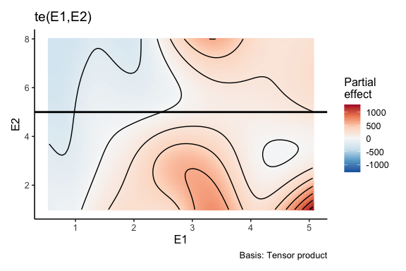
<p class="caption">(\#fig:partialderiv-empirical)Response surface of Colpidium. The two solid lines show at which level of nutrients and light each partial derivative is going to be calculated.</p>
</div>

(ref:partialeffectE1-empirical) Partial effect of nutrient concentration
on the growth rate of Colpidium when light intensity is held constant at
5.

<div class="figure" style="text-align: center">
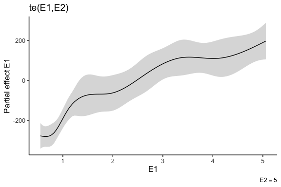
<p class="caption">(\#fig:partialeffectE1-empirical)(ref:partialeffectE1-empirical)</p>
</div>

(ref:partialE1-empirical) Partial derivative with respect to nutrient
when light intensity is constant at 5.

<div class="figure" style="text-align: center">
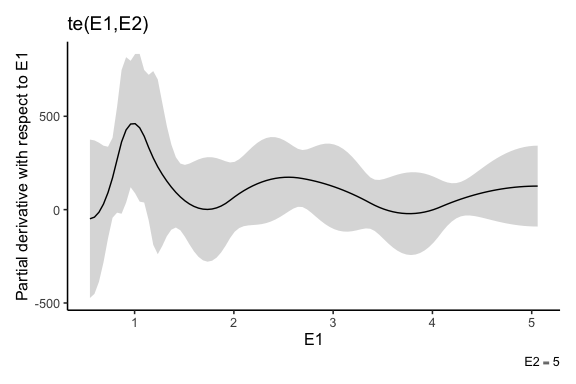
<p class="caption">(\#fig:partialE1-empirical)(ref:partialE1-empirical)</p>
</div>

## E2 - Light intensity

Second, we calculate the partial derivative with respect to light
intensity keeping nutrient concentration constant at 2.67.

(ref:partialderivE2-empirical) Response surface of Colpidium. The two
solid lines show at which level of nutrients and light each partial
derivative is going to be calculated. Not sure we get the gray areas...

<div class="figure" style="text-align: center">
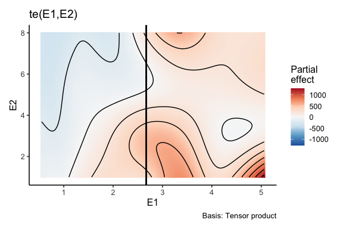
<p class="caption">(\#fig:partialderivE2-empirical)(ref:partialderivE2-empirical)</p>
</div>

(ref:partialeffectE2-empirical) Partial effect of light intensity on the
growth rate of Colpidium when nutrient concentration is held constant at
2.67.

<div class="figure" style="text-align: center">
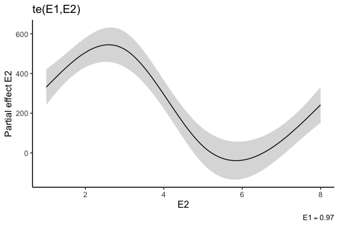
<p class="caption">(\#fig:partialeffectE2-empirical)(ref:partialeffectE2-empirical)</p>
</div>

(ref:partialE2-empirical) Partial derivative with respect to nutrient
when light intensity is constant at 5.

<div class="figure" style="text-align: center">

<p class="caption">(\#fig:partialE2-empirical)(ref:partialE2-empirical)</p>
</div>

### Plot surface and partial derivatives

Plot the two partial derivatives and relative effects

(ref:summary-empirical) Summary plot of Colpidium (a) response surface
of Colpidium (b) Partial effect of nutrient concentration on the density
of Colpidium when light intensity is held constant at 5. (c) Partial
derivative with respect to nutrient concentration when light intensity
is held constant at 5. (d) Partial effect of light intensity on the
growth rate of Colpidium when nutrient concentration is held constant at
2.67. (e) Partial derivative with respect to light intensity when
nutrient concentration is held constant at 2.67.

<div class="figure" style="text-align: center">
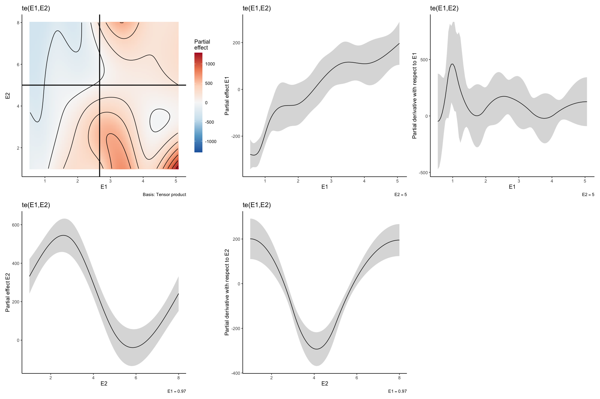
<p class="caption">(\#fig:summary-empirical)(ref:summary-empirical)</p>
</div>

# Directional deriviatives

To calculate the directional derivatives for all spp used in the
experiment, we first create a time series with nutrient concentration
and light intensity changing randomly over time, we fit GAMs
individually for each species, and then we calculate partial
derivatives.


Time series of nutrient concentration and light intensity changing over
time.

<div class="figure" style="text-align: center">
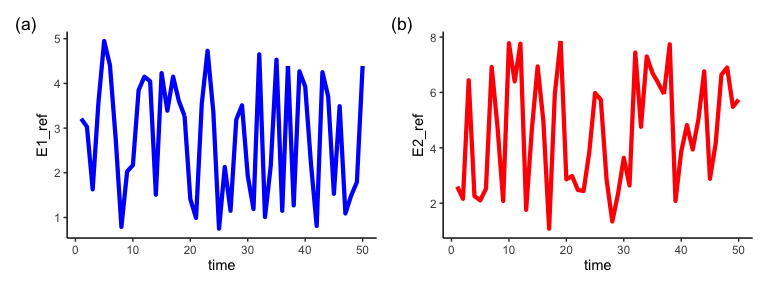
<p class="caption">(\#fig:RD-empirical)Time series of (a) nutrient concentration and (b) light intensity changing over time.</p>
</div>

Table with calculated partial derivatives for each sp at different times
(only first 6 rows shown).


|sp              | time| E1_ref| E2_ref|      pd_E1|      pd_E2|
|:---------------|----:|------:|------:|----------:|----------:|
|Loxocephalus_sp |    1|   3.21|   2.60|  -91.55572| -2084.3329|
|Loxocephalus_sp |    2|   3.03|   2.16|  183.80838| -2697.2600|
|Loxocephalus_sp |    3|   1.63|   6.44|  506.56890|  -407.9964|
|Loxocephalus_sp |    4|   3.57|   2.26| -123.26951| -2849.1636|
|Loxocephalus_sp |    5|   4.95|   2.10| -811.63298| -3857.7894|
|Loxocephalus_sp |    6|   4.41|   2.52| -731.22411| -2614.8223|

## Calculating response diversity for a specific community composition

First, we need to calculate the directional derivatives in the direction
of the env change.


|sp              | time| E1_ref| E2_ref|      pd_E1|      pd_E2| nxt_value_E1| nxt_value_E2| del_E1| del_E2| unit_vec_mag|      uv_E1|      uv_E2|  dir_deriv|
|:---------------|----:|------:|------:|----------:|----------:|------------:|------------:|------:|------:|------------:|----------:|----------:|----------:|
|Loxocephalus_sp |    1|   3.21|   2.60|  -91.55572| -2084.3329|         3.03|         2.16|  -0.18|  -0.44|    0.4753946| -0.3786328| -0.9255470|  1963.8140|
|Loxocephalus_sp |    2|   3.03|   2.16|  183.80838| -2697.2600|         1.63|         6.44|  -1.40|   4.28|    4.5031544| -0.3108932|  0.9504449| -2620.7417|
|Loxocephalus_sp |    3|   1.63|   6.44|  506.56890|  -407.9964|         3.57|         2.26|   1.94|  -4.18|    4.6082535|  0.4209838| -0.9070682|   583.3379|
|Loxocephalus_sp |    4|   3.57|   2.26| -123.26951| -2849.1636|         4.95|         2.10|   1.38|  -0.16|    1.3892444|  0.9933457| -0.1151705|   205.6904|
|Loxocephalus_sp |    5|   4.95|   2.10| -811.63298| -3857.7894|         4.41|         2.52|  -0.54|   0.42|    0.6841053| -0.7893522|  0.6139406| -1727.7893|
|Loxocephalus_sp |    6|   4.41|   2.52| -731.22411| -2614.8223|         2.77|         6.92|  -1.64|   4.40|    4.6957002| -0.3492557|  0.9370275| -2194.7762|

Then we can calculate response diversity for an hypothetical community
containing all the species tested i this experiment.


| time| E1_ref| E2_ref|   Coleps_sp| Colpidium_striatum| Euplotes_daidaleos| Loxocephalus_sp| Paramecium_bursaria| Paramecium_caudatum| Stylonychia_sp|     rdiv|      sign| Med|
|----:|------:|------:|-----------:|------------------:|------------------:|---------------:|-------------------:|-------------------:|--------------:|--------:|---------:|---:|
|    1|   3.21|   2.60|  -27.448601|         217.619789|           1.147514|       1963.8140|          -236.10841|          -315.72134|    -357.506017| 6.000000| 0.2770050|   6|
|    2|   3.03|   2.16|   34.514399|         -64.109472|          -1.441875|      -2620.7417|            34.84294|           103.02576|       7.341996| 5.162808| 0.0756495|   6|
|    3|   1.63|   6.44|   94.141463|          -1.895059|           1.903645|        583.3379|           -66.26946|           191.36866|      28.433164| 5.956182| 0.2040293|   6|
|    4|   3.57|   2.26|   -9.742358|        -714.777817|           1.079887|        205.6904|           -75.77009|           220.01351|     470.023833| 5.999959| 0.4707222|   6|
|    5|   4.95|   2.10| -119.020009|        -933.655778|          -1.983241|      -1727.7893|          -591.14698|          -286.77297|    -790.127377| 6.000000| 0.0000000|   6|
|    6|   4.41|   2.52|  -49.306518|        -180.853602|          -2.167778|      -2194.7762|           -93.54209|            63.89528|    -175.152205| 6.000000| 0.0565778|   6|

Plot response diversity over time

<div class="figure" style="text-align: center">
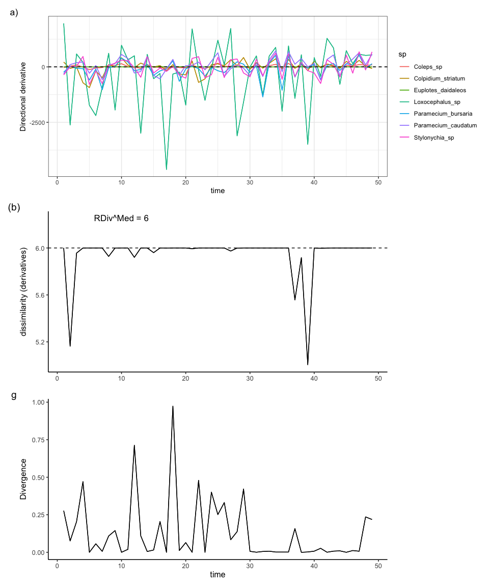
<p class="caption">(\#fig:RDempiricalplot)Directional derivatives and response diversity with known direction of env change. a. Species directional derivatives over time. b. Response diversity measured as similarity-based diversity metric. c. Response diversity measured as divergence (sign sensitive). </p>
</div>

## Different community compositions

Now we calculate response diversity for three different community
compositions we assembled randomly and we compare them.


Plotting


<div class="figure" style="text-align: center">
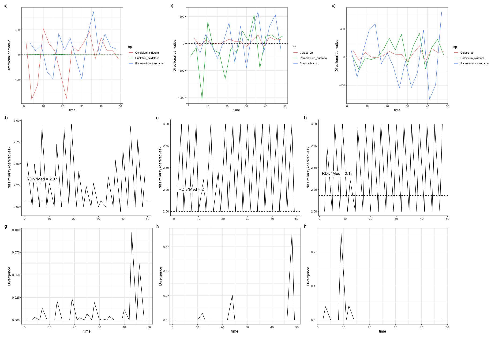
<p class="caption">(\#fig:RD-compositions)Directional derivatives and response diversity with known direction of env change for three different communities. a. Species directional derivatives over time. b. Response diversity measured as similarity-based diversity metric. c. Response diversity measured as divergence (sign sensitive).</p>
</div>


