# Introduction

Researchers have previous suggested that the response diversity of a community be measured by the diversity of responses to environmental change. For example, one can measure the response of each of the species' intrinsic growth rate to temperature, quantify the strength and direction of these responses (e.g., as the first derivative of the response curve), and calculate the diversity of responses (e.g., by calculating variation in the first derivatives among the species in a community). When responses are nonlinear, the response diversity will be a function of the environmental state (i.e. the first derivative is a function of the value of the environmental state). So far we demonstrated this approach for quantifying response diversity in the context of a single environmental factor, but given that multiple environmental factors can change simultaneously, we need an approach that works in that context.

# The principle

*To learn about the mathematical principles watch these youtube videos:*

* [Surfaces and Partial Derivatives](https://www.youtube.com/watch?v=k4wNIZr8GU4)
* [54. Slope of the Surface in Any Direction - Directional Derivative, and Properties of the Gradient](https://www.youtube.com/watch?v=wfjipWmyRYg)


Imagine that the growth rate of a population depends on two environmental factors, e.g. temperature and salinity. We can represent the dependency as $G = f(T, S)$, where $G$ is growth rate, $T$ is temperature, and $S$ is salinity. It may be that the dependencies are linear, nonlinear, and with an interaction between temperature and salinity, hence our approach needs to be able to accommodate this phenomena.

The response of growth rate to change in temperature and salinity is the gradient / slope of this surface, with units of growth rate [per time] per temperature [degrees C] per salinity [parts per thousand]. Because the slope (first derivative) of the surface can (when dependencies are nonlinear) vary across the surface (location on the surface), and can vary in different directions on the surface, to calculate a slope we must specify the current environment (location on the surface) and the direction of change in the environment. The location on the curve is the current environmental condition, $(T_0, S_0)$, and the direction of environmental change is the unit vector $\hat{u} = \langle U_T, U_S \rangle$.

Put another way, we calculate a directional derivative at a point on the response surface. We can write this as $D_{\hat{u}}f(T_0, S_0)$ and can calculate it as $f_T(T_0, S_0)U_T + f_S(T_0, S_0)U_S$, where $f_T$ is the partial derivative of $f(T, S)$ with respect to $T$ and $f_S$ is the partial derivative of $f(T, S)$ with respect to $S$.

Efficient evaluating in $n$ dimensions can be done by taking the dot product of the partial derivatives at the location and the direction unit vector: $D_{\hat{u}}f(T_0, S_0) = \triangledown f \cdot \hat{u}$ where, $\triangledown f  = \langle f_T, f_S \rangle$. (In R, the dot product of `a` and `b` is `sum(a*b)`)

Figure  \@ref(fig:surface-sketch) is an illustration of the principle of directional derivatives on a surface.

(ref:surface-sketch) This figure needs considerable improvement! It is currently a keynote illustration.

<div class="figure" style="text-align: center">

<p class="caption">(\#fig:surface-sketch)(ref:surface-sketch)</p>
</div>


# A simulated empirical example

Numerous mathematical functions have been used to represent how organismal performance changes with an environmental driver [citation require](). Moreover, multiple mathematical functions have been used to represent an interactive effect of two or more environmental drivers on species performance [e.g. Thomas et al 2017](https://onlinelibrary.wiley.com/doi/full/10.1111/gcb.13641). *We have to decide if we are going to make simulations with different of these functions. This might increase our confidence that the method for calculating response diversity is robust to variation in types of response curve. If we decide not to, then we should likey argue that we think its robust.*

## Simulating performance curves

Let us use the Eppley performance curve, which was used, for example, in this paper [Bernhardt et al. 2018](https://royalsocietypublishing.org/doi/10.1098/rspb.2018.1076).

With one environmental variable, the performance (i.e., rate) is given by:

* $rate(E) = ae^{bE}(1 - (\frac{E - z}{w/2})^2)$
* $E$ is the values of the environmental factor.
* $z$ controls location of maximum.
* $w$ controls range of $E$ over which the rate is positive.
* $a$ scaling constant.
* $b$ controls rate of increase towards the maximum rate, as $E$ increases.

Adding a second environmental variable gives:

$rate(E_1, E_2) = a_1e^{b_1E_1}(1 - (\frac{E_1 - z_1}{w_1/2})^2) + a_2e^{b_2E_2}(1 - (\frac{E_2 - z_2}{w_2/2})^2)$

In this case, it is clear the effect of $E_1$ and $E_2$ is defined as being additive. For example, the value of $E_2$ does not affect the value of $E_1$ at which the rate is maximised ($z_1$), and vice-versa (see also Figure \@ref(fig:add-epp-fig)) 


(ref:add-epp-fig) Nonlinear and additive dependence of a rate on two environmental variables. (a) The value of $E_1$ at which the rate is maximised is independent of the value of $E_2$. (b) The value of $E_2$ at which the rate is maximised is independent of the value of $E_1$. 


*Including an interaction*. One way to do this is to make the value of $E_1$ at which the rate is maximised depend on the value of $E_2$:

$rate(E_1, E_2) = a_1e^{b_1E_1}(1 - (\frac{(E_1 + z_{int21}*E_2- z_1)}{w_1/2})^2 + a_2e^{b_2E_2}(1 - (\frac{E_2 - z_2}{w_2/2})^2$

When $z_{int21} = 0$ then this equation becomes the previously mentioned additive one. When $z_{int} \neq 0$ then the value of $E_1$ at which the rate is maximised is a function of the value of $E_2$. We used this method for adding an interaction due to its simplicity. Other methods could be used, and if also or otherwise used could add confidence about the robustness of the method for calculating response diversity.


(ref:int-epp-fig) Nonlinear and non-additive dependence of a rate on two environmental variables. (a) The value of $E_1$ at which the rate is maximised depends on the value of $E_2$. (b) The value of $E_2$ at which the rate is maximised is independent of the value of $E_1$. 


## Simulating multiple species' performance curves

### No interacting environmental effects

First we create (or import) a table of parameter values of each species, with species in the rows and parameters in the columns. In the following example, only values of the $z$ parameters differ among the species (which determine the location of the maximum rate).


```{=html}
<div class="datatables html-widget html-fill-item-overflow-hidden html-fill-item" id="htmlwidget-801c52c2c787a968772a" style="width:100%;height:auto;"></div>
<script type="application/json" data-for="htmlwidget-801c52c2c787a968772a">{"x":{"filter":"top","vertical":false,"filterHTML":"<tr>\n  <td><\/td>\n  <td data-type=\"number\" style=\"vertical-align: top;\">\n    <div class=\"form-group has-feedback\" style=\"margin-bottom: auto;\">\n      <input type=\"search\" placeholder=\"All\" class=\"form-control\" style=\"width: 100%;\" disabled=\"\"/>\n      <span class=\"glyphicon glyphicon-remove-circle form-control-feedback\"><\/span>\n    <\/div>\n    <div style=\"display: none;position: absolute;width: 200px;opacity: 1\">\n      <div data-min=\"0\" data-max=\"1\" data-scale=\"9\"><\/div>\n      <span style=\"float: left;\"><\/span>\n      <span style=\"float: right;\"><\/span>\n    <\/div>\n  <\/td>\n  <td data-type=\"number\" style=\"vertical-align: top;\">\n    <div class=\"form-group has-feedback\" style=\"margin-bottom: auto;\">\n      <input type=\"search\" placeholder=\"All\" class=\"form-control\" style=\"width: 100%;\" disabled=\"\"/>\n      <span class=\"glyphicon glyphicon-remove-circle form-control-feedback\"><\/span>\n    <\/div>\n    <div style=\"display: none;position: absolute;width: 200px;opacity: 1\">\n      <div data-min=\"0\" data-max=\"1\" data-scale=\"3\"><\/div>\n      <span style=\"float: left;\"><\/span>\n      <span style=\"float: right;\"><\/span>\n    <\/div>\n  <\/td>\n  <td data-type=\"number\" style=\"vertical-align: top;\">\n    <div class=\"form-group has-feedback\" style=\"margin-bottom: auto;\">\n      <input type=\"search\" placeholder=\"All\" class=\"form-control\" style=\"width: 100%;\"/>\n      <span class=\"glyphicon glyphicon-remove-circle form-control-feedback\"><\/span>\n    <\/div>\n    <div style=\"display: none;position: absolute;width: 200px;opacity: 1\">\n      <div data-min=\"270.084014022723\" data-max=\"296.871775598265\" data-scale=\"13\"><\/div>\n      <span style=\"float: left;\"><\/span>\n      <span style=\"float: right;\"><\/span>\n    <\/div>\n  <\/td>\n  <td data-type=\"number\" style=\"vertical-align: top;\">\n    <div class=\"form-group has-feedback\" style=\"margin-bottom: auto;\">\n      <input type=\"search\" placeholder=\"All\" class=\"form-control\" style=\"width: 100%;\" disabled=\"\"/>\n      <span class=\"glyphicon glyphicon-remove-circle form-control-feedback\"><\/span>\n    <\/div>\n    <div style=\"display: none;position: absolute;width: 200px;opacity: 1\">\n      <div data-min=\"0\" data-max=\"1\"><\/div>\n      <span style=\"float: left;\"><\/span>\n      <span style=\"float: right;\"><\/span>\n    <\/div>\n  <\/td>\n  <td data-type=\"number\" style=\"vertical-align: top;\">\n    <div class=\"form-group has-feedback\" style=\"margin-bottom: auto;\">\n      <input type=\"search\" placeholder=\"All\" class=\"form-control\" style=\"width: 100%;\" disabled=\"\"/>\n      <span class=\"glyphicon glyphicon-remove-circle form-control-feedback\"><\/span>\n    <\/div>\n    <div style=\"display: none;position: absolute;width: 200px;opacity: 1\">\n      <div data-min=\"0\" data-max=\"1\" data-scale=\"3\"><\/div>\n      <span style=\"float: left;\"><\/span>\n      <span style=\"float: right;\"><\/span>\n    <\/div>\n  <\/td>\n  <td data-type=\"number\" style=\"vertical-align: top;\">\n    <div class=\"form-group has-feedback\" style=\"margin-bottom: auto;\">\n      <input type=\"search\" placeholder=\"All\" class=\"form-control\" style=\"width: 100%;\" disabled=\"\"/>\n      <span class=\"glyphicon glyphicon-remove-circle form-control-feedback\"><\/span>\n    <\/div>\n    <div style=\"display: none;position: absolute;width: 200px;opacity: 1\">\n      <div data-min=\"0\" data-max=\"1\" data-scale=\"2\"><\/div>\n      <span style=\"float: left;\"><\/span>\n      <span style=\"float: right;\"><\/span>\n    <\/div>\n  <\/td>\n  <td data-type=\"number\" style=\"vertical-align: top;\">\n    <div class=\"form-group has-feedback\" style=\"margin-bottom: auto;\">\n      <input type=\"search\" placeholder=\"All\" class=\"form-control\" style=\"width: 100%;\"/>\n      <span class=\"glyphicon glyphicon-remove-circle form-control-feedback\"><\/span>\n    <\/div>\n    <div style=\"display: none;position: absolute;width: 200px;opacity: 1\">\n      <div data-min=\"10.0129270693287\" data-max=\"26.7779199965298\" data-scale=\"14\"><\/div>\n      <span style=\"float: left;\"><\/span>\n      <span style=\"float: right;\"><\/span>\n    <\/div>\n  <\/td>\n  <td data-type=\"number\" style=\"vertical-align: top;\">\n    <div class=\"form-group has-feedback\" style=\"margin-bottom: auto;\">\n      <input type=\"search\" placeholder=\"All\" class=\"form-control\" style=\"width: 100%;\" disabled=\"\"/>\n      <span class=\"glyphicon glyphicon-remove-circle form-control-feedback\"><\/span>\n    <\/div>\n    <div style=\"display: none;position: absolute;width: 200px;opacity: 1\">\n      <div data-min=\"0\" data-max=\"1\"><\/div>\n      <span style=\"float: left;\"><\/span>\n      <span style=\"float: right;\"><\/span>\n    <\/div>\n  <\/td>\n  <td data-type=\"number\" style=\"vertical-align: top;\">\n    <div class=\"form-group has-feedback\" style=\"margin-bottom: auto;\">\n      <input type=\"search\" placeholder=\"All\" class=\"form-control\" style=\"width: 100%;\" disabled=\"\"/>\n      <span class=\"glyphicon glyphicon-remove-circle form-control-feedback\"><\/span>\n    <\/div>\n    <div style=\"display: none;position: absolute;width: 200px;opacity: 1\">\n      <div data-min=\"0\" data-max=\"1\"><\/div>\n      <span style=\"float: left;\"><\/span>\n      <span style=\"float: right;\"><\/span>\n    <\/div>\n  <\/td>\n  <td data-type=\"number\" style=\"vertical-align: top;\">\n    <div class=\"form-group has-feedback\" style=\"margin-bottom: auto;\">\n      <input type=\"search\" placeholder=\"All\" class=\"form-control\" style=\"width: 100%;\" disabled=\"\"/>\n      <span class=\"glyphicon glyphicon-remove-circle form-control-feedback\"><\/span>\n    <\/div>\n    <div style=\"display: none;position: absolute;width: 200px;opacity: 1\">\n      <div data-min=\"0\" data-max=\"1\"><\/div>\n      <span style=\"float: left;\"><\/span>\n      <span style=\"float: right;\"><\/span>\n    <\/div>\n  <\/td>\n<\/tr>","data":[["1","2","3","4","5","6","7","8","9","10"],[1e-09,1e-09,1e-09,1e-09,1e-09,1e-09,1e-09,1e-09,1e-09,1e-09],[0.063,0.063,0.063,0.063,0.063,0.063,0.063,0.063,0.063,0.063],[270.084014022723,277.091162335128,290.880527682602,286.016520692501,294.497439691331,291.006739914883,281.938274691347,294.50001725927,296.871775598265,272.563425118569],[60,60,60,60,60,60,60,60,60,60],[0.001,0.001,0.001,0.001,0.001,0.001,0.001,0.001,0.001,0.001],[0.02,0.02,0.02,0.02,0.02,0.02,0.02,0.02,0.02,0.02],[22.434567604214,16.4699217258021,10.0129270693287,24.2431184416637,16.1726777348667,25.7363655837253,26.7779199965298,15.4671661788598,23.1785696651787,20.3631447255611],[10,10,10,10,10,10,10,10,10,10],[0,0,0,0,0,0,0,0,0,0],[0,0,0,0,0,0,0,0,0,0]],"container":"<table class=\"display\">\n  <thead>\n    <tr>\n      <th> <\/th>\n      <th>a1<\/th>\n      <th>b1<\/th>\n      <th>z1<\/th>\n      <th>w1<\/th>\n      <th>a2<\/th>\n      <th>b2<\/th>\n      <th>z2<\/th>\n      <th>w2<\/th>\n      <th>z_int21<\/th>\n      <th>sd_rate<\/th>\n    <\/tr>\n  <\/thead>\n<\/table>","options":{"columnDefs":[{"className":"dt-right","targets":[1,2,3,4,5,6,7,8,9,10]},{"orderable":false,"targets":0}],"order":[],"autoWidth":false,"orderClasses":false,"orderCellsTop":true}},"evals":[],"jsHooks":[]}</script>
```

For convenience we then convert the table of parameters into a [list-column](https://dcl-prog.stanford.edu/list-columns.html). We can then easily make performance curves of each of the species, and put those into a list-column in the same table.


```r
## convert parameter table to a list-column of a tibble
par_list <- Partable_2_parlist(par_table)
## add performance curves
species_pars <- tibble(species = paste0("s", 1:s), pars = par_list) %>%
  rowwise() %>%
  mutate(expt = Make_expt(E1_series, E2_series, pars))
```

Here are some examples of the species' performance curves (only with additive effects of $E_1$ and $E_2$).

(ref:lowE1-opt-species) Performance curves for a species with maximum growth at **low** values of $E_1$.  Without interacting environmental effects.

<div class="figure" style="text-align: center">

<p class="caption">(\#fig:lowE1-opt-species)(ref:lowE1-opt-species)</p>
</div>

(ref:highE1-opt-species) Performance curves for a species with maximum growth at **high** values of $E_1$. Without interacting environmental effects.

<div class="figure" style="text-align: center">

<p class="caption">(\#fig:highE1-opt-species)(ref:highE1-opt-species)</p>
</div>

(ref:lowE2-opt-species) Performance curves for a species with maximum growth at **low** values of $E_2$. Without interacting environmental effects.

<div class="figure" style="text-align: center">

<p class="caption">(\#fig:lowE2-opt-species)(ref:lowE2-opt-species)</p>
</div>

(ref:highE2-opt-species) Performance curves for a species with maximum growth at **high** values of $E_2$. Without interacting environmental effects.

<div class="figure" style="text-align: center">

<p class="caption">(\#fig:highE2-opt-species)(ref:highE2-opt-species)</p>
</div>


### Interacting environmental effects

And now with interacting environmental effects...


```{=html}
<div class="datatables html-widget html-fill-item-overflow-hidden html-fill-item" id="htmlwidget-72c825a07bae6269aded" style="width:100%;height:auto;"></div>
<script type="application/json" data-for="htmlwidget-72c825a07bae6269aded">{"x":{"filter":"top","vertical":false,"filterHTML":"<tr>\n  <td><\/td>\n  <td data-type=\"number\" style=\"vertical-align: top;\">\n    <div class=\"form-group has-feedback\" style=\"margin-bottom: auto;\">\n      <input type=\"search\" placeholder=\"All\" class=\"form-control\" style=\"width: 100%;\" disabled=\"\"/>\n      <span class=\"glyphicon glyphicon-remove-circle form-control-feedback\"><\/span>\n    <\/div>\n    <div style=\"display: none;position: absolute;width: 200px;opacity: 1\">\n      <div data-min=\"0\" data-max=\"1\" data-scale=\"9\"><\/div>\n      <span style=\"float: left;\"><\/span>\n      <span style=\"float: right;\"><\/span>\n    <\/div>\n  <\/td>\n  <td data-type=\"number\" style=\"vertical-align: top;\">\n    <div class=\"form-group has-feedback\" style=\"margin-bottom: auto;\">\n      <input type=\"search\" placeholder=\"All\" class=\"form-control\" style=\"width: 100%;\" disabled=\"\"/>\n      <span class=\"glyphicon glyphicon-remove-circle form-control-feedback\"><\/span>\n    <\/div>\n    <div style=\"display: none;position: absolute;width: 200px;opacity: 1\">\n      <div data-min=\"0\" data-max=\"1\" data-scale=\"3\"><\/div>\n      <span style=\"float: left;\"><\/span>\n      <span style=\"float: right;\"><\/span>\n    <\/div>\n  <\/td>\n  <td data-type=\"number\" style=\"vertical-align: top;\">\n    <div class=\"form-group has-feedback\" style=\"margin-bottom: auto;\">\n      <input type=\"search\" placeholder=\"All\" class=\"form-control\" style=\"width: 100%;\"/>\n      <span class=\"glyphicon glyphicon-remove-circle form-control-feedback\"><\/span>\n    <\/div>\n    <div style=\"display: none;position: absolute;width: 200px;opacity: 1\">\n      <div data-min=\"271.357648316771\" data-max=\"295.299732657149\" data-scale=\"13\"><\/div>\n      <span style=\"float: left;\"><\/span>\n      <span style=\"float: right;\"><\/span>\n    <\/div>\n  <\/td>\n  <td data-type=\"number\" style=\"vertical-align: top;\">\n    <div class=\"form-group has-feedback\" style=\"margin-bottom: auto;\">\n      <input type=\"search\" placeholder=\"All\" class=\"form-control\" style=\"width: 100%;\" disabled=\"\"/>\n      <span class=\"glyphicon glyphicon-remove-circle form-control-feedback\"><\/span>\n    <\/div>\n    <div style=\"display: none;position: absolute;width: 200px;opacity: 1\">\n      <div data-min=\"0\" data-max=\"1\"><\/div>\n      <span style=\"float: left;\"><\/span>\n      <span style=\"float: right;\"><\/span>\n    <\/div>\n  <\/td>\n  <td data-type=\"number\" style=\"vertical-align: top;\">\n    <div class=\"form-group has-feedback\" style=\"margin-bottom: auto;\">\n      <input type=\"search\" placeholder=\"All\" class=\"form-control\" style=\"width: 100%;\" disabled=\"\"/>\n      <span class=\"glyphicon glyphicon-remove-circle form-control-feedback\"><\/span>\n    <\/div>\n    <div style=\"display: none;position: absolute;width: 200px;opacity: 1\">\n      <div data-min=\"0\" data-max=\"1\" data-scale=\"3\"><\/div>\n      <span style=\"float: left;\"><\/span>\n      <span style=\"float: right;\"><\/span>\n    <\/div>\n  <\/td>\n  <td data-type=\"number\" style=\"vertical-align: top;\">\n    <div class=\"form-group has-feedback\" style=\"margin-bottom: auto;\">\n      <input type=\"search\" placeholder=\"All\" class=\"form-control\" style=\"width: 100%;\" disabled=\"\"/>\n      <span class=\"glyphicon glyphicon-remove-circle form-control-feedback\"><\/span>\n    <\/div>\n    <div style=\"display: none;position: absolute;width: 200px;opacity: 1\">\n      <div data-min=\"0\" data-max=\"1\" data-scale=\"2\"><\/div>\n      <span style=\"float: left;\"><\/span>\n      <span style=\"float: right;\"><\/span>\n    <\/div>\n  <\/td>\n  <td data-type=\"number\" style=\"vertical-align: top;\">\n    <div class=\"form-group has-feedback\" style=\"margin-bottom: auto;\">\n      <input type=\"search\" placeholder=\"All\" class=\"form-control\" style=\"width: 100%;\"/>\n      <span class=\"glyphicon glyphicon-remove-circle form-control-feedback\"><\/span>\n    <\/div>\n    <div style=\"display: none;position: absolute;width: 200px;opacity: 1\">\n      <div data-min=\"11.0968862567097\" data-max=\"27.2984294313937\" data-scale=\"14\"><\/div>\n      <span style=\"float: left;\"><\/span>\n      <span style=\"float: right;\"><\/span>\n    <\/div>\n  <\/td>\n  <td data-type=\"number\" style=\"vertical-align: top;\">\n    <div class=\"form-group has-feedback\" style=\"margin-bottom: auto;\">\n      <input type=\"search\" placeholder=\"All\" class=\"form-control\" style=\"width: 100%;\" disabled=\"\"/>\n      <span class=\"glyphicon glyphicon-remove-circle form-control-feedback\"><\/span>\n    <\/div>\n    <div style=\"display: none;position: absolute;width: 200px;opacity: 1\">\n      <div data-min=\"0\" data-max=\"1\"><\/div>\n      <span style=\"float: left;\"><\/span>\n      <span style=\"float: right;\"><\/span>\n    <\/div>\n  <\/td>\n  <td data-type=\"number\" style=\"vertical-align: top;\">\n    <div class=\"form-group has-feedback\" style=\"margin-bottom: auto;\">\n      <input type=\"search\" placeholder=\"All\" class=\"form-control\" style=\"width: 100%;\"/>\n      <span class=\"glyphicon glyphicon-remove-circle form-control-feedback\"><\/span>\n    <\/div>\n    <div style=\"display: none;position: absolute;width: 200px;opacity: 1\">\n      <div data-min=\"-0.242164493335918\" data-max=\"-0.1396200451061\" data-scale=\"15\"><\/div>\n      <span style=\"float: left;\"><\/span>\n      <span style=\"float: right;\"><\/span>\n    <\/div>\n  <\/td>\n  <td data-type=\"number\" style=\"vertical-align: top;\">\n    <div class=\"form-group has-feedback\" style=\"margin-bottom: auto;\">\n      <input type=\"search\" placeholder=\"All\" class=\"form-control\" style=\"width: 100%;\" disabled=\"\"/>\n      <span class=\"glyphicon glyphicon-remove-circle form-control-feedback\"><\/span>\n    <\/div>\n    <div style=\"display: none;position: absolute;width: 200px;opacity: 1\">\n      <div data-min=\"0\" data-max=\"1\"><\/div>\n      <span style=\"float: left;\"><\/span>\n      <span style=\"float: right;\"><\/span>\n    <\/div>\n  <\/td>\n<\/tr>","data":[["1","2","3","4","5","6","7","8","9","10"],[1e-09,1e-09,1e-09,1e-09,1e-09,1e-09,1e-09,1e-09,1e-09,1e-09],[0.063,0.063,0.063,0.063,0.063,0.063,0.063,0.063,0.063,0.063],[288.354849403258,271.357648316771,286.300132074393,272.106599032413,284.935023745056,279.786555566825,295.299732657149,288.789769064169,274.479032030795,280.406717893202],[60,60,60,60,60,60,60,60,60,60],[0.001,0.001,0.001,0.001,0.001,0.001,0.001,0.001,0.001,0.001],[0.02,0.02,0.02,0.02,0.02,0.02,0.02,0.02,0.02,0.02],[27.06988717895,12.6090735010803,21.7647998407483,21.3384760916233,25.3184265876189,27.2984294313937,11.0968862567097,13.9972907165065,27.274556402117,18.3316139038652],[10,10,10,10,10,10,10,10,10,10],[-0.201642219638534,-0.228507629167015,-0.217486977906434,-0.1396200451061,-0.18356941957818,-0.180088470986822,-0.210827960997092,-0.229017128062291,-0.242164493335918,-0.180328044210025],[0,0,0,0,0,0,0,0,0,0]],"container":"<table class=\"display\">\n  <thead>\n    <tr>\n      <th> <\/th>\n      <th>a1<\/th>\n      <th>b1<\/th>\n      <th>z1<\/th>\n      <th>w1<\/th>\n      <th>a2<\/th>\n      <th>b2<\/th>\n      <th>z2<\/th>\n      <th>w2<\/th>\n      <th>z_int21<\/th>\n      <th>sd_rate<\/th>\n    <\/tr>\n  <\/thead>\n<\/table>","options":{"columnDefs":[{"className":"dt-right","targets":[1,2,3,4,5,6,7,8,9,10]},{"orderable":false,"targets":0}],"order":[],"autoWidth":false,"orderClasses":false,"orderCellsTop":true}},"evals":[],"jsHooks":[]}</script>
```

For convenience we then convert the table of parameters into a [list-column](https://dcl-prog.stanford.edu/list-columns.html). We can then easily make performance curves of each of the species, and put those into a list-column in the same table.


```r
## convert parameter table to a list-column of a tibble
par_list <- Partable_2_parlist(par_table)
## add performance curves
species_pars <- tibble(species = paste0("s", 1:s), pars = par_list) %>%
  rowwise() %>%
  mutate(expt = Make_expt(E1_series, E2_series, pars))
```

Here are some examples of the species' performance curves (with interacting effects of $E_1$ and $E_2$).

(ref:lowE1-opt-species1) Performance curves for a species with maximum growth at **low** values of $E_1$. With interacting environmental effects.

<div class="figure" style="text-align: center">

<p class="caption">(\#fig:lowE1-opt-species1)(ref:lowE1-opt-species1)</p>
</div>

(ref:highE1-opt-species2) Performance curves for a species with maximum growth at **high** values of $E_1$.  With interacting environmental effects.

<div class="figure" style="text-align: center">

<p class="caption">(\#fig:highE1-opt-species2)(ref:highE1-opt-species2)</p>
</div>

(ref:lowE2-opt-species2) Performance curves for a species with maximum growth at **low** values of $E_2$. With interacting environmental effects.

<div class="figure" style="text-align: center">

<p class="caption">(\#fig:lowE2-opt-species2)(ref:lowE2-opt-species2)</p>
</div>

(ref:highE2-opt-species2) Performance curves for a species with maximum growth at **high** values of $E_2$. With interacting environmental effects.

<div class="figure" style="text-align: center">

<p class="caption">(\#fig:highE2-opt-species2)(ref:highE2-opt-species2)</p>
</div>


## Fitting GAMs to noisy rate observations

Try with and without an interaction. Therefore make two species, one with no interaction `z_int = 0` and the other with `z_int = 0.1`. All other parameters are the same. Note that noise is added to the rate observations.

Bottom line is that the gam picks up an interaction when we have included one in the parameters used to generate the rates, and does not pick one up when we have not. This confirms that our more mechanistic thinking and methods are matching our statistical thinking and methods, and confirms that each are promising, so far.

GAM notes:

* Owen watched this youtube video [Introduction to Generalized Additive Models with R and mgcv](https://youtu.be/sgw4cu8hrZM) by Gavin Simpson (author of the `gratia` package that we've been using to calculate derivatives of GAMs.). By the way, there is a part of this video about Model Selection, about Confidence Intervals, and about p-values for smooths (about 1h:57m to 2h:26) which I think is less useful for our purposes.
* In the video mentioned above [at about 54m:30s](https://youtu.be/sgw4cu8hrZM?t=2730), there is the recommendation to estimate the penalisation parameter ($\lambda$) via restricted maximum likelihood, which is done by giving the the argument `method = "REML` in the `gam()` call (the default in `mgcv` version 1.8-36 is `method="GCV.Cp"`).
* Default smoother is a *low rank thin plate spline* (`bs = "tp"`)
* `s(E1, E2) will fit a *bivariate isotropic thin plate spline*. *Isoptropic* means there is a single smoothness parameter for the smooth. It is sensitive to the scale of $E1$ and $E2$.
* Tensor products (`te(E1, E2`) have separate marginal basis, and therefore separate smoothness parameters. They are invariant to scales of $E1$ and $E2$. Therefore we should be using tensor products.
* Specifying a model with `te(E1, E2`) does not then allow inspection of the main effects and interaction term--there is essentially only one smoother which contains the main effects and interaction. So it is difficult to know if the interaction term is required. An alternative is to specify the model as `s(E1) + s(E2) + ti(E1, E2)`, in which the third term is then only the interaction part and allows a decomposition into the different effects. Useful for examining if the interaction is required.
* To use cubic splines use `bs = "cr"`.
* There are many smoothers in `mgcv`
* Choosing *k* (the *basis complexity*, which is the maximum wiggliness) is a bit of an art. The penalty then shrinks the used basis complexity, reducing the effective degrees of freedom. Must check that large enough *k* is provided; use `gam.check()`. Only cost to large $k$ is computational effort.


```{=html}
<div class="datatables html-widget html-fill-item-overflow-hidden html-fill-item" id="htmlwidget-50183d2477ae83a82ee4" style="width:100%;height:auto;"></div>
<script type="application/json" data-for="htmlwidget-50183d2477ae83a82ee4">{"x":{"filter":"top","vertical":false,"filterHTML":"<tr>\n  <td><\/td>\n  <td data-type=\"number\" style=\"vertical-align: top;\">\n    <div class=\"form-group has-feedback\" style=\"margin-bottom: auto;\">\n      <input type=\"search\" placeholder=\"All\" class=\"form-control\" style=\"width: 100%;\" disabled=\"\"/>\n      <span class=\"glyphicon glyphicon-remove-circle form-control-feedback\"><\/span>\n    <\/div>\n    <div style=\"display: none;position: absolute;width: 200px;opacity: 1\">\n      <div data-min=\"0\" data-max=\"1\" data-scale=\"9\"><\/div>\n      <span style=\"float: left;\"><\/span>\n      <span style=\"float: right;\"><\/span>\n    <\/div>\n  <\/td>\n  <td data-type=\"number\" style=\"vertical-align: top;\">\n    <div class=\"form-group has-feedback\" style=\"margin-bottom: auto;\">\n      <input type=\"search\" placeholder=\"All\" class=\"form-control\" style=\"width: 100%;\" disabled=\"\"/>\n      <span class=\"glyphicon glyphicon-remove-circle form-control-feedback\"><\/span>\n    <\/div>\n    <div style=\"display: none;position: absolute;width: 200px;opacity: 1\">\n      <div data-min=\"0\" data-max=\"1\" data-scale=\"3\"><\/div>\n      <span style=\"float: left;\"><\/span>\n      <span style=\"float: right;\"><\/span>\n    <\/div>\n  <\/td>\n  <td data-type=\"number\" style=\"vertical-align: top;\">\n    <div class=\"form-group has-feedback\" style=\"margin-bottom: auto;\">\n      <input type=\"search\" placeholder=\"All\" class=\"form-control\" style=\"width: 100%;\" disabled=\"\"/>\n      <span class=\"glyphicon glyphicon-remove-circle form-control-feedback\"><\/span>\n    <\/div>\n    <div style=\"display: none;position: absolute;width: 200px;opacity: 1\">\n      <div data-min=\"0\" data-max=\"1\"><\/div>\n      <span style=\"float: left;\"><\/span>\n      <span style=\"float: right;\"><\/span>\n    <\/div>\n  <\/td>\n  <td data-type=\"number\" style=\"vertical-align: top;\">\n    <div class=\"form-group has-feedback\" style=\"margin-bottom: auto;\">\n      <input type=\"search\" placeholder=\"All\" class=\"form-control\" style=\"width: 100%;\" disabled=\"\"/>\n      <span class=\"glyphicon glyphicon-remove-circle form-control-feedback\"><\/span>\n    <\/div>\n    <div style=\"display: none;position: absolute;width: 200px;opacity: 1\">\n      <div data-min=\"0\" data-max=\"1\"><\/div>\n      <span style=\"float: left;\"><\/span>\n      <span style=\"float: right;\"><\/span>\n    <\/div>\n  <\/td>\n  <td data-type=\"number\" style=\"vertical-align: top;\">\n    <div class=\"form-group has-feedback\" style=\"margin-bottom: auto;\">\n      <input type=\"search\" placeholder=\"All\" class=\"form-control\" style=\"width: 100%;\" disabled=\"\"/>\n      <span class=\"glyphicon glyphicon-remove-circle form-control-feedback\"><\/span>\n    <\/div>\n    <div style=\"display: none;position: absolute;width: 200px;opacity: 1\">\n      <div data-min=\"0\" data-max=\"1\" data-scale=\"3\"><\/div>\n      <span style=\"float: left;\"><\/span>\n      <span style=\"float: right;\"><\/span>\n    <\/div>\n  <\/td>\n  <td data-type=\"number\" style=\"vertical-align: top;\">\n    <div class=\"form-group has-feedback\" style=\"margin-bottom: auto;\">\n      <input type=\"search\" placeholder=\"All\" class=\"form-control\" style=\"width: 100%;\" disabled=\"\"/>\n      <span class=\"glyphicon glyphicon-remove-circle form-control-feedback\"><\/span>\n    <\/div>\n    <div style=\"display: none;position: absolute;width: 200px;opacity: 1\">\n      <div data-min=\"0\" data-max=\"1\" data-scale=\"2\"><\/div>\n      <span style=\"float: left;\"><\/span>\n      <span style=\"float: right;\"><\/span>\n    <\/div>\n  <\/td>\n  <td data-type=\"number\" style=\"vertical-align: top;\">\n    <div class=\"form-group has-feedback\" style=\"margin-bottom: auto;\">\n      <input type=\"search\" placeholder=\"All\" class=\"form-control\" style=\"width: 100%;\" disabled=\"\"/>\n      <span class=\"glyphicon glyphicon-remove-circle form-control-feedback\"><\/span>\n    <\/div>\n    <div style=\"display: none;position: absolute;width: 200px;opacity: 1\">\n      <div data-min=\"0\" data-max=\"1\"><\/div>\n      <span style=\"float: left;\"><\/span>\n      <span style=\"float: right;\"><\/span>\n    <\/div>\n  <\/td>\n  <td data-type=\"number\" style=\"vertical-align: top;\">\n    <div class=\"form-group has-feedback\" style=\"margin-bottom: auto;\">\n      <input type=\"search\" placeholder=\"All\" class=\"form-control\" style=\"width: 100%;\" disabled=\"\"/>\n      <span class=\"glyphicon glyphicon-remove-circle form-control-feedback\"><\/span>\n    <\/div>\n    <div style=\"display: none;position: absolute;width: 200px;opacity: 1\">\n      <div data-min=\"0\" data-max=\"1\"><\/div>\n      <span style=\"float: left;\"><\/span>\n      <span style=\"float: right;\"><\/span>\n    <\/div>\n  <\/td>\n  <td data-type=\"number\" style=\"vertical-align: top;\">\n    <div class=\"form-group has-feedback\" style=\"margin-bottom: auto;\">\n      <input type=\"search\" placeholder=\"All\" class=\"form-control\" style=\"width: 100%;\"/>\n      <span class=\"glyphicon glyphicon-remove-circle form-control-feedback\"><\/span>\n    <\/div>\n    <div style=\"display: none;position: absolute;width: 200px;opacity: 1\">\n      <div data-min=\"-0.2\" data-max=\"0\" data-scale=\"1\"><\/div>\n      <span style=\"float: left;\"><\/span>\n      <span style=\"float: right;\"><\/span>\n    <\/div>\n  <\/td>\n  <td data-type=\"number\" style=\"vertical-align: top;\">\n    <div class=\"form-group has-feedback\" style=\"margin-bottom: auto;\">\n      <input type=\"search\" placeholder=\"All\" class=\"form-control\" style=\"width: 100%;\" disabled=\"\"/>\n      <span class=\"glyphicon glyphicon-remove-circle form-control-feedback\"><\/span>\n    <\/div>\n    <div style=\"display: none;position: absolute;width: 200px;opacity: 1\">\n      <div data-min=\"0\" data-max=\"1\" data-scale=\"2\"><\/div>\n      <span style=\"float: left;\"><\/span>\n      <span style=\"float: right;\"><\/span>\n    <\/div>\n  <\/td>\n<\/tr>","data":[["1","2"],[1e-09,1e-09],[0.063,0.063],[285,285],[60,60],[0.001,0.001],[0.02,0.02],[20,20],[10,10],[0,-0.2],[0.02,0.02]],"container":"<table class=\"display\">\n  <thead>\n    <tr>\n      <th> <\/th>\n      <th>a1<\/th>\n      <th>b1<\/th>\n      <th>z1<\/th>\n      <th>w1<\/th>\n      <th>a2<\/th>\n      <th>b2<\/th>\n      <th>z2<\/th>\n      <th>w2<\/th>\n      <th>z_int21<\/th>\n      <th>sd_rate<\/th>\n    <\/tr>\n  <\/thead>\n<\/table>","options":{"columnDefs":[{"className":"dt-right","targets":[1,2,3,4,5,6,7,8,9,10]},{"orderable":false,"targets":0}],"order":[],"autoWidth":false,"orderClasses":false,"orderCellsTop":true}},"evals":[],"jsHooks":[]}</script>
```

### Without interaction


(ref:gamtest-species1) Performance curves for a species *without* interacting environmental effects and with some noise in the rate.

<div class="figure" style="text-align: center">

<p class="caption">(\#fig:gamtest-species1)(ref:gamtest-species1)</p>
</div>


```
## 
## Family: gaussian 
## Link function: identity 
## 
## Formula:
## rate ~ ti(E1) + ti(E2) + te(E1, E2)
## 
## Parametric coefficients:
##             Estimate Std. Error t value Pr(>|t|)    
## (Intercept) 0.015428   0.000499   30.92   <2e-16 ***
## ---
## Signif. codes:  0 '***' 0.001 '**' 0.01 '*' 0.05 '.' 0.1 ' ' 1
## 
## Approximate significance of smooth terms:
##                edf Ref.df       F p-value    
## ti(E1)    3.999310  4.000 14148.5  <2e-16 ***
## ti(E2)    3.936725  3.997   608.8  <2e-16 ***
## te(E1,E2) 0.001897 16.000     0.0   0.992    
## ---
## Signif. codes:  0 '***' 0.001 '**' 0.01 '*' 0.05 '.' 0.1 ' ' 1
## 
## R-sq.(adj) =  0.958   Deviance explained = 95.8%
## -REML = -5820.5  Scale est. = 0.00064775  n = 2601
```

<!-- -->


```
## 
## Family: gaussian 
## Link function: identity 
## 
## Formula:
## rate ~ s(E1) + s(E2)
## 
## Parametric coefficients:
##              Estimate Std. Error t value Pr(>|t|)    
## (Intercept) 0.0154285  0.0003952   39.04   <2e-16 ***
## ---
## Signif. codes:  0 '***' 0.001 '**' 0.01 '*' 0.05 '.' 0.1 ' ' 1
## 
## Approximate significance of smooth terms:
##         edf Ref.df       F p-value    
## s(E1) 8.970  9.000 10199.8  <2e-16 ***
## s(E2) 7.146  8.187   475.4  <2e-16 ***
## ---
## Signif. codes:  0 '***' 0.001 '**' 0.01 '*' 0.05 '.' 0.1 ' ' 1
## 
## R-sq.(adj) =  0.974   Deviance explained = 97.4%
## -REML = -6407.3  Scale est. = 0.00040624  n = 2601
```

<!-- -->


### With interaction


(ref:gamtest-species2) Performance curves for a species *with* interacting environmental effects and with some noise in the rate.

<div class="figure" style="text-align: center">
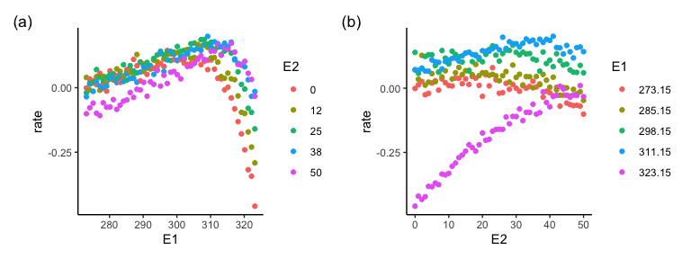
<p class="caption">(\#fig:gamtest-species2)(ref:gamtest-species2)</p>
</div>


```
## 
## Family: gaussian 
## Link function: identity 
## 
## Formula:
## rate ~ ti(E1) + ti(E2) + te(E1, E2)
## 
## Parametric coefficients:
##              Estimate Std. Error t value Pr(>|t|)    
## (Intercept) 0.0656082  0.0004677   140.3   <2e-16 ***
## ---
## Signif. codes:  0 '***' 0.001 '**' 0.01 '*' 0.05 '.' 0.1 ' ' 1
## 
## Approximate significance of smooth terms:
##              edf Ref.df      F p-value    
## ti(E1)     3.991  3.999 1899.8  <2e-16 ***
## ti(E2)     3.991  4.000  302.6  <2e-16 ***
## te(E1,E2) 15.614 16.000  489.1  <2e-16 ***
## ---
## Signif. codes:  0 '***' 0.001 '**' 0.01 '*' 0.05 '.' 0.1 ' ' 1
## 
## R-sq.(adj) =  0.924   Deviance explained = 92.5%
## -REML = -5943.3  Scale est. = 0.00056892  n = 2601
```

<!-- -->


```
## 
## Family: gaussian 
## Link function: identity 
## 
## Formula:
## rate ~ s(E1) + s(E2)
## 
## Parametric coefficients:
##              Estimate Std. Error t value Pr(>|t|)    
## (Intercept) 0.0656082  0.0009042   72.56   <2e-16 ***
## ---
## Signif. codes:  0 '***' 0.001 '**' 0.01 '*' 0.05 '.' 0.1 ' ' 1
## 
## Approximate significance of smooth terms:
##         edf Ref.df     F p-value    
## s(E1) 8.561  8.945 672.0  <2e-16 ***
## s(E2) 4.421  5.434 101.2  <2e-16 ***
## ---
## Signif. codes:  0 '***' 0.001 '**' 0.01 '*' 0.05 '.' 0.1 ' ' 1
## 
## R-sq.(adj) =  0.717   Deviance explained = 71.8%
## GCV = 0.0021379  Scale est. = 0.0021264  n = 2601
```

<!-- -->


# Partial derivatives 

First step in calculating directional derivatives is estimating the two partial derivatives $f_{E1}(E1_0, E2_0)$ and $f_{E2}(E1_0, E2_0)$ (please review the section [The principle] if necessary). 

## Getting the partial derivatives


Partial derivatives.
Draw response surface for sp 1 and calculate partial derivatives at a specific location (E1 = 300, E2 = 20).
To calculate the partial derivative with respect to E1, E2 must be held constant. 

(ref:partialderiv-species1) Response surface of sp1. The two solid lines show at which level of E1 and E2 each partial derivative is going to be calculated (E1 = 300, E2 = 20).


Visualising the partial effect of E1 at a fixed level of E2.

(ref:partialeffectE1-species1) Partial effect of E1 on the growth rate of sp 1 when E2 is held constant at E2 = 20.

<div class="figure" style="text-align: center">
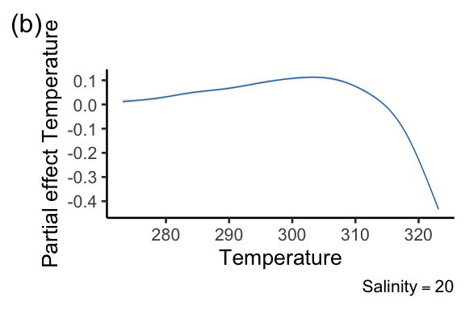
<p class="caption">(\#fig:partialeffectE1-species1)(ref:partialeffectE1-species1)</p>
</div>

Partial derivative with respect to E1 when E2 is constant at 20. 

(ref:partialE1-species1) Partial derivative with respect to E1 when E2 is constant at 20. 

<div class="figure" style="text-align: center">

<p class="caption">(\#fig:partialE1-species1)(ref:partialE1-species1)</p>
</div>


Partial derivatives with respect to E2 (E1 held constant)

(ref:partialderivE2-species1) Response surface of sp1. The two solid lines show at which level of E1 and E2 each partial derivative is going to be calculated.


Partial effect of E2 on the growth rate of sp 1 when E1 is held constat at E2 = 300

(ref:partialeffectE2-species1) Partial effect of E2 on the growth rate of sp 1 when E1 is held constant at E1 = 300

<div class="figure" style="text-align: center">

<p class="caption">(\#fig:partialeffectE2-species1)(ref:partialeffectE2-species1)</p>
</div>


Partial derivative with respect to E2 when E1 is constant at 300

(ref:partialE2-species1) Partial derivative with respect to E1 when E2 is constant at 20.

<div class="figure" style="text-align: center">

<p class="caption">(\#fig:partialE2-species1)(ref:partialE2-species1)</p>
</div>

Plot the two partial derivatives and relative effects

(ref:summary-species1) Summary plot sp1. (a) response surface of sp 1. (b) Partial effect of E1 on the growth rate of sp 1 when E2 is held constant at E2 = 20. (c) Partial derivative with respect to E1 when E2 is constant at 20. (d) Partial effect of E2 on the growth rate of sp 1 when E1 is held constant at E1 = 300. (e) Partial derivative with respect to E2 when E1 is constant at 300.


# Directional derivatives 

## No direction of environmental change specified
### One point
We start showing how directional derivatives can be calculated even when the direction of the environmental change is unknown. This may be the case when we want to calculate response diversity for future scenarios, and the future direction of environmental change is thus not known. Or we may have data for a species or a community at only one environmental location (E1 = x, E2 = y). It is therefore important to be able to measure directional derivatives when the direction of the environmental change is unknown, as this can provide useful information on response diversity nonetheless, for instance, by taking the mean of the slopes calculates in all directions.  
Measuring response diversity when the direction of environmental change is unknown may represent a way to systematically measuring response diversity to all possible environmental changes. This is represents, in our view, an absolute measure of overall response diversity, since it captures the complete insurance capacity of a system under all possible environmental conditions. We thus put some emphasis on this approach here.


Here, we calculate, for a specific point (E1 = 300, E2 = 20), directional derivatives in all directions. 

(ref:one-point-all-directions) Directional derivatives calculated in all possible direction for a specific point on the response surface of sp1. Clearly, the slope of the directional derivative depends on the direction (red positive, blue negative). Note: the size of the radius was only chosen for representation purposes, and does not have any implication. The slope of the segments departing from the point have each their fixed slopes independently of the size of the radius. 

<div class="figure" style="text-align: center">
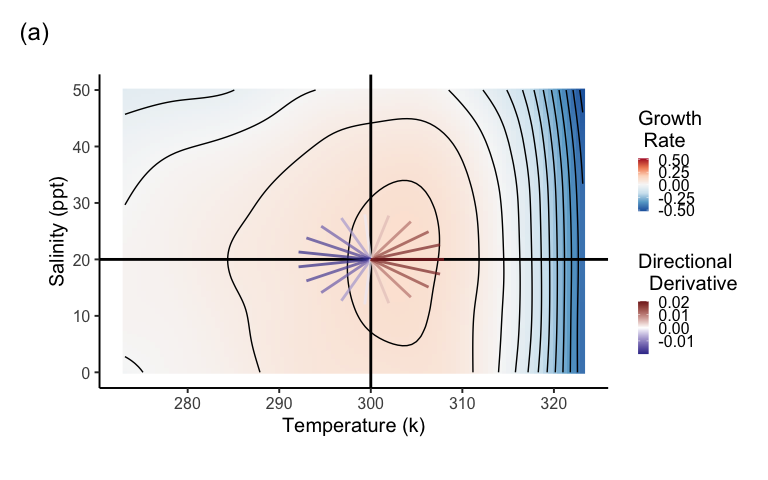
<p class="caption">(\#fig:one-point-all-directions)(ref:one-point-all-directions)</p>
</div>


### Several points 

We can measure all possible directional derivatives also for several points on the surface. This might be the case when we know that a species or a community occurs at multiple locations on the surface (multiple environmental conditions), but we do not know the direction of change.

(ref:multiple-points-all-directions) Directional derivatives calculated in all possible direction for several points on the response surface of sp1. Clearly, the slope of the directional derivative depends on the direction (red positive, blue negative). 

<div class="figure" style="text-align: center">
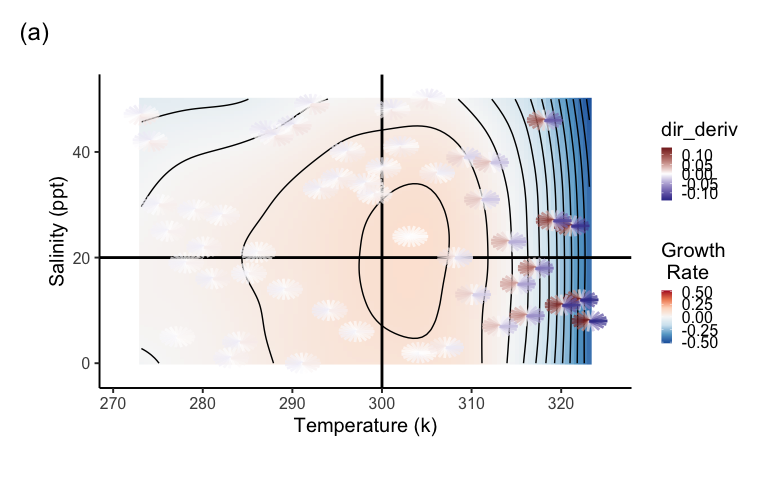
<p class="caption">(\#fig:multiple-points-all-directions)(ref:multiple-points-all-directions)</p>
</div>

### Grid of points 

Finally, we might do the same for a grid of points on the surface. We may want to do that when we do not have information on where a species or a community is living within the surface, but we know the range of values of E1 and E2.  

(ref:all-points-all-directions) Directional derivatives calculated in all possible direction for a grid of points on the response surface of sp1. Clearly, the slope of the directional derivative depends on the direction (red positive, blue negative). 

<div class="figure" style="text-align: center">
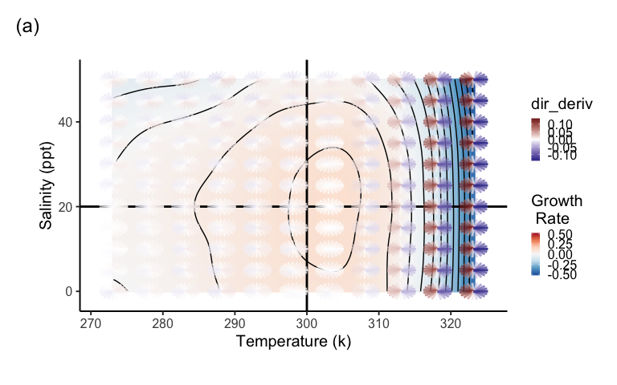
<p class="caption">(\#fig:all-points-all-directions)(ref:all-points-all-directions)</p>
</div>


# Response diversity calculation

Environmental variables may show different correlations between each other. The increase in one environmental variable may be directly correlated with the increase of another one (positive correlation), or vice versa, the increase in one driver may be correlated to a decrease in the other one (negative correlation). Yet, two environmental variables may change over time, or space, completely independently.    
We may imagine that these different types of relationships between two environmental variables could determine specific trends in response diversity.

To explore this hypothesis, we calculate now response diversity for two communities (one with additive effect, and one including an interactive environmental effect) composed of 4 spp in 4 different cases:
1. Unknown direction of the environmental change
2. Direction of env change is given by the time series,and E1 and E2 change over time independently
3. Direction of env change is given by the time series,and E1 and E2 change over time with positive correlation
4. Direction of env change is given by the time series,and E1 and E2 change over time with negative correlation

We want to see if any consistent trend appears in the two communities when E1 and E2 have different correlations. 

Steps: 

(i) Simulate spp performance curves with the modified Eppley function with and without interactive effect.


(ii) Fit response surface for each sp (done with GAMs)


(iii) Data wrangling and partials derivatives calculations 


## Community 1 - without interactive effect
<div class="figure" style="text-align: center">

<p class="caption">(\#fig:comm1Simulated)Response surface of the three species composing community 1. (a) Sp4. (b) Sp6. (c) Sp 11</p>
</div>

## Community 2 - interactive effect
<div class="figure" style="text-align: center">

<p class="caption">(\#fig:comm2Simulated)Response surface of the three species composing community 1. (a) Sp2. (b) Sp5. (c) Sp 13</p>
</div>


## Unknown direction of the environmental change 


Table showing the calculated response diversity for one of the two communities when the direction of the environmental change is unknown.
In this case, we calculated response diversity for a community in all possible directions across the surface, which represents in our opinion the most sensible way to measure the absolute response diversity of a specific community. 

| divergence| dissimilarity| community|
|----------:|-------------:|---------:|
|  0.2693448|      1.011636|         1|
|  0.2473904|      1.010359|         2|


### E1 and E2 change independently over time
This example mimics a situation where the two environmental variables change over time completely independently. This is a common situation in field studies, where multiple drivers of environmental change are not correlated one another.

In this case the direction of the environmental change is given by the change of E1 and E2 over time.

(ref:RD-independent) Time series of E1 and E2 changing independently over time.

<div class="figure" style="text-align: center">

<p class="caption">(\#fig:RD-independent)(ref:RD-independent)</p>
</div>


### Response surfaces with change in environmental conditions
<div class="figure" style="text-align: center">

<p class="caption">(\#fig:comm1nocor)Response surface of the three species composing community 1. (a) Sp4. (b) Sp6. (c) Sp 11. The numbers on the response surfaces show the environmental location in the time steps of the time series and the arrows connect the time steps.</p>
</div>

<div class="figure" style="text-align: center">

<p class="caption">(\#fig:comm2nocor)Response surface of the three species composing community 2. (a) Sp2. (b) Sp5. (c) Sp 13</p>
</div>


Table showing the calculated response diversity for one of the two communities when the two environmental variables change independently over time (only first 6 rows shown).

| time|   E1_ref|   E2_ref|         s1|         s2|         s3|         s4|     rdiv|      sign|      Med|
|----:|--------:|--------:|----------:|----------:|----------:|----------:|--------:|---------:|--------:|
|    1| 295.5499| 35.06010| -0.0025569| -0.0043734| -0.0031682| -0.0019315| 1.000992| 0.0000000| 1.004178|
|    2| 295.4694| 40.43676| -0.0076105| -0.0038792| -0.0010685| -0.0079641| 1.003054| 0.0000000| 1.004178|
|    3| 291.7350| 44.23112|  0.0059942|  0.0082445|  0.0069416|  0.0049920| 1.001339| 0.0000000| 1.004178|
|    4| 298.7794| 12.68533|  0.0010253| -0.0008450|  0.0011959|  0.0006765| 1.000809| 0.8280425| 1.004178|
|    5| 297.6343| 35.97065|  0.0033619|  0.0040078|  0.0024411|  0.0033568| 1.000588| 0.0000000| 1.004178|
|    6| 299.0214| 27.84749| -0.0045781|  0.0049459|  0.0077936| -0.0073761| 1.006887| 0.9724763| 1.004178|


Plot response diversity over time

<div class="figure" style="text-align: center">

<p class="caption">(\#fig:RDindependentplot)Directional derivatives and response diversity with known direction of env change. E1 and E2 change independently over time. a and b: Species directional derivatives over time. c and d: Response diversity measured as similarity-based diversity metric. e and : Response diversity measured as divergence (sign sensitive). </p>
</div>

## E1 and E2 change with negative correlation

This example mimics a situation where the two environmental variables change over time with negative correlation. This is common in field studies, where one environmental variable (e.g. CO2 concentration in oceans) increases, while another (e.g. pH) decreases [e.g. Shirayama & Thornton (2005)](https://agupubs.onlinelibrary.wiley.com/doi/full/10.1029/2004JC002618). 

Creating a time series with E1 and E2 changing over time with negative correlation. 

(ref:RD-negative) Time series of E1 and E2 changing with negative correlation over time.

<div class="figure" style="text-align: center">

<p class="caption">(\#fig:RD-negative)(ref:RD-negative)</p>
</div>

### Response surfaces with change in environmental conditions
<div class="figure" style="text-align: center">

<p class="caption">(\#fig:comm1neg)Response surface of the three species composing community 1. (a) Sp4. (b) Sp6. (c) Sp 11. The numbers on the response surfaces show the environmental location in the time steps of the time series and the arrows connect the time steps.</p>
</div>

<div class="figure" style="text-align: center">

<p class="caption">(\#fig:comm2neg)Response surface of the three species composing community 2. (a) Sp2. (b) Sp5. (c) Sp 13</p>
</div>


Table showing the calculated response diversity for one of the two communities when the two environmental variables change with negative correlation over time (only first 6 rows shown).

| time|   E1_ref|   E2_ref|         s1|         s2|         s3|         s4|     rdiv|      sign|      Med|
|----:|--------:|--------:|----------:|----------:|----------:|----------:|--------:|---------:|--------:|
|    1| 294.6225| 25.55104| -0.0017809| -0.0012320| -0.0007742| -0.0023943| 1.000676| 0.0000000| 1.004724|
|    2| 291.8397| 33.79961| -0.0055741| -0.0023475| -0.0009544| -0.0080189| 1.003054| 0.0000000| 1.004724|
|    3| 281.7902| 38.76077|  0.0045087|  0.0057514|  0.0042607|  0.0043408| 1.000580| 0.0000000| 1.004724|
|    4| 302.8219| 19.22634| -0.0013861|  0.0018754|  0.0048419| -0.0030857| 1.003383| 0.7784758| 1.004724|
|    5| 300.4154| 25.64585| -0.0054512|  0.0020723|  0.0052478| -0.0071079| 1.005579| 0.8494616| 1.004724|
|    6| 277.9783| 50.06561|  0.0066401|  0.0091631|  0.0071840|  0.0046479| 1.001762| 0.0000000| 1.004724|

Plot response diversity over time for the two communities


<div class="figure" style="text-align: center">

<p class="caption">(\#fig:RDnegativeplot)Directional derivatives and response diversity with known direction of env change. E1 and E2 change with negative correlation over time. a and b: Species directional derivatives over time. c and d: Response diversity measured as similarity-based diversity metric. e and : Response diversity measured as divergence (sign sensitive). </p>
</div>


## E1 and E2 change with positive correlation

Finally, two environmental variables can show positive correlation over time. A typical example is given by the positive correlation between air temperature and UV radiation [e.g. Hder at al. 2015](https://pubs.rsc.org/en/content/articlehtml/2015/pp/c4pp90035a). 

Let us create a time series with E1 and E2 changing over time with positive correlation

(ref:RD-positive) Time series of E1 and E2 changing with positive correlation over time.

<div class="figure" style="text-align: center">

<p class="caption">(\#fig:RD-positive)(ref:RD-positive)</p>
</div>


### Response surfaces with change in environmental conditions
<div class="figure" style="text-align: center">

<p class="caption">(\#fig:comm1pos)Response surface of the three species composing community 1. (a) Sp4. (b) Sp6. (c) Sp 11. The numbers on the response surfaces show the environmental location in the time steps of the time series and the arrows connect the time steps.</p>
</div>

<div class="figure" style="text-align: center">

<p class="caption">(\#fig:comm2pos)Response surface of the three species composing community 2. (a) Sp2. (b) Sp5. (c) Sp 13</p>
</div>


Table showing the calculated response diversity for one of the two communities when the two environmental variables change with positive correlation over time (only first 6 rows shown).

| time|   E1_ref|    E2_ref|         s1|         s2|         s3|         s4|     rdiv|      sign|      Med|
|----:|--------:|---------:|----------:|----------:|----------:|----------:|--------:|---------:|--------:|
|    1| 296.3194| 15.893276| -0.0008065| -0.0004111|  0.0007374| -0.0006908| 1.000614| 0.9552337| 1.003235|
|    2| 294.7370| 25.358621| -0.0023788|  0.0019470|  0.0036368| -0.0051287| 1.003831| 0.8297969| 1.003235|
|    3| 284.1721|  6.102644|  0.0017780|  0.0020120|  0.0020059|  0.0043266| 1.000957| 0.0000000| 1.003235|
|    4| 295.4237| 20.931492|  0.0013011| -0.0008613| -0.0021201|  0.0033618| 1.002327| 0.7735041| 1.003235|
|    5| 296.8193| 26.556820|  0.0043070| -0.0033500| -0.0059004|  0.0074102| 1.005955| 0.8865661| 1.003235|
|    6| 321.1482| 47.260206|  0.0332335|  0.0889998|  0.1072674|  0.0070665| 1.044901| 0.0000000| 1.003235|


Plot response diversity over time

<div class="figure" style="text-align: center">

<p class="caption">(\#fig:RDpositiveplot) Directional derivatives and response diversity with known direction of env change for community 1 and 2. E1 and E2 change with negative correlation over time.a and b: Species directional derivatives over time. c and d: Response diversity measured as similarity-based diversity metric. e and : Response diversity measured as divergence (sign sensitive). </p>
</div>


Now, we visualize the relationship between different correlations between the two environmental variables and response diversity.


<div class="figure" style="text-align: center">

<p class="caption">(\#fig:plotcorrelations)Correlation types and response diversity. a and c: correlation types and response diversity measured as dissimilarity in the first derivatives (sign insensitive) for community 1 and 2 respectively. c and d. correlation types and response diversity measured as divergence in the first derivatives (sign sensitive) for community 1 and 2 respectively</p>
</div>
We can rule out the hypothesis that different types of relationships between two environmental variables could determine specific trends in response diversity.


# Empirical example
We use data coming from an experiment where individual ciliates species have been exposed to a gradient of nutrient, light, and their combinations in a factorial design. We first show how to calculate the partial derivatives, then we calculate the directional derivatives based on a simulated time series (in the original experiment, the level of the treatments have been kept constant throughout the expt duration). Finally, we assemble random composed communities and calculate response diversity for each of them.

### Load data set and look at species responses


<div class="figure" style="text-align: center">
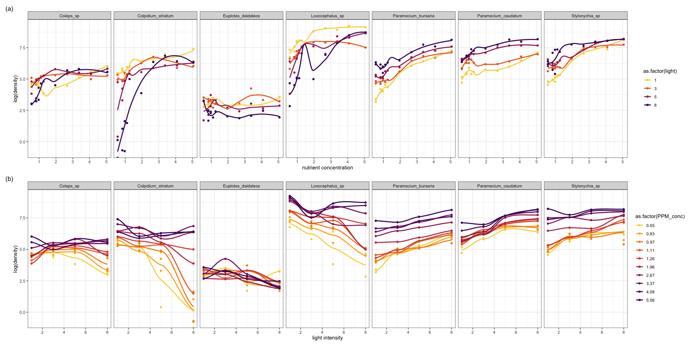
<p class="caption">(\#fig:ciliates)Species responses to the environmental drivers. a. Species responses to nutrient concentrations. b. Species responses to light intensity</p>
</div>

### Fittig GAMs on empirical data


|species         |   E1|   E2| predicted|
|:---------------|----:|----:|---------:|
|Loxocephalus_sp | 0.55| 1.00|  1040.202|
|Loxocephalus_sp | 0.55| 1.02|  1033.719|
|Loxocephalus_sp | 0.55| 1.04|  1027.237|
|Loxocephalus_sp | 0.55| 1.06|  1020.756|
|Loxocephalus_sp | 0.55| 1.08|  1014.277|
|Loxocephalus_sp | 0.55| 1.10|  1007.801|


### Plotting surface for a sp

<div class="figure" style="text-align: center">

```{=html}
<div class="plotly html-widget html-fill-item-overflow-hidden html-fill-item" id="htmlwidget-dba2ebaf1ab03eb178f4" style="width:1152px;height:480px;"></div>
<script type="application/json" data-for="htmlwidget-dba2ebaf1ab03eb178f4">{"x":{"visdat":{"a7ab2ecc7a60":["function () ","plotlyVisDat"]},"cur_data":"a7ab2ecc7a60","attrs":{"a7ab2ecc7a60":{"z":{},"alpha_stroke":1,"sizes":[10,100],"spans":[1,20],"type":"surface","contours":{"z":{"show":true,"usecolormap":true,"project":{"z":true}}},"inherit":true}},"layout":{"margin":{"b":40,"l":60,"t":25,"r":10},"title":"Colpidium","plot_bgcolor":"#e5ecf6","scene":{"xaxis":{"title":"PPM concentration","nticks":[0.55,1,1.5,2,2.5,3,3.5,4,4.5,5],"ticktext":[0.55,1,1.5,2,2.5,3,3.5,4,4.5,5]},"yaxis":{"title":"Light","nticks":[0,1,2,3,4,5,6,7,8,9],"ticktext":[0,1,2,3,4,5,6,7,8,9]},"zaxis":{"title":"Colpidium density","nticks":10}},"hovermode":"closest","showlegend":false,"legend":{"yanchor":"top","y":0.5}},"source":"A","config":{"modeBarButtonsToAdd":["hoverclosest","hovercompare"],"showSendToCloud":false},"data":[{"colorbar":{"title":"density_Colpidium","ticklen":2,"len":0.5,"lenmode":"fraction","y":1,"yanchor":"top"},"colorscale":[["0","rgba(68,1,84,1)"],["0.0416666666666667","rgba(70,19,97,1)"],["0.0833333333333333","rgba(72,32,111,1)"],["0.125","rgba(71,45,122,1)"],["0.166666666666667","rgba(68,58,128,1)"],["0.208333333333333","rgba(64,70,135,1)"],["0.25","rgba(60,82,138,1)"],["0.291666666666667","rgba(56,93,140,1)"],["0.333333333333333","rgba(49,104,142,1)"],["0.375","rgba(46,114,142,1)"],["0.416666666666667","rgba(42,123,142,1)"],["0.458333333333333","rgba(38,133,141,1)"],["0.5","rgba(37,144,140,1)"],["0.541666666666667","rgba(33,154,138,1)"],["0.583333333333333","rgba(39,164,133,1)"],["0.625","rgba(47,174,127,1)"],["0.666666666666667","rgba(53,183,121,1)"],["0.708333333333333","rgba(79,191,110,1)"],["0.75","rgba(98,199,98,1)"],["0.791666666666667","rgba(119,207,85,1)"],["0.833333333333333","rgba(147,214,70,1)"],["0.875","rgba(172,220,52,1)"],["0.916666666666667","rgba(199,225,42,1)"],["0.958333333333333","rgba(226,228,40,1)"],["1","rgba(253,231,37,1)"]],"showscale":true,"z":[[225.551556437739,225.181409202841,224.811141806755,224.440634088292,224.069765886266,223.698417039488,223.326467386769,222.953796766923,222.580285018761,222.205811981094,221.830257492735,221.453501392497,221.075423519191,220.695903711629,220.314821808623,219.932057648985,219.547491071527,219.16100191506,218.772470018399,218.381775220353,217.988797359735,217.593416275357,217.195511806031,216.794963790569,216.391652067783,215.985456476485,215.576256855489,215.163933043603,214.748364879642,214.329432202416,213.907014850739,213.480992663422,213.051245479277,212.617653137116,212.180095475751,211.738452333994,211.292603550658,210.842428964553,210.387808414493,209.928621739289,209.464748777752,208.996069368696,208.522463350932,208.043810563272,207.559990844529,207.070884033513,206.576369969037,206.076328489914,205.570639434955,205.059182642972,204.541837952777,204.018485203182,203.489004232999,202.953274881041,202.411176986118,201.862590387044,201.30739492263,200.745470431688,200.176696753031,199.600953725469,199.018121187816,198.428078978882,197.830706937481,197.225884902424,196.613492712524,195.993410206591,195.365517223439,194.729693601879,194.085819180723,193.433773798783,192.773437294871,192.1046895078,191.427410276381,190.741479439426,190.046776835747,189.343182304157,188.630575683466,187.908836812488,187.177845530034,186.437481674917,185.687625085947,184.928155601938,184.158953061701,183.379897304048,182.590868167791,181.791745491743,180.982409114715,180.162738875519,179.332614612968,178.491916165872,177.640523373045,176.778316073298,175.905174105444,175.020977308294,174.12560552066,173.218938581354,172.300856329188,171.371238602975,170.429965241526,169.476916083654,168.511970968169,167.535070133085,166.546395413215,165.546189042571,164.534693255167,163.512150285016,162.478802366131,161.434891732525,160.380660618212,159.316351257204,158.242205883515,157.158466731158,156.065376034146,154.963176026492,153.852108942209,152.732417015312,151.604342479811,150.468127569722,149.324014519057,148.172245561829,147.013062932051,145.846708863737,144.6734255909,143.493455347552,142.307040367708,141.11442288538,139.915845134581,138.711549349324,137.501777763623,136.286772611491,135.066776126941,133.842030543987,132.61277809664,131.379261018915,130.141721544825,128.900401908382,127.655544343601,126.407391084493,125.156184365073,123.902166419354,122.645579481348,121.386665785068,120.125667564529,118.862827053743,117.598386486723,116.332588097482,115.065674120035,113.797886788393,112.529468336569,111.260660998578,109.991707008433,108.722848600145,107.454328007729,106.186387465198,104.919269206565,103.653215465843,102.388468477045,101.125270474184,99.8638636912743,98.6044903623282,97.3473927213588,96.0928130023793,94.8409934394032,93.5921762664434,92.3466037175132,91.1045180266257,89.8661614277939,88.6317761550312,87.4016044423508,86.1758885237655,84.9548706332887,83.7387930049338,82.5278978727137,81.3224274706415,80.1226240327304,78.9287297929937,77.7409869854445,76.5596378440957,75.384924602961,74.217089496053,73.0563747573854,71.9030226209709,70.7572753208229,69.6193750909546,68.4895641653792,67.3680847781094,66.2551791631588,65.1510895545406,64.0560581862678,62.9703272923536,61.894139106811,60.8277358636534,59.771359796894,58.7252531405457,57.6896581286218,56.6648169951356,55.6509719741,54.6483652995284,53.6572392054337,52.6778359258293,51.7103976947283,50.7551128101611,49.811953826227,48.8808393610423,47.9616880327242,47.0544184593886,46.1589492591524,45.2751990501321,44.4030864504442,43.5425300782055,42.6934485515321,41.855760488541,41.0293845073483,40.214239226071,39.4102432628254,38.6173152357281,37.8353737628958,37.064337462445,36.304124952492,35.5546548511535,34.8158457765464,34.0876163467869,33.3698851799916,32.662570894277,31.9655921077598,31.2788674385564,30.6023155047836,29.9358549245578,29.2794043159955,28.6328822972132,27.9962074863279,27.3692985014555,26.7520739607131,26.1444524822171,25.5463526840837,24.95769318443,24.3783926013722,23.8083695530271,23.2475426575111,22.6958305329408,22.1531517974325,21.6194250691032,21.0945689660692,20.5785021064472,20.0711431083536,19.5724105899051,19.0822231692181,18.6004994644092,18.127158093595,17.6621176748921,17.2052968264172,16.7566141662863,16.3159883126165,15.8833378835241,15.4585814971259,15.0416377715381,14.6324253248775,14.2308627752606,13.836868740804,13.4503618396242,13.0712606898377,12.6994839095612,12.3349501169112,11.9775779300041,11.6272859669567,11.2839928458855,10.9476171849069,10.6180776021377,10.2952927156943,9.97918114369303,9.66966150425089,9.36665241548426,9.07007249550969,8.77984036244354,8.49587463440271,8.21809392950353,7.94641686586269,7.6807620615966,7.421048134822,7.16719370365518,6.91911738621301,6.67673780061182,6.43997356496821,6.20874329739889,5.98296561602024,5.76255913894871,5.54744248430116,5.33753427019399,5.13275311474372,4.9330176360671,4.73824645228041,4.54835818150025,4.36327144184355,4.18290485142634,4.00717702836546,3.83600659077747,3.66931215677882,3.5070123444862,3.34902577201595,3.19527105748496,3.04566681900949,2.90013167470621,2.75858424269163,2.62094314108233,2.48712698799506,2.35705440154602,2.23064399985193,2.10781440102944,1.98848422319503,1.87257208446522,1.75999660295666,1.65067639678574,1.54453008406923,1.44147628292339,1.34143361146517,1.24432068781086,1.15005613007709,1.05855855638034,0.969746584837201,0.883538833564391,0.799853920678192,0.718610464295387,0.639727082532441,0.56312239350586,0.488715015332348,0.416423566128259,0.346166664010388,0.277862927095087,0.211430973499001,0.146789421338727,0.0838568887307636,0.0225519937915308,-0.0372066453622031,-0.0955004106138402,-0.152410683847071,-0.208018846945207,-0.262406281791611,-0.315654370269845,-0.367844494263266,-0.419058035655444,-0.469376376329617,-0.518880898169481,-0.56765298305828,-0.615774012879594,-0.663325369516786,-0.710388434853244,-0.75704459077255,-0.803375219158039,-0.84946170189322,-0.895385420861522,-0.941227757946403],[230.562796101634,230.076395146372,229.58989237143,229.103185957129,228.616174083789,228.128754931732,227.640826681276,227.152287512742,226.663035606452,226.172969142726,225.681986301883,225.189985264245,224.696864210131,224.202521319863,223.70685477376,223.209762752144,222.711143435333,222.210895003651,221.708915637415,221.205103516947,220.699356822567,220.191573734596,219.681652433355,219.169491099162,218.65498791234,218.138041053209,217.618548702088,217.096409039299,216.571520245161,216.043780499996,215.513087984123,214.979340877863,214.442437361537,213.902275615464,213.358753819967,212.811770155363,212.261222801976,211.707009940123,211.149029750127,210.587180412308,210.021360106985,209.45146701448,208.877399315113,208.299055189204,207.716332817073,207.129130379042,206.537346055431,205.94087802656,205.339624472749,204.733483574319,204.12235351159,203.506132464883,202.884718614518,202.258010140816,201.625905224097,200.988302044682,200.34509878289,199.696193619043,199.041484733461,198.380870306464,197.714248518373,197.041517549508,196.362575580189,195.677320790737,194.985651361473,194.287465472717,193.582661304789,192.87113703801,192.1527908527,191.427520929179,190.695225447769,189.95580258879,189.20915053256,188.455167459403,187.693751549637,186.924800983584,186.148213941563,185.363888603895,184.571723150901,183.771615762901,182.963464620215,182.147167903164,181.322623792068,180.489730467248,179.648386109024,178.798488897718,177.939937013647,177.072628637134,176.1964619485,175.311335128063,174.417146356146,173.513793813067,172.601175679148,171.679190134709,170.747735360071,169.806709535554,168.856010841478,167.895537458163,166.925187565932,165.944859345103,164.954450975996,163.9539138542,162.94341223636,161.923163594392,160.893385400209,159.854295125725,158.806110242854,157.74904822351,156.683326539606,155.609162663057,154.526774065777,153.436378219679,152.338192596676,151.232434668684,150.119321907616,148.999071785386,147.871901773908,146.738029345094,145.597671970861,144.451047123121,143.298372273787,142.139864894775,140.975742457998,139.80622243537,138.631522298804,137.451859520215,136.267451571516,135.078515924622,133.885270051445,132.687931423901,131.486717513903,130.281845793364,129.073533734199,127.861998808322,126.647458487646,125.430130244086,124.210231549554,122.987979875966,121.763592695234,120.537287479273,119.309281699997,118.07979282932,116.849038339155,115.617235701416,114.384602388017,113.151355870872,111.917713621896,110.683893113001,109.450111816101,108.216587203112,106.983536745945,105.751177916516,104.519728186738,103.289405028525,102.060425913791,100.83300831445,99.6073697024155,98.3837275496013,97.1622993279217,95.9433025092903,94.7269545656211,93.5134729688278,92.3030751908245,91.0959787035249,89.8924009788429,88.6925594886925,87.4966717049875,86.3049550996418,85.1176271445692,83.9349053116836,82.7570070728988,81.5841499001288,80.4165512652876,79.2544286402888,78.0979994970464,76.9474813074742,75.8030915434863,74.6650476769963,73.5335671799181,72.4088675241656,71.2911661816531,70.1806806242938,69.0776283240019,67.9822267526914,66.894693382276,65.8152456846695,64.7441011317858,63.6814771955391,62.6275913478431,61.5826610606112,60.5469038057579,59.5205370551968,58.5037782808419,57.4968449546071,56.499954548406,55.5133245341527,54.537172383761,53.5717155691448,52.6171715622181,51.6737578348944,50.7416918590881,49.8211420111453,48.9120802851441,48.0144295795948,47.1281127930079,46.2530528238938,45.389172570763,44.5363949321259,43.694642806493,42.8638390923749,42.0439066882817,41.2347684927243,40.4363474042129,39.6485663212581,38.8713481423701,38.1046157660596,37.3482920908372,36.602300015213,35.8665624376975,35.1410022568014,34.425542371035,33.7201056789088,33.0246150789333,32.3389934696188,31.6631637494761,30.9970488170151,30.3405715707468,29.6936549091814,29.0562217308296,28.4281949342014,27.8094974178076,27.2000520801587,26.5997818197652,26.0086095351371,25.4264581247853,24.8532504872201,24.2889095209521,23.7333581244916,23.186519196349,22.6483156350351,22.11867033906,21.5975062069344,21.0847461371684,20.5803130282728,20.0841297787582,19.5961192871346,19.1162044519128,18.6443081716031,18.1803533447161,17.7242628697621,17.2759596452518,16.8353665696953,16.4024065416034,15.9770024594862,15.5590772218547,15.1485537272188,14.7453548740892,14.3494035609764,13.9606226863909,13.5789351488429,13.2042638468431,12.8365316789021,12.4756615435299,12.1215763392373,11.7741989645346,11.4334523179325,11.0992592979412,10.7715428030714,10.4502257318332,10.1352309827373,9.82648145429428,9.52390004501439,9.22740965340813,8.93693317798595,8.65239351725851,8.37371356973599,8.10081623392883,7.83362440834786,7.57206099150335,7.31604888190547,7.06551097806505,6.82037017849243,6.58054938169807,6.34597148619246,6.11655939048585,5.89223599308907,5.67292419251231,5.45854688726603,5.24902697586099,5.04428735680731,4.84425092861549,4.64884058979616,4.45797923885977,4.27158977431653,4.08959509467713,3.91191809845207,3.73848168415149,3.56920875028617,3.40402219536645,3.24284491790289,3.08559981640589,2.93220978938578,2.7825977353531,2.63668655281837,2.49439914029214,2.35565839628466,2.22038721930646,2.08850850786802,1.95994516047972,1.83462007565222,1.71245615189589,1.59337628772118,1.47730338163838,1.36416033215816,1.2538700377909,1.1463553970471,1.04153930843716,0.939344670471637,0.839694381661028,0.742511340515525,0.647718445545773,0.555238595262331,0.464994688175441,0.376909622795721,0.290906297633659,0.206907611199504,0.124836462003818,0.0446157485572245,-0.0338316306300728,-0.110582777047447,-0.185714792184338,-0.259304777530581,-0.331429834575594,-0.402167064808764,-0.471593569719871,-0.539786450798281,-0.606822809533594,-0.672779747415357,-0.73773436593306,-0.801763766576324,-0.864945050834639,-0.927355320197531,-0.989071676154604,-1.05017122019544,-1.11073105380934,-1.17082827848609,-1.23053999571506,-1.28994330698597,-1.34911531378828,-1.4081331176114,-1.46707381994494],[235.523922450021,234.922570714288,234.321135362477,233.719532778509,233.117679346307,232.515491449794,231.912885472889,231.309777799515,230.706084813596,230.101722899051,229.496608439803,228.890657819774,228.283787422886,227.675913633061,227.06695283422,226.456821410286,225.845435745181,225.232712222826,224.618567227142,224.002917142053,223.38567835148,222.766767239345,222.14610018957,221.523593586076,220.899163812786,220.272727253622,219.644200292504,219.013499313356,218.3805407001,217.745240836656,217.107516106947,216.467282894895,215.824457584423,215.17895655945,214.5306962039,213.879592901695,213.225563036755,212.568522993004,211.908389154363,211.245077904755,210.5785056281,209.90858870832,209.235243529339,208.558386475077,207.877933929456,207.1938022764,206.505907899828,205.814167183663,205.118496511828,204.418812268243,203.715030836832,203.007068601515,202.294841946214,201.578267254853,200.857260911351,200.131739299632,199.401618803617,198.666815807229,197.927246694388,197.182827849017,196.433475655038,195.679106496373,194.919636756943,194.154982820671,193.385061071479,192.609787893287,191.829079670019,191.042852785595,190.251023623939,189.453508568972,188.650224004615,187.841086314791,187.026011883422,186.204917094429,185.377718331734,184.54433197926,183.704674420927,182.858662040659,182.006211222376,181.147238350002,180.281659807457,179.409391978664,178.530351247544,177.644453998019,176.751616614012,175.851755479444,174.944786978238,174.030627494314,173.109193411595,172.180401114002,171.244166985458,170.300407409885,169.349038771205,168.389977453339,167.423139840208,166.448442315737,165.465801263845,164.475133068455,163.476354113488,162.469380782868,161.454129460515,160.430562602778,159.398826955709,158.359115337789,157.311620567496,156.25653546331,155.194052843709,154.124365527174,153.047666332183,151.964148077216,150.874003580752,149.77742566127,148.674607137249,147.56574082717,146.45101954951,145.330636122751,144.204783365369,143.073654095846,141.93744113266,140.79633729429,139.650535399216,138.500228265917,137.345608712873,136.186869558562,135.024203621464,133.857803720058,132.687862672824,131.51457329824,130.338128414786,129.158720840942,127.976543395186,126.791788895998,125.604650161857,124.415320011243,123.223991262634,122.03085673451,120.83610924535,119.639941613634,118.442546657841,117.24411719645,116.044846047939,114.84492603079,113.644549963481,112.44391066449,111.243200952298,110.042613645384,108.842341562227,107.642577521306,106.443514341101,105.245344840091,104.048261836754,102.852458149571,101.658126597021,100.465459997583,99.2746511697354,98.0858929319588,96.8993781027321,95.7152995005342,94.5338499438448,93.3552222511429,92.1796092409081,91.0072037316193,89.838198541756,88.6727864897974,87.5111603942227,86.3535130735115,85.2000373461428,84.0509260305959,82.9063719453501,81.7665679088847,80.631706739679,79.5019812562122,78.3775842769636,77.2587086204125,76.1455471050383,75.0382925493202,73.9371377717372,72.8422755907691,71.7538988248947,70.6722002925935,69.5973728123447,68.5296092026277,67.4691022819217,66.416044868706,65.3706297814599,64.3330498386625,63.3034978587933,62.2821666603317,61.2692490617565,60.2649378815472,59.2694259381833,58.282906050144,57.3055710359082,56.3376137139557,55.3792269027654,54.4306034208167,53.491936086589,52.5634177185614,51.6452411352133,50.7375991550239,49.8406845964725,48.954646008025,48.079454858094,47.2150383450788,46.3613236673786,45.5182380233925,44.6857086115197,43.8636626301596,43.0520272777112,42.2507297525739,41.4596972531469,40.6788569778294,39.9081361250204,39.1474618931194,38.3967614805256,37.655962085638,36.924990906856,36.2037751425787,35.4922419912055,34.7903186511355,34.0979323207679,33.415010198502,32.741479482737,32.0772673718718,31.4223010643062,30.776507758439,30.1398146526697,29.5121489453972,28.8934378350208,28.2836085199399,27.6825881985536,27.0903040692612,26.5066833304618,25.9316531805546,25.3651408179389,24.807073441014,24.2573782481789,23.715982437833,23.1828132083753,22.6577977582053,22.1408632857221,21.6319369893249,21.1309460674129,20.6378177183854,20.1524791406417,19.6748575325806,19.2048800926018,18.7424740191041,18.2875665104871,17.8400847651498,17.3999559814916,16.9671073579114,16.5414660928087,16.1229593845826,15.7115144316324,15.3070584323573,14.9095185851564,14.518822088429,14.1348961405743,13.7576679399916,13.3870646850799,13.0230135742387,12.6654418058672,12.3142765783643,11.9694450901295,11.630874539562,11.2984921250609,10.9722250450254,10.6520004978549,10.3377456819485,10.0293877957054,9.726854037525,9.43007160580623,9.13896769894837,8.8534695153509,8.57350425341276,8.29899911153328,8.02988128811162,7.76607798154719,7.50751639023887,7.25412371258615,7.0058271469881,6.76255389184415,6.52423114555328,6.29078610651478,6.06214597312779,5.83823794379177,5.61898921690576,5.40432699086907,5.19417846408076,4.98847083494018,4.78713130184641,4.59008706319899,4.39726531739679,4.20859326283923,4.02399809792534,3.84340702105452,3.66674723062585,3.49394592503878,3.32493030269223,3.15962756198555,2.99796490131807,2.83986951908878,2.68526861369706,2.53408938354221,2.38625902702317,2.24170474253941,2.1003537284901,1.96213318327422,1.82697030529132,1.69479229294041,1.56552634462089,1.43909965873177,1.31543943367231,1.19447286784191,1.07612715963968,0.960329507464707,0.847007109716487,0.736087164793863,0.62749687109622,0.521163427022942,0.417014030973146,0.314975881345966,0.21497617654075,0.116942114956571,0.0208008949927665,-0.0735202849516021,-0.166094226477056,-0.256993731184522,-0.346291600674896,-0.434060636548826,-0.520373640407037,-0.605303413850553,-0.688922758479809,-0.771304475895818,-0.852521367699428,-0.932646235491271,-1.01175188087215,-1.08991110544273,-1.1671967108041,-1.24368149855678,-1.31943827030165,-1.39453982763954,-1.46905897217117,-1.54306850549726,-1.61664122921875,-1.68984994493624,-1.76276745425068,-1.83546655876275,-1.90802006007319,-1.98050075978293],[240.38482216739,239.671125530973,238.957363206264,238.243469504976,237.529378738814,236.815025219491,236.100343258715,235.385267168195,234.669731259641,233.953669844762,233.237017235268,232.519707742868,231.801675679272,231.082855356188,230.363181085326,229.642587178397,228.921007947108,228.19837770317,227.474630758292,226.749701424183,226.023524012554,225.296032835111,224.567162203567,223.83684642963,223.105019825009,222.371616701414,221.636571370553,220.899818144138,220.161291333877,219.420925251479,218.678654208653,217.934412517111,217.188134488559,216.439754434709,215.689206667269,214.936425497949,214.181345238459,213.423900200507,212.664024695803,211.901653036057,211.136719532977,210.369158498274,209.598904243656,208.825891080834,208.050053321516,207.271325277412,206.489641260231,205.704935581683,204.917142553478,204.126196487323,203.33203169493,202.534582488007,201.733783178264,200.92956807741,200.121871497155,199.310627749208,198.495771145278,197.677235997075,196.854956616308,196.028867314688,195.198902403922,194.36499619572,193.527083001792,192.685097133847,191.838972903596,190.988644622746,190.134046603008,189.27511315609,188.411778593703,187.543977227556,186.671643369358,185.794711330818,184.913115423647,184.026789959552,183.135669250245,182.239687607433,181.338779342827,180.432878768136,179.52192019507,178.605837935337,177.684566300647,176.758039602711,175.826192153236,174.888958263932,173.946272246509,172.998068412677,172.044281074144,171.08484454262,170.119693129815,169.148761147438,168.171982907198,167.189292720804,166.200624899967,165.205913756395,164.205093601798,163.198098747885,162.184863506366,161.165322188951,160.139409107347,159.107058573266,158.068204898416,157.022821406284,155.971037467467,154.913021464339,153.848941779274,152.778966794646,151.703264892828,150.622004456197,149.535353867124,148.443481507984,147.346555761152,146.244745009002,145.138217633906,144.027142018241,142.911686544379,141.792019594694,140.668309551562,139.540724797355,138.409433714448,137.274604685215,136.13640609203,134.995006317267,133.8505737433,132.703276752503,131.553283727251,130.400763049916,129.245883102875,128.088812268499,126.929718929164,125.768771467244,124.606138265113,123.441987705144,122.276488169711,121.10980804119,119.942115701954,118.773579534376,117.604367920832,116.434649243695,115.264591885338,114.094364228138,112.924134654466,111.754071546698,110.584343287207,109.415118258367,108.246564842554,107.078851422139,105.912146379499,104.746618097006,103.582434957035,102.41976534196,101.258777634155,100.099640215994,98.9425214698506,97.7875897780997,96.635013523115,95.4849610872705,94.3376008529404,93.1931012024985,92.0516305183193,90.9133571827765,89.7784495782445,88.6470760870968,87.519405091708,86.395604974452,85.2758441177028,84.1602909038346,83.0491137152213,81.9424809342371,80.840560943256,79.743522124652,78.6515328607992,77.5647615340718,76.4833765268438,75.4075462214893,74.3374390003821,73.2732232458965,72.2150673404067,71.1631396662864,70.1176086059099,69.0786425416513,68.0464098558845,67.0210789309838,66.002818149323,64.9917958932764,63.9881805452178,62.9921404875215,62.0038441025614,61.0234597727117,60.0511558803465,59.0871008078395,58.1314629375653,57.1844106518976,56.2461123332106,55.3167363638783,54.3964511262748,53.4854250027741,52.5838263757506,51.6918236275779,50.8095851406302,49.9372792972817,49.0750744799064,48.2230995966955,47.3813256591097,46.5496842044264,45.7281067699236,44.9165248928786,44.1148701105693,43.3230739602736,42.5410679792686,41.7687837048326,41.0061526742429,40.2531064247773,39.5095764937135,38.7754944183291,38.0507917359019,37.3353999837095,36.6292506990298,35.9322754191402,35.2444056813185,34.5655730228424,33.8957089809895,33.2347450930377,32.5826128962644,31.9392439279475,31.3045697253646,30.6785218257934,30.0610317665116,29.4520310847967,28.8514513179268,28.2592240031791,27.6752806778315,27.0995528791619,26.5319721444478,25.9724700109667,25.4209780159966,24.8774276968149,24.3417505906996,23.813878234928,23.2937421667781,22.7812739235276,22.276405042454,21.7790670608349,21.2891915159483,20.8067099450716,20.3315538854828,19.8636548744592,19.4029444492787,18.949354147219,18.5028155055579,18.0632600615727,17.6306193525415,17.2048249157417,16.7858082884512,16.3735010079474,15.9678346115081,15.5687406364112,15.1761506199343,14.7899960993549,14.4102086119508,14.0367196949997,13.6694608857793,13.3083637215672,12.9533597396412,12.6043804772788,12.2613574717578,11.924222260356,11.592906380351,11.2673413690204,10.9474587636419,10.6331901014932,10.3244669198523,10.0212207559963,9.7233831472033,9.43088563075086,9.14365974391668,8.86163702397846,8.58474900821382,8.3129272339006,8.04610323831625,7.78420855873856,7.52717473244533,7.27493329671417,7.02741578882276,6.78455374604861,6.54627870566977,6.31252220496362,6.08321578120789,5.85829097168031,5.63767931365868,5.42131234442068,5.20912160124368,5.00103862140563,4.79699494218421,4.59692210085704,4.40075163470189,4.20841508099636,4.01984397701807,3.83496986004485,3.65372426735432,3.47603873622417,3.30184480393215,3.13107400775577,2.96365788497297,2.79952797286116,2.63861580869814,2.48085292976171,2.32617087332938,2.174501176679,2.02577537708809,1.87992501183431,1.73688161819574,1.59657673344956,1.4589418948737,1.3239086397458,1.19140850534355,1.06137302894474,0.933733747826788,0.808422199267668,0.685369920544839,0.564508448936229,0.445769321719276,0.329084076171877,0.214384249571465,0.101601379196022,-0.00933299767696028,-0.118487343769729,-0.225930121804732,-0.331729794504173,-0.435954824590197,-0.538673674785384,-0.63995480781197,-0.739866686392269,-0.838477773248632,-0.935856531103152,-1.03207142267842,-1.12719091069663,-1.2212834578802,-1.31441752695124,-1.40666158063233,-1.49808408164545,-1.58875349271317,-1.67873827655775,-1.76810689590162,-1.85692781346686,-1.94526949197585,-2.03320039415093,-2.12078898271456,-2.20810372038885,-2.29521306989627,-2.38218549395902,-2.46908945529939],[245.095381938234,244.273249220812,243.451068329165,242.628791089071,241.806369326305,240.983754866642,240.16089953586,239.337755159733,238.514273564039,237.690406574553,236.86610601705,236.041323717308,235.216011501102,234.390121194207,233.563604622401,232.736413611459,231.908499987156,231.07981557527,230.250312201575,229.419941691849,228.588655871866,227.756406567404,226.923145604238,226.088824808144,225.253396004897,224.416811020275,223.579021680052,222.739979810006,221.899637235911,221.057945783545,220.214857278683,219.3703235471,218.524296414574,217.67672770688,216.827569249793,215.976772869091,215.124290390548,214.270073639942,213.414074443048,212.556244625641,211.696536013499,210.834900432397,209.97128970811,209.105655666416,208.237950133089,207.368124933907,206.496131894644,205.621922841078,204.745449598983,203.866663994137,202.985517852315,202.101962999292,201.215951260846,200.327434462751,199.436364430785,198.542692990723,197.64637196834,196.747353189414,195.845588479719,194.941029665033,194.03362857113,193.123337023788,192.210106848781,191.293889871887,190.37463791888,189.452302815538,188.526836387636,187.598190460949,186.666316861255,185.731167414328,184.792693945946,183.850848281883,182.905582247917,181.956847669822,181.004596373376,180.048780184353,179.089350928531,178.126260431684,177.15946051959,176.188903018023,175.214539752761,174.236322549578,173.254203234252,172.268133632557,171.278065570271,170.283950873168,169.285741367026,168.283388877619,167.276845230725,166.266062252118,165.250991767576,164.231585602873,163.207795583786,162.179573536092,161.146871285565,160.109640657983,159.06783347912,158.021401574754,156.970296770659,155.914470892613,154.85387576639,153.788495292182,152.718441667837,151.643859165618,150.564892057787,149.481684616608,148.394381114344,147.303125823257,146.208063015611,145.109336963668,144.007091939692,142.901472215945,141.79262206469,140.68068575819,139.565807568708,138.448131768507,137.327802629851,136.204964425001,135.07976142622,133.952337905773,132.822838135921,131.691406388927,130.558186937055,129.423324052568,128.286962007728,127.149245074798,126.010317526041,124.87032363372,123.729407670098,122.587713907439,121.445386618004,120.302570074057,119.159408547861,118.016046311678,116.872627637772,115.729296798406,114.586198065842,113.443475712343,112.301274010173,111.159737231594,110.019009648869,108.879235534261,107.740559160034,106.603124798449,105.46707672177,104.33255920226,103.199716512181,102.068692923798,100.939632709372,99.8126801411658,98.6879794914435,97.5656750324678,96.4459110365012,95.3288317758069,94.2145815226477,93.1033045492866,91.9951451279865,90.8902475310102,89.788756030621,88.6908148990815,87.5965684086548,86.5061608316035,85.419736440191,84.3374395066799,83.2594143033332,82.1858051024138,81.1167561761848,80.0524117969089,78.9929162368493,77.9384137682686,76.88904866343,75.8449651945962,74.8063076340305,73.7732202539951,72.7458473267537,71.7243331245689,70.7088219197037,69.6994579844209,68.6963855909834,67.6997490116544,66.7096925186967,65.7263603843731,64.7498968809466,63.7804462806802,62.8181528558368,61.8631608786791,60.9156146214705,59.9756583564735,59.0434363559513,58.1190928921666,57.2027722373824,56.2946186638617,55.3947764438674,54.5033898496625,53.6206031535098,52.7465606276721,51.8814065444128,51.0252851759944,50.1783407946799,49.3407176727323,48.5125600824145,47.6939775730524,46.8849408022238,46.0853857045694,45.2952482147299,44.5144642673458,43.7429697970581,42.9807007385076,42.2275930263347,41.4835825951803,40.748605379685,40.0225973144898,39.3054943342349,38.5972323735615,37.8977473671101,37.2069752495215,36.5248519554361,35.8513134194952,35.1862955763391,34.5297343606085,33.8815657069444,33.2417255499873,32.6101498243779,31.9867744647569,31.3715354057652,30.7643685820433,30.1652099282322,29.5739953789723,28.9906608689045,28.4151423326694,27.8473757049078,27.2872969202603,26.7348419133679,26.1899466188709,25.6525469714105,25.1225789056269,24.5999783561612,24.0846812576539,23.5766235447458,23.0757411520778,22.5819700142902,22.095246066024,21.6155052419197,21.1426834766185,20.6767167047607,20.2175408609869,19.7650918799382,19.3193056962551,18.8801182445783,18.4474654595486,18.0212832758067,17.6015076279932,17.188074450749,16.7809196787147,16.3799792465311,15.9851890888387,15.5964851402784,15.213803335491,14.837079609117,14.4662498957973,14.1012501301724,13.7420162468832,13.3884841805704,13.0405898658747,12.6982692374367,12.3614582298972,12.0300927778969,11.7041088160766,11.383442279077,11.0680291015386,10.7578052181024,10.4527065634091,10.152669072099,9.85762867881333,9.56752131819261,9.28228292487751,9.00184943350871,8.72615677872717,8.45514089517318,8.18873771748781,7.92688318031178,7.66951321828564,7.41656376605012,7.16797075824601,6.92367012951392,6.68359781449463,6.44768974782898,6.21588186415748,5.98811009812097,5.76431038436013,5.54441865751564,5.32837085222821,5.11610290313862,4.90755074488749,4.70265031211578,4.50133753946387,4.30354836157268,4.10921871308283,3.91828452863515,3.73068174287031,3.54634629042892,3.36521410595182,3.18722112407967,3.01230327945317,2.84039650671308,2.67143674050015,2.50535991545492,2.34210196621831,2.18159882743089,2.02378643373358,1.86860071976689,1.71597762017154,1.56585306958824,1.41816300265792,1.27284335402114,1.12983005831848,0.989059050190866,0.850466264278968,0.71398763522348,0.579559097665076,0.44711658624437,0.316596035602442,0.187933380379713,0.0610645552169444,-0.0640745052452054,-0.187547866365868,-0.309419593504495,-0.429753752020145,-0.548614407272394,-0.666065624620231,-0.782171469423213,-0.896996007040435,-1.01060330283129,-1.12305742215496,-1.23442243037071,-1.344762392838,-1.4541413749161,-1.56262344196401,-1.67027265934139,-1.77715309240733,-1.8833288065209,-1.98886386704185,-2.09382233932924,-2.19826828874227,-2.30226578064039,-2.40587888038272,-2.50917165332863,-2.61220816483751,-2.71505248026842,-2.81776866498072,-2.92042078433388],[249.605488447044,248.680131408189,247.754743157549,246.829292483338,245.903748173772,244.978079017065,244.05225380143,243.126241315085,242.200010346241,241.273529683116,240.346768113923,239.419694426876,238.492277410192,237.564485852084,236.636288540766,235.707654264455,234.778551811365,233.848949969709,232.918817527703,231.988123273562,231.0568359955,230.124924481733,229.192357520473,228.259103899937,227.325132408339,226.390411833894,225.454910964817,224.518598589322,223.581443495623,222.643414471936,221.704480306475,220.764609787455,219.823771703092,218.881934841598,217.939067991189,216.99513994008,216.050119476486,215.103975388621,214.156676464699,213.208191492936,212.258489261547,211.307538558745,210.355308172746,209.401766891765,208.446883504015,207.490626797712,206.532965561071,205.573868582305,204.613304649631,203.651242551262,202.687651075413,201.7224990103,200.755755144136,199.787388265136,198.817367161515,197.845660621488,196.872237433269,195.897066385074,194.920116265116,193.941355861612,192.960753962774,191.978279356818,190.993900831959,190.007587176411,189.019307178389,188.029029626107,187.036723307782,186.042357011626,185.045899525855,184.047319638684,183.046586138327,182.043667812999,181.038533450914,180.031151840288,179.021491769334,178.009522026269,176.995211399306,175.97852867666,174.959442646545,173.937922097178,172.913935816771,171.88745259354,170.8584412157,169.826870471466,168.792709149051,167.755926036671,166.71648992254,165.674369594874,164.629533841886,163.581951451792,162.531591212805,161.478421913142,160.422412341016,159.363531284643,158.301747532237,157.237029872012,156.169347092184,155.098667980967,154.024961326575,152.948195917225,151.868340541129,150.785389287936,149.699437453023,148.610605633201,147.519014425281,146.424784426073,145.328036232387,144.228890441035,143.127467648826,142.023888452572,140.918273449083,139.810743235169,138.701418407641,137.59041956331,136.477867298986,135.363882211479,134.248584897601,133.132095954162,132.014535977972,130.896025565841,129.776685314582,128.656635821003,127.535997681916,126.414891494131,125.293437854458,124.171757359709,123.049970606694,121.928198192223,120.806560713107,119.685178766157,118.564172948182,117.443663855994,116.323772086403,115.20461823622,114.086322902256,112.96900668132,111.852790170223,110.737793965776,109.62413866479,108.511944864075,107.401333160441,106.2924241507,105.185338431661,104.080196600136,102.977119252934,101.876226986867,100.777640398745,99.6814800853778,98.5878666435771,97.496920670153,96.4087627619161,95.323513515677,94.2412935282461,93.1622233964338,92.0864237170512,91.0140150869085,89.9451181028164,88.8798533615852,87.8183414600256,86.7607029949483,85.7070585631636,84.6575287614824,83.6122341867149,82.5712954356719,81.5348331051639,80.5029677920012,79.4758200929949,78.4535106049551,77.4361599246925,76.4238886490176,75.4168173747409,74.4150666986733,73.4187572176251,72.4280095284068,71.442944227829,70.4636819127024,69.4903431798374,68.5230486260446,67.5619188481346,66.6070744429179,65.6586360072051,64.7167241378067,63.7814594315333,62.8529624851955,61.9313538956039,61.0167542595687,60.109284173901,59.2090642354109,58.3162150409091,57.4308571872063,56.5531112711128,55.6830978894395,54.8209376389967,53.9667511165951,53.1206589190451,52.2827816431573,51.4532398857422,50.6321542436107,49.8196453135731,49.0158336924397,48.2208399770215,47.4347547329909,46.6575484014692,45.8891613924392,45.1295341158844,44.3786069817878,43.6363204001325,42.9026147809018,42.177430534079,41.460708069647,40.7523877975889,40.0524101278881,39.3607154705276,38.6772442354907,38.0019368327604,37.3347336723201,36.6755751641527,36.0244017182415,35.3811537445697,34.7457716531204,34.1181958538767,33.4983667568219,32.8862247719392,32.2817103092115,31.6847637786222,31.0953255901543,30.5133361537911,29.9387358795158,29.3714651773114,28.8114644571611,28.2586741290481,27.7130346029556,27.1744862888669,26.6429695967647,26.1184249366326,25.6007927184535,25.0900133522106,24.5860272478874,24.0887748154667,23.5981964649317,23.1142326062657,22.6368236494518,22.1659100044731,21.7014320813127,21.2433302899542,20.7915450403801,20.3460167425741,19.9066858065191,19.4734926421984,19.046377659595,18.6252812686924,18.2101438794732,17.800905901921,17.3975077460188,16.9998898217499,16.6079925390974,16.2217563080443,15.841121538574,15.4660286406694,15.096418024314,14.7322300994907,14.3734052761828,14.0198839643734,13.6716065740456,13.3285135151827,12.9905451977678,12.657642031784,12.3297444272147,12.0067927940426,11.6887275422513,11.3754890818238,11.0670178227433,10.763254174993,10.4641385485559,10.1696113534152,9.87961299955432,9.59408389695609,9.31296445560378,9.03619508548078,8.76371619656982,8.49546819885436,8.23139150231762,7.97142651694262,7.71551365271251,7.46359331961045,7.21560592761966,6.97149188672333,6.73119160690452,6.49464549814663,6.2617939704324,6.03257743374535,5.80693629806844,5.58481097338511,5.36614186967817,5.15086939693106,4.93893396512684,4.73027598424854,4.52483586427946,4.32255401520292,4.12337084700168,3.92722676965938,3.73406219315884,3.5438175274832,3.35643318261584,3.17184956853998,2.99000709523846,2.81084617269453,2.6343072108916,2.46033061981254,2.28885680944083,2.11982618975928,1.95317917075131,1.78885616239984,1.62679757468834,1.46694381759979,1.30923530111728,1.15361243522429,1.0000156299036,0.848385295138543,0.698661840912248,0.550785677207959,0.40469721400872,0.260336861297845,0.117645029058422,-0.0234378727264319,-0.162971434073611,-0.301015244999758,-0.437628895521733,-0.572871975656598,-0.706804075421007,-0.839484784831842,-0.970973693905955,-1.10133039266006,-1.23061447111116,-1.35888551927608,-1.48620312717145,-1.61262688481446,-1.73821638222172,-1.86303120940997,-1.98713095639613,-2.11057521319727,-2.23342356982997,-2.35573561631112,-2.47757094265752,-2.59898913888615,-2.72004979501371,-2.84081250105699,-2.96133684703295,-3.08168242295863,-3.20190881885045,-3.32207562472543],[253.865028378311,252.84296171749,251.820880117787,250.798768640322,249.776612346212,248.754396296576,247.732105552533,246.709725175201,245.687240225699,244.664635765145,243.641896854657,242.619008555355,241.595955928357,240.572724034782,239.549297935747,238.525662692371,237.501803365774,236.477705017073,235.453352707387,234.428731497835,233.403826449534,232.378622623605,231.353105081164,230.327258883331,229.301069091224,228.274520765963,227.247598968664,226.220288760447,225.192575202431,224.164443355733,223.135878281473,222.106865040768,221.077388694738,220.047434304501,219.016986931176,217.98603163588,216.954553479734,215.922537523854,214.88996882936,213.85683245737,212.823113469003,211.788796925377,210.75386788761,209.718311416822,208.682112574131,207.645256420655,206.607728017513,205.569512425824,204.530594706705,203.490959921276,202.450593130655,201.40947939596,200.367603778311,199.324951338825,198.281507138621,197.237256238818,196.192183700534,195.146274584888,194.099513952998,193.051886865983,192.00337838496,190.95397357105,189.90365748537,188.85241518904,187.800231743176,186.747092208899,185.692981647326,184.637885119576,183.581787686767,182.524674410019,181.466530350449,180.407340569177,179.34709012732,178.285764085997,177.223347506327,176.159825449428,175.09518297642,174.029405148419,172.962477026545,171.894383671917,170.825110145652,169.75464150887,168.68296282269,167.610059148228,166.535915546604,165.460517078938,164.383848806346,163.305895789948,162.226643090862,161.146075770206,160.0641788891,158.980937508662,157.89633669001,156.810361494263,155.722996982539,154.634228215957,153.544040255635,152.452418162693,151.359346998247,150.264811823418,149.168797699323,148.071308421009,146.972422719229,145.872238058666,144.770851904001,143.668361719915,142.56486497109,141.460459122209,140.355241637952,139.249309983001,138.142761622038,137.035694019745,135.928204640803,134.820390949894,133.712350411699,132.6041804909,131.495978652179,130.387842360217,129.279869079697,128.172156275299,127.064801411705,125.957901953597,124.851555365657,123.745859112566,122.640910659007,121.536807469659,120.433647009206,119.331526742329,118.230544133709,117.130796648028,116.032381749968,114.935396904211,113.839939575438,112.74610722833,111.65399732757,110.563707337838,109.475334723818,108.388976950189,107.304731481635,106.222695782836,105.142967318474,104.065643553232,102.99082195179,101.91859997883,100.849075099033,99.7823447770826,98.718506477659,97.6576576654441,96.5998958051196,95.5453183613672,94.4940227988685,93.4461065823051,92.4016671763587,91.3608020457108,90.3236086550433,89.2901844690377,88.2606269523756,87.2350335697387,86.2135017858089,85.1961290652674,84.1830128727961,83.1742506730764,82.1699399307903,81.1701781106194,80.175062677245,79.1846910953491,78.1991608296131,77.218569344719,76.2430141053479,75.272592576182,74.3074022219026,73.3475405071915,72.3931048967303,71.4441928552006,70.5009018472839,69.5633293376623,68.631572791017,67.70572967203,66.7858974453826,65.8721735757567,64.9646555278338,64.0634407662957,63.1686267558239,62.2803109610999,61.3985908468059,60.5235638776229,59.6553275182329,58.7939792333175,57.9396164875583,57.092336745637,56.2522374722351,55.4194161320344,54.5939701897167,53.7759971099632,52.965594357456,52.1628593968763,51.3678896929061,50.5807827102269,49.8016359135204,49.0305467674683,48.2676127367521,47.5129058724065,46.7663965708784,46.0280298149677,45.2977505874743,44.5755038711981,43.8612346489388,43.1548879034964,42.4564086176709,41.7657417742621,41.0828323560697,40.4076253458938,39.7400657265342,39.0800984807908,38.4276685914636,37.7827210413523,37.1452008132568,36.515052889977,35.8922222543128,35.2766538890643,34.668292777031,34.067083901013,33.4729722438103,32.8859027882223,32.3058205170496,31.7326704130913,31.166397459148,30.606946638019,30.0542629325046,29.5082913254046,28.9689767995186,28.4362643376469,27.9100989225891,27.390425537145,26.8771891641149,26.3703347862981,25.8698073864951,25.3755519475054,24.8875134521288,24.4056368831656,23.9298672234153,23.4601494556778,22.9964285627532,22.5386495274413,22.086757332542,21.6406969608551,21.2004133951807,20.7658516183182,20.336956613068,19.9136733622296,19.4959468486033,19.0837220549887,18.6769439641856,18.275557558994,17.8795078222137,17.488739736645,17.1031982850871,16.7228284503405,16.3475752152046,15.9773835624797,15.6121984749654,15.2519649354617,14.8966279267684,14.5461324316854,14.2004234330127,13.85944591355,13.5231448560974,13.1914652434547,12.8643520584216,12.5417502837982,12.2236049023843,11.9098608969797,11.6004632503845,11.2953569453984,10.9944869648214,10.6977982914532,10.4052359080939,10.1167447975433,9.83226994260125,9.55175632606764,9.27514893074239,9.0023927394253,8.73343273491641,8.46821390001537,8.20668121752234,7.94877967023689,7.69445424095922,7.44364991248901,7.19631166762623,6.95238448917066,6.71181335992236,6.474543262681,6.24051918024663,6.00968609541907,5.78198899099819,5.55737284978376,5.3357826545759,5.1171633881744,4.90146003337914,4.68861757298993,4.47858098980676,4.27129526662944,4.06670538625781,3.86475633149192,3.66539308513139,3.46856062997646,3.27420394882669,3.08226802448208,2.89269783974255,2.70543837740798,2.52043462027817,2.33763155115316,2.15697415283271,1.97840740811652,1.80187629980485,1.62732581069734,1.45470092359401,1.28394662129472,1.11500788659914,0.947829702307465,0.782357051219246,0.618534916134745,0.456308279853522,0.295622125175704,0.136421434900933,-0.0213488081706847,-0.177743621239451,-0.332818021505376,-0.486627026168519,-0.639225652429173,-0.790668917487329,-0.941011838543156,-1.09030943279678,-1.23861671744811,-1.3859887096977,-1.5324804267453,-1.67814688579118,-1.82304310403536,-1.96722409867803,-2.11074488691924,-2.25366048595917,-2.39602591299789,-2.53789618523574,-2.67932631987258,-2.82037133410852,-2.96108624514373,-3.10152607017843,-3.24174582641263,-3.38180053104658,-3.52174520128014,-3.66163485431363],[257.823888416527,256.712929773098,255.60197163625,254.491014512563,253.380058908617,252.269105330994,251.158154286273,250.047206281036,248.936261821862,247.825321415332,246.714385568027,245.603454786527,244.492529577413,243.381610447265,242.270697902664,241.15979245019,240.048894596424,238.938004847946,237.827123711338,236.716251693178,235.605389300049,234.49453703853,233.383695415202,232.272864936646,231.162046109441,230.051239440169,228.94044543541,227.829664601745,226.718897445753,225.608144474017,224.497406193115,223.386683109629,222.27597573014,221.165284561227,220.054610109471,218.943952881453,217.833313383753,216.722692122952,215.612089605631,214.501506338369,213.390942827747,212.280399580347,211.169877102748,210.059375901531,208.948896483276,207.838439354564,206.728005021976,205.617593992091,204.507206771492,203.396843866757,202.286505784468,201.176193031205,200.065906113549,198.955645538079,197.845411811378,196.735205440024,195.6250269306,194.514876789684,193.404755523859,192.294663639703,191.184601643799,190.074570042725,188.964569343064,187.854600051395,186.744662674299,185.634757718356,184.524885690147,183.415047096253,182.305242443253,181.19547223773,180.085736986262,178.97603719543,177.866373371816,176.756746021999,175.647155652561,174.537602770081,173.42808788114,172.318611492319,171.209174110198,170.099776241358,168.990418392379,167.881101069842,166.771824780327,165.662590030415,164.553397326686,163.444247175721,162.335140084101,161.226076558405,160.117057105215,159.008082231111,157.899152442673,156.790268246482,155.681430149119,154.572638657163,153.463894277197,152.355197515799,151.246548879551,150.137948875033,149.029398008826,147.92089678751,146.812445717665,145.704057718866,144.59579536266,143.487733633589,142.379947516192,141.27251199501,140.165502054586,139.058992679459,137.95305885417,136.847775563261,135.743217791272,134.639460522743,133.536578742217,132.434647434234,131.333741583334,130.233936174059,129.135306190949,128.037926618546,126.94187244139,125.847218644022,124.754040210983,123.662412126814,122.572409376056,121.484106943249,120.397579812935,119.312902969655,118.230151397949,117.149400082358,116.070724007423,114.994198157685,113.919897517685,112.847897071963,111.778271805062,110.71109670152,109.646446745881,108.584396922683,107.525022216469,106.468397611779,105.414598093153,104.363698645134,103.315774252261,102.270899899076,101.229150570119,100.190601249932,99.1553269230545,98.1234025740285,97.0949031873946,96.0699037476935,95.0484792394661,94.0307046472536,93.0166549555965,92.0064051490361,91.0000302121127,89.9976051293675,88.9992048853417,88.0049044645756,87.0147788516104,86.0289030309871,85.0473519872464,84.0702007049292,83.0975241685763,82.1293973627287,81.1658952719274,80.2070928807132,79.2530651736267,78.3038871352092,77.3596337500015,76.4203800025442,75.4862008773785,74.557171359045,73.6333664320849,72.7148610810389,71.801730290448,70.8940490448529,69.9918923287946,69.095335126814,68.2044524234519,67.3193192032494,66.4400104507471,65.5666011504859,64.6991662870071,63.837780844851,62.982519808559,62.1334581626716,61.2906708917299,60.4542329802748,59.624219412847,58.8007051739875,57.9837652482371,57.1734746201368,56.3699082742275,55.5731411950501,54.7832483671454,54.0003047750541,53.2243854033174,52.455565236476,51.6939192590711,50.9395224556431,50.1924498107332,49.4527763088822,48.720576934631,47.9959057871946,47.2787334244847,46.5690095190868,45.8666837435868,45.1717057705704,44.4840252726234,43.8035919223314,43.1303553922801,42.4642653550554,41.8052714832429,41.1533234494285,40.5083709261976,39.8703635861362,39.2392511018301,38.6149831458645,37.9975093908259,37.3867795092995,36.7827431738711,36.1853500571265,35.5945498316515,35.0102921700317,34.432526744853,33.8612032287008,33.2962712941613,32.7376806138198,32.1853808602621,31.6393217060743,31.0994528238416,30.5657238861501,30.0380845655855,29.5164845347333,29.0008734661795,28.4912010325096,27.9874169063095,27.4894707601646,26.9973122666612,26.5108910983845,26.0301569279207,25.5550594278551,25.0855482707736,24.6215731292619,24.1630836759059,23.710029583291,23.2623605240033,22.8200261706283,22.3829761957517,21.9511602719593,21.5245280718369,21.10302926797,20.6866135329449,20.2752305393464,19.8688299597611,19.4673614667743,19.0707747329717,18.6790194309393,18.2920452332625,17.9098018125272,17.5322388413192,17.1593059922243,16.7909529378278,16.4271293507158,16.067784903474,15.712869268688,15.3623321189435,15.0161231268265,14.6741919649224,14.3364883058172,14.0029618220965,13.6735621863459,13.3482390711515,13.0269421490986,12.7096210927733,12.396225574761,12.0867052676476,11.7810098440188,11.4790889764604,11.180892337558,10.8863695998974,10.5954704360645,10.3081445186445,10.0243415202238,9.74401111338775,9.46710297072203,9.19356676481254,8.92335216824495,8.65640885360504,8.39268649347849,8.13213476045093,7.87470332710828,7.62034186603605,7.36900004982014,7.12062755104626,6.87517404230012,6.63258919616739,6.39282268523392,6.15582418208521,5.92154335930727,5.68992988948576,5.46093344520617,5.23450369905463,5.01059032361648,4.78914299147761,4.57011137522382,4.35344514744084,4.13909398071425,3.92700754762988,3.71713552077347,3.50942757273067,3.30383337608733,3.10030260342901,2.89878492734168,2.69923002041084,2.50158755522226,2.30580720436169,2.111838640415,1.91963153596784,1.72913556360571,1.54030039591465,1.35307570548029,1.16741116488823,0.983256446724414,0.800561223574348,0.619275168023928,0.439347952658917,0.260729250064859,0.0833687328276138,-0.0927839264670629,-0.267779055233529,-0.441666980886119,-0.614498030839044,-0.786322532506336,-0.957190813302756,-1.12715320064208,-1.29626002193887,-1.46456160460728,-1.63210827606171,-1.79895036371627,-1.96513819498523,-2.13072209728299,-2.29575239802387,-2.46027942462196,-2.6243535044916,-2.78802496504711,-2.95134413370273,-3.11436133787273,-3.27712690497117,-3.43969116241279,-3.6021044376116,-3.76441705798172,-3.92667935093763],[261.431955246183,260.241225199399,259.050510139309,257.859825052606,256.669184925984,255.478604746137,254.288099499759,253.097684173543,251.907373754182,250.717183228371,249.527127582804,248.337221804173,247.147480879173,245.957919794498,244.768553536841,243.579397092895,242.390465449355,241.201773592914,240.013336510266,238.825169188105,237.637286613124,236.449703772017,235.262435651478,234.0754972382,232.888903518877,231.702669480203,230.516810108872,229.331340391576,228.146275315011,226.961629865869,225.777419030844,224.59365779663,223.410361149922,222.227544077411,221.045221565793,219.86340860176,218.682120172007,217.501371263227,216.321176862114,215.141551955361,213.962511529663,212.784070571713,211.606244068204,210.429047005831,209.252494371287,208.076601151266,206.901382332461,205.726852901567,204.553027845276,203.379922150283,202.207550803281,201.035928790964,199.865071100026,198.69499271716,197.52570862906,196.357233822421,195.189583283934,194.022772000295,192.856814958197,191.691727144333,190.527523545397,189.364219148084,188.201828939086,187.040367905098,185.879851032813,184.720293308924,183.561709720126,182.404115253112,181.247524894576,180.091953631212,178.937416449712,177.783928336772,176.631504279085,175.480159263344,174.329908276243,173.180766304476,172.032748334736,170.885869353717,169.740144348114,168.595588304619,167.452216209926,166.310043050729,165.169083813721,164.029353485598,162.890867053051,161.753639502775,160.617685821464,159.48302099581,158.349660012509,157.217617858253,156.086909519736,154.957549983653,153.829554236696,152.702937265559,151.577714056937,150.453899597522,149.331508874009,148.210556873091,147.091058581462,145.973028985815,144.856483072845,143.741442208971,142.62795327952,141.516069549545,140.405844284099,139.297330748235,138.190582207005,137.085651925464,135.982593168663,134.881459201655,133.782303289495,132.685178697234,131.590138689926,130.497236532623,129.406525490379,128.318058828246,127.231889811278,126.148071704527,125.066657773046,123.987701281889,122.911255496109,121.837373680757,120.766109100888,119.697515021554,118.631644707809,117.568551424704,116.508288437294,115.45090901063,114.396466409767,113.345013899757,112.296604745653,111.251292212507,110.209129565374,109.170170069306,108.134466989355,107.102073590575,106.073043138019,105.04742889674,104.025284131791,103.006662108224,101.991616091093,100.980199345451,99.9724651363498,98.9684667288435,97.9682573879846,96.9718903788265,95.9794189664216,94.9908964158233,94.0063759920844,93.0259109602577,92.0495545853964,91.0773601325536,90.1093808667817,89.1456700531342,88.1862809566639,87.2312668424239,86.2806809754668,85.3345766208458,84.393007043614,83.4560255088242,82.5236852815292,81.5960396267824,80.6731418096364,79.7550450951443,78.8418027483591,77.9334680343337,77.0300942181211,76.1317345647742,75.2384423393462,74.3502708068897,73.4672732324579,72.5895028811038,71.7170130178803,70.8498569078402,69.9880878160367,69.1317590075226,68.2809237473512,67.435635300575,66.5959469322473,65.7619119074209,64.9335834911488,64.1110149484841,63.2942595444795,62.4833705441881,61.6784012126631,60.8794048149572,60.0864346161233,59.2995438812146,58.5187858752838,57.7442138633841,56.9758811105684,56.2138408818895,55.4581464424007,54.7088510571548,53.9660079912048,53.2296705096034,52.499891877404,51.7767253596592,51.0602242214221,50.3504417277458,49.6474311436832,48.9512292732507,48.2618070763206,47.5791190517281,46.9031196983089,46.2337635148986,45.5710050003327,44.9147986534467,44.2650989730763,43.621860458057,42.9850376072242,42.3545849194136,41.7304568934607,41.112608028201,40.5009928224704,39.8955657751041,39.2962813849377,38.7030941508068,38.1159585715469,37.5348291459937,36.9596603729827,36.3904067513495,35.8270227799294,35.2694629575583,34.7176817830715,34.1716337553047,33.6312733730935,33.0965551352733,32.5674335406797,32.0438630881483,31.5257982765147,31.0131936046142,30.5060035712827,30.0041826753556,29.5076854156684,29.0164662910568,28.5304798003561,28.0496804424023,27.5740227160305,27.1034611200765,26.6379501533757,26.177444314764,25.7218981030763,25.2712660171489,24.8255025558169,24.3845622179159,23.9483995022816,23.5169689077495,23.0902249331552,22.6681220773341,22.250614839122,21.8376577173542,21.4292052108662,21.025211818494,20.6256320390728,20.2304203714382,19.8395313144258,19.4529193668712,19.0705390276098,18.6923447954772,18.3182911693092,17.9483326479411,17.5824237302084,17.220518914947,16.862572700992,16.5085395871794,16.1583740723444,15.812030655323,15.4694638349501,15.1306281100618,14.7954779794933,14.4639679420804,14.1360524966587,13.8116861420635,13.4908233771306,13.1734187006955,12.8594266115935,12.5488016086605,12.241498190732,11.9374708566433,11.6366741052304,11.3390624353283,11.0445903457729,10.7532123353999,10.4648829030443,10.1795565475422,9.89718776772913,9.61773106244034,9.34114093051139,9.06737187077818,8.79637838207601,8.52811496324034,8.26253611310728,7.9995963305116,7.73925011428923,7.48145196327588,7.22615637630678,6.97331785221793,6.72289088984437,6.474829988022,6.2290896455863,5.98562436137282,5.74438863421696,5.50533696295464,5.26842384642108,5.03360378345192,4.80083127288278,4.57006081354911,4.34124690428656,4.11434404393073,3.88930673131712,3.66608946528126,3.4446467446587,3.22493306828492,3.00690293499564,2.79051084362637,2.57571129301264,2.36245878199013,2.15070780939413,1.9404128740604,1.73152847482429,1.52400911052165,1.31780927998783,1.11288348205847,0.90918621556914,0.706671979355247,0.505295272252671,0.305010593096542,0.10577244072261,-0.0924646860333462,-0.289746288336148,-0.486117867350027,-0.681624924239443,-0.876312960168844,-1.07022747630277,-1.26341397380561,-1.45591795384164,-1.64778491757563,-1.83906036617165,-2.02978980079455,-2.22001872260838,-2.40979263277783,-2.59915703246738,-2.78815742284145,-2.97683930506422,-3.16524818030023,-3.35342954971422,-3.54142891447037,-3.72929177573317,-3.91706363466708,-4.10478999243653],[264.639115551771,263.379037620777,262.118988053334,260.858995212993,259.599087463306,258.339293167823,257.079640690095,255.820158393674,254.56087464211,253.301817798956,252.043016227761,250.784498292077,249.526292355454,248.268426781445,247.010929933601,245.753830175471,244.497155870608,243.240935382562,241.985197074885,240.729969311127,239.47528045484,238.221158869575,236.967632918883,235.714730966315,234.462481375422,233.210912509755,231.960052732865,230.709930408303,229.460573899622,228.21201157037,226.9642717841,225.717382904363,224.47137329471,223.226271318691,221.982105339859,220.738903721764,219.496694827956,218.255507021989,217.015368667411,215.776308127775,214.538353766631,213.301533947531,212.065877034025,210.831411389666,209.598165378003,208.366167362589,207.135445706973,205.906028774707,204.677944929343,203.451222534431,202.225889953523,201.001975550169,199.77950768792,198.558514730329,197.339025040945,196.121066983319,194.904668921005,193.689859217551,192.476666236508,191.26511834143,190.055243895866,188.847071263367,187.640628807484,186.43594489177,185.233047879773,184.031966135047,182.832728021141,181.635361901608,180.439896139997,179.246359099861,178.05477914475,176.865184638215,175.677603943808,174.492065425079,173.308597445579,172.127228368861,170.947986558474,169.77090037797,168.5959981909,167.423308360815,166.252859251266,165.084679225804,163.918796647981,162.755239881347,161.594037289453,160.435217235851,159.278808084092,158.124838197727,156.973335940306,155.824329675381,154.677847766504,153.533918577224,152.392570471094,151.253831811664,150.117730962485,148.984296287109,147.853556149087,146.725538911969,145.600272939307,144.477786594651,143.358108241554,142.241266918787,141.127294366013,140.016222998112,138.908085229968,137.802913476464,136.700740152481,135.601597672903,134.505518452612,133.412534906491,132.322679449422,131.235984496287,130.152482461971,129.072205761354,127.99518680932,126.921458020751,125.85105181053,124.784000593539,123.720336784661,122.660092798778,121.603301050774,120.54999395553,119.50020392793,118.453963382855,117.411304735189,116.372260399814,115.336862791613,114.305144325467,113.27713741626,112.252874478875,111.232387928194,110.215710179099,109.202873646473,108.193910745199,107.188853890159,106.187735496236,105.190587978312,104.19744375127,103.208335229993,102.223294829363,101.242354964263,100.265548049575,99.2929065001819,98.3244627309664,97.360249156811,96.4002981925981,95.4446422532105,94.4933137535308,93.5463451084414,92.6037687328249,91.6656170415642,90.7319224495414,89.8027173716393,88.8780342227407,87.9579054177278,87.0423633714836,86.1314404988905,85.2251692148308,84.3235819341873,83.4267110718427,82.5345890426795,81.6472482615802,80.7647211434277,79.8870401031041,79.0142375554923,78.1463459154746,77.283397597934,76.4254250177529,75.5724605898137,74.7245367289992,73.8816858501918,73.0439403682742,72.2113326981291,71.3838952546389,70.5616604526862,69.7446607071536,68.9329284329238,68.1264960448793,67.3253959579026,66.5296605868765,65.7393223466832,64.9544136522056,64.1749669183262,63.4010145599276,62.6325889918924,61.869722629103,61.1124478864423,60.3607971787926,59.6148029210365,58.8744975280569,58.1399134147361,57.4110829959566,56.6880386866013,55.9708129015525,55.2594380556929,54.5539465639051,53.8543708410716,53.1607433020751,52.473096361798,51.7914624351232,51.1158739369329,50.4463511264701,49.782865640419,49.1253769598234,48.4738445657278,47.8282279391764,47.1884865612131,46.5545799128826,45.926467475229,45.3041087292961,44.6874631561287,44.0764902367705,43.4711494522661,42.8714002836596,42.2772022119952,41.6885147183171,41.1052972836695,40.5275093890966,39.9551105156429,39.3880601443522,38.826317756269,38.2698428324373,37.7185948539017,37.1725333017059,36.6316176568944,36.0958074005117,35.5650620136014,35.039340977208,34.518603772376,34.0028098801492,33.491918781572,32.9858899576888,32.4846828895435,31.9882570581804,31.4965719446439,31.0095870299781,30.5272617952268,30.049555721435,29.5764282896466,29.1078389809055,28.6437472762563,28.1841126567431,27.72889460341,27.2780525973014,26.8315461194616,26.3893346509344,25.9513776727645,25.5176346659957,25.0880651116726,24.6626284908391,24.2412842845397,23.8239919738184,23.4107110397196,23.0014009632872,22.5960212255658,22.1945313075995,21.7968906904324,21.4030588551086,21.0129952826728,20.6266594541687,20.2440108506408,19.8650089531333,19.4896132426904,19.1177832003562,18.749478307175,18.3846580441911,18.0232818924486,17.6653093329918,17.310699846865,16.9594129151121,16.6114080187776,16.2666446389057,15.9250822565405,15.5866803527263,15.2513984085072,14.9191959049276,14.5900323230316,14.2638671438636,13.9406598484676,13.6203699178878,13.3029568331684,12.9883800753538,12.6765991254884,12.3675734646159,12.0612625737808,11.7576259340274,11.4566230263996,11.158213331942,10.8623563316987,10.5690115067139,10.2781383380316,9.98969630669626,9.70364489375217,9.41994358024315,9.13855184721397,8.85942917570851,8.58253504677089,8.30782894144561,8.03527034077679,7.7648187258086,7.49643357758522,7.23007437715096,6.96570060555005,6.7032717438266,6.44274727302491,6.18408667418915,5.92724942836366,5.67219501659254,5.41888291992002,5.1672726193902,4.91732359604769,4.66899533093635,4.42224730510049,4.1770389995842,3.93332989543193,3.6910794736878,3.4502472153961,3.21079260160096,2.97267511334661,2.73585423167729,2.50028943763705,2.26594021227038,2.03276603662145,1.80072639173442,1.56978075865338,1.33988861842261,1.11100945208655,0.883102740689169,0.65612796527484,0.430044606887577,0.204812146571878,-0.0196099346282619,-0.243262155668616,-0.466185035504775,-0.688419093092817,-0.910004847388352,-1.13098281734685,-1.35139352192459,-1.57127748007716,-1.79067521076046,-2.00962723292989,-2.22817406554172,-2.44635622755146,-2.66421423791501,-2.88178861558809,-3.09911987952633,-3.31624854868582,-3.53321514202213,-3.75006017849105,-3.96682417704854,-4.18354765664995],[267.395256017782,266.077556661617,264.759897804697,263.442319946268,262.124863585577,260.807569221869,259.490477354389,258.173628482383,256.857063105098,255.540821721778,254.22494483167,252.909472934019,251.59444652807,250.279906113071,248.965892188266,247.652445252901,246.339605806222,245.027414347474,243.715911375903,242.405137390756,241.095132891277,239.785938376712,238.477594346308,237.17014129931,235.863619734963,234.558070152513,233.253533051207,231.950048930289,230.647658289005,229.346401626602,228.046319442324,226.747452235419,225.44984050513,224.153524750705,222.858545471388,221.564943166426,220.272758335064,218.982031476548,217.692803090124,216.405113675037,215.119003730533,213.834513755858,212.551684250257,211.270555712977,209.991168643262,208.71356354036,207.437780903514,206.163861231972,204.891845024979,203.62177278178,202.353685001622,201.087622183749,199.823624827408,198.561733431845,197.301988496305,196.044430520034,194.789100002277,193.536037442281,192.285283339291,191.036878192552,189.790862501311,188.547276764814,187.306161482305,186.067557153031,184.831504276237,183.598043351169,182.367214877073,181.139059353195,179.91361727878,178.690929153074,177.471035475322,176.253976744771,175.039793460666,173.828526122253,172.620215228778,171.414901279486,170.212624773622,169.013426210434,167.817346089166,166.624424909064,165.434703169374,164.248221369342,163.065020008213,161.885139585233,160.708620599648,159.535503550704,158.365828937645,157.199637259719,156.03696901617,154.877864706244,153.722364829188,152.570509884246,151.422340370665,150.277896787691,149.137219634568,148.000349410543,146.867326614861,145.738191746769,144.612985305511,143.491747790334,142.374519700483,141.261336875779,140.152216518342,139.047171170865,137.946213376044,136.849355676572,135.756610615145,134.667990734456,133.583508577199,132.503176686071,131.427007603764,130.355013872974,129.287208036394,128.22360263672,127.164210216644,126.109043318863,125.05811448607,124.01143626096,122.969021186228,121.930881804567,120.897030658672,119.867480291237,118.842243244958,117.821332062527,116.804759286641,115.792537459993,114.784679125277,113.781196825189,112.782103102422,111.787410499671,110.79713155963,109.811278824994,108.829864838457,107.852902142713,106.880403280458,105.912380794385,104.948847227189,103.989815121565,103.035297020206,102.085305465807,101.139853001063,100.198952168668,99.2626155113157,98.3308555717019,97.4036848925201,96.4811160164652,95.5631614862312,94.6498338445129,93.7411456340045,92.8371093974006,91.9377376773953,91.0430430166835,90.1530379579591,89.2677350439168,88.3871468172513,87.5112858206567,86.6401645968272,85.7737956884577,84.9121916382422,84.0553649888755,83.2033282830519,82.3560940634656,81.5136748728114,80.6760832537834,79.8433317490763,79.0154329013841,78.1923992534017,77.3742433478235,76.5609777273435,75.7526149346564,74.9491675124567,74.1506480034386,73.3570689502967,72.5684428957255,71.7847823824192,71.0060999530723,70.2324081503792,69.4637195170346,68.7000465957325,67.9414019291676,67.1877980600343,66.4392475310268,65.6957628848399,64.9573566641676,64.2240414117047,63.4958296701453,62.7727339821842,62.0547668905154,61.3419409378338,60.6342686668335,59.9317626202089,59.2344353406545,58.5422993708648,57.8553672535342,57.1736515313571,56.4971647470278,55.8259194432409,55.1599281626908,54.4992034480719,53.8437578420785,53.1936038874052,52.5487461427485,51.9091572308125,51.2748017903044,50.6456444599303,50.0216498783971,49.402782684411,48.7890075166792,48.1802890139075,47.5765918148029,46.9778805580719,46.3841198824209,45.7952744265569,45.211308829186,44.632187729015,44.0578757647506,43.4883375750991,42.9235377987672,42.3634410744614,41.8080120408883,41.2572153367546,40.7110156007668,40.1693774716313,39.6322655880549,39.0996445887441,38.5714791124054,38.0477337977454,37.5283732834706,37.0133622082879,36.5026652109035,35.996246930024,35.4940720043561,34.9961050726064,34.5023107734815,34.0126537456876,33.5270986279319,33.0456100589203,32.56815267736,32.0946911219571,31.6251900314183,31.1596140444502,30.6979277997595,30.2400959360525,29.7860830920357,29.3358539064163,28.8893730179001,28.4466050651945,28.0075146870051,27.5720665220392,27.140225209003,26.7119553866034,26.2872216935466,25.8659887685394,25.4482212502885,25.0338837775001,24.6229409888809,24.2153575231376,23.8110980189767,23.4101271151048,23.0124094502283,22.617909663054,22.2265923922884,21.838422276638,21.4533639548094,21.0713820655092,20.6924412474439,20.3165061393203,19.9435413798447,19.5735116077237,19.206381461664,18.8421155803721,18.4806786025546,18.122035166918,17.766149912169,17.412987477014,17.0625125001598,16.7146896203127,16.3694834761795,16.0268587064665,15.6867799498805,15.349211845128,15.0141190309158,14.6814661459501,14.3512178289375,14.0233387185849,13.6977934535985,13.3745466726852,13.0535630145514,12.7348071179035,12.4182436214483,12.1038371638922,11.7915523839421,11.4813539203043,11.1732064116854,10.867074496792,10.5629228143307,10.2607160030079,9.96041870153037,9.66199554860468,9.36541118293732,9.07063024323482,8.77761736820383,8.48633719655093,8.19675436698256,7.9088335182055,7.62253928892621,7.3378363178513,7.05468924368711,6.7730627051405,6.49292134091795,6.21422978972594,5.93695269027132,5.6610546812604,5.38650040139961,5.11325448939591,4.84128158395556,4.57054632378533,4.30101334759177,4.03264729408119,3.76541280196056,3.49927450993601,3.2341970567147,2.97014508100266,2.70708322150671,2.44497611693331,2.18378840598909,1.92348472738055,1.66402971981441,1.40538802199708,1.14752427263527,0.890403110435551,0.633989174104276,0.378247102348209,0.12314153387398,-0.131362892612024,-0.385301538403201,-0.638709764792815,-0.891622933074457,-1.1440764045416,-1.39610554048752,-1.64774570220564,-1.89903225098971,-2.15000054813258,-2.40068595492819,-2.65112383266986,-2.9013495426508,-3.15139844616468,-3.40130590450484,-3.6511072789647,-3.90083793083764,-4.15053322141716],[269.650263328709,268.287971946303,266.925731819768,265.563594204974,264.201610357792,262.839831534093,261.478308989746,260.117093980624,258.756237762595,257.395791591531,256.035806723303,254.676334413782,253.317425918837,251.959132494339,250.601505396159,249.244595880168,247.888455202237,246.533134618235,245.178685384033,243.825158755503,242.472605988514,241.121078338938,239.770627062645,238.421303415505,237.073158653389,235.726244032168,234.380610807713,233.036310235894,231.693393572581,230.351912073646,229.011916994958,227.673459592389,226.336591121809,225.001362839088,223.667826000098,222.336031860709,221.006031676792,219.677876704216,218.351618198854,217.027307416575,215.70499561325,214.384734044749,213.066573966944,211.750566635705,210.436763306902,209.125215236406,207.815973680088,206.509089893819,205.204615133468,203.902600654907,202.603097714006,201.306157566636,200.011831468667,198.720170675971,197.431226444417,196.145050029876,194.861692688219,193.581205675317,192.30364024704,191.029047659259,189.757479167843,188.488986028665,187.223619497595,185.961430830503,184.702471283259,183.446792111735,182.194444571801,180.945479919328,179.699949410186,178.457904300245,177.219395845378,175.984475301453,174.753193924342,173.525602969916,172.301753694044,171.081697352599,169.865485201449,168.653168496466,167.444798493521,166.240426448484,165.040103617225,163.843881255616,162.651810619526,161.463942964828,160.28032954739,159.101021623084,157.92607044778,156.75552727735,155.589443367663,154.42786997459,153.270858354002,152.118459761769,150.970725453763,149.827706685853,148.689454713911,147.556020793806,146.42745618141,145.303812132594,144.185139903227,143.07149074918,141.962915926324,140.859457107411,139.761117632712,138.667891259381,137.579771744571,136.496752845436,135.418828319128,134.345991922801,133.278237413608,132.215558548702,131.157949085236,130.105402780364,129.057913391238,128.015474675012,126.97808038884,125.945724289873,124.918400135266,123.896101682171,122.878822687742,121.866556909132,120.859298103494,119.857040027982,118.859776439748,117.867501095945,116.880207753727,115.897890170248,114.92054210266,113.948157308116,112.980729543769,112.018252566774,111.060720134282,110.108126003448,109.160463931424,108.217727675363,107.279910992419,106.347007639745,105.419011374494,104.49591595382,103.577715134874,102.664402674812,101.755972330785,100.852417859947,99.9537330194514,99.0599115664512,98.1709472580992,97.2868338515493,96.4075651039542,95.5331347724672,94.6635366142414,93.7987643864301,92.9388118461863,92.0836727506636,91.2333408570148,90.3878099223931,89.5470737039519,88.7111259588442,87.8799604442234,87.0535709172424,86.2319511350544,85.4150948548129,84.6029958336708,83.7956478287813,82.9930445972979,82.1951798963733,81.4020474831611,80.6136411148142,79.829954548486,79.0509815413296,78.2767158504981,77.5071512331446,76.7422814464226,75.9821002474852,75.2266013934852,74.4757786415764,73.7296257489115,72.9881364726439,72.2513045699267,71.5191237979132,70.7915879137563,70.0686906746096,69.350425837626,68.6367871599589,67.9277683987611,67.2233633111861,66.5235656543871,65.8283691855171,65.1377676617294,64.4517548401773,63.7703244780136,63.093470332392,62.4211861604654,61.7534657193869,61.0903027663097,60.4316910583872,59.7776243527724,59.1280964066185,58.4831009770787,57.8426318213063,57.2066826964544,56.5752473596761,55.9483195681248,55.3258891179809,54.7079299615343,54.0944120901029,53.4853054950037,52.8805801675546,52.280206099073,51.6841532808761,51.0923917042815,50.5048913606066,49.921622241169,49.3425543372863,48.7676576402754,48.1969021414544,47.6302578321404,47.0676947036511,46.5091827473038,45.954691954416,45.404192316305,44.8576538242886,44.3150464696842,43.7763402438091,43.2415051379806,42.7105111435166,42.1833282517344,41.6599264539515,41.1402757414852,40.6243461056531,40.1121075377727,39.6035300291612,39.0985835711364,38.5972381550156,38.0994637721163,37.6052304137561,37.1145080712523,36.6272667359223,36.1434763990838,35.6631070520539,35.1861286861505,34.7125112926906,34.2422248629923,33.7752393883725,33.3115248601488,32.8510512696389,32.39378860816,31.9397068670297,31.4887760375653,31.0409661110846,30.5962470789048,30.1545889323435,29.7159616627181,29.2803352613458,28.8476797195445,28.4179650286316,27.9911611799243,27.5672381647404,27.1461659743971,26.7279146002119,26.3124540335023,25.8997542655858,25.48978528778,25.0825170914021,24.6779196677698,24.2759630082005,23.8766171040114,23.4798519465203,23.0856375270446,22.6939438369018,22.3047408674092,21.9179986098843,21.5336870556448,21.1517761960078,20.772236022291,20.3950365258118,20.0201476978878,19.6475395298363,19.2771820129747,18.9090451386208,18.5430988980917,18.1793132827051,17.8176582837784,17.458103892629,17.1006201005746,16.7451768989321,16.3917442790198,16.0402922321543,15.6907907496539,15.3432098228354,14.9975194430166,14.6536896015148,14.3116902896476,13.9714914987323,13.6330632200867,13.296375445028,12.9613981648737,12.6281013709413,12.2964550545481,11.9664292070117,11.6379938196498,11.3111188837795,10.9857743907185,10.6619303317842,10.339556698294,10.0186234815653,9.69910067291582,9.38095826366291,9.06416624512398,8.74869460861646,8.43451334545793,8.12159244696578,7.80990190445757,7.49941170925069,7.19009185266265,6.88191232601078,6.57484312061278,6.26885422778598,5.96391563884773,5.65999734511575,5.35706933790732,5.05510160853995,4.75406414833118,4.4539269485984,4.15466000065907,3.8562332958306,3.55861682543069,3.26178058077667,2.96569455318595,2.67032873397594,2.37565311446422,2.08163768596834,1.78825243980576,1.4954673672936,1.20325245974966,0.911577708491403,0.620413104836225,0.329728640101392,0.0394943056048582,-0.250319907336485,-0.539744007404609,-0.828808003282568,-1.11754190365252,-1.40597571719717,-1.69413945259922,-1.98206311854063,-2.26977672370454,-2.55731027677329,-2.84469378642929,-3.13195726135506,-3.41913071023345,-3.70624414174658,-3.99332756457732],[271.354024169041,269.96147309922,268.568982524918,267.176612941653,265.784424844945,264.392478730313,263.000835093274,261.609554429348,260.218697234053,258.828324002909,257.438495231435,256.049271415148,254.660713049568,253.272880630214,251.885834652604,250.499635612258,249.114344004694,247.73002032543,246.346725069987,244.964518733881,243.583461812633,242.203614801761,240.825038196784,239.447792493221,238.07193818659,236.69753577241,235.324645746201,233.953328603481,232.583644839768,231.215654950582,229.849419431441,228.484998777864,227.122453485371,225.761844049479,224.403230965707,223.046674729575,221.692235836601,220.339974782304,218.989952062203,217.642228171817,216.296863606663,214.953918862262,213.613454434133,212.275530817792,210.94020850876,209.607548002556,208.277609794698,206.950454380706,205.626142256096,204.30473391639,202.986289857105,201.67087057376,200.358536561874,199.049348316966,197.743366334555,196.440651110159,195.141263139298,193.845262917489,192.552710940253,191.263667703107,189.97819370157,188.696349431162,187.418195387401,186.143792065806,184.873199961896,183.606479571189,182.343691389204,181.084895911461,179.830153633477,178.579525050772,177.333070658865,176.090850953274,174.852926429518,173.619357583116,172.390204909587,171.165528904449,169.945390063222,168.729848881424,167.518965854574,166.31280147819,165.111416247792,163.914870658899,162.723225207029,161.536540387701,160.354876696433,159.178294628745,158.006854680156,156.840617346184,155.679643122348,154.523992504166,153.373725987159,152.228904066843,151.089587238739,149.955835998365,148.82771084124,147.705272262883,146.588580758812,145.477696824546,144.372680955604,143.273593647505,142.180495395768,141.093432641145,140.012395605327,138.937360455236,137.868303357796,136.805200479931,135.748027988564,134.696762050619,133.651378833019,132.611854502688,131.57816522655,130.550287171528,129.528196504545,128.511869392525,127.501282002392,126.49641050107,125.497231055481,124.503719832549,123.515852999198,122.533606722352,121.556957168934,120.585880505867,119.620352900076,118.660350518482,117.705849528012,116.756826095587,115.813256388131,114.875116572568,113.942382815822,113.015031284816,112.093038146473,111.176379567717,110.265031715472,109.358970756661,108.458172858208,107.562614187037,106.67227091007,105.787119194231,104.907135206445,104.032295113633,103.162575082722,102.297951280632,101.438399874289,100.583897030616,99.7344189165356,98.8899416989722,98.0504415448493,97.2158946210903,96.3862770946189,95.5615651323587,94.7417349012329,93.9267625681654,93.1166243000794,92.3112962638988,91.5107546265471,90.7149755549477,89.9239352160244,89.1376097767004,88.3559754038995,87.5790082645453,86.8066845255612,86.0389803538706,85.2758719163975,84.517335380065,83.7633469117971,83.0138826785169,82.2689188471483,81.5284315846148,80.7923970578398,80.0607914337469,79.3335908792597,78.6107715613018,77.8923096467966,77.178181302668,76.4683626958389,75.7628299932335,75.0615593617752,74.3645269683874,73.6717089799936,72.9830815635175,72.2986208858828,71.6183031140124,70.9421044148309,70.270000955261,69.6019689022266,68.9379844226513,68.2780236834583,67.6220628515716,66.9700780939145,66.3220455774106,65.6779414689836,65.0377419355568,64.4014231440539,63.7689612613983,63.1403324545138,62.5155128903238,61.8944787357521,61.2772061577217,60.6636713231566,60.0538503989803,59.4477195521162,58.8452548480628,58.2464319466169,57.6512264061505,57.0596137850352,56.4715696416428,55.8870695343449,55.3060890215137,54.7286036615205,54.1545890127375,53.5840206335357,53.0168740822879,52.4531249173649,51.8927486971391,51.335720979982,50.7820173242655,50.2316132883612,49.6844844306407,49.1406063094763,48.5999544832393,48.0625045103017,47.5282319490352,46.9971123578117,46.4691212950024,45.9442343189797,45.422426988115,44.9036748607803,44.3879534953471,43.8752384501873,43.3655052836728,42.8587295541752,42.3548868200662,41.8539526397178,41.3559025715015,40.8607121737892,40.3683570049527,39.8788126233635,39.3920545873935,38.9080584554149,38.4267997857988,37.9482541369171,37.4723970671419,36.9992041348448,36.5286508983972,36.0607129161715,35.595365746539,35.1325849478718,34.672346078541,34.2146246969193,33.7593963613777,33.3066366302884,32.8563210620229,32.4084252149531,31.9629246474508,31.5197949178876,31.0790115846354,30.6405502060659,30.2043863405509,29.770495546462,29.3388533821711,28.9094354060501,28.4822171764706,28.0571742518042,27.6342821904229,27.2135165506984,26.7948528910025,26.378266769707,25.9637337451834,25.5512293758039,25.1407292199397,24.732208835963,24.3256437822455,23.9210096171587,23.5182818990747,23.1174361863651,22.7184480374015,22.321293010556,21.9259466642002,21.5323845567058,21.1405822464445,20.7505152917882,20.3621592511089,19.9754896827778,19.5904821451671,19.2071121966483,18.8253553955933,18.445187300374,18.0665834693618,17.6895194609288,17.3139708334466,16.9399131452869,16.5673219548215,16.1961728204223,15.826441300461,15.4581029533093,15.091133337339,14.7255080109217,14.3612025324294,13.9981924602338,13.6364533527066,13.2759607682196,12.9166902651445,12.5586174018532,12.2017177367173,11.8459668281087,11.4913402343991,11.1378135139602,10.7853622251639,10.4339619263817,10.0835881759858,9.7342165323476,9.38582255383888,9.0383817988315,8.6918698256972,8.34626219280772,8.00153445853494,7.65766218125055,7.31462091932618,6.97238623113378,6.63093367504498,6.29023880943161,5.95027719266543,5.61102438311813,5.27245593916159,4.93454741916735,4.59727438150744,4.26061238455356,3.92453698667723,3.58902374625061,3.25404822164513,2.91958597123277,2.58561255338515,2.25210352647397,1.91903444887123,1.58638087894848,1.25411837507763,0.922222495630198,0.590668798978288,0.259432843493441,-0.0715098124525486,-0.402183610487953,-0.732612992240843,-1.06282239933977,-1.39283627341276,-1.72267905608792,-2.05237518899384,-2.38194911375837,-2.71142527201009,-3.04082810537708,-3.37018205548747,-3.69951156396969],[272.456425223271,271.049249744753,269.642142346518,268.23517110885,266.828404112031,265.421909436346,264.015755162078,262.610009369509,261.204740138924,259.800015550604,258.395903684836,256.9924726219,255.58979044208,254.18792522566,252.786945052923,251.386918004153,249.987912159632,248.589995599645,247.193236404473,245.797702654401,244.403462429713,243.01058381069,241.619134877617,240.229183710777,238.840798390453,237.454046996929,236.068997610487,234.685718311412,233.304277179985,231.924742296492,230.547181741215,229.171663594437,227.798255936442,226.427026847513,225.058044407933,223.691376697986,222.327091797955,220.965257788123,219.605942748773,218.24921476019,216.895141902655,215.543792256454,214.195233901868,212.849534919181,211.506763388676,210.166987390638,208.830275005348,207.496694313091,206.166313394149,204.839200328807,203.515423197347,202.195050080052,200.878149057206,199.564788209093,198.255035615995,196.948959358196,195.64662751598,194.348108169628,193.053469399426,191.762779285656,190.476105908601,189.193517348545,187.915081685771,186.640867000562,185.370941373203,184.105372883975,182.844229613162,181.587579641048,180.335491047916,179.08803191405,177.845270319731,176.607274345245,175.374112070874,174.145851576902,172.922560943611,171.704308251286,170.491161580208,169.283189010663,168.080458622933,166.883038497301,165.690996714051,164.504401353465,163.323320495829,162.147822221423,160.977974610533,159.813845743441,158.655503700431,157.503016561785,156.356452407788,155.215879318722,154.081365374871,152.952978656518,151.830787243947,150.71485921744,149.605262657282,148.502065643755,147.405336257142,146.315142577728,145.231552685795,144.154634661626,143.084456585506,142.021068504448,140.964448332391,139.914555950006,138.871351237963,137.834794076932,136.804844347584,135.781461930588,134.764606706615,133.754238556335,132.750317360419,131.752802999536,130.761655354356,129.776834305551,128.79829973379,127.826011519743,126.859929544081,125.900013687474,124.946223830591,123.998519854105,123.056861638683,122.121209064998,121.191522013718,120.267760365515,119.349884001058,118.437852801017,117.531626646064,116.631165416868,115.736428994099,114.847377258427,113.963970090524,113.086167371058,112.2139289807,111.347214800122,110.485984709991,109.63019859098,108.779816323758,107.934797788995,107.095102867362,106.260691439528,105.431523386165,104.607558587941,103.788756925529,102.975078279597,102.166482530816,101.362929559856,100.564379247387,99.7707914740801,98.9821261206049,98.1983430676319,97.4194021958309,96.6452633858727,95.8758865184272,95.1112314741644,94.351258133755,93.5959263778689,92.8451960871763,92.0990271423476,91.3573794240531,90.6202128129629,89.8874871897473,89.1591624350762,88.4351984296203,87.7155550540495,87.000192189034,86.2890697152443,85.5821475133505,84.8793854640227,84.1807434479312,83.4861813457463,82.7956590381381,82.109136405777,81.4265733293329,80.7479296894765,80.0731653668777,79.4022402422067,78.7351141961339,78.0717471093294,77.4120988624634,76.7561293362063,76.1037984112281,75.4550659681993,74.8098918877898,74.16823605067,73.5300583375102,72.8953186289806,72.2639768057513,71.6359927484925,71.0113263378746,70.3899374545676,69.771785979242,69.1568317925679,68.5450347752154,67.9363548078548,67.3307517711567,66.7281855457906,66.1286160124273,65.5320030517367,64.9383065443892,64.3474863710551,63.7595024124045,63.1743181288899,62.5919113000934,62.0122632853792,61.4353554441116,60.861169135655,60.2896857193737,59.720886554632,59.1547530007941,58.5912664172246,58.0304081632874,57.4721595983471,56.9165020817679,56.3634169729141,55.8128856311501,55.2648894158402,54.7194096863487,54.1764278020397,53.6359251222777,53.0978830064271,52.5622828138519,52.0291059039167,51.4983336359857,50.9699473694233,50.4439284635937,49.9202582778612,49.3989181715902,48.8798895041449,48.3631536348898,47.8486919231887,47.3364857284065,46.8265164099073,46.3187653270555,45.8132138392152,45.3098433057508,44.8086350860267,44.309570539407,43.8126310252562,43.3177979029385,42.8250525318182,42.3343762712598,41.8457504806272,41.3591565192853,40.8745757465981,40.3919895219298,39.9113792046446,39.4327261541073,38.9560117296817,38.4812172907325,38.0083241966238,37.53731380672,37.0681674803852,36.6008665769839,36.1353924558804,35.6717264764389,35.209849998024,34.7497443799997,34.2913909817303,33.8347711625804,33.379866281914,32.9266576990955,32.4751267734893,32.0252548644597,31.5770233313708,31.1304135335872,30.685406830473,30.2419845813926,29.8001281457103,29.3598188827905,28.9210381519972,28.4837673126951,28.0479877242482,27.613680746021,27.1808277373776,26.7494100576827,26.3194090663001,25.8908061225944,25.4635825859301,25.0377198156711,24.613199171182,24.1900020118268,23.7681096969703,23.3475035859762,22.9281650382094,22.5100754130338,22.0932160698137,21.6775683679139,21.263113666698,20.8498333255309,20.4377087037767,20.0267211607995,19.616852055964,19.2080827486341,18.8003945981744,18.3937689639492,17.9881872053226,17.583630681659,17.1800807523229,16.7775187766784,16.3759261140898,15.9752841239215,15.5755741655377,15.1767775983028,14.7788757815813,14.3818500747372,13.9856818371348,13.5903524281388,13.1958432071128,12.8021355334218,12.4092107664298,12.0170502655011,11.6256353900002,11.2349474992912,10.8449679527384,10.4556781097062,10.0670593295591,9.67909297166088,9.29176039537648,8.90504296006979,8.51892202510527,8.133378949847,7.74839509365956,7.3639518159073,6.98003047595428,6.59661243316502,6.21367904690369,5.8312116765347,5.44919168142216,5.06760042093063,4.68641925442432,4.30562954126751,3.92521264082449,3.54514991245963,3.16542271553735,2.7860124094217,2.40690035347713,2.02806790706788,1.6494964295584,1.27116728031295,0.893061818695745,0.515161404071119,0.137447395803493,-0.240098846743177,-0.617495964203997,-0.994762597215114,-1.37191738641198,-1.74897897243061,-2.12596599590632,-2.50289709747493,-2.8797909177722,-3.25666609743379],[272.90735317589,271.502491507286,270.097703710939,268.693063659106,267.288645224044,265.884522278011,264.480768693265,263.077458342061,261.674665096657,260.27246282931,258.870925412279,257.470126717818,256.070140618187,254.671040985641,253.272901692439,251.875796610837,250.479799613093,249.084984571463,247.691425358205,246.299195845576,244.908369905833,243.519021411234,242.131224234035,240.745052246493,239.360579320867,237.977879329412,236.597026144387,235.218093638048,233.841155682653,232.466286150458,231.093558913721,229.723047844699,228.354826815649,226.988969698828,225.625550366494,224.264642690904,222.906320544314,221.550657798983,220.197728327166,218.847606001122,217.500364693108,216.156078275379,214.814820620195,213.476665599812,212.141687086487,210.809958952478,209.48155507004,208.156549311433,206.835015548912,205.517027654735,204.20265950116,202.891984960442,201.585077904841,200.282012206612,198.982861738012,197.6877003713,196.396601978732,195.109640432565,193.826889605057,192.548423368464,191.274315595044,190.004640157054,188.739470926751,187.478881776393,186.222946578236,184.971739204538,183.725333527555,182.483803419546,181.247222752766,180.015665399474,178.789205231927,177.567916122381,176.351871943094,175.141146566322,173.935813864324,172.735947709357,171.541621973676,170.352910529541,169.169887249207,167.992626004932,166.821200668974,165.655685113589,164.496153211034,163.342678833566,162.195335853444,161.054198142924,159.919339574263,158.790834019718,157.668755351546,156.553177442005,155.444174163352,154.341819387844,153.246186987738,152.157350835292,151.075384802762,150.000362762405,148.93235858648,147.871446147242,146.817699316949,145.771191967859,144.731997972228,143.700169724781,142.675673710108,141.658454935268,140.648458407318,139.645629133316,138.64991212032,137.661252375388,136.679594905578,135.704884717948,134.737066819555,133.776086217458,132.821887918714,131.874416930382,130.933618259519,129.999436913183,129.071817898432,128.150706222324,127.236046891916,126.327784914267,125.425865296435,124.530233045477,123.640833168451,122.757610672416,121.880510564428,121.009477851547,120.144457540829,119.285394639334,118.432234154118,117.584921092239,116.743400460756,115.907617266726,115.077516517207,114.253043219257,113.434142379935,112.620759006297,111.812838105402,111.010324684307,110.213163750072,109.421300309752,108.634679370407,107.853245939094,107.076945022871,106.305721628796,105.539520763927,104.778287435321,104.021966650038,103.270503415133,102.523842737667,101.781929624695,101.044709083277,100.312126120469,99.5841257433312,98.8606529589197,98.141652774293,97.4270701965089,96.7168502326254,96.0109378897002,95.3092781747914,94.6118160949567,93.9184966572542,93.2292648687415,92.5440657364767,91.8628442675177,91.1855454689224,90.5121143477484,89.842495911054,89.1766351658968,88.5144771193348,87.8559667784258,87.2010491502279,86.5496692417987,85.9017720601964,85.2573026124785,84.6162059057033,83.9784269469285,83.343910743212,82.7126023016116,82.0844466291853,81.4593887329911,80.8373736200866,80.2183462975299,79.6022517723787,78.9890350516911,78.378641142525,77.7710150519381,77.1661017869883,76.5638463547337,75.964193762232,75.3670890165411,74.7724771247191,74.1803030938236,73.5905119309126,73.0030486430441,72.4178582372758,71.8348857206656,71.2540761002717,70.6753743831517,70.0987255763635,69.524074686965,68.9513667220141,68.3805537563575,67.8116161359962,67.2445412747205,66.6793165863202,66.1159294845852,65.5543673833055,64.9946176962711,64.4366678372719,63.8805052200981,63.3261172585394,62.7734913663858,62.2226149574274,61.673475445454,61.1260602442556,60.5803567676222,60.0363524293438,59.4940346432103,58.9533908230117,58.414408382538,57.8770747355791,57.341377295925,56.8073034773656,56.2748406936908,55.7439763586908,55.2146978861553,54.6869926898746,54.1608481836383,53.6362517812366,53.1131908964593,52.5916529430965,52.0716253349381,51.5530954857741,51.0360508093944,50.5204787195891,50.0063666301479,49.493701954861,48.9824721075183,48.4726645019097,47.9642665518253,47.457265671055,46.9516492733887,46.4474047726163,45.944519582528,45.4429811169135,44.942776789563,44.4438940142664,43.9463202048134,43.4500427749945,42.9550491385992,42.4613267094176,41.9688629012396,41.4776451278554,40.9876608030546,40.4988973406276,40.011342154364,39.5249826580539,39.0398062654872,38.555800390454,38.0729524467442,37.5912498481477,37.1106800084545,36.6312303414546,36.1528882609379,35.6756411806943,35.199476514514,34.7243816761867,34.2503440795027,33.7773511382516,33.3053902662235,32.8344488772084,32.3645143849963,31.895574203377,31.4276157461407,30.9606264270771,30.4945936599764,30.0295048586284,29.5653474368231,29.1021088083505,28.6397763870006,28.1783375865633,27.7177798208285,27.2580905035863,26.7992570486265,26.3412668697393,25.8841073807144,25.427765995342,24.9722301274118,24.5174871907141,24.0635245990386,23.6103297661753,23.1578901059141,22.7061930320454,22.2552259583586,21.8049762986439,21.3554314666913,20.9065788762906,20.458405941232,20.0109000753054,19.5640486923006,19.1178392060078,18.6722590302168,18.2272955787174,17.7829362653,17.3391685037543,16.8959797078701,16.4533572914378,16.011288668247,15.5697612520877,15.1287624567501,14.6882796960239,14.2483003836993,13.808811933566,13.3698017594141,12.9312572750337,12.4931658942145,12.0555150307466,11.61829209842,11.1814845110245,10.7450796823503,10.3090650261871,9.87342795632514,9.43815588655422,9.00323623066435,8.56865640244536,8.1344038156875,7.70046588418035,7.26683002171421,6.83348364207881,6.40041415906432,5.96760898646061,5.53505553805757,5.10274122764524,4.67065346901369,4.23877967595266,3.80710726225215,3.37562364170224,2.94431622809289,2.513172435214,2.08217967685561,1.65132536680766,1.22059691885987,0.78998174680252,0.359467264425471,-0.0709591144813162,-0.501309976127854,-0.931597906724288,-1.36183549248051,-1.79203531960674,-2.22220997431277,-2.65237204280875],[272.724000027495,271.338543643768,269.953165122023,268.567942324241,267.182953112403,265.79827534849,264.413986894484,263.030165612367,261.646889364119,260.264236011722,258.882283417158,257.501109442407,256.120791949452,254.741408800273,253.363037856851,251.98575698117,250.609644035208,249.234776880949,247.861233380373,246.489091395463,245.118428788198,243.74932342056,242.381853154532,241.016095852094,239.652129375227,238.290031585914,236.929880346135,235.571753517872,234.215728963105,232.861884543818,231.510298121991,230.161047559604,228.814210718641,227.469865461081,226.128089648907,224.788961144099,223.45255780864,222.11895750451,220.788238093692,219.460477438165,218.135753399913,216.814143840915,215.495726623154,214.18057960861,212.868780659266,211.560407637102,210.255538404101,208.954250822242,207.656622753509,206.362732059881,205.072656603341,203.78647424587,202.504262849449,201.226100276059,199.952064387682,198.6822330463,197.416684113893,196.155495452444,194.898744923933,193.646510390341,192.398869713651,191.155900755844,189.917681378901,188.684289444803,187.455802815531,186.232299353068,185.013856919394,183.800553376491,182.59246658634,181.389674410923,180.192254712221,179.000285352215,177.813844192887,176.633009096218,175.457857924189,174.288468538783,173.124918801979,171.967286575761,170.815649722108,169.670086103003,168.530673580426,167.397490016359,166.270613272784,165.150121211682,164.036091695034,162.928602584822,161.827731743026,160.733557031629,159.646156312612,158.565607447956,157.491988299642,156.425376729653,155.365850599969,154.313487772571,153.268366109441,152.230563472561,151.200157723911,150.177226725473,149.161848339229,148.15410042716,147.154060851248,146.161783086248,145.177223058018,144.20031230519,143.230982366396,142.269164780269,141.314791085442,140.367792820545,139.428101524212,138.495648735076,137.570365991767,136.652184832918,135.741036797162,134.836853423131,133.939566249457,133.049106814773,132.16540665771,131.288397316901,130.418010330979,129.554177238575,128.696829578322,127.845898888852,127.001316708797,126.16301457679,125.330924031463,124.504976611448,123.685103855378,122.871237301884,122.063308489599,121.261248957155,120.464990243185,119.674463886321,118.889601425195,118.110334398439,117.336594344686,116.568312802567,115.805421310716,115.047851407764,114.295534632344,113.548402523088,112.806386618628,112.069418457597,111.337429578626,110.610351520349,109.888115821396,109.170654020402,108.457897655997,107.749778266814,107.046227391486,106.347176568644,105.652557336922,104.962301234951,104.276339801363,103.594604574791,102.917027093867,102.243538897223,101.574071523492,100.908556511305,100.246925399296,99.5891097260965,98.9350410303383,98.2846508506541,97.6378707256763,96.9946321940367,96.354866794368,95.7185060653021,95.085481545472,94.455724773509,93.8291672880462,93.2057406277152,92.5853763311487,91.968005936979,91.3535609838381,90.7419730103584,90.1331735551722,89.5270941569115,88.9236663542092,88.322821685697,87.7244916900073,87.1286079057725,86.5351018716249,85.9439051261965,85.3549492081198,84.7681656560271,84.1834860085505,83.6008418043224,83.0201645819749,82.4413858801405,81.8644372374514,81.2892501925399,80.7157562840381,80.1438870505785,79.5735740307932,79.0047487633145,78.4373427867747,77.8712876398061,77.3065148610409,76.7429559891114,76.1805425626499,75.6192061202888,75.0588782006602,74.4995007081115,73.9410570098521,73.3835408388058,72.8269459278972,72.2712660100502,71.7164948181892,71.1626260852385,70.6096535441221,70.0575709277645,69.5063719690896,68.9560504010221,68.4065999564857,67.8580143684053,67.3102873697045,66.7634126933079,66.2173840721395,65.6721952391237,65.1278399271847,64.5843118692468,64.041604798234,63.4997124470708,62.9586285486814,62.4183468359898,61.8788610419206,61.3401648993977,60.8022521413455,60.2651165006882,59.7287517103501,59.1931515032553,58.658309612328,58.1242197704929,57.5908757106735,57.0582711657946,56.5263998687803,55.9952555525545,55.4648319500419,54.9351227941665,54.4061218178527,53.8778227540245,53.3502193356063,52.8233052955224,52.2970743666968,51.7715202820538,51.2466367745178,50.7224175770128,50.1988564224633,49.6759470437933,49.1536831739271,48.6320585457892,48.1110668923036,47.5907019463943,47.0709574409857,46.5518271090023,46.0333046833681,45.5153838970074,44.9980584828443,44.4813221738033,43.9651687028083,43.4495918027839,42.9345852066542,42.4201426473431,41.9062578577752,41.3929245708747,40.8801365195659,40.3678874367728,39.8561710554197,39.3449811084311,38.8343113287308,38.3241554492433,37.8145072028928,37.3053603226037,36.7967085412999,36.2885455919058,35.7808652073457,35.2736611205437,34.7669270644242,34.2606567719111,33.754843975929,33.2494824094021,32.7445658052544,32.2400878964104,31.7360424157943,31.2324230963299,30.729223670942,30.2264378725546,29.724059434092,29.2220820884784,28.7204995686379,28.2193056074948,27.7184939379736,27.2180582929981,26.717992405493,26.2182900083821,25.7189448345899,25.2199506170406,24.7213010886583,24.2229899823672,23.7250110310919,23.2273579677563,22.7300245252848,22.2330044366013,21.7362914346306,21.2398792522966,20.7437616225236,20.2479322782357,19.7523849523574,19.2571133778125,18.7621112875257,18.2673724144211,17.7728904914226,17.278659251455,16.7846724274422,16.2909237523084,15.7974069589778,15.304115780375,14.8110439494238,14.3181851990489,13.8255332621741,13.3330818717236,12.840824760622,12.3487556617933,11.8568683081619,11.3651564326519,10.8736137681876,10.3822340476931,9.89101100409282,9.39993837031079,8.90900987927143,8.41821926389886,7.9275602571176,7.43702659185136,6.9466120010247,6.45631021756195,5.96611497438698,5.47602000442455,4.98601904059849,4.49610581583316,4.00627406305279,3.51651751518144,3.02682990514362,2.53720496586353,2.04763643026507,1.558118031273,1.06864350181115,0.579206574803968,0.0898009831756195,-0.399579540149611,-0.888941262247757,-1.37829045019413,-1.86763337106491],[272.192779043096,270.839373941405,269.486049393503,268.132885953179,266.779964174221,265.427364610419,264.075167815561,262.723454343436,261.372304747834,260.021799582543,258.672019401352,257.32304475805,255.974956206426,254.627834300268,253.281759593366,251.936812639508,250.593073992484,249.250624206081,247.90954383409,246.569913430299,245.231813548497,243.895324742473,242.560527566015,241.227502572913,239.896330316955,238.567091351931,237.239866231629,235.914735509838,234.591779740347,233.271079476944,231.95271527342,230.636767683562,229.32331726116,228.012444560003,226.704230133878,225.398754536576,224.096098321886,222.796342043595,221.499566255492,220.205851511368,218.915278365011,217.627927370208,216.343879080751,215.063214050427,213.786012833025,212.512355982334,211.242324052143,209.975997596241,208.713457168417,207.454783322459,206.200056612158,204.9493575913,203.702766813676,202.460364833074,201.222232203283,199.988449478092,198.75909721129,197.534255956666,196.314006268009,195.098428699107,193.88760380375,192.681612135726,191.480534248824,190.284450696833,189.093442033542,187.907588812741,186.726971588217,185.55167091376,184.381767343158,183.217341430201,182.058473728677,180.905244792375,179.757735175084,178.616025430594,177.480196112692,176.350327775168,175.226500971811,174.10879625641,172.997294182753,171.892075304629,170.793220175827,169.700809350137,168.614923381346,167.535642823245,166.463048229621,165.397220154264,164.338239150963,163.286185773506,162.241140575682,161.203184111281,160.172396934091,159.148859597901,158.132652656499,157.123856663676,156.122552173219,155.128819738918,154.142739914561,153.164393253938,152.193860310836,151.231221639046,150.276557792356,149.329922399501,148.391261388997,147.460493764309,146.5375385289,145.622314686233,144.71474123977,143.814737192977,142.922221549314,142.037113312246,141.159331485236,140.288795071748,139.425423075244,138.569134499188,137.719848347043,136.877483622272,136.041959328338,135.213194468705,134.391108046836,133.575619066193,132.766646530242,131.964109442444,131.167926806262,130.378017625161,129.594300902603,128.816695642052,128.04512084697,127.279495520821,126.519738667069,125.765769289176,125.017506390605,124.274868974821,123.537776045286,122.806146605463,122.079899658816,121.358954208807,120.643229258901,119.93264381256,119.227116873248,118.526567444427,117.830914529561,117.140077132114,116.453974255548,115.772524903327,115.095648078914,114.423262785772,113.755288027364,113.091642807154,112.432246128605,111.77701699518,111.125874410343,110.478737377556,109.835524900283,109.196155981987,108.560549626131,107.928624836179,107.300300615593,106.675495967838,106.054129896376,105.43612140467,104.821389496184,104.209853174381,103.601431442724,102.996043304676,102.393607763701,101.794043823263,101.197270486823,100.603206757845,100.011771639793,99.4228841361297,98.8364632503186,98.2524279858226,97.6706973461051,97.0911903346296,96.5138259548588,95.9385232102563,95.3652011042851,94.7937786404088,94.2241748220902,93.6563086527929,93.09009913598,92.5254652751145,91.96232607366,91.4006005350796,90.8402076628364,90.2810664603939,89.723095931215,89.1662150787631,88.6103429065017,88.0553984178935,87.501300616402,86.9479685054906,86.3953210886224,85.8432773692606,85.2917563508684,84.740677036909,84.1899584308457,83.6395195361419,83.0892793562606,82.5391568946653,81.9890711548187,81.4389546888015,80.8887942431619,80.3385901130651,79.7883425936762,79.2380519801609,78.6877185676838,78.1373426514106,77.5869245265065,77.0364644881366,76.4859628314664,75.9354198516609,75.3848358438854,74.8342111033052,74.2835459250857,73.7328406043918,73.182095436389,72.6313107162426,72.0804867391178,71.5296238001796,70.9787221945937,70.427782217525,69.8768041641388,69.3257883296004,68.774735009075,68.2236444977281,67.6725170907247,67.1213530832301,66.5701527704097,66.0189164474285,65.4676444094519,64.9163369516451,64.3649943691734,63.8136169572019,63.2622050108963,62.7107588254212,62.1592786959424,61.6077649176247,61.0562177856338,60.5046375951348,59.9530246412927,59.4013792192729,58.8497016242409,58.2979921513615,57.7462510958003,57.1944787527226,56.6426754172933,56.0908413846778,55.5389769500417,54.9870824085497,54.4351580553674,53.8832041856599,53.3312210945925,52.7792090773306,52.2271684290391,51.6750994448835,51.1230024200291,50.570877649641,50.0187254288845,49.466546052925,48.9143398169275,48.3621070160575,47.80984794548,47.2575629003603,46.7052521758639,46.1529160671557,45.6005548694012,45.0481688777656,44.4957583874142,43.943323693512,43.3908650912246,42.8383828757169,42.2858773421544,41.7333487857025,41.180797501526,40.6282237847904,40.0756279306611,39.5230102343031,38.9703709908818,38.4177104955622,37.8650290435098,37.31232692989,36.7596044498678,36.2068618986084,35.6540995712772,35.1013177630393,34.54851676906,33.9956968845048,33.4428584045389,32.8900016243271,32.3371268390351,31.7842343438278,31.2313244338709,30.6783974043294,30.1254535503685,29.5724931671537,29.0195165498499,28.4665239936225,27.9135157936368,27.360492245058,26.8074536430514,26.2544002827822,25.7013324594157,25.1482504681172,24.5951546040518,24.0420451623849,23.4889224382815,22.9357867269072,22.3826383234271,21.8294775230065,21.2763046208104,20.7231199120045,20.1699236917537,19.6167162552232,19.0634978975784,18.5102689139847,17.9570295996071,17.403780249611,16.8505211591616,16.297252623424,15.7439749375637,15.190688396746,14.6373932961359,14.0840899308987,13.5307785961998,12.9774595872043,12.4241331990775,11.8707997269847,11.317459466091,10.764112711562,10.2107597585627,9.65740090225817,9.10403643781408,8.55066666039532,7.99729186516738,7.4439123472953,6.89052840194444,6.33714032428012,5.78374840946761,5.23035295267195,4.67695424905865,4.12355259379274,3.57014828203945,3.01674160896439,2.46333286973256,1.90992235950908,1.35651037345938,0.803097206748689,0.249683154542091,-0.303731487994773,-0.857146425696901],[271.667408803813,270.353105819968,269.038885416583,267.724830174119,266.411022673037,265.097545493798,263.784481216862,262.47191242269,261.159921691742,259.848591604479,258.538004741362,257.228243682852,255.919391009408,254.611529301492,253.304741139564,251.999109104085,250.694715775515,249.391643734316,248.089975560948,246.78979383587,245.491181139546,244.194220052433,242.898993154994,241.605583027689,240.314072250978,239.024543405323,237.737079071184,236.451761829021,235.168674259295,233.887898942467,232.609518458997,231.333615389347,230.060272313976,228.789571813346,227.521596467916,226.256428858148,224.994151564502,223.734847167439,222.478598247419,221.225487384903,219.975597160353,218.729010154227,217.485808946988,216.246076119095,215.009894251009,213.777345923192,212.548513716103,211.323480210203,210.102327985953,208.885139623813,207.671997704245,206.462984807708,205.258183514664,204.057676405572,202.861546060894,201.669875061091,200.482745986622,199.300241417949,198.122443935532,196.949436119832,195.781300551309,194.618119810424,193.459976477638,192.306953133411,191.159132358204,190.016596732478,188.879428836693,187.74771125131,186.62152655679,185.500957333592,184.386086162179,183.276995623009,182.173768296545,181.076486763246,179.985233603574,178.900091397989,177.821142726951,176.748470170921,175.682156310361,174.62228372573,173.568934997489,172.522192706098,171.482139432019,170.448857755712,169.422430257638,168.402939518257,167.39046811803,166.385098637417,165.38691365688,164.395995756878,163.412427517873,162.436291520325,161.467670344695,160.506646571443,159.55330278103,158.607721553917,157.669985470564,156.740177111432,155.818379056981,154.904673887673,153.999144183967,153.101843231831,152.212707139261,151.331642719758,150.458556786823,149.593356153958,148.735947634664,147.886238042445,147.0441341908,146.209542893232,145.382370963243,144.562525214334,143.749912460006,142.944439513762,142.146013189103,141.354540299531,140.569927658548,139.792082079655,139.020910376353,138.256319362145,137.498215850532,136.746506655016,136.001098589098,135.261898466281,134.528813100065,133.801749303953,133.080613891446,132.365313676046,131.655755471254,130.951846090573,130.253492347503,129.560601055547,128.873079028206,128.190833078982,127.513770021377,126.841796668891,126.174819835028,125.512746333288,124.855482977173,124.202936580186,123.555013955826,122.911621917597,122.272667279,121.638056853537,121.007697454708,120.381495896017,119.759358990964,119.141193553051,118.52690639578,117.916404332653,117.309594177171,116.706382742836,116.10667684315,115.510383291614,114.917408901729,114.327660486999,113.741044860923,113.157468837005,112.576839228745,111.999062849645,111.424046513208,110.851697032933,110.281921222325,109.714625894883,109.14971786411,108.587103943507,108.026690946575,107.468385686818,106.912094977736,106.357725632831,105.805184465604,105.254378289558,104.705213918194,104.157598165014,103.611437843518,103.06663976721,102.52311074959,101.980757604161,101.439487144424,100.89920618388,100.359821536032,99.8212400143805,99.2833684324277,98.7461136036756,98.2093823416253,97.6730814597787,97.1371177716375,96.6013980907031,96.0658292304775,95.5303180044624,94.9947712261591,94.4590957090697,93.9231982666956,93.3869857125384,92.8503648601001,92.313242522882,91.7755255143861,91.2371206481139,90.6979347375671,90.1578745962472,89.6168470376562,89.0747755848271,88.5316505989204,87.9874791506274,87.4422683106404,86.8960251496509,86.3487567383508,85.8004701474319,85.2511724475859,84.7008707095049,84.1495720038803,83.597283401404,83.0440119727679,82.4897647886638,81.9345489197834,81.3783714368187,80.8212394104613,80.263159911403,79.7041400103356,79.1441867779509,78.583307284941,78.0215086019971,77.4587977998116,76.895181949076,76.3306681204821,75.7652633847215,75.1989748124866,74.6318094744687,74.0637744413597,73.4948767838514,72.9251235726356,72.3545218784042,71.7830787718489,71.2108013236613,70.6376966045336,70.0637716851573,69.4890336362245,68.9134895284266,68.3371464324557,67.7600114190033,67.1820915587615,66.6033939224221,66.0239255806768,65.4436936042171,64.8627050637355,64.2809670299229,63.698486573472,63.115270765074,62.5313266754207,61.9466613752043,61.3612819351165,60.7751954258486,60.1884089180929,59.6009294825411,59.012764189885,58.423920110816,57.8344043160268,57.2442238762082,56.6533858620526,56.0618973442517,55.4697653934973,54.876997080481,54.2835994758948,53.6895796504303,53.0949446747794,52.4997016196341,51.903857555686,51.3074195536268,50.7103946841487,50.112790017943,49.5146126257016,48.9158695781166,48.3165679458795,47.7167147996822,47.1163172102165,46.5153822481742,45.9139169842473,45.3119284891272,44.7094238335059,44.1064100880751,43.5028943235269,42.8988836105528,42.2943850198446,41.6894056220944,41.0839524879935,40.4780326882341,39.8716532935079,39.2648213745065,38.6575440019221,38.0498282464461,37.4416811787705,36.833109869587,36.2241213895875,35.6147228094639,35.0049211999076,34.3947236316109,33.7841371752651,33.1731689015623,32.5618258811944,31.950115184853,31.3380438832299,30.7256190470168,30.1128477469056,29.4997370535882,28.8862940377566,28.272525770102,27.6584393213165,27.044041762092,26.4293401631203,25.814341595093,25.199053128702,24.5834818346393,23.9676347835963,23.351519046265,22.7351416933372,22.1185097955048,21.5016304234595,20.884510647893,20.2671575394971,19.6495781689637,19.0317796069849,18.4137689242519,17.7955531914567,17.1771394792913,16.5585348584475,15.9397463996169,15.3207811734912,14.7016462507626,14.0823487021224,13.4628955982628,12.8432940098754,12.2235510076522,11.6036736622845,10.9836690444648,10.3635442248846,9.74330627423545,9.12296226320928,8.50251926249804,7.88198434279347,7.26136457478732,6.64066702917126,6.01989877663739,5.3990668878772,4.7781784335827,4.15724048444565,3.53626011115793,2.91524438441114,2.2942003748969,1.6731351533075,1.05205579033457,0.430969356669777],[271.501607890762,270.227862699225,268.954202082466,267.680710615262,266.40747287239,265.134573428629,263.862096858755,262.590127737547,261.318750639781,260.048050140236,258.778110813688,257.509017234916,256.240853978697,254.973705619809,253.707656733028,252.442791893133,251.179195674902,249.91695265311,248.656147402538,247.396864497961,246.139188514157,244.883204025904,243.62899560798,242.376647835161,241.126245282226,239.877872523952,238.631614135116,237.387554690496,236.145778764871,234.906370933016,233.66941576971,232.43499784973,231.203201747854,229.97411203886,228.747813297524,227.524390098625,226.30392701694,225.086508627246,223.872219504322,222.661144222944,221.45336735789,220.248973483938,219.048047175865,217.850673008448,216.656935556467,215.466919394697,214.280709097916,213.098389240902,211.920044398433,210.745759145286,209.575618056239,208.409705706068,207.248106669552,206.090905521469,204.938186836595,203.790035189708,202.646535155586,201.507771309007,200.373828224747,199.244790477586,198.120742642298,197.001769293664,195.887955006459,194.779384355463,193.676141915451,192.578312261202,191.485979967493,190.399229609102,189.318145760806,188.242812997384,187.173315893611,186.109739024267,185.052166964128,184.000684287972,182.955375570577,181.91632538672,180.883618311179,179.85733891873,178.837571784153,177.824401482223,176.81791258772,175.81818967542,174.825317320101,173.83938009654,172.860462579516,171.888649343805,170.924024964185,169.966674015433,169.016681072328,168.074130709647,167.139107502167,166.211696024665,165.29198085192,164.380046558709,163.475977719809,162.579858909998,161.691774704054,160.811809676754,159.940048402875,159.076575457196,158.221475414493,157.374801150532,156.536478745022,155.706402578664,154.884467032156,154.070566486196,153.264595321482,152.466447918714,151.676018658589,150.893201921806,150.117892089064,149.34998354106,148.589370658494,147.835947822064,147.089609412468,146.350249810405,145.617763396574,144.892044551672,144.172987656398,143.460487091452,142.75443723753,142.054732475332,141.361267185556,140.673935748901,139.992632546066,139.317251957747,138.647688364645,137.983836147457,137.325589686882,136.672843363619,136.025491558366,135.383428651821,134.746549024683,134.11474705765,133.487917131422,132.865953626695,132.248750924169,131.636203404543,131.028205448515,130.424651436782,129.825435750044,129.230452769,128.639596874347,128.052762446784,127.46984386701,126.890735515723,126.315331773621,125.743527021404,125.175215639769,124.610292009414,124.04865051104,123.490185525343,122.934791433022,122.382362614777,121.832793451305,121.285978323304,120.741811611474,120.200187696512,119.661000959118,119.124145779989,118.589516539825,118.057007619323,117.526513399183,116.997928260102,116.471146582778,115.946062747912,115.422571136201,114.900566128342,114.379942105036,113.860593446981,113.342414534874,112.825299749415,112.309143471301,111.793840081232,111.279283959905,110.76536948802,110.251991046275,109.739043015368,109.226419775997,108.714015708862,108.20172519466,107.689442614091,107.177062347852,106.664478776642,106.151586281159,105.638279242103,105.124452040171,104.609999056062,104.094814670474,103.578793264107,103.061829217657,102.543816911825,102.024650727308,101.504225044804,100.982434245013,100.459172708633,99.9343348163618,99.4078149488982,98.8795074869411,98.3493068111883,97.8171073023389,97.2828232825881,96.7464488401219,96.2079980046223,95.6674848057724,95.1249232732546,94.5803274367519,94.0337113259464,93.4850889705212,92.9344744001588,92.381881644542,91.8273247333532,91.2708176962753,90.7123745629909,90.1520093631827,89.5897361265329,89.0255688827247,88.4595216614406,87.8916084923632,87.3218434051752,86.7502404295593,86.1768135951981,85.6015769317741,85.0245444689704,84.4457302364692,83.8651482639532,83.2828125811053,82.6987372176082,82.1129362031441,81.5254235673961,80.9362133400469,80.3453195507788,79.7527562292745,79.1585374052169,78.5626771082885,77.9651893681721,77.3660882145501,76.7653876771054,76.1631017855205,75.5592445694781,74.9538300586608,74.3468722827514,73.7383852714325,73.1283830543868,72.5168796612967,71.9038891218452,71.2894254657147,70.6735027225881,70.0561349221479,69.4373360940766,68.8171202680572,68.1955014737721,67.5724937409041,66.9481110991359,66.3223675781499,65.6952772076289,65.0668540172556,64.4371120367127,63.8060652956826,63.1737278238485,62.5401136508923,61.9052368064974,61.2691113203456,60.6317512221205,59.9931705415041,59.3533833081793,58.7124035518289,58.0702453021353,57.4269225887812,56.7824494414492,56.1368398898221,55.4901079635827,54.8422676924133,54.1933331059968,53.5433182340156,52.8922371061527,52.2401037520906,51.5869322015118,50.9327364840992,50.2775306295354,49.621328667503,48.9641446276845,48.305992539763,47.6468864334206,46.9868403383404,46.325868284205,45.6639843006968,45.0012024174986,44.3375366642932,43.673001070763,43.0076096665907,42.3413764814593,41.674315545051,41.0064408870485,40.3377665371349,39.6683065249924,38.9980748803039,38.3270856327518,37.655352812019,36.9828904477882,36.3097125697418,35.6358332075625,34.9612663909333,34.2860261495364,33.6101265130549,32.9335815111709,32.2564051735676,31.5786115299274,30.900214609933,30.221228443267,29.5416670596121,28.8615444886511,28.1808747600663,27.4996719035405,26.8179499487566,26.1357229253971,25.4530048631446,24.7698097916817,24.0861517406913,23.4020447398558,22.7175028188579,22.0325400073804,21.3471703351059,20.661407831717,19.9752665268962,19.2887604503266,18.6019036316906,17.9147101006708,17.2271938869498,16.5393690202104,15.8512495301354,15.162849446407,14.4741827987083,13.7852636167217,13.0961059301302,12.4067237686159,11.7171311618618,11.0273421395507,10.3373707313649,9.64723096698733,8.95693687610057,8.26650248838721,7.57594183352981,6.88526894121125,6.19449784111404,5.50364256292096,4.81271713631465,4.12173559097767,3.43071195659261,2.73966026284231,2.04859453940953],[272.04909488506,270.811767998948,269.574528282356,268.337462904806,267.100659035818,265.864203844911,264.628184501608,263.392688175427,262.157802035891,260.923613252518,259.690208994831,258.457676432349,257.226102734593,255.995575071084,254.766180611341,253.538006524886,252.31113998124,251.085668149922,249.861678200453,248.639257302354,247.418492625145,246.199471338348,244.982280611481,243.767007614067,242.553739515624,241.342563485676,240.13356669374,238.926836309339,237.722459501993,236.520523441221,235.321115296545,234.124322237486,232.930231433563,231.738930054298,230.550505269211,229.365044247822,228.182634159652,227.003362174222,225.827315461052,224.654581189662,223.485246529574,222.319398650307,221.157124721383,219.998511912322,218.843647392643,217.692618331869,216.545511899519,215.402415265114,214.263415598174,213.128600068221,211.998055844774,210.871870097355,209.750129995482,208.632922708679,207.520335406464,206.412455258358,205.309369433882,204.211165102557,203.117929433903,202.029749597439,200.946712762689,199.86890609917,198.796416776405,197.729331963913,196.667738831216,195.611724547833,194.561376283286,193.516781207095,192.478026488779,191.445199297861,190.41838680386,189.397676176298,188.383154584693,187.374909198568,186.373027187443,185.377595720837,184.388701968273,183.406433099269,182.430876283348,181.462118690028,180.500247488832,179.545349849279,178.59751294089,177.656823933186,176.723369995687,175.797238297913,174.878516009385,173.967290299624,173.063648338151,172.167677294484,171.279464338147,170.399096638658,169.526661365539,168.662245688309,167.80593677649,166.957821799603,166.117987927166,165.286522328702,164.463512173731,163.649044631772,162.843206872348,162.046051722891,161.257494642494,160.47741674816,159.705699156894,158.9422229857,158.186869351583,157.439519371548,156.700054162599,155.96835484174,155.244302525977,154.527778332313,153.818663377753,153.116838779302,152.422185653965,151.734585118746,151.053918290648,150.380066286678,149.712910223839,149.052331219136,148.398210389574,147.750428852157,147.108867723889,146.473408121776,145.843931162822,145.22031796403,144.602449642406,143.990207314955,143.383472098681,142.782125110588,142.186047467681,141.595120286964,141.009224685443,140.42824178012,139.852052688003,139.280538526093,138.713580411397,138.151059460919,137.592856791663,137.038853520634,136.488930764836,135.942969641274,135.400851266952,134.862456758876,134.327667234049,133.796363809476,133.268427602161,132.74373972911,132.222181307326,131.703633453815,131.18797728558,130.675093919627,130.164864472959,129.657170062582,129.151891805499,128.648910818716,128.148108219238,127.649365124067,127.15256265021,126.65758191467,126.164304034453,125.672610126562,125.182381308002,124.693498695779,124.205843406895,123.719296558356,123.233739267167,122.749052650332,122.265117824855,121.781815907741,121.299028015995,120.81663526662,120.334518776623,119.852559663006,119.370639042776,118.888638032935,118.406437750489,117.923919312443,117.4409638358,116.957452437566,116.473266234745,115.988286344342,115.50239388336,115.015469968805,114.527395717681,114.038052246993,113.547320673744,113.055082114941,112.561217687587,112.065608508687,111.568135695245,111.068680364266,110.567123632754,110.063346617714,109.557230436151,109.048656205069,108.537505041472,108.023658062366,107.506996384754,106.987401125642,106.464753402033,105.938957668485,105.410011729761,104.877936728179,104.342753806055,103.804484105706,103.263148769448,102.718768939598,102.171365758473,101.620960368389,101.067573911662,100.511227530611,99.9519423675494,99.3897395647961,98.8246402646672,98.2566656094789,97.6858367415482,97.1121748031914,96.5357009367254,95.9564362844668,95.374401988732,94.7896191918377,94.2021090361005,93.611892663837,93.0189912173641,92.4234258389979,91.8252176710554,91.2243878558531,90.6209575357075,90.0149478529354,89.4063799498532,88.7952749687778,88.1816540520256,87.5655383419132,86.9469489807572,86.3259071108745,85.7024338745812,85.0765504141944,84.4482778720305,83.817637390406,83.1846501116378,82.5493371780423,81.9117197319361,81.2718189156358,80.6296558714583,79.9852517417198,79.3386276687371,78.6898047948269,78.0388042623056,77.3856472134901,76.7303547906968,76.0729481362423,75.4134483924434,74.7518767016165,74.0882542060784,73.4226020481455,72.7549413701344,72.0852933143619,71.4136790231446,70.7401196387991,70.0646363036418,69.3872501599895,68.707982350159,68.0268540164666,67.3438863012289,66.6591003467626,65.9725172953843,65.2841582894109,64.5940444711584,63.9021969829441,63.2086369670842,62.5133855658953,61.816463921694,61.1178931767973,60.4176944735213,59.7158889541829,59.0124977610987,58.3075420365851,57.601042922959,56.8930215625369,56.1834990976353,55.472496670571,54.7600354236605,54.0461364992202,53.3308210395671,52.6141101870178,51.8960250838885,51.1765868724962,50.4558166951573,49.7337356941887,49.0103650119067,48.2857257906278,47.5598391726691,46.8327263003468,46.1044083159777,45.3749063618784,44.6442415803654,43.9124351137554,43.1795081043651,42.4454816945109,41.7103770265095,40.9742152426776,40.2370174853317,39.4988048967884,38.7595986193644,38.0194197953763,37.2782895671408,36.5362290769741,35.7932594671933,35.0494018801148,34.3046774580553,33.5591073433314,32.8127126782595,32.0655146051563,31.3175342663386,30.5687928041228,29.8193113608258,29.069111078764,28.3182131002538,27.5666385676122,26.8144086231555,26.0615444092006,25.3080670680637,24.5539977420623,23.7993575735118,23.0441677047296,22.2884492780322,21.532223435736,20.7755113201576,20.0183340736141,19.2607128384216,18.5026687568968,17.7442229713564,16.985396624117,16.2262108574955,15.4666868138078,14.706845635371,13.9467084645017,13.1862964435167,12.4256307147321,11.6647324204648,10.9036227030314,10.1423227047484,9.38085356793266,8.61923643490055,7.85749244796896,7.09564274945412,6.33370848167296,5.57171078694173,4.80967080757747,4.04760968589666],[273.663588367824,272.452945138906,271.242392907459,270.032022670953,268.821925426859,267.612192172647,266.402913905788,265.194181623752,263.98608632401,262.778719004033,261.572170661291,260.366532293254,259.161894897394,257.958349471181,256.755987012085,255.554898517576,254.355174985127,253.156907412206,251.960186796285,250.765104134835,249.571750425325,248.380216665226,247.190593852009,246.002972983145,244.817445056103,243.634101068356,242.453032017372,241.274328900623,240.09808271558,238.924384459712,237.753325130491,236.584995725386,235.41948724187,234.256890677411,233.097297029481,231.940797295551,230.78748247309,229.637443559569,228.49077155246,227.347557449232,226.207892247356,225.071866944303,223.939572537543,222.811100024547,221.686540402785,220.565984669728,219.449523822846,218.337248859611,217.229250777492,216.125620573961,215.026449246487,213.931827792541,212.841847209595,211.756598495118,210.67617264658,209.600660661454,208.530153537208,207.464742271315,206.404517861243,205.349571304465,204.299993598449,203.255875740668,202.217308728591,201.18438355969,200.157191231434,199.135822741294,198.120369086742,197.110921265246,196.107570274279,195.11040711131,194.11952277381,193.13500825925,192.1569545651,191.18545268883,190.220593627913,189.262468379816,188.311167942013,187.366783311972,186.429405487165,185.499125465063,184.576034243135,183.660222818852,182.751782189686,181.850803353105,180.957377306582,180.071595047586,179.193547573589,178.32332588206,177.46102097047,176.60672383629,175.760525476991,174.922516890042,174.092789072915,173.271433023081,172.458539738008,171.65420021517,170.858505452035,170.071546446074,169.293414194758,168.524199695558,167.763993945944,167.012850516203,166.270673267889,165.537328635374,164.812683053028,164.096602955221,163.388954776325,162.68960495071,161.998419912747,161.315266096806,160.64000993726,159.972517868477,159.31265632483,158.660291740688,158.015290550423,157.377519188405,156.746844089005,156.123131686594,155.506248415543,154.896060710222,154.292435005002,153.695237734254,153.104335332349,152.519594233658,151.94088087255,151.368061683397,150.80100310057,150.23957155844,149.683633491377,149.133055333752,148.587703519935,148.047444484298,147.512144661212,146.981670485046,146.455888390172,145.934664810961,145.417866181784,144.90535893701,144.397009511011,143.892684338158,143.392249852821,142.895572489372,142.40251868218,141.912954865617,141.426747474054,140.943762941861,140.463867703408,139.986928193068,139.51281084521,139.041382094205,138.572508374424,138.106056120238,137.641891766018,137.179881746134,136.719892494957,136.261790446858,135.805442036207,135.350713697376,134.897471864736,134.445582972656,133.994913455507,133.545329747661,133.096698283489,132.64888549736,132.201757823646,131.755181696717,131.309023550945,130.8631498207,130.417426940352,129.971721344273,129.525899466833,129.079827742404,128.633372605355,128.186400490058,127.738777830883,127.290371062201,126.841046618384,126.3906709338,125.939110442823,125.486231579821,125.031900779166,124.57598447523,124.118349102381,123.658861094992,123.197386887433,122.733792914074,122.267945609287,121.799711407442,121.328956742911,120.855548050063,120.379351763269,119.900234316901,119.418062145329,118.932701682924,118.444019364057,117.951881623098,117.456154894418,116.956705612388,116.453400211379,115.946105125761,115.434686789905,114.919038628916,114.399162030833,113.875085374427,113.346837038471,112.814445401739,112.277938843001,111.737345741031,111.192694474601,110.644013422484,110.091330963452,109.534675476277,108.974075339732,108.40955893259,107.841154633622,107.268890821601,106.6927958753,106.112898173492,105.529226094947,104.94180801844,104.350672322742,103.755847386626,103.157361588865,102.55524330823,101.949520923494,101.340222813431,100.727377356811,100.111012932408,99.4911579189939,98.8678406953413,98.2410896402225,97.6109331324103,96.9773995506769,96.3405172737946,95.700314680536,95.0568201496739,94.4100620599801,93.7600687902274,93.1068687191883,92.4504902256351,91.7909616883401,91.1283114860762,90.4625679976156,89.7937596017306,89.1219146771939,88.4470616027776,87.7692287572547,87.0884445193971,86.4047372679776,85.7181353817682,85.0286672395422,84.3363612200711,83.6412457021279,82.9433490644848,82.2426996859145,81.5393259451893,80.8332562210817,80.1245188923637,79.4131423378086,78.6991549361881,77.982585066275,77.2634611068417,76.5418114366607,75.8176644345043,75.0910484791449,74.3619919493552,73.6305232239075,72.8966706815743,72.160462701128,71.421927661341,70.6810939409857,69.937989918835,69.1926439736606,68.4450844842355,67.6953398293321,66.9434383877226,66.1894085381797,65.4332786594756,64.6750771303828,63.914832329674,63.1525726361214,62.3883264284976,61.6221220855749,60.8539879861259,60.0839525089229,59.3120440327381,58.5382909363446,57.7627215985145,56.9853643980203,56.2062477136341,55.4253999241289,54.6428494082767,53.8586245448503,53.0727537126218,52.285265290364,51.4961876568491,50.7055491908494,49.913378271138,49.1197032764867,48.324552585668,47.5279545774548,46.7299376306192,45.9305301239336,45.1297604361706,44.3276569461026,43.524248032502,42.7195620741412,41.9136274497931,41.1064725382293,40.2981257182231,39.4886153685462,38.6779698679719,37.8662175952718,37.053386929219,36.2395062485853,35.4246039321439,34.6087083586666,33.7918479069262,32.9740509556951,32.1553458837456,31.3357610698504,30.5153248927816,29.694065731312,28.8720119642137,28.0491919702595,27.2256341282216,26.4013668168727,25.5764184149849,24.7508173013307,23.9245918546828,23.0977704538136,22.2703814774952,21.4424533045006,20.614014313602,19.7850928835716,18.955717393182,18.1259162212059,17.2957177464154,16.4651503475831,15.6342424034816,14.8030222928831,13.9715183945602,13.1397590872851,12.3077727498303,11.4755877609685,10.6432324994723,9.81073534411369,8.97812467366521,8.14542886689927,7.3126763025887,6.47989535950563],[276.698806920171,275.499517538869,274.300324848977,273.101325541901,271.902616309051,270.704293841835,269.506454831662,268.30919596994,267.112613948078,265.916805457485,264.721867189568,263.527895835737,262.334988087399,261.143240635964,259.95275017284,258.763613389436,257.57592697716,256.389787627421,255.205292031627,254.022536881186,252.841618867508,251.662634682001,250.485681016073,249.310854561133,248.13825200859,246.967970049851,245.800105376326,244.634754679424,243.472014650552,242.311981981119,241.154753362534,240.000425486205,238.849095043541,237.70085872595,236.555813224841,235.414055231623,234.275681437704,233.140788534492,232.009473213396,230.881832165825,229.757962083187,228.637959656891,227.521921578345,226.409944538958,225.302125230138,224.198560343294,223.099346569835,222.004580601168,220.914359128703,219.828778843848,218.747936438012,217.671928602603,216.600852029029,215.5348034087,214.473879433023,213.418176793408,212.367792181263,211.322822287996,210.283363805015,209.249513423731,208.22136783555,207.199023731882,206.182577804135,205.172126743718,204.167767242039,203.169595990507,202.17770968053,201.192205003516,200.213178650875,199.240727314016,198.274947684345,197.315936453272,196.363790312206,195.418605952555,194.480480065728,193.549509343133,192.625790476179,191.709420156273,190.800495074826,189.899111923245,189.005367392939,188.119358175316,187.241180961785,186.370932443755,185.508709312633,184.65460825983,183.808725976752,182.971159154809,182.14200448541,181.321358659962,180.509318369874,179.705980306555,178.911441161414,178.125797625859,177.349146391298,176.58158414914,175.823207590793,175.074113407667,174.334398291169,173.604158932709,172.883492023694,172.172453097757,171.470933057422,170.778781647437,170.095848612551,169.421983697511,168.757036647066,168.100857205963,167.453295118951,166.814200130777,166.18342198619,165.560810429938,164.946215206768,164.339486061429,163.740472738669,163.149024983236,162.564992539877,161.988225153341,161.418572568376,160.855884529731,160.300010782152,159.750801070388,159.208105139187,158.671772733298,158.141653597467,157.617597476444,157.099454114976,156.587073257811,156.080304649697,155.578998035383,155.083003159616,154.592169767145,154.106347602717,153.62538641108,153.149135936983,152.677445925174,152.2101661204,151.747146267409,151.288236110951,150.833285395772,150.382143866621,149.934661268246,149.490687345394,149.050071842815,148.612664505255,148.178315077463,147.746873304187,147.318188930175,146.892111700176,146.468491358936,146.047177651204,145.628020321729,145.210869115258,144.795573776539,144.38198405032,143.96994968135,143.559320414376,143.149945994146,142.741676165409,142.334360672912,141.927849261404,141.521991675632,141.116637660345,140.711636960291,140.306839320217,139.902094484872,139.497252199004,139.09216220736,138.686674254689,138.280638085739,137.873903445258,137.466320077994,137.057737728695,136.648006142108,136.236975062983,135.824494236067,135.410413406108,134.994582317854,134.576850716053,134.157068345454,133.735084950804,133.310750276851,132.883914068343,132.454426070029,132.022136026656,131.586893682973,131.148548783727,130.706951073667,130.26195029754,129.813396200095,129.361138526079,128.905027020241,128.444911427329,127.980641492091,127.512066959274,127.039037573627,126.561403079898,126.079013222835,125.591717747186,125.099366397699,124.601808919122,124.098926050283,123.590722506331,123.077233996495,122.558496230004,122.034544916087,121.505415763973,120.97114448289,120.431766782068,119.887318370735,119.337834958122,118.783352253455,118.223905965966,117.659531804881,117.090265479431,116.516142698844,115.93719917235,115.353470609176,114.764992718553,114.171801209709,113.573931791873,112.971420174274,112.364302066141,111.752613176702,111.136389215188,110.515665890826,109.890478912846,109.260863990477,108.626856832947,107.988493149486,107.345808649322,106.698839041685,106.047620035803,105.392187340906,104.732576666221,104.068823720979,103.400964214408,102.729033855738,102.053068354196,101.373103419012,100.689174759416,100.001318084635,99.309569103899,98.6139635264368,97.9145370614775,97.2113254182498,96.5043643059828,95.7936894339052,95.0793365112463,94.3613412472348,93.6397393510999,92.9145665320701,92.1858584993748,91.4536509622426,90.7179796299028,89.978880211584,89.2363884165154,88.4905399539259,87.7413705330442,86.9889158630995,86.2332116533208,85.4742936129369,84.7121974511767,83.9469588772692,83.1786136004435,82.4071973299283,81.6327457749527,80.8552946447457,80.0748796485361,79.2915364955528,78.5053008950249,77.7162085561814,76.9242951882511,76.1295965004629,75.332148202046,74.531986002229,73.729145610241,72.9236627353111,72.1155730866681,71.3049123735409,70.4917163051586,69.6760205907501,68.8578609395442,68.0372730607699,67.2142926636564,66.3889554574322,65.5612971513267,64.7313534545685,63.8991600763868,63.0647527260103,62.2281671126682,61.3894389455892,60.5486039340024,59.7056977871368,58.8607562142212,58.0138149244846,57.1649096271559,56.3140760314642,55.4613498466382,54.6067667819071,53.7503625464998,52.8921728496451,52.0322334005721,51.1705799085096,50.3072480826867,49.4422736323321,48.575692266675,47.7075396949443,46.8378516263689,45.9666637701779,45.0940118355999,44.2199315318641,43.3444585681993,42.4676286538347,41.589477497999,40.7100408099213,39.8293542988304,38.9474536739554,38.0643746445252,37.1801529197685,36.2948242089147,35.4084242211924,34.5209886658307,33.6325532520585,32.7431536891048,31.8528256861983,30.9616049525683,30.0695271974436,29.1766281300532,28.2829434596258,27.3885088953907,26.4933601465765,25.5975329224124,24.7010629321273,23.8039858849501,22.9063374901097,22.0081534568351,21.1094694943553,20.2103213118993,19.3107446186957,18.4107751239739,17.5104485369625,16.6098005668907,15.7088669229872,14.8076833144812,13.9062854506014,13.004709040577,12.1029897936368,11.2011634190097,10.2992656259246,9.39733212361085],[281.4070120101,280.199769682678,278.992632014096,277.785703663196,276.579089288816,275.372893549799,274.167221104985,272.962176613213,271.757864733325,270.55439012416,269.351857444561,268.150371353366,266.950036509416,265.750957571553,264.553239198616,263.356986049446,262.162302782883,260.969294057768,259.778064532941,258.588718867244,257.401361719516,256.216097748598,255.03303161333,253.852267972553,252.673911485107,251.498066809834,250.324838605573,249.154331531164,247.986650245449,246.821899407268,245.660183675461,244.501607708869,243.346276166333,242.194293706692,241.045764988787,239.90079467146,238.759487413549,237.621947873897,236.488280711343,235.358590584727,234.232982152891,233.111560074675,231.994429008919,230.881693614464,229.77345855015,228.669828474818,227.570908047308,226.476801926461,225.387614771117,224.303451240117,223.224415992301,222.15061368651,221.082148981585,220.019126536364,218.961651009691,217.909827060404,216.863759347343,215.823552529351,214.789311265267,213.761140213932,212.739144034186,211.72342738487,210.714094924824,209.711251312888,208.715001207904,207.725449268711,206.742700154151,205.766858523063,204.798029034288,203.836316346667,202.881825119041,201.934660010249,200.994925679131,200.06272678453,199.138167985285,198.221353940236,197.312389308225,196.411378748091,195.518426918675,194.633638478818,193.75711808736,192.888970403142,192.029300085003,191.178211791785,190.335810182329,189.502199915474,188.677485650061,187.86177204493,187.055163758923,186.257765450879,185.469681779639,184.691017404044,183.921876982934,183.162365175149,182.41258663953,181.672646034918,180.942648020153,180.222697254076,179.512898395526,178.813356103345,178.124175036373,177.445414200024,176.776949986011,176.118613132617,175.470234378127,174.831644460829,174.202674119005,173.583154090941,172.972915114923,172.371787929236,171.779603272165,171.196191881994,170.62138449701,170.055011855497,169.49690469574,168.946893756025,168.404809774637,167.87048348986,167.343745639981,166.824426963283,166.312358198053,165.807370082575,165.309293355135,164.817958754018,164.333197017508,163.854838883891,163.382715091453,162.916656378478,162.456493483251,162.002057144058,161.553178099184,161.109687086913,160.671414845532,160.238192113325,159.809849628577,159.386218129573,158.9671283546,158.552411041941,158.141896929882,157.735416756707,157.332801260704,156.933881180155,156.538487253347,156.146450218565,155.757600814094,155.371769778218,154.988787849223,154.608485765395,154.230694265018,153.855244086378,153.481965967759,153.110690647448,152.741248863728,152.373471354885,152.007188859204,151.642232114971,151.278431860471,150.915618833988,150.553623773808,150.192277418216,149.831410505497,149.470853773937,149.11043796182,148.749993807431,148.389352049056,148.02834342498,147.666798673488,147.304548532866,146.941423741397,146.577255037369,146.211873159064,145.845108844769,145.47679283277,145.10675586135,144.734828668795,144.360841993391,143.984626573423,143.606013147175,143.224832452932,142.840915228981,142.454092213606,142.064194145092,141.671051761724,141.274495801788,140.874357003569,140.470466105351,140.06265384542,139.650750962062,139.23458819356,138.813996278201,138.38880595427,137.958847960051,137.52395303383,137.083951913892,136.638675338522,136.187954046005,135.731618774627,135.269500262673,134.801429248427,134.327236470175,133.846752666202,133.359843963176,132.866518041297,132.366817969148,131.860786815312,131.348467648371,130.82990353691,130.30513754951,129.774212754754,129.237172221226,128.694059017508,128.144916212184,127.589786873835,127.028714071046,126.461740872398,125.888910346475,125.31026556186,124.725849587136,124.135705490885,123.53987634169,122.938405208135,122.331335158803,121.718709262275,121.100570587135,120.476962201967,119.847927175352,119.213508575874,118.573749472116,117.92869293266,117.27838202609,116.622859820989,115.962169385939,115.296353789522,114.625456100323,113.949519386924,113.268586717908,112.582701161858,111.891905787357,111.196243662987,110.495757857332,109.790491438974,109.080487476497,108.365789038483,107.646439193515,106.922481010176,106.193957557049,105.460911902717,104.723387115763,103.98142626477,103.23507241832,102.484368644997,101.729358013383,100.970083592061,100.206588449615,99.4389156546272,98.6671082756804,97.8912093813571,97.111262040241,96.3273093209147,95.5393942919609,94.7475600219627,93.951849579503,93.1523060331649,92.3489724515308,91.5418919031839,90.7311074567073,89.9166621806839,89.0985991436962,88.2769614143272,87.4517920611601,86.6231341527776,85.7910307577627,84.9555249446981,84.1166597821671,83.274478338752,82.4290236830365,81.5803388836027,80.7284670090339,79.8734511279133,79.0153343088233,78.1541596203469,77.2899701310673,76.4228089095673,75.5527190244292,74.6797435442369,73.8039255375727,72.9253080730197,72.0439342191604,71.1598470445785,70.2730896178561,69.3837050075766,68.4917362823228,67.5972265106774,66.7002187612238,65.8007561025441,64.8988816032221,63.9946383318402,63.0880693569812,62.1792177472283,61.2681265711643,60.3548388973722,59.4393977944346,58.5218463309349,57.6022275754556,56.6805845965797,55.7569604628902,54.83139824297,53.9039410054018,52.9746318187688,52.0435137516536,51.1106298726395,50.176023250309,49.2397369532451,48.301814050031,47.3622976092492,46.4212306994829,45.4786563893148,44.5346177473281,43.5891578421054,42.6423197422296,41.6941465162838,40.744681232851,39.7939669605138,38.8420467678552,37.8889637234583,36.9347608959055,35.9794813537805,35.0231681656656,34.0658644001438,33.107613125798,32.1484574112112,31.1884403249666,30.2276049356464,29.2659943118342,28.3036515221123,27.340619635064,26.3769417192724,25.4126608433199,24.4478200757897,23.4824624852645,22.5166311403274,21.5503691095613,20.5837194615489,19.6167252648735,18.6494295881175,17.6818754998642,16.7141060686965,15.7461643631969,14.7780934519487,13.8099364035346,12.8417362865377],[287.634636653139,286.402630310449,285.170738373931,283.93907524976,282.707755344107,281.476893063145,280.246602813048,279.016998999987,277.788196030136,276.560308309667,275.333450244754,274.107736241569,272.883280706285,271.660198045075,270.438602664111,269.218608969567,268.000331367615,266.783884264429,265.56938206618,264.356939179041,263.146670009187,261.938688962788,260.73311044602,259.530048865052,258.32961862606,257.131934135215,255.937109798691,254.74526002266,253.556499213295,252.370941776769,251.188702119255,250.009894646925,248.834633765953,247.66303388251,246.495209402771,245.331274732908,244.171344279093,243.015532447499,241.8639536443,240.716722275668,239.573952747776,238.435759466796,237.302256838902,236.173559270267,235.049781167062,233.931036935462,232.817440981638,231.709107711764,230.606151532012,229.508686848556,228.416828067567,227.33068959522,226.250385837686,225.176031201139,224.107740091751,223.045626915695,221.989806079144,220.940391988271,219.897499049248,218.861241668249,217.831734251446,216.809091205012,215.793426935121,214.784855847944,213.783492349654,212.789450846425,211.802845744428,210.823791449838,209.852402368827,208.888792907567,207.933077472231,206.985370468993,206.045786304025,205.1144393835,204.19144411359,203.276914900469,202.370966150309,201.473712269284,200.585267663565,199.705746739326,198.835263902739,197.973933559979,197.121870117216,196.279187980624,195.446001556377,194.622425250645,193.808573469604,193.004560619424,192.21050110628,191.426509336344,190.652699715788,189.889186650787,189.136084547511,188.393507812135,187.661570850831,186.940388069771,186.23007387513,185.530742673078,184.84250886979,184.165486871439,183.499791084196,182.845485216193,182.202430183394,181.570436203722,180.9493134951,180.338872275448,179.73892276269,179.149275174749,178.569739729547,178.000126645005,177.440246139047,176.889908429596,176.348923734572,175.8171022719,175.294254259501,174.780189915298,174.274719457212,173.777653103168,173.288801071086,172.80797357889,172.334980844502,171.869633085844,171.411740520839,170.961113367408,170.517561843476,170.080896166963,169.650926555793,169.227463227888,168.81031640117,168.399296293562,167.994213122986,167.594877107365,167.20109846462,166.812687412675,166.429454169452,166.051208952873,165.677761980861,165.308923471338,164.944503642226,164.584312711448,164.228160896927,163.875858416585,163.527215488344,163.182042330126,162.840149159855,162.501346195452,162.16544365484,161.832251755942,161.50158071668,161.173240754975,160.847042088752,160.522794935931,160.200309514436,159.879396042189,159.559864737113,159.241525817129,158.92418950016,158.607666004129,158.291765546959,157.97629834657,157.661074620887,157.345904587831,157.030598465325,156.714966471291,156.398818823651,156.081965740329,155.764217439246,155.445384138326,155.125276055489,154.80370340866,154.480476415759,154.155405294711,153.828300263436,153.498971539858,153.167229341899,152.832883887481,152.495745394526,152.155624080958,151.812330164699,151.465673863671,151.115465395796,150.761514978997,150.403632831197,150.041629170317,149.675314214281,149.30449818101,148.928991288427,148.548603754455,148.163145797015,147.772427634031,147.376259483424,146.974451563118,146.566814091034,146.153157285096,145.733291363225,145.307026543344,144.874173043375,144.434541081241,143.987940874864,143.534182642166,143.073076601071,142.604472974947,142.12838200895,141.644853953684,141.153939059753,140.655687577758,140.150149758303,139.637375851993,139.117416109428,138.590320781214,138.056140117953,137.514924370247,136.966723788701,136.411588623918,135.8495691265,135.280715547051,134.705078136174,134.122707144472,133.533652822549,132.937965421007,132.33569519045,131.726892381481,131.111607244702,130.489890030718,129.861790990131,129.227360373545,128.586648431563,127.939705414787,127.286581573821,126.627327159269,125.961992421733,125.290627611816,124.613282980123,123.930008777255,123.240855253816,122.54587266041,121.845111247639,121.138621266106,120.426452966415,119.70865659917,118.985282414972,118.256380664425,117.522001598134,116.782195466699,116.037012520725,115.286503010816,114.530717187573,113.769705301601,113.003517603502,112.23220434388,111.455815773337,110.674402142478,109.888013701905,109.096700702221,108.300513394029,107.499502027933,106.693716854536,105.883208124441,105.068026088251,104.24822099657,103.4238431,102.594942649144,101.761569894606,100.92377508699,100.081608476898,99.2351203149326,98.3843608516981,97.5293803377973,96.6702290238331,95.8069571604093,94.9396149981286,94.0682527875943,93.1929207794095,92.3136692241774,91.4305483725012,90.5436084749841,89.6528997822291,88.7584725448396,87.8603770134188,86.9586634385696,86.0533820708951,85.1445831609989,84.2323169594839,83.3166337169533,82.3975836840104,81.4752171112581,80.5495842492999,79.6207353487387,78.6887206601778,77.7535904342203,76.8153949214694,75.8741843725282,74.9300090380002,73.9829191684881,73.0329650145954,72.0801968269252,71.1246648560805,70.1664193526646,69.2055105672808,68.241988750532,67.2759041530217,66.3073070253527,65.3362476181285,64.3627761819519,63.3869429674266,62.4087982251552,61.4283922057412,60.4457751597878,59.460997337898,58.4741089906751,57.4851603687222,56.4942017226424,55.5012833030392,54.5064553605151,53.5097681456741,52.5112719091189,51.5110169014526,50.5090533732787,49.5054315751999,48.5002017578197,47.4934141717414,46.485119067568,45.4753666959026,44.4642073073483,43.4516911525086,42.4378684819863,41.4227895463849,40.4065045963073,39.3890638823568,38.3705176551366,37.3509161652498,36.3303096632995,35.3087483998891,34.2862826256216,33.2629625911002,32.2388385469281,31.2139607437082,30.1883794320442,29.1621448625389,28.1353072857955,27.1079169524174,26.0800241130074,25.051679018169,24.0229319185051,22.9938330646191,21.9644327071142,20.9347810965933,19.9049284836596,18.8749251189166,17.8448212529672,16.8146671364147],[295.126656751694,293.857189226368,292.587846915578,291.318755033862,290.050038795757,288.781823415801,287.514234108529,286.247396088479,284.981434570188,283.716474768193,282.452641897031,281.190061171239,279.928857805354,278.669157013913,277.411084011453,276.154764012511,274.900322231624,273.647883883329,272.397574182163,271.149518342663,269.903841579366,268.660669106808,267.420126139528,266.182337892062,264.947429578947,263.715526414719,262.486753613917,261.261236391076,260.039099960735,258.820469537429,257.605470335697,256.394227570074,255.186866455098,253.983512205306,252.784290035235,251.589325159422,250.398742792404,249.212668148718,248.031226442901,246.85454288949,245.682742703021,244.515951098033,243.354293289062,242.197894490644,241.046879917318,239.901374783619,238.761504304085,237.627393693253,236.49916816566,235.376952935843,234.260873218339,233.151054227684,232.047621178417,230.950699285073,229.860413762191,228.776889824306,227.700252685956,226.630627561679,225.568139666009,224.512914213486,223.465076418646,222.424751496026,221.392064660162,220.367141125593,219.350106106854,218.341084818483,217.340202475017,216.347584290993,215.363355480948,214.387641259418,213.420566840942,212.462257440055,211.512838271295,210.5724345492,209.641171488305,208.719174303148,207.806568208265,206.903478418195,206.010030147473,205.126348610637,204.252559022224,203.388786596771,202.535156548815,201.691794092892,200.858824443541,200.036372815297,199.224564422698,198.423524480281,197.633378202583,196.85425080414,196.086267499491,195.329553503171,194.584234029718,193.850434293669,193.128279509561,192.41789489193,191.719405655314,191.032937014251,190.358614183276,189.696562376926,189.04690680974,188.40971670463,187.784837318018,187.172057914702,186.571167759481,185.981956117151,185.404212252512,184.837725430361,184.282284915497,183.737679972718,183.203699866821,182.680133862605,182.166771224868,181.663401218408,181.169813108023,180.685796158512,180.211139634671,179.745632801301,179.289064923198,178.841225265161,178.401903091987,177.970887668476,177.547968259424,177.13293412963,176.725574543893,176.32567876701,175.93303606378,175.547435699,175.168666937469,174.796519043984,174.430781283344,174.071242920348,173.717693219792,173.369921446475,173.027716865196,172.690868740752,172.359166337942,172.032398921563,171.710355756414,171.392826107293,171.079599238997,170.770464416326,170.465210904076,170.163627967047,169.865504870037,169.570630877842,169.278795255262,168.989787267095,168.703396178139,168.419411253191,168.137621757051,167.857816954515,167.579786110383,167.303318489452,167.02820335652,166.754229976386,166.481187613847,166.208865533702,165.937053000749,165.665539279786,165.39411363561,165.122565333021,164.850683636816,164.578257811794,164.305077122751,164.030930834488,163.7556082118,163.478898519488,163.200591022349,162.92047498518,162.638339672781,162.353974349948,162.067168281481,161.777710732178,161.485390966836,161.189998250253,160.891321847228,160.589151022559,160.283275041043,159.97348316748,159.659564666667,159.341308803402,159.018504842484,158.690942048709,158.358409686878,158.020697021787,157.677593318234,157.328887841019,156.974369854938,156.613828624791,156.247053415375,155.873833491488,155.493958117928,155.107216559494,154.713398080983,154.312291947194,153.903687422925,153.487373772974,153.063140262138,152.630776155217,152.190070717008,151.740857837139,151.283149904557,150.817003933039,150.34247693636,149.859625928299,149.36850792263,148.869179933132,148.36169897358,147.846122057751,147.322506199422,146.790908412369,146.251385710369,145.703995107198,145.148793616634,144.585838252452,144.01518602843,143.436893958343,142.851019055969,142.257618335084,141.656748809465,141.048467492887,140.432831399129,139.809897541966,139.179722935175,138.542364592534,137.897879527817,137.246324754802,136.587757287265,135.922234138984,135.249812323734,134.570548855293,133.884500747436,133.191725013941,132.492278668584,131.786218725141,131.07360219739,130.354486099106,129.628927444067,128.896983246049,128.158710518829,127.414166276183,126.663407531887,125.906491299719,125.143474593456,124.374414426872,123.599367813746,122.818391767854,122.031543302972,121.238879432877,120.440457171346,119.636333532155,118.826565529081,118.0112101759,117.190324486389,116.363965474325,115.532190153484,114.695055537643,113.852618640578,113.004936476067,112.152066057885,111.294064399808,110.430988515615,109.562895419081,108.689842123984,107.811885644098,106.929082993202,106.041491185072,105.149167233484,104.252168152215,103.350550955041,102.44437265574,101.533690268088,100.61856080586,99.6990412828353,98.7751887127889,97.8470601094971,96.9147124867375,95.9782028582862,95.0375882379198,94.0929256394149,93.1442720765481,92.1916845630964,91.2352201128355,90.2749357395429,89.3108884569946,88.3431352789677,87.3717332192384,86.3967392915836,85.4182105097795,84.436203887603,83.4507764388306,82.4619851772392,81.4698871166046,80.4745392707042,79.4759986533145,78.4743222782115,77.4695671591725,76.4617903099737,75.4510487443919,74.4373994762036,73.4208995191854,72.4016058871137,71.3795755937656,70.3548656529172,69.3275330783454,68.2976348838266,67.2652280831375,66.2303696900548,65.1931167183549,64.1535261818145,63.1116550942103,62.0675604693186,61.0212993209162,59.9729286627798,58.9225055086858,57.8700868724109,56.8157297677317,55.7594912084246,54.7014282082665,53.6415977810339,52.5800569405033,51.5168627004513,50.4520720746546,49.3857420768898,48.3179297209335,47.2486920205621,46.1780859895524,45.106168641681,44.0329969907245,42.9586280504593,41.8831188346623,40.8065263571097,39.7289076315786,38.6503196718453,37.5708194916862,36.4904641048785,35.4093105251981,34.3274157664221,33.2448368423268,32.1616307666891,31.0778545532853,29.9935652158921,28.9088197682861,27.823675224244,26.7381885975422,25.6524169019575,24.5664171512664,23.4802463592455,22.3939615396715,21.3076197063208],[303.628048208177,302.312536234622,300.997160626132,299.68205774777,298.367363964603,297.053215641693,295.739749144106,294.427100836906,293.115407085158,291.804804253927,290.495428708275,289.187416813269,287.880904933973,286.576029435451,285.272926682768,283.971733040988,282.672584875176,281.375618550397,280.080970431714,278.788776884193,277.499174272897,276.212298962893,274.928287319243,273.647275707013,272.369400491267,271.094798037069,269.823604709484,268.555956873577,267.291990894412,266.031843137054,264.775649966567,263.523547748016,262.275672846465,261.032161626979,259.793150454622,258.558775694459,257.329173711554,256.104480870972,254.884833537777,253.670368077035,252.461220853808,251.257528233163,250.059426580163,248.867052259874,247.680541637358,246.500031077682,245.325656945909,244.157555607105,242.995863426333,241.840716768658,240.692251999145,239.550605482858,238.415913584861,237.28831267022,236.167939103999,235.054929251262,233.949419477074,232.851546146499,231.761445624602,230.679254276447,229.605108467099,228.539144561623,227.481498925083,226.432307922543,225.391707919068,224.359835279723,223.336826369571,222.322817553679,221.317945197109,220.322345664927,219.336155322197,218.359510533984,217.392547665351,216.435403081365,215.488213147089,214.551114227588,213.624242687926,212.707734893167,211.801727208378,210.90635599862,210.02175762896,209.148068464463,208.285424870191,207.433963211211,206.593819852586,205.765131159381,204.948033496661,204.142663229489,203.349156722931,202.567650342051,201.798280451914,201.041183417584,200.296495604126,199.564353376604,198.844893100082,198.138251139626,197.4445638603,196.763967627167,196.096598805294,195.442593759744,194.802088855582,194.175159223703,193.561635058327,192.961285319504,192.373878967284,191.799184961719,191.236972262858,190.687009830752,190.149066625452,189.622911607006,189.108313735467,188.605041970884,188.112865273309,187.63155260279,187.160872919379,186.700595183126,186.250488354082,185.810321392296,185.37986325782,184.958882910704,184.547149310997,184.144431418751,183.750498194016,183.365118596843,182.988061587281,182.619096125381,182.257991171194,181.90451568477,181.558438626159,181.219528955412,180.887555632579,180.562287617711,180.243493870858,179.93094335207,179.624405021397,179.323647838892,179.028440764602,178.73855275858,178.453752780875,178.173809791538,177.89849275062,177.62757061817,177.360812354239,177.097986918877,176.838863272135,176.583210374064,176.330797184713,176.081392664134,175.834765772376,175.59068546949,175.348920715526,175.109240470535,174.871413694567,174.635209347673,174.400396389902,174.166743781306,173.934020481935,173.701995451838,173.470437651068,173.239116039673,173.007799577705,172.776257225214,172.54425794225,172.311570688863,172.077964425105,171.843208111024,171.607070706673,171.369321172101,171.129728467359,170.888061552497,170.644089387564,170.397580932613,170.148305147694,169.896030992856,169.64052742815,169.381563413626,169.118907909336,168.852329875328,168.581598271655,168.306482058366,168.026750195511,167.742171643141,167.452515361306,167.157550310058,166.857045449445,166.550769739519,166.23849214033,165.919981611928,165.595007114364,165.263337607688,164.924742051951,164.578989407203,164.225848633494,163.865088690876,163.496478539397,163.119787139109,162.734783450062,162.341236432307,161.938915045893,161.527588250872,161.107025007293,160.677043301297,160.237657223385,159.788929890145,159.330924418169,158.863703924047,158.387331524367,157.901870335721,157.407383474698,156.903934057889,156.391585201883,155.87040002327,155.340441638642,154.801773164587,154.254457717695,153.698558414558,153.134138371764,152.561260705904,151.979988533567,151.390384971345,150.792513135827,150.186436143603,149.572217111263,148.949919155396,148.319605392594,147.681338939447,147.035182912543,146.381200428474,145.719454603829,145.050008555198,144.372925399172,143.68826825234,142.996100231293,142.29648445262,141.589484032912,140.875162088759,140.15358173675,139.424806093476,138.688898275527,137.945921399493,137.195938581963,136.439012939529,135.675207588779,134.904585646305,134.127210228695,133.343144452541,132.552451434432,131.755194290958,130.951436138709,130.141240094276,129.324669274247,128.501786795215,127.672655773767,126.837339326496,125.995900569989,125.148402620839,124.294908595634,123.435481610964,122.570184783421,121.699081229593,120.82223406607,119.939706409444,119.051561376304,118.157862083239,117.258671646841,116.354053183698,115.444069810402,114.528784643542,113.608260799708,112.68256139549,111.751749547478,110.815888372263,109.875040986434,108.929270506582,107.978640049296,107.023212731166,106.063051668783,105.098219978737,104.128780777617,103.154797182014,102.176332308518,101.193449273718,100.206211194205,99.2146811865693,98.2189223674003,97.2189978532882,96.2149707608232,95.2069042065953,94.1948613071942,93.1789051792105,92.1590989392341,91.1355057038545,90.1081885896625,89.0772107132477,88.0426351912004,87.0045251401106,85.9629436765679,84.917953917163,83.8696189784856,82.8180019771256,81.7631660296736,80.7051742527191,79.6440897628523,78.5799756766633,77.5128951107422,76.442911181679,75.3700870060637,74.2944857004863,73.2161703815371,72.1352041658058,71.0516501698827,69.9655715103578,68.8770313038209,67.7860926668621,66.692818716072,65.5972725680402,64.4995173393566,63.3996161466115,62.2976321063949,61.1936283352969,60.0876679499073,58.9798140668164,57.8701298026141,56.7586782738907,55.6455225972358,54.5307258892399,53.4143512664926,52.2964618455844,51.1771207431051,50.0563910756447,48.9343359597935,47.8110185121413,46.6865018492783,45.5608490877943,44.4341233442798,43.3063877353241,42.177705377518,41.0481393874514,39.9177528817139,38.7866089768959,37.6547707895875,36.5223014363787,35.3892640338592,34.2557216986197,33.1217375472498,31.9873746963394,30.8526962624791,29.7177653622582,28.5826451122675,27.4473986290966,26.3120890293356],[312.883786924994,311.517761139397,310.151882492688,308.786298123753,307.421155171478,306.056600774751,304.692782072458,303.329846203487,301.967940306724,300.607211521055,299.247806985369,297.889873838552,296.53355921949,295.179010267071,293.826374120181,292.475797917707,291.127428798537,289.781413901557,288.437900365654,287.097035329715,285.758965932627,284.423839313276,283.09180261055,281.763002963335,280.437587510518,279.115703390987,277.797497743628,276.483117707327,275.172710420973,273.866423023451,272.564402653649,271.266796450453,269.97375155275,268.685415099428,267.401934229373,266.123456081472,264.850127794612,263.582096507679,262.319509359561,261.062513489145,259.811256035317,258.565884136964,257.326544932974,256.093385562232,254.866553163627,253.646194876044,252.432457838371,251.225489189495,250.025436068302,248.832445613679,247.646664964514,246.468241259693,245.297321638102,244.13405323863,242.978583200162,241.831058661586,240.691626761788,239.560434639656,238.437629434076,237.323358283936,236.217768328121,235.121006705519,234.033220555017,232.954557015502,231.885163225861,230.825186324979,229.774773451745,228.734071745046,227.703228343767,226.682390386797,225.671705013021,224.671319361327,223.681380570602,222.702035779732,221.733432127605,220.775716753106,219.829036795124,218.893539392546,217.969371684256,217.056680809144,216.155613906096,215.266318113998,214.388940571737,213.523628418201,212.670528792276,211.829788832849,211.001555678807,210.185976469037,209.383198342426,208.593368437861,207.816633894227,207.053141850414,206.303039445306,205.566473817792,204.843592106758,204.13454145109,203.439468989676,202.758521861404,202.091847205159,201.439592159828,200.801903864298,200.178863331778,199.570287072765,198.975925472074,198.395528914525,197.828847784934,197.275632468118,196.735633348897,196.208600812086,195.694285242505,195.192437024969,194.702806544298,194.225144185307,193.759200332816,193.304725371641,192.8614696866,192.429183662511,192.00761768419,191.596522136457,191.195647404128,190.804743872021,190.423561924953,190.051851947742,189.689364325205,189.335849442161,188.991057683426,188.654739433819,188.326645078156,188.006525001255,187.694129587935,187.389209223011,187.091514291303,186.800795177627,186.516802266802,186.239285943644,185.967996592971,185.702684599601,185.443100348351,185.18899422404,184.940116611484,184.6962178955,184.457048460908,184.222358692523,183.991898975164,183.765419693649,183.542671232794,183.323403977417,183.107368312337,182.89431462237,182.683993292334,182.476154707046,182.270549251325,182.066927309988,181.865039267852,181.664635509734,181.465466420453,181.267282384826,181.069833787671,180.872871013804,180.676144448045,180.479404475209,180.282401480115,180.084885847581,179.886607962423,179.68731820946,179.486766973509,179.284704639387,179.080881591913,178.875048215903,178.666954896175,178.456352017547,178.242989964837,178.026619122861,177.806989876438,177.583852610384,177.356957709519,177.126055558659,176.890896542621,176.651231046223,176.406809454284,176.157382151619,175.902699523048,175.642511953387,175.376569827454,175.104623530067,174.826423446043,174.5417199602,174.250263457355,173.951804322326,173.64609293993,173.332879694985,173.011914972309,172.682949156719,172.345732633033,172.000015786067,171.645549000641,171.282082661571,170.909367153674,170.527152861769,170.135190170673,169.733229465204,169.321074118964,168.898739460699,168.466293807938,168.023805478213,167.571342789054,167.10897405799,166.636767602553,166.154791740272,165.663114788679,165.161805065303,164.650930887675,164.130560573325,163.600762439784,163.061604804581,162.513155985248,161.955484299315,161.388658064311,160.812745597769,160.227815217217,159.633935240186,159.031173984207,158.419599766809,157.799280905524,157.170285717882,156.532682521413,155.886539633647,155.231925372115,154.568908054347,153.897555997874,153.217937520226,152.530120938932,151.834174571525,151.130166735534,150.418165748489,149.698239927921,148.97045759136,148.234887056336,147.491596640381,146.740654661023,145.982129435795,145.216089282225,144.442602517845,143.661737460184,142.873562426774,142.078145735144,141.275555702825,140.465860647347,139.649128886241,138.825428737037,137.994828517265,137.157396544457,136.313201136141,135.462310609848,134.60479328311,133.740717473456,132.870151498416,131.993163675521,131.109822322302,130.220195756288,129.324352295011,128.422360256,127.514287956785,126.600203714898,125.680175847869,124.754272673228,123.822562508505,122.88511367123,121.941994478935,120.993273249149,120.039018299403,119.079297947227,118.114180510152,117.143734305707,116.168027651424,115.187128864833,114.201106263464,113.210028164847,112.213962886513,111.212978745992,110.207144060815,109.196527148511,108.181196326612,107.161219912648,106.136666224148,105.107603578644,104.074100293666,103.036224686744,101.994045075409,100.94762977719,99.8970471096186,98.8423653902249,97.7836529365392,96.7209780660918,95.6544090964132,94.5840143450339,93.509862129484,92.4320207672937,91.3505585759941,90.2655438731149,89.1770449761869,88.0851302027401,86.9898678703052,85.8913262964122,84.7895737985919,83.6846786943744,82.5767093012899,81.4657339368692,80.3518209186425,79.2350385641401,78.1154551908924,76.99313911643,75.8681586582829,74.7405821339815,73.6104778610567,72.4779141570383,71.3429593394568,70.2056817258425,69.0661496337262,67.9244313806378,66.780595284108,65.6347096616668,64.4868428308449,63.3370631091727,62.1854388141804,61.0320382633982,59.8769297743566,58.7201816645865,57.5618622516175,56.4020398529804,55.2407827862056,54.0781593688233,52.9142379183636,51.7490867523575,50.5827741883352,49.4153685438266,48.2469381363627,47.0775512834734,45.9072763026895,44.7361815115408,43.564335227558,42.3918057682717,41.2186614512118,40.0449705939092,38.8708015138939,37.6962225286965,36.5213019558469,35.3461081128761,34.1707093173141,32.9951738866912,31.8195701385381],[322.638848804554,321.221953744881,319.805215502344,318.388790894078,316.972836737219,315.557509848902,314.142967046263,312.729365146437,311.31686096656,309.905611323768,308.495773035196,307.087502917979,305.680957789253,304.276294466154,302.873669765818,301.473240505379,300.075163501974,298.679595572738,297.286693534806,295.896614205314,294.509514401398,293.125550940193,291.744880638835,290.36766031446,288.994046784202,287.624196865197,286.258267374582,284.896415129491,283.538796947061,282.185569644426,280.836890038722,279.492914947085,278.15380118665,276.819705574554,275.490784927931,274.167196063917,272.849095799647,271.536640952258,270.229988338885,268.929294776662,267.634717082727,266.346412074214,265.064536568259,263.789247381998,262.520701332566,261.259055237098,260.004465912731,258.757090176599,257.517084845839,256.284606737586,255.059812668975,253.842859457142,252.633903919222,251.433102872353,250.240613133667,249.056591520302,247.881194849393,246.714579938075,245.556903603484,244.408322662756,243.268993933025,242.139074231428,241.018720375101,239.908089181178,238.807337466796,237.716622049089,236.636099745194,235.565927372246,234.50626174738,233.457259687732,232.419078010439,231.391873532634,230.375803071455,229.371023444035,228.377691467512,227.39596395902,226.425997735695,225.467949614672,224.521976413088,223.588234948078,222.666882036776,221.75807449632,220.861969143844,219.978722796484,219.108492271376,218.251434385654,217.407705956456,216.577463800915,215.760864736168,214.958065579351,214.169223147599,213.394494258046,212.63403572783,211.888004374086,211.156557013949,210.439850464554,209.738041543038,209.051287066535,208.379743852182,207.723568717114,207.082918478466,206.457879587224,205.848257029777,205.253785426361,204.674199397214,204.109233562575,203.558622542681,203.022100957769,202.499403428078,201.990264573846,201.49441901531,201.011601372707,200.541546266276,200.083988316255,199.638662142881,199.205302366392,198.783643607026,198.37342048502,197.974367620613,197.586219634043,197.208711145546,196.841576775361,196.484551143725,196.137368870878,195.799764577055,195.471472882495,195.152228407436,194.841765772115,194.539819596771,194.246124501641,193.960415106962,193.682426032973,193.411891899912,193.148547328016,192.892126937523,192.642365348671,192.398997181698,192.16175705684,191.930379594337,191.704599414426,191.484151137345,191.268769383331,191.058188772623,190.852143925457,190.650369462073,190.452600002707,190.258570167598,190.068014576983,189.8806678511,189.696264610187,189.514539474482,189.335227064222,189.158061999645,188.982778900989,188.809112388492,188.636797082391,188.465567602925,188.295158570331,188.125304604847,187.95574032671,187.786200356159,187.616419313432,187.446131818765,187.275072492397,187.102975954566,186.929576825509,186.754609725465,186.577809274671,186.398910093364,186.217646801783,186.033754020165,185.846966368748,185.657018467771,185.46364493747,185.266580398083,185.065559469849,184.860316773005,184.650586927789,184.436104554438,184.216604273191,183.991820704285,183.761488467958,183.525342184449,183.283116473993,183.03454595683,182.779365253197,182.517308983332,182.248111767473,181.971508225857,181.687232978723,181.395020646308,181.09460584885,180.785723206586,180.468107339755,180.141492868594,179.805614413341,179.460206594234,179.10500403151,178.739741345408,178.364153156165,177.97797408402,177.580995041683,177.173232111765,176.754757669352,176.325644089526,175.885963747372,175.435789017976,174.975192276421,174.504245897792,174.023022257173,173.531593729649,173.030032690303,172.518411514222,171.996802576488,171.465278252187,170.923910916403,170.37277294422,169.811936710722,169.241474590995,168.661458960122,168.071962193189,167.473056665279,166.864814751477,166.247308826866,165.620611266533,164.984794445561,164.339930739035,163.686092522039,163.023352169657,162.351782056974,161.671454559075,160.982442051043,160.284816907964,159.578651504921,158.864018217,158.140989419284,157.409637486858,156.670034794806,155.922253718213,155.166366632164,154.402445911742,153.630563932032,152.850793068119,152.063205695087,151.267874188021,150.464870922004,149.654268272122,148.836138613458,148.010554321098,147.177587770125,146.337311335625,145.489797392681,144.635118316378,143.7733464818,142.904554264032,142.028814038158,141.146198179263,140.256779062431,139.360629062747,138.457820555294,137.548425915158,136.632517517423,135.710167737174,134.781448949494,133.846433529468,132.90519385218,131.957802292716,131.004331226159,130.044853027594,129.079440072106,128.108164734778,127.131099390695,126.148316414942,125.159888182603,124.165887068763,123.166385448506,122.161455696916,121.151170189077,120.135601300075,119.114821404994,118.088902878918,117.057918096931,116.021939434119,114.981039265564,113.935289966353,112.884763911569,111.829533476297,110.76967103562,109.705248964625,108.636339638394,107.563015432013,106.485348720566,105.403411879137,104.317277282811,103.227017306672,102.132704325805,101.034410715294,99.9322088502234,98.8261711056778,97.7163698567415,96.6028774784992,95.4857663460349,94.3651088344332,93.2409773187791,92.1134441741562,90.9825817756494,89.848462498343,88.7111587173214,87.5707428076692,86.4272871444709,85.2808641028105,84.1315460577728,82.9794053844421,81.8245144579027,80.6669456532394,79.5067713455365,78.3440639098784,77.1788957213493,76.0113391550342,74.8414665860168,73.6693503893819,72.4950629402143,71.3186766135978,70.1402637846173,68.959896828357,67.7776481199014,66.5935900343348,65.4077949467419,64.2203352322069,63.0312832658144,61.8407114226489,60.6486920777945,59.4552976063359,58.2606003833575,57.0646727839438,55.867587183179,54.6694159561476,53.4702314779341,52.2701061236231,51.0691122682989,49.8673222870458,48.6648085549484,47.461643447091,46.2578993385583,45.0536486044345,43.8489636198041,42.6439167597514,41.4385803993611,40.2330269137173,39.0273286779049,37.8215580670078],[332.638209749266,331.174203855259,329.710362642195,328.246850791014,326.78383298266,325.321473898074,323.859938218198,322.399390623974,320.939995796345,319.481918416252,318.025323164638,316.570374722444,315.117237770612,313.666076990085,312.217057061805,310.770342666713,309.326098485752,307.884489199864,306.445679489991,305.009834037074,303.577117522056,302.14769462588,300.721730029486,299.299388413817,297.880834459815,296.466232848423,295.055748260581,293.649545377233,292.24778887932,290.850643447784,289.458273763568,288.070844507613,286.688520360862,285.311466004256,283.939846118737,282.573825385248,281.213568484731,279.859240098127,278.511004906379,277.169027590429,275.833472831219,274.504505309691,273.182289706786,271.866990703448,270.558772980617,269.257801219237,267.964240100248,266.678254304594,265.400008513216,264.129667407056,262.867395667056,261.613357974159,260.367719009306,259.13064345344,257.902295987502,256.682841292434,255.472444049179,254.271268938679,253.079480641875,251.89724383971,250.724723213126,249.562083443065,248.409489210468,247.267105196278,246.135096081437,245.013626546888,243.902861273571,242.802964942429,241.714102234405,240.636437830439,239.570136411475,238.515362658454,237.472281252318,236.44105687401,235.421854204471,234.414837924644,233.42017271547,232.438023257891,231.46855423285,230.511930321289,229.568316204149,228.637876562373,227.720776076903,226.817179428681,225.927251298649,225.051156367748,224.189059316922,223.341124827111,222.507517579259,221.688402254306,220.883943533196,220.09430609687,219.31965462627,218.560153802339,217.815968306017,217.087262818248,216.374202019974,215.676950592136,214.995673215677,214.330534571538,213.681699340661,213.049258548407,212.433008597808,211.832672236311,211.247972211367,210.678631270425,210.124372160934,209.584917630344,209.059990426104,208.549313295663,208.05260898647,207.569600245975,207.100009821628,206.643560460876,206.199974911171,205.768975919961,205.350286234695,204.943628602822,204.548725771793,204.165300489056,203.793075502061,203.431773558257,203.081117405093,202.740829790019,202.410633460484,202.090251163937,201.779405647828,201.477819659605,201.185215946719,200.901317256618,200.625846336752,200.35852593457,200.099078797522,199.847227673057,199.602695308623,199.365204451671,199.13447784965,198.910238250009,198.692208400198,198.480111047664,198.27366893986,198.072604824232,197.876641448231,197.685501559306,197.498907904906,197.316583232481,197.13825028948,196.963631823352,196.792450581547,196.624429311513,196.459290760701,196.296757676559,196.136552806537,195.978398898084,195.82201869865,195.667134955684,195.513470416634,195.360747828951,195.208689940084,195.057019497481,194.905459248594,194.753731940869,194.601560321758,194.448667138709,194.294775139172,194.139607070596,193.982885680429,193.824333716123,193.663673925126,193.500629054886,193.334921852854,193.166275066479,192.994411443211,192.819053730497,192.639924675789,192.456747026535,192.269243530184,192.077136934185,191.880149985989,191.678005433045,191.470426022801,191.257134502707,191.037853620212,190.812306122766,190.580214757818,190.341302272818,190.095291415214,189.841904932456,189.580865571993,189.311896081274,189.03471920775,188.749057698869,188.45463430208,188.151171764833,187.838392834577,187.516020258762,187.183776784837,186.84138516025,186.488568132452,186.125048448892,185.750548857019,185.364850820997,184.967970671851,184.559983457319,184.140964225141,183.710988023055,183.270129898802,182.818464900119,182.356068074746,181.883014470423,181.399379134888,180.905237115879,180.400663461138,179.885733218401,179.36052143541,178.825103159901,178.279553439616,177.723947322293,177.15835985567,176.582866087487,175.997541065484,175.402459837399,174.797697450971,174.183328953939,173.559429394043,172.926073819021,172.283337276613,171.631294814558,170.970021480594,170.299592322462,169.620082387899,168.931566724646,168.234120380441,167.527818403022,166.812735840131,166.088947739505,165.356529148883,164.615555116005,163.86610068861,163.108240914437,162.342050841224,161.567605516712,160.784979988638,159.994249304743,159.195488512765,158.388772660444,157.574176795518,156.751775965726,155.921645218808,155.083859602503,154.23849416455,153.385623952687,152.525324014655,151.657669398192,150.782735151036,149.900596320929,149.011327955607,148.115005102811,147.21170281028,146.301496125752,145.384460096967,144.460669771663,143.530200197581,142.593126422459,141.649523494035,140.69946646005,139.743030368242,138.780290266351,137.811321202115,136.836198223274,135.854996377566,134.867790712731,133.874656276507,132.875668116635,131.870901280853,130.8604308169,129.844331772515,128.822679195437,127.795548133405,126.763013634159,125.725150745438,124.68203451498,123.633739990525,122.580342219812,121.52191625058,120.458537130567,119.390279907514,118.317219629159,117.239431343242,116.1569900975,115.069970939674,113.978448917503,112.882499078725,111.78219647108,110.677616142307,109.568833140145,108.455922512333,107.338959306609,106.218018570715,105.093175352387,103.964504699366,102.83208165939,101.695981280198,100.556278609531,99.4130486951257,98.2663665847226,97.1163073260604,95.9629459668781,94.806357554915,93.6466171379101,92.4837997636024,91.3179804797312,90.1492343340353,88.977636374254,87.8032616481263,86.6261852033914,85.4464820877883,84.2642273490561,83.0794960349339,81.8923631931608,80.7029038714758,79.5111931176181,78.3173059793269,77.1213175043411,75.9233027403998,74.7233367352422,73.5214945366072,72.3178511922342,71.1124817498619,69.9054612572297,68.6968647620767,67.4867673121418,66.2752439551641,65.0623697388829,63.8482197110371,62.6328689193658,61.4163924116081,60.1988652355033,58.9803624387902,57.760959069208,56.5407301744959,55.3197508023927,54.0980960006379,52.8758408169702,51.653060299129,50.4298294948532,49.2062234518819,47.9823172179543,46.7581858408094,45.5339043681863,44.3095478478242],[342.666331249408,341.162238698774,339.658316329433,338.154734322678,336.651662859802,335.149272122097,333.647732290858,332.147213547376,330.647886072945,329.149920048858,327.653485656407,326.158753076886,324.665892491588,323.175074081805,321.68646802883,320.200244513957,318.716573718479,317.235625823688,315.757571010877,314.28257946134,312.810821356369,311.342466877257,309.877686205298,308.416649521783,306.959527008007,305.506488845263,304.057705214842,302.613346298038,301.173582276144,299.738583330453,298.308519642258,296.883561392852,295.463878763528,294.049641935578,292.641021090297,291.238186408976,289.841308072909,288.450556263388,287.066101161708,285.688112949159,284.316761807037,282.952217916633,281.59465145924,280.244232616152,278.901131568662,277.565518498061,276.237563585644,274.917437012704,273.605308960532,272.301349610423,271.00572914367,269.718617741564,268.440185585399,267.170602856469,265.910039736066,264.658666405482,263.416653046011,262.184169838947,260.961386965582,259.748474607208,258.545602945119,257.352942160608,256.170662434968,254.998933949491,253.837926885471,252.687811424201,251.548757746974,250.420936035082,249.304516469818,248.199669232476,247.106564504349,246.025372466729,244.956263300909,243.899407188183,242.854974309843,241.823134847183,240.804058981494,239.797916894071,238.804878766206,237.825114779192,236.858795114323,235.90608995289,234.967169476187,234.042203865508,233.131363302144,232.234817967389,231.352738042536,230.485293708879,229.632655147708,228.794992540319,227.972476068003,227.165275912054,226.373562253765,225.597505274428,224.837275155337,224.093042077785,223.364976223064,222.653247772468,221.958026907288,221.27948380882,220.617788658354,219.973035866823,219.345016763705,218.733446908118,218.138041859179,217.558517176006,216.994588417715,216.445971143424,215.912380912251,215.393533283312,214.889143815725,214.398928068607,213.922601601075,213.459879972247,213.01047874124,212.574113467171,212.150499709158,211.739353026317,211.340388977766,210.953323122622,210.577871020003,210.213748229026,209.860670308808,209.518352818467,209.186511317118,208.864861363881,208.553118517873,208.250998338209,207.958216384008,207.674488214388,207.399529388465,207.133055465356,206.874782004179,206.624424564051,206.38169870409,206.146319983412,205.918003961135,205.696466196376,205.481422248253,205.272587675883,205.069678038382,204.872408894869,204.680495804461,204.493654326275,204.311600019427,204.134048443036,203.960715156219,203.791315718092,203.625565687774,203.463180624382,203.303876087032,203.147367634842,202.993370826929,202.841601222412,202.691774380406,202.543605860029,202.396811220398,202.251106020632,202.106205819846,201.961826177159,201.817682651686,201.673490802547,201.528966188858,201.383824369737,201.237780904299,201.090551351664,200.941851270948,200.791396221269,200.638901761743,200.484083451488,200.326656849621,200.16633751526,200.002841007522,199.835882885524,199.665178708383,199.490444035217,199.311394425142,199.127745437277,198.939212630739,198.745511564644,198.54635779811,198.341466890254,198.130554400194,197.913335887047,197.68952690993,197.45884302796,197.220999800255,196.975712785932,196.722697544108,196.461669633901,196.192344614427,195.914438044805,195.62766548415,195.331742491582,195.026384626216,194.71130744717,194.386226513561,194.050857384508,193.704915619126,193.348116776533,192.980176415847,192.600870198509,192.210214195254,191.808284579143,191.395157523234,190.97090920059,190.535615784268,190.089353447328,189.632198362832,189.164226703838,188.685514643406,188.196138354597,187.696174010469,187.185697784084,186.6647858485,186.133514376777,185.591959541976,185.040197517157,184.478304475378,183.9063565897,183.324430033183,182.732600978887,182.130945599871,181.519540069195,180.89846055992,180.267783245104,179.627584297809,178.977939891093,178.318926198016,177.650619391639,176.973095645021,176.286431131222,175.590702023302,174.88598449432,174.172354717337,173.449888865413,172.718663111606,171.978753628978,171.230236590588,170.473188169495,169.70768453876,168.933801871442,168.151616340602,167.361204119299,166.562641380593,165.756004297543,164.94136904321,164.118811790654,163.288408712934,162.45023598311,161.604369774242,160.75088625939,159.889861611614,159.021372003974,158.145493609528,157.262302601338,156.371875152463,155.474287435963,154.569615624897,153.657935892326,152.73932441131,151.813857354908,150.881610896179,149.942661208185,148.997084463985,148.044956836638,147.086354499205,146.121353624745,145.150030386318,144.172460956984,143.188721509803,142.198888217835,141.203037254139,140.201244791776,139.193587003805,138.180140063286,137.160980143278,136.136183416843,135.105826057039,134.069984236926,133.028734129565,131.982151908015,130.930313745335,129.873295814587,128.811174288829,127.744025341121,126.671925144524,125.594949872097,124.5131756969,123.426678791993,122.335535330436,121.239821485287,120.139613429609,119.034987336459,117.926019378899,116.812785729987,115.695362562784,114.57382605035,113.448252365744,112.318717682027,111.185298172257,110.048070009496,108.907109366802,107.762492417235,106.614295333857,105.462594289725,104.307465457901,103.148985011443,101.987229123413,100.822273966869,99.6541957148712,98.4830705404801,97.308974616755,96.1319841167562,94.9521752135431,93.7696240801758,92.584406889714,91.3965998152175,90.2062790297463,89.0135207063603,87.8184010181191,86.6209961380827,85.4213822393108,84.2196354948634,83.0158320778002,81.8100481611812,80.6023599180661,79.3928435215149,78.1815751445873,76.9686309603433,75.7540871418425,74.5380198621449,73.3205052943102,72.1016196113984,70.8814389864695,69.6600395925829,68.4374976027988,67.2138891901768,65.989290527777,64.763777788659,63.5374271458829,62.3103147725082,61.0825168415949,59.854109526203,58.6251689993922,57.3957714342223,56.1659930037532,54.9359098810448,53.7055982391567,52.4751342511489,51.2445940900815],[352.665617146739,351.128335199892,349.591226701641,348.054465100581,346.518223845307,344.982676384416,343.447996166501,341.91435664016,340.381931253987,338.850893456578,337.321416696527,335.793674422432,334.267840082887,332.744087126488,331.22258900183,329.703519157509,328.18705104212,326.673358104259,325.16261379252,323.6549915555,322.150664841795,320.649807099999,319.152591778708,317.659192326518,316.169782192023,314.68453482382,313.203623670504,311.72722218067,310.255503802915,308.788641985833,307.326810178019,305.87018182807,304.418930384581,302.973229296147,301.533252011364,300.099171978827,298.671162647132,297.249397464875,295.834049880649,294.425293343052,293.023301300679,291.628247202125,290.240304495986,288.859646630856,287.486447055333,286.12087921801,284.763116567483,283.413332552349,282.071700621202,280.738394222639,279.413586805253,278.097451817642,276.7901627084,275.491892926123,274.202815919406,272.923105136846,271.652934027036,270.392476038573,269.141904620053,267.90139322007,266.67111528722,265.4512442701,264.241953617303,263.043416777426,261.855807199064,260.679298330813,259.514063621268,258.360276519025,257.218110472678,256.087738930824,254.969335342059,253.863073154976,252.769125818173,251.687666780244,250.618869489785,249.562907395391,248.519953945659,247.490182589183,246.473766774558,245.470879950381,244.481695565247,243.506387067751,242.545127906488,241.598091530055,240.665451387047,239.747380926059,238.844053595687,237.955642844525,237.082322121171,236.224264874218,235.381644552263,234.554634603901,233.743408477728,232.948139622338,232.169001486329,231.406167518294,230.65981116683,229.930105880531,229.217225107994,228.521342297814,227.842630898586,227.181187566476,226.536801787928,225.909186256957,225.298053667577,224.703116713802,224.124088089647,223.560680489126,223.012606606254,222.479579135044,221.961310769512,221.457514203671,220.967902131536,220.492187247122,220.030082244443,219.581299817512,219.145552660345,218.722553466956,218.31201493136,217.91364974757,217.527170609601,217.152290211467,216.788721247184,216.436176410764,216.094368396223,215.763009897575,215.441813608834,215.130492224015,214.828758437133,214.5363249422,214.252904433232,213.978209604244,213.711953149249,213.453847762262,213.203606137297,212.960940968369,212.725564949493,212.497190774681,212.27553113795,212.060298733313,211.851206254784,211.647966396379,211.45029185211,211.257895315994,211.070489482044,210.887787044274,210.709500696699,210.535343133333,210.365027048191,210.198265135287,210.034770088635,209.87425460225,209.716431370146,209.561013086338,209.40771244484,209.256242139666,209.10631486483,208.957643314348,208.809940182233,208.6629181625,208.516289949163,208.369768236237,208.223065717735,208.075895087673,207.927969040065,207.779000268925,207.628701468267,207.476785332106,207.322964554456,207.166951829331,207.008459850747,206.847201312717,206.682888909256,206.515235334378,206.343953282097,206.168755446428,205.989354521385,205.805463200983,205.616794179236,205.423060150159,205.223973807765,205.019247846069,204.808594959086,204.591727840829,204.368359185314,204.138201686555,203.900968038565,203.65637093536,203.404123070954,203.143937139361,202.875525834595,202.598601850671,202.312877881604,202.018066621407,201.713880764096,201.400033003683,201.076236034185,200.742202549614,200.397645243987,200.042276811316,199.675809945616,199.298017876054,198.908915972405,198.508580139595,198.097086282551,197.674510306199,197.240928115467,196.796415615282,196.341048710569,195.874903306257,195.39805530727,194.910580618537,194.412555144984,193.904054791538,193.385155463126,192.855933064674,192.316463501109,191.766822677358,191.207086498347,190.637330869004,190.057631694256,189.468064879027,188.868706328247,188.259631946842,187.640917639737,187.01263931186,186.374872868139,185.727694213498,185.071179252866,184.405403891169,183.730444033334,183.046375584287,182.353274448956,181.651216532266,180.940277739146,180.220533974521,179.492061143319,178.754935150465,178.009231900888,177.255027299513,176.492397251268,175.721417661078,174.942164433872,174.154713474575,173.359140688115,172.555521979418,171.743933253411,170.924450415021,170.097149369175,169.262106020798,168.419396274819,167.569096036163,166.711281209758,165.84602770053,164.973411413407,164.093508253314,163.206394125179,162.312144933928,161.410836584488,160.502544981786,159.587346030749,158.665315636304,157.736529703376,156.801064136893,155.858994841782,154.91039772297,153.955348685383,152.993923633948,152.026198473591,151.05224910924,150.072151445821,149.085981388262,148.093814841488,147.095727710426,146.091795900004,145.082095315149,144.066701860785,143.045691441842,142.019139963245,140.987123329921,139.949717446797,138.9069982188,137.859041550856,136.805923347892,135.747719514835,134.684505956612,133.616358578149,132.543353284374,131.465565980212,130.383072570591,129.295948960438,128.204271054679,127.108114758241,126.007555976051,124.902670613036,123.793534574121,122.680223764235,121.562814088304,120.441381451254,119.316001758013,118.186750913507,117.053704822663,115.916939390407,114.776530521667,113.632554121369,112.48508609444,111.334202345806,110.179978780396,109.022491303134,107.861815818948,106.698028232765,105.531204449512,104.361420374115,103.188751911501,102.013274966597,100.835065444329,99.6541992496244,98.4707522874104,97.2848004626128,96.096419680159,94.9056858449756,93.7126748619893,92.5174626361269,91.3201250723153,90.1207380754809,88.9193775505508,87.7161194024516,86.5110395361102,85.3042138564532,84.0957182684074,82.8856286768996,81.6740209868566,80.4609711032052,79.2465549308721,78.030848374784,76.8139273398675,75.5958677310498,74.3767454532573,73.156636411417,71.9356165104555,70.7137616552997,69.4911477508762,68.2678507021118,67.0439464139334,65.8195107912676,64.5946197390412,63.3693491621811,62.143774965614,60.9179730542665,59.6920193330654,58.4659897069375],[362.617956870884,361.053407707135,359.489033326497,357.925008512083,356.361508047005,354.798706714375,353.236779297304,351.675900578904,350.116245342288,348.557988370566,347.001304446852,345.446368354257,343.893354875892,342.342438794871,340.793794894304,339.247597957303,337.704022766981,336.163244106449,334.62543675882,333.090775507205,331.559435134715,330.031590424464,328.507416159562,326.987087123122,325.470778098256,323.958663868075,322.450919215691,320.947718924217,319.449237776764,317.955650556444,316.467132046369,314.983857029651,313.506000289401,312.033736608732,310.567240770756,309.106687558584,307.652251755329,306.204108144102,304.762431508015,303.32739663018,301.899178293709,300.477951281713,299.063890377306,297.657170363597,296.257966023701,294.866452140728,293.48280349779,292.107194877999,290.739801064468,289.380796840307,288.030356988629,286.688656292547,285.35586953517,284.032171499613,282.717736968985,281.4127407264,280.11735755497,278.831762237805,277.556129558019,276.290634298722,275.035451243027,273.790755174046,272.556720874891,271.333523128673,270.121336718504,268.920336427497,267.730697038763,266.552593335414,265.386200100562,264.231692117319,263.089244168797,261.959031038107,260.841227508362,259.736008362673,258.643548384153,257.564022355913,256.497605061066,255.444471282722,254.404795803994,253.378753407994,252.366518877833,251.368266996625,250.38417254748,249.41441031351,248.459155077828,247.518581623544,246.592864733772,245.682179191623,244.786699780209,243.906601282642,243.042058482033,242.193246161495,241.360339104139,240.543512093078,239.742939911423,238.958797342286,238.191259168779,237.440500174014,236.706695141103,235.990018853158,235.29064609329,234.6086747645,233.94389524934,233.29602105025,232.66476566967,232.04984261004,231.450965373802,230.867847463394,230.300202381258,229.747743629833,229.21018471156,228.687239128879,228.17862038423,227.684041980054,227.20321741879,226.73586020288,226.281683834762,225.840401816878,225.411727651668,224.995374841572,224.591056889031,224.198487296483,223.817379566371,223.447447201133,223.088403703211,222.739962575044,222.401837319073,222.073741437738,221.755388433479,221.446491808736,221.14676506595,220.855921707562,220.57367523601,220.299739153736,220.03382696318,219.775652166782,219.524928266981,219.28136876622,219.044687166937,218.814596971573,218.590811682568,218.373044802362,218.161009833397,217.954420278111,217.752989638946,217.55643141834,217.364459118736,217.176786242573,216.99312629229,216.813192770329,216.63669917913,216.463359021133,216.292885798778,216.124993014506,215.959394170756,215.795802769969,215.633932314585,215.473496307045,215.314208249788,215.155781645255,214.997929995886,214.840366804122,214.682805572402,214.524959803168,214.366542998858,214.207268661914,214.046850294776,213.885001399883,213.721435479677,213.555866036597,213.388006573083,213.217570591577,213.044271594518,212.867823084346,212.687938563501,212.504331534425,212.316715499556,212.124803961337,211.928310422205,211.726948384603,211.52043135097,211.308472823746,211.090786305372,210.867085298287,210.637083304933,210.400493827749,210.157030369176,209.906406431653,209.648335517622,209.382531129522,209.108706769793,208.826575940877,208.535852145212,208.23624888524,207.927479663401,207.609257982134,207.281297343881,206.943311251081,206.595013206174,206.236116711601,205.866335269802,205.485442545528,205.093452852766,204.690440667816,204.276480466976,203.851646726544,203.416013922819,202.969656532101,202.512649030687,202.045065894875,201.566981600965,201.078470625255,200.579607444044,200.07046653363,199.551122370312,199.021649430388,198.482122190156,197.932615125917,197.373202713967,196.803959430606,196.224959752133,195.636278154845,195.037989115041,194.43016710902,193.812886613081,193.186222103521,192.550248056641,191.905038948737,191.250669256109,190.587213455056,189.914746021875,189.233341432866,188.543074164327,187.844018692557,187.136249493854,186.419841044516,185.694867820843,184.961404299133,184.219524955684,183.469304266795,182.710816708765,181.944136757892,181.169338890474,180.386497582811,179.595687311201,178.796982551943,177.990457781334,177.176187475674,176.354246111262,175.524708164394,174.687648111372,173.843140428492,172.991259592054,172.132080078355,171.265676363696,170.392122924373,169.511494236686,168.623864776934,167.729309021414,166.827901446426,165.919716528268,165.004828743238,164.083312567636,163.155242477759,162.220692949907,161.279738460378,160.33245348547,159.378912501482,158.419189984713,157.45336041146,156.481498258024,155.503678000702,154.519974115793,153.530461079595,152.535213368407,151.534305458528,150.527811826256,149.51580694789,148.498365299728,147.475561358068,146.447469599211,145.414164499453,144.375720535094,143.332212182432,142.283713917767,141.230300217395,140.172045557616,139.109024414728,138.041311265031,136.968980584822,135.8921068504,134.810764538064,133.725028124113,132.634972084844,131.540670896557,130.442199035549,129.339630978121,128.233041200569,127.122504179193,126.008094390292,124.889886310163,123.767954415106,122.642373181418,121.5132170854,120.380560603348,119.244478211563,118.105044386341,116.962333603983,115.816420340785,114.667379073048,113.51528427707,112.360210429149,111.202232005583,110.041423482672,108.877859336713,107.711614044006,106.542762080849,105.371377923541,104.197536048379,103.021310931664,101.842777049692,100.662008878764,99.4790808951772,98.2940675752303,97.107043395222,95.9180828314508,94.7272603602153,93.534650457814,92.3403276005456,91.1443662647089,89.9468409266019,88.7478260625235,87.5473961487724,86.3456256616469,85.1425890774459,83.9383608724675,82.7330155230106,81.5266275053739,80.3192712958555,79.1110213707543,77.9019522063693,76.6921382789978,75.4816540649396,74.2705740404926,73.0589726819559,71.8469244656275,70.6345038678064,69.4217853647911,68.2088434328799,66.9957525483716,65.7825871875648],[372.505239851473,370.918370569024,369.33167577168,367.745329944546,366.159507572724,364.574383141321,362.99013113544,361.406926040187,359.824942340665,358.244354521979,356.665337069234,355.088064467534,353.512711201983,351.939451757687,350.36846061975,348.799912273276,347.233981203369,345.670841895135,344.110668833678,342.553636504102,340.999919391511,339.449691981012,337.903128757707,336.360404206701,334.821692813099,333.287169062006,331.757007438526,330.231382427763,328.710468514822,327.194440184807,325.683471922824,324.177738213976,322.677413543368,321.182672396104,319.69368925729,318.210638612029,316.733694945426,315.263032742587,313.798826488614,312.341250668612,310.890479767687,309.446688270943,308.010050663484,306.580741430414,305.158935056839,303.744806027862,302.338528828589,300.940277944123,299.55022785957,298.168553060034,296.795428030619,295.43102725643,294.075525222571,292.729096414147,291.391915316263,290.064156414022,288.74599419253,287.437603136891,286.139157732209,284.850832463589,283.572801816136,282.305240274954,281.048322325147,279.802222451821,278.567115140079,277.343174875026,276.130576141766,274.929493425405,273.740101211046,272.562573983795,271.397086228756,270.243812431032,269.102927075729,267.974604647952,266.859019632804,265.75634651539,264.666759780816,263.590433914184,262.527543400601,261.478262725169,260.442766372995,259.421228829182,258.413824578834,257.420728107058,256.442113898956,255.478156439634,254.529030214195,253.594909707745,252.675969405388,251.772383792228,250.884327353371,250.01197457392,249.15549993898,248.315077933656,247.490883043051,246.683089752271,245.891872546421,245.117405910604,244.359864329925,243.619422289489,242.8962542744,242.190458578028,241.501828726802,240.830082055417,240.174935898567,239.536107590947,238.913314467251,238.306273862173,237.714703110409,237.138319546652,236.576840505598,236.029983321941,235.497465330375,234.979003865594,234.474316262294,233.983119855168,233.505131978912,233.040069968219,232.587651157785,232.147592882303,231.719612476469,231.303427274976,230.89875461252,230.505311823794,230.122816243494,229.750985206313,229.389536046947,229.038186100089,228.696652700435,228.364653182679,228.041904881514,227.728125131637,227.423031267741,227.12634062452,226.83777053667,226.557038338884,226.283861365858,226.017956952286,225.759042432862,225.50683514228,225.261052415236,225.021411586424,224.787629990538,224.559424962273,224.336513836323,224.118613947383,223.905442630147,223.69671721931,223.492155049566,223.29147345561,223.094389772137,222.90062133384,222.709885475414,222.521899531555,222.336380836955,222.153046726311,221.971614534316,221.791801595664,221.613325245051,221.435902817171,221.259251646718,221.083089068386,220.907132416872,220.731099026868,220.554706233069,220.37767137017,220.199711772865,220.02054477585,219.839887713818,219.657457921463,219.472972733481,219.286149484565,219.096705509412,218.904358142714,218.708824719166,218.509822573463,218.307069040299,218.100281454369,217.889177150368,217.673473462989,217.452887726928,217.227137276879,216.995939447536,216.759011573594,216.516070989748,216.266835030691,216.011021031118,215.748346325724,215.478528249204,215.201284136252,214.916331321562,214.623387139829,214.322168925747,214.012394014012,213.693779739316,213.366043436356,213.028902439825,212.682074084417,212.325275704828,211.958224635752,211.580638211884,211.192292898824,210.7932016858,210.383436692946,209.963070040395,209.532173848282,209.090820236742,208.639081325907,208.177029235912,207.70473608689,207.222273998977,206.729715092305,206.227131487009,205.714595303223,205.19217866108,204.659953680715,204.117992482262,203.566367185855,203.005149911627,202.434412779713,201.854227910247,201.264667423362,200.665803439193,200.057708077874,199.440453459538,198.81411170432,198.178754932353,197.534455263772,196.88128481871,196.219315717302,195.548620079682,194.869270025983,194.181337676339,193.484895150886,192.780014569755,192.066768053082,191.345227721001,190.615465693644,189.877554091148,189.131565033645,188.377570641269,187.615643034154,186.845854332435,186.068276656246,185.282982125719,184.49004286099,183.689530982193,182.88151860946,182.066077862927,181.243280862728,180.413199728995,179.575906581864,178.731473541468,177.879972727941,177.021476261418,176.156056262032,175.283784849917,174.404734145207,173.518976268036,172.626583338539,171.727627476848,170.822180803099,169.910315437425,168.99210349996,168.067617110838,167.136928390193,166.200109458159,165.257232434871,164.308369440461,163.353592595065,162.392974018815,161.426585831847,160.454500154293,159.476789106289,158.493524807967,157.504779379462,156.510624940909,155.51113361244,154.50637751419,153.496428766293,152.481359488883,151.461241802095,150.43614782606,149.406149680915,148.371319486792,147.331729363827,146.287451432152,145.238557811902,144.185120623211,143.127211986212,142.064904021041,140.99826884783,139.927378586714,138.852305357826,137.773121281301,136.689898477273,135.602709065876,134.511625167244,133.41671890151,132.318062388808,131.215727749274,130.10978710304,129.00031257024,127.88737627101,126.771050325482,125.65140685379,124.528517976069,123.402455812452,122.273292483074,121.141100108069,120.00595080757,118.867916701712,117.727069910628,116.583482554453,115.43722675332,114.288374627363,113.136998296717,111.983169881516,110.826961501892,109.668445277982,108.507693329917,107.344777777833,106.179770741864,105.012744342142,103.843770698804,102.672921931981,101.500270161809,100.325887508421,99.1498460919509,97.9722180325336,96.7930754503024,95.6124904653915,94.430535197935,93.2472817680666,92.0628022959203,90.8771689016304,89.6904537053303,88.5027288271549,87.3140663872374,86.1245385057121,84.934217302713,83.7431748983738,82.551483412829,81.359214966212,80.1664416786573,78.9732356702987,77.77966906127,76.5858139717056,75.3917425217391,74.1975268315046,73.0032390211362],[382.309355518131,380.704138134082,379.099093604869,377.494394785327,375.890214530292,374.2867256946,372.684101133085,371.082513700585,369.482136251935,367.883141641969,366.285702725525,364.689992357436,363.09618339254,361.504448685672,359.914961091667,358.327893465361,356.74341866159,355.161709535189,353.582938940995,352.007279733841,350.434904768565,348.865986900003,347.300698982988,345.739213872358,344.181704422948,342.628343489593,341.07930392713,339.534758590393,337.994880334219,336.459842013443,334.929816482901,333.404976597428,331.88549521186,330.371545181033,328.863299359782,327.360930602943,325.864611765352,324.374515701845,322.890815267256,321.413683316422,319.943292704177,318.479816285359,317.023426914803,315.574297447343,314.132600737817,312.698509641059,311.272197011905,309.853835705191,308.443598575752,307.041658478424,305.648188268043,304.263360799444,302.887348927464,301.520325506937,300.162463392699,298.813935439586,297.474914502434,296.145573436078,294.826085095354,293.516622335097,292.217358010144,290.92846497533,289.650116085489,288.38248419546,287.125742160076,285.880062834173,284.645619072587,283.422583730154,282.21112966171,281.011429722089,279.823656766128,278.647983648663,277.484583224528,276.33362834856,275.195291875594,274.069746660466,272.957165558012,271.857721423067,270.771587110466,269.698935475046,268.639939371643,267.594771655091,266.563605180226,265.546612801885,264.543967374902,263.555841754113,262.582408794355,261.623841350462,260.680312277271,259.751994429616,258.839060662334,257.941683830261,257.060036788231,256.19429239108,255.344623493645,254.511202950761,253.694203617263,252.893798347988,252.11015999777,251.343461421445,250.59387547385,249.861500124193,249.146133799177,248.44750003988,247.765322387377,247.099324382747,246.449229567065,245.814761481408,245.195643666853,244.591599664477,244.002353015356,243.427627260568,242.867145941189,242.320632598296,241.787810772965,241.268404006273,240.762135839298,240.268729813116,239.787909468803,239.319398347436,238.862919990093,238.418197937849,237.984955731783,237.562916912969,237.151805022486,236.75134360141,236.361256190817,235.981266331785,235.61109756539,235.250473432709,234.899117474819,234.556753232796,234.223104247718,233.89789406066,233.5808462127,233.271684244915,232.970131698381,232.675912114175,232.388749033374,232.108365997054,231.834486546293,231.566834222167,231.305132565752,231.049105118126,230.798475420366,230.552967013547,230.312303438748,230.076208237044,229.844404949512,229.61661711723,229.392568281274,229.17198198272,228.954581762645,228.740091162127,228.528233722242,228.318732984066,228.111312488677,227.905695777151,227.701606390565,227.498767869996,227.29690375652,227.095737591214,226.894992915156,226.694393269421,226.493662195087,226.29252323323,226.090699924927,225.887915811255,225.68389443329,225.47835933211,225.271034048791,225.06164212441,224.849907100043,224.635552516767,224.41830191566,224.197878837798,223.974006824257,223.746409416114,223.514810154447,223.278932580332,223.038500234845,222.793236659064,222.542865394064,222.287109980924,222.02569396072,221.758340874528,221.484774263425,221.204717668488,220.917894630794,220.62402869142,220.322843391441,220.014062271936,219.69740887398,219.372606738651,219.039379407026,218.69745042018,218.346543319191,217.986381645135,217.616688939091,217.237188742132,216.847604595338,216.447717627837,216.037539320969,215.617138744124,215.186584966695,214.745947058074,214.295294087652,213.834695124821,213.364219238972,212.883935499498,212.39391297579,211.89422073724,211.38492785324,210.866103393181,210.337816426455,209.800136022454,209.25313125057,208.696871180193,208.131424880717,207.556861421532,206.973249872031,206.380659301605,205.779158779646,205.168817375546,204.549704158696,203.921888198488,203.285438564314,202.640424325565,201.986914551634,201.324978311912,200.654684675791,199.976102712662,199.289301491917,198.594350082948,197.891317555147,197.180272977905,196.461285420614,195.734423952667,194.999757643454,194.257355562367,193.507286778798,192.749620362139,191.984425381781,191.211770907117,190.431726007537,189.644359752435,188.849741211201,188.047939453226,187.239023547904,186.423062564626,185.600125572782,184.770281641766,183.933599840968,183.090149239781,182.239998907597,181.383217913806,180.519875327801,179.650040218974,178.773781656715,177.891168710418,177.002270449473,176.107155943272,175.205894261208,174.298554472671,173.385205647054,172.465916853748,171.540757162146,170.609795641638,169.673101361616,168.730743391473,167.782790800599,166.829312658388,165.870378034229,164.906055997516,163.936415617639,162.961525963992,161.981456105964,160.996275112948,160.006052054337,159.01085599952,158.010756017891,157.005821178841,155.996120551762,154.981723206045,153.962698211082,152.939114636264,151.911041550985,150.878548024635,149.841703126606,148.800575926289,147.755235493077,146.705750896362,145.652191205534,144.594625489986,143.53312281911,142.467752262297,141.398582888938,140.325683768426,139.249123970153,138.168972563509,137.085298617888,135.99817120268,134.907659387277,133.813832241071,132.716758833454,131.616508233817,130.513149511553,129.406751736052,128.297383976707,127.18511530291,126.070014784051,124.952151489524,123.831594488718,122.708412851027,121.582675645843,120.454451942556,119.323810810558,118.190821319242,117.055552537998,115.918073536219,114.778453383297,113.636761148623,112.493065901588,111.347436711585,110.199942648006,109.050652780241,107.899636177684,106.746961909724,105.592699045755,104.436916655168,103.279683807355,102.121069571707,100.961143017616,99.7999732144742,98.6376292316729,97.4741801386039,96.3096950046588,95.1442428992297,93.9778928917078,92.8107140514857,91.6427754479543,90.4741461505054,89.3048952285311,88.1350917514231,86.9648047885727,85.794103409372,84.6230566832129,83.4517336794867,82.2802034675855,81.1085351169006,79.936797696824],[392.012193300486,390.39162475083,388.771226393741,387.151168421788,385.531621027538,383.912754403557,382.294738742415,380.677744236679,379.061941078915,377.447499461692,375.834589577578,374.223381619139,372.614045778944,371.00675224956,369.401671223554,367.798972893495,366.19882745195,364.601405091486,363.006876004671,361.415410384073,359.827178422258,358.242350311796,356.661096245253,355.083586415197,353.509991014195,351.940480234816,350.375224269626,348.814393311194,347.258157552087,345.706687184872,344.160152402117,342.61872339639,341.082570360258,339.551863486289,338.02677296705,336.507468995109,334.994121763034,333.486901463392,331.985978288751,330.491522431679,329.003704084742,327.522693440509,326.048660691547,324.581776030424,323.122209649707,321.670131741964,320.225712499762,318.78912211567,317.360530782254,315.940108692083,314.528026037723,313.124453011743,311.72955980671,310.343516615191,308.966493629755,307.598661042968,306.240189047399,304.891247835615,303.552007600183,302.222638533672,300.903310828648,299.59419467768,298.295460273335,297.00727780818,295.729817474783,294.463249465712,293.207743973534,291.963471190817,290.730601310128,289.509304524036,288.299751025107,287.102111005909,285.916554659011,284.743252176978,283.58237375238,282.434089577783,281.298569845755,280.175984748864,279.066504479678,277.970299230763,276.887539194688,275.81839456402,274.763035531327,273.721632289176,272.694355030135,271.681373946771,270.682859231653,269.698981077347,268.729909676421,267.775815221443,266.836867904981,265.913237919601,265.005095457872,264.112610712361,263.235953875637,262.375295140265,261.530804698814,260.702652743852,259.891009467946,259.096045063664,258.317929723573,257.556760520128,256.812342045328,256.08440577106,255.372683169211,254.676905711667,253.996804870316,253.332112117043,252.682558923735,252.04787676228,251.427797104563,250.822051422471,250.230371187892,249.652487872711,249.088132948815,248.53703788809,247.998934162425,247.473553243704,246.960626603815,246.459885714645,245.971062048079,245.493887076005,245.02809227031,244.573409102879,244.1295690456,243.696303570359,243.273344149043,242.860422253538,242.457269355731,242.06361692751,241.679196440759,241.303739367367,240.936977179219,240.578641348202,240.228463346204,239.88617464511,239.551506716807,239.224191033182,238.903959066121,238.590542287512,238.28367216924,237.983080183193,237.688497801257,237.399656495318,237.116287737264,236.838122998981,236.564893752355,236.296331469273,236.032167621622,235.772133681289,235.51596112016,235.263381410122,235.014126023061,234.767926430864,234.524514105418,234.283620518608,234.044977142324,233.808315448449,233.573366908872,233.339862995478,233.107535180156,232.87611493479,232.645333731268,232.414923041476,232.184614337302,231.954139090631,231.72322877335,231.491614857347,231.259028814507,231.025202116717,230.789866235864,230.552752643835,230.313592812516,230.072118213793,229.828060319554,229.581150601685,229.331120532073,229.077701582604,228.820625225165,228.559622931643,228.294426173923,228.024766423894,227.750375153442,227.470983834452,227.186323938812,226.896126938409,226.600124305128,226.298047510858,225.989628027484,225.674597326892,225.352686880971,225.023628161605,224.687152640683,224.34299179009,223.990877081713,223.630539987439,223.261711979154,222.884124528746,222.4975091081,222.101597189103,221.696120243643,221.280865424462,220.855842607735,220.421117350491,219.976755209762,219.522821742577,219.059382505967,218.586503056963,218.104248952596,217.612685749895,217.111879005891,216.601894277615,216.082797122098,215.554653096369,215.017527757459,214.4714866624,213.916595368221,213.352919431952,212.780524410625,212.19947586127,211.609839340918,211.011680406598,210.405064615342,209.79005752418,209.166724690142,208.535131670259,207.895344021562,207.247427301081,206.591447065846,205.927468872888,205.255558279238,204.575780841927,203.888202117983,203.192887664439,202.489903038325,201.77931379667,201.061185496507,200.335583694865,199.602573948774,198.862221815265,198.11459285137,197.359752614117,196.597766660538,195.828700547664,195.052619832524,194.26959007215,193.479676823571,192.682945643819,191.879462089924,191.069291718916,190.252500087826,189.429152753685,188.599315273522,187.763053204369,186.920432103256,186.071517527213,185.216375033271,184.355070178461,183.487668519813,182.614235614357,181.734837019125,180.849538291146,179.958404987451,179.061502665071,178.158896881035,177.250653192376,176.336837156122,175.417514329306,174.492750268956,173.562610532104,172.627160675781,171.686466257016,170.74059283284,169.789605960285,168.833571196379,167.872554098154,166.906620222641,165.935835126869,164.96026436787,163.979973502673,162.99502808831,162.005493681811,161.011435840207,160.012920120527,159.010012079802,158.002777275064,156.991281263342,155.975589601667,154.95576784707,153.93188155658,152.903996287229,151.872177596047,150.836491040065,149.797002176313,148.753776561821,147.706879753621,146.656377308742,145.602334784215,144.544817737071,143.48389172434,142.419622303053,141.35207503024,140.281315462932,139.207409158158,138.130421672951,137.05041856434,135.967465389356,134.881627705029,133.79297106839,132.701561036469,131.607463166297,130.510743014905,129.411466139322,128.30969809658,127.205504443709,126.098950737739,124.990102535701,123.879025394625,122.765784871543,121.650446523484,120.533075907479,119.413738580558,118.292500099753,117.169426022093,116.044581904609,114.918033304332,113.789845778292,112.660084883519,111.528816177045,110.396105215899,109.262017557113,108.126618757716,106.989974374739,105.852149965213,104.713211086168,103.573223294636,102.432252147645,101.290363202227,100.147622015412,99.0040941442315,97.859845145715,96.7149405768932,95.5694459947968,94.4234269564564,93.2769490189026,92.1300777391653,90.9828786742757,89.8354173812639,88.6877594171606,87.5399703389961,86.3921157038014],[401.595642628166,399.96174476779,398.328013705977,396.69461624129,395.06171917229,393.429489297541,391.798093415605,390.167698325045,388.538470824423,386.910577712302,385.284185787246,383.659461847816,382.036572692575,380.415685120086,378.796965928911,377.180581917613,375.566699884755,373.955486628899,372.347108948608,370.741733642445,369.139527508972,367.540657346752,365.945289954347,364.353592130321,362.765730673236,361.181872381654,359.602184054138,358.026832489251,356.455984485555,354.889806841614,353.328466355989,351.772129827244,350.22096405394,348.675135834642,347.13481196791,345.600159252309,344.0713444864,342.548534468746,341.03189599791,339.521595872455,338.017800890943,336.520677851937,335.030393553999,333.547114795693,332.07100837558,330.602241092223,329.140979744186,327.68739113003,326.241642048319,324.803899297615,323.37432967648,321.953099983478,320.54037701717,319.13632757612,317.741118458891,316.354916464044,314.977888390142,313.61020103575,312.252021199427,310.903515679738,309.564851275245,308.236194784511,306.917713006098,305.60957273857,304.311940780488,303.024983930416,301.748868986915,300.483762748549,299.22983201388,297.987243581471,296.756164249885,295.536760817683,294.32920008343,293.133648845687,291.950273903018,290.779242053984,289.620720097148,288.474874831074,287.341873054323,286.221881565459,285.115067163044,284.02159664564,282.941636811811,281.875354460118,280.822916389126,279.784489397395,278.760240283489,277.750335845971,276.754942883403,275.774228194348,274.808358577368,273.857500831026,272.921821753886,272.001488144508,271.096666801457,270.207524523294,269.334228108583,268.476944355885,267.635840063765,266.811082030783,266.002837055504,265.211200882965,264.435985044116,263.676930016378,262.933776277176,262.206264303934,261.494134574075,260.797127565023,260.114983754202,259.447443619035,258.794247636947,258.155136285362,257.529850041702,256.918129383391,256.319714787854,255.734346732515,255.161765694796,254.601712152122,254.053926581916,253.518149461602,252.994121268605,252.481582480346,251.980273574252,251.489935027744,251.010307318248,250.541130923187,250.082146319983,249.633093986063,249.193714398848,248.763748035762,248.342935374231,247.931016891676,247.527733065523,247.132824373194,246.746031292114,246.367094299706,245.995753873394,245.631750490602,245.274824628754,244.924716765272,244.581167377582,244.243916943107,243.91270593927,243.587274843496,243.267364133207,242.952714285829,242.643065778784,242.338159089496,242.03773469539,241.741533073888,241.449294702416,241.160760058395,240.875669619251,240.593763862406,240.314783265285,240.038468305312,239.764559459909,239.492797206502,239.222922022513,238.954674385367,238.687794772487,238.422023661296,238.15710152922,237.892768853681,237.628766112103,237.36483378191,237.100712340526,236.836142265375,236.570864033879,236.304618123464,236.037145011552,235.768185175568,235.497479092935,235.224767241077,234.949790097418,234.672288139381,234.392001844391,234.108671689871,233.822038153245,233.531841711936,233.237822843368,232.939722024965,232.637279734152,232.33023644835,232.018332644986,231.701308801481,231.37890539526,231.050862903747,230.716921804365,230.376822574538,230.03030569169,229.677111633245,229.316980876626,228.949653899257,228.574871178562,228.192373191965,227.801900416889,227.403193330759,226.995992410997,226.580038135028,226.155070980276,225.720884980594,225.277488395562,224.824943041188,224.363310733481,223.892653288451,223.413032522107,222.924510250457,222.42714828951,221.921008455277,221.406152563765,220.882642430984,220.350539872943,219.809906705651,219.260804745117,218.70329580735,218.137441708359,217.563304264153,216.980945290742,216.390426604134,215.791810020339,215.185157355365,214.570530425221,213.947991045917,213.317601033463,212.679422203865,212.033516373135,211.37994535728,210.71877097231,210.050055034235,209.373859359062,208.690245762802,207.999276061463,207.301012071054,206.595515607584,205.882848487063,205.1630725255,204.436249538903,203.702441343281,202.961709754644,202.214116589001,201.459723662361,200.698592790733,199.930785790125,199.156364476548,198.375390666009,197.587926174519,196.794032818086,195.993772412719,195.187206774428,194.374397719221,193.555407063107,192.730296622096,191.899128212197,191.061963649418,190.218864749769,189.369893329259,188.515111203896,187.654580189691,186.788362102651,185.916518758786,185.039111974106,184.156203564619,183.267855346334,182.37412913526,181.475086747407,180.570789998783,179.661300705398,178.74668068326,177.826991748379,176.902295716764,175.972654404423,175.038129627366,174.098783201602,173.15467694314,172.205872667989,171.252432192159,170.294417331657,169.331889902494,168.364911720678,167.393544602218,166.417850363123,165.437890819404,164.453727787067,163.465423082123,162.473038520582,161.47663591845,160.476277091739,159.472023856456,158.463938028612,157.452081424214,156.436515859272,155.417303149796,154.394505111794,153.368183561275,152.338400314248,151.305217186723,150.268695994708,149.228898554213,148.185886681247,147.139722191818,146.090466901936,145.038182627609,143.982931184848,142.92477438966,141.863774058056,140.799992006043,139.733490049632,138.66433000483,137.592573687648,136.518282914095,135.441519500178,134.362345261909,133.280822015294,132.197011576345,131.110975761069,130.022776385475,128.932475265574,127.840134217373,126.745815056882,125.64957960011,124.551489663066,123.45160706176,122.349993612199,121.246711130394,120.141821432353,119.035386334085,117.9274676516,116.818127200906,115.707426798013,114.595428258929,113.482193399664,112.367784036227,111.252261984627,110.135689060873,109.018127080973,107.899637860938,106.780283216775,105.660124964495,104.539224920107,103.417644899618,102.295446719038,101.172692194378,100.049443141644,98.9257613768471,97.8017087159957,96.6773469750992,95.5527379701663,94.4279435172061,93.303025432228,92.1780455312408],[411.041842065073,409.395686287155,407.74969347553,406.104026596492,404.458848616335,402.814322501353,401.170611217838,399.527877732086,397.886285010389,396.245996019041,394.607173724335,392.969981092566,391.334581090027,389.701136683011,388.069810837812,386.440766520724,384.81416669804,383.190174336055,381.56895240106,379.950663859352,378.335471677222,376.723538820964,375.115028256873,373.510102951241,371.908925870363,370.311659980532,368.718468248041,367.129513639185,365.544959120257,363.96496765755,362.389702217358,360.819325765975,359.254001269694,357.693891694809,356.139160007614,354.589969174402,353.046482161467,351.508861935102,349.977271461602,348.451873707259,346.932831638368,345.420308221221,343.914466422114,342.415469207338,340.923479543188,339.438660395958,337.961174731941,336.491185517431,335.028855718721,333.574348302105,332.127826233877,330.68945248033,329.259390007757,327.837801782453,326.424850770712,325.020699938826,323.62551225309,322.239450679796,320.862678185239,319.495357735712,318.137652297509,316.789724836924,315.45173832025,314.12385571378,312.806239983809,311.49905409663,310.202461018536,308.916623715821,307.64170515478,306.377868301705,305.12527612289,303.884091584629,302.654477653215,301.436597294942,300.230613476104,299.036689162994,297.854987321905,296.685670919133,295.528902920969,294.384846293708,293.253664003644,292.135519017069,291.030574300278,289.938992819564,288.860937541222,287.796571431543,286.746057456823,285.709558583354,284.687237777431,283.679258005347,282.685782233395,281.70697342787,280.742994555064,279.794008581272,278.860178472787,277.941667195902,277.038637716912,276.15125300211,275.27967601779,274.424069730245,273.584597105769,272.761352270056,271.954153986409,271.16275217753,270.386896766121,269.626337674886,268.880824826528,268.150108143747,267.433937549249,266.732062965735,266.044234315909,265.370201522472,264.709714508127,264.062523195579,263.428377507528,262.807027366678,262.198222695731,261.601713417392,261.017249454361,260.444580729341,259.883457165037,259.333628684149,258.794845209382,258.266856663437,257.749412969018,257.242264048827,256.745159825568,256.257850221942,255.780085160652,255.311614564402,254.852188355893,254.40155645783,253.959468792913,253.525675283847,253.099925853334,252.681970424077,252.271558918778,251.86844126014,251.472367370866,251.083087173658,250.70035059122,250.323907546254,249.953507961463,249.588901759549,249.229838863216,248.876069195166,248.527342678102,248.183409234726,247.844018787741,247.508921259851,247.177866573757,246.850604652163,246.526885417771,246.206458793284,245.889074701405,245.574483064836,245.262433806281,244.952676848441,244.64496211402,244.339039525721,244.034659006246,243.731570478297,243.429523864579,243.128269087792,242.827556070641,242.527134735828,242.226755006056,241.926166804026,241.625120052444,241.323364674009,241.020650591426,240.716727727398,240.411346004627,240.104255345815,239.795205673666,239.483946910883,239.170228980167,238.853801804223,238.534415305751,238.211819407456,237.88576403204,237.555999102206,237.222274540656,236.884340270094,236.541946213221,236.194842292741,235.842778431357,235.48550455177,235.122770576685,234.754326428804,234.379922030828,233.999307305462,233.612232175408,233.218446563368,232.817700392046,232.409743584144,231.994326062365,231.571197749411,231.140108567986,230.700808440792,230.253047290531,229.796626398457,229.331552480023,228.857883609229,228.375677860079,227.884993306576,227.385888022721,226.878420082517,226.362647559967,225.838628529073,225.306421063837,224.766083238262,224.21767312635,223.661248802104,223.096868339526,222.524589812618,221.944471295383,221.356570861824,220.760946585942,220.15765654174,219.546758803221,218.928311444387,218.302372539241,217.669000161784,217.02825238602,216.38018728595,215.724862935578,215.062337408905,214.392668779934,213.715915122667,213.032134511107,212.341385019257,211.643724721118,210.939211690693,210.227904001985,209.509859728996,208.785136945728,208.053793726184,207.315888144366,206.571478274277,205.820622189918,205.063377965293,204.299803674405,203.529957391254,202.753897189844,201.971681144178,201.183367328257,200.389013816083,199.588678681661,198.782419998991,197.970295842077,197.15236428492,196.328683401523,195.499311265889,194.66430595202,193.823725533918,192.977628085586,192.126071681027,191.269114394242,190.406814299234,189.539229470005,188.666417980559,187.788437904897,186.905347317022,186.017204290936,185.124066900641,184.22599322014,183.323041323437,182.415269284531,181.502735177428,180.585497076128,179.663613054634,178.737141186949,177.806139547074,176.870666209014,175.930779246769,174.986536734342,174.037996745736,173.085217354953,172.128256635996,171.167172662867,170.202023509568,169.232867250101,168.259761958471,167.282765708677,166.301936574724,165.317332630614,164.329011950348,163.337032607929,162.341452677361,161.342330232645,160.339723347783,159.333690096778,158.324288553633,157.31157679235,156.295612886931,155.276454911379,154.254160939695,153.228789045884,152.200397303946,151.169043787885,150.134786571703,149.097683729402,148.057793334985,147.015173462453,145.969882185811,144.921977579059,143.871517716201,142.818560671238,141.763164518174,140.705387331011,139.64528718375,138.582922150395,137.518350304948,136.451629721412,135.382818473788,134.311974636079,133.239156282288,132.164421486417,131.087828322468,130.009434864445,128.929299186348,127.847479362182,126.764033465947,125.679019571647,124.592495753284,123.504520084861,122.415150640379,121.324445493842,120.232462719251,119.13926039061,118.04489658192,116.949429367184,115.852916820404,114.755417015583,113.656988026724,112.557687927828,111.457574792898,110.356706695936,109.255141710946,108.152937911929,107.050153372888,105.946846167825,104.843074370742,103.738896055642,102.634369296528,101.529552167402,100.424502742267,99.3192790951233,98.2139392999756,97.1085414308251],[420.338660263452,418.680933745527,417.023366060678,415.366116041979,413.709342522505,412.053204335329,410.397860313529,408.743469290178,407.090190098352,405.438181571125,403.787602541573,402.138611842769,400.49136830779,398.84603076971,397.202758061604,395.561709016547,393.923042467613,392.286917247879,390.653492190418,389.022926128305,387.395377894617,385.771006322426,384.149970244809,382.532428494841,380.918539905595,379.308463310148,377.702357541574,376.100381432948,374.502693817344,372.909453527839,371.320819397507,369.736950259422,368.158004946659,366.584142292294,365.015521129402,363.452300291057,361.894638610335,360.342694920309,358.796628054056,357.25659684465,355.722760125165,354.195276728678,352.674305488263,351.160005236994,349.652534807947,348.152053034197,346.658718748818,345.172690784886,343.694127975474,342.22318915366,340.760033152516,339.304818805119,337.857704944543,336.418850403863,334.988414016153,333.56655461449,332.153431031947,330.7492021016,329.354026656524,327.968063529793,326.591471554482,325.224409563667,323.867036390423,322.519510867823,321.181991828944,319.854638106859,318.537608534645,317.231061945376,315.935157172126,314.650053047971,313.375908405986,312.112882079246,310.861132900825,309.620819703798,308.392101321241,307.175136586228,305.970084331835,304.777103391135,303.596352597205,302.427990783119,301.272176781951,300.129069426777,298.998827550673,297.881609986711,296.777575567969,295.68688312752,294.609691498439,293.546159513802,292.496446006683,291.460709810158,290.4391097573,289.431804681185,288.438953414889,287.460714791485,286.49724764405,285.548710805657,284.615263109381,283.697063388299,282.794270475484,281.907043204011,281.035540406956,280.179854363744,279.339811139208,278.515170244531,277.705691190897,276.911133489488,276.131256651489,275.365820188082,274.61458361045,273.877306429779,273.15374815725,272.443668304046,271.746826381352,271.062981900351,270.391894372226,269.733323308161,269.087028219339,268.452768616942,267.830304012155,267.219393916162,266.619797840144,266.031275295287,265.453585792772,264.886488843784,264.329743959506,263.783110651121,263.246348429812,262.719216806764,262.201475293159,261.69288340018,261.193200639012,260.702186520837,260.219600556839,259.745202258201,259.278751136107,258.820006701739,258.368728466282,257.924675940918,257.487608636832,257.057286065206,256.633467737224,256.215913164068,255.804381856924,255.398633326973,254.998427085399,254.603522643387,254.213679512118,253.828657202777,253.448215226546,253.072113094609,252.70011031815,252.331966408352,251.967440876398,251.606293233472,251.248282990756,250.893169659435,250.540712750692,250.19067177571,249.842806245672,249.496875671762,249.152639565163,248.809857437059,248.468288798633,248.127693161068,247.787830035548,247.448458933256,247.109339365375,246.77023084309,246.430892877582,246.091084980036,245.750566661634,245.409097433561,245.066436807,244.722344293134,244.376579403146,244.02890164822,243.679070539539,243.326845588287,242.971986305646,242.614252202801,242.253402790934,241.88919758123,241.521396084871,241.14975781304,240.774042276922,240.394008987699,240.009417456555,239.620027194673,239.225597713237,238.82588852343,238.420659136435,238.009669063436,237.592677815616,237.169444904158,236.739729840246,236.303292135064,235.859891299794,235.40928684562,234.951238283725,234.485505125293,234.011846881507,233.53007221788,233.040186417244,232.542243916759,232.036299153588,231.52240656489,231.000620587827,230.470995659561,229.933586217252,229.388446698061,228.83563153915,228.275195177681,227.707192050812,227.131676595707,226.548703249526,225.958326449431,225.360600632582,224.75558023614,224.143319697268,223.523873453125,222.897295940873,222.263641597674,221.622964860688,220.975320167076,220.320761954,219.659344658621,218.991122718099,218.316150569597,217.634482650274,216.946173397293,216.251277247814,215.549848638999,214.841942008008,214.127611792004,213.406912428146,212.679898353596,211.946624005516,211.207143821066,210.461512237407,209.709783691701,208.952012621109,208.188253462792,207.418560653911,206.642988631627,205.861591833101,205.074424695495,204.281541655969,203.482997151685,202.678845619804,201.869141497487,201.053939221896,200.23329323019,199.407257959532,198.575887847082,197.739237330003,196.897360845454,196.050312830597,195.198147722592,194.340919958603,193.478683975789,192.611494211311,191.739405102331,190.862471086009,189.980746599508,189.094286079988,188.20314396461,187.307374690535,186.407032694925,185.50217241494,184.592848287742,183.679114750492,182.761026240351,181.83863719448,180.912002050041,179.981175244194,179.0462112141,178.107164396921,177.164089229818,176.217040149952,175.266071594485,174.311238000576,173.352593805388,172.390193446081,171.424091359817,170.454341983757,169.480999755062,168.504119110893,167.523754488411,166.539960324778,165.552791057154,164.5623011227,163.568544958579,162.57157700195,161.571451689975,160.568223459816,159.561946748633,158.552675993587,157.54046563184,156.525370100553,155.507443836886,154.486741278002,153.46331686106,152.437225023223,151.408520201652,150.377256833506,149.343489355949,148.307272206141,147.268659821242,146.227706638415,145.184467094819,144.138995627617,143.09134667397,142.041574671038,140.989734055984,139.935879265966,138.880064738149,137.822344909691,136.762774217754,135.7014070995,134.63829799209,133.573501332685,132.507071558445,131.439063106532,130.369530414108,129.298527918333,128.226110056368,127.152331265375,126.077245982514,125.000908644948,123.923373689836,122.844695554341,121.764928675622,120.684127490842,119.602346437162,118.519639951742,117.436062471745,116.35166843433,115.266512276659,114.180648435893,113.094131349194,112.007015453722,110.919355186639,109.831204985106,108.742619286283,107.653652527333,106.564359145415,105.474793577692,104.385010261325,103.295063633474,102.205008131301,101.114898191966],[429.479695963885,427.811267913925,426.142994244029,424.475029334256,422.807527564672,421.140643315338,419.474530966317,417.80934489767,416.145239489462,414.482369121753,412.820888174608,411.160951028087,409.502712062254,407.846325657172,406.191946192903,404.539728049509,402.889825607052,401.242393245597,399.597585345204,397.955556285937,396.316460447858,394.680452211029,393.047685955513,391.418316061373,389.792496908671,388.17038287747,386.552128347832,384.93788769982,383.327815313496,381.722065568922,380.120792846162,378.524151525278,376.932295986332,375.345380609387,373.763559774505,372.18698786175,370.615819251182,369.050208322866,367.490309456864,365.936277033237,364.388265432048,362.846429033361,361.310922217238,359.781899363741,358.259514852932,356.743923064875,355.235278379631,353.733735177264,352.239447837835,350.752570741408,349.273258268044,347.801664797807,346.337944710759,344.882252386962,343.434742206479,341.995568549373,340.564885795705,339.142848325539,337.729610518937,336.325326755962,334.930151416676,333.544238881141,332.167743529421,330.800819741577,329.443621897673,328.09630437777,326.759021561932,325.43192783022,324.115177562698,322.808925139427,321.513324940471,320.228531345892,318.954698735752,317.691981490115,316.440533989041,315.200510612595,313.972065740838,312.755353753834,311.550529031644,310.357745954331,309.177158901958,308.008922254586,306.85319039228,305.710117695101,304.579858543111,303.462567316375,302.358398394953,301.267506158907,300.190044988302,299.1261692632,298.076033363662,297.039791669752,296.017598561532,295.009608419064,294.015975622411,293.036854551636,292.072399586801,291.122765107968,290.188105495201,289.268575128561,288.364328388112,287.475455471366,286.601789845644,285.743100795716,284.899157606352,284.069729562324,283.254585948401,282.453496049354,281.666229149954,280.892554534972,280.132241489177,279.385059297341,278.650777244234,277.929164614627,277.21999069329,276.523024764994,275.838036114509,275.164794026606,274.503067786057,273.85262667763,273.213239986097,272.584676996228,271.966706992795,271.359099260567,270.761623084315,270.174047748809,269.596142538821,269.027676739121,268.46841963448,267.918140509667,267.376608649454,266.843593338611,266.318863861909,265.802189504118,265.29333955001,264.792083284353,264.29818999192,263.811428957481,263.331569465806,262.858380801665,262.391632249831,261.931093095072,261.476532622159,261.027720115864,260.584424860957,260.146416142208,259.713463244388,259.285335452267,258.861802050617,258.442632324207,258.027595557809,257.616461036192,257.208998044128,256.804975866387,256.404163787739,256.006331092955,255.611247066807,255.218680994063,254.828402159496,254.440179847875,254.053783343971,253.668981932555,253.285544898397,252.903241526267,252.521841100938,252.141112907178,251.760826229759,251.380750353451,251.000654563025,250.62030814325,250.239480378899,249.857940554742,249.475457955548,249.091801866089,248.706741571136,248.320046355458,247.931485503826,247.540828301012,247.147844031785,246.752301980916,246.353971433176,245.952621673335,245.548021986165,245.139941656434,244.728149968915,244.312416208377,243.892509659592,243.468199607329,243.03925533636,242.605446131454,242.166541277384,241.722310058918,241.272521760828,240.816945667884,240.355351064857,239.887507236518,239.413183467637,238.932149042984,238.444173247331,237.949025365447,237.446474682104,236.936337416295,236.418617523908,235.893365895055,235.360633419847,234.820470988394,234.272929490809,233.718059817202,233.155912857685,232.58653950237,232.009990641366,231.426317164786,230.835569962741,230.237799925341,229.6330579427,229.021394904926,228.402861702133,227.777509224431,227.145388361931,226.506550004745,225.861045042983,225.208924366758,224.550238866181,223.885039431361,223.213376952412,222.535302319444,221.850866422569,221.160120151897,220.46311439754,219.759900049609,219.050527998217,218.335049133472,217.613514345488,216.885974524375,216.152480560245,215.413083343208,214.667833763377,213.916782710861,213.159981075773,212.397479748225,211.629329618326,210.855581576189,210.076286511924,209.291495315643,208.501258877457,207.705628087478,206.904653835817,206.098387012584,205.286878507891,204.47017921185,203.648340014572,202.821411806168,201.989445476749,201.152491916426,200.310602015311,199.463826663515,198.612216751149,197.755823168325,196.894696805154,196.028888551747,195.158449298215,194.283429934669,193.403881351222,192.519854437983,191.631400085065,190.738569182579,189.841412620635,188.939981289346,188.034326078821,187.124497879174,186.210547580515,185.292526072954,184.370484246604,183.444472991576,182.51454319798,181.58074575593,180.643131555534,179.701751486905,178.756656440154,177.807897305393,176.855524972732,175.899590332282,174.940144274156,173.977237688464,173.010921465318,172.041246494828,171.068263667107,170.092023872264,169.112578000413,168.129976941663,167.144271586127,166.155512823914,165.163751545138,164.169038639908,163.171424998337,162.170961510535,161.167699066613,160.161688556684,159.152980870857,158.141626899246,157.12767753196,156.111183659111,155.09219617081,154.070765957168,153.046943908298,152.020780914309,150.992327865314,149.961635651423,148.928755162748,147.893737289401,146.856632921491,145.817492949131,144.776368262432,143.733309751505,142.688368306462,141.641594817412,140.59304017447,139.542755267744,138.490790987346,137.437198223388,136.382027865981,135.325330805237,134.267157931265,133.207560134179,132.146588304088,131.084293331105,130.02072610534,128.955937516905,127.889978455911,126.822899812469,125.75475247669,124.685587338687,123.615455288569,122.544407216449,121.472494012438,120.399766566646,119.326275769185,118.252072510167,117.177207679702,116.101732167903,115.025696864879,113.949152660743,112.872150445605,111.794741109578,110.716975542771,109.638904635297,108.560579277266,107.482050358791,106.403368769982,105.32458540095,104.245751141807],[438.458797041232,436.780743317035,435.10283917446,433.425234195132,431.748077960672,430.071520052704,428.395710052851,426.720797542735,425.04693210398,423.374263318208,421.702940767042,420.033114032106,418.364932695022,416.698546337413,415.034104540902,413.371756887112,411.711652957666,410.053942334187,408.398774598298,406.746299331621,405.09666611578,403.450024532398,401.806524163097,400.166314589501,398.529545393231,396.896366155913,395.266926459167,393.641375884617,392.019864013887,390.402540428598,388.789554710375,387.181056440839,385.577195201614,383.978120574323,382.383982140588,380.794929482033,379.211112180281,377.632679816953,376.059781973675,374.492568232067,372.931188173754,371.375791380357,369.826527433501,368.283545914808,366.746996405901,365.217028488402,363.693791743936,362.177435754124,360.668110100589,359.165964364956,357.671148128845,356.183810973882,354.704102481687,353.232172233884,351.768169812097,350.312244797948,348.86454677306,347.425225319056,345.994430017559,344.572310450192,343.159016198578,341.754696844339,340.359501969099,338.97358115448,337.597083982106,336.230160033599,334.872958890583,333.52563013468,332.188323347513,330.861188110705,329.544374005879,328.238030614658,326.942307518665,325.657354299523,324.383320538855,323.120355818283,321.868609719431,320.628231823921,319.399371713377,318.182178969422,316.976803173677,315.783393907767,314.602100753314,313.433073291942,312.276461105272,311.132413774928,310.001080882533,308.88261200971,307.777156738082,306.684864649271,305.605885324901,304.540368346595,303.488463295974,302.450319754664,301.426087304285,300.415915526462,299.419954002817,298.438352314973,297.471260044554,296.518826773181,295.581202082478,294.658473840478,293.750483060855,292.857009043694,291.977831089078,291.112728497093,290.261480567822,289.423866601349,288.59966589776,287.788657757138,286.990621479568,286.205336365134,285.432581713919,284.67213682601,283.923781001489,283.187293540442,282.462453742952,281.749040909104,281.046834338982,280.355613332671,279.675157190254,279.005245211817,278.345656697443,277.696170947217,277.056567261222,276.426624939545,275.806123282267,275.194841589475,274.592559161253,273.999055297684,273.414109298853,272.837500464844,272.269008095741,271.70841149163,271.155489952594,270.610022778717,270.071789270084,269.540568726779,269.016140448887,268.498283736492,267.986777889678,267.481402208529,266.98193599313,266.488158543564,265.999849159918,265.516787142274,265.038751790717,264.565522405331,264.096878286201,263.63259873341,263.172463047045,262.716250527187,262.263740473923,261.814712187335,261.36894496751,260.92621811453,260.48631092848,260.049002709445,259.614072757508,259.181300372755,258.750464855269,258.321345505134,257.893721622436,257.467372507258,257.042077459685,256.617615779801,256.19376676769,255.770309723437,255.347023947125,254.92368873884,254.500083398665,254.075987226685,253.651179522985,253.225439587648,252.798546720759,252.370280222401,251.940419392661,251.508743531621,251.075031939366,250.639063915981,250.200618761549,249.759475776155,249.315414259884,248.868213512819,248.417652835046,247.963511526647,247.505568887708,247.043604218313,246.577396818547,246.106725988492,245.631371028235,245.151111237859,244.665725917448,244.174994367087,243.678695886861,243.176609776853,242.668515337147,242.154191867829,241.633418668981,241.10597504069,240.571640283039,240.030238381464,239.481772062808,238.926288739267,238.363835823035,237.794460726309,237.218210861283,236.635133640153,236.045276475112,235.448686778358,234.845411962084,234.235499438487,233.61899661976,232.995950918101,232.366409745702,231.730420514761,231.08803063747,230.439287526028,229.784238592627,229.122931249464,228.455412908734,227.781730982631,227.101932883351,226.41606602309,225.724177814041,225.026315668401,224.322526998365,223.612859216127,222.897359733883,222.176075963829,221.449055318158,220.716345209067,219.977993048751,219.234046249405,218.484552223224,217.729558382402,216.969112139136,216.203260905621,215.432052094051,214.655533116622,213.873751385529,213.086754312967,212.294589311131,211.497303792218,210.69494516842,209.887560851935,209.075198254956,208.25790478968,207.435727868302,206.608714903015,205.776913306017,204.940370489501,204.099133865663,203.253250846699,202.402768844803,201.54773527217,200.688197540997,199.824203063477,198.955799251806,198.08303351818,197.205953274793,196.32460593384,195.439038907518,194.54929960802,193.655435447542,192.75749383828,191.855522192428,190.949567922182,190.039678439736,189.125901157287,188.208283487029,187.286872841157,186.361716631866,185.432862271352,184.50035717181,183.564248745435,182.624584404422,181.681411560966,180.734777627263,179.784730015508,178.831316137895,177.874583406621,176.914579233879,175.951351031866,174.984946212777,174.015412188806,173.042796372149,172.067146175001,171.088509009558,170.106932288013,169.122463422564,168.135149825404,167.145038908729,166.152178084734,165.156614765614,164.158396363565,163.157570290781,162.154183959458,161.148284781791,160.139920169975,159.129137536205,158.115984292677,157.100507851585,156.082755625125,155.062775025493,154.040613464882,153.016318355488,151.989937109507,150.961517139134,149.931105856563,148.898750673991,147.864499003612,146.82839825762,145.790495848213,144.750839187584,143.709475687929,142.666452761443,141.621817820321,140.575618276758,139.52790154295,138.478715031092,137.428106153379,136.376122322005,135.322810949167,134.268219447059,133.212395227877,132.155385703815,131.097238287069,130.038000389835,128.977719424307,127.91644280268,126.854217937149,125.79109223991,124.727113123159,123.662327999089,122.596784279897,121.530529377777,120.463610704925,119.396075673535,118.327971695804,117.259346183925,116.190246550095,115.120720206508,114.05081456536,112.980577038845,111.91005503916,110.839295978499,109.768347269057,108.69725632303,107.626070552612,106.554837369999],[447.269811370353,445.583414479543,443.897162000855,442.211198346412,440.525667928337,438.840715158752,437.156484449781,435.473120213545,433.790766862168,432.109568807772,430.429670462479,428.751216238412,427.074350547694,425.399217802447,423.725962414795,422.054728796859,420.385661360762,418.718904518628,417.054602682577,415.392900264734,413.73394167722,412.077871332159,410.424833641673,408.774973017884,407.128433872916,405.48536061889,403.845897667929,402.210189432157,400.578380323696,398.950614754667,397.327037137195,395.707791883401,394.093023405408,392.482876115338,390.877494425315,389.277022747462,387.681605493899,386.091387076751,384.50651190814,382.927124400188,381.353368965018,379.785390014752,378.223331961515,376.667339217426,375.117556194611,373.57412730519,372.037196961288,370.506909575025,368.983409558525,367.466841323912,365.957349283306,364.455077848831,362.96017143261,361.472774446764,359.993031303418,358.521086414692,357.057084192711,355.601169049596,354.15348539747,352.714177648456,351.283390214676,349.861267508253,348.44795394131,347.043593925969,345.648331874353,344.262312198584,342.885679310785,341.518577623079,340.161151547588,338.813545496436,337.475903881743,336.148371115634,334.831091610231,333.524209777656,332.227870030032,330.942216779481,329.667394438127,328.403547418092,327.150820131498,325.909356990468,324.679302407125,323.460800793591,322.253996561989,321.059034124442,319.876057893071,318.705212280001,317.546641697353,316.40049055725,315.266903271814,314.146024253169,313.037997913437,311.94296866474,310.861080919201,309.792479088943,308.737307586088,307.695710822759,306.667833211079,305.65381916317,304.653813091154,303.667959407155,302.696402523295,301.739227718634,300.796283739978,299.867360201074,298.952246715664,298.050732897495,297.162608360309,296.287662717852,295.425685583869,294.576466572103,293.739795296299,292.915461370202,292.103254407556,291.302964022106,290.514379827597,289.737291437772,288.971488466376,288.216760527154,287.472897233851,286.73968820021,286.016923039977,285.304391366896,284.601882794711,283.909186937166,283.226093408008,282.552391820979,281.887871789824,281.232322928289,280.585534850117,279.947297169052,279.317399498841,278.695631453226,278.081782645953,277.475642690765,276.877001201408,276.285647791627,275.701372075164,275.123963665766,274.553212177177,273.98890722314,273.430838417401,272.878795373704,272.332567705794,271.791945027414,271.256716952311,270.726673094227,270.201603066908,269.681296484099,269.165542959543,268.654132106985,268.146853540169,267.643496872841,267.143851718745,266.647707691625,266.154854405226,265.665081473292,265.178178509567,264.693935127797,264.212140941726,263.732585565098,263.255058611657,262.779349695149,262.305248429318,261.832544427908,261.361027304664,260.890486673331,260.420712147652,259.951493341373,259.482619868237,259.01388134199,258.545067376376,258.075967585139,257.606371582024,257.136068980776,256.664849395139,256.192502438857,255.718817725675,255.243584869337,254.766593483589,254.287633182174,253.806493578837,253.322964287322,252.836834921375,252.347895094739,251.855934421159,251.36074251438,250.862108988146,250.359823456201,249.853675532291,249.343454830159,248.828950963551,248.30995354621,247.786252191881,247.257636514309,246.723896127238,246.184820644412,245.640199679577,245.089822846477,244.533479758856,243.970960030459,243.402053275029,242.826591501148,242.244576296735,241.656051644545,241.061061527333,240.459649927855,239.851860828867,239.237738213122,238.617326063377,237.990668362387,237.357809092907,236.718792237692,236.073661779497,235.422461701078,234.76523598519,234.102028614589,233.432883572029,232.757844840265,232.076956402054,231.39026224015,230.697806337308,229.999632676284,229.295785239833,228.58630801071,227.871244971671,227.150640105471,226.424537394864,225.692980822606,224.956014371454,224.21368202416,223.466027763482,222.713095572174,221.954929432991,221.19157332869,220.423071242024,219.649467155749,218.87080505262,218.087128915394,217.298482726824,216.504910469667,215.706456126677,214.903163680609,214.09507711422,213.282240410264,212.464697551496,211.642492520672,210.815669300547,209.984271873876,209.148344223414,208.307930331918,207.463074182141,206.613819756839,205.760211038767,204.902292010682,204.040106655337,203.173698955488,202.303112893891,201.428392453301,200.549581616472,199.666724366161,198.779864685122,197.88904655611,196.994313961882,196.095710885192,195.193281308795,194.287069215446,193.377118587902,192.463473408917,191.546177661246,190.625275327645,189.700810390868,188.772826833672,187.841368638811,186.906479789041,185.968204267117,185.026586055794,184.081669137827,183.133497495972,182.182115112984,181.227565971618,180.269894054629,179.309143344773,178.345357824805,177.378581477479,176.408858285552,175.436232231779,174.460747298915,173.482447469715,172.501376726934,171.517579053328,170.531098431651,169.54197884466,168.550264275109,167.555998705754,166.559226119349,165.559990498651,164.558335826414,163.554306085393,162.547945258345,161.539297328023,160.528406277184,159.515316088583,158.500070744974,157.482714229113,156.463290523756,155.441843611657,154.418417475572,153.393056098256,152.365803462465,151.336703550953,150.305800346476,149.273137831789,148.238759989647,147.202710802806,146.16503425402,145.125774326046,144.084975001638,143.042680263552,141.998934094542,140.953780477365,139.907263394774,138.859426829527,137.810314764377,136.75997118208,135.708440065391,134.655765397066,133.60199115986,132.547161336528,131.491319909825,130.434510862506,129.376778177328,128.318165837044,127.258717824411,126.198478122184,125.137490713116,124.075799579965,123.013448705486,121.950482072433,120.886943663562,119.822877461627,118.758327449385,117.69333760959,116.627951924999,115.562214378365,114.496168952444,113.429859629992,112.363330393764,111.296625226515,110.229788111,109.162863029974,108.095893966194],[455.906586826108,454.213335926135,452.520223872091,450.827389509904,449.1349716855,447.443109244808,445.751941033757,444.061605898275,442.372242684289,440.683990237728,438.996987404519,437.311373030592,435.627285961873,433.944865044291,432.264249123774,430.585577046251,428.908987657649,427.234619803896,425.56261233092,423.89310408465,422.226233911013,420.562140655939,418.900963165353,417.242840285186,415.587910861364,413.936313739817,412.288187766471,410.643671787256,409.002904648099,407.366025194928,405.733172273672,404.104484730258,402.480101410615,400.86016116067,399.244802826352,397.634165253588,396.028387288308,394.427607776439,392.831965563908,391.241599496645,389.656648420577,388.077251181632,386.503546625739,384.935673598825,383.373770946819,381.817977515648,380.268432151241,378.725273699526,377.188641006431,375.658672917884,374.135508279812,372.619285938145,371.11014473881,369.608223527735,368.113661150849,366.626596454079,365.147168283353,363.6755154846,362.211776903748,360.756091386725,359.308597779458,357.869434927877,356.438741677908,355.016656875481,353.603319366522,352.198867996961,350.803441612726,349.417179059743,348.040219183943,346.672700831252,345.314762847598,343.966544078911,342.628183371117,341.299819570145,339.981591521923,338.673638072379,337.376098067442,336.089110353038,334.812813775097,333.547347179547,332.292849412314,331.049459319329,329.817315746518,328.59655753981,327.387323545133,326.189752608414,325.003983575583,323.830155292566,322.668406605293,321.518876359691,320.381703401689,319.257026577214,318.144984732194,317.045716712558,315.959361364233,314.886057533149,313.825944065232,312.779159806411,311.745843602614,310.726134299769,309.720170743804,308.728035353388,307.749584838151,306.784619480465,305.8329395627,304.894345367228,303.96863717642,303.055615272647,302.155079938279,301.266831455689,300.390670107248,299.526396175325,298.673809942293,297.832711690522,297.002901702384,296.18418026025,295.376347646491,294.579204143478,293.792550033582,293.016185599174,292.249911122626,291.493526886308,290.746833172591,290.009630263848,289.281718442448,288.562897990763,287.852969191164,287.151732326023,286.458987677709,285.774535528595,285.098176161052,284.42970985745,283.76893690016,283.115657571555,282.469672154004,281.83078092988,281.198784181553,280.573482191394,279.954675241774,279.342163615065,278.735747593637,278.135227459863,277.540403496112,276.951075984755,276.367045208166,275.788111448713,275.214074988768,274.644736110703,274.079895096888,273.519352229695,272.962907791495,272.410362064659,271.861515331557,271.316167874562,270.774119976043,270.235171918373,269.699123983923,269.165776455063,268.634929614165,268.106383743599,267.579939125737,267.05539604295,266.53255477761,266.011215612086,265.491178828751,264.972244709975,264.454213538129,263.936885595586,263.420061164715,262.903540527888,262.387123967475,261.87061176585,261.353804205381,260.83650156844,260.318504137399,259.799612194629,259.2796260225,258.758345903384,258.235572119651,257.711104953674,257.184744687823,256.656291604469,256.125545985983,255.592308114737,255.056378273102,254.517556743447,253.975643808146,253.430439749569,252.881744850086,252.32935939207,251.773083657891,251.21271792992,250.648062490529,250.078917622089,249.50508360697,248.926360727543,248.342549266181,247.753449505254,247.158861727133,246.558586214188,245.952423248793,245.34021316311,244.721956488482,244.09769380604,243.467465696919,242.831312742253,242.189275523176,241.541394620821,240.887710616324,240.228264090816,239.563095625433,238.892245801308,238.215755199575,237.533664401368,236.846013987821,236.152844540067,235.454196639241,234.750110866476,234.040627802907,233.325788029667,232.605632127889,231.880200678709,231.149534263259,230.413673462674,229.672658858087,228.926531030632,228.175330561444,227.419098031656,226.657874022402,225.891699114816,225.120613890031,224.344658929182,223.563874813403,222.778302123826,221.987981441587,221.192953347819,220.393258423656,219.588937250232,218.78003040868,217.966578480135,217.14862204573,216.326201686599,215.499357983877,214.668131518696,213.832562872192,212.992692625497,212.148561359746,211.300209656072,210.44767809561,209.591007259493,208.730237728855,207.86541008483,206.996564908552,206.123742781155,205.246984283772,204.366329997537,203.481820503585,202.593496383049,201.701398217063,200.805566586761,199.906042073277,199.002865257745,198.096076721298,197.185717045071,196.271826810196,195.35444659781,194.433616989043,193.509378565032,192.58177190691,191.65083759581,190.716616212867,189.779148339214,188.838474555986,187.894635444315,186.947671585337,185.997623560184,185.044531949991,184.088437335892,183.12938029902,182.16740142051,181.202541281494,180.234840463108,179.264339546485,178.291079112758,177.315099743063,176.336442018532,175.355146520299,174.371253829498,173.384804527264,172.39583919473,171.404398413029,170.410522763297,169.414252826666,168.415629184271,167.414692417245,166.411483106722,165.406041833836,164.398409179722,163.388625725512,162.376732052341,161.362768741343,160.346776373651,159.3287955304,158.308866792722,157.287030741753,156.263327958626,155.237799024475,154.210484520433,153.181425027635,152.150661127214,151.118233400305,150.084182428041,149.048548791556,148.011373071983,146.972695850458,145.932557708113,144.890999226083,143.848060985502,142.803783567502,141.758207553219,140.711373523785,139.663322060336,138.614093744005,137.563729155925,136.51226887723,135.459753489055,134.406223572533,133.351719708798,132.296282478984,131.239952464226,130.182770245655,129.124776404408,128.066011521617,127.006516178416,125.946330955939,124.885496435321,123.824053197694,122.762041824194,121.699502895952,120.636476994105,119.573004699785,118.509126594126,117.444883258262,116.380315273327,115.315463220456,114.250367680781,113.185069235437,112.119608465557,111.054025952276,109.988362276727,108.922658020044],[464.362971283355,462.6645621815,460.966285937051,459.268275407414,457.570663449994,455.873582922197,454.177166681429,452.481547585097,450.786858490605,449.09323225536,447.400801736766,445.709699792232,444.02005927916,442.332013054959,440.645693977034,438.96123490279,437.278768689633,435.598428194969,433.920346276205,432.244655790744,430.571489595995,428.900980549362,427.233261508251,425.568465330067,423.906724872218,422.248172992108,420.592942547144,418.941166394731,417.292977392275,415.648508397182,414.007892266857,412.371261858707,410.738750030137,409.110489638554,407.486613541362,405.867254595968,404.252545659778,402.642619590197,401.037609244632,399.437647480487,397.842867155169,396.253401126084,394.669382250638,393.090943386235,391.518217390283,389.951337120187,388.390435433353,386.835645187186,385.287099239093,383.744930446479,382.209271666749,380.680255757311,379.158015575569,377.64268397893,376.134393824799,374.633277970582,373.139469273685,371.653100591514,370.174304781474,368.703214700972,367.239963207413,365.784683158203,364.337507410748,362.898568822453,361.468000250725,360.045934552969,358.632504586592,357.227843208998,355.832083277594,354.445357649785,353.067799182978,351.699540734578,350.340715161991,348.991455322622,347.651894073879,346.322164273166,345.002398777889,343.692730445454,342.393292133267,341.104216698734,339.82563699926,338.557685892252,337.300496235115,336.054200885255,334.818932700077,333.594824536989,332.382009253394,331.1806197067,329.990788754312,328.812649253636,327.646334062077,326.491976037043,325.349708035937,324.219662916166,323.101973535137,321.996772750254,320.904193418924,319.824368398552,318.757430546545,317.703512720307,316.662747777246,315.635214992296,314.620779310511,313.619252094476,312.630444706776,311.654168509993,310.690234866712,309.738455139517,308.798640690992,307.870602883722,306.954153080289,306.049102643279,305.155262935275,304.272445318862,303.400461156623,302.539121811143,301.688238645005,300.847623020794,300.017086301093,299.196439848487,298.38549502556,297.584063194896,296.791955719079,296.008983960693,295.234959282322,294.46969304655,293.712996615961,292.96468135314,292.224558620669,291.492439781134,290.768136197118,290.051459231207,289.342220245982,288.640230604029,287.945301667932,287.257244800274,286.57587136364,285.900992720614,285.23242023378,284.569965265721,283.913439179023,283.262653336269,282.617419100043,281.977547832929,281.342850897511,280.713139656374,280.088225472101,279.467919707276,278.852033724484,278.240378886308,277.632766555333,277.029008094143,276.428914865321,275.832298231452,275.23896955512,274.648740198909,274.061421525403,273.476824897185,272.894761676841,272.315043226954,271.737480910108,271.161886088888,270.588070125876,270.015844383658,269.445020224818,268.875409011939,268.306822107605,267.739070874402,267.171966674911,266.605320871719,266.038944827408,265.472649904563,264.906247465768,264.339548873607,263.772365490664,263.204508679523,262.635789802768,262.066020222984,261.495011302753,260.922574404661,260.348520891291,259.772662125228,259.194809469055,258.614774285357,258.032367936718,257.447401785721,256.85968719495,256.269035526991,255.675258144426,255.078166409841,254.477571685818,253.873285334942,253.265118719797,252.652883202968,252.036390147038,251.415450914591,250.789876868212,250.159479370483,249.52406978399,248.883459471317,248.237459795047,247.585919755113,246.92883890084,246.266254418902,245.598203495972,244.924723318722,244.245851073828,243.561623947961,242.872079127796,242.177253800006,241.477185151265,240.771910368245,240.06146663762,239.345891146064,238.62522108025,237.899493626851,237.168745972542,236.433015303994,235.692338807882,234.94675367088,234.19629707966,233.441006220895,232.680918281261,231.916070447428,231.146499906073,230.372243843866,229.593339447483,228.809823903596,228.021734398879,227.229108120006,226.431982253649,225.630393986482,224.824380505178,224.013978996412,223.199226646856,222.380160643183,221.556818172068,220.729236420183,219.897452574203,219.061503820799,218.221427346647,217.377260338419,216.529039982789,215.676803466429,214.820587976014,213.960430698217,213.096368819712,212.228439527171,211.356680007268,210.481127446677,209.601819032071,208.718791950123,207.832083387507,206.941730530897,206.047770566965,205.150240682385,204.24917806383,203.344619897975,202.436603371492,201.525165671054,200.610343983336,199.69217549501,198.77069739275,197.84594686323,196.917961093123,195.986777269102,195.05243257784,194.114964206012,193.174409340289,192.230805167347,191.284188873858,190.334597646497,189.382068671935,188.426639136846,187.468346227904,186.507227131784,185.543319035156,184.576659124696,183.607284587077,182.635232608972,181.660540377054,180.683245077997,179.703383898474,178.72099402516,177.736112644726,176.748776943847,175.759024109195,174.766891327445,173.77241578527,172.775634669343,171.776585166338,170.775304462928,169.771829745786,168.766198201587,167.758447017002,166.748613378706,165.736734473373,164.722847487674,163.706989608285,162.689198021878,161.669509915127,160.647962474705,159.624592887286,158.599438339543,157.57253601815,156.543923109779,155.513636801104,154.481714278799,153.448192729538,152.413109339993,151.376501296837,150.338405786745,149.29885999639,148.257901112445,147.215566321584,146.17189281048,145.126917765806,144.080678374236,143.033211822443,141.984555297101,140.934745984884,139.883821072463,138.831817746514,137.778773193709,136.724724600721,135.669709154225,134.613764040894,133.556926447401,132.499233560418,131.440722566621,130.381430652682,129.321395005275,128.260652811073,127.199241256749,126.137197528978,125.074558814431,124.011362299784,122.947645171708,121.883444616878,120.818797821967,119.753741973649,118.688314258597,117.622551863483,116.556491974983,115.490171779768,114.423628464513,113.356899215891,112.290021220575,111.223031665239,110.155967736556,109.0888666212],[472.632812616954,470.931147770323,469.229609344613,467.528323760749,465.827417439652,464.127016802244,462.427248269447,460.728238262184,459.030113201377,457.332999507949,455.637023602822,453.942311906918,452.248990841159,450.557186826468,448.867026283767,447.178635633978,445.492141298024,443.807669696827,442.125347251309,440.445300382392,438.767655511,437.092539058054,435.420077444477,433.75039709119,432.083624419116,430.419885849178,428.759307802298,427.102016699397,425.448138961399,423.797801009226,422.1511292638,420.508250146043,418.869290076877,417.234375477226,415.603632768011,413.977188370154,412.355168704579,410.737700192206,409.124909253959,407.516922310759,405.91386578353,404.315866093194,402.723049660672,401.135542906887,399.553472252761,397.976964119217,396.406144927177,394.841141097564,393.282079051298,391.729085209304,390.182285992503,388.641807821818,387.10777711817,385.580320302482,384.059563795677,382.545634018677,381.038657392404,379.53876033778,378.046069275728,376.56071062717,375.082810813028,373.612496254225,372.149893371683,370.695128586324,369.24832831907,367.809618990845,366.379127022569,364.956978835166,363.543300849558,362.138219486667,360.741861167416,359.354352312726,357.97581934352,356.606388680721,355.24618674525,353.89533995803,352.553974739984,351.222217512033,349.9001946951,348.588032710107,347.285857977977,345.993796919631,344.711975955993,343.440521507985,342.179559996527,340.929217842544,339.689621466958,338.46089729069,337.243171734663,336.0365712198,334.841222167022,333.657250997252,332.484784131412,331.323947990425,330.174868995213,329.037673566698,327.912488125802,326.799439093448,325.698652890559,324.610255938056,323.534374656861,322.471084882911,321.420260112195,320.381723255717,319.35529722448,318.340804929487,317.338069281742,316.346913192248,315.367159572007,314.398631332024,313.441151383302,312.494542636844,311.558628003653,310.633230394732,309.718172721086,308.813277893716,307.918368823627,307.033268421822,306.157799599304,305.291785267076,304.435048336142,303.587411717505,302.748698322168,301.918731061134,301.097332845408,300.284326585991,299.479535193888,298.682781580101,297.893888655635,297.112679331491,296.338976518675,295.572603128188,294.813382071034,294.061136258217,293.31568860074,292.576862009605,291.844479395817,291.118363670379,290.398337744293,289.684224528564,288.975846934195,288.273027872188,287.575590253547,286.883356989275,286.196150990377,285.513795167854,284.836112432711,284.16292569595,283.494057868575,282.829331861589,282.168570585995,281.511596952798,280.858233872999,280.208304257603,279.561631017612,278.918037064031,278.277345307861,277.639378660107,277.003960031772,276.370912333859,275.740058477372,275.111221373313,274.484223932686,273.858889066494,273.235039685741,272.61249870143,271.991089024564,271.370633566146,270.75095523718,270.13187694867,269.513221611617,268.894812137026,268.2764714359,267.658022419243,267.039287998057,266.420091083345,265.800254586112,265.17960141736,264.557954488093,263.935136709314,263.310970992026,262.685280247233,262.057887385937,261.428615319143,260.797286957853,260.163725213071,259.5277529958,258.889193217043,258.247868787804,257.603602619086,256.956217621892,256.305536707226,255.65138278609,254.993578769489,254.331947568425,253.666312093901,252.996495256922,252.32231996849,251.643609139608,250.960185681281,250.27187250451,249.578527664919,248.880149796604,248.176772678283,247.468430088671,246.755155806484,246.036983610439,245.313947279252,244.586080591639,243.853417326317,243.115991262002,242.37383617741,241.626985851257,240.87547406226,240.119334589135,239.358601210598,238.593307705365,237.823487852153,237.049175429678,236.270404216656,235.487207991803,234.699620533837,233.907675621472,233.111407033425,232.310848548414,231.506033945152,230.696997002358,229.883771498747,229.066391213036,228.244889923941,227.419301410177,226.589659450463,225.755997823512,224.918350308043,224.076750682771,223.231232726412,222.381830217683,221.5285769353,220.671506657979,219.810653164436,218.946050233388,218.077731643552,217.205731173642,216.330082602376,215.45081970847,214.56797627064,213.681586067602,212.791682878073,211.898300480768,211.001472654405,210.101233177699,209.197615829367,208.290654388125,207.380382632688,206.466834341775,205.5500432941,204.63004326838,203.706868043331,202.780551397669,201.851127110112,200.918628959374,199.983090724173,199.044546183224,198.103029115244,197.158573298949,196.211212513055,195.260980536279,194.307911147337,193.352038124945,192.39339524782,191.432016294676,190.467935044232,189.501185275203,188.531800766306,187.559815296256,186.58526264377,185.608176587564,184.628590906355,183.646539378859,182.662055783792,181.67517389987,180.685927505809,179.694350380326,178.700476302138,177.704339049959,176.705972402508,175.705410138499,174.702686036649,173.697833875675,172.690887434292,171.681880491217,170.670846825167,169.657820214857,168.642834439003,167.625923276323,166.607120505532,165.586459905347,164.563975254482,163.539700331657,162.513668915585,161.485914784984,160.45647171857,159.425373495058,158.392653893167,157.35834669161,156.322485669106,155.28510460437,154.246237276118,153.205917463067,152.164178943933,151.121055497432,150.076580902281,149.030788937195,147.983713380891,146.935388012085,145.885846609494,144.835122951834,143.783250817821,142.730263986171,141.6761962356,140.621081344826,139.564953092563,138.507845257529,137.44979161844,136.390825954011,135.330982042959,134.270293664001,133.208794595853,132.14651861723,131.08349950685,130.019771043428,128.955367005681,127.890321172325,126.824667322076,125.758439233651,124.691670685766,123.624395457136,122.556647326479,121.48846007251,120.419867473947,119.350903309504,118.281601357899,117.211995397847,116.142119208065,115.07200656727,114.001691254177,112.931207047502,111.860587725962,110.789867068274,109.719078853153,108.648256859316],[480.709958701765,479.00714721729,477.30445524366,475.602002291718,473.899907872307,472.198291496274,470.497272674459,468.79697091771,467.097505736869,465.39899664278,463.701563146288,462.005324758237,460.310400989469,458.616911350831,456.924975353166,455.234712507317,453.546242324129,451.859684314445,450.175157989111,448.49278285897,446.812678434866,445.134964227642,443.459759748144,441.787184507215,440.1173580157,438.450399784441,436.786429324284,435.125566146073,433.46792976065,431.813639678862,430.162815411551,428.515576469561,426.872042363737,425.232332604923,423.596566703963,421.9648641717,420.33734451898,418.714127256645,417.095331895541,415.48107794651,413.871484920397,412.266672328047,410.666759680303,409.071866488009,407.482112262009,405.897616513148,404.318498752269,402.744878490217,401.176875237835,399.614608505968,398.05819780546,396.507762647154,394.963422541895,393.425297000526,391.893505533893,390.368167652838,388.849402868207,387.337330690842,385.832070631589,384.333742201291,382.842464910791,381.358358270935,379.881541792567,378.412134986529,376.950257363668,375.496028434825,374.049567710846,372.610994702575,371.180428920855,369.757989876531,368.343797080447,366.937970043446,365.540628276373,364.151891290072,362.771878595387,361.400709703162,360.038504124241,358.685381369468,357.341460949688,356.006862375743,354.681705158479,353.366108808739,352.060192837367,350.764076755208,349.477880073105,348.201722301903,346.935722952446,345.680001535577,344.434677562141,343.199870542981,341.975699988942,340.762285410868,339.559746319603,338.368202225991,337.187772640877,336.018577075103,334.860735039514,333.714366044954,332.579589602268,331.456525222299,330.345292415891,329.245963272789,328.158420198342,327.082498176797,326.018032192404,324.964857229412,323.922808272068,322.891720304623,321.871428311324,320.861767276421,319.862572184162,318.873678018796,317.894919764572,316.926132405738,315.967150926543,315.017810311237,314.077945544067,313.147391609283,312.225983491133,311.313556173865,310.40994464173,309.514983878976,308.62850886985,307.750354598603,306.880356049483,306.018348206738,305.164166054617,304.317644577369,303.478618759244,302.646923584489,301.822394037353,301.004865102086,300.194171762935,299.39014900415,298.592631809979,297.801455164672,297.016454052476,296.237463457641,295.464318364416,294.696853757048,293.934904619788,293.178305936884,292.426892692583,291.680499871137,290.938962456791,290.202115433797,289.469793786403,288.741832498856,288.018066555407,287.298330940303,286.582460637794,285.870290632128,285.161655907554,284.456391448321,283.754332238677,283.055313262872,282.359169505154,281.665735949772,280.974847580974,280.286339383009,279.600046340127,278.915803436576,278.233445656604,277.55280798446,276.873725404394,276.196032900654,275.519565457488,274.844158059146,274.169645689875,273.495863333926,272.822645975547,272.149828598986,271.477246188491,270.804733728313,270.1321262027,269.4592585959,268.785965892163,268.112083075736,267.437445130869,266.761887041811,266.08524379281,265.407350368115,264.728041751974,264.047152928638,263.364518882353,262.67997459737,261.993355057936,261.304495248301,260.613230152713,259.919394755422,259.222824040675,258.523352992721,257.82081659581,257.11504983419,256.405887692111,255.693165153819,254.976717203565,254.256378825598,253.531985004165,252.803370723516,252.070370967899,251.332853280289,250.590815438565,249.844287779332,249.093300639195,248.337884354758,247.578069262626,246.813885699404,246.045364001697,245.272534506109,244.495427549246,243.714073467712,242.928502598111,242.138745277049,241.344831841131,240.546792626961,239.744657971144,238.938458210285,238.128223680988,237.313984719859,236.495771663503,235.673614848523,234.847544611524,234.017591289113,233.183785217893,232.34615673447,231.504736175447,230.65955387743,229.810640177023,228.958025410832,228.101739915461,227.241814027515,226.378278083599,225.511162420317,224.640497374274,223.766313282076,222.888640480326,222.00750930563,221.122950094593,220.234993183819,219.343668909913,218.44900760948,217.551039619125,216.649795275451,215.745304915066,214.837598874572,213.926707490575,213.012661099679,212.09549003849,211.175224643613,210.251895251651,209.32553219921,208.396165822895,207.46382645931,206.52854444506,205.59035011675,204.649273810985,203.705345864369,202.758596613508,201.809056395006,200.856755545467,199.901724401498,198.943993299702,197.983592576684,197.020552569049,196.054903613402,195.086676046348,194.115900204492,193.142606424437,192.16682504279,191.188586396154,190.207920821135,189.224858654338,188.239430232366,187.251665891826,186.261595969321,185.269250801457,184.274660724839,183.27785607607,182.278867191757,181.277724408503,180.274458062914,179.269098491594,178.261676031149,177.252221018182,176.240763789299,175.227334681104,174.211964030203,173.1946821732,172.1755194467,171.154506187307,170.131672731627,169.107049416264,168.080666577824,167.052554552909,166.022743678127,164.991264290081,163.958146725377,162.923421320618,161.88711841241,160.849268337358,159.809901432066,158.76904803314,157.726738477183,156.683003100801,155.637872240599,154.591376233181,153.543545415152,152.494410123117,151.444000693681,150.392347463448,149.339480769024,148.285430947012,147.230228334019,146.173903266648,145.116486081505,144.058007115194,142.99849670432,141.937985185488,140.876502895303,139.814080170369,138.750747347291,137.686534762675,136.621472753124,135.555591655244,134.488921805639,133.421493540915,132.353337197675,131.284483112525,130.21496162207,129.144803062914,128.074037771662,127.002696084919,125.93080833929,124.85840487138,123.785516017792,122.712172115134,121.638403500007,120.564240509019,119.489713478773,118.414852745874,117.339688646928,116.264251518538,115.18857169731,114.112679519848,113.036605322758,111.960379442643,110.88403221611,109.807593979762,108.731095070204,107.654565824042],[488.588257412647,486.88661504709,485.18508478307,483.483778722125,481.782808965793,480.082287615611,478.382326773117,476.683038539848,474.984535017342,473.286928307136,471.590330510768,469.894853729775,468.200610065695,466.507711620066,464.816270494424,463.126398790309,461.438208609256,459.751812052804,458.06732122249,456.384848219851,454.704505146426,453.026404103752,451.350657193366,449.677376516805,448.006674175609,446.338662271312,444.673452905455,443.011158179573,441.351890195205,439.695761053888,438.04288285716,436.393367706558,434.747327703619,433.104874949882,431.466121546883,429.831179596161,428.200161199252,426.573178457695,424.950343473027,423.331768346785,421.717565180507,420.107846075731,418.502723133993,416.902308456832,415.306714145786,413.716052302391,412.130435028185,410.549974424706,408.974782593491,407.404971636078,405.840653654005,404.281940748808,402.728945022026,401.181778575195,399.640553509855,398.105381927541,396.576375929791,395.053647618144,393.537309094137,392.027472459306,390.524249815191,389.027753263328,387.538094905254,386.055386842508,384.579741176627,383.111270009148,381.650085441609,380.196299575548,378.750024512501,377.311372354007,375.880455201604,374.457385156828,373.042274321217,371.635234796308,370.236378683641,368.84581808475,367.463665101175,366.090031834453,364.725030386122,363.368772857719,362.02137135078,360.682937966845,359.353584807451,358.033423974134,356.722567568433,355.421127691885,354.129216446029,352.8469459324,351.574428252537,350.311775507977,349.059099800259,347.816513230918,346.584127901494,345.362055913523,344.150409368543,342.949300368091,341.758841013706,340.579143406924,339.410319649284,338.252481842322,337.105742087576,335.970168409485,334.845652524087,333.732042070325,332.629184687137,331.536928013465,330.455119688248,329.383607350427,328.322238638943,327.270861192736,326.229322650747,325.197470651914,324.175152835181,323.162216839485,322.158510303768,321.163880866971,320.178176168033,319.201243845895,318.232931539498,317.273086887781,316.321557529686,315.378191104152,314.442835250121,313.515337606532,312.595545812325,311.683307506442,310.778470327822,309.880881915406,308.990389908135,308.106841944948,307.230085664787,306.359968706591,305.496338709301,304.639043311857,303.7879301532,302.94284687227,302.103641108008,301.270160499353,300.442252685247,299.619765304629,298.802545996441,297.990442399621,297.183302153112,296.380972895853,295.583302266785,294.790137904847,294.001327448981,293.216718538127,292.436158811225,291.659495907216,290.88657746504,290.117251123637,289.351364521947,288.588765298912,287.829301093472,287.072819544566,286.319168291136,285.568194972121,284.819747226463,284.073672693101,283.329819010976,282.588033819027,281.848164756198,281.110059461426,280.373565573652,279.638530731817,278.904802574862,278.172228741726,277.440656871351,276.709934602675,275.979909574641,275.250429426187,274.521341796256,273.792494323786,273.063734647719,272.334910406994,271.605869240553,270.876458787335,270.146526686281,269.415920576332,268.684488096427,267.952076885507,267.218534582513,266.483708826385,265.747447256063,265.009597510488,264.2700072286,263.528524049339,262.784995611647,262.039269554462,261.291193516726,260.54061513738,259.787382055362,259.031341909615,258.272342339077,257.510230982691,256.744855479395,255.976063468131,255.203702587839,254.427620477458,253.647664775931,252.863712988986,252.075762089516,251.283838917202,250.487970311724,249.688183112766,248.884504160007,248.076960293129,247.265578351814,246.450385175743,245.631407604597,244.808672478058,243.982206635808,243.152036917526,242.318190162896,241.480693211598,240.639572903314,239.794856077725,238.946569574512,238.094740233357,237.239394893941,236.380560395945,235.518263579052,234.652531282942,233.783390347297,232.910867611798,232.034989916126,231.155784099963,230.273277002991,229.38749546489,228.498466325342,227.606216424028,226.710772600631,225.81216169483,224.910410546308,224.005545994745,223.097594879824,222.186584041226,221.272540318632,220.355490551723,219.435461580181,218.512480243687,217.586573381923,216.657767834569,215.726090441308,214.791568041821,213.854227475788,212.914095582893,211.971199202815,211.025565175236,210.077220339838,209.126191536301,208.172505604308,207.21618938354,206.257269713678,205.295773434404,204.331727385398,203.365158406343,202.396093336919,201.424559016809,200.450582285692,199.474189983252,198.495408949169,197.514266023124,196.530788044799,195.545001853875,194.556934290035,193.566612192958,192.574062402326,191.579311757822,190.582387099125,189.583315265919,188.582123097883,187.5788374347,186.57348511605,185.566092981615,184.556687871077,183.545296624117,182.531946080416,181.516663079655,180.499474461517,179.480407065682,178.459487731832,177.436743299648,176.412200608811,175.385886499004,174.357827809906,173.328051381201,172.296584052568,171.26345266369,170.228684054248,169.192305063922,168.154342532396,167.114823299349,166.073774204464,165.031222087421,163.987193787902,162.941716145589,161.894816000163,160.846520191305,159.796855558697,158.745848942019,157.693527180954,156.639917115183,155.585045584387,154.528939428247,153.471625486445,152.413130598663,151.353481604581,150.292705343881,149.230828656245,148.167878381353,147.103881358888,146.03886442853,144.972854429961,143.905878202862,142.837962586915,141.769134421801,140.699420547202,139.628847802799,138.557443028272,137.485233063304,136.412244747577,135.33850492077,134.264040422566,133.188878092647,132.113044770693,131.036567296385,129.959472509406,128.881787249437,127.803538356159,126.724752669253,125.645457028401,124.565678273284,123.485443243584,122.404778778981,121.323711719158,120.242268903795,119.160477172575,118.078363365177,116.995954321285,115.913276880579,114.830357882741,113.747224167451,112.663902574392,111.580419943245,110.49680311369,109.41307892541,108.329274218086,107.2454158314,106.161530605032],[496.26155662446,494.563605784407,492.865759111724,491.16812077378,489.470794937943,487.773885771583,486.077497442069,484.381734116771,482.686699963058,480.992499148298,479.299235839862,477.607014205119,475.915938411437,474.226112626186,472.537641016736,470.850627750455,469.165176994713,467.481392916879,465.799379684322,464.119241464412,462.441082424518,460.765006732008,459.091118554253,457.419522058622,455.750321412483,454.083620783206,452.419524338161,450.758136244716,449.099560670241,447.443901782105,445.791263747678,444.141750734328,442.495466909425,440.852516440338,439.213003494436,437.577032239089,435.944706841666,434.316131469535,432.691410290068,431.070647470631,429.453947178596,427.841413581331,426.233150846204,424.629263140587,423.029854631848,421.435029487355,419.844891874479,418.259545960589,416.679095913053,415.103645899242,413.533300086524,411.968162642269,410.408337733845,408.853929528623,407.305042193971,405.761779897258,404.224246805855,402.692547087129,401.166784908452,399.64706443719,398.133489840715,396.626165286395,395.125194941599,393.630682973697,392.142733550057,390.66145083805,389.186939005045,387.71930221841,386.258644645514,384.805070453729,383.358683810421,381.919588882961,380.487889838718,379.063690845062,377.64709606936,376.238209678984,374.837135841302,373.443978723682,372.058842493495,370.68183131811,369.313049364895,367.952600801221,366.600589794457,365.257120511971,363.922297121133,362.596223789312,361.279004683877,359.970743972199,358.671545821645,357.381514399586,356.10075387339,354.829368410427,353.567462178066,352.315139343675,351.072504074626,349.839660538286,348.616712902026,347.403765333213,346.200921999218,345.00828706741,343.825964705158,342.654018540552,341.49235004457,340.34082014891,339.199289785269,338.067619885346,336.945671380838,335.833305203445,334.730382284865,333.636763556794,332.552309950932,331.476882398976,330.410341832626,329.352549183578,328.303365383532,327.262651364184,326.230268057234,325.20607639438,324.189937307318,323.181711727749,322.18126058737,321.188444817878,320.203125350973,319.225163118352,318.254419051714,317.290754082756,316.334029143176,315.384105164674,314.440843078947,313.504103817692,312.573748312609,311.649637495395,310.731632297749,309.819593651369,308.913382487952,308.012859739197,307.117886336803,306.228323212467,305.344031297887,304.464871524761,303.590704824788,302.721392129666,301.856794371093,300.996772480767,300.141187390386,299.289900031648,298.442771336252,297.599662235896,296.760433662277,295.924946547094,295.093061822045,294.264640418828,293.439543269141,292.617631304684,291.798765457152,290.982806658245,290.169615839661,289.359053933099,288.550981870255,287.745260582828,286.941751002517,286.140314061019,285.340810690034,284.543101821258,283.74704838639,282.952511317127,282.159351545169,281.367430002214,280.576607619959,279.786745330103,278.997704064343,278.209344754379,277.421528331907,276.634115728627,275.846967876236,275.059945706432,274.272910150914,273.48572214138,272.698242609527,271.910332487055,271.121852705661,270.332664197043,269.5426278929,268.751604724929,267.959455624829,267.166041524297,266.371223355033,265.574862048734,264.776818537098,263.976953751824,263.175128624609,262.371204087151,261.56504107115,260.756500508302,259.945443330307,259.131730468862,258.315222855665,257.495781422415,256.673267100809,255.847540822546,255.018463519324,254.185923178773,253.349916012249,252.510465287041,251.667594270437,250.821326229727,249.971684432197,249.118692145136,248.262372635834,247.402749171578,246.539845019656,245.673683447358,244.804287721971,243.931681110785,243.055886881086,242.176928300164,241.294828635307,240.409611153804,239.521299122943,238.629915810013,237.735484482301,236.838028407096,235.937570851687,235.034135083362,234.127744369409,233.218421977117,232.306191173774,231.391075226669,230.47309740309,229.552280970326,228.628649195664,227.702225346393,226.773032689802,225.84109449318,224.906434023813,223.969074548991,223.029039336003,222.086351652137,221.14103476468,220.193111940922,219.242606448151,218.289541553655,217.333940524724,216.375826628644,215.415223132704,214.452153304194,213.486640410401,212.518707718613,211.54837849612,210.575676010209,209.60062352817,208.623244317289,207.643561644857,206.66159877816,205.677378984489,204.69092553113,203.702261685372,202.711410714505,201.718395885816,200.723240466593,199.725967724125,198.726600925701,197.725163338608,196.721678230137,195.716168867573,194.708658518206,193.699170449326,192.687727928218,191.674354222173,190.659072598479,189.641906324424,188.622878667297,187.602012894385,186.579332272978,185.554860070363,184.528619553829,183.500633990666,182.47092664816,181.4395207936,180.406439694275,179.371706617473,178.335344830483,177.297377600592,176.257828195091,175.216719881266,174.174075926405,173.129919597799,172.084274162735,171.037162888501,169.988609042386,168.938635891678,167.887266703665,166.834524745637,165.780433284882,164.725015588687,163.668294924341,162.610294559133,161.551037760351,160.490547795283,159.428847931218,158.365961435445,157.301911575251,156.236721617926,155.170414830757,154.103014481032,153.034543836041,151.965026163072,150.894484729413,149.822942802353,148.750423649179,147.676950537181,146.602546733646,145.527235505864,144.451040121122,143.373983846709,142.296089949914,141.217381698024,140.137882358329,139.057615198116,137.976603484674,136.894870485291,135.812439467257,134.729333697858,133.645576444385,132.561190974124,131.476200554364,130.390628452395,129.304497935504,128.217832270979,127.130654726109,126.042988568183,124.954857064489,123.866283482315,122.77729108895,121.687903151682,120.598142937799,119.50803371459,118.417598749344,117.326861309348,116.235844661891,115.144572074262,114.053066813749,112.96135214764,111.869451343225,110.77738766779,109.685184388624,108.592864773017,107.500452088256,106.40796960163,105.315440580427,104.222888291935],[503.723704212063,502.03217395393,500.340739378503,498.649496168488,496.958540006589,495.267966575513,493.577871557966,491.888350636653,490.199499494279,488.511413813551,486.824189277175,485.137921567855,483.452706368298,481.768639361208,480.085816229294,478.404332655259,476.724284321809,475.04576691165,473.368876107487,471.693707592028,470.020357047976,468.348920158038,466.679492604919,465.012170071326,463.347048239963,461.684222793537,460.023789414754,458.365843786318,456.710481590936,455.057798511312,453.407890230155,451.760852430167,450.116780794056,448.475771004527,446.837918744286,445.203319696039,443.57206954249,441.944263966346,440.319998650313,438.699369277096,437.082471529401,435.469401089933,433.860253641399,432.255124866503,430.654110447952,429.057306068452,427.464807410708,425.876710157425,424.293109991309,422.714102595067,421.139783651403,419.570248843024,418.005593852635,416.445914362942,414.89130605665,413.341864616466,411.797685725094,410.258865065241,408.725498319613,407.197681170914,405.675509301851,404.159078395129,402.648484133455,401.143822199533,399.645188276069,398.15267804577,396.66638719134,395.186411395486,393.712846340913,392.245787710327,390.785331186433,389.331572451938,387.884607189546,386.444531081964,385.011439811898,383.585429062053,382.166594515134,380.755031853847,379.350836760899,377.954104918994,376.564932010839,375.183413719139,373.809645726599,372.443723715927,371.085743369826,369.735800371003,368.393990402164,367.060409146014,365.735152285259,364.418315502605,363.109994480757,361.810284902421,360.519282450303,359.237082807108,357.963781655542,356.699474678311,355.44425755812,354.198225977676,352.961475619684,351.734102166848,350.516201301877,349.307831913546,348.108905714927,346.919297625161,345.738882563389,344.567535448753,343.405131200397,342.251544737461,341.106650979087,339.970324844418,338.842441252595,337.72287512276,336.611501374056,335.508194925624,334.412830696606,333.325283606144,332.245428573379,331.173140517455,330.108294357513,329.050765012694,328.000427402141,326.957156444996,325.920827060401,324.891314167496,323.868492685426,322.85223753333,321.842423630352,320.838925895634,319.841619248316,318.850378607542,317.865078892453,316.885595022191,315.911801915898,314.943574492715,313.980787671786,313.023316372251,312.071035513253,311.123820013934,310.181544793435,309.244084770899,308.311314865467,307.383109996282,306.459345082485,305.539895043218,304.624634797623,303.713439264843,302.806183364019,301.902742014293,301.002990134806,300.106802644702,299.214054463121,298.324620509206,297.438375702099,296.555194960942,295.674953204876,294.797525353044,293.922786324587,293.050611038647,292.180874414367,291.313451370888,290.448216827352,289.585045702902,288.723812916679,287.864393387824,287.006662035481,286.15049377879,285.295763536894,284.442346228935,283.590116774055,282.738950091395,281.888721100098,281.039304719306,280.19057586816,279.342409465802,278.494680431374,277.647263684019,276.800034142878,275.952866727094,275.105636355807,274.25821794816,273.410486423296,272.562316700355,271.71358369848,270.864162336813,270.013927534495,269.162754210669,268.310517284477,267.45709167506,266.602352301561,265.746174083121,264.888431938882,264.029000787987,263.167755549577,262.304571142794,261.43932248678,260.571884500677,259.702132103627,258.829940214772,257.955183753254,257.077737638214,256.197476788795,255.31430023741,254.428203469556,253.539206084001,252.647327679513,251.752587854861,250.855006208813,249.954602340137,249.051395847601,248.145406329974,247.236653386024,246.325156614519,245.410935614227,244.494009983918,243.574399322357,242.652123228315,241.72720130056,240.799653137859,239.86949833898,238.936756502693,238.001447227766,237.063590112966,236.123204757061,235.180310758821,234.234927717014,233.287075230407,232.336772897768,231.384040317867,230.428897089472,229.471362811349,228.511457082269,227.549199500999,226.584609666307,225.617707176962,224.648511631732,223.677042629384,222.703319768688,221.727362648412,220.749190867324,219.768824024192,218.786281717784,217.801583546868,216.814749110214,215.825798006588,214.83474983476,213.841624193498,212.846440681569,211.849218897743,210.849978440787,209.848738909469,208.845519902558,207.840341018823,206.83322185703,205.824182015949,204.813241094349,203.800418690996,202.785734404659,201.769207834107,200.750858578108,199.730706235431,198.708770404842,197.685070685111,196.659626675006,195.632457973294,194.603584178746,193.573024890127,192.540799706208,191.506928225756,190.471430047539,189.434324770326,188.395631992884,187.355371313982,186.313562332389,185.270224646872,184.225377856201,183.179041559142,182.131235354464,181.081978840937,180.031291617327,178.979193282402,177.925703434933,176.870841673686,175.81462759743,174.757080804932,173.698220894963,172.638067466288,171.576640117678,170.513958447899,169.450042055721,168.384910539912,167.318583499239,166.251080532471,165.182421238376,164.112625215724,163.04171206328,161.969701379815,160.896612764097,159.822465814892,158.747280130971,157.671075311101,156.59387095405,155.515686658586,154.436542023479,153.356456647495,152.275450129404,151.193542067973,150.110752061971,149.027099710166,147.942604611326,146.85728636422,145.771164567616,144.684258820281,143.596588720985,142.508173868496,141.419033861581,140.329188299009,139.238656779549,138.147458901968,137.055614265035,135.963142467518,134.870063108185,133.776395785805,132.682160099145,131.587375646975,130.492062028062,129.396238841174,128.29992568508,127.203142158548,126.105907860346,125.008242389243,123.910165344007,122.811696323406,121.712854926208,120.613660751181,119.514133397094,118.414292462716,117.314157546813,116.213748248155,115.11308416551,114.012184897646,112.911070043331,111.809759201334,110.708271970422,109.606627949364,108.504846736929,107.402947931884,106.300951132998,105.198875939039,104.096741948775,102.994568760974,101.892375974406],[510.968548050315,509.286374080344,507.604286732287,505.922372628056,504.240718389565,502.559410638727,500.878535997457,499.198181087665,497.518432531268,495.839376950177,494.161100966306,492.483691201569,490.807234277878,489.131816817148,487.457525441291,485.78444677222,484.11266743185,482.442274042093,480.773353224863,479.105991602072,477.440275795636,475.776292427466,474.114128119475,472.453869493579,470.795603171689,469.13941577572,467.485393927584,465.833624249194,464.184193362465,462.537187889309,460.89269445164,459.250799671371,457.611590170416,455.975152570687,454.341573494099,452.710939562564,451.083337397996,449.458853622308,447.837574857413,446.219587725226,444.604978847658,442.993834846625,441.386242344038,439.782287961811,438.182058321857,436.585640046091,434.993119756425,433.404584074772,431.820119623046,430.23981302316,428.663750897028,427.092019866563,425.524706553678,423.961897580287,422.403679568302,420.850139139638,419.301362916207,417.757437519924,416.2184495727,414.68448569645,413.155632513087,411.631976644525,410.113604712676,408.600603339454,407.093059146772,405.591058756543,404.094688790682,402.604035871101,401.119186619714,399.640227658434,398.167245609174,396.700327093847,395.239558734368,393.785027152649,392.336818970603,390.895020810145,389.459719293187,388.031001041642,386.608952677425,385.193660822448,383.785212098625,382.383693127868,380.989190532093,379.60179093321,378.221580953135,376.84864721378,375.483076337059,374.124954944885,372.774369659171,371.431407101832,370.096153894779,368.768696659926,367.449122019188,366.137516594476,364.833967007705,363.538559880787,362.251381835637,360.972519494167,359.702059478291,358.440088409922,357.186692910974,355.941926776022,354.705712490296,353.477939711687,352.258498098087,351.047277307388,349.844166997481,348.649056826258,347.461836451612,346.282395531432,345.110623723613,343.946410686044,342.789646076618,341.640219553227,340.498020773762,339.362939396115,338.234865078178,337.113687477842,335.999296253,334.891581061543,333.790431561361,332.695737410349,331.607388266397,330.525273787396,329.44928363124,328.379307455818,327.315234919024,326.256955678748,325.204359392883,324.15733571932,323.115774315952,322.079564840669,321.048596951363,320.022760305927,319.001944562251,317.986039378228,316.97493441175,315.968519320707,314.966683762993,313.969317396498,312.976309879114,311.987550868734,311.002930023248,310.022337000548,309.045661458527,308.072793055076,307.103621448087,306.138036295451,305.17592725506,304.217183984806,303.26169614258,302.309353386275,301.360045373782,300.413661762993,299.4700922118,298.529226378093,297.590953919766,296.65516449471,295.721747760816,294.790593375976,293.861590998082,292.934630285025,292.009600894699,291.086392484993,290.1648947138,289.244997239012,288.32658971852,287.409561810216,286.493803171992,285.579203461739,284.665652337349,283.753039456715,282.841254477727,281.930187058278,281.019726856259,280.109763529561,279.200186736078,278.2908861337,277.381751380318,276.472672133826,275.563538052115,274.654238793075,273.7446640146,272.83470337458,271.924246530908,271.013183141475,270.101402864173,269.188795356893,268.275250277528,267.36065728397,266.444906034109,265.527886185837,264.609487397047,263.68959932563,262.768111629478,261.844913966483,260.919895994536,259.992947371528,259.063957755352,258.1328168039,257.199414175063,256.263660552662,255.32555072423,254.385100503232,253.442325703131,252.49724213739,251.549865619473,250.600211962842,249.648296980961,248.694136487293,247.737746295302,246.77914221845,245.818340070201,244.855355664019,243.890204813367,242.922903331707,241.953467032504,240.98191172922,240.008253235319,239.032507364264,238.054689929519,237.074816744546,236.092903622809,235.108966377771,234.123020822896,233.135082771646,232.145168037486,231.153292433878,230.159471774286,229.163721872173,228.166058541002,227.166497594236,226.16505484534,225.161746107775,224.156587195005,223.149593920495,222.140782097707,221.130167540103,220.117766061149,219.103593474306,218.087665593038,217.069998230808,216.050607201081,215.029508317318,214.006717392984,212.982250241541,211.956122676453,210.928350511183,209.898949559194,208.86793563395,207.835324548914,206.80113211755,205.76537415332,204.728066469688,203.689224880117,202.64886519807,201.607003237011,200.563654810403,199.51883573171,198.472561814394,197.424848871919,196.375712717748,195.325169165344,194.273234028171,193.219923119693,192.165252253371,191.10923724267,190.051893901053,188.993238041983,187.933285478924,186.872052025338,185.809553494689,184.745805700441,183.680824456056,182.614625574998,181.54722487073,180.478638156716,179.408881246418,178.337969953301,177.265920090827,176.192747472459,175.118467911661,174.043097221897,172.966651216629,171.889145709321,170.810596513435,169.731019442436,168.650430309787,167.568844928951,166.48627911339,165.40274867657,164.318269431952,163.232857193,162.146527773177,161.059296985947,159.971180644773,158.882194563118,157.792354554446,156.70167643222,155.610176009902,154.517869100957,153.424771518847,152.330899077037,151.236267588988,150.140892868166,149.044790728031,147.947976982049,146.850467443683,145.752277926395,144.653424243649,143.553922208908,142.453787635636,141.353036337295,140.25168412735,139.149746819262,138.047240226497,136.944180162517,135.840582440784,134.736462874764,133.631837277918,132.52672146371,131.421131245604,130.315082437062,129.208590851548,128.101672302525,126.994342603458,125.886617567807,124.778513009038,123.670044740613,122.561228575996,121.45208032865,120.342615812038,119.232850839624,118.122801224871,117.012482781242,115.9019113222,114.791102661208,113.680072611731,112.568836987231,111.457411601172,110.345812267016,109.234054798228,108.12215500827,107.010128710605,105.897991718698,104.785759846011,103.673448906007,102.561074712151,101.448653077904,100.336199816731,99.2237307420949],[517.989936014077,516.320260688337,514.650662321956,512.981217874292,511.312004304704,509.643098572551,507.974577637191,506.306518457983,504.638997994287,502.972093205459,501.30588105086,499.640438489848,497.975842481782,496.31216998602,494.64949796192,492.987903368843,491.327463166145,489.668254313187,488.010353769326,486.353838493922,484.698785446333,483.045271585918,481.393373872035,479.743169264044,478.094734721302,476.448147203169,474.803483669003,473.160821078163,471.520236390008,469.881806563896,468.245608559185,466.611719335236,464.980215851406,463.351175067054,461.724673941539,460.100789434219,458.479598504453,456.861178111601,455.245605215019,453.632956774068,452.023309748106,450.416741096491,448.813327778583,447.21314675374,445.61627498132,444.022789420683,442.432767031186,440.84628477219,439.263419603051,437.68424848313,436.108848371785,434.537296228374,432.969669012256,431.40604368279,429.846497199335,428.291106521249,426.739948607891,425.19310041862,423.650638912793,422.112641049771,420.579183788912,419.050344089574,417.526198911116,416.006825212896,414.492299954275,412.982700094609,411.478102593258,409.978584409581,408.484222502935,406.995093832681,405.511275358176,404.03284403878,402.55987683385,401.092450702747,399.630642604827,398.17452949945,396.724188345976,395.279696103761,393.841129732166,392.408566190549,390.982082438268,389.561755434682,388.14766213915,386.73987951103,385.338484509682,383.943554094464,382.555165224734,381.173394859852,379.798319959176,378.430017482064,377.068564387876,375.714037635969,374.366514185704,373.026070996438,371.69278502753,370.366733238339,369.047992588223,367.736640036542,366.432752542653,365.136407065916,363.84768056569,362.566621375533,361.293163325814,360.027211621098,358.768671465953,357.517448064948,356.273446622648,355.036572343622,353.806730432437,352.583826093662,351.367764531862,350.158450951605,348.95579055746,347.759688553993,346.570050145773,345.386780537365,344.209784933339,343.038968538261,341.874236556698,340.715494193219,339.562646652391,338.415599138781,337.274256856956,336.138525011485,335.008308806934,333.883513447871,332.764044138864,331.649806084479,330.540704489285,329.436644557849,328.337531494738,327.24327050452,326.153766791763,325.068925561033,323.988652016898,322.912851363926,321.841428806684,320.774289549739,319.71133879766,318.652481755013,317.597623626366,316.546669616286,315.499524929341,314.456094770099,313.416284343126,312.379998852991,311.34714350426,310.317623501502,309.291344049283,308.268210352172,307.248127614734,306.231001041539,305.216735837154,304.205237206145,303.196410353081,302.190160482528,301.186392799055,300.185012507229,299.185924811617,298.189034916787,297.194248027306,296.201469347741,295.210604082661,294.221557436632,293.234234614222,292.248540819999,291.26438125853,290.281661134381,289.300285652123,288.32016001632,287.341189431541,286.363279102353,285.386334233324,284.410260029021,283.434961694012,282.460344432864,281.486313450145,280.512773950421,279.539631138261,278.566790218232,277.594156394902,276.621634872837,275.649130856605,274.676549550775,273.703796159912,272.730775888586,271.757393941362,270.783555522809,269.809165837494,268.834130089985,267.858353484849,266.881741226653,265.904198519965,264.925630569353,263.945942579384,262.965039754624,261.982827299643,260.999210419007,260.014094317283,259.02738419904,258.038985268844,257.048820512289,256.056884039064,255.063187739886,254.067743505471,253.070563226534,252.071658793793,251.071042097961,250.068725029756,249.064719479894,248.059037339089,247.051690498059,246.042690847518,245.032050278184,244.019780680771,243.005893945996,241.990401964574,240.973316627223,239.954649824656,238.934413447591,237.912619386742,236.889279532827,235.864405776561,234.83801000866,233.81010411984,232.780700000816,231.749809542305,230.717444635022,229.683617169684,228.648339037006,227.611622127704,226.573478332494,225.533919542092,224.492957647215,223.450604538576,222.406872106894,221.361772242883,220.31531683726,219.26751778074,218.218386964039,217.167936277873,216.116177612959,215.063122860011,214.008783909746,212.953172652881,211.896300980129,210.838180782209,209.778823949834,208.718242373722,207.656447944589,206.59345255315,205.52926809012,204.463906446217,203.397379512155,202.329699178651,201.260877336421,200.190925876181,199.119856688646,198.047681664532,196.974412694555,195.900061669432,194.824640479878,193.748161016608,192.67063517034,191.592074831788,190.512491891669,189.431898240699,188.350305769593,187.267726369067,186.184171929837,185.09965434262,184.014185498131,182.927777287086,181.8404416002,180.75219032819,179.663035361773,178.572988591662,177.482061908575,176.390267203227,175.297616366335,174.204121288613,173.109793860779,172.014645973548,170.918689517635,169.821936383758,168.724398462631,167.62608764497,166.527015821492,165.427194882912,164.326636719947,163.225353223311,162.123356283722,161.020657791894,159.917269638545,158.813203714389,157.708471910143,156.603086116522,155.497058224243,154.390400124021,153.283123706572,152.175240862612,151.066763482858,149.957703458024,148.848072678828,147.737883035984,146.627146420208,145.515874722217,144.404079832727,143.291773642453,142.178968042111,141.065674922417,139.951906174087,138.837673687838,137.722989354383,136.607865064441,135.492312708727,134.376344177955,133.259971362844,132.143206154107,131.026060442462,129.908546118624,128.790675073309,127.672459197233,126.553910381112,125.435040515661,124.315861491597,123.196385199636,122.076623530493,120.956588374884,119.836291623526,118.715745167133,117.594960896423,116.47395070211,115.352726474912,114.231300105543,113.109683484719,111.987888503158,110.865927051573,109.743811020682,108.6215523012,107.499162783844,106.376654359328,105.254038918369,104.131328351683,103.008534549986,101.885669403993,100.762744804421,99.6397726419846,98.516764807401,97.3937331913859,96.2706896846547],[524.781715978208,523.127888302595,521.47412729639,519.820499629002,518.167071969839,516.513910988308,514.861083353819,513.208655735779,511.556694803597,509.905267226681,508.254439674439,506.604278816279,504.954851321609,503.306223859839,501.658463100376,500.011635712627,498.365808366003,496.72104772991,495.077420473757,493.434993266952,491.793832778905,490.154005679021,488.51557863671,486.878618321381,485.243191402441,483.609364549299,481.977204431362,480.34677771804,478.71815107874,477.09139118287,475.46656469984,473.843738299056,472.222978649928,470.604352421863,468.98792628427,467.373766906557,465.761940958132,464.152515108404,462.54555602678,460.94113038267,459.33930484548,457.74014608462,456.143720769497,454.55009556952,452.959337154098,451.371512192637,449.786687354548,448.204929309237,446.626304726113,445.050880274584,443.478722624059,441.909898443946,440.344474403652,438.782517172587,437.224093420159,435.669269815775,434.118113028843,432.570689728773,431.027066584973,429.48731026685,427.951487443813,426.41966478527,424.891908960629,423.368286639299,421.848864490688,420.333709184203,418.822887389254,417.316465775249,415.814511011595,414.317089767701,412.824268712975,411.336114516826,409.852693848662,408.37407337789,406.90031977392,405.431499706158,403.967679844015,402.508926856897,401.055307414214,399.606888185373,398.163735839782,396.72591704685,395.293498475985,393.866546796596,392.445128678089,391.029310789875,389.619159801361,388.214742381954,386.816125201065,385.423374928099,384.036558232467,382.655741783576,381.280992250834,379.91237630365,378.549960611432,377.193811843588,375.843996669526,374.500581758655,373.163633780382,371.833219404116,370.509405299266,369.192233959636,367.881651176618,366.577578566003,365.279937743577,363.988650325132,362.703637926456,361.424822163337,360.152124651565,358.88546700693,357.624770845219,356.369957782223,355.120949433729,353.877667415529,352.640033343409,351.40796883316,350.18139550057,348.96023496143,347.744408831527,346.53383872665,345.328446262589,344.128153055133,342.932880720072,341.742550873193,340.557085130286,339.37640510714,338.200432419545,337.029088683288,335.86229551416,334.69997452795,333.542047340446,332.388435567438,331.239060824714,330.093844728064,328.952708893276,327.815574936141,326.682364472446,325.552999117981,324.427400488536,323.305490199898,322.187189867858,321.072421108204,319.961105536725,318.853164769211,317.74852042145,316.647094109231,315.548807448345,314.453582054579,313.361339543722,312.272001531564,311.185489633895,310.101725466502,309.020630645175,307.942126785703,306.866135503876,305.792578415481,304.721377136309,303.652453282148,302.585728468788,301.521124312017,300.458562427625,299.397964431399,298.339251939132,297.282346566609,296.227169929622,295.173643643959,294.121689325408,293.071228589759,292.022183052802,290.974474330325,289.928024038116,288.882753791967,287.838585207664,286.795439900999,285.753239487758,284.711905583732,283.67135980471,282.631523766481,281.592319084833,280.553667375557,279.51549025444,278.477709337272,277.440246239843,276.40302257794,275.365959967353,274.328980023872,273.292004363286,272.254954601382,271.217752353952,270.180319236783,269.142576865664,268.104446856385,267.065850824735,266.026710386502,264.986947157477,263.946482753447,262.905238790203,261.863136883533,260.820098649225,259.77604570307,258.730899660857,257.684596504053,256.637129676849,255.588506989112,254.53873625071,253.487825271513,252.435781861389,251.382613830206,250.328328987832,249.272935144136,248.216440108987,247.158851692253,246.100177703803,245.040425953504,243.979604251226,242.917720406837,241.854782230205,240.790797531199,239.725774119687,238.659719805538,237.59264239862,236.524549708802,235.455449545952,234.385349719938,233.31425804063,232.242182317895,231.169130361602,230.095109981619,229.020128987816,227.94419519006,226.867316398219,225.789500422163,224.71075507176,223.631088156878,222.550507487386,221.469020873151,220.386636124044,219.303361049932,218.219203460683,217.134171166166,216.048271976249,214.961513700802,213.873904149692,212.785451132788,211.696162459958,210.606045941071,209.515109385995,208.423360604599,207.330807406751,206.23745760232,205.143319001174,204.048399413182,202.952706648211,201.856248516132,200.75903282681,199.661067390117,198.562360015919,197.462918514086,196.362750694486,195.261864366987,194.160267341458,193.057967427767,191.954972435782,190.851290175373,189.746928456407,188.641895088754,187.536197882281,186.429844646857,185.322843192351,184.21520132863,183.106926865564,181.998027613021,180.888511380869,179.778385978977,178.667659217213,177.556338905446,176.444432853544,175.331948871376,174.21889476881,173.105278355714,171.991107441958,170.876389837409,169.761133351936,168.645345795407,167.529034977692,166.412208708657,165.294874798173,164.177041056107,163.058715292327,161.939905316703,160.820618939102,159.700863969394,158.580648217447,157.459979493128,156.338865606307,155.217314366852,154.095333584631,152.972931069513,151.850114631367,150.726892080061,149.603271225463,148.479259877441,147.354865845865,146.230096940603,145.104960971523,143.979465748493,142.853619081383,141.72742878006,140.600902654394,139.474048514251,138.346874169502,137.219387430014,136.091596105656,134.963508006297,133.835130941804,132.706472722047,131.577541156893,130.448344056211,129.318889229871,128.189184487739,127.059237639685,125.929056495577,124.798648865284,123.668022558673,122.537185385615,121.406145155975,120.274909679625,119.143486766431,118.011884226263,116.880109868988,115.748171504476,114.616076942594,113.483833993212,112.351450466197,111.218934171418,110.086292918744,108.953534518043,107.820666779183,106.687697512034,105.554634526463,104.421485632338,103.288258639529,102.154961357904,101.021601597332,99.8881871676793,98.7547258788166,97.6212255406112,96.4876939629324,95.3541389556478,94.2205683286265,93.0869898917366],[531.337735817566,529.703311447804,528.068942804471,526.434685613994,524.800595602803,523.166728497325,521.533140023991,519.899885909226,518.267021879462,516.634603661124,515.002686980643,513.371327564447,511.740581138963,510.110503430621,508.48115016585,506.852577071077,505.22483987273,503.597994297239,501.972096071033,500.347200920538,498.723364572184,497.1006427524,495.479091187613,493.858765604253,492.239721728747,490.622015287524,489.005702007013,487.390837613642,485.777477833839,484.165678394034,482.555495020654,480.946983440128,479.340199378884,477.735198563351,476.132036719958,474.530769575132,472.931452855302,471.334142286898,469.738893596346,468.145762510076,466.554804754517,464.966076056095,463.379632141241,461.795528736382,460.213821567948,458.634566362365,457.057818846064,455.483634745472,453.912069787018,452.34317969713,450.777020202236,449.213647028767,447.653115903148,446.09548255181,444.54080270118,442.989132077688,441.440526407761,439.895041417828,438.352732834317,436.813656383658,435.277867792278,433.745422786606,432.21637709307,430.690786438098,429.16870654812,427.650193149564,426.135301968858,424.62408873243,423.11660916671,421.612918998125,420.113073953105,418.617129758077,417.125142139469,415.637166823711,414.153259537232,412.673476006458,411.197871957819,409.726503117744,408.25942521266,406.796693968997,405.338365113182,403.884494371644,402.435137470812,400.990350137114,399.550188096979,398.114707076834,396.683962803109,395.258011002232,393.836907400631,392.420707724735,391.009467700973,389.603243055773,388.202089515562,386.80606280677,385.415218655826,384.029612789157,382.649300933192,381.27433881436,379.904782159089,378.540686693807,377.182108144943,375.829082775884,374.481568997847,373.13950575901,371.80283200755,370.471486691641,369.145408759461,367.824537159187,366.508810838994,365.19816874706,363.892549831561,362.591893040673,361.296137322574,360.005221625438,358.719084897443,357.437666086766,356.160904141583,354.88873801007,353.621106640404,352.35794898076,351.099203979318,349.844810584251,348.594707743737,347.348834405953,346.107129519074,344.869532031278,343.63598089074,342.406415045638,341.180773444147,339.958995034445,338.741018764708,337.526783583112,336.316228437834,335.10929227705,333.905914048936,332.706032701671,331.509587183429,330.316516442387,329.126759426722,327.94025508461,326.756942364228,325.576760213752,324.399647581359,323.225543415225,322.054386663527,320.886116274441,319.720671196144,318.557990376812,317.398012764622,316.24067730775,315.085922954373,313.933688652667,312.783913350809,311.636535996974,310.491495539341,309.348730926085,308.208181105382,307.06978502541,305.933481634344,304.799209880362,303.666908711638,302.536517076352,301.407973922678,300.281218198793,299.156188852873,298.032824833096,296.911065087638,295.790848564675,294.672114212383,293.554800978939,292.43884781252,291.324193661303,290.210777473462,289.098538197176,287.987414780621,286.877346171972,285.768271319407,284.660129171103,283.552858675234,282.446398779979,281.340688433514,280.235666584014,279.131272179658,278.02744416862,276.924121499077,275.821243119207,274.718747977185,273.616575021189,272.514663199394,271.412951459977,270.311378751114,269.209884020983,268.108406217759,267.006884289619,265.90525718474,264.803463851297,263.701443237468,262.59913429143,261.496475961357,260.393407195428,259.289866941818,258.185804915719,257.081213900378,255.976097446061,254.87045910303,253.764302421548,252.657630951879,251.550448244286,250.442757849032,249.334563316382,248.225868196597,247.116676039942,246.00699039668,244.896814817075,243.786152851389,242.675008049886,241.56338396283,240.451284140483,239.338712133109,238.225671490972,237.112165764335,235.998198503461,234.883773258613,233.768893580055,232.653563018051,231.537785122863,230.421563444755,229.304901533991,228.187802940833,227.070271215545,225.952309908391,224.833922569634,223.715112749536,222.595883998362,221.476239866375,220.356183903839,219.235719661016,218.114850688169,216.993580535563,215.871912753461,214.749850892126,213.627398501821,212.50455913281,211.381336335356,210.257733659723,209.133754656173,208.00940287497,206.884681866379,205.759595180661,204.63414636808,203.5083389789,202.382176563384,201.255662671795,200.128800854396,199.001594661452,197.874047643226,196.74616334998,195.617945331978,194.489397139484,193.360522322761,192.231324432072,191.101807017681,189.97197362985,188.841827818844,187.711373134925,186.580613128358,185.449551349405,184.318191348329,183.186536675395,182.054590880866,180.922357515004,179.789840128073,178.657042270337,177.523967492059,176.390619343501,175.257001374929,174.123117136605,172.988970178791,171.854564051753,170.719902305753,169.584988491054,168.44982615792,167.314418856614,166.1787701374,165.04288355054,163.906762646299,162.77041097494,161.633832086725,160.497029531919,159.360006860784,158.222767623584,157.085315370583,155.947653652043,154.809786018229,153.671716019403,152.533447205829,151.39498312777,150.256327335489,149.117483379251,147.978454809318,146.839245175953,145.699858029421,144.560296919983,143.420565397905,142.280667013449,141.140605316878,140.000383858456,138.860006188445,137.719475857111,136.578796414715,135.437971411522,134.297004397794,133.155898923795,132.014658539789,130.873286796038,129.731787242806,128.590163430357,127.448418908953,126.306557228858,125.164581940336,124.02249659365,122.880304739063,121.738009926838,120.59561570724,119.453125630531,118.310543246974,117.167872106833,116.025115760372,114.882277757854,113.739361649541,112.596370985698,111.453309316587,110.310180192473,109.166987163619,108.023733780287,106.880423592741,105.737060151246,104.593647006063,103.450187707456,102.306685805689,101.163144851025,100.019568393728,98.8759599840601,97.7323231722856,96.5886615086675,95.444978543469,94.3012778269542,93.1575629093857,92.0138373410271,90.8701046721415,89.7263684529929],[537.651843407012,536.040584648652,534.429369995077,532.818243551074,531.207249421429,529.596431710927,527.985834524355,526.375501966498,524.765478142142,523.155807156072,521.546533113076,519.937700117938,518.329352275445,516.721533690383,515.114288467537,513.507660711692,511.901694527636,510.296434020153,508.691923294031,507.088206454054,505.485327605008,503.883330851681,502.282260298856,500.68216005132,499.08307421386,497.48504689126,495.888122188306,494.292344209786,492.697757060484,491.104404845186,489.512331668678,487.921581635746,486.332198851177,484.744227419755,483.157711446267,481.572695035499,479.989222292235,478.407337321263,476.827084227368,475.248507115337,473.671650089953,472.096557256005,470.523272718277,468.951840581556,467.382304950628,465.814709930277,464.249099625291,462.685518140454,461.124009580553,459.564618050374,458.007387654703,456.452362498325,454.899586686026,453.349104322592,451.80095951281,450.255196361464,448.711858973342,447.170991453227,445.632637905908,444.096842436168,442.563649148795,441.033102148574,439.505245540291,437.980123428732,436.457779918682,434.938259114929,433.421605122256,431.907862045451,430.397073989299,428.889285058586,427.384539358098,425.882880992621,424.384354066941,422.889002685843,421.396870954114,419.908002976538,418.422442857904,416.940234702994,415.461422616597,413.986050703497,412.514163068482,411.045803816335,409.581017051844,408.119846879795,406.662337404972,405.208532732162,403.758476966151,402.312214211725,400.869788573669,399.43124415677,397.996625065813,396.565975405584,395.13933928087,393.716760796455,392.298284057126,390.883953167669,389.473812232869,388.067905357512,386.666276646385,385.268970204273,383.876030135962,382.487486071831,381.103309744638,379.72345841273,378.347889334459,376.976559768173,375.609426972222,374.246448204956,372.887580724725,371.532781789878,370.182008658765,368.835218589736,367.49236884114,366.153416671327,364.818319338647,363.487034101449,362.159518218084,360.8357289469,359.515623546248,358.199159274476,356.886293389936,355.576983150976,354.271185815946,352.968858643196,351.669958891076,350.374443817935,349.082270682123,347.793396741989,346.507779255884,345.225375482157,343.946142679157,342.670038105235,341.39701901874,340.127042678021,338.860066341429,337.596047267313,336.334942714022,335.076709939907,333.821306203317,332.568688762602,331.318814876111,330.071641802195,328.827126799202,327.585227125483,326.345900039387,325.109102799264,323.874792663464,322.642926890335,321.413462738229,320.186357465494,318.961568330481,317.739052591539,316.518767507017,315.300670335265,314.084718334634,312.870868763472,311.65907888013,310.449305942957,309.241507210302,308.035639940516,306.831661391948,305.629528822948,304.429199491866,303.23063065705,302.033779576852,300.83860350962,299.645059713704,298.453105447454,297.262697969219,296.07379453735,294.886352410196,293.700328846107,292.515681103431,291.33236644052,290.150342115722,288.969565387388,287.789993513867,286.611583753509,285.434293364663,284.258079605679,283.082899734907,281.908711010696,280.735470691396,279.563136035357,278.391664300929,277.221012746461,276.051138630303,274.881999210804,273.713551746314,272.545753495184,271.378561715762,270.211933666398,269.045826605443,267.880197791245,266.715004482154,265.55020393652,264.385753412693,263.221610169022,262.057731463858,260.894074555549,259.730596702445,258.567262135046,257.404062972444,256.240998305884,255.078067226608,253.915268825858,252.752602194879,251.590066424912,250.427660607201,249.26538383299,248.10323519352,246.941213780034,245.779318683776,244.61754899599,243.455903807916,242.2943822108,241.132983295883,239.971706154408,238.810549877619,237.649513556759,236.488596283069,235.327797147795,234.167115242178,233.006549657461,231.846099484887,230.6857638157,229.525541741142,228.365432352456,227.205434740886,226.045547997673,224.885771214062,223.726103481295,222.566543890615,221.407091533264,220.247745500487,219.088504883526,217.929368773623,216.770336262023,215.611406439967,214.452578398699,213.293851229462,212.135224023499,210.976695872052,209.818265866365,208.659933097681,207.501696657242,206.343555636292,205.185509126074,204.02755621783,202.869696002803,201.711927572237,200.554250017374,199.396662429458,198.23916389973,197.081753519436,195.924430379816,194.767193572115,193.610042187575,192.452975317439,191.29599205295,190.139091485351,188.982272705886,187.825534805796,186.668876876325,185.512298008717,184.355797294213,183.199373824057,182.043026689493,180.886754981761,179.730557792107,178.574434211772,177.418383332001,176.262404244034,175.106496039117,173.95065780849,172.794888643399,171.639187635085,170.483553874792,169.327986453762,168.172484463239,167.017046994465,165.861673138683,164.706361987137,163.551112631069,162.395924161723,161.24079567034,160.085726248165,158.93071498644,157.775760976408,156.620863309313,155.466021076396,154.311233368901,153.156499278071,152.00181789515,150.847188311379,149.692609618002,148.538080906263,147.383601267402,146.229169792665,145.074785573294,143.920447700531,142.76615526562,141.611907359803,140.457703074324,139.303541500426,138.149421729352,136.995342852343,135.841303960645,134.687304145499,133.533342498148,132.379418109836,131.225530071805,130.071677475298,128.917859411559,127.76407497183,126.610323247354,125.456603329374,124.302914309134,123.149255277875,121.995625326842,120.842023547277,119.688449030423,118.534900867522,117.381378149819,116.227879968555,115.074405414975,113.92095358032,112.767523555834,111.61411443276,110.460725302341,109.30735525582,108.154003384439,107.000668779441,105.847350532071,104.69404773357,103.540759475181,102.387484848148,101.234222943714,100.080972853121,98.9277336676121,97.7745044784307,96.6212843768198,95.4680724540218,94.3148678012809,93.1616695098385,92.0084766709386,90.8552883758238,89.7021037157371,88.5489217819216,87.3957416656202,86.242562458076],[543.717886621405,542.133762429825,540.54967001709,538.96564116205,537.381707643551,535.797901240439,534.214253731562,532.630796895767,531.0475625119,529.464582358809,527.88188821534,526.299511860341,524.717485072658,523.135839631138,521.554607314628,519.973819901976,518.393509172027,516.81370690363,515.234444875631,513.655754866876,512.077668656213,510.500218022489,508.923434744551,507.347350601245,505.771997371419,504.19740683392,502.623610767594,501.050640951288,499.47852916385,497.907307184125,496.337006790963,494.767659763208,493.199297879708,491.631952919311,490.065656660862,488.500440883209,486.9363373652,485.373377885679,483.811594223496,482.251018157496,480.691681466527,479.133615929435,477.576853325068,476.021425432272,474.467364029895,472.914700896783,471.363467811783,469.813696553742,468.265418901507,466.718666633926,465.173471529844,463.629865368109,462.087879927568,460.547546987068,459.008898325456,457.471965721578,455.936780954282,454.403375802415,452.871782044822,451.342031460353,449.814155827852,448.288186926169,446.764156534148,445.242096430637,443.722038394484,442.204014204534,440.688055639636,439.174194478635,437.662462500379,436.152891483715,434.64551320749,433.140359450551,431.637461991744,430.136852609917,428.638563083916,427.142625192589,425.649070714781,424.157931429342,422.669239115117,421.183025550952,419.699322515696,418.218161788195,416.739575147296,415.263594371846,413.790251240691,412.31957753268,410.851605026658,409.386365501473,407.923890735972,406.464212509001,405.007362599408,403.553372786039,402.102274847741,400.654100563362,399.208881711748,397.766650071746,396.327437422204,394.891275541967,393.458196209884,392.0282312048,390.601412305563,389.177762095034,387.757266372127,386.339901739771,384.925644800895,383.514472158427,382.106360415295,380.701286174429,379.299226038756,377.900156611206,376.504054494707,375.110896292188,373.720658606576,372.333318040801,370.948851197792,369.567234680476,368.188445091783,366.812459034641,365.439253111978,364.068803926723,362.701088081805,361.336082180152,359.973762824693,358.614106618356,357.257090164071,355.902690064765,354.550882923367,353.201645342805,351.854953926009,350.510785275907,349.169115995427,347.829922687498,346.493181955049,345.158870401007,343.826964628303,342.497441239863,341.170276838618,339.845448027495,338.522931409423,337.20270358733,335.884741164145,334.569020742797,333.255518926215,331.944212317326,330.635077519059,329.328091134344,328.023229766108,326.72047001728,325.419788490789,324.121161789563,322.824566516531,321.529979274621,320.237376666762,318.946735295883,317.658031764911,316.371242676777,315.086344634408,313.803314240733,312.522128098679,311.242762811177,309.965194981154,308.68940121154,307.415358105262,306.14304226525,304.872430294431,303.603498795734,302.336224372089,301.070583626423,299.806553161665,298.544109580744,297.283229486588,296.023889482126,294.766066170286,293.509736153997,292.254876036188,291.001462419787,289.749471907722,288.498881102923,287.249666608317,286.001805026834,284.755272961402,283.510047014949,282.266103790405,281.023419890697,279.781971918754,278.541736477505,277.302690169879,276.064809598803,274.828071367207,273.592452078019,272.357928334168,271.124476738581,269.892073894189,268.660696403919,267.430320870701,266.200923897461,264.97248208713,263.744972042635,262.518370366906,261.29265366287,260.067798533456,258.843784549798,257.62060315584,256.398248763732,255.176715785624,253.955998633665,252.736091720006,251.516989456796,250.298686256184,249.08117653032,247.864454691355,246.648515151437,245.433352322716,244.218960617342,243.005334447464,241.792468225233,240.580356362798,239.368993272308,238.158373365913,236.948491055763,235.739340754008,234.530916872796,233.323213824279,232.116226020605,230.909947873924,229.704373796386,228.49949820014,227.295315497337,226.091820100125,224.889006420654,223.686868871075,222.485401863537,221.284599810189,220.084457123181,218.884968214662,217.686127496783,216.487929381694,215.290368281542,214.09343860848,212.897134774655,211.701451192218,210.506382273319,209.311922430106,208.11806607473,206.92480761934,205.732141476087,204.540062057119,203.348563774586,202.157641040639,200.967288267425,199.777499867097,198.588270251802,197.399593833691,196.211465024913,195.023878237618,193.836827883956,192.650308376076,191.464314126128,190.278839546262,189.093879048627,187.909427045372,186.725477948648,185.542026170605,184.359066123391,183.176592219157,181.994598870052,180.813080488226,179.632031485828,178.451446275009,177.271319267918,176.091644876703,174.912417513517,173.733631590507,172.555281519823,171.377361713616,170.199866584034,169.022790543228,167.846128003347,166.669873376541,165.49402107496,164.318565510752,163.143501096068,161.968822243058,160.79452336387,159.620598870656,158.447043175564,157.273850690744,156.101015828345,154.928533000519,153.756396619413,152.584601097178,151.413140845963,150.242010277918,149.071203805193,147.900715839937,146.730540794301,145.560673080433,144.391107110483,143.221837296601,142.052858050938,140.884163785641,139.715748912861,138.547607844748,137.379734993452,136.212124771121,135.044771589906,133.877669861956,132.710813999421,131.544198414451,130.377817519195,129.211665725802,128.045737446424,126.880027093208,125.714529078306,124.549237813866,123.384147712039,122.219253184973,121.054548644819,119.890028503726,118.725687173844,117.561519067322,116.397518596311,115.23368017296,114.069998209417,112.906467117835,111.743081310361,110.579835199145,109.416723196338,108.253739714088,107.090879164546,105.928135959861,104.765504512183,103.602979233661,102.440554536446,101.278224832686,100.115984534531,98.9538280541321,97.7917498036376,96.6297441951977,95.4678056409614,94.3059285530791,93.1441073437003,91.9823364249744,90.8206102090513,89.6589231080807,88.4972695342117,87.3356438995949,86.1740406163791,85.0124540967143,83.8508787527505,82.6893089966368],[549.529713335605,547.976899316009,546.42410401939,544.871346168728,543.318644487001,541.766017697186,540.213484522262,538.661063685207,537.108773908999,535.556633916616,534.004662431037,532.452878175239,530.901299872202,529.349946244902,527.798836016319,526.24798790943,524.697420647213,523.147152952646,521.597203548709,520.047591158379,518.498334504633,516.949452310451,515.400963298811,513.85288619269,512.305239715066,510.758042588919,509.211313537226,507.665071282965,506.119334549115,504.574122058652,503.029452534558,501.485344699807,499.94181727738,498.398888990254,496.856578561407,495.314904713819,493.773886170465,492.233541654326,490.693889888379,489.154949595602,487.616739498974,486.079278321471,484.542584786074,483.00667761576,481.471575533506,479.937297262292,478.403861525096,476.871287044894,475.339592544667,473.808796747391,472.278918376046,470.749976153608,469.221988803057,467.694975047371,466.168953609527,464.643943212504,463.11996257928,461.597030432833,460.075165496142,458.554386492184,457.034712143938,455.516161174382,453.998752306494,452.482504263251,450.967435767633,449.453565542618,447.940912311183,446.429494796307,444.919331720969,443.410441808145,441.902843780815,440.396556361955,438.891598274546,437.387988241565,435.885744985989,434.384887230798,432.885433698969,431.38740311348,429.890814197311,428.395685673437,426.902036264839,425.409884694494,423.91924968538,422.430149960476,420.942604242759,419.456631255208,417.972249720801,416.489478362516,415.008335903332,413.528841066225,412.051012574176,410.574869150161,409.100429517159,407.627712398148,406.156736516107,404.687520594012,403.220083354844,401.754443521579,400.290619817196,398.828630964673,397.368495686989,395.910229093046,394.453831835453,392.999300952743,391.546633483449,390.095826466103,388.646876939239,387.19978194139,385.75453851109,384.31114368687,382.869594507265,381.429888010807,379.99202123603,378.555991221467,377.12179500565,375.689429627113,374.258892124389,372.830179536011,371.403288900512,369.978217256426,368.554961642285,367.133519096622,365.713886657971,364.296061364864,362.880040255836,361.465820369418,360.053398744144,358.642772418547,357.233938431161,355.826893820517,354.42163562515,353.018160883593,351.616466634378,350.216549916039,348.818407767109,347.42203722612,346.027435331607,344.634599122102,343.243525636138,341.854211912248,340.466654988966,339.080851904824,337.696799698356,336.314495408095,334.933936072573,333.555118730324,332.178040419882,330.802698179778,329.429089048547,328.057210064721,326.687058266834,325.318630693418,323.951924383007,322.586936374133,321.223663705331,319.862103415132,318.50225254207,317.144108124679,315.787667201491,314.43292681104,313.079883991857,311.728535782478,310.378879221433,309.030911347259,307.684629198485,306.340029813647,304.997110231277,303.655867489908,302.316298628074,300.978400684306,299.642170697139,298.307605705106,296.97470274674,295.643458860573,294.31387108514,292.985936458972,291.659652020604,290.335014808568,289.012021861397,287.690670217625,286.370956915784,285.052878994407,283.736433492029,282.421617447181,281.108427898398,279.796861884211,278.486916443154,277.178588613761,275.871875434564,274.566773944097,273.263281180893,271.961394183483,270.661109990403,269.362425640185,268.065338171361,266.769844622466,265.475942032032,264.183627438592,262.89289788068,261.603750396828,260.316182025569,259.030188547736,257.745760713356,256.462888014755,255.181559944257,253.901765994189,252.623495656877,251.346738424647,250.071483789824,248.797721244734,247.525440281704,246.254630393058,244.985281071124,243.717381808225,242.45092209669,241.185891428842,239.922279297008,238.660075193515,237.399268610687,236.13984904085,234.881805976331,233.625128909455,232.369807332548,231.115830737936,229.863188617944,228.611870464899,227.361865771126,226.113164028952,224.865754730701,223.619627368699,222.374771435274,221.131176422749,219.888831823452,218.647727129708,217.407851833843,216.169195428182,214.931747405052,213.695497256778,212.460434475687,211.226548554103,209.993828984353,208.762265258762,207.531846869657,206.302563309364,205.074404070207,203.847358644513,202.621416524608,201.396567202817,200.172800171467,198.950104922883,197.728470949391,196.507887743316,195.288344796986,194.069831602725,192.852337652859,191.635852439714,190.420365455616,189.205866192891,187.992344143864,186.779788800862,185.56818965621,184.357536202234,183.147817931259,181.939024335613,180.73114490762,179.524169139606,178.318086523897,177.11288655282,175.908558718699,174.705092513861,173.502477430631,172.300702961335,171.0997585983,169.89963383385,168.700318160312,167.501801070012,166.304072055275,165.107120608427,163.910936221794,162.715508387702,161.520826598477,160.326880346444,159.133659123929,157.941152423259,156.749349736758,155.558240556753,154.36781437557,153.178060685534,151.988968978972,150.800528748208,149.612729485569,148.425560683381,147.23901183397,146.05307242966,144.867731962779,143.682979925652,142.498805810605,141.315199109963,140.132149316053,138.9496459212,137.76767841773,136.586236297969,135.405309054243,134.224886178877,133.044957164198,131.86551150253,130.686538686201,129.508028207536,128.32996955886,127.1523522325,125.975165720781,124.79839951603,123.622043110571,122.446085996731,121.270517666835,120.09532761321,118.920505328182,117.746040304075,116.571922033216,115.39814000793,114.224683720545,113.051542663384,111.878706328775,110.706164209043,109.533905796514,108.361920583513,107.190198062367,106.018727725401,104.847499064941,103.676501573313,102.505724742842,101.335158065856,100.164791034678,98.9946131416363,97.8246138790551,96.654782739261,95.4851092145793,94.3155827973362,93.1461929798575,91.9769292544689,90.8077811134961,89.6387380492652,88.4697895541022,87.3009251203321,86.1321342402817,84.9634064062761,83.7947311106414,82.6260978457034,81.457496103788,80.2889153772211,79.1203451583283],[555.081171424471,553.564049831891,552.046933150858,550.529826292916,549.012734169612,547.495661692493,545.978613773104,544.461595322991,542.9446112537,541.427666476778,539.91076590377,538.393914446222,536.877117015681,535.360378523692,533.843703881801,532.327098001555,530.8105657945,529.294112172181,527.777742046145,526.261460327938,524.745271929105,523.229181761193,521.713194735747,520.197315764315,518.681549758441,517.165901629672,515.650376289554,514.134978649633,512.619713621456,511.104586116567,509.589601046513,508.07476332284,506.560077857094,505.045549560822,503.531183345569,502.016984122881,500.502956804304,498.989106301384,497.475437525668,495.961955388701,494.44866480203,492.9355706772,491.422677925758,489.90999145925,488.39751618922,486.885257027217,485.373218884785,483.86140667347,482.34982530482,480.838479690379,479.327374741694,477.816515370311,476.305906487775,474.795553005634,473.285459835432,471.775631888717,470.266074077033,468.756791311928,467.247788504946,465.739070567635,464.23064241154,462.722508948207,461.214675089182,459.707145746012,458.199925830242,456.693020253418,455.186433927086,453.680171762793,452.174238672085,450.668639566507,449.163379357605,447.658462956926,446.153895276015,444.649681226419,443.145825719685,441.642333667356,440.13920998098,438.636459572103,437.134087352271,435.63209823303,434.130497125925,432.629288942504,431.128478594311,429.628070992894,428.128071049797,426.628483676568,425.129313784752,423.630566285894,422.132246091542,420.634358113241,419.136907262538,417.639898450977,416.143336590106,414.647226591471,413.151573366617,411.656381827089,410.161656884437,408.667403450203,407.173626435934,405.680330753178,404.187521313479,402.695205313423,401.203399089753,399.712121264255,398.221390458709,396.7312252949,395.24164439461,393.752666379624,392.264309871724,390.776593492693,389.289535864315,387.803155608372,386.317471346649,384.832501700928,383.348265292993,381.864780744626,380.382066677611,378.900141713731,377.41902447477,375.93873358251,374.459287658736,372.980705325229,371.503005203773,370.026205916152,368.550326084149,367.075384329546,365.601399274128,364.128389539677,362.656373747977,361.18537052081,359.715398479961,358.246476247211,356.778622444346,355.311855693146,353.846194615397,352.381657832881,350.918263967381,349.456031640681,347.994979474563,346.535126090812,345.07649011121,343.61909015754,342.162944851586,340.70807281513,339.254492669957,337.802223037849,336.35128254059,334.901689799962,333.453463437749,332.006622075735,330.561184335702,329.117168839433,327.674594208713,326.233479065323,324.793842031048,323.35570172767,321.919076776973,320.48398580074,319.050447420754,317.618480258799,316.188102936657,314.759334076112,313.332192298947,311.906696226945,310.48286448189,309.060715685564,307.640268459752,306.221541426235,304.804553206798,303.389322423224,301.975867697295,300.564207650795,299.154360905508,297.746346083216,296.340181805702,294.935886694751,293.533479372145,292.132978459667,290.7344025791,289.337770352229,287.943100400835,286.550411346703,285.159721811615,283.771050417355,282.384415785705,280.99983653845,279.617331297372,278.236918684254,276.858617320881,275.482445829034,274.108422830497,272.736566947054,271.366896800488,269.999431012581,268.634188205118,267.27118699988,265.910446018653,264.551983883218,263.195819215359,261.841970636859,260.490456769501,259.141290516624,257.794461907787,256.449955254103,255.107754866686,253.76784505665,252.430210135109,251.094834413176,249.761702201966,248.430797812591,247.102105556168,245.775609743807,244.451294686625,243.129144695734,241.809144082249,240.491277157283,239.17552823195,237.861881617363,236.550321624638,235.240832564887,233.933398749224,232.628004488764,231.324634094619,230.023271877905,228.723902149734,227.426509221221,226.131077403479,224.837591007622,223.546034344764,222.256391726019,220.968647462501,219.682785865323,218.398791245599,217.116647914444,215.836340182971,214.557852362293,213.281168763525,212.006273697781,210.733151476173,209.461786409817,208.192162809826,206.924264987314,205.658077253394,204.393583919181,203.130769295788,201.869617694329,200.610113425918,199.352240801669,198.095984132695,196.841327730111,195.58825590503,194.336752968566,193.086803231833,191.838391005944,190.591500602015,189.346116331158,188.102222504487,186.859803433115,185.618843428158,184.379326800729,183.141237861941,181.904560922908,180.669280294745,179.435380288565,178.202845215481,176.971659386608,175.74180711306,174.51327270595,173.286040476392,172.0600947355,170.835419794389,169.61199996417,168.389819555959,167.16886288087,165.949114250016,164.73055797451,163.513178365468,162.296959734002,161.081886391226,159.867942648255,158.655112816202,157.443381206181,156.232732129306,155.02314989669,153.814618819448,152.607123208693,151.400647375539,150.1951756311,148.99069228649,147.787181652822,146.584628041211,145.38301576277,144.182329128613,142.982552449854,141.783670037607,140.585666202985,139.388525257103,138.192231511074,136.996769276012,135.802122863031,134.608276583244,133.415214747767,132.222921667711,131.031381654192,129.840579018322,128.650498071217,127.461123123989,126.272438487753,125.084428473622,123.89707739271,122.710369556131,121.524289274999,120.338820860428,119.153948623531,117.969656875423,116.785929927217,115.602752090026,114.420107674966,113.237980993149,112.056356355689,110.875218073702,109.694550458298,108.514337820594,107.334564471703,106.155214722738,104.976272884814,103.797723269044,102.619550186542,101.441737948422,100.264270865798,99.0871332497836,97.9103094114924,96.7337836620383,95.5575403125358,94.3815636740977,93.2058380578383,92.0303477748716,90.8550771363116,89.6800104532714,88.5051320368654,87.3304261982075,86.1558772484111,84.98146949859,83.8071872598584,82.6330148433301,81.4589365601188,80.2849367213383,79.1109996381026,77.9371096215255,76.7632509827204,75.5894080328019],[560.366108762862,558.889268502159,557.412418560372,555.93554925642,554.458650909219,552.981713837686,551.504728360738,550.027684797292,548.550573466266,547.073384686576,545.59610877714,544.118736056874,542.641256844695,541.163661459521,539.685940220269,538.208083445856,536.730081455197,535.251924567212,533.773603100817,532.295107374928,530.816427708463,529.337554420339,527.858477829473,526.379188254783,524.899676015184,523.419931429594,521.939944816931,520.45970649611,518.97920678605,517.498436005667,516.017384473879,514.536042509602,513.054400431753,511.57244855925,510.09017721101,508.607576705949,507.124637362985,505.641349501034,504.157703439014,502.673689495841,501.189297990434,499.704519241708,498.219343568582,496.733761289971,495.247762724793,493.761338191965,492.274478010405,490.787172499029,489.299411976753,487.811186762496,486.322487175174,484.833303533705,483.343626157005,481.853445363991,480.36275147358,478.871534804691,477.379785676239,475.887494407141,474.394651316315,472.901246722677,471.407270945146,469.912714302637,468.417567114068,466.921819698356,465.425462374418,463.928485461171,462.430879277531,460.932634142417,459.433740374745,457.934188293432,456.433968217395,454.933070465552,453.431485356819,451.929203210113,450.426214344351,448.922509078451,447.41807773133,445.912910621904,444.40699806909,442.900330391806,441.392897908969,439.884690939496,438.375699802303,436.865914816308,435.355326300428,433.843924573579,432.33169995468,430.818642762646,429.304743316396,427.789991934846,426.274378936913,424.757894641514,423.240529367566,421.722273433987,420.203117159693,418.683050863601,417.162064864629,415.640149481693,414.11729503371,412.593491839598,411.068730218274,409.543009003718,408.016361090165,406.488827886915,404.960450803266,403.431271248517,401.901330631967,400.370670362915,398.839331850659,397.307356504499,395.774785733733,394.241660947661,392.708023555581,391.173914966792,389.639376590592,388.104449836281,386.569176113158,385.033596830521,383.49775339767,381.961687223903,380.425439718518,378.889052290816,377.352566350094,375.816023305652,374.279464566789,372.742931542802,371.206465642992,369.670108276657,368.133900853096,366.597884781608,365.062101471491,363.526592332045,361.991398772568,360.456562202359,358.922124030717,357.388125666942,355.854608520331,354.321614000184,352.789183515799,351.257358476476,349.726180291513,348.195690370209,346.665930121863,345.136940955774,343.60876428124,342.081441507562,340.555014044037,339.029523299963,337.505010684641,335.98151760737,334.459085477446,332.937755704171,331.417569696843,329.898568864759,328.380794617221,326.864288363525,325.349091512971,323.835245474858,322.322791658485,320.811771473151,319.302226328154,317.794197632794,316.287726796368,314.782855228177,313.279624337519,311.778075533693,310.278250225997,308.780189823731,307.283935736193,305.789529372683,304.297012142498,302.806425454939,301.317810719303,299.83120934489,298.346662740999,296.864212316928,295.383899481977,293.905765645443,292.429852216627,290.956200604826,289.484852219341,288.015848469468,286.549230764509,285.08504051376,283.623319126522,282.164108012093,280.707448579772,279.253382238857,277.801950398649,276.353194468445,274.907155857543,273.463875975245,272.023396230847,270.58575803365,269.151002792951,267.719171918049,266.290306818245,264.864448902836,263.441639581121,262.021920262399,260.605332355969,259.191906844223,257.781633001924,256.374489676928,254.97045571709,253.569509970268,252.171631284317,250.776798507094,249.384990486453,247.996186070252,246.610364106346,245.227503442592,243.847582926845,242.470581406962,241.096477730799,239.725250746211,238.356879301055,236.991342243186,235.628618420462,234.268686680738,232.911525871869,231.557114841713,230.205432438125,228.856457508961,227.510168902077,226.16654546533,224.825566046575,223.487209493668,222.151454654466,220.818280376824,219.487665508599,218.159588897647,216.834029391824,215.510965838985,214.190377086987,212.872241983686,211.556539376938,210.243248114599,208.932347044525,207.623815014573,206.317630872598,205.013773466455,203.712221644003,202.412954253095,201.115950141589,199.821188157341,198.528647148206,197.238305962041,195.950143446702,194.664138450044,193.380269819925,192.098516404199,190.818857050723,189.541270607353,188.265735921945,186.992231842356,185.72073721644,184.451230892055,183.183691717056,181.9180985393,180.654430206642,179.392665566938,178.132783468045,176.874762757819,175.618582284115,174.36422089479,173.1116574377,171.860870760701,170.611839711649,169.3645431384,168.11895988881,166.875068810735,165.632848752031,164.392278560554,163.153337084161,161.916003170707,160.680255668048,159.446073424041,158.213435286542,156.982320103406,155.752706722489,154.524573991649,153.29790075874,152.07266587162,150.848848178143,149.626426526165,148.405379763545,147.185686738136,145.967326297795,144.750277290379,143.534518563743,142.320028965743,141.106787344235,139.894772547076,138.683963422122,137.474338817228,136.265877580251,135.058558559046,133.85236060147,132.647262555379,131.443243268629,130.240281589076,129.038356364576,127.837446442985,126.637530672159,125.438587899955,124.240596974228,123.043536742833,121.847386053628,120.652123754469,119.457728693211,118.264179717711,117.071455675824,115.879535415408,114.688397784316,113.498021630407,112.308385801536,111.119469145558,109.93125051033,108.743708743709,107.556822693549,106.370571207708,105.184933134041,103.999887320405,102.815412614654,101.631487864646,100.448091918236,99.2652036232813,98.0828018276371,96.9008653791593,95.7193731257043,94.5383039151281,93.3576365952866,92.1773500140363,90.997423019233,89.8178344587322,88.6385631803907,87.4595880320645,86.2808878616094,85.1024415168819,83.9242278457373,82.7462256960322,81.5684139156224,80.3907713523644,79.2132768541141,78.0359092687271,76.8586474440596,75.6814702279684,74.5043564683088,73.327285012937,72.1502347097094],[565.378373225639,563.946609851498,562.514821396815,561.082982781047,559.651068923653,558.219054744089,556.786915161813,555.354625096284,553.922159466958,552.489493193294,551.056601194749,549.623458390781,548.190039700847,546.756320044406,545.322274340915,543.887877509831,542.453104470613,541.017930142716,539.582329445602,538.146277298725,536.709748621544,535.272718333517,533.835161354101,532.397052602755,530.958366998934,529.519079462099,528.079164911706,526.638598267212,525.197354448076,523.755408373755,522.312734963707,520.869309137389,519.425105814259,517.980099913776,516.534266355396,515.087580058577,513.640015942778,512.191548927454,510.742153932065,509.291805876068,507.840479678921,506.388150260082,504.934792539007,503.480381435155,502.024891867983,500.56829875695,499.110577021512,497.651701581128,496.191647355254,494.73038926335,493.267902224873,491.804161159279,490.339140986027,488.872816624575,487.40516299438,485.936155014901,484.465767605593,482.993975685916,481.520754175327,480.046077993284,478.569922059244,477.092261292665,475.613070613005,474.132324939721,472.649999192271,471.166068290114,469.680507152705,468.193290699504,466.704393849967,465.213791523554,463.72145863972,462.227370117924,460.731500877624,459.233825838277,457.734319919341,456.232958040273,454.729715120532,453.224566079575,451.71748583686,450.208449311844,448.697431423984,447.18440709274,445.669351237568,444.152238777926,442.633044633273,441.111743723064,439.588310966758,438.062721283813,436.534949593687,435.004970815837,433.472759869722,431.938291674797,430.401541150522,428.862483216353,427.32109279175,425.777344796169,424.231214149067,422.682675769903,421.131704578135,419.57827549322,418.022363434615,416.463958411486,414.903110791825,413.339886033333,411.774349593709,410.206566930653,408.636603501866,407.064524765047,405.490396177895,403.914283198112,402.336251283398,400.756365891451,399.174692479973,397.591296506662,396.00624342922,394.419598705346,392.831427792739,391.241796149101,389.65076923213,388.058412499528,386.464791408993,384.869971418226,383.274017984927,381.676996566796,380.078972621533,378.480011606837,376.880178980409,375.279540199949,373.678160723156,372.076106007731,370.473441511374,368.870232691784,367.266545006662,365.662443913707,364.05799487062,362.4532633351,360.848314764848,359.243214617562,357.638028350945,356.032821422695,354.427659290512,352.822607412096,351.217731245148,349.613096247367,348.008767876453,346.404811590106,344.801292846027,343.198277101914,341.595829815469,339.994016444391,338.39290244638,336.792553279136,335.193034400358,333.594411267748,331.996749339005,330.400114071829,328.804570923919,327.210185352976,325.617022816701,324.025148772792,322.434628678949,320.845527992874,319.257912172265,317.671846674823,316.087396958247,314.504628480239,312.923606698496,311.344397070721,309.767065054612,308.191676107869,306.618295688193,305.046989253283,303.47782226084,301.910860168564,300.346168434153,298.783812515309,297.223857869731,295.66636995512,294.111414229175,292.559056149596,291.009361174083,289.462394760337,287.918222366056,286.376909448942,284.838521466694,283.303123877012,281.770782137596,280.241561706146,278.715528040362,277.192746597944,275.673282836592,274.157202214006,272.644570187885,271.135452215931,269.629913755842,268.128020265319,266.629837202062,265.135430023771,263.644864188146,262.158205152886,260.675518375691,259.196853918295,257.72220025856,256.251530478379,254.784817659649,253.322034884265,251.86315523412,250.408151791111,248.956997637131,247.509665854076,246.066129523841,244.62636172832,243.190335549409,241.758024069003,240.329400368995,238.904437531282,237.483108637758,236.065386770318,234.651245010856,233.240656441268,231.83359414345,230.430031199294,229.029940690697,227.633295699554,226.240069307758,224.850234597206,223.463764649792,222.08063254741,220.700811371957,219.324274205326,217.950994129413,216.580944226112,215.214097577319,213.850427264928,212.489906370834,211.132507976932,209.778205165118,208.426971017285,207.078778615329,205.733601041144,204.391411376626,203.05218270367,201.71588810417,200.382500660021,199.051993453119,197.724339565357,196.399512078632,195.077484074837,193.758228635868,192.441718843619,191.127927779986,189.816828526864,188.508394166147,187.20259777973,185.899412449508,184.598811257376,183.300767285229,182.005253614962,180.71224332847,179.421709507647,178.133625234388,176.847963590589,175.564697658145,174.283800518949,173.005245254897,171.729004947885,170.455052679806,169.183361532556,167.91390458803,166.646654928122,165.381585634728,164.118669789742,162.857880475059,161.599190772575,160.342573764183,159.088002531779,157.835450157259,156.584889722515,155.336294309445,154.089636999942,152.844890875901,151.602029019218,150.361024511787,149.121850435503,147.884479872261,146.648885903956,145.415041612482,144.182920079735,142.95249438761,141.723737618002,140.496622852804,139.271123173913,138.047211663223,136.824861402629,135.604045474026,134.384736959309,133.166908940372,131.950534499112,130.735586717421,129.522038677196,128.309863460332,127.099034148723,125.889523824263,124.681305568849,123.474352464375,122.268637592735,121.064134035826,119.86081487554,118.658653193774,117.457622072423,116.257694593381,115.058843838543,113.861042889804,112.664264829059,111.468482738203,110.273669699131,109.079798793737,107.886843103917,106.694775711565,105.503569698577,104.313198146847,103.12363413827,101.934850754741,100.746821078155,99.5595181904064,98.3729151733909,97.1869851090029,96.0017010791375,94.8170361656894,93.6329634505537,92.4494560156252,91.2664869427985,90.0840293139692,88.9020562110316,87.7205407158806,86.5394559104116,85.358774876519,84.1784706960977,82.9985164510431,81.8188852232493,80.6395500946121,79.4604841470256,78.2816604623851,77.1030521225855,75.9246322095216,74.7463738050884,73.5682499911806,72.3902338496934,71.2122984625215,70.0344169115596,68.856562278703],[570.11181268766,568.730128404596,567.348402809066,565.966594588605,564.584662430748,563.202565023028,561.82026105298,560.437709208139,559.05486817604,557.671696644215,556.288153300201,554.904196831531,553.51978592574,552.134879270362,550.749435552932,549.363413460984,547.976771682053,546.589468903673,545.201463813378,543.812715098703,542.423181447183,541.032821546351,539.641594083742,538.249457746892,536.856371223333,535.462293200601,534.06718236623,532.670997407755,531.273697012709,529.875239868628,528.475584663045,527.074690083496,525.672514817514,524.269017552634,522.864156976391,521.457891776319,520.050180639952,518.640982254826,517.230255308473,515.817958488429,514.404050482229,512.988489977406,511.571235661495,510.15224622203,508.731480346547,507.308896722579,505.884454037661,504.458110979327,503.029826235111,501.599558492549,500.167266439174,498.732908762522,497.296444150126,495.857831289521,494.417028868241,492.973995573821,491.528690093795,490.081071115697,488.631097327063,487.178727415427,485.723920068322,484.266633973284,482.806827817847,481.344460289545,479.879490075913,478.411875864484,476.941576342795,475.468550198379,473.99275611877,472.514152791503,471.032698904113,469.548353144133,468.061074199099,466.570820756544,465.077551504003,463.581225129011,462.081800319102,460.579235761811,459.073490144672,457.564522155218,456.052290480986,454.536753809509,453.017870828321,451.495600224958,449.969900686953,448.440730901842,446.908049557157,445.371815340435,443.831986939209,442.288523041013,440.741382333383,439.190523503852,437.635905239956,436.077486229228,434.515225159203,432.949080717415,431.3790115914,429.80497646869,428.226934036821,426.644842983328,425.058661995744,423.468371784283,421.874041149872,420.275760916118,418.673621906628,417.067714945008,415.458130854864,413.844960459804,412.228294583432,410.608224049357,408.984839681184,407.35823230252,405.728492736972,404.095711808146,402.459980339648,400.821389155085,399.180029078063,397.535990932189,395.88936554107,394.240243728312,392.588716317521,390.934874132303,389.278807996266,387.620608733016,385.96036716616,384.298174119303,382.634120416052,380.968296880014,379.300794334796,377.631703604004,375.961115511243,374.289120880122,372.615810534245,370.941275297221,369.265605992654,367.588893444153,365.911228475323,364.23270190977,362.553404571102,360.873427282924,359.192860868844,357.511796152467,355.8303239574,354.14853510725,352.466520425623,350.784370736127,349.102176862366,347.420029627947,345.738019856478,344.056238371565,342.374775996813,340.69372355583,339.013171872223,337.333211769596,335.653934071558,333.975429601715,332.297789183672,330.621103641037,328.945463797417,327.270960476416,325.597684501643,323.925726696703,322.255177885203,320.58612889075,318.918670536949,317.252893647409,315.588889045733,313.926747555531,312.266560000408,310.60841720397,308.952409989823,307.298629181576,305.647165602833,303.998110077202,302.351553428288,300.707586479699,299.066300055041,297.42778497792,295.792132071943,294.159432160717,292.529776067847,290.90325461694,289.279958631604,287.659978935443,286.043406352066,284.430331705078,282.820845818085,281.215039514695,279.613003618514,278.014828953148,276.420606342203,274.830426609287,273.244380578006,271.662559071966,270.085052914774,268.511952930035,266.943349941358,265.379334772348,263.819998246611,262.265431187755,260.715724419385,259.170948126603,257.631089940487,256.096116853609,254.565995858542,253.04069394786,251.520178114134,250.004415349938,248.493372647844,246.987017000424,245.485315400252,243.988234839901,242.495742311943,241.00780480895,239.524389323495,238.045462848152,236.570992375493,235.10094489809,233.635287408516,232.173986899345,230.717010363148,229.264324792499,227.815897179969,226.371694518133,224.931683799562,223.495832016829,222.064106162507,220.636473229169,219.212900209387,217.793354095735,216.377801880784,214.966210557108,213.558547117279,212.15477855387,210.754871859453,209.358794026602,207.966512047889,206.577992915887,205.193203623169,203.812111162306,202.434682525873,201.060884706441,199.690684696583,198.324049488873,196.960946075882,195.601341450184,194.245202604352,192.892496530957,191.543190222572,190.197250671771,188.854644871126,187.51533981321,186.179302490595,184.846499895855,183.516899021561,182.190466860287,180.867170404606,179.546976647089,178.22985258031,176.915765196842,175.604681489257,174.296568450128,172.991393072027,171.689122347528,170.389723269202,169.093162829624,167.799408021365,166.508425836998,165.220183269096,163.934647310231,162.651784952977,161.371563189906,160.093949013591,158.818909416604,157.546411391518,156.276421930906,155.008908027341,153.743836673395,152.481174861641,151.220889584651,149.962947834999,148.707316605258,147.453962887999,146.202853675795,144.95395596122,143.707236736846,142.462662995246,141.220201728992,139.979819930657,138.741484592814,137.505162708035,136.270821268894,135.038427267963,133.807947697814,132.579349551021,131.352599820156,130.127665497792,128.904513576501,127.683111048857,126.463424907432,125.245422144798,124.029069753528,122.814334726196,121.601184055374,120.389584733634,119.179503753549,117.970908107692,116.763764788636,115.558040788953,114.353703101217,113.150718717999,111.949054631872,110.74867783541,109.549555321185,108.35165408177,107.154941109736,105.959383397658,104.764947938108,103.571601723658,102.379311746881,101.188045000351,99.9977684766387,98.808449168318,97.6200540679612,96.4325501681413,95.245904461431,94.0600839404025,92.8750555976292,91.6907864256834,90.5072434171383,89.3243935645657,88.1422038605393,86.9606412976312,85.7796728684143,84.5992655654611,83.4193863813446,82.2400023086375,81.0610803399124,79.882587467742,78.704490684699,77.5267569833563,76.3493533562864,75.172246796062,73.9954042952559,72.8187928464412,71.64237944219,70.4661310750753,69.2900147376695,68.1139974225457,66.9380461222764,65.7621278294346],[574.560275023785,573.233878686138,571.907423946006,570.5808524009,569.254105648336,567.927125285828,566.599852910888,565.272230121032,563.944198513772,562.615699686622,561.286675237097,559.95706676271,558.626815860974,557.295864129404,555.964153165514,554.631624566818,553.298219930828,551.963880855059,550.628548937024,549.292165774239,547.954672964215,546.616012104468,545.276124792511,543.934952625857,542.592437202021,541.248520118516,539.903142972856,538.556247362556,537.207774885128,535.857667138086,534.505865718945,533.152312225218,531.79694825442,530.439715404063,529.080555271662,527.719409454729,526.356219550781,524.990927157329,523.623473871888,522.253801291972,520.881851015094,519.507564638768,518.130883760508,516.751749977828,515.370104888243,513.985890089264,512.599047178407,511.209517753184,509.817243411111,508.4221657497,507.024226366466,505.623366858922,504.219528824582,502.81265386096,501.40268356557,499.989559535926,498.57322336954,497.153616663928,495.730681016603,494.304358025079,492.874589286869,491.441316399487,490.004480960448,488.564024567264,487.119888817451,485.67201530852,484.220345637988,482.764821403367,481.30538420217,479.841975631912,478.374537290107,476.903010774269,475.427337681911,473.947459610546,472.46331815769,470.974854920855,469.482011497556,467.984729485305,466.482950481618,464.976616084008,463.465667889988,461.950047497073,460.429696502777,458.904556504612,457.374569100093,455.839675886734,454.299818462049,452.75493842355,451.204977368753,449.649876895171,448.089578600318,446.524024081707,444.953154936852,443.376912763268,441.795239158467,440.208075719964,438.615364045274,437.017045731908,435.413062377381,433.803355579208,432.187866934901,430.566567369662,428.939545119443,427.30691774788,425.668802818613,424.025317895281,422.37658054152,420.722708320971,419.06381879727,417.400029534058,415.731458094971,414.058222043647,412.380438943728,410.698226358848,409.011701852648,407.320982988765,405.626187330839,403.927432442507,402.224835887407,400.518515229179,398.808588031461,397.095171857889,395.378384272105,393.658342837745,391.935165118447,390.208968677851,388.479871079595,386.747989887316,385.013442664654,383.276346975246,381.536820382732,379.794980450749,378.050944742935,376.30483082293,374.556756254372,372.806838600898,371.055195426147,369.301944293758,367.547202767369,365.791088410618,364.033718787144,362.275211460585,360.515683994579,358.755253952765,356.994038898782,355.232156396266,353.469724008858,351.706859300194,349.943679833914,348.180303173656,346.416846883059,344.65342852576,342.890165665397,341.12717586561,339.364576690037,337.602485702316,335.841020466086,334.080298544984,332.320437502649,330.56155490272,328.803768308835,327.047195284632,325.291953393749,323.538160199826,321.785933266499,320.035390157409,318.286648436192,316.539825666488,314.795039411935,313.05240723617,311.312046702834,309.574075375563,307.838610817996,306.105770593771,304.375672266528,302.648433399904,300.924171557538,299.203004303067,297.485049200131,295.770423812367,294.059245703415,292.351632436912,290.647701576497,288.947570685808,287.251357328484,285.559179068162,283.871153468482,282.187398093081,280.508030505598,278.833168269672,277.16292894894,275.497430107041,273.836789307613,272.181124114296,270.530552090726,268.885190800543,267.245157807385,265.61057067489,263.981546966697,262.358204246443,260.740660077768,259.129005856908,257.523228310497,255.923287997766,254.329145477948,252.740761310274,251.158096053975,249.581110268285,248.009764512435,246.444019345656,244.883835327181,243.329173016242,241.77999297207,240.236255753897,238.697921920956,237.164952032477,235.637306647694,234.114946325837,232.597831626139,231.085923107832,229.579181330147,228.077566852317,226.581040233573,225.089562033148,223.603092810272,222.121593124179,220.645023534099,219.173344599265,217.706516878908,216.244500932262,214.787257318556,213.334746597024,211.886929326897,210.443766067407,209.005217377786,207.571243817266,206.141805945079,204.716864320456,203.29637950263,201.880312050833,200.468622524295,199.06127148225,197.658219483929,196.259427088564,194.864854855387,193.47446334363,192.088213112524,190.706064721302,189.327978729195,187.953915695435,186.583836179255,185.217700739886,183.85546993656,182.497104328508,181.142564474963,179.791810935158,178.444804268322,177.101505033689,175.761873790491,174.425871097958,173.093457515324,171.76459360182,170.439239916677,169.117357019128,167.798905468405,166.483845823739,165.172138644363,163.863744489509,162.558623918407,161.256737490291,159.958045764391,158.66250929994,157.37008865617,156.080744392313,154.7944370676,153.511127241264,152.230775472536,150.953342320648,149.678788344833,148.407074104321,147.138160158345,145.872007066138,144.608575386929,143.347825679952,142.089718504439,140.834214419621,139.58127398473,138.330857758998,137.082926301657,135.83744017194,134.594359929076,133.3536461323,132.115259340842,130.879160113935,129.645309010809,128.413666590698,127.184193412834,125.956850036447,124.73159702077,123.508394925034,122.287204308473,121.067985730317,119.850699749798,118.635306926149,117.421767818601,116.210042986386,115.000092988736,113.791878384883,112.585359734059,111.380497595495,110.177252528424,108.975585092077,107.775455845687,106.576825348485,105.379654159703,104.183902838573,102.989531944327,101.796502036196,100.604773673414,99.4143074152106,98.2250638208188,97.0370034494704,95.8500868603973,94.6642746128312,93.4795272660043,92.2958053791481,91.1130695114947,89.9312802222758,88.7503980707236,87.5703836160697,86.3911974175465,85.2128000343852,84.035152025818,82.8582139510769,81.6819463693937,80.5063098400004,79.3312649221285,78.1567721750103,76.9827921578777,75.8092854299621,74.6362125504959,73.4635340787107,72.2912105738385,71.1192025951115,69.9474707017608,68.775975453019,67.6046774081178,66.4335371262891,65.2625151667646,64.0915720887761,62.9206684515561],[578.717608108873,577.451915220812,576.186145956514,574.92022393974,573.654072794253,572.387616143815,571.120777612188,569.853480823134,568.585649400417,567.317206967798,566.04807714904,564.778183567903,563.507449848153,562.235799613549,560.963156487855,559.689444094832,558.414586058244,557.138506001852,555.861127549419,554.582374324706,553.302169951477,552.020438053493,550.737102254517,549.452086178311,548.165313448637,546.876707689257,545.586192523935,544.293691576431,542.999128470509,541.70242682993,540.403510278457,539.102302439853,537.798726937879,536.492707396297,535.18416743887,533.873030689361,532.559220771531,531.242661309143,529.923275925959,528.600988245741,527.275721892252,525.947400489253,524.615947660509,523.281287029779,521.943342220827,520.602036857415,519.257294563305,517.909038962259,516.557193678041,515.201682334411,513.842428555133,512.479355963968,511.11238818468,509.741448841029,508.366461556778,506.98734995569,505.604037661528,504.216448298052,502.824505489026,501.428132858212,500.027254029371,498.621792626267,497.211672272661,495.796816592317,494.377149208995,492.952593746459,491.523073828471,490.088513078792,488.648835121185,487.203963579413,485.753822077238,484.298334238422,482.837423686727,481.371014045916,479.89902893975,478.421391991992,476.938026826405,475.44885706675,473.953806336791,472.452798260288,470.945756461005,469.432604562704,467.913266189147,466.387664964096,464.855724511313,463.317368454561,461.772520417603,460.2211040242,458.663042898114,457.098260663108,455.526680942944,453.948227361385,452.362823542193,450.770393109129,449.170859685957,447.564146896438,445.950178364336,444.328877713411,442.700168567426,441.063974550144,439.420219285327,437.768863415179,436.110015655674,434.443821741227,432.770427406254,431.08997838517,429.402620412391,427.708499222332,426.007760549409,424.300550128037,422.587013692633,420.86729697761,419.141545717385,417.409905646374,415.672522498992,413.929542009653,412.181109912775,410.427371942773,408.668473834062,406.904561321057,405.135780138174,403.362276019829,401.584194700437,399.801681914413,398.014883396173,396.223944880134,394.429012100709,392.630230792315,390.827746689368,389.021705526282,387.212253037473,385.399534957357,383.583697020349,381.764884960866,379.943244513321,378.118921412131,376.292061391712,374.462810186479,372.631313530847,370.797717159233,368.96216680605,367.124808205716,365.285787092645,363.445249201253,361.603340265956,359.760206021169,357.915992201307,356.070844540787,354.224908774023,352.378330635432,350.531255859428,348.683830180427,346.836199332845,344.988509051097,343.140905069599,341.293533122767,339.446538945015,337.600068270759,335.754266834416,333.909280370399,332.065254613126,330.222335297011,328.38066815647,326.540398925919,324.701673339772,322.864637132446,321.029436038356,319.196215791918,317.365122127546,315.536300779658,313.709897482667,311.88605797099,310.064927979042,308.246653241239,306.431379491996,304.619252465729,302.810417896853,301.005021519784,299.203209068937,297.405126278728,295.610918883572,293.820732617885,292.034713216082,290.25300641258,288.475757941792,286.703113538136,284.935218936026,283.172219869878,281.414262074108,279.66149128313,277.914053231361,276.172093653217,274.435758283112,272.705192855462,270.980543104682,269.261954765188,267.549573571397,265.843545257723,264.144015558581,262.451130208387,260.765034941557,259.085843496973,257.413541631384,255.748083106002,254.089421682045,252.437511120727,250.792305183261,249.153757630864,247.521822224749,245.896452726132,244.277602896228,242.665226496251,241.059277287417,239.459709030939,237.866475488032,236.279530419913,234.698827587795,233.124320752893,231.555963676422,229.993710119596,228.437513843631,226.887328609742,225.343108179143,223.804806313049,222.272376772674,220.745773319234,219.224949713944,217.709859718018,216.20045709267,214.696695599117,213.198528998572,211.70591105225,210.218795521367,208.737136167137,207.260886750775,205.790001033495,204.324432776513,202.864135741043,201.4090636883,199.959170379499,198.514409575854,197.074735038581,195.640100528895,194.210459808009,192.78576663714,191.365974777501,189.951037990307,188.540910036774,187.135544678116,185.734895675547,184.338916790284,182.94756178354,181.56078441653,180.17853845047,178.800777646573,177.427455766055,176.058526570131,174.693943820015,173.333661276922,171.977632702067,170.625811856665,169.278152501931,167.934608399078,166.595133309323,165.25968099388,163.928205213964,162.600659730789,161.276998305571,159.957174699524,158.641142673863,157.328855989803,156.020268408558,154.715333691344,153.414005599375,152.116237893866,150.821984336032,149.531198687087,148.243834708247,146.959846160726,145.67918680574,144.401810404502,143.127670718228,141.856721508132,140.588916535429,139.324209561335,138.062554347063,136.803904653829,135.548214242848,134.295436875334,133.045526312502,131.798436315567,130.554120645744,129.312533064247,128.073627332292,126.837357211092,125.603676461864,124.372538845821,123.143898124179,121.917708058152,120.693922408955,119.472494937803,118.253379405912,117.036529574494,115.821899204766,114.609442057942,113.399111895237,112.190862477866,110.984647567044,109.780420923985,108.578136309904,107.377747486016,106.179208213536,104.982472253678,103.787493367658,102.59422531669,101.402621861989,100.21263676477,99.024223786248,97.8373366876371,96.6519292301521,95.4679551750084,94.2853682834208,93.1041223166036,91.9241710357721,90.7454682021404,89.5679675769242,88.3916229213379,87.216387996596,86.0422165639137,84.8690623845059,83.696879219587,82.525620830372,81.3552409780758,80.185693423913,79.0169319290984,77.8489102548472,76.6815821623736,75.5149014128932,74.3488217676201,73.1832969877693,72.0182808345556,70.853727069194,69.6895894528992,68.5258217468859,67.3623777123689,66.1992111105629,65.0362757026832,63.8735252499442,62.7109135135606,61.5483942547473,60.3859212347197],[582.577659817785,581.378292533305,580.178829989472,578.979176926931,577.779238086329,576.578918208312,575.378122033527,574.17675430262,572.974719756237,571.771923135026,570.56826917963,569.363662630699,568.158008228876,566.95121071481,565.743174829146,564.533805312531,563.32300690561,562.110684349031,560.896742383439,559.681085749482,558.463619187804,557.244247439053,556.022875243875,554.799407342915,553.573748476822,552.34580338624,551.115476811817,549.882673494198,548.64729817403,547.409255591959,546.168450488631,544.924787604694,543.678171680793,542.428507457573,541.175699675683,539.919653075768,538.660272398475,537.397462384449,536.131127774338,534.861173308786,533.587503728441,532.31002377395,531.028638185958,529.743251705112,528.453769072058,527.160095027442,525.862134311911,524.559791666111,523.252971830689,521.94157954629,520.625519553561,519.304696593148,517.979015405699,516.648380731858,515.312697312273,513.971869887589,512.625803198453,511.274401985512,509.917570989412,508.555214950798,507.187238610318,505.813546708617,504.434043986342,503.04863518414,501.657225042656,500.259718302537,498.85601970443,497.446033988979,496.029665896834,494.606820168638,493.177401545039,491.741314766683,490.298464574216,488.848755708285,487.392092909535,485.928380918613,484.457524476167,482.979428322841,481.493997199282,480.001135846137,478.500749004052,476.992741413673,475.477017815646,473.953482950618,472.422041559236,470.882598382145,469.335058159992,467.779325633423,466.215305543084,464.642902629622,463.062021633684,461.472567295915,459.874444356962,458.267557557471,456.651811638088,455.02711133946,453.393361402233,451.750466567053,450.098331574568,448.436861165422,446.765960080263,445.085578168389,443.395845713705,441.696938108769,439.98903074614,438.272299018376,436.546918318034,434.813064037672,433.070911569849,431.320636307121,429.562413642047,427.796418967186,426.022827675094,424.24181515833,422.453556809451,420.658228021016,418.856004185582,417.047060695708,415.231572943951,413.40971632287,411.581666225021,409.747598042963,407.907687169255,406.062108996454,404.211038917117,402.354652323803,400.493124609069,398.626631165474,396.755347385576,394.879448661931,392.9991103871,391.114507953638,389.225816754104,387.333212181057,385.436869627053,383.536964484652,381.63367214641,379.727168004886,377.817627452637,375.905225882222,373.990138686198,372.072541257124,370.152608987557,368.230517270055,366.306441497176,364.380557061479,362.45303935552,360.524063771858,358.593805703051,356.662440541656,354.730143680232,352.797090511337,350.863456427528,348.929416821363,346.995147085401,345.060822612199,343.126618794314,341.192711024306,339.259274694732,337.32648519815,335.394517927117,333.463548274192,331.533751631932,329.605303392897,327.678378949642,325.753153694727,323.829803020709,321.908502320146,319.989426985596,318.072752409618,316.158653984768,314.247307103605,312.338887158687,310.433569542571,308.531529647816,306.632942866979,304.737984592619,302.846830217293,300.959655133559,299.076634733976,297.1979444111,295.323759557491,293.454255565705,291.589607828301,289.729991737837,287.875582686871,286.026556067959,284.183087273662,282.345351696536,280.513524729139,278.68778176403,276.868298193765,275.055249410904,273.248810808003,271.449157777621,269.656465712317,267.870910004646,266.092666047169,264.321909232442,262.558814953024,260.803558601471,259.056277434561,257.316956165939,255.585541373468,253.861979635014,252.146217528439,250.438201631608,248.737878522384,247.045194778631,245.360096978213,243.682531698994,242.012445518838,240.349785015608,238.694496767168,237.046527351383,235.405823346115,233.77233132923,232.14599787859,230.526769572059,228.914592987502,227.309414702783,225.711181295764,224.11983934431,222.535335426285,220.957616119552,219.386628001976,217.82231765142,216.264631645748,214.713516562824,213.168918980512,211.630785476675,210.099062629178,208.573697015884,207.054635214657,205.541823803361,204.035209359859,202.534738462017,201.040357687697,199.552013614763,198.069652821079,196.593221884509,195.122667382917,193.657935894167,192.198973996122,190.745728266647,189.298145283604,187.856171624859,186.419753868274,184.988838591714,183.563372373043,182.143301790124,180.728573420821,179.319133842998,177.914929634519,176.515907373248,175.122013637048,173.733195003784,172.349398051319,170.970569357517,169.596655500241,168.227603057357,166.863358606727,165.503868726215,164.149079993686,162.798938987003,161.45339228403,160.11238646263,158.775868100668,157.443783776008,156.116080066513,154.792703550046,153.473600804473,152.158718407657,150.848002937461,149.54140097175,148.238859088387,146.940323865236,145.645741880161,144.355059711026,143.068223935695,141.785181132031,140.505877877898,139.230260751161,137.958276329682,136.689871191327,135.424991913958,134.163585075439,132.905597253635,131.65097502641,130.399664971626,129.151613667148,127.90676769084,126.665073620565,125.426478034187,124.190927509572,122.95836862458,121.728747957078,120.502012084929,119.278107585996,118.056981038144,116.838579019236,115.622848107136,114.409734879708,113.199185914815,111.991147790323,110.785567084093,109.582390373991,108.38156423788,107.183035253625,105.986749999087,104.792655052133,103.600696990625,102.410822392427,101.222977835404,100.037109897418,98.8531651563345,97.6710901900163,96.4908315763278,95.3123358931326,94.1355497182948,92.9604196296776,91.7868922051453,90.6149140225618,89.4444316597909,88.2753916946965,87.107740705142,85.9414252689916,84.7763919641093,83.6125873683586,82.4499580596034,81.2884506157076,80.1280116145351,78.9685876339496,77.8101252518151,76.6525710459954,75.4958715943541,74.3399734747555,73.1848232650629,72.0303675431405,70.8765528868522,69.7233258740615,68.5706330826324,67.4184210904287,66.2666364753144,65.1152258151532,63.9641356878088,62.8133126711456,61.662703343027,60.5122542813167,59.3619120638786,58.2116232685769],[586.134278025379,585.007065148303,583.879737193759,582.75217908428,581.624275742398,580.495912090646,579.366973051557,578.237343547663,577.106908501495,575.975552835588,574.843161472473,573.709619334682,572.574811344748,571.438622425204,570.300937498582,569.161641487415,568.020619314234,566.877755901573,565.732936171964,564.586045047939,563.436967452031,562.285588306772,561.131792534695,559.975465058332,558.816490800216,557.654754682879,556.490141628854,555.322536560672,554.151824400868,552.977890071972,551.800618496518,550.619894597037,549.435603296063,548.247629516128,547.055858179765,545.860174209505,544.660462527881,543.456608057426,542.248495720672,541.036010440152,539.819037138398,538.597460737943,537.371166161318,536.140038331057,534.903962169692,533.662822599756,532.41650454378,531.164892924298,529.907872663841,528.645328684943,527.377145910136,526.103209261952,524.823403662924,523.537614035583,522.245725302464,520.947622386097,519.643190209016,518.332313693753,517.01487776284,515.690767338811,514.359867344197,513.02206270153,511.677238333344,510.325279162171,508.966070110543,507.599496100993,506.225442056053,504.843792898256,503.454433550133,502.057248934218,500.652123973044,499.238943589142,497.817592705044,496.387956243285,494.949919126395,493.503366276907,492.048182617355,490.58425307027,489.111462558184,487.629696003631,486.138838329142,484.638774457251,483.129389310489,481.610567811389,480.082194882484,478.544155446305,476.996334425387,475.43861674226,473.870887319458,472.293031079512,470.704932944956,469.106477838322,467.497550682141,465.878036398948,464.247819911274,462.606786141651,460.954820012613,459.291806446691,457.617630366418,455.932176694327,454.23533035295,452.527029876845,450.807428248671,449.076732063115,447.335147914862,445.582882398598,443.820142109007,442.047133640775,440.264063588589,438.471138547132,436.668565111092,434.856549875153,433.035299434,431.20502038232,429.365919314797,427.518202826118,425.662077510968,423.797749964031,421.925426779994,420.045314553543,418.157619879362,416.262549352137,414.360309566554,412.451107117298,410.535148599054,408.612640606509,406.683789734347,404.748802577254,402.807885729916,400.861245787018,398.909089343245,396.951622993283,394.989053331818,393.021586953534,391.049430453118,389.072790425255,387.09187346463,385.106886165929,383.118035123837,381.12552693304,379.129568188224,377.130365484073,375.128125415274,373.123054576511,371.115359562471,369.105246967839,367.092923387299,365.078595415539,363.062469647242,361.044752677095,359.025651099784,357.005371509993,354.984120502408,352.962104671715,350.939530612598,348.916604919745,346.89353418784,344.870525011568,342.847783985615,340.825517704666,338.803932763408,336.783235756525,334.763633278703,332.745331924627,330.728538288984,328.713458966458,326.700300551735,324.689269639499,322.680572824439,320.674416701237,318.67100786458,316.670552909153,314.673258429643,312.679331020733,310.688977277111,308.702403793461,306.719817164468,304.741423984819,302.767430849198,300.798044352292,298.833471088785,296.873917653363,294.919590640712,292.970696645517,291.027442262464,289.090034086238,287.158678711524,285.233582733009,283.314952745377,281.402995343314,279.497917121506,277.599924674637,275.709224597394,273.826023484462,271.950527930527,270.082944530273,268.223479878387,266.372340569554,264.529733198459,262.695864359788,260.870940648227,259.055124057433,257.248398176955,255.450701995314,253.661974501033,251.882154682632,250.111181528633,248.348994027556,246.595531167924,244.850731938258,243.114535327079,241.386880322909,239.667705914268,237.956951089679,236.254554837662,234.560456146739,232.874594005432,231.196907402262,229.527335325749,227.865816764416,226.212290706784,224.566696141374,222.928972056707,221.299057441306,219.676891283691,218.062412572383,216.455560295905,214.856273442776,213.26449100152,211.680151960657,210.103195308708,208.533560034195,206.97118512564,205.416009571563,203.867972360486,202.32701248093,200.793068921417,199.266080670468,197.745986716604,196.232726048348,194.72623765422,193.226460522741,191.733333642433,190.246796001817,188.766786589415,187.293244393748,185.826108403337,184.365317606705,182.910810992371,181.462527548858,180.020406264686,178.584386128378,177.154406128454,175.730405253437,174.312322491847,172.900096832205,171.493667263034,170.092972772854,168.697952350186,167.308544983553,165.924689661475,164.546325372475,163.173391105073,161.80582584779,160.443568589148,159.086558317669,157.734734021873,156.388034690283,155.046399311419,153.709766873803,152.378076365955,151.051266776399,149.729277093655,148.412046306244,147.099513402687,145.791617371507,144.488297201224,143.18949188036,141.895140397436,140.605181740973,139.319554899494,138.038198861518,136.761052615569,135.488055150166,134.219145453832,132.954262515087,131.693345322454,130.436332864453,129.183164129605,127.933778106433,126.688113783458,125.4461101492,124.207706192182,122.972840900925,121.741453263949,120.513482269777,119.28886690693,118.067546163928,116.849459029295,115.63454449155,114.422741539215,113.213989160813,112.008226344863,110.805392079887,109.605425354407,108.408265156945,107.21385047602,106.022120300156,104.833013617872,103.646469417692,102.462426688135,101.280824417723,100.101601594978,98.9246972084214,97.7500502465741,96.5775996979573,95.4072845510927,94.2390437945016,93.0728164167055,91.9085414062256,90.7461577515832,89.5856044412996,88.4268204638967,87.2697448078954,86.114316461817,84.9604744141831,83.8081576535151,82.6573051683343,81.507855947162,80.3597489785194,79.2129232509282,78.0673177529097,76.9228714729853,75.7795233996762,74.6372125215039,73.4958778269894,72.3554583046549,71.2158929430209,70.0771207306094,68.9390806559411,67.801711707538,66.6649528739212,65.528743143612,64.3930215051321,63.2577269470023,62.1227984577445,60.9881750258798,59.8537956399297,58.7195992884151,57.5855249598583,56.4515116427801],[589.381310606515,588.332287590492,587.283128718256,586.233698133594,585.183859980294,584.133478402143,583.082417542928,582.030541546435,580.977714556453,579.923800716768,578.868664171168,577.812169063439,576.75417953737,575.694559736746,574.633173805356,573.569885886986,572.504560125424,571.437060664456,570.36725164787,569.294997219454,568.220161522994,567.142608702277,566.062202901091,564.978808263223,563.89228893246,562.802509052588,561.709332767397,560.612624220671,559.5122475562,558.408066917769,557.299946449166,556.187750294179,555.071342596594,553.950587500198,552.82534914878,551.695491686124,550.56087925602,549.421376002255,548.276846068614,547.127153598887,545.972162736859,544.811737626318,543.645742411051,542.474041234845,541.296498241488,540.112977574766,538.923343378468,537.727459796379,536.525190972287,535.31640104998,534.100954173244,532.878714485867,531.649546131635,530.413313254337,529.169879997759,527.919110505688,526.660868921912,525.395019390217,524.121426054392,522.839953058222,521.550464545495,520.252824659999,518.946897545521,517.632547345847,516.309638204765,514.978034266063,513.637599673526,512.288198570943,510.929695102101,509.561953410786,508.184837640786,506.798211935889,505.40194043988,503.995887296549,502.579916649681,501.153892643064,499.717679420484,498.27114112573,496.814141902588,495.346545894846,493.86821724629,492.379020100708,490.878818601888,489.367476893615,487.844859119678,486.310829423863,484.765251949959,483.207990841751,481.638910243027,480.057874297574,478.46474714918,476.859392941631,475.241675818715,473.611459924219,471.968609401931,470.312988395636,468.644461049123,466.962891506178,465.26814391059,463.560082406144,461.838571136628,460.103536788103,458.355156215712,456.593668816874,454.819313989009,453.032331129534,451.232959635866,449.421438905425,447.598008335629,445.762907323895,443.916375267642,442.058651564289,440.189975611252,438.310586805951,436.420724545803,434.520628228227,432.610537250641,430.690691010462,428.761328905111,426.822690332003,424.875014688558,422.918541372193,420.953509780328,418.980159310379,416.998729359765,415.009459325906,413.012588606217,411.008356598119,408.997002699028,406.978766306363,404.953886817542,402.922603629984,400.885156141106,398.841783748327,396.792725849065,394.738221840738,392.678511120764,390.613833086562,388.544427135549,386.470532665144,384.392389072765,382.31023575583,380.224312111757,378.134857537964,376.04211143187,373.946313190893,371.847702212451,369.746517893962,367.642999632844,365.537386826515,363.429918872394,361.320835167899,359.210375110448,357.098778097459,354.98628352635,352.873130794539,350.759559299445,348.645808438486,346.53211760908,344.418726208645,342.305873634599,340.19379928436,338.082742555348,335.972942844979,333.864639550672,331.758072069845,329.653479799916,327.551102138304,325.451178482426,323.353948229702,321.259650777547,319.168525523383,317.080811864625,314.996749198693,312.916576923005,310.840534434978,308.768861132032,306.701796411583,304.639579671051,302.582450307854,300.530647719408,298.484411303134,296.443980456449,294.409594576771,292.381493061518,290.359915308109,288.345100713961,286.337288676493,284.336718593123,282.34362986127,280.35826187835,278.380854041783,276.411645748987,274.45087639738,272.49878538438,270.555612107404,268.621595963873,266.696976351202,264.781992666811,262.876884308118,260.981890672542,259.097199753351,257.222793927224,255.358604166691,253.504561444281,251.660596732525,249.826641003952,248.002625231092,246.188480386474,244.384137442628,242.589527372085,240.804581147374,239.029229741024,237.263404125565,235.507035273528,233.760054157442,232.022391749837,230.293979023242,228.574746950188,226.864626503203,225.163548654818,223.471444377564,221.788244643968,220.113880426562,218.448282697874,216.791382430435,215.143110596775,213.503398169423,211.872176120909,210.249375423763,208.634927050514,207.028761973693,205.430811165829,203.841005599452,202.259276247091,200.685554081277,199.119770074539,197.561855199407,196.011740428411,194.46935673408,192.934635088945,191.407506465534,189.887901836379,188.375752174008,186.870988450951,185.373541639739,183.883342712901,182.400322642966,180.924412402465,179.455542963926,177.993645299882,176.538650382859,175.09048918539,173.649092680002,172.214391839227,170.786317635594,169.364801041632,167.949773029872,166.541164572843,165.138906643075,163.742930213097,162.35316625544,160.969545742633,159.591999647207,158.22045894169,156.854854598613,155.495117590506,154.141178889897,152.792969469317,151.450420301296,150.113462358364,148.782026613049,147.456044037883,146.135445605394,144.820162288113,143.51012505857,142.205264889293,140.905512752814,139.61079962166,138.321056468363,137.036214265453,135.756203985458,134.48095660091,133.210403084336,131.944474408268,130.683101545235,129.426215467767,128.173747148393,126.925627559644,125.681787674049,124.442158464138,123.20667090244,121.975255961486,120.747844613805,119.524367831927,118.304756588382,117.088941855699,115.876854606409,114.66842581304,113.463586448124,112.262267484189,111.064399893766,109.869914649384,108.678742723572,107.490815088862,106.306062717782,105.124416582862,103.945807656632,102.770166911622,101.597425320361,100.42751385538,99.2603634892084,98.0959051943751,96.9340699434108,95.7747887088448,94.6179924632069,93.4636121790272,92.311578828835,91.1618233851605,90.014276820533,88.8688701074828,87.7255342185394,86.5842001262327,85.4447988030924,84.307261221648,83.1715183544297,82.037501173967,80.9051406527902,79.7743677634279,78.6451134784111,77.5173087702691,76.3908846115316,75.2657719747283,74.1419018323893,73.0192051570439,71.8976129212224,70.777056097454,69.6574656582692,68.5387725761971,67.4209078237678,66.3038023735109,65.1873871979564,64.071593269634,62.9563515610733,61.8415930448044,60.7272486933566,59.6132494792601,58.4995263750444,57.3860103532396,56.272632386375,55.1593234469808],[592.312605436052,591.34801438456,590.383265711843,589.418201796681,588.45266501785,587.486497754127,586.519542384288,585.551641287111,584.582636841372,583.612371425849,582.640687419319,581.667427200557,580.692433148343,579.715547641451,578.736613058661,577.755471778746,576.771966180487,575.785938642658,574.797231544038,573.805687263402,572.811148179529,571.813456671194,570.812455117175,569.807985896249,568.799891387193,567.788013968783,566.772196019797,565.752279919012,564.728108045204,563.69952277715,562.666366493628,561.628481573414,560.585710395285,559.537895338019,558.484878780392,557.426503101181,556.362610679163,555.293043893115,554.217645121814,553.136256744036,552.04872113856,550.954880684161,549.854577759618,548.747654743706,547.633954015202,546.513317952884,545.385588935529,544.250609341912,543.108221550813,541.958267941006,540.80059089127,539.635032780381,538.461435987116,537.279642890253,536.089495868567,534.890837300837,533.683509565838,532.467355042348,531.242216109145,530.007935145004,528.764354528702,527.511316639018,526.248663854726,524.976238554606,523.693883117433,522.401439921984,521.098751347037,519.785659771368,518.462007573755,517.127637132973,515.782390827801,514.426111037015,513.058640139392,511.679820513709,510.289494538743,508.887504593271,507.473693056069,506.047902305915,504.609974721586,503.159752681859,501.697078565511,500.221794751318,498.733743618057,497.232767544506,495.718708909441,494.19141009164,492.650713469878,491.096461422935,489.528496329585,487.946660568606,486.350796518775,484.74074655887,483.116353067666,481.477458423941,479.823905006472,478.155535194036,476.47219136541,474.77371589937,473.059951174694,471.330739570158,469.58592346454,467.825417149717,466.049422569963,464.258213582656,462.452064045171,460.631247814883,458.796038749171,456.946710705407,455.08353754097,453.206793113235,451.316751279577,449.413685897372,447.497870823998,445.569579916828,443.62908703324,441.676666030608,439.712590766311,437.737135097722,435.750572882218,433.753177977175,431.745224239968,429.726985527974,427.698735698569,425.660748609128,423.613298117028,421.556658079644,419.491102354352,417.416904798528,415.334339269549,413.243679624788,411.145199721624,409.039173417432,406.925874569588,404.805577035467,402.678554672445,400.545081337899,398.405430889205,396.259877183737,394.108694078873,391.952155431987,389.790535100457,387.624106941657,385.453144812965,383.277922571754,381.098714075403,378.915793181286,376.729433746779,374.539909629259,372.347494686101,370.152462774681,367.955087752376,365.75564347656,363.55440380461,361.351642593901,359.147633701811,356.942650985714,354.736968302987,352.530859511005,350.324598467145,348.118459028781,345.912715053291,343.70764039805,341.503508920434,339.300594477819,337.099170927581,334.899512127095,332.701891933738,330.506584204885,328.313862797913,326.124001570198,323.937274379114,321.753955082039,319.574317536348,317.398635599417,315.227183128622,313.060233981338,310.898062014942,308.74094108681,306.589145054318,304.442947774841,302.302623105755,300.168444904437,298.040687028262,295.919623334606,293.805527680845,291.698673924354,289.599335922511,287.507787532691,285.424302612269,283.349155018622,281.282618609125,279.224967241154,277.176474772086,275.137415059297,273.108061960161,271.088689332055,269.079571032355,267.080980918437,265.093192847677,263.11648067745,261.151118265134,259.197320910078,257.255069679539,255.324287082749,253.404895628939,251.49681782734,249.599976187183,247.7142932177,245.839691428123,243.976093327683,242.123421425612,240.28159823114,238.450546253499,236.630188001921,234.820445985637,233.021242713879,231.232500695877,229.454142440864,227.686090458071,225.928267256729,224.18059534607,222.442997235324,220.715395433725,218.997712450502,217.289870794887,215.591792976113,213.903401503409,212.224618886009,210.555367633142,208.895570254041,207.245149257937,205.604027154062,203.972126451646,202.349369659921,200.735679288119,199.130977845471,197.535187841209,195.948231784564,194.370032184767,192.80051155105,191.239592392644,189.687197218781,188.143248538692,186.607668861609,185.080380696763,183.561306553385,182.050368940707,180.54749036796,179.052593344376,177.565600379185,176.086433981621,174.615016660914,173.151270926295,171.695119286996,170.246484252248,168.805288331283,167.371454033332,165.944903867627,164.525560343398,163.113345969878,161.708183256298,160.309994711889,158.918702845883,157.534230167511,156.156499186005,154.785432410596,153.420952350515,152.062981514994,150.711442413264,149.366257554557,148.027349448104,146.694640603137,145.368053528887,144.047510734586,142.732934729464,141.424248022753,140.121373123686,138.824232541492,137.532748785404,136.246844364653,134.966441788471,133.691463566088,132.421832206737,131.157470219649,129.898300114054,128.644244399186,127.395225584274,126.151166178551,124.911988691248,123.677615631596,122.447969508827,121.222972832172,120.002548110863,118.78661785413,117.575104571207,116.367930771323,115.16501896371,113.966291657601,112.771671362225,111.581080586816,110.394441840603,109.211677632819,108.032710472694,106.857462869461,105.685857332351,104.517816370595,103.353262493425,102.192118210072,101.034306029767,99.879748461742,98.7283680152285,97.580087199458,96.4348285236616,95.2925144970709,94.1530676289172,93.0164104284321,91.8824654048469,90.7511550673932,89.6224019253022,88.4961284878055,87.3722572641342,86.2507107635204,85.1314114951951,84.0142819683894,82.8992446923355,81.786222176264,80.6751369294071,79.5659114609957,78.4584682802615,77.3527298964358,76.2486188187501,75.1460575564358,74.0449686187242,72.9452745148472,71.8468977540355,70.7497608455209,69.6537862985351,68.5588966223091,67.4650143260748,66.372061919063,65.2799619105057,64.1886368096339,63.0980091256794,62.0080013678734,60.9185360454475,59.829535667633,58.7409227436611,57.6526197827636,56.5645492941719,55.4766337871174,54.3887957708314],[594.922010388851,594.048300055192,593.174409323401,592.300157795347,591.425365072898,590.549850757922,589.673434452287,588.795935757862,587.917174276514,587.036969610113,586.155141360527,585.271509129622,584.385892519269,583.498111131336,582.607984567689,581.715332430198,580.819974320732,579.921729841157,579.020418593344,578.115860179159,577.207874200471,576.296280259148,575.380897957059,574.461546896072,573.538046678056,572.610216904877,571.677877178406,570.740847100509,569.798946273056,568.851994297914,567.899810776952,566.942215312038,565.97902750504,565.010066957828,564.035153272267,563.054106050228,562.066744893578,561.072889404187,560.072359183921,559.064973834648,558.050552958239,557.028916156561,555.999883031481,554.963273184869,553.918906218592,552.866601734519,551.806179334518,550.737458620458,549.660259194206,548.574400657631,547.479702612601,546.375984660985,545.26306640465,544.140767445465,543.008907385298,541.867305826018,540.715782369493,539.554156617591,538.38224817218,537.199876635129,536.006861608305,534.803022693578,533.588179492815,532.362151607885,531.124758640655,529.875820192995,528.615155866772,527.342585263856,526.057927986112,524.761003635412,523.451631813621,522.12963212261,520.794824164246,519.447027540397,518.086061852931,516.711746703718,515.323901694625,513.92234642752,512.506900504271,511.077383526748,509.633615096818,508.175414816349,506.70260228721,505.214997111269,503.712418890395,502.194687226455,500.661621721318,499.113041976852,497.548767594925,495.968618177406,494.372413326163,492.759972643064,491.131115729977,489.485662188772,487.823431621315,486.144243629475,484.447917815121,482.734273780121,481.003131126342,479.254309455655,477.487628369925,475.702989209241,473.900620266563,472.080831573068,470.243933159937,468.390235058346,466.520047299477,464.633679914505,462.731442934611,460.813646390974,458.880600314771,456.932614737181,454.969999689384,452.993065202557,451.002121307879,448.997478036529,446.979445419686,444.948333488528,442.904452274235,440.848111807983,438.779622120953,436.699293244323,434.607435209272,432.504358046978,430.390371788619,428.265786465375,426.130912108424,423.986058748945,421.831536418116,419.667655147117,417.494724967125,415.313055909319,413.122958004879,410.924741284982,408.718715780808,406.505191523535,404.284478544341,402.056886874406,399.822726544908,397.582307587025,395.335940031936,393.083933910821,390.826599254857,388.564246095223,386.297184463098,384.025724389661,381.750175906089,379.470849043563,377.18805383326,374.902100306359,372.613298494039,370.321958427479,368.028390137856,365.73290365635,363.43580901414,361.137416242403,358.83803537232,356.537976435067,354.237549461825,351.937064483771,349.636831532084,347.337160637944,345.038361832528,342.740745147015,340.444620612584,338.150298260414,335.858088121683,333.56830022757,331.281244609254,328.997231297912,326.716570324724,324.439571720869,322.166545517524,319.89780174587,317.633650437084,315.374401622345,313.120365332832,310.871851599723,308.629170454197,306.392631927433,304.162546050609,301.939222854904,299.722972371496,297.514104631565,295.312929666289,293.119757506847,290.934898184416,288.758661730177,286.591358175307,284.433297550985,282.28478988839,280.146145218701,278.017673573095,275.899684982753,273.792489478852,271.696397092571,269.611717855088,267.538761797584,265.477838951235,263.42925934722,261.39333301672,259.370303915376,257.360151696693,255.362789938639,253.378132219183,251.406092116295,249.446583207942,247.499519072093,245.564813286718,243.642379429784,241.73213107926,239.833981813116,237.94784520932,236.07363484584,234.211264300646,232.360647151705,230.521696976987,228.694327354461,226.878451862096,225.073984077859,223.28083757972,221.498925945647,219.72816275361,217.968461581576,216.219736007514,214.481899609394,212.754865965184,211.038548652853,209.33286125037,207.637717335702,205.953030486819,204.27871428169,202.614682298283,200.960848114567,199.317125308511,197.683427458083,196.059668141253,194.445760935988,192.841619420259,191.247157172032,189.662287769278,188.086924789964,186.52098181206,184.964372413534,183.417010172355,181.878808666492,180.349681473913,178.829542172587,177.318304340484,175.81588155557,174.322187395816,172.83713543919,171.360639263661,169.892612447197,168.432968567767,166.98162120334,165.538483931885,164.10347033137,162.676493979764,161.257468455036,159.846307335154,158.442924198087,157.047232621805,155.659146184275,154.278578463466,152.905443037348,151.539653483888,150.181123381056,148.82976630682,147.485495839149,146.148225556012,144.817869035377,143.494339855213,142.177551593489,140.867417828173,139.563852137235,138.266768098643,136.976079290366,135.691699290372,134.41354167663,133.141520027109,131.875547919777,130.615538932604,129.361406643558,128.113064630608,126.870426471722,125.63340574487,124.401916028019,123.175870899139,121.955183936198,120.739768717166,119.52953882001,118.3244078227,117.124289303203,115.92909683949,114.738744009529,113.553144391288,112.372211562736,111.195859101842,110.024000586575,108.856549594902,107.693419704794,106.534524494218,105.379777541144,104.229092423541,103.082382719376,101.939562006618,100.800543863237,99.6652418672009,98.5335695964786,97.4054406290387,96.2807685428501,95.1594669158813,94.0414493261013,92.9266293514786,91.814920569982,90.7062365595802,89.6004908982419,88.4975971639357,87.3974689346306,86.300019788295,85.2051633028979,84.1128130564081,83.0228826267938,81.9352855920244,80.8499355300682,79.7667460188938,78.6856306364704,77.606502960766,76.5292765697503,75.4538650413913,74.3801819536577,73.3081408845184,72.2376554119426,71.1686391138981,70.1010055683542,69.0346683532795,67.9695410466428,66.9055372264127,65.8425704705579,64.7805543570472,63.7194024638494,62.6590283689331,61.5993456502669,60.5402678858198,59.4817086535602,58.4235815314572,57.3658000974794,56.3082779295951,55.2509286057735,54.1936657039832],[597.20337333977,596.427199127077,595.65082070181,594.8740338514,594.096634363272,593.318418024855,592.539180623576,591.758717946863,590.976825782143,590.193299916844,589.407936138395,588.620530234221,587.830877991752,587.038775198414,586.244017641635,585.446401108843,584.645721387466,583.841774264931,583.034355528666,582.223260966098,581.408286364656,580.589227511766,579.765880194856,578.938040201355,578.105503318689,577.268065334286,576.425522035575,575.577669209982,574.724302644935,573.865218127861,573.00021144619,572.129078387347,571.251614738761,570.36761628786,569.47687882207,568.57919812882,567.674369995537,566.76219020965,565.842454558585,564.91495882977,563.979498810633,563.035870288601,562.083869051103,561.123290885565,560.153931579415,559.175586920082,558.188052694992,557.191124691573,556.184598697253,555.16827049946,554.141935885622,553.105390643164,552.058430559517,551.000851422107,549.93244901836,548.853019135707,547.762357561574,546.660260083388,545.546522488577,544.42094056457,543.283310098793,542.133426878673,540.971086691641,539.796085325121,538.608218566542,537.407282203332,536.193072022919,534.96538381273,533.724013360192,532.468756452734,531.199408877782,529.915766422765,528.61762487511,527.304780022245,525.977027651598,524.634163550595,523.275983506665,521.902283307236,520.512858739734,519.107505591589,517.686019650226,516.248196703074,514.793832537561,513.322722941115,511.834663701162,510.32945060513,508.806879440448,507.266745994542,505.708846054841,504.132975408771,502.538929843762,500.926505147239,499.295497106632,497.645701509366,495.976914142872,494.288930794575,492.581547251903,490.854559302285,489.107762733148,487.340953331918,485.553926886025,483.746571214232,481.919142260648,480.071988000722,478.205456409897,476.319895463622,474.415653137342,472.493077406504,470.552516246553,468.594317632937,466.618829541102,464.626399946493,462.617376824558,460.592108150742,458.550941900493,456.494226049255,454.422308572477,452.335537445603,450.23426064408,448.118826143356,445.989581918874,443.846875946084,441.69105620043,439.522470657359,437.341467292317,435.148394080751,432.943598998107,430.727430019831,428.50023512137,426.26236227817,424.014159465676,421.755974659337,419.488155834598,417.211050966905,414.925008031704,412.630375004442,410.327499860566,408.016730575521,405.698415124754,403.372901483712,401.04053762784,398.701671532585,396.356651173393,394.005824525711,391.649539564985,389.288144266661,386.921986606186,384.551414559005,382.176776100566,379.798419206314,377.416691851697,375.03194201216,372.644517663149,370.254766780111,367.863037338492,365.469677313739,363.075034681298,360.679457416615,358.283293495137,355.88689089231,353.49059758358,351.094761544393,348.699730750197,346.305853176436,343.913476798558,341.52294959201,339.134619532236,336.748834594684,334.3659427548,331.98629198803,329.610230269821,327.238105575618,324.870265880869,322.50705916102,320.148833391516,317.795936547804,315.448716605332,313.107521539544,310.772699325887,308.444597939808,306.123565356753,303.809949552167,301.504098501499,299.206360180193,296.917082563697,294.636613627456,292.365301346918,290.103493697527,287.851538654731,285.609784193975,283.378578290707,281.158268920373,278.949204058419,276.75173168029,274.566199761434,272.392956277298,270.232349203326,268.084726514966,265.950436187664,263.829826196865,261.723244518018,259.630965157007,257.552966241477,255.489151929512,253.439426379195,251.403693748612,249.381858195846,247.37382387898,245.3794949561,243.398775585289,241.431569924631,239.47778213221,237.53731636611,235.610076784415,233.695967545209,231.794892806577,229.906756726601,228.031463463367,226.168917174958,224.319022019459,222.481682154952,220.656801739524,218.844284931256,217.044035888233,215.25595876854,213.47995773026,211.715936931478,209.963800530277,208.223452684742,206.494797552956,204.777739293003,203.072182062969,201.378030020935,199.695187324987,198.023558133209,196.363046603684,194.713556894497,193.074993163731,191.447259569472,189.830260269802,188.223899422805,186.628081186566,185.042709719169,183.467689178698,181.902923723236,180.348317510868,178.803774699678,177.26919944775,175.744495913168,174.229568254016,172.724320628377,171.228657194337,169.742482109978,168.265699533385,166.798213622643,165.339928535834,163.890748431044,162.450577466355,161.019319799852,159.59687958962,158.183160993742,156.778068170301,155.381505277383,153.993376473071,152.61358591545,151.242037762602,149.878636172613,148.523285303566,147.175889313545,145.836352360635,144.504578602919,143.180472198481,141.863937305405,140.554878081776,139.253198685678,137.958803275193,136.671596008408,135.391481043404,134.118362538267,132.852144651081,131.592731539929,130.340027362896,129.093936278065,127.854362443521,126.621210017347,125.394383157628,124.173786022448,122.95932276989,121.75089755804,120.548414544979,119.351777888794,118.160891747567,116.975660279383,115.795987642326,114.62177799448,113.452935493928,112.289364298756,111.130968567046,109.977652456883,108.829320126351,107.685875733534,106.547223436516,105.41326739338,104.283911762213,103.159060701096,102.038618368113,100.92248892135,99.8105765188905,98.7027853188177,97.5990194792161,96.4991831581696,95.4031805137623,94.3109157040781,93.2222928872011,92.1372162212154,91.055589864205,89.977317974254,88.9023047094461,87.8304542278655,86.7616706875961,85.6958582467221,84.6329210633277,83.5727632954965,82.515289101313,81.4604026388606,80.408008066224,79.3580095414866,78.3103112227327,77.2648172680463,76.2214318355117,75.1800590832124,74.1406031692328,73.1029682516568,72.0670584885685,71.0327780380516,70.0000310581906,68.9687217070692,67.9387541427717,66.9100325233816,65.8824610069833,64.855943751661,63.8303849154985,62.8056886565795,61.7817591329886,60.7585005028095,59.7358169241261,58.7136125550229,57.6917915535834,56.6702580778918,55.6489162860324,54.6276703360886],[599.150542163669,598.478766124899,597.806760995951,597.134297686645,596.461147106805,595.787080166251,595.111867774804,594.435280842287,593.75709027852,593.077066993325,592.394981896524,591.71060589794,591.023709907391,590.334064834701,589.641441589692,588.945611082184,588.246344221998,587.543411918958,586.836585082883,586.125634623597,585.410331450919,584.690446474672,583.965750604678,583.236014750757,582.501009822732,581.760506730424,581.014276383654,580.262089692244,579.503717566016,578.738930914791,577.96750064839,577.189197676636,576.40379290935,575.611057256352,574.810761627465,574.002676932511,573.18657408131,572.362223983685,571.529397549457,570.687865688448,569.837399310477,568.977769325369,568.108746642944,567.230102173024,566.341606825429,565.443031509983,564.534147136505,563.614724614818,562.684534854744,561.743348766103,560.790937258718,559.82707124241,558.851521627001,557.86405932231,556.864455238162,555.852480284378,554.827905370777,553.790501407182,552.740039303415,551.676289969299,550.599024314652,549.508013249298,548.403027683057,547.283838525752,546.150216687204,545.001933077234,543.838758605664,542.660464182316,541.466820717011,540.257599119571,539.032570299816,537.791505167569,536.534174632652,535.260349604885,533.969800994091,532.662299710091,531.337616662705,529.995522761757,528.635788917068,527.258186038458,525.86248503575,524.448456818765,523.015872297324,521.56450238125,520.094117980363,518.604490004486,517.09538936344,515.566586967045,514.017853725125,512.4489605475,510.859678343992,509.249778024422,507.619030498612,505.967206676384,504.294077467559,502.599413781959,500.882986529405,499.144566619718,497.383924962721,495.600832468234,493.79506004608,491.966481412242,490.115381507358,488.242148078225,486.347168871642,484.430831634408,482.493524113324,480.535634055187,478.557549206795,476.559657314948,474.542346126446,472.506003388086,470.451016846668,468.377774248991,466.286663341853,464.178071872053,462.052387586391,459.909998231665,457.751291554673,455.576655302216,453.386477221092,451.181145058099,448.961046560038,446.726569473705,444.478101545901,442.216030523425,439.940744153074,437.652630181649,435.352076355948,433.039470422769,430.715200128913,428.379653221177,426.033217446361,423.676280551263,421.309230282683,418.932454387419,416.54634061227,414.151276704035,411.747650409513,409.335849475503,406.916261648804,404.489274676214,402.055276304533,399.61465428056,397.167796351093,394.715090262931,392.256923762873,389.793684597718,387.325760514265,384.853539259313,382.37740857966,379.897756222106,377.41496993345,374.92943746049,372.441546550025,369.951684948855,367.460240403778,364.967600661592,362.474153469098,359.980286573093,357.486387720377,354.992844657748,352.500045132006,350.008376889949,347.518227678377,345.029985244087,342.54403733388,340.060771694554,337.580576072907,335.103838215739,332.630945869848,330.162286782035,327.698248699096,325.239219367832,322.785586535041,320.337737947522,317.896061352075,315.460944495497,313.032775124587,310.611940986146,308.198829826971,305.793829393861,303.397327433616,301.009711693034,298.631369918914,296.262689858055,293.904059257256,291.555865863316,289.218497423034,286.892341683208,284.577786390638,282.275219292122,279.985028134459,277.707600664449,275.44332462889,273.192587774581,270.955777848321,268.733282596908,266.525489767142,264.332787105822,262.155562359746,259.994121022733,257.848439576684,255.718412250517,253.603933273153,251.504896873511,249.421197280512,247.352728723073,245.299385430116,243.26106163056,241.237651553325,239.22904942733,237.235149481496,235.255845944741,233.291033045986,231.34060501415,229.404456078153,227.482480466915,225.574572409356,223.680626134394,221.800535870951,219.934195847945,218.081500294296,216.242343438924,214.416619510749,212.604222738691,210.805047351668,209.018987578602,207.24593764841,205.485791790015,203.738444232334,202.003789204288,200.281720934796,198.572133652778,196.874921587154,195.189978966844,193.517200020767,191.856478977843,190.207710066991,188.570787517132,186.945605557185,185.33205841607,183.730040322706,182.139445506014,180.560168194912,178.992102618321,177.435143005161,175.88918358435,174.354118584809,172.829842235458,171.316248765216,169.813232403003,168.320687377738,166.838507918342,165.366588253734,163.904822612833,162.45310522456,161.011330317834,159.579392121575,158.157184864703,156.744602776137,155.341540084797,153.947891019602,152.563549809474,151.18841068333,149.822367870091,148.465315598677,147.117148098007,145.777759597001,144.447044324578,143.124896509659,141.811210381163,140.50588016801,139.20880009912,137.919864403412,136.638967309806,135.366003047221,134.100865844578,132.843449930796,131.593649534795,130.351358885494,129.116472211813,127.888883742673,126.668487706992,125.45517833369,124.248849851688,123.049396489904,121.856712477259,120.670692042672,119.491229415063,118.318218823352,117.151554496457,115.9911306633,114.8368415528,113.688581393876,112.546244415449,111.409724846437,110.278916915761,109.15371485234,108.034012885094,106.919705242944,105.810686154807,104.706849849604,103.608090556256,102.514302503681,101.425379920799,100.341217036531,99.261708079795,98.1867472795113,97.1162288646001,96.0500470639806,94.9880961065728,93.9302702212959,92.8764636370702,91.8265705828153,90.7804852874505,89.7381019798963,88.6993148890717,87.6640182438965,86.6321062732906,85.6034732061736,84.5780132714655,83.5556206980858,82.536189714954,81.51961455099,80.5057894351136,79.4946085962444,78.4859662633021,77.4797566652065,76.4758740308773,75.474212589234,74.4746665691966,73.4771301996848,72.481497709618,71.4876633279164,70.4955212834991,69.5049658052862,68.5158911221973,67.5281914631525,66.5417610570709,65.5564941328723,64.5722849194769,63.589027645804,62.6066165407736,61.624945833305,60.643909752318,59.6634025267329,58.6833183854685,57.7035515574451,56.7239962715823,55.7445467567997],[600.757364735407,600.197055573347,599.636491354702,599.075417022891,598.51357752133,597.950717793434,597.38658278262,596.820917432306,596.253466685906,595.683975486838,595.112188778519,594.537851504364,593.96070860779,593.380505032215,592.796985721052,592.209895617721,591.618979665636,591.023982808215,590.424649988873,589.820726151029,589.211956238097,588.598085193494,587.978857960637,587.354019482942,586.723314703826,586.086488566705,585.443286014996,584.793451992115,584.136731441478,583.472869306503,582.801610530605,582.122700057201,581.435882829707,580.740903791541,580.037507886117,579.325440056854,578.604445247166,577.874268400472,577.134654460187,576.385348369727,575.62609507251,574.856639511951,574.076726631467,573.286101374475,572.484508684391,571.671693504631,570.847400778613,570.011375449752,569.163362461464,568.303106757167,567.430353280277,566.54484697421,565.646332782383,564.734555648212,563.809260515113,562.870192326504,561.9170960258,560.949716556419,559.967798861776,558.971087885288,557.959328570371,556.932265860442,555.889644698918,554.831210029215,553.756706794749,552.665879938936,551.558474405194,550.434235136939,549.292907077587,548.134235170554,546.957964359258,545.763839587114,544.551605797539,543.32100793395,542.071790939763,540.803699758394,539.51647933326,538.209874607778,536.883630525363,535.537492029433,534.171204063404,532.784511570691,531.377159494712,529.948892778884,528.499456366622,527.028595201344,525.536054226464,524.021578385401,522.484912621571,520.925801878389,519.343991099273,517.739225227638,516.111249206903,514.459807980481,512.784646491791,511.085509684249,509.362142501271,507.614289886274,505.841696782674,504.044108133888,502.221268883331,500.373038050828,498.499730961828,496.601777018187,494.679605621761,492.733646174407,490.76432807798,488.772080734338,486.757333545337,484.720515912832,482.662057238681,480.582386924738,478.481934372862,476.361128984907,474.22040016273,472.060177308188,469.880889823137,467.682967109433,465.466838568932,463.232933603491,460.981681614965,458.713512005212,456.428854176087,454.128137529447,451.811791467148,449.480245391046,447.133928702998,444.77327080486,442.398701098487,440.010648985738,437.609543868466,435.19581514853,432.769892227786,430.332204508088,427.883181391295,425.423252279261,422.952846573844,420.472393676899,417.982322990284,415.483063915854,412.975045855465,410.458698210974,407.934450384237,405.402731777111,402.86397179145,400.318599829113,397.767045291956,395.209737581833,392.647106100602,390.07958025012,387.507589432241,384.931563048824,382.351930501723,379.769121192795,377.183564523896,374.595689896884,372.005926713613,369.414704375941,366.822452285723,364.229599844816,361.636576455077,359.04381151836,356.451734436523,353.860774611422,351.271361444914,348.683924338854,346.098892695099,343.516695915504,340.937763401928,338.362524556225,335.791408780251,333.224845475864,330.66326404492,328.107093889274,325.556764410783,323.012705011304,320.475345092692,317.945114056804,315.422441305496,312.907756240625,310.401488264046,307.904066777617,305.415921183192,302.93748088263,300.469175277785,298.011433770514,295.564685762674,293.12936065612,290.70588785271,288.294696754298,285.896216762742,283.510877279898,281.139107707622,278.781337447771,276.4379959022,274.109512472766,271.796316561325,269.498837569734,267.217504899849,264.952747953525,262.704996132621,260.474587900317,258.261497965107,256.065610096807,253.886808065237,251.724975640213,249.579996591556,247.451754689082,245.340133702609,243.245017401957,241.166289556943,239.103833937385,237.057534313102,235.027274453911,233.012938129631,231.014409110081,229.031571165077,227.064308064439,225.112503577984,223.17604147553,221.254805526897,219.348679501902,217.457547170363,215.581292302098,213.719798666926,211.872950034664,210.040630175131,208.222722858145,206.419111853525,204.629680931088,202.854313860652,201.092894412037,199.345306355059,197.611433459537,195.891159495289,194.184368232133,192.490943439888,190.810768888372,189.143728347403,187.489705586799,185.848584376378,184.220248485958,182.604581685358,181.001467744396,179.41079043289,177.832433520657,176.266280777517,174.712215973288,173.170122877786,171.639885260832,170.121386892243,168.614511541836,167.119142979431,165.635164974846,164.162461297898,162.700915718405,161.250412006187,159.810833931061,158.382065262845,156.963989771357,155.556491226416,154.15945339784,152.772760055447,151.396294969054,150.029941908482,148.673584643546,147.327106944066,145.99039257986,144.663325320746,143.345788936543,142.037667197067,140.738843872138,139.449202731573,138.168627545192,136.897002082811,135.634210114249,134.380135409325,133.134661737857,131.897672869661,130.669052574558,129.448684622365,128.2364527829,127.032240825981,125.835932521427,124.647411639055,123.466561948684,122.293267220132,121.127411223218,119.968877727758,118.817550503573,117.673313320479,116.536049948294,115.405644156838,114.281979715928,113.164940395382,112.054409965019,110.950272194657,109.852410854113,108.760709713207,107.675052541755,106.595323109577,105.521405186491,104.453182542314,103.390538946865,102.333358169963,101.281523981424,100.234920151068,99.1934304487124,98.1569386441754,97.1253285072753,96.0984838078306,95.0762883156589,94.0586258005784,93.0453800324078,92.0364347809648,91.0316738160677,90.0309809075347,89.034239825184,88.0413343388337,87.0521482183019,86.0665652334069,85.0844691539668,84.1057437498,83.1302727907243,82.1579400465581,81.1886292871195,80.2222242822263,79.2586088016975,78.2976666153506,77.3392814930041,76.3833372044758,75.4297175195846,74.4783062081477,73.528987039984,72.5816437849115,71.6361602127482,70.6924200933122,69.750307196422,68.8097052918956,67.8704981495512,66.9325695392068,65.9958032306807,65.060082993791,64.1252925983561,63.1913158141941,62.2580364111229,61.3253381589612,60.3931048275266,59.4612201866373,58.5295680061118,57.5980320557683],[602.017688929844,601.576121997106,601.134272926946,600.691859581945,600.248599824679,599.80421151773,599.358412523675,598.910920705094,598.461453924565,598.009730044667,597.55546692798,597.098382437081,596.638194434551,596.174620782967,595.70737934491,595.236187982956,594.760764559687,594.28082693768,593.796092979514,593.306280547769,592.811107505024,592.310291713856,591.803551036845,591.29060333657,590.771166475611,590.244958316545,589.711696721952,589.17109955441,588.622884676499,588.066769950797,587.502473239883,586.929712406337,586.348205312737,585.757669821662,585.157823795691,584.548385097403,583.929071589377,583.299601134191,582.659691594425,582.009060832657,581.347426711467,580.674507093433,579.990019841135,579.29368281715,578.585213884058,577.864330904439,577.13075174087,576.384194255932,575.624376312201,574.851015772259,574.063830498682,573.262538354052,572.446857200946,571.616504901942,570.771199319621,569.910658316561,569.034599755341,568.14274149854,567.234801408737,566.31049734851,565.369547180438,564.411668767101,563.436579971078,562.443998654947,561.433642681287,560.405229912678,559.358478211696,558.293105440923,557.208829462937,556.105368140317,554.982439335642,553.83976091149,552.67705073044,551.494026655072,550.290406547964,549.065908271695,547.820249688845,546.553148661991,545.264323053713,543.95349072659,542.620369543201,541.264677366125,539.88613205794,538.484451481226,537.05935349856,535.610555972523,534.137776765694,532.64073374065,531.119144759972,529.572727686237,528.001200382025,526.404280709914,524.781686532485,523.133135712315,521.458346111983,519.757035594069,518.028922021151,516.273723255808,514.491157160619,512.680941598164,510.84279443102,508.976559377543,507.082583579196,505.161340033217,503.213301736843,501.238941687314,499.238732881868,497.213148317744,495.162660992179,493.087743902412,490.988870045682,488.866512419228,486.721144020286,484.553237846097,482.363266893898,480.151704160928,477.919022644425,475.665695341628,473.392195249776,471.098995366105,468.786568687856,466.455388212266,464.105926936574,461.738657858018,459.354053973837,456.952588281269,454.534733777552,452.100963459926,449.651750325628,447.187567371897,444.708887595971,442.216183995089,439.709929566489,437.19059730741,434.658660215089,432.114591286767,429.55886351968,426.991949911067,424.414323458167,421.826457158218,419.228824008459,416.621897006128,414.006149148464,411.382053432704,408.750082856088,406.110710415853,403.464409109238,400.811651933483,398.152911885824,395.488661963501,392.819375163752,390.145524483815,387.467582920929,384.786023472332,382.101319135262,379.413942906959,376.72436778466,374.033066765604,371.34051284703,368.647179026176,365.953538300279,363.260063666579,360.567228122315,357.875504664724,355.185366291044,352.497285998516,349.811736784375,347.129191645863,344.450123580216,341.775005584673,339.104310656473,336.438511792853,333.778081991053,331.123494248311,328.475221561865,325.833736928954,323.199513346816,320.573023812689,317.954741323813,315.345138877425,312.744689470763,310.153866101067,307.573141765575,305.002989461525,302.443882186155,299.896292936705,297.360694710412,294.837560504514,292.327363316251,289.830576142861,287.347671981582,284.879123829653,282.425404684311,279.986987542796,277.564345402346,275.157951260199,272.768278113594,270.395798959769,268.040986795963,265.704314619414,263.38625542736,261.087182177521,258.807067669537,256.545784663531,254.303205919624,252.079204197938,249.873652258595,247.686422861716,245.517388767424,243.36642273584,241.233397527086,239.118185901283,237.020660618553,234.940694439019,232.878160122802,230.832930430024,228.804878120806,226.79387595527,224.799796693539,222.822513095733,220.861897921975,218.917823932387,216.990163887089,215.078790546204,213.183576669854,211.304395018161,209.441118351246,207.593619429231,205.761771012237,203.945445860387,202.144516733803,200.358856392606,198.588337596917,196.832833106859,195.092215682554,193.366358084123,191.655133071688,189.958413405371,188.276071845293,186.607981151576,184.954014084343,183.314043403714,181.687941869812,180.075582242759,178.476837282676,176.891579749684,175.319682403907,173.761018005465,172.21545931448,170.682879091074,169.163150095369,167.656145087487,166.161736827549,164.679798075677,163.210201591993,161.752820136619,160.307526469676,158.874193351287,157.452693541572,156.042899800655,154.644684888655,153.257921565697,151.8824825919,150.518240727387,149.16506873228,147.8228393667,146.49142539077,145.17069956461,143.860534648344,142.560803402092,141.271378585976,139.992132960118,138.72293928464,137.463670319664,136.214198825311,134.974397561703,133.744139288962,132.52329676721,131.311742756569,130.109350017159,128.915991309104,127.731539392525,126.555867027543,125.38884697428,124.230351992859,123.080254843401,121.938428286027,120.80474508086,119.679077988021,118.561299767632,117.451283179815,116.348900984691,115.254025942383,114.166530813012,113.086288356699,112.013171333568,110.947052503739,109.887804627334,108.835300464475,107.789412775283,106.750014319882,105.716977858391,104.690176150934,103.669481957631,102.654768038605,101.645907153978,100.642772063871,99.6452355284051,98.6531703077035,97.6664491618873,96.6849448510785,95.7085301353985,94.7370777749695,93.7704605299132,92.808551160351,91.8512224264049,90.8983470881969,89.9497979058487,89.0054476394816,88.065169049218,87.1288348951793,86.1963179374873,85.2674909362642,84.3422266516311,83.4203978437101,82.5018772726231,81.5865376984918,80.6742518814379,79.764892581583,78.8583325590494,77.9544445739583,77.0531013864316,76.1541757565913,75.2575404445593,74.3630682104571,73.4706318144062,72.5801040165288,71.6913575769469,70.8042652557816,69.9186998131552,69.0345340091891,68.1516406040055,67.2698923577258,66.3891620304718,65.5093223823654,64.6302461735286,63.7518061640828,62.8738751141499,61.9963257838515,61.1190309333096,60.2418633226462],[602.92536262184,602.610019920863,602.294366861562,601.978093085612,601.660888234688,601.342441950465,601.022443874619,600.700583648825,600.376550914758,600.050035314095,599.720726488509,599.388314079678,599.052487729275,598.712937078976,598.369351770457,598.021421445393,597.668835745459,597.311284312332,596.948456787685,596.580042813195,596.205732030536,595.825214081384,595.438178607415,595.044315250304,594.643313651726,594.234863453357,593.818654296872,593.394375823945,592.961717676253,592.520369495472,592.070020923276,591.61036160134,591.141081171341,590.661869274952,590.172415553851,589.672409649712,589.16154120421,588.639499859021,588.105975255821,587.560657036283,587.003234842085,586.433398314901,585.850837096407,585.255240828278,584.646299152189,584.023701709816,583.387138142833,582.736298092917,582.070871201743,581.390547110986,580.695015462322,579.983965897425,579.257088057972,578.514071585636,577.754606122095,576.978381309024,576.185086788097,575.374412200989,574.546047189378,573.699681394936,572.835004459342,571.951706024268,571.049475731391,570.128003222386,569.186978138929,568.226090122694,567.245028815357,566.243483858595,565.221144894081,564.177701563491,563.112843508501,562.026260370786,560.917641792021,559.786677413882,558.633056878044,557.456469826182,556.256605899973,555.03315474109,553.785805991209,552.514249292007,551.218174285157,549.897270612337,548.55122791522,547.179735835482,545.782484014799,544.359162094846,542.909459717298,541.433066523831,539.92967215612,538.39896625584,536.840638464667,535.254378424276,533.639875776343,531.996820162542,530.32490122455,528.623808604041,526.893231942691,525.132860882175,523.342385064169,521.521494130348,519.669877722387,517.787363639943,515.874332314601,513.931302335924,511.958792293479,509.957320776831,507.927406375545,505.869567679187,503.784323277321,501.672191759513,499.533691715328,497.369341734332,495.17966040609,492.965166320166,490.726378066128,488.463814233539,486.177993411964,483.86943419097,481.538655160122,479.186174908984,476.812512027123,474.418185104103,472.00371272949,469.569613492848,467.116405983745,464.644608791743,462.15474050641,459.647319717309,457.122865014007,454.581894986069,452.024928223059,449.452483314544,446.865078850089,444.263233419258,441.647465611618,439.018294016732,436.376237224168,433.72181382349,431.055542404262,428.377941556052,425.689529868423,422.990825930942,420.282348333173,417.564615664682,414.838146515033,412.103459473793,409.361073130527,406.6115060748,403.855276896176,401.092904184222,398.324906528503,395.551802518584,392.77411074403,389.992349794407,387.20703825928,384.418694728214,381.627837790774,378.834986036526,376.040658055035,373.245372435866,370.449647768585,367.654002642757,364.858955647947,362.065025373721,359.272730409643,356.482589345279,353.695120770195,350.910843273955,348.130275446126,345.353935876271,342.582343153957,339.816015868749,337.055472610211,334.30123196791,331.553812531411,328.813732890279,326.081511634078,323.357667352376,320.642718634736,317.937184070724,315.241582249906,312.556431761846,309.88225119611,307.219559142263,304.568874189871,301.930714928498,299.305599947711,296.694047837074,294.096577186153,291.513706584512,288.945954621718,286.393839887335,283.857880970929,281.338596462066,278.83650495031,276.352125025225,273.88597527638,271.438574293337,269.010440665663,266.602092982923,264.214049834682,261.846720242106,259.500074952768,257.17397514584,254.868282000495,252.582856695907,250.317560411246,248.072254325688,245.846799618405,243.641057468569,241.454889055354,239.288155557932,237.140718155476,235.01243802716,232.903176352155,230.812794309636,228.741153078775,226.688113838745,224.653537768718,222.637286047868,220.639219855368,218.65920037039,216.697088772107,214.752746239693,212.82603395232,210.916813089161,209.024944829389,207.150290352176,205.292710836697,203.452067462123,201.628221407628,199.821033852385,198.030365975565,196.256078956344,194.498033973892,192.756092207384,191.030114835991,189.319963038888,187.625497995246,185.946580884239,184.28307288504,182.634835176821,181.001728938756,179.383615350017,177.780355589777,176.191810837209,174.617842271487,173.058311071782,171.513078417269,169.982005487119,168.464953460506,166.961783516602,165.472356834581,163.996534593615,162.534177972878,161.085148151542,159.64930630878,158.226513623765,156.81663127567,155.419520443667,154.035042306931,152.663058044633,151.303428835946,149.956015860045,148.6206802961,147.297283323285,145.985686120774,144.685749867739,143.397335743353,142.120304926788,140.854518597219,139.599837933817,138.356124115756,137.123238322208,135.901041732346,134.689395525344,133.488160880374,132.297198976609,131.116370993222,129.945538109386,128.784561504274,127.633302357059,126.491621846913,125.359381153009,124.236441454521,123.122663930622,122.017909760484,120.922040123279,119.834916198182,118.756399164365,117.686350201001,116.624630487262,115.571101202322,114.525623525354,113.488058635529,112.458267712023,111.436111934007,110.421452480654,109.414150531137,108.414067264629,107.421063860302,106.435001497331,105.455741354887,104.483144612144,103.517072448275,102.557386042451,101.603946573848,100.656615221636,99.7152531649894,98.779721583081,97.8498816550837,96.9255945601699,96.006721477513,95.0931235862857,94.1846620656609,93.2811980948115,92.3825928529104,91.4887075191312,90.5994032726452,89.7145412926268,88.8339827582484,87.9575888486827,87.0852207431029,86.2167396206817,85.3520066605924,84.4908830420073,83.6332299440995,82.7789085460422,81.927780027008,81.0797055661698,80.2345463427008,79.3921635357737,78.5524183245614,77.7151718882369,76.8802854059729,76.0476200569424,75.2170370203185,74.3883974752739,73.5615626009816,72.7363935766142,71.9127515813451,71.0904977943469,70.2694933947926,69.4495995618548,68.6306774747072,67.8125883125218,66.995193254472,66.1783534797303,65.3619301674702,64.5457844968643,63.7297776470853],[603.475106232269,603.2936570385,603.111868102689,602.92939968279,602.745912036761,602.561065422559,602.374520098139,602.185936321459,601.994974350475,601.801294443144,601.604556857422,601.404421851266,601.200549682633,600.992600609478,600.78023488976,600.563112781433,600.340894542455,600.113240430783,599.879810704373,599.640265621181,599.394265439165,599.141470416281,598.881540810484,598.614136879733,598.338918881984,598.055547075192,597.763681717315,597.46298306631,597.153111380133,596.83372691674,596.504489934088,596.165060690134,595.815099442834,595.454266450145,595.082221970024,594.698626260427,594.30313957931,593.895422184631,593.475134334345,593.04193628641,592.595488298782,592.135450629417,591.661483536273,591.173247277305,590.670402110471,590.152608293726,589.619526085029,589.070815742335,588.5061375236,587.925151686781,587.327518489836,586.71289819072,586.08095104739,585.431337317802,584.763717259914,584.077751131682,583.373099191062,582.649421696012,581.906378904487,581.143631074444,580.36083846384,579.557661330632,578.733759932775,577.888794528227,577.022425374944,576.134312730883,575.224116854001,574.291498002253,573.336116433597,572.357632405988,571.355706177385,570.329998005743,569.280168149019,568.205876865169,567.10678441215,565.98255104792,564.832837030433,563.657302617647,562.455608067519,561.227413638004,559.972379587061,558.690166172644,557.380433652712,556.042842285219,554.677052328124,553.282724039382,551.85951767695,550.407093498786,548.925111762844,547.413232727083,545.871116649458,544.298423787926,542.694814400443,541.059948744967,539.393487079454,537.69508966186,535.964416750143,534.201128602258,532.404885476162,530.575347629813,528.712175321165,526.815179803639,524.884776312503,522.921531078486,520.926010332321,518.898780304737,516.840407226465,514.751457328236,512.63249684078,510.484091994827,508.30680902111,506.101214150357,503.8678736133,501.607353640669,499.320220463195,497.007040311609,494.668379416641,492.304804009022,489.916880319481,487.505174578751,485.070253017561,482.612681866643,480.133027356726,477.631855718541,475.10973318282,472.567225980292,470.004900341688,467.423322497738,464.823058679175,462.204675116727,459.568738041126,456.915813683102,454.246468273385,451.561268042708,448.860779221799,446.145568041389,443.41620073221,440.673243524992,437.917262650465,435.148824339361,432.368494822409,429.57684033034,426.774427093885,423.961821343774,421.139589310739,418.308297225509,415.468511318816,412.620797821389,409.76572296396,406.903852977259,404.035754092016,401.161992538963,398.28313454883,395.399746352348,392.512394180246,389.621644263256,386.728062832109,383.832216117534,380.934670350263,378.035991761027,375.136746580554,372.237501039578,369.338821368827,366.441273799033,363.545424560926,360.651839885237,357.761086002696,354.873729144034,351.990335539982,349.11147142127,346.237703018629,343.369596562789,340.507718284482,337.652634414437,334.804911183384,331.965114822057,329.133811561183,326.311567631495,323.498949263722,320.696522688595,317.904854136846,315.124509839203,312.356056026399,309.600058929164,306.857084778228,304.127699804322,301.412470238176,298.711962310521,296.026742252089,293.357376293608,290.70443066581,288.068471599426,285.450065325187,282.849778073822,280.268176076062,277.705825562638,275.16329276428,272.641143911721,270.139945235688,267.660262966914,265.202663336129,262.767593036866,260.355020613864,257.964795074665,255.596765426812,253.250780677845,250.926689835308,248.624341906742,246.343585899688,244.084270821688,241.846245680285,239.629359483021,237.433461237436,235.258399951074,233.104024631475,230.970184286183,228.856727922737,226.763504548682,224.690363171557,222.637152798907,220.60372243827,218.589921097192,216.595597783212,214.620601503872,212.664781266716,210.727986079283,208.810064949117,206.910866883759,205.030240890752,203.168035977636,201.324101151954,199.498285421248,197.690437793059,195.90040727493,194.128042874402,192.373193599017,190.635708456318,188.915436453845,187.212226599141,185.525927899747,183.856389363206,182.203459997059,180.566988808849,178.946824806117,177.342816996404,175.754814387254,174.182665986207,172.626220800806,171.085327838592,169.559836107108,168.049594613895,166.554452366495,165.07425837245,163.608861639301,162.158111174592,160.721855985863,159.299945080656,157.892227466514,156.498552150977,155.118768141589,153.752724445891,152.400270071424,151.061254025731,149.735525316353,148.422932950833,147.123325936712,145.836553281533,144.562463992836,143.300907078164,142.051731545059,140.814786401062,139.589920653716,138.376983310562,137.175823379142,135.986289866999,134.808231781673,133.641498130707,132.485937921643,131.341400162022,130.207733859387,129.084788021279,127.97241165524,126.870453768812,125.778763369537,124.697189464957,123.625581062613,122.563787170048,121.511656794803,120.469038944421,119.435782626442,118.41173684841,117.396750617865,116.39067294235,115.393352829407,114.404639286577,113.424381321403,112.452427941426,111.488628154187,110.53283096723,109.584885388095,108.644640424325,107.711945083462,106.786648373047,105.868599300622,104.95764687373,104.053640099911,103.156427986708,102.265859541663,101.381783772318,100.504049686214,99.6325062908939,98.7670025938987,97.9073876027705,97.0535103250514,96.2052197682829,95.3623649400075,94.5247948477662,93.6923584991018,92.8649049015553,92.0422830626694,91.2243419899852,90.410930691045,89.6018981733906,88.797093444564,87.9963655121067,87.1995633835611,86.4065360664685,85.6171325683712,84.8312018968106,84.0485930593292,83.2691550634684,82.4927369167703,81.7191876267765,80.9483562010293,80.1800916470702,79.4142429724411,78.6506591846841,77.889189291341,77.1296822999535,76.3719872180635,75.615953053213,74.8614288129439,74.1082635047978,73.3563061363168,72.6054057150426,71.8554112485174,71.1061717442827,70.3575362098806,69.6093536528529,68.8614730807413,68.1137435010881],[603.681708740381,603.641563935386,603.601048885403,603.559793345443,603.51742707052,603.473579815645,603.427881335831,603.379961386088,603.329449721429,603.275976096866,603.219170267411,603.158661988077,603.094081013875,603.025057099816,602.951220000914,602.87219947218,602.787625268626,602.697127145265,602.600334857107,602.496878159166,602.386386806453,602.26849055398,602.142819156759,602.009002369803,601.866669948123,601.715451646731,601.554977220639,601.38487642486,601.204779014405,601.014314744286,600.813113369515,600.600804645105,600.377018326067,600.141384167413,599.893531924156,599.633091351308,599.359692203879,599.072964236883,598.772537205331,598.458040864236,598.129104968609,597.785359273462,597.426433533808,597.051957504659,596.661560941026,596.25487359792,595.831525230356,595.391145593345,594.933364441897,594.457811531027,593.964116615744,593.451909451063,592.920819791993,592.370477393549,591.800512010741,591.210553398581,590.600231312082,589.969175506255,589.317015736114,588.643381756669,587.947903322932,587.230210189916,586.489932112633,585.726698846094,584.940140145312,584.129885765299,583.295565461066,582.436808987626,581.553246099991,580.644506553173,579.710220102183,578.750016502034,577.763525507737,576.750376874306,575.710200356751,574.642625710085,573.54728268932,572.423801049467,571.27181054554,570.090940932549,568.880821965507,567.641083399425,566.371354989317,565.071266490193,563.740447657067,562.378528244949,560.985138008853,559.559906703789,558.10246408477,556.612439906807,555.089463924914,553.533165894102,551.943175569383,550.319122705769,548.660637058271,546.967348381903,545.238886431675,543.474880962601,541.674961729692,539.838758487959,537.965900992416,536.05618334956,534.11005707183,532.128138023153,530.111042067455,528.059385068662,525.973782890699,523.854851397492,521.703206452968,519.519463921052,517.30423966567,515.058149550748,512.781809440212,510.475835197988,508.140842688001,505.777447774178,503.386266320445,500.967914190726,498.52300724895,496.05216135904,493.555992384923,491.035116190525,488.490148639772,485.92170559659,483.330402924904,480.716856488641,478.081682151726,475.425495778086,472.748913231646,470.052550376332,467.337023076069,464.602947194785,461.850938596404,459.081613144854,456.295586704059,453.493475137945,450.675894310438,447.843460085465,444.996788326951,442.136494898822,439.263195665004,436.377506489423,433.480043236004,430.571421768674,427.652257951359,424.723167647984,421.784766722475,418.837671038758,415.88249646076,412.919858852405,409.950374077621,406.974658000332,403.993326484465,401.006995393945,398.016280592699,395.021797944652,392.02416331373,389.02399256386,386.021901558967,383.018506162976,380.014422239814,377.010265653407,374.006652267681,371.004197946561,368.003518553974,365.005229953844,362.009948010099,359.018288586665,356.030867547466,353.048300756429,350.071204077479,347.100193374544,344.135884511548,341.178893352417,338.229835761077,335.289327601455,332.357984737476,329.436423033067,326.525258352151,323.625106558657,320.73658351651,317.860305089635,314.996887141958,312.146945537406,309.311096139904,306.489954813379,303.684137421755,300.89425982896,298.120937898918,295.364787495556,292.6264244828,289.906464724575,287.205524084808,284.524218427424,281.86316361635,279.22297551551,276.604269988831,274.00766290024,271.433770113661,268.883207493021,266.356590902245,263.854406270279,261.376619786145,258.923067703885,256.493586277539,254.088011761149,251.706180408756,249.347928474403,247.01309221213,244.701507875978,242.413011719989,240.147439998205,237.904628964667,235.684414873416,233.486633978494,231.311122533942,229.157716793801,227.026253012113,224.916567442919,222.828496340261,220.761875958179,218.716542550717,216.692332371914,214.689081675812,212.706626716453,210.744803747878,208.803449024128,206.882398799246,204.981489327271,203.100556862246,201.239437658212,199.39796796921,197.575984049282,195.77332215247,193.989818532814,192.225309444355,190.479631141137,188.752619877199,187.044111906583,185.353943483331,183.681950861484,182.027970295083,180.391838038169,178.773390344785,177.172463468972,175.58889366477,174.022517186222,172.473170287369,170.940689222251,169.424910244912,167.925669609391,166.44280356973,164.976148379972,163.525540294156,162.090815566325,160.671810450519,159.268361200781,157.880304071152,156.507475315673,155.149711188385,153.806847943331,152.47872183455,151.165169116086,149.866026041978,148.581128866269,147.310313842999,146.053417226211,144.810275269946,143.580724228245,142.364600355149,141.1617399047,139.971979130939,138.795154287908,137.631101629649,136.479657410201,135.340657883607,134.213939303909,133.099337925147,131.996690001364,130.905831786599,129.826599534896,128.758829500294,127.702357936837,126.657021098564,125.622655239518,124.59909661374,123.586181475271,122.583746078152,121.591626676425,120.609659524132,119.637680875314,118.675526984012,117.723034104267,116.780038490122,115.846376395616,114.921884074793,114.006397781693,113.099753770357,112.201788294828,111.312337609145,110.431237967352,109.558325623488,108.693436831597,107.836407845718,106.987074919893,106.145274308165,105.310842264573,104.48361504316,103.663428897967,102.850120083035,102.043524852406,101.243479460121,100.449820160222,99.6623832067492,98.8810048537449,98.1055213552506,97.3357689653071,96.5715839379565,95.8128025272395,95.0592609871981,94.3107955718731,93.5672425353062,92.828438131539,92.0942186146126,91.3644202385686,90.6388792574481,89.9174319252928,89.1999144961438,88.4861632240428,87.7760143630312,87.06930416715,86.365868890441,85.6655447869453,84.968168110705,84.2735751157605,83.5816020561537,82.8920851859259,82.2048607591188,81.5197650297733,80.8366342519311,80.1553046796335,79.4756125669222,78.797394167838,78.1204857364227,77.4447235267177,76.7699437927644,76.095982788604,75.422676768278,74.7498619858278,74.0773746952947,73.4050511507205],[603.580027683794,603.687894088371,603.795358735717,603.902019868602,604.007475729797,604.11132456207,604.213164608191,604.31259411093,604.409211313057,604.502614457341,604.592401786551,604.678171543458,604.759521970831,604.83605131144,604.907357808054,604.973039703443,605.032695240377,605.085922661625,605.132320209957,605.171486128143,605.203018658951,605.226516045153,605.241576529517,605.247798354814,605.244779763811,605.232118999281,605.209414303992,605.176263920713,605.132266092215,605.077019061267,605.010121070638,604.931170363099,604.839765181419,604.735503768367,604.617984366714,604.486805219228,604.34156456868,604.181860657839,604.007291729475,603.817456026357,603.611951791256,603.390377266939,603.15233069618,602.897410321744,602.625214386403,602.335341132927,602.027388804084,601.700955642645,601.35563989138,600.991039793057,600.606753590447,600.202379526319,599.777515843442,599.331760784588,598.864712592524,598.375969510021,597.865129779849,597.331791644776,596.775553347573,596.19601313101,595.592769237855,594.965419910879,594.313563392851,593.636797926542,592.93472175472,592.206933120154,591.453030265616,590.672611433874,589.865274867699,589.030618809859,588.168241503124,587.277741190265,586.358716114049,585.410764517249,584.433484642632,583.42647473297,582.38933303103,581.321657779583,580.223047221399,579.093099599247,577.931413155897,576.737586134118,575.511216776681,574.251903326354,572.959244025907,571.632837118111,570.272280845734,568.877173451547,567.447113178319,565.981698268819,564.480526965817,562.943197512084,561.369308150388,559.758457123499,558.110242674187,556.424263045222,554.700116479372,552.937401219409,551.1357155081,549.294657588217,547.413825702529,545.49299627395,543.532658445976,541.533479542246,539.496126886403,537.421267802086,535.309569612935,533.16169964259,530.978325214694,528.760113652884,526.507732280802,524.221848422089,521.903129400386,519.552242539331,517.169855162565,514.75663459373,512.313248156466,509.840363174412,507.33864697121,504.8087668705,502.251390195921,499.667184271115,497.056816419722,494.420953965383,491.760264231737,489.075414542426,486.367072221089,483.635904591367,480.882578976901,478.10776270133,475.312123088296,472.496327461438,469.661043144397,466.806937460814,463.934677734329,461.044931288582,458.138365447214,455.215647533865,452.277444872175,449.324424785785,446.357254598337,443.376601633468,440.383133214821,437.377516666035,434.360419310751,431.33250847261,428.294451475251,425.246915642316,422.190568297444,419.126076764277,416.054108366454,412.975330427616,409.890410271403,406.800015221456,403.704812601415,400.60546973492,397.502653945613,394.397032557132,391.28927289312,388.180042277215,385.070008033059,381.959837484293,378.850197954555,375.741756767487,372.63518124673,369.531138715923,366.430296498708,363.333321918723,360.240882299611,357.15364496501,354.072277238563,350.997446443909,347.929819904688,344.870064944541,341.818848887108,338.77683905603,335.744702774947,332.7231073675,329.712720157329,326.714208468074,323.728239623376,320.755480946875,317.796599762212,314.852263393026,311.92313916296,309.009894395651,306.113196414743,303.233712543873,300.372110106685,297.529056426816,294.705218827908,291.901264633602,289.117861167537,286.355675753355,283.615375714695,280.897628375197,278.203101058504,275.532461088254,272.886375788088,270.265512481647,267.670538492571,265.101980416514,262.55980193719,260.043826010324,257.553875591644,255.089773636875,252.651343101745,250.238406941981,247.850788113308,245.488309571453,243.150794272144,240.838065171106,238.549945224067,236.286257386753,234.04682461489,231.831469864206,229.640016090426,227.472286249278,225.328103296488,223.207290187783,221.109669878889,219.035065325533,216.983299483442,214.954195308343,212.947575755961,210.963263782023,209.001082342257,207.060854392389,205.142402888144,203.245550785252,201.370121039436,199.515936606426,197.682820441946,195.870595501723,194.079084741485,192.308111116958,190.557497583868,188.827067097943,187.116642614908,185.42604709049,183.755103480416,182.103634740413,180.471463826208,178.858413693526,177.264307298095,175.688967595641,174.13221754189,172.593880092571,171.073778203408,169.571734830129,168.08757292846,166.621115454128,165.172185362859,163.740605610381,162.32619915242,160.928788944702,159.548197942954,158.184249102903,156.836765380276,155.505569730798,154.190485110197,152.891334474199,151.607940778531,150.34012697892,149.087716031091,147.850530890773,146.628394513691,145.421129855572,144.228559872142,143.050507519129,141.886795752259,140.737247527258,139.601685799853,138.479933525772,137.37181366074,136.277149160483,135.19576298073,134.127478077206,133.072117405638,132.029503921752,130.999460581276,129.981810339935,128.976376153457,127.982980977568,127.001447767995,126.031599480465,125.073259070703,124.126249494437,123.190393707393,122.265514665298,121.351435323878,120.447978638861,119.554967565973,118.67222506094,117.799574079489,116.936837577347,116.08383851024,115.240399833895,114.406344504038,113.581495476397,112.765675706697,111.958708150667,111.160415764031,110.370621502517,109.589148321851,108.81581917776,108.050457025971,107.29288482221,106.542925522204,105.80040208168,105.065137456364,104.336954601982,103.615676474262,102.90112602893,102.193126221713,101.491500008336,100.796070344528,100.106660186015,99.4230924885222,98.7451902077776,98.0727762995073,97.4056737194385,96.7437054232968,96.0866943668099,95.434463505704,94.7868357957055,94.1436341925411,93.5046816519379,92.8698011296219,92.2388155813204,91.6115479627595,90.9878212296659,90.3674583377662,89.7502822427873,89.1361159004556,88.5247822664979,87.9161042966408,87.3099049466106,86.7060071721345,86.1042339289387,85.5044081727502,84.9063528592951,84.3098909443002,83.7148453834925,83.1210391325985,82.5282951473444,81.9364363834573,81.3452857966637,80.7546663426902,80.1644009772635,79.5743126561101],[603.205793146146,603.467654143505,603.729080974904,603.989639474388,604.248895475997,604.506414813773,604.761763321759,605.014506833995,605.264211184523,605.510442207386,605.752765736626,605.990747606283,606.2239536504,606.451949703019,606.674301598181,606.890575169929,607.100336252303,607.303150679347,607.498584285101,607.686202903607,607.865572368908,608.036258515045,608.19782717606,608.349844185994,608.49187537889,608.623486588788,608.744243649733,608.853712395764,608.951458660923,609.037048279253,609.110047084796,609.170020911592,609.216535593684,609.249156965114,609.267450859924,609.270983112155,609.259319555849,609.232026025048,609.188668353793,609.128812376127,609.052023926092,608.957868837728,608.845912945078,608.715722082185,608.566862083088,608.398898781831,608.211398012454,608.003925609002,607.776047405513,607.527329236032,607.257336934598,606.965636335254,606.651793272043,606.315373579005,605.955943090183,605.573067639619,605.166313061352,604.735245189428,604.279429857886,603.798432900769,603.291820152118,602.759157445975,602.200010616382,601.613945497381,601.000527923013,600.359323727321,599.689898744346,598.99181880813,598.264649752715,597.507957412142,596.721307620453,595.904266211691,595.056399019898,594.177271879113,593.26645062338,592.323501086741,591.347989103237,590.33948050691,589.297541131802,588.221736811954,587.111633381408,585.966796674207,584.786792524392,583.571186766005,582.319545233087,581.031433759681,579.706418179828,578.34406432757,576.943938036949,575.505605142007,574.028631476784,572.512582875325,570.957025171669,569.361524199859,567.725645793937,566.048955787944,564.331020015923,562.571404311914,560.76967450996,558.925396444104,557.038135948385,555.107651291112,553.134470477658,551.119313947658,549.062902140749,546.96595549657,544.829194454758,542.653339454949,540.439110936781,538.187229339891,535.898415103916,533.573388668494,531.212870473262,528.817580957856,526.388240561915,523.925569725075,521.430288886975,518.903118487249,516.344778965538,513.755990761476,511.137474314702,508.489950064853,505.814138451566,503.110759914478,500.380534893227,497.624183827449,494.842427156782,492.035985320864,489.205578759331,486.351927911821,483.47575321797,480.577775117417,477.658714049797,474.71929045475,471.760224771911,468.782237440919,465.786048901409,462.77237959302,459.741949955389,456.695480428152,453.633691450948,450.557303463413,447.467036905185,444.3636122159,441.247749835197,438.120170202712,434.981593758082,431.832740940945,428.674332190939,425.507087947699,422.331728650863,419.14897474007,415.959546654955,412.764164835156,409.563549720311,406.358421750057,403.14950136403,399.937509001868,396.723165103208,393.507190107688,390.290304454944,387.073228584615,383.856682936336,380.641387949746,377.428064064482,374.21743172018,371.010211356479,367.807123413014,364.608888329425,361.416226545347,358.229858500418,355.050504634275,351.878885386556,348.715721196897,345.561732504936,342.417639750311,339.284163372657,336.162023811614,333.051941506817,329.954636897904,326.870830424512,323.801242526279,320.746593642841,317.707604213837,314.684994678903,311.679485477676,308.691797049793,305.722649834893,302.772764272612,299.842860802586,296.933659864455,294.045881897854,291.180247342421,288.337476637794,285.518290223608,282.723408539503,279.953552025114,277.20944112008,274.491796264037,271.801337896622,269.138786457473,266.504710504768,263.899071070847,261.32167730659,258.772338362877,256.250863390591,253.757061540611,251.290741963818,248.851713811092,246.439786233314,244.054768381365,241.696469406126,239.364698458477,237.059264689299,234.779977249472,232.526645289878,230.299077961395,228.097084414907,225.920473801292,223.769055271432,221.642637976208,219.541031066499,217.464043693187,215.411485007152,213.383164159275,211.378890300437,209.398472581518,207.441720153398,205.50844216696,203.598447773082,201.711546122646,199.847546366533,198.006257655622,196.187489140796,194.391049972934,192.616749302916,190.864396281625,189.133800059939,187.424769788741,185.737114618911,184.070643701328,182.425166186874,180.80049122643,179.196427970876,177.612785571093,176.049373177962,174.505999942362,172.982475015176,171.478607547283,169.994206689563,168.529081592899,167.08304140817,165.655895286257,164.24745237804,162.857521834401,161.48591280622,160.132434444378,158.796895899754,157.479106323231,156.178874865688,154.896010678006,153.630322911066,152.381620715748,151.149713242934,149.934409643503,148.735519068337,147.552850668316,146.38621359432,145.235416997231,144.100270027929,142.980581837295,141.876161576209,140.786818395551,139.712361446204,138.652599879046,137.60734284496,136.576399494824,135.559578979521,134.556690449932,133.567543056935,132.591945951412,131.629708284244,130.680639206312,129.744547868496,128.821243421676,127.910535016734,127.01223180455,126.126142936004,125.252077561977,124.389844833351,123.539253901005,122.70011391582,121.872234028678,121.055423390457,120.24949115204,119.454246464307,118.669498478137,117.895056344414,117.130729214015,116.376326237824,115.631656566719,114.896529351582,114.170753743293,113.454138892734,112.746493950784,112.047628068324,111.357350396235,110.675470085398,110.001796286692,109.336138151,108.678304829201,108.028105472177,107.385349230807,106.749845255972,106.121402698554,105.499830709432,104.884938439488,104.276535039602,103.674429660654,103.078431453526,102.488349569097,101.90399315825,101.325171371863,100.751693360819,100.183368275997,99.6200052682779,99.0614134885431,98.5074020876726,97.9577802165471,97.4123570260475,96.8709416670546,96.3333432904485,95.79937104711,95.2688340879201,94.7415415637591,94.2173026255077,93.6959264240467,93.1772221102567,92.6609988350181,92.1470657492121,91.6352320037187,91.1253067494189,90.6170991371931,90.1104183179225,89.6050734424872,89.100873661768,88.5976281266455,88.0951459880005,87.5932363967136,87.0917085036654,86.5903714597365],[602.594735211073,603.015850746834,603.436498924237,603.85621238492,604.274523770527,604.690965722697,605.10507088307,605.516371893289,605.924401394993,606.328692029824,606.728776439421,607.124187265427,607.514457149481,607.899118733225,608.2777046583,608.649747566346,609.014780099004,609.372334897914,609.721944604719,610.063141861057,610.395459308571,610.718429588901,611.031585343688,611.334459214572,611.626583843195,611.907491871197,612.17671594022,612.433788691903,612.678242767887,612.909610809815,613.127425459325,613.33121935806,613.520525147659,613.694875469764,613.853802966015,613.996840278054,614.123520047521,614.233374916057,614.325937525302,614.400740516897,614.457316532485,614.495198213704,614.513918202196,614.513009139601,614.492003667562,614.450434427717,614.387834061709,614.303735211177,614.197670517763,614.069172623107,613.917774168852,613.743007796636,613.544406148101,613.321501864887,613.073827588636,612.800915960989,612.502299623585,612.177511218066,611.826083386073,611.447548769247,611.041440009228,610.607289747657,610.144630626175,609.652995286423,609.131916370041,608.58092651867,607.999558373952,607.387344577527,606.743817771035,606.068510596118,605.360955694416,604.62068570757,603.847233277221,603.04013104501,602.198911652577,601.323107741564,600.412251953611,599.465876930359,598.483515313449,597.464699744521,596.408962865216,595.315837317176,594.184855742041,593.015550781451,591.807455077048,590.560101270472,589.273022003365,587.945749917366,586.577817654118,585.168757855259,583.718103162432,582.225386217277,580.690139661436,579.111896136548,577.490188284254,575.824548746197,574.114510164015,572.359605179349,570.559366433842,568.713326569134,566.821018226865,564.882181115349,562.897383209593,560.867399551276,558.793005182077,556.674975143676,554.514084477752,552.311108225986,550.066821430055,547.781999131639,545.457416372419,543.093848194073,540.692069638281,538.252855746722,535.776981561075,533.265222123022,530.718352474238,528.137147656407,525.522382711205,522.874832680313,520.195272605411,517.484477528176,514.74322249029,511.972282533431,509.17243269928,506.344448029514,503.489103565813,500.607174349858,497.699435423328,494.766661827901,491.809628605258,488.829110797077,485.825883445039,482.800721590822,479.754400276106,476.687694542571,473.601379431896,470.496229985759,467.373021245842,464.232528253822,461.07552605138,457.902789680195,454.715094181946,451.513214598313,448.297925970976,445.070003341613,441.830221751903,438.579356243528,435.318181858165,432.047473637494,428.768006623195,425.480555856948,422.18589638043,418.884803235323,415.578051463305,412.266416106056,408.950672205255,405.631594802582,402.309958939716,398.986539658336,395.662112000122,392.337451006754,389.01333171991,385.690529181271,382.369818432514,379.051974515321,375.73777247137,372.427987342342,369.123394169914,365.824767995767,362.53288386158,359.248516809032,355.972441879804,352.705434115574,349.448268558021,346.201720248826,342.966564229667,339.743575542224,336.533529228177,333.337200329205,330.155363886986,326.988794943202,323.83826853953,320.704559717651,317.588443519245,314.490694985989,311.412089159564,308.353401081649,305.315405793924,302.298878338068,299.30459375576,296.333327088681,293.385853378508,290.462947666923,287.565384995603,284.693940406229,281.849388940479,279.032505640035,276.244065546574,273.484843701776,270.75561514732,268.056991564239,265.388931190965,262.751228905287,260.14367958499,257.566078107862,255.018219351688,252.499898194256,250.01090951335,247.55104818676,245.120109092269,242.717887107667,240.344177110737,237.998773979269,235.681472591047,233.392067823858,231.130354555489,228.896127663727,226.689182026357,224.509312521167,222.356314025943,220.229981418471,218.130109576538,216.056493377931,214.008927700435,211.987207421838,209.991127419926,208.020482572486,206.075067757304,204.154677852167,202.25910773486,200.388152283171,198.541606374887,196.719264887792,194.920922699676,193.146374688323,191.39541573152,189.667840707054,187.963444492711,186.282021966278,184.623368005541,182.987277488287,181.373545292303,179.781966295374,178.212335375288,176.664447409831,175.138097276789,173.633079853949,172.149190019097,170.686222650021,169.243972624506,167.822234820339,166.420804115307,165.039475387195,163.678043513792,162.336303372882,161.014049842253,159.711077799691,158.427182122983,157.162157689915,155.915799378274,154.687902065846,153.478260630418,152.286669949776,151.112924901707,149.956820363997,148.818151214432,147.696712330801,146.592298590888,145.504704872481,144.433726053365,143.379157011328,142.340792624156,141.318427769635,140.311857325552,139.320876169694,138.345279179847,137.384861233797,136.439417209331,135.508741984236,134.592630436298,133.690877443304,132.80327788304,131.929626633292,131.069718571848,130.223348576494,129.390311525015,128.5704022952,127.763415764833,126.969146811702,126.187390313594,125.417941148295,124.660594193591,123.915144327268,123.181386427114,122.459115370915,121.748126036458,121.048213301528,120.359172043913,119.680797141399,119.012883471772,118.355225912819,117.707619342327,117.069858638082,116.44173867787,115.823054339479,115.213600500694,114.613172039302,114.02156383309,113.438570759844,112.863987697351,112.297609523397,111.739231115769,111.188647352253,110.645653110636,110.110043268704,109.581612704244,109.060156295042,108.545468918885,108.037345453559,107.535580776852,107.039969766549,106.550307300436,106.066388256301,105.58800751193,105.11495994511,104.647040433626,104.184043855267,103.725765087817,103.271999009064,102.822540496793,102.377184428793,101.935725682848,101.497959136747,101.063679668274,100.632682155217,100.204761475362,99.7797125064961,99.3573301264053,98.9374092128763,98.5197446436955,98.1041312966497,97.690364049525,97.2782377801081,96.867547366186,96.4580876855442,96.0496536159701,95.6420400352501,95.2350418211703,94.8284538515174,94.4220710040779],[601.78258396221,602.367490544408,602.951895904986,603.535298822321,604.117198074793,604.697092440781,605.274480698664,605.848861626821,606.41973400363,606.986596607471,607.548948216722,608.106287609763,608.658113564972,609.203924860729,609.743220275413,610.275498587401,610.800258575075,611.316999016811,611.825218690989,612.324416375989,612.814090850189,613.293740891968,613.762865279705,614.220962791779,614.667532206568,615.102072302453,615.524081857812,615.933059651023,616.328504460467,616.709915064521,617.076790241564,617.428628769977,617.764929428137,618.085190994423,618.388912247216,618.675591964892,618.944728925832,619.195821908414,619.428369691018,619.641871052021,619.835824769805,620.009729622746,620.163084389224,620.295387847619,620.406138776308,620.494835953672,620.560978158088,620.604064167937,620.623592761596,620.619062717445,620.589972813863,620.535821829229,620.456108541921,620.350331730319,620.217990172802,620.058582647748,619.871607933536,619.656564808547,619.412952051157,619.140268439747,618.838012752695,618.505683768381,618.142780265183,617.748801021479,617.323244815651,616.865610426075,616.375396631131,615.852102209198,615.295225938656,614.704266597882,614.078722965255,613.418093819156,612.721877937963,611.989574100054,611.220681083809,610.414697667607,609.571122629826,608.689454748846,607.769192803045,606.809835570803,605.810881830498,604.77183036051,603.692179939217,602.571429344998,601.409077356232,600.204622751299,598.957564308577,597.667400806445,596.333631023282,594.955753737467,593.533267727379,592.065671771397,590.552464647899,588.993145135266,587.387212011875,585.734164056106,584.033500046338,582.284718760949,580.48731897832,578.640799476827,576.744659034851,574.798618460963,572.8032866845,570.759494664992,568.66807336197,566.529853734964,564.345666743503,562.116343347119,559.84271450534,557.525611177697,555.165864323721,552.76430490294,550.321763874885,547.839072199086,545.317060835074,542.756560742378,540.158402880528,537.523418209055,534.852437687488,532.146292275357,529.405812932193,526.631830617526,523.825176290886,520.986680911802,518.117175439804,515.217490834424,512.28845805519,509.330908061634,506.345671813284,503.333580269672,500.295464390326,497.232155134778,494.144483462557,491.033280333193,487.899376706217,484.743603541158,481.566791797546,478.369772434912,475.153376412786,471.918434690697,468.665778228175,465.396237984752,462.110644919956,458.809829993318,455.494624164368,452.165858392636,448.824363637652,445.470970858946,442.106511016048,438.731815068489,435.347713975797,431.955038697504,428.554620193139,425.147289422233,421.733877344315,418.315214918916,414.892133105565,411.465462863793,408.036035153129,404.604680933105,401.172231163249,397.739516803092,394.307368812164,390.876618149994,387.448095776114,384.022632650053,380.601059731341,377.184207979509,373.772908354085,370.367991814601,366.970289320586,363.580631831571,360.199850307085,356.828775706659,353.468238989822,350.119071116105,346.782103045038,343.45816573615,340.148090148972,336.852707243034,333.572847977867,330.309343312998,327.06302420796,323.834721622283,320.625266515495,317.435489847127,314.26622257671,311.118295663774,307.992540067847,304.889786748461,301.810866665146,298.756610777431,295.727850044846,292.725415426923,289.750137883189,286.802848373177,283.884377856416,280.995557292436,278.137217640766,275.310189860938,272.51530491248,269.753218624124,267.023886301395,264.327088119023,261.662604251733,259.030214874254,256.429700161313,253.860840287637,251.323415427953,248.817205756989,246.341991449472,243.89755268013,241.483669623689,239.100122454877,236.746691348421,234.423156479049,232.129298021489,229.864896150466,227.629731040709,225.423582866945,223.246231803902,221.097458026306,218.977041708885,216.884763026367,214.820402153478,212.783739264945,210.774554535498,208.792628139861,206.837740252764,204.909671048933,203.008200703096,201.133109389979,199.284177284311,197.461184560818,195.663911394228,193.892137959268,192.145644430666,190.424210983149,188.727617791444,187.055645030278,185.408072874379,183.784681498475,182.185251077291,180.609561785557,179.057393797999,177.528527289344,176.02274243432,174.539819407654,173.079538384074,171.641679538306,170.226023045078,168.832349079118,167.460437815152,166.110069427909,164.781024092115,163.473081982498,162.186023273785,160.919628140703,159.67367675798,158.447949300342,157.242225942519,156.056286859236,154.889912225221,153.742882215201,152.614977003903,151.505976766057,150.415661676386,149.343811909621,148.290207640488,147.254629043714,146.236856294026,145.236669566153,144.253849034821,143.288174874757,142.339427260689,141.407386367345,140.491832369451,139.592545441735,138.709305758924,137.841893495746,136.990088826927,136.153671927196,135.33242297128,134.526122133905,133.734549589799,132.95748551369,132.194710080304,131.44600346437,130.711145840614,129.989917383764,129.282098268547,128.587468669691,127.905808761922,127.236898719969,126.580518718558,125.936448932416,125.304469536272,124.684360704852,124.075902612884,123.478875435095,122.893059346212,122.318234520963,121.754181134075,121.200679360276,120.657509374292,120.124451350851,119.60128546468,119.087791890507,118.583750803059,118.088942377064,117.603146787248,117.126144208339,116.657714815064,116.197638782151,115.745696284327,115.301667496319,114.865332592855,114.436471748661,114.014865138466,113.600292936997,113.19253531898,112.791372459143,112.396584532215,112.007951712921,111.625254175989,111.248272096147,110.876785648121,110.51057500664,110.14942034643,109.793101842219,109.441399668735,109.094094000703,108.750965012853,108.41179287991,108.076357776604,107.744439877659,107.415819357806,107.090276391769,106.767591154277,106.447543820058,106.129914563837,105.814483560344,105.501030984304,105.189337010446,104.879181813497,104.570345568184,104.262608449234,103.955750631375,103.649552289333,103.343793597838,103.038254731614],[600.805069483195,601.557580182275,602.309555238424,603.06045900871,603.809755850202,604.556910119969,605.301386175078,606.042648372598,606.780161069599,607.513388623147,608.241795390314,608.964845728166,609.682003993773,610.392734544202,611.096501736522,611.792769927803,612.481003475113,613.160666735519,613.831224066092,614.492139823898,615.142878366009,615.782904049489,616.411681231411,617.02867426884,617.633347518847,618.2251653385,618.803592084868,619.368092115018,619.91812978602,620.453169454941,620.972675478852,621.476112214819,621.962944019913,622.432635251201,622.884650265752,623.318453420634,623.733509072917,624.129281579668,624.505235297957,624.860834584851,625.19554379742,625.508827292731,625.800149427855,626.068974559858,626.31476704581,626.53699124278,626.735111507835,626.908592198045,627.056897670478,627.179492282202,627.275840390287,627.3454063518,627.387654523811,627.402049263387,627.388054927598,627.345135873512,627.272756458198,627.170381038723,627.037473972158,626.87349961557,626.677922326027,626.4502064606,626.189816376355,625.896216430362,625.568870979689,625.207244381405,624.810800992578,624.379005170278,623.911321271572,623.407213653528,622.866146673217,622.287584687706,621.670992054063,621.015833129358,620.321572270659,619.587673835034,618.813602179553,617.998821661283,617.142796637294,616.244991464653,615.30487050043,614.321898101692,613.295538625509,612.22525642895,611.110515869082,609.950781302974,608.745517087696,607.494187580314,606.196257137899,604.851190117518,603.45845087624,602.017503771135,600.527813159269,598.988843397712,597.400058843533,595.7609238538,594.070902785581,592.329459995946,590.536059841962,588.690166680699,586.791244869224,584.838996042255,582.834070945094,580.777357600696,578.669744032013,576.512118261995,574.305368313596,572.050382209767,569.748047973462,567.399253627632,565.004887195229,562.565836699206,560.082990162515,557.557235608107,554.989461058936,552.380554537954,549.731404068112,547.042897672363,544.315923373659,541.551369194953,538.750123159196,535.913073289341,533.04110760834,530.135114139145,527.195980904708,524.224595927982,521.221847231919,518.188622839471,515.12581077359,512.034299057229,508.91497571334,505.768728764874,502.596446234785,499.399016146023,496.177326521543,492.932265384295,489.664720757232,486.375580663306,483.06573312547,479.736066166675,476.387467809874,473.02082607802,469.637028994063,466.236964580957,462.821520861654,459.391585859106,455.948047596265,452.491794096083,449.023713381513,445.544693475506,442.055622401015,438.557388180993,435.050878838391,431.536982396162,428.016586877258,424.49058030463,420.959850701232,417.425286090016,413.887774493933,410.348203935936,406.807462438977,403.266438026008,399.726018719983,396.187092543852,392.650547520567,389.117271673082,385.588153024349,382.064079597319,378.545939414945,375.034620500179,371.531010875973,368.03599856528,364.550471591052,361.075317976241,357.611425743798,354.159682916677,350.72097751783,347.296197570208,343.886231096764,340.491966120451,337.11429066422,333.754092751023,330.412260403814,327.089681645543,323.787244499164,320.505836987628,317.246347133888,314.009662960896,310.796672491605,307.608263748965,304.44532475593,301.308743535452,298.199408110483,295.118206503975,292.06602673888,289.043756838151,286.05228482474,283.0924987216,280.165286551681,277.271536337937,274.412136103319,271.58778671362,268.798440405985,266.043862260402,263.323817356856,260.638070775334,257.986387595821,255.368532898305,252.784271762769,250.233369269202,247.71559049759,245.230700527917,242.778464440171,240.358647314338,237.971014230403,235.615330268354,233.291360508175,230.998870029854,228.737623913375,226.507387238727,224.307925085894,222.139002534862,220.000384665619,217.891836558149,215.81312329244,213.764009948477,211.744261606247,209.753643345735,207.791920246927,205.858857389811,203.954219854372,202.077772720596,200.229281068469,198.408509977977,196.615224529107,194.849189801845,193.110170876177,191.397932832088,189.712240749566,188.052859708596,186.419554789165,184.812091071258,183.230233634861,181.673747559962,180.142397926546,178.635949814598,177.154168304106,175.696818475055,174.263665407432,172.854474181223,171.469009876413,170.107037572989,168.768322350937,167.452629290244,166.159723470895,164.889369972876,163.641333876175,162.415380260776,161.211274206665,160.02878079383,158.867665102257,157.72769221193,156.608627202837,155.510235154964,154.432281148296,153.374530262821,152.336747578523,151.31869817539,150.320147133407,149.34085953256,148.380600452836,147.439134974221,146.516228176701,145.611645140262,144.72515094489,143.856510670571,143.005489397292,142.171852205038,141.355364173796,140.555790383552,139.772895914292,139.006445846003,138.256205258669,137.521939232278,136.803412846816,136.100391182268,135.412639318621,134.739922335861,134.082005313975,133.438653332947,132.809631472766,132.194704813415,131.593638434882,131.006197417154,130.432146840215,129.871251784052,129.323277328652,128.787988554,128.265150540082,127.754528366886,127.255887114396,126.768991862599,126.293607691481,125.829499681028,125.376432911227,124.934172462064,124.502483413524,124.081130845594,123.66987983826,123.268495471508,122.876742825324,122.494386979695,122.121193014606,121.756926010043,121.401351045994,121.054233202444,120.715337559378,120.384429196784,120.061273194648,119.745634632954,119.437278591691,119.135970150843,118.841474390397,118.553556390339,118.271981230655,117.996513991332,117.726919752355,117.462963593711,117.204410595385,116.951025837365,116.702574399635,116.458821362183,116.219531804994,115.984470808055,115.753403451351,115.526094814869,115.302309978595,115.081814022515,114.864372026615,114.649749070881,114.4377102353,114.228020599857,114.020445244539,113.814749249332,113.610697694222,113.408055659195,113.206588224238,113.006060469336,112.806237474475,112.606884319642,112.407766084823],[599.697921857663,600.621126306482,601.543760245823,602.465253166209,603.38503455816,604.302533912199,605.217180718848,606.128404468629,607.035634652063,607.938300759674,608.835832281982,609.72765870951,610.61320953278,611.491914242314,612.363202328633,613.22650328226,614.081246593716,614.926861753524,615.762778252206,616.588425580283,617.403233228278,618.206630686712,618.998047446108,619.776912996987,620.542656829872,621.294708435284,622.032497303745,622.755452925778,623.463004791904,624.154582392646,624.829615218525,625.487532760063,626.127764507782,626.749739952205,627.352888583853,627.936639893248,628.500423370912,629.043668507367,629.565804793135,630.066261718739,630.544468774699,630.999855451539,631.431851239779,631.839885629943,632.223388112552,632.581788178127,632.914515317191,633.220999020267,633.500668777874,633.752954080537,633.977284418777,634.173089283116,634.339798164075,634.476840552177,634.583645937944,634.659643811897,634.704263664559,634.716934986452,634.697087268098,634.644150000017,634.557552672734,634.436724776769,634.281095802645,634.090095240883,633.863152582005,633.599697316534,633.299158934991,632.9609669279,632.58455078578,632.169339999154,631.714764058545,631.220252454474,630.685234677464,630.109140218036,629.491398566712,628.831439214014,628.128691650465,627.382585366585,626.592549852898,625.758014599925,624.878409098187,623.953162838208,622.981705310509,621.963466005612,620.897874414039,619.784360026312,618.622352332953,617.411280824484,616.150574991427,614.839664324303,613.477978313636,612.064946449946,610.599998223756,609.082563125588,607.512070645964,605.887950275405,604.209631504434,602.476543823573,600.688116723343,598.843779694267,596.942962226866,594.985346573528,592.971626034096,590.90274667028,588.779654543788,586.60329571633,584.374616249614,582.094562205349,579.764079645245,577.38411463101,574.955613224354,572.479521486984,569.956785480611,567.388351266943,564.775164907689,562.118172464558,559.418319999259,556.676553573502,553.893819248994,551.071063087445,548.209231150564,545.309269500061,542.372124197642,539.398741305019,536.390066883899,533.347046995993,530.270627703008,527.161755066654,524.021375148639,520.850434010673,517.649877714465,514.420652321722,511.163703894156,507.879978493474,504.570422181386,501.2359810196,497.877601069825,494.496228393771,491.092809053146,487.66828910966,484.22361462502,480.759731660937,477.277586279119,473.778124541275,470.262292509115,466.731036244346,463.185301808678,459.626035263821,456.054182671482,452.470690093371,448.876503591198,445.27256922667,441.659833061496,438.039241157387,434.41173957605,430.778274379196,427.139791628532,423.497237385767,419.851557712612,416.203698670773,412.554606321962,408.905226727886,405.256505950254,401.609390050776,397.96482509116,394.323757133116,390.687132238352,387.055896468577,383.430995885501,379.813376550832,376.203984526279,372.603765873551,369.013666654358,365.434632930407,361.867610763409,358.313546215071,354.773385347104,351.248074221216,347.738558899115,344.245785442512,340.770699913115,337.314248372632,333.877376882773,330.461031505247,327.066158301762,323.693703334029,320.344612663755,317.019832352649,313.720308462422,310.44698705478,307.200814191434,303.982735934094,300.793698344466,297.634647484261,294.506529415187,291.410290198954,288.346875897269,285.317232571844,282.322306284385,279.363043096602,276.440389070206,273.555090861925,270.707097508585,267.896158642032,265.12202389411,262.384442896667,259.683165281549,257.0179406806,254.388518725668,251.794649048599,249.236081281238,246.712565055432,244.223850003026,241.769685755867,239.3498219458,236.964008204672,234.611994164329,232.293529456617,230.008363713381,227.756246566469,225.536927647725,223.350156588997,221.195683022129,219.073256578968,216.98262689136,214.923543591152,212.895756310188,210.899014680316,208.933068333381,206.997666901229,205.092560015707,203.21749730866,201.372228411934,199.556502957375,197.77007057683,196.012680902145,194.284083565165,192.584028197737,190.912264431706,189.268541898919,187.652610231221,186.064219060459,184.503118018479,182.969056737127,181.461784848249,179.981051983691,178.526607775298,177.098201854917,175.695583854395,174.318503405576,172.966710140307,171.639953690435,170.337983687805,169.060549764263,167.807401551655,166.578288681827,165.372960786626,164.191167497897,163.032658447486,161.89718326724,160.784491589005,159.694333044625,158.626457265949,157.58061388482,156.556552533087,155.554022842594,154.572774445188,153.612556972715,152.67312005702,151.75421332995,150.855586423351,149.976988969069,149.11817059895,148.27888094484,147.458869638585,146.65788631203,145.875680597023,145.11200212541,144.366600529035,143.639225439745,142.929626489387,142.237553309806,141.562755532848,140.904982790359,140.263984714186,139.639510936175,139.031311088171,138.43913480202,137.862731709569,137.301851442663,136.75624363315,136.225657912873,135.709843913681,135.208551267418,134.721529605931,134.248528561066,133.789297764669,133.343586848585,132.911145444662,132.491723184744,132.085069700679,131.690934624312,131.309067587488,130.939218222055,130.581136159858,130.234571032743,129.899272472557,129.574990111144,129.261473580352,128.958472512027,128.665736538014,128.383015290159,128.110058400309,127.846615500309,127.592436222006,127.347270197245,127.110867057873,126.882976435736,126.66334796268,126.45173127055,126.247875991193,126.051531756455,125.862448198181,125.680374948219,125.505061638414,125.336257900611,125.173713366658,125.017177668399,124.866400437682,124.721131306352,124.581119906255,124.446115869238,124.315868827145,124.190128411824,124.06864425512,123.95116598888,123.837443244949,123.727225655173,123.620262851399,123.516304465472,123.41510012924,123.316399474546,123.219952133239,123.125507737163,123.032815918164,122.94162630809,122.851688538785,122.762752242096,122.674567049869,122.58688259395,122.499448506185],[598.49687116925,599.593135563077,600.688794248456,601.783241516937,602.875871660073,603.966078969414,605.053257736513,606.136802252921,607.216106810189,608.290565699869,609.359573213512,610.42252364267,611.478811278894,612.527830413736,613.568975338746,614.601640345478,615.625219725482,616.639107770308,617.64269877151,618.635387020639,619.616566809246,620.585632428881,621.541978171098,622.484998327447,623.41408718948,624.328639048749,625.228048196804,626.111708925197,626.979015525481,627.829362289204,628.662143507921,629.476753473183,630.272586476539,631.049036809543,631.805498763746,632.541366630698,633.256034701952,633.948897269059,634.61934862357,635.266783057038,635.890594861012,636.490178327046,637.064927746689,637.614237411495,638.137501613014,638.634114642797,639.103470792398,639.544964353365,639.957989617252,640.341940875609,640.696212419988,641.020198541941,641.31329353302,641.574891684774,641.804387288756,642.001174636519,642.164648019611,642.294201729587,642.389230057996,642.449127296391,642.473287736322,642.461105669341,642.411975387001,642.325291180852,642.200447342445,642.036838163333,641.833857935066,641.590900949196,641.307361497275,640.982633870854,640.616112361484,640.207191260718,639.755264860106,639.2597274512,638.719973325551,638.135396774711,637.505392090232,636.829353563664,636.10667548656,635.33675215047,634.518977846947,633.652746867541,632.737453503805,631.772492047289,630.757256789545,629.691142022126,628.57354203658,627.403851124462,626.181463577322,624.905773686711,623.576175744181,622.192064041283,620.75283286957,619.257876520592,617.7065892859,616.098365457047,614.432599325584,612.708685183062,610.926017321033,609.083990031048,607.181997604658,605.219702769084,603.197841994222,601.117420185632,598.97944224888,596.784913089529,594.534837613142,592.230220725282,589.872067331514,587.461382337399,584.999170648502,582.486437170386,579.924186808614,577.31342446875,574.655155056357,571.950383476999,569.200114636239,566.40535343964,563.567104792765,560.686373601179,557.764164770444,554.801483206124,551.799333813781,548.758721498981,545.680651167285,542.566127724258,539.416156075463,536.231741126463,533.013887782821,529.763600950101,526.481885533866,523.16974643968,519.828188573106,516.458216839708,513.060836145048,509.63705139469,506.187867494199,502.714289349136,499.217321865065,495.69796994755,492.157238502154,488.596132434441,485.015656649973,481.416816054315,477.800615553029,474.168060051679,470.520154455829,466.857903671041,463.18231260288,459.494386156908,455.79512923869,452.085546753787,448.366643607764,444.639424706184,440.904894954611,437.164059258608,433.417922523737,429.667489655564,425.91376555965,422.15775514156,418.400463306857,414.642894961103,410.886055009864,407.130948358701,403.378579913178,399.629954578859,395.886077261307,392.147952866086,388.416586298759,384.692982464888,380.978146270038,377.273082619773,373.578796419654,369.896292575246,366.226575992113,362.570651575817,358.929524231922,355.304198865991,351.695680383588,348.104973690276,344.533083691619,340.981015293178,337.44977340052,333.940362919206,330.4537887548,326.991055812865,323.553168998965,320.141133218663,316.755953377523,313.398634381107,310.07018113498,306.771598544704,303.503891515844,300.268064953962,297.065123764621,293.896072853386,290.76191712582,287.663661487485,284.602310843945,281.578870100765,278.594344163506,275.649526098237,272.744361613045,269.878584576517,267.051928857246,264.26412832382,261.51491684483,258.804028288867,256.131196524519,253.496155420378,250.898638845033,248.338380667075,245.815114755093,243.328574977678,240.878495203419,238.464609300907,236.086651138733,233.744354585485,231.437453509754,229.165681780131,226.928773265205,224.726461833567,222.558481353805,220.424565694512,218.324448724276,216.257864311688,214.224546325338,212.224228633816,210.256645105712,208.321529609616,206.418616014119,204.54763818781,202.708329999279,200.900425317117,199.123658009914,197.377761946259,195.662470994744,193.977519023957,192.322639902489,190.697567498931,189.102035681871,187.535778319902,185.998529281611,184.49002243559,183.009991650429,181.558170794717,180.134293737046,178.738094346004,177.369306490182,176.027664038171,174.712900858559,173.424750819938,172.162947790898,170.927225640028,169.717318235918,168.532959447159,167.373883142341,166.239823190054,165.130513458888,164.045687817433,162.985080134279,161.948424278017,160.935454117236,159.945903520526,158.979506356478,158.035996493682,157.115107800727,156.216574146205,155.340129398704,154.485507426815,153.652442099128,152.840667284234,152.049916850722,151.279924667183,150.530424602206,149.801150524382,149.0918363023,148.402215804551,147.732022899726,147.080991456413,146.448855343203,145.835348428687,145.240204581454,144.663157670094,144.103941563198,143.562290129356,143.037937237157,142.530616755192,142.040062552051,141.566008496324,141.108188456601,140.666336301472,140.240185899527,139.829471119357,139.433925829551,139.053283898701,138.687279195394,138.335645588223,137.998116945776,137.674427136644,137.364310029417,137.067499492686,136.78372939504,136.512733605068,136.254245991363,136.008000422513,135.773730767109,135.55117089374,135.340054670998,135.140115967471,134.95108865175,134.772706592425,134.604703658087,134.446813717325,134.298770638729,134.16030829089,134.031160542398,133.911061261842,133.799744317813,133.696943578901,133.602392913696,133.515826190788,133.436977278767,133.365580046223,133.301368361747,133.244076093928,133.193437111357,133.149185282624,133.111054476318,133.078778561031,133.052091405351,133.030726877869,133.014418847175,133.00290118186,132.995907750513,132.993172421725,132.994429064085,132.999411546184,133.007853736611,133.019489503957,133.034052716812,133.051277243767,133.07089695341,133.092645714333,133.116257395125,133.141465864376,133.168004990677,133.195608642617,133.224010688788,133.252944997778,133.282145438178],[597.237647501594,598.508614598109,599.778940567593,601.047984283016,602.315104617347,603.579660443556,604.841010634611,606.098514063482,607.35152960314,608.599416126552,609.841532506688,611.07723761652,612.305890329013,613.526849517139,614.739474053867,615.943122812166,617.137154665006,618.320928485356,619.493803146185,620.655137520463,621.804290481159,622.940620901243,624.063487653683,625.17224961145,626.266265647512,627.34489463484,628.407495446402,629.453426955167,630.482048034106,631.492717556187,632.48479439438,633.457637421654,634.410605510979,635.343057535324,636.254352367659,637.143848880952,638.010905948173,638.854882442292,639.675137236278,640.471029203099,641.241917215727,641.987160147129,642.706116870277,643.398146258138,644.062607183682,644.698858519878,645.306259139696,645.884167916106,646.431943722076,646.948945430576,647.434531914576,647.888062047044,648.308894700951,648.696388749265,649.049903064956,649.368796520993,649.652427990346,649.900156345984,650.111340460876,650.285339207993,650.421511460301,650.519216090773,650.577811972377,650.596657978082,650.575112980857,650.512535853673,650.408285469498,650.261720701302,650.072200422054,649.839083504723,649.56172882228,649.239495247692,648.871741653931,648.457826913964,647.997109900762,647.488949487293,646.932704546528,646.327733951435,645.673396574984,644.969051290144,644.214056969885,643.407772487177,642.549556714987,641.638768526286,640.674766794044,639.656910391229,638.58455819081,637.457069065759,636.273801889042,635.034115533631,633.737368872494,632.382920778601,630.970130124922,629.498355784424,627.966956630079,626.375291534855,624.722719371721,623.008599013648,621.232289333604,619.393149204559,617.490537499482,615.524097343227,613.494608868189,611.403136458645,609.250744498874,607.038497373155,604.767459465766,602.438695160986,600.053268843094,597.612244896367,595.116687705084,592.567661653524,589.966231125966,587.313460506689,584.610414179969,581.858156530087,579.05775194132,576.210264797948,573.316759484248,570.378300384499,567.395951882981,564.37077836397,561.303844211747,558.196213810589,555.048951544775,551.863121798583,548.639788956293,545.380017402182,542.084871520529,538.755415695613,535.392714311712,531.997831753105,528.57183240407,525.115780648885,521.630740871831,518.117777457184,514.577954789224,511.012337252228,507.421989230477,503.807975108247,500.171359269818,496.513206099468,492.834579981475,489.13654530012,485.420166439678,481.68650778443,477.936633718654,474.171608626629,470.392496892632,466.600362900942,462.796271035839,458.981285681601,455.156471222505,451.322892042831,447.481612526857,443.633697058862,439.780210023124,435.922215803922,432.060778785535,428.19696335224,424.331833888316,420.466454778043,416.601890405698,412.73920515556,408.879463411908,405.02372955902,401.173067981174,397.32854306265,393.491219187725,389.662160740679,385.842432105789,382.033097667335,378.235221809595,374.449868916847,370.678103373371,366.920989563443,363.179591871345,359.454974681352,355.748202377744,352.0603393448,348.392449966799,344.745598628018,341.120849712737,337.519267605234,333.941916689786,330.389861350674,326.864165972175,323.365894938568,319.896112634132,316.455883443145,313.046271749885,309.668341938632,306.323158393663,303.011785499258,299.735287639694,296.494729199251,293.291174562207,290.12568811284,286.999334235429,283.913177314252,280.868281733589,277.865487451754,274.904736723212,271.985747376465,269.108237240013,266.271924142359,263.476525912003,260.721760377446,258.007345367192,255.33299870974,252.698438233591,250.103381767249,247.547547139213,245.030652177986,242.552414712068,240.112552569961,237.710783580167,235.346825571186,233.02039637152,230.731213809672,228.478995714141,226.263459913429,224.084324236039,221.94130651047,219.834124565225,217.762496228805,215.726139329711,213.724771696445,211.758111157508,209.825875541401,207.927782676627,206.063550391685,204.232896515079,202.435538875308,200.671195300874,198.93958362028,197.240421662026,195.573427254613,193.938318226544,192.334812406318,190.762627622438,189.221481703406,187.711092477722,186.231177773888,184.781455420406,183.361643245776,181.9714590785,180.61062074708,179.278846080016,177.975852905811,176.701359052966,175.455082349981,174.236740625359,173.046051707601,171.882733425208,170.746503606682,169.637080080524,168.554180675235,167.497523219317,166.46682554127,165.461805469598,164.4821808328,163.527669459379,162.597989177836,161.692857816671,160.811993204388,159.955113169486,159.121935540467,158.312178145833,157.525558814085,156.761795373725,156.020605653253,155.301707481172,154.604818685982,153.929657096185,153.275940540283,152.643386846776,152.031713844167,151.440639360956,150.869881225645,150.319157266736,149.788185312729,149.276683192126,148.784368733429,148.310959765139,147.856174115757,147.419729613785,147.001344087723,146.600735366074,146.217621277339,145.85171965002,145.502748312617,145.170425093632,144.854467821566,144.554594324921,144.270522432199,144.0019699719,143.748654772525,143.510294662578,143.286607470558,143.077311024967,142.882123154307,142.700761687078,142.532944451783,142.378389276923,142.236813990998,142.107936422512,141.991474399964,141.887145751856,141.79466830669,141.713759892967,141.644138339188,141.585521473855,141.53762712547,141.500173122532,141.472877293545,141.45545746701,141.447631471427,141.449117135298,141.459632287125,141.478894755408,141.506622368651,141.542532955352,141.586344344015,141.63777436314,141.696540841229,141.762361606784,141.834954488305,141.914037314294,141.999327913252,142.090544113682,142.187403744083,142.289624632958,142.396924608809,142.509021500135,142.625633135439,142.746477343223,142.871271951987,142.999734790233,143.131583686462,143.266536469176,143.404310966876,143.544625008063,143.68719642124,143.831743034907,143.977982677565,144.125633177716,144.274412363862,144.424038064504,144.574228108143,144.72470032328],[595.95598093833,597.402570057625,598.848482524507,600.293041686566,601.735570891389,603.175393486564,604.611832819678,606.044212238321,607.47185509008,608.894084722542,610.310224483298,611.719597719932,613.121527780035,614.515338011194,615.900351760997,617.275892377032,618.641283206887,619.99584759815,621.338908898408,622.669790455251,623.987815616266,625.292307729041,626.582590141164,627.857986200223,629.117819253807,630.361412649501,631.588089734897,632.79717385758,633.987988365139,635.159856605163,636.312101925238,637.444047672953,638.555017195896,639.644333841656,640.711320957819,641.755301891975,642.77559999171,643.771538604614,644.742441078273,645.687630760277,646.606430998213,647.498165139669,648.362156532233,649.197728523493,650.004204461036,650.780907692452,651.527161565329,652.242289427252,652.925614625813,653.576460508597,654.194150423193,654.77800771719,655.327355738175,655.841517833735,656.319817351459,656.761577638936,657.166122043753,657.532773913497,657.860856595758,658.149693438123,658.39860778818,658.606922993518,658.773962401722,658.899049360384,658.981507217089,659.020659319426,659.015829014984,658.96633965135,658.871514576111,658.730677136857,658.543150681175,658.308258556653,658.025324110879,657.693670691441,657.312621645927,656.881500321926,656.399630067024,655.86633422881,655.280936154873,654.6427591928,653.951126690179,653.205361994598,652.404788453644,651.548729414908,650.636508225975,649.667448234434,648.640872787873,647.556105233881,646.412468920045,645.209287193952,643.945883403193,642.621580895352,641.23570301802,639.787573118785,638.276514545233,636.701850644953,635.062904765535,633.359000254563,631.589460459628,629.753608728317,627.850768408218,625.880563010257,623.843816698715,621.741653801207,619.575198645352,617.345575558767,615.05390886907,612.701322903878,610.288941990808,607.817890457479,605.289292631508,602.704272840512,600.063955412108,597.369464673915,594.62192495355,591.82246057863,588.972195876772,586.072255175595,583.123762802716,580.127843085751,577.08562035232,573.99821893004,570.866763146526,567.692377329399,564.476185806274,561.219312904769,557.922882952503,554.588020277092,551.215849206153,547.807494067305,544.364079188165,540.886728896351,537.376567519479,533.834719385168,530.262308821035,526.660460154697,523.030297713772,519.372945825878,515.689528818632,511.981171019651,508.248996756553,504.494130356956,500.717696148476,496.920818458733,493.104621615342,489.270229945922,485.41876777809,481.551359439464,477.66912925766,473.773201560297,469.864700674993,465.944750929364,462.014476651028,458.075002167603,454.127451806705,450.172949895954,446.212620762966,442.247588735358,438.278978140749,434.307913306755,430.335518560995,426.362918231085,422.391236644643,418.421598129288,414.455127012635,410.492947622303,406.53618428591,402.585961331072,398.643403085408,394.709633876534,390.785778032069,386.872959879629,382.972303746833,379.084933961298,375.211974850641,371.35455074248,367.513785964432,363.690804844115,359.886731709146,356.102690887144,352.339806705725,348.599203492506,344.882005575106,341.189337281142,337.522322938232,333.882086873992,330.269753416041,326.686446891996,323.133291629475,319.611411956094,316.121932199472,312.665976687226,309.244669746973,305.859135706332,302.510498892919,299.199883634352,295.928414258248,292.697215092226,289.507410463903,286.360124700895,283.256482130821,280.197369951672,277.182726842938,274.21225435448,271.285654036163,268.402627437849,265.562876109401,262.766101600681,260.012005461555,257.300289241882,254.630654491529,252.002802760356,249.416435598227,246.871254555005,244.366961180553,241.903257024734,239.479843637411,237.096422568448,234.752695367706,232.448363585049,230.18312877034,227.956692473442,225.768756244218,223.619021632531,221.507190188244,219.43296346122,217.396043001322,215.396130358412,213.432927082355,211.506134723013,209.615454830248,207.760588953924,205.941238643905,204.157105450052,202.407890922229,200.693296610299,199.013024064124,197.366774833569,195.754250468495,194.175152518766,192.629182534245,191.116042064795,189.635432660279,188.187055870559,186.770613245499,185.385806334962,184.032336688811,182.709905856909,181.418215389118,180.156966835302,178.925861745324,177.724601669047,176.552888156333,175.410422757046,174.296907021049,173.212042498204,172.155530738376,171.127073291425,170.126371707217,169.153127535613,168.207042326477,167.287817629672,166.39515499506,165.528755972505,164.68832211187,163.873554963017,163.08415607581,162.319827000111,161.580269285784,160.865184482692,160.174274140697,159.507239809663,158.863783039452,158.243605379929,157.646408380954,157.071893592392,156.519762564106,155.989716845958,155.481457987812,154.994687539531,154.529107050977,154.084418072013,153.660322152503,153.256520842309,152.872715691295,152.508608249323,152.163900066258,151.83829269196,151.531487676294,151.243186569122,150.973090920308,150.720902279714,150.486322197204,150.26905222264,150.068793905885,149.885248796803,149.718118445256,149.567104401108,149.431908214221,149.312231434459,149.207775611684,149.118242295759,149.043333036548,148.982749383913,148.936192887717,148.903365097824,148.883967564096,148.877701836396,148.884269464588,148.903371998534,148.934710988097,148.97798798314,149.032904533527,149.09916218912,149.176462499783,149.264507015377,149.362997285767,149.471634860816,149.590121290385,149.718158124339,149.85544691254,150.001689204851,150.156586551135,150.319840501256,150.491152605075,150.670224412457,150.856757473264,151.05045333736,151.251013554606,151.458139674867,151.671533248005,151.890895823882,152.115928952364,152.346334183311,152.581813066587,152.822067152056,153.066797989579,153.315707129021,153.568496120244,153.824866513111,154.084519857484,154.347157703229,154.612481600206,154.880193098279,155.149993747311,155.421585097165,155.694668697705,155.968946098792,156.24411885029,156.519888502063,156.795956603972],[594.687601563094,596.310008587673,597.931703440471,599.551973949708,601.170107943605,602.78539325038,604.397117698253,606.004569115445,607.607035330174,609.20380417066,610.794163465123,612.377401041783,613.95280472886,615.519662354572,617.07726174714,618.624890734783,620.16183714572,621.687388808173,623.20083355036,624.701459200501,626.188553586816,627.661404537523,629.119299880844,630.561527444997,631.987375058202,633.39613054868,634.787081744648,636.159516474329,637.51272256594,638.845987847701,640.158600147833,641.449847294555,642.719017116086,643.965397440647,645.188276096456,646.386940911734,647.5606797147,648.708780333574,649.830530596575,650.925218331923,651.992131367839,653.030557532541,654.039784654249,655.019100561183,655.967793081563,656.885150043607,657.770459275537,658.623008605571,659.442085861929,660.226978872831,660.976975466496,661.691363471145,662.369430714996,663.01046502627,663.613754233186,664.178586163964,664.704248646823,665.190029509983,665.635216581664,666.039097690086,666.400960663467,666.720093330029,666.99578351799,667.22731905557,667.413987770989,667.555077492465,667.649876048221,667.697671266474,667.697750975444,667.649403003351,667.551915178416,667.404575328856,667.206671282893,666.957490868745,666.656321914633,666.302452248775,665.895169699393,665.433762094705,664.917517262931,664.34572303229,663.717667231003,663.032637687289,662.289922229368,661.488808685459,660.628584883782,659.708538652557,658.727957820002,657.68613021434,656.582343663787,655.415885996566,654.186045040894,652.892108624991,651.533364577078,650.109100725374,648.618604898099,647.061164923472,645.436068629712,643.742603845041,641.980058397677,640.147720115839,638.244876827749,636.271132484478,634.227355528518,632.11473052521,629.934442039899,627.687674637927,625.375612884638,622.999441345376,620.560344585484,618.059507170305,615.498113665183,612.87734863546,610.198396646481,607.462442263588,604.670670052126,601.824264577436,598.924410404864,595.972292099752,592.969094227443,589.916001353281,586.814198042609,583.664868860772,580.46919837311,577.228371144969,573.943571741692,570.615984728622,567.246794671102,563.837186134476,560.388343684087,556.901451885279,553.377695303394,549.818258503777,546.22432605177,542.597082512718,538.937712451962,535.247400434847,531.527331026717,527.778688792914,524.002658298781,520.200424109663,516.373170790902,512.522082907842,508.648345025826,504.753141710198,500.837657526301,496.903077039479,492.950584815074,488.98136541843,484.99660341489,480.997483369798,476.985189848498,472.960907416332,468.925820638643,464.881114080776,460.827972308075,456.76757988588,452.701121379537,448.629781354389,444.554744375779,440.47719500905,436.398317819546,432.319297372611,428.241318233587,424.165564967818,420.093222140647,416.025474317417,411.963506063473,407.908501944157,403.861646524813,399.824124370784,395.797120047413,391.781818120044,387.779403154021,383.791059714686,379.817972367382,375.861325677455,371.922304210246,368.002092531098,364.101875205356,360.222836798363,356.366161875463,352.533035001997,348.72464074331,344.942163664746,341.186788331647,337.459699309357,333.76208116322,330.095118458578,326.459995760775,322.857897635154,319.29000864706,315.757513361834,312.261596344821,308.803442161364,305.384235376806,302.005160556491,298.667402265761,295.372145069961,292.120573534434,288.913872224522,285.75322570557,282.63956862719,279.572835976071,276.55271282317,273.578884239446,270.651035295857,267.76885106336,264.932016612915,262.140217015477,259.393137342007,256.690462663461,254.031878050798,251.417068574975,248.845719306951,246.317515317683,243.83214167813,241.389283459249,238.988625731999,236.629853567337,234.312652036222,232.036706209611,229.801701158463,227.607321953734,225.453253666385,223.339181367371,221.264790127652,219.229765018186,217.233791109929,215.276553473841,213.35773718088,211.477027302002,209.634108908167,207.828667070331,206.060386859454,204.328953346494,202.634051602407,200.975366698152,199.352583704688,197.765387692972,196.213463733961,194.696496898615,193.214172257891,191.766174882747,190.35218984414,188.97190221303,187.624997060374,186.31115945713,185.030074474255,183.781427182709,182.564902653449,181.380185957432,180.226962165617,179.104916348962,178.013733578425,176.953098924964,175.922697459536,174.9222142531,173.951334376614,173.009742901036,172.097124897323,171.213165436434,170.357549589327,169.529962426959,168.730089020289,167.957614440274,167.212223757874,166.493602044044,165.801434369745,165.135405805933,164.495201423566,163.880506293603,163.291005487001,162.726384074719,162.186327127714,161.670519716945,161.178646913369,160.710393787944,160.265445411629,159.843486855381,159.444203190159,159.06727948692,158.712400816622,158.379252250223,158.067518858682,157.776885712956,157.507037884003,157.257660442781,157.028438460249,156.819057007364,156.629201155084,156.458555974366,156.30680653617,156.173637911454,156.058735171174,155.961783386289,155.882467627758,155.820472966537,155.775484473585,155.747187219861,155.735266276321,155.739406713924,155.759293603628,155.794612016391,155.845047023171,155.910283694926,155.990007102614,156.083902317192,156.19165440962,156.312948450854,156.447469511853,156.594902663574,156.754932976977,156.927245523018,157.111525372656,157.307457596848,157.514727266554,157.733019452729,157.962019226334,158.201411658325,158.450881819661,158.710114781299,158.978795614198,159.256609389315,159.543241177609,159.838376050037,160.141699077558,160.452895331129,160.771649881709,161.097647800255,161.430574157726,161.770114025079,162.115952473272,162.467774573264,162.825265396012,163.188110012474,163.555993493609,163.928600910374,164.305617333727,164.686727834627,165.07161748403,165.459971352896,165.851474512182,166.245812032846,166.642668985847,167.041730442141,167.442681472688,167.845207148444,168.248992540369,168.65372271942,169.059082756555,169.464757722732],[593.468239459524,595.265936834301,597.062886636756,598.858341294563,600.651553235401,602.441774886946,604.228258676874,606.010257032861,607.787022382586,609.557807153724,611.321863773952,613.078444670947,614.826802272385,616.566189005943,618.295857299298,620.015059580127,621.723048276105,623.419075814911,625.102394624219,626.772257131708,628.427915765054,630.068622951933,631.693631120022,633.302192696999,634.893560110538,636.466985788318,638.021722158015,639.557021647305,641.072136683865,642.566319695373,644.038823109504,645.488899353934,646.915800856342,648.318780044404,649.697089345796,651.049981188194,652.376707999276,653.676522206719,654.948676238197,656.19242252139,657.407013483973,658.591701553624,659.745739158018,660.868378724831,661.958872681742,663.016473456427,664.040433476562,665.030005169824,665.984440963889,666.902993286436,667.784914565138,668.629457227675,669.435873701722,670.203416414956,670.931337795054,671.618890269692,672.265326266546,672.869898213295,673.431858537615,673.950459667181,674.424954029671,674.854594052761,675.238632164129,675.57632079145,675.866912362402,676.109659304661,676.303814045904,676.448629013807,676.543356636047,676.587249340301,676.579559554245,676.519539705557,676.406442221912,676.239519530989,676.018024060462,675.741208238009,675.408324491306,675.018625248031,674.57136293586,674.065789982469,673.501158815535,672.876721862736,672.191731551746,671.445440310245,670.637100565906,669.765964746409,668.831285279428,667.832314592642,666.768305113726,665.638509270358,664.442179490213,663.17856820097,661.846927830303,660.446510805891,658.976569555409,657.436356506534,655.825124086944,654.142124724314,652.386610846321,650.557834880642,648.655049254955,646.677838480191,644.627115400315,642.504124942543,640.310112034097,638.046321602195,635.713998574056,633.314387876899,630.848734437944,628.31828318441,625.724279043517,623.067966942482,620.350591808525,617.573398568866,614.737632150723,611.844537481316,608.895359487865,605.891343097588,602.833733237704,599.723774835432,596.562712817993,593.351792112604,590.092257646486,586.785354346856,583.432327140936,580.034420955943,576.592880719096,573.108951357616,569.583877798721,566.01890496963,562.415277797563,558.774241209739,555.097040133376,551.384919495695,547.639124223914,543.860899245252,540.051489486929,536.212139876163,532.344095340175,528.448600806183,524.526901201406,520.580241453064,516.609866488375,512.617021234559,508.602950618836,504.568899568424,500.516113010541,496.445835872408,492.359313081245,488.257789564269,484.1425102487,480.014720061758,475.875663930661,471.726586782629,467.568733544881,463.403349144635,459.231678509112,455.05496656553,450.874458241109,446.691398463068,442.507032158625,438.322604255001,434.139359679413,429.958543359083,425.781400221228,421.609175193067,417.443113201821,413.284459174708,409.134458038947,404.994354721758,400.865394150359,396.74882125197,392.645880953811,388.557818183099,384.485877867055,380.431304932898,376.395344307846,372.379240919119,368.384239693937,364.411585559517,360.462523443081,356.538298271846,352.640154973031,348.769338473857,344.927093701542,341.114665583306,337.333299046366,333.584239017944,329.868730425258,326.188018195526,322.543347255969,318.935962533806,315.367108956255,311.838031450536,308.349974943868,304.90418436347,301.501904636561,298.144380690361,294.832857452089,291.568579848963,288.352792808204,285.186478507504,282.06956812646,279.001730095139,275.982632843613,273.011944801949,270.089334400217,267.214470068488,264.387020236829,261.606653335312,258.873037794004,256.185842042976,253.544734512297,250.949383632037,248.399457832264,245.894625543049,243.43455519446,241.018915216568,238.647374039441,236.319600093149,234.035261807761,231.794027613348,229.595565939977,227.43954521772,225.325633876644,223.253500346821,221.222813058318,219.233240441206,217.284450925553,215.37611294143,213.507894918906,211.67946528805,209.890492478932,208.14064492162,206.429591046186,204.756999282696,203.122538061223,201.525875811834,199.9666809646,198.444621949588,196.959367196871,195.510585136515,194.097944198592,192.72111281317,191.379759410318,190.073552420108,188.802160272606,187.565251397884,186.36249422601,185.193557187055,184.058108711086,182.955817228175,181.886351168389,180.8493789618,179.844569038476,178.871589828486,177.9301097619,177.019797268787,176.140320779218,175.291348723261,174.472549530985,173.683591632461,172.924143457757,172.193873436943,171.492450000088,170.819541577263,170.174816598536,169.557943493976,168.968590693654,168.406426627638,167.871119725998,167.362338418804,166.879751136125,166.42302630803,165.991832364588,165.58583773587,165.204710851945,164.848120142881,164.51573403875,164.207220969619,163.922249365558,163.660487656637,163.421604272925,163.205267644492,163.011146201407,162.83890837374,162.68822259156,162.558757284936,162.450180883937,162.362161818634,162.294368519096,162.246469415392,162.218132937591,162.209027515763,162.218821579977,162.247183560304,162.293781886811,162.35828498957,162.440361298648,162.539679244116,162.655907256043,162.788713764499,162.937767199552,163.102735991272,163.28328856973,163.479093364993,163.689818807132,163.915133326216,164.154705352314,164.408203315497,164.675295645832,164.955650773391,165.248937128241,165.554823140453,165.872977240096,166.20306785724,166.544763421953,166.897732364306,167.261643114368,167.636164102207,168.020963757895,168.415710511499,168.82007279309,169.233719032737,169.656317660509,170.087537106475,170.527045800707,170.974512173271,171.429604654239,171.891991673679,172.361341661662,172.837323048255,173.31960426353,173.807853737554,174.301739900399,174.800931182132,175.305096012824,175.813902822544,176.327020041361,176.844116099345,177.364859426566,177.888918453092,178.415961608993,178.945657324338,179.477674029198,180.011680153641,180.547344127737,181.084334381555,181.622319345165,182.160967448636,182.699947122037],[592.333624711254,594.305361443558,596.276315434633,598.245703943252,600.212744228185,602.176653548202,604.136649162077,606.091948328579,608.041768306481,609.985326354553,611.921839731569,613.850525696297,615.77060150751,617.681284423979,619.581791704476,621.471340607772,623.349148392638,625.214432317845,627.066409642166,628.90429762437,630.72731352323,632.534674597517,634.325598106003,636.099301307458,637.855001460654,639.591915824363,641.309261657355,643.006256218402,644.682116766275,646.336060559746,647.967304857587,649.575066918568,651.158564001461,652.717013365036,654.249632268066,655.755637969322,657.234247727575,658.684678801597,660.106148450158,661.497873932031,662.859072505986,664.188961430795,665.486757965229,666.75167936806,667.982942898059,669.179765813997,670.341365374646,671.466958838777,672.555763465161,673.60699651257,674.619875239775,675.593616905547,676.527438768657,677.420558087878,678.272192121981,679.081558129736,679.847873369915,680.570355101289,681.248220582631,681.880687072711,682.4669718303,683.00629211417,683.497865183092,683.940908295838,684.334638711178,684.678273687885,684.971030484729,685.212126360482,685.400778573916,685.536204383801,685.617621048909,685.644245828012,685.61529597988,685.529988763285,685.387541436999,685.187171259792,684.928095490436,684.609531387703,684.230696210363,683.790807217189,683.289081666951,682.724736818421,682.09698993037,681.405058261569,680.64815907079,679.825509616804,678.936327158383,677.979828954298,676.95523226332,675.86175434422,674.698612455771,673.465023856743,672.160205805907,670.783375562036,669.333750383899,667.81054753027,666.212984259918,664.540277831616,662.791645504134,660.966304536245,659.063472186718,657.082713711699,655.024986356824,652.891595365098,650.683845979532,648.403043443132,646.050492998908,643.627499889866,641.135369359015,638.575406649363,635.948917003918,633.257205665688,630.501577877682,627.683338882905,624.803793924369,621.864248245079,618.866007088044,615.810375696273,612.698659312772,609.532163180551,606.312192542617,603.040052641978,599.717048721643,596.344486024618,592.923669793913,589.455905272536,585.942497703493,582.384752329795,578.783974394447,575.141469140459,571.458541810838,567.736497648593,563.976641896732,560.180279798262,556.348716596191,552.483257533528,548.585207853281,544.655872798457,540.696557612064,536.708567537112,532.693207816607,528.651783693558,524.585600410973,520.495963211859,516.384177339226,512.25154803608,508.09938054543,503.928980110283,499.741651973649,495.538701378535,491.321433567948,487.091153784898,482.849167272391,478.596779273436,474.335295031042,470.066019788216,465.790258787965,461.509317273299,457.224500487225,452.937113672751,448.648462072885,444.359850930636,440.07258548901,435.787970991018,431.507312679665,427.23191579796,422.963085588912,418.702127295528,414.450346160817,410.209047427786,405.979536339443,401.763118138797,397.561098068856,393.374781372627,389.205473293118,385.054479073338,380.923103956295,376.812653184996,372.72443200245,368.659745651664,364.619899375647,360.606198417407,356.619948019951,352.662453426289,348.735019879427,344.838952622374,340.975556898137,337.146137949726,333.352001020147,329.59445135241,325.874794189521,322.194334774489,318.554378350322,314.956230160028,311.401195446615,307.890579453091,304.425687422465,301.007824597743,297.638296221934,294.318407538047,291.049463789089,287.832494621813,284.667427297955,281.553913482995,278.491604842414,275.480153041691,272.519209746308,269.608426621744,266.74745533348,263.935947546997,261.173554927775,258.459929141295,255.794721853035,253.177584728479,250.608169433105,248.086127632394,245.611110991826,243.182771176883,240.800759853043,238.464728685789,236.174329340599,233.929213482955,231.729032778337,229.573438892226,227.462083490101,225.394618237444,223.370694799734,221.389964842452,219.452080031079,217.556692031095,215.703452507979,213.892013127214,212.122025554279,210.393141454655,208.705012493821,207.057290337259,205.449626650449,203.881673098871,202.353081348006,200.863503063334,199.412589910335,197.99999355449,196.62536566128,195.288357896185,193.988621924684,192.72580941226,191.499572024391,190.309561426559,189.155429284243,188.036827262925,186.953407028085,185.904820245203,184.890718579759,183.910753697234,182.964577263109,182.051840942863,181.172196401978,180.325295305933,179.51078932021,178.728330110288,177.977569341647,177.258158679769,176.569749790134,175.911994338222,175.284543989513,174.687050409489,174.119165263629,173.580540217413,173.070826936323,172.589677085839,172.136742331441,171.711674338609,171.314124772824,170.943745299567,170.600187584317,170.283103292555,169.992144089762,169.726961641418,169.487207613004,169.272533669999,169.082591477885,168.917032702141,168.775509008248,168.657672061687,168.563173527938,168.491665072481,168.442798360797,168.416225058366,168.411596830669,168.428565343186,168.466782261397,168.525899250784,168.605567976825,168.705440105002,168.825167300796,168.964401229686,169.122793557152,169.299995948677,169.495660069739,169.709437585819,169.940980162398,170.189939464956,170.455967158973,170.738714909931,171.037834383308,171.352977244587,171.683795159246,172.029939792768,172.391062810631,172.766815878316,173.156850661305,173.560818825076,173.978372035112,174.409161956891,174.852840255895,175.309058597604,175.777468647498,176.257722071058,176.749470533764,177.252365701097,177.766059238536,178.290202811564,178.824448085659,179.368446726302,179.921850398974,180.484310769155,181.055479502326,181.635008263966,182.222548719557,182.817752534579,183.420271374512,184.029756904836,184.645860791033,185.268234698582,185.896530292964,186.530399239659,187.169493204148,187.813463851912,188.461962848429,189.114641859182,189.77115254965,190.431146585314,191.094275631654,191.760191354151,192.428545418285,193.098989489536,193.771175233385,194.444754315313,195.119378400799,195.794699155325,196.470368244369],[591.319487401921,593.463289061491,595.606273155377,597.747622117894,599.88651838336,602.02214438609,604.153682560399,606.280315340605,608.401225161023,610.515594455968,612.622605659758,614.721441206707,616.811283531133,618.891315067351,620.960718249676,623.018675512425,625.064369289915,627.09698201646,629.115696126377,631.119694053983,633.108158233592,635.080271099521,637.035215086087,638.972172627604,640.890326158389,642.788858112758,644.666950925027,646.523787029511,648.358548860528,650.170418852393,651.958579439422,653.72221305593,655.460502136235,657.172629114652,658.857776425496,660.515126503085,662.143861781733,663.743164695757,665.312217679473,666.850203167197,668.356303593245,669.829701391933,671.269578997577,672.675118844492,674.045503366996,675.379914999403,676.677536176031,677.937549331194,679.159136899209,680.341481314392,681.48376501106,682.585170423526,683.644879986109,684.662076133124,685.635941298886,686.565657917712,687.450408423919,688.289375251821,689.081740835735,689.826687609977,690.523398008863,691.171054466708,691.76883941783,692.315935296543,692.811524537164,693.254789574009,693.644912841394,693.981076773635,694.262463805048,694.488256369948,694.657636902652,694.769787837477,694.823891608737,694.819130650748,694.754687397828,694.629744284292,694.443483744455,694.195088212634,693.883740123145,693.508621910304,693.068916008427,692.56380485183,691.992470874828,691.354096511738,690.647864196876,689.872956364557,689.028555449099,688.113843884816,687.128004106026,686.070218547043,684.939669642183,683.735539825763,682.4570115321,681.103267195508,679.673489250305,678.166860130804,676.582562271324,674.919778106179,673.177690069686,671.355480596161,669.45233211992,667.467790893305,665.402858440762,663.258900104765,661.037281227787,658.739367152301,656.366523220778,653.920114775694,651.401507159521,648.812065714731,646.153155783797,643.426142709193,640.632391833392,637.773268498866,634.850138048089,631.864365823532,628.817317167671,625.710357422976,622.544851931923,619.322166036982,616.043665080627,612.710714405333,609.32467935357,605.886925267812,602.398817490533,598.861721364205,595.277002231301,591.646025434294,587.970156315657,584.250760217864,580.489202483386,576.686848454697,572.845063474271,568.965212884579,565.048662028095,561.096776247293,557.110920884644,553.092461282622,549.0427627837,544.963190730351,540.855110465047,536.719887330263,532.55888666847,528.373473822142,524.165014133751,519.934872945772,515.684415600676,511.415007440936,507.128013809027,502.824800047419,498.506731498587,494.175173505005,489.831491409143,485.477050553476,481.113216280476,476.741353932617,472.362828852371,467.979006382211,463.591251864611,459.200930642044,454.809408056981,450.418049451897,446.028220169264,441.641285551556,437.258610941244,432.881561680803,428.511503112705,424.149800579423,419.79781942343,415.456924987199,411.128482613203,406.813857643916,402.514415421809,398.231521289357,393.966540589031,389.720838663305,385.495780854652,381.292732505545,377.113058958457,372.958125555861,368.829297640229,364.727940554036,360.655419639753,356.613100239854,352.602347696812,348.624527353098,344.681004551188,340.773144633554,336.902312942669,333.069874821004,329.277195611034,325.525640655232,321.816575296071,318.151364876023,314.531374737561,310.957970223159,307.432516675289,303.956379436425,300.530923849039,297.157515255604,293.837518998594,290.572011999314,287.360917494406,284.203870299343,281.100505229599,278.050457100649,275.053360727966,272.108850927025,269.216562513299,266.376130302262,263.587189109389,260.849373750154,258.162319040029,255.525659794491,252.939030829011,250.402066959066,247.914403000128,245.475673767671,243.085514077171,240.7435587441,238.449442583932,236.202800412142,234.003267044204,231.850477295591,229.744065981778,227.683667918239,225.668917920448,223.699450803878,221.774901384004,219.8949044763,218.05909489624,216.267107459298,214.518576980947,212.813138276663,211.150426161918,209.530075452187,207.951720962944,206.414997509663,204.919539907818,203.464982972883,202.050961520332,200.677110365639,199.343064324278,198.048458211723,196.792926843448,195.576105034927,194.397627601634,193.257129359043,192.154245122629,191.088609707865,190.059857930225,189.067624605183,188.111544548213,187.19125257479,186.306383500386,185.456572140477,184.641453310537,183.860661826039,183.113832502456,182.400600155265,181.720599599937,181.073465651948,180.458833126771,179.876336839882,179.325611606752,178.806292242857,178.31801356367,177.860410384665,177.433117521318,177.0357697891,176.668002003487,176.329448979953,176.019745533972,175.738526481016,175.485426636562,175.260080816082,175.062123835051,174.891190508943,174.74691565323,174.628934083389,174.536880614893,174.470390063215,174.429097243831,174.412636972212,174.420644063835,174.452753334172,174.508599598699,174.587817672888,174.690042372214,174.814908512151,174.962050908172,175.131104375753,175.321703730367,175.533483787487,175.766079362589,176.019125271145,176.292256328631,176.585107350519,176.897313152285,177.228508549402,177.578328357343,177.946407391584,178.332380467598,178.735882400859,179.156548006842,179.594012101019,180.047909498866,180.517875015855,181.003543467463,181.504549669161,182.020528436424,182.551114584727,183.095942929543,183.654648286347,184.226865470611,184.812229297811,185.410374583421,186.020936142914,186.643548791764,187.277847345446,187.923466619433,188.580041429199,189.24720659022,189.924596917967,190.611847227916,191.308592335541,192.014467056315,192.729106205713,193.452144599208,194.183217052275,194.921958380387,195.668003399019,196.420986923645,197.180543769739,197.946308752774,198.717916688225,199.495002391565,200.27720067827,201.064146363812,201.855474263666,202.650819193306,203.449815968205,204.252099403839,205.05730431568,205.865065519203,206.675017829882,207.486796063191,208.300035034604,209.114369559595,209.929434453637,210.744864532206],[590.461557615163,592.774726334148,595.087043120257,597.397656040612,599.705713162335,602.010362552551,604.31075227838,606.606030406948,608.895345005376,611.177844140788,613.452675880305,615.718988291053,617.975929440153,620.222647394728,622.458290221901,624.682005988795,626.892942762534,629.09024861024,631.273071599035,633.440559796043,635.591861268387,637.72612408319,639.842496307575,641.940126008664,644.018161253581,646.075750109448,648.112040643389,650.126180922526,652.117319013983,654.084602984882,656.027180902346,657.944200833498,659.834810845461,661.698159005359,663.533393380313,665.339662037447,667.116113043884,668.861894466747,670.576154373158,672.258040830242,673.90670190512,675.521285664915,677.100940176751,678.64481350775,680.152053725036,681.621808895731,683.053227086958,684.44545636584,685.7976447995,687.108940455062,688.378491399647,689.60544570038,690.788951424382,691.928156638777,693.022209410688,694.070257807237,695.071449895548,696.024933742744,696.929857415947,697.785368982281,698.590616508867,699.344748062831,700.046911711294,700.696255521378,701.291927560208,701.833075894906,702.318848592594,702.748393720397,703.120859345437,703.435393534836,703.691144355719,703.887259875206,704.022888160423,704.097177278491,704.109275296534,704.058330281674,703.943490301034,703.763903421738,703.518717710908,703.207081235668,702.828142063139,702.381048260445,701.86494789471,701.278989033055,700.622319742605,699.894088090481,699.093442143807,698.219529969705,697.2714996353,696.248499207713,695.149676754067,693.974180341486,692.721158037092,691.389757908009,689.979128021359,688.488416444265,686.91677124385,685.263340487238,683.52727224155,681.70771457391,679.803815551441,677.815102739309,675.742621694847,673.587797473434,671.352055130445,669.036819721259,666.643516301253,664.173569925803,661.628405650286,659.00944853008,656.318123620562,653.555855977108,650.724070655097,647.824192709905,644.857647196908,641.825859171486,638.730253689014,635.572255804869,632.353290574428,629.07478305307,625.73815829617,622.344841359107,618.896257297256,615.393831165995,611.838988020702,608.233152916753,604.577750909525,600.874207054396,597.123946406743,593.328394021942,589.488974955371,585.607114262407,581.684236998428,577.721768218809,573.721132978929,569.683756334164,565.611063339891,561.504479051489,557.365428524332,553.1953368138,548.995628975268,544.767730064115,540.513065135716,536.23305924545,531.929137448694,527.602724800823,523.255246357216,518.88812717325,514.502792304301,510.100666805748,505.683175732966,501.251744141333,496.807797086226,492.352759623023,487.8880568071,483.415113693834,478.935355338603,474.450206796784,469.961093123753,465.469439374889,460.976670605567,456.484211871165,451.99348822706,447.50592472863,443.022946431252,438.545978390301,434.076445661156,429.615773299194,425.165386359792,420.726709898327,416.301168970175,411.890188630715,407.495193935323,403.117609939377,398.758861698252,394.420374267328,390.10357270198,385.809882057585,381.540727389521,377.297533753166,373.081726203895,368.894729797087,364.737969588118,360.612870632365,356.520857985206,352.463356702017,348.441791838176,344.45758844906,340.512171590045,336.60696631651,332.74339768383,328.922890747385,325.146870562549,321.416762184701,317.733990669216,314.099981071474,310.51615844685,306.983947850723,303.504774338468,300.080062965463,296.711238787085,293.399425669204,290.144542719661,286.946207856788,283.80403899892,280.717654064389,277.686670971529,274.710707638673,271.789381984154,268.922311926307,266.109115383462,263.349410273956,260.64281451612,257.988946028287,255.387422728792,252.837862535968,250.339883368147,247.893103143663,245.49713978085,243.151611198041,240.856135313568,238.610330045766,236.413813312967,234.266203033505,232.167117125714,230.116173507927,228.112990098476,226.157184815695,224.248375577917,222.386180303477,220.570216910706,218.800103317939,217.075457443509,215.395897205749,213.761040522991,212.170505313571,210.62390949582,209.120870988073,207.661007708662,206.243937575921,204.869278508183,203.536648423782,202.24566524105,200.995946878321,199.787111253929,198.618776286206,197.490559893487,196.402079994103,195.352954506389,194.342801348678,193.371238439304,192.437883696598,191.542355038896,190.684270384529,189.863247651832,189.078904759138,188.330859624779,187.61873016709,186.942134304404,186.300689955054,185.694015037372,185.121727469694,184.583445170351,184.078786057677,183.607368050006,183.16880906567,182.762727023004,182.38873984034,182.046465436011,181.735521728352,181.455526635695,181.206098076373,180.986853968721,180.79741223107,180.637390781755,180.506407539109,180.404080421465,180.330027347157,180.283866234517,180.265215001879,180.273691567576,180.308913849942,180.370499767311,180.458067238014,180.571234180386,180.709618512759,180.872838153468,181.060511020846,181.272255033225,181.507688108939,181.766428166322,182.048093123706,182.352300899425,182.678669411813,183.026816579202,183.396360319926,183.786918552318,184.198109194712,184.629550165441,185.080859382838,185.551654765236,186.041554230969,186.55017569837,187.077137085773,187.62205631151,188.184551293915,188.764239951321,189.360740202062,189.973669964471,190.602647156881,191.247289697625,191.907215505037,192.582042497451,193.271388593198,193.974871710614,194.69210976803,195.422720683781,196.166322376199,196.922532763619,197.690969764372,198.471251296793,199.262995279215,200.065819629971,200.879342267395,201.703181109819,202.536954075578,203.380279083003,204.23277405043,205.09405689619,205.963745538618,206.841457896046,207.726811886808,208.619425429238,209.518916441668,210.424902842431,211.337002549862,212.254833482293,213.178013558058,214.10616069549,215.038892812922,215.975827828689,216.916583661122,217.860778228555,218.808029449322,219.757955241755,220.710173524189,221.664302214956,222.61995923239,223.576762494824,224.534329920592,225.492279428026],[589.795565434614,592.274679907578,594.752908650547,597.229365933524,599.703166026516,602.173423199526,604.639251722557,607.099765865615,609.554079898705,612.001308091831,614.440564714997,616.870964038208,619.291620331468,621.701647864782,624.100160908155,626.48627373159,628.859100605092,631.217755798666,633.561353582317,635.889008226047,638.199833999864,640.49294517377,642.76745601777,645.022480801868,647.25713379607,649.470529270379,651.661781494801,653.830004739339,655.974313273997,658.093821368782,660.187643293696,662.254893318745,664.294685713934,666.306134749265,668.288354694744,670.240459820376,672.161564396165,674.050782692115,675.907228978231,677.730017524517,679.518262600979,681.271078477619,682.987579424444,684.666879711456,686.308093608661,687.910335386064,689.472719313668,690.994359661479,692.4743706995,693.911866697737,695.305961926193,696.655770654874,697.960407153783,699.218985692925,700.430620542304,701.594425971927,702.709516251795,703.775005651914,704.790008442289,705.753638892924,706.665011273824,707.523239854992,708.327438906434,709.076722698154,709.770205500156,710.407001582446,710.986225215026,711.506990667903,711.96841221108,712.369604114562,712.709680648353,712.987756082458,713.202944686881,713.354360731627,713.4411184867,713.462332222105,713.417116207847,713.304584713929,713.123852010356,712.874032367133,712.554240054263,712.163589341754,711.701194499607,711.166169797827,710.557629506419,709.874687895388,709.116459234739,708.282057794475,707.3705978446,706.381193655121,705.31295949604,704.165009637363,702.936458349094,701.626419901237,700.234008563797,698.758338606778,697.198524300186,695.553679914024,693.822919718296,692.005357983009,690.100108978164,688.106681964015,686.026166161798,683.860045782996,681.609805039092,679.276928141571,676.862899301915,674.369202731609,671.797322642135,669.148743244978,666.42494875162,663.627423373546,660.757651322238,657.81711680918,654.807304045856,651.729697243749,648.585780614342,645.37703836912,642.104954719564,638.77101387716,635.376700053391,631.92349745974,628.41289030769,624.846362808725,621.225399174328,617.551483615983,613.826100345174,610.050733573383,606.226867512096,602.355986372793,598.439574366961,594.479115706081,590.476094601637,586.431995265113,582.348301907992,578.226498741758,574.068069977895,569.874499827885,565.647272503212,561.38787221536,557.097783175812,552.778489596052,548.431475687563,544.058225661828,539.660223730332,535.238954104557,530.795900995988,526.332548616107,521.850381176398,517.350882888344,512.83553796343,508.305830613138,503.763245048951,499.209265482355,494.645376124831,490.073061187864,485.493804882937,480.909091421533,476.320405015136,471.729229875229,467.137050213296,462.545350240821,457.955614169286,453.369326210176,448.787970574973,444.213031475162,439.645993122225,435.088339727647,430.541555502911,426.007124659499,421.486531408896,416.981259962586,412.492794532051,408.022619328775,403.572218564242,399.143076449935,394.736677197338,390.354505017933,385.998044123205,381.668778724637,377.368193033713,373.097771261916,368.858997620729,364.653356321636,360.482331576121,356.347407595666,352.250068591756,348.191798775874,344.174082359503,340.198403554128,336.26624657123,332.379095622294,328.538434918804,324.745748672242,321.002521094093,317.31023639584,313.670378788965,310.084432484954,306.553881695289,303.080210631453,299.664903504931,296.309130660681,293.01280697757,289.775533467938,286.596911144127,283.476541018478,280.414024103332,277.408961411031,274.460953953917,271.56960274433,268.734508794611,265.955273117103,263.231496724147,260.562780628083,257.948725841254,255.388933376,252.883004244664,250.430539459586,248.031140033107,245.68440697757,243.389941305315,241.147344028684,238.956216160017,236.816158711658,234.726772695946,232.687659125224,230.698419011832,228.758653368112,226.867963206405,225.025949539053,223.232213378397,221.486355736778,219.787977626538,218.136680060018,216.532064049559,214.973730607503,213.461280746191,211.994315477965,210.572435815166,209.195242770135,207.862337355213,206.573320582742,205.327793465063,204.125357014518,202.965612243448,201.848160164195,200.772601789098,199.738538130502,198.745570200745,197.79329901217,196.881325577119,196.009250907931,195.17667601695,194.383201916515,193.628429618969,192.911960136653,192.233394481909,191.592333667077,190.988378704498,190.421130606515,189.890190385469,189.395159053701,188.935637623552,188.511227107364,188.121528517478,187.766142866235,187.444671165977,187.156714429045,186.901873667781,186.679749894525,186.48994412162,186.332057361407,186.205690626226,186.110444928419,186.045921280329,186.011720694295,186.007444182659,186.032692757763,186.087067431949,186.170169217556,186.281599126928,186.420958172404,186.587847366327,186.781867721038,187.002620248878,187.249705962188,187.522725873311,187.821280994586,188.144972338357,188.493400916963,188.866167742746,189.262873828048,189.683120185211,190.126507826574,190.59263776448,191.081111011271,191.591528579287,192.12349148087,192.676600728361,193.250457334101,193.844662310432,194.458816669696,195.092521424233,195.745377586385,196.416986168493,197.106948182899,197.814864641944,198.540336557969,199.282964943316,200.042350810326,200.81809517134,201.609799038701,202.417063424748,203.239489341824,204.07667780227,204.928229818426,205.793746402636,206.672828567239,207.565077324578,208.470093686993,209.387478666827,210.316833276419,211.257758528113,212.209855434248,213.172725007167,214.14596825921,215.12918620272,216.121979850037,217.123950213503,218.134698305459,219.153825138247,220.180931724207,221.215619075682,222.257488205012,223.306140124539,224.361175846605,225.42219638355,226.488802747717,227.560595951445,228.637177007078,229.718146926955,230.803106723419,231.891657408811,232.983399995472,234.077935495743,235.174864921967,236.273789286483,237.374309601634,238.476026879761,239.578542133206,240.681456374309],[589.357240943911,591.998156427828,594.638153067518,597.276312018754,599.911714437309,602.543441478955,605.170574299467,607.792194054615,610.407381900175,613.015218991918,615.614786485618,618.205165537047,620.785437301978,623.354682936185,625.91198359544,628.456420435517,630.987074612187,633.503027281224,636.003359598402,638.487152719493,640.95348780027,643.401445996505,645.830108463972,648.238556358445,650.625870835694,652.991133051495,655.33342416162,657.65182532184,659.945417687931,662.213282415664,664.454500660812,666.668153579149,668.853322326447,671.009088058479,673.134531931018,675.228735099838,677.290778720711,679.319743949409,681.314711941707,683.274763853377,685.198980840191,687.086444057923,688.936234662346,690.747433809233,692.519122654356,694.250382353489,695.940294062406,697.587938936876,699.192398132676,700.752752805576,702.268084111352,703.737473205774,705.160001244617,706.534749383653,707.860798778654,709.137230585395,710.363125959648,711.537566057186,712.659632033782,713.728405045209,714.742966247239,715.702396795646,716.605777846203,717.452190554683,718.240716076858,718.970435568501,719.640430185386,720.249781083286,720.797569417973,721.28287634522,721.7047830208,722.062370600486,722.354720240052,722.580913095269,722.740030321912,722.831153075752,722.853362512564,722.805739788119,722.687366058191,722.497322478553,722.234690204978,721.898550393238,721.487984199107,721.002072778357,720.439897286762,719.800538880094,719.083078714127,718.286597944633,717.410177727385,716.452899218156,715.41384357272,714.292091946848,713.086725496315,711.796825376892,710.421472744354,708.959748754472,707.410734563021,705.773511325771,704.047160198498,702.230762336973,700.32339889697,698.324561281725,696.23538188433,694.05740334534,691.79216830531,689.441219404795,687.006099284351,684.488350584532,681.889515945894,679.211138008992,676.454759414382,673.621922802618,670.714170814255,667.73304608985,664.680091269956,661.55684899513,658.364861905925,655.105672642898,651.780823846605,648.391858157599,644.940318216436,641.427746663671,637.85568613986,634.225679285558,630.539268741319,626.797997147699,623.003407145254,619.157041374538,615.260442476107,611.315153090516,607.322715858319,603.284673420073,599.202568416332,595.077943487652,590.912341274587,586.707304417693,582.464375557525,578.185097334639,573.871012389589,569.523663362931,565.14459289522,560.735343627011,556.297458198859,551.832479251319,547.341949424947,542.827411360298,538.290407697927,533.732481078389,529.155174142239,524.560029530033,519.948589882326,515.322397839672,510.682996042628,506.031927131748,501.370733747587,496.700958530701,492.024144121646,487.341833160975,482.655568289244,477.966892147009,473.277347374824,468.588476613245,463.901822502827,459.218927684126,454.541334797695,449.870586484092,445.20822538387,440.555794137585,435.914835385792,431.286891769046,426.673505927903,422.076220502918,417.496578134645,412.93612146364,408.396393130459,403.878935775656,399.385292039787,394.917004563406,390.47561598707,386.062668951333,381.67970609675,377.328270063876,373.009903493268,368.726149025479,364.478549301066,360.268646960582,356.097984644584,351.968104993628,347.880550648266,343.836864249056,339.838588436552,335.88726585131,331.984439133884,328.13165092483,324.330443864703,320.582360594058,316.888943753451,313.251735983436,309.672279924569,306.152118217404,302.692793502498,299.295522002943,295.960214271983,292.686454445398,289.47382665897,286.321915048481,283.230303749711,280.198576898442,277.226318630455,274.313113081531,271.458544387451,268.662196683998,265.923654106951,263.242500792093,260.618320875204,258.050698492066,255.53921777846,253.083462870167,250.683017902969,248.337467012646,246.04639433498,243.809384005753,241.626020160745,239.495886935737,237.418568466512,235.39364888885,233.420712338532,231.49934295134,229.629124863054,227.809642209457,226.040479126329,224.321219749452,222.651448214607,221.030748657575,219.458705214137,217.934902020075,216.45892321117,215.030352923203,213.648775291956,212.313774453209,211.024934542743,209.781839696341,208.584074049783,207.431221738852,206.322866899326,205.258593666989,204.237986177621,203.260628567003,202.326104970917,201.433999525145,200.583896365467,199.775379627664,199.008033447518,198.28144196081,197.595189303322,196.948859610834,196.342037019127,195.774305663984,195.245249681185,194.754453206511,194.301500375744,193.885975324665,193.507462189056,193.165545104697,192.859808207369,192.589835632855,192.355211516934,192.15551999539,191.990345204001,191.859271278552,191.761882354821,191.69776256859,191.666496055641,191.667666951755,191.700859392713,191.765657514297,191.861645452287,191.988407342466,192.145527320613,192.332589522511,192.54917808394,192.794877140682,193.069270828519,193.37194328323,193.702478640599,194.060461036405,194.44547460643,194.857103486456,195.294931812263,195.758543719633,196.247523344347,196.761454822187,197.299922288933,197.862509880367,198.44880173227,199.058381980422,199.690834760607,200.345744208605,201.022694460197,201.721269651164,202.441053917287,203.181631394348,203.942586218128,204.723502524408,205.523964448971,206.343556127595,207.181861696064,208.038465290158,208.912951045658,209.804903098346,210.713905584004,211.639542638411,212.58139839735,213.539056996601,214.512102571947,215.500119259167,216.502691194044,217.519402512359,218.549837349893,219.593579842426,220.650214125742,221.71932433562,222.800494607842,223.893309078188,224.997351882442,226.112207156383,227.237459035793,228.372691656453,229.517489154144,230.671435664648,231.834115323747,233.005112267219,234.184010630849,235.370394550416,236.563848161701,237.763955600487,238.970301002555,240.182468503684,241.400042239658,242.622606346257,243.849744959262,245.081042214454,246.316082247615,247.554449194527,248.79572719097,250.039500372725,251.285352875574,252.532868835298,253.781632387678,255.031227668496,256.281238813532],[589.182314226691,591.980162540947,594.777059692443,597.57205451842,600.36419585612,603.152532542782,605.936113415647,608.713987311956,611.485203068949,614.248809523868,617.003855513952,619.749389876443,622.484461448581,625.208119067606,627.91941157076,630.617387795282,633.301096578415,635.969586757397,638.621907169471,641.257106651875,643.874234041852,646.472338176642,649.050467893485,651.607672029622,654.142999422294,656.655498908742,659.144219326205,661.608209511925,664.046518303142,666.458194537097,668.84228705103,671.197844682183,673.523916267796,675.819550645109,678.083796651362,680.315703123798,682.514318899656,684.678692816178,686.807873710602,688.900910420171,690.956851782125,692.974746633705,694.953643812151,696.892592154703,698.790640498604,700.646837681091,702.460232539408,704.229873910795,705.954810632491,707.634091541738,709.266765475777,710.851881271847,712.38848776719,713.875633799046,715.312368204656,716.697739821261,718.0307974861,719.310590036416,720.536166309447,721.706575142437,722.820865372623,723.878085837248,724.877285373552,725.817512818776,726.697817010159,727.517246784944,728.27485098037,728.969678433679,729.60077798211,730.167198462905,730.667988713304,731.102197570547,731.468873871876,731.76706645453,731.995824155753,732.154195812781,732.241230262858,732.255976343223,732.197482891118,732.064798743782,731.856972738457,731.573053712383,731.212090502801,730.773131946951,730.255226882074,729.657424145411,728.978772574202,728.218321005688,727.37511827711,726.448213225708,725.436654688723,724.339491503395,723.155772506966,721.884546536675,720.524862429764,719.075769023472,717.536315155042,715.905549661713,714.182521380726,712.366279149321,710.45587180474,708.450773406742,706.352158905162,704.161628472358,701.880782280683,699.511220502493,697.054543310144,694.51235087599,691.886243372387,689.17782097169,686.388683846255,683.520432168437,680.574666110591,677.552985845072,674.456991544235,671.288283380437,668.048461526032,664.739126153376,661.361877434823,657.918315542729,654.41004064945,650.83865292734,647.205752548756,643.512939686052,639.761814511583,635.953977197705,632.091027916773,628.174566841143,624.206194143169,620.187509995208,616.120114569613,612.005608038742,607.845590574948,603.641662350587,599.395423538014,595.108474309586,590.782414837657,586.418845294581,582.019365852715,577.585576684414,573.119077962034,568.621469857929,564.094352544454,559.539326193966,554.957990978819,550.351947071369,545.72279464397,541.072133868979,536.40156491875,531.712687965639,527.007103182001,522.286410740192,517.552210812566,512.806103571479,508.049689189286,503.284567838343,498.512339691004,493.734604919626,488.952963696563,484.169016194171,479.384362584805,474.600603040819,469.819337734571,465.042166838414,460.270690524704,455.506508965797,450.751222334048,446.006430801811,441.273734541443,436.554733725298,431.851028525732,427.1642191151,422.495905665758,417.84768835006,413.221167340363,408.617942809021,404.039614928389,399.487783870823,394.964049808678,390.47001291431,386.007273360074,381.577431318324,377.182086961417,372.822840461708,368.501291991551,364.219041723302,359.977689829317,355.778836481952,351.624081853559,347.515026116497,343.453269443118,339.44041200578,335.478053976837,331.567795528645,327.711236833558,323.909978063932,320.165619392123,316.479760990485,312.854003031375,309.289945687146,305.789189130155,302.352994725187,298.981268606748,295.673578101773,292.4294905372,289.248573239964,286.130393537001,283.074518755247,280.080516221637,277.14795326311,274.276397206599,271.465415379042,268.714575107374,266.023443718531,263.39158853945,260.818576897067,258.303976118317,255.847353530136,253.448276459461,251.106312233228,248.821028178373,246.591991621831,244.418769890539,242.300930311433,240.238040211449,238.229666917523,236.27537775659,234.374740055588,232.527321141452,230.732688341119,228.990408981523,227.300050389601,225.66117989229,224.073364816526,222.536172489243,221.049170237379,219.61192538787,218.224005267651,216.884977203659,215.594408522829,214.351866552098,213.156918618402,212.009132048676,210.908074169858,209.853312308882,208.844413792685,207.880945948203,206.962476102372,206.088571582128,205.258799714408,204.472727826146,203.72992324428,203.029953295745,202.372385307477,201.756786606412,201.182724519487,200.649766373638,200.1574794958,199.705431212909,199.293188851903,198.920319739715,198.586391203283,198.290970569544,198.033625165431,197.813922317883,197.631429353835,197.485713600222,197.376342383982,197.302883032049,197.264902871361,197.261969228853,197.293649431461,197.359510806121,197.459120679769,197.592046379342,197.757855231775,197.956114564004,198.186391702966,198.448253975596,198.741268708831,199.065003229607,199.419024864859,199.802900941524,200.216198786538,200.658485726836,201.129329089355,201.628296201031,202.1549543888,202.708870979598,203.289613300361,203.896748678025,204.529844439527,205.188467911801,205.872186421785,206.580567296414,207.313177862624,208.069585447352,208.849357377532,209.652060980103,210.477263581999,211.324532510157,212.193435091512,213.083538653001,213.994410521559,214.925618024124,215.87672848763,216.847309239013,217.836927605211,218.845150913159,219.871546489792,220.915681662048,221.977123756862,223.05544010117,224.150198021908,225.260964846012,226.387307900419,227.528794512064,228.684992007883,229.855467714813,231.039788959789,232.237523069748,233.448237371625,234.671499192357,235.90687585888,237.153934698129,238.412243037041,239.681368202552,240.960877521598,242.250338321114,243.549317928038,244.857383669304,246.17410287185,247.49904286261,248.831770968522,250.171854516521,251.518860833543,252.872357246525,254.231911082402,255.59708966811,256.967460330585,258.342590396765,259.722047193583,261.105398047977,262.492210286883,263.882051237236,265.274488225974,266.66908858003,268.065419626343,269.463048691848,270.86154310348,272.260470188177],[589.30651536659,592.255704892981,595.203911846593,598.150153654644,601.093447744355,604.032811542946,606.967262477636,609.895817975645,612.817495464193,615.7313123705,618.636286121786,621.531434145271,624.415773868175,627.288322717717,630.148098121117,632.994117505596,635.825398298373,638.640957926668,641.439813817701,644.220983398692,646.98348409686,649.726333339426,652.448548553609,655.14914716663,657.827146605708,660.481564298063,663.111417670915,665.715724151484,668.293501166989,670.843766144651,673.365536511689,675.857829695324,678.319663122775,680.750054221262,683.148020418005,685.512579140224,687.842747815138,690.137543869968,692.395984731934,694.617087828255,696.799870586151,698.943350432842,701.046544795549,703.10847110149,705.128146777886,707.104589251956,709.036815950921,710.923844302,712.764691732414,714.558375669382,716.303913540123,718.000322771859,719.646620791808,721.241825027191,722.784952905228,724.275021853137,725.711049298141,727.092052667457,728.417049388306,729.685056887909,730.895092593483,732.046173932251,733.137318331431,734.167543218244,735.135866019909,736.041304163646,736.882875076675,737.659596186216,738.370484919488,739.014558703713,739.590834966109,740.098331133897,740.536064634295,740.903052894525,741.198313341806,741.420863403358,741.569720506401,741.643902078154,741.642425545838,741.564308336673,741.408567877878,741.174221596673,740.860286920278,740.465781275913,739.989722090798,739.431126792152,738.789012807197,738.062397563151,737.250298487234,736.351733006666,735.365718548667,734.291272540457,733.127412409257,731.873155582285,730.527519486761,729.089521549906,727.55817919894,725.932509861081,724.211530963552,722.394259933569,720.479714198355,718.467351053366,716.358387267012,714.154479475939,711.857284316795,709.468458426226,706.98965844088,704.422540997401,701.768762732439,699.029980282639,696.207850284649,693.304029375115,690.320174190685,687.257941368004,684.118987543721,680.904969354481,677.617543436932,674.258366427721,670.829094963494,667.331385680898,663.76689521658,660.137280207187,656.444197289366,652.689303099764,648.874254275028,645.000707451803,641.070319266739,637.08474635648,633.045645357674,628.954672906968,624.813485641009,620.623740196443,616.387093209918,612.10520131808,607.779721157576,603.412309365054,599.004622577159,594.558317430539,590.07505056184,585.556478607711,581.004258204796,576.420045989744,571.805498599201,567.162272669813,562.492024838228,557.796411741094,553.077090015055,548.33571629676,543.573947222855,538.793439429987,533.995849554803,529.18283423395,524.356050104075,519.517153801824,514.667801963844,509.809651226784,504.944358227287,500.073579602003,495.198971987578,490.322192020658,485.444896337891,480.568741575923,475.695384371402,470.826481360974,465.963689181286,461.108664468984,456.263063860717,451.428543993129,446.60676150287,441.799373026585,437.00803520092,432.234404662524,427.480138048043,422.746891994124,418.036323137413,413.350088114557,408.689843562204,404.057246117,399.453952415592,394.881619094628,390.341902790753,385.836460140614,381.366947780859,376.935022348134,372.542340479087,368.190558810363,363.881333978611,359.616322620476,355.397181372607,351.225566871648,347.103135754248,343.031544657053,339.012450216711,335.047509069867,331.138377853169,327.286713203264,323.494171756798,319.762410150419,316.093085020773,312.487853004507,308.948370738268,305.47594385661,302.070473985715,298.731511749671,295.458607772568,292.251312678494,289.109177091537,286.031751635788,283.018586935335,280.069233614266,277.183242296671,274.360163606637,271.599548168255,268.900946605613,266.2639095428,263.687987603904,261.172731413015,258.717691594221,256.322418771611,253.986463569274,251.709376611299,249.490708521775,247.33000992479,245.226831444434,243.180723704794,241.191237329961,239.257922944023,237.380331171068,235.558012635186,233.790517960466,232.077397770995,230.418202690864,228.812483344161,227.259790354974,225.759674347393,224.311685945507,222.915375773403,221.570294455172,220.275992614902,219.032020876682,217.8379298646,216.693270202746,215.597592515208,214.550447426075,213.551385559437,212.599957539381,211.695713989997,210.838205535373,210.026982799599,209.261596406763,208.541596980954,207.866535146261,207.235961526773,206.649426746578,206.106481429766,205.606676200425,205.149561682644,204.734688500512,204.361607278118,204.02986863955,203.739023208898,203.48862161025,203.278214467696,203.107352405323,202.975586047221,202.882466017479,202.827542940186,202.81036743943,202.830490139299,202.887461663885,202.980832637274,203.110153683555,203.274975426818,203.474848491152,203.709323500645,203.977951079386,204.280281851464,204.615866440967,204.984255471986,205.384999568607,205.817649354921,206.281755455016,206.776868492982,207.302539092905,207.858317878877,208.443755474985,209.058402505318,209.701809593966,210.373527365017,211.073106442559,211.800097450682,212.554051013475,213.334517755026,214.141048299425,214.973193270759,215.830503293118,216.712528990591,217.618820987267,218.548929907234,219.502406374581,220.478801013398,221.477664447772,222.498547301793,223.54100019955,224.604573765131,225.688818622626,226.793285396122,227.91752470971,229.061087187478,230.223523453514,231.404384131908,232.603219846748,233.819581222123,235.053018882123,236.303083450835,237.569325552349,238.851295810754,240.148544850138,241.46062329459,242.787081768199,244.127470895054,245.481341299244,246.848243604858,248.227728435984,249.619346416711,251.022648171129,252.437184323325,253.86250549739,255.298162317411,256.743705407477,258.198685391678,259.662652894102,261.135158538838,262.615752949975,264.103986751601,265.599410567806,267.101575022679,268.610030740307,270.124328344781,271.644018460189,273.168651710619,274.697778720162,276.230950112904,277.767716512935,279.307628544345,280.850236831222,282.395091997655,283.941744667732,285.489745465543,287.038645015176,288.58799394072],[589.765574447243,592.85979012998,595.952992851241,599.044169649546,602.132307563421,605.216393631388,608.29541489197,611.368358383689,614.43421114507,617.491960214634,620.540592630904,623.579095432405,626.606455657659,629.621660345188,632.623696533516,635.611551261165,638.584211566659,641.540664488521,644.479897065273,647.400896335438,650.302649337541,653.184143110102,656.044364691647,658.882301120696,661.696939435775,664.487266675404,667.252269878108,669.990936082409,672.702252326831,675.385205649896,678.038783090127,680.661971686047,683.25375847618,685.813130499047,688.339074793173,690.83057839708,693.286628349291,695.70621168833,698.088315452718,700.431926680979,702.736032411637,704.999619683213,707.221675534231,709.401187003215,711.537141128686,713.628524949168,715.674325503184,717.673529829257,719.62512496591,721.528097951665,723.381435825046,725.184125624576,726.935154388778,728.633509156174,730.278176965288,731.868144854643,733.402399862761,734.879929028165,736.29971938938,737.660757984927,738.962031853329,740.20252803311,741.381233562793,742.497135480899,743.549220825954,744.536476636478,745.457889950996,746.31244780803,747.099137246104,747.81694530374,748.464859019461,749.04186543179,749.546951579251,749.979104500366,750.337311233658,750.62055881765,750.827834290865,750.958124691826,751.010417059057,750.983698431079,750.876955846417,750.689176343592,750.419346961128,750.066454737548,749.629486711376,749.107429921133,748.499271405342,747.803998202529,747.020597351213,746.148055889919,745.18536085717,744.131499291489,742.985458231398,741.746224715422,740.412785782082,738.984128469901,737.459239817403,735.837106863111,734.116716645547,732.297056203235,730.377112574697,728.356326935902,726.235957012597,724.017714667975,721.703311765231,719.294460167555,716.792871738142,714.200258340184,711.518331836874,708.748804091406,705.893386966972,702.953792326765,699.931732033979,696.828917951805,693.647061943438,690.38787587207,687.053071600894,683.644360993103,680.163455911891,676.612068220449,672.991909781971,669.304692459651,665.55212811668,661.735928616252,657.85780582156,653.919471595797,649.922637802157,645.86901630383,641.760318964012,637.598257645895,633.384544212671,629.120890527534,624.809008453677,620.450609854293,616.047406592574,611.601110531714,607.113433534905,602.586087465342,598.020784186215,593.41923556072,588.783153452048,584.114249723393,579.414236237946,574.684824858903,569.927727449455,565.144655872795,560.337321992117,555.507437670614,550.656714771477,545.786865157901,540.899600693078,535.996633240202,531.079674662465,526.15043682306,521.21063158518,516.261970812019,511.306166366768,506.344930112622,501.379973912773,496.413009630415,491.445749128739,486.479904270939,481.517186920208,476.559308939739,471.607982192726,466.66491854236,461.731829851835,456.810427984344,451.902424803081,447.009532171236,442.133461952005,437.275926008579,432.438636204153,427.623304401918,422.831642465068,418.065362256796,413.326175640294,408.615794478756,403.935930635375,399.288295973343,394.674602355854,390.096561646101,385.555885707276,381.054286402572,376.593475595184,372.175165148302,367.801066925121,363.472892788834,359.192354602633,354.961164229711,350.781033533262,346.653674376478,342.580798622553,338.564118134679,334.605344776049,330.706190409856,326.868366899294,323.093586107555,319.383559897831,315.740000133317,312.164618677206,308.658764426411,305.222334412734,301.854862701697,298.555883358824,295.324930449636,292.161538039657,289.06524019441,286.035570979416,283.072064460199,280.174254702282,277.341675771186,274.573861732436,271.870346651553,269.23066459406,266.65434962548,264.140935811336,261.68995721715,259.300947908445,256.973441950743,254.706973409568,252.501076350443,250.355284838889,248.269132940429,246.242154720587,244.273884244884,242.363855578845,240.51160278799,238.716659937844,236.978561093928,235.296840321765,233.671031686879,232.100669254792,230.585287091026,229.124419261104,227.717599830549,226.364362864883,225.06424242963,223.816772590312,222.621487412452,221.477920961572,220.385607303195,219.344080502844,218.352874626041,217.41152373831,216.519561905172,215.676523192151,214.881941664769,214.13535138855,213.436286429015,212.784280851687,212.178868722089,211.619584105745,211.105961068175,210.637533674904,210.213835991454,209.834402083347,209.498766016107,209.206461855255,208.957023666316,208.74998551481,208.584881466262,208.461245586193,208.378611940127,208.336514593586,208.334487612093,208.372065061171,208.448781006341,208.564169513128,208.717764647054,208.90910047364,209.137711058411,209.403130466889,209.704892764596,210.042532017055,210.415582289789,210.823577648321,211.266052158173,211.742539884867,212.252574893928,212.795691250876,213.371423021237,213.97930427053,214.61886906428,215.289651468009,215.991185547241,216.723005367496,217.484644994299,218.275638493172,219.095519929638,219.943823369219,220.820082877438,221.723832519817,222.65460636188,223.611938469149,224.595362907148,225.604413741397,226.638625037421,227.697530860742,228.780665276882,229.887562351365,231.017756149713,232.170780737448,233.346170180094,234.543458543174,235.762179892209,237.001868292722,238.262057810237,239.542282510276,240.842076458361,242.160973720016,243.498508360763,244.854214446124,246.227626041623,247.618277212782,249.025702025124,250.449434544171,251.889008835446,253.343958964473,254.813818996773,256.298122997869,257.796405033285,259.308199168542,260.833039469164,262.370460000672,263.919994828591,265.481178018442,267.053543635748,268.636625746033,270.229958414817,271.833075707626,273.44551168998,275.066800427403,276.696475985417,278.334072429545,279.979123825311,281.631164238235,283.289727733842,284.954348377654,286.624560235193,288.299897371983,289.979893853546,291.664083745404,293.352001113081,295.043180022099,296.737154537981,298.433458726249,300.131626652427,301.831192382036,303.5316899806,305.232653513642],[590.595221552288,593.827424897992,597.058586027657,600.287662725248,603.513612774725,606.735393960051,609.951964065188,613.162280874098,616.365302170744,619.559985739089,622.745289363093,625.92017082672,629.083587913931,632.23449840869,635.371860094958,638.494630756697,641.60176817787,644.692230142438,647.764974434366,650.818958837613,653.853141136143,656.866479113918,659.857930554899,662.826453243051,665.771004962333,668.69054349671,671.584026630143,674.450412146594,677.288657830026,680.097721464401,682.87656083368,685.624133721828,688.339397912804,691.021311190573,693.668831339096,696.280916142334,698.856523384251,701.39461084881,703.894136319971,706.354057581697,708.773332417951,711.150918612695,713.485773949891,715.776856213501,718.023123187488,720.223532655813,722.377042402439,724.482610211329,726.539193866444,728.545751151746,730.501239851199,732.404617748765,734.254842628404,736.05087227408,737.791664469755,739.476176999391,741.103367646951,742.672194196396,744.181614431689,745.630586136793,747.018067095669,748.343015092279,749.604387910587,750.801143334553,751.932239148141,752.996633135313,753.993283080031,754.921146766256,755.779181977952,756.566346499081,757.281598113604,757.923894605485,758.492193758684,758.985453357166,759.402631184892,759.742685025823,760.004572663922,760.187251883153,760.289680467476,760.310816200854,760.249616867249,760.105040250625,759.876044134941,759.561586304162,759.160624542249,758.672116633165,758.095020360871,757.428293509331,756.670893862505,755.821779204357,754.879907318849,753.844235989943,752.713723001601,751.487326137786,750.164003182459,748.742711919583,747.222410133121,745.602055607033,743.880606125284,742.057019471835,740.130253430647,738.09973376865,735.966758184634,733.733092360356,731.400501977573,728.97075271804,726.445610263516,723.826840295756,721.116208496518,718.315480547558,715.426422130633,712.450798927499,709.390376619913,706.246920889633,703.022197418414,699.717971888013,696.336009980187,692.878077376693,689.345939759288,685.741362809728,682.066112209769,678.32195364117,674.510652785685,670.633975325073,666.69368694109,662.691553315491,658.629340130035,654.508813066478,650.331737806576,646.099880032087,641.815005424766,637.478879666372,633.093268438659,628.659937423386,624.180652302309,619.657178757184,615.091282469768,610.484729121818,605.839284395091,601.156713971343,596.438783532332,591.687258759812,586.903905335543,582.09048894128,577.248775258779,572.380529969799,567.487518756094,562.571507299423,557.634261281541,552.677546384206,547.703128289174,542.712772678201,537.708245233046,532.691311635463,527.66373756721,522.627288710045,517.583730745722,512.534829356,507.482350222635,502.428059027383,497.373721452001,492.321103178246,487.271969887875,482.228087262645,477.191220984311,472.163136734631,467.145600195361,462.140377048259,457.149232975081,452.173933657583,447.216244777522,442.277932016656,437.360761056741,432.466497579532,427.596907266788,422.753755800265,417.938808861719,413.153832132908,408.400591295587,403.680852031515,398.996380022446,394.348940950139,389.74030049635,385.172224342835,380.646478171351,376.164827663655,371.729038501504,367.340876366655,363.002106940863,358.714495905886,354.479808943481,350.299811735404,346.176269963412,342.110949309261,338.105615454709,334.162034081511,330.281970871426,326.467191506209,322.719461667617,319.040547037406,315.432213297335,311.895851463786,308.431353891653,305.038238270457,301.716022289718,298.464223638957,295.282360007695,292.169949085452,289.12650856175,286.151556126108,283.244609468048,280.405186277091,277.632804242756,274.926981054565,272.287234402038,269.713081974696,267.20404146206,264.759630553651,262.379366938988,260.062768307594,257.809352348988,255.618636752691,253.490139208224,251.423377405108,249.417869032863,247.47313178101,245.58868333907,243.764041396564,241.998723643011,240.292247767934,238.644131460851,237.053892411285,235.521048308756,234.045116842785,232.625615702892,231.262062578598,229.953975159423,228.700871134889,227.502268194517,226.357684027825,225.266636324337,224.228642773572,223.24322106505,222.309888888294,221.428163932822,220.597563888157,219.817606443818,219.087809289326,218.407690114203,217.776766607968,217.194556460143,216.660577360248,216.174346997805,215.735383062332,215.343203243352,214.997325230385,214.697266712951,214.442545380572,214.232678922768,214.06718502906,213.945581388968,213.867385692014,213.832115627717,213.839288885599,213.88842315518,213.979036125981,214.110645487522,214.282768929325,214.49492414091,214.746628811798,215.03740063151,215.366757289565,215.734216475485,216.139295878791,216.581513189003,217.060386095642,217.575432288229,218.126169456284,218.712115289328,219.332787476882,219.987703708466,220.676381673601,221.398339061808,222.153093562608,222.940162865521,223.759064660068,224.609316635769,225.490436482146,226.401941888719,227.343350545008,228.314180140535,229.31394836482,230.342172907384,231.398371457748,232.482061705431,233.592761339955,234.729988050842,235.89325952761,237.082093459781,238.296007536876,239.534519448416,240.79714688392,242.083407532911,243.392819084907,244.724899229431,246.079165656003,247.455136054144,248.852328113374,250.270259523213,251.708447973184,253.166411152806,254.643666751599,256.139732459086,257.654125964786,259.18636495822,260.735967128909,262.302450166374,263.885331760135,265.484129599713,267.098361374629,268.727544774403,270.371197488556,272.028837206608,273.699981618082,275.384148412496,277.080855279372,278.789619908231,280.509959988593,282.241393209979,283.98343726191,285.735609833905,287.497428615487,289.268411296176,291.048075565492,292.835939112956,294.63151962809,296.434334800412,298.243902319445,300.059739874709,301.881365155724,303.708295852012,305.540049653092,307.376144248487,309.216097327716,311.0594265803,312.90564969576,314.754284363616,316.604848273389,318.456859114601,320.309834576771,322.16329234942],[591.831186765361,595.193615843063,598.554974697116,601.914193103868,605.270200839671,608.621927680874,611.968303403826,615.308257784879,618.640720600382,621.964621626684,625.278890640137,628.58245741709,631.874251733892,635.153203366895,638.418242092447,641.6682976869,644.902299926603,648.119178587905,651.317863447158,654.49728428071,657.656370864913,660.794052976116,663.909260390668,667.000922884921,670.067970235223,673.109332217926,676.123938609378,679.110719185931,682.068603723934,684.996521999736,687.893403789689,690.758178870141,693.589777017444,696.387128007946,699.149161617999,701.874807623951,704.562995802154,707.212655928956,709.822717780709,712.392111133761,714.919765764464,717.404611449166,719.845577964218,722.241595085971,724.591592590773,726.894500254976,729.149247854928,731.354765166981,733.509981967483,735.613828032786,737.665233139238,739.66312706319,741.606439580992,743.494100468995,745.325039503547,747.098186460999,748.812471117702,750.466823250004,752.060172634256,753.591449046808,755.059582264011,756.463502062213,757.802138217765,759.074420507017,760.279278706319,761.415642592022,762.482441940474,763.478606528026,764.403066131028,765.25475052583,766.032589488782,766.735512796235,767.362450224536,767.912331550039,768.384086549091,768.776644998043,769.088936673245,769.319891351047,769.468438807799,769.533508819851,769.514031163552,769.408935615255,769.217151951306,768.937609948058,768.56923938186,768.110970029062,767.561731666014,766.920454069066,766.186067014567,765.357500278869,764.433683638321,763.413546869273,762.296019748075,761.080032051076,759.764513554628,758.34839403508,756.830603268781,755.210071032083,753.485727101334,751.656501252886,749.721323263088,747.679604265914,745.532680825842,743.282370864972,740.930492305406,738.478863069243,735.929301078587,733.283624255537,730.543650522196,727.711197800663,724.78808401304,721.776127081429,718.67714492793,715.492955474644,712.225376643674,708.876226357119,705.447322537081,701.940483105661,698.35752598496,694.70026909708,690.970530364121,687.170127708185,683.300879051372,679.364602315784,675.363115423522,671.298236296687,667.171782857381,662.985573027704,658.741424729757,654.441155885643,650.08658441746,645.679528247312,641.221805297298,636.715233489521,632.161630746082,627.56281498908,622.920604140618,618.236816122797,613.513268857717,608.751780267481,603.954168274188,599.122250799941,594.25784576684,589.362771096987,584.438844712482,579.487884535427,574.511708487922,569.51213449207,564.490980469971,559.450064343725,554.391204035436,549.316217467203,544.226922561127,539.12513723931,534.012679423853,528.891367036858,523.763018000424,518.629450236653,513.492481667647,508.353930215507,503.215613802333,498.079350350226,492.946957781289,487.820254017623,482.701056981327,477.591184594503,472.492454779253,467.406685457677,462.335694551878,457.281299983955,452.245319676009,447.229571550144,442.235873528458,437.266043533054,432.321899486032,427.405259309494,422.51794092554,417.661762256273,412.838541223792,408.0500957502,403.298243757597,398.584803168084,393.911591903762,389.280427886734,384.6931290391,380.15151328296,375.657398540416,371.21260273357,366.818943784522,362.478239615373,358.192308148224,353.962967305178,349.792035008334,345.681329179795,341.63266774166,337.647868616032,333.728749725011,329.877128990698,326.094824335195,322.383653680603,318.745434949023,315.181599997933,311.692036426322,308.276245768556,304.933729559001,301.663989332023,298.466526621987,295.340842963259,292.286439890206,289.302818937193,286.389481638587,283.545929528753,280.771664142056,278.066187012864,275.428999675541,272.859603664455,270.35750051397,267.922191758452,265.553178932269,263.249963569784,261.012047205365,258.838931373377,256.730117608187,254.685107444159,252.703402415661,250.784504057058,248.927913902715,247.133133486999,245.399664344276,243.727008008911,242.114666015271,240.562139897721,239.068931190628,237.634541428357,236.258472145274,234.940224875745,233.679301154136,232.475202514813,231.327430492142,230.235486620488,229.198872434218,228.217089467698,227.289639255293,226.41602333137,225.595743230293,224.82830048643,224.113196634146,223.449933207807,222.838011741779,222.276933770428,221.76620082812,221.30531444922,220.893776168095,220.53108751911,220.216750036632,219.950265255026,219.731134708659,219.558859931895,219.432942459102,219.352883824644,219.318185562889,219.328349208201,219.382876294947,219.481268357493,219.623026930204,219.807653547446,220.034649743587,220.30351705299,220.613757010022,220.96487114905,221.356361004439,221.787728110554,222.258474001763,222.76810021243,223.316108276922,223.901999729604,224.525276104843,225.185438937005,225.881989760454,226.614430109558,227.382261518682,228.184985522193,229.022103654455,229.893117449835,230.797528442699,231.734838167413,232.704548158342,233.706159949853,234.739175076311,235.803095072082,236.897421471534,238.02165580903,239.175299618937,240.357854435621,241.568821793449,242.807703226785,244.074000269996,245.367214457447,246.686847323506,248.032400402536,249.403375228905,250.799273336979,252.219596261122,253.663845535702,255.131522695084,256.622129273634,258.135166805718,259.670136825701,261.226540867951,262.803880466832,264.40165715671,266.019372471952,267.656527946924,269.31262511599,270.987165513519,272.679650673874,274.389582131422,276.116461420529,277.859790075561,279.619069630884,281.393801620863,283.183487579865,284.987629042255,286.8057275424,288.637284614666,290.481801793417,292.338780613021,294.207722607843,296.088129312248,297.979502260604,299.881342987276,301.793153026629,303.71443391303,305.644687180844,307.583414364438,309.530116998177,311.484296616428,313.445454753556,315.413092943927,317.386712721907,319.365815621862,321.349903178158,323.33847692516,325.331038397235,327.327089128749,329.326130654068,331.327664507557,333.331192223582,335.336215336509,337.342235380705,339.348753890535],[593.509200170097,596.993369611243,600.476442180888,603.95732100753,607.434909219668,610.908109945799,614.375826314424,617.83696145404,621.290418493145,624.73510056024,628.169910783821,631.593752292388,635.005528214438,638.404141678472,641.788495812987,645.157493746481,648.510038607454,651.845033524404,655.161381625829,658.457986040228,661.7337498961,664.987576321943,668.218368446256,671.425029397536,674.606462304283,677.761570294996,680.889256498173,683.988424042312,687.057976055912,690.096815667471,693.103846005489,696.077970198464,699.018091374893,701.923112663276,704.791937192112,707.623468089899,710.416608485134,713.170261506318,715.883330281948,718.554717940524,721.183327610543,723.768062420504,726.307825498906,728.801519974247,731.248048975027,733.646315629742,735.995223066893,738.293674414977,740.540572802493,742.73482135794,744.875323209816,746.96098148662,748.99069931685,750.963379829005,752.877926151583,754.733241413083,756.528228742004,758.261791266844,759.932832116101,761.540254418275,763.082961301864,764.559855895366,765.969841327279,767.311820726103,768.584697220336,769.787373938477,770.918754009023,771.977740560474,772.963236721329,773.874145620085,774.709370385241,775.467814145296,776.148380028749,776.749971164097,777.27149067984,777.711841704477,778.069927366505,778.344650794422,778.534915116729,778.639623461923,778.657678958503,778.587984734967,778.429443919814,778.180959641543,777.841435028651,777.409773209639,776.884877313003,776.265650467243,775.550995800857,774.739816442345,773.831015520203,772.823496162932,771.71616149903,770.507914656993,769.197658765323,767.784296952517,766.266732347074,764.643868077492,762.91460727227,761.077853059906,759.132508568899,757.077971141996,754.915614978937,752.647308493713,750.274920100313,747.800318212725,745.225371244939,742.551947610944,739.781915724731,736.917144000287,733.959500851603,730.910854692667,727.773073937469,724.548026999998,721.237582294245,717.843608234197,714.367973233844,710.812545707176,707.179194068181,703.46978673085,699.686192109171,695.830278617134,691.903914668728,687.908968677943,683.847309058767,679.72080422519,675.531322591202,671.280732570791,666.970902577948,662.603701026661,658.180996330919,653.704656904712,649.17655116203,644.598547516861,639.972514383194,635.300320175021,630.583833306329,625.824922191107,621.025455243345,616.187300877033,611.312327506161,606.402403544715,601.459397406688,596.485177506067,591.481612256842,586.450570073003,581.393919368538,576.313528557437,571.21126605369,566.089000271284,560.948599624212,555.79193252646,550.620867392019,545.437272634877,540.243016669026,535.039967908452,529.829994767147,524.614965659097,519.396748998296,514.177213198729,508.958226674388,503.741657839261,498.529375107337,493.323246892607,488.12514160906,482.936927670683,477.760473491468,472.597647485403,467.450318066478,462.320353648681,457.209622646003,452.119993472433,447.053334541959,442.011514268571,436.996401066259,432.009863349012,427.053769530819,422.129988025669,417.240387247552,412.386835610457,407.571201528373,402.79535341529,398.061159685197,393.370488752084,388.725209029939,384.127188932752,379.578296874512,375.080401269209,370.635370530832,366.24507307337,361.911377310813,357.63615165715,353.421264526369,349.268584332461,345.179979489415,341.15731841122,337.202469511865,333.317301205341,329.503681905635,325.763480026737,322.098563982638,318.51040505805,314.998886020591,311.563492508602,308.203710160424,304.9190246144,301.708921508868,298.572886482173,295.510405172654,292.520963218654,289.604046258513,286.759139930574,283.985729873177,281.283301724665,278.651341123377,276.089333707657,273.596765115845,271.173120986283,268.817886957312,266.530548667273,264.310591754508,262.157501857359,260.070764614167,258.049865663273,256.094290643018,254.203525191745,252.377054947794,250.614365549507,248.914942635225,247.278271843291,245.703838812044,244.191129179827,242.739628584981,241.348822665847,240.018197060767,238.747237408083,237.535429346135,236.382258513265,235.287210547815,234.249771088126,233.269425772539,232.345660239396,231.477960127038,230.665811073807,229.908698718044,229.206108698091,228.557526652288,227.962438218977,227.420329036501,226.930684743199,226.492990977414,226.106733377487,225.77139758176,225.486469228573,225.251433956269,225.065777403188,224.928985207672,224.840543008063,224.799936442702,224.80665114993,224.860172768089,224.959986935521,225.105579290565,225.296435471565,225.532041116862,225.811881864796,226.135443353709,226.502211221943,226.91167110784,227.363308649739,227.856609485984,228.391059254916,228.966143594875,229.581348144203,230.236158541242,230.930060424333,231.662539431818,232.433081202037,233.241171373333,234.086295584047,234.96793947252,235.885588677093,236.838728836108,237.826845587907,238.849424570831,239.905951423221,240.995911783418,242.118791289765,243.274075580603,244.461250294272,245.679801069114,246.929213543472,248.208973355686,249.518566144097,250.857477547047,252.225193202878,253.621198749931,255.044979826547,256.496022071068,257.973811121835,259.47783261719,261.007572195473,262.562515495027,264.142148154193,265.745955811312,267.373424104726,269.024038672776,270.697285153803,272.392649186149,274.109616408156,275.847672458164,277.606302974516,279.384993595552,281.183229959615,283.000497705045,284.836282470183,286.690069893372,288.561345612953,290.449595267266,292.354304494655,294.274958933459,296.211044222021,298.162045998682,300.127449901782,302.106741569665,304.09940664067,306.104930753141,308.122799545416,310.15249865584,312.193513722752,314.245330384494,316.307434279408,318.379311045835,320.460446322116,322.550325746593,324.648434957608,326.754259593501,328.867285292614,330.986997693289,333.112882433867,335.244425152689,337.381111488097,339.522427078432,341.667857562036,343.81688857725,345.969005762415,348.123694755874,350.280441195966,352.438730721035,354.59804896942,356.757881579464],[595.664991850133,599.26169284858,602.857271800246,606.450606658353,610.04057537612,613.626055906768,617.205926203518,620.779064219588,624.344347908201,627.900655222575,631.446864115931,634.981852541489,638.50449845247,642.013679802094,645.50827454358,648.98716063015,652.449216015022,655.893318651419,659.318346492559,662.723177491663,666.106689601952,669.467760776645,672.805268968963,676.118092132125,679.405108219353,682.665195183866,685.897230978885,689.100093557629,692.27266087332,695.413810879176,698.522421528419,701.59737077427,704.637536569946,707.64179686867,710.609029623662,713.538112788141,716.427924315328,719.277342158442,722.085244270706,724.850508605337,727.572013115557,730.248635754587,732.879254475645,735.462747231953,737.99799197673,740.483866663197,742.919249244575,745.303017674082,747.63404990494,749.911223890369,752.133417583589,754.299508937819,756.408375906282,758.458896442196,760.449948498781,762.380410029259,764.249158986849,766.055073324772,767.797030996247,769.473909954495,771.084588152737,772.627943544191,774.10285408208,775.508197719622,776.842852410038,778.105696106549,779.295606762374,780.411462330734,781.452140764849,782.416520017939,783.303478043224,784.111892793926,784.840642223262,785.488604284455,786.054656930725,786.537678115291,786.936545791373,787.250137912193,787.47733243097,787.617007300924,787.668040475276,787.629309907246,787.499693550053,787.278069356919,786.963315281064,786.554309275708,786.04992929407,785.449053289371,784.750559214833,783.953325023673,783.056228669114,782.058148104375,780.957961282676,779.754546157237,778.446780681279,777.033542808023,775.513710490688,773.886161682493,772.149774336661,770.303426406411,768.345995844962,766.276867111197,764.097450686638,761.809663558471,759.415422713878,756.916645140046,754.315247824157,751.613147753397,748.812261914949,745.914507295998,742.921800883729,739.836059665326,736.659200627972,733.393140758854,730.039797045153,726.601086474055,723.078926032746,719.475232708407,715.791923488225,712.030915359383,708.194125309066,704.283470324458,700.300867392743,696.248233501106,692.127485636731,687.940540786802,683.689315938505,679.375728079022,675.001694195538,670.569131275239,666.079956305308,661.536086272928,656.939438165286,652.291928969564,647.595475672949,642.851995262622,638.06340472577,633.231621049577,628.358561221226,623.446142227902,618.49628105679,613.510894695073,608.491900129937,603.441214348565,598.360754338141,593.252437085851,588.118179578878,582.959898804407,577.779511749623,572.578935401708,567.360086747849,562.124882775228,556.875240471031,551.613076822442,546.340308816645,541.058853440825,535.770627682165,530.47754852785,525.181532965065,519.884497980994,514.58836056282,509.29503769773,504.006446372905,498.724503575533,493.451126292795,488.188231511878,482.937736219965,477.70155740424,472.481612051888,467.279817150093,462.09808968604,456.938346646912,451.802505019895,446.692481792173,441.610193950928,436.557558483348,431.536492376615,426.548912617913,421.596736194428,416.681880093343,411.806261301844,406.971796807113,402.180403596336,397.433998656697,392.73449897538,388.08382153957,383.48388333645,378.936601353206,374.443892577021,370.00767399508,365.629862594567,361.312375362667,357.057129286564,352.866041353442,348.741028550485,344.684007864879,340.696896283807,336.781610794453,332.940068384002,329.174186039638,325.485880748547,321.876661673335,318.346406678309,314.8945858032,311.520669087738,308.224126571653,305.004428294675,301.861044296535,298.793444616963,295.801099295689,292.883478372443,290.040051886957,287.27028987896,284.573662388182,281.949639454354,279.397691117206,276.917287416468,274.507898391871,272.168994083144,269.900044530019,267.700519772226,265.569889849494,263.507624801554,261.513194668137,259.586069488972,257.725719303791,255.931614152322,254.203224074298,252.540019109447,250.9414692975,249.407044678187,247.93621529124,246.528451176387,245.18322237336,243.899998921888,242.678250861702,241.517448232532,240.417061074109,239.376559426163,238.395413328424,237.473092820622,236.609067942488,235.802808733751,235.053785234144,234.361467483394,233.725325521234,233.144829387392,232.6194491216,232.148654763588,231.731916353086,231.368703929824,231.058487533532,230.800737203942,230.594922980783,230.440514903785,230.336983012679,230.283797347195,230.280427947064,230.326344852015,230.421018101779,230.563917736086,230.754513794667,230.992276317252,231.276675343571,231.607180913354,231.983263066332,232.404391842235,232.870037280794,233.379669421738,233.932758304798,234.528773969704,235.167186456187,235.847465803976,236.569082052802,237.331505242396,238.134205412488,238.976652602807,239.858316853085,240.778668203051,241.737176692436,242.73331236097,243.766545248384,244.836345394407,245.94218283877,247.083527621204,248.259849781438,249.470619359204,250.71530639423,251.993380926248,253.304312994987,254.647572640179,256.022629901553,257.42895481884,258.86601743177,260.333287780072,261.830235903479,263.356331841719,264.911045634523,266.493847321622,268.104206942746,269.741594537625,271.405480145989,273.095333807568,274.810625562093,276.550825449295,278.315403508903,280.103829780648,281.91557430426,283.750107119469,285.606898266006,287.4854177836,289.385135711984,291.305522090885,293.246046960036,295.206180359165,297.185392328004,299.183152906283,301.198932133731,303.232200050081,305.28242669506,307.349082108401,309.431636329833,311.529559399086,313.642321355891,315.769392239978,317.910242091077,320.064340948919,322.231158853234,324.410165843752,326.600831960204,328.80262724232,331.015021729829,333.237485462463,335.469488479952,337.710500822026,339.959992528415,342.21743363885,344.48229419306,346.754044230777,349.03215379173,351.31609291565,353.605331642268,355.899340011312,358.197588062514,360.499545835604,362.804683370312,365.112470706369,367.422377883504,369.733874941449,372.046431919933,374.359518858687],[598.334291889106,602.03359220112,605.731746876461,609.427610278457,613.120036770434,616.807880715722,620.489996477645,624.165238419532,627.832460904711,631.490518296508,635.138264958252,638.774555253268,642.398243544885,646.00818419643,649.603231571229,653.182240032612,656.744063943904,660.287557668433,663.811575569526,667.314972010512,670.796601354716,674.255317965467,677.689976206091,681.099430439917,684.48253503027,687.83814434048,691.165112733873,694.462294573775,697.728544223515,700.96271604642,704.163664405818,707.330243665035,710.461308187399,713.555712336237,716.612310474877,719.629956966645,722.60750617487,725.543812462878,728.437730193997,731.288113731554,734.093817438876,736.853695679292,739.566602816127,742.23139321271,744.846921232367,747.412041238426,749.925607594215,752.38647466306,754.79349680829,757.145528393231,759.44142378121,761.680037335555,763.860223419594,765.980836396653,768.04073063006,770.038760483142,771.973780319226,773.844644501641,775.650207393713,777.389323358769,779.060846760137,780.663631961144,782.196533325118,783.658405215385,785.048101995274,786.36447802811,787.606387677223,788.772685305939,789.862225277585,790.873861955488,791.806449702977,792.658842883378,793.429895860019,794.118462996226,794.723398655328,795.243557200651,795.677792995523,796.024960403272,796.283913787224,796.453507510707,796.532595937048,796.520033429575,796.414674351614,796.215373066493,795.920983937541,795.530361328083,795.042359601447,794.45583312096,793.76963624995,792.982623351744,792.093648789669,791.101566927053,790.005232127224,788.803498753507,787.495221169231,786.079253737723,784.554450822311,782.919666786321,781.173755993081,779.315572805918,777.34397158816,775.25832488782,773.060077991662,770.751194371134,768.333637497685,765.809370842767,763.180357877826,760.448562074312,757.615946903675,754.684475837364,751.656112346829,748.532819903518,745.31656197888,742.009302044366,738.613003571424,735.129630031504,731.561144896055,727.909511636525,724.176693724365,720.364654631024,716.475357827951,712.510766786595,708.472844978405,704.363555874831,700.184862947322,695.938729667328,691.627119506296,687.251995935678,682.815322426922,678.319062451476,673.765179480792,669.155636986318,664.492398439502,659.777427311794,655.012687074645,650.200141199503,645.341753157816,640.439486421035,635.495304460609,630.511170747986,625.489048754618,620.430901951951,615.338693811436,610.214387804522,605.059947402659,599.877336077295,594.66851729988,589.435454541863,584.180111274693,578.90445096982,573.610437098693,568.300033132761,562.975202543474,557.63790880228,552.290115380629,546.93378574997,541.570883381753,536.203371747426,530.83321431844,525.462374566243,520.092815962284,514.726501978013,509.36539608488,504.011461754333,498.66666245782,493.332961666794,488.012322852701,482.706709486991,477.418085041115,472.14841298652,466.899656794657,461.673779936974,456.47274588492,451.298518109946,446.1530600835,441.038335277031,435.95630716199,430.908939209824,425.898194891983,420.926037679918,415.994431045076,411.105338458907,406.26072339286,401.462549318386,396.712779706932,392.013378029949,387.366307758884,382.773532365188,378.237015320311,373.758720095701,369.340610162807,364.984648993079,360.692800057966,356.467026828918,352.309292777383,348.221561374811,344.20579609265,340.263960402352,336.398017775364,332.609931683135,328.901665597117,325.274764872984,321.729102403325,318.264132964956,314.879311334692,311.574092289349,308.347930605743,305.200281060688,302.130598431001,299.138337493498,296.222953024994,293.383899802304,290.620632602244,287.93260620163,285.319275377278,282.780094906002,280.314519564619,277.922004129944,275.602003378793,273.353972087981,271.177365034324,269.071636994639,267.036242745739,265.070637064441,263.174274727561,261.346610511913,259.587099194315,257.895195551581,256.270354360527,254.712030397968,253.21967844072,251.792753265599,250.43070964942,249.133002369,247.899086201153,246.728415922695,245.620446310442,244.574632141209,243.590428191813,242.667289239068,241.80467005979,241.002025430795,240.258810128899,239.574478930917,238.948486613664,238.380287953956,237.86933772861,237.41509071444,237.017001688262,236.674525426892,236.387116707146,236.154230305838,235.975320999784,235.849843565801,235.777252780704,235.757003421308,235.788550264429,235.871348086883,236.004851665485,236.188515777051,236.421795198396,236.704144706337,237.035019077688,237.413873089265,237.840161517885,238.313339140361,238.832860733511,239.39818107415,240.008754939092,240.664037105155,241.363482349154,242.106545447903,242.89268117822,243.721344316918,244.591989640815,245.504071926725,246.457045951465,247.450366491849,248.483488324694,249.555866226815,250.666954975027,251.816209346147,253.00308411699,254.227034064371,255.487513965106,256.783978596011,258.115882733901,259.482681155593,260.883828637901,262.31877995764,263.786989891628,265.287913216679,266.821004709609,268.385719147234,269.981511306369,271.607835963829,273.264147896431,274.949901880991,276.664552694322,278.407555113242,280.178363914566,281.97643387511,283.801219771688,285.652176381117,287.528758480213,289.43042084579,291.356618254665,293.306805483653,295.28043730957,297.276968509231,299.295853859452,301.336548137049,303.398506118837,305.481182581631,307.584032302248,309.706510057504,311.848070624212,314.00816877919,316.186259299254,318.381796961217,320.594236541896,322.823032818107,325.067640566666,327.327514564387,329.602109588087,331.890880414581,334.193281820685,336.508768583214,338.836795478984,341.17681728481,343.528288777509,345.890664733896,348.263399930786,350.645949144995,353.037767153338,355.438308732632,357.847028659692,360.263381711333,362.686822664371,365.116806295622,367.552787381901,369.994220700024,372.440561026807,374.891263139064,377.345781813613,379.803571827268,382.264087956844,384.726784979159,387.191117671026,389.656540809262,392.122509170683],[601.552830370652,605.344074314913,609.134150730806,612.921892089964,616.706130864018,620.4856995246,624.259430543344,628.02615639188,631.784709541842,635.53392246486,639.272627632569,642.999657516599,646.713844588582,650.414021320151,654.099020182938,657.767673648576,661.418814188696,665.05127427493,668.663886378911,672.25548297227,675.824896526641,679.370959513655,682.892504404944,686.38836367214,689.857369786876,693.298355220783,696.710152445495,700.091593932642,703.441512153858,706.758739580775,710.042108685023,713.290451938236,716.502601812046,719.677390778085,722.813651307985,725.910215873378,728.965916945897,731.979586997173,734.950058498839,737.876163922527,740.756735739869,743.590606422498,746.376608442044,749.113574270141,751.80033637842,754.435727238515,757.018579322056,759.547725100677,762.021997046009,764.440227629684,766.801249323335,769.103894598594,771.346995927092,773.529385780462,775.649896630337,777.707360948349,779.700611206128,781.628479875308,783.489799427521,785.2834023344,787.008121067575,788.662788098679,790.246235899345,791.757296941205,793.19480369589,794.557588635034,795.844484230267,797.054322953222,798.185937275532,799.238159668829,800.209822604744,801.09975855491,801.906799990958,802.629779384523,803.267529207234,803.818881930725,804.282670026627,804.657725966573,804.942882222196,805.136971265126,805.238825566996,805.247277599439,805.161159834087,804.979304742571,804.700544796523,804.323712467577,803.847640227365,803.271160547517,802.593105899667,801.812308755446,800.927601586488,799.937816864423,798.841787060884,797.638344647504,796.326322095914,794.904551877747,793.371866464633,791.727098328207,789.969079940101,788.096643771945,786.108622295373,784.004377186168,781.785386936727,779.453659243594,777.011201803319,774.460022312449,771.80212846753,769.039527965109,766.174228501734,763.208237773952,760.14356347831,756.982213311355,753.726194969634,750.377516149696,746.938184548085,743.410207861352,739.795593786041,736.096350018701,732.314484255878,728.452004194119,724.510917529973,720.493231959985,716.400955180704,712.236094888676,708.000658780449,703.696654552569,699.326089901585,694.890972524042,690.393310116489,685.835110375472,681.218380997539,676.545129679237,671.817364117112,667.037092007713,662.206321047586,657.327058933279,652.401313361338,647.431092028312,642.418402630746,637.365252865189,632.273650428186,627.145603016287,621.983118326038,616.788204053984,611.562867896676,606.309117550659,601.02896071248,595.724405078687,590.397458345826,585.050128210446,579.684422369093,574.302348518314,568.905914354657,563.497127574668,558.077995874895,552.650526951886,547.216728502186,541.778608222344,536.338173808907,530.897432958421,525.458393367434,520.023062732494,514.593448750147,509.17155911694,503.759401529421,498.358983684137,492.972313277635,487.601398006462,482.248245567166,476.914863656293,471.60325997039,466.315442206006,461.053418059687,455.81919522798,450.614781407432,445.442184294592,440.303411586004,435.200470978218,430.13537016778,425.110116851238,420.126718725138,415.187183486027,410.293518830453,405.447732454964,400.651832056106,395.907825330426,391.217719974471,386.58352368479,382.007244157928,377.490889090434,373.036466178853,368.645983119735,364.321447609624,360.06486734507,355.878250022619,351.763603338818,347.722934990214,343.758252673355,339.871564084787,336.064876921059,332.340198878716,328.699109686195,325.141477199488,321.666741306476,318.274341895038,314.963718853055,311.734312068407,308.585561428975,305.51690682264,302.527788137281,299.61764526078,296.785918081016,294.032046485871,291.355470363224,288.755629600956,286.231964086948,283.783913709079,281.410918355231,279.112417913284,276.887852271117,274.736661316613,272.658284937651,270.652163022111,268.717735457875,266.854442132821,265.061722934832,263.339017751787,261.685766471567,260.101408982052,258.585385171123,257.13713492666,255.756098136544,254.441714688655,253.193424470873,252.010667371079,250.892883277153,249.839512076977,248.849993658429,247.923767909391,247.060274717744,246.258953971367,245.519245558141,244.840589365946,244.222425282664,243.664193196173,243.165332994356,242.725284565092,242.343487796262,242.019382575746,241.752408791424,241.542006331177,241.387615082886,241.288674934431,241.244625773692,241.25490748855,241.318959966886,241.436223096579,241.60613676551,241.82814086156,242.101675272609,242.426179886537,242.801094591226,243.225859274554,243.699913824404,244.222698128655,244.793652075187,245.412215551882,246.077828446619,246.78993064728,247.547962041744,248.351362517891,249.199571963604,250.092030266761,251.028177315243,252.007452996931,253.029297199705,254.093149811447,255.198450720034,256.34463981335,257.531156979273,258.757442105685,260.022935080466,261.327075791496,262.669304126656,264.049059973825,265.465783220886,266.918913755717,268.407891466201,269.932156240216,271.491147965643,273.084306530363,274.711071822257,276.370883729204,278.063182139086,279.787406939782,281.542998019173,283.32939526514,285.146038565563,286.992367808322,288.867822881298,290.771843672371,292.703870069422,294.663341960331,296.649699232979,298.662381775246,300.700829475013,302.764482220159,304.852779898566,306.965162398114,309.101069606682,311.259941412153,313.441217702406,315.644338365322,317.868743288781,320.113872360663,322.379165468849,324.66406250122,326.968003345655,329.290427890036,331.630776022243,333.988487630155,336.363002601655,338.753760824621,341.160202186935,343.581766576478,346.017893881128,348.468023988767,350.931596787276,353.408052164534,355.896830008423,358.397370206822,360.909112647613,363.431497218674,365.963963807888,368.505952303135,371.056902592294,373.616254563247,376.183448103873,378.757923102053,381.339119445669,383.926477022599,386.519435720725,389.117435427927,391.719916032085,394.32631742108,396.936079482793,399.548642105103,402.163445175891,404.779928583039,407.397532214425,410.01569595793],[605.356337378406,609.228145836006,613.098766684553,616.967012314994,620.831695118276,624.691627485346,628.545621807152,632.39249047464,636.231045878757,640.06010041045,643.878466460667,647.684956420355,651.47838268046,655.257557631929,659.02129366571,662.76840317275,666.497698543995,670.207992170393,673.898096442891,677.566823752436,681.212986489974,684.835397046453,688.432867812821,692.004211180024,695.548239539008,699.063765280721,702.549600796111,706.004558476123,709.427450711706,712.817089893806,716.172288413371,719.491858661347,722.774613028682,726.019363906321,729.224923685213,732.390104756305,735.513719510544,738.594580338876,741.631499632248,744.623289781609,747.568763177904,750.466732212081,753.316009275087,756.115406757869,758.863737051373,761.559812546548,764.20244563434,766.790448705696,769.322634151562,771.797814362887,774.214801730618,776.5724086457,778.869447499082,781.104730681711,783.277070584532,785.385279598494,787.428170114543,789.404554523627,791.313245216693,793.153054584688,794.922795018557,796.62127890925,798.247318647713,799.799726624891,801.277315231735,802.678896859189,804.003283898201,805.249288739717,806.415723774687,807.501401394055,808.505133988768,809.425733949776,810.262013668023,811.012785534458,811.676861940027,812.253055275677,812.740177932357,813.137042301011,813.442460772587,813.655245738034,813.774209588296,813.798164714322,813.72592350706,813.556298357455,813.288101656454,812.920145795006,812.451243164056,811.880206154552,811.205847157441,810.42697856367,809.542412764186,808.550962149936,807.451439111867,806.242656040926,804.923425328061,803.492559364218,801.948870540344,800.291171247386,798.518273876292,796.628990818009,794.622134463482,792.497056720543,790.255267564549,787.898816487742,785.429752982363,782.850126540653,780.161986654854,777.367382817205,774.46836451995,771.466981255328,768.365282515581,765.16531779295,761.869136579675,758.478788368,754.996322650163,751.423788918407,747.763236664973,744.016715382101,740.186274562034,736.273963697012,732.281832279276,728.211929801068,724.066305754628,719.847009632198,715.556090926018,711.195599128331,706.767583731376,702.274094227397,697.717180108632,693.098890867324,688.421275995714,683.686384986042,678.896267330551,674.05297252148,669.158550051073,664.215049411568,659.224520095208,654.189011594234,649.110573400887,643.991255007408,638.833105906037,633.638175589018,628.408513548589,623.146169276994,617.853192266472,612.531632009265,607.183537997614,601.81095972376,596.415946679944,591.000548358408,585.566814251393,580.11679385114,574.652536649889,569.176092139882,563.68950981336,558.194839162565,552.694129679737,547.189430857118,541.682792186949,536.176263161471,530.671893272925,525.171732013552,519.677828875593,514.19223335129,508.716994932883,503.254163112614,497.805787382725,492.373917235455,486.960602163047,481.56789165774,476.197835211778,470.8524823174,465.533882466848,460.244085152363,454.985139866185,449.759096100557,444.56800334772,439.413911099914,434.298868849381,429.224926088361,424.194132309097,419.208537003828,414.270189664797,409.381139784244,404.543436854411,399.759130367538,395.030269815867,390.35890469164,385.747084487096,381.196858694478,376.710276806026,372.289388313982,367.936242710586,363.65288948808,359.441378138705,355.303758154703,351.242079028313,347.258390251778,343.354741317339,339.533181717236,335.795760943711,332.144091142166,328.578035070649,325.097018140366,321.700465762525,318.387803348335,315.158456309003,312.011850055738,308.947409999747,305.964561552238,303.062730124418,300.241341127497,297.49981997268,294.837592071178,292.254082834196,289.748717672945,287.32092199863,284.97012122246,282.695740755643,280.497206009387,278.373942394899,276.325375323388,274.350930206061,272.450032454126,270.622107478791,268.866580691265,267.182877502754,265.570423324467,264.028643567611,262.556963643395,261.154808963026,259.821604937713,258.556776978663,257.359750497083,256.229950904182,255.166803611168,254.169734029249,253.238167569632,252.371529643525,251.569245662137,250.830741036674,250.155441178346,249.54277149836,248.992157407922,248.503024318243,248.074797640529,247.706902785988,247.398765165829,247.149810191258,246.959463273485,246.827149823716,246.75229525316,246.734324973025,246.772664394517,246.866738928846,247.01597398722,247.219794980845,247.47762732093,247.788896418683,248.153027685312,248.569446532025,249.037578370028,249.556848610531,250.126682664741,250.746505943866,251.415743859114,252.133821821693,252.90016524281,253.714199533675,254.575350105493,255.483042369473,256.436701736824,257.435753618753,258.479623426467,259.567736571175,260.699518464085,261.874394516405,263.091790139342,264.351130744104,265.651841741899,266.993348543936,268.375076561421,269.796451205563,271.256897887569,272.755842018648,274.292709010007,275.866924272855,277.477913218398,279.125101257846,280.807913802406,282.525776263285,284.278114051691,286.064352578834,287.88391725592,289.736233494156,291.620726704752,293.536822298915,295.483945687853,297.461522282774,299.468977494884,301.505736735394,303.57122541551,305.66486894644,307.786092739392,309.934322205574,312.108982756194,314.30949980246,316.535298755579,318.78580502676,321.06044402721,323.358641168137,325.679821860749,328.023411516254,330.38883554586,332.775519360775,335.182888372206,337.610367991362,340.05738362945,342.523360697678,345.007724607254,347.509900769386,350.029314595282,352.56539149615,355.117556883197,357.685236167632,360.267854760661,362.864838073494,365.475611517338,368.099600503401,370.736230442891,373.384926747016,376.045114826983,378.716220094,381.397667959276,384.088883834018,386.789293129434,389.498321256731,392.215393627119,394.939935651804,397.671372741995,400.409130308899,403.152633763724,405.901308517678,408.65457998197,411.411873567806,414.172614686396,416.936228748945,419.702141166664,422.469777350758,425.238562712437,428.007922662908],[609.780542996006,613.720813410448,617.659878058974,621.596531175668,625.529566994615,629.4577797499,633.379963675607,637.294913005819,641.201421974621,645.098284816097,648.984295764333,652.858249053411,656.718938917417,660.565159590435,664.395705306548,668.209370299841,672.004948804399,675.781235054306,679.537023283647,683.271107726504,686.982282616963,690.669342189109,694.331080677025,697.966292314796,701.573771336505,705.152311976238,708.700708468078,712.21775504611,715.702245944419,719.152975397088,722.568737638202,725.948326901844,729.290537422101,732.594163433055,735.857999168791,739.080838863393,742.261476750946,745.398707065534,748.491324041241,751.538121912152,754.53789491235,757.489437275921,760.391543236948,763.243007029516,766.042622887709,768.789185045611,771.481487737307,774.118325196881,776.698491658417,779.220781356,781.683988523713,784.086907395642,786.428332205871,788.707057188483,790.921876577563,793.071584607195,795.154975511465,797.170843524455,799.11798288025,800.995187812935,802.801252556594,804.534971345312,806.195138413172,807.780547994258,809.289994322656,810.722271632449,812.076174157722,813.350496132559,814.544031791044,815.655575367262,816.683921095297,817.627863209233,818.486195943155,819.257713531146,819.941210207292,820.535480205676,821.039317760383,821.451517105497,821.770872475103,821.996178103284,822.126228224125,822.15981707171,822.095738880124,821.932787883451,821.669758315775,821.305444411181,820.838640403752,820.268140527573,819.592739016729,818.811230105304,817.922408027381,816.925067017046,815.818001308383,814.600005135475,813.269872732408,811.826398333265,810.268376172131,808.594600483091,806.803865500227,804.894965457626,802.86669458937,800.718396205246,798.451609917848,796.068424415467,793.5709283864,790.961210518941,788.241359501383,785.41346402202,782.479612769148,779.44189443106,776.302397696051,773.063211252414,769.726423788444,766.294123992436,762.768400552683,759.15134215748,755.44503749512,751.6515752539,747.773044122111,743.811532788049,739.769129940008,735.647924266282,731.450004455166,727.177459194953,722.832377173938,718.416847080415,713.932957602679,709.382797429023,704.768455247742,700.09201974713,695.355579615482,690.561223541091,685.711040212252,680.807118317259,675.851546544406,670.846413581988,665.793808118298,660.695818841632,655.554534440283,650.372043602545,645.150435016713,639.891797371081,634.598219353943,629.271789653594,623.914596958327,618.528729956438,613.116277336219,607.679327785966,602.219969993973,596.740292648533,591.242384437942,585.728334050493,580.200230174481,574.660161498199,569.110216709943,563.552484498006,557.989053550683,552.422012556267,546.853450203053,541.285455179336,535.720116173409,530.159521873567,524.605760968105,519.060922145315,513.527094093493,508.006365500932,502.500825055928,497.012561446774,491.543663361765,486.096219489194,480.672318517355,475.274049134545,469.903500029055,464.562759889182,459.253917403218,453.979061259458,448.740280146197,443.539662751728,438.379297764347,433.261273872346,428.187679764021,423.160604127665,418.182135651573,413.254363024039,408.379374933358,403.559260067823,398.796107115729,394.09200476537,389.44904170504,384.869306623034,380.354888207646,375.907875147169,371.530356129899,367.224419844129,362.992154978154,358.835650220268,354.756994258765,350.75827578194,346.841583478086,343.009006035498,339.262632142471,335.604104270095,332.033280020655,328.549570779231,325.152387930905,321.841142860757,318.615246953868,315.47411159532,312.417148170192,309.443768063567,306.553382660525,303.745403346147,301.019241505514,298.374308523707,295.810015785807,293.325774676895,290.920996582053,288.59509288636,286.347474974897,284.177554232748,282.08474204499,280.068449796707,278.128088872978,276.263070658885,274.472806539509,272.75670789993,271.11418612523,269.54465260049,268.047518710791,266.622195841213,265.268095376837,263.984628702745,262.771207204018,261.627242265736,260.552145272981,259.545327610832,258.606200664373,257.734175818682,256.928664458842,256.189077969933,255.514827737037,254.905325145234,254.359981579604,253.878208425231,253.459417067193,253.103018890572,252.80842528045,252.575047621906,252.402297300023,252.28958569988,252.23632420656,252.241924205142,252.305797080708,252.42735421834,252.606007003117,252.841166820121,253.132245054432,253.478653091133,253.879802315303,254.335104112024,254.843969866376,255.405810963441,256.0200387883,256.686064726034,257.403300161722,258.171156480448,258.989045067291,259.856377307332,260.772564585653,261.737018287334,262.749149797457,263.808370501102,264.914091783351,266.065725029283,267.262681623981,268.504372952525,269.790210399996,271.119605351476,272.491969192044,273.906713306783,275.363249080773,276.860987899095,278.399341146829,279.977720209058,281.595536470862,283.252201317322,284.947126133519,286.679722304533,288.449401215447,290.25557425134,292.097652797294,293.97504823839,295.887171959709,297.833435346331,299.813249783338,301.826026655811,303.87117734883,305.948113247476,308.056245736832,310.194986201977,312.363746027992,314.561936599959,316.788969302958,319.044255522071,321.327206642378,323.63723404896,325.973749126899,328.336163261275,330.723887837169,333.136334239663,335.572913853837,338.033038064772,340.516118257549,343.021565817249,345.548792128953,348.097208577742,350.666226548698,353.2552574269,355.86371259743,358.49100344537,361.136541355799,363.799737713799,366.480003904451,369.176751312835,371.889391324034,374.617335323127,377.359994695196,380.116780825322,382.887105098585,385.670378900067,388.466013614849,391.273420628011,394.092011324635,396.921197089802,399.760389308591,402.608999366086,405.466438647365,408.332118537511,411.205450421605,414.085845684727,416.972715711958,419.865471888379,422.763525599072,425.666288229117,428.573171163595,431.483585787588,434.396943486175,437.312655644439,440.23013364746,443.148788880319,446.068032728096],[614.861177307087,618.857083684285,622.85176817534,626.844008894106,630.832583954442,634.816271470203,638.793849555245,642.764096323425,646.725789888598,650.677708364621,654.61862986535,658.547332504642,662.462594396352,666.363193654337,670.247908392454,674.115516724558,677.964796764505,681.794526626153,685.603484423357,689.390448269973,693.154196279857,696.893506566866,700.607157244857,704.293926427685,707.952592229207,711.581932763278,715.180726143756,718.747750484495,722.281783899354,725.781604502187,729.245990406851,732.673719727203,736.063570577098,739.414321070393,742.724749320944,745.993633442607,749.219751549239,752.401881754696,755.538802172833,758.629290917508,761.672126102576,764.666085841895,767.609948249319,770.502491438705,773.34249352391,776.128732618789,778.8599868372,781.535034292997,784.152653100038,786.711621372179,789.210717223276,791.648718767185,794.024404117762,796.336551388864,798.583938694347,800.765344148067,802.87954586388,804.925321955644,806.901450537213,808.806709722444,810.639877625194,812.399732359318,814.085052038673,815.694614777115,817.2271986885,818.681581886685,820.056542485526,821.350858598879,822.563308340601,823.692669824546,824.737721164573,825.697240474537,826.570005868294,827.3547954597,828.050387362612,828.655559690887,829.169090558379,829.589758078947,829.916340366444,830.14761553473,830.282361697658,830.319356969085,830.257379462868,830.095207292864,829.831618572927,829.465391416915,828.995303938684,828.42013425209,827.738660470989,826.949660709237,826.051913080691,825.044195699207,823.925286678641,822.693964132849,821.349006175689,819.889190921015,818.313296482684,816.620100974552,814.808382510477,812.876919204313,810.824489169917,808.650428354581,806.356304039339,803.944241338661,801.416365367015,798.774801238872,796.021674068701,793.159108970971,790.189231060153,787.114165450715,783.936037257128,780.65697159386,777.279093575382,773.804528316162,770.235400930671,766.573836533378,762.821960238752,758.981897161263,755.055772415381,751.045711115574,746.953838376313,742.782279312067,738.533159037306,734.208602666499,729.810735314116,725.341682094626,720.803568122499,716.198518512204,711.528658378211,706.79611283499,702.003006997009,697.151465978739,692.243614894649,687.281578859209,682.267482986887,677.203452392155,672.09161218948,666.934087493333,661.733003418184,656.490485078501,651.208657588754,645.889646063414,640.535575616949,635.148571363829,629.730758418523,624.284261895501,618.811206909233,613.313718574188,607.793922004835,602.253942315645,596.695904621086,591.121934035629,585.534155673742,579.934694649896,574.32567607856,568.709225074203,563.087466751295,557.462526224305,551.836528607703,546.211599015959,540.589862563542,534.973444364922,529.364469534568,523.765063186949,518.177350436536,512.603456397797,507.045506185203,501.505624913223,495.985937696326,490.488569648982,485.01564588566,479.569291520831,474.151631668963,468.764791444526,463.410895961989,458.092070335823,452.810439680497,447.568129110479,442.367263740241,437.20996868425,432.098369056978,427.034589972893,422.020756546465,417.058993892163,412.151427124457,407.300181357817,402.507381706711,397.775153285611,393.105621208985,388.500910591302,383.963146547032,379.494454190646,375.096958636611,370.772784999398,366.524058393477,362.352903933316,358.261446733387,354.251811908156,350.326124572096,346.486509839674,342.735092825361,339.073544099179,335.501716053357,332.019006535679,328.624813393928,325.318534475886,322.099567629337,318.967310702062,315.921161541845,312.960517996468,310.084777913716,307.293339141369,304.585599527211,301.960956919026,299.418809164595,296.958554111701,294.579589608128,292.281313501658,290.063123640074,287.924417871158,285.864594042694,283.883050002465,281.979183598253,280.15239267784,278.402075089011,276.727628679547,275.128451297232,273.603940789847,272.153495005177,270.776511791004,269.47238899511,268.240524465279,267.080316049294,265.991161594936,264.972458949989,264.023605962236,263.14400047946,262.333040349443,261.590123419968,260.914647538819,260.306010553777,259.763610312625,259.286844663147,258.875111453125,258.527808530343,258.244333742582,258.024084937626,257.866459963257,257.770856667259,257.736672897414,257.763306501505,257.850155327314,257.996617222625,258.202090035221,258.465971612884,258.787659803396,259.166552454542,259.602047414103,260.093542529863,260.640435649603,261.242124621108,261.89800729216,262.607481510541,263.369945124035,264.184795980425,265.051431927492,265.96925081302,266.937650484792,267.956028790591,269.023783578199,270.140312695399,271.305013989974,272.517285309707,273.776524502381,275.082129415778,276.433497897681,277.830027795873,279.271116958137,280.756163232256,282.284564466013,283.855718507189,285.469023203569,287.123876402935,288.81967595307,290.555819701756,292.331705496776,294.146731185914,296.000294616952,297.891793637672,299.820626095858,301.786189839292,303.787882715758,305.825102573038,307.897247258915,310.003714621171,312.14390250759,314.317208765954,316.523031244047,318.76076778965,321.029816250547,323.32957447452,325.659440309353,328.018811602829,330.407086202729,332.823661956837,335.267936712935,337.739308318807,340.237174622236,342.760933471003,345.309982712892,347.883720195686,350.481543767167,353.102851275119,355.747040567324,358.413509491564,361.101655895624,363.810877627285,366.54057253433,369.290138464543,372.058973265705,374.846474785601,377.652040872012,380.475069372722,383.314958135512,386.171105008167,389.042907838469,391.9297644742,394.831072763144,397.746230553083,400.674635691801,403.615686027079,406.568779406701,409.53331367845,412.508686690107,415.494296289457,418.489540324283,421.493816642365,424.506523091489,427.527057519436,430.554817773989,433.589201702932,436.629607154046,439.675431975114,442.726074013921,445.780931118248,448.839401135878,451.900881914593,454.964771302178,458.030467146414,461.097367295084,464.164869595972],[620.633970395286,624.671963303567,628.708720354924,632.743005692431,636.773583459163,640.799217798196,644.818672852606,648.830712765466,652.834101679852,656.827603738841,660.809983085505,664.780003862921,668.736430214164,672.67802628231,676.603556210433,680.511784141608,684.401474218911,688.271390585417,692.1202973842,695.946958758337,699.750138850903,703.528601804972,707.28111176362,711.006432869921,714.703329266952,718.370565097787,722.006904505502,725.611111633172,729.181950623871,732.718185620675,736.218580766659,739.681900204898,743.106908078469,746.492368530445,749.837045703902,753.139703741915,756.399106787559,759.614018983909,762.783204474041,765.905427401031,768.979451907952,772.00404213788,774.977962233891,777.899976339059,780.76884859646,783.583343149168,786.34222414026,789.044255712809,791.688202009893,794.272827174585,796.796895349961,799.259170679095,801.658417305064,803.993399370942,806.262881019805,808.465626394727,810.600399638784,812.665964895051,814.661086306603,816.584528016516,818.435054167864,820.211428903723,821.912416367168,823.536780701274,825.083286049116,826.55069655377,827.93777635831,829.243289605812,830.466000439352,831.604673002003,832.658071436842,833.624959886943,834.504102495382,835.294263405233,835.994206759573,836.602696701476,837.118497374018,837.540372920273,837.867087483317,838.097405206224,838.230090232072,838.263906703933,838.197618764883,838.029990557999,837.759786226355,837.385769913025,836.906705761085,836.321357913611,835.628490513677,834.82686770436,833.915253628733,832.892412429872,831.757108250853,830.50810523475,829.144167524638,827.664059263594,826.066544594692,824.350387661006,822.514352605613,820.557203571588,818.477704702005,816.275185882849,813.951239971742,811.508025569212,808.947701275791,806.272425692008,803.484357418394,800.585655055478,797.57847720379,794.464982463862,791.247329436222,787.927676721402,784.50818291993,780.991006632338,777.378306459155,773.672241000911,769.874968858137,765.988648631362,762.015438921118,757.957498327933,753.816985452338,749.596058894863,745.296877256039,740.921599136395,736.472383136461,731.951387856767,727.360771897845,722.702693860223,717.979312344432,713.192785951001,708.345273280462,703.438932933345,698.475923510178,693.458403611492,688.388531837819,683.268466789687,678.100367067626,672.886391272167,667.628698003841,662.329445863176,656.990793450704,651.614899366954,646.203922212457,640.760020587741,635.285353093338,629.782078329778,624.252354897591,618.698341397307,613.122196429456,607.526078594568,601.912146493173,596.282558725802,590.639473892983,584.98505059525,579.321447433129,573.650823007152,567.975335917849,562.29714476575,556.618408151385,550.941284675285,545.267932937978,539.600511539997,533.941179081869,528.292094164127,522.655415387299,517.033301351916,511.427910658509,505.841401907606,500.275933699739,494.733664635436,489.216753315229,483.727358339648,478.267638309223,472.839751824483,467.445857485959,462.088113894181,456.76867964968,451.489713352984,446.253373604625,441.061819005132,435.917208155036,430.821699654866,425.777452105153,420.786624106427,415.851374259218,410.973861164056,406.156243421471,401.400679631994,396.709328396154,392.084348314481,387.527897987506,383.042136015759,378.62922099977,374.291311540069,370.030566237185,365.84914369165,361.749202503994,357.732901274745,353.802398604435,349.959853093594,346.207423342751,342.546805658615,338.977847172604,335.499932722315,332.112447145345,328.814775279289,325.606301961744,322.486412030307,319.454490322574,316.509921676142,313.652090928607,310.880382917565,308.194182480613,305.592874455348,303.075843679366,300.642474990264,298.292153225637,296.024263223083,293.838189820198,291.733317854578,289.70903216382,287.76471758552,285.899758957275,284.113541116682,282.405448901335,280.774867148834,279.221180696773,277.743774382749,276.342033044358,275.015341519199,273.763084644865,272.584647258954,271.479414199064,270.446770302789,269.486100407726,268.596789351473,267.778221971625,267.029783105779,266.350857591531,265.740830266478,265.199085968217,264.725009534343,264.317985802454,263.977399610145,263.702635795014,263.493079194656,263.348114646668,263.267126988648,263.24950105819,263.294621692892,263.40187373035,263.57064200816,263.80031136392,264.090266635225,264.439892659672,264.848574274857,265.315696318378,265.84064362783,266.422801040809,267.061553394913,267.756285527738,268.50638227688,269.311228479936,270.170208974502,271.082708598175,272.048112188551,273.065804583227,274.135170619799,275.255595135864,276.426462969017,277.647158956856,278.917067936978,280.235574746977,281.602064224452,283.015921206999,284.476530532213,285.983277037691,287.535545561031,289.132720939828,290.774188011678,292.459331614179,294.187536584927,295.958187761518,297.770669981549,299.624368082616,301.518666902316,303.452951278244,305.426606047999,307.439016049176,309.489566119371,311.577641096181,313.702625817203,315.863905120032,318.060863842267,320.292886821502,322.559358895335,324.859664901361,327.193189677178,329.559318060382,331.957434888569,334.386924999336,336.847173230279,339.337564418995,341.85748340308,344.406315020131,346.983444107744,349.588255503516,352.220134045043,354.878464569921,357.562631915747,360.272020920118,363.00601642063,365.76400325488,368.545366260463,371.349490274977,374.175760136018,377.023560681183,379.892276748067,382.781293174267,385.689994797381,388.617766455003,391.563992984732,394.528059224162,397.509350010892,400.507250182516,403.521144576632,406.550418030837,409.594455382726,412.652641469896,415.724361129943,418.808999200465,421.905940519057,425.014569923316,428.134272250839,431.264432339221,434.40443502606,437.553665148952,440.711507545493,443.87734705328,447.050568509909,450.230556752977,453.416696620081,456.608372948816,459.804970576779,463.005874341566,466.210469080776,469.418139632003,472.628270832844,475.840247520895,479.053454533754,482.267276709016],[627.134652344239,631.200458914341,635.265017918998,639.327081792761,643.385402970184,647.438733885821,651.485826974225,655.52543466995,659.556309407549,663.577203621575,667.586869746582,671.584060217123,675.567527467752,679.536023933022,683.488302047486,687.423114245698,691.339212962212,695.23535063158,699.110279688357,702.962752567095,706.791521702348,710.59533952867,714.372958480614,718.123130992733,721.84460949958,725.53614643571,729.196494235676,732.82440533403,736.418632165327,739.97792716412,743.501042764962,746.986731402406,750.433745511007,753.840837525317,757.206759879891,760.53026500928,763.81010534804,767.045033330723,770.233801391882,773.375161966072,776.467867487845,779.510670391755,782.502323112355,785.441578084199,788.32718774184,791.157904519832,793.932480852729,796.649669175081,799.308221921446,801.906891526375,804.444430424421,806.919591050139,809.331125838081,811.677787222801,813.958327638853,816.171499520789,818.316055303164,820.39074742053,822.394328307442,824.325550398452,826.183166128114,827.965927930981,829.672588241608,831.301899494546,832.852614124351,834.323484565574,835.71326325277,837.020702620491,838.244555103293,839.383573135726,840.436509152346,841.402115587706,842.279144876359,843.066349452859,843.762481751757,844.36629420761,844.876539254969,845.291969328389,845.611336862421,845.833394291622,845.956894050542,845.980588573736,845.903230295758,845.72357165116,845.440365074497,845.052363000321,844.558317863186,843.956982097645,843.247108138252,842.427448419561,841.496755376124,840.453781442495,839.297279053228,838.026000642875,836.638698645992,835.134125497129,833.511033630842,831.768175481684,829.904303484208,827.918170072967,825.808527682516,823.574701504354,821.218307757773,818.741535419013,816.146573464312,813.43561086991,810.610836612045,807.674439666957,804.628609010884,801.475533620066,798.217402470741,794.856404539149,791.394728801529,787.834564234119,784.178099813159,780.427524514888,776.585027315544,772.652797191367,768.633023118596,764.52789407347,760.339599032228,756.070326971109,751.722266866352,747.297607694195,742.798538430879,738.227248052642,733.585925535722,728.87675985636,724.101939990794,719.263654915263,714.364093606006,709.405445039262,704.389898191271,699.319642038271,694.196865556501,689.0237577222,683.802507511609,678.535303900963,673.224335866505,667.871792384472,662.479862431104,657.050734982638,651.586599015316,646.089643505374,640.562057429054,635.006029762593,629.423749482231,623.817405564206,618.189186984758,612.541282720126,606.875881746548,601.195173040265,595.501345577514,589.796588334535,584.083090287567,578.363040412848,572.638627686619,566.912041085117,561.185469584583,555.461102161255,549.741127791371,544.027735451171,538.323114116895,532.629452764781,526.948940371068,521.283765911995,515.636118363801,510.008186702726,504.402159905008,498.820226946886,493.264576804599,487.737398454387,482.240880872488,476.777213035142,471.348583918586,465.957182499062,460.605197752807,455.29481865606,450.028234185061,444.807633316049,439.635205025262,434.51313828894,429.443622083321,424.428845384646,419.470997169152,414.572266413078,409.734842092664,404.960913184149,400.252668663773,395.612297507772,391.041988692388,386.543931193859,382.120313988424,377.773326052321,373.505156361791,369.317993893072,365.214027622403,361.195446526023,357.26443958017,353.423195761086,349.673904045007,346.018283977601,342.456177382246,338.986956651745,335.609994178905,332.324662356531,329.130333577426,326.026380234398,323.012174720249,320.087089427786,317.250496749814,314.501769079137,311.84027880856,309.26539833089,306.77650003893,304.372956325485,302.054139583361,299.819422205363,297.668176584296,295.599775112964,293.613590184174,291.708994190729,289.885359525435,288.142058581097,286.47846375052,284.893947426509,283.387882001868,281.959639869404,280.608593421921,279.334115052224,278.135577153119,277.012352117409,275.963812337901,274.989330207398,274.088278118708,273.260028464633,272.50395363798,271.819426031553,271.205818038157,270.662502050598,270.18885046168,269.784235664209,269.44803005099,269.179606014827,268.978335948525,268.84359224489,268.774747296727,268.77117349684,268.832243238035,268.957328913117,269.145802914891,269.397037636161,269.710405469734,270.085278808413,270.521030045004,271.017031572312,271.572655783142,272.187275070299,272.860261826588,273.590988444814,274.378827317782,275.223150838297,276.123331399165,277.07874139319,278.088753213176,279.152739251931,280.270071902257,281.440123556961,282.662266608847,283.93587345072,285.260316475386,286.63496807565,288.059200644315,289.532386574189,291.053898258074,292.623108088778,294.239388459104,295.902111761857,297.610650389844,299.364376735868,301.162663192735,303.004882153249,304.890406010217,306.818607156442,308.78885798473,310.800530887886,312.852998258715,314.945632490021,317.077805974611,319.248891105289,321.45826027486,323.705285876129,325.989340301901,328.309795944981,330.666025198174,333.057400454286,335.483294106121,337.943078546484,340.43612616818,342.961809364015,345.519500526793,348.10857204932,350.7283963244,353.378345744838,356.05779270344,358.766109593011,361.502668806355,364.266842736277,367.058003775584,369.875524317078,372.718776753567,375.587133477854,378.479966882746,381.396649361045,384.336553305559,387.299051109092,390.283515164448,393.289317864433,396.315831601853,399.362428769511,402.428481760213,405.513362966764,408.61644478197,411.737099598634,414.874699809563,418.028617807561,421.198225985433,424.382896735984,427.58200245202,430.794915526344,434.021008351764,437.259653321082,440.510222827105,443.772089262637,447.044625020484,450.32720249345,453.619194074341,456.919972155961,460.228909131116,463.545377392611,466.86874933325,470.198397345839,473.533693823182,476.874011158086,480.218721743354,483.567197971792,486.918812236205,490.272936929397,493.628944444175,496.986207173342,500.344097509705],[634.398953237582,638.477577162656,642.554944188834,646.629797417218,650.700879948912,654.766934885019,658.826705326642,662.878934374886,666.922365130852,670.955740695645,674.977804170367,678.987298656122,682.982967254013,686.963553065144,690.927799190618,694.874448731538,698.802244789007,702.709930464128,706.596248858006,710.459943071743,714.299756206442,718.114431363207,721.902711643142,725.663340147348,729.395059976931,733.096614232992,736.766746016636,740.404198428964,744.007714571083,747.576037544093,751.107910449098,754.602076387203,758.057278459509,761.47225976712,764.84576341114,768.176532492672,771.463310112819,774.704839372685,777.899863373372,781.047125215984,784.145368001625,787.193334831397,790.189768806404,793.13341302775,796.023010596537,798.857304613868,801.635038180848,804.354954398579,807.015796368165,809.616307190708,812.155229967313,814.631307799082,817.043283787119,819.389901032528,821.66990263641,823.88203169987,826.025031324012,828.097644609937,830.09861465875,832.026684571554,833.880597449452,835.659096393548,837.360924504944,838.984824884744,840.529540634052,841.993814853969,843.376390645602,844.676011110051,845.89141934842,847.021358461813,848.064571551333,849.019801718084,849.885792063168,850.66128568769,851.34502569275,851.935755179456,852.432217248907,852.833155002209,853.137311540463,853.343429964775,853.450253376246,853.456524875981,853.360987565082,853.162384544654,852.859458915798,852.450953779618,851.935612237218,851.312177389702,850.579392338171,849.73600018373,848.780744027482,847.71236697053,846.529612113977,845.231222558927,843.815941406483,842.282511757749,840.629676713826,838.85617937582,836.960762844834,834.942170221969,832.79914460833,830.531007933396,828.139397440151,825.626529199953,822.994619284162,820.245883764139,817.38253871124,814.406800196827,811.320884292259,808.127007068895,804.827384598094,801.424232951216,797.91976819962,794.316206414665,790.615763667711,786.820656030117,782.933099573243,778.955310368448,774.889504487091,770.737898000532,766.50270698013,762.186147497244,757.790435623235,753.317787429459,748.770418987279,744.150546368053,739.460385643139,734.702152883899,729.878064161691,724.990335547874,720.041183113807,715.03282293085,709.967471070364,704.847343603706,699.674656602236,694.451626137313,689.180468280298,683.863399102549,678.502634675426,673.100391070288,667.658884358494,662.180330611404,656.666945900377,651.120946296773,645.54454787195,639.939966697269,634.309418844089,628.655120383768,622.979287387667,617.284135927145,611.57188207356,605.844741898274,600.104931472644,594.354666868029,588.596164155792,582.831639407289,577.06330869388,571.293388086924,565.524093657782,559.757641477813,553.996247618374,548.242128150828,542.497499146532,536.764576676846,531.045576813129,525.34271562674,519.65820918904,513.994273571387,508.353124845141,502.736979081661,497.148052352306,491.588560728437,486.060720281412,480.56674708259,475.108857203331,469.689266714994,464.31019168894,458.973848196526,453.682452309113,448.438220098059,443.243367634725,438.100110990469,433.010666236651,427.977249444631,423.002076685767,418.087364031419,413.235327552947,408.448183321709,403.728147409066,399.077435886376,394.498264824998,389.992850296294,385.56340837162,381.212155122338,376.941306619806,372.753078935384,368.649688140431,364.633350306306,360.706281504369,356.87069780598,353.128815282497,349.482374085335,345.931210686131,342.474685636575,339.112159488361,335.842992793178,332.66654610272,329.582179968676,326.58925494274,323.687131576602,320.875170421954,318.152732030487,315.519176953894,312.973865743865,310.516158952092,308.145417130267,305.861000830082,303.662270603227,301.548587001395,299.519310576277,297.573801879565,295.711421462949,293.931529878123,292.233487676776,290.616655410602,289.080393631291,287.624062890534,286.247023740025,284.948636731453,283.728262416511,282.58526134689,281.518994074282,280.528821150379,279.614103126871,278.77420055545,278.008473987809,277.316283975638,276.696991070629,276.149955824474,275.674538788864,275.27010051549,274.936001556046,274.671602462221,274.476263785708,274.349346078197,274.290209891382,274.298215776952,274.3727242866,274.513095972017,274.718691384896,274.988871076927,275.322995599801,275.720425505211,276.180521344848,276.702643670404,277.28615303357,277.930409986038,278.634775079499,279.398608865645,280.221271896167,281.102124722758,282.040527897108,283.035841970909,284.087427495853,285.194645023631,286.356855105935,287.573418294456,288.843695140886,290.167046196917,291.542832014239,292.970413144545,294.449150139527,295.978403550875,297.557533930282,299.185901829438,300.862867800036,302.587792393766,304.360036162321,306.178959657393,308.043923430672,309.95428803385,311.909414018619,313.90866193667,315.951392339695,318.036965779385,320.164742807433,322.334083975529,324.544349835366,326.794900938634,329.085097837025,331.414301082231,333.781871225943,336.187168819854,338.629554415654,341.108388565034,343.623031819688,346.172844731306,348.757187851579,351.3754217322,354.02690692486,356.71100398125,359.427073453062,362.174475891987,364.952571849718,367.760721877945,370.598286528361,373.464626352656,376.359101902523,379.281073729652,382.229902385736,385.204948422466,388.205572391534,391.231134844631,394.280996333448,397.354517409678,400.451058625011,403.56998053114,406.710643679756,409.872408622551,413.054635911215,416.256686097441,419.47791973292,422.717697369345,425.975379558405,429.250326851793,432.541899801201,435.849458958319,439.17236487484,442.509978102456,445.861659192856,449.226768697735,452.604667168782,455.994715157689,459.396273216148,462.808701895851,466.231361748489,469.663613325753,473.104817179335,476.554333860928,480.011523922221,483.475747914907,486.946366390678,490.422739901225,493.904228998239,497.390194233412,500.879996158436,504.372995325002,507.868552284802,511.366027589527,514.864781790869,518.36417544052],[642.462603158952,646.538324694559,650.612782485703,654.684712787922,658.752851856752,662.81593594773,666.872701316394,670.92188421828,674.962220908926,678.992447643868,683.011300678645,687.017516268792,691.009830669848,694.986980137348,698.947700926831,702.890729293833,706.814801493892,710.718653782543,714.601022415326,718.460643647776,722.296253735432,726.106588933828,729.890385498504,733.646379684996,737.373307748842,741.069905945577,744.73491053074,748.367057759867,751.965083888495,755.527725172163,759.053717866406,762.541798226761,765.990702508767,769.39916696796,772.765927859877,776.089721440055,779.369283964031,782.603351687342,785.790660865527,788.92994775412,792.019948608661,795.059399684684,798.047037237729,800.981597523332,803.86181679703,806.68643131436,809.454177330859,812.163791102065,814.814008883514,817.403566930743,819.93120149929,822.395648844692,824.795645222485,827.129926888207,829.397230097395,831.596291105586,833.725846168318,835.784631541127,837.77138347955,839.684838239124,841.523732075387,843.286801243876,844.972782000127,846.580410599678,848.108423298066,849.555556350828,850.920546013501,852.202128541622,853.399040190729,854.510017216358,855.533795874047,856.469112419331,857.31470310775,858.069304194839,858.731651936136,859.300482587178,859.774532403502,860.152537640646,860.433234554145,860.615359399537,860.69764843236,860.678837908151,860.557664082446,860.332863210783,860.003171548699,859.56732535173,859.024060875415,858.372114375289,857.61022210689,856.737120325756,855.751545287423,854.652233247429,853.43792046131,852.107343184604,850.659237672847,849.092340181578,847.405386966332,845.597114282647,843.66625838606,841.611555532108,839.431741976329,837.126137884279,834.696399061592,832.144765223923,829.473476086926,826.684771366254,823.780890777564,820.764074036508,817.63656085874,814.400590959916,811.058404055689,807.612239861713,804.064338093643,800.416938467133,796.672280697837,792.832604501409,788.900149593503,784.877155689774,780.765862505876,776.568509757462,772.287337160189,767.924584429708,763.482491281675,758.963297431744,754.369242595569,749.702566488804,744.965508827103,740.160309326121,735.289207701513,730.354443668931,725.35825694403,720.302887242465,715.190574279889,710.023557771958,704.804077434324,699.534372982644,694.216684132568,688.853250599754,683.446312099855,677.998108348525,672.510879061418,666.986863954189,661.428302742491,655.837435141979,650.216500868308,644.56773963713,638.893391164101,633.195695164875,627.476891355106,621.739219450447,615.984919166555,610.216230219081,604.435392323682,598.64464519601,592.846228551721,587.042382106467,581.235345575905,575.427358675687,569.620661121468,563.817492628902,558.020092913644,552.230701691347,546.451558677666,540.684903588255,534.932976138767,529.198016044859,523.482263022183,517.787956786394,512.117337053145,506.472643538092,500.856115956888,495.269994025188,489.716517458646,484.197925972915,478.716459283651,473.274357106507,467.873859157138,462.517205151198,457.20663480434,451.94438783222,446.732703950492,441.573822874809,436.469984320825,431.423428004196,426.436393640575,421.511120945616,416.649849634974,411.854819424303,407.128270029257,402.47244116549,397.889572548657,393.381903894411,388.951674918407,384.6011253363,380.332494863742,376.148023216389,372.049950109894,368.040515259913,364.121958382098,360.296519192105,356.566437405587,352.933471011013,349.397451088109,345.957726989411,342.613648067461,339.364563674797,336.209823163959,333.148775887485,330.180771197915,327.305158447788,324.521286989642,321.828506176017,319.226165359453,316.713613892488,314.290201127661,311.955276417512,309.70818911458,307.548288571403,305.474924140522,303.487445174474,301.5852010258,299.767541047038,298.033814590728,296.383371009409,294.815559655619,293.329729881898,291.925231040785,290.60141248482,289.357623566541,288.193213638487,287.107532053198,286.099928163212,285.16975132107,284.31635087931,283.53907619047,282.837276607091,282.210301481712,281.657500166871,281.178222015107,280.771816378961,280.43763261097,280.175020063675,279.983328089614,279.861906041326,279.810103271351,279.827269132227,279.912752976494,280.065904156691,280.286072025357,280.572605935032,280.924855238253,281.342169287561,281.823897435495,282.369389034593,282.977993437395,283.64905999644,284.381938064268,285.175976993417,286.030526136426,286.944934845834,287.918552474182,288.950728374006,290.040811897849,291.188152398246,292.39209922774,293.652001738868,294.967209284169,296.337071216182,297.760936887448,299.238155650504,300.768076857891,302.350049862147,303.983424015811,305.667548671422,307.40177318152,309.185446898643,311.017919175332,312.898539364124,314.82665681756,316.801620888178,318.822780928517,320.889486291117,323.001086328516,325.156930393254,327.35636783787,329.598748014903,331.883420276893,334.209733976378,336.577038465896,338.984683097989,341.432017225195,343.918390200052,346.443151375101,349.005650102879,351.605235735927,354.241257626783,356.913065127987,359.620007592077,362.361434371593,365.136694819075,367.94513828706,370.786114128089,373.6589716947,376.563060339432,379.497729414825,382.462328273418,385.45620626775,388.47871275036,391.529197073786,394.607008590569,397.711496653248,400.842010614362,403.997899826449,407.178513642048,410.3832014137,413.611312493943,416.862196235317,420.135201990359,423.42967911161,426.744976951609,430.080444862895,433.435432198006,436.809288309483,440.201362549864,443.611004271688,447.037562827495,450.480387569823,453.938827851212,457.412233024201,460.899952441329,464.401335455135,467.915731418158,471.442489682938,474.980959602013,478.530490527923,482.090431813207,485.660132810404,489.238942872053,492.826211350694,496.421287598864,500.023520969104,503.632260813953,507.24685648595,510.866657337633,514.491012721542,518.119271990217,521.750784496196,525.384899592019,529.020966630224,532.65833496335,536.296353943938],[651.361332191985,655.417708156098,659.472816130879,663.525388126994,667.574156155111,671.617852225896,675.655208350017,679.684956538141,683.705828800935,687.716557149066,691.715873593201,695.702510144008,699.675198812154,703.632671608305,707.573660543129,711.496897627293,715.401114871464,719.28504428631,723.147417882498,726.986967670693,730.802425661565,734.59252386578,738.355994294004,742.091568956906,745.797979865153,749.473959029411,753.118238460347,756.729550168629,760.306626164924,763.8481984599,767.352999064222,770.81975998856,774.247213243578,777.634090839946,780.979124788329,784.281047099395,787.538589783811,790.750484852245,793.915464315363,797.032260183833,800.099604468321,803.116229179495,806.080866328023,808.99224792457,811.849105979805,814.650172504394,817.394179509005,820.079859004304,822.70594300096,825.271163509638,827.774252541007,830.213942105733,832.588964214484,834.898050877926,837.139934106727,839.313345911554,841.417018303074,843.449683291954,845.410072888862,847.296919104464,849.108953949428,850.84490943442,852.503517570109,854.083510367161,855.583619836242,857.002577988022,858.339116833166,859.591968382342,860.759864646216,861.841537635456,862.83571936073,863.741141832704,864.556537062045,865.280637059421,865.912173835498,866.449879400945,866.892485766428,867.238724942613,867.487328940169,867.637029769763,867.68655944206,867.63464996773,867.480033357439,867.221441621854,866.857606771642,866.38726081747,865.809135770006,865.121963639916,864.324476437868,863.415406174529,862.393484860567,861.257444506647,860.006017123438,858.637934721606,857.151929311819,855.546732904744,853.821077511047,851.973695141397,850.003317806461,847.908677516904,845.688506283395,843.342124071304,840.871202664814,838.278001802812,835.564781224185,832.733800667819,829.787319872601,826.727598577416,823.556896521153,820.277473442697,816.891589080936,813.401503174755,809.809475463041,806.117765684682,802.328633578563,798.444338883571,794.467141338593,790.399300682515,786.243076654224,782.000728992607,777.67451743655,773.26670172494,768.779541596663,764.215296790606,759.576227045656,754.864592100699,750.082651694622,745.23266556631,740.316893454653,735.337595098534,730.297030236842,725.197458608463,720.041139952283,714.83033400719,709.567300512068,704.254299205807,698.893589827291,693.487432115407,688.038085809043,682.547810647084,677.018866368417,671.453512711929,665.854009416507,660.222616221037,654.561592864406,648.8731990855,643.159694623205,637.423339216409,631.666392603999,625.89111452486,620.099764717879,614.294602921943,608.477888875939,602.651882318753,596.818842989271,590.981030626381,585.140704968969,579.300125755922,573.461552726125,567.627245618466,561.799464171832,555.980468125109,550.172517217183,544.377871186942,538.59878977327,532.837532715057,527.096359751187,521.377530620549,515.683305062027,510.015942814509,504.377703616881,498.770847208031,493.197633326844,487.660321712207,482.161172103007,476.70244423813,471.286397856464,465.915292696894,460.591388498307,455.316944999591,450.09422193963,444.925479057313,439.812976091525,434.758972781154,429.765728865086,424.835504082206,419.970558171403,415.173150871563,410.445541921572,405.789991060317,401.208758026684,396.704102559561,392.278284397833,387.933563280387,383.67219894611,379.496451133889,375.40857958261,371.41084403116,367.505504218425,363.694819883292,359.981050764647,356.365969783835,352.849402592029,349.430688022859,346.109164909958,342.884172086955,339.755048387481,336.721132645167,333.781763693644,330.936280366543,328.184021497495,325.52432592013,322.956532468079,320.479979974974,318.094007274444,315.797953200121,313.591156585636,311.472956264619,309.442691070702,307.499699837515,305.643321398688,303.872894587854,302.187758238642,300.587251184683,299.070712259609,297.63748029705,296.286894130637,295.018292594,293.831014520771,292.724398744581,291.69778409906,290.750509417839,289.881913534549,289.091335282821,288.378113496285,287.741587008573,287.181094653315,286.695975264142,286.285567674686,285.949210718575,285.686243229443,285.496004040919,285.377831986634,285.331065900219,285.355044615305,285.449106965523,285.612591784504,285.844837905878,286.145184163276,286.51296939033,286.947532420669,287.448212087925,288.014347225728,288.64527666771,289.340339247501,290.098873798733,290.920219155035,291.803714150039,292.748697617376,293.754508390676,294.82048530357,295.94596718969,297.130292882665,298.372801216127,299.672831023707,301.029721139035,302.442810395742,303.911437627459,305.434941667817,307.012661350447,308.64393550898,310.328102977046,312.064502588276,313.852473176301,315.691353574753,317.58048261726,319.519199137456,321.50684196897,323.542749945433,325.626261900476,327.75671666773,329.933453080826,332.155809973394,334.423126179066,336.734740531472,339.089991864243,341.48821901101,343.928760805404,346.410956081055,348.934143671594,351.497662410653,354.100851131862,356.743048668852,359.423593855253,362.141825524697,364.897082510815,367.688703647236,370.516027767593,373.378393705516,376.275140294635,379.205606368582,382.169130760987,385.165052305481,388.192709835696,391.251442185261,394.340588187808,397.459486676968,400.607476486371,403.783896449648,406.98808540043,410.219382172348,413.477125599032,416.760654514115,420.069307751226,423.402424143996,426.759342526055,430.139401731036,433.541940592569,436.966297944284,440.411812619812,443.877823452784,447.363669276832,450.868688925585,454.392221232675,457.933605031733,461.492179156389,465.067282440274,468.65825371702,472.264431820256,475.885155583613,479.519763840724,483.167595425217,486.827989170725,490.500283910878,494.183818479306,497.877931709642,501.581962435515,505.295249490556,509.017131708396,512.746947922667,516.484036966998,520.227737675021,523.977388880366,527.732329416665,531.491898117548,535.255433816646,539.02227534759,542.79176154401,546.563231239538,550.336023267805,554.10947646244],[661.130870420316,665.150734193322,669.169328445633,673.185383656555,677.197630305395,681.204798871458,685.20561983405,689.198823672477,693.183140866043,697.157301894056,701.120037235821,705.070077370643,709.006152777829,712.926993936684,716.831331326514,720.717895426625,724.585416716322,728.432625674911,732.258252781698,736.061028515989,739.83968335709,743.592947784306,747.319552276942,751.018227314306,754.687703375702,758.326710940437,761.933980487815,765.508242497144,769.048227447728,772.552665818874,776.020288089886,779.449824740072,782.840006248736,786.189563095185,789.497225758724,792.761724718659,795.981790454295,799.156153444939,802.283544169897,805.362693108473,808.392330739974,811.371187543706,814.297993998974,817.171480585085,819.990377781343,822.753416067054,825.459325921525,828.106837824062,830.694682253968,833.221589690552,835.686290613118,838.087515500973,840.423994833421,842.694459089769,844.897638749323,847.032264291387,849.097066195269,851.090774940274,853.012121005707,854.859834870874,856.632647015082,858.329287917635,859.94848805784,861.488977915002,862.949487968428,864.328748697422,865.625490581291,866.83844409934,867.966339730876,869.007907955204,869.961879251629,870.826984099457,871.601952977995,872.285516366548,872.876404744422,873.373348590922,873.775078385355,874.080324607025,874.28781773524,874.396288249304,874.404466628523,874.311083352203,874.114868899651,873.81455375017,873.408868383069,872.896543277651,872.276308913224,871.546895769092,870.707034324562,869.755455058938,868.690888451528,867.512064981637,866.21771512857,864.806569371633,863.277358190133,861.628812063374,859.859661470663,857.968636891305,855.954468804606,853.815887689872,851.551624026409,849.160999208774,846.645698292536,844.007997248513,841.250172047525,838.374498660393,835.383253057935,832.278711210971,829.063149090321,825.738842666805,822.308067911242,818.773100794452,815.136217287254,811.399693360469,807.565804984915,803.636828131413,799.615038770781,795.502712873841,791.302126411411,787.015555354311,782.64527567336,778.193563339379,773.662694323187,769.054944595603,764.372590127448,759.61790688954,754.7931708527,749.900657987747,744.942644265501,739.921405656782,734.839218132409,729.698357663201,724.501100219979,719.249721773562,713.946498294769,708.593705754421,703.193620123337,697.748517372336,692.260673472239,686.732364393865,681.165866108033,675.563454585564,669.927405797276,664.25999571399,658.563500306525,652.840195545701,647.092357402337,641.322261847254,635.53218485127,629.724402385206,623.90119041988,618.064824926113,612.217581874725,606.361737236534,600.499566982361,594.633347083026,588.765353509347,582.897862232145,577.033149222239,571.173490450449,565.321161887594,559.478439504495,553.64759927197,547.83091716084,542.030669141924,536.249131186041,530.488579264012,524.751289346656,519.039537404793,513.355599409241,507.701751330822,502.080269140355,496.493428808658,490.943506306553,485.432777604857,479.963518674393,474.538005485978,469.158514010432,463.827320218576,458.546700081228,453.318929569209,448.146284653338,443.031041304434,437.975475493318,432.981863190809,428.052480367726,423.18960299489,418.395507043119,413.672468483235,409.022763286055,404.4486674224,399.95245686309,395.536407578944,391.202795540782,386.953896719423,382.791987085687,378.719342610394,374.738239264364,370.850953018415,367.059759843368,363.366935710043,359.774265432996,356.281569201741,352.888176049525,349.5934150096,346.396615115215,343.29710539962,340.294214896064,337.387272637796,334.575607658068,331.858548990128,329.235425667226,326.705566722613,324.268301189537,321.922958101248,319.668866490996,317.505355392032,315.431753837604,313.447390860962,311.551595495356,309.743696774036,308.023023730252,306.388905397253,304.840670808289,303.377648996609,301.999168995464,300.704559838103,299.493150557776,298.364270187732,297.317247761222,296.351412311495,295.466092871801,294.660618475389,293.934318155509,293.286520945411,292.716555878345,292.223751987561,291.807438306307,291.466943867835,291.201597705392,291.010728852231,290.893666341599,290.849739206747,290.878276480925,290.978607197381,291.150060389367,291.391965090131,291.703650332924,292.084445150995,292.533678577594,293.05067964597,293.634777389374,294.285300841055,295.001579034262,295.782941002246,296.628715778256,297.538232395542,298.510819887354,299.545807286941,300.642523627553,301.800297942441,303.018459264852,304.296336628038,305.633259065248,307.028555609732,308.48155529474,309.99158715352,311.557980219323,313.1800635254,314.857166104998,316.588616991369,318.373745217761,320.211879817425,322.102349823611,324.044484269567,326.037612188544,328.081062613792,330.17416457856,332.316247116097,334.506639259655,336.744670042482,339.029668497828,341.360963658942,343.737884559076,346.159760231477,348.625919709397,351.135692026084,353.688406214789,356.283391308761,358.91997634125,361.597490345506,364.315262354778,367.072621402316,369.86889652137,372.70341674519,375.575511107025,378.484508640125,381.429738377739,384.410529353118,387.426210599512,390.476111150169,393.55956003834,396.675886297274,399.824418960222,403.004487060432,406.215419631155,409.45654570564,412.727194317137,416.026694498896,419.354375284166,422.709565706197,426.09159479824,429.499791593543,432.933485125356,436.39200442693,439.874678531513,443.380836472356,446.909807282708,450.46091999582,454.03350364494,457.626887263318,461.240399884205,464.873370540849,468.525128266501,472.195002094411,475.882321057828,479.586414190001,483.306610524181,487.042239093618,490.79262893156,494.557109071258,498.335008545962,502.12565638892,505.928381633384,509.742513312602,513.567380459825,517.402312108302,521.246637291282,525.099685042016,528.960784393754,532.829264379744,536.704454033237,540.585682387483,544.472278475731,548.36357133123,552.258889987232,556.157563476984,560.058920833738,563.962291090743,567.867003281248,571.772386438503],[671.788947392591,675.754678224908,679.719140794347,683.681066838025,687.639188093066,691.59223629659,695.538943185717,699.478040497568,703.408259969263,707.328333337924,711.236992340671,715.132968714624,719.014994196905,722.881800524634,726.732119434931,730.564682664917,734.378221951713,738.17146903244,741.943155644218,745.692013524168,749.416774409411,753.116170037066,756.788932144256,760.4337924681,764.04948274572,767.634734714235,771.188280110766,774.708850672435,778.195178136362,781.645994239667,785.060030719472,788.436019312896,791.77269175706,795.068779789086,798.323015146094,801.534129565204,804.700854783537,807.821922538214,810.896064566355,813.922012605082,816.898498391513,819.824253662772,822.698010155978,825.518499608252,828.284453756713,830.994604338484,833.647683090685,836.242421750436,838.777552054858,841.251805741071,843.663914546197,846.012610207356,848.296624461669,850.514689046256,852.665535698238,854.747896154736,856.76050215287,858.702085429761,860.57137772253,862.367110768297,864.088016304183,865.732826067309,867.300271794795,868.789085223762,870.19799809133,871.52574213462,872.771049090754,873.932650696852,875.009278690033,875.99966480742,876.902540786132,877.71663836329,878.440689276015,879.073425261428,879.613578056649,880.059879398798,880.411061024997,880.665854672367,880.822992078027,880.881204979099,880.839225112703,880.69578421596,880.44961402599,880.099446279915,879.644012714854,879.082045067929,878.41227507626,877.633434476968,876.744255007173,875.743468403996,874.629806404558,873.40200074598,872.058783165381,870.598885399883,869.021039186607,867.323976262674,865.506428365202,863.567127231314,861.50480459813,859.318192202771,857.006021782357,854.567617832727,852.004675884595,849.319484227392,846.514331150548,843.591504943494,840.553293895663,837.401986296485,834.139870435391,830.769234601813,827.292367085181,823.711556174928,820.029090160484,816.24725733128,812.368345976748,808.394644386317,804.328440849422,800.172023655491,795.927681093956,791.597701454249,787.184373025801,782.689984098042,778.116822960405,773.467177902319,768.743337213218,763.94758918253,759.082222099689,754.149524254125,749.151783935268,744.091289432551,738.970329035405,733.79119103326,728.556163715548,723.267535371701,717.927594291149,712.538628763323,707.102927077655,701.622777523576,696.100468390517,690.538287967909,684.938524545183,679.303466411772,673.635401857105,667.936619170614,662.209406641731,656.456052559885,650.67884521451,644.880072895035,639.062023890892,633.226986491512,627.377248986327,621.515099664767,615.642826816264,609.762718730249,603.877063696153,597.988150003407,592.098265941443,586.209699799692,580.324739867584,574.445674434552,568.574791790025,562.714380223436,556.866728024217,551.034123481796,545.218854885607,539.42321052508,533.649478689646,527.899947668737,522.176905751784,516.482641228217,510.819442387469,505.18959751897,499.595394912152,494.039122856445,488.523069641282,483.049523556092,477.620772890308,472.23910593336,466.90681097468,461.626176303699,456.399490209848,451.229040982558,446.117116911261,441.066006285387,436.077997394368,431.155378527635,426.300437974619,421.515464024752,416.802744967465,412.164569092187,407.603224688352,403.121000045391,398.720183452733,394.403063199811,390.171927576056,386.029064870898,381.976763373771,378.017311374103,374.152997161326,370.386109024872,366.718935254173,363.153269420802,359.688926224916,356.325225648812,353.06148767479,349.897032285147,346.831179462184,343.863249188198,340.992561445489,338.218436216355,335.540193483095,332.957153228007,330.468635433391,328.073960081545,325.772447154768,323.563416635359,321.446188505617,319.42008274784,317.484419344327,315.638518277377,313.881699529288,312.21328308236,310.632588918891,309.13893702118,307.731647371525,306.410039952227,305.173434745582,304.02115173389,302.95251089945,301.966832224561,301.06343569152,300.241641282628,299.500768980183,298.840138766483,298.259070623828,297.756884534515,297.332900480845,296.986438445115,296.716818409625,296.523360356672,296.405384268557,296.362210127577,296.393157916032,296.497547616221,296.674699210441,296.923932680992,297.244568010172,297.635925180281,298.097324173617,298.628084972478,299.227527559165,299.894971915974,300.629738025206,301.431145869159,302.298515430131,303.231166690422,304.22841963233,305.289594238154,306.414010490193,307.600988370745,308.849847862109,310.159908946585,311.53049160647,312.960915824064,314.450501581665,315.998568861573,317.604437646085,319.267427917501,320.986859658119,322.762052850238,324.592327476158,326.477003518176,328.415400958591,330.406839779703,332.45063996381,334.54612149321,336.692604350203,338.889408517087,341.135853976162,343.431260709725,345.774948700076,348.166237929513,350.604448380335,353.088900034841,355.61891287533,358.1938068841,360.81290204345,363.47551833568,366.180975743087,368.928594247971,371.717693832629,374.547594479362,377.417616170468,380.327078888245,383.275302614993,386.261607333009,389.285313024594,392.345739672045,395.442207257661,398.574035763742,401.740545172586,404.941055466491,408.174886627757,411.441358638682,414.739791481565,418.069505138704,421.429819592399,424.820054824949,428.239530818651,431.687567555805,435.163485018711,438.666603189665,442.196242050967,445.751721584916,449.332361773811,452.93748259995,456.566404045633,460.218446093158,463.892928724823,467.589171922927,471.30649566977,475.04421994765,478.801664738866,482.578150025716,486.3729957905,490.185522015515,494.015048683062,497.860895775437,501.722383274942,505.598831163874,509.489559424531,513.393888039213,517.311136990219,521.240626259847,525.181675830395,529.133605684164,533.095735803451,537.067386170555,541.047876767775,545.036527577411,549.032658581759,553.03558976312,557.044641103792,561.059132586074,565.078384192265,569.101715904663,573.128447705567,577.157899577276,581.189391502089,585.222243462305,589.255775440221],[683.281290517485,687.175890760061,691.069226713839,694.960034090019,698.847048599802,702.72900595439,706.604641864984,710.472692042785,714.331892198993,718.180978044812,722.01868529144,725.843749650081,729.654906831933,733.4508925482,737.230442510082,740.992292428781,744.735178015496,748.457834981431,752.158999037785,755.83740589576,759.491791266557,763.120890861377,766.723440391422,770.298175567892,773.843832101989,777.359145704914,780.842852087867,784.293686962051,787.710386038667,791.091685028915,794.436319643996,797.743025595112,801.010538593465,804.237594350254,807.422928576682,810.565276983949,813.663375283257,816.715959185807,819.7217644028,822.679526645437,825.587981624919,828.445865052448,831.251912639224,834.004860096449,836.703443135324,839.34639746705,841.932458802828,844.46036285386,846.928845331346,849.336641946488,851.682488410487,853.965120434544,856.18327372986,858.335684007637,860.421086979075,862.438218355376,864.38581384774,866.26260916737,868.067340025466,869.798742133229,871.455551201861,873.036502942562,874.540333066535,875.965777284979,877.311571309097,878.576450850088,879.759151619156,880.858409327499,881.872959686321,882.801538406822,883.642881200203,884.395723777664,885.058801850409,885.630851129637,886.11060732655,886.496806152349,886.788183318235,886.983474535409,887.081415515073,887.080741968427,886.980189606673,886.778494141012,886.474391282645,886.066616742773,885.553906232597,884.934995463319,884.20862014614,883.37351599226,882.428418712882,881.372064019206,880.203187622433,878.920525233765,877.522812564402,876.008785325546,874.377179228399,872.62672998416,870.756173304031,868.764244899215,866.649680480911,864.41121576032,862.047586448645,859.558121766145,856.94452496932,854.209092823726,851.354122094925,848.381909548472,845.294751949927,842.094946064848,838.784788658792,835.366576497318,831.842606345985,828.215174970351,824.486579135974,820.659115608412,816.735081153224,812.716772535967,808.6064865222,804.406519877482,800.11916936737,795.746731757423,791.291503813199,786.755782300256,782.141863984153,777.452045630448,772.688624004699,767.853895872464,762.950157999302,757.979707150771,752.944840092429,747.847853589834,742.691044408545,737.47670931412,732.207145072117,726.884648448095,721.511516207611,716.090045116224,710.622531939493,705.111273442975,699.558566392229,693.966707552812,688.337993690285,682.674721570203,676.979187958127,671.253689619613,665.500523320221,659.721985825509,653.920373901034,648.097984312355,642.257113825031,636.400059204619,630.529117216678,624.646584626766,618.754758200442,612.855934703263,606.952410900788,601.046483558576,595.140449442184,589.23660531717,583.337247949094,577.444674103513,571.561180545985,565.689064042069,559.830621357323,553.988149257305,548.163944507574,542.360303873688,536.579524121204,530.823902015682,525.09573432268,519.397317807755,513.730949236466,508.098925374372,502.50354298703,496.94709884,491.431889698838,485.960212329103,480.534363496355,475.15663996615,469.829338504047,464.554755875605,459.335188846382,454.172934181935,449.070288647824,444.029549009606,439.05301203284,434.142974483084,429.301733125896,424.531584726834,419.834826051458,415.213753865324,410.670664933992,406.207856023019,401.827623897964,397.532265324386,393.324077067841,389.205355893889,385.178398568088,381.245501855996,377.408962523171,373.671077335172,370.034143057557,366.499958941985,363.068334184514,359.738580467307,356.510009472524,353.381932882323,350.353662378867,347.424509644316,344.593786360829,341.860804210568,339.224874875692,336.685310038362,334.241421380738,331.892520584982,329.637919333252,327.47692930771,325.408862190516,323.43302966383,321.548743409813,319.755315110626,318.052056448427,316.438279105379,314.91329476364,313.476415105372,312.126951812736,310.864216567891,309.687521052997,308.596176950216,307.589495941707,306.666789709631,305.827369936149,305.07054830342,304.395636493606,303.801946188866,303.28878907136,302.85547682325,302.501321126696,302.225633663858,302.027726116896,301.906910167971,301.862497499243,301.893799792873,302.00012873102,302.180795995847,302.435113269511,302.762392234175,303.161944571999,303.633081965142,304.175116095766,304.78735864603,305.469121298095,306.219715734122,307.03845363627,307.924646686701,308.877606567574,309.896644961051,310.98107354929,312.130204014454,313.343348038701,314.619817304194,315.95892349309,317.359978287553,318.822293369741,320.345180421815,321.927951125935,323.569917164262,325.270390218957,327.028681972179,328.844104106089,330.715968302848,332.643586244615,334.626269613551,336.663330091817,338.754079361573,340.897829104979,343.093891004196,345.341576741384,347.640197998703,349.989066458315,352.387493802378,354.834791713054,357.330271872503,359.873245962886,362.463025666362,365.098922665092,367.780248641237,370.506315276957,373.276434254412,376.089917255763,378.946075963171,381.844222058794,384.783667224794,387.763723143332,390.783701496567,393.84291396666,396.940672235772,400.076287986062,403.249072899692,406.458338658821,409.70339694561,412.98355944222,416.29813783081,419.646443793541,423.027789012574,426.441485170069,429.886843948185,433.363177029085,436.869796094927,440.406012827873,443.971138910083,447.564486023717,451.185365850936,454.833090073899,458.506970374768,462.206318435703,465.930445938863,469.678664566411,473.450286000504,477.244621923306,481.060984016975,484.898683963672,488.757033445558,492.635344144792,496.532927743535,500.449095923949,504.383160368192,508.334432758425,512.302224776809,516.285848105505,520.284614426672,524.29783542247,528.324822775061,532.364888166605,536.417343279262,540.481499795192,544.556669396556,548.642163765514,552.737294584227,556.841373534855,560.953712299558,565.073622560497,569.200415999832,573.333404299723,577.471899142332,581.615212209818,585.762655184341,589.913539748063,594.067177583143,598.222880371742,602.37995979602,606.537727538138],[695.53562666868,699.342991080615,703.14909778404,706.952689070451,710.752507231337,714.547294558191,718.335793342505,722.116745875771,725.888894449481,729.650981355127,733.401748884201,737.139939328195,740.864294978601,744.57355812691,748.266471064616,751.941776083209,755.598215474183,759.234531529028,762.849466539237,766.441762796302,770.010162591715,773.553408216968,777.070241963553,780.559406122961,784.019642986685,787.449694846217,790.84830399305,794.214212718673,797.546163314581,800.842898072264,804.103159283216,807.325689238927,810.50923023089,813.652524550596,816.754314489539,819.813342339209,822.828350391099,825.798080936701,828.721276267506,831.596678675007,834.423030450696,837.199073886065,839.923551272605,842.59520490181,845.212777065169,847.775010054177,850.280646160324,852.728427675103,855.117096890006,857.445396096524,859.71206758615,861.915853650376,864.055496580693,866.129738668594,868.137322205571,870.076989483115,871.947482792719,873.747544425874,875.475916674073,877.131341828808,878.712562181571,880.218320023852,881.647357647146,882.998417342943,884.270241402736,885.461572118016,886.571151780276,887.597722681007,888.540027111702,889.396807363853,890.166805728951,890.848764498488,891.441425963957,891.94353241685,892.353826148658,892.671049450874,892.893944614989,893.021253932495,893.051719694886,892.984084193651,892.817089720284,892.549478566276,892.179993023121,891.707375382308,891.130367935331,890.447712973681,889.658152788851,888.760429672332,887.753285915617,886.635463810196,885.405705647564,884.062753719211,882.605350316629,881.03223773131,879.342158254748,877.533854178432,875.606067793855,873.557541392511,871.387017265889,869.093237705483,866.674945002784,864.131474653744,861.464534972157,858.676427476274,855.769453684349,852.745915114633,849.60811328538,846.358349714843,842.998925921274,839.532143422925,835.960303738049,832.2857083849,828.510658881729,824.63745674679,820.668403498334,816.605800654616,812.451949733887,808.209152254399,803.879709734407,799.465923692161,794.970095645916,790.394527113924,785.741519614437,781.013374665708,776.21239378599,771.340878493534,766.401130306596,761.395450743425,756.326141322276,751.195503561402,746.005838979054,740.759449093485,735.458635422948,730.105699485697,724.702942799983,719.252666884058,713.757173256176,708.21876343459,702.639738937552,697.022401283314,691.36905199013,685.681992576252,679.963524559933,674.215949459425,668.441568792981,662.642684078854,656.821596835297,650.980608580561,645.122020832901,639.248135110567,633.361252931814,627.463675814894,621.557705278059,615.645642839561,609.729790017655,603.812448330593,597.895919296626,591.982504434008,586.074505260992,580.17422329583,574.283960056774,568.406017062078,562.542695829994,556.696297878775,550.869124726673,545.063477891941,539.281658892833,533.5259692476,527.798710474494,522.10218409177,516.438691617679,510.810534570474,505.220014468408,499.669432829733,494.161091172703,488.697291015569,483.280333876585,477.912521274003,472.596154726076,467.333535751056,462.126965867197,456.97874659275,451.891179445969,446.866565945106,441.907207608414,437.015405954145,432.193462500552,427.443678765888,422.768356268406,418.169796526358,413.650301057997,409.212171381575,404.857709015346,400.589215477561,396.408992286474,392.319340960337,388.322563017403,384.420959975924,380.616833354153,376.912484670344,373.310215442748,369.811827624382,366.417124907319,363.125411418396,359.93599128445,356.848168632318,353.861247588836,350.974532280842,348.187326835173,345.498935378665,342.908662038155,340.41581094048,338.019686212476,335.719591980982,333.514832372834,331.404711514869,329.388533533923,327.465602556833,325.635222710437,323.896698121571,322.249332917073,320.692431223778,319.225297168524,317.847234878148,316.557548479486,315.355542099377,314.240519864656,313.21178590216,312.268644338726,311.410399301192,310.636354916394,309.945815311169,309.338084612353,308.812466946784,308.368266441299,308.004787222734,307.721333417927,307.517209153714,307.391718556933,307.344165754419,307.373854873011,307.480090039544,307.662175380856,307.919415023784,308.251113095164,308.656573721833,309.135101030629,309.685999148389,310.308572201948,311.002124318144,311.765959623814,312.599382245796,313.501696310924,314.472205946038,315.510215277972,316.615028433566,317.785949539654,319.022282723074,320.323332110664,321.68840182926,323.116796005698,324.607818766816,326.160774239451,327.774966550439,329.449699826618,331.184278194823,332.978005781893,334.830186714664,336.740125119973,338.707125124657,340.730490855553,342.809526439497,344.943536003327,347.131823673879,349.373693577991,351.668449842498,354.015396594239,356.41383796005,358.863078066768,361.362421041229,363.911171010272,366.508632100731,369.154108439445,371.846904153251,374.586323368984,377.371670213483,380.202248813584,383.077363296124,385.996317787939,388.958416415868,391.962963306745,395.00926258741,398.096618384697,401.224334825445,404.39171603649,407.59806614467,410.84268927682,414.124889559778,417.44397112038,420.799238085465,424.189994581867,427.615544736425,431.075192675976,434.568242527355,438.093998417401,441.65176447295,445.240844820838,448.860543587903,452.510164900982,456.189012886912,459.896391672529,463.63160538467,467.393958150172,471.182754095873,474.997297348608,478.836892035215,482.700842282531,486.588452217393,490.499025966638,494.431867657101,498.386281415622,502.361571369035,506.357041644179,510.371996367889,514.405739667004,518.457575668359,522.526808498792,526.612742285139,530.714681154239,534.831929232926,538.963790648039,543.109569526413,547.268569994888,551.440096180297,555.62345220948,559.817942209273,564.022870306511,568.237540628034,572.461257300677,576.693324451277,580.933046206671,585.179726693697,589.43267003919,593.691180369989,597.954561812929,602.222118494847,606.493154542582,610.766974082969,615.042881242845,619.320180149047,623.598174928412],[708.47968271986,712.184598468401,715.88826558488,719.589435437235,723.286859393404,726.979288821324,730.665475088933,734.34416956417,738.014123614972,741.674088609277,745.322815915023,748.959056900148,752.581562932589,756.189085380286,759.780375611174,763.354184993193,766.909264894281,770.444366682374,773.958241725412,777.449641391331,780.91731704807,784.360020063567,787.776501805759,791.165513642585,794.525806941982,797.856133071889,801.155243400242,804.42188929498,807.654822124041,810.852793255364,814.014554056884,817.138855896541,820.224450142273,823.270088162016,826.274521323711,829.236500995293,832.1547785447,835.028105339872,837.855232748745,840.634912139259,843.365894879349,846.046932336955,848.676775880014,851.254176876464,853.777886694243,856.246656701289,858.659238265539,861.014382754933,863.310841537407,865.5473659809,867.722707453348,869.835617322691,871.884846956866,873.86914772381,875.787270991463,877.637968127762,879.419990500643,881.132089478047,882.77301642791,884.34152271817,885.836359716765,887.256278791633,888.600031310712,889.86636864194,891.054042153255,892.161803212594,893.188403187896,894.132593447097,894.993125358138,895.768750288953,896.458219607484,897.060284681666,897.573696879437,897.997207568736,898.329568117501,898.569529893669,898.715844265179,898.767262599968,898.722536265973,898.580416631134,898.339655063387,897.999002930671,897.557211600924,897.013032442083,896.365216822086,895.612516108872,894.753681670378,893.787464874542,892.712617089301,891.527889682594,890.232034022359,888.823801476534,887.301943413056,885.665211199863,883.912356204893,882.042129796085,880.053283341375,877.944568208702,875.714735766004,873.362537381219,870.886724422284,868.286640140242,865.563995318555,862.721092623788,859.760234722509,856.683724281282,853.493863966675,850.192956445255,846.783304383586,843.267210448234,839.646977305768,835.924907622752,832.103304065753,828.184469301337,824.170705996071,820.06431681652,815.867604429251,811.58287150083,807.212420697822,802.758554686795,798.223576134316,793.609787706949,788.919492071261,784.154991893818,779.318589841188,774.412588579935,769.439290776626,764.400999097827,759.300016210105,754.138644780025,748.919187474155,743.643946959059,738.315225901305,732.935326967459,727.506552824086,722.031206137754,716.511589575028,710.950005802475,705.34875748666,699.71014729415,694.036477891512,688.330051945311,682.593172122114,676.828141088487,671.037261510995,665.222836056206,659.387167390686,653.532558181,647.661311093716,641.775728795399,635.878113952616,629.970769231932,624.055997299914,618.136100823128,612.213382468141,606.290144901519,600.368690789827,594.451322799632,588.540343597501,582.638055849999,576.746762223693,570.868765385149,565.006368000933,559.161872737612,553.337582261752,547.535799239918,541.758826338678,536.008966224597,530.288521564241,524.599795024178,518.945089270972,513.326706971191,507.7469507914,502.208123398166,496.712527458055,491.262465637633,485.860240603467,480.508155022122,475.208511560165,469.963612884163,464.77576166068,459.647260556284,454.580412237541,449.577519371018,444.640884623279,439.772810660891,434.975600150422,430.251555758436,425.602980151501,421.032175996182,416.541445959045,412.133092706658,407.809418905585,403.572727222394,399.42532032365,395.36950087592,391.40757154577,387.541834999766,383.774593904475,380.108150926462,376.544808732295,373.086369095832,369.732630220111,366.482889415463,363.336443992217,360.292591260705,357.350628531256,354.509853114203,351.769562319875,349.129053458603,346.587623840717,344.144570776548,341.799191576427,339.550783550684,337.398644009649,335.342070263655,333.38035962303,331.512809398106,329.738716899213,328.057379436682,326.468094320843,324.970158862027,323.562870370565,322.245526156787,321.017423531024,319.877859803606,318.826132284864,317.861538285128,316.98337511473,316.190940083999,315.483530503267,314.860443682863,314.320976933119,313.864427564365,313.490092886932,313.19727021115,312.98525684735,312.853350105862,312.800847297018,312.827045731147,312.93124271858,313.112735569648,313.370821594682,313.704798104011,314.113962407967,314.59761181688,315.155043641081,315.785555190901,316.488443776669,317.263006708717,318.108541297375,319.024344852974,320.009714685844,321.063948106317,322.186342424721,323.376194951389,324.63280299665,325.955463870836,327.343474884277,328.796133347303,330.312736570245,331.892581863434,333.5349665372,335.239187901874,337.004543267787,338.830329945268,340.71584524465,342.660386476261,344.663250950433,346.723735977497,348.841138867782,351.014756931621,353.243887479342,355.527827821277,357.865875267757,360.257327129111,362.701480715672,365.197633337768,367.745082305731,370.343124929891,372.991058520579,375.688180388126,378.433787842862,381.227178195118,384.067648755224,386.95449683351,389.887019740309,392.864514785949,395.886279280762,398.951610535078,402.059805859228,405.210162563543,408.401977958353,411.634549353988,414.907174060779,418.219149389058,421.569772649153,424.958341151397,428.384152206119,431.846503123651,435.344691214322,438.878013788464,442.445768156407,446.047251628481,449.681761515017,453.348595126346,457.047049772799,460.776422764705,464.536011412396,468.325113026202,472.143024916454,475.989044393481,479.862468767616,483.762595349189,487.688721448529,491.640144375968,495.616161441837,499.616069956465,503.639167230184,507.684750573323,511.752117296215,515.840564709188,519.949390122575,524.077890846704,528.225364191908,532.391107468516,536.57441798686,540.774593057269,544.990929990075,549.222726095608,553.469278684198,557.729885066177,562.003842551874,566.29044845162,570.589000075747,574.898794734584,579.219129738461,583.549302397711,587.888610022663,592.236349923648,596.591819410997,600.954315795039,605.323136386106,609.697578494529,614.076939430637,618.460516504762,622.847607027233,627.237508308383,631.62951765854,636.022932388037,640.417049807202],[722.041185544707,725.629332205256,729.216241696288,732.800676848287,736.381400491737,739.957175457121,743.526764574923,747.088930675626,750.642436589714,754.18604514767,757.718519179979,761.238621517123,764.745114989586,768.236762427852,771.712326662404,775.170570523726,778.610256842302,782.030148448615,785.429008173147,788.805598846384,792.158683298809,795.487024360905,798.789384863156,802.064527636044,805.311215510055,808.528211315671,811.714277883376,814.868178043654,817.988674626987,821.07453046386,824.124508384757,827.137371220161,830.111881800554,833.046802956422,835.940897518247,838.792928316513,841.601658181703,844.365849944302,847.084266434792,849.755670483658,852.378824921382,854.952492578449,857.475436285342,859.946418872544,862.364203170539,864.727552009811,867.035228220843,869.285994634119,871.478614080122,873.611849389335,875.684463392244,877.69521891933,879.642878801078,881.52620586797,883.343962950491,885.094912879125,886.777818484354,888.391442596663,889.934548046534,891.405897664452,892.8042542809,894.128380726362,895.37703983132,896.548994426259,897.643007341662,898.657841408013,899.592259455796,900.445024315493,901.214898817589,901.900645792567,902.501028070911,903.014808483103,903.440749859628,903.77761503097,904.024166827611,904.179168080036,904.241381618727,904.209570274169,904.082496876846,903.858924257239,903.537615245834,903.117332673114,902.596839369562,901.974898165661,901.250271891896,900.42172337875,899.488015456707,898.44791095625,897.300172707862,896.043563542028,894.67684628923,893.198783779952,891.608138844679,889.903674313893,888.084153018077,886.148337787717,884.094991453294,881.922876845293,879.630756794198,877.217394130491,874.681551684657,872.022581870356,869.242195433961,866.342692705025,863.326374013096,860.195539687727,856.952490058467,853.599525454867,850.138946206479,846.573052642852,842.904145093538,839.134523888088,835.266489356052,831.30234182698,827.244381630424,823.094909095935,818.856224553063,814.530628331358,810.120420760373,805.627902169656,801.05537288876,796.405133247235,791.679483574632,786.8807242005,782.011155454393,777.073077665858,772.068791164449,767.000596279714,761.870793341206,756.681682678476,751.435564621072,746.134739498547,740.781507640451,735.378169376335,729.92702503575,724.430374948245,718.890519443374,713.309758850685,707.69039349973,702.034723720059,696.345049841223,690.623672192773,684.87289110426,679.095006905234,673.292319925247,667.467130493848,661.621738940589,655.75844559502,649.879550786692,643.987354845156,638.084158099963,632.172260880664,626.253963516808,620.331566337947,614.407369673633,608.483673853415,602.562779206843,596.646986063469,590.738594752844,584.839905604519,578.953218948043,573.080835112968,567.225054428846,561.388177225226,555.572503831658,549.780334577694,544.013969792886,538.275709806783,532.567854948935,526.892705548895,521.252561936212,515.649724440438,510.086493391122,504.565169117817,499.088051950072,493.657442217439,488.275640249468,482.944946375709,477.667660925714,472.446084229034,467.282516615219,462.17925841382,457.138609954387,452.162871566472,447.254343579625,442.415326323397,437.648120127338,432.955025321,428.338342233933,423.800371195688,419.343412535815,414.969766583866,410.681733669391,406.481614121941,402.371708271066,398.354316446318,394.431738977247,390.606276193404,386.88022842434,383.255895999605,379.73557924875,376.321076984174,373.012181949674,369.808185371892,366.708378477472,363.712052493058,360.818498645294,358.027008160824,355.336872266291,352.74738218834,350.257829153613,347.867504388755,345.57569912041,343.381704575221,341.284811979833,339.284312560888,337.379497545032,335.569658158907,333.854085629157,332.232071182426,330.702906045359,329.265881444598,327.920288606788,326.665418758571,325.500563126594,324.425012937498,323.438059417928,322.538993794527,321.72710729394,321.00169114281,320.362036567781,319.807434795496,319.3371770526,318.950554565736,318.646858561549,318.425380266681,318.285410907777,318.22624171148,318.247163904435,318.347468713285,318.526447364673,318.783391085245,319.117591101642,319.52833864051,320.014924928492,320.576641192232,321.212778658373,321.92262855356,322.705482104436,323.560630537645,324.487365079831,325.484976957637,326.552757397708,327.689997626687,328.895988871217,330.170022357944,331.511389313511,332.91938096456,334.393288537737,335.932403259684,337.536016357047,339.203419056468,340.933902584591,342.72675816806,344.58127703352,346.496750407613,348.472469516983,350.507725588275,352.601809848132,354.754013523197,356.963627840116,359.229944025531,361.552253306086,363.929846908425,366.362016059192,368.848051985031,371.387245912585,373.978889068498,376.622272679415,379.316687971978,382.061426172832,384.85577850862,387.699036205986,390.590490491575,393.529432592029,396.515153733993,399.54694514411,402.624098049025,405.74590367538,408.91165324982,412.120637998989,415.37214914953,418.665477928087,421.999915561305,425.374753275825,428.789282298294,432.242793855353,435.734579173648,439.263929479822,442.830136000519,446.432489962382,450.070282592055,453.742805116182,457.449348761407,461.189204754374,464.961664321727,468.766018690108,472.601559086163,476.467576736535,480.363362867867,484.288208706803,488.241405479988,492.222244414065,496.230016735678,500.26401367147,504.323526448086,508.407846292169,512.516264430363,516.648072089312,520.802560495659,524.979020876049,529.176744457125,533.395022465531,537.63314612791,541.890406670907,546.166095321166,550.45950330533,554.769921850042,559.096642181948,563.43895552769,567.796153113912,572.167526167258,576.552365914373,580.949963581898,585.35961039648,589.780597584761,594.212216373385,598.653757988996,603.104513658237,607.563774607753,612.030832064187,616.504977254183,620.985501404385,625.471695741437,629.962851491982,634.458259882664,638.957212140128,643.458999491016,647.962913161973,652.468244379642,656.974284370667],[736.147862016905,739.605811573012,743.062537698192,746.51681696152,749.967425932068,753.413141178912,756.852739271125,760.28499677778,763.708690267951,767.122596310713,770.525491475138,773.9161523303,777.293355445274,780.655877389132,784.00249473095,787.3319840398,790.643121884756,793.934684834892,797.205449459281,800.454192326998,803.679690007116,806.88071906871,810.056056080852,813.204477612616,816.324760233076,819.415680511307,822.476015016381,825.504540317372,828.500032983355,831.461269583403,834.387026686588,837.276080861987,840.127208678672,842.939186705717,845.710791512195,848.44079966718,851.127987739747,853.771132298969,856.369009913919,858.920397153672,861.4240705873,863.878806783879,866.283382312481,868.636573742181,870.937157642051,873.183910581167,875.375609128601,877.511029853428,879.58894932472,881.608144111552,883.567390782998,885.465465908131,887.301146056026,889.073207795755,890.780427696393,892.421582327013,893.995448256689,895.500802054495,896.936420289504,898.301079530791,899.593556347429,900.812627308492,901.957068983053,903.025657940187,904.017170748966,904.930383978465,905.764074197758,906.517017975918,907.187991882019,907.775772485135,908.279136354339,908.696860058706,909.027720167309,909.270493249221,909.423955873517,909.48688460927,909.458056025554,909.336246691443,909.12023317601,908.80879204833,908.400699877475,907.894733232521,907.28966868254,906.584282796606,905.777352143792,904.867653293174,903.853962813824,902.735057274817,901.509713245225,900.176707294122,898.734815990584,897.182815903683,895.519483602492,893.743595656086,891.853928633539,889.849259103924,887.728363636314,885.490018799785,883.133001163408,880.65608729626,878.058053767412,875.338263488802,872.498424743825,869.54083215874,866.467780359802,863.281563973272,859.984477625407,856.578815942464,853.066873550703,849.450945076381,845.733325145755,841.916308385085,838.002189420628,833.993262878642,829.891823385385,825.700165567116,821.420584050092,817.055373460572,812.606828424813,808.077243569074,803.468913519612,798.784132902686,794.025196344553,789.194398471472,784.294033909701,779.326397285498,774.29378322512,769.198486354826,764.042801300875,758.829022689523,753.55944514703,748.236363299652,742.862071773649,737.438865195277,731.969038190796,726.454885386464,720.898701408537,715.302780883275,709.669418436935,704.000908695776,698.299546286056,692.567625834032,686.807441965963,681.021289308106,675.21146248672,669.380256128062,663.529964858392,657.662883303966,651.781306091043,645.887527845881,639.983843194738,634.072546763872,628.155933179542,622.236297068004,616.315933055518,610.397135768341,604.482199832731,598.573419874946,592.673090521245,586.783506397886,580.906962131125,575.045752347222,569.202171672435,563.378514733021,557.577076155239,551.800150565347,546.050032589603,540.329016854264,534.639397985589,528.983470609836,523.363529353263,517.781868842128,512.240783702689,506.742568561204,501.289518043931,495.883926777129,490.528089387055,485.224300499966,479.974854742122,474.782046739781,469.6481711192,464.575522506638,459.566395528352,454.623084810601,449.747884979642,444.943090661734,440.210996483134,435.553897070102,430.974087048894,426.473861045769,422.055513686985,417.721339598799,413.473633407472,409.314689739259,405.246803220418,401.272268477209,397.39338013589,393.612432822717,389.93172116395,386.353539785846,382.880183314664,379.513444917247,376.253111922789,373.098470201068,370.048805621863,367.103404054953,364.261551370115,361.522533437131,358.885636125777,356.350145305833,353.915346847077,351.58052661929,349.344970492248,347.207964335732,345.168794019519,343.226745413389,341.381104387121,339.631156810492,337.976188553283,336.415485485272,334.948333476237,333.574018395959,332.291826114214,331.101042500782,330.000953425442,328.990844757973,328.070002368154,327.237712125763,326.493259900579,325.835931562381,325.265012980947,324.779790026058,324.37954856749,324.063574475024,323.831153618438,323.68157186751,323.61411509202,323.628069161746,323.722719946468,323.897353315963,324.151255140011,324.483711288391,324.894007630881,325.38143003726,325.945264377308,326.584796520802,327.299312337522,328.088097697246,328.950438469753,329.885620524823,330.892929732233,331.971651961762,333.12107308319,334.340478966296,335.629155480857,336.986388496654,338.411463883463,339.903667511066,341.46228524924,343.086602967763,344.775906536416,346.529481824976,348.346614703222,350.226591040934,352.16869670789,354.172217573869,356.236439508649,358.36064838201,360.54413006373,362.786170423588,365.086055331364,367.443070656835,369.85650226978,372.325636039979,374.84975783721,377.428153531251,380.060108991883,382.744910088882,385.48184269203,388.270192671103,391.109245895881,393.998288236143,396.936605561667,399.923483742233,402.95820864762,406.040066147605,409.168342111968,412.342322410487,415.561292912941,418.82453948911,422.131348008772,425.481004341705,428.872794357689,432.306003926503,435.779918917925,439.293825201733,442.847008647707,446.438755125627,450.068350505269,453.735080656414,457.438231448839,461.177088752324,464.950938436649,468.75906637159,472.600758426928,476.475300472441,480.381978377907,484.320078013106,488.288885247817,492.287685951817,496.315765994887,500.372411246805,504.456907577349,508.568540856299,512.706596953433,516.87036173853,521.059121081369,525.272160851729,529.508766919388,533.768225154126,538.04982142572,542.352841603951,546.676571558596,551.020297159434,555.383304276245,559.764878778807,564.164306536899,568.580873420299,573.013865298788,577.462568042142,581.926267520141,586.404249602565,590.895800159191,595.400205059799,599.916750174167,604.444721372074,608.983404523299,613.532085497621,618.090050164818,622.65658439467,627.230974056955,631.812505021452,636.400463157939,640.994134336197,645.592804426002,650.195759297135,654.802284819374,659.411666862497,664.023191296284,668.636143990514,673.249810814965],[750.727439010137,754.042655853504,757.356665170523,760.668259434849,763.976231120134,767.279372700031,770.576476648195,773.866335438278,777.147741543933,780.419487438813,783.680365596572,786.929168490863,790.164688595338,793.385718383652,796.591050329457,799.779476906406,802.949790588153,806.100783848351,809.231249160652,812.339978998711,815.42576583618,818.487402146712,821.523680403962,824.53339308158,827.515332653222,830.468291592541,833.391062373188,836.282437468818,839.141209353083,841.966170499638,844.756113382134,847.509830474226,850.226114249566,852.903757181807,855.541551744603,858.138290411608,860.692765656473,863.203769952853,865.670095774399,868.090535594767,870.463881887608,872.788927126576,875.064463785324,877.289284337506,879.462181256774,881.581947016781,883.647374091182,885.657254953628,887.610382077773,889.505547937271,891.341545005775,893.117165756937,894.83120266441,896.482448201849,898.069694842906,899.591735061234,901.047361330487,902.435366124318,903.754541916379,905.003681180324,906.181576389807,907.28702001848,908.318804539997,909.27572242801,910.156566156173,910.96012819814,911.685201027562,912.330577118094,912.895048943389,913.377408977099,913.776449692879,914.09096356438,914.319743065257,914.461580669162,914.515268849749,914.479600080671,914.35336683558,914.135361588131,913.824376811977,913.419204980769,912.918638568163,912.32147004781,911.626491893364,910.832496578479,909.938276576807,908.942624362001,907.844332407715,906.642193187602,905.334999175315,903.921542844507,902.400616668832,900.771013121942,899.031524677492,897.180943809133,895.218062990519,893.141674695303,890.950571397139,888.643545569679,886.219389686578,883.676896221487,881.014857648061,878.232648640299,875.331972673595,872.315115423688,869.184362566318,865.941999777225,862.590312732149,859.13158710683,855.568108577008,851.902162818423,848.136035506814,844.272012317922,840.312378927486,836.259421011248,832.115424244945,827.882674304319,823.56345686511,819.160057603056,814.674762193899,810.109856313378,805.467625637233,800.750355841204,795.960332601031,791.099841592454,786.171168491212,781.176598973047,776.118418713697,770.998913388902,765.820368674403,760.58507024594,755.295303779252,749.953354950079,744.561509434161,739.122052907239,733.637271045052,728.10944952334,722.540874017842,716.9338302043,711.290603758453,705.61348035604,699.904745672803,694.16668538448,688.401585166811,682.611730695538,676.799407646398,670.966901695133,665.116498517482,659.250483789185,653.371143185983,647.480762383615,641.581627057821,635.676022884341,629.766235538915,623.854550697282,617.943254035184,612.034631228359,606.130967952548,600.23454988349,594.347662696926,588.472592068596,582.611623674239,576.767043189595,570.941136290405,565.136188652408,559.354485951343,553.598313862952,547.869958062974,542.17170422715,536.505838031217,530.874645150918,525.280411261991,519.725422040177,514.211963161216,508.742320300847,503.318779134811,497.943625338847,492.619144588695,487.347622560095,482.131344928789,476.972597370514,471.873665561011,466.83683517602,461.864391891281,456.958621382534,452.121809325519,447.356241395975,442.664203269643,438.047980622263,433.509859129575,429.052124467318,424.677062311232,420.386958337057,416.184098220534,412.070767637403,408.049252263402,404.121837774272,400.290809845754,396.558454153586,392.927056373509,389.398902181263,385.976277252588,382.660966522889,379.45275196624,376.350914816377,373.354736307038,370.463497671962,367.676480144886,364.992964959549,362.412233349687,359.93356654904,357.556245791345,355.27955231034,353.102767339762,351.025172113351,349.046047864843,347.164675827977,345.38033723649,343.692313324122,342.099885324608,340.602334471688,339.198941999099,337.88898914058,336.671757129868,335.5465272007,334.512580586817,333.569198521953,332.715662239849,331.951252974242,331.275251958869,330.686940427469,330.18559961378,329.770510751539,329.440955074485,329.196213816355,329.035568210888,328.95829949182,328.963688892891,329.051017647838,329.219566990399,329.468618154312,329.797452373315,330.205350881146,330.691594911543,331.255465698243,331.896244474985,332.613212475506,333.405650933545,334.27284108284,335.214064157127,336.228601390146,337.315734015635,338.47474326733,339.70491037897,341.005516584294,342.375843117037,343.815171210941,345.32278209974,346.897957017175,348.539977196982,350.2481238729,352.021678278666,353.859921648019,355.762135214695,357.727600212434,359.755597874974,361.845409436051,363.996316129405,366.207599188773,368.478539847892,370.808419340502,373.196518900339,375.642119761142,378.144503156648,380.702950320596,383.316742486723,385.985160888768,388.707486760468,391.483001335562,394.310985847787,397.190721530881,400.121489618582,403.102571344627,406.133247942756,409.212800646706,412.340510690214,415.515659307019,418.737527730859,422.005397195471,425.318548934594,428.676264181965,432.077824171323,435.522510136404,439.009603310948,442.538384928693,446.108136223375,449.718138428733,453.367672778505,457.056020506429,460.782462846243,464.546281031684,468.346756296491,472.183169874402,476.054802999154,479.960936904486,483.900852824134,487.873831991839,491.879155641336,495.916105006365,499.983961320662,504.082005817967,508.209519732016,512.365784296549,516.550080745302,520.761690312014,524.999894230422,529.263973734265,533.553210057281,537.866884433207,542.204278095781,546.564672278741,550.947348215826,555.351587140773,559.77667028732,564.221878889205,568.686494180166,573.169797393941,577.671069764268,582.189592524884,586.724646909528,591.275514151937,595.84147548585,600.421812145004,605.015805363138,609.622736373989,614.241886411295,618.872536708795,623.513968500225,628.165463019325,632.826301499831,637.495765175482,642.173135280016,646.857693047171,651.548719710684,656.245496504294,660.947304661738,665.653425416755,670.363140003083,675.075729654458,679.79047560462,684.506659087306,689.223561336254],[765.707643398086,768.868484328564,772.028135693209,775.185407926187,778.339111461665,781.488056733808,784.631054176785,787.766914224762,790.894447311904,794.012463872378,797.119774340352,800.215189149992,803.297518735463,806.365573530933,809.418163970569,812.454100488537,815.472193519003,818.471253496134,821.450090854097,824.407516027058,827.342339449184,830.253371554641,833.139422777596,835.999303552215,838.831824312666,841.635795493114,844.410027527726,847.153330850669,849.864515896109,852.542393098213,855.185772891147,857.793465709079,860.364281986174,862.897032156599,865.390526654521,867.843575914106,870.254990369521,872.623580454932,874.948156604506,877.227529252409,879.460508832809,881.645905779871,883.782530527763,885.86919351065,887.904705162699,889.887875918078,891.817516210952,893.692436475488,895.511447145853,897.273358656212,898.976981440734,900.621125933583,902.204602568928,903.726221780934,905.184794003768,906.579129671597,907.908039218586,909.170333078904,910.364821686715,911.490315476188,912.545624881488,913.529560336782,914.440932276236,915.278551134017,916.041227344292,916.727771341227,917.33699355899,917.867704431745,918.31871439366,918.688833878902,918.976873321637,919.181643156031,919.301953816252,919.336615736465,919.284439350838,919.144235093536,918.914813398727,918.594984700577,918.183559433253,917.67934803092,917.081160927747,916.387808557899,915.598101355542,914.710849754844,913.724864189971,912.638955095089,911.451932904366,910.162608051967,908.769790972059,907.272292098809,905.668921866384,903.95849070895,902.139809060672,900.211687355719,898.172936028257,896.022365512452,893.75878624247,891.381008652479,888.887843176645,886.278100249134,883.550590304114,880.704700969563,877.742128648717,874.665146938624,871.476029436333,868.177049738891,864.770481443347,861.258598146748,857.643673446144,853.927980938582,850.113794221111,846.203386890778,842.199032544632,838.103004779722,833.917577193096,829.6450233818,825.287616942885,820.847631473398,816.327340570387,811.7290178309,807.054936851987,802.307371230694,797.488594564071,792.600880449165,787.646502483025,782.627734262698,777.546849385234,772.40612144768,767.207824047085,761.954230780496,756.647615244962,751.290251037531,745.884411755253,740.432370995173,734.936402354341,729.398779429806,723.821775818615,718.207665117816,712.558720924458,706.877216835589,701.165426448257,695.42562335951,689.660081166398,683.871073465967,678.060873855266,672.231755931343,666.385993291247,660.525859532025,654.653628250727,648.771573044399,642.881967510092,636.987085244851,631.089199845726,625.190584909766,619.293514034018,613.40026081553,607.513098851351,601.634301738529,595.766143074112,589.910896455149,584.070835478686,578.248233741774,572.44536484146,566.664502374792,560.907919938818,555.177891130587,549.476689547148,543.806588785547,538.169862442834,532.568784116056,527.005627402262,521.482665898499,516.002173201818,510.566422909264,505.177688617887,499.838243924736,494.550362426857,489.316317721299,484.138383405112,479.018833075342,473.959940329038,468.963978763248,464.03322197502,459.169943561403,454.376417119446,449.654916246194,445.007714538699,440.437085594007,435.945303009167,431.534640381227,427.207371307234,422.965769384239,418.812108209288,414.74866137943,410.777702491713,406.901505143185,403.122342930895,399.44248945189,395.864218303219,392.389803081931,389.021517385073,385.761135428939,382.608433906808,379.562690131202,376.623181414645,373.789185069661,371.059978408773,368.434838744504,365.913043389378,363.493869655919,361.176594856649,358.960496304093,356.844851310774,354.828937189215,352.912031251939,351.093410811471,349.372353180334,347.748135671051,346.220035596146,344.787330268142,343.449296999563,342.205213102932,341.054355890772,339.996002675607,339.029430769961,338.153917486357,337.368740137319,336.67317603537,336.066502493033,335.547996822831,335.11693633729,334.772598348931,334.514260170279,334.341199113856,334.252692492187,334.248017617795,334.326451803203,334.487272360935,334.729756603513,335.053181843463,335.456825393307,335.939964565568,336.501876672771,337.141839027437,337.859128942093,338.65302372926,339.522800701461,340.467737171222,341.487110451064,342.580197853512,343.746276691088,344.984624276318,346.294517921722,347.675234939827,349.126052643154,350.646248344228,352.235099355571,353.891882989707,355.615876559161,357.406357376454,359.262602754111,361.183890004656,363.169496440611,365.2186993745,367.330776118847,369.505003986175,371.740660289007,374.037022339867,376.393367451279,378.808972935766,381.283116105851,383.815074274059,386.404124752911,389.049544854933,391.750611892647,394.506603178576,397.316796025246,400.180467745177,403.096895650895,406.065357054923,409.085129269784,412.155489608002,415.2757153821,418.445083904601,421.66287248803,424.928358444909,428.240819087763,431.599531729114,435.003773681485,438.452822257402,441.945954769386,445.482448529962,449.061580851653,452.682629046982,456.344870428473,460.047582308649,463.790042000034,467.571526815152,471.391314066525,475.248681066677,479.142905128132,483.073263563414,487.039033685045,491.03949280555,495.07391823745,499.141587293271,503.241777285536,507.373765526768,511.53682932949,515.730246006226,519.953292869499,524.205247231834,528.485386405753,532.79298770378,537.127328438439,541.487685922252,545.873337467743,550.283560387437,554.717631993856,559.174829599523,563.654430516963,568.155712058698,572.677951537253,577.22042626515,581.782413554914,586.363190719067,590.962035070133,595.578223920636,600.211034583099,604.859744370045,609.523630593999,614.201970567483,618.894041603021,623.599121013136,628.316486110352,633.045414207193,637.785182616181,642.535068649841,647.294349620695,652.062302841268,656.838205624083,661.621335281663,666.410969126531,671.206384471212,676.006858628228,680.811668910104,685.620092629362,690.431407098527,695.24488963012,700.059817536668,704.875468130691],[781.016202054435,784.011916280028,787.006460846181,789.998666093451,792.987362362396,795.971379993576,798.94954932755,801.920700704875,804.883664466111,807.837270951816,810.780350502549,813.711733458869,816.630250161334,819.534730950502,822.424006166933,825.296906151185,828.152261243817,830.988901785388,833.805658116455,836.601360577578,839.374839509316,842.124925252226,844.850448146869,847.550238533801,850.223126753583,852.867943146772,855.483518053927,858.068681815608,860.622264772372,863.143097264778,865.630009633385,868.081832218752,870.497395361436,872.875529401998,875.215064680996,877.514831538987,879.773660316531,881.990381354187,884.163824992512,886.292821572067,888.376201433409,890.412794917097,892.40143236369,894.340944113746,896.230160507823,898.067911886482,899.85302859028,901.584340959776,903.260679335529,904.880874058097,906.443755468039,907.948153905913,909.392899712279,910.776823227694,912.098754792718,913.35752474791,914.551963433826,915.680901191028,916.743168360073,917.737595281519,918.663012295926,919.518249743852,920.302137965856,921.013507302496,921.651188094331,922.21401068192,922.700805405821,923.110402606593,923.441632624795,923.693325800985,923.864312475723,923.953422989565,923.959487683072,923.881336896802,923.717800971314,923.467710247165,923.129895064916,922.703185765124,922.186412688348,921.578406175147,920.87799656608,920.084014201704,919.19528942258,918.210652569264,917.128933982318,915.948964002297,914.669572969762,913.289591225271,911.807849109383,910.223176962656,908.534405125649,906.74036393892,904.839883743029,902.831794878535,900.714927685994,898.488112505966,896.150179679011,893.699959545686,891.136282446551,888.457978722163,885.663878713082,882.753384121311,879.728182094641,876.590531142306,873.342689773539,869.986916497577,866.525469823653,862.960608261003,859.294590318862,855.529674506462,851.668119333041,847.712183307832,843.66412494007,839.52620273899,835.300675213826,830.989800873814,826.595838228187,822.121045786181,817.567682057031,812.938005549971,808.234274774235,803.45874823906,798.613684453678,793.701341927325,788.723979169236,783.683854688646,778.583226994788,773.424354596899,768.209496004212,762.940909725963,757.620854271385,752.251588149714,746.835369870185,741.374457942032,735.87111087449,730.327587176793,724.746145358177,719.129043927876,713.478541395125,707.796896269158,702.08636705921,696.349212274517,690.587690424312,684.80406001783,679.000579564307,673.179507572977,667.343102553073,661.493623013833,655.633327464489,649.764474414277,643.889322372431,638.010129848187,632.129155350778,626.24865738944,620.370894473408,614.498125111915,608.632607814197,602.776601089489,596.932363447024,591.102153396039,585.288229445768,579.492850105444,573.718273884304,567.966759291582,562.240564836512,556.541949028329,550.873170376268,545.236487389564,539.634158577451,534.068442449165,528.541597513939,523.055882281009,517.61355525961,512.216874958975,506.868099888339,501.569488556939,496.323299474007,491.13179114878,485.99722209049,480.921850808375,475.907935811667,470.957735609602,466.073508711415,461.25751362634,456.512008863611,451.839252932464,447.241504342134,442.721021601855,438.280063220861,433.920887708388,429.645753573671,425.456919325943,421.35664347444,417.347184528396,413.430800997047,409.609751389626,405.886294215369,402.26268798351,398.741191203284,395.324062383926,392.01356003467,388.811445263236,385.717489571276,382.730967058929,379.851151826332,377.077317973623,374.408739600941,371.844690808422,369.384445696204,367.027278364426,364.772462913225,362.619273442738,360.566984053103,358.614868844459,356.762201916943,355.008257370693,353.352309305846,351.79363182254,350.331499020913,348.965185001103,347.693963863247,346.517109707484,345.43389663395,344.443598742784,343.545490134124,342.738844908107,342.02293716487,341.397041004553,340.860430527292,340.412379833225,340.05216302249,339.779054195225,339.592327451568,339.491256891655,339.475116615626,339.543180723617,339.694723315767,339.929018492213,340.245340353093,340.642962998545,341.121160528706,341.679207043715,342.316376643709,343.031943428825,343.825181499202,344.695364954977,345.641767896288,346.663664423273,347.760328636069,348.931034634815,350.175056519647,351.491668390705,352.880144348125,354.339758492046,355.869784922603,357.469497739938,359.138171044185,360.875078935484,362.679495513972,364.550694879787,366.487951133066,368.490538373948,370.557730702569,372.688802219069,374.883027023584,377.139679216252,379.458032897211,381.837362166599,384.276941124554,386.776043871213,389.333944506714,391.949917131195,394.623235844793,397.353174747647,400.139007939894,402.980009521672,405.875453593118,408.824614254371,411.826765605567,414.881181746846,417.987136778344,421.143904800199,424.35075991255,427.606976215534,430.911827809287,434.26458879395,437.664533269658,441.110935336551,444.603069094764,448.140208644438,451.721628085708,455.346601518713,459.014403043592,462.72430676048,466.475586769516,470.267517170838,474.099372064584,477.970425550891,481.879951729898,485.827224701741,489.811518566559,493.832107424489,497.888265375669,501.979266520238,506.104384958332,510.262894790089,514.454070115647,518.677185035145,522.931513648719,527.216330056507,531.530908358648,535.874522655278,540.246447046537,544.64595563256,549.072322513487,553.524821789455,558.002727560601,562.505313927064,567.031854988981,571.58162484649,576.153897599728,580.747947348834,585.363048193945,589.998474235199,594.653499572734,599.327398306687,604.019444537197,608.7289123644,613.455075888435,618.19720920944,622.954586427552,627.726481642909,632.512168955648,637.310922465907,642.122016273825,646.94472447954,651.778321183187,656.622080484907,661.475276484835,666.33718328311,671.20707497987,676.084225675253,680.967909469396,685.857400462437,690.751972754513,695.650900445763,700.553457636324,705.458918426335,710.366556915932,715.275647205253,720.185463394437],[796.580841852866,799.401570989729,802.221152209367,805.038437594552,807.85227922806,810.661529192665,813.465039571141,816.261662446262,819.050249900801,821.829654017534,824.598726879234,827.356320568677,830.101287168634,832.832478761881,835.548747431193,838.248945259343,840.931924329105,843.596536723253,846.241634524563,848.866069815807,851.46869467976,854.048361199196,856.60392145689,859.134227535615,861.638131518145,864.114485487256,866.56214152572,868.979951716312,871.366768141807,873.721442884978,876.0428280286,878.329775655446,880.581137848291,882.79576668991,884.972514263075,887.110232650562,889.207773935144,891.263990199596,893.277733526691,895.247855999205,897.173209699911,899.052646711583,900.885019116996,902.669178998923,904.403978440139,906.088269523417,907.720904331533,909.300734947261,910.826613453373,912.297391932645,913.711922467851,915.069057141764,916.36764803716,917.606547236811,918.784606823493,919.90067887998,920.953615489046,921.942268733463,922.865490696008,923.722133459455,924.511049106576,925.231089720147,925.881107382941,926.459954177733,926.966482187297,927.399543494407,927.757990181838,928.040674332362,928.246448028755,928.374163353791,928.422672390244,928.390827220887,928.277479928497,928.081482595845,927.801687305706,927.436946140856,926.986111184067,926.448034518113,925.821568225771,925.105564389812,924.298875093011,923.400352418144,922.408848447983,921.323215265303,920.142304952878,918.864969593482,917.49006126989,916.016432064874,914.442934061211,912.768419341674,910.991739989036,909.111748086073,907.127295715558,905.037234960266,902.84041790297,900.535696626444,898.121923213464,895.597949746803,892.962628309234,890.214810983534,887.353349852475,884.377661740262,881.289422436815,878.090872473486,874.784252381627,871.371802692588,867.855763937722,864.238376648378,860.52188135591,856.708518591666,852.800528887,848.800152773262,844.709630781803,840.531203443975,836.267111291129,831.919594854616,827.490894665787,822.983251255994,818.398905156588,813.74009689892,809.009067014341,804.208056034203,799.339304489857,794.405052912654,789.407541833945,784.349011785082,779.231703297417,774.057856902298,768.82971313108,763.549512515111,758.219495585745,752.841902874332,747.418974912223,741.952952230769,736.446075361323,730.900584835234,725.318721183855,719.702724938536,714.054836630629,708.377296791485,702.672345952456,696.942224644892,691.189173400145,685.415432749566,679.623243224505,673.814845356316,667.992479676349,662.158386715954,656.314807006484,650.463981079288,644.608149465721,638.749552697131,632.890431304869,627.033025820289,621.17957677474,615.332324699574,609.493510126143,603.665373585796,597.850155609887,592.050096729766,586.267437476783,580.504418382291,574.763279977641,569.046262794184,563.355607363271,557.693554216253,552.062343884483,546.46421689931,540.901413792086,535.376175094162,529.89074133689,524.447353051621,519.048250769707,513.695675022497,508.391866341344,503.1390652576,497.939512302614,492.795448007738,487.709112904325,482.682747523724,477.718592397287,472.818888056365,467.98587503231,463.221793856474,458.528885060206,453.909389174858,449.365546731782,444.899598262329,440.51378429785,436.210345369696,431.991522009219,427.859554747769,423.816684116699,419.865150647359,416.0071948711,412.245057319274,408.580978523233,405.017199014326,401.555959323906,398.199499983324,394.950061523931,391.809389653617,388.777250786426,385.852916512941,383.035658423746,380.324748109424,377.719457160557,375.219057167728,372.822819721522,370.53001641252,368.339918831306,366.251798568463,364.264927214574,362.378576360221,360.592017595989,358.904522512461,357.315362700218,355.823809749845,354.429135251924,353.130610797039,351.927507975772,350.819098378706,349.804653596425,348.883445219512,348.05474483855,347.317824044121,346.67195442681,346.116407577198,345.650455085869,345.273368543407,344.984419540393,344.782879667412,344.668020515046,344.639113673878,344.695430734492,344.83624328747,345.060822923396,345.368441232852,345.758369806422,346.229880234689,346.782244108236,347.414733017645,348.1266185535,348.917172306385,349.785665866881,350.731370825573,351.753558773042,352.851501299873,354.024469996648,355.271736453951,356.592572262364,357.986249012471,359.452038294854,360.989211700097,362.597040818782,364.274797241493,366.021752558813,367.837178361325,369.720346239612,371.670527784257,373.686994585843,375.769018234953,377.915870322171,380.126822438078,382.40114617326,384.738113118297,387.136994863774,389.597063000273,392.117589118379,394.697844808672,397.337101661738,400.034631268158,402.789705218516,405.601595103395,408.469572513378,411.392909039049,414.370876270989,417.402745799783,420.487789216012,423.625278110261,426.814484073113,430.05467869515,433.345133566955,436.685120279112,440.073910422204,443.510775586813,446.994987363523,450.525817342918,454.102537115579,457.72441827209,461.390732403034,465.100751098994,468.853745950553,472.648988548294,476.485750482801,480.363303344656,484.280918724443,488.237868212744,492.233423400142,496.266855877222,500.337437234565,504.444439062754,508.587132952374,512.764790494006,516.976683278234,521.222082895642,525.500260936811,529.810488992326,534.152038652769,538.524181508723,542.926189150771,547.357333169497,551.816885155483,556.304116699313,560.818299391569,565.358704822835,569.924604583694,574.515270264729,579.129973456522,583.767985749657,588.428578734718,593.111024002286,597.814593142946,602.538557747279,607.28218940587,612.044759709302,616.825540248156,621.623802613017,626.438818394468,631.269859183091,636.11619656947,640.977102144187,645.851847497826,650.73970422097,655.639943904202,660.551838138105,665.474658513262,670.407676620256,675.35016404967,680.301392392088,685.260633238091,690.227158178265,695.20023880319,700.179146703451,705.163153469631,710.151530692312,715.143549962077,720.138482869511,725.135601005195,730.134175959714,735.133479323649],[812.329289667063,814.966067739501,817.601721362696,820.235126087407,822.865157464392,825.490691044407,828.110602378212,830.723767016564,833.32906051022,835.925358409939,838.511536266478,841.086469630595,843.649034053048,846.198105084595,848.732558275994,851.251269178001,853.753113341376,856.236966316876,858.701703655258,861.146200907282,863.569333623703,865.969977355281,868.347007652772,870.699300066936,873.025730148529,875.325173448309,877.596505517035,879.838601905464,882.050338164354,884.230589844462,886.378232496547,888.492141671367,890.571192919678,892.614261792239,894.620223839808,896.587954613142,898.516329663,900.404224540139,902.250514795317,904.054075979291,905.81378364282,907.528513336662,909.197140611574,910.818541018314,912.391590107639,913.915163430308,915.388136537079,916.809384978709,918.177784305956,919.492210069578,920.751537820332,921.954643108977,923.10040148627,924.18768850297,925.215379709833,926.182350657618,927.087476897082,927.929633978984,928.707697454081,929.420542873131,930.067045786892,930.646081746121,931.156526301577,931.597255004016,931.967143404198,932.265067052881,932.48990150082,932.640522298774,932.715804997502,932.714625147761,932.63585830031,932.478380005904,932.241065815303,931.922791279265,931.522431948546,931.038863373905,930.4709611061,929.817600695889,929.077657694029,928.250007651278,927.333526118394,926.327088646135,925.229570785258,924.039848086523,922.756796100684,921.379290378503,919.906206470734,918.336419928138,916.668806301471,914.902241141491,913.035599998956,911.067758424625,908.997591969253,906.823976183601,904.545786618424,902.161898824482,899.671188352531,897.072530753331,894.364801577638,891.54687637621,888.617630699805,885.57649747113,882.425139100686,879.165775370921,875.800626064287,872.331910963232,868.761849850206,865.092662507658,861.326568718039,857.465788263797,853.512540927383,849.469046491246,845.337524737837,841.120195449602,836.819278408994,832.436993398462,827.975560200454,823.437198597421,818.824128371813,814.138569306078,809.382741182667,804.558863784029,799.669156892614,794.715840290872,789.70113376125,784.627257086201,779.496430048173,774.310872429616,769.072804012979,763.784444580712,758.448013915265,753.065731799087,747.639818014628,742.172492344337,736.665974570665,731.12248447606,725.544241842972,719.933466453851,714.292378091147,708.623196537309,702.928141574786,697.209432986029,691.469290553487,685.709934059609,679.933583286846,674.142458017646,668.33877803446,662.524763119736,656.702633055926,650.874607625477,645.04290661084,639.209749794465,633.3773569588,627.547947886296,621.723742359403,615.906960160569,610.099821072245,604.304544876879,598.523351356923,592.758460294825,587.012091473035,581.286464674001,575.583799680176,569.906316274007,564.256234237944,558.635773354438,553.047153405937,547.492594174891,541.97431544375,536.494536994962,531.05547861098,525.65936007425,520.308401167224,515.004821672351,509.75084137208,504.548680048861,499.400557485144,494.308693463378,489.275307766013,484.302620175498,479.392850474284,474.548218444819,469.770943869553,465.063246530937,460.427346211419,455.865462693448,451.379815759476,446.972625191951,442.646110773323,438.402492286041,434.243989512556,430.172822235317,426.191210236773,422.301373299373,418.505531205569,414.805903737808,411.204710678542,407.704171810219,404.306506915289,401.013935776201,397.828678175406,394.752462227921,391.78504937904,388.925709406624,386.173712088535,383.528327202636,380.988824526786,378.554473838848,376.224544916685,373.998307538157,371.875031481127,369.853986523455,367.934442443005,366.115669017637,364.396936025213,362.777513243595,361.256670450645,359.833677424224,358.507803942194,357.278319782417,356.144494722755,355.105598541069,354.160901015221,353.309671923073,352.551181042486,351.884698151322,351.309493027443,350.824835448711,350.429995192987,350.124242038133,349.906845762011,349.777076142482,349.734202957409,349.777495984653,349.906225002075,350.119659787537,350.417070118902,350.797725774031,351.260896530785,351.805852167026,352.431862460616,353.138197189417,353.92412613129,354.788919064098,355.731845765701,356.752176013962,357.849179586743,359.022126261904,360.270285817308,361.592928030816,362.989322680291,364.458739543594,366.000448398586,367.61371902313,369.297821195086,371.052024692318,372.875599292685,374.767814774052,376.727940914278,378.755247491226,380.849004282757,383.008481066733,385.232947621016,387.521673723468,389.87392915195,392.288983684324,394.766107098451,397.304569172195,399.903639683415,402.562588409974,405.280685129734,408.057199620556,410.891401660302,413.782561026834,416.729947498014,419.732830851702,422.790480865762,425.902167318054,429.067159986441,432.284728648784,435.554143082944,438.874673066784,442.245588378165,445.66615879495,449.135654094999,452.653344056174,456.218498456338,459.830387073351,463.488279685076,467.191446069374,470.939156004108,474.730679267138,478.565285636326,482.442244889535,486.360826804626,490.32030115946,494.3199377319,498.359006299806,502.436776641042,506.552518533468,510.705501754946,514.894996083338,519.120271296506,523.380597172311,527.675243488615,532.003480023281,536.364576554168,540.75780285914,545.182428716058,549.637723902784,554.122958197179,558.637401377105,563.180323220425,567.750993504999,572.348682008689,576.972658509357,581.622192784865,586.296554613074,590.995013771847,595.716840039045,600.461303192529,605.227673010161,610.015219269804,614.823211749319,619.650920226567,624.49761447941,629.362564285711,634.245039423329,639.144309670129,644.05964480397,648.990314602716,653.935588844227,658.894737306365,663.867029766992,668.85173600397,673.848125795161,678.855468918426,683.873035151626,688.900094272625,693.935916059282,698.979770289461,704.030926741022,709.088655191828,714.15222541974,719.22090720262,724.293970318331,729.370684544732,734.450319659686,739.532145441055,744.615431666702,749.699448114485],[828.18927237071,830.634025811178,833.0776798861,835.519135229931,837.957292477124,840.391052262135,842.819315219418,845.240981983427,847.654953188616,850.06012946944,852.455411460353,854.839699795809,857.211895110263,859.570898038169,861.915609213981,864.244929272155,866.557758847143,868.8529985734,871.129549085381,873.38631101754,875.622185004332,877.83607168021,880.02687167963,882.193485637044,884.334814186909,886.449757963677,888.537217601804,890.596093735744,892.625286999951,894.623698028879,896.590227456983,898.523775918717,900.423244048535,902.287532480893,904.115541850243,905.90617279104,907.65832593774,909.370901924796,911.042801386662,912.672924957792,914.260173272642,915.803446965665,917.301646671316,918.753673024049,920.158426658319,921.514808208579,922.821718309285,924.07805759489,925.282726699849,926.434626258616,927.532656905645,928.575719275391,929.562714002309,930.492541720852,931.364103065474,932.176298670631,932.928029170776,933.618195200364,934.245697393849,934.809436385686,935.308312810329,935.741227302231,936.107080495848,936.404773025634,936.633205526043,936.79127863153,936.877892976549,936.891949195553,936.832347922998,936.697989793339,936.487775441028,936.20060550052,935.835380606271,935.391001392734,934.866368494363,934.260382545614,933.571944180939,932.799954034794,931.943312741633,931.000920935909,929.971679252079,928.854488324596,927.648248787913,926.351861276487,924.96422642477,923.484244867217,921.910817238283,920.242844172422,918.479226304088,916.618864267735,914.660658697819,912.603510228792,910.446319495111,908.187987131228,905.827413771599,903.363500050676,900.795146602917,898.121254062773,895.3407230647,892.452454243151,889.455348232583,886.348854958635,883.134621511703,879.814844273367,876.39171962521,872.867443948813,869.244213625758,865.524225037627,861.709674566,857.80275859246,853.805673498587,849.720615665965,845.549781476174,841.295367310797,836.959569551414,832.544584579607,828.052608776958,823.485838525049,818.846470205461,814.136700199776,809.358724889576,804.514740656441,799.606943881954,794.637530947696,789.60869823525,784.522642126196,779.381559002116,774.187645244592,768.943097235205,763.650111355537,758.31088398717,752.927611511686,747.502490310665,742.037716765689,736.535487258341,730.997998170202,725.427445882853,719.826026777876,714.195937236853,708.539373641365,702.858532372994,697.155609813322,691.432802343929,685.692306346399,679.936318202311,674.167034293249,668.386651000793,662.597364706527,656.801371792029,651.000868638883,645.19805162867,639.395117142973,633.594261563371,627.797681271447,622.007572648783,616.226132076961,610.455555937561,604.698040612165,598.955782482356,593.230977929714,587.525823335822,581.842515082261,576.183249550612,570.550223122458,564.94563217938,559.371673102958,553.830542274777,548.324436076416,542.855550889457,537.426083095482,532.038229076073,526.694185212811,521.396147887278,516.146313481055,510.946878375724,505.800038952867,500.707991594065,495.672932680901,490.697058594955,485.782565717809,480.931650431045,476.146509116244,471.429338154988,466.78233392886,462.207692819439,457.707611208309,453.284285477049,448.939912007244,444.676687180473,440.496807378318,436.402468982361,432.395868374185,428.479201935369,424.654666047497,420.924457092148,417.290771450906,413.755805505352,410.321755637068,406.990818227634,403.765189658633,400.647066311646,397.638156613988,394.738217175901,391.946516653363,389.262323702348,386.684906978834,384.213535138795,381.847476838209,379.586000733051,377.428375479296,375.373869732922,373.421752149904,371.571291386219,369.821756097842,368.172414940748,366.622536570916,365.171389644319,363.818242816935,362.562364744739,361.403024083708,360.339489489817,359.371029619042,358.49691312736,357.716408670747,357.028784905178,356.433310486629,355.929254071077,355.515884314498,355.192469872868,354.958279402162,354.812581558356,354.754644997428,354.783738375352,354.899130348105,355.100089571663,355.385884702002,355.755784395097,356.209057306926,356.744972093463,357.362797410686,358.061801914569,358.841254261089,359.700423106223,360.638577105945,361.654984916232,362.748915193061,363.919636592407,365.166417770246,366.488527382554,367.885234085307,369.355806534482,370.899513386053,372.515623295998,374.203404920293,375.962126914912,377.791057935834,379.689466639032,381.656621680484,383.691791716166,385.794245402053,387.963251394121,390.198078348347,392.497994920707,394.862269767176,397.290171543731,399.780968906347,402.333930511001,404.948325013669,407.623421070327,410.35848733695,413.152792469516,416.005605123998,418.916193956375,421.883827622622,424.907774778714,427.987304080629,431.121684184342,434.310183745828,437.552071421064,440.846615866027,444.193085736692,447.590749689034,451.038876379031,454.536734462658,458.083592595891,461.678719434706,465.321383635079,469.010853852988,472.746398744405,476.52728696531,480.352787171676,484.222168019482,488.134698164701,492.089646263311,496.086280971287,500.123870944606,504.201684839243,508.318991311175,512.475059016377,516.669156610826,520.900552750498,525.168516091368,529.472315289413,533.811219000609,538.184495880931,542.591414586356,547.03124377286,551.503252096418,556.006708213008,560.540880778604,565.105038449183,569.698449880721,574.320383729194,578.970108650578,583.646893300849,588.350006335983,593.078716411956,597.832292184744,602.610002310323,607.41111544467,612.234900243759,617.080625363568,621.947559460071,626.834971189247,631.742129207069,636.668302169514,641.61275873256,646.57476755218,651.553597284352,656.548516585051,661.558794110253,666.583698515935,671.622498458073,676.674462592641,681.738859575618,686.814958062978,691.902026710698,696.999334174753,702.10614911112,707.221740175774,712.345376024693,717.476325313851,722.613856699224,727.75723883679,732.905740382523,738.058629992401,743.215176322397,748.374648028491,753.536313766656,758.699442192869,763.863301963105],[844.088516837488,846.334064486592,848.578539359505,850.820868680035,853.05997967199,855.294799559179,857.52425556541,859.747274914492,861.962784830233,864.169712536443,866.366985256927,868.553530215498,870.728274635961,872.890145742125,875.0380707578,877.170976906792,879.287791412912,881.387441499968,883.468854391767,885.530957312119,887.572677484831,889.592942133713,891.590678482572,893.564813755217,895.514275175458,897.437989967101,899.334885353956,901.203888559831,903.043926808534,904.853927323875,906.63281732966,908.3795240497,910.092974707802,911.772096527775,913.415816733428,915.023062548567,916.592761197003,918.123839902544,919.615225888998,921.065846380174,922.47462859988,923.840499771924,925.162387120115,926.439217868262,927.669919240172,928.853418459655,929.988642750519,931.074519336572,932.109975441623,933.09393828948,934.025335103951,934.903093108847,935.726139527973,936.49340158514,937.203806504155,937.856281508827,938.449753822965,938.983150670376,939.455399274871,939.865426860255,940.21216065034,940.494527868932,940.71145573984,940.861871486873,940.944702333839,940.958875504547,940.903318222805,940.776957712421,940.578721197205,940.307535900964,939.962329047507,939.542027860642,939.045559564179,938.471851381924,937.819830537688,937.088424255278,936.276559758502,935.38316427117,934.407165017089,933.347489220069,932.203064103917,930.972816892442,929.655674809453,928.250565078757,926.756414924165,925.172151569482,923.49670223852,921.728994155085,919.867954542987,917.912510626033,915.861589628032,913.714118772794,911.469025284125,909.125236385835,906.681679301732,904.137281255625,901.490969471322,898.741671172631,895.888313583361,892.92982392732,889.865129428317,886.693697847493,883.417159095313,880.037683619578,876.557441868087,872.978604288639,869.303341329033,865.533823437067,861.672221060542,857.720704647255,853.681444645007,849.556611501596,845.348375664822,841.058907582482,836.690377702378,832.244956472308,827.72481434007,823.132121753464,818.469049160289,813.737767008345,808.940445745429,804.079255819342,799.156367677882,794.173951768849,789.134178540041,784.039218439259,778.891241914299,773.692419412964,768.444921383049,763.150918272356,757.812580528684,752.432078599831,747.011582933596,741.553263977778,736.059292180177,730.531837988592,724.973071850822,719.385164214665,713.770285527923,708.130606238391,702.468296793872,696.785527642162,691.084469231062,685.36729200837,679.636166421886,673.893262919409,668.140751948738,662.380803957671,656.615589394009,650.84727870555,645.078042340092,639.310050745436,633.545474369381,627.786483659725,622.035249064268,616.293941030809,610.564730007147,604.84978644108,599.151280780408,593.471383472931,587.812264966447,582.176095708755,576.565046147654,570.981286730945,565.426987906425,559.904320121893,554.415453825149,548.962559463992,543.547807486222,538.173368339636,532.841412472035,527.554110331217,522.313632364981,517.122149021127,511.981830747454,506.89484799176,501.863371201845,496.889570825508,491.975617310549,487.123681104765,482.335932655956,477.614542411922,472.961680820462,468.379518329374,463.870225386457,459.435972439511,455.078929936335,450.801268324729,446.60515805249,442.492769567418,438.466273317312,434.527839749972,430.679639313197,426.923842454785,423.262619622535,419.698141264247,416.23257782772,412.868099760753,409.606877511145,406.451081526696,403.402882255203,400.463966439655,397.634086003792,394.912509166541,392.298504146832,389.791339163592,387.39028243575,385.094602182234,382.903566621973,380.816443973894,378.832502456926,376.951010289998,375.171235692037,373.492446881972,371.913912078731,370.434899501242,369.054677368434,367.772513899235,366.587677312574,365.499435827378,364.507057662575,363.609811037095,362.806964169866,362.097785279815,361.481542585872,360.957504306963,360.524938662018,360.183113869965,359.931298149733,359.768759720249,359.694766800441,359.708587609239,359.80949036557,359.996743288363,360.269614596545,360.627372509046,361.069285244794,361.594621022716,362.202648061742,362.892634580798,363.663848798815,364.515558934719,365.44703320744,366.457539835905,367.546347039044,368.712723035783,369.955936045052,371.275254285778,372.669945976891,374.139279337318,375.682522585987,377.298943941827,378.987811623767,380.748393850734,382.579958841657,384.481774815464,386.453109991083,388.493232587443,390.601410823472,392.776912918098,395.019007090249,397.326961558855,399.700044542842,402.13752426114,404.638668932676,407.20274677638,409.829026011179,412.516774856001,415.265261529775,418.073754251429,420.941521239892,423.867830714092,426.851950892956,429.893149995414,432.990696240393,436.143857846822,439.35190303363,442.614100019743,445.929717024092,449.298022265604,452.718283963207,456.189770335829,459.7117496024,463.283489981847,466.904259693098,470.573326955082,474.289959986727,478.053427006962,481.862996234713,485.717935888912,489.617514188484,493.560999352359,497.547659599465,501.57676314873,505.647578219082,509.75937302945,513.911415798762,518.102974745946,522.333318089931,526.601714049645,530.907430844016,535.249736691972,539.627899812442,544.041188424354,548.488870746636,552.970214998217,557.484489398025,562.030962164989,566.608901518035,571.217575676093,575.856252858091,580.524201282958,585.220689169622,589.94498473701,594.696356204052,599.474071789675,604.277399712808,609.105608192379,613.957965447316,618.833739696549,623.732199159004,628.65261205361,633.594246599296,638.55637101499,643.53825351962,648.539162332114,653.558365671401,658.59513175641,663.648728806067,668.718425039302,673.803488675043,678.903187932218,684.016791029756,689.143566186584,694.282781621631,699.433705553826,704.595606202096,709.767751785371,714.949410522577,720.139850632644,725.338340334499,730.544147847073,735.756541389291,740.974789180083,746.198159438377,751.425920383101,756.657340233183,761.891687207553,767.128229525138,772.366235404866,777.604973065666],[859.954749941082,861.99480304758,864.033811362844,866.070730095636,868.104514454724,870.134119648872,872.158500886844,874.176613377405,876.187412329321,878.189852951356,880.182890452276,882.165480040844,884.136576925827,886.095136315989,888.040113420095,889.970463446909,891.885141605198,893.783103103724,895.663303151255,897.524696956555,899.366239728388,901.186886675518,902.985593006713,904.761313930735,906.513004656351,908.239620392324,909.940116347421,911.613447730405,913.258569750043,914.874437615098,916.460006534335,918.014231716521,919.536068370418,921.024471704793,922.47839692841,923.896799250035,925.278633878432,926.622856022365,927.928420890601,929.194283691904,930.419399635038,931.602723928769,932.743211781862,933.839818403081,934.891499001192,935.897208784959,936.855902963148,937.766536744523,938.628065337849,939.439443951891,940.199627795414,940.907572077182,941.562232005962,942.162562790518,942.707519639614,943.196057762016,943.627132366488,943.999698661795,944.312711856703,944.565127159977,944.75589978038,944.883984926679,944.948337807637,944.947913632021,944.881667608594,944.748554946122,944.54753085337,944.277550539102,943.937569212084,943.52654208108,943.043424354856,942.487171242176,941.856737951805,941.151079692508,940.36915167305,939.509909102197,938.572307188712,937.55530114136,936.457846168908,935.278897480119,934.017410283759,932.672339788592,931.242641203384,929.727269736899,928.125180597902,926.435328995158,924.656670137432,922.788159233489,920.828751492094,918.777402122012,916.633066332008,914.394699330846,912.061256327292,909.63169253011,907.104963148066,904.480023389924,901.755828464449,898.931333580406,896.005493946561,892.977264771677,889.84560126452,886.60998978242,883.272041276966,879.833897848311,876.29770159661,872.665594622016,868.939719024683,865.122216904764,861.215230362415,857.220901497788,853.141372411038,848.978785202318,844.735281971782,840.413004819585,836.014095845879,831.540697150818,826.994950834558,822.378998997252,817.694983739052,812.945047160113,808.13133136059,803.255978440635,798.321130500404,793.328929640049,788.281517959724,783.181037559583,778.029630539781,772.829439000471,767.582605041806,762.291270763941,756.95757826703,751.583669651226,746.171687016684,740.723772463556,735.242068091998,729.728716002162,724.185858294203,718.615637068275,713.020194424531,707.401672463125,701.762213284211,696.103958987944,690.429051674476,684.739633443961,679.037846396555,673.325832632409,667.605734251679,661.879693354517,656.149852041079,650.418352411518,644.687336565986,638.95894660464,633.235324627632,627.518612735116,621.810953027246,616.114487604176,610.43135856606,604.763708013051,599.113678045304,593.483410762972,587.875048266209,582.290732655169,576.732606030006,571.202810490874,565.703488137926,560.236781071317,554.8048313912,549.409781197729,544.053772591058,538.738947671341,533.467448538731,528.241417293383,523.062996035451,517.934326865087,512.857551882447,507.834813187684,502.868252880951,497.960013062403,493.112235832194,488.327063290477,483.606637537406,478.953100673135,474.368594797819,469.855262011609,465.415244414662,461.05068410713,456.763723189168,452.556503760928,448.431167922566,444.389857774234,440.434715416087,436.567882948279,432.791502470963,429.107716084294,425.518665888424,422.026493983509,418.633342469702,415.341353447156,412.152669016026,409.069431276465,406.093782328627,403.227385332761,400.469987689493,397.820857859544,395.279264303634,392.844475482485,390.515759856817,388.292385887351,386.173622034808,384.158736759909,382.246998523373,380.437675785924,378.73003700828,377.123350651164,375.616885175295,374.209909041395,372.901690710184,371.691498642383,370.578601298714,369.562267139896,368.641764626651,367.816362219699,367.085328379762,366.44793156756,365.903440243814,365.451122869245,365.090247904573,364.82008381052,364.639899047806,364.548962077152,364.546541359278,364.631905354907,364.804322524758,365.063061329553,365.407390230011,365.836577686855,366.349892160804,366.94660211258,367.625976002903,368.387282292495,369.229789442076,370.152765912366,371.155480164088,372.237200657961,373.397195854706,374.634734215044,375.949084199696,377.339514269383,378.805292884826,380.345688506745,381.959969595862,383.647404612896,385.40726201857,387.238810273603,389.141317838716,391.114053174631,393.156284742069,395.267281001749,397.446310414393,399.692641440721,402.005542541456,404.384282177316,406.828128809023,409.336350897299,411.908216902863,414.542995286437,417.23995450874,419.998363030496,422.817489312423,425.696601815243,428.634968999676,431.631859326444,434.686541256268,437.798283249868,440.966353767964,444.190021271278,447.468554220531,450.801221076443,454.187290299736,457.626030351129,461.116709691344,464.658596781102,468.250960081123,471.893068052129,475.584189154839,479.323591849976,483.110544598259,486.94431586041,490.82417409715,494.749387769198,498.719225337277,502.732955262106,506.789846004407,510.889166024901,515.030183784308,519.212167743349,523.434386362745,527.696108103217,531.996601425485,536.335134790271,540.710976658295,545.123395490278,549.57165974694,554.055037889004,558.572798377189,563.124209672216,567.708540234807,572.325058525681,576.97303300556,581.651732135165,586.360424375216,591.098378186435,595.864862029541,600.659144365256,605.480493654301,610.328178357397,615.201466935264,620.099627848623,625.021929558195,629.967640524701,634.936029208861,639.926364071397,644.937913573029,649.969946174478,655.021730336465,660.092534519711,665.181627184936,670.288276792861,675.411751804208,680.551320679697,685.706251880048,690.875813865983,696.059275098223,701.255904037487,706.464969144498,711.685738879976,716.917481704642,722.159466079216,727.410960464419,732.671233320972,737.939553109597,743.215188291013,748.497407325942,753.785478675105,759.078670799221,764.376252159013,769.6774912152,774.981656428505,780.288016259647,785.595839169347,790.904393618326],[875.715698555174,877.544860775974,879.373007476043,881.199123134648,883.022192231059,884.841199244543,886.65512865437,888.462964939807,890.263692580123,892.056296054587,893.839759842466,895.61306842303,897.375206275546,899.125157879284,900.861907713511,902.584440257496,904.291739990508,905.982791391814,907.656578940684,909.312087116385,910.948300398186,912.564203265356,914.158780197163,915.731015672876,917.279894171762,918.80440017309,920.303518156129,921.776232600148,923.221527984414,924.638388788196,926.025799490762,927.382744571381,928.708208509321,930.001175783852,931.26063087424,932.485558259755,933.674942419664,934.827767833237,935.943018979743,937.019680338448,938.056736388622,939.053171609533,940.007970480449,940.92011748064,941.788597089373,942.612393785916,943.39049204954,944.121876359511,944.805531195098,945.440441035569,946.025590360193,946.559963648239,947.042545378974,947.472320031668,947.848272085589,948.169386020004,948.434646314183,948.643037447395,948.793543898906,948.885150147987,948.916840673904,948.887599955927,948.796412473325,948.642262705365,948.424135131316,948.141014230446,947.791884482024,947.375730365318,946.891536359597,946.338286944129,945.714966598183,945.020559801026,944.254051031928,943.414424770157,942.500665494981,941.511757685668,940.446685821488,939.304434381709,938.083987845598,936.784330692424,935.404447401457,933.943322451964,932.399940323213,930.773285494473,929.062342445013,927.266095654101,925.383529601005,923.413628764994,921.355377625336,919.2077606613,916.969762352154,914.640367177167,912.218559615606,909.703324146741,907.09364524984,904.388507404171,901.586895089002,898.687792783603,895.690184967241,892.593056119185,889.395390718703,886.096694408136,882.698557482109,879.203091398321,875.612407614468,871.928617588249,868.153832777361,864.290164639502,860.33972463237,856.304624213662,852.186974841076,847.98888797231,843.712475065061,839.359847577027,834.933116965906,830.434394689396,825.865792205194,821.229420970997,816.527392444505,811.761818083413,806.934809345421,802.048477688226,797.104934569524,792.106291447015,787.054659778395,781.952151021363,776.800876633616,771.602948072852,766.360476796768,761.075574263063,755.750351929434,750.386921253577,744.987393693193,739.553880705977,734.088493749629,728.593344281844,723.070543760322,717.522203642759,711.950435386854,706.357350450304,700.745060290806,695.11567636606,689.471310133762,683.814073051609,678.1460765773,672.469432168533,666.786251283004,661.098645378412,655.408725912455,649.71860434283,644.030392127234,638.346200723366,632.668141588923,626.998326181603,621.338865959103,615.691872379123,610.059456899357,604.443730977506,598.846806071265,593.270793638334,587.71780513641,582.189952023189,576.689345756372,571.218097793654,565.778319592733,560.372122611307,555.001618307075,549.668918137733,544.376133560979,539.125376034511,533.918757016027,528.758387963225,523.646380333801,518.584845585454,513.575895175882,508.621640562781,503.724193203851,498.885664556788,494.10816607929,489.393809229055,484.744705463781,480.162966241165,475.650703018905,471.210027254699,466.843050406244,462.551883931238,458.338639287379,454.205427932364,450.154361323892,446.187550919659,442.307108177364,438.515144554704,434.813771509377,431.205100499081,427.691242981513,424.27431041437,420.956414255352,417.739665962156,414.626176992478,411.618058804016,408.71742285447,405.925906921145,403.243254059789,400.668733645757,398.201615054404,395.841167661087,393.586660841162,391.437363969985,389.392546422911,387.451477575297,385.613426802498,383.87766347987,382.24345698277,380.710076686553,379.276791966576,377.942872198193,376.707586756761,375.570205017636,374.529996356174,373.58623014773,372.738175767661,371.985102591323,371.326279994071,370.760977351262,370.288464038251,369.908009430394,369.618882903047,369.420353831567,369.311691591308,369.292165557627,369.36104510588,369.517599611423,369.761098449611,370.090810995801,370.506006625349,371.005954713609,371.58992463594,372.257185767695,373.007007484232,373.838659160905,374.751410173072,375.744529896088,376.817287705308,377.96895297609,379.198795083788,380.506083403758,381.890087311357,383.350076181941,384.885319390864,386.495086313485,388.178646325157,389.935268801237,391.764223117082,393.664778648046,395.636204769487,397.677770856759,399.788746285219,401.968400430222,404.216002667125,406.530822371284,408.912128918053,411.35919168279,413.871280040851,416.44766336759,419.087611038365,421.790392428531,424.555276913443,427.381533868458,430.268432668932,433.215242690221,436.22123330768,439.285673896665,442.407833832534,445.58698249064,448.822389246341,452.113323474992,455.459054551948,458.858851852568,462.311984752205,465.817722626215,469.375334849956,472.984090798782,476.643259848049,480.352111373115,484.109914749333,487.915939352061,491.769454556655,495.669729738469,499.616034272861,503.607637535186,507.643808900799,511.723817745058,515.846933443317,520.012425370933,524.219562903261,528.467615415659,532.75585228348,537.083542882082,541.449956586821,545.854362773051,550.29603081613,554.774230091413,559.288229974255,563.837299840014,568.420709064044,573.037727021702,577.687623088344,582.369666639325,587.083127050002,591.82727369573,596.601375951866,601.404703193765,606.236524796783,611.096110136276,615.9827285876,620.895649526111,625.834142327165,630.797476366117,635.784921018324,640.795745659142,645.829219663927,650.884612408033,655.961193266819,661.058231615638,666.174996829848,671.310758284804,676.464785355861,681.636347418377,686.824713847707,692.029154019206,697.248937308231,702.483333090138,707.731610740282,712.993039634019,718.266889146706,723.552428653699,728.848927530353,734.155655152024,739.471880894067,744.796874131839,750.129904240697,755.470240595996,760.817152573091,766.169909547339,771.527780894095,776.890035988716,782.255944206558,787.624774922976,792.995797513325,798.368281352963,803.741495817245],[891.299089553447,892.912856953609,894.525639279033,896.136451454985,897.744308406728,899.348225059527,900.947216338644,902.540297169343,904.126482476888,905.704787186542,907.274226223571,908.833814513236,910.382566980803,911.919498551534,913.443624150694,914.953958703545,916.449517135352,917.929314371379,919.392365336889,920.837684957146,922.264288157414,923.671189862956,925.057404999036,926.421948490918,927.763835263865,929.082080243143,930.375698354012,931.643704521739,932.885113671586,934.098940728816,935.284200618695,936.439908266486,937.565078597452,938.658726536857,939.719867009964,940.747514942038,941.740685258342,942.698392884141,943.619652744696,944.503479765273,945.348888871135,946.154894987546,946.920513039769,947.644757953069,948.326644652709,948.965188063952,949.559403112062,950.108304722304,950.61090781994,951.066227330235,951.473278178452,951.831075289855,952.138633589708,952.394968003275,952.599093455818,952.750024872602,952.846777178891,952.888365299948,952.873804161037,952.802108687422,952.672293804366,952.483374437133,952.234365510988,951.924281951192,951.552138683012,951.116950631709,950.617732722548,950.053499880792,949.423267031706,948.726049100553,947.960861012596,947.126717693099,946.222634067327,945.247625060543,944.200705598009,943.080890604992,941.887195006753,940.618633728557,939.274221695667,937.852973833347,936.353905066861,934.776030321473,933.118364522446,931.379922595044,929.55971946453,927.65677005617,925.670089295225,923.59869210696,921.441593416639,919.197808149524,916.866351230881,914.446237585973,911.936482140063,909.336099818415,906.644105546294,903.859514248962,900.981340851683,898.008600279721,894.94030745834,891.775477312804,888.513124768376,885.152775369356,881.69599713619,878.144868708362,874.501468725352,870.767875826645,866.946168651721,863.038425840064,859.046726031156,854.973147864479,850.819769979516,846.588671015749,842.281929612662,837.901624409735,833.449834046451,828.928637162294,824.340112396746,819.686338389288,814.969393779404,810.191357206575,805.354307310285,800.460322730015,795.511482105248,790.509864075467,785.457547280154,780.356610358791,775.209131950861,770.017190695846,764.782865233229,759.508234202492,754.195376243118,748.846369994588,743.463294096386,738.048227187994,732.603247908894,727.130434898569,721.631866796501,716.109622242172,710.565779875066,705.002418334664,699.421616260449,693.825452291904,688.21600506851,682.59535322975,676.965575415107,671.328750264063,665.686956416101,660.042272510702,654.39677718735,648.752549085527,643.111666844715,637.476209104397,631.848254504054,626.229881683171,620.623169281228,615.030195937709,609.453040292095,603.89378098387,598.354496652516,592.837265937515,587.34416747835,581.877279914502,576.438681885455,571.030452030691,565.654668989692,560.313411401941,555.008757906921,549.742787144113,544.517577753,539.335208373064,534.197757643789,529.107304204656,524.065926695148,519.075703754746,514.138714022935,509.257036139196,504.432748743011,499.667930473864,494.964659971235,490.325015874609,485.751076823467,481.244921457292,476.808628415566,472.444276337771,468.153943863391,463.939709631907,459.803652282802,455.747850455558,451.774382789659,447.885327924585,444.08276449982,440.368771154846,436.745426529146,433.214809262202,429.778997993496,426.44007136251,423.200108008729,420.061186571633,417.025385690705,414.094784005427,411.271460155283,408.557024832646,405.951216941461,403.453307438562,401.062567280788,398.778267424972,396.599678827951,394.52607244656,392.556719237637,390.690890158016,388.927856164534,387.266888214026,385.707257263329,384.248234269277,382.889090188708,381.629095978456,380.467522595359,379.403640996252,378.43672213797,377.56603697735,376.790856471227,376.110451576437,375.524093249817,375.031052448202,374.630600128428,374.322007247332,374.104544761748,373.977483628513,373.940094804462,373.991649246432,374.131417911258,374.358671755777,374.672681736824,375.072718811236,375.558053935847,376.127958067494,376.781702163013,377.51855717924,378.337794073011,379.238683801161,380.220497320526,381.282505587943,382.423979560247,383.644190194274,384.94240844686,386.317905274841,387.769951635053,389.297818484332,390.900776779513,392.578097477433,394.329051534926,396.152909908831,398.048943555981,400.016423433214,402.054620497365,404.162805705269,406.340250013764,408.586224379684,410.899999759866,413.280847111144,415.728037390357,418.240841554339,420.818530559926,423.460375363953,426.165646923258,428.933616194676,431.763554135043,434.654731701194,437.606419849966,440.617889538193,443.688411722714,446.817257360363,450.003697407976,453.247002822389,456.546444560437,459.901293578958,463.310820834786,466.774297284758,470.29099388571,473.860181594477,477.481131367895,481.1531141628,484.875400936029,488.647262644417,492.467970244799,496.336794694012,500.253006948892,504.215877966275,508.224678702996,512.278680115891,516.377153161797,520.519368797549,524.704597979983,528.932111665935,533.20118081224,537.511076375736,541.861069313257,546.25043058164,550.678431137721,555.144341938334,559.647433940317,564.186978100505,568.762245375734,573.37250672284,578.017033098659,582.695095460026,587.405964763779,592.148911966751,596.923208025781,601.728123897702,606.562930539352,611.426898907565,616.319299959179,621.239404651029,626.186483939951,631.15980878278,636.158650136353,641.182278957505,646.229966203073,651.300982829892,656.394599794799,661.510088054628,666.646718566216,671.8037622864,676.980490172014,682.176173179894,687.390082266878,692.621488389799,697.869662505496,703.133875570802,708.413398542554,713.707502377589,719.015458032742,724.336536464848,729.670008630744,735.015145487266,740.371217991249,745.73749709953,751.113253768944,756.497758956328,761.890283618516,767.290098712346,772.696475194652,778.108684022272,783.525996152039,788.947682540792,794.373014145365,799.801261922594,805.231696829316,810.663589822367,816.096211858581],[906.632649809584,908.027410862316,909.421218351743,910.813118714561,912.202158387466,913.587383807152,914.967841410317,916.342577633655,917.710638913861,919.071071687631,920.422922391661,921.765237462646,923.097063337282,924.417446452264,925.725433244287,927.020070150048,928.300403606242,929.565480049565,930.81434591671,932.046047644376,933.259631669256,934.454144428047,935.628632357443,936.782141894141,937.913719474836,939.022411536223,940.107264514999,941.167324847858,942.201638971495,943.209253322608,944.18921433789,945.140568454038,946.062362107747,946.953641735713,947.813453774631,948.640844661197,949.434860832106,950.194548724053,950.918954773735,951.607125417846,952.258107093082,952.87094623614,953.444689283714,953.9783826725,954.471072839192,954.921806220488,955.329629253082,955.69358837367,956.012730018948,956.28610062561,956.512746630353,956.691714469871,956.822050580862,956.902801400019,956.933013364039,956.911732909617,956.838006473448,956.710880492229,956.529401402654,956.292615641419,955.99956964522,955.649309850752,955.240882694711,954.773334613792,954.24571204469,953.657061424102,953.006429188723,952.292861775248,951.515405620372,950.673107160793,949.765012833204,948.790169074301,947.74762232078,946.636419009337,945.455605576666,944.204228459464,942.881334094426,941.485968918248,940.017179367624,938.474011879251,936.855512889823,935.160728836038,933.38870615459,931.538491282173,929.609130655486,927.599670711222,925.509157886077,923.336638616746,921.081159339926,918.741766492312,916.317506510599,913.807425831482,911.210570891658,908.525988127822,905.752723976669,902.889824874894,899.936337259194,896.891307566265,893.7537822328,890.522807695496,887.197430391049,883.777196310797,880.263649664658,876.65883421719,872.964793732954,869.183571976509,865.317212712416,861.367759705234,857.337256719523,853.227747519843,849.041275870754,844.779885536816,840.445620282589,836.040523872632,831.566640071506,827.026012643771,822.420685353985,817.75270196671,813.024106246504,808.236941957929,803.393252865544,798.495082733908,793.544475327582,788.543474411126,783.494123749098,778.398467106061,773.258548246572,768.076410935192,762.854098936481,757.593656015,752.297125935307,746.966552461962,741.603979359526,736.211450392559,730.791009325619,725.344699923268,719.874565950065,714.38265117057,708.870999349343,703.341654250944,697.796659639932,692.238059280868,686.667896938311,681.088216376821,675.501061360959,669.908475655284,664.312503024356,658.715187232734,653.11857204498,647.524701225652,641.93561853931,636.353367750515,630.779992623826,625.217536923803,619.668044415007,614.133558861997,608.616124029332,603.117783681573,597.64058158328,592.186561499012,586.757767193329,581.356242430793,575.984030975961,570.643176593394,565.335723047652,560.063714103295,554.829193524883,549.634205076976,544.480792524133,539.370999630915,534.30687016188,529.290447881591,524.323776554605,519.408899945483,514.547861818785,509.742705939071,504.9954760709,500.308215978833,495.682969427429,491.121780181249,486.626692004852,482.199748662798,477.842993919647,473.558471539959,469.348225288294,465.214298929211,461.158736227271,457.183580947033,453.290876853058,449.482667709905,445.760997282134,442.127909334305,438.585447630978,435.135655936713,431.780578016069,428.522257633607,425.362738553886,422.304064541467,419.348279360909,416.497426776772,413.753550553616,411.118232695101,408.591208161291,406.171750151347,403.859131864434,401.652626499713,399.551507256349,397.555047333504,395.662519930342,393.873198246025,392.186355479716,390.601264830578,389.117199497776,387.733432680471,386.449237577826,385.263887389006,384.176655313172,383.186814549487,382.293638297117,381.496399755222,380.794372122966,380.186828599512,379.673042384023,379.252286675662,378.923834673593,378.686959576978,378.54093458498,378.485032896763,378.51852771149,378.640692228323,378.850799646426,379.148123164961,379.531935983093,380.001511299983,380.556122314795,381.195042226692,381.917544234837,382.722901538393,383.610387336523,384.57927482839,385.628837213158,386.758347689989,387.967079458046,389.254305716493,390.619299664492,392.061334501207,393.579683425801,395.173619637436,396.842416335276,398.585346718484,400.401683986222,402.290701337655,404.251671971944,406.283869088254,408.386565885746,410.559035563585,412.800551320933,415.110386356954,417.48781387081,419.932107061664,422.442539128679,425.018383271019,427.658912687847,430.363400578326,433.131120141618,435.961344576887,438.853347083295,441.806400860007,444.819779106185,447.892755020991,451.02460180359,454.214592653144,457.462000768816,460.766099349769,464.126161595167,467.541460704172,471.011269875948,474.534862309656,478.111511204462,481.740489759527,485.421071174015,489.152528647089,492.934135377911,496.765164565645,500.644889409454,504.572583108502,508.54751886195,512.568969868963,516.636209328702,520.748510440332,524.905146403015,529.105390415915,533.348515678193,537.633795389015,541.960502747542,546.327910952937,550.735293204364,555.181922700986,559.667072641966,564.190016226467,568.75002665365,573.346377122682,577.978340832724,582.645190982938,587.346200772489,592.080643400539,596.847792066251,601.646919968789,606.477300307314,611.338206280991,616.228911088983,621.148687930452,626.096810004562,631.072550510476,636.075182647357,641.103979614367,646.15821461067,651.237160835429,656.340091487807,661.466279766967,666.614998872072,671.785522002286,676.977122356771,682.18907313469,687.420647535206,692.671118757482,697.939760000683,703.22584446397,708.528645346506,713.847435847455,719.18148916598,724.530078501243,729.892477052409,735.267958018639,740.655794599097,746.055259992946,751.46562739935,756.88617001747,762.316161046471,767.754873685515,773.201581133765,778.655556590385,784.116073254538,789.582404325385,795.053823002091,800.529602483819,806.009015969732,811.491336658993,816.975837750764,822.461792444209,827.948473938491],[921.64410619727,922.817141783932,923.989256274103,925.159528571292,926.327037579006,927.490862200754,928.650081340045,929.803773900387,930.951018785289,932.090894898259,933.222481142807,934.34485642244,935.457099640667,936.558289700997,937.647505506938,938.723825961999,939.786329969688,940.834096433514,941.866204256986,942.881732343611,943.879759596899,944.859364920358,945.819627217497,946.759625391824,947.678438346848,948.575144986077,949.44882421302,950.298554931185,951.123416044082,951.922486455217,952.694845068101,953.439570786242,954.155742513148,954.842439152327,955.49873960729,956.123722781542,956.716467578595,957.276052901955,957.801557655132,958.292060741633,958.746641064969,959.164377528647,959.544349036175,959.885634491063,960.187312796819,960.448462856951,960.668163574968,960.845493854378,960.979532598691,961.069358711414,961.114051096057,961.112688656127,961.064350295134,960.968114916586,960.82306142399,960.628268720857,960.382815710695,960.085781297011,959.736244383316,959.333283873116,958.875978669921,958.363407677239,957.794649798579,957.16878393745,956.48488899736,955.742043881817,954.93932749433,954.075818738408,953.150596517559,952.162739735292,951.111327295115,949.995438100537,948.814151055066,947.566545062212,946.251699025481,944.868691848384,943.416602434429,941.894509687124,940.301492509977,938.636629806498,936.899000480195,935.087683434576,933.20175757315,931.240301799425,929.202395016911,927.087116129116,924.893544039547,922.620757651714,920.267835869126,917.83385759529,915.317901733716,912.719047187912,910.036372861386,907.268957657647,904.415880480204,901.476220232565,898.449055818239,895.333466140734,892.128530103559,888.833326610223,885.446934564233,881.968920877177,878.400804492959,874.744592363561,871.002291440963,867.175908677149,863.267451024099,859.278925433796,855.212338858222,851.069698249358,846.853010559187,842.564282739689,838.205521742848,833.778734520644,829.285928025061,824.729109208079,820.110285021681,815.431462417848,810.694648348562,805.901849765806,801.05507362156,796.156326867808,791.20761645653,786.210949339709,781.168332469327,776.081772797364,770.953277275804,765.784852856629,760.578506491819,755.336245133357,750.060075733224,744.752005243404,739.414040615876,734.048188802625,728.65645675563,723.240851426874,717.80337976834,712.346048732008,706.870865269861,701.37983633388,695.874968876048,690.358269848346,684.831746202756,679.29740489126,673.757252865841,668.213297078479,662.667544481156,657.122002025855,651.578676664558,646.039575349245,640.5067050319,634.982072664504,629.467685199038,623.965549587486,618.477672781828,613.006061734046,607.552723396123,602.11966472004,596.708892657779,591.322414161321,585.96223618265,580.630365673746,575.328809586593,570.05957487317,564.824668485461,559.626097375447,554.465868495109,549.345988796431,544.268465231394,539.235304751979,534.248514310168,529.310100857944,524.422071347288,519.586432730183,514.805191958609,510.080355984549,505.413931759985,500.807926236899,496.264346367271,491.785199103086,487.372491396323,483.028230198966,478.754422462995,474.553075140393,470.426195183142,466.375789543223,462.403865172619,458.512429023311,454.703488047282,450.979049196512,447.341119422984,443.79170567868,440.332814915582,436.966454085671,433.694630140929,430.519350033339,427.442620714882,424.466449137539,421.592842253294,418.823807014127,416.161350372021,413.60702413635,411.160559546062,408.821232697495,406.58831968699,404.461096610887,402.438839565524,400.520824647242,398.706327952381,396.994625577279,395.384993618278,393.876708171716,392.469045333934,391.161281201271,389.952691870066,388.84255343666,387.830141997392,386.914733648602,386.09560448663,385.372030607815,384.743288108497,384.208653085016,383.767401633711,383.418809850923,383.162153832991,382.996709676254,382.921753477053,382.936561331726,383.040409336615,383.232573588058,383.512330182395,383.878955215967,384.331724785112,384.86991498617,385.492801915481,386.199661669386,386.989770344222,387.862404036332,388.816838842053,389.852350857725,390.96821617969,392.163710904285,393.438111127851,394.790692946728,396.220732457255,397.727505755772,399.310288938619,400.968358102135,402.70098934266,404.507458756535,406.387042440098,408.339016489688,410.362657001648,412.457240072315,414.622041798029,416.85633827513,419.159405599958,421.530519868853,423.968957178155,426.473993624202,429.044905303335,431.680968311894,434.381458746217,437.145652702646,439.972826277519,442.862255567177,445.813216667959,448.824985676204,451.896838688253,455.028051800445,458.21790110912,461.465662710618,464.770612701278,468.13202717744,471.549182235444,475.021353971629,478.547818482336,482.127851863903,485.760730212672,489.44572962498,493.182126197169,496.969196025578,500.806215206546,504.692459836413,508.627206011519,512.609729828204,516.639307382807,520.715214771669,524.836728091128,529.003123437525,533.213676907199,537.46766459649,541.764362601738,546.103047019282,550.482993945463,554.903479476619,559.36377970909,563.863170739217,568.40092866334,572.976329577796,577.588649578927,582.237164763073,586.921151226572,591.639885065765,596.392642376991,601.17869925659,605.997331800902,610.847816106266,615.729428269022,620.64144438551,625.583140552071,630.553792865042,635.552677420764,640.579070315577,645.632247645821,650.711485507834,655.816059997959,660.945247212532,666.098323247894,671.274564200385,676.473246166346,681.693645242115,686.935037524032,692.196699108437,697.47790609167,702.777934570069,708.096060639977,713.431560397731,718.783709939672,724.151785362138,729.53506276147,734.932818234008,740.344327876092,745.768867784061,751.205714054255,756.654142783013,762.113430066675,767.582852001581,773.061684684071,778.549204210484,784.044686677161,789.54740818044,795.056644816662,800.571672682166,806.091767873292,811.61620648638,817.144264617769,822.6752183638,828.208343820811,833.742917085142,839.278214253134],[936.261185590185,937.21066900029,938.159264626042,939.10608468309,940.05024138708,940.99084695366,941.927013598479,942.857853537182,943.782478985418,944.700002158836,945.60953527308,946.5101905438,947.401080186644,948.281316417258,949.15001145129,950.006277504388,950.849226792199,951.677971530371,952.491623934552,953.289296220388,954.070100603528,954.833149299619,955.577554524309,956.302428493245,957.006883422074,957.690031526445,958.350985022005,958.988856124401,959.602757049281,960.191800012293,960.755097229083,961.2917609153,961.800903286592,962.281636558605,962.733072946987,963.154324667386,963.544503935449,963.902722966825,964.22809397716,964.519729182102,964.776740797298,964.998241038397,965.183342121045,965.331156260891,965.440795673581,965.511372574764,965.541999180086,965.531787705197,965.479850365742,965.385299377369,965.247246955727,965.064805316462,964.837086675223,964.563203247656,964.24226724941,963.873390896132,963.455686403469,962.988265987069,962.470241862579,961.900726245648,961.278831351922,960.60366939705,959.874352596678,959.089993166454,958.249703322027,957.352595279043,956.39778125315,955.384373459995,954.311484115227,953.178225434492,951.983709633438,950.727048927713,949.407355532964,948.023741664839,946.575319538986,945.061201371051,943.480499376683,941.832325771529,940.115792771237,938.330012591453,936.474097447827,934.547159556005,932.548311131634,930.476664390363,928.331331547839,926.11142481971,923.816056421622,921.444338569224,918.995383478162,916.468303364087,913.862210442643,911.176216929479,908.409435040242,905.56097699058,902.629954996141,899.615481272571,896.516668035519,893.332627500633,890.062471883559,886.705313399945,883.260264265439,879.726912713214,876.106751046544,872.40174758623,868.613870653072,864.74508856787,860.797369651424,856.772682224535,852.672994608002,848.500275122627,844.256492089208,839.943613828546,835.563608661442,831.118444908696,826.610090891107,822.040514929476,817.411685344603,812.725570457289,807.984138588333,803.189358058536,798.343197188698,793.447624299619,788.504607712098,783.516115746938,778.484116724938,773.410578966896,768.297470793615,763.146760525895,757.960416484535,752.740406990335,747.488700364096,742.207264926617,736.898068998701,731.563080901145,726.204268954751,720.823601480319,715.423046798648,710.00457323054,704.570149096794,699.12174271821,693.661322415589,688.190856509731,682.712313321436,677.227661171504,671.738868380735,666.24790326993,660.756734159889,655.267329371412,649.781657225299,644.30168604235,638.829384143365,633.366719849146,627.915661480492,622.478177358202,617.056235803077,611.651805135919,606.266853677525,600.903349748698,595.563261670237,590.248557762942,584.961206347612,579.70317574505,574.476434276055,569.282950261427,564.124692021965,559.003627878471,553.921726151744,548.880955162585,543.883283231795,538.930678680171,534.025109828517,529.168544997631,524.362952508313,519.610300681365,514.912557837585,510.271692297774,505.689672382733,501.168466413262,496.71004271016,492.316369594228,487.989415386266,483.731148407075,479.543536977454,475.428549418204,471.388154050125,467.424319194016,463.539013170679,459.734204300914,456.01186090552,452.373951305298,448.822443821048,445.35930677357,441.986508483665,438.706017272132,435.519801459772,432.429829367384,429.438069315771,426.54648962573,423.757058618062,421.071744613569,418.492515933049,416.020892784232,413.656602922556,411.398925990391,409.247141630105,407.200529484065,405.258369194641,403.419940404199,401.684522755109,400.051395889738,398.519839450455,397.089133079627,395.758556419624,394.527389112813,393.394910801562,392.360401128239,391.423139735213,390.582406264852,389.837480359525,389.187641661598,388.63216981344,388.17034445742,387.801445235906,387.524751791266,387.339543765868,387.24510080208,387.24070254227,387.325628628807,387.499158704058,387.760572410393,388.109149390178,388.544169285783,389.064911739576,389.670656393924,390.360682891195,391.134270873759,391.990699983982,392.929249864234,393.949200156883,395.049830504296,396.230420548842,397.490249932889,398.828598298805,400.244745288959,401.737970545718,403.30755371145,404.952774428525,406.672912339309,408.467247086172,410.335058311481,412.275625657604,414.288228766911,416.372147281768,418.526660844544,420.751049097607,423.044591683326,425.406568244069,427.836258422203,430.332941860097,432.895898200119,435.524407084638,438.21774815602,440.975201056636,443.796045428852,446.679560915038,449.62502715756,452.631723798788,455.698930481089,458.825926846832,462.011992538384,465.256407198115,468.558450468392,471.917401991583,475.332541410057,478.803148366181,482.328502502324,485.907883460855,489.54057088414,493.225844414549,496.962983694449,500.75126836621,504.589978072198,508.478392454781,512.41579115633,516.401453819211,520.434660085792,524.514689598442,528.640821999529,532.812336931422,537.028514036487,541.288632957094,545.591973335611,549.937814814405,554.325437035845,558.7541196423,563.223142276136,567.731784579724,572.27932619543,576.865046765622,581.488225932671,586.148143338941,590.844078626804,595.575311438625,600.341121416775,605.14078820362,609.97359144153,614.838810772871,619.735725840014,624.663616285324,629.621761751171,634.609441879924,639.62593631395,644.670524695616,649.742486667292,654.841101871346,659.965649950145,665.115410546059,670.289663301454,675.4876878587,680.708763860164,685.952170948215,691.217188765221,696.50309695355,701.80917515557,707.134703013649,712.478960170156,717.841226267458,723.220780947924,728.616903853923,734.028874627821,739.455972911988,744.897478348792,750.3526705806,755.820829249781,761.301233998702,766.793164469734,772.295900305242,777.808721147597,783.330906639165,788.861736422315,794.400490139415,799.946447432833,805.498887944938,811.057091318098,816.62033719468,822.187905217053,827.759075027585,833.333126268645,838.9093385826,844.486991611819,850.065364998669],[950.411614862014,951.136611793224,951.86075498749,952.583190707871,953.303065217424,954.019524779206,954.731715656273,955.438784111685,956.139876408497,956.834138809766,957.520717578552,958.19875897791,958.867409270896,959.52581472057,960.173121589989,960.808476142208,961.431024640287,962.039913347281,962.634288526248,963.213296440245,963.776083352331,964.32179552556,964.849579222992,965.358580707683,965.847946242691,966.316822091073,966.764354515886,967.189689780186,967.591974147033,967.970353879483,968.323975240591,968.651984493417,968.953527901019,969.227751726452,969.473802232773,969.690825683041,969.877968340312,970.034376467644,970.159196328093,970.251574184718,970.310656300575,970.335588938723,970.325518362216,970.279590834115,970.196952617474,970.076749975352,969.918129170806,969.720236466893,969.48221812667,969.203220413195,968.882389589525,968.518871918717,968.111813663828,967.660361087915,967.163660454036,966.620858025248,966.031100064609,965.393532835176,964.707302600004,963.971555622153,963.185438164679,962.34809649064,961.458676863092,960.516325545093,959.520188799701,958.469412889972,957.363144078963,956.200528629733,954.980712805337,953.702842868834,952.366065083281,950.969525711734,949.512371017252,947.993747262891,946.412800711709,944.768677626762,943.060524271108,941.287486907805,939.44871179991,937.543345210479,935.57053340257,933.529422639241,931.419159183548,929.238889298549,926.987759247301,924.664915292861,922.269503698287,919.800670726635,917.257562640963,914.639325704329,911.945106179789,909.1740503304,906.325304419222,903.398014709308,900.391327463719,897.30438894551,894.136345417738,890.886343143463,887.553528385739,884.137047407625,880.636046472178,877.050135463623,873.380778750859,869.629904323952,865.799440172971,861.891314287979,857.907454659044,853.849789276234,849.720246129615,845.520753209252,841.253238505214,836.919630007567,832.521855706377,828.06184359171,823.541521653635,818.962817882216,814.327660267522,809.637976799618,804.895695468572,800.102744264449,795.261051177317,790.372544197243,785.439151314292,780.462800518531,775.445419800028,770.388937148849,765.29528055506,760.166378008729,755.004157499921,749.810547018704,744.587474555144,739.336868099307,734.060655641261,728.760765171072,723.439124678807,718.097662154533,712.738305588315,707.362982970221,701.973622290318,696.572151538671,691.160498705349,685.740591780416,680.314358753941,674.883727615989,669.450626356627,664.016982965923,658.584725433942,653.155781750751,647.732079906418,642.315547891008,636.908113694588,631.511705307225,626.128250718985,620.759677919936,615.407914900144,610.074889649675,604.762530158597,599.472764416975,594.207520414877,588.968726142368,583.758309589517,578.578198746389,573.430321603052,568.316606149571,563.238980376013,558.199372272445,553.199709828935,548.241921035548,543.327933882351,538.45967635941,533.639076456793,528.868062164565,524.148561472795,519.482502371548,514.87181285089,510.31842090089,505.824254511613,501.391241673125,497.021310375494,492.716388608787,488.478404363069,484.309285628408,480.21096039487,476.185356652523,472.234402391432,468.360025601663,464.564154273285,460.848716396363,457.215639960965,453.666852957156,450.204283375004,446.829859204575,443.545508435935,440.353159059152,437.254739064292,434.252176441422,431.347399180609,428.542335271918,425.838912705417,423.239059471173,420.744703559251,418.357332266583,416.076670117556,413.90200094342,411.832608575426,409.867776844824,408.006789582866,406.248930620801,404.593483789882,403.039732921358,401.586961846481,400.2344543965,398.981494402668,397.827365696234,396.771352108449,395.812737470564,394.95080561383,394.184840369497,393.514125568816,392.937945043038,392.455582623415,392.066322141195,391.769447427631,391.564242313972,391.44999063147,391.425976211376,391.491482884939,391.645794483411,391.888194838043,392.217967780085,392.634397140788,393.136766751403,393.724360443181,394.396462047371,395.152355395225,395.991324317995,396.912652646929,397.91562421328,398.999522848298,400.163632383233,401.407236649337,402.729619477859,404.130064700052,405.607856147165,407.16227765045,408.792613041157,410.498146150536,412.278160809839,414.131940850316,416.058770103218,418.057932399796,420.1287115713,422.270391448982,424.482255864091,426.763588647879,429.113673631597,431.531794646494,434.017235523823,436.569280094833,439.187212190775,441.870315642901,444.61787428246,447.429171940704,450.303492448883,453.240119638249,456.23833734005,459.29742938554,462.416679605967,465.595371832584,468.83278989664,472.128217629388,475.480938862075,478.890237425955,482.355397152277,485.875701872293,489.450435417253,493.078881618408,496.760324307008,500.494047314305,504.279334471549,508.11546960999,512.00173656088,515.937419155469,519.921801225009,523.954166600749,528.033799113941,532.159982595834,536.332000877681,540.549137790731,544.810677166236,549.115902835445,553.464098629611,557.854548379983,562.286535917813,566.759345074351,571.272259680847,575.824563568553,580.41554056872,585.044474512597,589.710649231437,594.413348556488,599.151856319003,603.925456350232,608.733432481426,613.575068543834,618.44964836871,623.356455787301,628.294774630862,633.26388873064,638.263081917887,643.291638023854,648.348840879792,653.433974316951,658.546322166582,663.685168259935,668.849796428263,674.039490502814,679.253534314841,684.491211695593,689.751806476322,695.034602488278,700.338883562712,705.663933530875,711.009036224016,716.373475473389,721.756535110242,727.157498965826,732.575650871393,738.010274658194,743.460654157477,748.926073200496,754.4058156185,759.899165242739,765.405405904466,770.92382143493,776.453695665382,781.994312427073,787.544955551254,793.104908869176,798.673456212089,804.249881411243,809.83346829789,815.42350070328,821.019262458665,826.620037395295,832.225109344419,837.833762137291,843.445279605159,849.058945579276,854.67404389089,860.289858371254],[964.023120886439,964.523589444566,965.023238938375,965.521250303549,966.016804475769,966.509082390719,966.997264984081,967.480533191537,967.958067948769,968.42905019146,968.892660855292,969.348080875948,969.794491189109,970.231072730458,970.657006435678,971.071473240452,971.47365408046,971.862729891385,972.237881608911,972.598290168718,972.943136506491,973.271601557909,973.582866258658,973.876111544418,974.150518350872,974.405267613702,974.639540268591,974.852517251221,975.043379497274,975.211307942433,975.35548352238,975.475087172797,975.569299829367,975.637302427772,975.678275903694,975.691401192816,975.67585923082,975.630830953389,975.555497296204,975.449039194949,975.310637585305,975.139473402955,974.934727583581,974.695581062865,974.421214776491,974.110809660139,973.763546649493,973.378606680235,972.955170688047,972.492419608612,971.989534377612,971.445695930729,970.860085203646,970.231883132044,969.560270651607,968.844428698016,968.083538206955,967.276780114105,966.423335355148,965.522384865768,964.573109581646,963.574690438464,962.526308371906,961.427144317653,960.276379211388,959.073193988793,957.816769585551,956.506286937343,955.140926979853,953.719870648762,952.242298879752,950.707392608507,949.114332770709,947.462300302039,945.75047613818,943.978041214815,942.144176467627,940.248062832296,938.288881244506,936.265812639938,934.178037954276,932.024738123202,929.805094082398,927.518286767546,925.163497114329,922.739906058428,920.246694535528,917.683043481308,915.048133831453,912.341146521644,909.561262487564,906.707662664895,903.77952798932,900.77603939652,897.696377822178,894.539724201977,891.305259471598,887.992164566725,884.59962042304,881.126807976224,877.57290816196,873.937552773123,870.222177031353,866.428667015485,862.558908804349,858.614788476781,854.598192111613,850.511005787677,846.355115583808,842.132407578838,837.844767851601,833.494082480929,829.082237545655,824.611119124613,820.082613296636,815.498606140556,810.860983735207,806.171632159423,801.432437492035,796.645285811877,791.812063197783,786.934655728585,782.014949483116,777.054830540209,772.056184978699,767.020898877416,761.950858315196,756.84794937087,751.714058123272,746.551070651235,741.360873033593,736.145351349177,730.906391676822,725.64588009536,720.365702683624,715.067745520448,709.753894684665,704.426036255106,699.086056310608,693.735840930001,688.377276192118,683.012248175794,677.642642959861,672.270346623152,666.897245244501,661.525224902739,656.156171676701,650.79197164522,645.434510887129,640.08567548126,634.747351506446,629.421425041523,624.10978216532,618.814308956673,613.536891494414,608.279415857377,603.043768124393,597.831834374297,592.645500685922,587.4866531381,582.357177809665,577.258960779449,572.193888126287,567.16384592901,562.170720266453,557.216397217447,552.302762860827,547.431703275425,542.605104540075,537.824852733608,533.09283393486,528.410934222662,523.781039675848,519.205036373251,514.684810393703,510.222247816038,505.81923471909,501.477657181691,497.199401282674,492.986353100872,488.840398715119,484.763424204247,480.75731564709,476.823959122481,472.965240709252,469.183046486237,465.479262532269,461.855774926182,458.314469746807,454.857233072978,451.485950983529,448.202509557292,445.008794873101,441.906693009789,438.898090046187,435.984872061131,433.168925133452,430.452135341985,427.836388765561,425.323571483015,422.915569573178,420.613836211244,418.418092957844,416.327628469966,414.3417314046,412.459690418736,410.680794169365,409.004331313474,407.429590508055,405.955860410097,404.58242967659,403.308586964523,402.133620930886,401.056820232669,400.077473526861,399.194869470452,398.408296720433,397.717043933792,397.12039976752,396.617652878605,396.208091924039,395.891005560809,395.665682445907,395.531411236322,395.487480589044,395.533179161062,395.667795609366,395.890618590945,396.200936762791,396.598038781891,397.081213305236,397.649748989816,398.30293449262,399.040058470638,399.860409580861,400.763276480276,401.747947825874,402.813712274646,403.95985848358,405.185675109666,406.490450809894,407.873474241254,409.334034060736,410.871418925329,412.484917492022,414.173818417806,415.93741035967,417.774981974605,419.685821919598,421.669218851642,423.724461427725,425.850838304836,428.047638139966,430.314149590104,432.64966131224,435.053461963364,437.524840200465,440.063084680534,442.667484060559,445.33732699753,448.071902148438,450.870498170272,453.732403720022,456.656907454676,459.643298031227,462.690864106661,465.798894337971,468.966677382144,472.193501896172,475.478656537043,478.821429961747,482.221110827275,485.676987790615,489.188349508758,492.754484638693,496.37468183741,500.048229761899,503.774417069149,507.55253241615,511.381864459891,515.261701857364,519.191333265556,523.170047341458,527.19713274206,531.271878124351,535.393572145321,539.56150346196,543.774960731258,548.033232610203,552.335607755787,556.681374824998,561.069822474827,565.500239362262,569.971914144294,574.484135477913,579.036192020107,583.627372427868,588.256965358184,592.924259468045,597.628543414442,602.369105854363,607.145235444799,611.956220842738,616.801350705172,621.679913689089,626.591198451479,631.534493649332,636.509087939639,641.514269979387,646.549328425567,651.61355193517,656.706229165183,661.826648772599,666.974099414405,672.147869747591,677.347248429149,682.571524116066,687.819985465333,693.09192113394,698.386619778875,703.70337005713,709.041460625693,714.400180141555,719.778817261705,725.176660643132,730.592998942828,736.02712081778,741.478314924979,746.945869921415,752.429074464077,757.927217209955,763.439586816039,768.965471939319,774.504161236783,780.054943365423,785.617106982227,791.189940744186,796.772733308288,802.364773331524,807.965349470884,813.573750383357,819.189264725933,824.811181155602,830.438788329352,836.071374904175,841.70822953706,847.348640884995,852.991897604973,858.63728835398,864.284101789009,869.931626567047],[977.023430537145,977.300221236152,977.576228058627,977.850667128038,978.122754567851,978.391706501535,978.656739052556,978.917068344383,979.171910500483,979.420481644324,979.661997899373,979.895675389099,980.120730236967,980.336378566447,980.541836501006,980.736320164111,980.91904567923,981.08922916983,981.246086759379,981.388834571345,981.516688729195,981.628865356398,981.724580576419,981.803050512728,981.863491288791,981.905119028077,981.927149854052,981.928799890185,981.909285259943,981.867822086793,981.803626494204,981.715914605642,981.603902544576,981.466806434472,981.3038423988,981.114226561025,980.897175044616,980.651903973041,980.377629469767,980.073567658261,979.738934661991,979.372946604425,978.97481960903,978.543769799274,978.079013298625,977.57976623055,977.045244718517,976.474664885992,975.867242856445,975.222194753342,974.538736700151,973.81608482034,973.053455237376,972.250064074727,971.40512745586,970.517861504244,969.587482343345,968.613206096631,967.59424888757,966.529826839629,965.419156076276,964.261452720979,963.055932897206,961.801812728423,960.498308338098,959.144635849699,957.740011386694,956.28365107255,954.774771030735,953.212587384716,951.596316257961,949.925173773937,948.198376056113,946.415139227955,944.574679412932,942.67621273451,940.718955316158,938.702123281343,936.624932753533,934.486599856195,932.286340712797,930.023371446806,927.69690818169,925.306167040917,922.850364147955,920.328715626269,917.74043759933,915.084746190604,912.360857523558,909.56798772166,906.705352908377,903.772169207179,900.767652741531,897.691019634902,894.54148601076,891.31826799257,888.020581703803,884.647643267924,881.198668808401,877.672874448703,874.069476312297,870.38812828643,866.630235313474,862.79764009958,858.892185350899,854.915713773583,850.870068073782,846.757090957649,842.578625131333,838.336513300988,834.032598172764,829.668722452811,825.246728847283,820.768460062328,816.235758804101,811.65046777875,807.014429692429,802.329487251288,797.597483161477,792.82026012915,787.999660860456,783.137528061547,778.235704438575,773.296032697691,768.320355545045,763.310515686791,758.268355829078,753.195718678057,748.094446939881,742.966383320701,737.813370526667,732.637251263931,727.439868238645,722.22306415696,716.988681725026,711.738563648997,706.474552635021,701.198491389252,695.912222617839,690.617589026936,685.316433322692,680.010598211259,674.701926398788,669.392260591431,664.083443495339,658.777317816663,653.475726261555,648.180511536165,642.893516346646,637.616583399148,632.351555399823,627.100275054822,621.864585070297,616.646328152397,611.447347007276,606.269484341084,601.114582859972,595.984485270092,590.881034277595,585.806072588633,580.761442909356,575.748987945916,570.770550404465,565.827972991153,560.923098412131,556.057769373552,551.233828581567,546.453118742326,541.717482561981,537.028762746684,532.388802002585,527.799443035835,523.262528552587,518.779901258992,514.3534038612,509.984879065364,505.676169577634,501.429118104161,497.245567351097,493.127360024594,489.076338830802,485.094346475873,481.183225665958,477.344819107209,473.580969505776,469.893519567811,466.284311999466,462.755189506891,459.307994796238,455.944570573658,452.666759545303,449.476404417323,446.375347895871,443.365432687097,440.448501497152,437.626397032189,434.900961998358,432.27403910181,429.747471048697,427.32310054517,425.002770297381,422.787898246053,420.678203270201,418.672979483413,416.771520999276,414.973121931377,413.277076393304,411.682678498644,410.189222360984,408.796002093913,407.502311811017,406.307445625883,405.2106976521,404.211362003255,403.308732792934,402.502104134726,401.790770142218,401.174024928997,400.651162608651,400.221477294767,399.884263100932,399.638814140734,399.484424527761,399.420388375599,399.445999797836,399.56055290806,399.763341819857,400.053660646816,400.430803502524,400.894064500568,401.442737754536,402.076117378014,402.793497484591,403.594172187854,404.47743560139,405.442581838786,406.48890501363,407.615699239511,408.822258630013,410.107877298726,411.471849359237,412.913468925133,414.432030110001,416.026827027429,417.697153791004,419.442304514314,421.261573310946,423.154254294487,425.119641578526,427.157029276649,429.265711502443,431.444982369497,433.694135991397,436.012466481732,438.399267954087,440.853834522051,443.375460299212,445.963439399156,448.617065935471,451.335634021745,454.118437771564,456.964771298517,459.87392871619,462.845204138171,465.877891678048,468.971285449407,472.124679565838,475.337368140925,478.608645288258,481.937805121423,485.324141754008,488.7669492996,492.265521871787,495.819153584156,499.427138550295,503.088770883791,506.803344698231,510.570154107203,514.388493224294,518.257656163091,522.176937037183,526.145629960156,530.163029045597,534.228428407096,538.341122158237,542.50040441261,546.705569283801,550.955910885398,555.250723330988,559.589300734159,563.970937208498,568.394926867593,572.86056382503,577.367142194398,581.913956089283,586.500299623273,591.125466909956,595.788752062919,600.489449195749,605.226852422035,610.000255855362,614.808953609318,619.652239797492,624.52940853347,629.43975393084,634.382570103189,639.357151164105,644.362791227175,649.398784405986,654.464424814126,659.559006565182,664.681823772742,669.832170550393,675.009341011723,680.212629270318,685.441329439767,690.694735633656,695.972141965574,701.272842549106,706.596131497843,711.941302925369,717.307650945273,722.694469671142,728.101053216564,733.526695695125,738.970691220415,744.432333906018,749.910917865524,755.40573721252,760.916086060592,766.44125852333,771.980548714319,777.533250747147,783.098658735401,788.67606679267,794.26476903254,799.8640595686,805.473232514435,811.091581983634,816.718402089784,822.352986946473,827.994630667288,833.642627365816,839.296271155644,844.954856150361,850.617676463554,856.284026208809,861.953199499715,867.624490449858,873.297193172827,878.970601782208],[989.340270687812,989.395126449815,989.449233928176,989.501844839253,989.552210899402,989.599583824982,989.643215332351,989.682357137865,989.716260957885,989.744178508765,989.765361506866,989.779061668543,989.784530710155,989.78102034806,989.767782298614,989.744068278177,989.709130003106,989.662219189757,989.60258755449,989.529486813662,989.44216868363,989.339884880752,989.221887121387,989.087427121891,988.935756598622,988.766127267939,988.577790846198,988.369999049758,988.142003594976,987.89305619821,987.622408575817,987.329312444156,987.013019519584,986.672781518459,986.307850157138,985.917477151979,985.50091421934,985.057413075579,984.586225437053,984.08660302012,983.557797541138,982.999060716464,982.409644262457,981.788799895473,981.135779331871,980.449834288009,979.730216480243,978.976177624932,978.186969438433,977.361843637104,976.500051937304,975.600846055389,974.663477707717,973.687198610646,972.671260480534,971.614915033738,970.517413986617,969.378009055527,968.195951956827,966.970494406874,965.700888122026,964.38638481864,963.026236213075,961.619694021688,960.166009960837,958.66443574688,957.114223096173,955.514623725076,953.864889349945,952.164271687139,950.412022453015,948.60739336393,946.749636136243,944.838002486311,942.871744130492,940.850112785144,938.772360166624,936.63773799129,934.445497975501,932.194891835612,929.885171287982,927.51558804897,925.085393834932,922.593840362226,920.040179347211,917.423662506243,914.74354155568,911.999068211881,909.189494191203,906.314071210003,903.37205098464,900.36268523147,897.285225666853,894.138924007144,890.923031968703,887.636801267887,884.279483621053,880.850330744559,877.348594354764,873.773526168024,870.124377900698,866.400825648262,862.60424302267,858.736428014996,854.799178616312,850.794292817691,846.723568610207,842.588803984932,838.391796932941,834.134345445305,829.818247513098,825.445301127393,821.017304279264,816.536054959781,812.003351160021,807.420990871056,802.790772083957,798.114492789799,793.393950979655,788.630944644598,783.8272717757,778.984730364034,774.105118400676,769.190233876696,764.241874783168,759.261839111166,754.251924851762,749.213929996029,744.149652535041,739.06089045987,733.94944176159,728.817104431275,723.665676459995,718.496955838826,713.31274055884,708.11482861111,702.905017986709,697.685106676711,692.456892672188,687.222173964213,681.98274854386,676.740414402202,671.496969530312,666.254211919262,661.013939560126,655.777950443978,650.548042561889,645.326013904934,640.113662464185,634.912786230715,629.725183195598,624.552651349907,619.396988684714,614.259993191092,609.143462860116,604.049195682858,598.97898965039,593.934642753787,588.917952984121,583.930718332465,578.974736789892,574.051806347476,569.16372499629,564.312290727406,559.499301531898,554.726555400838,549.995850325301,545.308984296358,540.667755305084,536.073961342551,531.529400399832,527.035870468,522.595169538129,518.209095601291,513.87944664856,509.608020671009,505.396615659711,501.247029605737,497.161060500164,493.140506334062,489.187165098506,485.302834784567,481.48931338332,477.748398885838,474.081889283193,470.491582566458,466.979276726707,463.546769755013,460.195859642449,456.928344380088,453.746021959002,450.650690370266,447.644147604952,444.728191654134,441.904620508884,439.175232160275,436.541824599381,434.006195817274,431.570143805028,429.235466553716,427.003962054411,424.877011998848,422.854332881412,420.935224897147,419.118988241101,417.40492310832,415.792329693849,414.280508192735,412.868758800024,411.556381710762,410.342677119995,409.22694522277,408.208486214132,407.286600289127,406.460587642803,405.729748470204,405.093382966377,404.550791326369,404.101273745224,403.744130417991,403.478661539713,403.304167305439,403.219947910213,403.225303549082,403.319534417092,403.501940709289,403.77182262072,404.12848034643,404.571214081466,405.099324020873,405.712110359699,406.408873292988,407.188913015788,408.051529723143,408.996023610101,410.021694871708,411.12784370301,412.313770299052,413.578774854881,414.922157565543,416.343218626085,417.841258231551,419.41557657699,421.065473857446,422.790250267965,424.589206003595,426.46164125938,428.406856230368,430.424151111603,432.512826098134,434.672181385005,436.901517167262,439.200133639953,441.567330998122,444.002409436816,446.504669151082,449.073410335964,451.707933186511,454.407537897767,457.171524664778,459.999193682592,462.889845146253,465.842779250809,468.857296191305,471.932696162787,475.068279360302,478.263345978896,481.517196213614,484.829130259504,488.19844831161,491.62445056498,495.106437214659,498.643708455693,502.235564483129,505.881305492013,509.58023167739,513.331643234308,517.134840357812,520.989123242948,524.893792084762,528.848147078302,532.851488418611,536.903116300737,541.002330919727,545.148432470625,549.340721148479,553.578497148334,557.861060665236,562.187711894232,566.557751030368,570.97047826869,575.425193804244,579.921197832075,584.457790547231,589.034272144758,593.649942819701,598.304102767107,602.996052182021,607.72509125949,612.490520194561,617.291639182278,622.12774841769,626.99814809584,631.902138411776,636.839019560544,641.80809173719,646.80865513676,651.840009954299,656.901456384856,661.992294623474,667.111824865201,672.259347305083,677.434162138166,682.635569559495,687.862869764118,693.115362947079,698.392349303426,703.693129028205,709.017002316461,714.363269363241,719.731230363591,725.120185512556,730.529435005184,735.958279036521,741.406017801611,746.871951495502,752.35538031324,757.85560444987,763.37192410044,768.903639459994,774.45005072358,780.010458086244,785.58416174303,791.170461888986,796.768658719158,802.378052428592,807.997943212334,813.62763126543,819.266416782926,824.913599959868,830.568480991303,836.230360072277,841.898537397836,847.572313163025,853.250987562892,858.933860792482,864.620233046841,870.309404521015,876.000675410051,881.693345908996,887.386716212893],[1000.90136821213,1000.73692436739,1000.57176812695,1000.40518709511,1000.23646887616,1000.06490107439,999.889771294119,999.710367139629,999.525976215221,999.335886125192,999.13938447384,998.935758865463,998.724296904357,998.50428619482,998.27501434115,998.035768947644,997.785837618599,997.524507958312,997.251067571083,996.964804061207,996.665005032982,996.350958090705,996.021950838674,995.677270881187,995.316205822541,994.938043267033,994.542070818961,994.127576082621,993.693846662313,993.240170162332,992.765834186976,992.270126340543,991.752334227331,991.211745451636,990.647647617756,990.059328329989,989.446075192632,988.807175809982,988.141917786337,987.449588725994,986.729476233251,985.980867912405,985.203051367753,984.395314203593,983.556944024223,982.687228433939,981.785455037039,980.850911437822,979.882885240584,978.88066404962,977.843535469233,976.770787103715,975.661706557367,974.515581434485,973.331699339366,972.109347876309,970.84781464961,969.546387263567,968.204353322477,966.821000430638,965.395616192347,963.927488211902,962.4159040936,960.860151441738,959.259517860614,957.613290954526,955.92075832777,954.181207584644,952.393926329446,950.558202166473,948.673322700022,946.738575534392,944.753248273878,942.716628522779,940.628003885393,938.486661966016,936.291890368945,934.04297669848,931.739208558916,929.379873554552,926.964259289684,924.49165336861,921.961343395628,919.372616975035,916.724761711129,914.017065208206,911.248815070564,908.419298902501,905.527804308315,902.573618892302,899.556030258759,896.474326011985,893.327793756277,890.115721095933,886.837395635249,883.492104978522,880.079136730052,876.597778494135,873.047317875068,869.427042477148,865.736239904674,861.974608503336,858.143489584389,854.244635200486,850.279797404277,846.250728248411,842.159179785539,838.006904068312,833.79565314938,829.527179081392,825.203233917,820.825569708853,816.395938509601,811.916092371897,807.387783348388,802.812763491726,798.192784854561,793.529599489543,788.824959449323,784.08061678655,779.298323553876,774.47983180395,769.626893589422,764.741260962943,759.824685977164,754.878920684734,749.905717138304,744.906827390524,739.884003494044,734.838997501515,729.773561465587,724.68944743891,719.588407474135,714.472193623911,709.342557940889,704.20125247772,699.050029287053,693.890640421539,688.724837933828,683.554373876571,678.381000302418,673.206469264018,668.032532814023,662.860943005083,657.693451889847,652.531811520967,647.377773951091,642.233091232872,637.09951541896,631.978798562002,626.872692714652,621.782949929558,616.711322259372,611.659561756743,606.629420474322,601.622650464759,596.641003780704,591.686232474808,586.76008859972,581.864324208093,577.000691352574,572.170942085814,567.376828460465,562.620102529177,557.902516344598,553.225821959381,548.591771426175,544.00211679763,539.458610126397,534.963003465126,530.517048866467,526.122498383071,521.781104067587,517.494617972667,513.26479215096,509.093378655117,504.982129537788,500.932796851623,496.947132649272,493.026888983387,489.173817906617,485.389671471611,481.676201731022,478.035160737499,474.468300543692,470.977373202251,467.564130765827,464.230325287071,460.977708818631,457.80803341316,454.723051123306,451.724514001721,448.814174101054,445.993783473956,443.265094173077,440.629858251067,438.089827760577,435.646754754257,433.302391284758,431.058489404728,428.91680116682,426.878671097469,424.943813618257,423.111535624553,421.381144011724,419.751945675139,418.223247510167,416.794356412174,415.46457927653,414.233222998603,413.09959447376,412.063000597371,411.122748264802,410.278144371423,409.528495812602,408.873109483706,408.311292280105,407.842351097165,407.465592830256,407.180324374746,406.985852626002,406.881484479393,406.866526830287,406.940286574053,407.102070606058,407.351185821671,407.68693911626,408.108637385192,408.615587523838,409.207096427563,409.882470991737,410.641018111728,411.482044682905,412.404857600634,413.408763760285,414.493070057226,415.657083386824,416.900110644448,418.221458725467,419.620434525248,421.09634493916,422.64849686257,424.276197190847,425.97875281936,427.755470643476,429.605657558564,431.528620459991,433.523666243126,435.590101803337,437.727234035993,439.934369836461,442.21081610011,444.555879722308,446.968867598423,449.449086623824,451.995843693877,454.608445703953,457.286199549418,460.028412125642,462.834390327991,465.703441051836,468.634871192542,471.62798764548,474.682097306017,477.796507069521,480.97052383136,484.203454486903,487.494605931518,490.843285060572,494.248798769435,497.710453953475,501.227557508058,504.799416328555,508.425337310333,512.10462734876,515.836593339204,519.620542177034,523.455780757617,527.341615976322,531.277354728518,535.262303909572,539.295770414852,543.377061139727,547.505482979565,551.680342829734,555.900947585602,560.166604142538,564.476619395909,568.830300241084,573.226953573432,577.665886288319,582.146405281115,586.667817447188,591.229429681905,595.830548880635,600.470481938747,605.148535751609,609.864017214587,614.616233223051,619.40449067237,624.22809645791,629.086357475041,633.978580619131,638.904072785547,643.862140869658,648.852091766832,653.873232372438,658.924869581843,664.006310290416,669.116861393524,674.255829786537,679.422522364822,684.616246023748,689.836307658682,695.082014164993,700.352672438049,705.647589373219,710.96607186587,716.30742681137,721.670961105089,727.055981642393,732.461795318651,737.887709029233,743.333029669504,748.797064134835,754.279119320592,759.778502122145,765.294519434861,770.826478154108,776.373685175256,781.935447393671,787.511071704722,793.099865003778,798.701134186206,804.314186147375,809.938327782653,815.572865987408,821.217107657008,826.870359686822,832.531928972217,838.201122408563,843.877246891226,849.559609315576,855.24751657698,860.940275570807,866.637193192425,872.337576337201,878.040731900505,883.745966777705,889.452587864168,895.159902055262],[1011.63444998377,1011.25423427071,1010.87334223488,1010.49109755352,1010.10682390385,1009.7198449631,1009.32948440851,1008.93506591732,1008.53591316674,1008.13134983401,1007.72069959637,1007.30328613104,1006.87843311526,1006.44546422625,1006.00370314126,1005.5524735375,1005.09109909222,1004.61890348264,1004.13521038599,1003.63934347952,1003.13062644043,1002.60838294598,1002.07193667339,1001.52061129989,1000.95373050272,1000.3706179591,999.770597346268,999.152992341454,998.517126621889,997.862323864806,997.187907747435,996.493201947007,995.777530140755,995.04021600591,994.280583219704,993.497955459368,992.691656402132,991.86100972523,991.005339105891,990.123968221349,989.216220748833,988.281420365577,987.31889074881,986.327955575765,985.307938523674,984.258163269766,983.177953491275,982.066632865431,980.923525069466,979.747953780611,978.539242676099,977.296715433159,976.019695729025,974.707507240926,973.359473646095,971.974918621764,970.553165845163,969.093538993525,967.595361744079,966.057957774059,964.480650760696,962.86276438122,961.203622312864,959.502548232859,957.758865818436,955.971898746827,954.140970695263,952.265405340977,950.344526361198,948.377657433159,946.364122234092,944.303244441227,942.194347731796,940.036755783031,937.829792272163,935.572780876423,933.265045273043,930.905909139255,928.494696152289,926.030729989378,923.513334327753,920.941832844645,918.315549217286,915.633807122907,912.89593023874,910.101242242017,907.249066809967,904.338727619824,901.369548348819,898.340852674182,895.251964273146,892.102206822943,888.890904000802,885.617379483956,882.280956949637,878.880960075076,875.416712537504,871.887538014152,868.292760182253,864.631702719038,860.903689301737,857.108440496368,853.247264424079,849.321866094807,845.333950518486,841.285222705049,837.177387664433,833.012150406572,828.791215941401,824.516289278853,820.189075428864,815.811279401369,811.384606206302,806.910760853598,802.391448353192,797.828373715018,793.223241949011,788.577758065106,783.893627073237,779.17255398334,774.416243805348,769.626401549196,764.804732224821,759.952940842154,755.072732411133,750.16581194169,745.233884443762,740.278654927282,735.301828402185,730.305109878407,725.290204365881,720.258816874543,715.212652414326,710.153415995167,705.082812626999,700.002547319758,694.914325083377,689.819850927791,684.720829862936,679.618966898746,674.515967045156,669.4135353121,664.313376709513,659.21719624733,654.126698935485,649.043589783913,643.969573802549,638.906356001328,633.855641390184,628.819134979051,623.798541777865,618.795566796561,613.811915045072,608.849291533334,603.909401271281,598.993949268849,594.104640535971,589.243180082583,584.411272918618,579.610624054013,574.842938498701,570.109921262617,565.413277355696,560.754711787873,556.135929569082,551.558635709258,547.024535218335,542.535333106249,538.092734382934,533.698444058325,529.354167142355,525.061608644962,520.822473576078,516.638466945638,512.511293763578,508.442659039831,504.434267784334,500.487825007019,496.605035717822,492.787604926678,489.037237643522,485.355638878287,481.744513640909,478.205566941323,474.740503789463,471.351029195263,468.038848168659,464.805665719585,461.653186857976,458.583116593767,455.597159936891,452.697021897285,449.884407484883,447.161021709619,444.528569581428,441.988756110244,439.543286306003,437.193865178639,434.942197738087,432.789988994282,430.738943957158,428.790369169753,426.943977307519,425.199082579014,423.554999192792,422.01104135741,420.566523281423,419.220759173387,417.973063241858,416.822749695393,415.769132742546,414.811526591874,413.949245451933,413.181603531278,412.507915038466,411.927494182052,411.439655170593,411.043712212644,410.738979516761,410.5247712915,410.400401745416,410.365185087067,410.418435525008,410.559467267793,410.78759452398,411.102131502125,411.502392410783,411.98769145851,412.557342853862,413.210660805395,413.946959521664,414.765553211227,415.665756082638,416.646882344453,417.708246205229,418.849161873521,420.068943557886,421.366905466878,422.742361809054,424.194626792971,425.723014627183,427.326839520246,429.005415680718,430.758057317152,432.584078638106,434.482793852135,436.453517167796,438.495562793643,440.608244938233,442.790877810122,445.042775617866,447.36325257002,449.751622875141,452.207200741785,454.729300378506,457.317235993862,459.970321796407,462.687871994699,465.469200797292,468.313622412743,471.220451049608,474.189000916443,477.218586221803,480.308521174244,483.458119982322,486.666696854594,489.933565999614,493.258041625939,496.639437942126,500.077069156729,503.570249478304,507.118293115408,510.720514276596,514.376227170425,518.08474600545,521.845384990226,525.657458333311,529.520280243259,533.433164928628,537.395426597972,541.406379459847,545.46533772281,549.571615595415,553.724527286221,557.923387003781,562.167508956653,566.456207353391,570.788796402552,575.164590312692,579.582903292366,584.043049550131,588.544343294542,593.086098734155,597.667630077527,602.288251533213,606.947277309768,611.644021615749,616.377798659712,621.147922650213,625.953707795807,630.79446830505,635.669518386499,640.578172248709,645.519744100237,650.493548149636,655.498898605465,660.535109676279,665.601495570634,670.697370497084,675.822048664188,680.974844280499,686.155071554575,691.362044694972,696.595077910243,701.853485408948,707.136581399639,712.443680090875,717.77409569121,723.127142409201,728.502134453403,733.898386032372,739.315211354665,744.751924628836,750.207840063443,755.68227186704,761.174534248184,766.683941415431,772.209807577336,777.751446942456,783.308173719346,788.879302116563,794.464146342661,800.062020606198,805.672239115728,811.294116079808,816.926965706994,822.570102205841,828.222839784906,833.884492652744,839.554375017912,845.231801088965,850.916085074459,856.606541182949,862.302483622993,868.003226603145,873.708084331962,879.416371018,885.127400869813,890.84048809596,896.554946904994,902.270091505473],[1021.46724287642,1020.87567544161,1020.2834678319,1019.68997987239,1019.09457138821,1018.49660220444,1017.89543214619,1017.29042103857,1016.68092870668,1016.06631497563,1015.44593967052,1014.81916261646,1014.18534363854,1013.54384256188,1012.89401921158,1012.23523341274,1011.56684499048,1010.88821376988,1010.19869957606,1009.49766223413,1008.78446156918,1008.05845740632,1007.31900957066,1006.56547788729,1005.79722218134,1005.01360227789,1004.21397800205,1003.39770917894,1002.56415563364,1001.71267719128,1000.84263367695,999.953384915751,999.044290732797,998.114710953188,997.164005402029,996.191533904425,995.196656285481,994.178732370302,993.13712198399,992.071184951652,990.980281098391,989.863770249313,988.721012229522,987.551366864122,986.354193978218,985.128853396914,983.874704945316,982.591108448528,981.277423731653,979.933010619797,978.557228938065,977.149438511561,975.708999165388,974.235270724653,972.72761301446,971.185385859912,969.607949086116,967.994662518174,966.344885981192,964.657979300274,962.933302300526,961.170214807051,959.368076644954,957.526247639339,955.644087615312,953.720956397976,951.756213812437,949.749219683798,947.699333837165,945.605916097642,943.468326290332,941.285924240342,939.058069772776,936.784122712738,934.463442885333,932.095390115665,929.679324228838,927.214605049958,924.700592404129,922.136646116455,919.522126012042,916.856391915992,914.138803653413,911.368721049407,908.545503929079,905.668512117533,902.737105439876,899.75064372121,896.708486786641,893.609994461273,890.454526570211,887.241442938558,883.970103391421,880.639867753902,877.250095851108,873.800147508142,870.289382550109,866.717160802113,863.08284208926,859.385786236653,855.625353069397,851.801285272076,847.914856967189,843.967725136714,839.961546762629,835.897978826912,831.778678311542,827.605302198496,823.379507469753,819.102951107291,814.777290093087,810.404181409121,805.985282037369,801.522248959811,797.016739158424,792.470409615187,787.884917312078,783.261919231074,778.603072354154,773.910033663296,769.184460140478,764.428008767679,759.642336526876,754.829100400047,749.989957369171,745.126564416226,740.24057852319,735.33365667204,730.407455844756,725.463633023316,720.503845189696,715.529749325877,710.543002413835,705.545261435548,700.538183372995,695.523425208155,690.502643923005,685.477496499523,680.449639919687,675.420731165476,670.392427218868,665.366385061841,660.344261676372,655.32771404444,650.318399148024,645.317973969101,640.328095489649,635.350420691647,630.386606557072,625.438310067903,620.507188206119,615.594897953696,610.703096292614,605.833440204849,600.987586672381,596.167192677188,591.373915201248,586.609411226538,581.875337735037,577.173351708724,572.505110129575,567.87226997957,563.276488240686,558.719421894902,554.202727924195,549.728063310545,545.297085035928,540.911450082323,536.572815431709,532.282838066063,528.043174967363,523.855483117588,519.721419498716,515.642641092724,511.620804881591,507.657567847296,503.754586971815,499.913519237128,496.136021625213,492.423751118047,488.778364697609,485.201519345876,481.694872044827,478.260079776441,474.898799522695,471.612688265567,468.403402987036,465.272600669079,462.221938293675,459.253072842801,456.367661298437,453.56736064256,450.853827857148,448.22871992418,445.693693825632,443.250406543485,440.900515059715,438.645676356301,436.487547415221,434.427785218453,432.468046747976,430.609599843539,428.852155775982,427.195036673916,425.637564665953,424.179061880705,422.818850446783,421.556252492799,420.390590147363,419.321185539089,418.347360796586,417.468438048468,416.683739423345,415.992587049829,415.394303056531,414.888209572063,414.473628725037,414.149882644063,413.916293457755,413.772183294722,413.716874283577,413.749688552931,413.869948231397,414.076975447584,414.370092330106,414.748621007573,415.211883608596,415.759202261789,416.389899095761,417.103296239125,417.898715820492,418.775479968474,419.732910811682,420.770330478727,421.887061098223,423.082424798779,424.355743709007,425.706339957519,427.133535672927,428.636652983842,430.215014018875,431.867940906639,433.594755775744,435.394780754803,437.267337972426,439.211749557226,441.227337637813,443.3134243428,445.469331800797,447.694382140418,449.987897490272,452.349199978972,454.777611735128,457.272454887354,459.83305156426,462.458723894457,465.148794006558,467.902584029174,470.719416090916,473.598612320395,476.539494846225,479.541385797015,482.603607301378,485.725481487925,488.906330485268,492.145476422018,495.442241426787,498.795947628186,502.205917154827,505.671472135321,509.19193469828,512.766626972315,516.394871086039,520.075989168062,523.809303346996,527.594135751453,531.429808510044,535.315643751381,539.250963604075,543.235090196737,547.267345657981,551.347052116416,555.473531700654,559.646106539307,563.864098760987,568.126830494306,572.433623867873,576.783801010302,581.176684050203,585.61159511619,590.087856336871,594.60478984086,599.161717756768,603.757962213206,608.392845338786,613.06568926212,617.775816111819,622.522548016495,627.305207104758,632.123115505221,636.975595346496,641.861968757193,646.781557865925,651.733684801302,656.717671691937,661.732840666441,666.778513853426,671.854013381502,676.958661379282,682.091779975377,687.252691298399,692.440717476959,697.655180639669,702.89540291514,708.160706431985,713.450413318813,718.763845704237,724.100325716869,729.45917548532,734.839717138202,740.241272804125,745.663164611703,751.104714689545,756.565245166265,762.044078170472,767.54053583078,773.053940275799,778.58361363414,784.128878034417,789.689055605239,795.263468475219,800.851438772968,806.452288627097,812.065340166219,817.689915518945,823.325336813886,828.970926179653,834.626005744859,840.289897638115,845.961923988033,851.641406923223,857.327668572298,863.020031063869,868.717816526549,874.420347088947,880.126944879675,885.836932027346,891.549630660571,897.264362907962,902.980450898129,908.697216759684],[1030.32747376377,1029.52986716192,1028.73165649792,1027.93223770965,1027.13100673497,1026.32735951173,1025.5206919778,1024.71040007103,1023.8958797293,1023.07652689046,1022.25173749237,1021.42090747289,1020.58343276989,1019.73870932123,1018.88613306477,1018.02509993836,1017.15500587988,1016.27524682718,1015.38521871812,1014.48431749057,1013.57193908239,1012.64747943144,1011.71033447557,1010.75990015266,1009.79557240056,1008.81674715713,1007.82282036024,1006.81318794775,1005.78724585752,1004.7443900274,1003.68401639527,1002.60552089898,1001.50829947639,1000.39174806537,999.255262603779,998.098239029474,996.920073280319,995.720161294176,994.497899008905,993.252682362369,991.983907292428,990.690969736944,989.373265633778,988.030190920793,986.661141535849,985.265513416808,983.842702501531,982.392104727879,980.913116033715,979.405132356899,977.867549635293,976.299763806758,974.701170809156,973.071166580349,971.409147058197,969.714508180562,967.986645885305,966.224956110288,964.428834793373,962.597677872421,960.730881285292,958.827840969849,956.887952863954,954.910612905466,952.895217032249,950.841161182163,948.74784129307,946.61465330283,944.440993149307,942.22625677036,939.969840103852,937.671139087644,935.329549659597,932.944467757573,930.515289319433,928.041410283038,925.522226586251,922.957134166932,920.345528962942,917.686806912145,914.9803639524,912.225596021569,909.421899057513,906.568668998095,903.665301781175,900.711193344615,897.705739626276,894.648336564019,891.538380095708,888.375266159201,885.158390692362,881.88714963305,878.560938919129,875.179154488459,871.741192278902,868.246448228319,864.694318274571,861.08419835552,857.415484409028,853.687572372956,849.899858185165,846.052106475178,842.145556639167,838.181816764962,834.162494940398,830.089199253306,825.963537791519,821.787118642868,817.561549895187,813.288439636309,808.969395954064,804.606026936286,800.199940670807,795.75274524546,791.266048748076,786.741459266488,782.180584888529,777.585033702032,772.956413794828,768.296333254749,763.606400169629,758.8882226273,754.143408715592,749.373566522342,744.580304135378,739.765229642535,734.929951131645,730.076076690539,725.205214407051,720.318972369013,715.418958664257,710.506781380616,705.584048605921,700.652368428006,695.713348934703,690.768598213844,685.819724353262,680.868335440788,675.916039564256,670.964444811498,666.015159270346,661.069791028633,656.12994817419,651.197238794851,646.273270978448,641.359652812813,636.457992385778,631.569897785177,626.69697709884,621.840838414602,617.003089820293,612.185339403748,607.389195252797,602.616265455273,597.86815809901,593.146481271839,588.452843061592,583.788851556101,579.156114843201,574.556241010722,569.990838146497,565.461514338359,560.96987767414,556.517536241672,552.106098128787,547.737171423319,543.4123642131,539.133284585961,534.901540629736,530.718740432256,526.586492081355,522.506403664864,518.480083270616,514.509138986443,510.595178900177,506.739811099653,502.9446436727,499.211284707152,495.541342290842,491.936424511602,488.398139457263,484.928095215659,481.527899874622,478.199161521984,474.943488245578,471.762488133236,468.65776927279,465.630939752074,462.683607658918,459.817381081156,457.033868106621,454.334676823144,451.721415318557,449.195691680694,446.759113997387,444.413290356468,442.159828845769,440.000337553122,437.936424566362,435.969697973318,434.101765861826,432.333856746666,430.665680850426,429.096568822643,427.625851312855,426.2528589706,424.976922445414,423.797372386835,422.713539444401,421.724754267649,420.830347506116,420.029649809341,419.321991826859,418.70670420821,418.18311760293,417.750562660557,417.408370030627,417.15587036268,416.992394306251,416.91727251088,416.929835626102,417.029414301456,417.215339186478,417.486940930707,417.843550183679,418.284497594933,418.809113814006,419.416729490435,420.106675273757,420.878281813511,421.730879759233,422.66379976046,423.676372466732,424.767928527584,425.937798592554,427.185313311181,428.509803333,429.91059930755,431.387031884368,432.938431712992,434.564129442958,436.263455723806,438.035741205071,439.880316536292,441.796512367005,443.783659346748,445.841088125059,447.968129351476,450.164113675535,452.428371746774,454.760234214731,457.159031728942,459.624094938946,462.15475449428,464.750341044481,467.410185239087,470.133617727635,472.919969159663,475.768570184707,478.678751452307,481.649843611999,484.681177313319,487.772083205807,490.921891939,494.129934162434,497.395540525647,500.718041678177,504.096768269561,507.531050949337,511.020220367042,514.563607172213,518.160542014388,521.810355543105,525.512378407901,529.265941258313,533.070374743879,536.925009514136,540.829176218621,544.782205506873,548.783428028428,552.832174432825,556.9277753696,561.06956148829,565.256863438435,569.489011869569,573.765337431233,578.085170772962,582.447842544294,586.852683394767,591.299023973918,595.786194931284,600.313526916403,604.880350578813,609.485996568051,614.129795533654,618.81107812516,623.529174992106,628.283416784029,633.073134150468,637.897657740959,642.756318205041,647.64844619225,652.573372352123,657.5304273342,662.518941788016,667.538246363109,672.587671709017,677.666548475277,682.774207311427,687.909978867004,693.073193791546,698.263182734589,703.479276345672,708.720805274332,713.987100170106,719.277491682532,724.591310461147,729.927887155489,735.286552415095,740.666636889502,746.067471228249,751.488386080872,756.928712096909,762.387779925897,767.864920217375,773.359463620878,778.870740785946,784.398082362114,789.940818998921,795.498281345904,801.069800052601,806.654705768549,812.252329143285,817.862000826347,823.483051467272,829.114811715599,834.756612220863,840.407783632603,846.067656600356,851.735561773661,857.410829802052,863.09279133507,868.78077702225,874.474117513131,880.17214345725,885.874185504144,891.57957430335,897.287640504407,902.997714756852,908.709127710222,914.421210014054],[1038.1428695195,1037.14542871347,1036.1474198129,1035.14827472321,1034.14742534987,1033.14430359831,1032.13834137399,1031.12897058235,1030.11562312884,1029.0977309189,1028.07472585798,1027.04603985153,1026.011104805,1024.96935262382,1023.92021521346,1022.86312447935,1021.79751232694,1020.72281066168,1019.63845138902,1018.5438664144,1017.43848764327,1016.32174698107,1015.19307633326,1014.05190760528,1012.89767270257,1011.72980353059,1010.54773199477,1009.35089000058,1008.13870945344,1006.91062225882,1005.66606032216,1004.40445554889,1003.12523984448,1001.82784511437,1000.511703264,999.176246198826,997.820905824287,996.445114045833,995.048302768911,993.629903898967,992.189349341448,990.726071001801,989.239500785473,987.729070597911,986.194212344561,984.634357930871,983.048939262286,981.437388244255,979.799136782222,978.133616781637,976.440260147945,974.718498786593,972.967764603027,971.187489502696,969.377105391045,967.536044173521,965.663737755571,963.759618042642,961.823116940181,959.853666353634,957.850698188448,955.813644350071,953.741936743948,951.635007275527,949.492287850255,947.313210373577,945.097206750943,942.843708887797,940.552148689586,938.221958061758,935.852568909759,933.443413139037,930.993922655037,928.503529363207,925.971665168993,923.397761977843,920.781251695203,918.121566226519,915.41813747724,912.670397352811,909.877777758679,907.039710600291,904.155627783095,901.224961212536,898.247142794061,895.221604433117,892.147778035152,889.025095505612,885.852988749944,882.630889673594,879.358230182009,876.034442180636,872.658957574923,869.231208270314,865.750626172259,862.216643186203,858.628691217593,854.986202171876,851.288607954499,847.535340470907,843.72583162655,839.85986775039,835.938652865459,831.963745418307,827.936703855482,823.859086623536,819.732452169016,815.558358938472,811.338365378454,807.07402993551,802.76691105619,798.418567187044,794.03055677462,789.604438265468,785.141770106137,780.644110743178,776.113018623137,771.550052192567,766.956769898014,762.33473018603,757.685491503163,753.010612295962,748.311651010977,743.590166094758,738.847715993852,734.085859154811,729.306154024183,724.510159048517,719.699432674363,714.87553334827,710.040019516787,705.194449626464,700.34038212385,695.479375455495,690.612988067947,685.742778407756,680.870304921471,675.997126055642,671.124800256818,666.254885971549,661.388941646383,656.52852572787,651.675196662559,646.830512896999,641.996032877741,637.173315051332,632.363917864324,627.569399763264,622.791319194701,618.031234605187,613.29070444127,608.571287149498,603.874541176422,599.202024968591,594.555296972553,589.93591563486,585.345439402059,580.785426720699,576.257436037332,571.763025798505,567.303754450767,562.881180440669,558.49686221476,554.152358219589,549.849226901705,545.589026707657,541.373316083996,537.20365347727,533.081597334028,529.00870610082,524.986538224195,521.016652150703,517.100606326893,513.239959199313,509.436269214514,505.691094819045,502.005994459456,498.382526582294,494.82224963411,491.326722061454,487.897502310874,484.536148828918,481.244220062139,478.023274457084,474.874870460302,471.800566518343,468.801921077757,465.880492585092,463.037839486898,460.275520229725,457.595093260121,454.998117024636,452.486149969819,450.060750542219,447.723477188387,445.47588835487,443.31954248822,441.255998034984,439.286813441712,437.413547154953,435.637757621258,433.960633506972,432.381884357634,430.90084993858,429.516870015146,428.229284352668,427.037432716481,425.940654871922,424.938290584326,424.02967961903,423.21416174137,422.491076716681,421.859764310298,421.319564287559,420.869816413799,420.509860454354,420.23903617456,420.056683339752,419.962141715268,419.954751066442,420.03385115861,420.198781757109,420.448882627275,420.783493534442,421.201954243948,421.703604521129,422.287784131319,422.953832839855,423.701090412073,424.528896613309,425.436591208898,426.423513964178,427.489004644483,428.632403015149,429.853048841513,431.15028188891,432.523441922677,433.971868708148,435.494902010661,437.091881595551,438.762147228154,440.505038673805,442.319895697842,444.206058065599,446.162865542413,448.189657893619,450.285774884554,452.450556280553,454.683341846952,456.983471349088,459.350284552295,461.783121221911,464.281321123271,466.844224021711,469.471169682566,472.161497871174,474.914548352869,477.729660892987,480.606175256865,483.543431209838,486.540768517243,489.597526944415,492.71304625669,495.886666219404,499.117726597894,502.405567157494,505.749527663541,509.148947881371,512.603167576319,516.111526513722,519.673364458916,523.288021177236,526.954836434019,530.673149994599,534.442301624314,538.261631088499,542.130478152491,546.048182581624,550.014084141235,554.027522596659,558.087837713234,562.194369256294,566.346456991176,570.543440683215,574.784660097747,579.069455000109,583.397165155636,587.767130329665,592.17869028753,596.631184794568,601.123953616116,605.656336517508,610.227673264081,614.83730362117,619.484567354112,624.168804228243,628.889354008898,633.645556461414,638.436751351125,643.262278443369,648.121477503481,653.013688296797,657.938250588653,662.894504144385,667.881788729328,672.89944410882,677.946810048195,683.023226312789,688.128032667939,693.260568878981,698.420174711249,703.606189930081,708.817954300812,714.054807588778,719.316089559316,724.601139977759,729.909298609446,735.239905219712,740.592299573892,745.965821437323,751.35981057534,756.77360675328,762.206549736478,767.65797929027,773.127235179992,778.613657170981,784.116585028572,789.6353585181,795.169317404903,800.717801454315,806.280150431673,811.855704102312,817.443802231569,823.043784584779,828.654990927279,834.276761024404,839.90843464149,845.549351543874,851.19885149689,856.856274265876,862.520959616166,868.192247313097,873.869477122005,879.551988808226,885.239122137094,890.930216873948,896.624612784122,902.321649632953,908.020667185775,913.721005207926,919.42200346474],[1044.84115701729,1043.65097937811,1042.46026935674,1041.26849457098,1040.07512263864,1038.87962117752,1037.68145780543,1036.48010014017,1035.27501579954,1034.06567240136,1032.85153756343,1031.63207890356,1030.40676403954,1029.17506058919,1027.9364361703,1026.6903584007,1025.43629489817,1024.17371328053,1022.90208116559,1021.62086617114,1020.32953591499,1019.02755801495,1017.71440008882,1016.38952975442,1015.05241462954,1013.70252233198,1012.33932047957,1010.96227669009,1009.57085858136,1008.16453377118,1006.74276987736,1005.3050345177,1003.85079531001,1002.37951987209,1000.89067582175,999.383730776793,997.858152355025,996.313408174252,994.748965852279,993.164293006912,991.558857255956,989.932126217216,988.283567508498,986.612648747607,984.918837552348,983.201601540527,981.46040832995,979.694725538422,977.904020783747,976.087761683733,974.245415856183,972.376450918903,970.4803344897,968.556534186378,966.604517626742,964.623752428598,962.613706209752,960.573846588008,958.503641181173,956.402557607051,954.270063483449,952.105626428171,949.908714059023,947.67879399381,945.415333850338,943.117801246412,940.785663799837,938.41838912842,936.015444849965,933.576298582277,931.100417943162,928.587270550427,926.036324021875,923.447045975312,920.818904028545,918.151365799377,915.443898905615,912.695970965064,909.907049595529,907.076602414817,904.204097040731,901.289001091078,898.330782183663,895.328907936292,892.282845966769,889.192063892901,886.056029332492,882.874209903348,879.646073223276,876.371086910078,873.048718581562,869.678435855534,866.259706349796,862.791997682157,859.27477747042,855.707513332392,852.089672885877,848.420723748682,844.700133538611,840.927369873471,837.101900371065,833.223532742429,829.293435071516,825.313115535504,821.284082311575,817.20784357691,813.085907508689,808.919782284093,804.710976080303,800.460997074499,796.171353443862,791.843553365573,787.479105016813,783.079516574762,778.646296216601,774.18095211951,769.684992460671,765.159925417264,760.60725916647,756.028501885469,751.425161751443,746.798746941571,742.150765633035,737.482726003015,732.796136228692,728.092504487246,723.37333895586,718.640147811712,713.894439231984,709.137721393857,704.371502474511,699.597290651126,694.816594100885,690.030921000967,685.241779528552,680.450677860823,675.659124174959,670.868626648141,666.08069345755,661.296832780366,656.518552793771,651.747361674945,646.984767601068,642.232278749322,637.491403296887,632.763649420944,628.050525298673,623.353539107255,618.674199023871,614.014013225702,609.374489889928,604.75713719373,600.163463314289,595.594976428785,591.0531847144,586.539596348313,582.055719507706,577.603062369759,573.183133111653,568.797439910569,564.447490943687,560.134794388188,555.860858421252,551.627191220062,547.435300961796,543.286695823637,539.182883982763,535.125373616358,531.1156729016,527.155290015671,523.245733135751,519.388510439021,515.585130102662,511.837100303855,508.14592921978,504.513125027618,500.940195904549,497.428650027755,493.979995574416,490.595740721712,487.277393646825,484.026462526936,480.844455539223,477.73288086087,474.693246669056,471.727061140962,468.835832453768,466.021068784656,463.284278310806,460.626969209398,458.050649657615,455.556827832635,453.14701191164,450.822710071811,448.585430490328,446.436681344372,444.377970811124,442.410807067765,440.536698291474,438.757152659433,437.073678348823,435.487423752296,433.998098124389,432.605050935111,431.307631654473,430.105189752483,428.997074699151,427.982635964485,427.061223018495,426.232185331191,425.494872372581,424.848633612675,424.292818521482,423.826776569012,423.449857225273,423.161409960275,422.960784244027,422.847329546538,422.820395337818,422.879331087876,423.023486266721,423.252210344363,423.56485279081,423.960763076072,424.439290670158,424.999785043078,425.64159566484,426.364072005455,427.16656353493,428.048419723276,429.008990040502,430.047623956617,431.16367094163,432.35648046555,433.625401998388,434.969785010151,436.38897897085,437.882333350493,439.44919761909,441.08892124665,442.800853703182,444.584344458696,446.438742983201,448.363398746705,450.357661219219,452.420879870752,454.552404171313,456.751583590911,459.017767599555,461.350305667255,463.748547264019,466.211841859858,468.73953892478,471.330987928795,473.985538341912,476.70253963414,479.481341275488,482.321292735967,485.221743485584,488.182042994349,491.201540732272,494.279586169362,497.415528775628,500.608718021079,503.858503375724,507.164234309573,510.525260292635,513.94093079492,517.410595286436,520.933603237193,524.5093041172,528.137047396466,531.816182545001,535.546059032814,539.326026329913,543.155433906309,547.033631232011,550.959967777028,554.933793011369,558.954456405043,563.02130742806,567.133695550429,571.290970242158,575.492480973259,579.737577213739,584.025608433608,588.355924102875,592.72787369155,597.140806669641,601.594072507158,606.087020674111,610.619000640508,615.189361876359,619.797453851673,624.442626036459,629.124227900726,633.841608914485,638.594118547744,643.381106270511,648.201921552797,653.055913864612,657.942432675963,662.860827456861,667.810447677314,672.790642807332,677.800762316924,682.840155676099,687.908172354868,693.004161823238,698.127473551218,703.27745700882,708.453461666052,713.654836992922,718.88093245944,724.131097535616,729.404681691459,734.701034396977,740.01950512218,745.359443337079,750.72019851168,756.101120115995,761.501557620032,766.920860493801,772.35837820731,777.81346023057,783.285456033588,788.773715086376,794.277586858941,799.796420821293,805.329566443441,810.876373195395,816.436190547164,822.008367968757,827.592254930183,833.187200901452,838.792555352572,844.407667753554,850.031887574407,855.664564285138,861.305047355759,866.952686256278,872.606830456704,878.266829427047,883.932032637316,889.60178955752,895.275449657669,900.952362407771,906.631877277837,912.313343737874,917.996111257893,923.679529307902],[1050.35006313082,1048.97513843766,1047.59971670939,1046.22330091088,1044.84539400702,1043.46549896268,1042.08311874276,1040.69775631212,1039.30891463566,1037.91609667826,1036.51880540479,1035.11654378015,1033.7088147692,1032.29512133684,1030.87496644795,1029.4478530674,1028.01328416008,1026.57076269087,1025.11979162466,1023.65987392632,1022.19051256074,1020.7112104928,1019.22147068738,1017.72079610937,1016.20868972364,1014.68465449507,1013.14819338856,1011.59880936898,1010.03600540121,1008.45928445014,1006.86814948064,1005.2621034576,1003.64064934591,1002.00329011043,1000.34952871607,998.678868127684,996.990811310173,995.284861228413,993.560520847285,991.817293131672,990.054681046456,988.27218755652,986.469315626744,984.645568222011,982.800448307204,980.933458847203,979.04410280689,977.131883151149,975.19630284486,973.236864852906,971.253072140169,969.24442767153,967.210434411872,965.150595326077,963.064413379026,960.951391535602,958.811032760686,956.642840019161,954.446316275908,952.22096449581,949.966287643749,947.681788684606,945.366970583262,943.021336304602,940.644388813505,938.235631074856,935.794566053534,933.320696714423,930.813526022404,928.272556942359,925.69729243917,923.087235477719,920.441889022889,917.760756039561,915.043339492616,912.289142346938,909.497667567408,906.668418118907,903.800896966319,900.894607074525,897.949051408406,894.963732932846,891.938154612725,888.871819412926,885.764230298331,882.614890233822,879.423302184281,876.188969114589,872.911393989629,869.590079774283,866.224529433432,862.814245931958,859.358732234745,855.857491306673,852.310026112625,848.715839617482,845.074434786126,841.38531458344,837.647981974306,833.861939923605,830.026691396219,826.142065096014,822.209192682784,818.229531555308,814.204539112365,810.135672752732,806.024389875189,801.872147878513,797.680404161483,793.450616122877,789.184241161474,784.882736676052,780.54756006539,776.180168728265,771.782020063456,767.354571469742,762.8992803459,758.41760409071,753.91100010295,749.380925781397,744.82883852483,740.256195732029,735.66445480177,731.055073132832,726.429508123995,721.789217174035,717.135657681732,712.470287045864,707.794562665209,703.109941938545,698.417882264652,693.719841042306,689.017275670288,684.311643547374,679.604402072344,674.897008643976,670.190920661048,665.487595522338,660.788490626625,656.095063372687,651.408771159303,646.731071385251,642.063421449309,637.407278750256,632.76410068687,628.13534465793,623.522468062212,618.926928298498,614.350182765563,609.793688862188,605.25890398715,600.747285539227,596.260290917199,591.799377519842,587.366002745937,582.96162399426,578.587698663591,574.245684152707,569.937037860388,565.663217185412,561.425679526556,557.2258822826,553.06528285232,548.945338634497,544.867507027909,540.833245431333,536.844011243548,532.901261863333,529.006454689465,525.161047120724,521.366496555887,517.624260393733,513.93579603304,510.302560872587,506.726012311151,503.207607747513,499.748804580449,496.351060208738,493.015832031158,489.744577446488,486.538753853507,483.399818650992,480.329229237722,477.328443012475,474.398917374029,471.542109721164,468.759477452657,466.052477967287,463.422568663832,460.87120694107,458.39985019778,456.009955832741,453.70298124473,451.480383832526,449.343620994907,447.294150130652,445.333428638539,443.462913917346,441.684063365852,439.998334382835,438.407184367074,436.911721110476,435.511653977472,434.206342725622,432.995147112485,431.87742689562,430.852541832589,429.91985168095,429.078716198263,428.328495142088,427.668548269985,427.098235339514,426.616916108233,426.223950333704,425.918697773486,425.700518185139,425.568771326222,425.522816954295,425.562014826919,425.685724701652,425.893306336054,426.184119487686,426.557523914107,427.012879372877,427.549545621556,428.166882417703,428.864249518878,429.641006682641,430.496513666552,431.43013022817,432.441216125056,433.529131114769,434.693234954868,435.932887402914,437.247448216467,438.636277153086,440.098733970331,441.634178425761,443.241970276937,444.921469281418,446.672035196765,448.493027780536,450.383806790291,452.343731983591,454.372163117995,456.468459951064,458.631982240355,460.86208974343,463.158142217849,465.51949942117,467.945521110954,470.435567044761,472.98899698015,475.605170674682,478.283447885915,481.023188371409,483.823751888725,486.684498195423,489.604787049061,492.5839782072,495.6214314274,498.71650646722,501.86856308422,505.07696103596,508.341060079999,511.660219973898,515.033800475216,518.461161341513,521.941662330349,525.474663199283,529.059523705876,532.695603607686,536.382262662275,540.118860627201,543.904757260024,547.739312318305,551.621885559602,555.551836741476,559.528525621486,563.551311957193,567.619555506156,571.732616025935,575.889853274089,580.090627008178,584.334296985763,588.620222964403,592.947764701657,597.316281955086,601.725134482248,606.173682040705,610.661284388015,615.187301281739,619.751092479437,624.352017738668,628.989436816991,633.662709471966,638.371195461155,643.114254542116,647.891246472408,652.701531009593,657.544467911228,662.419416934875,667.325737838093,672.262790378443,677.229934313482,682.226529400772,687.251935397872,692.305512062342,697.386619151741,702.494616423631,707.628863635569,712.788720545116,717.973546909833,723.182702487277,728.41554703501,733.671440310592,738.949742071581,744.249812075537,749.571010080022,754.912695842593,760.274229120812,765.654969672237,771.054277254429,776.471511624947,781.906032541351,787.357199761201,792.824373042057,798.306912141478,803.804176817024,809.315526826256,814.840321926731,820.377921876012,825.927686431657,831.488975351225,837.061148392278,842.643565312374,848.235585869074,853.836569819937,859.445876922522,865.062866934391,870.686899613102,876.317334716215,881.953532001291,887.594851225888,893.240652147566,898.890294523886,904.543138112407,910.198542670689,915.855867956292,921.514473726775,927.173719739698],[1054.59731473378,1053.04652517396,1051.49527345077,1049.94309740082,1048.38953486073,1046.83412366713,1045.27640165663,1043.71590666586,1042.15217653144,1040.58474908999,1039.01316217813,1037.43695363249,1035.85566128967,1034.26882298631,1032.67597655903,1031.07665984444,1029.47041067918,1027.85676689985,1026.23526634308,1024.6054468455,1022.96684624371,1021.31900237436,1019.66145307405,1017.9937361794,1016.31538952704,1014.6259509536,1012.92495829568,1011.21194938992,1009.48646207292,1007.74803418133,1005.99620355175,1004.2305080208,1002.45048542511,1000.65567360131,998.845610386,997.019833615814,995.177881127372,993.319290757293,991.4436003422,989.550347718713,987.639070723454,985.709307193045,983.760594964105,981.792471873257,979.804475757122,977.79614445232,975.767015795474,973.716627623204,971.644517772132,969.550224078878,967.433284380064,965.293236512312,963.129618312243,960.941967616477,958.729822261635,956.492720084341,954.230198921213,951.941796608874,949.627050983945,947.285499883047,944.916681142801,942.520132599829,940.095392090752,937.64199745219,935.159486520766,932.6473971331,930.105267125814,927.532634335529,924.929036598865,922.294011752446,919.62709763289,916.927832076821,914.195752920858,911.430398001624,908.631305155739,905.798012219825,902.930057030503,900.026977424393,897.088311238119,894.113596308299,891.102370471557,888.054171564512,884.968537423787,881.845005886003,878.68311478778,875.48240196574,872.242405256504,868.962662496693,865.642711522929,862.282090171833,858.880336280026,855.436987684129,851.951582220764,848.423657726552,844.852752038113,841.23840299207,837.580148425043,833.877526173654,830.130074074523,826.337329964273,822.498831679524,818.61442845586,814.685215124712,810.712597916475,806.697983061543,802.64277679031,798.54838533317,794.416214920517,790.247671782746,786.04416215025,781.807092253423,777.53786832266,773.237896588356,768.908583280902,764.551334630695,760.167556868128,755.758656223596,751.326038927491,746.871111210209,742.395279302144,737.899949433689,733.386527835239,728.856420737188,724.31103436993,719.751774963859,715.18004874937,710.597261956856,706.004820816711,701.40413155933,696.796600415106,692.183633614434,687.566637387709,682.947017965323,678.326181577671,673.705534455148,669.086482828147,664.470432927063,659.858790982289,655.25296322422,650.654355883249,646.064375189772,641.484427374182,636.915918666873,632.360255298239,627.818843498674,623.293089498573,618.78439952833,614.294179818338,609.823836598992,605.374776100687,600.948404553815,596.546128188771,592.16935323595,587.819485925745,583.497932488551,579.206099154761,574.94539215477,570.717217718972,566.522982077761,562.364091461531,558.241952100676,554.15797022559,550.113552066668,546.110103854304,542.149031818891,538.231742190823,534.359641200496,530.534135078302,526.756630054638,523.028532359894,519.351248224468,515.726183878752,512.15474555314,508.638339478027,505.178371883807,501.776249000873,498.433377059621,495.151162290444,491.931010923736,488.774329189891,485.682523319304,482.656999542368,479.699164089478,476.810423191028,473.992183077412,471.245849979024,468.572830126258,465.974529749508,463.452355079168,461.007712345633,458.642007779297,456.356647610553,454.153038069796,452.03258538742,449.996695793819,448.046775519387,446.184230794519,444.410467849608,442.726892915048,441.134912221234,439.635931998559,438.231019209352,436.919883743667,435.701896223496,434.576427270829,433.542847507654,432.600527555961,431.748838037742,430.987149574984,430.314832789679,429.731258303815,429.235796739383,428.827818718372,428.506694862773,428.271795794574,428.122492135766,428.058154508338,428.078153534281,428.181859835584,428.368644034236,428.637876752228,428.988928611549,429.421170234189,429.933972242138,430.526705257386,431.198739901923,431.949446797737,432.778196566819,433.68435983116,434.667307212747,435.726409333572,436.861036815624,438.070560280893,439.354350351369,440.71177764904,442.142212795898,443.645026413932,445.219589125132,446.865271551487,448.581444314987,450.367478037622,452.222743341383,454.146610848258,456.138451180237,458.19763495931,460.323532807468,462.515515346698,464.772953198993,467.09521698634,469.481677330731,471.931704854154,474.4446701786,477.019943926058,479.656896718518,482.35489917797,485.113321926404,487.931535585809,490.808910778176,493.744818125493,496.738628249751,499.78971177294,502.897439317049,506.061181504068,509.280308955987,512.554192294795,515.882202142483,519.263709121041,522.698083852456,526.184696958721,529.722919061824,533.312120783756,536.951672746505,540.640945572063,544.379309882418,548.16613629956,552.000795445479,555.882657942166,559.811094411609,563.785475475798,567.805171756724,571.869553876376,575.977992456743,580.129858119816,584.324521487585,588.561353182038,592.839723825167,597.15900403896,601.518564445407,605.917775666499,610.356008324225,614.832633040574,619.347020437537,623.898541137104,628.486565761263,633.110464932005,637.76960927132,642.463369401197,647.191115943627,651.952219520598,656.746050754101,661.571980266125,666.429378678662,671.317616613699,676.236064693226,681.184093539235,686.161073773713,691.166376018652,696.199370896041,701.25942902787,706.345921036127,711.458217542805,716.595689169891,721.757706539376,726.94364027325,732.152860993502,737.384739322122,742.6386458811,747.913951292425,753.210026178088,758.526241160079,763.861966860386,769.216573901,774.589432903911,779.979914491107,785.387389284581,790.811227906319,796.250800978314,801.705479122554,807.174632961029,812.657633115729,818.153850208644,823.662654861763,829.183417697077,834.715509336574,840.258300402245,845.811161516081,851.373463300069,856.944576376201,862.523871366465,868.110718892852,873.704489577352,879.304554041954,884.910282908648,890.521046799424,896.136216336271,901.755162141181,907.37725483614,913.001865043141,918.628363384172,924.256120481224,929.884506956286],[1057.51063869984,1055.79375886884,1054.07645116081,1052.35828769871,1050.63884060551,1048.91768200419,1047.19438401771,1045.46851876903,1043.73965838113,1042.00737497697,1040.27124067952,1038.53082761175,1036.78570789663,1035.03545365712,1033.2796370162,1031.51783009683,1029.74960502197,1027.9745339146,1026.19218889769,1024.40214209419,1022.60396562709,1020.79723161934,1018.98151219392,1017.1563794738,1015.32140558193,1013.4761626413,1011.62022277486,1009.75315810559,1007.87454075645,1005.98394285041,1004.08093651044,1002.1650938595,1000.23598702057,998.293188116617,996.336269270601,994.364802605493,992.378360244261,990.376514309874,988.358836925298,986.324900213502,984.274276297454,982.206537300121,980.121255344472,978.018002553475,975.896351050096,973.755872957305,971.596140398069,969.416725495356,967.217200372133,964.997137151369,962.756107956032,960.49368490909,958.20944013351,955.90294575226,953.573773888308,951.221496664623,948.845686204171,946.445914629921,944.021754064841,941.572776631898,939.098554454062,936.598659654298,934.072664355576,931.520140680863,928.940660753127,926.333796695336,923.699120630458,921.036204681461,918.344620971312,915.62394162298,912.873738759432,910.093584503636,907.283050978561,904.441710307174,901.569134612443,898.664896017335,895.72856664482,892.759718617864,889.757924059436,886.722755092502,883.653783840033,880.550582424994,877.412722970355,874.239777599083,871.031318434146,867.786917598511,864.506147215147,861.188579407022,857.833786297103,854.441340008358,851.010812663756,847.541776386263,844.033803298849,840.48646552448,836.899335186126,833.271984406753,829.60398530933,825.894910016824,822.144330652203,818.351819338436,814.516948198489,810.639586466684,806.720791822748,802.76191905776,798.764322962801,794.729358328949,790.658379947285,786.552742608889,782.413801104841,778.242910226219,774.041424764104,769.810699509576,765.552089253714,761.266948787598,756.956632902308,752.622496388925,748.265894038526,743.888180642192,739.490710991004,735.07483987604,730.641922088381,726.193312419106,721.730365659295,717.254436600028,712.766880032384,708.269050747444,703.762303536286,699.247993189992,694.72747449964,690.20210225631,685.673231251083,681.142216275037,676.610412119252,672.07917357481,667.549855432788,663.023812484268,658.502399520328,653.986971332048,649.478882710509,644.97948844679,640.49014333197,636.012202157129,631.547019713349,627.095950791706,622.660350183283,618.241572679159,613.840973070412,609.459906148124,605.099726703373,600.76178952724,596.447449410805,592.158061145146,587.894979521344,583.659559330478,579.45315536363,575.277122411877,571.1328152663,567.021588717979,562.944797557993,558.903796577423,554.899940567347,550.934584318846,547.009082623,543.124790270888,539.283062053589,535.485252762185,531.732717187753,528.026810121376,524.368886354132,520.760300677099,517.20240788136,513.696562757993,510.244120098078,506.846434692695,503.504861332923,500.220754809843,496.995469914534,493.830361438076,490.726784171548,487.686092906031,484.709642432604,481.798787542347,478.95488302634,476.179283675662,473.473344281393,470.838419634614,468.275864526403,465.78703374784,463.373282090006,461.03596434398,458.776435300841,456.59604975167,454.496162487547,452.47812829955,450.543301978761,448.693038316257,446.928692103121,445.25161813043,443.663171189265,442.164706070706,440.757577565832,439.442811676761,438.220119249756,437.088882342119,436.048483011152,435.098303314157,434.237725308435,433.466131051287,432.782902600015,432.187422011921,431.679071344307,431.257232654472,430.921287999721,430.670619437353,430.504609024671,430.422638818976,430.424090877569,430.508347257753,430.674790016829,430.922801212098,431.251762900862,431.661057140422,432.15006598808,432.718171501138,433.364755736897,434.089200752659,434.890888605725,435.769201353397,436.723521052976,437.753229761764,438.857709537064,440.036342436174,441.288510516399,442.613595835039,444.010980449396,445.480046416771,447.020175794466,448.630750639783,450.311153010023,452.060764962487,453.878968554478,455.765145843296,457.718678886244,459.738949740623,461.825340463734,463.977233112879,466.19400974536,468.475052418478,470.819743189534,473.227464115831,475.69759725467,478.229524663352,480.822628399179,483.476290519453,486.189893081476,488.962818142547,491.79444775997,494.684163991046,497.631348893076,500.635384523362,503.695652939206,506.811536197909,509.982416356772,513.207675473098,516.486695604188,519.818858807342,523.203547139864,526.640142659054,530.128027422215,533.666583486646,537.255192909651,540.893237748531,544.580100060587,548.315161903122,552.097805333435,555.927412408829,559.803365186607,563.725045724068,567.691836078515,571.703118307249,575.758274467572,579.856686616785,583.99773681219,588.18080711109,592.405279570784,596.670536248574,600.975959201763,605.320930487652,609.704832163542,614.127046286735,618.586954914532,623.083940104236,627.617383913147,632.186668398568,636.791175617799,641.430287628142,646.1033864869,650.809854251373,655.549072978863,660.320424726671,665.1232915521,669.95705551245,674.821098665023,679.714803067122,684.637550776047,689.5887238491,694.567704343582,699.573874316796,704.606615826042,709.665310928622,714.749341681839,719.858090142992,724.990938369385,730.147268418318,735.326462347093,740.527902213012,745.750970073376,750.995047985486,756.259518006645,761.543762194155,766.847162605315,772.169101297429,777.508960327797,782.866121753721,788.239967632503,793.629880021444,799.035240977846,804.45543255901,809.889836822239,815.337835824833,820.798811624094,826.272146277324,831.757221841825,837.253420374896,842.760123933842,848.276714575962,853.802574358559,859.337085338934,864.879629574388,870.429589122224,875.986346039743,881.549282384245,887.117780213034,892.691221583411,898.268988552676,903.850463178132,909.43502751708,915.022063626822,920.610953564659,926.201079387893,931.791823153825],[1059.01776190271,1057.14545880414,1055.27276141944,1053.39927546247,1051.5246066471,1049.6483606872,1047.77014329663,1045.88956018927,1044.00621707897,1042.1197196796,1040.22967370503,1038.33568486913,1036.43735888577,1034.5343014688,1032.6261183321,1030.71241518954,1028.79279775497,1026.86687174228,1024.93424286531,1022.99451683795,1021.04729937405,1019.09219618749,1017.12881299213,1015.15675550184,1013.17562943048,1011.18504049192,1009.18459440002,1007.17389686867,1005.15255361171,1003.12017034302,1001.07635277646,999.020706625909,996.952837605222,994.872351428269,992.778853808917,990.671950461032,988.551247098482,986.416349435133,984.266863184852,982.102394061505,979.922547778959,977.726930051081,975.515146591738,973.286803114795,971.041505334121,968.778858963581,966.498469717042,964.199943308371,961.882885451436,959.546901860101,957.191598248234,954.816580329703,952.421453818372,950.00582442811,947.569297872782,945.111479866256,942.631976122399,940.130392355076,937.606334278155,935.059407605502,932.489218050984,929.895371328468,927.27747315182,924.635129234907,921.967945291596,919.275527035754,916.557480181247,913.813410441942,911.042923531704,908.245625164403,905.421121053903,902.569016914072,899.688918458777,896.780431401883,893.843161457258,890.876714338769,887.880695760281,884.854711435663,881.79836707878,878.711268403499,875.593021123687,872.443230953211,869.261503605937,866.047444795732,862.800660236462,859.520755641995,856.207336726197,852.860009202935,849.478378786075,846.062051189485,842.61063212703,839.123727312578,835.600942459995,832.041883283148,828.446155495904,824.813364812128,821.14311694569,817.435017610454,813.688672520286,809.903687389056,806.079667930627,802.216502773206,798.315212202341,794.377099417919,790.403467619829,786.395620007956,782.354859782189,778.282490142413,774.179814288518,770.048135420388,765.888756737912,761.702981440977,757.49211272947,753.257453803278,749.000307862287,744.721978106386,740.423767735462,736.106979949401,731.77291794809,727.422884931417,723.058184099269,718.680118651533,714.289991788096,709.889106708845,705.478766613667,701.06027470245,696.634934175081,692.204048231446,687.768920071433,683.330852894929,678.891149901821,674.451114291996,670.012049265341,665.575258021744,661.142043761091,656.71370968327,652.291558988168,647.876894875671,643.471020545669,639.075239198045,634.69085403269,630.319168249488,625.961485048328,621.619107629097,617.293339191682,612.985482935969,608.696842061846,604.428719769201,600.182419257919,595.95924372789,591.760496378999,587.587480411133,583.44149902418,579.323855418027,575.235852792561,571.178794347669,567.153983283238,563.162722799156,559.206316095309,555.286066371585,551.403276827871,547.559250664053,543.755291080019,539.992701275657,536.272784450853,532.596843805494,528.966182539467,525.382103852661,521.84591094496,518.358907016254,514.922395266428,511.537678895371,508.206061102969,504.928845089109,501.707334053679,498.542831196565,495.436639717656,492.390062816836,489.404403693995,486.480965549019,483.621051581795,480.82596499221,478.097008980152,475.435486745507,472.842701488163,470.319956408007,467.868554704925,465.489799578806,463.184994229536,460.955441857002,458.802445661092,456.727308841692,454.73133459869,452.815826131973,450.982086641427,449.231419326941,447.5651273884,445.984514025693,444.490882438707,443.085535827327,441.769777391443,440.544592140542,439.40969232252,438.364471994875,437.408325215104,436.540646040705,435.760828529175,435.068266738011,434.462354724711,433.942486546772,433.508056261693,433.15845792697,432.8930856001,432.711333338582,432.612595199912,432.596265241589,432.661737521109,432.80840609597,433.035665023669,433.342908361705,433.729530167574,434.194924498774,434.738485412802,435.359606967156,436.057683219333,436.832108226831,437.682276047147,438.607580737779,439.607416356223,440.681176959979,441.828256606542,443.04804935341,444.339949258082,445.703350378053,447.137646770823,448.642232493888,450.216501604745,451.859848160893,453.571666219828,455.351349839048,457.198293076051,459.111889988333,461.091534633393,463.136621068728,465.246543351836,467.420695540213,469.658471691357,471.959265862766,474.322472111937,476.747484496368,479.233697073556,481.780503900998,484.387299036193,487.053476536636,489.778430459827,492.561554863262,495.402243804438,498.299891340854,501.253891530007,504.263638429393,507.328526096512,510.447948588859,513.621299963933,516.847974279231,520.12736559225,523.458867960489,526.841875441443,530.275782092612,533.759981971491,537.293869135579,540.876837642374,544.508281549372,548.187594914071,551.914171793969,555.687406246563,559.50669232935,563.371424099827,567.280995615494,571.234800933846,575.232234112381,579.272689208597,583.355560279991,587.480241384061,591.646126578304,595.852609920217,600.099085467298,604.384947277045,608.709589406955,613.072405914525,617.472790857252,621.910138292636,626.383842278172,630.893296871357,635.437896129691,640.017034110669,644.630104871791,649.276502470551,653.95562096445,658.666854410984,663.40959686765,668.183242391945,672.987185041368,677.820818873416,682.683537945585,687.574736315374,692.493808040281,697.440147177802,702.413147785435,707.412203920677,712.436709641026,717.48605900398,722.559646067035,727.65686488769,732.777109523441,737.919774031787,743.084252470224,748.26993889625,753.476227367363,758.70251194106,763.948186674838,769.212645626195,774.495282852629,779.795492411636,785.112668360714,790.446204757362,795.795495659075,801.159935123352,806.53891720769,811.931835969587,817.33808546654,822.757059756046,828.188152895603,833.630758942708,839.08427195486,844.548085989554,850.021595104289,855.504193356562,860.995274803872,866.494233503713,872.000463513586,877.513358890987,883.032313693413,888.556721978362,894.085977803331,899.619475225818,905.156608303321,910.696771093336,916.239357653361,921.783762040894,927.329378313432,932.875600528472],[1059.04641121605,1057.03024426169,1055.01371580659,1052.99646435002,1050.97812839123,1048.95834642949,1046.93675696407,1044.91299849422,1042.8867095192,1040.85752853829,1038.82509405074,1036.78904455581,1034.74901855276,1032.70465454087,1030.65559101938,1028.60146648757,1026.5419194447,1024.47658839002,1022.4051118228,1020.3271282423,1018.24227614779,1016.15019403853,1014.05052041378,1011.9428937728,1009.82695261485,1007.7023354392,1005.56868074511,1003.42562703184,1001.27281279865,999.109876544815,996.936456769584,994.752191972225,992.556720651999,990.349681308169,988.130712439996,985.899452546744,983.655540127676,981.398613682052,979.128311709135,976.844272708189,974.546135178475,972.233537619256,969.906118529793,967.56351640935,965.20536975719,962.831317072573,960.440996854762,958.03404760302,955.61010781661,953.168815994793,950.709810636832,948.23273024199,945.737213309528,943.222898338709,940.689423828796,938.13642827905,935.563550188735,932.970428057112,930.356700383444,927.722005666993,925.065982407023,922.388269102794,919.688504253569,916.966326358611,914.221373917182,911.453285428545,908.661699391961,905.846254306694,903.006588672005,900.142340987157,897.253149751413,894.338653464033,891.398490624283,888.432299731422,885.439719284715,882.420387783422,879.373943726807,876.300025614132,873.198271944659,870.06832121765,866.909811932369,863.722382588077,860.505671684036,857.25931771951,853.98295919376,850.676234606049,847.338782455639,843.970241241793,840.570249463772,837.13844562084,833.674468212259,830.17795573729,826.648546695197,823.085879585241,819.489592906686,815.859325158793,812.194714840825,808.495400452044,804.761020491713,800.991213459093,797.185617853448,793.34414102014,789.467765688937,785.557743435707,781.615325836318,777.641764466637,773.638310902532,769.606216719873,765.546733494527,761.461112802361,757.350606219244,753.216465321043,749.059941683628,744.882286882865,740.684752494623,736.468590094769,732.235051259173,727.985387563701,723.720850584222,719.442691896604,715.152163076715,710.850515700423,706.539001343595,702.218871582101,697.891377991807,693.557772148582,689.219305628294,684.877230006812,680.532796860001,676.187257763732,671.841864293872,667.497868026289,663.15652053685,658.819073401425,654.486778195881,650.160886496085,645.842649877907,641.533319917213,637.234148189873,632.946386271753,628.671285738723,624.41009816665,620.164075131402,615.934468208847,611.722528974852,607.529509005287,603.35665987602,599.205233162917,595.076480441847,590.971653288678,586.892003279279,582.838781989516,578.813240995259,574.816631872375,570.850206196732,566.915215544198,563.012911490641,559.14454561193,555.311369483932,551.514634682515,547.755592783547,544.035495362896,540.355593996431,536.717140260019,533.121385729528,529.569581980827,526.062980589782,522.602833132264,519.190391184138,515.826906321274,512.513630119538,509.251814154801,506.042710002928,502.887569239789,499.787643441251,496.744184183183,493.758443041452,490.831671591926,487.965121410474,485.160044072963,482.417691155262,479.739314233238,477.126164882759,474.579494679694,472.10055519991,469.690598019276,467.350874713659,465.082636858928,462.88713603095,460.765623805594,458.719351758727,456.749571466217,454.857534503934,453.044492447743,451.311696873515,449.660399357115,448.091851474414,446.607304801277,445.208010913575,443.895221387174,442.670187797943,441.533854228534,440.485934788743,439.525836095149,438.652964764332,437.866727412871,437.166530657347,436.551781114339,436.021885400427,435.57625013219,435.214281926209,434.935387399063,434.738973167331,434.624445847595,434.591212056432,434.638678410424,434.766251526149,434.973338020189,435.259344509121,435.623677609526,436.065743937985,436.584950111076,437.180702745379,437.852408457475,438.599473863942,439.421305581361,440.317310226311,441.286894415372,442.329464765124,443.444427892147,444.63119041302,445.889158944323,447.217740102635,448.616340504538,450.08436676661,451.621225505431,453.226323337581,454.899066879639,456.638862748186,458.445117559801,460.317237931063,462.254630478553,464.256701818851,466.322858568535,468.452507344187,470.645054762385,472.899907439709,475.216471992739,477.594155038055,480.032363192237,482.530503071864,485.087981293516,487.704204473773,490.378579229214,493.11051217642,495.89940993197,498.744679112444,501.645726334421,504.601958214481,507.612781369205,510.677602415172,513.79582796896,516.966864647152,520.190119066325,523.46499784306,526.790907593937,530.167254935535,533.593446484434,537.068888857214,540.592988670454,544.165152540736,547.784787084636,551.451298918737,555.164094659617,558.922580923857,562.726164328035,566.574251488732,570.466249022528,574.401563546003,578.379601675735,582.399770028305,586.461475220292,590.564123868277,594.707122588839,598.889877998558,603.111796714013,607.372285351785,611.670750528453,616.006598860596,620.379236964795,624.788071457629,629.232508955678,633.711956075522,638.225819433741,642.773505646914,647.354421331621,651.967973104442,656.613567581956,661.290611380744,665.998511117384,670.736673408457,675.504504870544,680.301412120222,685.126801774072,689.980080448674,694.860654760608,699.767931326452,704.701316762788,709.660217686195,714.644040713252,719.652192460539,724.684079544637,729.739108582124,734.816686189581,739.916218983587,745.037113580722,750.178776597566,755.340614650698,760.522034356699,765.722442332147,770.941245193624,776.177849557708,781.431662040979,786.702089260017,791.988537831402,797.290414371714,802.607125497532,807.938077825435,813.282677972005,818.64033255382,824.010448187461,829.392431489506,834.785689076536,840.189627565131,845.60365357187,851.027173713333,856.459594606099,861.900322866749,867.348765111863,872.804327958019,878.266418021798,883.734441919781,889.207806268544,894.68591768467,900.168182784738,905.654008185328,911.142800503018,916.633966354389,922.126912356022,927.621045124495,933.115771276387],[1057.52431351354,1055.37673452332,1053.22882590219,1051.08025801926,1048.93070124363,1046.7798259444,1044.62730249066,1042.47280125153,1040.31599259609,1038.15654689345,1035.9941345127,1033.82842582296,1031.6590911933,1029.48580099285,1027.30822559068,1025.12603535592,1022.93890065765,1020.74649186497,1018.54847934698,1016.34453347279,1014.1343246115,1011.91752313219,1009.69379940398,1007.46282379596,1005.22426667723,1002.97779841689,1000.72308938404,998.459809947785,996.187630477218,993.906221341441,991.615252909553,989.314395550654,987.003319633843,984.681695528221,982.349193602887,980.00548422694,977.650237769481,975.283124599608,972.903815086421,970.511979599021,968.107288506506,965.689412177977,963.258020982532,960.812785289272,958.353375467296,955.879461885704,953.390714913596,950.88680492007,948.367402274227,945.832177345167,943.280800501988,940.712942113792,938.128272549676,935.526462178741,932.907181370087,930.270100492813,927.614889916019,924.941220008804,922.248761140268,919.537183679511,916.806157995632,914.055354457731,911.284443434907,908.493095296261,905.680980410892,902.847769147899,899.993131876382,897.116738965441,894.218260784175,891.297367701685,888.353730087068,885.387018309427,882.396902737859,879.383053741464,876.345141689343,873.282836950594,870.195809894318,867.083730889614,863.946270305582,860.783098511321,857.593885875931,854.378302768511,851.136019558162,847.866706613983,844.570034305073,841.245673000532,837.89329306946,834.512564880956,831.10315880412,827.664745208052,824.196994461851,820.699576934617,817.17216299545,813.614423013448,810.026027357713,806.406646397343,802.755950501438,799.073610039098,795.359295379422,791.61267689151,787.833424944461,784.021464852205,780.177741707986,776.303455549879,772.399806415959,768.467994344298,764.509219372971,760.524681540053,756.515580883619,752.483117441741,748.428491252494,744.352902353953,740.257550784192,736.143636581284,732.012359783306,727.864920428329,723.70251855443,719.526354199681,715.337627402157,711.137538199933,706.927286631083,702.70807273368,698.4810965458,694.247558105516,690.008657450903,685.765594620034,681.519569650984,677.271782581828,673.023433450639,668.775722295493,664.529849154462,660.287014065621,656.048417067045,651.815258196807,647.588737492983,643.370054993645,639.16041073687,634.961004760729,630.773037103299,626.597707802652,622.436216896864,618.289764424009,614.15955042216,610.046774929393,605.952637983781,601.878339623398,597.825079886319,593.794058810618,589.786476434369,585.803532795647,581.846427932525,577.916361883078,574.014534685381,570.142146377506,566.30039699753,562.490486583525,558.713615173566,554.970982805728,551.263789518084,547.59323534871,543.960520335677,540.366844517063,536.813407930939,533.301410615382,529.832052608464,526.406533948261,523.026054672846,519.691814820294,516.405014428679,513.166853536074,509.978532180555,506.841250400196,503.75620823307,500.724605717253,497.747642890818,494.82651979184,491.962436458392,489.156592928549,486.410189240385,483.724425431975,481.100501541393,478.539617606712,476.042973666008,473.611769757354,471.247205918825,468.950482188494,466.722798604437,464.565355204727,462.479352027439,460.465989110646,458.526466492424,456.661984210846,454.873742303986,453.162940809919,451.530779766719,449.97845921246,448.507179185217,447.118139723063,445.812540864073,444.591582646322,443.456465107882,442.408091568576,441.446178475207,440.570145556326,439.779412540483,439.073399156231,438.451525132119,437.913210196698,437.457874078519,437.084936506132,436.793817208089,436.58393591294,436.454712349236,436.405566245528,436.435917330366,436.545185332302,436.732789979885,436.998151001667,437.340688126198,437.75982108203,438.254969597713,438.825553401797,439.470992222834,440.190705789374,440.984113829969,441.850636073167,442.789692247522,443.800702081583,444.8830853039,446.036261643026,447.25965082751,448.552672585903,449.914746646756,451.345292738621,452.843730590046,454.409479929584,456.041960485785,457.740591987201,459.50479416238,461.333986739875,463.227589448236,465.185022016014,467.205704171759,469.289055644023,471.434496161356,473.641445452308,475.909323245432,478.237549269276,480.625543252393,483.072724923333,485.578514010647,488.142330242884,490.763593348597,493.441723056336,496.176139094652,498.966261192095,501.811509077216,504.711302478566,507.665061124696,510.672204744157,513.732153065498,516.844325817272,520.008142728028,523.223023526318,526.488387940692,529.803655699701,533.168246531895,536.581580165826,540.043076330045,543.552154753101,547.108235163547,550.710737289931,554.359080860806,558.052685604722,561.790971250231,565.573357525881,569.399264160225,573.268110881813,577.179317419195,581.132303500923,585.126488855548,589.16129321162,593.236136297689,597.350437842307,601.503617574024,605.695095221392,609.924290512961,614.19062317728,618.493512942903,622.832379538378,627.206642692258,631.615722133092,636.059037589431,640.536008789827,645.046055462829,649.58859733699,654.163054140858,658.768845602986,663.405391451924,668.072111416222,672.768425224432,677.493752605104,682.247513286789,687.029126998038,691.838013467401,696.67359242343,701.535283594674,706.422506709685,711.334681497014,716.271227685211,721.231565002827,726.215113178412,731.221291940519,736.249521017696,741.299220138496,746.369809031468,751.460707425164,756.571335048134,761.701111628929,766.8494568961,772.015790578198,777.199532403773,782.400102101376,787.616919399557,792.849404026869,798.09697571186,803.359054183083,808.635059169088,813.924410398425,819.226527599646,824.540830501301,829.866738831941,835.203672320116,840.551050694378,845.908293683277,851.274821015364,856.650052419189,862.033407623304,867.424306356259,872.822168346605,878.226413322892,883.636461013673,889.051731147496,894.471643452913,899.895617658475,905.323073492733,910.753430684236,916.186108961537,921.620528053185,927.056107687732,932.492267593728],[1054.40597310022,1052.14006575602,1049.87385965087,1047.6070560238,1045.33935611384,1043.07046116004,1040.80007240144,1038.52789107708,1036.25361842599,1033.97695568721,1031.69760409979,1029.41526490276,1027.12963933517,1024.84042863605,1022.54733404444,1020.25005679938,1017.94829813991,1015.64175930507,1013.33014153391,1011.01314606544,1008.69047413873,1006.36182699281,1004.02690586671,1001.68541199947,999.337046630146,996.981510997763,994.618506341364,992.247733899989,989.868894912676,987.481690618465,985.085822256397,982.680991065508,980.26689828484,977.843245153432,975.409732910323,972.966062794552,970.511936045159,968.047053901182,965.571117601663,963.083828385639,960.58488749215,958.073996160236,955.550855628935,953.015167137288,950.466631924333,947.904951229111,945.329826290659,942.740958348019,940.138048640228,937.520798406327,934.888908885355,932.242081316351,929.580016938354,926.902416990404,924.208982711541,921.499415340803,918.77341611723,916.030686279861,913.270927067736,910.493839719894,907.699125475374,904.886485573217,902.05562125246,899.206233752144,896.338024311307,893.450694168991,890.543944564232,887.617476736071,884.670991923548,881.704191365702,878.716776301571,875.708447970196,872.678907610615,869.627856461869,866.554995762996,863.460026753036,860.342650671029,857.202568756013,854.039482247027,850.853092383113,847.643100403307,844.409207546651,841.151115052184,837.868524158944,834.561136105971,831.228652132304,827.870773476984,824.487201379048,821.077637077537,817.641781811491,814.179336819947,810.690003341946,807.173482616527,803.62947588273,800.057684379593,796.457809346156,792.829552021459,789.17261364454,785.48669545444,781.771498690198,778.026724590852,774.25231563656,770.449179271944,766.618464182743,762.761319054698,758.878892573549,754.972333425036,751.042790294899,747.091411868876,743.119346832709,739.127743872138,735.1177516729,731.090518920739,727.047194301392,722.988926500599,718.916864204101,714.832156097637,710.735950866948,706.629397197773,702.513643775851,698.389839286924,694.25913241673,690.12267185101,685.981606275503,681.83708437595,677.690254838089,673.542266347662,669.394267590408,665.247407252067,661.102834018378,656.961696575082,652.825143607919,648.694323802628,644.570385844949,640.454478420622,636.347750215387,632.251349914984,628.166426205152,624.094127771632,620.035603300163,615.992001476486,611.96447098634,607.954160515465,603.962218749601,599.989794374488,596.038036075865,592.108092539473,588.201112451051,584.318244496339,580.460637361078,576.629439731007,572.825800291865,569.050867729394,565.305790729331,561.591717977419,557.909798159396,554.261179961002,550.647012067977,547.068443166061,543.526621940994,540.022697078516,536.557817264366,533.133131184285,529.749787524013,526.408934969288,523.111722205852,519.859297919443,516.652810795803,513.49340952067,510.382242779784,507.320459258886,504.309207643716,501.349636620013,498.442894873516,495.590131089967,492.792493955104,490.051132154669,487.367194374399,484.741829300036,482.17618561732,479.67141201199,477.228657169785,474.849069776447,472.533798517715,470.283992079328,468.100799147026,465.98536840655,463.93884854364,461.962388244034,460.057136193474,458.224241077698,456.464851582447,454.780116393461,453.17118419648,451.639203677243,450.185323521489,448.81069241496,447.516459043396,446.303772092535,445.173780248117,444.127632195884,443.166190737864,442.289175141248,441.496018789516,440.78615506615,440.159017354629,439.614039038434,439.150653501045,438.768294125944,438.46639429661,438.244387396525,438.101706809168,438.03778591802,438.052058106561,438.143956758273,438.312915256636,438.558366985129,438.879745327234,439.276483666432,439.748015386202,440.293773870025,440.913192501382,441.605704663753,442.370743740619,443.20774311546,444.116136171757,445.09535629299,446.14483686264,447.264011264187,448.452312881112,449.709175096895,451.034031295017,452.426314858958,453.885459172199,455.41089761822,457.002063580502,458.658390442526,460.379311587771,462.164260399719,464.01267026185,465.923974557643,467.897606670581,469.932999984144,472.029587881811,474.186803747063,476.404080963382,478.680852914247,481.016552983139,483.410614553539,485.862471008926,488.371555732782,490.937302108587,493.559143519821,496.236513349966,498.9688449825,501.755571800907,504.596127188664,507.489944529254,510.436457206156,513.435098602851,516.48530210282,519.586501089543,522.7381289465,525.939619057173,529.190404805041,532.489919573585,535.837596746286,539.232869706625,542.67517183808,546.163936524134,549.698597148267,553.278587093959,556.903339744691,560.572288483942,564.284866695195,568.040507761929,571.838645067624,575.678711995762,579.560141929822,583.482368253286,587.444824349634,591.446943602346,595.488159394902,599.567905110784,603.685614133472,607.840719846447,612.032655633188,616.260854877176,620.524750961892,624.823777270817,629.15736718743,633.524954095213,637.925971377646,642.359852418209,646.826030600383,651.323939307649,655.853011923487,660.412681831377,665.0023824148,669.621547057236,674.269609142167,678.946002053072,683.650159173432,688.381513886727,693.139499576438,697.923549626046,702.733097419032,707.567576338874,712.426419769055,717.309061093054,722.214933694352,727.14347095643,732.094106262769,737.066272996847,742.059404542147,747.072934282148,752.106295600332,757.158921880178,762.230246505168,767.319702858781,772.426724324498,777.5507442858,782.691196126167,787.84751322908,793.019128978019,798.205476756465,803.405989947898,808.620101935799,813.847246103648,819.086855834926,824.338364513114,829.601205521691,834.874812244138,840.158618063936,845.452056364565,850.754560529507,856.065563942241,861.384499986247,866.710802045007,872.043903502001,877.383237740709,882.728238144612,888.07833809719,893.432970981925,898.791570182296,904.153569081784,909.518401063869,914.885499512032,920.254297809754,925.624229340515,930.994727487794],[1049.7530040064,1047.38144166745,1045.0096104561,1042.63724149997,1040.26406592665,1037.88981486377,1035.51421943892,1033.13701077971,1030.75792001375,1028.37667826865,1025.99301667201,1023.60666635144,1021.21735843454,1018.82482404893,1016.42879432222,1014.029000382,1011.62517335588,1009.21704437148,1006.8043445564,1004.38680503824,1001.96415694461,999.53613140313,997.102459541394,994.662872487011,992.217101367589,989.764877310736,987.305931444057,984.839994895162,982.366798791655,979.886074261144,977.397552431236,974.900964429539,972.396041383659,969.882514421203,967.360114669778,964.828573256991,962.28762131045,959.736989957761,957.176410326531,954.605613544368,952.024330738878,949.432293037667,946.829231568344,944.214877458516,941.588961835789,938.95121582777,936.301370562066,933.639157166285,930.964306768033,928.276550494917,925.575619474545,922.861244834522,920.133157702458,917.391089205957,914.634770472628,911.863932630078,909.078306805912,906.277624127739,903.461615723166,900.630012719798,897.782546245244,894.918947427111,892.038947393005,889.142277270533,886.228668187303,883.297851270921,880.349557648994,877.38351844913,874.399464798936,871.397127826018,868.376238657983,865.336528422439,862.277728246992,859.19956925925,856.101782586819,852.984099357306,849.84625069832,846.687967737465,843.50898160235,840.309023420582,837.087824319767,833.845115427513,830.580627871426,827.294092779114,823.985241278183,820.653804496241,817.299513560894,813.92209959975,810.521293740415,807.096827110498,803.648430837603,800.175836049339,796.678773873313,793.156975437132,789.610171868402,786.038094294731,782.440473843725,778.817041642991,775.167528820138,771.491666502771,767.789185818498,764.060045630129,760.305115741288,756.525493690805,752.722277017506,748.89656326022,745.049449957775,741.182034648999,737.29541487272,733.390688167766,729.468952072965,725.531304127146,721.578841869135,717.612662837762,713.633864571854,709.64354461024,705.642800491747,701.632729755203,697.614429939438,693.588998583278,689.557533225551,685.521131405086,681.480890660711,677.437908531253,673.393282555542,669.348110272404,665.303489220669,661.260516939163,657.220290966715,653.183908842154,649.152468104307,645.127066292002,641.108800944068,637.098769599332,633.098069796622,629.107799074766,625.129054972593,621.162935028931,617.210536782607,613.27295777245,609.351295537288,605.446647615948,601.56011154726,597.69278487005,593.845765123147,590.020149845379,586.217036575574,582.43752285256,578.682706215166,574.953684202218,571.251554352546,567.577414204977,563.932361298339,560.317493171461,556.733907363171,553.182701412295,549.664972857664,546.181819238104,542.734338092443,539.323626959511,535.950783378134,532.616904887141,529.32308902536,526.070433331619,522.860035344745,519.692992603569,516.570402646916,513.493363013615,510.462971242494,507.480324872382,504.546521442106,501.662658490494,498.829833556375,496.049144178576,493.321687895925,490.648562247252,488.030864771383,485.469693007146,482.966144493371,480.521316768884,478.136307372514,475.812213843089,473.550133719436,471.351164540385,469.216403844763,467.146949171398,465.143898059118,463.208348046751,461.341396673126,459.54414147707,457.817679997411,456.163109772978,454.581528342598,453.0740332451,451.641722019311,450.28569220406,449.007041338174,447.806866960483,446.686266609813,445.646337824993,444.688178144851,443.812610111029,443.019356276422,442.307864196741,441.677581427697,441.127955524997,440.658434044354,440.268464541477,439.957494572075,439.724971691858,439.570343456538,439.493057421823,439.492561143423,439.568302177049,439.71972807841,439.946286403217,440.247424707179,440.622590546007,441.071231475409,441.592795051097,442.18672882878,442.852480364169,443.589497212972,444.397226930901,445.275117073664,446.222615196973,447.239168856536,448.324225608065,449.477233007268,450.697638609856,451.984889971539,453.338434648027,454.757720195029,456.242194168257,457.791304123418,459.404497616225,461.081222202386,462.820925437611,464.623054877611,466.487058078096,468.412382594774,470.398475983358,472.444785799555,474.550759599077,476.715844937633,478.939489370933,481.221140454688,483.560245744606,485.956252796399,488.408609165776,490.916762408446,493.480160080121,496.09824973651,498.770478933322,501.496295226269,504.275146171059,507.106479323403,509.98974223901,512.924382473592,515.909847582857,518.945585122516,522.031042648278,525.165667715853,528.348907880953,531.580210699285,534.859023726562,538.184794518491,541.556970630784,544.97499961915,548.438329039299,551.946406446942,555.498679397787,559.094595447547,562.733602151929,566.415147066643,570.138677747402,573.903641749913,577.709486629887,581.555659943034,585.441609245063,589.366782091686,593.330626038611,597.332588641549,601.37211745621,605.448660038304,609.56166394354,613.710576727628,617.89484594628,622.113919155203,626.367243910109,630.654267766708,634.974438280709,639.327203007822,643.712009503758,648.128305324226,652.575538024936,657.053155161598,661.560604289922,666.097332965619,670.662788744398,675.256419181968,679.877671834041,684.525994256325,689.200834004532,693.90163863437,698.62785570155,703.378932761782,708.154317370776,712.953457084241,717.775799457888,722.620792047427,727.487882408567,732.376518097019,737.286146668492,742.216215678697,747.166172683343,752.135465238141,757.1235408988,762.12984722103,767.153831760542,772.194942073044,777.252625714248,782.326330239864,787.4155032056,792.519592167167,797.638044680275,802.770308300635,807.915830583955,813.074059085946,818.244441362318,823.426424968781,828.619457461045,833.822986394819,839.036459325814,844.25932380974,849.491027402307,854.731017659224,859.978742136201,865.23364838895,870.495183973178,875.762796444597,881.035933358917,886.314042271847,891.596570739097,896.882966316377,902.172676559398,907.465149023868,912.7598312655,918.056170840001,923.353615303082,928.651612210453],[1043.65379769378,1041.18858285039,1038.72312808604,1036.25719347978,1033.79053911065,1031.3229250577,1028.85411139997,1026.3838582165,1023.91192558635,1021.43807358854,1018.96206230214,1016.48365180617,1014.00260217969,1011.51867350174,1009.03162585137,1006.54121930761,1004.04721394952,1001.54936985613,999.047447106493,996.541205779651,994.030405954647,991.514807710526,988.994171126333,986.468256281111,983.936823253905,981.399632123759,978.856442969716,976.307015870821,973.751110906119,971.188488154653,968.618907695467,966.042129607607,963.457913970114,960.866020862035,958.266210362414,955.658242550293,953.041877504718,950.416875304732,947.78299602938,945.139999757706,942.487646568754,939.825696541568,937.153909755193,934.472046288672,931.77986622105,929.07712963137,926.363596598678,923.639027202016,920.903181520431,918.155819632964,915.396701618661,912.625587556566,909.842237525723,907.046411605176,904.237869873969,901.416372411147,898.581679295752,895.733550606831,892.871746423427,889.996026824584,887.106151889345,884.201881696757,881.282976325861,878.349195855703,875.400300365327,872.436049933777,869.456204640097,866.460524563331,863.448769782524,860.420700376719,857.376076424961,854.314658006293,851.236205199761,848.140478084408,845.027236739279,841.896241243416,838.747251675866,835.580028115671,832.394330641877,829.189919333526,825.966554269663,822.723995529333,819.46200319158,816.180337335447,812.878758039979,809.557025384221,806.214899447215,802.852140308007,799.46850804564,796.063762739159,792.637664467608,789.189973310031,785.720449345472,782.228852652975,778.714943311585,775.178481400345,771.6192269983,768.036940184494,764.431381037971,760.802309637775,757.14948606295,753.472884812281,749.773338063512,746.051892414127,742.30959446161,738.547490803444,734.766628037116,730.968052760107,727.152811569904,723.321951063989,719.476517839848,715.617558494963,711.746119626821,707.863247832903,703.969989710695,700.067391857682,696.156500871346,692.238363349172,688.314025888646,684.384535087249,680.450937542467,676.514279851785,672.575608612685,668.635970422652,664.696411879172,660.757979579726,656.8217201218,652.888680102878,648.959906120445,645.036444771983,641.119342654979,637.209646366914,633.308402505274,629.416657667544,625.535458451206,621.665851453746,617.808883272648,613.965600505394,610.137049749471,606.324277602362,602.528330661551,598.750255524522,594.991098788759,591.251907051748,587.533726910971,583.837604963913,580.164587808058,576.515722040891,572.892054259895,569.294631062554,565.724499046354,562.182704808778,558.670294947309,555.188316059433,551.737814742634,548.319837594395,544.935431212201,541.585642193536,538.271517135884,534.99410263673,531.754445293557,528.55359170385,525.392588465093,522.272482174769,519.194319430364,516.159146829361,513.168010969246,510.2219584475,507.322035861609,504.469289809058,501.66476688733,498.909513693909,496.20457682628,493.551002881926,490.949838458332,488.402130152983,485.908924563361,483.471268286952,481.090207921239,478.766790063708,476.502061311841,474.297068263123,472.152857515039,470.070475665072,468.050969310707,466.095385049427,464.204769478717,462.380169196062,460.622630798945,458.93320088485,457.312926051261,455.762852895664,454.284028015541,452.877498008378,451.544309471658,450.285509002865,449.102143199484,447.995258658999,446.965901978893,446.015119756652,445.143958589759,444.35320101206,443.64257330284,443.011537677749,442.459556352433,441.986091542541,441.59060546372,441.272560331619,441.031418361884,440.866641770164,440.777692772107,440.76403358336,440.825126419571,440.960433496388,441.169417029459,441.451539234431,441.806262326952,442.233048522671,442.731360037234,443.300659086289,443.940407885486,444.65006865047,445.42910359689,446.276974940394,447.193144896629,448.177075681244,449.228229509885,450.346068598202,451.530055161841,452.779651416451,454.094319577678,455.473521861172,456.91672048258,458.423377657549,459.992955601727,461.624916530763,463.318722660303,465.073836205996,466.88971938349,468.765834408431,470.701643496469,472.696608863251,474.750192724424,476.861857295637,479.031064792537,481.257277430771,483.539957425989,485.878566993837,488.272568349963,490.721423710015,493.224595289641,495.781545304489,498.391735970207,501.054629502441,503.769688116841,506.536374029053,509.354149454726,512.222476609507,515.140817709045,518.108634968986,521.125390604979,524.190546832671,527.303565867711,530.463909925746,533.671041222423,536.924421973391,540.223514394298,543.567780700791,546.956683108517,550.389683833126,553.866245090264,557.385829095579,560.94789806472,564.551914213333,568.197339757068,571.88363691157,575.610267892489,579.376694915471,583.182380196166,587.02678595022,590.909374393282,594.829607740998,598.786948209018,602.780858012988,606.810799368557,610.876234491372,614.976625597081,619.111434901333,623.280124619773,627.482156968051,631.716994161814,635.984098416711,640.282931948388,644.612956972494,648.973635704676,653.364430360582,657.78480315586,662.234216306158,666.712132027122,671.218012534403,675.751320043647,680.311516770501,684.898064930614,689.510426739633,694.148064413206,698.810440166982,703.497016216607,708.20725477773,712.940618065998,717.696568297059,722.474567686561,727.274078450151,732.094562803479,736.93548296219,741.796301141933,746.676479558357,751.575480427107,756.492765963833,761.427798384182,766.380039903802,771.348952738341,776.333999103447,781.334641214766,786.350341287948,791.380561538639,796.424764182488,801.482411435143,806.552965512251,811.63588862946,816.730643002417,821.836690846771,826.95349437817,832.08051581226,837.21721736469,842.363061251108,847.517509687162,852.680024888498,857.850069070766,863.027104449613,868.210593240686,873.399997659633,878.594779922103,883.794402243743,888.998326840201,894.206015927124,899.41693172016,904.630536434957,909.846292287163,915.063661492426,920.282106266394,925.501088824713],[1036.19674562402,1033.64920989764,1031.10146230886,1028.55329099526,1026.00448409443,1023.45482974397,1020.90411608148,1018.35213124454,1015.79866337075,1013.2435005977,1010.68643106298,1008.12724290418,1005.5657242589,1003.00166326473,1000.43484805925,997.865066780076,995.292107564785,992.715758550972,990.13580787623,987.552043678151,984.964254094328,982.372227262353,979.775751319818,977.174614404316,974.568604653439,971.957510204781,969.341119195931,966.719219764485,964.091600048033,961.458048184168,958.818352310483,956.172300564571,953.519681084022,950.860282006431,948.193891469388,945.520297610488,942.839288567321,940.150652477481,937.454177478559,934.749651708149,932.036863303843,929.315600403233,926.585651143911,923.846803663469,921.098846099502,918.3415665896,915.574753271356,912.798194282362,910.011677760211,907.214991842496,904.407924666808,901.59026437074,898.761799091885,895.922316967834,893.071606136181,890.209454734518,887.335650900436,884.449982771529,881.552238485389,878.642206179608,875.719673991779,872.784430059494,869.836262520346,866.874959511926,863.900309171828,860.912099637643,857.910119046964,854.894155537384,851.863997246495,848.819432311889,845.760248871159,842.686235061897,839.597179021695,836.492868888146,833.373092798843,830.237638891377,827.086295303341,823.918850172328,820.73509163593,817.534807831739,814.317786897348,811.083816970349,807.832686188334,804.564182688896,801.278094609628,797.974210088121,794.652317261969,791.312204268763,787.953659246096,784.57647033156,781.180425662748,777.765313377252,774.330921612665,770.877038506578,767.403452196585,763.909950820277,760.396322515248,756.862355419089,753.307837669393,749.732557403753,746.13630275976,742.519063162384,738.881633186102,735.225008692767,731.550185544233,727.858159602354,724.149926728983,720.426482785974,716.68882363518,712.937945138456,709.174843157654,705.400513554628,701.615952191232,697.82215492932,694.020117630744,690.21083615736,686.39530637102,682.574524133578,678.749485306887,674.921185752802,671.090621333175,667.258787909861,663.426681344713,659.595297499584,655.765632236329,651.9386814168,648.115440902853,644.296906556339,640.484074239113,636.677939813028,632.879499139938,629.089748081697,625.309682500157,621.540298257174,617.7825912146,614.037557234289,610.306192178094,606.58949190787,602.888452285469,599.204069172747,595.537338431555,591.889255923748,588.260817511179,584.653019055702,581.066856419171,577.503325463438,573.963422050359,570.448142041786,566.958481299573,563.495435685573,560.060001061641,556.65317328963,553.275948231393,549.929321748784,546.614289703656,543.331847957864,540.082992373261,536.8687188117,533.690023135035,530.547901205121,527.443348883809,524.377362032955,521.350936514411,518.365068190031,515.42075292167,512.518986571179,509.660765000413,506.847084071227,504.078939645472,501.357327585003,498.683243751674,496.057684007338,493.481644213849,490.956120233059,488.482107926824,486.060603156997,483.69260178543,481.379099673979,479.121092684495,476.919576678834,474.775547518849,472.690001066392,470.663933183319,468.698339731482,466.794216572735,464.952559568932,463.174364581926,461.460627473571,459.81234410572,458.230510340228,456.716122038947,455.270175063732,453.893665276436,452.587588538912,451.352940713015,450.190717660597,449.101915243513,448.087529323616,447.14855576276,446.285990422798,445.500829165583,444.793814764945,444.164677642612,443.612895132285,443.137944567667,442.739303282462,442.416448610372,442.168857885099,441.996008440346,441.897377609816,441.872442727211,441.920681126235,442.041570140589,442.234587103976,442.4992093501,442.834914212662,443.241179025366,443.717481121914,444.263297836008,444.878106501352,445.561384451647,446.312609020598,447.131257541905,448.016807349273,448.968735776403,449.986520156999,451.069637824762,452.217566113396,453.429782356603,454.705763888086,456.044988041548,457.446932150691,458.911073549217,460.436889570831,462.023857549233,463.671454818127,465.379158711216,467.146446562202,468.972795704788,470.857683472676,472.800587199569,474.800984219171,476.858351865182,478.972167471307,481.141908371247,483.367051898706,485.647075387386,487.981456170989,490.369671583219,492.811198957778,495.305515628369,497.852098928694,500.450426192456,503.099974753357,505.800221945102,508.55064510139,511.350721555927,514.199928642414,517.097743694553,520.043644046049,523.037107030603,526.077609981917,529.164630233695,532.29764511964,535.476131973452,538.699568128837,541.967430919496,545.279197679132,548.634345741447,552.032352440145,555.472695108927,558.954851081497,562.478297691557,566.042512272809,569.646972158957,573.291154683703,576.974537180751,580.6965969838,584.456811426557,588.254657842723,592.089613565999,595.961155930089,599.868762268697,603.811909915524,607.790076204272,611.802738468645,615.849374042346,619.929460259076,624.04247445254,628.187893956438,632.365196104475,636.573858230352,640.813357667772,645.083171750439,649.382777812053,653.711653186319,658.069275206939,662.455121207616,666.868668522052,671.309394483949,675.776776427011,680.270291684941,684.78941759144,689.333631480211,693.902410684958,698.495232539382,703.111574377187,707.750913532076,712.412727337749,717.096493127911,721.801688236265,726.527789996512,731.274275742355,736.040622807498,740.826308525642,745.630810230491,750.453605255747,755.294170935112,760.151984602289,765.026523590982,769.917265234892,774.823686867723,779.745265823176,784.681479434955,789.631805036763,794.595719962301,799.572701545273,804.562227119381,809.563774018328,814.576819575817,819.60084112555,824.63531600123,829.679721536559,834.73353506524,839.796233920976,844.86729543747,849.946196948424,855.032415787541,860.125429288523,865.224714785073,870.329749610894,875.440011099689,880.554976585159,885.674123401009,890.796928880939,895.922870358654,901.051425167856,906.182070642247,911.31428411553,916.447542921407,921.581324393582],[1027.4702392588,1024.85104340201,1022.23166289272,1019.61191307841,1016.99160930658,1014.37056692472,1011.74860128034,1009.12552772091,1006.50116159393,1003.8753182469,1001.24781302731,998.618461282658,995.987078360429,993.35347960812,990.717480373224,988.078896003236,985.437541845647,982.793233247952,980.145785557643,977.495014122215,974.840734289159,972.182761405971,969.520910820143,966.854997879168,964.18483793054,961.510246321752,958.831038400297,956.147029513669,953.458035009361,950.763870234867,948.06435053768,945.359291265292,942.648507765198,939.931815384891,937.209029471864,934.47996537361,931.744438437623,929.002264011397,926.253257442423,923.497234078196,920.73400926621,917.963398353957,915.185216688931,912.399279618625,909.605402490533,906.803400652147,903.993089450962,901.174284234469,898.346800350164,895.510453145539,892.665057968088,889.810430165303,886.946385084679,884.072738073708,881.189304479884,878.2958996507,875.39233893365,872.478437676226,869.554011225923,866.618874930233,863.67284413665,860.715734192668,857.747360445778,854.767538243476,851.776082933254,848.772809862606,845.757534379024,842.730071830003,839.690237563035,836.637846925614,833.572715265233,830.494657929386,827.403490265566,824.299027621266,821.18108534398,818.049478781201,814.904023280422,811.744534189136,808.570826854837,805.382716625019,802.180018847174,798.962548868797,795.730122037379,792.482553700416,789.219659205399,785.941253899822,782.647153131179,779.337172246963,776.011126594668,772.668831521786,769.310102375811,765.934754504236,762.542603254555,759.133463974261,755.707152010847,752.263482711807,748.802271424634,745.323333496821,741.826484275862,738.31153910925,734.778313344478,731.226810659805,727.657788056547,724.072190866787,720.470964422605,716.855054056085,713.225405099306,709.582962884352,705.928672743305,702.263480008245,698.588330011255,694.904168084416,691.211939559811,687.512589769521,683.807064045627,680.096307720212,676.381266125358,672.662884593145,668.942108455657,665.219883044974,661.497153693179,657.774865732353,654.053964494577,650.335395311935,646.620103516507,642.909034440376,639.203133415623,635.50334577433,631.810616848579,628.125891970451,624.450116472028,620.784235685392,617.129194942626,613.485939575809,609.855414917025,606.238566298356,602.636339051882,599.049678509686,595.479530003849,591.926838866454,588.392550429582,584.877610025315,581.382962985734,577.909554642921,574.458330328959,571.030235375929,567.626215115912,564.247214880991,560.894180003247,557.568055814763,554.269787647619,551.000320833897,547.76060070568,544.55157259505,541.374181834087,538.229373754874,535.118093689493,532.041286970024,528.999898928551,525.994874897155,523.027160207917,520.09770019292,517.207440184245,514.357325513973,511.548301514188,508.78131351697,506.057306854401,503.377226858564,500.742018861539,498.152628195409,495.610000192255,493.11508018416,490.668813503205,488.272145481471,485.92602145104,483.631386743995,481.389186692418,479.200366628389,477.06587188399,474.986647791305,472.963639682413,470.997792889397,469.090052744339,467.24136457932,465.452673726423,463.724925517729,462.05906528532,460.456038361278,458.916790077683,457.442265766619,456.033410760167,454.691170390409,453.416489989426,452.210314889301,451.073590422115,450.007261919949,449.012274714887,448.089574139009,447.240105524396,446.464814203132,445.764645507298,445.140302693676,444.591520717848,444.117792460098,443.71861080071,443.393468619966,443.14185879815,442.963274215545,442.857207752435,442.823152289102,442.86060070583,442.969045882901,443.147980700601,443.396898039211,443.715290779015,444.102651800296,444.558473983338,445.082250208423,445.673473355835,446.331636305857,447.056231938772,447.846753134865,448.702692774417,449.623543737712,450.608798905034,451.657951156665,452.77049337289,453.945918433991,455.183719220251,456.483388611953,457.844419489382,459.266304732821,460.748537222551,462.290609838857,463.892015462023,465.55224697233,467.270797250063,469.047159175505,470.880825628939,472.771289490648,474.718043640916,476.720580960026,478.77839432826,480.890976625903,483.057820733237,485.278419530547,487.552265898114,489.878852716223,492.257672865156,494.688219225197,497.16998467663,499.702462099736,502.2851443748,504.917524382106,507.599095001935,510.329349114572,513.107779600299,515.9338793394,518.807141212159,521.727058098858,524.69312287978,527.704828435209,530.761667645429,533.863133390722,537.008718551372,540.197916007661,543.430218639874,546.705119328293,550.022110953203,553.380686394884,556.780338533623,560.2205602497,563.700844423401,567.220683935008,570.779571664803,574.377000493071,578.012463300096,581.685452966159,585.395462371544,589.141984396535,592.924511921415,596.742537826466,600.595554991974,604.483056298219,608.404534625487,612.35948285406,616.34739386422,620.367760536253,624.42007575044,628.503832387066,632.618523326412,636.763641448764,640.938679634403,645.143130763614,649.376487716679,653.638243373881,657.927890615504,662.244922321832,666.588831373147,670.959110649733,675.355253031872,679.776751399849,684.223098633946,688.693787614447,693.188311221634,697.706162335792,702.246833837204,706.809818606152,711.39460952292,716.000699467791,720.62758132105,725.274747962977,729.941692273858,734.627907133975,739.332885423611,744.05612002305,748.797103812575,753.55532967247,758.330290483017,763.1214791245,767.928388477202,772.750511421406,777.587340837396,782.438369605454,787.303090605865,792.180996718911,797.071580824875,801.974335804042,806.888754536693,811.814329903113,816.750554783585,821.696922058391,826.652924607816,831.618055312141,836.591807051652,841.57367270663,846.56314515736,851.559717284124,856.562881967206,861.572132086888,866.586960523455,871.606860157189,876.631323868374,881.659844537293,886.691915044229,891.727028269466,896.764677093286,901.804354395973,906.845553057811,911.887765959082,916.930485980069],[1017.5626700598,1014.8818039563,1012.20077960579,1009.51943876126,1006.83762317569,1004.15517460208,1001.47193479341,998.787745502678,996.102448482861,993.415885486952,990.727898267941,988.038328578815,985.347018172563,982.653808802173,979.958542220635,977.261060180937,974.561204436067,971.858816739013,969.153738842766,966.445812500312,963.734879464641,961.020781488741,958.3033603256,955.582457728208,952.857915449552,950.129575242621,947.397278860405,944.660868055891,941.920184582068,939.175070191924,936.425366638449,933.67091567463,930.911559053456,928.147138527916,925.377495850998,922.602472775691,919.821911054984,917.035652441864,914.243538689321,911.445411550343,908.641112777918,905.830484125036,903.013367344685,900.189604189852,897.359036413528,894.5215057687,891.676854008356,888.824922885487,885.965554153079,883.098589564122,880.223870871604,877.341239828514,874.45053818784,871.551607702571,868.644290125695,865.728427210201,862.803860709078,859.870432375313,856.927983961896,853.976357221815,851.015393908059,848.044935773617,845.064824571475,842.074902054625,839.075009976053,836.064990088749,833.044684145701,830.013933899896,826.972581104326,823.920467511977,820.857434875838,817.783324948898,814.697979484146,811.601240234569,808.492948953157,805.372947392897,802.241077306779,799.097180447792,795.941098568923,792.772673423161,789.591746763495,786.398160342913,783.191755914404,779.972375230957,776.739860045559,773.4940521112,770.234793180868,766.961925007552,763.67528934424,760.374727943921,757.060082559583,753.731194944215,750.387906850805,747.030060032342,743.657496241815,740.270057232212,736.867584756521,733.449920567732,730.016906418832,726.568384062811,723.104195252656,719.624357283912,716.129589622336,712.620787276244,709.09884525395,705.564658563767,702.01912221401,698.463131212993,694.897580569029,691.323365290433,687.74138038552,684.152520862602,680.557681729994,676.957757996011,673.353644668965,669.746236757171,666.136429268944,662.525117212597,658.913195596445,655.301559428801,651.691103717979,648.082723472294,644.477313700059,640.87576940959,637.278985609198,633.6878573072,630.103279511908,626.526147231638,622.957355474701,619.397799249415,615.848373564091,612.309973427044,608.783493846588,605.269829831038,601.769876388707,598.284528527909,594.814681256958,591.361229584169,587.925068517855,584.507093066332,581.108198237911,577.729279040909,574.371230483637,571.034947574412,567.721325321546,564.431258733355,561.165642818151,557.925372584249,554.711343039964,551.524449193608,548.365586053497,545.235648627944,542.135531925263,539.066130953768,536.028340721774,533.023056237594,530.051172509543,527.113584545934,524.211187355082,521.344875945301,518.515545324904,515.724090502206,512.971406485521,510.258388283163,507.585930903446,504.954929354683,502.36627864519,499.82087378328,497.319609777267,494.863381635466,492.45308436619,490.089612977752,487.773862478469,485.506727876653,483.289104180618,481.121886398679,479.00596953915,476.942248610344,474.931618620576,472.97497457816,471.073211491409,469.227224368639,467.437908218162,465.706158048294,464.032868867348,462.418935683637,460.865253505477,459.372717341181,457.942222199064,456.574663087439,455.27093501462,454.031932988922,452.858552018659,451.751687112143,450.712233277691,449.741085523615,448.83913885823,448.00728828985,447.246428826788,446.55745547736,445.941263249879,445.398516122239,444.928953950658,444.532085560936,444.207419778869,443.954465430256,443.772731340895,443.661726336585,443.620959243124,443.64993888631,443.748174091941,443.915173685816,444.150446493733,444.45350134149,444.823847054886,445.260992459718,445.764446381785,446.333717646885,446.968315080817,447.667747509378,448.431523758368,449.259152653583,450.150143020823,451.104003685886,452.12024347457,453.198371212674,454.337895725994,455.538325840331,456.799170381481,458.119938175244,459.500138047417,460.9392788238,462.436869330189,463.992418392384,465.605434836182,467.275427487382,469.001905171782,470.784376715181,472.622350943377,474.515336682167,476.46284275735,478.464377994725,480.51945122009,482.627571259242,484.788246937981,487.000987082104,489.26530051741,491.580696069697,493.946682564763,496.362768828407,498.828463686426,501.343275964619,503.906714488785,506.518288084721,509.177505578226,511.883875795099,514.636907561136,517.436109702137,520.2809910439,523.171060412223,526.105826632904,529.084798531742,532.107484934535,535.173394667081,538.282036555178,541.432919424626,544.62555210122,547.859443410762,551.134102179047,554.449037231876,557.803757395045,561.197771494353,564.630588355599,568.101716804581,571.610665667097,575.156943768945,578.740059935923,582.35952299383,586.014841768465,589.705525085624,593.431081771108,597.191020650713,600.984850550237,604.812080295481,608.672218712241,612.564774626316,616.489256863504,620.445174249603,624.432035610412,628.449349771729,632.496625559352,636.573371799079,640.67909731671,644.813310938041,648.975521488871,653.165237794999,657.381968682222,661.625222976339,665.894509503149,670.189337088449,674.509214558038,678.853650737714,683.222154453275,687.61423453052,692.029399795246,696.467159073253,700.927021190338,705.408494972299,709.911089244935,714.434312834045,718.977674565425,723.540683264875,728.122847758194,732.723676871178,737.342679429627,741.979364259338,746.63324018611,751.303816035742,755.990600634031,760.693102806775,765.410831379774,770.143295178824,774.890003029725,779.650463758275,784.424186190272,789.210679151514,794.0094514678,798.820011964927,803.641869468695,808.4745328049,813.317510799343,818.170312277819,823.03244606613,827.903420990071,832.782745875442,837.669929548041,842.564480833666,847.465908558116,852.373721547188,857.287428626681,862.206538622392,867.130560360122,872.059002665667,876.991374364826,881.927184283397,886.865941247179,891.807154081969,896.750331613566,901.694982667769,906.640616070375,911.586740647182],[1006.56242948867,1003.82921215329,1001.09586221624,998.362247075821,995.628234130362,992.893690778183,990.158484417601,987.422482446937,984.685552264511,981.947561268642,979.20837685765,976.467866429854,973.725897383575,970.98233711713,968.237053028842,965.489912517028,962.740782980009,959.989531816105,957.236026423634,954.480134200917,951.721722546274,948.960658858022,946.196810534484,943.430044973979,940.660229574824,937.887231735341,935.11091885385,932.331158328668,929.547817558118,926.760763940518,923.969864874187,921.174987757445,918.375999988613,915.572768966009,912.765162087954,909.953046752766,907.136290358766,904.314760304273,901.488323987607,898.656848807088,895.820202161034,892.978251447767,890.130864065605,887.277907412867,884.419248887875,881.554755888947,878.684295814403,875.807736062563,872.924944031746,870.035787120272,867.140132726461,864.237848248632,861.328801085104,858.412858634199,855.489888294234,852.55975746353,849.622333540407,846.677483923184,843.72507601018,840.764977199716,837.797054890111,834.821176479685,831.837209366757,828.845020949647,825.844478626674,822.835449796159,819.817801856421,816.791402205779,813.756118242554,810.711817365064,807.65836697163,804.595634460571,801.523487230207,798.441792678857,795.350418204841,792.249231206479,789.138099082091,786.016889229995,782.885469048512,779.743705935961,776.591467290662,773.428620510935,770.255032995099,767.070572141474,763.87510534838,760.668500014135,757.45062353706,754.221343315475,750.980526747699,747.728041232052,744.463754166853,741.187532950422,737.899244981078,734.598757657143,731.285938376933,727.960654538771,724.622773540975,721.272162781865,717.90868965976,714.532221572981,711.142625919846,707.739933014072,704.324824830958,700.898146261201,697.460742195495,694.013457524537,690.557137139023,687.092625929648,683.620768787109,680.1424106021,676.658396265319,673.169570667461,669.676778699222,666.180865251297,662.682675214382,659.183053479174,655.682844936368,652.18289447666,648.684046990745,645.18714736932,641.693040503081,638.202571282722,634.716584598941,631.235925342433,627.761438403894,624.293968674019,620.834361043504,617.383460403047,613.942111643341,610.511159655083,607.091449328969,603.683825555695,600.289133225956,596.908217230448,593.541922459868,590.191093804911,586.856576156272,583.539214404649,580.239853440736,576.959338155229,573.698513438825,570.458224182218,567.239315276106,564.042631611183,560.869018078145,557.71931956769,554.594380970511,551.495047177306,548.42216307877,545.376573565598,542.359123528487,539.370657858132,536.41202144523,533.484059180476,530.587615954566,527.723536658196,524.892666182061,522.095849416858,519.333931253282,516.60775658203,513.918170293796,511.266017279278,508.65214242917,506.077390634168,503.542606784969,501.048635772269,498.596322486762,496.186511819145,493.820048660114,491.497777900365,489.220544430592,486.989193141494,484.804568923764,482.667516668099,480.578881265195,478.539507605748,476.550240580453,474.611925080007,472.725405995104,470.891528216442,469.111136634715,467.38507614062,465.714191624853,464.099327978109,462.541330091084,461.041042854474,459.599311158975,458.216979895283,456.894893954093,455.633898226101,454.434837602004,453.298556972497,452.225901228276,451.217715260036,450.274843958474,449.398132214286,448.588424918167,447.846566960813,447.173403232919,446.569778625183,446.036538028299,445.574306374624,445.182828763154,444.861630334545,444.610236229453,444.428171588535,444.314961552447,444.270131261846,444.293205857388,444.383710479729,444.541170269525,444.765110367433,445.05505591411,445.410532050211,445.831063916393,446.316176653312,446.865395401625,447.478245301988,448.154251495057,448.892939121489,449.69383332194,450.556459237066,451.480342007524,452.46500677397,453.50997867706,454.614782857451,455.778944455799,457.00198861276,458.283440468991,459.622825165148,461.019667841888,462.473493639866,463.98382769974,465.550195162165,467.172121167798,468.849130857295,470.580749371312,472.366501850506,474.205913435533,476.098509267051,478.043814485713,480.041354232178,482.090653647102,484.19123787114,486.34263204495,488.544361309187,490.795950804508,493.09692567157,495.446811051028,497.845132083539,500.291413909759,502.785181670345,505.325960505953,507.913275557239,510.54665196486,513.225614869472,515.949689411731,518.718400732294,521.531273971817,524.387834270956,527.287606770368,530.23011661071,533.214888932636,536.241448876805,539.309321583871,542.418032194492,545.567105849324,548.756067689023,551.984442854245,555.251756485647,558.557533723886,561.901299709617,565.282579583496,568.700898486182,572.155781558328,575.646753940592,579.173340773631,582.7350671981,586.331458354656,589.962039383955,593.626335426654,597.323871623409,601.054173114876,604.816765041712,608.611172544573,612.436920764115,616.293534840995,620.180539915869,624.097461129392,628.043823622224,632.019152535017,636.022973008431,640.05481018312,644.114189199741,648.200635198951,652.313673321405,656.45282870776,660.617626498673,664.807591834799,669.022249856796,673.261125705319,677.523744521025,681.809631444571,686.118311616611,690.449310177804,694.802152268805,699.17636303027,703.571467602856,707.986991127219,712.422458744016,716.877395593903,721.351326817536,725.843777555572,730.354272948667,734.882338137477,739.427498262658,743.989278464868,748.567203884762,753.160799662996,757.769590940228,762.393102857113,767.030860554307,771.682389172468,776.347213852251,781.024859734313,785.714851959309,790.416715667898,795.129976000733,799.854158098474,804.588787101774,809.333388151291,814.087486387681,818.850606951602,823.622274983707,828.402015624655,833.189354015101,837.983815295703,842.784924607115,847.592207089995,852.405187884999,857.223392132782,862.046344974003,866.873571549317,871.70459699938,876.538946464848,881.376145086378,886.215718004627,891.05719036025,895.900087293904,900.743933946245,905.588255457931],[994.557909007106,991.780988585803,989.003960492229,986.226717054111,983.449150599177,980.671153455156,977.892617949776,975.113436410765,972.333501165852,969.552704542765,966.770938869231,963.988096472979,961.204069681738,958.418750823235,955.632032225198,952.843806215356,950.053965121438,947.26240127117,944.469006992282,941.673674612502,938.876296459558,936.076764861177,933.274972145089,930.470810639021,927.664172670701,924.854950567859,922.043036658222,919.228323269518,916.410702729475,913.590067365822,910.766309506287,907.939321478597,905.108995610483,902.27522422967,899.437899663888,896.596914240866,893.752160288329,890.903530134009,888.050916105632,885.194210530926,882.33330573762,879.468094053443,876.598467806121,873.724319323385,870.84554093296,867.962024962577,865.073663739963,862.180349592846,859.281974848954,856.378431836016,853.46961288176,850.555410313914,847.635716460206,844.710423648365,841.779424206118,838.842610461195,835.899874741322,832.951109374229,829.996206687643,827.035059009293,824.067558666907,821.093597988213,818.113069300939,815.125864932814,812.131877211565,809.130998464922,806.12312102061,803.108137206361,800.085939349901,797.056419778959,794.019470821263,790.97498480454,787.922854056521,784.862970904931,781.795227677501,778.719516701957,775.635730306028,772.543760817443,769.443500563929,766.334841873215,763.217677073029,760.091898491099,756.957398455153,753.814069292919,750.661803332127,747.500492900503,744.330030325777,741.150307935676,737.961218057928,734.762653020263,731.554505150406,728.336666776088,725.109030225037,721.87148782498,718.623931903646,715.366254788763,712.098348808059,708.820106289262,705.531419560101,702.232180948303,698.922282781598,695.601767829653,692.271280629901,688.931616161714,685.583569404465,682.227935337526,678.86550894027,675.497085192069,672.123459072296,668.745425560323,665.363779635523,661.979316277268,658.592830464932,655.205117177886,651.816971395502,648.429188097154,645.042562262215,641.657888870055,638.275962900049,634.897579331568,631.523533143985,628.154619316672,624.791632829003,621.43536866035,618.086621790084,614.74618719758,611.414859862208,608.093434763342,604.782706880354,601.483471192617,598.196522679504,594.922656320386,591.662667094637,588.417349981628,585.187499960732,581.973912011323,578.777381112772,575.598702244452,572.438670385735,569.298080515994,566.177727614602,563.07840666093,560.000912634352,556.946040514241,553.914585279968,550.907341910906,547.925105386427,544.968670685904,542.038832788711,539.136386674218,536.262127321799,533.416849710827,530.601348820673,527.81641963071,525.062857120311,522.341456268849,519.653012055695,516.998319460223,514.378173461804,511.793369039812,509.244701173618,506.732964842597,504.258955026119,501.823466703558,499.427294854285,497.071234457674,494.756080493097,492.482627939927,490.251671777536,488.064006985296,485.920428542581,483.821731428762,481.768710623212,479.762161105304,477.80287785441,475.891655849903,474.029290071155,472.216575497539,470.454307108427,468.743279883192,467.084288801207,465.478128841843,463.925594984473,462.427482208471,460.984585493208,459.597699818057,458.26762016239,456.99514150558,455.781058827,454.626167106021,453.531261322018,452.497136454361,451.524587482424,450.614409385579,449.767397143199,448.984345734656,448.266050139323,447.613305336571,447.026906305775,446.507648026305,446.056325477536,445.673524774821,445.358996577445,445.112282680673,444.932924879772,444.820464970008,444.774444746647,444.794406004956,444.8798905402,445.030440147646,445.245596622559,445.524901760207,445.867897355856,446.274125204771,446.743127102218,447.274444843465,447.867620223776,448.522195038418,449.237711082659,450.013710151762,450.849734040996,451.745324545625,452.700023460917,453.713372582137,454.784913704551,455.914188623427,457.100739134029,458.344107031624,459.643834111478,460.999462168858,462.41053299903,463.876588397259,465.397170158813,466.971820078956,468.600079952956,470.281491576079,472.01559674359,473.801937250756,475.640054892843,477.529491465118,479.469788762846,481.460488581294,483.501132715728,485.591262961414,487.730421113617,489.918148967606,492.153988318645,494.437480962,496.768168692939,499.145593306727,501.56929659863,504.038820363915,506.553706397847,509.113496495693,511.71773245272,514.365956064193,517.057709125378,519.792533431541,522.56997077795,525.389562959869,528.250851772566,531.153379011306,534.096686471356,537.080315947981,540.103809236448,543.166708132023,546.268554429973,549.408889925563,552.58725641406,555.80319569073,559.056249550839,562.345959789652,565.671868202438,569.033516584461,572.430446730987,575.862200437284,579.328319498617,582.828345710252,586.361820867455,589.928286765494,593.527285199633,597.158357965139,600.821046857279,604.514893671317,608.239440202522,611.994228246158,615.778799597493,619.592696051791,623.43545940432,627.306631450346,631.205753985133,635.13236880395,639.086017702063,643.066242474736,647.072584917237,651.104586824832,655.161789992786,659.243736216366,663.349967290839,667.48002501147,671.633451173525,675.809787572272,680.008576002975,684.229358260901,688.471676141317,692.735071439488,697.019085950681,701.323261470162,705.647139793197,709.990262715052,714.352172030993,718.732409536287,723.1305170262,727.546036295998,731.978509140947,736.427477356314,740.892482737364,745.373067079363,749.868772177579,754.379139827276,758.903711823722,763.442029962182,767.993636037924,772.558071846212,777.134879182312,781.723599841492,786.323775619018,790.934948310154,795.556659710169,800.188451614328,804.829865817897,809.480444116141,814.139728304329,818.807260177725,823.482581531596,828.165234161209,832.854759861828,837.550700428721,842.252597657153,846.959993342391,851.672429279702,856.38944726435,861.110589091602,865.835396556726,870.563411454985,875.294175581648,880.02723073198,884.762118701247,889.498381284716,894.235560277651,898.973197475322],[981.637500076774,978.824853846624,976.012124201928,973.199227728146,970.386081010729,967.572600635137,964.758703186823,961.944305251244,959.129323413856,956.313674260115,953.497274375476,950.680040345395,947.861888755328,945.042736190731,942.222499237059,939.40109447977,936.578438504316,933.754447896156,930.929039240746,928.10212912354,925.273634129994,922.443470845565,919.611555855707,916.777805745878,913.942137101532,911.104466508126,908.264710551116,905.422785815956,902.578608888104,899.732096353015,896.883164796144,894.031730802948,891.177710958882,888.321021849402,885.461580059964,882.599302176024,879.734104783037,876.86590446646,873.994617811748,871.120161404357,868.242451829743,865.361405673361,862.476939520668,859.58896995712,856.697413568171,853.802186939278,850.903206655897,848.000389303483,845.093651467493,842.182909733382,839.268080686606,836.349080912621,833.425826996883,830.498235524847,827.566223081969,824.629706253705,821.688601625511,818.742825782843,815.792295311157,812.836926795907,809.876636822551,806.911341976544,803.940958843341,800.9654040084,797.984594057174,794.998445575121,792.006875147696,789.009799360355,786.007134798553,782.998798047747,779.984705693393,776.964774320945,773.93892051586,770.907060863595,767.869111949603,764.824990359343,761.774612678268,758.717895491835,755.6547553855,752.585108944719,749.508872754948,746.425963401641,743.336297470256,740.239791546248,737.136362215072,734.025926062185,730.908399673042,727.7836996331,724.651742527814,721.512444942639,718.365723463033,715.211494674449,712.049675162345,708.880181512176,705.702930309397,702.517838139466,699.324821587837,696.123797239966,692.91468168131,689.697391497324,686.471843273463,683.238091710023,679.996743966654,676.748545317845,673.494241038087,670.234576401869,666.970296683679,663.702147158008,660.430873099345,657.15721978218,653.881932481001,650.6057564703,647.329437024564,644.053719418284,640.779348925949,637.507070822048,634.237630381072,630.971772877509,627.710243585849,624.453787780581,621.203150736196,617.959077727181,614.722314028029,611.493604913226,608.273695657263,605.06333153463,601.863257819816,598.67421978731,595.496962711602,592.332231867182,589.180772528539,586.043329970161,582.92064946654,579.813476292165,576.722555721524,573.648633029108,570.592453489405,567.554762376906,564.5363049661,561.537826531476,558.560072347524,555.603787688733,552.669717829594,549.758608044594,546.871203608225,544.008249794974,541.170491879333,538.35867513579,535.573544838834,532.815846262957,530.086324682645,527.385725372391,524.714793606681,522.074274660008,519.464913806859,516.887456321724,514.342647479093,511.831232553455,509.3539568193,506.911565551117,504.504804023396,502.134417510626,499.801151287297,497.505750627898,495.248960806919,493.031527098849,490.854194778178,488.717709119395,486.62281539699,484.570258885451,482.56078485927,480.595138592935,478.674065360935,476.79831043776,474.9686190979,473.185736615844,471.450408266082,469.763379323103,468.125395061397,466.537200755452,464.99954167976,463.513163108808,462.078810317087,460.697228579086,459.369163169295,458.095359362203,456.876562432299,455.713517654073,454.606970302015,453.557665650614,452.56634897436,451.633765547741,450.760660645248,449.94777954137,449.195867510597,448.505669827417,447.877931766322,447.313398601799,446.812815608338,446.37692806043,446.006481232563,445.702022646818,445.463308815641,445.289898499067,445.181350457134,445.137223449878,445.157076237335,445.240467579541,445.386956236534,445.596100968349,445.867460535024,446.200593696594,446.595059213096,447.050415844567,447.566222351043,448.14203749256,448.777420029155,449.471928720864,450.225122327724,451.036559609771,451.905799327042,452.832400239573,453.815921107401,454.855920690562,455.951957749093,457.103591043029,458.310379332408,459.571881377266,460.887655937639,462.257261773564,463.680257645078,465.156202312216,466.684654535015,468.265173073512,469.897316687744,471.580644137745,473.314714183554,475.099085585207,476.93331710274,478.816967496189,480.74959552559,482.730759950982,484.760019532399,486.836933029878,488.961059203456,491.13195681317,493.349184619055,495.612301381148,497.920865859486,500.274436814104,502.672573005041,505.114833192331,507.600776136012,510.12996059612,512.701945332691,515.316289105762,517.972550675369,520.670288801549,523.409062244338,526.188429763773,529.00795011989,531.867182072725,534.765684382315,537.703015808697,540.678735111907,543.692401051982,546.743572388957,549.831807882869,552.956666293756,556.117706381653,559.314486906596,562.546566628622,565.813504307769,569.114858704071,572.450188577566,575.81905268829,579.221009796279,582.65561866157,586.1224380442,589.621026704205,593.150943401621,596.711746896484,600.302995948832,603.924249318701,607.575065766127,611.255004051147,614.963622933796,618.700481174112,622.465137532131,626.257150767889,630.076079641424,633.921482912771,637.792919341966,641.689947689048,645.61212671405,649.559015177011,653.530171837967,657.525155456954,661.543524794008,665.584838609167,669.648655662466,673.734534713942,677.842034523631,681.970713851571,686.120131457797,690.289846102346,694.479416545253,698.688401546557,702.916359866293,707.162850264497,711.427431501207,715.709662336458,720.009101530288,724.325307842731,728.657840033826,733.006256863608,737.370117092114,741.748979479381,746.142402785444,750.549945770341,754.971167194107,759.40562581678,763.852880398395,768.312489698989,772.784012478599,777.267007497261,781.761033515011,786.265649291886,790.780413587923,795.304885163158,799.838622777627,804.381185191366,808.932131164413,813.491019456804,818.057408828575,822.630858039762,827.210925850403,831.797171020533,836.38915231019,840.986428479408,845.588558288225,850.195100496679,854.805613864803,859.419657152637,864.036789120215,868.656568527574,873.278554134751,877.902304701782,882.527378988704,887.153335755552,891.779733762364],[967.889594159349,965.048528528554,962.207403113503,959.366158129941,956.524733793611,953.683070320257,950.841107925623,947.998786825454,945.156047235494,942.312829371486,939.469073449175,936.624719684305,933.779708292619,930.933979489863,928.08747349178,925.240130514113,922.391890772608,919.542694483009,916.692481861058,913.841193122502,910.988768483082,908.135148158544,905.280272364633,902.42408131709,899.566515231662,896.707514324092,893.847018810123,890.984968905501,888.121304825969,885.255966787271,882.388895005152,879.520029695355,876.649311073624,873.776679355704,870.902074757339,868.025437494273,865.146707782249,862.265825837012,859.382731874307,856.497366109876,853.609668759465,850.719580038817,847.827040163676,844.931989349786,842.034367812892,839.134115768737,836.231173433067,833.325481021624,830.416978750153,827.505606834397,824.591305490102,821.674014933011,818.753675378867,815.830227043417,812.903610142402,809.973764891567,807.040631506658,804.104150203416,801.164261197588,798.220904704915,795.274020941145,792.323550122018,789.369432463281,786.411608180677,783.450017489949,780.484600606844,777.515297747102,774.542049126471,771.564794960693,768.583475465513,765.598030856674,762.608401349921,759.614527160997,756.616348505648,753.613805599616,750.606838658646,747.595387898483,744.579393534869,741.55879578355,738.533534860269,735.503550980771,732.468784360799,729.429175216098,726.384663762411,723.335190215483,720.280694791058,717.221117704879,714.156399172692,711.08647941024,708.011298633267,704.930797057517,701.844914898734,698.753592372663,695.656769695047,692.554387081631,689.446384748158,686.332702910373,683.21328178402,680.088061584843,676.956982528586,673.819984830992,670.677134634549,667.529001788705,664.376282069654,661.219671253587,658.059865116698,654.897559435176,651.733449985216,648.568232543009,645.402602884748,642.237256786624,639.072890024829,635.910198375556,632.749877614997,629.592623519345,626.43913186479,623.290098427526,620.146218983744,617.008189309637,613.876705181396,610.752462375215,607.636156667285,604.528483833798,601.430139650946,598.341819894922,595.264220341917,592.198036768124,589.143964949736,586.102700662943,583.074939683939,580.061377788914,577.062710754063,574.079634355577,571.112844369647,568.163036572466,565.230906740227,562.31715064912,559.42246407534,556.547542795077,553.693082584523,550.859779219872,548.048328477314,545.259426133043,542.493767963251,539.752049744128,537.034967251868,534.343216262664,531.677492552706,529.038491898187,526.426910075299,523.843442860235,521.288786029187,518.763635358346,516.268686623905,513.804635602056,511.372178068991,508.972009800902,506.604826573982,504.271324164423,501.972198348416,499.708144902154,497.479859601829,495.288038223633,493.133376543759,491.016570338398,488.938315383743,486.899307455985,484.900242331318,482.941815785932,481.024723596021,479.149661537776,477.31732538739,475.528410921054,473.783613914962,472.083630145304,470.429155388273,468.820885420061,467.259516016861,465.745742954865,464.280262010264,462.863768959251,461.496959578019,460.180529642758,458.915174929662,457.701591214922,456.54047427473,455.43251988528,454.378423822762,453.37888186337,452.434589783294,451.546243358728,450.714538365864,449.940170580893,449.223835780008,448.5662297394,447.968048235263,447.429987043789,446.952741941168,446.537008703594,446.183483107259,445.892860928355,445.665651314605,445.501616899852,445.400333689475,445.361377688849,445.384324903348,445.46875133835,445.61423299923,445.820345891364,446.086666020128,446.412769390897,446.798232009048,447.242629879956,447.745539008998,448.306535401548,448.925195062983,449.601093998679,450.333808214011,451.122913714356,451.967986505089,452.868602591586,453.824337979223,454.834768673375,455.89947067942,457.018020002732,458.189992648687,459.414964622661,460.69251193003,462.02221057617,463.403636566457,464.836365906267,466.319974600975,467.854038655956,469.438134076588,471.071836868247,472.754723036307,474.486368586144,476.266349523135,478.094241852655,479.969621580081,481.892064710787,483.86114725015,485.876445203546,487.937534576351,490.04399137394,492.195391601689,494.391311264974,496.631326369172,498.915012919657,501.241946921805,503.611704380993,506.023861302597,508.477993691991,510.973677554553,513.510488895657,516.088003720681,518.705798034998,521.363447843987,524.060529153021,526.796617967478,529.571290292732,532.384122134161,535.234689497139,538.122568387042,541.047334809247,544.008564769128,547.005834272064,550.038719323427,553.106795928596,556.209640092945,559.346827821851,562.517935120688,565.722537994835,568.960212449664,572.230534490554,575.53308012288,578.867425352016,582.233146183341,585.629818622228,589.057018674054,592.514322344196,596.001305638027,599.517544560926,603.062615118267,606.636093315426,610.23755515778,613.866576650703,617.522733799572,621.205602609763,624.914759086651,628.649779235613,632.410239062024,636.19571457126,640.005781768697,643.84001665971,647.697995249677,651.579293543971,655.48348754797,659.410153267049,663.358866706584,667.32920387195,671.320740768525,675.333053401683,679.3657177768,683.418309899253,687.490405774416,691.581581407666,695.69141280438,699.819475969931,703.965346909698,708.128601629054,712.308816133377,716.505566428041,720.718428518424,724.9469784099,729.190792107845,733.449445617636,737.722514944649,742.009576094258,746.31020507184,750.623977882771,754.950470532426,759.289259026183,763.639919369415,768.002027567499,772.375159625812,776.758891549728,781.152799344624,785.556459015875,789.969446568858,794.391338008948,798.821709341521,803.260136571953,807.70619570562,812.159462747896,816.619513704161,821.085924579786,825.558271380151,830.036130110629,834.519076776597,839.006687383431,843.498537936506,847.994204441199,852.493262902885,856.995289326939,861.499859718739,866.00655008366,870.514936427077,875.024594754367,879.535101070905,884.046031382067],[953.402582716504,950.539733224395,947.676846995121,944.813887291516,941.950817376414,939.087600512651,936.22419996306,933.360578990477,930.496700857737,927.632528827673,924.768026163121,921.903156126913,919.037881981887,916.172166990876,913.305974416714,910.439267522237,907.572009570279,904.704163823674,901.835693545257,898.966561997862,896.096732444325,893.226168147479,890.35483237016,887.482688375202,884.609699425439,881.735828783706,878.861039712838,875.98529547567,873.108559335035,870.230794553769,867.351964394706,864.47203212068,861.590960994527,858.708714279081,855.825255237175,852.940547131646,850.054553225328,847.167236781055,844.278561061661,841.388489329982,838.496984848852,835.604010881105,832.709530689577,829.813507537101,826.915904686512,824.016685400645,821.115812942336,818.213250574416,815.308961559723,812.40290916109,809.495056641351,806.585367263342,803.673804289897,800.760330983851,797.844910608038,794.927506425292,792.008081698449,789.086599690343,786.163023663809,783.23731688168,780.309442606792,777.37936410198,774.447044630077,771.512447453919,768.57553583634,765.636273040175,762.694622328258,759.750546963423,756.804010208506,753.854975326341,750.903405579763,747.949264231606,744.992514544704,742.033119781894,739.071043206008,736.106248079881,733.138697666349,730.168355228245,727.195184028405,724.219147329662,721.240208394852,718.258330486809,715.273476868368,712.285610802363,709.294695551629,706.300694379,703.303570547311,700.303287319397,697.299807958092,694.293095726231,691.283113886648,688.269825702178,685.253194435656,682.233183349915,679.209755707791,676.18287477212,673.152503805733,670.118606071467,667.081144832157,664.040083350636,660.995384889738,657.947126582599,654.895841043544,651.8421747572,648.786774208192,645.730285881147,642.67335626069,639.616631831447,636.560759078043,633.506384485106,630.454154537261,627.404715719133,624.358714515349,621.316797410534,618.279610889314,615.247801436316,612.222015536165,609.202899673486,606.191100332906,603.187263999051,600.192037156546,597.206066290018,594.229997884092,591.264478423395,588.310154392552,585.367672276188,582.43767855893,579.520819725404,576.617742260236,573.729092648051,570.855517373475,567.997662921134,565.156175775655,562.331702421663,559.524889343783,556.736383026643,553.966829954867,551.216876613081,548.487169485912,545.778355057985,543.091079813926,540.425990238362,537.783732815917,535.164954031217,532.57030036889,530.000418313561,527.455954349854,524.937554962397,522.445866635815,519.981535854734,517.545209103781,515.137532867579,512.759153630757,510.410717877939,508.092872093752,505.806262762821,503.551536369772,501.329339399232,499.140318335825,496.985119664178,494.864389868917,492.778775434668,490.728922846056,488.715478587707,486.739089144248,484.800401000304,482.900060640501,481.038714549465,479.217009211821,477.435591112197,475.695106735216,473.996202565507,472.339525087693,470.725720786402,469.155436146258,467.62931765189,466.14801178792,464.712165038976,463.322423889684,461.979434824669,460.683844328558,459.436298885976,458.237444981549,457.087929099903,455.988397725663,454.939497343457,453.941874437909,452.996175493646,452.103046995293,451.263135427476,450.477087274821,449.745549021955,449.069167153503,448.44858815409,447.884458508342,447.377424700887,446.928133216349,446.537230539354,446.205363154528,445.933177546497,445.721320199887,445.570262102169,445.479772252191,445.449444151645,445.478871302225,445.567647205624,445.715365363535,445.921619277651,446.186002449665,446.50810838127,446.887530574159,447.323862530025,447.816697750561,448.36562973746,448.970251992415,449.630158017119,450.344941313266,451.114195382548,451.937513726657,452.814489847288,453.744717246134,454.727789424886,455.763299885239,456.850842128884,457.990009657517,459.180395972829,460.421594576512,461.713198970262,463.05480265577,464.445999134729,465.886381908833,467.375544479773,468.913080349245,470.49858301894,472.131645990551,473.811862765773,475.538826846296,477.312131733815,479.131370930023,480.996137936613,482.906026255277,484.860629387709,486.859540835601,488.902354100647,490.98866268454,493.118060088973,495.290139815639,497.50449536623,499.76072024244,502.058407945962,504.397151978488,506.776545841713,509.196183037328,511.655657067028,514.154561432504,516.692489635451,519.26903517756,521.883791560525,524.53635228604,527.226310855796,529.953260771488,532.716795534807,535.516508647448,538.351993611103,541.222843927465,544.128653098227,547.069014625082,550.043522009724,553.051768753844,556.093348359138,559.167854327296,562.274880160013,565.414019358981,568.584865425893,571.787011862443,575.020052170323,578.283579851226,581.577188406847,584.900471338876,588.253022149008,591.634434338935,595.044301410351,598.482216864948,601.94777420442,605.44056693046,608.96018854476,612.506232549013,616.078292444914,619.675961734154,623.298833918427,626.946502499425,630.618560978843,634.314602858372,638.034221639705,641.777010824537,645.542563914559,649.330474411465,653.140335816949,656.971741632701,660.824285360417,664.697560501789,668.59116055851,672.504679032272,676.43770942477,680.389845237695,684.360679972742,688.349807131603,692.35682021597,696.381312727538,700.422878167999,704.481110039046,708.555601842372,712.645947079671,716.751739252634,720.872571862956,725.008038412329,729.157732402447,733.321247335001,737.498176711686,741.688114034194,745.890652804218,750.105386523452,754.331908693589,758.56981281632,762.81869239334,767.078140926342,771.347751917018,775.627118867062,779.915835278166,784.213494652023,788.519690490327,792.834016294771,797.156065567048,801.485431808849,805.82170852187,810.164489207802,814.513367368339,818.867936505174,823.227790119999,827.592521714508,831.961724790394,836.334992849349,840.711919393068,845.092097923242,849.475121941565,853.86058494973,858.24808044943,862.637201942358,867.027542930207,871.418696914669,875.810257397439],[938.264857209913,935.386188526944,932.507505614945,929.628794244883,926.750040187728,923.871229214449,920.992347096015,918.113379603394,915.234312507555,912.355131579469,909.475822590102,906.596371310425,903.716763511405,900.836984964013,897.957021439217,895.076858707986,892.196482541289,889.315878710096,886.435032985373,883.553931138092,880.67255893922,877.790902159727,874.908946570581,872.026677942752,869.144082047208,866.261144654919,863.377851536853,860.494188463979,857.610141207266,854.725695537683,851.840837226199,848.955552043783,846.069825761404,843.18364415003,840.296992980631,837.409858024176,834.522225051633,831.634079833973,828.745408142162,825.856195747171,822.966428419967,820.076091931522,817.185172052802,814.293654554777,811.401525208417,808.508769784689,805.615374054563,802.721323789008,799.826604758992,796.931202735485,794.035103489456,791.138292791873,788.240756413706,785.342480125923,782.443449699493,779.543650905386,776.64306951457,773.741691298014,770.839502026686,767.936487471557,765.032633403595,762.127925593768,759.222349813047,756.315891832398,753.408537422793,750.500272355199,747.591082400585,744.680953329921,741.769870914175,738.857820924316,735.944789131314,733.030761306136,730.115723219753,727.199660643133,724.282559347244,721.364405103056,718.445183681538,715.524880853659,712.603482390387,709.680974062692,706.757341641543,703.832570897907,700.906647602756,697.979557527056,695.051286441777,692.121820117889,689.19114432636,686.259244838158,683.326107424254,680.391717855616,677.456061903212,674.519125338012,671.580893930984,668.641353453098,665.700489675323,662.758288368627,659.814735303979,656.869816252349,653.923516984705,650.975823272016,648.026720885251,645.07629753354,642.125048678659,639.173571720542,636.222464059127,633.272323094349,630.323746226145,627.377330854449,624.4336743792,621.493374200332,618.557027717782,615.625232331485,612.698585441379,609.777684447399,606.86312674948,603.95550974756,601.055430841573,598.163487431457,595.280276917148,592.40639669858,589.542444175692,586.689016748418,583.846711816695,581.016126780458,578.197859039644,575.392505994189,572.600665044029,569.822933589101,567.059909029339,564.31218876468,561.580370195061,558.865050720417,556.166827740685,553.4862986558,550.824060865698,548.180711770317,545.556848769591,542.953069263457,540.369970651851,537.808150334709,535.268205711968,532.750734183562,530.256333149428,527.785600009503,525.339132163723,522.917527012022,520.521381954338,518.151294390607,515.807861720765,513.491681344747,511.203350662491,508.943467073931,506.712627979005,504.511430777647,502.340472869795,500.200351655384,498.09166453435,496.01500890663,493.970982172159,491.960181730874,489.983204982711,488.040649327605,486.133112165493,484.261190896311,482.425482919995,480.626585636481,478.865096445705,477.141612747604,475.456731942113,473.811051429168,472.205168608706,470.639680880662,469.115185644972,467.632280301574,466.191562250402,464.793628891394,463.439077624484,462.128505849609,460.862510966705,459.641690375709,458.466641476555,457.337961669181,456.256248353523,455.222098929515,454.236110797096,453.2988813562,452.411008006764,451.573088148724,450.785719182016,450.049498506575,449.365023522338,448.732891629242,448.153700227222,447.628046716215,447.156528496155,446.73974296698,446.378287528626,446.072759581028,445.823756524123,445.631875757846,445.497714682135,445.421706333501,445.403626294765,445.443085785323,445.539696024572,445.693068231908,445.902813626729,446.16854342843,446.489868856409,446.866401130063,447.297751468787,447.783531091979,448.323351219035,448.916823069351,449.563557862326,450.263166817354,451.015261153833,451.81945209116,452.675350848731,453.582568645943,454.540716702192,455.549406236875,456.608248469389,457.716854619131,458.874835905497,460.081803547883,461.337368765687,462.641142778305,463.992736805134,465.39176206557,466.83782977901,468.330551164851,469.869537442489,471.454399831322,473.084749550745,474.760197820155,476.48035585895,478.244834886525,480.053246122278,481.905200785604,483.800310095902,485.738185272567,487.718437534995,489.740678102584,491.804518194731,493.909569030832,496.055441830283,498.241747812481,500.468098196824,502.734104202707,505.039377049528,507.383527956682,509.766168143567,512.18690882958,514.645361234116,517.141136576573,519.673846076347,522.243100952834,524.848512425433,527.489691713539,530.166250036549,532.877798613858,535.623948664866,538.404311408967,541.218498065559,544.066119854038,546.946787993801,549.860113704245,552.805708204765,555.78318271476,558.792148453625,561.832216640757,564.902998495553,568.004105237409,571.135148085722,574.29573825989,577.485486979308,580.704005463373,583.950904931481,587.22579660303,590.528291697417,593.858001434037,597.214537032287,600.597509711565,604.006530691266,607.441211190787,610.901162429526,614.385995626879,617.895322002241,621.428752775012,624.985899164585,628.566372390359,632.16978367173,635.795744228095,639.443865278849,643.113758043392,646.805033741117,650.517303591423,654.250178813706,658.003270627363,661.77619025179,665.568548906384,669.379957810542,673.210028183659,677.058371245134,680.924598214363,684.808320310742,688.709148753667,692.626694762537,696.560569556746,700.510384355693,704.475750378772,708.456278845383,712.45158097492,716.461267986781,720.484951100362,724.52224153506,728.572750510271,732.636089245393,736.711868959821,740.799700872953,744.899196204186,749.009966172914,753.131621998537,757.263774900449,761.406036098049,765.558016810732,769.719328257895,773.889581658935,778.068388233249,782.255359200232,786.450105779282,790.652239189796,794.86137065117,799.0771113828,803.299072604085,807.526865534419,811.7601013932,815.998391399824,820.241346773689,824.48857873419,828.739698500724,832.994317292689,837.25204632948,841.512496830495,845.77528001513,850.040007102781,854.306289312846,858.573737864721,862.841963977802,867.110578871487],[922.56480910125,919.675615029003,916.786428741145,913.897258022063,911.008110656148,908.118994427787,905.22991712137,902.340886521285,899.451910411922,896.562996577668,893.674152802912,890.785386872043,887.896706569449,885.008119679521,882.119633986645,879.23125727521,876.342997329607,873.454861934222,870.566858873445,867.678995931665,864.791280893271,861.90372154265,859.016325664192,856.129101042285,853.242055461318,850.355196705681,847.46853255976,844.582070807946,841.695819234626,838.80978562419,835.923977761026,833.038403429524,830.153070414071,827.267986499056,824.383159468868,821.498597107896,818.614307200529,815.730297531155,812.846575884162,809.96315004394,807.080027794877,804.197216921362,801.314725207784,798.432560438531,795.550730397993,792.669242870557,789.788105640612,786.907326492547,784.026913210752,781.146873579613,778.267215383521,775.387946406864,772.509074434031,769.63060724941,766.752552637389,763.874918382359,760.997712268707,758.120942080822,755.244615603093,752.368740619909,749.493324915657,746.618376274728,743.743902481509,740.869911320389,737.996410575757,735.123408032002,732.250911473513,729.378928684678,726.507467449885,723.636535553523,720.766140779982,717.89629091365,715.026993738916,712.158257040168,709.290088601794,706.422496208185,703.555487643728,700.689070692811,697.823253139825,694.958042769157,692.093447365196,689.229474712332,686.366132594951,683.503428797444,680.641371104199,677.779967299605,674.91922516805,672.059152493923,669.199757061612,666.341046655507,663.483029059997,660.625712059469,657.769103438313,654.913210980917,652.05804247167,649.20360569496,646.349908435177,643.496958476709,640.644763603945,637.793331601273,634.942670253082,632.092877466741,629.244411641538,626.397821299741,623.553654963618,620.712461155438,617.874788397469,615.041185211978,612.212200121233,609.388381647504,606.570278313058,603.758438640163,600.953411151087,598.155744368098,595.365986813466,592.584687009457,589.812393478341,587.049654742384,584.297019323855,581.555035745023,578.824252528155,576.105218195521,573.398481269386,570.704590272021,568.024093725692,565.357540152669,562.705478075219,560.068456015611,557.447022496112,554.84172603899,552.253115166516,549.681738400954,547.128144264575,544.592881279646,542.076497968436,539.579542853212,537.102564456243,534.646111299796,532.210731906142,529.796974797545,527.405388496276,525.036521524603,522.690922404793,520.369139659115,518.071721809837,515.799217379226,513.552174889552,511.331142863082,509.136669822084,506.969304288827,504.829594785578,502.718089834607,500.63533795818,498.581887678566,496.558287518034,494.56508599885,492.602831643285,490.672072973605,488.773358512079,486.907236780974,485.07425630256,483.274965599104,481.509913192874,479.779647606139,478.084717361166,476.425670980224,474.803056985581,473.217423899505,471.669320244264,470.159294542127,468.687895315361,467.255671086234,465.863170377015,464.510941709973,463.199533607374,461.929494591487,460.701373184581,459.515717908923,458.373077286781,457.273999840424,456.21903409212,455.208728564137,454.243631778743,453.324292258207,452.451258524796,451.625079100778,450.846302508422,450.115477269996,449.433151907768,448.799874944006,448.216194900978,447.682660300952,447.199819666197,446.768221518981,446.388414381571,446.060946776237,445.786367225245,445.565224250865,445.398066375364,445.285442121011,445.227900010073,445.22583533259,445.279030449686,445.387114490257,445.549716583198,445.766465857405,446.036991441772,446.360922465196,446.737888056572,447.167517344795,447.649439458761,448.183283527365,448.768678679503,449.40525404407,450.092638749961,450.830461926072,451.618352701299,452.455940204536,453.34285356468,454.278721910625,455.263174371268,456.295840075503,457.376348152226,458.504327730333,459.679407938719,460.901217906279,462.169386761908,463.483543634503,464.843317652959,466.248337946171,467.698233643035,469.192633872445,470.731167763298,472.313464444488,473.939153044912,475.607862693465,477.319222519043,479.07286165054,480.868409216851,482.705494346874,484.583746169502,486.502793813632,488.462266408159,490.461793081978,492.501002963985,494.579525183075,496.696988868143,498.853023148086,501.047257151798,503.279320008176,505.548840846113,507.855448794506,510.198772982251,512.578442538243,514.994086591376,517.445334270548,519.931814704652,522.453157022584,525.008990353241,527.598943825517,530.222646568308,532.879727710509,535.569816381016,538.292541708724,541.047532822529,543.834418851325,546.65282892401,549.502392169477,552.382737716622,555.293494694341,558.234292231529,561.204759457082,564.204525499896,567.233219488864,570.290470552884,573.37590782085,576.489160421658,579.629857484203,582.797628137382,585.992101510088,589.212906731218,592.459672929667,595.732029234331,599.029604774104,602.352028677883,605.698930074564,609.069938093039,612.464681862207,615.882790510962,619.3238931682,622.787618962816,626.273597023705,629.781456479763,633.310826459886,636.861336092968,640.432614507906,644.024290833595,647.635994198929,651.267353732805,654.917998564119,658.587557821764,662.275660634638,665.981936131635,669.706013441651,673.447521693581,677.206090016321,680.981347538766,684.772923389811,688.580446698352,692.403546593285,696.241852203505,700.094992657907,703.962597085387,707.84429461484,711.739714375162,715.648485495248,719.570237103993,723.504598330294,727.451198303045,731.409666151141,735.37963100348,739.360721988954,743.352568236461,747.354798874896,751.367043033154,755.38892984013,759.42008842472,763.46014791582,767.508737442324,771.565486133129,775.630023117129,779.701977523221,783.780978480299,787.866655117259,791.958636562997,796.056551946408,800.160030396387,804.26870104183,808.382193011632,812.500135434689,816.622157439896,820.747888156149,824.876956712342,829.008992237372,833.143623860135,837.280480709524,841.419191914436,845.559386603766,849.70069390641,853.842742951264,857.985162867221],[906.39082985219,903.495733323369,900.600666141884,897.70565765507,894.810737210262,891.915934154797,889.021277836008,886.126797601233,883.232522797807,880.338482773063,877.44470687434,874.551224448971,871.658064844292,868.76525740764,865.872831486349,862.980816427754,860.089241579192,857.198136287997,854.307529901506,851.417451767054,848.527931231976,845.638997643607,842.750680349283,839.863008696341,836.976012032114,834.089719703939,831.204161059152,828.319365445087,825.435362209079,822.552180698466,819.669850260582,816.788400242762,813.907859992342,811.028258856658,808.149626183045,805.271991318838,802.395383611374,799.519832407987,796.645367056013,793.772016902786,790.899811295644,788.028779581922,785.158951108955,782.290355224078,779.423021274626,776.556978607936,773.692256571343,770.828884512182,767.966891777789,765.1063077155,762.247161672649,759.389482996572,756.533301034605,753.678645134083,750.825544642343,747.974028906718,745.124127274545,742.275869093159,739.429283709896,736.584400472091,733.74124872708,730.899857822198,728.06025710478,725.222475922163,722.386543621681,719.55248955067,716.720343056466,713.890133486404,711.061890187818,708.235642508047,705.411419794424,702.589251394284,699.769166654965,696.9511949238,694.135365548125,691.321707875277,688.510251252589,685.7010250274,682.894058547042,680.089381158852,677.287022210165,674.487011048317,671.689377020644,668.89414947448,666.101357757161,663.311031216024,660.523199198402,657.737891051633,654.955136123051,652.174963759991,649.397403309789,646.622484119781,643.850235537303,641.080686909689,638.313867584275,635.549806908397,632.78853422939,630.030078894589,627.274470251331,624.52173764695,621.771910428782,619.025096361568,616.281716879671,613.542271834856,610.807261078892,608.077184463547,605.352541840587,602.633833061782,599.921557978896,597.216216443699,594.518308307957,591.828333423438,589.14679164191,586.47418281514,583.811006794896,581.157763432944,578.514952581053,575.883074090989,573.26262781452,570.654113603414,568.058031309439,565.474880784361,562.905161879948,560.349374447967,557.808018340187,555.281593408374,552.770599504295,550.275536479719,547.796904186413,545.335202476144,542.89093120068,540.464590211788,538.056679361235,535.66769850079,533.298147482219,530.948526157289,528.61933437777,526.311071995427,524.024238862028,521.759334829341,519.516859749134,517.297313473173,515.101195853225,512.92900674106,510.781245988444,508.658413447144,506.561008968928,504.489532405563,502.444483608818,500.426362430458,498.435668722252,496.472902335968,494.538563123372,492.633150936232,490.757165626316,488.91110704539,487.095475045223,485.310769477583,483.557490194235,481.836137046948,480.147209887489,478.491208567627,476.868632939127,475.279982853758,473.725758163287,472.206458719481,470.722584374108,469.274634978937,467.863110385732,466.488510446264,465.151335012297,463.852083935602,462.591257067943,461.36935426109,460.18687536681,459.044320236869,457.942188723037,456.880980677079,455.861195950763,454.883334395858,453.947895864129,453.055380207346,452.206287277274,451.401116925682,450.640369004338,449.924543365008,449.25413985946,448.629658339462,448.05159865678,447.520460663183,447.036744210437,446.600949150311,446.213575334572,445.875122614987,445.586090843324,445.346979871349,445.158289550831,445.020519733538,444.934170271236,444.899741015692,444.917731818675,444.988500423424,445.111836139064,445.287386166195,445.514797705413,445.793717957317,446.123794122506,446.504673401576,446.936002995126,447.417430103755,447.94860192806,448.529165668639,449.15876852609,449.837057701012,450.563680394002,451.338283805658,452.160515136579,453.030021587363,453.946450358607,454.909448650909,455.918663664868,456.973742601082,458.074332660148,459.220081042666,460.410634949231,461.645641580444,462.924748136901,464.247601819202,465.613849827944,467.023139363724,468.475117627141,469.969431818794,471.505729139279,473.083656789196,474.702861969142,476.362991879715,478.063693721513,479.804614695135,481.585402001178,483.40570284024,485.26516441292,487.163433919815,489.100158561524,491.074985538644,493.087562051774,495.137535301512,497.224552488455,499.348260813202,501.508307476351,503.704339678499,505.936004620246,508.202949502188,510.504821524924,512.841267889052,515.21193579517,517.616472443877,520.054525035769,522.525740771445,525.029766851504,527.566250476542,530.134838847159,532.735179163953,535.366918627521,538.029704438461,540.723183797371,543.44700390485,546.200811961495,548.984255167905,551.796980724678,554.638635832411,557.508867691703,560.407323503151,563.333650467355,566.287495784911,569.268506656418,572.276330282473,575.310613863677,578.371004600624,581.457149693914,584.568696344146,587.705291751917,590.866583117825,594.052217642468,597.261842526444,600.495104970351,603.751652174788,607.031131340352,610.333189667641,613.657474357255,617.003632609789,620.371311625842,623.760158606014,627.1698207509,630.599945261101,634.050179337213,637.520170179835,641.009564989565,644.518010967,648.045155312739,651.59064522738,655.154127911521,658.73525056576,662.333660390695,665.949004586924,669.580930355045,673.229084895656,676.893115409354,680.57266909674,684.26739315841,687.976934794961,691.700941206994,695.439059595104,699.190937159891,702.956221101952,706.734558621886,710.52559692029,714.328983197764,718.144364654903,721.971388492307,725.809701910574,729.658952110301,733.518786292088,737.388851656531,741.268795404229,745.15826473578,749.056906851782,752.964368952832,756.88029823953,760.804341912473,764.736147172259,768.675361219486,772.621631254752,776.574604478655,780.533928091794,784.499249294766,788.47021528817,792.446473272602,796.427670448662,800.413454016948,804.403471178057,808.397369132588,812.394795081138,816.395396224306,820.39881976269,824.404712896887,828.412722827496,832.422496755114,836.433681880341,840.445925403774,844.45887452601,848.472176447649],[889.831310924405,886.934264002842,884.037267585331,881.140372175922,878.243628278665,875.347086397611,872.450797036812,869.554810700319,866.659177892181,863.763949116451,860.869174877179,857.974905678415,855.081192024211,852.188084418618,849.295633365686,846.403889369467,843.512902934011,840.622724563369,837.733404761591,834.844994032731,831.957542880837,829.07110180996,826.185721324152,823.301451927463,820.418344123945,817.536448417648,814.655815312622,811.77649531292,808.898538922592,806.021996645688,803.146918986261,800.27335644836,797.401359536035,794.53097875334,791.662264604323,788.795267593037,785.930038223531,783.066626999857,780.205084426066,777.345461006209,774.487807244335,771.632173644497,768.778610710746,765.927168947132,763.077898857705,760.230850946518,757.38607571762,754.543623675062,751.703545322897,748.865891165174,746.030711705943,743.198057449257,740.367978899167,737.540526559722,734.715750934974,731.893702528973,729.074431845772,726.257989389419,723.444425663968,720.633791173467,717.826136421968,715.021511913523,712.219968152181,709.421555641994,706.626324887013,703.834326391288,701.045610658871,698.260228193812,695.478229500162,692.699665081972,689.924585443293,687.153041088177,684.385082520672,681.620760244832,678.860124764705,676.103226584345,673.3501162078,670.600844139123,667.855460882363,665.114016941573,662.376562820802,659.643149024102,656.913826055523,654.188644419118,651.467654618935,648.750907159026,646.038452543443,643.330341276235,640.626623861455,637.927350803152,635.232572605378,632.542339772183,629.856702807619,627.175712215736,624.499418500585,621.827872166216,619.161123716683,616.499223656034,613.84222248832,611.190170717593,608.543118847904,605.90118419739,603.264751340546,600.634271665947,598.010196562176,595.39297741781,592.78306562143,590.180912561615,587.586969626944,585.001688205996,582.425519687352,579.85891545959,577.30232691129,574.756205431031,572.221002407393,569.697169228955,567.185157284296,564.685417961997,562.198402650635,559.724562738792,557.264349615046,554.818214667976,552.386609286162,549.969984858184,547.56879277262,545.183484418051,542.814511183055,540.462324456213,538.127375626103,535.810116081304,533.510997210398,531.230470401961,528.968987044575,526.726998526819,524.504956237271,522.303311564512,520.12251589712,517.963020623676,515.825277132758,513.709736812946,511.61685105282,509.547071240959,507.500848765941,505.478635016348,503.480881380757,501.508039247749,499.560560005903,497.638895043798,495.743495750014,493.87481351313,492.033299721725,490.21940576438,488.433583029672,486.676282906183,484.947956782491,483.249056047175,481.580032088815,479.941336295991,478.333420057282,476.756734761267,475.211731796525,473.698862551636,472.218578415181,470.771330775737,469.357571021884,467.977750542202,466.63232072527,465.321732959668,464.046438633974,462.806889136769,461.603535856632,460.436830182142,459.307223501878,458.215167204421,457.161112678349,456.145511312242,455.168814494679,454.23147361424,453.333940059504,452.47666521905,451.660100481458,450.884697235308,450.150906869178,449.459180771649,448.809970331298,448.203726936707,447.640901976455,447.12194683912,446.647312913282,446.217451587521,445.832814250416,445.493852290546,445.201017096492,444.954760056831,444.755532560144,444.603785995011,444.499971750009,444.44454121372,444.437945774722,444.480636821595,444.573065742918,444.715552929992,444.90789478501,445.149756712883,445.440804118525,445.78070240685,446.169116982769,446.605713251197,447.090156617047,447.622112485231,448.201246260662,448.827223348255,449.499709152922,450.218369079576,450.982868533131,451.792872918499,452.648047640593,453.548058104327,454.492569714614,455.481247876367,456.5137579945,457.589765473924,458.708935719554,459.870934136303,461.075426129083,462.322077102808,463.610552462391,464.940517612745,466.311637958784,467.723578905419,469.176005857565,470.668584220135,472.200979398042,473.772856796198,475.383881819518,477.033719872914,478.722036361299,480.448496689587,482.21276626269,484.014510485522,485.853394762996,487.729084500025,489.641245101521,491.5895419724,493.573640517573,495.593206141953,497.647904250454,499.737400247988,501.86135953947,504.019447529812,506.211329623927,508.436671226729,510.69513774313,512.986394578043,515.310107136383,517.665940823061,520.053561042991,522.472633201087,524.922822702261,527.403794951426,529.915215353496,532.456749313384,535.028062236002,537.628819526265,540.258686589084,542.917328829375,545.604411652048,548.319600462018,551.062560664198,553.8329576635,556.630456864839,559.454723673126,562.305423493276,565.182221730201,568.084783788814,571.01277507403,573.96586099076,576.943706943918,579.945978338417,582.97234057917,586.022459071091,589.095999219092,592.192626428086,595.312006102988,598.453803648709,601.617684470163,604.803313972263,608.010357559923,611.238480638055,614.487348611572,617.756626885389,621.045980864417,624.35507595357,627.683577557761,631.031151081904,634.397461930911,637.782175509695,641.18495722317,644.605472476249,648.043386673844,651.49836522087,654.970073522239,658.458176982864,661.962341007659,665.482231001536,669.017512369408,672.56785051619,676.132910846794,679.712358766133,683.305859679121,686.913078990669,690.533682105692,694.167334429103,697.813701365815,701.472448320741,705.143240698794,708.825743904887,712.519623343933,716.224544420846,719.940172540538,723.666173107923,727.402211527915,731.147953205425,734.903063545367,738.667207952655,742.440051832201,746.221260588919,750.010499627722,753.807434353522,757.611730171234,761.423052485769,765.241066702042,769.065438224965,772.895832459452,776.731914810415,780.573350682769,784.419805481425,788.270944611297,792.126433477299,795.985937484343,799.849122037342,803.71565254121,807.58519440086,811.457413021205,815.331973807158,819.208542163631,823.08678349554,826.966363207795,830.846946705312,834.728199393002,838.609786675779],[872.974643779568,870.078927660221,867.183282839651,864.287780616633,861.392492289945,858.497489158363,855.602842520663,852.708623675622,849.814903922017,846.921754558624,844.029246884219,841.137452197578,838.246441797479,835.356286982697,832.467059052011,829.578829304195,826.691669038026,823.805649552281,820.920842145736,818.037318117168,815.155148765353,812.274405389068,809.395159287088,806.517481758192,803.641444101155,800.767117614753,797.894573597763,795.023883348963,792.155118167127,789.288349351032,786.423648199456,783.561086011174,780.700734084964,777.8426637196,774.986946213861,772.133652866522,769.282854976361,766.434623842152,763.589030762674,760.746147036702,757.906043963013,755.068792840383,752.234464967589,749.403131643407,746.574864166615,743.749733835987,740.927811950302,738.109169808334,735.293878708862,732.48200995066,729.673634832507,726.868824653177,724.067650711449,721.270184306097,718.476496735899,715.686659299632,712.900743296071,710.118820023993,707.340960782175,704.567236869393,701.797719584423,699.032480226042,696.271590093028,693.515120484155,690.7631426982,688.015728033941,685.272947790153,682.534873265613,679.801575759097,677.073126569383,674.349596995246,671.631058335462,668.91758188881,666.209238954064,663.506100830001,660.808238815398,658.115724209032,655.428628309678,652.747022416114,650.070977827116,647.400565841459,644.735857757922,642.076924875279,639.423838492309,636.776669907786,634.135490420489,631.500371329192,628.871383932674,626.248599529709,623.632089419075,621.021924899548,618.418177269905,615.820917828921,613.230217875375,610.646148708041,608.068781625697,605.498187927119,602.934438911083,600.377605876367,597.827760121746,595.284972945996,592.749370953574,590.22130197165,587.701169133074,585.189375570694,582.686324417359,580.192418805921,577.708061869227,575.233656740128,572.769606551473,570.31631443611,567.87418352689,565.443616956662,563.025017858276,560.61878936458,558.225334608424,555.845056722658,553.478358840131,551.125644093693,548.787315616192,546.463776540478,544.155429999401,541.86267912581,539.585927052555,537.325576912484,535.082031838448,532.855694963295,530.646969419875,528.456258341039,526.283964859633,524.13049210851,521.996243220517,519.881621328504,517.78702956532,515.712871063816,513.65954895684,511.627466377242,509.617026457871,507.628632331577,505.662687131209,503.719593989616,501.799756039648,499.903576414154,498.031458245984,496.183804667987,494.361018813012,492.56350381391,490.791662803529,489.045898914718,487.326615280327,485.634215033206,483.969101306204,482.33167723217,480.722345943955,479.141510574406,477.589574256374,476.066940122708,474.574011306257,473.111190939871,471.678882156399,470.277488088691,468.907411869596,467.569056631963,466.262825508643,464.989121632483,463.748348136335,462.540908153046,461.367204815467,460.227641256447,459.122620608835,458.052546005481,457.017820579233,456.018847462943,455.056029789458,454.129770691629,453.240473302305,452.388540754335,451.574376180568,450.798382713854,450.060963487044,449.362521632984,448.703460284526,448.084182574519,447.505091635811,446.966590601253,446.469082603695,446.012970775984,445.598658250971,445.226548161505,444.897043640435,444.610547820612,444.367463834884,444.168194816101,444.013143897112,443.902714210766,443.837308889914,443.817331067404,443.843183876085,443.915270448808,444.033993918421,444.199757417775,444.412844176285,444.673057809633,444.98008203007,445.333600549844,445.733297081205,446.178855336403,446.669959027687,447.206291867306,447.78753756751,448.413379840548,449.083502398669,449.797588954123,450.55532321916,451.356388906028,452.200469726977,453.087249394257,454.016411620116,454.987640116806,456.000618596573,457.055030771669,458.150560354342,459.286891056843,460.463706591419,461.680690670321,462.937527005799,464.233899310101,465.569491295477,466.943986674176,468.357069158448,469.808422460542,471.297730292708,472.824676367194,474.388944396252,475.990218092128,477.628181167074,479.302517333339,481.012910303171,482.759043788821,484.540601502538,486.357267156571,488.20872446317,490.094657134583,492.014748883061,493.968683420853,495.956144460208,497.976815713375,500.030380892605,502.116523710145,504.234927878247,506.385277109159,508.567255115131,510.780545608411,513.024832301251,515.299798905897,517.605129134602,519.940506699613,522.305615313179,524.700138687552,527.123760534979,529.576164567711,532.057034497995,534.566054038084,537.102906900225,539.667276796667,542.258847439661,544.877302541456,547.5223258143,550.193600970444,552.890811722137,555.613641781629,558.361774861168,561.134894673004,563.932684929386,566.754829342565,569.601011624789,572.470915488307,575.36422464537,578.280622808226,581.219793689125,584.181421000317,587.16518845405,590.170779762575,593.19787863814,596.246168792994,599.315333939389,602.405057789572,605.515024055793,608.644916450302,611.794418685347,614.96321447318,618.150987526048,621.357421556201,624.582200275888,627.82500739736,631.085526632865,634.363441694653,637.658436294973,640.970194146074,644.298398960207,647.64273444962,651.002884326563,654.378532303285,657.769362092036,661.175057405065,664.595301954621,668.029779452954,671.478173612313,674.940168144948,678.415446763108,681.903693179042,685.404591105,688.917824253232,692.443076335986,695.980031065512,699.52837215406,703.087783313879,706.657948257217,710.238550696326,713.829274343453,717.42980291085,721.039820110763,724.659009655445,728.287055257143,731.923640628107,735.568449480586,739.221165526831,742.881472479089,746.549054049612,750.223593950647,753.904775894445,757.592283593256,761.285800759327,764.985011104909,768.689598342251,772.399246183603,776.113638341214,779.832458527333,783.55539045421,787.282117834094,791.012324379234,794.745693801881,798.481909814282,802.220656128689,805.96161645735,809.704474512515,813.448914006432,817.194618651352,820.941272159523,824.688558243196,828.436160614619],[855.909219879356,853.017444888306,850.125761673011,847.234262009223,844.343037672696,841.452180439186,838.561782084445,835.671934384226,832.782729114285,829.894258050376,827.006612968251,824.119885643665,821.234167852371,818.349551370124,815.466127972678,812.583989435786,809.703227535202,806.82393404668,803.946200745975,801.070119408839,798.195781811026,795.323279728291,792.452704936389,789.584149211071,786.717704328092,783.853462063207,780.991514192169,778.131952490731,775.274868734649,772.420354699675,769.568502161564,766.719402896068,763.873148678944,761.029831285943,758.18954249282,755.35237407533,752.518417809225,749.68776547026,746.860508834189,744.036739676765,741.216549773742,738.400030900875,735.587274833916,732.778373348621,729.973418220743,727.172501226035,724.375714140252,721.583148739148,718.794896798475,716.011050093989,713.231700401444,710.456939496592,707.686859155188,704.921551152986,702.16110726574,699.405619269203,696.65517893913,693.909878051274,691.169808381389,688.435061705229,685.705729798548,682.9819044371,680.263677396639,677.551140452918,674.844385381693,672.143503958714,669.448587959739,666.75972916052,664.07701933681,661.400550264365,658.730413718937,656.066701476281,653.409505312151,650.758917002299,648.115028322481,645.477931048451,642.847716955961,640.224477820766,637.60830541862,634.999291525277,632.39752791649,629.803106368014,627.216118655602,624.636656555009,622.064811841987,619.500676292291,616.944341681675,614.395899785894,611.855442380699,609.323061241846,606.798848145088,604.282894866181,601.775293180875,599.276134864927,596.78551169409,594.303515444118,591.830237890764,589.365770809783,586.910205976928,584.463635167953,582.026150158613,579.597886609489,577.179155720475,574.770312576296,572.371712261673,569.98370986133,567.606660459989,565.240919142372,562.886840993205,560.544781097207,558.215094539103,555.898136403616,553.594261775468,551.303825739382,549.027183380081,546.764689782288,544.516700030726,542.283569210117,540.065652405184,537.863304700651,535.676881181239,533.506736931673,531.353227036674,529.216706580965,527.09753064927,524.996054326311,522.912632696812,520.847620845494,518.80137385708,516.774246816295,514.766594807859,512.778772916497,510.811136226931,508.864039823884,506.937838792079,505.032888216238,503.149543181085,501.288158771342,499.449090071732,497.632692166978,495.839320141803,494.069329080929,492.32307406908,490.600910190978,488.903192531346,487.230276174907,485.582516206384,483.9602677105,482.363885771977,480.793725475539,479.250141905907,477.733490147806,476.244125285958,474.782402405085,473.348676589911,471.943302925158,470.566636495549,469.219032385808,467.900845680656,466.612431464817,465.354144823013,464.126340839968,462.929374600405,461.763601189045,460.629375690612,459.527053189829,458.456988771418,457.419537520103,456.415054520606,455.443894857651,454.506413615959,453.602965880254,452.733906735259,451.899591265696,451.100374556288,450.336611691759,449.60865775683,448.916867836226,448.261597014667,447.643200376879,447.062033007583,446.518449991502,446.012806413359,445.545457357877,445.116757909779,444.727063153787,444.376728174624,444.066108057014,443.795557885678,443.565432745341,443.376087720724,443.227877896551,443.121158357544,443.056284188427,443.033610473921,443.053492298751,443.116284747638,443.222342905306,443.372021856478,443.565676685875,443.803662478222,444.086225486289,444.413176635044,444.784218017502,445.199051726678,445.657379855589,446.158904497249,446.703327744674,447.29035169088,447.919678428881,448.591010051695,449.304048652335,450.058496323818,450.85405515916,451.690427251375,452.567314693479,453.484419578488,454.441443999418,455.438090049283,456.4740598211,457.549055407883,458.662778902649,459.814932398412,461.005217988189,462.233337764995,463.498993821845,464.801888251756,466.141723147741,467.518200602818,468.931022710001,470.379891562307,471.86450925275,473.384577874346,474.93979952011,476.529876283059,478.154510256207,479.813403532571,481.506258205165,483.232776367005,484.992660111107,486.785611530487,488.611332718159,490.469525767139,492.359892770444,494.282135821087,496.235957012085,498.221058436454,500.237142187209,502.283910357365,504.361065039938,506.468308327943,508.605342314396,510.771869092313,512.967590754709,515.1922093946,517.445427105,519.726945978926,522.036468109393,524.373695589417,526.738330512013,529.130074970196,531.548631056983,533.993700865388,536.464986488428,538.962190019117,541.485013550472,544.033159175507,546.606328987238,549.204225078682,551.826549542853,554.473004472766,557.143291961438,559.837114101884,562.55417298712,565.29417071016,568.05680936402,570.841791041717,573.648817836265,576.47759184068,579.327815147978,582.199189851174,585.091418043283,588.004201817321,590.937243266304,593.890244483248,596.862907561166,599.854934593076,602.866027671993,605.895888890932,608.944220342909,612.010724120939,615.095102318037,618.197057027221,621.316290341503,624.452504353901,627.60540115743,630.774682845106,633.960051509944,637.161209244958,640.377858143166,643.609700297582,646.856437801222,650.117772747102,653.393407228237,656.683043337641,659.986383168333,663.303128813326,666.632982365636,669.975645918278,673.330821564269,676.698211396623,680.077517508357,683.468441992485,686.870686942024,690.283954449988,693.707946609394,697.142365513256,700.58691325459,704.041291926413,707.505203621739,710.978350433583,714.460434454962,717.951157778891,721.450222498386,724.957330706461,728.472184496133,731.994485960417,735.523937192328,739.060240284883,742.603097331096,746.152210423983,749.707281656559,753.268013121841,756.834106912843,760.405265122582,763.981189844072,767.56158317033,771.14614719437,774.734584009208,778.32659570786,781.921884383341,785.520152128667,789.121101036854,792.724433200916,796.32985071387,799.937055668731,803.545750158513,807.155636276234,810.766416114909,814.377791767552,817.989465327179],[838.72343068544,835.837536279896,832.951753853576,830.066195385706,827.180972855509,824.296198242212,821.411983525037,818.52844068321,815.645681695957,812.763818542501,809.882963202066,807.003227653878,804.124723877162,801.247563851142,798.371859555041,795.497722968087,792.625266069502,789.754600838512,786.885839254341,784.019093296215,781.154474943356,778.292096174992,775.432068970345,772.57450530864,769.719517169103,766.867216530959,764.01771537343,761.171125675743,758.327559417122,755.487128576791,752.649945133976,749.8161210679,746.985768357789,744.158998982868,741.33592492236,738.516658155491,735.701310661485,732.889994419567,730.082821408962,727.279903608894,724.481352998587,721.687281557268,718.897801264159,716.113024098487,713.333062039475,710.558027066348,707.788031158331,705.023186294649,702.263604454526,699.509397617187,696.760677761856,694.017556867759,691.280146914119,688.548559880162,685.822907745112,683.103302488194,680.389856088633,677.682680525653,674.981887778478,672.287589826335,669.599898648446,666.918926224037,664.244784532333,661.577585552558,658.917441263937,656.264463645694,653.618764677054,650.980456337243,648.349650605484,645.726459461002,643.110994883021,640.503368850768,637.903693343465,635.312080340338,632.728641820612,630.153489763511,627.58673614826,625.028492954083,622.478872160205,619.937985745852,617.405945690246,614.882863972614,612.36885257218,609.864023468168,607.368488639803,604.88236006631,602.405749726914,599.938769600838,597.481531667308,595.03414790555,592.596730294785,590.169390814241,587.752241443142,585.345394160711,582.948960946174,580.563053778755,578.18778463768,575.823265502173,573.469608351457,571.126925164759,568.795327921303,566.4749611445,564.166099534508,561.869050335673,559.58412079234,557.311618148853,555.051849649559,552.805122538801,550.571744060925,548.352021460277,546.1462619812,543.954772868042,541.777861365145,539.615834716856,537.46900016752,535.337664961481,533.222136343085,531.122721556677,529.039727846602,526.973462457206,524.924232632832,522.892345617826,520.878108656534,518.8818289933,516.90381387247,514.944370538389,513.0038062354,511.082428207851,509.180543700086,507.29845995645,505.436484221288,503.594923738945,501.774085753766,499.974277510097,498.195806252281,496.438979224666,494.704103671595,492.991486837414,491.301435966468,489.634258303101,487.99026109166,486.369751576488,484.773037001932,483.200424612336,481.652221652046,480.128735365405,478.63027299676,477.157141790457,475.709648990838,474.288101842251,472.892807589039,471.524073475549,470.182206746124,468.86751464511,467.580304416853,466.320883305697,465.089558555988,463.88663741207,462.712427118289,461.567234918989,460.451368058516,459.365133781215,458.308839331432,457.28279195351,456.287298891796,455.322667390633,454.389204694368,453.487218047345,452.61701469391,451.778901878408,450.973186845183,450.200176838582,449.460179102948,448.753500882627,448.080449421964,447.441331965304,446.836455756993,446.266128041375,445.730656062795,445.230347065599,444.765508294132,444.336446992737,443.943470405763,443.586885777551,443.267000352449,442.984121374801,442.738556088952,442.530611739248,442.360595570033,442.228814825652,442.135576750451,442.081188588774,442.065957584967,442.090190983375,442.154196028343,442.258279964216,442.402750035339,442.587913486057,442.814077560715,443.081549503659,443.390636559233,443.741548183996,444.134102683354,444.568020574928,445.043022376337,445.558828605203,446.115159779146,446.711736415785,447.348279032741,448.024508147633,448.740144278082,449.494907941709,450.288519656133,451.120699938974,451.991169307854,452.899648280391,453.845857374205,454.829517106919,455.85034799615,456.90807055952,458.002405314648,459.133072779156,460.299793470662,461.502287906787,462.740276605152,464.013480083376,465.32161885908,466.664413449884,468.041584373407,469.452852147271,470.897937289095,472.376560316499,473.888441747104,475.43330209853,477.010861888396,478.620841634324,480.262961853933,481.936943064843,483.642505784675,485.379370531049,487.147257821585,488.945888173902,490.774982105622,492.634260134364,494.523442777749,496.442250553397,498.390403978927,500.36762357196,502.373629850117,504.408143331017,506.470884532281,508.561573971528,510.679932166379,512.825679634454,514.998536893373,517.198224460757,519.424462854225,521.676972591398,523.955474189896,526.259688167338,528.589335041346,530.944135329539,533.323809549538,535.728078218962,538.156661855433,540.609280976568,543.085656099991,545.585507743319,548.108556424174,550.654522660176,553.223126968945,555.8140898681,558.427131875262,561.061973508052,563.718335284089,566.395937720994,569.094501336387,571.813746647887,574.553394173116,577.313164429693,580.092777935238,582.891955207372,585.710416763715,588.547883121886,591.404074799507,594.278712314197,597.171516183576,600.082206925265,603.010505056884,605.956131096052,608.91880556039,611.898248967519,614.894181835058,617.906324680628,620.934398021848,623.978122376339,627.037218261722,630.111406195615,633.20040669564,636.303940279416,639.421727464564,642.553488768705,645.698944709456,648.85781580444,652.029822571277,655.214685527586,658.412125190987,661.621862079101,664.843616709549,668.077109599949,671.322061267923,674.57819223109,677.845223007072,681.122874113486,684.410866067955,687.708919388098,691.016754591535,694.334092195887,697.660652718773,700.996156677814,704.34032459063,707.692876974841,711.053534348067,714.422017227929,717.798046132046,721.18134157804,724.571624083529,727.968614166134,731.372032343475,734.781599133173,738.197035052847,741.618060620118,745.044396352606,748.475762767931,751.911880383714,755.352469717574,758.797251287131,762.245945610006,765.698273203818,769.15395458619,772.612710274738,776.074260787086,779.538326640852,783.004628353657,786.47288644312,789.942821426863,793.414153822505,796.886604147666,800.359892919966,803.833740657027,807.307867876467],[821.505667659496,818.62692242779,815.748309149514,812.8699597781,809.992006266976,807.114580569575,804.237814639325,801.361840429658,798.486789894004,795.612794985793,792.739987658457,789.868499865424,786.998463560126,784.130010695994,781.263273226457,778.398383104946,775.535472284891,772.674672719724,769.816116362873,766.95993516777,764.106261087845,761.255226076529,758.406962087252,755.561601073444,752.719274988536,749.880115785959,747.044255419141,744.211825841516,741.382959006511,738.557786867559,735.736441378089,732.919054491532,730.105758161317,727.296684340877,724.491964983641,721.69173204304,718.896117472503,716.105253225461,713.319271255346,710.538303515586,707.762481959614,704.991938540859,702.22680521275,699.46721392872,696.713296642199,693.965185306616,691.223011875402,688.486908301988,685.757006539804,683.033438542281,680.316336262848,677.605831654938,674.902056671978,672.205143267401,669.515223394637,666.832429007115,664.156892058268,661.488744501524,658.828118290314,656.175145378069,653.52995771822,650.892687264196,648.263465969428,645.642425787347,643.029698671382,640.425416574965,637.829711451526,635.242715254495,632.664559937303,630.095377453379,627.535299756155,624.984458799061,622.442986535528,619.911014918985,617.388675902863,614.876101440593,612.373423485605,609.880773991329,607.398284911197,604.926088198637,602.464315807082,600.013099689961,597.572571800704,595.142864092742,592.724108519506,590.316437034425,587.919981590931,585.534874142455,583.161246642424,580.799231044272,578.448959301428,576.110563367322,573.784175195384,571.469926739047,569.167949951739,566.87837678689,564.601339197934,562.336969138297,560.085398561412,557.84675942071,555.621183669619,553.408824537976,551.209920361238,549.024730751266,546.85351531992,544.696533679064,542.554045440559,540.426310216265,538.313587618045,536.216137257761,534.134218747272,532.068091698443,530.018015723133,527.984250433205,525.96705544052,523.966690356939,521.983414794325,520.017488364537,518.069170679441,516.138721350894,514.226399990759,512.332466210899,510.457179623174,508.600799839446,506.763586471576,504.945799131427,503.14769743086,501.369540981735,499.611589395916,497.874102285263,496.157339261638,494.461559936903,492.787023922918,491.133990831546,489.502720274649,487.893471864087,486.306505211723,484.742079929417,483.200455629032,481.681891922429,480.186648421469,478.714984738015,477.267160483927,475.843435271067,474.444068711298,473.069320416479,471.719449998474,470.394717069143,469.095381240348,467.82170212395,466.573939331812,465.352352475794,464.157201167759,462.988745019567,461.847243643082,460.732956650162,459.646143652672,458.587064262472,457.555978091423,456.553144751387,455.578823854226,454.633275011801,453.716757835974,452.829531938607,451.971856931561,451.143992426697,450.346198035877,449.578733370963,448.841858043816,448.135831666298,447.46091385027,446.817364207595,446.205442350133,445.625407889745,445.077520438294,444.562039607642,444.079225009649,443.629336256177,443.212632959088,442.829374730244,442.479821181506,442.164231924735,441.882866571792,441.635984734541,441.423846024842,441.246710054557,441.104836435547,440.998484779673,440.927914698798,440.893385804784,440.89515770949,440.93349002478,441.008642362515,441.120874334555,441.270445552764,441.457615629001,441.68264417513,441.945790803011,442.247315124506,442.587476751477,442.966535295785,443.384663593393,443.841687376672,444.337345602093,444.87137722613,445.443521205253,446.053516495934,446.701102054647,447.386016837862,448.107999802052,448.866789903689,449.662126099245,450.493747345192,451.361392598001,452.264800814145,453.203710950095,454.177861962325,455.186992807305,456.230842441509,457.309149821407,458.421653903472,459.568093644176,460.748207999991,461.961735927388,463.208416382841,464.48798832282,465.800190703798,467.144762482248,468.52144261464,469.929970057447,471.370083767141,472.841522700194,474.344025813078,475.877332062265,477.441180404226,479.035309795435,480.659459192363,482.313367551482,483.996773829264,485.709416982181,487.451035966705,489.221369739308,491.020157256462,492.847137474639,494.702049350311,496.58463183995,498.494623900029,500.431764487018,502.395792557391,504.386447067618,506.403466974173,508.446591233527,510.515558802152,512.61010863652,514.729979693103,516.874910928374,519.044641298803,521.238909760864,523.457455271028,525.700016785767,527.966333261554,530.25614365486,532.569186922156,534.905202019916,537.263927904611,539.645103532714,542.048467860696,544.473759845029,546.920718442185,549.389082608637,551.878591300856,554.388983475314,556.919998088484,559.471374096836,562.042850456844,564.63416612498,567.245060057715,569.875271211521,572.524538542871,575.192601008236,577.879197564088,580.5840671669,583.306948773142,586.047581339289,588.805703821811,591.581055177181,594.373374361869,597.18240033235,600.007872045093,602.849528456572,605.707108523259,608.580351201625,611.468995448143,614.372780219284,617.29144447152,620.224727161324,623.172367245168,626.134103679523,629.109675420862,632.098821425656,635.101280650378,638.116792051499,641.145094585492,644.185927208829,647.239028877981,650.30413854942,653.38099517962,656.46933772505,659.568905142185,662.679436387495,665.800670417453,668.93234618853,672.074202657199,675.225978779932,678.387413513201,681.558245813476,684.738214637232,687.92705894094,691.124517681071,694.330329814098,697.544234296493,700.765970084727,703.995276135273,707.231891404603,710.475554849189,713.726005425503,716.982982090016,720.246223799201,723.515469509529,726.790458177474,730.070928759507,733.356620212099,736.647271491723,739.942621554851,743.242409357955,746.546373857506,749.854254009978,753.165788771842,756.480717099568,759.798777949632,763.119710278503,766.443253042654,769.769145198557,773.097125702684,776.426933511507,779.758307581498,783.090986869128,786.424710330871,789.759216923198,793.09424560258,796.429535325491],[804.344322263195,801.473323924786,798.60247732899,795.731934218419,792.861846335687,789.992365423406,787.123643224189,784.255831480648,781.389081935396,778.523546331047,775.659376410212,772.796723915505,769.935740589539,767.076578174925,764.219388414278,761.364323050209,758.511533825331,755.661172482258,752.813390763602,749.968340411976,747.126173169992,744.287040780263,741.451094985402,738.618487528022,735.789370150735,732.963894596155,730.142212606894,727.324475925565,724.51083629478,721.701445457152,718.896455155295,716.096017131821,713.300283129342,710.509404890471,707.723534157822,704.942822674007,702.167422181638,699.397484423329,696.633161141692,693.874604079339,691.121964978885,688.375395582941,685.63504763412,682.901072875036,680.1736230483,677.452849896526,674.738905162325,672.031940588312,669.332107917099,666.639558891298,663.954445253523,661.276918746386,658.607131112499,655.945234094477,653.29137943493,650.645718876473,648.008404161718,645.379587033277,642.759419233764,640.148052505792,637.545638591971,634.952329234918,632.368276177241,629.793631161557,627.228545930477,624.673172226613,622.127661792578,619.592166370987,617.06683770445,614.551827535581,612.047287606992,609.553369661298,607.070225441108,604.598006689038,602.1368651477,599.686952559706,597.248420667669,594.821421214202,592.406105941918,590.002626593429,587.611134911348,585.231782638288,582.864721516862,580.510103289683,578.168079699363,575.838802488514,573.522423399751,571.219094175685,568.928966558929,566.652192292097,564.3889231178,562.139310778652,559.903507017265,557.681663576253,555.473932198227,553.280464625801,551.101412601587,548.936927868198,546.787162168247,544.652267244348,542.532394839111,540.427706769285,538.338405148152,536.264702163131,534.20681000164,532.164940851095,530.139306898914,528.130120332516,526.137593339317,524.161938106735,522.203366822188,520.262091673095,518.33832484687,516.432278530934,514.544164912704,512.674196179596,510.82258451903,508.989542118421,507.175281165189,505.38001384675,503.603952350523,501.847308863925,500.110295574373,498.393124669285,496.69600833608,495.019158762173,493.362788134984,491.72710864193,490.112332470428,488.518671807896,486.946338841752,485.395545759413,483.866504748297,482.359427995821,480.874527689404,479.412016016463,477.972105164415,476.555007320678,475.16093467267,473.790099407808,472.442713713511,471.118989777195,469.819139786278,468.543375928178,467.291910390313,466.0649553601,464.862723024957,463.685425572302,462.533275189552,461.406484064124,460.305264383437,459.229828334907,458.180388105954,457.157155883994,456.160343856444,455.190164210724,454.246829134249,453.330550814438,452.44154143871,451.580013194479,450.746178269166,449.940248850187,449.162437124961,448.412955280903,447.692015505433,446.999829985969,446.336610909926,445.702570464724,445.09792083778,444.522874216511,443.977642788336,443.462438740671,442.977474260935,442.522961536544,442.099112754917,441.706140103472,441.344255769625,441.013671940796,440.7146008044,440.447254547856,440.211845358582,440.008585423994,439.837686931512,439.699362068552,439.593823022532,439.52128198087,439.481951130983,439.476042660289,439.503768756206,439.565341606151,439.660973397541,439.790876317795,439.95526255433,440.154344294565,440.388333725915,440.6574430358,440.961884411636,441.301870040841,441.677612110834,442.089322809031,442.53721432285,443.02142303847,443.541782137109,444.098048998747,444.689981003364,445.317335530941,445.979869961456,446.677341674889,447.40950805122,448.176126470429,448.976954312495,449.811748957399,450.680267785119,451.582268175636,452.51750750893,453.485743164979,454.486732523765,455.520232965266,456.586001869463,457.683796616334,458.81337458586,459.974493158021,461.166909712796,462.390381630166,463.644666290109,464.929521072605,466.244703357635,467.589970525177,468.965079955213,470.369789027721,471.80385512268,473.267035620072,474.759087899876,476.27976934207,477.828837326636,479.406049233553,481.0111624428,482.643934334358,484.304122288205,485.991483684323,487.705775902689,489.446756323285,491.214182326091,493.007811291085,494.827400598247,496.672707627557,498.543489758995,500.439504372541,502.360508848174,504.306260565875,506.276516905622,508.271035247396,510.289572971176,512.331887456942,514.397736084674,516.486876234351,518.599065285954,520.734060619462,522.891619614854,525.071499652111,527.273458111212,529.497252372136,531.742639814865,534.009377819377,536.297223765652,538.60593503367,540.935269003411,543.284983054854,545.654834567978,548.044580922765,550.453979499193,552.882787677243,555.330762836893,557.797662358124,560.283243620916,562.787264005248,565.3094808911,567.849651658451,570.407533687282,572.982884357572,575.575461049301,578.185021142448,580.811322016994,583.454121052918,586.1131756302,588.788243128819,591.479080928755,594.185446409989,596.907096952499,599.643789936266,602.395282741269,605.161332747488,607.941697334902,610.736133883492,613.544399773237,616.366252384117,619.201449096112,622.049747289201,624.910904343364,627.784677638581,630.670824554831,633.569102472095,636.479268770351,639.401080829581,642.334296029763,645.278671750877,648.233965372903,651.199934275821,654.17633583961,657.16292744425,660.159466469722,663.165710296004,666.181416303077,669.206341870919,672.240244379511,675.282881208833,678.334009738864,681.393387349584,684.460771420973,687.53591933301,690.618588465676,693.70853619895,696.805519912811,699.90929698724,703.019624802216,706.136260737719,709.258962173728,712.387486490224,715.521591067186,718.661033284594,721.805570522427,724.954960160666,728.10895957929,731.267326158279,734.429817277611,737.596190317269,740.76620265723,743.939611677475,747.116174757984,750.295649278736,753.47779261971,756.662362160887,759.849115282247,763.037809363769,766.228201785432,769.420049927218,772.613111169105,775.807142891072,779.0019024731,782.19714729517,785.392634737259],[787.327785958214,784.464461363686,781.601308160172,778.738497738684,775.876201490236,773.01459080584,770.153837076512,767.294111693262,764.435586047106,761.578431529056,758.722819530126,755.868921441327,753.016908653674,750.166952558181,747.31922454586,744.473896007725,741.631138334789,738.791122918064,735.954021148566,733.120004417306,730.289244115297,727.461911633554,724.63817836309,721.818215694918,719.00219502005,716.190287729501,713.382665214282,710.579498865409,707.780960073894,704.98722023075,702.198450726991,699.41482295363,696.636508301679,693.863678162153,691.096503926065,688.335156984427,685.579808728254,682.830630548558,680.087793836352,677.351469982651,674.621830378466,671.899046414812,669.183289482702,666.474730973149,663.773542277166,661.079894785766,658.393959889963,655.715908980771,653.045913449201,650.384144686268,647.730774082984,645.085973030364,642.44991291942,639.822765141165,637.204701086614,634.595892146778,631.996509712672,629.406725175308,626.8267099257,624.256635354861,621.696672853805,619.146993813545,616.607769625092,614.079171679463,611.561371367669,609.054540080723,606.558849209639,604.074470145431,601.601574279111,599.140333001693,596.69091770419,594.253499777615,591.828250612981,589.415341601302,587.014944133592,584.627229600862,582.252369394127,579.8905349044,577.541897522694,575.206628640023,572.884899647398,570.576881935835,568.282746896346,566.002665919944,563.736810397643,561.485351720456,559.248461279396,557.026310465476,554.81907066971,552.626913283111,550.450009696692,548.288531301467,546.142649488448,544.01253564865,541.898361173084,539.800297452765,537.718515878706,535.65318784192,533.604484733419,531.572577944219,529.557638865331,527.559837817794,525.579340842742,523.616312911333,521.670918994726,519.74332406408,517.833693090554,515.942191045306,514.068982899495,512.21423362428,510.378108190819,508.560771570272,506.762388733796,504.983124652552,503.223144297696,501.482612640388,499.761694651788,498.060555303053,496.379359565342,494.718272409814,493.077458807627,491.457083729942,489.857312147915,488.278309032706,486.720239355473,485.183268087375,483.667560199572,482.173280663221,480.700594449482,479.249666529512,477.820661874472,476.413745455518,475.029082243811,473.66683721051,472.327175326771,471.010261563755,469.71626089262,468.445338284525,467.197658710629,465.973387142089,464.772688550066,463.595727905717,462.442670180201,461.313680344678,460.208923370306,459.128564228242,458.072767889648,457.041699325679,456.035523507497,455.054405406259,454.098509993124,453.168002239251,452.263047115799,451.383809593926,450.53045464479,449.703147239552,448.902052349368,448.127334945399,447.379159998802,446.657692480738,445.963097362363,445.295539614837,444.655184209319,444.042196116967,443.456740308941,442.898981756398,442.369085430497,441.867216302398,441.393539343259,440.948219524239,440.531421816495,440.143311191189,439.784052619476,439.453811072518,439.152751521471,438.881038937495,438.63883829175,438.426314555392,438.243632699582,438.090957695477,437.968454514237,437.87628812702,437.814623504985,437.783625619291,437.783459441096,437.814289941559,437.876282091839,437.969600863095,438.094411226485,438.250878153168,438.439166614302,438.659441581047,438.911868024561,439.196610916002,439.51383522653,439.863705927304,440.246387989482,440.662046384222,441.110846082683,441.592952056025,442.108529275405,442.657677843215,443.240238386775,443.855986664637,444.504698435351,445.186149457472,445.90011548955,446.646372290137,447.424695617787,448.234861231049,449.076644888478,449.949822348624,450.85416937004,451.789461711278,452.75547513089,453.751985387427,454.778768239442,455.835599445487,456.922254764114,458.038509953874,459.184140773321,460.358922981005,461.562632335479,462.795044595295,464.055935519004,465.345080865161,466.662256392314,468.007237859018,469.379801023823,470.779721645283,472.206775481949,473.660738292373,475.141385835106,476.648493868702,478.181838151712,479.741194442688,481.326338500182,482.937046082746,484.573092948932,486.234254857293,487.920307566379,489.631026834744,491.366188420939,493.125568083517,494.908941581028,496.716084672026,498.546773115062,500.400782668688,502.277889091457,504.17786814192,506.100495578629,508.045547160137,510.012798644994,512.002025791755,514.013004358969,516.045510105191,518.09931878897,520.17420616886,522.269948003413,524.38632005118,526.523098070713,528.680057820565,530.856975059288,533.053625545433,535.269785037553,537.505229294199,539.759734073924,542.033075135279,544.325028236818,546.63536913709,548.96387359465,551.310317368048,553.674476215837,556.056125896568,558.455042168795,560.871000791067,563.303777521939,565.753148119962,568.218888343687,570.700773951668,573.198580702454,575.7120843546,578.241060666657,580.785285397176,583.344534304711,585.918583147812,588.507207685033,591.110183674924,593.727286876038,596.358293046927,599.002977946144,601.661117332239,604.332486963765,607.016862599274,609.714019997319,612.42373491645,615.145783115221,617.879940352183,620.625982385887,623.383684974887,626.152823877734,628.93317485298,631.724513659178,634.526616054879,637.339257798634,640.162214648998,642.99526236452,645.838176703753,648.69073342525,651.552708287562,654.423877049242,657.304015468841,660.192899304911,663.090304316005,665.996006260674,668.90978089747,671.831403984946,674.760651281653,677.697298546145,680.64112153697,683.591896012684,686.549397731838,689.513402452982,692.483685934671,695.460023935455,698.442192213886,701.429966528517,704.423122637899,707.421436300586,710.424683275127,713.432639320077,716.445080193986,719.461781655407,722.482519462892,725.507069374992,728.53520715026,731.566708547248,734.601349324507,737.63890524059,740.67915205405,743.721865523437,746.766821407304,749.813795464202,752.862563452685,755.912901131303,758.96458425861,762.017388593156,765.071089893494,768.125463918176,771.180286425754,774.23533317478],[770.544450206223,767.688055337287,764.831851411224,761.976029370907,759.120780159211,756.266294719009,753.412763993176,750.560378924583,747.709330456104,744.859809530614,742.012007090985,739.166114080092,736.322321440807,733.480820116004,730.641801048557,727.80545518134,724.971973457225,722.141546819086,719.314366209797,716.490622572231,713.670506849262,710.854209983764,708.041922918609,705.233836596671,702.430141960824,699.631029953942,696.836691518898,694.047317598565,691.263099135817,688.484227073527,685.710892354569,682.943285921817,680.181598718143,677.426021686423,674.676745769528,671.933961910332,669.19786105171,666.468634136534,663.746472107679,661.031565908017,658.324106480422,655.624284767767,652.932291712927,650.248318258774,647.572555348183,644.905193924025,642.246424929177,639.59643930651,636.955427998898,634.323581949215,631.701092100334,629.088149395129,626.484944776473,623.89166918724,621.308513570303,618.735668868537,616.173326024813,613.621675982006,611.08090968299,608.551218070637,606.032792087822,603.525822677418,601.030500782298,598.547017345336,596.075563309406,593.61632961738,591.169507212134,588.735287036538,586.313860033469,583.905417145799,581.510149316401,579.128247488149,576.759902603917,574.405305606578,572.064647439005,569.738119044073,567.425911364654,565.128215343622,562.845221923851,560.577122048214,558.324106659585,556.086366700837,553.864093114844,551.657476844479,549.466708832616,547.291980022128,545.133481355888,542.991403776772,540.865938227651,538.757275651399,536.66560699089,534.591123188998,532.534015188595,530.494473932555,528.472690363753,526.468855425061,524.483160059353,522.515795209502,520.566951818383,518.636820828867,516.725593183831,514.833447662871,512.960514392493,511.106911335927,509.272756456403,507.458167717152,505.663263081403,503.888160512386,502.132977973332,500.397833427471,498.682844838034,496.98813016825,495.313807381349,493.659994440562,492.026809309119,490.41436995025,488.822794327186,487.252200403156,485.70270614139,484.17442950512,482.667488457575,481.182000961984,479.71808498158,478.27585847959,476.855439419247,475.45694576378,474.080495476418,472.726206520394,471.394196858935,470.084584455274,468.797487272639,467.533023274261,466.291310423371,465.072466683198,463.876610016973,462.703858387926,461.554329759287,460.428142094286,459.325413356153,458.246261508119,457.190804513414,456.159160335268,455.15144693691,454.167782281573,453.208284332485,452.273071052876,451.362260405978,450.475970355019,449.614318863231,448.777423893843,447.965403410086,447.178375375189,446.416457752384,445.6797685049,444.968425595967,444.282546988816,443.622250646677,442.987654532779,442.378876610354,441.796034842631,441.239247192841,440.708631624213,440.204306099978,439.726388583366,439.274997037608,438.850249425933,438.452263711572,438.081157857754,437.73704982771,437.420057584671,437.130299091866,436.867892312525,436.632955209879,436.425605747159,436.245961887593,436.094141594413,435.970262830848,435.874443560129,435.806801745485,435.767455350148,435.756522337347,435.774120670312,435.820368312274,435.895383226463,435.999283376109,436.132186724442,436.294211234692,436.48547487009,436.706095593866,436.956191369249,437.235880159471,437.545279927761,437.884508637349,438.253684251466,438.652924733342,439.082348046208,439.542072153292,440.032215017825,440.552894603038,441.104228872162,441.686335788424,442.299279331619,442.942907547781,443.617014499508,444.321394249398,445.055840860048,445.820148394057,446.61411091402,447.437522482536,448.290177162203,449.171869015618,450.082392105378,451.021540494081,451.989108244325,452.984889418707,454.008678079824,455.060268290275,456.139454112656,457.246029609566,458.379788843601,459.540525877359,460.728034773439,461.942109594436,463.18254440295,464.449133261576,465.741670232915,467.059949379561,468.403764764113,469.772910449169,471.167180497326,472.586368971181,474.030269933333,475.498677446378,476.991385572915,478.50818837554,480.048879916851,481.613254259446,483.201105465923,484.812227598878,486.44641472091,488.103460894616,489.783160182593,491.485306647439,493.209694351752,494.956117358128,496.724369729167,498.514245527464,500.325538815618,502.158043656226,504.011554111886,505.885864245195,507.780768118751,509.696059795151,511.631533336994,513.586982806875,515.562202267393,517.556985781146,519.571127410731,521.604421218745,523.656661267786,525.727641620452,527.81715633934,529.924999487047,532.050965126172,534.194847319312,536.356440129063,538.535537618025,540.731933848793,542.945422883966,545.175798786142,547.422855617918,549.686387441891,551.966188320659,554.26205231682,556.573773492971,558.901145911709,561.243963635632,563.602020727338,565.975111249424,568.363029264487,570.765568835126,573.182524023938,575.613688893519,578.058857506469,580.517823925385,582.990382212862,585.4763264315,587.975450643897,590.487548912648,593.012415300353,595.549843869608,598.099628683011,600.66156380316,603.235443292652,605.821061214085,608.418211630056,611.026688603162,613.646286196002,616.276798471173,618.918019491272,621.569743318896,624.231764016645,626.903875647114,629.585872272901,632.277547956605,634.978696760822,637.68911274815,640.408589981186,643.136922522529,645.873904434776,648.619329780523,651.372992622369,654.134687022912,656.904207044748,659.681346750476,662.465900202692,665.257661463995,668.056424596982,670.86198366425,673.674132728397,676.492665852021,679.317377097718,682.148060528088,684.984510205726,687.826520193231,690.6738845532,693.526397348231,696.383852640921,699.246044493868,702.112766969669,704.983814130922,707.858980040224,710.738058760173,713.620844353367,716.507130882402,719.396712409877,722.28938299839,725.184936710536,728.083167608915,730.983869756123,733.886837214758,736.791864047418,739.698744316701,742.607272085203,745.517241415522,748.428446370256,751.340681012002,754.253739403359,757.167415606923,760.081503685292,762.995797701063],[754.082706468901,751.231826438389,748.381156850313,745.530908147108,742.681290771208,739.832515165048,736.984791771064,734.13833103169,731.293343389363,728.450039286516,725.608629165585,722.769323469006,719.932332639213,717.097867118641,714.266137349726,711.437353774902,708.611726836605,705.78946697727,702.970784639332,700.155890265226,697.344994297388,694.538307178252,691.736039350252,688.938401255826,686.145603337408,683.357856037432,680.575369798334,677.79835506255,675.027022272513,672.26158187066,669.502244299426,666.749220001244,664.002719418552,661.262952993783,658.530131169373,655.804464387757,653.08616309137,650.375437722647,647.672498724024,644.977556537935,642.290821606816,639.612504373102,636.942815279227,634.281964767627,631.630163280738,628.987621260993,626.354549150829,623.731157392681,621.117656428982,618.514256702169,615.921168654677,613.338602728941,610.766769367396,608.205879012478,605.65614210662,603.117769092259,600.590970411829,598.075956507766,595.572937822504,593.08212479848,590.603727878127,588.137957503881,585.685024118177,583.245138163451,580.818510082138,578.405350316672,576.005869309488,573.620277503022,571.248785339709,568.891603261984,566.548941712282,564.221011133039,561.908021966688,559.610184655667,557.327709642408,555.060807369348,552.809688278923,550.574562813566,548.355641415714,546.1531345278,543.967252592261,541.798206051531,539.646205348046,537.511460924241,535.39418322255,533.294582685408,531.212869755253,529.149254874516,527.103948485636,525.077161031046,523.069102953181,521.079984694477,519.110016697369,517.159409404291,515.228373257679,513.317118699968,511.425856173594,509.554796120991,507.704148984594,505.874125206839,504.06493523016,502.276766283884,500.509712744896,498.763845776976,497.039236543899,495.335956209444,493.654075937388,491.993666891509,490.354800235583,488.737547133389,487.141978748703,485.568166245304,484.016180786968,482.486093537474,480.977975660598,479.491898320118,478.027932679811,476.586149903455,475.166621154828,473.769417597706,472.394610395868,471.04227071309,469.71246971315,468.405278559826,467.120768416895,465.859010448134,464.620075817321,463.404035688233,462.210961224649,461.040923590344,459.893993949097,458.770243464685,457.669743300886,456.592564621477,455.538778590235,454.508456370938,453.501669127364,452.518488023289,451.558984222491,450.623228888748,449.711293185837,448.823248277536,447.959165327621,447.119115499872,446.303169958064,445.511399865975,444.743876387383,444.000670686065,443.281853925799,442.587497270362,441.917671883532,441.272448929085,440.6518995708,440.056094972454,439.485106297824,438.939004710689,438.417861374823,437.921747454007,437.450734112017,437.004892512631,436.584293819625,436.189009196778,435.819109807867,435.474666816669,435.155751386962,434.862434682523,434.59478786713,434.35288210456,434.13678855859,433.946578392999,433.782322771563,433.64409285806,433.531959816267,433.445994809962,433.386269002922,433.352853558924,433.345819641747,433.365238415168,433.411181042963,433.483718688911,433.582922516788,433.708863690374,433.861613373443,434.041242729775,434.247822923147,434.481425117336,434.742120476119,435.029980163275,435.345075342579,435.687477177811,436.057256832747,436.454485471165,436.879234256842,437.331574353555,437.811576925083,438.319313135203,438.854854147691,439.418271126326,440.009635234884,440.629017637144,441.276489496883,441.952078827669,442.655641042236,443.38698840311,444.145933172815,444.932287613875,445.745863988817,446.586474560165,447.453931590443,448.348047342178,449.268634077893,450.215504060114,451.188469551366,452.187342814174,453.211936111062,454.262061704556,455.33753185718,456.43815883146,457.563754889921,458.714132295087,459.889103309483,461.088480195635,462.312075216068,463.559700633305,464.831168709873,466.126291708296,467.444881891099,468.786751520807,470.151712859946,471.539578171039,472.950159716613,474.383269759191,475.8387205613,477.316324385463,478.815893494206,480.337240150054,481.880176615532,483.444515153164,485.030068025477,486.636647494993,488.26406582424,489.912135275741,491.580668112021,493.269476595606,494.978372989021,496.70716955479,498.455678555438,500.22371225349,502.011082911472,503.817602791908,505.643084157323,507.487339270242,509.350180393191,511.231419788693,513.130869719275,515.04834244746,516.983650235774,518.936605346743,520.90702004289,522.894706586741,524.899477240821,526.921144267654,528.959519929766,531.014416489682,533.085646209927,535.173021353024,537.276354181501,539.395456957881,541.530141944689,543.680221404451,545.845507599691,548.025812792935,550.220949246707,552.430729223532,554.654964985935,556.893468796441,559.146052917576,561.412529611863,563.692711141829,565.986409769997,568.293437758894,570.613607371043,572.94673086897,575.2926205152,577.651088572258,580.021947302669,582.405008968957,584.800085833648,587.206990159267,589.625534208338,592.055530243386,594.496790526938,596.949127321516,599.412352889647,601.886279493856,604.370719396666,606.865484860604,609.370388148194,611.885241521961,614.409857244431,616.944047578128,619.487624785577,622.040401129302,624.60218887183,627.172800275685,629.752047603391,632.339743117475,634.93569908046,637.539727754872,640.151641403236,642.771252288076,645.398372671919,648.032814817288,650.674390986708,653.322913442705,655.978194447803,658.640046264528,661.308281155404,663.982711382957,666.663149209711,669.349406898191,672.041296710923,674.738630910431,677.441221759239,680.148881519874,682.86142245486,685.578656826722,688.300396897985,691.026454931174,693.756643188814,696.49077393343,699.228659427547,701.970111933689,704.714943714382,707.462967032151,710.21399414952,712.967837329016,715.724308833161,718.483220924483,721.244385865505,724.007615918752,726.77272334675,729.539520412022,732.307819377096,735.077432504495,737.848172056743,740.619850296367,743.392279485892,746.165271887841,748.938639764741,751.712195379115],[738.030946207916,735.183495259792,732.336274245607,729.489513099301,726.643441754815,723.798290146087,720.954288207057,718.111665871665,715.270653073851,712.431479747554,709.594375826714,706.759571245271,703.927295937164,701.097779836333,698.271252876718,695.447944992257,692.628086116892,689.811906184561,686.999635129205,684.191502884762,681.387739385173,678.588574564377,675.794238356314,673.004960694924,670.220971514145,667.442500747919,664.669778330184,661.90303419488,659.142498275947,656.388400507325,653.640970822952,650.90043915677,648.167035442717,645.440989614733,642.722531606758,640.011891352731,637.309298786593,634.614983842282,631.929176453739,629.252106554903,626.584004079713,623.92509896211,621.275621136033,618.635800535422,616.005867094216,613.386050746355,610.776581425779,608.177689066428,605.58960360224,603.012554967156,600.446773095116,597.892487920058,595.349929375923,592.819327396651,590.30091191618,587.794912868452,585.301560187404,582.821083806977,580.353713661111,577.899679683746,575.459211808821,573.032539970275,570.619894102048,568.22150413808,565.837600012311,563.46841165868,561.114169011127,558.775102003592,556.451440570014,554.143414644332,551.851254160488,549.57518905242,547.315449254067,545.07226469937,542.845865322268,540.636481056701,538.444341836609,536.269677595931,534.112718268607,531.973693788576,529.852834089778,527.750369106154,525.666528771641,523.601543020181,521.555641785713,519.529055002176,517.522012603511,515.534744523656,513.567480696551,511.620451056137,509.693885536353,507.788014071138,505.903066594432,504.039273040174,502.196863342305,500.376067434765,498.577115251492,496.800236726426,495.045661793508,493.313620386676,491.604342439871,489.918023660199,488.254722847439,486.614464574537,484.997273414439,483.403173940091,481.832190724437,480.284348340425,478.759671361001,477.258184359109,475.779911907697,474.324878579709,472.893108948092,471.484627585792,470.099459065754,468.737627960924,467.399158844249,466.084076288674,464.792404867145,463.524169152608,462.279393718008,461.058103136293,459.860321980407,458.686074823296,457.535386237907,456.408280797184,455.304783074075,454.224917641526,453.16870907248,452.136181939885,451.127360816688,450.142270275832,449.180934890265,448.243379232932,447.329627876779,446.439705394753,445.573636359798,444.731445344861,443.913156922887,443.118795666824,442.348386149615,441.601952944208,440.879520623548,440.181113760581,439.506756928253,438.85647469951,438.230291647298,437.628232344562,437.050321364249,436.496583279303,435.967042662673,435.461724087302,434.980652126137,434.523851352124,434.091346338209,433.683161657338,433.299321882456,432.93985158651,432.604775342444,432.294117723206,432.007903301741,431.746156650995,431.508902343914,431.296164953443,431.107969052529,430.944339214118,430.805300011154,430.690876016586,430.601091803356,430.535971944414,430.495541012702,430.479823581169,430.48884422276,430.522627510419,430.581198017094,430.664580315731,430.772798979275,430.905878580671,431.063843692866,431.246718888807,431.454528741438,431.687297823705,431.945050708555,432.227811968934,432.535606177786,432.868457908058,433.226391732697,433.609432224647,434.017603956856,434.450931502267,434.909439433828,435.393152324485,435.902094747183,436.436291274867,436.995766480485,437.580544936982,438.190651217304,438.826109894396,439.486945541205,440.173182730676,440.884846035755,441.621927655355,442.384290292252,443.17176427519,443.984179932909,444.821367594156,445.683157587671,446.569380242199,447.479865886481,448.414444849261,449.372947459282,450.355204045288,451.36104493602,452.390300460221,453.442800946636,454.518376724006,455.616858121076,456.738075466587,457.881859089282,459.048039317906,460.2364464812,461.446910907907,462.679262926771,463.933332866535,465.208951055941,466.505947823733,467.824153498653,469.163398409445,470.523512884851,471.904327253615,473.305671844479,474.727376986186,476.16927300748,477.631190237103,479.112959003798,480.614409636308,482.135372463377,483.675677813747,485.235156016161,486.813637399362,488.410952292093,490.026931023097,491.661403921117,493.314201314897,494.985153533177,496.674090904704,498.380843758218,500.105242422463,501.847117226182,503.606298498118,505.382616567013,507.175901761612,508.985984410655,510.812694842888,512.655863387053,514.515320371892,516.390896126149,518.282420978566,520.189725257888,522.112639292855,524.050993412212,526.004617944702,527.973343219067,529.956999564051,531.955417308396,533.968426780845,535.995858310142,538.037542225029,540.093308854249,542.162988526546,544.246411570662,546.34340831534,548.453809089324,550.577444221355,552.714144040178,554.863738874535,557.026059053169,559.200934904822,561.38819675824,563.587674942163,565.799199785335,568.022601616499,570.257710764397,572.504357557774,574.762372325372,577.031585395934,579.311827098202,581.60292776092,583.904717712831,586.217027282677,588.539686799203,590.87252659115,593.215376987261,595.56806831628,597.93043090695,600.302295088014,602.683491188213,605.073849536293,607.473200460995,609.881374291062,612.298201355238,614.723511982265,617.157136500886,619.598905239845,622.048648527884,624.506196693747,626.971380066175,629.444028973913,631.923973745704,634.411044710289,636.905072196412,639.405886532817,641.913318048245,644.427197071441,646.947353931147,649.473618956105,652.00582247506,654.543794816753,657.087366309929,659.63636728333,662.190628065698,664.749978985777,667.31425037231,669.88327255404,672.456875859709,675.034890618062,677.617147157839,680.203475807786,682.793706896644,685.387670753157,687.985197706067,690.586118084118,693.190262216053,695.797460430614,698.407543056544,701.020340422587,703.635682857486,706.253400689982,708.87332424882,711.495283862743,714.119109860493,716.744632570813,719.371682322446,722.000089444135,724.629684264624,727.260297112655,729.891758316971,732.523898206315,735.15654710943,737.789535355059,740.422693271946],[722.477560884947,719.630782394295,716.784253365271,713.938223259505,711.092941538625,708.24865766426,705.405621098039,702.56408130159,699.724287736543,696.886489864525,694.050937147166,691.217879046094,688.387565022938,685.560244539328,682.73616705689,679.915582037255,677.098738942051,674.285887232907,671.477276371451,668.673155819313,665.87377503812,663.079383489502,660.290230635088,657.506565936506,654.728638855385,651.956698853353,649.19099539204,646.431777933074,643.679295938084,640.933798868698,638.195536186546,635.464757353256,632.741711830456,630.026649079777,627.319818562845,624.621469741291,621.931852076742,619.251215030827,616.579808065177,613.917880641417,611.265682221179,608.62346226609,605.991470237779,603.369955597875,600.759167808007,598.159356329802,595.570770624891,592.993660154903,590.428274381464,587.874862766205,585.333674770754,582.80495985674,580.288967485791,577.785947119536,575.296148219605,572.819820247625,570.357212665226,567.908574934035,565.474156515683,563.054206871798,560.648975464007,558.258711753942,555.883665203228,553.524085273497,551.180221426375,548.852323123493,546.540639826479,544.245420996961,541.966916096568,539.70537458693,537.461045929674,535.23417958643,533.025025018826,530.833831688491,528.660849057054,526.506326586143,524.370513737387,522.253659972415,520.156014752856,518.077827540339,516.019347796491,513.980824982942,511.962508561321,509.964647993256,507.987492740376,506.03129226431,504.096296026687,502.182753489134,500.290914113282,498.421027360758,496.573342693193,494.748109572212,492.945577459448,491.165995816526,489.409614105077,487.67668178673,485.967448323112,484.282163175853,482.621075806581,480.984435676925,479.372492248514,477.785449771186,476.223331647611,474.686116068673,473.17378122525,471.686305308225,470.223666508477,468.785843016888,467.37281302434,465.984554721711,464.621046299885,463.282265949741,461.96819186216,460.678802228024,459.414075238212,458.173989083607,456.958521955089,455.767652043538,454.601357539836,453.459616634864,452.342407519502,451.249708384631,450.181497421133,449.137752819887,448.118452771776,447.12357546768,446.153099098479,445.207001855055,444.285261928289,443.387857509061,442.514766788253,441.665967956745,440.841439205418,440.041158725153,439.265104706831,438.513255341333,437.785588819539,437.082083332331,436.402717070589,435.747468225195,435.116314987029,434.509235546973,433.926208095906,433.36721082471,432.832221924266,432.321219585455,431.834181999157,431.371087356254,430.931913847626,430.516639664154,430.12524299672,429.757702036203,429.413994973486,429.094099999448,428.797995304971,428.525659080936,428.277069518223,428.052204807713,427.851043140288,427.673562706828,427.519741698214,427.389558305327,427.282990719048,427.200017130257,427.140615729836,427.104764708666,427.092442257626,427.103626567599,427.138295829466,427.196428234106,427.278001972401,427.382995235232,427.51138621348,427.663153098026,427.83827407975,428.036727349533,428.258491098256,428.503543516801,428.771862796048,429.063427126878,429.378214700171,429.71620370681,430.077372337674,430.461698783644,430.869161235602,431.299737884428,431.753406921003,432.230146536208,432.729934920924,433.252750266033,433.798570762413,434.367374600948,434.959139972517,435.573845068001,436.211468078282,436.871987194239,437.555380606755,438.26162650671,438.990703084984,439.74258853246,440.517261040017,441.314677138667,442.134706719939,442.977198015494,443.841999256992,444.728958676094,445.63792450446,446.56874497375,447.521268315623,448.495342761742,449.490816543765,450.507537893354,451.545355042167,452.604116221866,453.683669664111,454.783863600561,455.904546262879,457.045565882722,458.206770691753,459.38800892163,460.589128804014,461.809978570566,463.050406452946,464.310260682814,465.58938949183,466.887641111655,468.204863773948,469.540905710371,470.895615152583,472.268840332244,473.660429481015,475.070230830555,476.498092612527,477.943863058588,479.407390400401,480.888522869624,482.387108697919,483.902996116945,485.436033358363,486.986068653833,488.552950235015,490.13652633357,491.736645181158,493.353155009439,494.985904050072,496.634740534719,498.299512695041,499.980068762696,501.676256969345,503.387925546649,505.114922726267,506.857096739861,508.61429581909,510.386368195614,512.173162101094,513.974525767191,515.790307425563,517.620355307872,519.464517645777,521.32264267094,523.19457861502,525.080173709677,526.979276186573,528.891734277366,530.817396213717,532.756110227287,534.707724549736,536.672087412723,538.649047047911,540.638451686957,542.640149561523,544.653988903269,546.679817943856,548.717484914943,550.766838048191,552.827725575259,554.899995727809,556.983496737501,559.078076835994,561.18358425495,563.299867226027,565.426773980887,567.56415275119,569.711851768595,571.869719264765,574.037603471357,576.215352620033,578.402814942454,580.599838670278,582.806272035167,585.021963268781,587.24676060278,589.480512268824,591.723066498574,593.974271523689,596.23397557583,598.502026886658,600.778273687832,603.062564211013,605.354746687861,607.654669350036,609.962180429199,612.277128157009,614.599360765127,616.928726485214,619.265073548929,621.608250187933,623.958104633886,626.314485118448,628.67723987328,631.046217130041,633.421265120392,635.802232075994,638.188966228506,640.581315809589,642.979129050903,645.382254184108,647.790539440865,650.203833052833,652.621983251674,655.044838269047,657.472246336612,659.904055686029,662.34011454896,664.780271157065,667.224373742002,669.672270535434,672.123809769019,674.578839674419,677.037208483293,679.498764427302,681.963355738106,684.430830647366,686.90103738674,689.37382418789,691.849039282477,694.32653090216,696.806147278599,699.287736643455,701.771147228388,704.256227265058,706.742824985125,709.230788620251,711.719966402094,714.210206562316,716.701357332576,719.193266944535,721.685783629853,724.17875562019,726.672031147207,729.165458442564],[707.510941961665,704.661408434696,701.812143977471,698.963417659735,696.11549855123,693.268655721701,690.423158240891,687.579275178545,684.737275604407,681.897428588221,679.060003199729,676.225268508677,673.393493584808,670.564947497867,667.739899317596,664.918618113741,662.101372956045,659.288432914252,656.480067058105,653.67654445735,650.878134181729,648.085105300987,645.297726884868,642.516268003115,639.740997725473,636.972185121685,634.210099261495,631.455009214648,628.707184050887,625.966892839957,623.2344046516,620.509988555561,617.793913621585,615.086448919414,612.387863518794,609.698426489467,607.018406901178,604.34807382367,601.687696326688,599.037543479976,596.397884353277,593.768988016335,591.151123538895,588.5445599907,585.949566441495,583.366411961022,580.795365619027,578.236696485252,575.690673629443,573.157566121342,570.637643030694,568.131173427244,565.638426380734,563.159670960908,560.695176237511,558.245211280287,555.810045158979,553.389946943331,550.985185703088,548.596030507992,546.222750427789,543.865614532223,541.524891891036,539.200851573973,536.893762650778,534.603894191195,532.331515264968,530.076894941841,527.840302291557,525.622006383861,523.422276288496,521.241381075207,519.079589813737,516.937171573831,514.814395425232,512.711530437684,510.628845680931,508.566610224718,506.525093138787,504.504563492883,502.50529035675,500.527542800133,498.571589892773,496.637700704417,494.726144304807,492.837189763687,490.971106150803,489.128162535896,487.308627988712,485.512771578994,483.740862376487,481.993169450934,480.269961872079,478.571508709666,476.898079033439,475.249941913141,473.627366418518,472.030621619312,470.459976585269,468.915700386131,467.398062091642,465.907274596211,464.443326092901,463.006148599441,461.595674133558,460.211834712979,458.854562355434,457.523789078649,456.219446900353,454.941467838273,453.689783910138,452.464327133674,451.265029526611,450.091823106676,448.944639891596,447.8234118991,446.728071146915,445.65854965277,444.614779434392,443.596692509509,442.604220895849,441.637296611139,440.695851673108,439.779818099484,438.889127907994,438.023713116366,437.183505742328,436.368437803609,435.578441317935,434.813448303034,434.073390776635,433.358200756466,432.667810260254,432.002151305727,431.361155910612,430.744756092639,430.152883869534,429.585471259026,429.042450278843,428.523752946711,428.02931128036,427.559057297517,427.112923015909,426.690840453265,426.292741627313,425.918558555781,425.568223256395,425.241667746885,424.938824044978,424.659624168401,424.404000134884,424.171883962153,423.963207667936,423.777903269962,423.615902785958,423.477138233652,423.361541630772,423.269044995046,423.199580344201,423.153079695966,423.129475068068,423.128698478236,423.150681944196,423.195357483678,423.262657114409,423.352512854115,423.464856720527,423.59962073137,423.756736904375,423.936137257267,424.137753807775,424.361518573627,424.607363572551,424.875220822274,425.165022340525,425.476700145031,425.81018625352,426.16541268372,426.542311453359,426.940814580165,427.360854081865,427.802361976188,428.265270280861,428.749511013613,429.25501619217,429.781717834261,430.329547957614,430.898438579957,431.488321719017,432.099129392522,432.730793618201,433.38324641378,434.056419796989,434.750245785555,435.464656397204,436.199583649667,436.95495956067,437.730716147941,438.526785429208,439.3430994222,440.179590144643,441.036178601592,441.912741747406,442.809145523771,443.725255872371,444.660938734893,445.616060053023,446.590485768445,447.584081822845,448.596714157908,449.62824871532,450.678551436767,451.747488263933,452.834925138505,453.940728002168,455.064762796606,456.206895463507,457.366991944554,458.544918181435,459.740540115833,460.953723689435,462.184334843926,463.432239520992,464.697303662317,465.979393209588,467.27837410449,468.594112288708,469.926473703929,471.275324291836,472.640529994117,474.021956752455,475.419470508537,476.832937204049,478.262222780675,479.707193180102,481.167714344014,482.643652214097,484.134872732037,485.641241839518,487.162625478227,488.69888958985,490.24990011607,491.815522998575,493.395624179049,494.990069599177,496.598725200646,498.221456925141,499.858130714347,501.50861250995,503.172768253635,504.850463887087,506.541565351993,508.245938590037,509.963449542906,511.693964152283,513.437348359856,515.19346810731,516.962189336329,518.7433779886,520.536900005807,522.342621329637,524.160407901775,525.990125663906,527.831640557716,529.684818524889,531.549525507113,533.425627446072,535.312990283451,537.211479960937,539.120962420213,541.041303602968,542.972369450884,544.914025905649,546.866138908947,548.828574402463,550.801198327885,552.783876626896,554.776475241182,556.778860112429,558.790897182323,560.812452392548,562.84339168479,564.883581000735,566.932886282068,568.991173470475,571.05830850764,573.134157335251,575.218585894991,577.311460128547,579.412645977603,581.522009383846,583.639416288961,585.764732634633,587.897824362548,590.038557414391,592.186797731849,594.342411256605,596.505263930346,598.675221694757,600.852150491524,603.035916262332,605.226384948867,607.423422492813,609.626894835857,611.836667919683,614.052607685979,616.274580076428,618.502451032717,620.73608649653,622.975352409554,625.220114713474,627.470239349974,629.725592260742,631.986039387462,634.251446671819,636.5216800555,638.796605480189,641.076088887571,643.359996219335,645.648193417162,647.94054642274,650.236921177754,652.53718362389,654.841199702832,657.148835356267,659.459956525879,661.774429153355,664.092119180379,666.412892548638,668.736615199817,671.0631530756,673.392372117674,675.724138267725,678.058317467437,680.394775658495,682.733378782587,685.073992781396,687.416483596609,689.760717169911,692.106559442987,694.453876357523,696.802533855204,699.152397877716,701.503334366744,703.855209263974,706.207888511092,708.561238049781,710.915123821729,713.269411768621,715.623967832141,717.978657953977],[693.219480899743,690.363093973795,687.506995850374,684.651475332006,681.79682122122,678.943322320541,676.091267432496,673.240945359612,670.392644904416,667.546654869435,664.703264057195,661.862761270224,659.025435311049,656.191574982195,653.361469086191,650.535406425563,647.713675802837,644.896566020542,642.084365881202,639.277364187346,636.4758497415,633.680111346191,630.890437803946,628.107117917291,625.330440488755,622.560694320863,619.798168216142,617.043150977119,614.295931406321,611.556798306275,608.826040479508,606.103946728546,603.390805855917,600.686906664146,597.992537955762,595.307988533292,592.633547199261,589.969502756196,587.316144006625,584.673759753074,582.042638798071,579.423069944141,576.815341993813,574.219743749612,571.636564014066,569.066091589702,566.508615279045,563.964423884624,561.433806208965,558.917051054595,556.414447224041,553.926283519829,551.452848744486,548.99443170054,546.551321190517,544.123806016944,541.712174982348,539.316716889256,536.937720540194,534.575474737689,532.230268284269,529.90238998246,527.592128634789,525.299773043783,523.025612011968,520.769934341871,518.533028836021,516.315184296942,514.116689527163,511.937833329209,509.778904505608,507.640191858887,505.521984191572,503.42457030619,501.348239005269,499.293279091335,497.259979366915,495.248628634535,493.259515696723,491.292929356005,489.349158414909,487.428491675961,485.531217941688,483.657626014616,481.808004697274,479.982642792186,478.181829101882,476.405852428886,474.655001575727,472.92956534493,471.229832539024,469.556091960534,467.908632411987,466.287742695911,464.693711614832,463.126827971277,461.587380567773,460.075658206847,458.591949691026,457.136543822836,455.709729404804,454.311728114642,452.942493130797,451.601910506901,450.289866296587,449.006246553488,447.750937331234,446.523824683459,445.324794663794,444.153733325872,443.010526723324,441.895060909784,440.807221938883,439.746895864254,438.713968739528,437.708326618338,436.729855554316,435.778441601094,434.853970812305,433.95632924158,433.085402942552,432.241077968853,431.423240374115,430.63177621197,429.866571536051,429.12751239999,428.414484857419,427.72737496197,427.066068767275,426.430452326966,425.820411694676,425.235832924037,424.676602068682,424.142605182241,423.633728318348,423.149857530634,422.690878872732,422.256678398275,421.847142160893,421.46215621422,421.101606611888,420.765379407528,420.453360654773,420.165436407255,419.901492718607,419.66141564246,419.445091232447,419.252405542199,419.08324462535,418.937494535532,418.815041326375,418.715771051514,418.639569764579,418.586323519203,418.555918369019,418.548240367657,418.563175568752,418.600610025934,418.660429792836,418.742520923091,418.846769470329,418.973061488185,419.121283030289,419.291320150274,419.483058901772,419.696385338416,419.931185513837,420.187345481668,420.46475129554,420.763289009087,421.08284467594,421.423304349731,421.784554084093,422.166479932658,422.568967949058,422.991904186925,423.435174699892,423.89866554159,424.382262765652,424.88585242571,425.409320575396,425.952553268343,426.515436558182,427.097856498546,427.699699143067,428.320850545376,428.961196759107,429.620623837892,430.299017835362,430.996264805151,431.712250800889,432.446861876209,433.199984084745,433.971503480126,434.761306115986,435.569278045958,436.395305323673,437.239274002763,438.10107013686,438.980579779598,439.877688984607,440.79228336812,441.724246796764,442.673462699767,443.639814506356,444.623185645759,445.623459547201,446.640519639913,447.674249353119,448.724532116048,449.791251357927,450.874290507983,451.973532995444,453.088862249536,454.220161699487,455.367314774526,456.530204903877,457.70871551677,458.902730042431,460.112131910088,461.336804548968,462.576631388298,463.831495857305,465.101281385218,466.385871401263,467.685149334667,468.998998614658,470.327302670463,471.669944931309,473.026808826424,474.397777785036,475.78273523637,477.181564609655,478.594149334118,480.020372838987,481.460118553488,482.913269906848,484.379710328296,485.859323247059,487.351992092363,488.857600293436,490.376031279506,491.907168479799,493.450895323543,495.007095239966,496.575651658294,498.156448007755,499.749367717576,501.354294216985,502.971110935209,504.599701301475,506.23994874501,507.891736695042,509.554948580798,511.229467831505,512.915177876391,514.611962144683,516.319704065608,518.038287068394,519.767594582268,521.507510036457,523.257916860188,525.018698482689,526.789738333188,528.57091984091,530.362126435085,532.163241544938,533.974148599698,535.794731028591,537.624872260846,539.464455725688,541.313364852346,543.171483070047,545.038693808018,546.914880495487,548.79992656168,550.693715435826,552.596130547151,554.507055324882,556.426373198248,558.353967596475,560.28972194879,562.233519684421,564.185244232596,566.144779022541,568.112007483484,570.086813044652,572.069079135273,574.058689184573,576.05552662178,578.059474876122,580.070417376825,582.088237553117,584.112818834226,586.144044649378,588.181798427801,590.225963598723,592.276423591369,594.333061834969,596.395761758748,598.464406791935,600.538880363757,602.619065903441,604.704846840214,606.796106603304,608.892728621937,610.994596325342,613.101593142745,615.213602503375,617.330507836457,619.45219257122,621.578540136891,623.709433962697,625.844757477865,627.984394111623,630.128227293198,632.276140451817,634.428017016708,636.583740417098,638.743194082214,640.906261441283,643.072825923533,645.242770958192,647.415979974486,649.592336401642,651.771723668889,653.954025205453,656.139124440562,658.326904803443,660.517249723323,662.710042629429,664.905166950989,667.102506117231,669.301943557381,671.503362700667,673.706646976316,675.911679813556,678.118344641613,680.326524889715,682.53610398709,684.746965362964,686.958992446565,689.17206866712,691.386077453857,693.600902236003,695.816426442785,698.03253350343,700.249106847166,702.466029903221,704.68318610082,706.900458869193],[679.691569160857,676.823559604392,673.955858752146,671.088775308339,668.222617977188,665.357695462915,662.494316469736,659.632789701872,656.773423863541,653.916527658963,651.062409792357,648.211378967941,645.363743889936,642.519813262559,639.67989579003,636.844300176568,634.013335126393,631.187309343723,628.366531532777,625.551310397774,622.741954642934,619.938772972476,617.142074090617,614.352166701579,611.569359509579,608.793961218838,606.026280533573,603.266626158004,600.515306796351,597.772631152831,595.038907931665,592.314445837071,589.599553573268,586.894539844476,584.199713354914,581.5153828088,578.841856910353,576.179444363794,573.52845387334,570.889194143211,568.261973877627,565.647101780805,563.044886556966,560.455636910327,557.879661545109,555.317269165531,552.768768475811,550.234468180168,547.714676982822,545.209703587992,542.719856699896,540.245445022755,537.786777260786,535.344162118209,532.917908299243,530.508324508108,528.115719449022,525.740401826204,523.382680343873,521.042863706249,518.72126061755,516.418179781996,514.133929903806,511.868819687199,509.623157836393,507.397253055609,505.191414049064,503.005949520978,500.84116817557,498.69737871706,496.574889849666,494.474010277608,492.395048705104,490.338313836373,488.304114375635,486.292759027109,484.304556495013,482.339815483568,480.398844696991,478.481952839502,476.58944861532,474.721640728665,472.878837883755,471.061348784809,469.269482136046,467.503546641686,465.763851005948,464.05070393305,462.364414127211,460.705290292652,459.07364113359,457.469775354246,455.894001658837,454.346628751583,452.827965336704,451.338320118418,449.878001800944,448.447319088501,447.046580685309,445.676095295587,444.336171623553,443.027040305846,441.748619708787,440.500750131114,439.283271871567,438.096025228884,436.938850501805,435.81158798907,434.714077989417,433.646160801586,432.607676724316,431.598466056346,430.618369096416,429.667226143266,428.744877495632,427.851163452257,426.985924311878,426.149000373236,425.340231935068,424.559459296115,423.806522755115,423.081262610809,422.383519161936,421.713132707233,421.069943545442,420.4537919753,419.864518295548,419.301962804925,418.765965802169,418.256367586021,417.773008455219,417.315728708503,416.884368644612,416.478768562285,416.098768760261,415.744209537281,415.414931192082,415.110774023405,414.831578329988,414.577184410571,414.347432563893,414.142163088694,413.961216283712,413.804432447687,413.671651879359,413.562714877465,413.477461740747,413.415732767943,413.377368257791,413.362208509032,413.370093820405,413.400864490649,413.454360818504,413.530423102708,413.628891642001,413.749606735122,413.89240868081,414.057137777805,414.243634324846,414.451738620672,414.681290964023,414.932131653637,415.204100988254,415.497039266614,415.810786787455,416.145183849516,416.500070751539,416.87528779226,417.27067527042,417.686073484757,418.121322734012,418.576263316923,419.05073553223,419.544579678672,420.057636054988,420.589744959917,421.1407466922,421.710481550574,422.298789833779,422.905511840555,423.530487869641,424.173558219776,424.834563189699,425.51334307815,426.209738183867,426.923588805591,427.65473524206,428.403017792014,429.168276754192,429.950352427333,430.749085110176,431.564315101461,432.395882699928,433.243628204314,434.10739191336,434.987014125805,435.882335140388,436.793195255848,437.719434770925,438.660893984357,439.617413194886,440.58884276224,441.575073290124,442.576005443231,443.591539886255,444.621577283892,445.666018300835,446.72476360178,447.79771385142,448.884769714449,449.985831855564,451.100800939456,452.229577630823,453.372062594356,454.528156494752,455.697759996705,456.880773764908,458.077098464057,459.286634758845,460.509283313968,461.74494479412,462.993519863994,464.254909188287,465.529013431691,466.815733258902,468.114969334614,469.426622323521,470.750592890318,472.086781699699,473.435089416359,474.795416704991,476.167664230292,477.551732656954,478.947522649673,480.354934873142,481.773869992057,483.204228671112,484.645911575001,486.098819368418,487.562852716058,489.037912282616,490.523898732786,492.020712731262,493.528254942738,495.04642603191,496.575126663472,498.114257502118,499.663719212542,501.223412459439,502.793237907504,504.37309622143,505.962888065913,507.562514105646,509.171875005325,510.790871429643,512.419404043295,514.057373510976,515.704680497379,517.3612256672,519.026909685133,520.701633215872,522.385296924111,524.077801474546,525.77904753187,527.488935760778,529.207366825965,530.934241392124,532.66946012395,534.412923686138,536.164532743383,537.924187960378,539.691790001818,541.467239532397,543.250437216811,545.041283719752,546.839679705917,548.645525839998,550.458722786692,552.279171210691,554.106771776691,555.941425149386,557.78303199347,559.631492973638,561.486708754584,563.348580001003,565.217007377589,567.091891549037,568.973133180041,570.860632935295,572.754291479494,574.654009477332,576.559687593505,578.471226492705,580.388526839628,582.311489298968,584.24001453542,586.174003213677,588.113355998435,590.057973554388,592.00775654623,593.962605638656,595.922421496359,597.887104784036,599.85655616638,601.830676308084,603.809365873845,605.792525528356,607.780055936312,609.771857762407,611.767831671336,613.767878327792,615.771898396472,617.779792542068,619.791461429276,621.806805722789,623.825726087303,625.848123187511,627.873897688109,629.90295025379,631.935181549249,633.97049223918,636.008782988279,638.049954461238,640.093907322754,642.140542237519,644.18975987023,646.241460885579,648.295545948262,650.351915722973,652.410470874406,654.471112067256,656.533739966217,658.598255235984,660.664558541251,662.732550546713,664.802131917064,666.873203316998,668.94566541121,671.019418864394,673.094364341245,675.170402506457,677.247434024725,679.325359560743,681.404079779206,683.483495344807,685.563506922242,687.644015176204,689.724920771389,691.806124372491,693.887526644203,695.969028251221],[667.015598206679,664.130525919285,661.245782450953,658.361696620746,655.478597247725,652.596813150953,649.716673149493,646.838506062405,643.962640708753,641.089405907598,638.219130478003,635.352143239031,632.488773009742,629.6293486092,626.774198856467,623.923652570604,621.078038570674,618.23768567574,615.402922704863,612.574078477106,609.751481811531,606.9354615272,604.126346443175,601.324465378518,598.530147152293,595.743720583559,592.965514491381,590.195857694821,587.43507901294,584.6835072648,581.941471269465,579.209299845995,576.487321813454,573.775865990904,571.075261197405,568.385836252022,565.707919973817,563.04184118185,560.387928695185,557.746511332884,555.117917914008,552.502477257621,549.900518182784,547.312369508559,544.738360054009,542.178818638196,539.634074080183,537.104455199031,534.590290813802,532.091909743559,529.609640807364,527.143812824279,524.694754613366,522.262794993688,519.848262784307,517.451486804285,515.072795872683,512.712518808566,510.370984430994,508.048521559029,505.745459011735,503.462125608173,501.198850167405,498.955961508493,496.733788450501,494.53265981249,492.352904413522,490.194851072659,488.058828608964,485.945165841498,483.854191589325,481.786234671506,479.741623907103,477.720688115179,475.723756114796,473.751156725015,471.803218764901,469.880271053513,467.982642409915,466.110661653169,464.264657602337,462.444959076481,460.651894894664,458.885793875947,457.146984839393,455.435796604064,453.752557989023,452.097597813331,450.47124489605,448.873828056244,447.305676112973,445.767117885301,444.25848219229,442.780097853001,441.332293686497,439.91539851184,438.529741148092,437.175650414316,435.853455129573,434.563484112927,433.306066183438,432.081441149192,430.889492774361,429.730015812139,428.60280501572,427.507655138301,426.444360933073,425.412717153233,424.412518551975,423.443559882493,422.505635897981,421.598541351635,420.722070996649,419.876019586216,419.060181873532,418.274352611791,417.518326554188,416.791898453917,416.094863064173,415.427015138149,414.788149429042,414.178060690044,413.596543674351,413.043393135156,412.518403825655,412.021370499043,411.552087908512,411.110350807259,410.695953948476,410.308692085361,409.948359971105,409.614752358904,409.307664001953,409.026889653445,408.772224066576,408.54346199454,408.34039819053,408.162827407743,408.010544399372,407.883343918612,407.781020718657,407.703369552702,407.650185173941,407.621262335569,407.61639579078,407.635380292769,407.67801059473,407.744081449857,407.833387611346,407.94572383239,408.080884866185,408.238665465923,408.418860384802,408.621264376013,408.845672192753,409.091878588216,409.359678315595,409.648866128086,409.959236778883,410.29058502118,410.642705608173,411.015393293055,411.40844282902,411.821648969264,412.254806466982,412.707710075366,413.180154547613,413.671934636915,414.18284509647,414.712680679468,415.261236139107,415.828306228581,416.413685701083,417.017169309808,417.638551807951,418.277627948707,418.934192485269,419.608040170832,420.298965758592,421.006764001741,421.731229653475,422.472157466988,423.229342195475,424.00257859213,424.791661410148,425.596385402723,426.41654532305,427.251935924322,428.102351959735,428.967588182483,429.847439345761,430.741700202763,431.650165506684,432.572630010717,433.508888468058,434.458735631901,435.42196625544,436.39837509187,437.387756894386,438.389906416182,439.404618410452,440.431708107942,441.471072649595,442.522629653909,443.586296739378,444.661991524498,445.749631627765,446.849134667674,447.960418262721,449.083400031401,450.217997592209,451.364128563642,452.521710564195,453.690661212364,454.870898126643,456.062338925528,457.264901227516,458.478502651101,459.70306081478,460.938493337047,462.184717836398,463.441651931329,464.709213240335,465.987319381912,467.275887974555,468.57483663676,469.884082987023,471.203544643838,472.533139225702,473.87278435111,475.222397638558,476.581896706541,477.951199173554,479.330222658094,480.718884778655,482.117103153734,483.524795401825,484.941879141425,486.368271991029,487.803891569132,489.248655494231,490.702481384819,492.165286859394,493.636989536451,495.117507034484,496.60675697199,498.104656967465,499.611124639403,501.126077606301,502.649433486653,504.181109898956,505.721024461705,507.269094793395,508.825238512523,510.389373237582,511.961416587071,513.541286179482,515.128899633313,516.724174567059,518.327028599214,519.937379348276,521.555144432738,523.180241471098,524.812588081851,526.452101883491,528.098700494514,529.752301533417,531.412822618694,533.080181368842,534.754295402355,536.435082337729,538.12245979346,539.816345388044,541.516656739975,543.22331146775,544.936227189863,546.655321524811,548.380512091089,550.111716507192,551.848852391617,553.591837362858,555.340589039411,557.095025039772,558.855062982436,560.620620485899,562.391615168657,564.167964649204,565.949586546036,567.73639847765,569.52831806254,571.325262919202,573.127150666132,574.933898921824,576.745425304776,578.561647433481,580.382482926436,582.207849402137,584.037664479079,585.871845775756,587.710310910666,589.552977502303,591.399763169163,593.250585529741,595.105362202533,596.964010806036,598.826448958743,600.692594279151,602.562364385755,604.435676897051,606.312449431534,608.1925996077,610.076045044044,611.962703359063,613.85249217125,615.745329099103,617.641131761116,619.539817775786,621.441304761607,623.345510337075,625.252352120686,627.161747730935,629.073614786318,630.98787090533,632.904433706467,634.823220808224,636.744149829098,638.667138387583,640.592104102174,642.518964591369,644.447637473661,646.378040367548,648.310090891523,650.243706664083,652.178805303723,654.11530442894,656.053121658227,657.992174610082,659.932380902999,661.873658155474,663.815923986002,665.759096013079,667.703091855201,669.647829130863,671.593225458561,673.53919845679,675.485665744046,677.432544938824,679.37975365962,681.327209524929,683.274830153248,685.22253316307],[655.279959498884,652.371713511274,649.463816714962,646.556618301246,643.650467461423,640.745713386792,637.842705268649,634.941792298294,632.043323667023,629.147648566135,626.255116186927,623.366075720698,620.480876358744,617.599867292364,614.723397712857,611.851816811518,608.985473779647,606.124717808541,603.269898089498,600.421363813816,597.579464172793,594.744548357726,591.916965559913,589.097064970652,586.285195781241,583.481707182978,580.686948367161,577.901268525086,575.125016848054,572.35854252736,569.602194754303,566.85632272018,564.121275616291,561.397402633931,558.6850529644,555.984575798994,553.296320329012,550.620635745752,547.957871240512,545.308376004588,542.67249922928,540.050590105885,537.4429978257,534.850071580024,532.272160560154,529.709613957388,527.162780963025,524.632010768361,522.117652564695,519.620055543325,517.139568895547,514.676541812661,512.231323485964,509.804263106753,507.395709866327,505.006012955984,502.635521567021,500.284584890736,497.953552118426,495.642772441391,493.352595050927,491.083369138332,488.835443894904,486.609168511942,484.404892180742,482.222964092603,480.063733438822,477.927549410698,475.814761199527,473.725717996609,471.66076899324,469.620263380719,467.604550350344,465.613979093411,463.64889880122,461.709658665067,459.796607876251,457.91009562607,456.050471105821,454.218083506802,452.413282020311,450.636415837646,448.887834150104,447.167886148984,445.476921025584,443.8152879712,442.183336177131,440.581414834675,439.009873135129,437.469060269792,435.959325429961,434.481017806934,433.034486592009,431.620080976483,430.238150151656,428.889043308823,427.573109639283,426.290698334335,425.042158585275,423.827839583402,422.648090520013,421.503160624047,420.392899275007,419.317055890036,418.275379886276,417.267620680872,416.293527690966,415.352850333702,414.445338026222,413.570740185671,412.728806229192,411.919285573927,411.141927637019,410.396481835613,409.682697586851,409.000324307877,408.349111415834,407.728808327864,407.139164461112,406.579929232721,406.050852059833,405.551682359593,405.082169549142,404.642063045625,404.231112266185,403.849066627965,403.495675548108,403.170688443757,402.873854732056,402.604923830149,402.363645155177,402.149768124284,401.963042154614,401.803216663311,401.670041067516,401.563264784374,401.482637231027,401.427907824619,401.398825982293,401.395141121193,401.416602658461,401.46296001124,401.533962596675,401.629359831908,401.748901134083,401.892335920342,402.05941360783,402.249883613688,402.463495355061,402.699998249092,402.959141712924,403.2406751637,403.544348018563,403.869909694657,404.217109609125,404.58569717911,404.975421821755,405.386032954204,405.8172799936,406.268912357086,406.740679461805,407.2323307249,407.743615563516,408.274283394795,408.82408363588,409.392765703914,409.980079016041,410.585772989404,411.209597041147,411.851300588412,412.510633048342,413.187343838082,413.881182374774,414.591898075561,415.319240357586,416.062958637994,416.822802333927,417.598520862529,418.389863640942,419.196580086309,420.018419615775,420.855131646483,421.706465595575,422.572170880194,423.451996917485,424.34569312459,425.253008918652,426.173693716816,427.107496936223,428.054167994018,429.013456307343,429.985111293341,430.968882369157,431.964518951933,432.971770458812,433.990386306939,435.020115913455,436.060708695504,437.111914070229,438.173481454775,439.245160266283,440.326730729213,441.418096297289,442.519191231549,443.629949793033,444.750306242781,445.880194841831,447.019549851223,448.168305531996,449.32639614519,450.493755951843,451.670319212996,452.856020189687,454.050793142955,455.254572333841,456.467292023382,457.688886472619,458.919289942591,460.158436694337,461.406260988896,462.662697087308,463.927679250612,465.201141739848,466.483018816053,467.773244740269,469.071753773534,470.378480176887,471.693358211368,473.016322138016,474.34730621787,475.68624471197,477.033071881355,478.387721987064,479.750129290136,481.120228051612,482.497952532529,483.883236993927,485.276015696847,486.676222902326,488.083792871404,489.498659865121,490.920758144516,492.350021970628,493.786385604496,495.22978330716,496.680149339659,498.137417963032,499.601523438319,501.072400026559,502.549981988791,504.034203586054,505.524999079388,507.022302729832,508.526048798425,510.036171546208,511.552605234218,513.075284123495,514.604142475078,516.139114550008,517.680134609322,519.227136914061,520.780055725264,522.338825303969,523.903379911217,525.473653808047,527.049581255497,528.631096514607,530.218133846417,531.810627511965,533.408511772292,535.011720888436,536.620189121436,538.233850732332,539.852639982164,541.47649113197,543.10533844279,544.739116175662,546.377758591627,548.021199951724,549.669374516992,551.322216548469,552.979660307197,554.641640054213,556.308090050558,557.978944557269,559.654137835388,561.333604145952,563.017277750002,564.705092908576,566.396983882714,568.092884933455,569.792730321839,571.496454308905,573.203991155691,574.915275123238,576.630240472584,578.34882146477,580.070952360833,581.796567421814,583.525600908752,585.257987082686,586.993660204656,588.732554535699,590.474604336857,592.219743869168,593.967907393672,595.719029171408,597.473043463414,599.229884530731,600.989486634398,602.751784035454,604.516710994938,606.28420177389,608.054190633348,609.826611834353,611.601399637943,613.378488305158,615.157812097037,616.939305274619,618.722902098945,620.508536831051,622.296143731979,624.085657062768,625.877011084457,627.670140058084,629.46497824469,631.261459905314,633.059519300995,634.859090692772,636.660108341684,638.462506508771,640.266219455073,642.071181441628,643.877326729475,645.684589579655,647.492904253206,649.302205011168,651.112426114579,652.92350182448,654.735366401909,656.547954107906,658.361199203511,660.175035949761,661.989398607697,663.804221438358,665.619438702783,667.434984662012,669.250793577084,671.066799709037,672.882937318913,674.699140667749],[644.573044499146,641.634842973159,638.697011312339,635.759919381855,632.823937046873,629.889434172562,626.956780624088,624.026346266619,621.098500965323,618.173614585367,615.252056991918,612.334198050145,609.420407625215,606.511055582296,603.606511786553,600.707146103157,597.813328397273,594.92542853407,592.043816378715,589.168861796375,586.300934652218,583.440404811412,580.587642139124,577.743016500521,574.906897760772,572.079655785043,569.261660438502,566.453281586317,563.654889093656,560.866852825685,558.089542647572,555.323328424485,552.568580021591,549.825667304059,547.094960137055,544.376828385746,541.671641915302,538.979770590887,536.301584277672,533.637452840823,530.987746145507,528.352834056892,525.733086440146,523.128873160436,520.540564082929,517.968529072794,515.413137995198,512.874760715307,510.353767098291,507.850527009316,505.365410313549,502.898786876159,500.451026562313,498.022499237178,495.613574765923,493.224623013713,490.856013845718,488.508117127104,486.181302723039,483.875940498691,481.592400319227,479.331052049815,477.092265555621,474.876410701814,472.683857353562,470.514975376031,468.37013463439,466.249704993805,464.154056319444,462.083558476476,460.038581330067,458.019494745384,456.026668587597,454.06047272187,452.121277013374,450.209451327274,448.325365528739,446.469389482936,444.641893055033,442.843246110197,441.073818513595,439.333980130396,437.624100825766,435.944550464873,434.295698912885,432.67791603497,431.091571696294,429.537035762026,428.014678097332,426.524868567381,425.06797703734,423.644373372376,422.254427437657,420.89850909835,419.576988219624,418.290234666645,417.038618304581,415.8225089986,414.642276613869,413.498291015555,412.390922068827,411.320428709779,410.286626158214,409.289218704864,408.327910640459,407.40240625573,406.512409841409,405.657625688226,404.837758086912,404.052511328199,403.301589702816,402.584697501495,401.901539014967,401.251818533963,400.635240349213,400.051508751449,399.500328031401,398.981402479801,398.494436387378,398.039134044866,397.615199742993,397.222337772491,396.860252424092,396.528647988525,396.227228756522,395.955699018814,395.713763066132,395.501125189206,395.317489678767,395.162560825547,395.036042920276,394.937640253686,394.867057116506,394.823997799469,394.808166593305,394.819267788745,394.857005676519,394.921084547359,395.011208691996,395.127082401161,395.268409965584,395.434895675996,395.626243823129,395.842158697713,396.082344590479,396.346505792159,396.634346593482,396.94557128518,397.279884157984,397.636989502625,398.016591609834,398.418394770341,398.842103274877,399.287421414174,399.754053478963,400.241703759974,400.750076547938,401.278876133586,401.827806807649,402.396572860858,402.984878583944,403.592428267637,404.21892620267,404.864076679772,405.527583989674,406.209152423109,406.908486270805,407.625289823495,408.359267371909,409.110123206777,409.877561618833,410.661286898805,411.461003337425,412.276415225423,413.107226853532,413.953142512481,414.813866493002,415.689103085825,416.578556581681,417.481931271302,418.398931445418,419.329261394761,420.27262541006,421.228727782047,422.197272801453,423.177964759009,424.170507945446,425.174606651494,426.189965167885,427.21628778535,428.253278794618,429.300642486423,430.358083151493,431.425305080561,432.502012564356,433.587909893611,434.682701359056,435.786091251421,436.897783861438,438.017483479838,439.144894397352,440.279761950044,441.421995655315,442.571546075899,443.72836377453,444.892399313944,446.063603256874,447.241926166054,448.42731860422,449.619731134105,450.819114318445,452.025418719972,453.238594901422,454.458593425529,455.685364855027,456.918859752651,458.159028681135,459.405822203213,460.65919088162,461.919085279091,463.185455958359,464.458253482158,465.737428413224,467.022931314291,468.314712748093,469.612723277364,470.916913464839,472.227233873252,473.543635065338,474.866067603829,476.194482051463,477.528828970972,478.869058925092,480.215122476555,481.566970188097,482.924552622453,484.287820342356,485.65672391054,487.031213889741,488.411240842692,489.796755332129,491.187707920784,492.584049171394,493.985729646691,495.392699909411,496.804910522287,498.222312048055,499.644855049448,501.072490089202,502.505167730049,503.942838534725,505.385453065964,506.8329618865,508.285315559069,509.742464646403,511.204359711238,512.670951316308,514.142190024347,515.618026398089,517.098411000269,518.583294393622,520.072627140881,521.566359804782,523.064442948058,524.566827133444,526.073462923674,527.584300881482,529.099291569604,530.618385550772,532.141533387723,533.66868564319,535.199792879906,536.734805660608,538.273674548029,539.816350104903,541.362782893965,542.91292347795,544.466722419591,546.024130281623,547.585097626781,549.149575017798,550.717513017409,552.288862188349,553.863573093351,555.441596295151,557.022882356483,558.60738184008,560.195045308677,561.78582332501,563.379666451811,564.976525251816,566.576350287759,568.179092122374,569.784701318395,571.393128438557,573.004324045595,574.618238702242,576.234822971233,577.854027415303,579.475802597186,581.100099079615,582.726867425326,584.356058197053,585.98762195753,587.621509269492,589.257670695673,590.896056798807,592.536618141629,594.179305286873,595.824068797273,597.470859235564,599.119627164481,600.770323146757,602.422897745127,604.077301522325,605.733485041086,607.391398864144,609.050993554234,610.712219674088,612.375027786444,614.039368454034,615.705192239593,617.372449705855,619.041091415555,620.711067931426,622.382329816204,624.054827632624,625.728511943417,627.403333311321,629.079242299068,630.756189469394,632.434125385032,634.113000608717,635.792765703183,637.473371231166,639.154767755398,640.836905838615,642.519736043551,644.203208932939,645.887275069515,647.571885016014,649.256989335168,650.942538589714,652.628483342384,654.314774155913,656.001361593037,657.688196216488,659.375228589003,661.062409273314,662.749688832156,664.437017828264],[634.983244669137,632.007634897738,629.032416011251,626.05797889459,623.084714432667,620.113013510397,617.14326701269,614.175865824462,611.211200830623,608.249662916088,605.291642965769,602.337531864579,599.387720497431,596.442599749238,593.502560504913,590.567993649369,587.639290067518,584.716840644274,581.801036264549,578.892267813257,575.990926175309,573.09740223562,570.212086879103,567.335370990669,564.467645455232,561.609301157705,558.760728983,555.922319816031,553.094464541711,550.277554044952,547.471979210668,544.678130923771,541.896400069174,539.12717753179,536.370854196532,533.627820948313,530.898468672046,528.183188252643,525.482370575018,522.796406524084,520.125686984753,517.470602841939,514.831544980553,512.20890428551,509.603071641722,507.014437934102,504.443394047564,501.890330867018,499.35563927738,496.839710163561,494.342934410474,491.865702903033,489.408406526151,486.97143616474,484.555182703712,482.160037027982,479.786390022462,477.434632572065,475.105155561704,472.798349876291,470.51460640074,468.254316019964,466.017869618875,463.805658082386,461.618072295411,459.455503142861,457.318341509651,455.206978280693,453.1218043409,451.063210575185,449.03158786846,447.027327105639,445.050819171634,443.102454951359,441.182625329727,439.291721191649,437.43013342204,435.598252905812,433.796470527878,432.02517717315,430.284763726543,428.575621072968,426.898140097339,425.252711684568,423.639726719569,422.059576087254,420.512650672537,418.999341360329,417.520039035545,416.075134583097,414.665018887897,413.29008283486,411.950717308897,410.647313194921,409.380261377847,408.149952742585,406.95677817405,405.801128557155,404.683394776811,403.603967717933,402.563238265432,401.561475385754,400.59846037147,399.673852596683,398.787311435495,397.93849626201,397.127066450331,396.352681374559,395.6150004088,394.913682927154,394.248388303725,393.618775912617,393.024505127931,392.465235323772,391.940625874241,391.450336153442,390.994025535477,390.57135339445,390.181979104464,389.825562039621,389.501761574024,389.210237081777,388.950647936981,388.722653513741,388.525913186159,388.360086328338,388.22483231438,388.119810518389,388.044680314468,387.99910107672,387.982732179246,387.995232996151,388.036262901538,388.105481269509,388.202547474167,388.327120889615,388.478860889956,388.657426849293,388.862478141728,389.093674141366,389.350674222308,389.633137758657,389.940724124517,390.273092693991,390.629902841181,391.01081394019,391.415485365121,391.843576490077,392.294746689161,392.768655336476,393.264961806125,393.783325472211,394.323405708836,394.884861890104,395.467353390117,396.070539582979,396.694079842792,397.337633543659,398.000860059684,398.683418764968,399.384969033616,400.105170239729,400.843681757411,401.600162960765,402.374273223893,403.165671920899,403.974018425886,404.798972112956,405.640192356212,406.497338529757,407.370070007695,408.258046164127,409.160926373158,410.07837000889,411.010036445425,411.955585056867,412.914675217319,413.886966300883,414.872117681663,415.869788733761,416.87963883128,417.901327348324,418.934513658995,419.978857137395,421.034017157629,422.099653093799,423.175424320007,424.260990210358,425.356010138952,426.460143479895,427.573049607288,428.694387895234,429.823817717837,430.960998449198,432.105589463422,433.257250134611,434.415639836868,435.580417944296,436.751243830998,437.927776871076,439.109676438634,440.296653094423,441.488622145783,442.685550086705,443.887403411178,445.09414861319,446.305752186733,447.522180625795,448.743400424366,449.969378076435,451.200080075992,452.435472917025,453.675523093526,454.920197099482,456.169461428883,457.42328257572,458.68162703398,459.944461297654,461.211751860732,462.483465217202,463.759567861055,465.040026286279,466.324806986864,467.613876456799,468.907201190074,470.204747680678,471.506482422602,472.812371909834,474.122382636363,475.436481096179,476.754633783272,478.076807191631,479.402967815246,480.733082148106,482.0671166842,483.405037917517,484.746812342048,486.092406451782,487.441786740708,488.794919702816,490.151771832095,491.512309622534,492.876499568123,494.244308162852,495.615701900709,496.990647275685,498.369110781769,499.75105891295,501.136458163217,502.525275026561,503.917475996971,505.313027568435,506.711896234944,508.114048490487,509.519450829053,510.928069744632,512.339871731213,513.754823282786,515.172890893341,516.594041056866,518.018240267351,519.445455018785,520.875651805159,522.30879712046,523.74485745868,525.183799313807,526.625589179832,528.070193550741,529.517578920527,530.967711783178,532.420558632684,533.876085963033,535.334260268217,536.795048042222,538.258415779041,539.724329972661,541.192757117072,542.663663706265,544.137016234227,545.612781194949,547.09092508242,548.57141439063,550.054215613567,551.539295245222,553.026619779584,554.516155710642,556.007869532386,557.501727738805,558.997696823889,560.495743281627,561.995833606009,563.497934291023,565.002011830661,566.508032718909,568.01596344976,569.525770517201,571.037420415222,572.550879637814,574.066114678964,575.583092032663,577.1017781929,578.622139653664,580.144142908946,581.667754452734,583.192940779018,584.719668381787,586.247903755031,587.777613392739,589.3087637889,590.841321437505,592.375252832543,593.910524468002,595.447102837873,596.984954436145,598.524045756807,600.064343293849,601.60581354126,603.14842299303,604.692138143149,606.236925485604,607.782751514387,609.329582723487,610.877385606892,612.426126658592,613.975772372578,615.526289242838,617.077643763361,618.629802428138,620.182731731158,621.736398166409,623.290768227883,624.845808409566,626.401485205451,627.957765109526,629.51461461578,631.072000218202,632.629888410784,634.188245687512,635.747038542378,637.30623346937,638.865796962479,640.425695515693,641.985895623002,643.546363778395,645.107066475862,646.667970209393,648.229041472976,649.790246760601,651.351552566258,652.912925383937,654.474331707625],[626.598951470533,623.57780987781,620.557080579863,617.537175871466,614.518508047396,611.501489402429,608.486532231339,605.474048828903,602.464451489896,599.458152509092,596.455564181269,593.457098801202,590.463168663666,587.474186063437,584.490563295289,581.512712654,578.541046434344,575.575976931097,572.617916439035,569.667277252933,566.724471667566,563.789911977711,560.864010478142,557.947179463636,555.039831228967,552.142378068912,549.255232278246,546.378806151745,543.513511984184,540.659762070338,537.817968704984,534.988544182896,532.171900798851,529.368450847624,526.57860662399,523.802780422726,521.041384538606,518.294831266406,515.563532900902,512.847901736869,510.148350069083,507.46529019232,504.799134401354,502.150294990962,499.519184255919,496.906214491001,494.311797990983,491.736347050641,489.18027396475,486.643991028086,484.127910535424,481.632444781541,479.158006061211,476.70500666921,474.273858900314,471.864975049298,469.478767410938,467.11564828001,464.776029951288,462.460324719549,460.168944879568,457.902302726121,455.660810553982,453.444880657929,451.254925332736,449.091356873179,446.954587574033,444.845029730074,442.763095636077,440.709197586819,438.683747877075,436.68715880162,434.719842655229,432.782211732679,430.874678328745,428.997654738202,427.151553255827,425.336786176394,423.553765794679,421.802904405457,420.084614303505,418.399307783599,416.747397140512,415.129294669021,413.545412663902,411.99616341993,410.48195923188,409.003212394529,407.560335202651,406.153739951023,404.78383893442,403.451044447617,402.155768785391,400.898424242515,399.679423113767,398.499177693922,397.358100277754,396.256603160041,395.195098635557,394.173998999078,393.193716545379,392.254530631342,391.356188862265,390.498305905553,389.680496428611,388.902375098844,388.163556583656,387.463655550452,386.802286666636,386.179064599613,385.593604016788,385.045519585566,384.53442597335,384.059937847546,383.621669875558,383.21923672479,382.852253062649,382.520333556537,382.22309287386,381.960145682023,381.731106648429,381.535590440484,381.373211725592,381.243585171158,381.146325444587,381.081047213282,381.047365144649,381.044893906093,381.073248165018,381.132042588828,381.220891844928,381.339410600723,381.487213523618,381.663915281017,381.869130540325,382.102473968946,382.363560234285,382.652004003746,382.967419944735,383.309422724655,383.677627010913,384.071647470911,384.491098772055,384.935595581749,385.404752567399,385.898184396408,386.415505736181,386.956331254123,387.520275617639,388.106953494133,388.715979551009,389.346968455673,389.999534875529,390.673293477982,391.367858930435,392.082845900295,392.817869054965,393.572543061851,394.346482588356,395.139302301886,395.950616869844,396.780040959637,397.627189238667,398.491676374341,399.373117034061,400.271125885235,401.185317595264,402.115306831556,403.060708261513,404.021136552541,404.996206372045,405.985532387428,406.988729266096,408.005411675453,409.035194282903,410.077691755853,411.132518761705,412.199289967865,413.277620041737,414.367123650726,415.467415462237,416.578110143674,417.698822362442,418.829166785945,419.968758081588,421.117210916776,422.274139958914,423.439159875405,424.611885333655,425.791931001068,426.978911545049,428.172441633002,429.372135932332,430.577609110444,431.788475834743,433.004350772632,434.224848591517,435.449583958802,436.678171541892,437.910226008192,439.145362025105,440.383255486339,441.623827190804,442.867059163715,444.112933430284,445.361432015725,446.61253694525,447.866230244074,449.122493937409,450.381310050468,451.642660608464,452.906527636612,454.172893160123,455.441739204212,456.713047794091,457.986800954974,459.262980712073,460.541569090603,461.822548115776,463.105899812805,464.391606206904,465.679649323286,466.970011187164,468.262673823752,469.557619258261,470.854829515907,472.154286621901,473.455972601458,474.75986947979,476.065959282111,477.374224033633,478.68464575957,479.997206485136,481.311888235543,482.628673036004,483.947542911734,485.268479887944,486.591465989849,487.916483242661,489.243513671593,490.57253930186,491.903542158673,493.236504267247,494.571407652795,495.908234340529,497.246966355662,498.58758572341,499.930074468983,501.274414617596,502.620588194461,503.968577224793,505.318363733803,506.669929746706,508.023257288715,509.378328385042,510.735125060902,512.093629341506,513.453823252069,514.815688817804,516.179208063923,517.544363015641,518.911135698169,520.279508136722,521.649462356513,523.020980382754,524.39404424066,525.768635955443,527.144737552316,528.522331056493,529.901398493187,531.281921887612,532.663883264979,534.047264650503,535.432048069397,536.818215546873,538.205749108146,539.594630778428,540.984842582933,542.376366546873,543.769184695463,545.163279053914,546.558631647441,547.955224501257,549.353039640574,550.752059090607,552.152264876568,553.55363902367,554.956163557127,556.359820502152,557.764591883957,559.170459727757,560.577406058765,561.985412902193,563.394462283256,564.804536227164,566.215616759134,567.627685904377,569.040725688107,570.454718135537,571.86964527188,573.285489122349,574.702231712158,576.11985506652,577.538341210648,578.957672169755,580.377829969054,581.798796633759,583.220554189083,584.643084660238,586.066370072439,587.490392450899,588.91513382083,590.340576207446,591.76670163596,593.193492131585,594.620929719535,596.048996425023,597.477674273262,598.906945289464,600.336791498844,601.767194926614,603.198137597989,604.629601538179,606.061568772401,607.494021325866,608.926941223787,610.360310491378,611.794111153852,613.228325236422,614.662934764302,616.097921762704,617.533268256842,618.968956271929,620.404967833179,621.841284965803,623.277889695017,624.714764046032,626.151890044063,627.589249714321,629.026825082022,630.464598172377,631.902551010599,633.340665621903,634.778924031502,636.217308264608,637.655800346434,639.094382302195,640.533036157103,641.971743936371,643.410487665212,644.849249368841],[619.508556365007,616.433088506176,613.358054786342,610.283889344501,607.211026319653,604.139899850792,601.070944076917,598.004593137024,594.941281170111,591.881442315175,588.825510711211,585.773920497219,582.727105812195,579.685500795135,576.649539585038,573.619656320899,570.596285141717,567.579860186487,564.570815594208,561.569585503877,558.576604054489,555.592305385044,552.617123634536,549.651492941965,546.695847446326,543.750621286617,540.816248601834,537.893163530976,534.981800213038,532.082592787019,529.195975391915,526.322382166723,523.46224725044,520.616004782064,517.784088900591,514.966933745018,512.164973454344,509.378642167564,506.608374023675,503.854603161676,501.117763720562,498.398289839331,495.69661565698,493.013175312506,490.348402944907,487.702732693178,485.076598696319,482.470435093324,479.884676023192,477.319755624919,474.776108037503,472.254167399941,469.75436785123,467.277143530366,464.822928576347,462.392157128171,459.985263324833,457.602681305331,455.244845208663,452.912189173825,450.605147339814,448.324153845628,446.069642830263,443.842048432717,441.641804791986,439.469346047068,437.32510633696,435.209519800659,433.123020577162,431.066042805466,429.039020624567,427.042388173465,425.076579591154,423.142029016632,421.239170588897,419.368438446946,417.530266729774,415.725089576381,413.953341125762,412.215455516915,410.511866888837,408.843009380525,407.209317130975,405.611224279186,404.049164964154,402.523573324876,401.034883500349,399.583529629571,398.169945851538,396.794566305248,395.457825129697,394.160156463883,392.901994446802,391.683773217452,390.50592691483,389.368889677933,388.273095645758,387.218978957303,386.206973751563,385.237514167537,384.31103434422,383.427824425909,382.587598578086,381.789926971534,381.034379777034,380.320527165366,379.647939307313,379.016186373656,378.424838535177,377.873465962656,377.361638826876,376.888927298618,376.454901548663,376.059131747792,375.701188066788,375.380640676431,375.097059747503,374.850015450786,374.639077957061,374.463817437108,374.323804061711,374.21860800165,374.147799427706,374.110948510661,374.107625421298,374.137400330395,374.199843408737,374.294524827103,374.421014756275,374.578883367036,374.767700830165,374.987037316445,375.236462996657,375.515548041583,375.823862622003,376.1609769087,376.526461072454,376.919885284048,377.340819714263,377.78883453388,378.26349991368,378.764386024445,379.291063036957,379.843101121997,380.420070450346,381.021541192785,381.647083520097,382.296267603063,382.968663612464,383.663841719081,384.381372093696,385.120824907091,385.881770330047,386.663778533344,387.466419687766,388.289263964093,389.131881533106,389.993842565588,390.874717232319,391.774075704081,392.691488151656,393.626524745824,394.578755657367,395.547751057068,396.533081115706,397.534316004064,398.551025892923,399.582780953065,400.62915135527,401.689707270321,402.764018868998,403.851656322085,404.95218980036,406.065189474607,407.190225515606,408.326868094139,409.474687380988,410.633253546933,411.802136762758,412.980907199241,414.169135027166,415.366390417314,416.572243540465,417.786264567403,419.008023668907,420.237091015759,421.473036778742,422.715431128636,423.963844236222,425.217846272283,426.477007407599,427.740897812953,429.009087659125,430.281147116896,431.55664635705,432.835155550366,434.116244867626,435.399484479612,436.684444557106,437.970695270888,439.257806791739,440.545420449781,441.833462212489,443.121929206677,444.41081855916,445.700127396751,446.989852846266,448.279992034517,449.570542088321,450.86150013449,452.15286329984,453.444628711185,454.736793495339,456.029354779116,457.322309689331,458.615655352798,459.909388896331,461.203507446744,462.498008130853,463.792888075471,465.088144407413,466.383774253493,467.679774740525,468.976142995323,470.272876144702,471.569971315477,472.867425634461,474.16523622847,475.463400224316,476.761914748815,478.06077692878,479.359983891027,480.65953276237,481.959420669622,483.259644739598,484.560202099113,485.861089874981,487.162305194016,488.463845183032,489.765706968844,491.067887678266,492.370384438112,493.673194375197,494.976314616336,496.279742288341,497.583474518029,498.887508432212,500.191841157706,501.496469821324,502.801391549882,504.106603470193,505.412102709071,506.717886393331,508.023951649788,509.330295605256,510.636915386548,511.943808120479,513.250970933864,514.558400953517,515.866095306253,517.174051118885,518.482265518227,519.790735631095,521.099458584303,522.408431504664,523.717651518994,525.027115754106,526.336821336815,527.646765393935,528.95694505228,530.267357438665,531.577999679905,532.888868902813,534.199962234203,535.511276800891,536.82280972969,538.134558147415,539.44651918088,540.758689956899,542.071067602287,543.383649243858,544.696432008427,546.009413022807,547.322589413813,548.635958308259,549.94951683296,551.263262114731,552.577191280384,553.891301456734,555.205589770597,556.520053348787,557.834689318116,559.149494805401,560.464466937455,561.779602841092,563.094899643128,564.410354470375,565.725964449649,567.041726707764,568.357638371534,569.673696567774,570.989898423297,572.306241064919,573.622721619453,574.939337213714,576.256084974516,577.572962028673,578.889965503001,580.207092524312,581.524340219422,582.841705715144,584.159186138294,585.476778615685,586.794480274131,588.112288240448,589.430199641449,590.748211603948,592.066321254761,593.384525720701,594.702822128583,596.02120760522,597.339679277428,598.658234272021,599.976869715812,601.295582735617,602.614370458249,603.933230010523,605.252158519254,606.571153111255,607.890210913341,609.209329052326,610.528504655024,611.847734848251,613.16701675882,614.486347513545,615.805724239241,617.125144062722,618.444604110803,619.764101510297,621.083633388019,622.403196870784,623.722789085406,625.042407158699,626.362048217477,627.681709388555,629.001387798747,630.321080574868,631.640784843731,632.960497732151,634.280216366942,635.59993787492],[613.800450814232,610.661191375634,607.522388398854,604.384498345712,601.247977678027,598.113282857619,594.980870346306,591.851196605907,588.724718098241,585.601891285127,582.483172628385,579.369018589834,576.259885631291,573.156230214578,570.058508801512,566.967177853912,563.882693833598,560.805513202389,557.736092422103,554.67488795456,551.622356261579,548.578953804979,545.545137046578,542.521362448197,539.508086471653,536.505765578767,533.514856231356,530.535814891241,527.569098020239,524.615162080171,521.674463532855,518.74745884011,515.834604463755,512.93635686561,510.053172507493,507.185507851223,504.33381935862,501.498563491503,498.680196711689,495.879175481,493.095956261253,490.330995514267,487.584749701863,484.857675285858,482.150228728072,479.462866490323,476.796045034432,474.150220822216,471.525850315495,468.923389976088,466.343296265814,463.786025646493,461.252034579942,458.741779527981,456.25571695243,453.794303315107,451.357995077831,448.947248702421,446.562520650697,444.204267384477,441.87294536558,439.569011055826,437.292920917034,435.045131411022,432.826098999609,430.636280144616,428.476131307859,426.34610895116,424.246669536336,422.178269525207,420.141365379592,418.136413561309,416.163870532179,414.224192754019,412.31783668865,410.445258797889,408.606915543557,406.803263387472,405.034758791453,403.301858217319,401.605018126889,399.944694981983,398.321345244418,396.735425376016,395.187391838593,393.67770109397,392.206809603966,390.775173830399,389.383250235088,388.031495279854,386.720365426513,385.450317136887,384.221806872793,383.035291096051,381.89122626848,380.790068851898,379.732275308126,378.718302098981,377.748605686284,376.823642531852,375.943869097506,375.109586748823,374.320476466423,373.576064134685,372.875875637988,372.219436860709,371.606273687228,371.035912001924,370.507877689175,370.02169663336,369.576894718858,369.172997830048,368.809531851308,368.486022667017,368.201996161555,367.956978219298,367.750494724627,367.58207156192,367.451234615556,367.357509769914,367.300422909372,367.279499918309,367.294266681104,367.344249082136,367.428973005783,367.547964336424,367.700748958438,367.886852756204,368.1058016141,368.357121416505,368.640338047798,368.954977392358,369.300565334563,369.676627758792,370.082690549425,370.518279590839,370.982920767413,371.476139963526,371.997463063558,372.546415951886,373.122524512889,373.725314630947,374.354312190438,375.00904307574,375.689033171232,376.393808361294,377.122894530304,377.87581756264,378.652103342682,379.451277754808,380.272866683398,381.116396012828,381.981391627479,382.86737941173,383.773885249958,384.700435026543,385.646554625863,386.611769932298,387.595606830225,388.597591204025,389.617248938074,390.654105916753,391.70768802444,392.777521145514,393.863131164353,394.964043965336,396.079785432843,397.20988145125,398.353857904939,399.511240678287,400.681555655672,401.864328721474,403.059085760072,404.265352655844,405.48265529317,406.710519556427,407.948471329994,409.19603649825,410.452740945575,411.718110556346,412.991671214943,414.272948805744,415.561469213128,416.856758321474,418.15834201516,419.465746178566,420.77849669607,422.09611945205,423.418140330886,424.744085216956,426.073479994639,427.405850548314,428.740722762359,430.077622521154,431.416075709077,432.755608210506,434.095745909821,435.4360146914,436.775940439623,438.115049038867,439.452866373512,440.788999308739,442.123378632948,443.456016115339,444.786923525113,446.116112631473,447.443595203619,448.769383010754,450.093487822077,451.415921406792,452.7366955341,454.055821973201,455.373312493299,456.689178863593,458.003432853285,459.316086231577,460.627150767671,461.936638230767,463.244560390068,464.550929014775,465.855755874089,467.159052737211,468.460831373344,469.761103551688,471.059881041446,472.357175611818,473.652999032006,474.947363071212,476.240279498637,477.531760083482,478.821816594949,480.11046080224,481.397704474556,482.683559381098,483.968037291067,485.251149973667,486.532909198096,487.813326733558,489.092414349254,490.370183814385,491.646646898153,492.921815369759,494.195700998405,495.468315553291,496.73967080362,498.009778518594,499.278650467412,500.546298419278,501.812734143392,503.077969408956,504.342015985172,505.60488564124,506.866590146363,508.127141269741,509.386550780577,510.644830448071,511.901992041426,513.158047329842,514.413008082522,515.666886068666,516.919693057476,518.171440818154,519.422141119901,520.671805731919,521.920446423408,523.168074963571,524.414703121608,525.660342666722,526.905005368115,528.148702994986,529.391447316538,530.633250101973,531.874123120491,533.114078141294,534.353126933585,535.591281266563,536.828552909431,538.06495363139,539.300495201642,540.535189389388,541.769047963829,543.002082694167,544.234305349604,545.465727699341,546.696361512579,547.92621855852,549.155310606365,550.383649425317,551.611246784575,552.838114453343,554.06426420082,555.289707796209,556.514457008712,557.738523607529,558.961919361862,560.184656040913,561.406745413883,562.628199249973,563.849029318386,565.069247388322,566.288865228983,567.50789460957,568.726347299285,569.94423506733,571.161569682905,572.378362915213,573.594626533455,574.810372306832,576.025612004545,577.240357395797,578.454620249788,579.668412335721,580.881745422796,582.094631280215,583.30708167718,584.519108382892,585.730723166553,586.941937797363,588.152764044524,589.363213677239,590.573298464709,591.783030176133,592.992420580716,594.201481447657,595.410224546158,596.618661645421,597.826804514648,599.034664923038,600.242254639796,601.449585434121,602.656669075214,603.863517332279,605.070141974515,606.276554771125,607.48276749131,608.688791904272,609.894639779211,611.10032288533,612.305852991829,613.511241867912,614.716501282777,615.921643005628,617.126678805666,618.331620452092,619.536479714108,620.741268360915,621.945998161715,623.150680885708,624.355328302098,625.559952180084,626.764564288869],[609.560540710849,606.347371938601,603.134682472684,599.922951619425,596.712658685155,593.504282976205,590.298303798902,587.095200459577,583.89545226456,580.69953852018,577.507938532767,574.321131608651,571.13959705416,567.963814175626,564.794262279377,561.631420671742,558.475768659053,555.327785547639,552.187950643828,549.056743253951,545.934642684338,542.822128241317,539.71967923122,536.627774960374,533.54689473511,530.477517861759,527.420123646648,524.375191396109,521.34320041647,518.324630014061,515.319959495213,512.329668166253,509.354235333513,506.394140303323,503.44986238201,500.521880875906,497.610675091339,494.71672433464,491.840507912138,488.982505130163,486.143195295044,483.323057713112,480.522571690695,477.742216534123,474.982471549727,472.243816043835,469.526729322778,466.831690692884,464.159179460485,461.509674931909,458.883656413485,456.281603211544,453.703994632416,451.151309982429,448.624028567914,446.1226296952,443.647592670617,441.199396800495,438.778521391162,436.38544574895,434.020649180187,431.684610991203,429.377810488328,427.100726977892,424.853839766223,422.637628159652,420.452571464509,418.299148987123,416.177840033823,414.08912391094,412.033479924803,410.011387381741,408.023325588085,406.069773850164,404.151211474307,402.268117766844,400.420972034106,398.610253582421,396.836441718119,395.100015747531,393.401454976984,391.74123871281,390.119846261338,388.537756928897,386.995450021817,385.493404846428,384.03210070906,382.612016916042,381.233632773703,379.897427588374,378.603880666384,377.353471314062,376.146678837739,374.983982543744,373.865861738407,372.792795728056,371.765263819023,370.783745317637,369.848719530227,368.960665763122,368.120063322653,367.32722526547,366.581799649501,365.883268282996,365.231112974205,364.624815531376,364.063857762761,363.547721476607,363.075888481165,362.647840584683,362.263059595412,361.921027321601,361.621225571498,361.363136153355,361.146240875419,360.970021545941,360.83395997317,360.737537965355,360.680237330747,360.661539877593,360.680927414145,360.73788174865,360.83188468936,360.962418044522,361.128963622387,361.331003231205,361.568018679223,361.839491774693,362.144904325863,362.483738140983,362.855475028302,363.25959679607,363.695585252536,364.16292220595,364.661089464561,365.189568836619,365.747842130372,366.335391154071,366.951697715965,367.596243624303,368.268510687335,368.967980713311,369.694135510479,370.446456887089,371.224426651391,372.027526611634,372.855238576068,373.707044352941,374.582425750504,375.480864577005,376.401842640696,377.344841749824,378.309343712639,379.294830337391,380.300783432329,381.326684805702,382.372016265761,383.436259620754,384.518896678931,385.619409248541,386.737279137834,387.87198815506,389.023018108467,390.189850806306,391.371968056825,392.568851668274,393.779983448903,395.00484520696,396.242918750697,397.493685888361,398.756628428203,400.031228178471,401.316966947415,402.613326543285,403.919788774331,405.235835448801,406.560948374945,407.894609361013,409.236300215253,410.585502745916,411.941698761251,413.304370069507,414.672998478934,416.047065797781,417.426053834298,418.809444396734,420.196719293338,421.587360332361,422.980849322051,424.376668070658,425.774298386431,427.17322207762,428.572920952475,429.972876819244,431.372571486177,432.771486761524,434.169104453534,435.564906370457,436.958374320541,438.348990112037,439.736235553194,441.119683138155,442.499268104641,443.875016376265,445.246953876641,446.615106529383,447.979500258104,449.34016098642,450.697114637944,452.05038713629,453.400004405071,454.745992367901,456.088376948396,457.427184070168,458.762439656832,460.094169632,461.422399919288,462.74715644231,464.068465124678,465.386351890008,466.700842661913,468.011963364006,469.319739919902,470.624198253216,471.92536428756,473.223263946549,474.517923153796,475.809367832916,477.097623907522,478.382717301229,479.66467393765,480.9435197404,482.219280633091,483.491982539339,484.761651382757,486.028313086959,487.291993575558,488.55271877217,489.810514600407,491.065406983884,492.317421846215,493.566585111013,494.812922701893,496.056460542469,497.297224556353,498.535240667161,499.770534798506,501.003132874003,502.233060817264,503.460344551904,504.685010001538,505.907083089778,507.12658974024,508.343555876535,509.55800742228,510.769970301087,511.979470436571,513.186533752346,514.391186172024,515.593453619221,516.79336201755,517.990937290626,519.186205362061,520.379192155471,521.569923594469,522.758425602669,523.944724103684,525.128845021129,526.310814278618,527.490657799765,528.668401508183,529.844071327487,531.01769318129,532.189292993206,533.35889668685,534.526530185836,535.692219413775,536.855990294285,538.017868750977,539.177880707467,540.336052087367,541.492408814292,542.646976811856,543.799782003673,544.950850313356,546.100207664519,547.247879980777,548.393893185744,549.538273203033,550.681045956258,551.822237369033,552.961873364973,554.099979867691,555.2365828008,556.371708087916,557.505381652651,558.63762941862,559.768477309437,560.897951248716,562.02607716007,563.152880967114,564.278388593461,565.402625962725,566.525618998521,567.647393624462,568.767975764162,569.887391341235,571.005666279296,572.122826501957,573.238897932833,574.353906495538,575.467878113686,576.58083871089,577.692814210766,578.803830536925,579.913913612983,581.023089362554,582.131383709251,583.238822576688,584.345431888479,585.451237568239,586.55626553958,587.660541726118,588.764092051465,589.866942439237,590.969118813046,592.070647096507,593.171553213233,594.271863086839,595.371602640939,596.470797799146,597.569474485074,598.667658622338,599.765376134551,600.862652945327,601.959514978281,603.055988157025,604.152098405174,605.247871646342,606.343333804143,607.438510802191,608.533428564099,609.628113013482,610.722590073954,611.816885669128,612.911025722619,614.005036158039,615.098942899005,616.192771869128,617.286548992024,618.380300191305],[606.8175638597,603.52013941872,600.223217666829,596.927301293116,593.63289298667,590.340495436578,587.050611331931,583.763743361818,580.480394215326,577.201066581545,573.926263149564,570.656486608471,567.392239647356,564.134024955307,560.882345221413,557.637703134764,554.400601384447,551.171542659552,547.951029649167,544.739565042382,541.537651528286,538.345791795966,535.164488534512,531.994244433014,528.835562180559,525.688944466237,522.554893979136,519.433913408345,516.326505442954,513.233172772051,510.154418084725,507.090744070064,504.042653417158,501.010648815096,497.995232952966,494.996908519857,492.016178204858,489.053544697058,486.109510685546,483.18457885941,480.27925190774,477.394032519624,474.529423384152,471.685927190411,468.864046627492,466.064284384482,463.287143150471,460.533125614547,457.8027344658,455.096472393318,452.41484208619,449.758346233505,447.127487524352,444.522768647819,441.944692292996,439.393761148971,436.870477904834,434.375345249672,431.908865872576,429.471542462633,427.063877708933,424.686374300565,422.339534926617,420.023862276178,417.739859038337,415.488027902183,413.268871556805,411.082892691292,408.930593994732,406.812478156214,404.729047864828,402.680805809662,400.668254679805,398.691897164346,396.752235952373,394.849773732976,392.985013195244,391.158457028264,389.370607921127,387.621968562921,385.913041642734,384.244329849656,382.616335872776,381.029562401182,379.484512123964,377.981687730209,376.521591909008,375.104727349448,373.73159674062,372.40270277161,371.118548131509,369.879635509406,368.686467594388,367.539547075546,366.439376641967,365.386458982741,364.381296786957,363.424392743703,362.516249542069,361.657369871142,360.848256420012,360.089234419641,359.379919268473,358.71974890683,358.108161275029,357.54459431339,357.02848596223,356.559274161871,356.136396852629,355.759291974825,355.427397468776,355.140151274803,354.896991333223,354.697355584356,354.54068196852,354.426408426035,354.353972897219,354.322813322392,354.332367641872,354.382073795978,354.471369725029,354.599693369344,354.766482669241,354.971175565041,355.213209997061,355.49202390562,355.807055231038,356.157741913634,356.543521893725,356.963833111631,357.418113507672,357.905801022166,358.426333595431,358.979149167787,359.563685679553,360.179381071047,360.825673282589,361.502000254497,362.20779992709,362.942510240688,363.705569135608,364.496414552171,365.314484430694,366.159216711497,367.030049334899,367.926420241218,368.847767370774,369.793528663885,370.76314206087,371.756045502048,372.771676927739,373.809474278261,374.868875493932,375.949318515072,377.050241282,378.171081735034,379.311277814494,380.470267460699,381.647488613966,382.842379214616,384.054377202967,385.282920519338,386.527447104048,387.787394897415,389.062201839759,390.351305871399,391.654144932654,392.970156963841,394.298779905281,395.639451697293,396.991610280194,398.354693594305,399.728139579943,401.111386177428,402.503871327079,403.905032969214,405.314309044153,406.731137492215,408.154956253717,409.58520326898,411.021316478322,412.462733822062,413.908893240519,415.359232674012,416.81319006286,418.270203347381,419.729710467895,421.19114936472,422.653957978176,424.117574248581,425.581436116254,427.044981521514,428.50764840468,429.968874706071,431.428098366005,432.884757324803,434.338289522781,435.788132900261,437.233725397559,438.674504954996,440.10990951289,441.539477284907,442.963147578094,444.380959972846,445.79295404956,447.199169388628,448.599645570447,449.994422175411,451.383538783915,452.767034976354,454.144950333122,455.517324434614,456.884196861225,458.245607193351,459.601595011385,460.952199895723,462.29746142676,463.637419184889,464.972112750507,466.301581704008,467.625865625786,468.945004096238,470.259036695756,471.568003004737,472.871942603575,474.170895072664,475.464899992401,476.753996943179,478.038225505393,479.317625259439,480.592235785711,481.862096664603,483.127247476512,484.38772780183,485.643577220954,486.894835314279,488.141541662198,489.383735845107,490.6214574434,491.854746037474,493.083641207721,494.308182534538,495.528409598318,496.744361979457,497.95607925835,499.163601015392,500.366966830976,501.566216285499,502.761388959354,503.952524432938,505.139662286643,506.322842100867,507.502103456002,508.677485932445,509.849029110589,511.01677257083,512.180755893562,513.341018659181,514.497600448081,515.650540840657,516.799879417304,517.945655758416,519.087909444389,520.226680055618,521.362007172496,522.493930375419,523.622489244783,524.74772336098,525.869672304407,526.988375655458,528.103872994529,529.216203902013,530.325407958306,531.431524743803,532.534593838898,533.634654823986,534.731747279463,535.825910785722,536.917184923158,538.005609272168,539.091223413144,540.174066926483,541.254179392579,542.331600391827,543.406369504621,544.478526311357,545.548110392429,546.615161328232,547.679718699161,548.741822085611,549.801511067977,550.858825226653,551.913804142034,552.966487394515,554.016914564491,555.065125232357,556.111158978508,557.155055383338,558.196854027242,559.236594490615,560.274316353852,561.310059197348,562.343862601497,563.375766146694,564.405809413335,565.434031981814,566.460473432525,567.485173345864,568.508171302226,569.529506882005,570.549219665596,571.567349233394,572.583935165794,573.599017043191,574.612634445978,575.624826954552,576.635634149308,577.645095610639,578.65325091894,579.660139654608,580.665801398036,581.670275729619,582.673602229752,583.67582047883,584.676970057247,585.6770905454,586.676221523681,587.674402572487,588.671673272211,589.66807320325,590.663641945997,591.658419080847,592.652444188196,593.645756848438,594.638396641968,595.630403149181,596.621815950471,597.612674626235,598.603018756864,599.592887922756,600.582321704306,601.571359681906,602.560041435954,603.548406546843,604.536494594967,605.524345160723,606.511997824505,607.499492166708,608.486867767726,609.474164207954,610.461421067788],[605.543089977837,602.151258810857,598.759954244004,595.36970287741,591.981031311199,588.594466145503,585.210533980448,581.829761416164,578.452675052778,575.079801490419,571.711667329216,568.348799169296,564.991723610788,561.640967253821,558.297056698522,554.960518545021,551.631879393445,548.311665843923,545.000404496584,541.698621951555,538.406844808965,535.125599668943,531.855413131616,528.596811797114,525.350322265564,522.116471137095,518.895785011836,515.688790489913,512.496014171458,509.317982656596,506.155222545457,503.008260438169,499.877622934861,496.763836635661,493.667428140697,490.588924050098,487.528850963991,484.487735482506,481.466104205771,478.464483733913,475.483400667063,472.523381605347,469.584953148894,466.668641897833,463.774974452292,460.904477412399,458.057677378283,455.235100950072,452.437274727894,449.664725311878,446.917979302153,444.197563298846,441.504003902086,438.837827712001,436.19956132872,433.589731352371,431.008864383082,428.457487020982,425.936125866199,423.445307518862,420.985558579099,418.557405647038,416.161375322808,413.797994206536,411.467788898352,409.171285998384,406.90901210676,404.681493823608,402.489257749057,400.332830483236,398.212738626272,396.129508778294,394.083667539431,392.07574150981,390.10625728956,388.17574147881,386.284720677687,384.433721486321,382.623270504839,380.853894333371,379.126119572043,377.440472820985,375.797480680326,374.197669750193,372.641566630714,371.129697922019,369.662590224235,368.240770137492,366.864764261916,365.535099197637,364.252301544784,363.016897903483,361.829414873865,360.690379056056,359.600317050186,358.559755456383,357.569220874776,356.629239905492,355.740339148659,354.903045204408,354.117884672865,353.385195433535,352.704560483427,352.075374098927,351.497030556418,350.968924132286,350.490449102916,350.060999744692,349.679970334001,349.346755147226,349.060748460752,348.821344550966,348.62793769425,348.479922166991,348.376692245573,348.317642206382,348.302166325802,348.329658880218,348.399514146015,348.511126399578,348.663889917293,348.857198975543,349.090447850714,349.363030819191,349.674342157358,350.023776141602,350.410727048306,350.834589153855,351.294756734636,351.790624067031,352.321585427427,352.887035092208,353.48636733776,354.118976440467,354.784256676713,355.481602322886,356.210407655368,356.970066950545,357.759974484802,358.579524534524,359.428111376096,360.305129285902,361.209972540329,362.142035415759,363.10071218858,364.085397135175,365.095484531929,366.130368655228,367.189443781456,368.272104186999,369.377744148241,370.505757941566,371.655539843361,372.82648413001,374.017985077898,375.22943696341,376.460234062931,377.709770652846,378.977441009539,380.262639409396,381.564760128802,382.883197444141,384.217345631799,385.56659896816,386.93035172961,388.307998192533,389.698932633314,391.102549328339,392.518242553991,393.945406586657,395.383435702721,396.831724178568,398.289666290583,399.75665631515,401.232088528656,402.715357207484,404.20585662802,405.702981066648,407.206124799754,408.714682103723,410.228047254939,411.745614529788,413.266778204653,414.790932555922,416.317471859977,417.845790393204,419.375282431989,420.905342252716,422.435364131769,423.964742345535,425.492871170397,427.019144882742,428.542957758953,430.063704075415,431.580778108514,433.093574134635,434.601486430163,436.103909271481,437.600236934977,439.089863697033,440.572183834036,442.046701367805,443.513359301895,444.9722103853,446.423307367008,447.866702996013,449.302450021304,450.730601191874,452.151209256712,453.564326964811,454.970007065161,456.368302306753,457.75926543858,459.14294920963,460.519406368897,461.888689665371,463.250851848043,464.605945665904,465.954023867945,467.295139203158,468.629344420533,469.956692269062,471.277235497736,472.591026855546,473.898119091483,475.198564954538,476.492417193703,477.779728557968,479.060551796325,480.334939657764,481.602944891277,482.864620245856,484.12001847049,485.369192314172,486.612194525891,487.849077854641,489.079895049411,490.304698859193,491.523542032977,492.736477319756,493.943557468519,495.144835228259,496.340363347966,497.530194576632,498.714381663247,499.892977356803,501.066034406291,502.233605560702,503.395743569027,504.552501180257,505.703931143384,506.850086207398,507.991019121291,509.126782634053,510.257429494676,511.383012452151,512.50358425547,513.619197653622,514.7299053956,515.835760230395,516.936814906997,518.033122174397,519.124734781588,520.21170547756,521.294087011303,522.37193213181,523.445293588072,524.514224129078,525.578776503821,526.639003461293,527.694957750482,528.746692120382,529.794259319983,530.837712098277,531.877103204254,532.912485386904,533.943911395221,534.971433978195,535.995105884816,537.014979864076,538.031108664966,539.043545036478,540.052341727602,541.05755148733,542.059227064652,543.05742120856,544.052186668044,545.043576192097,546.031642529709,547.016438429871,547.998016641574,548.97642991381,549.95173099557,550.923972635844,551.893207583624,552.859488587901,553.822868397666,554.783399761911,555.741135429626,556.696128149802,557.648430671431,558.598095743504,559.545176115011,560.489724534945,561.431793752295,562.371436516054,563.308705575212,564.243653678761,565.176333575692,566.106798014995,567.035099745661,567.961291516683,568.885426077051,569.807556175757,570.72773456179,571.646013984144,572.562447191807,573.477086933773,574.389985959031,575.301197016574,576.210772855391,577.118766224475,578.025229872816,578.930216549405,579.833779003235,580.735969983295,581.636842238577,582.536448518071,583.43484157077,584.332074145665,585.228198991745,586.123268858003,587.01733649343,587.910454647016,588.802676067754,589.694053504633,590.584639706645,591.474487422782,592.363649402034,593.252178393393,594.140127145849,595.027548408394,595.914494930018,596.801019459714,597.687174746472,598.573013539283,599.458588587139,600.34395263903,601.229158443948,602.114258750883,602.999306308827],[605.706203213273,602.210027969494,598.71440375404,595.21988159524,591.727012521419,588.236347560904,584.748437742021,581.263834093098,577.78308764246,574.306749418434,570.835370449347,567.369501763524,563.909694389293,560.45649935498,557.010467688912,553.572150419414,550.142098574814,546.720863183438,543.308995273613,539.907045873664,536.515566011919,533.135106716703,529.766219016345,526.409453939169,523.065362513503,519.734495767673,516.417404730005,513.114640428826,509.826753892463,506.554296149242,503.297818227489,500.057871155531,496.835005961695,493.629773674306,490.442725321692,487.274411932179,484.125384534094,480.996194155762,477.887391825511,474.799528571667,471.733155422557,468.688823406506,465.667083551842,462.668486886891,459.693584439979,456.742927239433,453.81706631358,450.916552690745,448.041937399256,445.193771467439,442.372605923621,439.578991796127,436.813480113285,434.076621903421,431.368968194861,428.691070015932,426.043478394961,423.426744360274,420.841418940197,418.288053163057,415.76719805718,413.279404650894,410.825223972524,408.405207050397,406.019904912839,403.669868588177,401.355649104738,399.077797490847,396.836864774832,394.633401985019,392.467960149735,390.341090297305,388.253343456057,386.205270654317,384.197422920411,382.230351282666,380.304606769409,378.420740408965,376.579303229662,374.780846259826,373.025920527783,371.31507706186,369.648866890384,368.02784104168,366.452550544076,364.923546425898,363.441379715472,362.006601441126,360.619762631184,359.281414313975,357.992107517824,356.752393271058,355.562822602003,354.423946538986,353.336316110334,352.300482344373,351.316996269429,350.386408913828,349.509271305899,348.686134473966,347.917549446357,347.203867215368,346.544638629183,345.939214499953,345.386945639832,344.887182860972,344.439276975527,344.042578795649,343.696439133491,343.400208801207,343.153238610948,342.954879374868,342.804481905121,342.701397013858,342.644975513232,342.634568215398,342.669525932506,342.749199476711,342.872939660166,343.040097295022,343.250023193433,343.502068167553,343.795583029533,344.129918591528,344.504425665689,344.918455064169,345.371357599122,345.8624840827,346.391185327057,346.956812144344,347.558715346716,348.196245746325,348.868754155324,349.575591385865,350.316108250103,351.089655560189,351.895584128276,352.733244766518,353.601988287067,354.501165502076,355.430127223698,356.388224264087,357.374807435395,358.389227549774,359.430835419378,360.49898185636,361.593017672872,362.712293681068,363.8561606931,365.023969521121,366.215070977284,367.428815873743,368.664555022649,369.921639236157,371.199419326418,372.497246105586,373.814470385813,375.150442979253,376.504514698058,377.876036354382,379.264358760376,380.668832728195,382.088809069991,383.523638597916,384.972672124125,386.435260460769,387.910754420002,389.398504813976,390.897862454845,392.408178154761,393.928802725877,395.459086980347,396.998381730322,398.546037787956,400.101405965402,401.663837074813,403.232681928341,404.807291338141,406.387016116363,407.971207075162,409.55921502669,411.1503907831,412.744085156546,414.339648959179,415.936433003153,417.533788100621,419.131065063735,420.727614704649,422.322787835516,423.915935268488,425.506407815718,427.093556289359,428.676731501565,430.255284264487,431.82856539028,433.395925691095,434.956715979086,436.510287066405,438.055989765206,439.593174887642,441.121193245864,442.639514756615,444.148085754986,445.646971680659,447.136237973313,448.615950072628,450.086173418286,451.546973449967,452.99841560735,454.440565330117,455.873488057947,457.297249230522,458.711914287522,460.117548668626,461.514217813516,462.901987161871,464.280922153373,465.651088227702,467.012550824537,468.36537538356,469.70962734445,471.045372146889,472.372675230556,473.691602035132,475.002218000298,476.304588565733,477.598779171119,478.884855256135,480.162882260462,481.432925623781,482.695050785771,483.949323186114,485.195808264489,486.434571460577,487.665678214058,488.889193964613,490.105184151922,491.313714215666,492.514849595525,493.708655731179,494.895198062309,496.074542028595,497.246753069718,498.411896625357,499.570038135194,500.721243038909,501.865576776181,503.003104786693,504.133892510123,505.258005386153,506.375508854462,507.486468354732,508.590949326642,509.689017209873,510.780737444105,511.86617546902,512.945396724296,514.018466649614,515.085450684656,516.146414269101,517.20142284263,518.250541844923,519.29383671566,520.331372894522,521.36321582119,522.389430935344,523.410083676663,524.425239484829,525.434963799522,526.439322060422,527.43837970721,528.432202179566,529.42085491717,530.404403359704,531.382912946847,532.356449118279,533.325077313682,534.288862972735,535.247871535119,536.202168440514,537.151819128601,538.09688903906,539.037443611572,539.973548285816,540.905268501474,541.832669698225,542.755817315751,543.674776793731,544.589613571846,545.500393089776,546.407180787202,547.310042103804,548.209042479262,549.104247353258,549.995722165471,550.883532355581,551.767743363269,552.648420628216,553.525629590102,554.399435688607,555.269904363412,556.137101054196,557.001091200642,557.861940242428,558.719713619235,559.574476770744,560.426295136635,561.275234156589,562.121359270285,562.964735917405,563.805429537628,564.643505570636,565.479029456108,566.312066633724,567.142682543166,567.970942624114,568.796912316247,569.620657059247,570.442242292795,571.261733456569,572.07919599025,572.89469533352,573.708296926059,574.520066207546,575.330068617662,576.138369596088,576.945034582504,577.750129016591,578.553718338028,579.355867986497,580.156643401677,580.956110023249,581.754333290894,582.551378644291,583.347311523122,584.142197367066,584.936101615805,585.729089709017,586.521227086385,587.312579187588,588.103211452306,588.893189320221,589.682578231011,590.471443624359,591.259850939944,592.047865617446,592.835553096547,593.622978816925,594.410208218263,595.19730674024,595.984339822537],[607.275987714025,603.665744749115,600.056077746767,596.447562669541,592.840775480001,589.236292140706,585.634688614219,582.036540863102,578.442424849915,574.852916537221,571.268591887581,567.690026863556,564.117797427709,560.5524795426,556.994649170791,553.444882274844,549.90375481732,546.371842760781,542.849722067789,539.337968700904,535.837158622689,532.347867795704,528.870672182513,525.406147745676,521.954870447754,518.517416251309,515.094361118904,511.686281013099,508.293751896455,504.917349731535,501.5576504809,498.215230107112,494.890664572731,491.58452984032,488.297401872441,485.029856631655,481.782470080522,478.555818181606,475.350476897466,472.167022190667,469.006030023767,465.868076359329,462.753737159916,459.663588388087,456.598206006405,453.558165977431,450.544044263727,447.556416827855,444.595859632375,441.66294863985,438.758259812841,435.88236911391,433.035852505618,430.219285950526,427.433245411197,424.678306850191,421.955046230071,419.264039513398,416.605862662733,413.981091640638,411.390302409675,408.834070932405,406.312973171389,403.82758508919,401.378482648368,398.966241811486,396.591438541105,394.254648799786,391.956448550091,389.697413754581,387.478120375819,385.299144376365,383.161061718782,381.06444836563,379.009880279472,376.997933422868,375.029183758381,373.104207248571,371.223579856001,369.387877543233,367.597676272826,365.853552007344,364.156080709348,362.505838341399,360.903400866059,359.349344245889,357.844244443451,356.388677421306,354.983219142016,353.628445568143,352.324932662248,351.073256386893,349.873992704639,348.727717578048,347.635006969681,346.5964368421,345.612583157866,344.684021879541,343.811328969687,342.995080390865,342.235852105637,341.534008673358,340.889069040563,340.300340750579,339.767131346734,339.288748372357,338.864499370776,338.493691885319,338.175633459314,337.909631636089,337.694993958972,337.531027971292,337.417041216376,337.352341237553,337.336235578151,337.368031781498,337.447037390921,337.57255994975,337.743907001312,337.960386088936,338.221304755949,338.52597054568,338.873691001456,339.263773666606,339.695526084459,340.168255798341,340.681270351582,341.233877287509,341.825384149451,342.455098480735,343.12232782469,343.826379724644,344.566561723925,345.34218136586,346.15254619378,346.99696375101,347.87474158088,348.785187226718,349.727608231852,350.701312139609,351.705606493318,352.739798836307,353.803196711905,354.895107663439,356.014839234237,357.161698967628,358.33499440694,359.534033095501,360.758122576638,362.006570393681,363.278684089957,364.573771208794,365.89113929352,367.230095887465,368.589948533955,369.970004776318,371.369572157884,372.78795822198,374.224470511934,375.678416571074,377.149103942728,378.635840170226,380.137932796894,381.65468936606,383.185417421054,384.729424505203,386.286018161835,387.854505934278,389.43419536586,391.024393999911,392.624409379757,394.233549048726,395.851120550147,397.476431427349,399.108789223659,400.747501482405,402.391875746915,404.041219560518,405.694840466542,407.352046008314,409.012143729164,410.674441172418,412.338245881405,414.002865399454,415.667607269892,417.331779036048,418.994688241249,420.655642428824,422.313949142101,423.968915924408,425.619850319073,427.266059869424,428.90685211879,430.541534610498,432.169414887876,433.789800494254,435.401998972958,437.005317867318,438.59906472066,440.182547076314,441.755072477607,443.316076821103,444.865509416306,446.403447925958,447.929970012798,449.445153339566,450.949075569002,452.441814363848,453.923447386842,455.394052300726,456.853706768239,458.302488452121,459.740475015114,461.167744119956,462.584373429389,463.990440606153,465.386023312986,466.771199212632,468.146045967828,469.510641241316,470.865062695835,472.209387994126,473.543694798929,474.868060772984,476.182563579032,477.487280879813,478.782290338066,480.067669616532,481.343496377952,482.609848285066,483.866803000613,485.114438187334,486.352831507969,487.582060625259,488.802203201943,490.013336900763,491.215539384457,492.408888315766,493.593461357431,494.769336172192,495.936590422789,497.095301771962,498.245547882451,499.387406416997,500.52095503834,501.646271409219,502.763433192376,503.872518050551,504.973603646483,506.066767642913,507.152087702581,508.229641488227,509.299506662592,510.361760888416,511.416481828438,512.4637471454,513.503634502041,514.536221561102,515.561585985323,516.579805437443,517.590957580205,518.595120076346,519.592370588608,520.582786779731,521.566446312456,522.543426849521,523.513806053668,524.477661587637,525.435071114168,526.386112296002,527.330862795877,528.269400276536,529.201802400716,530.128146831161,531.048511230608,531.962973261799,532.871610587474,533.774500870373,534.671721773236,535.563350958803,536.449466089815,537.330144829012,538.205464839134,539.075503782921,539.940339323114,540.800049122451,541.654710843676,542.504402149526,543.349200702743,544.189184166066,545.024430202236,545.855016473993,546.681020644077,547.502520375228,548.319593330188,549.132317171695,549.94076956249,550.745028165314,551.545170642906,552.341274658006,553.133417873356,553.921677951694,554.706132555763,555.486859348301,556.263935992048,557.037440149746,557.807449484134,558.574041657952,559.337294333941,560.09728517484,560.854091843392,561.607792002334,562.358463314408,563.106183442353,563.851030048911,564.593080796821,565.332413348823,566.069105367658,566.803234516066,567.534878456786,568.26411485256,568.991021366128,569.715675660229,570.438155397604,571.158538240994,571.876901853137,572.593323896776,573.307882034649,574.020653929497,574.73171724406,575.441149641079,576.149028783293,576.855432333444,577.56043795427,578.264123308512,578.966566058912,579.667843868208,580.368034399141,581.067215314451,581.765464276878,582.462858949164,583.159476994046,583.855396074267,584.550693852567,585.245447991685,585.939736154361,586.633636003337,587.327225201351,588.020581411145,588.713782295458,589.406905517032],[610.221527628107,606.487707004205,602.754487772015,599.022471323249,595.292259049618,591.564452342835,587.839652594611,584.118461196658,580.401479540687,576.689309018412,572.982551021543,569.281806941792,565.587678170872,561.900766100493,558.221672122369,554.55099762821,550.889344009729,547.237312658638,543.595504966647,539.96452232547,536.344966126818,532.737437762402,529.142538623935,525.560870103128,521.993033591694,518.439630481344,514.90126216379,511.378530030744,507.872035473917,504.382379885022,500.91016465577,497.455991177873,494.020460843043,490.604175042992,487.207735169432,483.831742614075,480.476798768631,477.143505024814,473.832462774335,470.544273408905,467.279538320238,464.038858900044,460.822836540036,457.632072631924,454.467168567422,451.32872573824,448.217345536091,445.133629352687,442.07817857974,439.05159460896,436.054478832061,433.087432640754,430.15105742675,427.245954581762,424.372725497501,421.53197156568,418.72429417801,415.950294726203,413.21057460197,410.505735197025,407.836377903077,405.203104111841,402.606515215026,400.047212604345,397.52579767151,395.042871808233,392.599036406225,390.194892857199,387.831042552866,385.508086884937,383.226627245126,380.987265025143,378.790601616701,376.637238411512,374.527776801286,372.462818177737,370.442963932575,368.468815457514,366.540974144264,364.660041384537,362.826618570046,361.041307092501,359.304708343616,357.617423715101,355.980054598669,354.393202386032,352.8574684689,351.373454238987,349.941761088004,348.562990407662,347.237743589675,345.966622025752,344.750227107607,343.589160226952,342.484022775497,341.435416144955,340.443941727037,339.510200913457,338.634795095924,337.818325666152,337.061394015852,336.364378715719,335.726767052387,335.14782349147,334.626812498585,334.162998539348,333.755646079374,333.404019584279,333.10738351968,332.865002351193,332.676140544432,332.540062565015,332.456032878557,332.423315950674,332.441176246982,332.508878233097,332.625686374636,332.790865137213,333.003678986444,333.263392387946,333.569269807336,333.920575710227,334.316574562237,334.756530828982,335.239708976077,335.765373469138,336.332788773782,336.941219355624,337.589929680279,338.278184213366,339.005247420498,339.770383767291,340.572857719363,341.411933742329,342.286876301804,343.196949863406,344.141418892748,345.119547855449,346.130601217123,347.173843443386,348.248538999854,349.353952352144,350.489347965871,351.653990306652,352.847143840101,354.068073031836,355.316042347471,356.590316252624,357.890159212909,359.214835693943,360.563610161342,361.935747080721,363.330510917697,364.747166137886,366.184977206903,367.643208590365,369.121124753887,370.617990163085,372.133069283575,373.665626580973,375.214926520896,376.780233568959,378.360812190777,379.955926851968,381.564842018146,383.186822154928,384.82113172793,386.467035202767,388.123797045056,389.790681720413,391.466953694453,393.151877432792,394.844717401047,396.544738064833,398.251203889766,399.963379341462,401.680528885537,403.401916987608,405.126808113289,406.854466728197,408.584157297948,410.315144288158,412.046692164442,413.778065392417,415.508528437698,417.237345765902,418.963781842645,420.687101133542,422.406568104208,424.121447220262,425.831002947317,427.534499750991,429.231202096899,430.920374450656,432.60128127788,434.273187044185,435.935356215188,437.587053256505,439.227542633752,440.856088812544,442.471956258497,444.074546931034,445.663812764796,447.239843188232,448.80272762979,450.352555517917,451.889416281063,453.413399347676,454.924594146203,456.423090105092,457.908976652793,459.382343217752,460.843279228419,462.29187411324,463.728217300665,465.152398219142,466.564506297119,467.964630963043,469.352861645363,470.729287772528,472.093998772984,473.447084075182,474.788633107568,476.11873529859,477.437480076698,478.744956870339,480.04125510796,481.326464218012,482.600673628941,483.863972769195,485.116451067223,486.358197951473,487.589302850394,488.809855192432,490.019944406037,491.219659919657,492.409091161739,493.588327560732,494.757458545085,495.916573543244,497.065761983659,498.205113294777,499.334716905047,500.454662242916,501.565038736834,502.665935815247,503.757442906605,504.839649439355,505.912644841946,506.976518542825,508.031359970442,509.077258553243,510.114303719677,511.142584898193,512.162191517238,513.17321300526,514.175738790709,515.169858302031,516.155660967675,517.133236216089,518.102673475722,519.064062175021,520.017491742435,520.963051606412,521.900831195399,522.830919937846,523.7534072622,524.668382596909,525.575935370421,526.476155011186,527.36913094765,528.254952608263,529.133709421471,530.005490815724,530.870386219469,531.728485061154,532.579876769229,533.42465077214,534.262896498336,535.094703376266,535.920160834377,536.739358301117,537.552385204935,538.359330974279,539.160285037596,539.955336823336,540.744575759946,541.528091275874,542.305972799569,543.078309759479,543.845191584051,544.606707701735,545.362947540977,546.114000530227,546.859956097932,547.600903672541,548.336932682501,549.068132556262,549.79459272227,550.516402608975,551.233651644824,551.946429258266,552.654824877748,553.358927931719,554.058827848626,554.754614056919,555.446375985046,556.134203061453,556.81818471459,557.498410372905,558.174969464846,558.847951418861,559.517445663397,560.183541626904,560.84632873783,561.505896424622,562.162334115729,562.815731239599,563.466177224679,564.113761499419,564.758573492266,565.400702631669,566.040238346076,566.677270063934,567.311887213692,567.944179223799,568.574235522701,569.202145538848,569.827998700688,570.451884436668,571.073892175237,571.694111344843,572.312631373934,572.929541690958,573.544931724364,574.1588909026,574.771508654113,575.382874407352,575.993077590765,576.602207632801,577.210353961906,577.81760600653,578.424053195122,579.029784956127,579.634890717996,580.239459909175,580.843581958114,581.447346293261,582.050842343062,582.654159535968,583.257387300425],[614.511907103534,610.645212589247,606.779145379616,602.914332779297,599.051402092945,595.190980625215,591.333695680764,587.480174564247,583.63104458032,579.786933033637,575.948467228856,572.116274470632,568.29098206362,564.473217312476,560.663607521855,556.862779996414,553.071362040808,549.289980959693,545.519264057724,541.759838639557,538.012332009848,534.277371473252,530.555584334425,526.847597898023,523.154039468702,519.475536351116,515.812715849922,512.166205269776,508.536631915333,504.924623091248,501.330806102178,497.755808252777,494.200256847703,490.66477919161,487.150002589154,483.656554344991,480.185061763776,476.736152150165,473.310452808814,469.908591044379,466.531194161514,463.178889464877,459.852304259122,456.552065848904,453.278801538881,450.033138633707,446.815704438038,443.627126256531,440.468031393839,437.339047154619,434.240800843527,431.173919765219,428.13903122435,425.136762525576,422.167740973552,419.232593872934,416.331948528378,413.46643224454,410.636672326074,407.843296077638,405.086930803886,402.368203809473,399.687742399058,397.046173877293,394.444125548835,391.882224718341,389.361098690464,386.881374769862,384.44368026119,382.048642469103,379.696888698258,377.389046253309,375.125742438913,372.907604559725,370.735259920401,368.609335825596,366.530459579966,364.499258488168,362.516359854855,360.582390984685,358.697979182313,356.863751752395,355.080335999585,353.34835922854,351.668448743917,350.041231850369,348.467335852553,346.947388055124,345.482015762739,344.071846280052,342.717506911721,341.419624962399,340.178827736743,338.99574253941,337.870996675052,336.805217448328,335.799032163893,334.853068126402,333.96795264051,333.144313010874,332.38277654215,331.683736250669,331.046647999478,330.470733363297,329.955213916848,329.499311234852,329.102246892032,328.763242463108,328.481519522804,328.256299645839,328.086804406937,327.972255380818,327.911874142205,327.904882265818,327.950501326381,328.047952898613,328.196458557238,328.395239876977,328.64351843255,328.940515798681,329.285453550091,329.677553261501,330.116036507633,330.60012486321,331.129039902951,331.70200320158,332.318236333817,332.976960874385,333.677398398006,334.4187704794,335.200298693289,336.021204614396,336.880709817442,337.778035877148,338.712404368237,339.683036865429,340.689154943447,341.729980177012,342.804734140846,343.912638409671,345.052914558208,346.224784161179,347.427468793306,348.66019002931,349.922169443914,351.212628611837,352.530789107804,353.875872506534,355.24710038275,356.643694311173,358.064875866525,359.509866623529,360.977888156904,362.468162041374,363.979909851659,365.512353162482,367.064713548564,368.636212584627,370.226071845392,371.833512905582,373.457757339917,375.09802672312,376.753542629912,378.423526635015,380.10720031315,381.80378523904,383.512502987405,385.232575132968,386.963223250451,388.703668914574,390.45313370006,392.21083918163,393.976006934007,395.74785853191,397.525615550064,399.308499563187,401.095732146004,402.886534873235,404.680129319603,406.475737059828,408.272579668632,410.069878720737,411.866855790865,413.662732453738,415.456730284076,417.248070856602,419.035975746038,420.819666527105,422.598364774525,424.371292063019,426.137669967309,427.896720062117,429.647663922164,431.389723122173,433.122119236865,434.84407384096,436.554808509183,438.253544816253,439.939504336893,441.611908645824,443.269979317767,444.913084456173,446.541178279394,448.154361534514,449.752734968614,451.336399328775,452.90545536208,454.460003815609,456.000145436446,457.525980971672,459.037611168368,460.535136773616,462.018658534499,463.488277198097,464.944093511493,466.386208221768,467.814722076005,469.229735821284,470.631350204688,472.019665973298,473.394783874197,474.756804654465,476.105829061186,477.441957841439,478.765291742308,480.075931510874,481.37397789422,482.659531639425,483.932693493573,485.193564203745,486.442244517023,487.678835180489,488.903436941224,490.11615054631,491.317076742829,492.506316277863,493.683969898494,494.850138351803,496.004922384872,497.148422744783,498.280740178617,499.401975433457,500.512229256383,501.611602394479,502.700195594826,503.778109604504,504.845445170598,505.902303040186,506.948783960353,507.98498867818,509.011017940747,510.026972495138,511.032953088433,512.029060467716,513.015395380066,513.992058572567,514.959150792299,515.916772786345,516.865025301787,517.804009085706,518.733824885184,519.654573447302,520.566355519143,521.469271847789,522.36342318032,523.24891026382,524.125833845369,524.994294672049,525.854393490942,526.706231049131,527.549908093696,528.385525371719,529.213183630283,530.032983616469,530.845026077358,531.649411760033,532.446241411575,533.235615779066,534.017635609588,534.792401650223,535.560014648053,536.320575350158,537.074184503621,537.820942855524,538.560951152948,539.294310142975,540.021120572688,540.741483189167,541.455498739495,542.163267970753,542.864891630024,543.560470464388,544.250105220927,544.933896646724,545.61194548886,546.284352494417,546.951218410477,547.612643984121,548.268729962432,548.91957709249,549.565286121378,550.205957796178,550.841692863971,551.472592071838,552.098756166864,552.720285896127,553.337282006711,553.949845245697,554.558076360167,555.162076097203,555.761945203885,556.357784427298,556.949694514521,557.537776212637,558.122130268728,558.702857429875,559.28005844316,559.853834055665,560.424285014471,560.991512066661,561.555615959315,562.116697439518,562.674857254348,563.230196150889,563.782814876222,564.332814177429,564.880294801593,565.425357495793,565.968103007113,566.508632082634,567.047045469438,567.583443914606,568.11792816522,568.650598968363,569.181557071116,569.710903220561,570.238738163779,570.765162647852,571.290277419862,571.814183226891,572.336980816021,572.858770934332,573.379654328908,573.89973174683,574.419103935179,574.937871641038,575.456135611488,575.973996593611,576.491555334488,577.008912581202,577.526169080834],[620.116210288321,616.107559358726,612.099562119402,608.092872260622,604.088143472655,600.086029445774,596.087183870249,592.092260436353,588.101912834356,584.116794754529,580.137559887145,576.164861922475,572.19935455079,568.24169146236,564.292526347458,560.352512896355,556.422304799323,552.502555746632,548.593919428554,544.69704953536,540.812599757322,536.941223784711,533.083575307799,529.240308016856,525.412075602155,521.599531753965,517.80333016256,514.02412451821,510.262568511186,506.51931583176,502.795020170204,499.090335216787,495.405914661783,491.742412195463,488.100481508096,484.480776289956,480.883950231313,477.310657022439,473.761550353605,470.237283915081,466.738511397141,463.265886490055,459.820062884095,456.401694269531,453.011434336635,449.649936775679,446.317855276934,443.015843530671,439.744555227161,436.504644056676,433.296763709488,430.121567875867,426.979710246085,423.871844510414,420.798624359124,417.760703482487,414.758735570775,411.793374314258,408.865273403208,405.975086527897,403.123467378595,400.311069645575,397.538547019107,394.806553189463,392.115741846914,389.466766681732,386.860281384187,384.296939644552,381.777395153098,379.302301600095,376.872312675816,374.488082070531,372.150263474512,369.859510578031,367.616477071359,365.421816644766,363.276182988525,361.180229792907,359.134610748182,357.139979544624,355.196989872501,353.306295422088,351.468549883653,349.68440694747,347.954520303809,346.279543642942,344.660130655139,343.096935030673,341.590610459814,340.141810632834,338.751189240005,337.419399971597,336.147096517883,334.934932569132,333.783561815618,332.693637947611,331.665814655382,330.700745629203,329.799084559345,328.961485136079,328.188601049678,327.480840186425,326.837627216658,326.258141006727,325.741560422983,325.287064331778,324.893831599461,324.561041092384,324.287871676896,324.073502219349,323.917111586094,323.81787864348,323.77498225786,323.787601295582,323.854914622999,323.97610110646,324.150339612317,324.37680900692,324.65468815662,324.983155927767,325.361391186713,325.788572799807,326.263879633401,326.786490553844,327.355584427489,327.970340120686,328.629936499784,329.333552431136,330.080366781091,330.869558416,331.700306202215,332.571789006085,333.483185693961,334.433675132194,335.422436187135,336.448647725135,337.511488612543,338.610137715711,339.74377390099,340.911576034729,342.112722983281,343.346393612995,344.611766790222,345.908021381313,347.234336252618,348.589890270488,349.973862301274,351.385431211328,352.823775866998,354.288075134635,355.777507880592,357.291252971218,358.828489272864,360.38839565188,361.970150974618,363.572934107427,365.19592391666,366.838299268665,368.499239029795,370.177922066399,371.873527244829,373.585233431435,375.312219492568,377.053664294578,378.808746703816,380.576645586633,382.356539809379,384.147608238405,385.949029740063,387.759983180702,389.579647426673,391.407201344327,393.241823800014,395.082693660086,396.928989790893,398.779891058785,400.634576330113,402.492224471229,404.352014348482,406.213124828223,408.074734776804,409.936023060574,411.796168545884,413.654350099086,415.509746586529,417.361536874565,419.208899829543,421.051014317816,422.887059205733,424.716213359645,426.537655645903,428.350564930857,430.154120080859,431.947499962258,433.729883441406,435.500449384653,437.25837665835,439.002844128848,440.733030662497,442.448115125647,444.147276384651,445.829848766286,447.495788439042,449.14520703184,450.778216173596,452.39492749323,453.995452619661,455.579903181807,457.148390808587,458.701027128919,460.237923771722,461.759192365916,463.264944540417,464.755291924146,466.23034614602,467.690218834959,469.13502161988,470.564866129703,471.979863993347,473.380126839729,474.765766297769,476.136893996385,477.493621564496,478.83606063102,480.164322824876,481.478519774984,482.77876311026,484.065164459625,485.337835451997,486.596887716293,487.842432881434,489.074582576337,490.293448429922,491.499142071107,492.69177512881,493.87145923195,495.038306009446,496.192427090217,497.333934103181,498.462938677257,499.579552441363,500.683887024418,501.776054055341,502.856165163051,503.924331976465,504.980666124503,506.025279236083,507.058282940125,508.079788865545,509.089908641265,510.088753896201,511.076436259272,512.053067359398,513.018758825496,513.973622286486,514.917769371286,515.851311708815,516.774360927992,517.687028657734,518.589426526961,519.481666164591,520.363859199543,521.236117260736,522.098551977088,522.951274977519,523.794397890945,524.628032346287,525.452289972463,526.267282398391,527.07312125299,527.869918165179,528.657784763877,529.436832678002,530.207173536472,530.968918968207,531.722180602124,532.467070067144,533.203698992183,533.932179006162,534.652621737998,535.36513881661,536.069841870918,536.766842529838,537.456252422292,538.138183177195,538.812746423468,539.48005379003,540.140216905798,540.793347399691,541.439556900629,542.078957037529,542.71165943931,543.337775734891,543.957417553192,544.570696523129,545.177724273622,545.77861243359,546.373472631951,546.962416497623,547.545555659527,548.123001746579,548.694866387699,549.261261211805,549.822297847817,550.378087924652,550.92874307123,551.474374916468,552.015095089287,552.551015218603,553.082246933336,553.608901862405,554.131091634729,554.648927879225,555.162522224812,555.67198630041,556.177431734936,556.67897015731,557.17671319645,557.670772481275,558.161259640703,558.648286303653,559.131964099044,559.612404655794,560.089719602822,560.564020569047,561.035419183387,561.504027074761,561.969955872087,562.433317204284,562.894222700271,563.352783988967,563.80911269929,564.263320460159,564.715518900492,565.165819649207,565.614334335225,566.061174587463,566.506452034841,566.950278306275,567.392765030686,567.834023836992,568.274166354111,568.713304210963,569.151549036465,569.589012459537,570.025806109097,570.462041614064,570.897830603356,571.333284705892,571.768515550591,572.203634766371],[627.003521330483,622.844045167124,618.685249541203,614.527814990156,610.37242205142,606.219751262433,602.070483160633,597.925298283456,593.784877168338,589.649900352719,585.521048374034,581.399001769722,577.284441077218,573.178046833961,569.080499577387,564.992479844934,560.914668174039,556.847745102139,552.792391166672,548.749286905074,544.719112854783,540.702549553236,536.70027753787,532.712977346122,528.74132951543,524.786014583231,520.847713086961,516.927105564059,513.024872551961,509.141694588104,505.278252209927,501.435225954865,497.613296360356,493.813143963838,490.035449302747,486.280892914521,482.550155336597,478.843917106412,475.162858761403,471.507660839008,467.879003876663,464.277568411806,460.704034981875,457.159084124306,453.643396376536,450.157652276003,446.702532360143,443.278717166395,439.886887232195,436.527723094981,433.201905292189,429.910114361258,426.653030839623,423.431335264722,420.245708173994,417.096830104873,413.985381594799,410.912043181207,407.877495401536,404.882418793222,401.927493893703,399.013401240416,396.140821370798,393.310434822286,390.522922132317,387.77896383833,385.07924047776,382.424432588045,379.815220706622,377.252285370929,374.736307118402,372.26796648648,369.847944012597,367.476920234194,365.155575688706,362.88459091357,360.664646446224,358.496422824106,356.380600584651,354.317860265298,352.308882403483,350.354347536645,348.454936202219,346.611328937644,344.824206280355,343.094248767792,341.42213693739,339.808551326587,338.254172472821,336.759680913527,335.325757186145,333.95308182811,332.64233537686,331.394198369832,330.209351344464,329.088474838192,328.032249388454,327.041355532687,326.116473808328,325.258284752815,324.467468903584,323.744449431201,323.088620038746,322.499117062428,321.975076838454,321.515635703033,321.119929992373,320.787096042683,320.516270190171,320.306588771044,320.157188121512,320.067204577782,320.035774476063,320.062034152564,320.145119943491,320.284168185055,320.478315213462,320.726697364922,321.028450975642,321.382712381831,321.788617919697,322.245303925449,322.751906735294,323.307562685442,323.911408112099,324.562579351475,325.260212739778,326.003444613216,326.791411307997,327.623249160331,328.498094506424,329.415083682485,330.373353024722,331.372038869345,332.410277552561,333.487205410578,334.601958779604,335.753673995849,336.94148739552,338.164535314825,339.421954089972,340.712880057172,342.03644955263,343.391798912556,344.778064473158,346.194382570644,347.639889541223,349.113721721102,350.61501544649,352.142907053596,353.696532878628,355.275029257792,356.8775325273,358.503179023358,360.151105082174,361.820447039958,363.510341232916,365.219923997259,366.948331669193,368.694700584928,370.458167080671,372.23786749263,374.032938157014,375.842515410032,377.665735587892,379.501735026801,381.349650062968,383.208617032602,385.07777227191,386.956252117102,388.843192904385,390.737730969967,392.639002650057,394.546144280863,396.458292198593,398.374582739457,400.29415223966,402.216137035414,404.139673462925,406.063897858402,407.987946558052,409.910955898085,411.832062214709,413.750401844132,415.665111122562,417.575326386207,419.480183971276,421.378820213978,423.270371450519,425.153974017109,427.028764249956,428.893878485269,430.748453059254,432.591624308122,434.422528568079,436.240302175335,438.044081466098,439.833002776575,441.606202442976,443.362816801508,445.101982188379,446.822999231137,448.525825722679,450.210583747242,451.877395389062,453.526382732375,455.157667861418,456.771372860427,458.367619813639,459.946530805289,461.508227919614,463.052833240852,464.580468853236,466.091256841005,467.585319288395,469.062778279641,470.523755898981,471.96837423065,473.396755358885,474.809021367922,476.205294341998,477.585696365349,478.950349522211,480.299375896821,481.632897573415,482.951036636229,484.253915169499,485.541655257463,486.814378984356,488.072208434415,489.315265691876,490.543672840976,491.75755196595,492.957025151035,494.142214480468,495.313242038484,496.470229909321,497.613300177214,498.7425749264,499.858176241115,500.960226205596,502.048846904078,503.124160420799,504.186288839995,505.235354245901,506.271478722754,507.294784354792,508.305393226249,509.303427421362,510.289009024368,511.262260119503,512.223302791003,513.172259123106,514.109251200046,515.03440110606,515.947830925386,516.849662742258,517.740018640914,518.619020705589,519.486791020521,520.343451669945,521.189124738098,522.023932309216,522.847996467535,523.661439297293,524.464382882725,525.256949308067,526.039260657556,526.811439015428,527.57360646592,528.325885093268,529.068396981708,529.801264215477,530.52460887881,531.238553055945,531.943218831118,532.638728288564,533.325203512522,534.002766587225,534.671539596912,535.331644625818,535.98320375818,536.626339078234,537.261172670216,537.887826618364,538.506423006912,539.117083920098,539.719931442157,540.315087657327,540.902674649843,541.482814503942,542.055629303861,542.621241133835,543.179772078101,543.731344220895,544.276079646453,544.814100439013,545.34552868281,545.87048646208,546.389095861061,546.901478963988,547.407757855097,547.908054618626,548.40249133881,548.891190099885,549.374272986089,549.851862081657,550.324079470825,550.791047237831,551.252887466911,551.7097222423,552.161673648235,552.608863768953,553.05141468869,553.489448491682,553.923087262164,554.352453084376,554.777668042551,555.198854220927,555.61613370374,556.029628575226,556.439460919622,556.845752821163,557.248626364087,557.64820363263,558.044606711028,558.437957683517,558.828378634333,559.215991647714,559.600918807895,559.983282199112,560.363203905603,560.740806011603,561.11621060135,561.489539759078,561.860915569024,562.230460115425,562.598295482518,562.964543754538,563.329327015722,563.692767350306,564.054986842526,564.41610757662,564.776251636822,565.135541107371,565.494098072501,565.852044616449,566.209502823452,566.566594777746,566.923442563568,567.280168265153],[635.142924378036,630.823967868927,626.50571919485,622.188886190835,617.874176691915,613.562298533122,609.253959549486,604.949867576038,600.650730447812,596.357255999838,592.070152067147,587.790126484771,583.517887087743,579.254141711092,574.999598189851,570.754964359051,566.520948053724,562.298257108901,558.087599359614,553.889682640894,549.705214787773,545.534903635282,541.379457018453,537.239582772317,533.115988731906,529.009382732252,524.920472608385,520.849966195338,516.798571328141,512.766995841827,508.755947571427,504.766134351972,500.798264018495,496.853044406025,492.931183349596,489.033388684238,485.160368244983,481.312829866863,477.491481384909,473.697030634152,469.930185449624,466.191653666357,462.482143119382,458.802361643731,455.153017074435,451.534817246525,447.948469995033,444.394683154992,440.874164561431,437.387622049383,433.935763453879,430.519296609951,427.13892935263,423.795369516948,420.489324937936,417.221503450626,413.992612890049,410.803361091238,407.654455889222,404.546605119034,401.480516615706,398.456898214268,395.476457749753,392.539903057191,389.647941971615,386.801282328057,384.000631961546,381.246698707115,378.540190399796,375.88181487462,373.272279966618,370.712293510822,368.202563342264,365.743797295975,363.336703206986,360.98198891033,358.680362241037,356.432531034139,354.239203124667,352.101086347655,350.018888538131,347.993317531129,346.025081161679,344.114887264813,342.263443675563,340.471458228961,338.739638760037,337.068693103823,335.459329095351,333.912254569652,332.428177361758,331.007805306701,329.651846239511,328.36100799522,327.135998408861,325.977525315463,324.88629655006,323.863019947682,322.90840334336,322.023154572128,321.207981469015,320.463322893215,319.788541800566,319.182732171068,318.644987984721,318.174403221525,317.770071861479,317.431087884584,317.156545270839,316.945538000244,316.797160052799,316.710505408503,316.684668047356,316.718741949359,316.811821094511,316.962999462812,317.171371034261,317.43602978886,317.756069706606,318.130584767501,318.558668951543,319.039416238733,319.571920609071,320.155276042556,320.788576519189,321.470916018969,322.201388521895,322.979088007968,323.803108457188,324.672543849553,325.586488165066,326.544035383724,327.544279485528,328.586314450477,329.669234258572,330.792132889812,331.954104324197,333.154242541727,334.391641522402,335.665395246221,336.974597693184,338.318342843292,339.695724676543,341.105837172939,342.547774312478,344.02063007516,345.523498440986,347.055473389954,348.615648902065,350.20311895732,351.816977535716,353.456318617255,355.120236181936,356.807824209759,358.518176680724,360.25038757483,362.003550872078,363.776760552467,365.569110595997,367.379694982667,369.207607692479,371.051942705431,372.911794001523,374.786255560755,376.674421363127,378.57538538864,380.488241617291,382.412084029082,384.346006604012,386.289103322081,388.240468163289,390.199195107636,392.164378135121,394.135111225745,396.110488359506,398.089603516406,400.071550676443,402.055423819618,404.04031692593,406.025323975379,408.009538947966,409.992055823689,411.971968582549,413.948371204545,415.920357669678,417.887021957947,419.847458049351,421.800759923892,423.746021561568,425.682336942379,427.608800046326,429.524504853407,431.428545343623,433.320015496974,435.19800929346,437.06162071308,438.909943735833,440.742072341721,442.557100510743,444.354122222898,446.132231458186,447.890695220493,449.629472609245,451.348695747756,453.048496759337,454.729007767301,456.390360894961,458.032688265628,459.656122002616,461.260794229237,462.846837068802,464.414382644625,465.963563080019,467.494510498295,469.007357022766,470.502234776744,471.979275883542,473.438612466472,474.880376648848,476.30470055398,477.711716305182,479.101556025766,480.474351839045,481.830235868331,483.169340236936,484.491797068173,485.797738485354,487.087296611792,488.360603570799,489.617791485688,490.858992479771,492.084338676361,493.293962198769,494.487995170309,495.666569714293,496.829817954034,497.977872012842,499.110864014032,500.228926080916,501.332190336806,502.420788905015,503.494853908854,504.554517471637,505.599911716676,506.631168767283,507.648420746771,508.651799778452,509.641437985639,510.617467491644,511.58002041978,512.529228893358,513.465225035692,514.388140970094,515.298108819876,516.195260708352,517.079728758832,517.95164509463,518.811141839058,519.658351115428,520.493405047054,521.316435757247,522.12757536932,522.926956006586,523.714709792356,524.490968849943,525.25586530266,526.009531273819,526.752098886733,527.483700264714,528.204467531074,528.914532809127,529.614028222183,530.303085893557,530.98183794656,531.650416504504,532.308953690703,532.957581628468,533.596432441112,534.225638251947,534.845331184287,535.455643361443,536.056706906728,536.648653943454,537.231616594933,537.805726984479,538.371117235404,538.927919471019,539.476265814639,540.016288389573,540.548119319137,541.071890726641,541.587734735398,542.095783468721,542.596169049923,543.089023602315,543.57447924921,544.05266811392,544.523722319759,544.987773990037,545.444955248069,545.895398217166,546.339235020641,546.776597781805,547.207618623973,547.632429670455,548.051163044566,548.463950869616,548.870925268918,549.272218365785,549.66796228353,550.058289145464,550.4433310749,550.823220195152,551.198088629529,551.568068501347,551.933291933917,552.293891050551,552.649997974562,553.001744829262,553.349263737964,553.69268682398,554.032146210622,554.367774021204,554.699702379038,555.028063407435,555.352989229709,555.674611969171,555.993063749135,556.308476692913,556.620982923817,556.93071456516,557.237803740253,557.54238257241,557.844583184943,558.144537701165,558.442378244387,558.738236937923,559.032245905085,559.324537269184,559.615243153535,559.904495681448,560.192426976237,560.479169161214,560.764854359692,561.049614694982,561.333582290398,561.616889269251,561.899667754855,562.182049870521,562.464167739562,562.746153485292],[644.503503578993,640.016625318617,635.530482630173,631.045811085594,626.563346256813,622.083823715762,617.607979034375,613.136547784583,608.670265538319,604.209867867517,599.756090344108,595.309668540025,590.8713380272,586.441834377567,582.021893163058,577.612249955606,573.213640327143,568.826799849601,564.452464094914,560.091368635014,555.744249041834,551.411840887306,547.094879743362,542.794101181936,538.510240774961,534.244034094367,529.99621671209,525.76752420006,521.55869213021,517.370456074474,513.203551604784,509.058714293072,504.936679711271,500.838183431313,496.763961025132,492.714748064659,488.691280121828,484.694292768571,480.724521576821,476.782702118509,472.86956996557,468.985860689935,465.132309863538,461.30965305831,457.518625846184,453.759963799093,450.03440248897,446.342677487747,442.685524367356,439.063678699731,435.477876056805,431.928852010508,428.417342132775,424.944081995538,421.509807170729,418.115253230281,414.761155746127,411.448250290199,408.17727243443,404.948957750752,401.764041811099,398.623260187402,395.527348451595,392.47704217561,389.473076931379,386.516188290835,383.607111825911,380.74658310854,377.935337710653,375.174111204184,372.463639161066,369.80465715323,367.19790075261,364.644105531137,362.144007060746,359.698340913367,357.307842660935,354.973247875381,352.695292128638,350.474710992639,348.312240039316,346.208614840603,344.164570968431,342.180843994733,340.258169491442,338.39728303049,336.59892018381,334.863816523335,333.192707620997,331.586329048729,330.045416378464,328.570705182133,327.16293103167,325.822829499008,324.551136156078,323.348586574814,322.215916327148,321.153860985013,320.163156120342,319.244537305066,318.398740111119,317.626219480682,316.926307836938,316.298056973316,315.740518683247,315.252744760162,314.833786997491,314.482697188665,314.198527127114,313.98032860627,313.827153419562,313.738053360422,313.71208022228,313.748285798567,313.845721882712,314.003440268148,314.220492748304,314.495931116611,314.828807166501,315.218172691402,315.663079484746,316.162579339964,316.715724050487,317.321565409743,317.979155211166,318.687545248185,319.44578731423,320.252933202733,321.108034707123,322.010143620833,322.958311737291,323.951590849929,324.989032752178,326.069689237467,327.192612099229,328.356853130892,329.561464125889,330.805496877649,332.088003179603,333.408034825182,334.764643607817,336.156881320937,337.583799757974,339.044450712358,340.537885977521,342.063157346891,343.619316613901,345.20541557198,346.82050601456,348.463639735071,350.133868526943,351.830244183608,353.551818498496,355.297643265037,357.066770276661,358.858251326801,360.671138208886,362.504482716347,364.357336642614,366.228751781119,368.117779925292,370.023472868563,371.944882404362,373.881060326122,375.831058427272,377.793928501243,379.768722341465,381.754491741369,383.750288494386,385.755164393947,387.768171233481,389.788360806421,391.814784906195,393.846495326235,395.882543859972,397.921982300836,399.963862442257,402.007236077667,404.051155000496,406.094671004174,408.136835882133,410.176701427803,412.213319434614,414.245741695996,416.273020005382,418.294206156201,420.308351941884,422.314509155861,424.311729591564,426.299065042422,428.275567301867,430.240288163329,432.192279420238,434.130592866026,436.054280294122,437.962393497958,439.853984270964,441.728104406571,443.58380569821,445.42013993931,447.236158923303,449.031096104118,450.804911577681,452.557747100416,454.289744428748,456.001045319101,457.6917915279,459.362124811569,461.012186926533,462.642119629216,464.252064676043,465.842163823439,467.412558827827,468.963391445633,470.494803433281,472.006936547195,473.4999325438,474.97393317952,476.42908021078,477.865515394005,479.283380485618,480.682817242046,482.063967419711,483.426972775038,484.771975064453,486.099116044378,487.408537471241,488.700381101464,489.974788691471,491.231901997688,492.47186277654,493.694812784449,494.900893777842,496.090247513143,497.263015746776,498.419340235165,499.559362734735,500.683225001912,501.791068793118,502.883035864778,503.959267973319,505.019906875162,506.065094326735,507.094972084459,508.109681904761,509.109365544065,510.094164758795,511.064221305376,512.019676940232,512.960673419788,513.887352500468,514.799855938697,515.698325490899,516.582902913499,517.453729962922,518.310948395591,519.154699967931,519.985126436368,520.802369557325,521.606571087227,522.397872782499,523.176416399564,523.942343694847,524.695796424774,525.436916345768,526.165845214254,526.882724786657,527.587696819401,528.28090306891,528.962485291609,529.632585243922,530.291344682275,530.938905363092,531.575409042796,532.200997477813,532.815812424567,533.419995639483,534.013688878985,534.597033899497,535.170172457445,535.733246309252,536.286397211344,536.829766920144,537.363497192077,537.887729783568,538.402606451042,538.908268950921,539.404859039633,539.8925184736,540.371389009247,540.841612402999,541.30333041128,541.756684790516,542.201817297129,542.638869687545,543.067983718189,543.489301145484,543.902963725856,544.309113215729,544.707891371527,545.099439949675,545.483900706597,545.861415398718,546.232125782463,546.596173614256,546.953700650521,547.304848647683,547.649759362167,547.988574550396,548.321435968796,548.648485373791,548.969864521806,549.285715169265,549.596179072592,549.901397988212,550.20151367255,550.49666788203,550.787002373077,551.072658902114,551.353779225567,551.630505099861,551.902978281419,552.171340526666,552.435733592027,552.696299233926,552.953179208788,553.206515273037,553.456449183097,553.703122695394,553.946677566352,554.187255552395,554.424998409947,554.660047895434,554.89254576528,555.122633775909,555.350453683746,555.576147245215,555.799856216741,556.021722354748,556.241887415661,556.460493155905,556.677681331903,556.893593700081,557.108372016863,557.322158038673,557.535093521936,557.747320223076,557.958979898519,558.170214304688,558.381165198008,558.591974334903],[655.054343081372,650.391315370679,645.729051397004,641.068314897367,636.409869608787,631.754479268281,627.10290761287,622.455918379571,617.814275305404,613.178742127388,608.550082582541,603.929060407881,599.316439340429,594.712983117202,590.119455475219,585.5366201515,580.965240883063,576.406081406926,571.859905460109,567.32747677963,562.809559102509,558.306916165764,553.820311706413,549.350509461476,544.898273167971,540.464366562918,536.049553383335,531.65459736624,527.280262248653,522.927311767592,518.596509660077,514.288619663126,510.004405513757,505.74463094899,501.510059705843,497.301455521336,493.119582132487,488.965203276314,484.839082689837,480.741984110074,476.674671274045,472.637907918768,468.632457781261,464.659084598544,460.718552107635,456.811624045554,452.939064149319,449.101636155948,445.300103802461,441.535230825876,437.807780963213,434.118517951489,430.468205527725,426.857607428938,423.287487392147,419.758609154371,416.27173645263,412.827633023941,409.427062605324,406.070788933797,402.75957574638,399.49418678009,396.275385771948,393.103936458971,389.980602578178,386.906147866589,383.881336061221,380.906930899094,377.983696117227,375.112395452638,372.293792642347,369.528651423371,366.81773553273,364.161808707443,361.561634684528,359.017977201005,356.531599993891,354.103266800206,351.733741356969,349.423787401198,347.174168669913,344.985648900131,342.858991828872,340.794961193155,338.794320729998,336.857834176421,334.986265269441,333.180377746078,331.440935343351,329.768701798278,328.164440847878,326.628916229171,325.162891679174,323.767130934907,322.442397733387,321.189455811636,320.00906890667,318.902000755509,317.869015095172,316.910875662677,316.028346195043,315.221898101821,314.490833482684,313.83416210984,313.250893755493,312.740038191851,312.300605191119,311.931604525503,311.632045967209,311.400939288443,311.237294261411,311.14012065832,311.108428251375,311.141226812782,311.237526114748,311.396335929478,311.616666029179,311.897526186056,312.237926172315,312.636875760163,313.093384721805,313.606462829448,314.175119855297,314.798365571558,315.475209750439,316.204662164144,316.98573258488,317.817430784852,318.698766536267,319.628749611331,320.606389782249,321.630696821229,322.700680500474,323.815350592193,324.973716868591,326.174789101874,327.417577064247,328.701090527917,330.024339265091,331.386333047973,332.786081648771,334.222594839689,335.694882392934,337.201954080713,338.74281967523,340.316488948693,341.921971673307,343.558277621278,345.224416564812,346.919398276116,348.642232527395,350.391929090855,352.167497738702,353.967948243142,355.792290376383,357.639533910628,359.508688618085,361.398764270959,363.308770641457,365.237717501784,367.184614624147,369.148471780752,371.128298743803,373.123105285509,375.131901178074,377.153696193705,379.187500104607,381.232322682987,383.287173701051,385.351062931005,387.423000145055,389.501995115406,391.587057614265,393.677197413838,395.771424286331,397.868748003949,399.9681783389,402.068725063389,404.169397949621,406.269206769804,408.367161296142,410.462271300843,412.553546556112,414.639996834155,416.720631907178,418.794461547387,420.860495526989,422.917743618188,424.965215593192,427.001921224206,429.026870283437,431.03907254309,433.037537775371,435.021275752486,436.989296246642,438.940609030045,440.874223874899,442.789150553412,444.68439883779,446.558978500239,448.411899312963,450.242361251778,452.050325106926,453.835941872256,455.599362541619,457.340738108865,459.060219567845,460.757957912408,462.434104136404,464.088809233683,465.722224198097,467.334500023494,468.925787703724,470.496238232639,472.046002604088,473.575231811921,475.084076849989,476.572688712141,478.041218392227,479.489816884098,480.918635181604,482.327824278595,483.717535168921,485.087918846432,486.439126304978,487.77130853841,489.084616540577,490.37920130533,491.655213826518,492.912805097992,494.152126113602,495.373327867199,496.576561352631,497.76197756375,498.929727494405,500.079962138447,501.212832489725,502.32848954209,503.427084289392,504.508767725481,505.573690844207,506.62200463942,507.653860104971,508.669408234709,509.668800022485,510.652186462148,511.619718547549,512.571547272538,513.507823630965,514.428698616681,515.334323223534,516.224848445376,517.100425276056,517.961204709426,518.807337739334,519.638975359631,520.456268564166,521.25936834679,522.048425701355,522.823591621708,523.5850171017,524.332853135183,525.067250716004,525.788360838016,526.496334495068,527.191322681009,527.873476389691,528.542946614963,529.199884350675,529.844440590678,530.476766328821,531.097012558956,531.70533027493,532.301870470597,532.886784139803,533.460222276402,534.022335874241,534.573275927171,535.113193429044,535.642239373708,536.160564755014,536.668320566811,537.165657802951,537.652727457282,538.129680523657,538.596667995923,539.053840867931,539.501350133533,539.939346786577,540.367981820913,540.787406230393,541.197771008866,541.599227150182,541.991925648191,542.376017496743,542.751653689689,543.118985220879,543.478163084162,543.829338273389,544.17266178241,544.508284605076,544.836357735235,545.157032166739,545.470458893437,545.77678890918,546.076173207817,546.368762783199,546.654708629176,546.934161739598,547.207273108315,547.474193729178,547.735074596035,547.990066702738,548.239321043137,548.482988611082,548.721220400422,548.954167405009,549.181980618691,549.404811035319,549.622809648744,549.836127452815,550.044915441383,550.249324608297,550.449505947408,550.645610452566,550.837789117621,551.026192936423,551.210972902823,551.392280010669,551.570265253813,551.745079626105,551.916874121394,552.085799733531,552.252007456366,552.415648283749,552.57687320953,552.735833227559,552.892679331687,553.047562515763,553.200633773638,553.352044099161,553.501944486184,553.650485928555,553.797819420125,553.944095954745,554.089466526264,554.234082128532,554.3780937554,554.521652400718,554.664909058335,554.808014722102],[666.764527033186,661.917335879596,657.070937045174,652.226122849089,647.383685610509,642.544417648603,637.709111282539,632.878558831485,628.05355261461,623.234884951082,618.423348160069,613.619734560741,608.824836472264,604.039446213808,599.264356104542,594.500358463632,589.748245610249,585.008809863559,580.282843542733,575.571138966936,570.87448845534,566.193684327112,561.529518901419,556.882784497431,552.254273434316,547.644778031242,543.055090607378,538.486003481892,533.938308973952,529.412799402728,524.910267087386,520.431504347096,515.977303501026,511.548456868344,507.14575676822,502.76999551982,498.421965442314,494.10245885487,489.812268076657,485.552185426841,481.323003224593,477.125513789081,472.960509439473,468.828782494936,464.731125274641,460.668330097754,456.641189283445,452.650495150882,448.697040019233,444.781616207666,440.905016035351,437.068031821454,433.271455885146,429.516080545594,425.802698121966,422.132100933431,418.505081299158,414.922431538314,411.384943970068,407.893410913589,404.448624688045,401.051377612604,397.702462006434,394.402670188704,391.152794478583,387.953627195239,384.80596065784,381.710587185554,378.668299097551,375.679888712997,372.746148351063,369.867870330915,367.045846971723,364.280870592655,361.573733512879,358.925228051564,356.336146527878,353.80728126099,351.339424570067,348.933368774279,346.589906192792,344.309829144777,342.093929949402,339.943000925834,337.857834393242,335.839222670795,333.887958077661,332.004832933008,330.190639556005,328.446170265819,326.772217381621,325.169573222577,323.639030107856,322.181380356627,320.797416288059,319.487930221318,318.253714475574,317.095561369996,316.014263223751,315.010612356008,314.085401085935,313.239117664845,312.471034072625,311.780118221307,311.165338022921,310.6256613895,310.160056233074,309.767490465675,309.446931999335,309.197348746084,309.017708617954,308.906979526977,308.864129385183,308.888126104605,308.977937597273,309.132531775219,309.350876550474,309.63193983507,309.974689541038,310.378093580409,310.841119865216,311.362736307488,311.941910819258,312.577611312556,313.268805699415,314.014461891866,314.813547801939,315.665031341667,316.567880423081,317.521062958211,318.52354685909,319.574300037749,320.672290406219,321.816485876531,323.005854360718,324.23936377081,325.515982018838,326.834677016835,328.194416676831,329.594168910857,331.032901630946,332.509582749129,334.023180177436,335.5726618279,337.156995612551,338.775149443421,340.426091232541,342.108788891944,343.822210333659,345.565323469719,347.337096212154,349.136496472997,350.962492164279,352.81405119803,354.690141486283,356.589730941068,358.511787474418,360.455278998362,362.419173424934,364.402438666164,366.404042634083,368.422953240724,370.458138398116,372.508566018292,374.573204013283,376.651020295121,378.740982775837,380.842059367461,382.953217982026,385.073426531563,387.201652928103,389.336865083677,391.478030910318,393.624118320056,395.774095224923,397.926929536949,400.081589168168,402.237042030609,404.392256036304,406.546199097285,408.697839125582,410.846144033228,412.990081732254,415.128620134691,417.26072715257,419.385370697923,421.501518682781,423.608139019175,425.704199619138,427.788668394699,429.860513257892,431.918702120746,433.962202895294,435.989983493566,438.001011827594,439.99425580941,441.968683351045,443.92326236453,445.856960761896,447.768746455176,449.657587356399,451.522650033238,453.36389567592,455.18148413031,456.975575242277,458.746328857687,460.493904822407,462.218462982303,463.920163183242,465.599165271092,467.25562909172,468.889714490991,470.501581314773,472.091389408933,473.659298619336,475.205468791852,476.730059772345,478.233231406684,479.715143540734,481.175956020363,482.615828691437,484.034921399823,485.433393991389,486.811406312001,488.169118207525,489.506689523829,490.824280106779,492.122049802242,493.400158456086,494.658765914176,495.89803202238,497.118116626565,498.319179572597,499.501380706343,500.66487987367,501.809836920446,502.936411692535,504.044764035807,505.135053796127,506.207440819361,507.262084951378,508.299146038044,509.318783925225,510.321158458789,511.306429484603,512.274756848532,513.226300396444,514.161219974206,515.079675427685,515.981826602748,516.86783334526,517.73785550109,518.592052916104,519.430585436168,520.25361290715,521.061295174916,521.853792085334,522.63126348427,523.393869217591,524.141769131163,524.875123070854,525.594090882531,526.298832412059,526.989507505307,527.666276008141,528.329297766427,528.978732626033,529.614740432826,530.237481032671,530.847114271437,531.443799994989,532.027698049196,532.598968279922,533.157770533037,533.704264654405,534.238610489894,534.760967885371,535.271496686703,535.770356739756,536.257707890398,536.733709984494,537.198522867913,537.652306386521,538.095220386184,538.52742471277,538.949079212145,539.360343730176,539.76137811273,540.152342205674,540.533395854874,540.904698906198,541.266411205513,541.618692598684,541.961702931579,542.295602050065,542.620549800009,542.936706027277,543.244230577736,543.543283297253,543.834024031696,544.11661262693,544.391208928822,544.65797278324,544.91706403605,545.168642533119,545.412868120314,545.649900643502,545.879899948549,546.103025881323,546.31943828769,546.529297013517,546.73276190467,546.929992807018,547.121149566426,547.306392028761,547.485880039891,547.659773445681,547.828232091999,547.991415824712,548.149484489686,548.302597932789,548.450915999887,548.594598536847,548.733805389535,548.86869640382,548.999431425566,549.126170300642,549.249072874914,549.368298994249,549.484008504514,549.596361251575,549.7055170813,549.811635839555,549.914877372207,550.015401525123,550.11336814417,550.208937075214,550.302268164123,550.393521256763,550.482856199001,550.570432836704,550.656411015738,550.740950581971,550.82421138127,550.906353259501,550.98753606253,551.067919636226,551.147663826454,551.226928479082,551.305873439976,551.384658555003],[679.60313958245,674.563984699852,669.525651124514,664.488960163695,659.454733124655,654.423791314654,649.396956040952,644.375048610807,639.35889033148,634.349302510231,629.347106454319,624.353123471003,619.368174867544,614.393081951202,609.428666029235,604.475748408904,599.535150397468,594.607693302187,589.694198430321,584.795487089129,579.912380585871,575.045700227806,570.196267322195,565.364903176297,560.552429097372,555.759666392679,550.987436369478,546.236560335029,541.507859596592,536.802155461426,532.12026923679,527.463022229945,522.83123574815,518.225731098665,513.64732958875,509.096852525664,504.575121216666,500.082956969018,495.621181089978,491.190614886805,486.792079666761,482.426396737103,478.094387405093,473.796872977989,469.534674763052,465.308614067541,461.119512198716,456.968190463836,452.855470170161,448.782172624951,444.749119135466,440.757131008965,436.807029552707,432.899636073953,429.035771879963,425.216258277995,421.44191657531,417.713568079167,414.032034096827,410.398135935547,406.812694902589,403.276532305213,399.790469450677,396.355327646241,392.971928199165,389.64109241671,386.363641606133,383.140397074696,379.972180129657,376.859812078277,373.804114227815,370.805907885531,367.866014358685,364.985254954536,362.164450980344,359.404423743368,356.705994550869,354.069984710105,351.497215528337,348.988508312825,346.544684370827,344.166565009604,341.854971536416,339.610725258522,337.434647483181,335.327559517654,333.2902826692,331.323638245079,329.42844755255,327.605531898873,325.855712591308,324.179810937115,322.578648243553,321.053045817882,319.603824967362,318.231806999251,316.937813220811,315.7226649393,314.587183461979,313.532190096106,312.558506148943,311.666637077973,310.855824941583,310.124995948386,309.473076306993,308.898992226017,308.401669914068,307.980035579761,307.633015431705,307.359535678513,307.158522528798,307.028902191171,306.969600874244,306.97954478663,307.057660136939,307.202873133785,307.414109985779,307.690296901533,308.030360089659,308.43322575877,308.897820117476,309.423069374391,310.007899738126,310.651237417292,311.352008620503,312.10913955637,312.921556433504,313.788185460519,314.707952846026,315.679784798637,316.702607526963,317.775347239618,318.896930145212,320.066282452359,321.282330369669,322.544000105756,323.85021786923,325.199909868704,326.59200231279,328.0254214101,329.499093369245,331.011944398839,332.562900707492,334.150888503817,335.774833996426,337.43366339393,339.126302904942,340.851678738074,342.608717101938,344.396344205145,346.213486256308,348.059069464039,349.932020036949,351.831264183651,353.755728112757,355.704338032878,357.676020152627,359.669700680615,361.684305825455,363.718761795759,365.771994800138,367.842931047204,369.93049674557,372.033618103848,374.151221330649,376.282232634586,378.42557822427,380.580184308313,382.744977095328,384.918882793926,387.10082761272,389.289737760321,391.484539445342,393.684158876394,395.887522262089,398.093555811039,400.301185731857,402.509338233154,404.716939523543,406.922915811634,409.126193306042,411.325698215376,413.520356748249,415.709095113274,417.890839519062,420.064516174225,422.229051287375,424.383371067125,426.526401722085,428.657069460869,430.774300492088,432.877021024354,434.964157266279,437.034635426475,439.087381713554,441.121322336128,443.135383502809,445.12849142221,447.099572302941,449.047552353616,450.971357782845,452.870121818264,454.743805763603,456.592577941613,458.416606675047,460.216060286657,461.991107099195,463.741915435413,465.468653618063,467.171489969899,468.850592813671,470.506130472132,472.138271268035,473.747183524131,475.333035563174,476.895995707914,478.436232281105,479.953913605498,481.449208003846,482.9222837989,484.373309313414,485.802452870139,487.209882791828,488.595767401233,489.960275021105,491.303573974198,492.625832583264,493.927219171054,495.207902060321,496.468049573817,497.707830034294,498.927411764505,500.126963087202,501.306652325137,502.466647801062,503.60711783773,504.728230757892,505.830154884302,506.91305853971,507.977110046869,509.022477728532,510.049329907451,511.057834906378,512.048161048065,513.020476655265,513.974950050729,514.91174955721,515.831043497461,516.733000194232,517.617787970277,518.485575148348,519.336530051197,520.170821001576,520.988616322237,521.790084335933,522.575393365416,523.344711733438,524.098207762751,524.836049776108,525.558406096261,526.265445045961,526.957334947962,527.634244125015,528.296340899873,528.943793595287,529.576770534011,530.195440038796,530.799970432394,531.390530037558,531.96728717704,532.530410173592,533.080067349967,533.616427028917,534.139657533192,534.649927185547,535.147404308734,535.632257225504,536.104654258609,536.564763730803,537.012753964836,537.448793283462,537.873050009433,538.2856924655,538.686888974417,539.076807858935,539.455617441805,539.823486045782,540.180581993617,540.527073608062,540.863129211869,541.18891712779,541.504605678579,541.810363186987,542.106357975765,542.392758367668,542.669732685446,542.937449251851,543.196076389637,543.445782421555,543.686735670358,543.919104458798,544.143057109626,544.358761945596,544.566387289459,544.766101463968,544.958072791875,545.142469595931,545.31946019889,545.489212923504,545.651896092524,545.807678028704,545.956727054794,546.099211493548,546.235299667718,546.365159900055,546.488960513312,546.606869830242,546.719056173597,546.825687866128,546.926933230588,547.022960589729,547.113938266303,547.200034583063,547.281417862761,547.358256428149,547.43071860198,547.498972707004,547.563187065976,547.623530001646,547.680169836768,547.733274894093,547.783013496374,547.829553966362,547.87306462681,547.913713800471,547.951669810096,547.987100978438,548.020175628249,548.051062082281,548.079928663286,548.106943694017,548.132275497226,548.156092395665,548.178562712085,548.199854769241,548.220136889882,548.239577396763,548.258344612635,548.276606860251,548.294532462362,548.312289741721],[693.53926487718,688.300559685932,683.062705184854,677.826552064119,672.592951013897,667.362752724359,662.136807885675,656.915967188018,651.701081321558,646.493000976465,641.292576842912,636.100659611069,630.918099971106,625.745748613196,620.584456227508,615.435073504215,610.298451133486,605.175439805494,600.066890210408,594.973653038401,589.896578979642,584.836518724304,579.794322962556,574.77084238457,569.766927680517,564.783429540568,559.821198654894,554.881085713667,549.963941407056,545.070616425233,540.201961458369,535.358827196635,530.542064330202,525.752523549241,520.991055543922,516.258511004418,511.555740620899,506.883595083535,502.242925082499,497.63458130796,493.05941445009,488.518275199061,484.012014245042,479.541482278205,475.107529988721,470.711008066761,466.352767202496,462.033658086097,457.754531407735,453.51623785758,449.319628125805,445.16555290258,441.054862878075,436.988408742462,432.967041185913,428.991610898597,425.062968570686,421.181964892351,417.349450553763,413.566276245093,409.833292656511,406.15135047819,402.521300400299,398.94399311301,395.420279306495,391.951009670923,388.537034896466,385.179205673295,381.87837269158,378.635386641494,375.451098213206,372.326358096889,369.262016982712,366.258925560848,363.317934521466,360.439894554738,357.625656350834,354.876070599927,352.191987992186,349.574259217784,347.02373496689,344.541265929676,342.127702796313,339.783896256972,337.510697001824,335.308955721039,333.17952310479,331.123249843246,329.140986626579,327.23358414496,325.40189308856,323.646764147549,321.9690480121,320.369595372382,318.849256918567,317.408883340826,316.04932532933,314.77143357425,313.576058765756,312.464051594021,311.436262749214,310.49321524942,309.63412142438,308.857865931746,308.163333429171,307.54940857431,307.014976024813,306.558920438336,306.180126472532,305.877478785053,305.649862033552,305.496160875684,305.4152599691,305.406043971455,305.467397540402,305.598205333593,305.797352008683,306.063722223323,306.396200635168,306.793671901871,307.255020681084,307.779131630461,308.364889407656,309.011178670321,309.71688407611,310.480890282675,311.302081947671,312.17934372875,313.111560283565,314.097616269771,315.136396345019,316.226785166963,317.367667393257,318.557927681553,319.796450689505,321.082121074766,322.413823494989,323.790442607828,325.210863070935,326.673969541964,328.178646678568,329.7237791384,331.308251579114,332.930948658362,334.590755033798,336.286555363076,338.017234303847,339.781676513766,341.578766650486,343.40738937166,345.266429334941,347.154771197982,349.071299618437,351.014899253958,352.9844547622,354.978850800815,356.996972027456,359.037703099777,361.09992867543,363.182533412069,365.284401967348,367.404418998919,369.541469164436,371.694437121552,373.86220752792,376.043665041193,378.237694319025,380.443180019068,382.659006798976,384.884059316403,387.117222229001,389.357380194423,391.603417870323,393.854219914354,396.108670984169,398.365655737422,400.624058831765,402.882764924852,405.140658674336,407.396624737871,409.649547773108,411.898312437703,414.141803389307,416.378905285574,418.608502784158,420.829480542711,423.040723218887,425.241115470339,427.429541954719,429.604887329683,431.766036252882,433.911873381969,436.041283374598,438.153150888423,440.246360581096,442.319797110271,444.372345133601,446.402889308738,448.410314293337,450.39350474505,452.351345321531,454.282935976621,456.188237848916,458.067427373199,459.920680984255,461.748175116867,463.55008620582,465.326590685896,467.077864991881,468.804085558557,470.505428820708,472.182071213119,473.834189170574,475.461959127856,477.065557519748,478.645160781036,480.200945346502,481.733087650931,483.241764129107,484.727151215813,486.189425345833,487.628762953951,489.045340474951,490.439334343617,491.810920994733,493.160276863082,494.487578383449,495.793001990616,497.076724119369,498.338921204491,499.579769680766,500.799445982977,501.998126545909,503.175987804345,504.33320619307,505.469958146867,506.58642010052,507.682768488812,508.759179746528,509.815830308453,510.852896609368,511.870555084058,512.868982167308,513.848354293901,514.808847898621,515.750639416251,516.673905281576,517.57882192938,518.465565794446,519.334313311558,520.1852409155,521.018525041056,521.834342123009,522.632868596145,523.414280895246,524.178755455096,524.926468710479,525.65759709618,526.372317046981,527.070804997668,527.753237383023,528.41979063783,529.070641196874,529.705965494938,530.325939966806,530.930741047262,531.52054517109,532.095528773074,532.655868287997,533.201740150644,533.733320795797,534.250786658242,534.754314172762,535.244079774141,535.720259897163,536.183030976611,536.632569447269,537.069051743922,537.492654301353,537.903553554346,538.301925937685,538.687947886153,539.061795834535,539.423646217615,539.773675470176,540.112060027002,540.438976322877,540.754600792586,541.05910987091,541.352679992636,541.635487592546,541.907709105424,542.169520966055,542.421099609221,542.662621469708,542.894262982298,543.116200581776,543.328610702926,543.53166978053,543.725554249374,543.910440544241,544.086505099916,544.25392435118,544.41287473282,544.563532679618,544.706074626359,544.840677007826,544.967516258803,545.086768814073,545.198611108422,545.303219576633,545.400770653489,545.491440773774,545.575406372273,545.652843883769,545.723929743045,545.788840384887,545.847752244078,545.900841755401,545.94828535364,545.99025947358,546.026940550004,546.058505017696,546.08512931144,546.10698986602,546.124263116219,546.137125496822,546.145753442612,546.150323388373,546.151011768889,546.147995018945,546.141449573323,546.131551866808,546.118478334183,546.102405410232,546.08350952974,546.06196712749,546.037954638266,546.011648496852,545.983225138031,545.952860996588,545.920732507306,545.887016104969,545.851888224362,545.815525300267,545.77810376747,545.739800060753,545.700790614901,545.661251864697,545.621360244925,545.58129219037],[708.54198706539,703.096358692318,697.651610776026,692.208623773296,686.768278140908,681.331454335642,675.899032814279,670.471894033601,665.050918450386,659.636986521417,654.230978703474,648.833775453337,643.446257227787,638.069304483604,632.703797677571,627.350617266466,622.01064370707,616.684757456165,611.373838970531,606.078768706948,600.800427122198,595.53969467306,590.297451816316,585.074579008746,579.87195670713,574.69046536825,569.530985448886,564.394397405818,559.281581695828,554.193418775696,549.130789102202,544.094573132128,539.085651322253,534.104904129359,529.153212010226,524.231455421635,519.340514820366,514.481270663201,509.654603406919,504.861393508301,500.102521424128,495.378867611181,490.691312526241,486.040736626086,481.4280203675,476.854044207262,472.319688602153,467.825834008953,463.373360884443,458.963149685404,454.596080868616,450.27303489086,445.994892208917,441.762533279568,437.576838559592,433.43868850577,429.348963574885,425.308544223714,421.318310909041,417.379144087645,413.491924216306,409.657531751806,405.876847150924,402.150750870443,398.480123367142,394.865845097802,391.308796519203,387.809858088127,384.369910261353,380.989833495664,377.670508247838,374.412814974657,371.217634132902,368.085846179353,365.01833157079,362.015970763995,359.079644215748,356.21023238283,353.408615722021,350.675674690102,348.012289743853,345.419341340056,342.897709935491,340.448275986938,338.071919951178,335.769522284992,333.541963445161,331.390123888464,329.314884071684,327.317124451599,325.397725484992,323.557567628642,321.797531339331,320.118497073839,318.521345288946,317.006956441433,315.576210988081,314.229989385671,312.969172090982,311.794639560797,310.707272251895,309.707611087403,308.794838855836,307.967798812054,307.225334210917,306.566288307285,305.98950435602,305.49382561198,305.078095330028,304.741156765022,304.481853171824,304.299027805294,304.191523920292,304.158184771678,304.197853614314,304.309373703059,304.491588292773,304.743340638318,305.063473994553,305.450831616339,305.904256758536,306.422592676004,307.004682623605,307.649369856198,308.355497628644,309.121909195803,309.947447812535,310.830956733701,311.771279214162,312.767258508776,313.817737872407,314.921560559912,316.077569826153,317.28460892599,318.541521114284,319.847149645895,321.200337775683,322.599928758508,324.044765849232,325.533692302714,327.065551373815,328.639186317395,330.253440388314,331.907156841433,333.599178931613,335.328349913713,337.093513042594,338.893511573117,340.727188760142,342.593387858528,344.490952123138,346.41872480883,348.375549170465,350.360268462904,352.371725941008,354.408764859635,356.470228473648,358.554960037905,360.661802807268,362.789600036597,364.937194980753,367.103430894595,369.287151032984,371.487198650781,373.702417002845,375.931649344038,378.17373892922,380.42752901325,382.691862850989,384.965583697299,387.247534807038,389.536559435068,391.831500836249,394.131202265441,396.434506977505,398.7402582273,401.047299269688,403.354473359529,405.660623751683,407.96459370101,410.265226462371,412.561365290627,414.851853440637,417.135534167262,419.411250725362,421.677846369799,423.934164355431,426.17904793712,428.411340369726,430.629884908109,432.83352480713,435.021103321648,437.191463706525,439.343449216621,441.475903106797,443.587668631911,445.677589046826,447.744507606401,449.787267565496,451.804712178973,453.795684701691,455.759251878074,457.695374410798,459.604236492103,461.486022314227,463.34091606941,465.169101949892,466.970764147912,468.746086855708,470.495254265521,472.21845056959,473.915859960154,475.587666629452,477.234054769724,478.855208573208,480.451312232145,482.022549938774,483.569105885333,485.091164264063,486.588909267203,488.062525086991,489.512195915668,490.938105945472,492.340439368643,493.71938037742,495.075113164043,496.40782192075,497.717690839782,499.004904113377,500.269645933775,501.512100493216,502.732451983937,503.930884598179,505.107582528182,506.262729966183,507.396511104424,508.509110135143,509.600711250579,510.671498642971,511.72165650456,512.751369027584,513.760820404283,514.750194826895,515.719676487661,516.66944957882,517.59969829261,518.510606821272,519.402359357044,520.275140092167,521.129133218878,521.964522929418,522.781493416026,523.580228870941,524.360913486403,525.12373145465,525.868866967923,526.59650421846,527.306827398501,528.000020700285,528.676268316052,529.33575443804,529.978663258489,530.605178969639,531.215485763728,531.809767832997,532.388209369683,532.950994566028,533.49830761427,534.030332706648,534.547254035401,535.04925579277,535.536522170992,536.009237362309,536.467585558958,536.91175095318,537.341917737213,537.758270103297,538.160992243672,538.550268350575,538.926282616248,539.289219232929,539.639262392858,539.976596288273,540.301405111414,540.613873054521,540.914184309833,541.202523069589,541.479073526028,541.74401987139,541.997546297914,542.23983699784,542.471076163406,542.691447986852,542.901136660417,543.100326376342,543.289201326864,543.467945704224,543.63674370066,543.795779508412,543.94523731972,544.085301326822,544.216155721958,544.337984697368,544.45097244529,544.555303157963,544.651161027629,544.738730246524,544.818195006889,544.889739500964,544.953547920987,545.009804459198,545.058693307837,545.100398659141,545.135104705352,545.162995638707,545.184255651447,545.199068935811,545.207619684037,545.210092088367,545.206670341037,545.197538634289,545.182881160362,545.162882111494,545.137725679925,545.107596057894,545.072677437641,545.033154011405,544.989209971425,544.941029509941,544.888796819192,544.832696091417,544.772911518855,544.709627293747,544.64302760833,544.573296654845,544.500618625532,544.425177712628,544.347158108374,544.266744005008,544.184119594771,544.099469069901,544.012976622638,543.924826445221,543.83520272989,543.744289668883,543.65227145444,543.559332278801,543.465656334204,543.37142781289,543.276830907097,543.182049809065],[724.580390295097,718.920679573496,713.261879447862,707.604900514161,701.950653368362,696.30004860643,690.653996824333,685.013408618037,679.37919458351,673.752265316718,668.133531413629,662.523903470208,656.924292082424,651.335607846243,645.758761357631,640.194663212557,634.644224006986,629.108354336886,623.587964798224,618.083965986966,612.59726849908,607.128782930532,601.679419877289,596.250089935319,590.841703700588,585.455171769063,580.09140473671,574.751313199498,569.435807753393,564.145798994361,558.88219751837,553.645913921387,548.437858799378,543.25894274831,538.110076364151,532.992170242867,527.906134980426,522.852881172793,517.833319415936,512.848360305823,507.898914438419,502.985892409692,498.110204815609,493.272762252136,488.474475315241,483.71625460089,478.999010705051,474.32365422369,469.691095752774,465.10224588827,460.558015226146,456.059314362367,451.607053892901,447.202144413716,442.845496520777,438.538020810051,434.280627877506,430.074228319108,425.919732730825,421.818051708624,417.77009584847,413.776775746332,409.839001998176,405.957685199968,402.133735947677,398.368064837269,394.66158246471,391.015199425968,387.42982631701,383.906373733802,380.445752272312,377.048872528506,373.716645098351,370.449980577814,367.249789562863,364.116982649464,361.052470433583,358.057163511189,355.131972478247,352.277807930725,349.49558046459,346.786200675808,344.150579160347,341.589626514173,339.104253333253,336.695370213555,334.363887751045,332.110716541689,329.936767181456,327.842950266312,325.830176392224,323.899356155158,322.051400151082,320.287218975963,318.607723225767,317.013823496462,315.506430384014,314.08645448439,312.754806393557,311.512396707483,310.360136022134,309.298583500138,308.326892570773,307.443865229978,306.648303473691,305.939009297852,305.314784698399,304.77443167127,304.316752212405,303.940548317743,303.644621983222,303.427775204782,303.28880997836,303.226528299896,303.239732165329,303.327223570597,303.48780451164,303.720276984395,304.023442984803,304.396104508801,304.837063552329,305.345122111325,305.919082181729,306.557745759478,307.259914840513,308.024391420771,308.849977496192,309.735475062714,310.679686116276,311.681412652817,312.739456668276,313.852620158592,315.019705119703,316.239513547548,317.510847438067,318.832508787197,320.203299590878,321.622021845049,323.087477545648,324.598468688614,326.153797269887,327.752265285404,329.392674731105,331.073827602928,332.794525896813,334.553571608698,336.349766734522,338.181913270224,340.048813211742,341.949268555016,343.882081295984,345.846053430585,347.839986954758,349.862683864442,351.912946155575,353.989575824096,356.091374865946,358.21714527706,360.36568905338,362.535808190844,364.726304685389,366.935980532956,369.163637729484,371.40807827091,373.668104153174,375.942517372216,378.230119923972,380.529713804382,382.840101009385,385.160083534921,387.488463376927,389.824042531343,392.165622994106,394.512006761158,396.861995828435,399.214392191877,401.567997847423,403.921614791011,406.274045018581,408.62409052607,410.970553309419,413.312235364565,415.647938687448,417.976465274007,420.296617120179,422.607196221905,424.907004575123,427.194844175771,429.469517019789,431.729825103115,433.974570421688,436.202554971448,438.412580748332,440.60344974828,442.77396396723,444.922925401122,447.049136045893,449.151397897484,451.228512951832,453.279283204877,455.302510652557,457.297228892388,459.26339792819,461.201209365357,463.110854809288,464.992525865377,466.846414139022,468.672711235618,470.471608760561,472.243298319247,473.987971517074,475.705819959437,477.397035251732,479.061808999355,480.700332807702,482.31279828217,483.899397028155,485.460320651053,486.99576075626,488.505908949172,489.990956835186,491.451096019697,492.886518108103,494.297414705798,495.683977418179,497.046397850643,498.384867608586,499.699578297403,500.990721522491,502.258488889245,503.503072003064,504.724662469341,505.923451893474,507.099631880859,508.253394036892,509.384929966969,510.494431276486,511.582089570839,512.648096455425,513.69264353564,514.71592241688,515.718124704541,516.699442004019,517.66006592071,518.600188060012,519.520000027318,520.419693428027,521.299459867534,522.159490951236,522.999978284528,523.821113472806,524.623088121467,525.406093835908,526.170322221523,526.91596488371,527.643213427864,528.352259459382,529.04329458366,529.716510406093,530.37209853208,531.010250567014,531.631158116293,532.235012785313,532.822006179469,533.392329904159,533.946175564777,534.483734766722,535.005199115387,535.510760216171,536.000609674468,536.474939095676,536.93394008519,537.377804248406,537.806723190721,538.22088851753,538.620491834231,539.005724746218,539.376778858889,539.733845777639,540.077117107865,540.406784454963,540.723039424329,541.026073621359,541.316078651449,541.593246119995,541.857767632395,542.109834794043,542.349639210336,542.57737248667,542.793226228442,542.997392041048,543.190061529882,543.371426300343,543.541677957826,543.701008107727,543.849608355442,543.987670306368,544.115385565901,544.232945739436,544.340542432371,544.438367250101,544.526611798022,544.605467681531,544.675126506024,544.735779876896,544.787619399545,544.830836679366,544.865623321755,544.892170932109,544.910671115824,544.921315478295,544.92429562492,544.919803161094,544.908029692214,544.889166823676,544.863406160874,544.830939309207,544.791957874071,544.74665346086,544.695217674972,544.637842121803,544.574718406748,544.506038135205,544.431992912569,544.352774344236,544.268574035602,544.179583592065,544.085994619019,543.987998721861,543.885787505988,543.779552576795,543.669485539678,543.555778000034,543.438621563259,543.31820783475,543.194728419901,543.06837492411,542.939338952772,542.807812111284,542.673986005043,542.538052239443,542.400202419881,542.260628151754,542.119521040458,541.977072691388,541.833474709942,541.688918701514,541.543596271502,541.397699025301,541.251418568309,541.104946505919],[741.623558714314,735.742820183948,729.86302275019,723.985107509649,718.110015558932,712.238687994648,706.372065913404,700.511090411809,694.656702586471,688.809843533999,682.971454351,677.142476134082,671.323849979854,665.516516984923,659.721418245899,653.939494859388,648.171687922,642.418938530342,636.682187781022,630.962376770649,625.260446595831,619.577338353175,613.913993139291,608.271352050786,602.650356184268,597.051946636346,591.477064503627,585.92665088272,580.401646870233,574.902993562774,569.431632056951,563.988503449373,558.574548836647,553.190709315382,547.837925982185,542.517139933665,537.229292266431,531.97532407709,526.756176462249,521.572790518519,516.426107342506,511.31706803082,506.246613680066,501.215685386855,496.225224247795,491.276171359492,486.369467818557,481.506054721595,476.686873165217,471.91286424603,467.184969060641,462.50412870566,457.871284277695,453.287376873352,448.753347589242,444.270137521971,439.838687768149,435.459939424382,431.13483358728,426.86431135345,422.6493138195,418.49078208204,414.389657237676,410.346880383017,406.363392614671,402.440135029247,398.578048723352,394.778074793594,391.041154336582,387.368228448925,383.760238227229,380.218124768103,376.742829168156,373.335292523994,369.996455932228,366.727260489464,363.528647292311,360.401557437377,357.346932021271,354.365712140599,351.458838891971,348.627253371995,345.871896677278,343.193709904429,340.593634150057,338.072610510768,335.631580083172,333.271483963876,330.993263249489,328.797859036618,326.686212421873,324.65926450186,322.717956373189,320.863229132467,319.096023876302,317.417281701303,315.827943704078,314.328950981235,312.921244629382,311.605765745127,310.383455425078,309.254891395841,308.219197904013,307.275135826187,306.421466038958,305.656949418918,304.980346842662,304.390419186784,303.885927327877,303.465632142536,303.128294507355,302.872675298926,302.697535393845,302.601635668706,302.5837370001,302.642600264624,302.776986338871,302.985656099434,303.267370422907,303.620890185885,304.044976264961,304.538389536729,305.099890877783,305.728241164717,306.422201274125,307.1805320826,308.001994466737,308.885349303129,309.829357468371,310.832779839056,311.894377291777,313.01291070313,314.187140949707,315.415828908104,316.697735454912,318.031621466727,319.416247820143,320.850375391752,322.33276505815,323.862177695929,325.437374181685,327.05711539201,328.720162203499,330.425275492745,332.171216136342,333.956745010885,335.780622992967,337.641610959182,339.538469786124,341.469960350387,343.434843528564,345.43188019725,347.459831233038,349.517457512522,351.603519912297,353.716779308956,355.855996579092,358.019932599301,360.207348246175,362.417004396308,364.647661926296,366.89808171273,369.167024632206,371.453251561317,373.755523376656,376.072600954819,378.403245172398,380.746216905988,383.100277032183,385.464186427575,387.836705968761,390.216596532332,392.602618994883,394.993534233008,397.388103123302,399.785086542356,402.183245366766,404.581340473126,406.978132738029,409.372383038069,411.76285224984,414.148301249936,416.527490914951,418.899182121479,421.262135746113,423.615112665447,425.956873756076,428.286179894594,430.601791957593,432.902470821668,435.186977363414,437.454072459423,439.702516986289,441.931071820608,444.138497838971,446.323555917974,448.48500693421,450.621611764273,452.732131284757,454.815326372256,456.869957903363,458.89502638933,460.890490880031,462.856550059998,464.793402613764,466.70124722586,468.580282580819,470.430707363172,472.252720257452,474.046519948191,475.812305119919,477.55027445717,479.260626644476,480.943560366367,482.599274307378,484.227967152038,485.829837584881,487.405084290438,488.953905953241,490.476501257823,491.973068888715,493.443807530449,494.888915867557,496.308592584571,497.703036366024,499.072445896447,500.417019860371,501.736956942331,503.032455826856,504.303715198479,505.550933741732,506.774310141147,507.974043081257,509.150331246592,510.303373321686,511.433367991069,512.540513939274,513.625009850833,514.687054410278,515.726846302142,516.744584210954,517.740466821249,518.714692817558,519.667460884413,520.598969706345,521.509417967887,522.399004353572,523.267927547929,524.116386235493,524.944579100794,525.752704828365,526.540962102738,527.309549608444,528.058666030017,528.788510051986,529.499280358885,530.191175635247,530.864394565601,531.519135834481,532.155598126419,532.773980125947,533.374480517595,533.957297985898,534.522631215386,535.070678890591,535.601639696046,536.115712316282,536.613095435832,537.093987739227,537.558587911,538.007094635682,538.439706597805,538.856622481902,539.258040972504,539.644160754143,540.015180511352,540.371298928662,540.712714690605,541.039626481713,541.352232986519,541.650732889554,541.93532487535,542.206207628439,542.463579833353,542.707640174625,542.938587336786,543.156620004367,543.361936861902,543.554736593922,543.735217884959,543.903579419545,544.060019882212,544.204737957492,544.337932329917,544.459801684019,544.57054470433,544.670360075382,544.759446481707,544.838002607837,544.906227138304,544.964318757639,545.012476150376,545.050898001045,545.079782994179,545.09932981431,545.109737145969,545.11120367369,545.103928082003,545.088109055441,545.063945278535,545.031635435819,544.991378211823,544.943372291079,544.887816358121,544.824909097479,544.754849193685,544.677835331272,544.594066194772,544.503740468716,544.407056837637,544.304213986067,544.195410598536,544.080845359579,543.960716953726,543.835224065509,543.704565379461,543.568939580113,543.428545351997,543.283581379647,543.134246347592,542.980738940366,542.8232578425,542.662001738526,542.497169312977,542.328959250384,542.157570235279,541.983200952195,541.806050085662,541.626316320214,541.444198340383,541.259894830699,541.073604475696,540.885525959904,540.695857967857,540.504799184086,540.312548293123,540.1193039795,539.92526492775,539.730629822403,539.535597347992,539.340366189049],[759.640576471057,753.532078378159,747.424552232844,741.318969982694,735.216303575292,729.11752495822,723.023606079062,716.935518885399,710.854235324815,704.780727344892,698.715966893212,692.660925917359,686.616576364914,680.583890183461,674.563839320583,668.55739572386,662.565531340878,656.589218119217,650.629428006461,644.687132950192,638.763304897993,632.858915797447,626.974937596136,621.112342241642,615.272101681549,609.455187863439,603.662572734895,597.895228243499,592.154126336833,586.440238962482,580.754538068026,575.097995601049,569.471583509134,563.876273739863,558.313038240818,552.782848959582,547.286677843739,541.82549684087,536.400277898558,531.011992964386,525.661613985936,520.350112910792,515.078461686535,509.847632260748,504.658596581014,499.512326594916,494.409794250036,489.351971493957,484.339830274261,479.374342538531,474.45648023435,469.587215309301,464.767519710964,459.998365386925,455.280724284765,450.615568352066,446.003869536412,441.446599785386,436.944731046568,432.499235267544,428.111084395893,423.781250379201,419.510705165048,415.300420701019,411.151368934695,407.064521813659,403.040851285494,399.081329297782,395.186927798105,391.358618734048,387.597374053192,383.904165703119,380.279965631413,376.725745785656,373.24247811343,369.831134562319,366.492687079905,363.228107613771,360.038368111498,356.924440520671,353.887296788871,350.927908863681,348.047248692683,345.246288223461,342.525999403597,339.887354180674,337.331324502274,334.858882315979,332.470999569373,330.168648210038,327.952800185557,325.824427443512,323.784501931486,321.833995597061,319.973880387821,318.205128251348,316.528711135224,314.945600987032,313.456769754355,312.063189384775,310.765831825876,309.56529368273,308.460670190377,307.450681241349,306.534046728176,305.70948654339,304.97572057952,304.331468729098,303.775450884656,303.306386938722,302.92299678383,302.624000312509,302.408117417289,302.274067990704,302.220571925282,302.246349113556,302.350119448055,302.530602821311,302.786519125855,303.116588254217,303.519530098929,303.994064552521,304.538911507524,305.152790856469,305.834422491888,306.58252630631,307.395822192267,308.273030042289,309.212869748909,310.214061204655,311.27532430206,312.395378933654,313.572944991968,314.806742369533,316.09549095888,317.437910652539,318.832721343043,320.27864292292,321.774395284703,323.318698320923,324.91027192411,326.547835986794,328.230110401508,329.955815060781,331.723669857145,333.532394683131,335.380709431269,337.26733399409,339.190988264126,341.150392133907,343.144265495964,345.171328242827,347.230300267029,349.319901461099,351.438851717569,353.58587092897,355.759678987831,357.958995786686,360.182541218063,362.429035174494,364.69719754851,366.985748232641,369.29340711942,371.618894101376,373.96092907104,376.318231920944,378.689522543618,381.073520831593,383.4689466774,385.87451997357,388.288960612634,390.710988487122,393.139323489566,395.572685512496,398.009794448444,400.44937018994,402.890132629514,405.330801659699,407.770097173025,410.206739062022,412.639447219222,415.066941537156,417.487941908354,419.901168225347,422.305340380667,424.699178266843,427.081401776408,429.450730801891,431.805885235824,434.145584970737,436.468549899163,438.77349991363,441.059154906671,443.324234770816,445.567459398595,447.787548682542,449.983222515184,452.153200789055,454.296203396683,456.410950230602,458.496161183341,460.550803738663,462.574835745261,464.568462643059,466.53188987198,468.465322871951,470.368967082894,472.243027944735,474.087710897397,475.903221380805,477.689764834883,479.447546699556,481.176772414747,482.877647420382,484.550377156384,486.195167062677,487.812222579187,489.401749145838,490.963952202553,492.499037189257,494.007209545875,495.48867471233,496.943638128548,498.372305234452,499.774881469966,501.151572275016,502.502583089525,503.828119353418,505.128386506618,506.403589989052,507.653935240642,508.879627701312,510.080872810988,511.257876009594,512.410842737053,513.539978433292,514.645488538232,515.7275784918,516.786453733919,517.822319704513,518.835381843508,519.825845590826,520.793916386393,521.739799670133,522.663700881971,523.56582546183,524.446378849634,525.305566485309,526.143593808778,526.960666259967,527.756989278798,528.532768305197,529.288208779088,530.023516140395,530.738895829042,531.434553284955,532.110693948056,532.76752325827,533.405246655523,534.024069579738,534.624197470839,535.20583576875,535.769189913397,536.314465344704,536.841867502594,537.351601826992,537.843873757822,538.318888735009,538.776852198477,539.217969588151,539.642446343954,540.050487905811,540.442299713647,540.818087207385,541.17805582695,541.522411012266,541.851358203258,542.16510283985,542.463850361966,542.747806209531,543.017175822469,543.272164640704,543.51297810416,543.739821652763,543.952900726435,544.152420765103,544.338587208689,544.511605497118,544.671681070315,544.819019368204,544.953825830709,545.076305897754,545.186665009264,545.285108605163,545.371842125376,545.447071009827,545.511000698439,545.563836631139,545.605784247849,545.637048988494,545.657836292998,545.668351601286,545.668800353283,545.659387988911,545.640319948096,545.611801670763,545.574038596835,545.527236166236,545.471599818892,545.407334994726,545.334647133663,545.253741675626,545.164824060541,545.068099728332,544.963774118922,544.852052672237,544.7331408282,544.607244026736,544.47456770777,544.335317311225,544.189698277027,544.037916045098,543.880176055364,543.716683747749,543.547644562177,543.373263938573,543.19374731686,543.009300136964,542.820127838809,542.626435862318,542.428429647416,542.226314634028,542.020296262077,541.810579971489,541.597371202187,541.380875394096,541.161297987141,540.938844421244,540.713720136332,540.486130572327,540.256281169155,540.02437736674,539.790624605005,539.555228323876,539.318393963277,539.080326963132,538.841232763366,538.601316803902,538.360784524665,538.119841365579,537.878692766569],[778.60052771334,772.257752010612,765.915979445652,759.57621315623,753.239456280114,746.906711955072,740.578983318874,734.257273509288,727.942585664083,721.635922921027,715.338288417889,709.050685292437,702.774116682442,696.50958572567,690.258095559891,684.020649322873,677.798250152385,671.591901186196,665.402605562075,659.23136641779,653.079186891109,646.947070119802,640.836019241637,634.747037394383,628.681127715808,622.639293343681,616.622537415771,610.631863069847,604.668273443677,598.732771675029,592.826360901673,586.950044261377,581.10482489191,575.291705931041,569.511690516538,563.765781786169,558.054982877704,552.380296928911,546.742727077559,541.143276461417,535.582948218252,530.062745485835,524.583671401933,519.146729104316,513.752921730751,508.403252419008,503.098724306855,497.840340532061,492.629104232395,487.466018545624,482.352086609519,477.288311561847,472.275696540378,467.315244682879,462.407959127121,457.55484301087,452.756899471896,448.015131647968,443.330542676854,438.704135696324,434.136913844145,429.629880258086,425.184038075916,420.800390435404,416.479940474318,412.223691330427,408.0326461415,403.907808045305,399.850180179611,395.860765682187,391.940567690801,388.090589343222,384.311833777219,380.605304130561,376.972003541015,373.412935146351,369.929102084337,366.521507492743,363.191154509336,359.939046271886,356.76618591816,353.673576585929,350.66222141296,347.733123537022,344.887286095883,342.125712227313,339.449405069081,336.859367758954,334.356603434701,331.942115234091,329.616906294894,327.381979754877,325.238338751809,323.186986423458,321.228925907595,319.365160341986,317.596692864401,315.924526612609,314.349664724378,312.873110337476,311.495866589674,310.218549269019,309.040224764687,307.959572116132,306.97527036281,306.085998544176,305.290435699685,304.587260868792,303.975153090953,303.452791405622,303.018854852255,302.672022470307,302.410973299233,302.234386378488,302.140940747528,302.129315445808,302.198189512782,302.346241987906,302.572151910635,302.874598320425,303.25226025673,303.703816759006,304.227946866708,304.823329619291,305.48864405621,306.22256921692,307.023784140877,307.890967867535,308.822799436351,309.817957886779,310.875122258274,311.992971590291,313.170184922286,314.405441293714,315.69741974403,317.044799312689,318.446259039146,319.900477962857,321.406135123276,322.961909559859,324.566480312062,326.218526419338,327.916726921144,329.659760856934,331.446307266164,333.275045188289,335.144653662764,337.053811729044,339.001198426585,340.985492794841,343.005373873268,345.059520701321,347.146612318455,349.265327764125,351.414346077787,353.592346298895,355.798007466906,358.030008621273,360.287028801453,362.5677470469,364.870842397069,367.194993891416,369.538880569396,371.901181470464,374.280575634075,376.675742099685,379.085359906748,381.50810809472,383.942665703055,386.38771177121,388.84192533864,391.303985444798,393.772571129141,396.246361431125,398.724035390203,401.204272045831,403.685750437464,406.167149604558,408.647148586568,411.124426422949,413.597662153155,416.065534816643,418.526723452867,420.979907101283,423.423764801345,425.85697559251,428.278218514231,430.686172605965,433.079516907166,435.45693045729,437.817092295791,440.158681462126,442.480376995748,444.780857936114,447.058803322678,449.312892194897,451.541803592223,453.744216554114,455.918810120024,458.064263329409,460.179255221723,462.262720310154,464.314615002821,466.335151181573,468.324540728263,470.282995524741,472.210727452858,474.107948394463,475.974870231409,477.811704845545,479.618664118724,481.395959932794,483.143804169608,484.862408711015,486.551985438868,488.212746235016,489.84490298131,491.448667559601,493.02425185174,494.571867739577,496.091727104964,497.584041829751,499.049023795789,500.486884884928,501.897836979019,503.282091959914,504.639861709463,505.971358109516,507.276793041925,508.55637838854,509.810326031212,511.038847851792,512.242155732131,513.420461554078,514.573977199486,515.702914550205,516.807485488085,517.887901894978,518.944375652733,519.977118643203,520.986342748237,521.972259849687,522.935081829403,523.875020569236,524.792287951037,525.687095856656,526.559656167945,527.410180766753,528.238881534933,529.045970354334,529.831659106807,530.596159674204,531.339683938374,532.06244378117,532.764651084441,533.446517730037,534.108255599811,534.750076575613,535.372192539293,535.974815372702,536.558156957692,537.122429176112,537.667843909814,538.194613040648,538.702948450465,539.193062021117,539.665165634452,540.119471172324,540.556190516581,540.975535549076,541.377718151658,541.762950206179,542.131443594489,542.483410198439,542.81906189988,543.138610580663,543.442268122638,543.730246407655,544.002757317567,544.260012734224,544.502224539476,544.729604615174,544.942364843169,545.140717105312,545.324873283453,545.495045259444,545.651444915135,545.794284132376,545.923774793019,546.040128778915,546.143557971913,546.234274253865,546.312489506623,546.378415612035,546.432264451954,546.474247908229,546.504577862713,546.523466197255,546.531124793706,546.527765533917,546.513600299739,546.488840973022,546.453699435618,546.408387569377,546.35311725615,546.288100377787,546.21354881614,546.129674453059,546.036689170395,545.934804849999,545.824233373721,545.705186623413,545.577876480924,545.442514828107,545.29931354681,545.148484518887,544.990239626186,544.824790750559,544.652349773857,544.47312857793,544.287339044629,544.095193055806,543.89690249331,543.692679238992,543.482735174704,543.267282182296,543.046532143618,542.820696940522,542.589988454859,542.354618568478,542.114799163232,541.87074212097,541.622659323543,541.370762652803,541.115263990599,540.856375218783,540.594308219206,540.329274873718,540.06148706417,539.791156672413,539.518495580297,539.243715669673,538.967028822393,538.688646920306,538.408781845264,538.127645479118,537.845449703717,537.562406400914,537.278727452558,536.994624740501,536.710310146593],[798.47249658918,791.889138935792,785.306815938448,778.726562253194,772.149412536073,765.576401443131,759.008563630411,752.446933753959,745.89254646982,739.346436434037,732.809638302655,726.283186731719,719.768116377274,713.265461895364,706.776257942034,700.301539173328,693.84234024529,687.399695813966,680.974640535401,674.568209065638,668.181436060722,661.815356176698,655.471004069611,649.149414395504,642.851621810423,636.578660970413,630.331566531517,624.11137314978,617.919115481248,611.755828181964,605.622545907973,599.52030331532,593.450135060049,587.413075798206,581.410160185834,575.442422878977,569.510898533682,563.616621805993,557.760627351953,551.943949827607,546.167623889,540.432684192178,534.740165393183,529.091102148061,523.486529112857,517.927480943615,512.41499229638,506.950097827195,501.533832192107,496.167230047159,490.851326048396,485.587154851863,480.375751113603,475.218149489663,470.115384636086,465.068491208917,460.0785038642,455.146457257981,450.273386046303,445.460324885212,440.708308430751,436.018371338967,431.391548265902,426.828873867602,422.331382800111,417.900109719475,413.536089281736,409.240356142941,405.013944959134,400.857890386358,396.77322708066,392.760989698083,388.822212894672,384.957931326472,381.169179649526,377.456992519881,373.82240459358,370.266450526669,366.79016497519,363.39458259519,360.080738042713,356.849665973803,353.702401044505,350.639977910863,347.663431228923,344.773795654728,341.972105844324,339.259396453755,336.636702139065,334.105057556299,331.665497361502,329.319056210718,327.066768759992,324.909669665369,322.848793582892,320.885175168608,319.019849078559,317.253849968792,315.588212495349,314.023971314277,312.562161081619,311.203417062926,309.946776961763,308.790879091204,307.734361764321,306.775863294185,305.914021993868,305.147476176443,304.474864154982,303.894824242557,303.405994752239,303.007013997103,302.696520290217,302.473151944656,302.335547273492,302.282344589795,302.31218220664,302.423698437096,302.615531594238,302.886319991136,303.234701940862,303.65931575649,304.15879975109,304.731792237736,305.376931529498,306.09285593945,306.878203780663,307.731613366209,308.651723009161,309.63717102259,310.686595719569,311.798635413169,312.971928416464,314.205113042523,315.496827604421,316.845710415229,318.250399788019,319.709534035863,321.221751471834,322.785690409003,324.399989160441,326.063286039223,327.774219358419,329.531427431102,331.333548570343,333.179221089215,335.067083300791,336.995773518141,338.963930054338,340.970191222454,343.013195335562,345.091580706733,347.203985649039,349.349048475553,351.525407499346,353.73170103349,355.966567391059,358.228644885123,360.516571828755,362.828986535027,365.164527317012,367.52183248778,369.899540360404,372.296289247957,374.71071746351,377.141463320136,379.587165130906,382.046461208893,384.517989867167,387.000389418804,389.492298176873,391.992354454447,394.499196564597,397.011462820398,399.527791534919,402.046821021233,404.567189592413,407.08753556153,409.606497241657,412.122712945865,414.634820987227,417.141459678815,419.6412673337,422.132882264956,424.614942785653,427.086087208864,429.544953847662,431.990181015118,434.420407024304,436.834270188293,439.230408820156,441.607461232965,443.964065739794,446.298860653713,448.610484287795,450.897574955112,453.158770968735,455.392710641738,457.598032287192,459.773374218169,461.917374747741,464.028935473568,466.10801113165,468.154819742577,470.169579326939,472.152507905323,474.103823498319,476.023744126516,477.912487810502,479.770272570867,481.597316428199,483.393837403088,485.160053516121,486.896182787889,488.602443238979,490.279052889981,491.926229761484,493.544191874076,495.133157248347,496.693343904885,498.224969864279,499.728253147119,501.203411773992,502.650663765488,504.070227142196,505.462319924704,506.827160133602,508.164965789478,509.475954912922,510.760345524522,512.018355644866,513.250203294545,514.456106494146,515.636283264259,516.790951625473,517.920329598376,519.024635203557,520.104086461605,521.15890139311,522.18929801866,523.195494358843,524.17770843425,525.136158265468,526.071061873086,526.982637277694,527.87110249988,528.736675560233,529.579574479342,530.400017277797,531.198221976185,531.974406595096,532.728789155118,533.461587676841,534.173020180853,534.863304687744,535.532659218101,536.181301792515,536.809450431573,537.417323155865,538.00513798598,538.573112942507,539.121466046034,539.65041531715,540.160178776444,540.650974444506,541.123020341923,541.576534489286,542.011734907181,542.4288396162,542.82806663693,543.209633989961,543.573759695881,543.920661775279,544.250558248744,544.563667136865,544.860206460231,545.14039423943,545.404448495052,545.652587247685,545.885028517919,546.101990326342,546.303690693543,546.490347640112,546.662179186636,546.819403353704,546.962238161907,547.090901631832,547.205611784068,547.306586639205,547.394044217831,547.468202540535,547.529279627906,547.577493500532,547.613062179004,547.636203683909,547.647136035836,547.646077255375,547.633245363114,547.608858379643,547.573134325549,547.526291221423,547.468547087852,547.400119945426,547.321227814733,547.232088716362,547.132920670903,547.023941698945,546.905369821075,546.777423057884,546.640319429959,546.49427695789,546.339513662265,546.176247563675,546.004696682706,545.825079039949,545.637612655992,545.442515551424,545.240005746834,545.030301262811,544.813620119944,544.590180338821,544.360199940031,544.123896944164,543.881489371808,543.633195243553,543.379232579986,543.119819401697,542.855173729276,542.585513583309,542.311056984388,542.032021953099,541.748626510033,541.461088675778,541.169626470924,540.874457916058,540.57580103177,540.273873838649,539.968894357283,539.661080608263,539.350650612175,539.03782238961,538.722813961155,538.405843347401,538.087128568936,537.766887646349,537.445338600228,537.122699451163,536.799188219742,536.475022926555,536.15042159219,535.825602237236],[819.22556724659,812.395537008181,805.566573261061,798.739742496518,791.916111205841,785.096745880319,778.28271301124,771.475079089893,764.674910607568,757.883274055551,751.101235925134,744.329862707603,737.570220894248,730.823376976357,724.090397445219,717.372348792123,710.670297508357,703.985310085211,697.318453013972,690.67079278593,684.043395892373,677.43732882459,670.853658073869,664.293450131501,657.757771488771,651.247688636971,644.764268067388,638.308576271312,631.881679740029,625.484644964831,619.118538437004,612.784426647839,606.483376088623,600.216453250645,593.984724625195,587.78925670356,581.631115977029,575.511368936891,569.431082074435,563.39132188095,557.393154847724,551.437647466046,545.525866227203,539.658877622487,533.837748143184,528.063544280584,522.337332525975,516.660179370646,511.033151305886,505.457314822984,499.933736413227,494.463482567905,489.047619778307,483.687214535721,478.383333331435,473.13704265674,467.949409002923,462.821498861273,457.754378723078,452.749115079627,447.80677442221,442.928423242115,438.115128030629,433.367955279044,428.687971478646,424.076243120724,419.533836696568,415.061818697466,410.661255614706,406.333213939577,402.078760163369,397.898960777369,393.794882272867,389.767591141151,385.81815387351,381.947636961232,378.157106895606,374.447630167922,370.820273269467,367.27610269153,363.8161849254,360.441586462366,357.153373793716,353.952613410739,350.840371804724,347.81771546696,344.885710888735,342.045424561337,339.297922976056,336.644272624181,334.085539996999,331.6227915858,329.257093881872,326.989513376504,324.821116560985,322.752969926603,320.786139964648,318.921693166407,317.16069602317,315.504215026225,313.953316666861,312.508655972667,311.169242116428,309.933672807233,308.800545754169,307.768458666323,306.83600925278,306.001795222628,305.264414284955,304.622464148847,304.074542523391,303.619247117674,303.255175640783,302.980925801805,302.795095309826,302.696281873935,302.683083203217,302.75409700676,302.907920993651,303.143152872975,303.458390353822,303.852231145277,304.323272956427,304.870113496359,305.491350474161,306.185581598919,306.95140457972,307.787417125652,308.692216945799,309.664401749252,310.702569245095,311.805317142415,312.971243150301,314.198944977838,315.487020334114,316.834066928216,318.23868246923,319.699464666244,321.215011228343,322.783919864617,324.40478828415,326.076214196031,327.796795309346,329.565129333182,331.379813976627,333.239446948766,335.142625958687,337.087948715477,339.074012928223,341.099416306012,343.16275655793,345.262631393065,347.397638520504,349.566375649333,351.76744048864,353.999430747511,356.260944135033,358.550578360294,360.86693113238,363.208600160378,365.574183153375,367.962277820459,370.371481870715,372.800393013231,375.247608957095,377.711727411392,380.191346085209,382.685062687635,385.191474927755,387.709180514657,390.236777157427,392.772862565153,395.316034446921,397.864890511818,400.418028468932,402.974046027349,405.531540896156,408.089110784441,410.645353401289,413.198866455788,415.748247657026,418.292094714088,420.829005336062,423.357577232035,425.876408111093,428.384095682325,430.879237654815,433.360431737653,435.826275639923,438.275367070715,440.706303739113,443.117683354206,445.50810362508,447.876162260822,450.22045697052,452.539585463259,454.832145448128,457.096734634212,459.331950730599,461.536391446376,463.70865449063,465.847608598669,467.953206610688,470.025672393104,472.065229812331,474.072102734788,476.046515026889,477.988690555051,479.898853185691,481.777226785224,483.624035220068,485.439502356637,487.223852061349,488.97730820062,490.700094640865,492.392435248501,494.054553889945,495.686674431612,497.28902073992,498.861816681283,500.405286122118,501.919652928842,503.405140967871,504.861974105621,506.290376208508,507.690571142949,509.062782775359,510.407234972156,511.724151599754,513.013756524572,514.276273613023,515.511926731526,516.720939746496,517.90353652435,519.059940931503,520.190376834372,521.295068099373,522.374238592923,523.428112181437,524.456912731332,525.460864109025,526.440190180931,527.395114813466,528.325861873047,529.232655226091,530.115718739012,530.975276278229,531.811551710156,532.62476890121,533.415151717808,534.182924026365,534.928309693298,535.651532585023,536.352816567956,537.032385508514,537.690463273112,538.327273728168,538.943040740097,539.537988175315,540.112339900239,540.666319781285,541.20015168487,541.714059477408,542.208267025318,542.682998195014,543.138476852914,543.574926865433,543.992572098987,544.391636419994,544.772343694869,545.134917790028,545.479582571888,545.806561906865,546.116079661375,546.408359701834,546.683625894659,546.942102106265,547.18401220307,547.409580051489,547.619029517939,547.812584468835,547.990468770595,548.152906289634,548.300120892368,548.432336445214,548.549776814589,548.652665866907,548.741227468586,548.815685486042,548.876263785691,548.923186233949,548.956676697232,548.976959041958,548.984257134541,548.978794841398,548.960796028946,548.930484563601,548.888084311778,548.833819139895,548.767912914367,548.690589501611,548.602072768042,548.502586580078,548.392354804134,548.271601306627,548.140549953973,547.999424612588,547.848449148888,547.687847429289,547.517843320209,547.338660688063,547.150523399267,546.953655320237,546.748280317391,546.534622257143,546.31290500591,546.08335243011,545.846188396157,545.601636770468,545.349921419459,545.091266209547,544.825895007147,544.554031678677,544.275900090551,543.991724109188,543.701727601001,543.406134432409,543.105168469828,542.799053579672,542.488013628359,542.172272482305,541.852054007926,541.527582071639,541.199080539859,540.866773279003,540.530884155488,540.191637035728,539.849255786142,539.503964273144,539.155986363151,538.80554592258,538.452866817846,538.098172915366,537.741688081556,537.383636182832,537.024241085611,536.663726656309,536.302316761341,535.940235267125,535.577706040077,535.214952946612],[840.828823833587,833.746244082266,826.664762963322,819.585479109139,812.509491152092,805.437897724563,798.37179745893,791.312288987574,784.260470942872,777.217441957204,770.18430066295,763.16214569249,756.152075678201,749.155189252463,742.172585047657,735.205361696161,728.254617830354,721.321452082616,714.406963085326,707.512249470863,700.638409871606,693.786542919936,686.95774724823,680.153121488869,673.373764274232,666.620774236698,659.895250008646,653.198290222456,646.530993510507,639.894458505178,633.289783838848,626.718068143897,620.180410052704,613.677908197649,607.21166121111,600.782767725467,594.3923263731,588.041435786387,581.731194597708,575.462701439442,569.237054943968,563.055353743667,556.918696470916,550.828181758095,544.784908237584,538.789974541762,532.844479303008,526.949521153702,521.106198726222,515.315610652949,509.57885556626,503.897032098537,498.271238882157,492.702574549501,487.192137732947,481.741027064875,476.350341177664,471.021178703693,465.754638275342,460.551818524991,455.413818085017,450.341735587801,445.336669665722,440.399718951159,435.531982076491,430.734557674098,426.00854437636,421.355040815654,416.775145624362,412.269957434861,407.840574879531,403.488096590752,399.213621200903,395.018247342362,390.90307364751,386.869198748726,382.917721278389,379.049739868878,375.266353152572,371.568659761852,367.957758329095,364.434747486682,361.000725866992,357.656792102403,354.404044825296,351.24358266805,348.176504263044,345.203908242656,342.326893239268,339.546557885256,336.864000813002,334.280320654885,331.796616043283,329.413985610576,327.133527989143,324.956341811364,322.883525709618,320.916178316283,319.055398263741,317.302284184368,315.657934710546,314.123024906458,312.696535563503,311.377023904889,310.163047153818,309.053162533498,308.045927267132,307.139898577926,306.333633689085,305.625689823814,305.014624205318,304.498994056802,304.077356601471,303.748269062531,303.510288663186,303.361972626642,303.301878176103,303.328562534776,303.440582925864,303.636496572572,303.914860698107,304.274232525673,304.713169278474,305.230228179717,305.823966452607,306.492941320348,307.235710006145,308.050829733204,308.936857724729,309.892351203927,310.915867394001,312.005963518157,313.1611967996,314.380124461536,315.661303727168,317.003291819703,318.404645962345,319.863923378299,321.379681290771,322.950476922966,324.574867498089,326.251410239344,327.978662369937,329.755181113074,331.579523691958,333.450247329795,335.365909249791,337.32506667515,339.326276829078,341.368096934779,343.449084215458,345.567795894322,347.722789194574,349.91262133942,352.135849552065,354.391031055714,356.676723073573,358.991482828845,361.333867544736,363.702434444453,366.095740751198,368.512343688179,370.950800478598,373.409668345663,375.887504512578,378.382866202547,380.894310638776,383.420395044471,385.959676642836,388.510712657076,391.072060310396,393.642276826002,396.219919427098,398.803545336891,401.391711778584,403.982975975382,406.575895150492,409.169026527117,411.760927328464,414.350154777736,416.935266098141,419.514818512881,422.087369245163,424.651475518191,427.205694555171,429.748583579308,432.278699813806,434.794600481871,437.294842806709,439.777984011523,442.24258131952,444.687191953903,447.110373137879,449.510682094652,451.886676047428,454.236912219412,456.559947833808,458.854340113822,461.118646282659,463.351423563523,465.551229179621,467.716899055225,469.848383918877,471.945913200188,474.009716328768,476.040022734227,478.037061846178,480.001063094228,481.93225590799,483.830869717073,485.697133951088,487.531278039645,489.333531412355,491.104123498828,492.843283728674,494.551241531505,496.228226336929,497.874467574558,499.490194674003,501.075637064873,502.631024176778,504.156585439331,505.65255028214,507.119148134816,508.55660842697,509.965160588211,511.345034048152,512.696458236401,514.019662582569,515.314876516267,516.582329467105,517.822250864694,519.034870138643,520.220416718564,521.379120034066,522.511209514761,523.616914590258,524.696464690168,525.750089244102,526.778017681669,527.780479432481,528.757703926147,529.709920592278,530.637358860485,531.540248160377,532.418817921566,533.273297573661,534.103916546274,534.910904269014,535.694490171492,536.454903683318,537.192374234103,537.907131253457,538.59940417099,539.269422416314,539.917415419038,540.543612608773,541.148243415129,541.731537267717,542.293723596146,542.835031830029,543.355691398974,543.855931732592,544.335982260494,544.79607241229,545.236431617591,545.657289306006,546.058874907147,546.441417850624,546.805147566047,547.150293483026,547.477085031173,547.785751640096,548.076522739408,548.349627758718,548.605296127636,548.843757275774,549.065240632741,549.269975628148,549.458191691605,549.630118252723,549.785984741112,549.926020586382,550.050455218145,550.15951806601,550.253438559587,550.332446128488,550.396770202323,550.446640210701,550.482285583234,550.503935749531,550.511820139204,550.506168181863,550.487209307118,550.455172944579,550.410288523857,550.352785474562,550.282893226305,550.200841208696,550.106858851346,550.001175583864,549.884020835862,549.75562403695,549.616214616738,549.466022004837,549.305275630856,549.134204924408,548.9530393151,548.762008232546,548.561341106353,548.351267366135,548.132016441499,547.903817762057,547.66690075742,547.421494857197,547.167829491,546.906134088438,546.636638079122,546.359570892662,546.075161958669,545.783640706754,545.485236566526,545.180178967596,544.868697339575,544.551021112072,544.227379714699,543.898002577065,543.563119128782,543.222958799459,542.877751018707,542.527725216136,542.173110821357,541.81413726398,541.451033973616,541.084030379874,540.713355912367,540.339240000702,539.961912074493,539.581601563347,539.198537896877,538.812950504692,538.425068816403,538.035122261621,537.643340269955,537.249952271017,536.855187694415,536.459275969762,536.062446526667,535.664928794741,535.266952203594,534.868746182837],[863.251350498185,855.910558012526,848.570896595063,841.233497313989,833.899491237499,826.570009433788,819.24618297105,811.92914291748,804.620020341274,797.319946310624,790.030051893728,782.751468158777,775.485326173969,768.232757007497,760.994891727556,753.77286140234,746.567797100045,739.380829888865,732.213090836995,725.065711012629,717.939821483963,710.83655331919,703.757037586506,696.702405354105,689.673787690182,682.672315662931,675.699120340548,668.755332791227,661.842084083162,654.960505284549,648.111727463582,641.296881688456,634.517099027365,627.773510548505,621.067247320069,614.399440410252,607.77122088725,601.183719819257,594.638068274468,588.135397321076,581.676838027278,575.263521461267,568.896578691239,562.577140785388,556.306338811909,550.085303838996,543.915166934844,537.797059167649,531.732111605603,525.721455316903,519.766221369743,513.867540832317,508.026544772821,502.244364259448,496.522130360395,490.860974143855,485.262026678022,479.726419031093,474.255282271261,468.849747466721,463.510945685668,458.240007996297,453.038065466802,447.906249165377,442.845690160219,437.85751951952,432.942868311477,428.102867604283,423.338648466133,418.651341965223,414.042079169747,409.511991147898,405.062208967874,400.693863697866,396.408086406072,392.206008160684,388.088760029899,384.05747308191,380.113278384913,376.257307007101,372.49069001667,368.814558481815,365.230043470729,361.738276051608,358.340387292647,355.03750826204,351.830770027982,348.721303658667,345.710240222291,342.798710787047,339.987846421131,337.278778192737,334.672637170061,332.170554421296,329.773661014637,327.483088018279,325.299966500417,323.225427529246,321.26060217296,319.406621499753,317.664616577821,316.035282772515,314.51757263781,313.110003024837,311.811090784729,310.619352768618,309.533305827636,308.551466812913,307.672352575583,306.894479966778,306.216365837628,305.636527039266,305.153480422823,304.765742839432,304.471831140225,304.270262176332,304.159552798887,304.13821985902,304.204780207865,304.357750696552,304.595648176214,304.916989497982,305.320291512988,305.804071072365,306.366845027243,307.007130228755,307.723443528033,308.514301776208,309.378221824413,310.313720523779,311.319314725438,312.393521280522,313.534857040163,314.741838855492,316.012983577642,317.346808057745,318.741829146931,320.196563696334,321.709528557085,323.279240580316,324.904216617158,326.582973518744,328.314028136205,330.095897320673,331.927097923281,333.806146795159,335.731560787441,337.701856751257,339.715551537739,341.77116199802,343.867204983232,346.002197344505,348.174655932972,350.383097599766,352.626039196017,354.901997572857,357.209489581419,359.547032072834,361.913141898234,364.306335908752,366.725130955518,369.168043889665,371.633591562324,374.120290824628,376.626658527708,379.151211522696,381.692466660725,384.248940792925,386.819150770428,389.401613444368,391.994845665875,394.597364286081,397.207686156118,399.824328127118,402.445807050213,405.070639776535,407.697343157215,410.324434043386,412.950429286179,415.573845736726,418.19320024616,420.807009665611,423.413790846211,426.012060639094,428.60033589539,431.177133466231,433.740970202749,436.290362956076,438.823828577344,441.339883917686,443.837045828231,446.313831160113,448.768756764463,451.200339492414,453.607096195096,455.987543723642,458.340198929184,460.663578662854,462.956199775783,465.216579119104,467.443233543947,469.634966212999,471.791725535154,473.913746230863,476.001263020573,478.054510624734,480.073723763795,482.059137158205,484.010985528413,485.929503594867,487.814926078018,489.667487698313,491.487423176201,493.274967232132,495.030354586555,496.753819959918,498.445598072671,500.105923645263,501.735031398142,503.333156051757,504.900532326557,506.437394942992,507.943978621511,509.420518082561,510.867248046593,512.284403234055,513.672218365397,515.030928161066,516.360767341512,517.661970627185,518.934772738533,520.179408396004,521.396112320049,522.585119231116,523.746663849653,524.880980896111,525.988305090937,527.068871154581,528.122913807492,529.150667770119,530.15236776291,531.128248506315,532.078544720783,533.003491126762,533.903322444702,534.778273395052,535.62857869826,536.454473074775,537.256191245047,538.033967929525,538.788037848656,539.518635722892,540.225996272679,540.910354218468,541.571944280706,542.211001179845,542.827759636331,543.422454370615,543.995320103144,544.546591554369,545.076503444738,545.5852904947,546.073187424703,546.540428955198,546.987249806633,547.413884699457,547.820568354118,548.207535491066,548.57502083075,548.923259093618,549.252485000121,549.562933270706,549.854838625823,550.12843578592,550.383959471447,550.621644402853,550.841725300586,551.044436885095,551.23001387683,551.39869099624,551.550702963772,551.686284499877,551.805670325004,551.9090951596,551.996793724116,552.069000739001,552.125950924702,552.167879001669,552.195019690352,552.207607711198,552.205877784658,552.19006463118,552.160402971212,552.117127525205,552.060473013607,551.990674156866,551.907965675432,551.812582289754,551.704758720281,551.584729687462,551.452729911745,551.30899411358,551.153757013416,550.987253331701,550.809717788885,550.621385105416,550.422490001744,550.213267198317,549.993951415585,549.764777373996,549.525979794,549.277793396044,549.02045290058,548.754193028054,548.479248498917,548.195854033617,547.904244352603,547.604654176324,547.297318225229,546.982471219768,546.660347880388,546.33118292754,545.995211081671,545.652667063231,545.30378559267,544.948801390435,544.587949176976,544.221463672742,543.849579598181,543.472531673743,543.090554619877,542.703883157032,542.312752005656,541.917395886199,541.51804951911,541.114947624837,540.708324923829,540.298416136536,539.885455983407,539.46967918489,539.051320461434,538.630614533488,538.207796121502,537.783099945924,537.356760727204,536.929013185789,536.50009204213,536.070232016675,535.639667829872,535.208634202172,534.777365854024],[886.462231388399,878.85777665345,871.254485706115,863.653522334006,856.056050324736,848.46323346592,840.876235545169,833.296220350098,825.724351668319,818.161793287445,810.609708995091,803.069262578868,795.541617826391,788.027938525272,780.529388463125,773.047131427563,765.582331206199,758.136151586646,750.709756356517,743.304309303426,735.920974214986,728.56091487881,721.225295082511,713.915278613703,706.632029259999,699.376710809011,692.150487048353,684.954521765639,677.789978748481,670.658021784493,663.559814661288,656.496521166479,649.469305087679,642.479330212501,635.527760328559,628.615759223467,621.744490684836,614.915118500281,608.128806457414,601.386718343849,594.690017947198,588.039869055076,581.437435455096,574.883880934869,568.380369282011,561.928064284133,555.52812972885,549.181729403774,542.890027096518,536.654186594697,530.475371685922,524.354746157807,518.293473797966,512.292718394011,506.353643733556,500.477413604214,494.665191793598,488.918142089322,483.237428278998,477.62421415024,472.079663490661,466.604940087874,461.201207729492,455.869630203129,450.611371296398,445.427594796912,440.319464492284,435.288144170128,430.334797618056,425.460588623682,420.666680974618,415.95423845848,411.324424862878,406.778403975427,402.31733958374,397.94239547543,393.654735438111,389.455523259394,385.345922726894,381.327097628225,377.400211750998,373.566428882827,369.826912811326,366.182827324108,362.635336208785,359.185603252972,355.834792244281,352.584066970325,349.434591218718,346.387528777072,343.444043433002,340.605298974121,337.87245918804,335.246687862375,332.729148784737,330.32100574274,328.023422523998,325.837562916123,323.764590706729,321.805669683428,319.961963633835,318.234188479055,316.621268674169,315.121680807748,313.733901468364,312.456407244592,311.287674725002,310.226180498169,309.270401152664,308.41881327706,307.669893459929,307.022118289845,306.47396435538,306.023908245105,305.670426547595,305.411995851421,305.247092745157,305.174193817374,305.191775656645,305.298314851543,305.492287990641,305.77217166251,306.136442455725,306.583576958856,307.112051760477,307.720343449161,308.406928613479,309.170283842006,310.008885723312,310.921210845971,311.905735798555,312.960937169637,314.08529154779,315.277275521585,316.535365679597,317.858038610396,319.243770902556,320.69103914465,322.19831992525,323.764089832928,325.386825456258,327.065003383811,328.79710020416,330.581592505879,332.416956877539,334.301669907713,336.234208184974,338.213048297893,340.236666835045,342.303540385002,344.412145536335,346.560958877618,348.748456997423,350.973116484323,353.23341392689,355.527825913697,357.854829033317,360.212899874322,362.600515025284,365.016151074777,367.458284611373,369.925392223644,372.415950500163,374.928436029503,377.461325400235,380.013095200935,382.582222020172,385.16718244652,387.766453068551,390.37851047484,393.001831253956,395.634891994474,398.276169284966,400.924139714004,403.577279870162,406.234066342011,408.892975718124,411.552484587074,414.211069537434,416.867207157775,419.519374036671,422.166046762695,424.805701924418,427.436816110413,430.057865909254,432.667327909512,435.26367869976,437.84539486857,440.410953004516,442.95882969617,445.487501532105,447.995445100892,450.481136991105,452.943053791316,455.379672090098,457.789468476023,460.170919537664,462.522501863594,464.842692042385,467.12996666261,469.382802312841,471.599969441757,473.781413938462,475.927375552164,478.038094032073,480.1138091274,482.154760587352,484.16118816114,486.133331597974,488.071430647062,489.975725057615,491.846454578841,493.68385895995,495.488177950152,497.259651298656,498.998518754671,500.705020067407,502.379394986074,504.021883259881,505.632724638037,507.212158869752,508.760425704235,510.277764890697,511.764416178345,513.220619316391,514.646614054042,516.04264014051,517.408937325003,518.74574535673,520.053303984901,521.331852958726,522.581632027414,523.802880940175,524.995839446218,526.160747294753,527.297844234988,528.407370016134,529.4895643874,530.544667097996,531.57291789713,532.574556534012,533.549822757853,534.49895631786,535.422196963245,536.319784443216,537.191958506983,538.038958903754,538.861025382741,539.658397693152,540.431315584196,541.180018805084,541.904747105024,542.605740233226,543.2832379389,543.937479971254,544.5687060795,545.177156012845,545.763069520499,546.326686351673,546.868246255575,547.387988981415,547.886154278402,548.362981895746,548.818711582656,549.253583088342,549.667836162013,550.061710552879,550.435446010149,550.789282283033,551.12345912074,551.438216272479,551.73379348746,552.010430514893,552.268367103988,552.507843003952,552.729097963997,552.932371733331,553.117904061164,553.285934696705,553.436703389164,553.570449887751,553.687413941674,553.787835300144,553.871953712369,553.94000892756,553.992240694925,554.028888763675,554.050192883018,554.056392802164,554.047728270324,554.024439036705,553.986764850517,553.934945460971,553.869220617275,553.789830068639,553.697013564273,553.591010853385,553.472061685186,553.340405808885,553.196282973691,553.039932928814,552.871595423463,552.691510206848,552.499917028178,552.297055636663,552.083165781513,551.858487211935,551.623259677141,551.37772292634,551.122116708741,550.856680773553,550.581654869986,550.29727874725,550.003792154554,549.701434841107,549.390446556119,549.0710670488,548.743536068358,548.408093364004,548.064978684947,547.714431780396,547.356692399561,546.992000291651,546.620595205875,546.242716891444,545.858605097567,545.468499573453,545.072640068311,544.671266331351,544.264618111784,543.852935158817,543.43645722166,543.015424049524,542.590075391617,542.160650997149,541.727390615329,541.290533995368,540.850320886473,540.406991037856,539.960784198725,539.511940118289,539.060698545759,538.607299230344,538.151981921252,537.694986367695,537.236552318881,536.776919524019,536.316327732319,535.855016692991,535.393226155244,534.931195868288],[910.430550652243,902.557197859518,894.685041846307,886.815279392122,878.949107276476,871.087722278882,863.232321178855,855.384100755905,847.544257789548,839.713989059297,831.894491344663,824.086961425161,816.292596080303,808.512592089602,800.748146232573,793.000455288727,785.270716037579,777.56012525864,769.869879731426,762.201176235447,754.555211550218,746.933182455251,739.336285730061,731.765718154159,724.22267650706,716.708357568275,709.223958117319,701.770674933705,694.349704796945,686.962244486554,679.609490782043,672.292640462926,665.012890308716,657.771437098926,650.56947761307,643.408208630661,636.288826931211,629.212529294235,622.180512499244,615.193973325752,608.254108553273,601.362114961319,594.519189329404,587.72652843704,580.985329063741,574.29678798902,567.66210199239,561.082467853364,554.559082351456,548.093142266178,541.685844377044,535.338385463566,529.051962305259,522.827771681634,516.667010372206,510.570875156487,504.54056281399,498.577270124229,492.682193866716,486.856530820966,481.10147776649,475.418231482803,469.807988749416,464.271946345845,458.8113010516,453.427249646196,448.120988909147,442.893715619964,437.746626558161,432.680918503251,427.697788234747,422.798432532163,417.984048175012,413.255831942806,408.614980615059,404.062690971285,399.600159790995,395.228583853704,390.949159938924,386.763084826168,382.67155529495,378.675768124783,374.77692009518,370.976207985654,367.274828575719,363.673978644886,360.17485497267,356.778654338584,353.486573522141,350.299809302853,347.219558460234,344.247017773798,341.383384023056,338.629853987524,335.987624446713,333.457892180136,331.041853967308,328.74070658774,326.555646820946,324.48787144644,322.538577243734,320.708500934295,318.996539007402,317.401127894288,315.920704026185,314.553703834326,313.298563749943,312.15372020427,311.117609628538,310.188668453981,309.365333111831,308.64604003332,308.029225649681,307.513326392148,307.096778691951,306.778018980325,306.555483688501,306.427609247713,306.392832089192,306.449588644172,306.596315343885,306.831448619563,307.153424902439,307.560680623747,308.051652214718,308.624776106585,309.27848873058,310.011226517937,310.821425899888,311.707523307665,312.667955172502,313.70115792563,314.805567998282,315.979621821692,317.221755827091,318.530406445712,319.904010108787,321.34100324755,322.839822293233,324.398903677069,326.01668383029,327.691599184128,329.422086169817,331.206581218589,333.043520761676,334.931341230311,336.868479055728,338.853370669158,340.884452501833,342.960160984988,345.078932549853,347.239203627663,349.439410649648,351.677990047043,353.95337825108,356.264011692991,358.608326804008,360.984760015365,363.391747758294,365.827726464028,368.2911325638,370.78040248884,373.293972670384,375.830279539663,378.387759527909,380.964849066355,383.559984586235,386.17160251878,388.798139295223,391.438031346797,394.089715104735,396.751627000268,399.422203464629,402.099880929052,404.783095824769,407.470284583012,410.159883635014,412.850329412008,415.540058345226,418.2275068659,420.911111405264,423.589308394551,426.260534264992,428.923225447819,431.575818374267,434.216749475567,436.844455182953,439.457371927655,442.053936140908,444.632584253944,447.191752697996,449.729877904295,452.245396304076,454.736744328569,457.202358409009,459.640674976627,462.050130462656,464.429161298328,466.776203914877,469.089694743535,471.368070215535,473.610068111265,475.815631607738,477.985005231125,480.118433507594,482.216160963315,484.278432124458,486.305491517193,488.297583667688,490.254953102113,492.177844346638,494.066501927432,495.921170370664,497.742094202505,499.529517949124,501.283686136689,503.004843291372,504.693233939341,506.349102606766,507.972693819815,509.56425210466,511.124021987469,512.652247994411,514.149174651657,515.615046485376,517.050108021736,518.454603786909,519.828778307063,521.172876108368,522.487141716993,523.771819659107,525.027154460882,526.253390648484,527.450772748086,528.619545285855,529.759952787961,530.872239780574,531.956650789864,533.013430342,534.042822963151,535.045073179486,536.020425517176,536.96912450239,537.891414661297,538.787540520068,539.65774660487,540.502277441875,541.32137755725,542.115291477167,542.884263727794,543.628538835302,544.348361325858,545.043975725633,545.715626560798,546.363558357519,546.988015641968,547.589242940315,548.167484778727,548.722985683376,549.25599018043,549.76674279606,550.255488056433,550.722470487721,551.167934616092,551.592124967716,551.995286068763,552.377662445401,552.739498623801,553.081039130132,553.402528490564,553.704211231266,553.986331878407,554.249134958157,554.492864996686,554.717766520163,554.924084054758,555.112062126639,555.281945261977,555.433977986941,555.568404827701,555.685470310426,555.785418961286,555.868495306449,555.934943872086,555.985009184367,556.01893576946,556.036968153535,556.039350862761,556.026328423309,555.998145361348,555.955046203046,555.897275474575,555.825077702102,555.738697411798,555.638379129832,555.524367382374,555.396906695593,555.256241595659,555.102616608741,554.936276261009,554.757465078632,554.566427587779,554.363408314622,554.148651785327,553.922402526066,553.684905063008,553.436403922321,553.177143630177,552.907368712744,552.627323696191,552.337253106689,552.037401470407,551.728013313513,551.409333162179,551.081605542573,550.745074980865,550.399986003224,550.04658313582,549.685110904822,549.3158138364,548.938936456723,548.554723291961,548.163418868283,547.76526771186,547.360514348859,546.949403305452,546.532179107807,546.109086282093,545.680369354481,545.24627285114,544.80704129824,544.362919221949,543.914151148437,543.460981603875,543.003655114431,542.542416206274,542.077509405576,541.609179238504,541.137670231228,540.663226909919,540.186093800745,539.706515429876,539.224736323481,538.74100100773,538.255554008793,537.768639852839,537.280503066037,536.791388174557,536.301539704568,535.811202182241,535.320620133744],[935.125392437735,926.978119485217,918.832076565472,910.688493711273,902.548600955392,894.413628330602,886.284805869677,878.163363605388,870.050531570508,861.947539797811,853.85561832007,845.775997170056,837.709906380543,829.658575984303,821.62323601411,813.605116502736,805.605447482954,797.625458987536,789.666381049257,781.729443700887,773.815876975201,765.926910904971,758.06377552297,750.22770086197,742.419916954744,734.641653834066,726.894141532707,719.178610083441,711.496289519041,703.848409872279,696.236201175928,688.660893462761,681.123716765551,673.625901117071,666.168676550092,658.753273097389,651.380920791734,644.052849665899,636.770289752658,629.534471084783,622.346623695048,615.207977616224,608.119762881085,601.083209522403,594.099547572952,587.170007065504,580.295818032831,573.478210507708,566.718414522906,560.017660111198,553.377177305357,546.798196138156,540.281946642368,533.829658850765,527.442562796121,521.121888511207,514.868866028798,508.684725381665,502.570696602581,496.52800972432,490.557894779654,484.661581801356,478.840300822198,473.095281874954,467.427754992396,461.838950207297,456.33009755243,450.902427060568,445.557168764482,440.295552696948,435.118808890736,430.02816737862,425.024858193373,420.110111367767,415.285156934575,410.551224926571,405.909545376526,401.361348317214,396.907863781407,392.550321801878,388.2899524114,384.127985642747,380.065651528689,376.104180102002,372.244801395456,368.488745441825,364.837242273882,361.2915219244,357.852814426151,354.522349811908,351.301358114445,348.191069366533,345.192713600945,342.307520850455,339.536721147835,336.881544525859,334.343221017298,331.922980654925,329.622053471514,327.441669499837,325.383058772667,323.44697904645,321.632298972331,319.937414925126,318.360723279653,316.900620410728,315.555502693169,314.323766501794,313.203808211419,312.194024196862,311.29281083294,310.49856449447,309.80968155627,309.224558393156,308.741591379947,308.359176891459,308.075711302509,307.889590987916,307.799212322495,307.802971681065,307.899265438443,308.086489969445,308.363041648889,308.727316851593,309.177711952373,309.712623326047,310.330447347432,311.029580391346,311.808418832605,312.665359046027,313.598797406429,314.607130288628,315.688754067443,316.842065117689,318.065459814184,319.357334531746,320.716085645191,322.140109529337,323.627802559001,325.177561109001,326.787781554154,328.456860269276,330.183193629186,331.9651780087,333.801209782636,335.68968532581,337.629001013041,339.617553219146,341.65373831894,343.735952687243,345.862592698872,348.032054728642,350.242735151373,352.49303034188,354.781336674982,357.106050525495,359.465568268237,361.858286278025,364.282600929676,366.736908598008,369.219605657837,371.729088483981,374.263753451258,376.821996934484,379.402215308477,382.002804948055,384.622162228033,387.25868352323,389.910765208462,392.576803658548,395.255195248304,397.944336352548,400.642623346096,403.348452603767,406.060220500377,408.776323410743,411.495157709683,414.215119772014,416.934605972554,419.652012686119,422.365736287528,425.074173151596,427.775719653142,430.468772166982,433.151727067934,435.822980730815,438.480929530443,441.123969841634,443.750498039206,446.358910497977,448.947603592762,451.51497369838,454.059417189649,456.579330441384,459.073109828404,461.539151725525,463.975852507566,466.381608549342,468.754816225672,471.093871911373,473.397171981262,475.663421591287,477.892561021925,480.08483933478,482.240505591461,484.359808853573,486.442998182725,488.49032264052,490.502031288568,492.478373188474,494.419597401844,496.325952990287,498.197689015407,500.035054538812,501.838298622109,503.607670326903,505.343418714802,507.045792847413,508.715041786342,510.351414593194,511.955160329579,513.526528057101,515.065766837368,516.573125731985,518.048853802561,519.4932001107,520.906413718011,522.288743686099,523.640439076572,524.961748951036,526.252922371097,527.514208398362,528.745856094438,529.948114520932,531.121232739449,532.265459811597,533.381044798983,534.468236763212,535.527284765892,536.55843786863,537.561945133031,538.538055620702,539.487018393251,540.409082512284,541.304497039406,542.173511036226,543.01637356435,543.833333685384,544.624640460934,545.390542952608,546.131290222013,546.847131330754,547.538315340438,548.205091312673,548.847708309065,549.466415391219,550.061461620744,550.633096059245,551.181567768329,551.707125809604,552.210019244674,552.690497135148,553.148808542632,553.585202528732,553.999928155055,554.393234483208,554.765370574797,555.116585491429,555.44712829471,555.757248046248,556.047193807648,556.317214640518,556.567559606464,556.798477767093,557.010218184011,557.203029918825,557.377162033141,557.532863588567,557.670383646709,557.789971269173,557.891875517566,557.976345453495,558.043630138566,558.093978634387,558.127640002563,558.144863304701,558.145897602408,558.130991957291,558.100395430956,558.05435708501,557.993125981059,557.916951180711,557.826081745571,557.720766737246,557.601255217343,557.467796247469,557.320638889231,557.160032204234,556.986225254085,556.799467100392,556.600006804761,556.388093428798,556.16397603411,555.927903682303,555.680125434985,555.420890353762,555.15044750024,554.869045936027,554.576934722728,554.274362921951,553.961579595302,553.638833804388,553.306374610815,552.96445107619,552.61331226212,552.25320723021,551.884385042069,551.507094759302,551.121585443517,550.728106156319,550.326905959315,549.918233914113,549.502339082318,549.079470525538,548.649877305378,548.213808483447,547.771513121349,547.323240280692,546.869239023083,546.409758410127,545.945047503433,545.475355364606,545.000931055252,544.522023636979,544.038882171394,543.551755720103,543.060893344712,542.566544106828,542.068957068058,541.568381290009,541.065065834286,540.559259762497,540.051212136249,539.541172017147,539.029388466799,538.516110546811,538.00158731879,537.486067844343,536.969801185075,536.453036402594,535.936022558507],[960.515840892887,952.089839385028,943.66510141344,935.242890514393,926.824470224157,918.411104079004,910.004055615203,901.604588369024,893.21396587674,884.833451674619,876.464309298933,868.107802285951,859.765194171946,851.437748493186,843.126728785943,834.833398586487,826.559021431088,818.304860856017,810.072180397545,801.862243591942,793.676313975478,785.515655084424,777.381530455051,769.275203623629,761.197938126428,753.150997499719,745.135645279773,737.15314500286,729.20476020525,721.291754423214,713.415391193023,705.576934050946,697.777646533255,690.01879217622,682.301634516112,674.627437089201,666.997463431757,659.412977080051,651.875241570353,644.385520438935,636.945077222066,629.555175456017,622.217078677059,614.932050421461,607.701354225495,600.526253625431,593.40801215754,586.347893358091,579.347160763356,572.407077909605,565.528908333108,558.713915570136,551.96336315696,545.27851462985,538.660633525076,532.110983378909,525.63082772762,519.221430107479,512.884054054756,506.619963105722,500.430420796648,494.316690663804,488.280036243459,482.321721071887,476.443008685355,470.645162620136,464.929446412499,459.297123598715,453.749457715054,448.287712297787,442.913150883185,437.627037007518,432.430634207057,427.325206018071,422.312015976832,417.392327619609,412.567404482675,407.838510102298,403.206908014749,398.6738617563,394.24063486322,389.90849087178,385.678693318251,381.552505738902,377.531191670005,373.61601464783,369.808238208648,366.109125888728,362.519941224342,359.041947751759,355.676409007252,352.424588527089,349.287749847541,346.26715650488,343.364072035375,340.579759975298,337.915483860917,335.372507228504,332.952093614331,330.655506554665,328.48400958578,326.438381723738,324.517463903778,322.719612540931,321.04318405023,319.486534846706,318.048021345392,316.725999961319,315.518827109519,314.424859205023,313.442452662865,312.569963898075,311.805749325686,311.148165360729,310.595568418236,310.146314913239,309.79876126077,309.551263875861,309.402179173544,309.34986356885,309.392673476812,309.52896531246,309.757095490828,310.075420426948,310.482296535849,310.976080232566,311.555127932129,312.217796049571,312.962440999923,313.787419198217,314.691087059486,315.671800998759,316.727917431072,317.857792771453,319.059783434936,320.332245836553,321.673536391335,323.082011514313,324.556027620521,326.09394112499,327.694108442751,329.354885988838,331.07463017828,332.851697426111,334.684444147362,336.571226757065,338.510401670251,340.500325301954,342.539354067204,344.625844381034,346.758152658475,348.93463531456,351.153648764319,353.413549422786,355.712693704991,358.049438025967,360.422138800745,362.829152444359,365.268835371838,367.739543998215,370.239634738523,372.767464007792,375.321388221055,377.899763793344,380.50094713969,383.123294675126,385.765162814682,388.424907973392,391.100886566287,393.791455008399,396.494969714759,399.2097871004,401.934263580353,404.66675556965,407.405619483324,410.149211736405,412.895888743927,415.64400692092,418.391922682417,421.137992443449,423.880572619049,426.618019624248,429.348689874078,432.070939783571,434.783125767758,437.483604241673,440.170731620346,442.842864318809,445.498358752094,448.135571335234,450.752858483259,453.348576611203,455.921082134096,458.46873146697,460.989881024858,463.482887222792,465.946106475802,468.377895198922,470.776609807183,473.140606715616,475.468242339254,477.75818925159,480.01038465996,482.225081930164,484.402534428,486.542995519266,488.64671856976,490.713956945282,492.744964011629,494.7399931346,496.699297679993,498.623131013607,500.51174650124,502.365397508691,504.184337401757,505.968819546238,507.719097307933,509.435424052638,511.118053146153,512.767237954276,514.383231842806,515.96628817754,517.516660324278,519.034601648818,520.520365516958,521.974205294497,523.396374347233,524.787126040964,526.146713741489,527.475390814607,528.773410626115,530.041026541813,531.278491927498,532.48606014897,533.663984572025,534.812518562464,535.931915486084,537.022428708684,538.084311596061,539.117817514016,540.123199828345,541.100711904848,542.050607109323,542.973138807568,543.868560365382,544.737125148563,545.57908652291,546.39469785422,547.184212508293,547.947883850927,548.68596524792,549.39871006507,550.086371668177,550.749203423038,551.387458695452,552.001390851218,552.591253256133,553.157299275997,553.699782276607,554.218955623762,554.715072683261,555.188386820901,555.639151402482,556.067619793802,556.474045360659,556.858681468851,557.221781484178,557.563598772436,557.884386699426,558.184398630945,558.463887932792,558.723107970765,558.962312110663,559.181753718283,559.381686159425,559.562362799886,559.724037005466,559.866962141963,559.991391575175,560.0975786709,560.185776794937,560.256239313085,560.309219591141,560.344970994904,560.363746890174,560.365800642747,560.351385618423,560.320755182999,560.274162702275,560.211861542049,560.134105068119,560.041146646284,559.933239642341,559.81063742209,559.673593351329,559.522360795856,559.35719312147,559.178343693969,558.986065879152,558.780613042816,558.562238550761,558.331195768785,558.087738062686,557.832118798263,557.564591341314,557.285409057637,556.994825313032,556.693093473296,556.380466904227,556.057198971625,555.723543041287,555.379752479013,555.026080650599,554.662780921846,554.290106658552,553.908311226514,553.517647991531,553.118370319401,552.710731575924,552.294985126897,551.87138433812,551.440182575389,551.001633204504,550.555989591264,550.103505101466,549.644433100908,549.179026955391,548.707540030711,548.230225692667,547.747337307058,547.259128239682,546.765851856338,546.267761522824,545.765110604938,545.258152468479,544.747140479245,544.232328003035,543.713968405646,543.192315052879,542.66762131053,542.140140544399,541.610126120283,541.077831403981,540.543509761293,540.007414558015,539.469799159946,538.930916932886,538.391021242632,537.850365454982,537.309202935736,536.767787050691],[986.570980165715,977.861655413436,969.153627940042,960.448195024417,951.746653945445,943.050301982012,934.360436413001,925.678354517298,917.005353573787,908.342730861352,899.691783658878,891.053809245249,882.430104899351,873.821967900067,865.230695526282,856.657585056881,848.103933770748,839.571038946768,831.060197863826,822.572707800805,814.109866036591,805.672969850068,797.26331652012,788.882203325633,780.53092754549,772.210786458577,763.923077343777,755.669097479975,747.450144146056,739.267514620905,731.122506183406,723.016416112443,714.950541686902,706.926180185666,698.94462888762,691.007185071649,683.115146016637,675.269809001469,667.472471305029,659.724430206202,652.026982983873,644.381426916926,636.789059284246,629.251177364716,621.769078437222,614.344059780649,606.97741867388,599.670452395801,592.424458225295,585.240733441248,578.120575322544,571.065281148067,564.076148196703,557.154473747335,550.301555078848,543.518689470127,536.807174200057,530.168306547521,523.603383791405,517.113703210592,510.700562083968,504.365257690417,498.109087308824,491.933348218073,485.839337697048,479.828353024635,473.901691479718,468.060650341181,462.306526887908,456.640618398786,451.064222152697,445.578635428527,440.18515550516,434.885079661481,429.679705176374,424.570329328723,419.558249397414,414.644762661331,409.831166399358,405.11875789038,400.508834413282,396.002693246948,391.601631670262,387.30694696211,383.119936401375,379.041897266942,375.074126837697,371.217922392522,367.474581210304,363.845400569926,360.331677750273,356.93471003023,353.65579468868,350.49622900451,347.457310256602,344.540335723843,341.746602685116,339.077408419305,336.534050205296,334.117825321974,331.830031048221,329.671467874373,327.640949136563,325.73679138237,323.957311159378,322.300825015168,320.765649497323,319.350101153422,318.05249653105,316.871152177787,315.804384641214,314.850510468915,314.00784620847,313.274708407462,312.649413613471,312.130278374081,311.715619236872,311.403752749427,311.192995459327,311.081663914154,311.06807466149,311.150544248916,311.327389224015,311.596926134367,311.957471527556,312.407341951163,312.944853952768,313.568324079955,314.276068880305,315.0664049014,315.937648690821,316.888116796151,317.91612576497,319.019992144862,320.198032483407,321.448563328187,322.769901226785,324.160362726782,325.618264375759,327.141922721299,328.729654310983,330.379775692393,332.090603413111,333.860454020719,335.687644062798,337.57049008693,339.507308640697,341.49641627168,343.536129527463,345.624764955625,347.76063910375,349.942068519418,352.167369750211,354.434859343712,356.742853847503,359.089669809163,361.473623776278,363.893032296426,366.34621191719,368.831479186153,371.347150650895,373.891542858998,376.462972358045,379.059755695617,381.680209419296,384.322650076664,386.985394215301,389.666758382792,392.365059126715,395.078612994655,397.805736534193,400.544746292909,403.293958818386,406.051690658207,408.816258359952,411.585978471203,414.359167539543,417.134142112552,419.909218737813,422.682713962908,425.452944335417,428.218226402924,430.97687671301,433.727211813256,436.467548251244,439.196202574557,441.911491330775,444.611731067482,447.295238332257,449.960329672684,452.605321636343,455.228530770818,457.828273623689,460.402866742538,462.950626674948,465.469869968499,467.958913170774,470.416072829354,472.839665491821,475.228007705758,477.579416018745,479.892530461938,482.167285000786,484.403937084311,486.602744161536,488.763963681484,490.887853093176,492.974669845636,495.024671387885,497.038115168946,499.015258637842,500.956359243594,502.861674435226,504.731461661761,506.565978372219,508.365482015624,510.130230040999,511.860479897365,513.556489033745,515.218514899162,516.846814942638,518.441646613196,520.003267359857,521.531934631645,523.027905877581,524.491438546689,525.922790087991,527.322217950509,528.689979583265,530.026332435283,531.331533955584,532.605841593191,533.849512797127,535.062805016413,536.245975700073,537.399282297128,538.522982256602,539.617333027517,540.682592058894,541.719016799758,542.726864699129,543.706393206031,544.657859769486,545.581521838516,546.477636862144,547.346462289393,548.188255569283,549.00327415084,549.791775483084,550.554017015038,551.290256195725,552.000750474166,552.685757299385,553.345534120404,553.980338386245,554.590427545931,555.176059048484,555.737490342927,556.274978878282,556.788782103572,557.279157467819,557.746362420045,558.190654409274,558.612290884526,559.011529294826,559.388627089194,559.743841716655,560.07743062623,560.389651266941,560.680761087811,560.951017537863,561.200678066119,561.430000121602,561.639241153333,561.828658610336,561.998509941632,562.149052596245,562.280544023197,562.393241671509,562.487402990205,562.563285428307,562.621146434838,562.66124345882,562.683833949275,562.689175355226,562.677525125695,562.649140709705,562.604279556278,562.543199114437,562.466156833204,562.373410161601,562.265216548652,562.141833443378,562.003518294801,561.850528551946,561.683121663832,561.501555079485,561.306086247925,561.096972618175,560.874471639258,560.638840760195,560.39033743001,560.129219097725,559.855743212363,559.570167222945,559.272748578495,558.963744728034,558.643413120586,558.312011205172,557.969796430815,557.617026246539,557.253958101363,556.880849444313,556.497957724409,556.105540390675,555.703854892132,555.293158677804,554.873709196712,554.445763897879,554.009580230329,553.565415643082,553.113527585161,552.65417350559,552.18761085339,551.714097077584,551.233889627194,550.747245951243,550.254423498753,549.755679718747,549.251272060247,548.741457972275,548.226494903854,547.706640304007,547.182151621756,546.653286306123,546.120301806131,545.583455570802,545.043005049159,544.499207690224,543.952320943019,543.402602256568,542.850309079892,542.295698862014,541.739029051957,541.180557098742,540.620540451393,540.059236558931,539.49690287038,538.933796834761,538.370175901097,537.806297518411],[1013.25989440424,1004.26286542493,995.26716769511,986.274132464281,977.285090981931,968.301374497554,959.324314260644,950.355241520693,941.395487527194,932.446383529642,923.50926077753,914.585450520349,905.676284007595,896.78309248876,887.907207213338,879.04995943082,870.212680390702,861.396701342476,852.603353535636,843.833968219674,835.089876644084,826.372410058359,817.682899711993,809.022676854478,800.393072735309,791.795418603978,783.231045709978,774.701285302803,766.207468631946,757.7509269469,749.332991497159,740.954993532215,732.618264301563,724.324135054695,716.073937041105,707.869001510285,699.71065971173,691.600242894932,683.539082309385,675.528509204581,667.569854830015,659.664450435179,651.813627269567,644.018716582672,636.281049623987,628.601957643005,620.98277188922,613.424823612125,605.929444061213,598.497964485978,591.131716135913,583.83203026051,576.600238109264,569.437670931667,562.345659977214,555.325536495396,548.378631735707,541.506276947642,534.709803380692,527.990542284351,521.349824908112,514.788982501469,508.309346313915,501.912247594943,495.599017594047,489.370987560719,483.229488744453,477.175852394743,471.21140976108,465.33749209296,459.555430639874,453.866556651317,448.272201376781,442.77369606576,437.372371967747,432.069560332235,426.866592408718,421.764799446688,416.76551269564,411.870063405066,407.079782824459,402.396002203313,397.820052791122,393.353265837377,388.996972591574,384.752504303204,380.621192221761,376.604367596739,372.70336167763,368.919505713929,365.254130955127,361.708568650719,358.284150050198,354.982206403056,351.804068958788,348.751068966886,345.824537676844,343.025806338155,340.356206200312,337.817068512809,335.409724525138,333.134996406574,330.991670005508,328.978022090112,327.092329428559,325.332868789022,323.697916939672,322.185750648683,320.794646684225,319.522881814472,318.368732807596,317.33047643177,316.406389455164,315.594748645953,314.893830772307,314.3019126024,313.817270904404,313.438182446491,313.162923996833,312.989772323604,312.917004194974,312.942896379116,313.065725644203,313.283768758407,313.595302489901,313.998603606856,314.491948877445,315.07361506984,315.741878952214,316.495017292738,317.331306859586,318.24902442093,319.246446744941,320.321850599792,321.473512753656,322.699709974704,323.99871903111,325.368816691045,326.808279722682,328.315384894193,329.88840897375,331.525628729525,333.225320929692,334.985762342422,336.805229735888,338.681999878261,340.614349537715,342.600555482421,344.638894480553,346.727643300281,348.865078709779,351.049477477219,353.279116370773,355.552272158613,357.867221608912,360.222241489842,362.615608569576,365.045599616285,367.510491398143,370.00856068332,372.53808423999,375.097338836326,377.684601240498,380.29814822068,382.936256545045,385.597202981763,388.279264299008,390.980717264951,393.699838647766,396.434905215625,399.184193736699,401.945980979162,404.718543711184,407.50015870094,410.289102716601,413.083652526339,415.882084898327,418.682676600737,421.483704401741,424.283445069511,427.080175372221,429.872172078042,432.657711955147,435.435071771707,438.202528295896,440.958358295886,443.700838539848,446.428245795955,449.13885683238,451.830948417295,454.502797318872,457.152680305283,459.778874144701,462.379655605298,464.953301455247,467.498088462719,470.012293395887,472.494193022923,474.942064112001,477.354183431291,479.728827748966,482.064604592097,484.361444523341,486.619608864256,488.839358936396,491.02095606132,493.164661560583,495.27073675574,497.33944296835,499.371041519967,501.365793732149,503.323960926451,505.245804424429,507.131585547641,508.981565617642,510.796005955988,512.575167884237,514.319312723943,516.028701796664,517.703596423955,519.344257927374,520.950947628475,522.523926848816,524.063456909954,525.569799133443,527.04321484084,528.483965353703,529.892311993586,531.268516082046,532.61283894064,533.925541890924,535.206886254453,536.457133352785,537.676544507476,538.865381040082,540.023904272159,541.152375525263,542.251056120951,543.32020738078,544.360090626304,545.370967179082,546.353098360668,547.306745492619,548.232169896492,549.129632893842,549.999395806227,550.841719955201,551.656866662323,552.445097249147,553.206673037231,553.94185534813,554.6509055034,555.334084824599,555.991654633282,556.623876251006,557.231010999326,557.8133201998,558.371065173983,558.904507243432,559.413907729703,559.899527954351,560.361629238935,560.800472905009,561.216320274131,561.609432667856,561.98007140774,562.328497815341,562.654973212214,562.959758919915,563.243116260001,563.505306554029,563.746591123553,563.967231290132,564.16748837532,564.347623700674,564.507898587752,564.648574358108,564.769912333299,564.872173834881,564.955620184411,565.020512703445,565.067112713539,565.095681536249,565.106480493133,565.099770905745,565.075814095643,565.034871384382,564.97720409352,564.903073544611,564.812741059213,564.706467958882,564.584515565174,564.447145199645,564.294618183852,564.12719583935,563.945139487697,563.748710450448,563.53817004916,563.313779605389,563.075800440691,562.824493876623,562.560121234741,562.282943836601,561.993223003759,561.691220057772,561.377196320196,561.051413112587,560.714131756502,560.365613573497,560.006119885128,559.635912012951,559.255251278523,558.8643990034,558.463616509138,558.053165117293,557.633306149423,557.204300927083,556.766410771829,556.319897005217,555.865020948805,555.402043924148,554.931227252802,554.452832256325,553.967120256271,553.474352574198,552.974790531661,552.468695450217,551.956328651422,551.437951456833,550.913825188006,550.384211166497,549.849370713862,549.309565151658,548.76505580144,548.216103984767,547.662971023192,547.105918238273,546.545206951566,545.981098484628,545.413854159013,544.843735296281,544.271003217985,543.695919245682,543.11874470093,542.539740905283,541.959169180299,541.377290847533,540.794367228542,540.210659644883,539.62642941811,539.041937869781],[1040.55166775646,1031.26276727398,1021.97523222847,1012.69042805692,1003.40972019628,994.134474083553,984.866055155695,975.605828849687,966.355160602504,957.11541585112,947.887960032511,938.67415858365,929.475376941515,920.292980543078,911.128334825316,901.982805225203,892.857757179714,883.754556125824,874.674567500508,865.61915674074,856.589689283497,847.587530565752,838.614046024481,829.670601096659,820.75856121926,811.87929182926,803.034158363633,794.224526259355,785.451760953399,776.717227882742,768.022292484359,759.368320195223,750.756676452311,742.188726692596,733.665836353055,725.189370870661,716.76069568239,708.381176225218,700.052177936117,691.775066252064,683.551206610034,675.381964447002,667.268705199941,659.212794305829,651.215597201638,643.278479324345,635.402806110924,627.58994299835,619.841255423598,612.158108823643,604.54186863546,596.993900296024,589.51556924231,582.108240911293,574.773280739947,567.512054165248,560.325926624171,553.21626355369,546.18443039078,539.231792572417,532.359715535576,525.56956471723,518.862705554356,512.240503483927,505.70432394292,499.255532368309,492.895494197069,486.625574866175,480.447139812601,474.361554473324,468.370184285317,462.474394685556,456.675551111015,450.97501899867,445.374163785495,439.874350908466,434.476945804557,429.183313910743,423.994820663999,418.912831501301,413.938711859623,409.07382717594,404.319542887227,399.677224430458,395.148237242609,390.733946760656,386.435718421571,382.254917662332,378.192909919912,374.251060631287,370.430735233431,366.733299163319,363.160117857927,359.71255675423,356.391981289201,353.199756899816,350.137249023051,347.205823095879,344.406844555277,341.741678838219,339.211691381679,336.817726228555,334.558541845434,332.432375304825,330.437463679235,328.572044041175,326.834353463153,325.222629017677,323.735107777257,322.370026814401,321.125623201619,320.000134011418,318.991796316309,318.098847188799,317.319523701397,316.652062926613,316.094701936955,315.645677804932,315.303227603053,315.065588403826,314.930997279761,314.897691303366,314.96390754715,315.127883083622,315.387854985291,315.742060324666,316.188736174255,316.726119606567,317.352447694111,318.065957509396,318.86488612493,319.747470613223,320.711948046784,321.756555498121,322.879530039742,324.079108744158,325.353528683876,326.701026931406,328.119840559256,329.608206639935,331.164362245952,332.786544449815,334.472990324035,336.221936941118,338.031621373575,339.900280693914,341.826151974644,343.807472288274,345.842478707312,347.929408304267,350.066498151649,352.251985321966,354.484106887726,356.76109992144,359.081201495614,361.442648682759,363.843678555384,366.282528185996,368.757434647105,371.266635011219,373.808366350848,376.380865738501,378.982370246685,381.61111694791,384.265342914685,386.943285219518,389.643180934919,392.363267133396,395.101780887458,397.856959269614,400.627039352373,403.410258208243,406.204852909734,409.009060529353,411.821118139611,414.639262813016,417.461731622076,420.2867616393,423.112589937198,425.937453588278,428.759589665049,431.577235240019,434.388627385699,437.192003174595,439.985599679218,442.767653972076,445.536403125678,448.290084212532,451.026934305148,453.745190476034,456.4430897977,459.118869342653,461.770766183404,464.39701739246,466.99586004233,469.565531205524,472.10426795455,474.610307361917,477.081886500133,479.517242441709,481.914612259151,484.272571011832,486.591045706566,488.870301337031,491.110602896905,493.312215379865,495.475403779589,497.600433089754,499.687568304038,501.737074416118,503.749216419672,505.724259308377,507.662468075911,509.56410771595,511.429443222174,513.258739588258,515.052261807881,516.81027487472,518.533043782453,520.220833524757,521.87390909531,523.492535487788,525.07697769587,526.627500713234,528.144369533555,529.627849150513,531.078204557784,532.495700749047,533.880602717978,535.233175458255,536.553683963555,537.842393227557,539.099568243937,540.325474006372,541.520375508542,542.684537744122,543.818225706791,544.921704390226,545.995238788104,547.039093894103,548.053534701901,549.038826205174,549.995233397601,550.923021272859,551.822454824625,552.693799046577,553.537318932393,554.353279475749,555.141945670324,555.903582509794,556.638454987838,557.346828098133,558.028966834356,558.685136190184,559.315601159297,559.92062673537,560.500477912081,561.055419683108,561.585717042128,562.091634982819,562.573438498858,563.031392583924,563.465762231692,563.876812435841,564.264808190048,564.630014487991,564.972696323347,565.293118689794,565.591546581009,565.86824499067,566.123478912454,566.357513340039,566.570613267102,566.76304368732,566.935069594371,567.086955981934,567.218967843684,567.3313701733,567.424427964459,567.498406210838,567.553569906116,567.590184043969,567.608513618076,567.608823622113,567.591379049758,567.556444894688,567.504286150582,567.435167811116,567.349354869968,567.247112320816,567.128705157337,566.994398373208,566.844456962107,566.679145917711,566.498730233699,566.303474903747,566.093644921533,565.869505280735,565.631320975029,565.379356998094,565.113878343607,564.835150005245,564.543436976686,564.239004251608,563.922116823687,563.593039686602,563.25203783403,562.899376259648,562.535319957134,562.160133920165,561.774083142419,561.377432617573,560.970447339305,560.553392301293,560.126532497213,559.690132920744,559.244458565562,558.789774425346,558.326345493773,557.85443676452,557.374313231264,556.886239887684,556.390481727457,555.887303744259,555.37697093177,554.859748283666,554.335900793624,553.805693455323,553.269391262439,552.72725920865,552.179562287634,551.626565493069,551.068533818631,550.505732257998,549.938425804848,549.366879452858,548.791358195705,548.212127027068,547.629450940623,547.043594930049,546.454823989022,545.86340311122,545.26959729032,544.673671520001,544.075890793939,543.476520105812,542.875824449298,542.274068818074,541.671518205818,541.068437606206,540.465092012917],[1068.41538437041,1058.83065881508,1049.24733308997,1039.66680702526,1030.09048045118,1020.51975319794,1010.95602509573,1001.40069597477,991.855165665261,982.320833997418,972.799100801447,963.291365907554,953.799029145948,944.323490346838,934.866149340429,925.428405956931,916.011660026551,906.617311379498,897.246759845979,887.901405256202,878.582647440375,869.291886228706,860.030521451402,850.799952938672,841.601580520724,832.436804027765,823.307023290003,814.213638137647,805.158048400904,796.141653909981,787.165854495088,778.232049986431,769.341640214219,760.496025008659,751.69660419996,742.944777618329,734.241945093975,725.589506457105,716.988861537926,708.441410166648,699.948552173477,691.511687388622,683.132215642291,674.811536764691,666.55105058603,658.352156936517,650.216255646359,642.144746545764,634.139029464939,626.200504234094,618.330570683436,610.530628643172,602.80207794351,595.146318414659,587.564749886826,580.058772190219,572.629785155047,565.279188611516,558.008382389836,550.818766320212,543.711740232855,536.688703957971,529.751057325769,522.900200166456,516.13753231024,509.464453587329,502.882363827931,496.392662862255,489.996750520506,483.696026632895,477.491891029628,471.385743540914,465.37898399696,459.473012227974,453.669228064164,447.969031335738,442.373821872905,436.884999505871,431.503964064845,426.232115380034,421.070853281647,416.021577599891,411.085688164975,406.264584807105,401.559667356491,396.97233564334,392.503989497859,388.156028750257,383.929853230742,379.826862769522,375.848457196803,371.996036342795,368.271000037706,364.674748111742,361.208680395113,357.874196718025,354.672696910687,351.605580803307,348.674248226092,345.88009900925,343.22453298299,340.708416248534,338.330479991164,336.088921667176,333.981938732868,332.007728644535,330.164488858475,328.450416830983,326.863710018358,325.402565876894,324.06518186289,322.849755432641,321.754484042445,320.777565148597,319.917196207395,319.171574675135,318.538898008114,318.017363662628,317.605169094974,317.300511761449,317.101589118349,317.006598621971,317.013737728612,317.121203894568,317.327194576135,317.629907229612,318.027539311293,318.518288277476,319.100351584458,319.771926688535,320.531211046003,321.37640211316,322.305697346302,323.317294201725,324.409390135726,325.580182604603,326.827869064651,328.150646972167,329.546713783448,331.01426695479,332.55150394249,334.156622202845,335.827819192151,337.563292366705,339.361239182804,341.219857096744,343.137343564822,345.111896043335,347.141711988578,349.22498885685,351.359924104445,353.544715187662,355.777559562796,358.056654686145,360.380198014005,362.746387002672,365.153419108444,367.599491787617,370.082802496486,372.601548691351,375.153927828506,377.738137364248,380.352374754874,382.994837456682,385.663722925966,388.357228619025,391.073551992153,393.81089050165,396.567441603809,399.34140275493,402.130971411308,404.93434502924,407.749721065022,410.575296974951,413.409270215324,416.249838242436,419.095198512587,421.94354848207,424.793085607184,427.642007344225,430.488511149489,433.330794479274,436.167054789875,438.995489537589,441.814296178714,444.621672169545,447.41581496638,450.194922025515,452.957190803246,455.700818755871,458.424003339685,461.124942010986,463.80183222607,466.452871441234,469.076257112774,471.670186696988,474.23285765017,476.76246742862,479.257213488632,481.715293286504,484.134904278533,486.514589090908,488.8542710294,491.154218569673,493.414700187389,495.635984358212,497.818339557807,499.962034261836,502.067336945964,504.134516085854,506.16384015717,508.155577635575,510.109996996733,512.027366716308,513.907955269963,515.752031133362,517.559862782168,519.331718692046,521.067867338659,522.76857719767,524.434116744743,526.064754455542,527.660758805731,529.222398270973,530.749941326932,532.24365644927,533.703812113654,535.130676795744,536.524518971207,537.885607115704,539.2142097049,540.510595214458,541.775032120042,543.007788897316,544.209134021943,545.379335969586,546.518663215911,547.627384236579,548.705767507256,549.754081503604,550.772594701286,551.761575575968,552.721292603313,553.652014258983,554.554009018643,555.427545357956,556.272891752587,557.090316678198,557.880088610453,558.642476025016,559.377747397552,560.086171203722,560.768015919191,561.423550019623,562.05304198068,562.656760278028,563.234973387329,563.787949784247,564.315957944447,564.81926634359,565.298143457342,565.752857761365,566.183677731324,566.590871842882,566.974708571702,567.335456393449,567.673383783786,567.988759218376,568.281851172884,568.552928122972,568.802258544305,569.030110912547,569.23675370336,569.422455392409,569.587484455356,569.732109367867,569.856598605604,569.961220644231,570.046243959412,570.11193702681,570.158568322089,570.186406320913,570.195719498945,570.186776331849,570.159845295289,570.115194864929,570.05309351643,569.973809725459,569.877611967678,569.76476871875,569.63554845434,569.490219650112,569.329050781728,569.152310324853,568.960266755149,568.753188548282,568.531344179914,568.295002125708,568.04443086133,567.779898862442,567.501674604707,567.210026563791,566.905223215356,566.587533035065,566.257224498584,565.914566081574,565.5598262597,565.193273508626,564.815176304015,564.425803121531,564.025422436837,563.614302725597,563.192712463475,562.760920126135,562.31919418924,561.867803128453,561.407015419438,560.93709953786,560.458323959381,559.970957159666,559.475267614377,558.971523799179,558.459994189735,557.940947261709,557.414651490765,556.881375352565,556.341387322775,555.794955877057,555.242349491075,554.683836640493,554.119685800974,553.550165448183,552.975544057782,552.396090105435,551.812072066806,551.223758417559,550.631417633358,550.035318189865,549.435728562745,548.832917227661,548.227152660277,547.618703336256,547.007837731263,546.39482432096,545.779931581012,545.163427987082,544.545582014834,543.926662139931,543.306936838037,542.686674584816,542.066143855932],[1096.82012839409,1086.93583790272,1077.05298182941,1067.17299459225,1057.2973106093,1047.42736429863,1037.56459007831,1027.71042236641,1017.86629558101,1008.03364414017,998.21390246196,988.408504964458,978.618886065731,968.846480183849,959.092721736883,949.359045142903,939.646884819979,929.957675186183,920.292850659583,910.653845658252,901.042094600258,891.459031903674,881.906091986568,872.384709267012,862.896318163076,853.44235309283,844.024248474345,834.643438725692,825.30135826494,815.99944151016,806.739122879423,797.521836790799,788.349017662358,779.222099912171,770.142517958308,761.11170621884,752.131099111838,743.202131055371,734.32623646751,725.504849766325,716.739405369887,708.031337696267,699.382081163534,690.79307018976,682.265739193014,673.801522591367,665.40185480289,657.068170245652,648.801903337725,640.604488497179,632.477360142084,624.421952690511,616.439700560529,608.532038170211,600.700399937625,592.946220280842,585.270933617934,577.67597436697,570.16277694602,562.732775773156,555.387405266447,548.128099843964,540.956293923777,533.873421923958,526.880918262576,519.980217357701,513.172753627404,506.459961489756,499.843275362827,493.324129664688,486.903958813408,480.584197227059,474.366279323711,468.251639521434,462.241712238298,456.337931892374,450.541732901733,444.854549684445,439.27781665858,433.812968242209,428.461438853402,423.22466291023,418.104074830763,413.101109033072,408.217199935226,403.453781955297,398.812289511355,394.294157021469,389.900818903712,385.633709576153,381.494263456862,377.48391496391,373.604098515368,369.856248529305,366.241799423793,362.762185616901,359.418841526701,356.213201571262,353.146700168656,350.220771736951,347.43685069422,344.795825374727,342.296399777518,339.936731817835,337.714979410918,335.62930047201,333.677852916349,331.858794659179,330.17028361574,328.610477701272,327.177534831018,325.869612920218,324.684869884113,323.621463637945,322.677552096954,321.851293176381,321.140844791468,320.544364857456,320.060011289586,319.685942003098,319.420314913234,319.261287935236,319.207018984343,319.255665975798,319.405386824841,319.654339446714,320.000681756656,320.442571669911,320.978167101718,321.605625967319,322.323106181955,323.128765660867,324.020762319295,324.997254072482,326.056398835667,327.196354524093,328.415279053001,329.711330337631,331.082666293224,332.527444835021,334.043823878265,335.629961338195,337.284015130053,339.004143169081,340.788503370518,342.635253649606,344.542551921586,346.5085561017,348.531424105188,350.609313847292,352.740383243252,354.922790208309,357.154692657706,359.434248506682,361.759615670479,364.128952064338,366.5404156035,368.992164203206,371.482355778698,374.009148245215,376.570699518001,379.165167512294,381.790710143337,384.445485326371,387.127650976637,389.835365009375,392.566785339828,395.320069883235,398.093376554838,400.884863269879,403.692687943598,406.515008491236,409.349982828035,412.195768869235,415.050524530078,417.912407725804,420.779576371655,423.650188382873,426.522401674697,429.394374162369,432.26426376113,435.130228386221,437.990425952884,440.843014376359,443.686151571888,446.517995454711,449.33670394007,452.140434943205,454.927346379359,457.695596163771,460.443342211683,463.168742438336,465.869954758971,468.54513708883,471.192447343153,473.810043437181,476.396083286156,478.948724805318,481.46612590991,483.946444515171,486.387838536342,488.788818199091,491.149302970784,493.469564629214,495.749874952173,497.990505717452,500.191728702845,502.353815686145,504.477038445142,506.56166875763,508.6079784014,510.616239154246,512.58672279396,514.519701098333,516.415445845158,518.274228812227,520.096321777333,521.881996518269,523.631524812825,525.345178438796,527.023229173972,528.665948796147,530.273609083112,531.846481812661,533.384838762585,534.888951710676,536.359092434727,537.795532712531,539.198544321879,540.568399040564,541.905368646378,543.209724917114,544.481739630563,545.721684564519,546.929831496773,548.106452205119,549.251818467347,550.366202061251,551.449874764622,552.503108355254,553.526174610938,554.519345309467,555.482892228633,556.417087146228,557.322201840045,558.198508087876,559.046277667513,559.865782356749,560.657293933377,561.421084175187,562.157424859973,562.866587765526,563.548844669641,564.204467350108,564.833727584719,565.436897151268,566.014247827547,566.566051391347,567.092579620462,567.594104292683,568.070897185803,568.523230077614,568.951374745909,569.355602968479,569.736186523117,570.093397187616,570.427506739768,570.738786957365,571.027509618199,571.293946500063,571.538369380749,571.761050038049,571.962260249756,572.142271793662,572.301356447559,572.439785989241,572.557832196497,572.655766847123,572.733861718909,572.792388589647,572.831619237131,572.851825439153,572.853278973504,572.836251617978,572.801015150366,572.747841348461,572.677001990055,572.588768852941,572.48341371491,572.361208353756,572.22242454727,572.067334073245,571.896208709473,571.709320233746,571.506940423857,571.289341057598,571.056793912762,570.80957076714,570.547943398525,570.27218358471,569.982563103486,569.679353732646,569.362827249983,569.033255433288,568.690910060354,568.336062908973,567.968985756938,567.589950382041,567.199228562074,566.79709207483,566.3838126981,565.959662209678,565.524912387355,565.079835008924,564.624701852177,564.159784694906,563.685355314904,563.201685489964,562.709046997876,562.207711616435,561.697951123432,561.180037296659,560.654241913909,560.120836752973,559.580093591645,559.032284207717,558.477680378981,557.916553883229,557.349176498254,556.775820001847,556.196756171802,555.612256785911,555.022593621965,554.428038457758,553.828863071081,553.225339239727,552.617738741489,552.006333354157,551.391394855526,550.773195023387,550.152005635532,549.528098469754,548.901745303845,548.273217915598,547.642788082804,547.010727583256,546.377308194747,545.742801695069,545.107479862014,544.471614473374,543.835477306941],[1125.73498397553,1115.54760239137,1105.36168999665,1095.17871598082,1085.0001495333,1074.82745984355,1064.662116101,1054.5055874951,1044.35934321529,1034.224852451,1024.10358439168,1013.99700822676,1003.9065931457,993.83380833793,983.780122992889,973.747006300021,963.735927448765,953.748355628564,943.785760028857,933.849609839086,923.941374248691,914.062522447114,904.214523623795,894.398846968175,884.616961669696,874.870336917797,865.16044190192,855.488745811505,845.856717835994,836.265827164827,826.717542987446,817.213334493291,807.754670871802,798.343021312422,788.97985500459,779.666641137747,770.404848901336,761.195947484795,752.041406077567,742.942693869092,733.90128004881,724.918633806164,715.996224330593,707.135520811539,698.337992438442,689.605108400743,680.938337887883,672.339150089304,663.809014194445,655.349399392749,646.961774873654,638.647609826604,630.408373441037,622.245534906396,614.160563412121,606.154928147653,598.230098302433,590.387543065901,582.628731627499,574.955133176668,567.368216902848,559.86945199548,552.460307644005,545.142253037864,537.916757366498,530.785289819348,523.749319585854,516.810315855457,509.969747817599,503.22908466172,496.58979557726,490.053349753663,483.621216380366,477.294864646812,471.075763742442,464.965382856696,458.965191179016,453.076657898841,447.301252205614,441.640443288774,436.095700337763,430.668492542022,425.360289090991,420.172559174111,415.106771980824,410.16439670057,405.346902522789,400.655758636924,396.092434232414,391.6583984987,387.355120625225,383.184069801427,379.146715216749,375.24452606063,371.478971522513,367.851520791837,364.363643058044,361.016807510574,357.812483338869,354.752139732369,351.837245880515,349.06871251535,346.445216539318,343.964876397469,341.625810534849,339.426137396507,337.363975427489,335.437443072843,333.644658777616,331.983740986857,330.452808145612,329.049978698929,327.773371091855,326.621103769439,325.591295176728,324.682063758768,323.891527960608,323.217806227296,322.659017003878,322.213278735402,321.878709866915,321.653428843466,321.535554110102,321.523204111869,321.614497293817,321.807552100991,322.100486978441,322.491420371212,322.978470724353,323.559756482911,324.233396091935,324.99750799647,325.850210641565,326.789622472268,327.813861933625,328.921047470684,330.109297528493,331.3767305521,332.721464986551,334.141619276895,335.635311868178,337.200661205449,338.835785733754,340.538803898142,342.30783414366,344.140994915355,346.036404658275,347.992181817468,350.00644483798,352.07731216486,354.202902243154,356.381333517911,358.610724434178,360.889193437002,363.214858971432,365.585839482513,368.000253415295,370.456219214824,372.951855326148,375.485280194315,378.054612264371,380.657969981365,383.293471790344,385.959236136356,388.653381464447,391.374026219666,394.11928884706,396.887287791677,399.676141498563,402.483968412768,405.308886979337,408.149015643319,411.002472849761,413.86737704371,416.741846670215,419.624000174322,422.51195600108,425.403832595535,428.297748402735,431.191821867727,434.08417143556,436.972915551281,439.856172659937,442.732061206575,445.598699636244,448.45420639399,451.296699924862,454.124298673906,456.93512108617,459.727285606703,462.49891068055,465.24811475276,467.97301626838,470.671733672458,473.342385410042,475.983089926178,478.591965665915,481.167131074299,483.706704596379,486.208804677201,488.671549761814,491.093417706146,493.474324009658,495.81454358269,498.114351335582,500.374022178677,502.593831022316,504.774052776838,506.914962352586,509.0168346599,511.079944609122,513.104567110593,515.090977074653,517.039449411644,518.950259031907,520.823680845783,522.659989763612,524.459460695737,526.222368552499,527.948988244237,529.639594681294,531.29446277401,532.913867432727,534.498083567785,536.047386089527,537.562049908292,539.042349934422,540.488561078257,541.90095825014,543.279816360411,544.625410319411,545.938015037481,547.217905424963,548.465356392197,549.680642849524,550.864039707287,552.015821875824,553.136264265479,554.225641786591,555.284229349503,556.312301864554,557.310134242086,558.278001392441,559.216178225959,560.124939652981,561.004560583848,561.855315928902,562.677480598484,563.471329502933,564.237137552594,564.975179657804,565.685730728907,566.369065676242,567.025459410152,567.655186840977,568.258522879057,568.835742434736,569.387120418352,569.912931740248,570.413451310765,570.888954040243,571.339714839024,571.766008617448,572.168110285858,572.546294754593,572.900836933996,573.232011734406,573.540094066166,573.825358839616,574.088080965097,574.328535352951,574.546996913518,574.74374055714,574.919041194158,575.073173734912,575.206413089744,575.319034168995,575.411311883006,575.483521142118,575.535936856672,575.56883393701,575.582487293472,575.577171836399,575.553162476132,575.510734123014,575.450161687383,575.371720079583,575.275684209954,575.162328988836,575.031929326571,574.8847601335,574.721096319965,574.541212796306,574.345384472864,574.13388625998,573.906993067996,573.664979807252,573.40812138809,573.13669272085,572.850968715875,572.551224283504,572.23773433408,571.910773777942,571.570617525432,571.217540486891,570.851817572661,570.473723693082,570.083533758496,569.681522679243,569.267965365665,568.843136728102,568.407311676896,567.960765122388,567.503771974919,567.03660714483,566.559545542462,566.072862078156,565.576831662253,565.071729205095,564.557829617022,564.035407808376,563.504738689497,562.966097170726,562.419758162406,561.865996574876,561.305087318478,560.737305303553,560.162925440442,559.582222639487,558.995471811027,558.402947865405,557.804925712962,557.201680264037,556.593486428973,555.980619118111,555.363353241792,554.741963710356,554.116725434145,553.4879133235,552.855802288763,552.220667240273,551.582783088372,550.942424743402,550.299867115703,549.655385115617,549.009253653484,548.361747639645,547.713141984442,547.063711598217,546.413731391308,545.763476274059],[1155.12903526273,1144.63525013552,1134.14296914151,1123.65369641389,1113.16893608587,1102.69019229063,1092.21896916138,1081.75677083132,1071.30510143364,1060.86546510154,1050.43936596822,1040.02830816687,1029.6337958307,1019.25733309289,1008.90042408665,998.564572945183,988.251283801674,977.962060789325,967.698408041334,957.461829690898,947.253829871215,937.075912715482,926.929582356896,916.816342928657,906.737698563959,896.695153396002,886.690211557983,876.724377183099,866.799154404549,856.916047355528,847.076560169235,837.282196978867,827.534461917622,817.834859118698,808.184892715292,798.586066840601,789.039885627823,779.547853210155,770.111473720796,760.732251292941,751.41169005979,742.151294154539,732.952567710386,723.817014860529,714.746139738165,705.741446476491,696.804439208705,687.936622068005,679.139499187587,670.414574700651,661.763352740392,653.187337440009,644.6880329327,636.26694335166,627.925572830089,619.665425501184,611.488005498141,603.394816954159,595.387364002436,587.467150776168,579.635681408554,571.89446003279,564.244990782074,556.688777789604,549.227325188577,541.862137112191,534.594717693644,527.426571066132,520.359201362853,513.394112717005,506.532809261786,499.776795130392,493.127574456022,486.586651371872,480.155530011141,473.835714507026,467.628708992724,461.536017601433,455.55914446635,449.699593720674,443.9588694976,438.338475930328,432.839917152054,427.464697295976,422.214320495292,417.090290883198,412.094112592894,407.227289757575,402.491326510439,397.887726984685,393.417995313509,389.083635630109,384.886152067683,380.827048759428,376.907829838542,373.129999438221,369.495061691665,366.004520732069,362.659880692632,359.462645706551,356.414319907024,353.515836578619,350.765845611386,348.162426046747,345.703656926122,343.387617290934,341.212386182603,339.176042642551,337.276665712198,335.512334432967,333.881127846278,332.381124993553,331.010404916212,329.767046655677,328.64912925337,327.654731750711,326.781933189122,326.028812610024,325.393449054838,324.873921564986,324.468309181888,324.174690946966,323.991145901642,323.915753087336,323.946591545469,324.081740317464,324.31927844474,324.65728496872,325.093838930825,325.627019372475,326.254905335092,326.975575860099,327.787109988914,328.68758676296,329.675085223658,330.74768441243,331.903463370696,333.140501139877,334.456876761396,335.850669276673,337.31995772713,338.862821154187,340.477338599266,342.161589103789,343.913651709175,345.731605456847,347.613529388227,349.557502544734,351.561603967791,353.623912698818,355.742507779238,357.91546825047,360.140873153937,362.416801531059,364.741332423258,367.112544871955,369.528517918571,371.987330604528,374.487061971247,377.025791060148,379.601596912655,382.212558570186,384.856755074164,387.53226546601,390.237168787145,392.969544078991,395.727470382968,398.509026740499,401.312292193003,404.135345781903,406.976266548619,409.833133534573,412.704025781187,415.58702232988,418.480202222075,421.381644499193,424.289428202656,427.201632373883,430.116336054297,433.031618285319,435.945558108369,438.85623456487,441.761726696242,444.660113543908,447.549474149286,450.427887553801,453.293432798871,456.14418892592,458.978234976367,461.793649991634,464.588513013143,467.360903082314,470.10889924057,472.83058052933,475.524025990016,478.187314664051,480.818525592854,483.415737817847,485.977030380451,488.500482322088,490.984172684179,493.426546981839,495.827516624962,498.187359497134,500.506353481944,502.784776462979,505.022906323827,507.221020948074,509.37939821931,511.498316021119,513.578052237092,515.618884750815,517.621091445875,519.58495020586,521.510738914357,523.398735454955,525.24921771124,527.0624635668,528.838750905223,530.578357610096,532.281561565006,533.948640653541,535.579872759288,537.175535765836,538.735907556771,540.261266015681,541.751889026154,543.208054471777,544.630040236137,546.018124202822,547.372584255419,548.693698277517,549.981744152702,551.236999764563,552.459742996685,553.650251732658,554.808803856068,555.935677250503,557.031149799551,558.095499386799,559.129003895834,560.131941210244,561.104589213617,562.047225789539,562.960128821599,563.843576193385,564.697845788482,565.52321549048,566.319963182965,567.088366749525,567.828704073748,568.541253039221,569.226291529531,569.884097428266,570.514948619014,571.119122985362,571.696898410897,572.248552779207,572.77436397388,573.274609878502,573.749568376663,574.199517351948,574.624734687946,575.025498268243,575.402085976428,575.754775696089,576.083845310811,576.389572704184,576.672235759795,576.93211236123,577.169480392078,577.384617735925,577.577802276361,577.749311896971,577.899424481343,578.028417913066,578.136570075726,578.224158852912,578.291462128209,578.338757785207,578.366323707492,578.374437778653,578.363377882275,578.333421901948,578.284847721259,578.217933223794,578.132956293142,578.030194812889,577.909926666624,577.772429737935,577.617981910408,577.44686106763,577.259345093191,577.055711870676,576.836239283674,576.601205215771,576.350887550557,576.085564171617,575.80551296254,575.511011806913,575.202338588323,574.879771190358,574.543587496606,574.194065390654,573.831482756089,573.456117476499,573.068247435472,572.668150516595,572.256104603455,571.83238757964,571.397277328738,570.951051734336,570.493988680022,570.026366049382,569.548461726004,569.060553593477,568.562919535387,568.055837435323,567.539585176871,567.014440643619,566.480681719154,565.938586287064,565.388432230937,564.83049743436,564.26505978092,563.692397154205,563.112787437803,562.526508515301,561.933838270286,561.335054586347,560.730435347069,560.120258436042,559.504801736852,558.884343133088,558.259160508336,557.629531746183,556.995734730219,556.358047344029,555.716747471202,555.072112995325,554.424421799985,553.77395176877,553.120980785268,552.465786733066,551.808647495751,551.149840956911,550.489645000134,549.828337509007,549.166196367117,548.503499458053,547.8405246654],[1184.97136640372,1174.16807898966,1163.36633081382,1152.56766111442,1141.77360912967,1130.9857140978,1120.20551525702,1109.43455184555,1098.67436310162,1087.92648826343,1077.19246656921,1066.47383725718,1055.77213956555,1045.08891273255,1034.42569599639,1023.78402859529,1013.16544976747,1002.57149875115,992.003714784551,981.463637105885,970.952804953373,960.472757565235,950.025034179688,939.611174034953,929.232716369246,918.891200420788,908.588165427796,898.32515062849,888.103695261088,877.925338563809,867.79161977487,857.704078132492,847.664252874893,837.673683240291,827.733908466905,817.846467792954,808.012900456656,798.23474569623,788.513542749896,778.85083085587,769.248149252372,759.707037177621,750.229033869836,740.815678567234,731.468510508036,722.189068930459,712.978893072721,703.839522173043,694.772495469642,685.779352200737,676.861631604546,668.02087291929,659.258615383185,650.576398234451,641.975760711306,633.45824205197,625.02538149466,616.678718277596,608.419791638995,600.250140817078,592.171305050062,584.184823576166,576.292235633609,568.495080460609,560.794897295385,553.193225376156,545.69160394114,538.291572228557,530.994669476624,523.802434923561,516.716407807586,509.738127366918,502.869132839775,496.110963464376,489.46515847894,482.933257121685,476.516798630831,470.217322244595,464.036367201197,457.975472738855,452.036178095787,446.220022510213,440.528545220352,434.963285464421,429.525782480639,424.217575507226,419.040203782399,413.995206544378,409.084123031381,404.308492481627,399.669854133334,395.169747224721,390.809710994007,386.591284679411,382.516007519151,378.585418751446,374.801057614514,371.164463346574,367.677175185845,364.340732370545,361.156674138894,358.125956472751,355.247202328542,352.518451406336,349.937743406199,347.503118028199,345.212614972405,343.064273938882,341.0561346277,339.186236738925,337.452619972626,335.85332402887,334.386388607724,333.049853409257,331.841758133535,330.760142480626,329.803046150599,328.96850884352,328.254570259457,327.659270098478,327.180648060651,326.816743846042,326.565597154721,326.425247686753,326.393735142207,326.469099221151,326.649379623652,326.932616049778,327.316848199595,327.800115773173,328.380458470579,329.055915991879,329.824528037142,330.684334306436,331.633374499828,332.669688317385,333.791315459175,334.996295625266,336.282668515726,337.648473830621,339.091751270021,340.610540533991,342.2028813226,343.866813335916,345.600376274006,347.401609836938,349.268553724779,351.199247637596,353.191731275458,355.244044338433,357.354226526587,359.520317539989,361.740357078705,364.012384842804,366.334440532354,368.704563847421,371.120794488073,373.581172154379,376.083736546405,378.626527364219,381.207584307889,383.824947077483,386.476655373068,389.160748894711,391.875267342481,394.618250416445,397.38773781667,400.181769243224,402.998384396175,405.835622975591,408.691524681538,411.564129214085,414.451476273299,417.351605559248,420.262556772,423.182369611621,426.10908377818,429.040738971744,431.975374892381,434.911031240159,437.845747715144,440.777564017405,443.70451984701,446.624654904026,449.536008888519,452.43662150056,455.324532440213,458.197781407549,461.054408102633,463.892452225533,466.709953476318,469.504951555055,472.275486161811,475.019596996654,477.735323759652,480.420706150872,483.073783870381,485.692596618249,488.275184094541,490.819585999326,493.323842032671,495.786365395935,498.207063295635,500.586216439582,502.924105535583,505.22101129145,507.47721441499,509.692995614013,511.868635596328,514.004415069743,516.100614742069,518.157515321115,520.175397514689,522.154542030601,524.095229576659,525.997740860673,527.862356590453,529.689357473807,531.479024218544,533.231637532474,534.947478123405,536.626826699147,538.26996396751,539.877170636301,541.448727413331,542.984915006408,544.486014123341,545.952305471941,547.384069760015,548.781587695373,550.145139985825,551.475007339179,552.771470463244,554.03481006583,555.265306854746,556.4632415378,557.628894822803,558.762547417562,559.864480029888,560.93497336759,561.974308138477,562.982765050357,563.96062481104,564.908168128335,565.825675710051,566.713428263998,567.571706497984,568.400791119819,569.200962837312,569.972502358272,570.715690390507,571.430807641828,572.118134820044,572.777952632963,573.410541788394,574.016182994148,574.595156958032,575.147744387857,575.674225991431,576.174882476564,576.649994551064,577.099842922741,577.524708299404,577.924871388861,578.300612898923,578.652213537399,578.979954012096,579.284115030826,579.564977301396,579.822821531616,580.057928429295,580.270578702242,580.461053058267,580.629632205178,580.776596850785,580.902227702897,581.006805469322,581.090610857871,581.153924576352,581.197027332574,581.220199834347,581.223722789479,581.207876905781,581.17294289106,581.119201453127,581.046933299789,580.956419138857,580.84793967814,580.721775625447,580.578207688586,580.417516575367,580.2399829936,580.045887651092,579.835511255655,579.609134515096,579.367038137224,579.10950282985,578.836809300781,578.549238257828,578.247070408799,577.930586461504,577.600067123751,577.25579310335,576.898045108109,576.52710384584,576.143250024349,575.746764351446,575.337927534941,574.917020282643,574.48432330236,574.040117301903,573.58468298908,573.1183010717,572.641252257572,572.153817254506,571.65627677031,571.148911512794,570.632002189768,570.105829509039,569.570674178418,569.026816905713,568.474538398734,567.914119365289,567.345840513189,566.769982550241,566.186826184255,565.596652123042,564.999741074408,564.396373746164,563.786830846119,563.171393082081,562.550341161861,561.923955793266,561.292517684108,560.656307542194,560.015606075333,559.370693991335,558.721851998009,558.069360803164,557.413501114609,556.754553640155,556.092799087608,555.428518164779,554.761991579476,554.09350003951,553.423324252689,552.751744926822,552.079042769719,551.405498489188,550.731392793039,550.05700638908],[1215.2310615465,1204.11538680826,1193.00128656341,1181.89033530532,1170.78410752738,1159.68417772297,1148.59212038548,1137.50951000828,1126.43792108476,1115.3789281083,1104.33410557228,1093.30502797009,1082.29326979511,1071.30040554072,1060.3280097003,1049.37765676725,1038.45092123493,1027.54937759673,1016.67460034604,1005.82816397624,995.011642980707,984.226611852827,973.474645085983,962.757317173557,952.076202608932,941.432875885491,930.828911496616,920.26588393569,909.745367696095,899.268937271215,888.838167154431,878.454631839126,868.119905818684,857.835563586487,847.603179635916,837.424328460357,827.300584553189,817.233522407797,807.224716517564,797.27574137587,787.3881714761,777.563581311636,767.80354537586,758.109638162156,748.483434163906,738.926507874492,729.440433787297,720.026786395704,710.687140193096,701.423069672854,692.236149328363,683.127953653004,674.10005714016,665.154034283213,656.291459575547,647.513907510544,638.822952581587,630.220169282058,621.70713210534,613.285415544816,604.956594093867,596.722242245878,588.58393449423,580.543245332307,572.60174925349,564.761020751163,557.022634318708,549.388164449508,541.859185636945,534.437272374402,527.123999155262,519.920940472908,512.829670820721,505.851764692085,498.988796580383,492.242340978996,485.613972381308,479.105265280701,472.717794170559,466.453133544263,460.312857895196,454.298541716741,448.41175950228,442.654085745197,437.027094938874,431.532361576692,426.171460152036,420.945965158288,415.85745108883,410.907492437045,406.097663696316,401.429539360026,396.904693921556,392.52470187429,388.29113771161,384.205575926899,380.26959101354,376.484757464915,372.852649774407,369.374842435399,366.052909941272,362.887831105962,359.878202025609,357.022023116905,354.317294796541,351.76201748121,349.354191587604,347.091817532414,344.972895732333,342.995426604052,341.157410564264,339.45684802966,337.891739416933,336.460085142774,335.159885623875,333.989141276929,332.945852518627,332.028019765661,331.233643434723,330.560723942506,330.0072617057,329.571257140999,329.250710665094,329.043622694676,328.947993646439,328.961823937073,329.083113983271,329.309864201726,329.640075009127,330.071746822169,330.602880057543,331.231475131939,331.955532462052,332.773052464572,333.682035556192,334.680482153603,335.766392673498,336.937767532568,338.192607147506,339.528911935003,340.944682311751,342.437918694443,344.00662149977,345.648791144424,347.362428045097,349.145532618481,350.996105281268,352.912146450151,354.89165654182,356.932635972969,359.033085160288,361.19100452047,363.404394470207,365.671255426191,367.989587805113,370.357392023667,372.772668498543,375.233417646434,377.737639884031,380.283335628027,382.868505295113,385.491149301982,388.149268065325,390.840862001835,393.563931528204,396.316477061122,399.096499017283,401.901997813378,404.730973866099,407.581427592139,410.451359408188,413.33876973094,416.241658977086,419.158027563318,422.085875906328,425.023204422807,427.968013529449,430.918303642945,433.872075179986,436.827328557265,439.782064191474,442.734282499305,445.68198389745,448.623168802599,451.555837631447,454.477990800684,457.387628727003,460.282751827095,463.161360517653,466.021455215367,468.861036336932,471.678104299038,474.470659518377,477.236702411641,479.974233395522,482.681252886713,485.355761301905,487.99575905779,490.599246571059,493.164224258407,495.688692536522,498.171032318198,500.611146500618,503.009318477066,505.365831640826,507.680969385181,509.955015103415,512.188252188811,514.380964034654,516.533434034226,518.645945580812,520.718782067694,522.752226888158,524.746563435485,526.702075102959,528.619045283865,530.497757371486,532.338494759105,534.141540840006,535.907179007473,537.635692654789,539.327365175238,540.982479962103,542.601320408669,544.184169908218,545.731311854034,547.243029639401,548.719606657602,550.161326301921,551.568471965642,552.941327042048,554.280174924422,555.585299006049,556.856982680212,558.095509340194,559.30116237928,560.474225190753,561.614981167895,562.723713703992,563.800706192326,564.846242026181,565.860604598841,566.844077303589,567.796943533709,568.719486682484,569.611990143199,570.474737309136,571.30801157358,572.112096329813,572.88727497112,573.633830890783,574.352047482088,575.042208138316,575.704596252752,576.339495218681,576.947188429383,577.527959278145,578.082091158248,578.609867462978,579.111571585616,579.587486919448,580.037896857756,580.463084793825,580.863334120937,581.238928232376,581.590150521427,581.917284381372,582.220613205495,582.50042038708,582.75698931941,582.990603395769,583.201546009441,583.390100553708,583.556550421855,583.701179007166,583.824269702924,583.926105902412,584.006970998914,584.067148385713,584.106921456094,584.12657360334,584.126388220734,584.106648701561,584.067638439103,584.009640826643,583.932939257467,583.837817124858,583.724557822098,583.593444742472,583.444761279263,583.278790825755,583.095816775231,582.896122520975,582.679991456271,582.447706974402,582.199552468652,581.935811332304,581.656766958642,581.362702740949,581.05390207251,580.730648346607,580.393224956525,580.041915295546,579.677002756955,579.298770734036,578.90750262007,578.503481808344,578.086991692139,577.658315664739,577.217737119428,576.765539449491,576.302006048209,575.827420308868,575.342065624749,574.846225389138,574.340182995317,573.824221836571,573.298625306182,572.763676797435,572.219659703613,571.666857417999,571.105553333878,570.536030844532,569.958573343246,569.373464223303,568.780986877986,568.18142470058,567.575061084367,566.962179422631,566.343063108657,565.717995535727,565.087260097125,564.451140186134,563.80991919604,563.163880520124,562.513307551671,561.858483683963,561.199692310285,560.537216823921,559.871340618153,559.202347086267,558.530519621543,557.856141617268,557.179496466724,556.500867563195,555.820538299964,555.138792070315,554.455912267532,553.772182284898,553.087885515697,552.403305353212],[1245.87720483909,1234.44647144582,1223.01734794012,1211.59144420955,1200.17037014168,1188.75573562408,1177.34915054433,1165.95222478998,1154.5665682486,1143.19379080777,1131.83550235505,1120.493312778,1109.1688319642,1097.86366980121,1086.57943617661,1075.31774097795,1064.08019409281,1052.86840540875,1041.68398481334,1030.52854219416,1019.40368743876,1008.31103043472,997.252181069598,986.228749230968,975.242344806398,964.294577683453,953.387057749703,942.521394892715,931.699199000056,920.922079959294,910.191647657998,899.509511983734,888.877282824071,878.296570066576,867.768983598818,857.296133308363,846.87962908278,836.521080809636,826.2220983765,815.984291670939,805.80927058052,795.698644992812,785.654024795382,775.677019875798,765.769240121628,755.932295420439,746.1677956598,736.477350727277,726.86257051044,717.325064896855,707.86644377409,698.488317029713,689.192294551293,679.979986226395,670.853001942589,661.812951587443,652.861445048523,644.000092213398,635.230502969636,626.554287204803,617.973054806468,609.4884156622,601.101979659564,592.81535668613,584.630156629465,576.547989377137,568.570464816713,560.699192835761,552.935783321849,545.281846162546,537.738991245418,530.308828458033,522.992967687959,515.793018822764,508.710591750016,501.747296357282,494.90474253213,488.184540162128,481.588299134844,475.117629337845,468.774140658699,462.559442984974,456.475146204238,450.522860204059,444.704194872004,439.02076009564,433.474165762537,428.066021760261,422.79793797638,417.671524298462,412.688390614075,407.850146810786,403.158402776164,398.614768397776,394.22085356319,389.978268159974,385.888622075694,381.95352519792,378.174587414219,374.553418612159,371.091628679306,367.790219386469,364.647760037408,361.662211819122,358.831535918611,356.153693522874,353.626645818912,351.248353993724,349.01677923431,346.929882727668,344.9856256608,343.181969220703,341.516874594379,339.988302968827,338.594215531045,337.332573468035,336.201337966795,335.198470214325,334.321931397626,333.569682703695,332.939685319534,332.429900432141,332.038289228517,331.76281289566,331.601432620571,331.552109590249,331.612804991694,331.781480011905,332.056095837883,332.434613656626,332.914994655134,333.495200020407,334.173190939444,334.946928599246,335.814374186812,336.773488889141,337.822233893233,338.958570386087,340.180459554704,341.485862586083,342.872740667223,344.339054985124,345.882766726786,347.501837079209,349.194227229391,350.957898364333,352.790811671035,354.690928336495,356.656209547713,358.68461649169,360.774110355425,362.922652325917,365.128203590166,367.388725335171,369.702178747933,372.066525015451,374.479725324724,376.939740862752,379.444532816535,381.992062373073,384.580290719364,387.207179042409,389.870688529207,392.568780366758,395.299415742062,398.060555842117,400.850161853925,403.666194964483,406.506616360793,409.369387229853,412.252468758664,415.153822134224,418.071408543534,421.003189173593,423.9471252114,426.901177843956,429.86330825826,432.831477641312,435.80364718011,438.777778061656,441.751831472948,444.723768600986,447.69155063277,450.653138755299,453.606494155573,456.549578020592,459.480351537355,462.396775892861,465.296812274112,468.178421868105,471.039565861841,473.878205442319,476.692301796539,479.479816111501,482.238709574204,484.966943371648,487.662478690832,490.323276718756,492.94729864242,495.532505648824,498.076858924966,500.578707118395,503.037948718851,505.454869676622,507.829755941997,510.162893465264,512.454568196712,514.705066086629,516.914673085303,519.083675143023,521.212358210078,523.301008236755,525.349911173343,527.359352970131,529.329619577406,531.260996945458,533.153771024574,535.008227765044,536.824653117155,538.603333031196,540.344553457456,542.048600346222,543.715759647783,545.346317312428,546.940559290445,548.498771532122,550.021239987748,551.508250607612,552.960089342,554.377042141204,555.759394955509,557.107433735205,558.421444430581,559.701712991924,560.948525369523,562.162167513667,563.342925374643,564.491084902741,565.606932048249,566.690752761455,567.742832992647,568.763458692114,569.752915810145,570.711490297027,571.63946810305,572.537135178501,573.404777473669,574.242680938842,575.05113152431,575.830415180359,576.58081785728,577.302625505359,577.996124074886,578.661599516148,579.299337779435,579.909624815034,580.492746573235,581.048989004325,581.578638058593,582.081979686327,582.559299837816,583.010884463348,583.437019513212,583.837990937696,584.214084687088,584.565586711676,584.892782961751,585.195959387598,585.475401939507,585.731396567768,585.964229222667,586.174185854493,586.361552413534,586.52661485008,586.669659114418,586.790971156837,586.890836927626,586.969542377072,587.027373455464,587.06461611309,587.08155630024,587.078479967201,587.055673064262,587.01342154171,586.952011349836,586.871728438926,586.77285875927,586.655688261155,586.520502894871,586.367588610705,586.197231358947,586.009717089883,585.805331753804,585.584361300996,585.34709168175,585.093808846353,584.824798745092,584.540347328258,584.240740546139,583.926264349021,583.597204687195,583.253847510949,582.89647877057,582.525384416348,582.14085039857,581.743162667526,581.332607173503,580.909469866791,580.474036697676,580.026593616449,579.567426573396,579.096821518808,578.615064402971,578.122441176174,577.619237788707,577.105740190857,576.582234332912,576.049006165162,575.506341637894,574.954526701397,574.393847305959,573.824589401869,573.247038939415,572.661481868885,572.068204140569,571.467491704754,570.859630511728,570.244906511781,569.6236056552,568.996013892275,568.362417173293,567.723101448542,567.078352668312,566.42845678289,565.773699742566,565.114367497627,564.450745998362,563.783121195059,563.111779038006,562.437005477493,561.759086463807,561.078307947237,560.394955878072,559.709316206599,559.021674883107,558.332317857885,557.641531081221,556.949600503403,556.25681207472,555.56345174546,554.869805465912],[1276.87888042951,1265.13063075681,1253.38402649376,1241.64071305002,1229.90233583523,1218.17054025905,1206.44697173114,1194.73327566114,1183.0310974587,1171.34208253348,1159.66787629513,1148.01012415331,1136.37047151766,1124.75056379784,1113.1520464035,1101.57656474429,1090.02576422987,1078.50129026989,1067.00478827399,1055.53790365183,1044.10228181307,1032.69956816736,1021.33140812434,1009.99944709368,998.705330485017,987.450703708012,976.237212172314,965.066501287576,953.940216463451,942.860003109591,931.827506635648,920.844372451274,909.912245966123,899.032772589846,888.207597732095,877.438366802523,866.726725210782,856.074318366524,845.482791679402,834.953790559069,824.488960415175,814.089946657375,803.758394695319,793.495949938661,783.304257797052,773.184963680146,763.139712997593,753.170151159048,743.277923574161,733.464675652585,723.732052803974,714.081700437977,704.515263964249,695.034388792442,685.640720332208,676.335903993198,667.121585185067,657.999409317464,648.971021800044,640.038068042459,631.20219345436,622.4650434454,613.828263425232,605.293498803507,596.862394989878,588.536597393998,580.317751425518,572.207502494092,564.20749600937,556.319377381006,548.544792018652,540.885385331961,533.342802730584,525.918689624173,518.614691422383,511.432453534863,504.373621371267,497.439840341248,490.632755854456,483.954013320546,477.405258149169,470.988135749977,464.704291532623,458.555370906759,452.543019282038,446.66888206811,440.934604674631,435.34183251125,429.892210987621,424.587385513396,419.429001498227,414.418704351767,409.558139483668,404.848952303582,400.292788221161,395.891292646058,391.646110987926,387.558888656416,383.631271061181,379.864903611873,376.261431718144,372.821880222488,369.544791698759,366.428088153655,363.469691593869,360.667524026099,358.019507457041,355.52356389339,353.177615341842,350.979583809094,348.927391301841,347.018959826779,345.252211390604,343.625068000012,342.135451661698,340.78128438236,339.560488168693,338.470985027392,337.510696965154,336.677545988674,335.969454104649,335.384343319774,334.920135640746,334.57475307426,334.346117627013,334.232151305699,334.230776117016,334.339914067659,334.557487164323,334.881417413706,335.309626822502,335.840037397409,336.470571145121,337.199150072335,338.023696185746,338.942131492051,339.952377997945,341.052357710125,342.239992635286,343.513204780124,344.869916151336,346.308048755616,347.825524599662,349.420265690169,351.090194033833,352.833231637349,354.647300507415,356.530322650725,358.480220073976,360.494914783863,362.572328787083,364.710384090332,366.907002700305,369.160106623698,371.467617867207,373.827458437529,376.237550341359,378.695815585393,381.200176176327,383.748554120857,386.338871425679,388.969050097489,391.637012142982,394.340679568856,397.077974381804,399.846818588525,402.645134195713,405.470843210064,408.321867638275,411.196129487041,414.091550763058,417.006053473022,419.93755962363,422.883991221576,425.843270273558,428.81331878627,431.792058766409,434.777412220671,437.767301155752,440.759647578348,443.752373495153,446.743400912866,449.730651838181,452.712048277794,455.685512238402,458.6489657267,461.600330749384,464.53752931315,467.458483424695,470.361115090713,473.243346317901,476.103099112955,478.938295482571,481.746857433444,484.526706972271,487.275766105748,489.99195684057,492.673201183434,495.317421141036,497.92253872007,500.486475927234,503.00754916629,505.485652429273,507.921074105284,510.314102583423,512.665026252791,514.974133502492,517.241712721624,519.468052299289,521.653440624589,523.798166086625,525.902517074498,527.966781977308,529.991249184158,531.976207084148,533.92194406638,535.828748519954,537.696908833972,539.526713397536,541.318450599745,543.072408829702,544.788876476507,546.468141929262,548.110493577068,549.716219809026,551.285609014236,552.818949581802,554.316529900823,555.7786383604,557.205563349635,558.597593257629,559.955016473484,561.2781213863,562.567196385178,563.822529859219,565.044410197526,566.233125789199,567.388965023339,568.512216289047,569.603167975425,570.662108471573,571.689326166593,572.685109449586,573.649746709653,574.583526335896,575.486736717415,576.359666243311,577.202603302687,578.015836284642,578.799653578279,579.554343572698,580.280194657,580.977495220287,581.64653365166,582.28759834022,582.900977675067,583.486960045304,584.045833840032,584.577887448351,585.083409259363,585.562687662169,586.01601104587,586.443667799568,586.845946312363,587.223134973356,587.575522171649,587.903396296344,588.207045736539,588.486758881339,588.742824119843,588.975529841153,589.185164434369,589.372016288593,589.536373792927,589.678525336471,589.798759308326,589.897364097593,589.974628093375,590.030839684771,590.066287260884,590.081259210814,590.076043923662,590.05092978853,590.006205194518,589.942158530729,589.859078186262,589.757252550221,589.636970011703,589.498518959813,589.342187783651,589.168264872317,588.977038614914,588.768797400542,588.543829618302,588.302423657296,588.044867906624,587.771450755389,587.48246059269,587.17818580763,586.858914789309,586.524935926829,586.17653760929,585.814008225795,585.437636165443,585.047709817337,584.644517570577,584.228347814265,583.799488937501,583.358229329387,582.904857379025,582.439661475514,581.962930007957,581.474951365454,580.976013937108,580.466406112017,579.946416279285,579.416332828013,578.876444147301,578.32703862625,577.768404653962,577.200830619537,576.624604912078,576.040015920686,575.44735203446,574.846901642503,574.238953133916,573.623794897799,573.001715323255,572.373002799383,571.737945715286,571.096832460065,570.44995142282,569.797590992654,569.140039558666,568.477585509958,567.810517235632,567.139123124789,566.463691566528,565.784510949953,565.101869664164,564.416056098262,563.727358641348,563.036065682524,562.342465610891,561.646846815549,560.949497685601,560.250706610146,559.550761978287,558.849952179125,558.14856560176,557.446890635294],[1308.20517246578,1296.13716259572,1284.07083377419,1272.00786704968,1259.94994347072,1247.89874408581,1235.85594994348,1223.82324209223,1211.80230158059,1199.79480945707,1187.80244677017,1175.82689456842,1163.86983390034,1151.93294581443,1140.01791135921,1128.12641158319,1116.26012753489,1104.42074026283,1092.60993081552,1080.82938024147,1069.08076958919,1057.36577990721,1045.68609224404,1034.04338764819,1022.43934716817,1010.87565185251,999.353982749709,987.876020908291,976.443447376767,965.057943203653,953.721189437464,942.434867126713,931.200657319915,920.020241065586,908.895299412239,897.827513408389,886.818564102552,875.87013254324,864.98389977897,854.161546858256,843.404754829612,832.715204741553,822.094577642594,811.544554581249,801.066816606033,790.66304476546,780.334920108046,770.084123682304,759.91233653675,749.821239719898,739.812514280262,729.887841266357,720.048901726699,710.297376709801,700.634947264179,691.063294438346,681.584099280817,672.199042840107,662.909806164732,653.718070303204,644.625516304039,635.633825215752,626.744678086857,617.959755965869,609.280739901302,600.709310941671,592.247150135491,583.895938531277,575.657357177541,567.533087122801,559.52480941557,551.634205104362,543.862955237693,536.212740864077,528.685243032029,521.282142790063,514.005121186693,506.855859270436,499.836038089804,492.947338693314,486.191442129478,479.570029446813,473.084781693833,466.737379919051,460.529505170984,454.462838498145,448.539060949049,442.759853572212,437.126897416146,431.641873529368,426.306462960391,421.122346757731,416.091205969901,411.214721645417,406.494574832793,401.932446580544,397.530017937185,393.288969951229,389.210983671192,385.297740145589,381.550920422933,377.971572522235,374.558212344486,371.308722761172,368.220986643779,365.292886863794,362.522306292702,359.90712780199,357.445234263145,355.134508547651,352.972833526997,350.958092072667,349.088167056148,347.360941348927,345.774297822488,344.32611934832,343.014288797908,341.836689042738,340.791202954296,339.875713404069,339.088103263543,338.426255404204,337.888052697538,337.471378015032,337.174114228171,336.994144208443,336.929350827332,336.977616956327,337.136825466912,337.404859230573,337.779601118798,338.258934003073,338.840740754883,339.522904245715,340.303307347054,341.179832930388,342.150363867203,343.212783028984,344.364973287218,345.604817513392,346.930198578991,348.338999355502,349.82910271441,351.398391527202,353.044748665365,354.766057000385,356.560199403747,358.425058746938,360.358517901444,362.358459738753,364.422767130348,366.549322947717,368.736010062347,370.980711345723,373.281309669332,375.635687904659,378.041728923192,380.497315596416,383.000330795817,385.548657392882,388.140178259097,390.772776265948,393.444334284922,396.152735187504,398.895861845181,401.67159712944,404.477823911765,407.312425063644,410.173283456563,413.058281962008,415.965303451465,418.892230796421,421.836946868361,424.797334538772,427.771276679141,430.756656160952,433.751355855694,436.753258634851,439.76024736991,442.770204932358,445.78101419368,448.790558025363,451.796719298893,454.797380885755,457.790425657438,460.773736485426,463.745196241206,466.702687796264,469.644094022086,472.567297790159,475.470181971969,478.350629439002,481.206523062743,484.035745714681,486.8361802663,489.605709589087,492.342216554528,495.04358403411,497.707694899318,500.332432021639,502.915678272559,505.45571783165,507.952440110826,510.406135830085,512.817095709429,515.185610468855,517.511970828364,519.796467507954,522.039391227626,524.241032707379,526.401682667212,528.521631827125,530.601170907116,532.640590627186,534.640181707334,536.600234867559,538.521040827861,540.402890308239,542.246074028693,544.050882709222,545.817607069825,547.546537830503,549.237965711253,550.892181432077,552.509475712972,554.09013927394,555.634462834978,557.142737116086,558.615252837265,560.052300718513,561.45417147983,562.821155841215,564.153544522668,565.451628244188,566.715697725775,567.946043687427,569.142956849145,570.306727930927,571.437647652774,572.536006734685,573.602095896658,574.636205858694,575.638627340793,576.609651062952,577.549567745172,578.458668107453,579.337242869793,580.185582752193,581.003978474651,581.792720757167,582.552100319741,583.282407882371,583.983934165058,584.6569698878,585.301805770598,585.91873253345,586.508040896356,587.070021579315,587.604965302328,588.113162785393,588.594904748509,589.050481911677,589.480184994895,589.884304718163,590.263131801481,590.616956964848,590.946070928263,591.250764411725,591.531328135236,591.788052818792,592.021229182395,592.231147946043,592.418099829736,592.582375553473,592.724265837255,592.844061401079,592.942052964946,593.018531248855,593.073786972806,593.108110856797,593.121793620829,593.115125984901,593.088398669012,593.041902393161,592.975927877349,592.890765841575,592.786707005836,592.664042090135,592.52306181447,592.364056898839,592.187318063243,591.993136027682,591.781801512154,591.553605236659,591.308837921197,591.047790285766,590.770753050366,590.478016934997,590.169872659659,589.84661094435,589.50852250907,589.155898073818,588.789028358594,588.408204083398,588.013715968228,587.605854733084,587.184911097966,586.751175782873,586.304939507805,585.84649299276,585.376126957739,584.89413212274,584.400799207763,583.896418932809,583.381282017875,582.855679182962,582.319901148068,581.774238633194,581.218982358338,580.654423043501,580.080851408682,579.498558173879,578.907834059093,578.308969784323,577.702256069568,577.087983634829,576.466443200103,575.837925485391,575.202721210692,574.561121096005,573.913415861331,573.259896226668,572.600852912015,571.936576637373,571.267358122741,570.593488088117,569.915257253503,569.232956338896,568.546876064296,567.857307149703,567.164540315117,566.468866280537,565.770575765961,565.06995949139,564.367308176823,563.662912542259,562.957063307698,562.25005119314,561.542166918582,560.833701204027,560.124944769472],[1339.82516509589,1327.43536481704,1315.04728133122,1302.66263143146,1290.2831319108,1277.91049956227,1265.54645117891,1253.19270355375,1240.85097347982,1228.52297775015,1216.21043315778,1203.91505649574,1191.63856455706,1179.38267413478,1167.14910202192,1154.93956501153,1142.75577989663,1130.59946347026,1118.47233252546,1106.37610385524,1094.31249425266,1082.28322051073,1070.28999942249,1058.33454778099,1046.41858237924,1034.54382001028,1022.71197746715,1010.92477154287,999.183919030487,987.491136723026,975.848141413523,964.256649895009,952.718378960518,941.235045403083,929.808366015737,918.440057591513,907.131836923443,895.885420804562,884.702526027901,873.584869386493,862.534167673373,851.552137681573,840.640496204125,829.800960034063,819.03524596442,808.345070788228,797.732151298521,787.198204288332,776.744946550694,766.374094878639,756.087366065201,745.886476903413,735.773144186308,725.749084706918,715.816015258277,705.975652633418,696.229713625373,686.579915027177,677.02797363186,667.575606232458,658.224529622002,648.976460593526,639.833115940062,630.796212454645,621.867466930305,613.048596160078,604.341316936995,595.74734605409,587.268400304395,578.906196480944,570.66245137677,562.538881784905,554.537204498383,546.659136310237,538.906394013499,531.280694401202,523.78375426638,516.417290402066,509.183019601293,502.082658657093,495.117924362499,488.290533510545,481.602202894264,475.054649306688,468.649589540851,462.388740389785,456.273818646524,450.3065411041,444.488624555547,438.821785793897,433.307741612184,427.948208803441,422.7449041607,417.699544476994,412.813846545357,408.089527158821,403.52830311042,399.131891193187,394.902008200153,390.840370924353,386.94869615882,383.228055193927,379.676937309409,376.293186282342,373.074645889802,370.019159908864,367.124572116606,364.388726290102,361.809466206428,359.38463564266,357.112078375875,354.989638183147,353.015158841553,351.186484128168,349.501457820069,347.957923694331,346.553725528029,345.286707098241,344.154712182042,343.155584556507,342.287167998712,341.547306285734,340.933843194648,340.444622502529,340.077487986454,339.830283423499,339.700852590739,339.687039265251,339.786687224109,339.997640244391,340.317742103171,340.744836577526,341.276767444531,341.911378481263,342.646513464796,343.480016172208,344.409730380573,345.433499866968,346.549168408469,347.75457978215,349.047577765089,350.426006134361,351.887708667042,353.430529140207,355.052311330933,356.750899016295,358.524135973369,360.369865979231,362.285932810957,364.270180245623,366.320452060304,368.434592032077,370.610443938017,372.8458515552,375.138658660702,377.486709031598,379.887846444965,382.339914677879,384.840757507414,387.388218710648,389.980142064655,392.614371346513,395.288750333295,398.00112280208,400.749332529941,403.531223293956,406.344638871199,409.187423038748,412.057419573676,414.952472253062,417.87042485398,420.809121153505,423.766404928715,426.740119956684,429.72811001449,432.728218879206,435.73829032791,438.756168137677,441.779696085583,444.806717948704,447.835077504115,450.862618528893,453.887184800114,456.906620094852,459.918768190185,462.921472863187,465.912577890935,468.889927050505,471.851364118971,474.794732873412,477.717877090901,480.618640548515,483.494867023329,486.344400292421,489.165084132865,491.954762321737,494.711278636113,497.432476853069,500.11620074968,502.760294103024,505.362600690174,507.921372484239,510.436494242447,512.908258918061,515.33695946434,517.722888834546,520.066339981939,522.367605859779,524.626979421329,526.844753619848,529.021221408596,531.156675740837,533.251409569829,535.305715848833,537.319887531111,539.294217569923,541.22899891853,543.124524530193,544.981087358172,546.798980355729,548.578496476123,550.319928672617,552.02356989847,553.689713106943,555.318651251297,556.910677284794,558.466084160693,559.985164832256,561.468212252743,562.915519375415,564.327379153532,565.704084540357,567.045928489148,568.353203953169,569.626203885677,570.865221239936,572.070548969205,573.242480026745,574.381307365818,575.487323939683,576.560822701602,577.602096604835,578.611438602644,579.589141648288,580.535498695029,581.450802696128,582.335346604845,583.189423374441,584.013325958176,584.807347309313,585.571780381111,586.306918126831,587.013053499734,587.69047945308,588.339488940131,588.960374914148,589.55343032839,590.11894813612,590.657221290597,591.168542745082,591.653205452837,592.111502367121,592.543726441196,592.950170628323,593.331127881762,593.686891154774,594.01775340062,594.324007572561,594.605946623857,594.863863507769,595.098051177558,595.308802586485,595.49641068781,595.661168434795,595.8033687807,595.923304678785,596.021269082313,596.097554944542,596.152455218735,596.186262858152,596.199270816053,596.1917720457,596.164059500354,596.116426133274,596.049164897722,595.962568746959,595.856930634246,595.732543512842,595.58970033601,595.428694057009,595.249817629101,595.053364005546,594.839626139605,594.608896984539,594.361469493609,594.097636620074,593.817691317197,593.521926538239,593.210635236459,592.884110365118,592.542644877478,592.186531726799,591.816063866342,591.431534249367,591.033235829136,590.621461558909,590.196504391947,589.758657281511,589.308213180861,588.845465043259,588.370705821964,587.884228470239,587.386325941343,586.877291188538,586.357417165083,585.826996824242,585.286323119272,584.735689003436,584.175387429995,583.605711352208,583.026953723338,582.439407496644,581.843365625387,581.239121062829,580.626966762229,580.00719567685,579.380100759951,578.745974964793,578.105111244638,577.457802552745,576.804341842376,576.145022066791,575.480136179252,574.809977133018,574.134837881352,573.455011377513,572.770790574762,572.08246842636,571.390337885569,570.694691905647,569.995823439858,569.29402544146,568.589590863716,567.882812659885,567.173983783229,566.463397187008,565.751345824483,565.038122648915,564.324020613565,563.609332671694,562.894351776561],[1371.70794246789,1358.99453527524,1346.28288071468,1333.57473141829,1320.87184001816,1308.17595914638,1295.48884143502,1282.81223951617,1270.14790602193,1257.49759358437,1244.86305483558,1232.24604240765,1219.64830893266,1207.07160704271,1194.51768936986,1181.98830854622,1169.48521720386,1157.01016797488,1144.56491349135,1132.15120638537,1119.77079928901,1107.42544483437,1095.11689565353,1082.84690437857,1070.61722364159,1058.42960607467,1046.28580430988,1034.18757097933,1022.13665871509,1010.13482014926,998.183807913906,986.285374641127,974.441272963006,962.653255511629,950.92307491908,939.252483817447,927.643234838814,916.097080615268,904.615773778894,893.201066961778,881.854712796005,870.578463913662,859.374072946834,848.243292527607,837.187875288066,826.209573860297,815.310140876387,804.49132896842,793.754890768483,783.102578908661,772.53614602104,762.057344737706,751.667927690745,741.369647512241,731.164256834281,721.053508288951,711.039154508336,701.122948124523,691.306641769596,681.591988075642,671.980739674746,662.474649198994,653.075469280472,643.784952551266,634.60485164346,625.536919189142,616.582907820396,607.744570169309,599.023658867966,590.421926548453,581.941125842856,573.58300938326,565.349329801751,557.241839730415,549.262291801337,541.412438646605,533.694032898301,526.108827188514,518.658574149329,511.34502641283,504.169936611104,497.135057376238,490.242141340315,483.492941135423,476.889209393647,470.432698747072,464.125161827785,457.968351267871,451.964019699417,446.113919754506,440.419804065226,434.883425263661,429.506535981899,424.290888852024,419.238236506123,414.35033157628,409.628926694583,405.075774493115,400.692627603964,396.481238659215,392.443360290953,388.580087145779,384.889881928349,381.370549357832,378.019894153399,374.835721034219,371.815834719464,368.958039928302,366.260141379905,363.719943793442,361.335251888083,359.103870382999,357.023603997359,355.092257450334,353.307635461093,351.667542748807,350.169784032647,348.812164031781,347.59248746538,346.508559052615,345.558183512655,344.739165564671,344.049309927832,343.486421321308,343.04830446427,342.732764075889,342.537604875333,342.460631581773,342.499648914379,342.652461592322,342.916874334771,343.290691860896,343.771718889868,344.357760140856,345.046620333032,345.836104185564,346.724016417623,347.708161748379,348.786344897003,349.956370582663,351.216043524531,352.563168441776,353.995550053569,355.51099307908,357.107302237478,358.782282247935,360.533737829619,362.359473701701,364.257294583352,366.225005193741,368.260410252038,370.361314477413,372.525522589037,374.75083930608,377.035069347712,379.376017433102,381.771488281422,384.21928661184,386.717217143528,389.263084595655,391.854693687392,394.489849137908,397.166355666373,399.882017991958,402.634640833833,405.422028911168,408.241986943133,411.092319648898,413.970831747633,416.875327958509,419.803613000695,422.753491593361,425.722768455678,428.709248306816,431.710735865944,434.725035852234,437.749952984854,440.783291982976,443.822857565769,446.866454452403,449.911887362048,452.956961013875,455.999480127054,459.037249420754,462.068073614147,465.089757426401,468.100105576687,471.096922784175,474.078013768035,477.041183247438,479.984235941554,482.904976569552,485.801209850602,488.670740503875,491.511373248541,494.32091280377,497.097163888732,499.837931222597,502.541019524535,505.204233513717,507.825377909312,510.402672493823,512.93599730308,515.425647436246,517.871917992484,520.275104070956,522.635500770827,524.953403191257,527.22910643141,529.462905590449,531.655095767537,533.805972061836,535.915829572509,537.984963398719,540.013668639628,542.0022403944,543.950973762197,545.860163842182,547.730105733518,549.561094535368,551.353425346893,553.107393267258,554.823293395624,556.501420831156,558.142070673014,559.745538020363,561.312117972365,562.842105628182,564.335796086978,565.793484447915,567.215465810157,568.602035272865,569.953487935202,571.270118896333,572.552223255418,573.800096111621,575.014032564105,576.194327712032,577.341276654566,578.455174490869,579.536316320103,580.584997241433,581.601512354019,582.586156757026,583.539225549615,584.461013830951,585.351816700195,586.21192925651,587.041646599059,587.841263827005,588.61107603951,589.351378335738,590.062465814851,590.744633576012,591.398176718384,592.023390341129,592.62056954341,593.19000942439,593.732005083233,594.246851619099,594.734844131153,595.196277718558,595.631447480475,596.040648516067,596.424175924499,596.782324804931,597.115390256528,597.423667378451,597.707451269864,597.967037029929,598.202719757809,598.414794552667,598.603556513666,598.769300739968,598.912322330737,599.032916385134,599.131378002324,599.208002281467,599.263084321729,599.29691922227,599.309802082254,599.302028000844,599.273892077202,599.225689410491,599.157715099875,599.070264244515,598.963631943574,598.838113296217,598.694003401604,598.531597358899,598.351190267264,598.153077225863,597.937553333858,597.704913690412,597.455453394689,597.189467545849,596.907251243057,596.609099585475,596.295307672265,595.966170602592,595.621983475616,595.263041390502,594.889639446412,594.502072742509,594.100636377955,593.685625451913,593.257335063547,592.816060312018,592.36209629649,591.895738116125,591.417280870087,590.927019657537,590.425249577639,589.912265729556,589.38836321245,588.853837125484,588.30898256782,587.754094638623,587.189468437053,586.615399062275,586.032181613451,585.440111189744,584.839482890316,584.23059181433,583.613733060949,582.989201729337,582.357292918654,581.718301728065,581.072523256733,580.420252603819,579.761784868487,579.097415149899,578.427438547219,577.752150159608,577.071845086231,576.386818426249,575.697365278825,575.003780743123,574.306359918304,573.605397903532,572.90118979797,572.19403070078,571.484215711124,570.772039928167,570.05779845107,569.341786378997,568.624298811109,567.905630846571,567.186077584544,566.465934124191,565.745495564676],[1403.82258872976,1390.78397182481,1377.74714347441,1364.71389223312,1351.68600665547,1338.66527529604,1325.65348670935,1312.65242944998,1299.66389207246,1286.68966313135,1273.7315311812,1260.79128477657,1247.87071247199,1234.97160282203,1222.09574438124,1209.24492570416,1196.42093534534,1183.62556185935,1170.86059380073,1158.12781972402,1145.42902818379,1132.76600773459,1120.14054693095,1107.55443432744,1095.00945847861,1082.50740793901,1070.05007126318,1057.63923700569,1045.27669372107,1032.96422996389,1020.70363428869,1008.49669525003,996.34520140245,984.250941300509,972.215703498755,960.241276551742,948.329449014018,936.482009440136,924.700746384647,912.987448402102,901.343904047051,889.771901874047,878.27323043764,866.849678292381,855.503033992822,844.235086093514,833.047623149008,821.942433713854,810.921306342605,799.986029589812,789.138392010024,778.380182157795,767.713188587674,757.139199854214,746.660004511964,736.277391115477,725.993148219303,715.809064377994,705.726928146101,695.748528078174,685.875652728766,676.110090652427,666.453630403708,656.90806053716,647.475169607336,638.156746168785,628.954578776059,619.870455983709,610.906166346286,602.063498418343,593.344240754428,584.750181909095,576.283110436893,567.944814892374,559.73708383009,551.661705804591,543.720469370428,535.915163082153,528.247575494317,520.719495161471,513.332710638166,506.089010478953,498.990183238384,492.038017471009,485.234301731381,478.580824574048,472.079374553564,465.73174022448,459.539710141345,453.505072858712,447.629616931132,441.915130913155,436.363403359334,430.976222824219,425.755377862361,420.702657028311,415.819848876621,411.108741961842,406.571124838525,402.20878606122,398.02351418448,394.016427286009,390.185961536128,386.529882628311,383.045956256032,379.731948112766,376.585623891987,373.60474928717,370.787089991789,368.130411699317,365.63248010323,363.291060897003,361.103919774108,359.06882242802,357.183534552215,355.445821840167,353.853449985348,352.404184681235,351.095791621301,349.926036499021,348.892685007868,347.993502841319,347.226255692846,346.588709255924,346.078629224027,345.693781290631,345.431931149208,345.290844493234,345.268287016183,345.362024411529,345.569822372747,345.88944659331,346.318662766694,346.855236586373,347.49693374582,348.241519938511,349.086760857919,350.03042219752,351.070269650787,352.204068911194,353.429585672217,354.74458562733,356.146834470005,357.63409789372,359.204141591946,360.85473125816,362.583632585834,364.388611268445,366.267432999465,368.217863472369,370.237668380632,372.324613417728,374.476464277132,376.690986652317,378.965946236758,381.299108723929,383.688239807305,386.13110518036,388.625470536569,391.169101569406,393.759763972344,396.395223438859,399.073245662425,401.791596336516,404.548041154607,407.340345810171,410.166275996685,413.02359740762,415.910075736452,418.823476676656,421.761565921705,424.722109165075,427.702872100238,430.701620420671,433.716119819846,436.744135991239,439.783434628324,442.831781424575,445.886942073466,448.946682268472,452.008767703067,455.070964070726,458.131037064923,461.186752379132,464.235875706828,467.276172741484,470.305409176576,473.321350705578,476.321763021963,479.304411819207,482.267062790783,485.207481630167,488.123434030832,491.012685686252,493.873002289903,496.702149535259,499.497893115793,502.25799872498,504.980232056295,507.662358803212,510.302144659205,512.897777230166,515.449131771661,517.956505451673,520.420195438185,522.840498899179,525.217713002638,527.552134916546,529.844061808886,532.09379084764,534.301619200791,536.467844036324,538.592762522219,540.676671826462,542.719869117034,544.722651561918,546.685316329098,548.608160586556,550.491481502276,552.335576244241,554.140741980432,555.907275878835,557.635475107431,559.325636834203,560.978058227135,562.59303645421,564.170868683409,565.711852082718,567.216283820118,568.684461063592,570.116680981124,571.513240740696,572.874437510292,574.200568457894,575.491930751485,576.748821559049,577.971538048569,579.160377388027,580.315636745406,581.43761328869,582.526604185861,583.582906604903,584.606817713798,585.59863468053,586.55865467308,587.487174859434,588.384492407572,589.25090448548,590.086708261138,590.892200902531,591.667679577642,592.413441454452,593.129783700946,593.817003485107,594.475397974917,595.105264338359,595.706899743416,596.280601358072,596.82666635031,597.345391888111,597.83707513946,598.30201327234,598.740503454732,599.152842854621,599.53932863999,599.90025797882,600.235928039097,600.546635988801,600.832678995917,601.094354228427,601.331958854314,601.545790041562,601.736144958153,601.90332077207,602.047614651296,602.169323763815,602.268745277609,602.346176360662,602.401914180955,602.436255906473,602.449498705199,602.441939745114,602.413876194203,602.365605220448,602.297423991832,602.209629676339,602.102519441951,601.976390456651,601.831539888422,601.668264905247,601.48686267511,601.287630365993,601.070865145879,600.836864182752,600.585924644593,600.318343699387,600.034418515117,599.734446259764,599.418724101313,599.087549207745,598.741218747045,598.380029887195,598.004279796178,597.614265641978,597.210284592577,596.792633815957,596.361610480103,595.917511752997,595.460634802623,594.991276796962,594.509734903999,594.016306291716,593.511288128096,592.994977581122,592.467671818777,591.929668009045,591.381263319907,590.822754919348,590.25443997535,589.676615655895,589.089579128969,588.493627562552,587.889058124628,587.276167983181,586.655254306192,586.026614261646,585.390545017524,584.747343741811,584.097307602489,583.440733767541,582.77791940495,582.109161682699,581.434757768771,580.75500483115,580.070200037817,579.380640556756,578.68662355595,577.988446203383,577.286405667037,576.580799114894,575.871923714939,575.160076635154,574.445555043521,573.728656108025,573.009676996648,572.288914877372,571.566666918182,570.84323028706,570.118902151989,569.393979680952,568.668760041932],[1436.13818802955,1422.77297232024,1409.40958116025,1396.04983909887,1382.69557068541,1369.34860046918,1356.01075299949,1342.68385282565,1329.36972449696,1316.07019256273,1302.78708157227,1289.52221607488,1276.27742061988,1263.05451975656,1249.85533803425,1236.68170000224,1223.53543020985,1210.41835320637,1197.33229354113,1184.27907576342,1171.26052442255,1158.27846406784,1145.33471924858,1132.43111451409,1119.56947441368,1106.75162349664,1093.9793863123,1081.25458740995,1068.57905133891,1055.95460264847,1043.38306588796,1030.86626560668,1018.40602635392,1006.00417267901,993.662529131254,981.382920259951,969.167170614412,957.017104743946,944.93454719786,932.921322525461,920.979255276057,909.110169998956,897.315891243465,885.598243558891,873.959051494542,862.400139599726,850.92333242375,839.530454515923,828.22333042555,817.003784701942,805.873641894403,794.834726552242,783.888863224767,773.037876461285,762.283590811104,751.627830823532,741.072421047876,730.619186033442,720.26995032954,710.026538485477,699.890775050559,689.864484574096,679.949491605393,670.14762069376,660.460696388503,650.89054323893,641.438985794349,632.107848604067,622.898956217391,613.81413318363,604.85520405209,596.02399337208,587.322325692906,578.752025563878,570.314917534301,562.012826153484,553.847575970734,545.820991535359,537.934897396666,530.191118103963,522.591478206557,515.137802253756,507.831914794868,500.6756403792,493.67080355606,486.819228874755,480.122740884592,473.58316413488,467.202323174927,460.982042554038,454.924146821522,449.030460526687,443.302808218841,437.74301444729,432.352903761342,427.134300710305,422.089029843487,417.218915710194,412.525782859735,408.011455841417,403.677759204549,399.525834522833,395.554091467568,391.760256734447,388.142057019164,384.697219017413,381.423469424888,378.318534937283,375.380142250291,372.606018059607,369.993889060924,367.541481949938,365.24652342234,363.106740173826,361.119858900089,359.283606296823,357.595709059723,356.053893884481,354.655887466792,353.399416502351,352.28220768685,351.301987715984,350.456483285446,349.743421090931,349.160527828133,348.705530192745,348.376154880461,348.170128586976,348.085178007983,348.119029839176,348.269410776249,348.534047514896,348.910666750812,349.396995179688,349.990759497221,350.689686399103,351.49150258103,352.393934738693,353.394709567788,354.491553764009,355.682194023049,356.964357040602,358.335769512362,359.794158134023,361.33724960128,362.962770609825,364.668447855354,366.452008033559,368.311177840134,370.243683970775,372.247253121174,374.319611987025,376.458487264024,378.661605647862,380.926693834235,383.251478518835,385.633686397358,388.071044165498,390.561278518947,393.1021161534,395.691283764551,398.326508048093,401.005515699722,403.72603341513,406.485787890011,409.28250582006,412.113913900971,414.977738828436,417.871707298151,420.793546005809,423.740981647105,426.711740917731,429.703550513382,432.714137129752,435.741227462535,438.782548207425,441.835826060115,444.8987877163,447.969159871673,451.044669221929,454.123042462761,457.202006289864,460.27928739893,463.352612485655,466.419708245732,469.478301374855,472.526118568718,475.560886523014,478.580331933439,481.582181495685,484.564161905446,487.523999858418,490.459422050292,493.368155176764,496.247925933528,499.096461016276,501.911487120704,504.690730942505,507.431919177373,510.132778521002,512.791035669086,515.404846063035,517.974080127133,520.499037031378,522.980015945769,525.417316040304,527.811236484983,530.162076449805,532.470135104769,534.735711619873,536.959105165118,539.140614910501,541.280540026023,543.379179681681,545.436833047475,547.453799293404,549.430377589467,551.366867105663,553.263567011991,555.12077647845,556.938794675039,558.717920771756,560.458453938602,562.160693345575,563.824938162673,565.451487559897,567.040640707244,568.592696774715,570.107954932308,571.586714350021,573.029274197855,574.435933645808,575.806991863878,577.142748022066,578.44350129037,579.709550838789,580.941195837322,582.138735455968,583.302468864727,584.432695233596,585.529713732575,586.593823531664,587.62532380086,588.624513710164,589.591692429574,590.527159129089,591.431212978708,592.304153148431,593.146278808256,593.957889128181,594.739283278207,595.490760428332,596.212619748556,596.905160408876,597.568681579293,598.203482429805,598.809862130411,599.388119851111,599.938554761903,600.461466032786,600.957152833759,601.425914334822,601.868049705972,602.283858117211,602.673638738535,603.037690739945,603.376313291439,603.689805563017,603.978466724676,604.242595946417,604.482492398239,604.69845525014,604.890783672119,605.059776834175,605.205733906308,605.328954058517,605.429736460799,605.508380283155,605.565184695584,605.600448868084,605.614471970654,605.607553173294,605.579991646003,605.532086558778,605.464137081621,605.376442384528,605.2693016375,605.143014010536,604.997878673634,604.834194796794,604.652261550014,604.452378103294,604.234843626632,603.999957290028,603.74801826348,603.479325716988,603.19417882055,602.892876744166,602.575718657835,602.243003731555,601.895031135326,601.532100039146,601.154509613015,600.762559026931,600.356547450894,599.936774054903,599.503538008957,599.057138483054,598.597874647194,598.126045671375,597.641950725597,597.145888979859,596.638159604159,596.119061768497,595.588894642872,595.047957397283,594.496549201728,593.934969226207,593.363516640719,592.782490615262,592.192190319836,591.59291492444,590.984963599073,590.368635513734,589.744229838421,589.112045743134,588.472382397872,587.825538972633,587.171814637418,586.511508562224,585.844919917052,585.172347871899,584.494091596765,583.810450261648,583.121723036549,582.428209091465,581.730207596397,581.028017721342,580.3219386363,579.61226951127,578.899309516251,578.183357821242,577.464713596242,576.74367601125,576.020544236264,575.295617441284,574.56919479631,573.84157547134,573.113058636372,572.383943461407,571.654529116442],[1468.62382451524,1454.93083461601,1441.23970532201,1427.55229723848,1413.87047097064,1400.19608712374,1386.53100630301,1372.87708911367,1359.23619616097,1345.61018805014,1332.0009253864,1318.410268775,1304.84007882116,1291.29221613012,1277.76854130711,1264.27091495737,1250.80119768613,1237.36125009862,1223.95293280008,1210.57810639574,1197.23863149083,1183.93636869058,1170.67317860023,1157.45092182502,1144.27145897016,1131.13665064091,1118.04835744249,1105.00843998014,1092.01875885908,1079.08117468455,1066.19754806179,1053.36973959603,1040.5996098925,1027.88901955643,1015.23982919306,1002.65389940762,990.13309080535,977.679263991475,965.29427957123,952.97999814985,940.738280332567,928.570986724614,916.479977931227,904.467114557636,892.534257209075,880.683266490779,868.91600300798,857.234327365912,845.640100169806,834.135182024898,822.72143353642,811.400715309606,800.174887949688,789.045812061901,778.015348251476,767.085357123648,756.25769928365,745.534235336715,734.916825888077,724.407331542968,714.007612906622,703.719530584272,693.544945181152,683.485717302495,673.543707553533,663.7207765395,654.01878486563,644.439593137157,634.985061959311,625.657051937329,616.457423676442,607.388037781884,598.450754858888,589.647435512687,580.979940348515,572.450129971605,564.05986498719,555.811006000504,547.70541361678,539.74494844125,531.931471079149,524.266842135709,516.752922216165,509.391571925748,502.184651869693,495.134022653232,488.2415448816,481.509079160028,474.938486093751,468.531626288001,462.290360348013,456.216548879019,450.312052486253,444.578731774947,439.018447350336,433.633059817651,428.424429782128,423.394417848998,418.544884623495,413.877690710853,409.394696716304,405.097067764467,400.98318705749,397.050742316908,393.297421264256,389.720911621067,386.318901108876,383.089077449218,380.029128363625,377.136741573632,374.409604800774,371.845405766584,369.441832192597,367.196571800346,365.107312311367,363.171741447193,361.387546929358,359.752416479397,358.264037818843,356.920098669232,355.718286752096,354.65628978897,353.731795501388,352.942491610885,352.286065838994,351.760205907251,351.362599537188,351.09093445034,350.942898368241,350.916179012426,351.008464104428,351.217441365781,351.540798518021,351.97622328268,352.521403381294,353.174026535396,353.931780466521,354.792352896202,355.753431545974,356.81270413737,357.967858391926,359.216582031175,360.556562776651,361.985488349889,363.501046472423,365.100924865787,366.782811251514,368.54439335114,370.383358886198,372.297395578222,374.284191148748,376.341433319308,378.466809811437,380.658008346669,382.912716646538,385.228622432578,387.603413426325,390.034777349311,392.520401923071,395.057974869139,397.645183909049,400.279716764336,402.959261156533,405.681504807174,408.444135437795,411.244840769929,414.081308525109,416.951226424871,419.852282190749,422.782163544276,425.738558206987,428.719153900416,431.721638346097,434.743699265564,437.783024380352,440.837301411993,443.904218082024,446.981462111978,450.066721223389,453.157683137791,456.252035576718,459.347466261705,462.441662914285,465.532313255994,468.617105008364,471.69372589293,474.759863631227,477.813205944788,480.851440555147,483.87225518384,486.873337552399,489.852375382359,492.807056395255,495.73506831262,498.634098855988,501.501835746895,504.335966706873,507.134179457457,509.894161720181,512.61360121658,515.290185668187,517.922038362195,520.509024848435,523.051446242394,525.549603659561,528.003798215424,530.414331025472,532.781503205192,535.105615870074,537.386970135605,539.625867117275,541.822607930571,543.977493690982,546.090825513996,548.162904515102,550.194031809787,552.184508513541,554.134635741852,556.044714610208,557.915046234097,559.745931729009,561.537672210431,563.290568793851,565.004922594758,566.681034728641,568.319206310988,569.919738457286,571.482932283026,573.009088903694,574.49850943478,575.951494991771,577.368346690157,578.749365645424,580.094852973063,581.405109788561,582.680437207407,583.921136345089,585.127508317095,586.299854238914,587.438475226034,588.543672393944,589.615746858132,590.654999734085,591.661732137294,592.636245183245,593.578839987428,594.489817665331,595.369479332443,596.218126104251,597.036059096243,597.82357942391,598.580988202737,599.308586548215,600.006675575832,600.675556401076,601.315530139434,601.926897906397,602.509960817451,603.065019988086,603.59237653379,604.092331570051,604.565186212357,605.011241576197,605.43079877706,605.824158930434,606.191623151806,606.533492556667,606.850068260503,607.141651378803,607.408543027056,607.65104432075,607.869456375373,608.064080306414,608.235217229362,608.383168259703,608.508234512928,608.610717104524,608.69091714998,608.749135764784,608.785674064424,608.800833164389,608.794914180168,608.768218227248,608.721046421118,608.653699877266,608.566479711181,608.459687038351,608.333622974265,608.188588634411,608.024885134277,607.842813589351,607.642675115123,607.42477082708,607.189401840711,606.936869271505,606.667474234948,606.381517846531,606.079301221741,605.761125476067,605.427291724997,605.078101084019,604.713854668622,604.334853594295,603.941398976525,603.533791930801,603.112333572612,602.677325017445,602.22906738079,601.767861778134,601.294009324966,600.807811136774,600.309568329047,599.799582017274,599.278153316941,598.745583343539,598.202173212554,597.648224039477,597.084036939794,596.509913028995,595.926153422567,595.333059236,594.730931584781,594.120071584399,593.500780350342,592.8733589981,592.238108643159,591.595330401008,590.945325387137,590.288394717032,589.624839506183,588.954960870078,588.279059924206,587.597437784054,586.910395565111,586.218234382866,585.521255352806,584.819759590421,584.114048211199,583.404422330628,582.691183064195,581.974631527391,581.255068835703,580.53279610462,579.808114449629,579.08132498622,578.352728829881,577.622627096099,576.891320900364,576.159111358165,575.426299584987,574.693186696322],[1501.24858233487,1487.2268565666,1473.20702750953,1459.19099187488,1445.18064637384,1431.17788771764,1417.18461261746,1403.20271778453,1389.23409993004,1375.2806557652,1361.34428200122,1347.42687534931,1333.53033252067,1319.65655022651,1305.80742517804,1291.98485408646,1278.19073366297,1264.4269606188,1250.69543166513,1236.99804351318,1223.33669287416,1209.71327645927,1196.12969097972,1182.58783314671,1169.08959967145,1155.63688726515,1142.23159263902,1128.87561250426,1115.57084357207,1102.31918255367,1089.12252616027,1075.98277110305,1062.90181409325,1049.88155184205,1036.92388106067,1024.03069846031,1011.20390075219,998.445384647502,985.757046857457,973.140784093263,960.598493066126,948.132070487252,935.743413067848,923.434417519121,911.206980552276,899.062998878522,887.004369209064,875.032988255109,863.150752727863,851.359559338533,839.661304798327,828.057885818449,816.551199110107,805.143141384507,793.835609352857,782.630499726361,771.529709216229,760.535134533665,749.648672389876,738.87221949607,728.207672563451,717.656928303229,707.221883426607,696.904434644794,686.706478668995,676.629912210419,666.67663198027,656.848534689756,647.147517050082,637.575475772457,628.134307568086,618.825909148176,609.652177223934,600.615008506565,591.716299707278,582.957947537278,574.341848707771,565.869899929965,557.543997915066,549.36603937428,541.337921018816,533.461539559877,525.738791708672,518.171574176407,510.761783674289,503.511316913523,496.422070605318,489.495941460878,482.734826191412,476.140621508125,469.715224122224,463.460530744916,457.378438087407,451.470842860904,445.739641776613,440.186731545741,434.814008879495,429.623370489081,424.616713085706,419.795933380575,415.162928084897,410.718885919127,406.462163640715,402.390410016362,398.50127381277,394.792403796637,391.261448734664,387.906057393553,384.723878540002,381.712560940713,378.869753362386,376.193104571721,373.680263335419,371.32887842018,369.136598592704,367.101072619693,365.219949267845,363.490877303862,361.911505494444,360.479482606291,359.192457406104,358.048078660583,357.043995136429,356.177855600341,355.447308819021,354.850003559168,354.383588587483,354.045712670667,353.83402457542,353.746173068441,353.779806916432,353.932574886093,354.202125744124,354.586108257226,355.082171192099,355.687963315443,356.40113339396,357.219330194348,358.140202483309,359.161399027543,360.28056859375,361.495359948631,362.803421858886,364.202403091215,365.68995241232,367.263718588899,368.921350387654,370.660496575285,372.478805918493,374.373927183977,376.343509138438,378.385200548577,380.496650181094,382.675506802689,384.919419180063,387.226036079915,389.593006268947,392.017978513859,394.498601581351,397.032524238123,399.617395250877,402.250863386312,404.930577411128,407.654186092027,410.419338195708,413.223682488872,416.064867738219,418.940542710449,421.848356172264,424.785956890363,427.750993631446,430.741115162215,433.753970249369,436.787207659609,439.838476159636,442.905424516149,445.985701495849,449.076955865436,452.176836391611,455.282991841075,458.393070980526,461.504722576668,464.615595396198,467.723338205817,470.825599772227,473.920028862127,477.004274242218,480.075984679201,483.132808939774,486.17239579064,489.192393998498,492.190452330049,495.164219551993,498.11134443103,501.029475733861,503.916262227187,506.769352677707,509.586395852122,512.365040517132,515.102935439439,517.797729385741,520.447513497411,523.052148414507,525.611937151756,528.127182723888,530.598188145631,533.025256431714,535.408690596866,537.748793655815,540.04586862329,542.30021851402,544.512146342733,546.681955124159,548.809947873025,550.896427604061,552.941697331995,554.946060071556,556.909818837472,558.833276644472,560.716736507286,562.560501440641,564.364874459266,566.130158577891,567.856656811243,569.544672174051,571.194507681045,572.806466346952,574.380851186502,575.917965214423,577.418111445444,578.881592894293,580.3087125757,581.699773504392,583.055078695099,584.374931162549,585.659633921471,586.909489986594,588.124802372647,589.305874094357,590.453008166454,591.566507603667,592.646675420723,593.693814632352,594.708228253283,595.690219298244,596.640090781964,597.558145719172,598.444687124595,599.300018012964,600.124441399006,600.918260297451,601.681777723026,602.415296690462,603.119120214486,603.793551309827,604.438892991213,605.055448273374,605.643520171038,606.203411698934,606.735425871791,607.239865704337,607.7170342113,608.167234407411,608.590769307396,608.987941925986,609.359055277908,609.704412377891,610.024316240665,610.319069880957,610.588976313497,610.834338553013,611.055459614234,611.252642511888,611.426190260704,611.576405875412,611.703592370739,611.808052761414,611.890090062166,611.950007287724,611.988107452815,612.00469357217,612.000068660517,611.974535732584,611.928397803101,611.861957886795,611.775518998395,611.66938415263,611.54385636423,611.399238647922,611.235834018436,611.053945490499,610.85387607884,610.635928798189,610.400406663274,610.147612688824,609.877849889567,609.591421280232,609.288629875548,608.969778690243,608.635170739047,608.285109036687,607.919896597893,607.539836437393,607.145231569916,606.73638501019,606.313599772945,605.877178872909,605.42742532481,604.964642143377,604.48913234334,604.001198939427,603.501144946365,602.989273378885,602.465887251715,601.931289579583,601.385783377218,600.829671659349,600.263257440705,599.686843736014,599.100733560005,598.505229927406,597.900635852947,597.287254351356,596.665388437361,596.035341125692,595.397415431077,594.751914368244,594.099140951923,593.439398196842,592.772989117731,592.100216729316,591.421384046328,590.736794083494,590.046749855545,589.351554377207,588.651510663211,587.946921728284,587.238090587155,586.525320254553,585.808913745208,585.089174073846,584.366404255198,583.640907303992,582.912986234955,582.182944062819,581.45108380231,580.717708468157,579.98312107509,579.247624637837,578.511522171126,577.775116689687],[1533.98154563645,1519.63033602649,1505.28105927265,1490.93564823101,1476.59603575769,1462.26415470879,1447.94193794042,1433.63131830869,1419.3342286697,1405.05260187956,1390.78837079436,1376.54346827023,1362.31982716326,1348.11938032956,1333.94406062523,1319.79580090639,1305.67653402913,1291.58819284957,1277.5327102238,1263.51201900794,1249.52805205809,1235.58274223036,1221.67802238085,1207.81582536567,1193.99808404092,1180.22673126271,1166.50369988714,1152.83092277033,1139.21033276838,1125.64386273738,1112.13344553346,1098.68101401271,1085.28850103124,1071.95783944516,1058.69096211057,1045.48980188357,1032.35629162028,1019.2923641768,1006.29995240924,993.380989173695,980.537407326278,967.771139723094,955.084119220248,942.478278673846,929.955550939995,917.5178688748,905.167165334367,892.905373174801,880.734425252208,868.656254422695,856.672793542366,844.785975467329,832.997733053689,821.30999915755,809.724706635021,798.243788342205,786.869177135209,775.602805870139,764.446607403101,753.4025145902,742.472460287543,731.658377351234,720.96219863738,710.385857002087,699.931285301461,689.600416391607,679.39518312863,669.317518368639,659.369354967736,649.55262578203,639.869263667624,630.321201480626,620.910372077141,611.638708313274,602.508143045133,593.520609128822,584.678039420447,575.982366776115,567.43552405193,559.039444103999,550.796059788428,542.707303961322,534.775109478787,527.00140919693,519.388135971855,511.937222659669,504.650602116477,497.530207198386,490.577970761501,483.795825661927,477.185704755772,470.74954089914,464.489266948138,458.40681575887,452.504120187444,446.783113089965,441.245727322538,435.89389574127,430.729551202266,425.754626561632,420.971054675474,416.38004789503,411.979936552065,407.768330473478,403.742839486167,399.901073417029,396.240642092963,392.759155340866,389.454222987636,386.323454860171,383.36446078537,380.574850590129,377.952234101348,375.494221145923,373.198421550754,371.062445142737,369.083901748771,367.260401195753,365.589553310582,364.068967920156,362.696254851372,361.469023931128,360.384884986323,359.441447843854,358.636322330619,357.967118273517,357.431445499444,357.026913835299,356.75113310798,356.601713144385,356.576263771412,356.672394815959,356.887716104923,357.219837465202,357.666368723695,358.2249197073,358.893100242914,359.668520157435,360.548789277762,361.531517430791,362.614314443421,363.794790142551,365.070554355078,366.439216907899,367.898387627913,369.445676342018,371.078692877111,372.795047060092,374.592348717857,376.468207677304,378.420233765331,380.446036808837,382.543226634719,384.709413069875,386.942205941204,389.239215075602,391.598050299968,394.016321441201,396.491638326197,399.021610781855,401.603848635072,404.235961712748,406.915559841779,409.640252849063,412.407650561498,415.215362805984,418.060999409416,420.942170198693,423.856485000714,426.801553642376,429.774985950577,432.774391752214,435.797380874187,438.841563143392,441.904548386729,444.983946431093,448.077367103385,451.182420230501,454.296715639339,457.417863156798,460.543472609775,463.671153825169,466.798516629876,469.923170850796,473.042726314826,476.154792848864,479.256980279807,482.346898434555,485.422157140004,488.480366223053,491.5191355106,494.536074829542,497.528794006778,500.494902869205,503.432011243721,506.337728957225,509.209665836614,512.045431708786,514.842636400639,517.598889739072,520.311801550981,522.979430838448,525.601633304288,528.178713826498,530.710977283075,533.198728552017,535.642272511321,538.041914038985,540.397958013007,542.710709311383,544.980472812112,547.207553393191,549.392255932617,551.534885308388,553.635746398501,555.695144080955,557.713383233745,559.690768734871,561.627605462329,563.524198294117,565.380852108232,567.197871782672,568.975562195435,570.714228224517,572.414174747917,574.075706643632,575.699128789659,577.284746063996,578.83286334464,580.34378550959,581.817817436842,583.255264004394,584.656430090243,586.021620572387,587.351140328823,588.645294237549,589.904387176563,591.128724023862,592.318609657443,593.474348955304,594.596246795442,595.684608055855,596.739737614541,597.761940349497,598.75152113872,599.708784860208,600.634036391958,601.527580611968,602.389722398236,603.220766628759,604.021018181534,604.790781934559,605.530362765831,606.240065553349,606.920195175109,607.571056509108,608.192954433345,608.786193825817,609.351079564522,609.887916527456,610.397009592618,610.878663638005,611.333183541614,611.760874181443,612.16204043549,612.536987181751,612.886019298225,613.209441662908,613.5075591538,613.780676648896,614.029099026195,614.253131163693,614.453077939389,614.62924423128,614.781934917364,614.911454875637,615.018108984098,615.102202120744,615.164039163572,615.20392499058,615.222164479766,615.219062509126,615.194923956659,615.150053700362,615.084756618232,614.999337588267,614.894101488465,614.769353196823,614.625397591338,614.462539550008,614.28108395083,614.081335671803,613.863599590923,613.628180586188,613.375383535595,613.105513317142,612.818874808827,612.515772888647,612.196512434599,611.861398324681,611.510735436891,611.144828649225,610.763982839683,610.368502886259,609.958693666954,609.534860059763,609.097306942685,608.646339193717,608.182261690856,607.705379312101,607.215996935447,606.714419438894,606.200951700438,605.675898598077,605.139565009809,604.592255813631,604.03427588754,603.465930109534,602.88752335761,602.299360509767,601.701746444001,601.09498603831,600.479384170691,599.855245719142,599.222875561661,598.582578576245,597.934659640891,597.279423633598,596.617175432362,595.94821991518,595.272861960052,594.591406444973,593.904158247942,593.211422246955,592.513503320012,591.810706345108,591.103336200242,590.39169776341,589.676095912611,588.956835525843,588.234221481101,587.508558656385,586.780151929691,586.049306179017,585.31632628236,584.581517117719,583.84518356309,583.107630496471,582.36916279586,581.630085339253,580.89070300465],[1566.79179856799,1552.11057085018,1537.43131216118,1522.7559915298,1508.08657798485,1493.42504055514,1478.77334826947,1464.13347015665,1449.50737524551,1434.89703256483,1420.30441114344,1405.73148001014,1391.18020819375,1376.65256472306,1362.1505186269,1347.67603893407,1333.23109467337,1318.81765487363,1304.43768856364,1290.09316477222,1275.78605252817,1261.51832086031,1247.29193879745,1233.10887536839,1218.97109960194,1204.88058052691,1190.83928717212,1176.84918856637,1162.91225373847,1149.03045171723,1135.20575153146,1121.44012220996,1107.73553278155,1094.09395227505,1080.51734971924,1067.00769414295,1053.56695457499,1040.19710004416,1026.90009957927,1013.67792220914,1000.53253696257,987.465912868368,974.480018955348,961.576824252317,948.758297788085,936.026408591461,923.383125691255,910.830418116275,898.370254895331,886.004605057233,873.735437630789,861.564721644809,849.494426128103,837.526520109478,825.662972617745,813.905752681714,802.256829330192,790.71817159199,779.291748495917,767.979529070782,756.783482345394,745.705577348563,734.747783109097,723.912068655807,713.200403017501,702.614755222988,692.157094301079,681.829389280582,671.633609190307,661.571723059062,651.645699915658,641.857508788903,632.209118707606,622.702498700578,613.339617796627,604.122445024562,595.052949413193,586.133099991329,577.364865787779,568.750215831353,560.291119150859,551.989544775108,543.847461732909,535.86683905307,528.049645764401,520.397850895711,512.91342347581,505.598332533506,498.45454709761,491.48403619693,484.688768860275,478.070714116456,471.63184099428,465.374118522558,459.299515730099,453.410001645712,447.707545298207,442.194115716391,436.871681929075,431.742212965069,426.807677853182,422.069312600392,417.525421126362,413.173574328924,409.01134310591,405.036298355152,401.246010974483,397.638051861734,394.209991914738,390.959402031327,387.883853109333,384.980916046588,382.248161740924,379.683161090174,377.283484992169,375.046704344742,372.970390045725,371.052112992949,369.289444084248,367.679954217453,366.221214290397,364.910795200911,363.746267846828,362.72520312598,361.845171936198,361.103745175316,360.498493741165,360.026988531578,359.686800444386,359.475500377422,359.390659228518,359.429847895506,359.590637276218,359.870598268486,360.267301770143,360.77831867902,361.40121989295,362.133576309765,362.972958827297,363.916938343378,364.963085755841,366.108971962517,367.352167861238,368.690244349838,370.120772326147,371.641322687999,373.249466333224,374.942774159656,376.718817065126,378.575165947467,380.509391704511,382.51906523409,384.601757434036,386.755039202181,388.976481436357,391.263655034397,393.614130894132,396.025479913395,398.495272990018,401.021081021834,403.600474906673,406.231025542369,408.910303826753,411.635880657658,414.405326932916,417.216213550359,420.066111407819,422.952591403128,425.873224434118,428.825581398622,431.807233194472,434.8157507195,437.848704871537,440.903666548417,443.978206647971,447.069896068031,450.17630570643,453.295006460999,456.423569229571,459.559564909979,462.700564400053,465.844138597627,468.987858400532,472.1292947066,475.266018413664,478.395600419557,481.515611622109,484.623622919153,487.717205208522,490.793929388047,493.851366355561,496.887087008895,499.898662245882,502.883662964354,505.839660062143,508.764224437082,511.654926987002,514.509338609736,517.325030203115,520.099572664972,522.83053689314,525.515949755072,528.155661996719,530.749980333654,533.299211481447,535.803662155673,538.263639071902,540.679448945708,543.051398492663,545.379794428339,547.664943468308,549.907152328144,552.106727723418,554.263976369703,556.379204982571,558.452720277595,560.484828970346,562.475837776398,564.426053411323,566.335782590692,568.20533203008,570.035008445057,571.825118551196,573.57596906407,575.287866699251,576.961118172311,578.596030198824,580.19290949436,581.752062774493,583.273796754795,584.758418150838,586.206233678195,587.617550052438,588.99267398914,590.331912203873,591.635571412208,592.90395832972,594.137379671979,595.33614215456,596.500552493032,597.63091740297,598.727543599946,599.790737799531,600.820806717299,601.818057068822,602.782795569672,603.715328935421,604.615963881642,605.485007123908,606.32276537779,607.129545358861,607.905653782694,608.65139736486,609.367082820933,610.053016866484,610.709506217086,611.336857588312,611.935377695733,612.505373254923,613.047150981453,613.561017590896,614.047279798824,614.506244320811,614.938217872427,615.343507169245,615.722418926838,616.075259860779,616.402336686639,616.703956119991,616.980424876408,617.232049671461,617.459137220724,617.661994239768,617.840927444166,617.99624354949,618.128249271313,618.237251325207,618.323556426744,618.387471291498,618.429302635039,618.449357172942,618.447941620777,618.425362694117,618.381927108536,618.317941579605,618.233712822896,618.129547553982,618.005752488436,617.862634341828,617.700499829734,617.519655667723,617.32040857137,617.103065256246,616.867932437923,616.615316831975,616.345525153972,616.058864119489,615.755640444097,615.436160843368,615.100732032876,614.749660728191,614.383253644888,614.001817498538,613.605659004712,613.195084878985,612.770401836928,612.331916594114,611.879935866115,611.414766368503,610.936714816852,610.446087926732,609.943192413717,609.428334993378,608.90182238129,608.363961293022,607.815058444149,607.255420550243,606.685354326876,606.105166489619,605.515163754047,604.91565283573,604.306940450242,603.689333313154,603.06313814004,602.428661646472,601.786210548021,601.136091560261,600.478611398763,599.814076779101,599.142794416846,598.465071027571,597.781213326849,597.091528030251,596.39632185335,595.695901511718,594.990573720929,594.280645196553,593.566422654165,592.848212809335,592.126322377636,591.401058074642,590.672726615923,589.941634717053,589.208089093604,588.472396461148,587.734863535258,586.995797031506,586.255503665464,585.514290152706,584.772463208802,584.030329549326],[1599.64842527751,1584.63685889214,1569.62729772497,1554.62174699419,1539.622211918,1524.63069771459,1509.64920960216,1494.67975279889,1479.724332523,1464.78495399266,1449.86362242608,1434.96234304146,1420.08312105698,1405.22796169085,1390.39887016126,1375.5978516864,1360.82691148447,1346.08805477366,1331.38328677217,1316.7146126982,1302.08403776994,1287.49356720558,1272.94520622332,1258.44096004136,1243.98283387789,1229.57283295111,1215.21296247921,1200.90522768039,1186.65163377284,1172.45418597475,1158.31488950433,1144.23574957977,1130.21877141926,1116.265960241,1102.37932126318,1088.560859704,1074.81258078166,1061.13648971435,1047.53459172026,1034.00889201759,1020.56139582454,1007.1941083593,993.909034840066,980.708180485033,967.593550512396,954.567150140351,941.630984587093,928.787059070818,916.037378809721,903.383949021997,890.828774925841,878.373861739448,866.021214681015,853.772838968736,841.630739820806,829.59692245542,817.673392090775,805.862153945065,794.165213236486,782.584575183232,771.122245003499,759.780227915483,748.560529137378,737.46515388738,726.496107383684,715.655394844486,704.945021487979,694.366992532362,683.923313195827,673.615988696571,663.447024252789,653.418425082676,643.532196404427,633.790343436237,624.194871396303,614.747785502818,605.451090973979,596.306793027981,587.316896883018,578.483407757287,569.808330868982,561.293671436299,552.941434677433,544.75362581058,536.732250053934,528.879312625691,521.196818744046,513.686773627194,506.351182493331,499.192050560651,492.211383047351,485.411185171626,478.79346215167,472.360219205679,466.113461551849,460.055194408374,454.18742299345,448.512152525272,443.031388222035,437.747135301936,432.661398983168,427.775438943429,423.087532698426,418.595212223367,414.29600949346,410.187456483914,406.267085169936,402.532427526736,398.981015529522,395.610381153502,392.418056373884,389.401573165877,386.558463504689,383.886259365528,381.382492723604,379.044695554123,376.870399832295,374.857137533328,373.00244063243,371.30384110481,369.758870925676,368.365062070236,367.119946513699,366.021056231272,365.065923198165,364.252079389586,363.577056780743,363.038387346845,362.633603063099,362.360235904714,362.215817846899,362.197880864862,362.303956933811,362.531578028954,362.878276125501,363.341583198658,363.919031223636,364.608152175641,365.406478029883,366.31154076157,367.320872345909,368.43200475811,369.642469973381,370.94979996693,372.351526713966,373.845182189696,375.42829836933,377.098407228075,378.85304074114,380.689730883733,382.606009631063,384.599408958338,386.667460840767,388.807697253557,391.017650171917,393.294851571056,395.636833426181,398.041127712502,400.505266405226,403.026781479561,405.603204910717,408.232068673902,410.910904744323,413.63724509719,416.40862170771,419.222566551093,422.076611602545,424.968288837277,427.895130230495,430.854667757409,433.844433393227,436.861959113156,439.904776892406,442.970418706186,446.056416529702,449.160302338163,452.279608106779,455.411865810757,458.554607425305,461.705364925633,464.861670286948,468.021055484458,471.181052493373,474.339193288899,477.493009846247,480.640034140624,483.777798147238,486.903833841298,490.015673198012,493.110848192589,496.186890800237,499.241332996163,502.271706755577,505.275544053688,508.250376865702,511.19373716683,514.103156932278,516.976168137256,519.810302756971,522.603092766633,525.352070141449,528.055229617048,530.712416970741,533.323940740259,535.890109463331,538.411231677691,540.887615921068,543.319570731193,545.707404645797,548.051426202612,550.351943939368,552.609266393795,554.823702103625,556.995559606589,559.125147440418,561.212774142843,563.258748251594,565.263378304402,567.226972838999,569.149840393115,571.032289504481,572.874628710828,574.677166549887,576.440211559389,578.164072277066,579.849057240646,581.495474987863,583.103634056446,584.673842984126,586.206410308635,587.701644567703,589.159854299062,590.581348040441,591.966434329573,593.315421704188,594.628618702016,595.90633386079,597.148875718239,598.356552812094,599.529673680088,600.668546859949,601.773480889411,602.844784306202,603.882765648055,604.8877334527,605.859996257867,606.799862601289,607.707641020696,608.583640053818,609.428168238388,610.241534112134,611.02404621279,611.776013078084,612.497743245749,613.189545253516,613.851727639115,614.484598940276,615.088467694732,615.663642440213,616.210431714449,616.729144055173,617.220088000113,617.683572087003,618.119904853572,618.529394837551,618.912350576672,619.269080608665,619.599893471261,619.905097702192,620.185001839187,620.439914419978,620.670143982296,620.875999063872,621.057788202437,621.21581993572,621.350402801455,621.461845337371,621.550456081199,621.616543570671,621.660416343516,621.682382937467,621.682751890253,621.661831739607,621.619931023258,621.557358278938,621.474422044378,621.371430857308,621.24869325546,621.106517776563,620.945212958351,620.765087338553,620.566449454899,620.349607845122,620.114871046951,619.862547598119,619.592946036355,619.306374899391,619.003142724958,618.683558050786,618.347929414606,617.99656535415,617.629774407148,617.247865111332,616.851146004431,616.439925624177,616.014512508302,615.575215194535,615.122342220608,614.656202124251,614.177103443197,613.685354715174,613.181264477915,612.665141269151,612.137293626612,611.598030088028,611.047659191132,610.486489473654,609.914829473325,609.332987727876,608.741272775037,608.13999315254,607.529457398115,606.909974049494,606.281851644408,605.645398720587,605.000923815761,604.348735467663,603.689142214024,603.022452592573,602.348975141042,601.669018397161,600.982890898663,600.290901183277,599.593357788734,598.890569252766,598.182844113104,597.470490907478,596.753818173619,596.033134449257,595.308748272126,594.580968179954,593.850102710472,593.116460401413,592.380349790506,591.642079415483,590.901957814075,590.160293524011,589.417395083024,588.673571028845,587.929129899203,587.184380231831]],"type":"surface","contours":{"z":{"show":true,"usecolormap":true,"project":{"z":true}}},"frame":null}],"highlight":{"on":"plotly_click","persistent":false,"dynamic":false,"selectize":false,"opacityDim":0.2,"selected":{"opacity":1},"debounce":0},"shinyEvents":["plotly_hover","plotly_click","plotly_selected","plotly_relayout","plotly_brushed","plotly_brushing","plotly_clickannotation","plotly_doubleclick","plotly_deselect","plotly_afterplot","plotly_sunburstclick"],"base_url":"https://plot.ly"},"evals":[],"jsHooks":[]}</script>
```

<p class="caption">(\#fig:surface-fig)Response surface fitted with GAM. High non-linearity.</p>
</div>


# Partial derivatives for a single species
## E1 - Nutrients

First, we calculate the partial derivative with respect to nutrient concentration keeping light intensity constant at 5. 


<div class="figure" style="text-align: center">
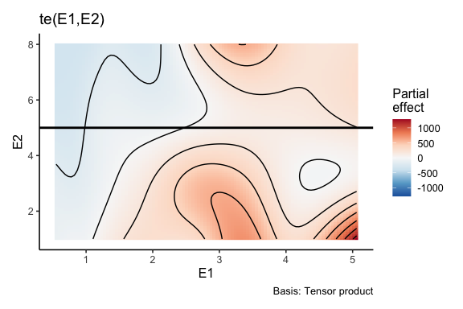
<p class="caption">(\#fig:partialderiv-empirical)Response surface of Colpidium. The two solid lines show at which level of nutrients and light each partial derivative is going to be calculated.</p>
</div>


(ref:partialeffectE1-empirical) Partial effect of nutrient concentration on the growth rate of Colpidium when light intensity is held constant at 5.

<div class="figure" style="text-align: center">

<p class="caption">(\#fig:partialeffectE1-empirical)(ref:partialeffectE1-empirical)</p>
</div>


(ref:partialE1-empirical) Partial derivative with respect to nutrient when light intensity is constant at 5.

<div class="figure" style="text-align: center">
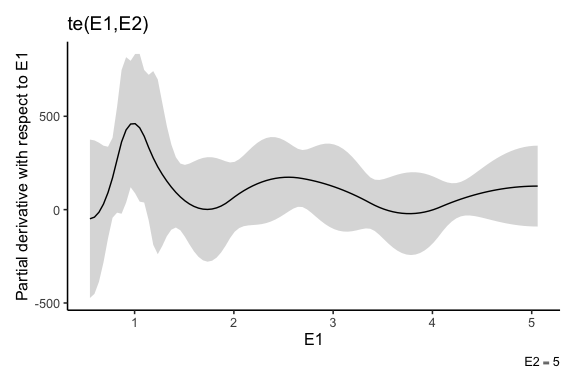
<p class="caption">(\#fig:partialE1-empirical)(ref:partialE1-empirical)</p>
</div>


## E2 - Light intensity

Second, we calculate the partial derivative with respect to light intensity keeping nutrient concentration constant at 2.67. 

(ref:partialderivE2-empirical) Response surface of Colpidium. The two solid lines show at which level of nutrients and light each partial derivative is going to be calculated. Not sure we get the gray areas...

<div class="figure" style="text-align: center">
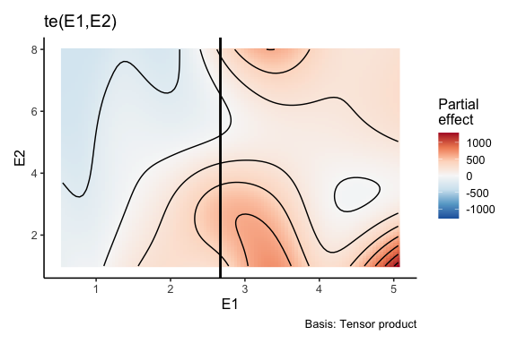
<p class="caption">(\#fig:partialderivE2-empirical)(ref:partialderivE2-empirical)</p>
</div>


(ref:partialeffectE2-empirical) Partial effect of light intensity on the growth rate of Colpidium when nutrient concentration is held constant at 2.67.

<div class="figure" style="text-align: center">
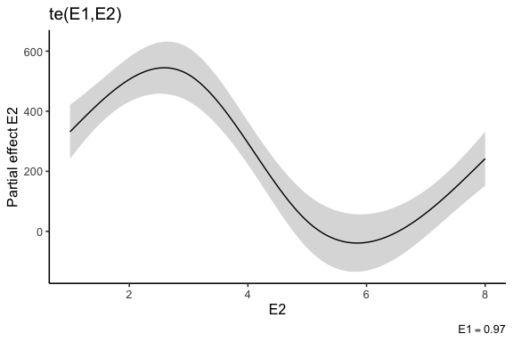
<p class="caption">(\#fig:partialeffectE2-empirical)(ref:partialeffectE2-empirical)</p>
</div>


(ref:partialE2-empirical) Partial derivative with respect to nutrient when light intensity is constant at 5.

<div class="figure" style="text-align: center">

<p class="caption">(\#fig:partialE2-empirical)(ref:partialE2-empirical)</p>
</div>

### Plot surface and partial derivatives

Plot the two partial derivatives and relative effects

(ref:summary-empirical) Summary plot of Colpidium (a) response surface of Colpidium (b) Partial effect of nutrient concentration on the density of Colpidium when light intensity is held constant at 5. (c) Partial derivative with respect to nutrient concentration when light intensity is held constant at 5. (d) Partial effect of light intensity on the growth rate of Colpidium when nutrient concentration is held constant at 2.67. (e) Partial derivative with respect to light intensity when nutrient concentration is held constant at 2.67.

<div class="figure" style="text-align: center">
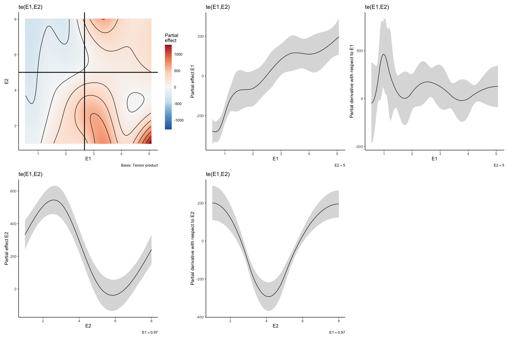
<p class="caption">(\#fig:summary-empirical)(ref:summary-empirical)</p>
</div>

# Directional deriviatives

To calculate the directional derivatives for all spp used in the experiment, we first create a time series with nutrient concentration and light intensity changing randomly over time, we fit GAMs individually for each species, and then we calculate partial derivatives.


Time series of nutrient concentration and light intensity changing over time.


<div class="figure" style="text-align: center">

<p class="caption">(\#fig:RD-empirical)Time series of (a) nutrient concentration and (b) light intensity changing over time.</p>
</div>

Table with calculated partial derivatives for each sp at different times (only first 6 rows shown).

|sp              | time| E1_ref| E2_ref|     pd_E1|      pd_E2|
|:---------------|----:|------:|------:|---------:|----------:|
|Loxocephalus_sp |    1|   4.41|   2.34| -697.5280| -3111.3121|
|Loxocephalus_sp |    2|   1.15|   3.44| 1404.3671|  -280.5791|
|Loxocephalus_sp |    3|   2.91|   3.08|  149.0230| -1170.1751|
|Loxocephalus_sp |    4|   0.61|   1.48| 3098.1877|  -390.3620|
|Loxocephalus_sp |    5|   4.65|   4.04|  231.7739|  1889.1895|
|Loxocephalus_sp |    6|   4.85|   3.94|  121.2058|  1987.8819|


## Calculating response diversity for a specific community composition 

First, we need to calculate the directional derivatives in the direction of the env change. 


|sp              | time| E1_ref| E2_ref|     pd_E1|      pd_E2| nxt_value_E1| nxt_value_E2| del_E1| del_E2| unit_vec_mag|      uv_E1|      uv_E2| dir_deriv|
|:---------------|----:|------:|------:|---------:|----------:|------------:|------------:|------:|------:|------------:|----------:|----------:|---------:|
|Loxocephalus_sp |    1|   4.41|   2.34| -697.5280| -3111.3121|         1.15|         3.44|  -3.26|   1.10|    3.4405813| -0.9475143|  0.3197134| -333.8104|
|Loxocephalus_sp |    2|   1.15|   3.44| 1404.3671|  -280.5791|         2.91|         3.08|   1.76|  -0.36|    1.7964409|  0.9797149| -0.2003962| 1432.1064|
|Loxocephalus_sp |    3|   2.91|   3.08|  149.0230| -1170.1751|         0.61|         1.48|  -2.30|  -1.60|    2.8017851| -0.8209052| -0.5710645|  545.9117|
|Loxocephalus_sp |    4|   0.61|   1.48| 3098.1877|  -390.3620|         4.65|         4.04|   4.04|   2.56|    4.7828025|  0.8446930|  0.5352510| 2408.0759|
|Loxocephalus_sp |    5|   4.65|   4.04|  231.7739|  1889.1895|         4.85|         3.94|   0.20|  -0.10|    0.2236068|  0.8944272| -0.4472136| -637.5663|
|Loxocephalus_sp |    6|   4.85|   3.94|  121.2058|  1987.8819|         1.07|         6.88|  -3.78|   2.94|    4.7887368| -0.7893522|  0.6139406| 1124.7674|

Then we can calculate response diversity for an hypothetical community containing all the species tested i this experiment.


| time| E1_ref| E2_ref|  Coleps_sp| Colpidium_striatum| Euplotes_daidaleos| Loxocephalus_sp| Paramecium_bursaria| Paramecium_caudatum| Stylonychia_sp|     rdiv|      sign|      Med|
|----:|------:|------:|----------:|------------------:|------------------:|---------------:|-------------------:|-------------------:|--------------:|--------:|---------:|--------:|
|    1|   4.41|   2.34| -55.108269|        -223.002238|         -1.4385086|       -333.8104|          -407.08776|          -260.61916|     -575.88740| 6.000000| 0.0000000| 5.999963|
|    2|   1.15|   3.44|  99.105500|         345.818087|          0.6358374|       1432.1064|            71.03804|            87.73018|      417.73480| 5.999977| 0.0000000| 5.999963|
|    3|   2.91|   3.08| -18.328360|          83.663318|          0.5803385|        545.9117|          -480.69137|          -356.04984|     -584.25370| 6.000000| 0.9364698| 5.999963|
|    4|   0.61|   1.48|  -2.881237|          72.478259|          1.0491311|       2408.0759|            89.69434|           170.09649|      364.83280| 5.961483| 0.0023901| 5.999963|
|    5|   4.65|   4.04|  33.085863|          -2.674661|          1.5920987|       -637.5663|           332.75175|          -166.67661|      172.95218| 5.972334| 0.6858612| 5.999963|
|    6|   4.85|   3.94| -19.560641|         -14.883016|         -2.2036581|       1124.7674|          -269.21168|           258.81023|      -39.92325| 5.981563| 0.3862492| 5.999963|


Plot response diversity over time

<div class="figure" style="text-align: center">

<p class="caption">(\#fig:RDempiricalplot)Directional derivatives and response diversity with known direction of env change. a. Species directional derivatives over time. b. Response diversity measured as similarity-based diversity metric. c. Response diversity measured as divergence (sign sensitive). </p>
</div>


## Different community compositions
Now we calculate response diversity for three different community compositions we assembled randomly and we compare them. 


Plotting


<div class="figure" style="text-align: center">

<p class="caption">(\#fig:RD-compositions)Directional derivatives and response diversity with known direction of env change for three different communities. a. Species directional derivatives over time. b. Response diversity measured as similarity-based diversity metric. c. Response diversity measured as divergence (sign sensitive).</p>
</div>


